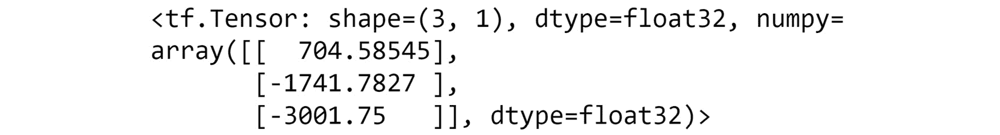

# 第一章：1\. 使用 TensorFlow 进行机器学习介绍

概述

在本章中，你将学习如何创建、利用和应用线性变换到 TensorFlow 编程的基本构建块——张量。然后，你将利用张量来理解与神经网络相关的复杂概念，包括张量重塑、转置和乘法。

# 介绍

**机器学习**（**ML**）已经渗透到许多人未曾察觉的日常生活的各个方面。从日常社交媒体推荐到在线搜索结果，它们都由机器学习算法驱动。这些算法最初在研究环境中解决特定问题，但随着其可访问性不断扩展，它们的应用场景也变得越来越广泛。各类研究人员和企业都认识到，使用模型来优化各自运营的每个环节具有重要价值。医生可以使用机器学习来决定诊断和治疗方案，零售商可以利用 ML 在合适的时间将合适的产品送到店铺，而娱乐公司可以使用 ML 向客户提供个性化的推荐。

在数据时代，机器学习模型已被证明是任何数据驱动型公司的宝贵资产。海量数据使得可以创建强大且准确的模型来完成各种任务，从回归到分类，从推荐到时间序列分析，甚至是生成艺术，这些内容将在本次研讨会中介绍。所有这些任务都可以通过 TensorFlow 构建、训练和部署。

TensorFlow API 拥有大量功能，使其在所有构建机器学习模型或处理张量（多维数值数组）的机器学习从业者中广受欢迎。对于研究人员来说，TensorFlow 是创建新机器学习应用的合适选择，因为它提供了高度的定制和灵活性。对于开发者而言，TensorFlow 是一个优秀的机器学习库选择，因为它在模型从开发到生产环境的部署方面非常方便。综合来看，TensorFlow 的灵活性和易于部署使得它成为许多从业者的智能选择，他们希望使用各种数据源构建高效的机器学习模型，并在生产环境中复制这些学习成果。

本章提供了 TensorFlow API 的实用介绍。你将学习如何执行与机器学习相关的数学操作，这些操作将为你使用 TensorFlow 构建高效 ML 模型奠定坚实的基础。你将首先学习基本操作，例如如何使用 API 创建变量。接下来，你将学习如何执行线性变换，如加法，然后再深入到更高级的任务，包括张量乘法。

# 在 TensorFlow 中实现人工神经网络

TensorFlow 提供的高级灵活性非常适合构建**人工神经网络**（**ANNs**）。ANNs 是受到大脑神经元连接启发的算法，旨在复制人类学习的过程。它们由多个层组成，信息通过这些层从输入传播到输出。

*图 1.1* 展示了一个人工神经网络（ANN）的可视化表示。输入层位于左侧，在这个示例中，输入层有两个特征（`X`1 和 `X`2）。输入层与第一个隐藏层连接，后者有三个单元。来自前一层的所有数据会传递给第一个隐藏层的每个单元。然后，数据被传递到第二个隐藏层，第二个隐藏层同样有三个单元。再次地，来自上一层每个单元的信息会传递给第二个隐藏层的每个单元。最后，所有来自第二个隐藏层的信息都会传递到输出层，输出层有一个单元，表示每组输入特征的单个数字。


图 1.1：一个具有两个隐藏层的人工神经网络（ANN）的可视化表示

ANNs 已被证明能够成功学习具有复杂和非线性关系的大规模非结构化数据集，如音频、图像和文本数据。尽管结果可能令人印象深刻，但 ANNs 的配置存在很大的可变性。例如，层数、每层的大小以及应该使用哪种非线性函数是决定 ANNs 配置的一些因素。TensorFlow 提供的类和函数不仅非常适合构建和训练 ANNs，此外，该库还提供了一套工具，帮助在训练过程中可视化和调试 ANNs。

与传统的机器学习算法（如线性回归和逻辑回归）相比，人工神经网络（ANNs）在数据量较大的情况下能够超越这些算法。ANNs 的优势在于它们能够处理非结构化数据，并且不一定需要特征工程。数据预处理可能是一个耗时的过程。因此，如果数据量较大，许多实践者更倾向于选择 ANNs。

来自各行各业的许多公司都利用 TensorFlow 构建人工神经网络（ANN）用于他们的应用。由于 TensorFlow 得到了 Google 的支持，该公司将该库应用于大部分机器学习应用的研究、开发和生产。然而，许多其他公司也使用该库。像 Airbnb、可口可乐、Uber 和 GE Healthcare 等公司，都在进行各种任务时使用该库。人工神经网络的使用尤其具有吸引力，因为只要提供足够的数据并进行适当训练，它们就能实现显著的准确性。例如，GE Healthcare 使用 TensorFlow 构建 ANN，从磁共振图像中识别特定的解剖结构，不论其朝向如何，以提高速度和准确性。通过使用 ANN，他们能够在几秒钟内识别出解剖结构，准确率超过 99%，无论头部如何旋转，而这在没有 ANN 的情况下需要经过训练的专业人员花费更多时间才能完成。

尽管许多公司都在使用人工神经网络，但 ANN 可能不是解决所有业务问题的最佳选择。在这种环境下，你需要回答以下问题，以确定 ANN 是否是最合适的选择：

+   **问题是否有数值解决方案？** 包括人工神经网络（ANN）在内的机器学习算法，基于输入数据生成预测的数值结果。例如，机器学习算法可能会预测一个给定的数字，如根据城市的位置和先前的天气条件预测温度，或者根据先前的股票价格预测股价，或者将图像分类为某个给定的类别。在这些例子中，基于提供的数据生成数值输出，并且只要有足够的标注数据，模型就能表现得很好。然而，当期望的结果更为抽象，或需要创意时，比如创作一首新歌，那么机器学习算法可能不是最合适的选择，因为可能没有明确的数值解决方案可供参考。

+   **是否有足够的合适标注数据来训练模型？** 对于监督学习任务，你必须至少拥有一些标注数据来训练模型。例如，如果你想构建一个模型来预测某个公司的金融股票数据，你首先需要历史训练数据。如果该公司尚未上市很长时间，可能就没有足够的训练数据。人工神经网络通常需要大量的数据。当处理图像时，ANN 通常需要数百万个训练样本来开发出准确且稳健的模型。这可能是决定哪个算法适合给定任务的一个关键因素。

既然你已经了解了什么是 TensorFlow，那么请考虑以下 TensorFlow 的优缺点。

## TensorFlow 的优点

以下是许多从业者在决定是否使用 TensorFlow 进行机器学习时所考虑的几个主要优点：

+   **库管理**：TensorFlow 库有一个庞大的开发者社区，他们不断更新库，发布新版本以修复 bug，增加新的函数和类，以反映当前领域的进展，并支持多种编程语言。

+   **流水线**：TensorFlow 支持端到端的模型生产，从在支持 GPU 处理的高并行环境中开发模型，到一整套模型部署工具。此外，TensorFlow 还有轻量级的库，用于将训练好的 TensorFlow 模型部署到移动设备和嵌入式设备上，例如**物联网**（**IoT**）设备。

+   **社区支持**：使用并支持该库的开发者社区庞大，他们互相支持，正因如此，初学者能轻松地获得他们想要的结果。

+   **开源**：TensorFlow 是一个开源库，其代码库对任何人开放，允许用户根据自己的需求使用和修改。

+   **支持多种语言**：虽然该库本身是为 Python 设计的，但现在也可以在 JavaScript 中训练和部署模型。

## TensorFlow 的缺点

以下是使用 TensorFlow 的一些缺点：

+   **计算速度**：由于 TensorFlow 的主要编程语言是 Python，因此它的计算速度不如其他语言（如 C++）的原生实现。

+   **陡峭的学习曲线**：与其他机器学习库（如 Keras）相比，TensorFlow 的学习曲线较为陡峭，这可能会使得新手在没有现成示例代码的情况下，创建自己的模型变得具有挑战性。

现在你已经了解了 TensorFlow 是什么，接下来的部分将演示如何使用 Python 来操作 TensorFlow 库。

# Python 中的 TensorFlow 库

你可以通过导入特定的库在 Python 中使用 TensorFlow。你可以使用`import`语句在 Python 中导入库：

```py
import tensorflow as tf
```

在之前的命令中，你已导入了 TensorFlow 库并使用了简写`tf`。

在接下来的练习中，你将学习如何导入 TensorFlow 库并检查其版本，以便你能够利用库提供的类和函数，这是使用该库时非常重要和必要的第一步。

## 练习 1.01：验证你的 TensorFlow 版本

在这个练习中，你将加载 TensorFlow 并检查系统中安装的版本。

执行以下步骤：

1.  打开一个 Jupyter 笔记本来实现这个练习，在终端中输入`jupyter notebook`。

1.  通过在 Jupyter 单元格中输入以下代码来导入 TensorFlow 库：

    ```py
    import tensorflow as tf
    ```

1.  使用以下命令验证 TensorFlow 的版本：

    ```py
    tf.__version__
    ```

    这将产生以下输出：

    ```py
    '2.6.0'
    ```

    从之前的输出中可以看到，TensorFlow 的版本是`2.6.0`。

    注意

    如果你没有按照*前言*中的步骤设置环境，版本可能会在你的系统上有所不同。

在这个练习中，你成功导入了 TensorFlow。你还检查了系统上安装的 TensorFlow 版本。

这个任务可以在 Python 中对任何导入的库执行，并且对于调试和参考文档非常有用。

使用 TensorFlow 的潜在应用非常广泛，它已经取得了令人印象深刻的成果，像 Airbnb 这样的公司利用 TensorFlow 对平台上的图像进行分类，GE Healthcare 则使用 TensorFlow 在大脑的 MRI 图像中识别解剖结构。要学习如何为自己的应用创建强大的模型，你首先需要学习构成 TensorFlow 中可实现的机器学习模型的基本数学原理和运算。数学运算可能会让新用户感到畏惧，但对它们的全面理解是构建高效模型的关键。

# 张量简介

张量可以被看作是人工神经网络（ANNs）的核心组件——输入数据、输出预测以及在训练过程中学习到的权重都是张量。信息通过一系列线性和非线性变换传播，将输入数据转化为预测结果。本节展示了如何对张量应用线性变换，如加法、转置和乘法。其他线性变换，如旋转、反射和剪切，也存在。然而，它们在人工神经网络中的应用较为少见。

## 标量、向量、矩阵和张量

张量可以表示为多维数组。张量所跨越的维度数量称为张量的阶数。阶数为`0`、`1`和`2`的张量常常使用，并且各自有独立的名称，分别是**标量**、**向量**和**矩阵**，尽管术语*张量*可以用来描述它们中的任何一个。*图 1.2*展示了不同阶张量的一些示例。从左到右分别是标量、向量、矩阵和一个三维张量，每个元素表示一个不同的数字，下标表示该元素在张量中的位置：


图 1.2：标量、向量、矩阵和张量的可视化表示

标量、向量、矩阵和张量的正式定义如下：

+   **标量**：标量由一个单一的数字组成，因此它是一个零维数组，是零阶张量的例子。标量没有任何轴。例如，物体的宽度就是一个标量。

+   **向量**：向量是一维数组，是一阶张量的例子。它们可以被看作是值的列表。向量有一个轴。给定物体的宽度、高度和深度的大小是一个向量场的例子。

+   **矩阵**：矩阵是具有两个轴的二维数组，是二阶张量的一个例子。矩阵可能用于存储多个对象的大小。矩阵的每个维度包含每个对象的大小（宽度、高度、深度），另一个矩阵维度则用于区分对象。

+   `3`或更多。张量可以用来存储多个对象的大小及其随时间变化的位置。矩阵的第一维包含每个对象的大小（宽度、高度、深度），第二维用于区分不同的对象，第三维描述这些对象随时间变化的位置。

张量可以使用 TensorFlow 库中的`Variable`类来创建，并传入一个表示张量的值。标量可以传入浮动值或整数，向量可以传入浮动值或整数的列表，矩阵可以传入浮动值或整数的嵌套列表，依此类推。以下命令演示了如何使用`Variable`类，其中传入了张量的预期值列表以及任何需要显式定义的其他属性：

```py
tensor1 = tf.Variable([1,2,3], dtype=tf.int32, \
                      name='my_tensor', trainable=True)
```

结果`Variable`对象具有几个常用的属性，具体如下：

+   `dtype`：`Variable`对象的数据类型（对于上面定义的张量，数据类型是`tf.int32`）。该属性的默认值由传入的值决定。

+   `shape`：`Variable`对象的维度数和每个维度的长度（对于上面定义的张量，形状是`[3]`）。该属性的默认值也由传入的值决定。

+   `name`：`Variable`对象的名称（对于上面定义的张量，张量的名称定义为`'my_tensor'`）。该属性的默认值为`Variable`。

+   `trainable`：该属性指示`Variable`对象是否可以在模型训练过程中更新（对于上面定义的张量，`trainable`参数设置为`true`）。该属性的默认值是`true`。

    注意

    你可以在这里阅读更多关于`Variable`对象属性的内容：[`www.tensorflow.org/api_docs/python/tf/Variable`](https://www.tensorflow.org/api_docs/python/tf/Variable)。

`Variable`对象的`shape`属性可以按如下方式调用：

```py
tensor1.shape
```

`shape`属性给出了张量的形状，即它是标量、向量、矩阵等。前面命令的输出将是`[3]`，因为该张量只有一个维度，且该维度上有三个值。

可以使用 TensorFlow 中的`rank`函数来确定张量的阶数。通过将张量作为唯一的参数传递给该函数，结果将是一个整数值：

```py
tf.rank(tensor1)
```

以下命令的输出将是一个零维整数张量，表示输入张量的阶数。在此情况下，`tensor1`的阶数为`1`，因为该张量只有一个维度。

在以下练习中，您将学习如何使用 TensorFlow 的 `Variable` 类创建各种秩的张量。

## 练习 1.02：在 TensorFlow 中创建标量、向量、矩阵和张量

三个不同政党在 A 和 B 两个选区的不同候选人所获得的选票如下：


在 A 和 B 两个选区的各个政党的候选人选票分布](img/B16341_01_03.jpg)

图 1.3：三种不同政党在 A、B 两个选区的不同候选人获得的选票数

您需要执行以下操作：

+   创建一个标量来存储选区 A 中 `X` 政党 `候选人 1` 的选票数，即 `4113`，并检查其形状和秩。

+   创建一个向量来表示 `X` 政党在 A 选区中三名候选人所获得选票的比例，并检查其形状和秩。

+   创建一个矩阵来表示 `X` 和 `Y` 政党在三个不同候选人中的选票，并检查其形状和秩。

+   创建一个张量来表示三名候选人在两个不同选区、三种不同政党中的选票，并检查其形状和秩。

执行以下步骤以完成本练习：

1.  导入 TensorFlow 库：

    ```py
    import tensorflow as tf
    ```

1.  使用 TensorFlow 的 `Variable` 类创建一个整数变量，并传入 `4113` 来表示某个候选人获得的选票数。同时，传入 `tf.int16` 作为第二个参数，以确保输入的数字是整数数据类型。打印结果：

    ```py
    int_variable = tf.Variable(4113, tf.int16)
    int_variable
    ```

    这将产生以下输出：

    ```py
    <tf.Variable 'Variable:0' shape=() dtype=int32, numpy=4113>
    ```

    在这里，您可以看到所创建变量的属性，包括名称 `Variable:0`、形状、数据类型以及张量的 NumPy 表示。

1.  使用 TensorFlow 的 `rank` 函数打印创建的变量的秩：

    ```py
    tf.rank(int_variable)
    ```

    这将产生以下输出：

    ```py
    <tf.Tensor: shape=(), dtype=int32, numpy=0>
    ```

    从 NumPy 对张量的表示中可以看到，创建的整数变量的秩是 `0`。

1.  通过调用 `numpy` 属性访问秩的整数变量：

    ```py
    tf.rank(int_variable).numpy()
    ```

    这将产生以下输出：

    ```py
    0
    ```

    标量的秩是 `0`。

    注意

    `rank` 函数的所有属性都可以被调用，包括 `shape` 和 `dtype` 属性。

1.  调用整数的 `shape` 属性以查看张量的形状：

    ```py
    int_variable.shape
    ```

    这将产生以下输出：

    ```py
    TensorShape([])
    ```

    上面的输出表明张量的形状没有大小，代表它是一个标量。

1.  打印标量变量的 `shape`，以 Python 列表的形式表示：

    ```py
    int_variable.shape.as_list()
    ```

    这将产生以下输出：

    ```py
    []
    ```

1.  使用 TensorFlow 的 `Variable` 类创建一个 `vector` 变量。传入一个列表来表示三名候选人所获得选票的比例，并传入第二个参数 `tf.float32` 以确保它是一个 `float` 数据类型。打印结果：

    ```py
    vector_variable = tf.Variable([0.23, 0.42, 0.35], \
                                  tf.float32)
    vector_variable
    ```

    这将产生以下输出：

    ```py
    <tf.Variable 'Variable:0' shape(3,) dtype=float32, 
    numpy=array([0.23, 0.42, 0.35], dtype=float32)>
    ```

    您可以看到，形状和 NumPy 属性与之前创建的标量变量不同。现在的形状是 `(3,)`，表示张量是一个一维的，沿该维度有三个元素。

1.  使用 TensorFlow 的 `rank` 函数打印 `vector` 变量的秩，作为 NumPy 变量：

    ```py
    tf.rank(vector_variable).numpy()
    ```

    这将产生以下输出：

    ```py
    1
    ```

    在这里，您可以看到，向量变量的秩为 `1`，确认该变量是一维的。

1.  打印 `vector` 变量的形状作为 Python 列表：

    ```py
    vector_variable.shape.as_list()
    ```

    这将产生以下输出：

    ```py
    [3]
    ```

1.  使用 TensorFlow 的 `Variable` 类创建一个矩阵变量。传入一个整数的列表列表，表示在两个不同选区中，三个不同候选人的投票结果。该矩阵将有三列，表示候选人，和两行，表示选区。传入第二个参数，数据类型为 `tf.int32`，以确保其为整数数据类型。打印结果：

    ```py
    matrix_variable = tf.Variable([[4113, 7511, 6259], \
                                   [3870, 6725, 6962]], \
                                  tf.int32)
    matrix_variable
    ```

    这将产生以下输出：

    

    图 1.4：TensorFlow 变量的输出

1.  打印矩阵变量的秩作为 NumPy 变量：

    ```py
    tf.rank(matrix_variable).numpy()
    ```

    这将产生以下输出：

    ```py
    2
    ```

    在这里，您可以看到矩阵变量的秩为`2`，确认该变量是二维的。

1.  打印矩阵变量的形状作为 Python 列表：

    ```py
    matrix_variable.shape.as_list()
    ```

    这将产生以下输出：

    ```py
    [2, 3]
    ```

1.  使用 TensorFlow 的 `Variable` 类创建一个张量变量。传入一个三重嵌套的整数列表，表示三个不同候选人在两个不同选区、三个政党中的投票结果。打印结果：

    ```py
    tensor_variable = tf.Variable([[[4113, 7511, 6259], \
                                    [3870, 6725, 6962]], \
                                   [[5102, 7038, 6591], \
                                    [3661, 5901, 6235]], \
                                   [[951, 1208, 1098], \
                                    [870, 645, 948]]])
    tensor_variable
    ```

    这将产生以下输出：

    

    图 1.5：TensorFlow 变量的输出

1.  打印张量变量的秩作为 NumPy 变量：

    ```py
    tf.rank(tensor_variable).numpy()
    ```

    这将产生以下输出：

    ```py
    3
    ```

    在这里，您可以看到，张量变量的秩为 `3`，确认该变量是三维的。

1.  打印张量变量的形状作为 Python 列表：

    ```py
    tensor_variable.shape.as_list()
    ```

    这将产生以下输出：

    ```py
    [3, 2, 3]
    ```

    结果显示，生成的张量的形状是一个列表对象。

在这个练习中，您已经成功地使用 TensorFlow 的 `Variable` 类从政治投票数据中创建了各种秩的张量。首先，您创建了标量，这是秩为 `0` 的张量。接下来，您创建了向量，这是秩为 `1` 的张量。然后，创建了矩阵，这是秩为 `2` 的张量。最后，创建了秩为 `3` 或更高的张量。您通过使用 TensorFlow 的 `rank` 函数确认了所创建的张量的秩，并通过调用张量的 `shape` 属性验证了它们的形状。

在下一部分，您将结合张量，通过张量加法创建新张量。

# 张量加法

张量可以相加以创建新的张量。在本章中，你将使用矩阵的例子，但这一概念可以扩展到任何秩的张量。矩阵在特定条件下可以与标量、向量和其他矩阵相加，这个过程被称为广播。广播是指对不同形状的张量进行数组算术运算的过程。

如果两个矩阵形状相同，则可以将它们相加（或相减）。对于这种矩阵-矩阵加法，结果矩阵由输入矩阵逐元素相加得到。因此，结果矩阵的形状与两个输入矩阵相同。你可以定义矩阵`Z = [Z_ij]`为矩阵和`Z = X + Y`，其中`z_ij = x_ij + y_ij`，并且`Z`中的每个元素是`X`和`Y`中相同位置元素的和。

矩阵加法是交换律的，这意味着`X`和`Y`的顺序无关，即`X + Y = Y + X`。矩阵加法也是结合律的，这意味着即使加法顺序不同，或者即使运算应用多次，结果也相同，即`X + (Y + Z) = (X + Y) + Z`。

相同的矩阵加法原则适用于标量、向量和张量。以下图为例：


图 1.6：矩阵-矩阵加法的视觉示例

标量也可以与矩阵相加。在这里，矩阵的每个元素都与标量逐个相加，如*图 1.7*所示：


图 1.7：矩阵-标量加法的视觉示例

加法是一个重要的变换，因其在张量中应用非常频繁。例如，在开发人工神经网络（ANN）时，一个常见的变换是为层添加偏置。这是将与 ANN 层大小相同的常量张量数组加到该层上。因此，了解如何以及何时应用这个看似简单的变换是很重要的。

张量加法可以通过使用`add`函数并传递张量作为参数来在 TensorFlow 中执行，或者简单地使用`+`运算符，如下所示：

```py
tensor1 = tf.Variable([1,2,3])
tensor2 = tf.Variable([4,5,6])
tensor_add1 = tf.add(tensor1, tensor2)
tensor_add2 = tensor1 + tensor2
```

在以下练习中，你将执行 TensorFlow 中标量、向量和矩阵的张量加法。

## 练习 1.03：在 TensorFlow 中执行张量加法

A 区和 B 区三种不同政治党派不同候选人投票数如下：


图 1.8：A 区和 B 区三种不同政治党派不同候选人投票数

你的任务如下：

+   存储 A 区政治党派 X 获得的总票数。

+   存储 A 区每个政党获得的总票数。

+   存储两个选区中每个政党所投的总票数。

执行以下步骤完成本次练习：

1.  导入 TensorFlow 库：

    ```py
    import tensorflow as tf
    ```

1.  使用 TensorFlow 的 `Variable` 类创建三个标量变量，表示在选区 A 中政党 X 的三位候选人所投的票数：

    ```py
    int1 = tf.Variable(4113, tf.int32)
    int2 = tf.Variable(7511, tf.int32)
    int3 = tf.Variable(6529, tf.int32)
    ```

1.  创建一个新变量，用来存储政党 X 在选区 A 中的总票数：

    ```py
    int_sum = int1+int2+int3
    ```

1.  打印两个变量之和作为 NumPy 变量的结果：

    ```py
    int_sum.numpy()
    ```

    这将产生以下输出：

    ```py
    18153
    ```

1.  创建三个向量，表示在选区 A 中不同政党的投票数量，每个向量有一行三列：

    ```py
    vec1 = tf.Variable([4113, 3870, 5102], tf.int32)
    vec2 = tf.Variable([7511, 6725, 7038], tf.int32)
    vec3 = tf.Variable([6529, 6962, 6591], tf.int32)
    ```

1.  创建一个新变量，用来存储每个政党在选区 A 中的总票数：

    ```py
    vec_sum = vec1 + vec2 + vec3
    ```

1.  打印两个变量之和作为 NumPy 数组的结果：

    ```py
    vec_sum.numpy()
    ```

    这将产生以下输出：

    ```py
    array([18153, 17557, 18731])
    ```

1.  通过执行对向量中每个元素的加法，验证向量加法是否符合预期：

    ```py
    print((vec1[0] + vec2[0] + vec3[0]).numpy())
    print((vec1[1] + vec2[1] + vec3[1]).numpy())
    print((vec1[2] + vec2[2] + vec3[2]).numpy())
    ```

    这将产生以下输出：

    ```py
    18153
    17557
    18731
    ```

    你可以看到，三个向量上的`+`操作仅仅是向量的逐元素加法。

1.  创建三个矩阵，用来存储每个选区中各政党的候选人所投的票数：

    ```py
    matrix1 = tf.Variable([[4113, 3870, 5102], \
                           [3611, 951, 870]], tf.int32)
    matrix2 = tf.Variable([[7511, 6725, 7038], \
                           [5901, 1208, 645]], tf.int32)
    matrix3 = tf.Variable([[6529, 6962, 6591], \
                           [6235, 1098, 948]], tf.int32)
    ```

1.  验证这三个张量是否具有相同的形状：

    ```py
    matrix1.shape == matrix2.shape == matrix3.shape
    ```

    这将产生以下输出：

    ```py
    True
    ```

1.  创建一个新变量，用来存储两个选区中每个政党所投的总票数：

    ```py
    matrix_sum = matrix1 + matrix2 + matrix3
    ```

1.  打印两个变量之和作为 NumPy 数组的结果：

    ```py
    matrix_sum.numpy()
    ```

    这将产生以下输出，表示每个选区中每个候选人和每个政党的总票数：

    

    图 1.9：作为 NumPy 变量的矩阵求和输出

1.  通过执行对向量中每个元素的加法，验证张量加法是否符合预期：

    ```py
    print((matrix1[0][0] + matrix2[0][0] + matrix3[0][0]).numpy())
    print((matrix1[0][1] + matrix2[0][1] + matrix3[0][1]).numpy())
    print((matrix1[0][2] + matrix2[0][2] + matrix3[0][2]).numpy())
    print((matrix1[1][0] + matrix2[1][0] + matrix3[1][0]).numpy())
    print((matrix1[1][1] + matrix2[1][1] + matrix3[1][1]).numpy())
    print((matrix1[1][2] + matrix2[1][2] + matrix3[1][2]).numpy())
    ```

    这将产生以下输出：

    ```py
    18153
    17557
    18731
    15747
    3257
    2463
    ```

    你可以看到，`+` 操作等同于对创建的三个矩阵进行逐元素加法。

在本次练习中，你成功地对代表政治候选人选票的数据进行了张量加法。这个转换可以通过使用`+`操作来实现。你还验证了加法是逐元素进行的，并且确保转换有效的一种方式是确保张量具有相同的秩和形状。

在接下来的活动中，你将进一步练习在 TensorFlow 中进行张量加法。

## 活动 1.01：在 TensorFlow 中进行张量加法

你在一家公司工作，该公司有三个地点，每个地点有两位销售人员，并且每个地点销售三种产品。你需要对张量进行求和，以表示各地点每个产品的总收入。


图 1.10：每个销售人员在不同地点销售的不同产品数量

你将采取的步骤如下：

1.  导入 TensorFlow 库。

1.  使用 TensorFlow 的 `Variable` 类，创建两个标量来表示 `Location X` 上所有销售人员的 `Product A` 总收入。第一个变量的值为 `2706`，第二个变量的值为 `2386`。

1.  创建一个新变量作为标量的和并打印结果。

    你应该得到以下输出：

    ```py
    5092
    ```

1.  使用 TensorFlow 的 `Variable` 类创建一个值为 `[2706, 2799, 5102]` 的向量和一个值为 `95` 的标量。

1.  创建一个新变量，将标量与向量相加，表示 `Salesperson 1` 在 `Location X` 的销售目标并打印结果。

    你应该得到以下输出：

    

    图 1.11：整数向量求和的输出，作为 NumPy 变量

1.  使用 TensorFlow 的 `Variable` 类创建三个秩为 2 的张量，表示每个销售人员、产品和位置的收入。第一个张量的值为 `[[2706, 2799, 5102], [2386, 4089, 5932]]`，第二个张量的值为 `[[5901, 1208, 645], [6235, 1098, 948]]`，第三个张量的值为 `[[3908, 2339, 5520], [4544, 1978, 4729]]`。

1.  创建一个新变量作为矩阵的和并打印结果：

    

图 1.12：矩阵求和的输出，作为 NumPy 变量

注意

本活动的解答可以通过此链接找到。

在接下来的章节中，你将学习如何改变张量的形状和秩。

# 形状重塑

一些操作，如加法，只有在满足特定条件时才能应用于张量。重塑是修改张量形状的一种方法，使得这些操作可以执行。重塑将张量的元素重新排列成一个不同大小的张量。只要总元素的数量保持不变，任何大小的张量都可以进行重塑。

例如，一个 `(4x3)` 矩阵可以被重塑为一个 `(6x2)` 矩阵，因为它们都有 `12` 个元素。秩，即维度的数量，也可以在重塑过程中发生变化。例如，一个秩为 `2` 的 `(4x3)` 矩阵可以被重塑为一个秩为 `3` 的 `(3x2x2)` 张量。该 `(4x3)` 矩阵也可以被重塑为一个 `(12x1)` 向量，其秩从 `2` 变为 `1`。

*图 1.13* 说明了张量的重塑。左侧是一个形状为 `(3x2)` 的张量，它可以被重塑为形状为 `(2x3)`、`(6)` 或 `(6x1)` 的张量。在这里，元素的数量，即六，保持不变，尽管张量的形状和秩发生了变化：


图 1.13：将 (3x2) 张量重塑为不同形状张量的可视化表示

张量的形状重塑可以通过 TensorFlow 的 `reshape` 函数来实现，并将张量和新张量的目标形状作为参数传入：

```py
tensor1 = tf.Variable([1,2,3,4,5,6])
tensor_reshape = tf.reshape(tensor1, shape=[3,2])
```

在这里，创建了一个新的张量，其元素与原张量相同；然而，形状是`[3,2]`，而不是`[6]`。

下一部分介绍了张量转置，这是另一种修改张量形状的方法。

## 张量转置

当一个张量被转置时，张量中的元素会按特定顺序重新排列。转置操作通常用张量上的 `T` 上标表示。张量中每个元素的新位置可以通过 `(x12…k`)`T = `xk…21`来确定。对于秩为`2`的矩阵或张量，行变为列，反之亦然。矩阵转置的示例如*图 1.14*所示。任何秩的张量都可以进行转置，且通常会导致形状的变化：


图 1.14：在 (3x2) 矩阵上的张量转置的可视化表示

下图展示了矩阵`A`和`B`的转置特性：


图 1.15：张量转置特性，其中 X 和 Y 是张量

如果一个张量的转置等于原张量，则称该张量为对称的。

张量转置可以通过 TensorFlow 的 `transpose` 函数来实现，并将张量作为唯一参数传入：

```py
tensor1 = tf.Variable([1,2,3,4,5,6])
tensor_transpose = tf.transpose(tensor1)
```

在进行张量转置时，只有一个可能的结果；然而，改变张量形状则有多个可能的结果，这取决于输出的目标形状。

在以下练习中，使用 TensorFlow 演示张量的形状重塑和转置操作。

## 练习 1.04：在 TensorFlow 中执行张量重塑和转置

在本练习中，你将学习如何使用 TensorFlow 库进行张量形状重塑和转置。

执行以下步骤：

1.  导入 TensorFlow 库，并使用 TensorFlow 的 `Variable` 类创建一个具有两行四列的矩阵：

    ```py
    import tensorflow as tf
    matrix1 = tf.Variable([[1,2,3,4], [5,6,7,8]])
    ```

1.  通过调用矩阵的`shape`属性，将矩阵作为 Python 列表来验证矩阵的形状：

    ```py
    matrix1.shape.as_list()
    ```

    这将产生以下输出：

    ```py
    [2, 4]
    ```

    你会看到矩阵的形状是`[2,4]`。

1.  使用 TensorFlow 的 `reshape` 函数，通过传入矩阵和所需的新形状，将矩阵更改为具有四行两列的矩阵：

    ```py
    reshape1 = tf.reshape(matrix1, shape=[4, 2])
    reshape1
    ```

    你应该得到以下输出：

    

    图 1.16：重塑后的矩阵

1.  通过调用 `shape` 属性并将其作为 Python 列表来验证重塑后的矩阵的形状：

    ```py
    reshape1.shape.as_list()
    ```

    这将产生以下输出：

    ```py
    [4, 2]
    ```

    在这里，你可以看到矩阵的形状已经改变为你期望的形状`[4,2]`。

1.  使用 TensorFlow 的 `reshape` 函数将矩阵转换为一行八列的矩阵。将矩阵和期望的新形状作为参数传递给 `reshape` 函数：

    ```py
    reshape2 = tf.reshape(matrix1, shape=[1, 8])
    reshape2
    ```

    你应该会得到以下输出：

    ```py
    <tf.Tensor: shape=(1, 8), dtype=int32, numpy=array([[1, 2, 3, 4, 5, 6, 7, 8]])>
    ```

1.  通过调用 `shape` 属性作为 Python 列表来验证重新塑形后的矩阵形状：

    ```py
    reshape2.shape.as_list()
    ```

    这将产生以下输出：

    ```py
    [1, 8]
    ```

    前面的输出确认了重新塑形矩阵的形状为 `[1, 8]`。

1.  使用 TensorFlow 的 `reshape` 函数将矩阵转换为八行一列的矩阵，将矩阵和期望的新形状作为参数传递给 `reshape` 函数：

    ```py
    reshape3 = tf.reshape(matrix1, shape=[8, 1])
    reshape3
    ```

    你应该会得到以下输出：

    

    图 1.17：形状为 (8, 1) 的重新塑形矩阵

1.  通过调用 `shape` 属性作为 Python 列表来验证重新塑形后的矩阵形状：

    ```py
    reshape3.shape.as_list()
    ```

    这将产生以下输出：

    ```py
    [8, 1]
    ```

    前面的输出确认了重新塑形矩阵的形状为 `[8, 1]`。

1.  使用 TensorFlow 的 `reshape` 函数将矩阵转换为大小为 `2x2x2` 的张量。将矩阵和期望的新形状作为参数传递给 reshape 函数：

    ```py
    reshape4 = tf.reshape(matrix1, shape=[2, 2, 2])
    reshape4
    ```

    你应该会得到以下输出：

    

    图 1.18：形状为 (2, 2, 2) 的重新塑形矩阵

1.  通过调用 `shape` 属性作为 Python 列表来验证重新塑形后的矩阵形状：

    ```py
    reshape4.shape.as_list()
    ```

    这将产生以下输出：

    ```py
    [2, 2, 2]
    ```

    前面的输出确认了重新塑形矩阵的形状为 `[2, 2, 2]`。

1.  使用 TensorFlow 的 `rank` 函数验证秩是否已更改，并将结果作为 NumPy 变量打印：

    ```py
    tf.rank(reshape4).numpy()
    ```

    这将产生以下输出：

    ```py
    3
    ```

1.  使用 TensorFlow 的 `transpose` 函数将大小为 `2X4` 的矩阵转换为大小为 `4x2` 的矩阵：

    ```py
    transpose1 = tf.transpose(matrix1)
    transpose1
    ```

    你应该会得到以下输出：

    

    图 1.19：转置矩阵

1.  验证 `reshape` 函数和 `transpose` 函数在应用于给定矩阵时，是否会产生不同的结果：

    ```py
    transpose1 == reshape1
    ```

    

    图 1.20：验证转置和重新塑形产生不同结果

1.  使用 TensorFlow 的 `transpose` 函数转置 *步骤 9* 中的重新塑形矩阵：

    ```py
    transpose2 = tf.transpose(reshape4)
    transpose2
    ```

    这将产生以下输出：

    

图 1.21：转置后的重新塑形张量的输出

这个结果展示了在重新塑形和转置张量后，得到的张量的形状。

在本次练习中，你已成功通过重新塑形或转置操作修改了张量的形状。你研究了在重新塑形和转置操作后，张量的形状和秩如何变化。

在接下来的活动中，你将测试如何使用 TensorFlow 重新塑形和转置张量的知识。

## 活动 1.02：在 TensorFlow 中执行张量的重塑和转置

在此活动中，你需要模拟将 24 名学校儿童分组进行课堂项目。每个重新塑形或转置后的张量的维度将表示每个小组的大小。

执行以下步骤：

1.  导入 TensorFlow 库。

1.  使用`Variable`类创建一个包含 24 个单调递增元素的单维张量，用来表示学校儿童的 ID。验证矩阵的形状。

    你应该得到以下输出：

    ```py
    [24]
    ```

1.  使用 TensorFlow 的`reshape`函数将矩阵重塑为 12 行 2 列，表示 12 对学校儿童。验证新矩阵的形状。

    你应该得到以下输出：

    ```py
    [12, 2]
    ```

1.  使用 TensorFlow 的`reshape`函数将原始矩阵重塑为`3x4x2`的形状，表示 3 组由 4 对学校儿童组成的小组。验证新张量的形状。

    你应该得到以下输出：

    ```py
    [3, 4, 2]
    ```

1.  验证新张量的秩为`3`。

1.  将*第 3 步*中创建的张量进行转置，使用 TensorFlow 的`transpose`函数表示 12 名学生的 2 组。验证新张量的形状。

    你应该得到以下输出：

    ```py
    [2, 12]
    ```

    注意

    本活动的解决方案可以通过此链接找到。

在本节中，你被介绍了一些人工神经网络（ANNs）的基本组件——张量。你还学习了张量的一些基本操作，如加法、转置和重新塑形。你通过使用 TensorFlow 库中的函数实现了这些概念。

在下一主题中，你将通过学习与人工神经网络（ANNs）相关的另一个重要变换——张量乘法，来扩展你对线性变换的理解。

# 张量乘法

张量乘法是另一个在构建和训练人工神经网络（ANNs）过程中常用的基本操作，因为信息通过网络从输入传递到结果，过程中涉及一系列加法和乘法。加法的规则简单且直观，但张量的规则则更加复杂。张量乘法不仅仅是元素之间的逐元素相乘，而是通过计算每个张量的整行/整列的点积来计算结果张量的每个元素。这一部分将解释二维张量或矩阵的乘法是如何工作的。但更高阶的张量也可以进行乘法操作。

给定矩阵 `X = [x[ij]]m x n`，和另一个矩阵 `Y = [y[ij]]n x p`，这两个矩阵的乘积是 `Z = XY = [z[ij]]m x p`，每个元素 `z[ij]` 都按元素定义如`Z[ij] = Sigma[k=1 -> n]x[ik]y[kj]`。结果矩阵的形状与矩阵乘积的外部维度相同，即第一个矩阵的行数和第二个矩阵的列数。为了使乘法有效，矩阵乘积的内部维度必须匹配，即第一个矩阵的列数和第二个矩阵的行数必须相对应。

矩阵乘法的内部和外部维度的概念显示在下图中，其中 `X` 表示第一个矩阵，`Y` 表示第二个矩阵：


Figure 1.22: 矩阵乘法中内部和外部维度的可视化表示

与矩阵加法不同，矩阵乘法不是交换的，这意味着矩阵在乘积中的顺序很重要：


Figure 1.23: 矩阵乘法是非交换的

例如，假设你有以下两个矩阵：


Figure 1.24: 两个矩阵 X 和 Y

构建乘积的一种方式是首先有矩阵 `X`，然后乘以 `Y`：


Figure 1.25: 矩阵 X 乘以 Y 的可视化表示，X•Y

这导致一个 `2x2` 的矩阵。构建乘积的另一种方式是首先有 `Y`，然后乘以 `X`：


Figure 1.26: 矩阵 Y 乘以 X 的可视化表示，Y•X

在这里你可以看到从乘积 `YX` 形成的矩阵是一个 `3x3` 的矩阵，与从乘积 `XY` 形成的矩阵非常不同。

在 TensorFlow 中，可以通过使用 `matmul` 函数执行张量乘法，并按照它们需要被乘的顺序将张量作为参数传递进去：

```py
tensor1 = tf.Variable([[1,2,3]])
tensor2 = tf.Variable([[1],[2],[3]])
tensor_mult = tf.matmul(tensor1, tensor2)
```

张量乘法也可以通过使用 `@` 运算符来实现，如下所示：

```py
tensor_mult = tensor1 @ tensor2
```

标量-张量乘法要简单得多，只是张量中每个元素乘以标量，因此 `λX = [λx`ij…k`]`，其中 `λ` 是标量，`X` 是张量。

在 TensorFlow 中，可以通过使用 `matmul` 函数或使用 `*` 运算符来实现标量乘法：

```py
tensor1 = tf.Variable([[1,2,3]])
scalar_mult = 5 * tensor1
```

在下面的练习中，您将使用 TensorFlow 库执行张量乘法。

## 练习 1.05：在 TensorFlow 中执行张量乘法

在本练习中，你将使用 TensorFlow 的 `matmul` 函数和 `@` 运算符执行张量乘法。本练习将以三明治零售商的数据为例，表示不同三明治的配料及配料的成本。你将使用矩阵乘法来确定每个三明治的成本。

**三明治食谱**：


图 1.27：三明治食谱

**配料详情**：


图 1.28：配料详情

**销售预测**：


图 1.29：销售预测

执行以下步骤：

1.  导入 TensorFlow 库：

    ```py
    import tensorflow as tf
    ```

1.  创建一个矩阵表示不同的三明治食谱，行代表三种不同的三明治种类，列代表五种不同配料的组合和数量，使用`Variable`类：

    ```py
    matrix1 = tf.Variable([[1.0,0.0,3.0,1.0,2.0], \
                           [0.0,1.0,1.0,1.0,1.0], \
                           [2.0,1.0,0.0,2.0,0.0]], \
                          tf.float32)
    matrix1
    ```

    你应该得到以下输出：

    

    图 1.30：表示制作三明治所需配料数量的矩阵

1.  通过调用矩阵的`shape`属性作为 Python 列表，验证矩阵的形状：

    ```py
    matrix1.shape.as_list()
    ```

    这将产生以下输出：

    ```py
    [3, 5]
    ```

1.  创建一个第二个矩阵，表示每种配料的成本和重量，其中行代表五种配料，列代表配料的成本和重量（单位：克）：

    ```py
    matrix2 = tf.Variable([[0.49, 103], \
                           [0.18, 38], \
                           [0.24, 69], \
                           [1.02, 75], \
                           [0.68, 78]])
    matrix2
    ```

    你应该得到以下结果：

    

    图 1.31：表示每种配料的成本和重量的矩阵

1.  使用 TensorFlow 的`matmul`函数执行`matrix1`和`matrix2`的矩阵乘法：

    ```py
    matmul1 = tf.matmul(matrix1, matrix2)
    matmul1
    ```

    这将产生以下输出：

    

    图 1.32：矩阵乘法的输出

1.  创建一个矩阵来表示五家不同商店对三种三明治的销售预测：

    ```py
    matrix3 = tf.Variable([[120.0, 100.0, 90.0], \
                           [30.0, 15.0, 20.0], \
                           [220.0, 240.0, 185.0], \
                           [145.0, 160.0, 155.0], \
                           [330.0, 295.0, 290.0]])
    ```

1.  将`matrix3`与`matrix1`和`matrix2`相乘的结果相乘，以给出每家五家商店的预期成本和重量：

    ```py
    matmul3 = matrix3 @ matmul1
    matmul3
    ```

    这将产生以下输出：

    

图 1.33：矩阵乘法的输出

乘法得到的张量显示了每家商店三明治的预期成本以及总配料的预期重量。

在本练习中，你已经成功学会了如何使用几个操作符在 TensorFlow 中进行矩阵乘法。你使用了 TensorFlow 的`matmul`函数以及简写符号`@`操作符。它们都能执行乘法操作；不过，`matmul`函数有多个不同的参数，可以传入，使其更加灵活。

注意

你可以在这里阅读更多关于`matmul`函数的内容：[`www.tensorflow.org/api_docs/python/tf/linalg/matmul`](https://www.tensorflow.org/api_docs/python/tf/linalg/matmul)。

在下一节中，你将探索一些与 ANN 相关的其他数学概念。你将探索前向传播和反向传播，以及激活函数。

# 优化

在本节中，你将学习一些对于训练机器学习模型至关重要的优化方法。优化是通过更新 ANN 各层的权重，使得 ANN 预测值与训练数据的真实值之间的误差最小化的过程。

## 前向传播

前向传播是信息在人工神经网络（ANN）中传播的过程。在网络的每一层都会发生一系列张量乘法和加法操作，直到最终输出。前向传播在*图 1.37*中进行了说明，展示了一个单隐层的 ANN。输入数据有两个特征，而输出层对每个输入记录只有一个值。

隐藏层和输出层的权重和偏差显示为具有适当索引的矩阵和向量。对于隐藏层，权重矩阵的行数等于输入特征的数量，列数等于隐藏层单元的数量。因此，`W1`有两行三列，因为输入`X`有两个特征。同样，`W2`有三行一列，隐藏层有三个单元，输出层的大小为一。然而，偏差始终是一个大小等于该层节点数量的向量，并与输入和权重矩阵的乘积相加。


图 1.34：单层人工神经网络

执行前向传播的步骤如下：

1.  `X`是网络的输入，也是隐藏层的输入。首先，输入矩阵`X`与隐藏层的权重矩阵`W1`相乘，然后加上偏差`b1`：

    `z1 = X*W1 + b1`

    下面是操作后结果张量的形状示例。如果输入的大小为`nX2`，其中`n`是输入示例的数量，`W1`的大小为`2X3`，`b1`的大小为`1X3`，则结果矩阵`z1`的大小将为`nX3`。

1.  `z1`是隐藏层的输出，它是`W2`与偏差`b2`相加后的结果：

    `Y = z1 * W2 + b2`

    为了理解最终张量的形状，考虑以下示例。如果输出层的输入`z1`大小为`nX3`，`W2`的大小为`3X1`，`b1`的大小为`1X1`，则结果矩阵`Y`的大小将为`nX1`，表示每个训练样本的一个结果。

该模型中的总参数数量等于`W1`、`W2`、`b1`和`b2`中元素的总和。因此，可以通过求和每个权重矩阵和偏置参数中的元素来计算参数的数量，计算结果为`6 + 3 + 3 + 1 = 13`。这些是需要在训练人工神经网络（ANN）过程中学习的参数。

在前向传播步骤之后，你必须评估你的模型，并将其与实际目标值进行比较。这是通过使用损失函数来实现的。均方误差（Mean Squared Error，MSE），即真实值和预测值之间的平方差的均值，是回归任务中损失函数的一个例子。一旦计算出损失，就需要更新权重以减少损失，并且通过反向传播找出更新权重的量和方向。

## 反向传播

`loss` 函数对预测输出的影响如下：

`loss = L(y_predicted)`

损失函数对模型参数的导数可以告诉你，增加或减少模型参数是否会导致损失增加或减少。反向传播的过程通过应用微积分的链式法则，从神经网络的输出层到输入层，在每一层计算损失函数对模型参数的导数来实现。

微积分的链式法则是一种通过中间函数计算复合函数导数的技术。该函数的广义版本可以写作如下：

`dz/dx = dz/dy * dy/dx`

这里，`dz/dx`是复合函数，`y`是中间函数。在人工神经网络中，复合函数是损失函数与模型参数的关系，中间函数则表示隐藏层。因此，损失函数对模型参数的导数可以通过将损失对预测输出的导数与预测输出对模型参数的导数相乘来计算。

在下一节中，你将学习如何根据损失函数对每个权重的导数来更新权重参数，以最小化损失。

## 学习最优参数

在本节中，您将看到如何迭代选择最优权重。您知道前向传播通过一系列张量加法和乘法在网络中传输信息，而反向传播是理解每个模型权重变化对损失的过程。下一步是使用反向传播的结果更新权重，以便根据损失函数减少误差。这个过程称为学习参数，使用优化算法实现。一个常用的优化算法通常称为**梯度下降**。

在学习最优参数时，应用优化算法直到损失函数达到最小值。通常在给定步数之后停止或在损失函数变化微不足道时停止。如果将损失作为每个模型参数的函数绘制，损失函数的形状类似于一个凸形，只有一个最小值，优化函数的目标是找到这个最小值。

下图显示了特定特征的损失函数：


图 1.35：梯度下降算法找到的最优参数以最小化损失

首先，通过随机设置每个权重的参数（在图中表示为 `p`1）。然后计算该模型参数的损失，记为 `l`1\. 后向传播步骤确定了损失相对于模型参数的导数，并确定了模型应更新的方向。下一个模型参数 `p`2 等于当前模型参数减去学习率（`α`）乘以导数值。学习率是在模型训练过程之前设置的超参数。通过导数值的乘积，当参数远离导数绝对值较大的最小值时，会采取更大的步长。然后计算损失 `l`2，并继续该过程，直到达到最小损失 `l`m，并找到最优参数 `p`m。

总结一下，这些是优化算法执行以找到最优参数的迭代步骤：

1.  使用前向传播和当前参数预测整个数据集的输出。

1.  应用损失函数计算预测输出中所有示例的损失。

1.  使用反向传播计算每层权重和偏差对损失的导数。

1.  使用导数值和学习率更新权重和偏差。

## TensorFlow 中的优化器

TensorFlow 中有几种不同的优化器，每个优化器都基于不同的优化算法，旨在找到损失函数的全局最小值。它们都基于梯度下降算法，尽管在实现上有所不同。TensorFlow 中可用的优化器包括以下几种：

+   **随机梯度下降**（**SGD**）：SGD 算法将梯度下降应用于小批次的训练数据。在使用 TensorFlow 中的优化器时，还可以使用一个动量参数，它通过对计算出的梯度进行指数平滑，从而加速训练过程。

+   **Adam**：这是一种基于连续自适应估计一阶和二阶矩的 SGD 方法。

+   **均方根传播**（**RMSProp**）：这是一种未公开的自适应学习率优化器。RMSProp 在每步找到损失最小值时，将学习率除以梯度平方的平均值，这样得到的学习率呈指数衰减。

+   **Adagrad**：该优化器具有参数特定的学习率，学习率会根据参数在训练过程中更新的频率进行调整。当参数收到更多更新时，每次更新的幅度会变小。

优化器的选择会影响训练时间和模型性能。每个优化器都有超参数，比如初始学习率，这些超参数必须在训练前进行选择，而调优这些超参数也会影响训练时间和模型性能。虽然 TensorFlow 中还有其他优化器未在此明确列出（可以在此处找到：[`www.tensorflow.org/api_docs/python/tf/keras/optimizers`](https://www.tensorflow.org/api_docs/python/tf/keras/optimizers)），但上述优化器在训练时间和模型性能上表现良好，是选择优化器时的一个安全的首选。TensorFlow 中可用的优化器位于`tf.optimizers`模块中；例如，一个学习率为`0.001`的 Adam 优化器可以如下初始化：

```py
optimizer = tf.optimizer.adam(learning_rate=0.001)
```

在本节中，你已经看到了实现梯度下降的步骤，用以计算模型训练的最优参数。在梯度下降中，每一个训练样本都会用于学习这些参数。然而，在处理大规模数据集时，比如图像和音频数据，通常会采用批量训练，并在每次学习完一个批次后进行更新。当使用梯度下降进行批量数据训练时，这个算法被称为 SGD。TensorFlow 中提供了 SGD 优化器以及一系列其他高效的优化器，包括 Adam、RMSProp、Adagrad 优化器等。

在下一节中，你将探索不同的激活函数，这些函数通常应用于每一层的输出。

# 激活函数

激活函数是应用于 ANN 层输出的数学函数，通常用于限制或约束层的值。值可能需要被约束的原因是，如果没有激活函数，值和相应的梯度可能会爆炸或消失，从而导致结果不可用。这是因为最终值是每个后续层值的累积乘积。随着层数的增加，值和梯度爆炸到无穷大或消失到零的可能性增加。这个概念被称为**梯度爆炸和消失问题**。决定一个层中的节点是否应被*激活*是激活函数的另一个用途，这也就是它们的名字的由来。常见的激活函数及其在*图 1.36*中的可视化表示如下：

+   **阶跃**函数：如果值超过某一阈值，则值为非零，否则为零。此内容如*图 1.36a*所示。

+   **线性**函数：`A(x) = cx`，它是输入值的标量乘积。此内容如*图 1.36b*所示。

+   **Sigmoid**函数：`A(x) = 1 / (1 + exp(-x))`，类似于一个平滑的阶跃函数，具有平滑的梯度。此激活函数对于分类非常有用，因为其值被限制在 0 到 1 之间。此内容如*图 1.36c*所示。

+   `x=0`。此内容如*图 1.36d*所示。

+   `0`。此内容如*图 1.36e*所示。

+   **ELU**（**指数线性单元**）函数：`A(x) = x, x > 0`，否则`β (eˣ - 1)`，其中`β`是常数。

+   **SELU**（**缩放指数线性单元**）函数：`A(x) = αx`，否`αβ(eˣ - 1)`，其中`α, β`是常数。此内容如*图 1.36f*所示。

+   **Swish**函数：`A(x) = x / (1 + exp(-x))`。此内容如*图 1.36g*所示：


图 1.36：常见激活函数的可视化表示

可以通过利用`tf.keras.activations`模块中的激活函数，将激活函数应用于任何张量。例如，sigmoid 激活函数可以应用于一个张量，如下所示：

```py
y=tf.keras.activations.sigmoid(x)
```

现在，让我们通过以下活动测试你到目前为止所获得的知识。

## 活动 1.03：应用激活函数

在此活动中，你将回顾本章中使用的许多概念，并将激活函数应用于张量。你将使用汽车销售数据示例，应用这些概念，展示各个销售人员的销售记录，并突出显示那些有净正销售的记录。

**销售记录**：


图 1.37：销售记录

**车辆 MSRP**：


图 1.38：车辆 MSRP

**固定成本**：


图 1.39：固定成本

执行以下步骤：

1.  导入 TensorFlow 库。

1.  创建一个 `3x4` 的张量作为输入，值为 `[[-0.013, 0.024, 0.06, 0.022], [0.001, -0.047, 0.039, 0.016], [0.018, 0.030, -0.021, -0.028]]`。这个张量的行表示不同销售代表的销售情况，列表示经销商提供的各种车辆，而值则表示与建议零售价（MSRP）的平均百分比差异。根据销售员是否能以高于或低于 MSRP 的价格售出车辆，数值为正或负。

1.  创建一个 `4x1` 的权重张量，形状为 `4x1`，值为 `[[19995.95], [24995.50], [36745.50], [29995.95]]`，表示汽车的 MSRP。

1.  创建一个大小为 `3x1` 的偏置张量，值为 `[[-2500.0], [-2500.0], [-2500.0]]`，表示每个销售员的固定成本。

1.  对输入与权重进行矩阵乘法，以展示所有车辆的 MSRP 平均偏差，并加上偏置，减去销售员的固定成本。打印结果。

    您应该得到以下结果：

    

    图 1.40：矩阵乘法的输出

1.  应用 ReLU 激活函数以突出净销售为正的销售员，并打印结果。

    您应该得到以下结果：

    

图 1.41：应用激活函数后的输出

注意

本活动的解决方案可以通过此链接查看。

在后续的章节中，您将学习如何为您的 ANN 添加激活函数，激活函数可以插入到层与层之间，或在定义层后直接应用。您将学习如何选择最适合的激活函数，这通常是通过超参数优化技术来实现的。激活函数是超参数的一个例子，超参数是学习过程开始前设定的参数，它可以进行调整以找到模型性能的最佳值。

# 总结

在本章中，您已了解了 TensorFlow 库。您学习了如何在 Python 编程语言中使用它。您创建了具有不同秩和形状的 ANN 构建块（张量），并使用 TensorFlow 对张量进行线性变换，实施了张量的加法、重塑、转置和乘法——这些都是理解 ANN 基础数学原理的基础。

在下一章中，你将提升对张量的理解，并学习如何加载各种类型的数据并进行预处理，以使其适合在 TensorFlow 中训练人工神经网络（ANN）。你将处理表格数据、视觉数据和文本数据，所有这些数据必须以不同的方式进行预处理。通过处理视觉数据（即图像），你还将学习如何使用那些无法全部加载到内存中的训练数据。
