# 第二章：2. 加载和处理数据

概述

在本章中，你将学习如何加载和处理多种数据类型，以便在 TensorFlow 中建模。你将实现将数据输入到 TensorFlow 模型中的方法，从而优化模型训练。

在本章结束时，你将学会如何输入表格数据、图像、文本和音频数据，并进行预处理，使其适合用于训练 TensorFlow 模型。

# 介绍

在上一章中，你学习了如何使用 TensorFlow 创建、利用和应用线性变换到张量。该章首先介绍了张量的定义以及如何使用 TensorFlow 库中的 `Variable` 类创建张量。然后，你创建了不同阶数的张量，并学习了如何使用该库进行张量加法、重塑、转置和乘法操作。这些都是线性变换的例子。你通过讲解优化方法和激活函数并如何在 TensorFlow 库中访问它们，结束了这一章的内容。

在 TensorFlow 中训练机器学习模型时，必须向模型提供训练数据。可用的原始数据可能有多种格式——例如，表格型 CSV 文件、图像、音频或文本文件。不同的数据源以不同的方式加载和预处理，以便为 TensorFlow 模型提供数值张量。例如，虚拟助手使用语音查询作为输入交互，然后应用机器学习模型来解码输入的语音并执行特定的输出操作。为了创建这一任务的模型，必须将语音输入的音频数据加载到内存中。还需要一个预处理步骤，将音频输入转换为文本。之后，文本将被转换为数值张量以进行模型训练。这是一个例子，展示了从非表格型、非数值型数据（如音频数据）创建模型的复杂性。

本章将探讨一些常用的数据类型，这些数据类型用于构建机器学习模型。你将以高效的方式将原始数据加载到内存中，然后执行一些预处理步骤，将原始数据转换为适合训练机器学习模型的数值张量。幸运的是，机器学习库已经取得了显著的进展，这意味着使用图像、文本和音频等数据类型训练模型对于实践者来说变得非常可行。

# 探索数据类型

根据数据来源的不同，原始数据可以有不同的形式。常见的数据形式包括表格数据、图像、视频、音频和文本。例如，温度记录仪（用于记录给定地点随时间变化的温度）输出的数据是表格数据。表格数据是按行和列结构化的，在温度记录仪的例子中，每一列可能代表每条记录的某个特征，比如时间、地点和温度，而每一行则代表每条记录的数值。下表展示了数值型表格数据的示例：

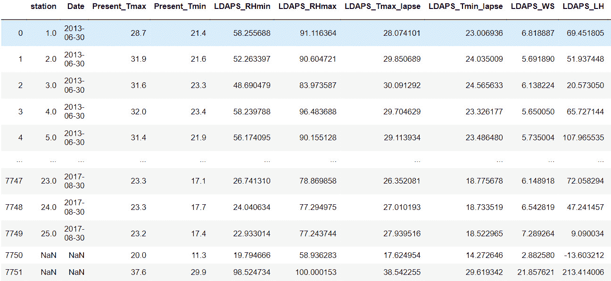

图 2.1：一个由数值组成的表格数据的示例，包含 10 行数据

图像数据代表另一种常见的原始数据形式，在构建机器学习模型时非常受欢迎。由于数据量巨大，这些模型也非常受欢迎。随着智能手机和监控摄像头记录下生活中的每一个瞬间，它们已经生成了大量可以用于训练模型的数据。

用于训练的图像数据的维度与表格数据不同。每张图像都有高度和宽度维度，并且颜色通道增加了第三个维度，而图像数量则增加了第四个维度。因此，图像数据模型的输入张量是四维的，而表格数据的输入张量是二维的。下图展示了从`Open Images`数据集（[`storage.googleapis.com/openimages/web/index.html`](https://storage.googleapis.com/openimages/web/index.html)）中提取的带标签的船只和飞机的训练示例；这些图像已经过预处理，使得它们的高度和宽度相同。这个数据可以用来训练一个二分类模型，将图像分类为船只或飞机：

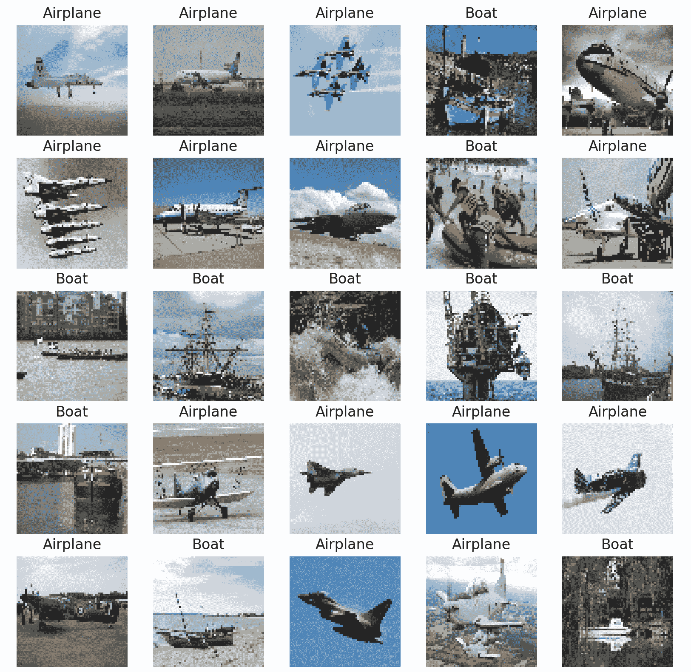

图 2.2：可以用于训练机器学习模型的图像数据样本

其他类型的原始数据，如文本和音频，也可以用来构建机器学习模型。像图像一样，它们在机器学习社区中的受欢迎程度来自于大量可用的数据。音频和文本都有大小不确定的挑战。你将在本章后面探索如何克服这一挑战。下图展示了一个采样率为 44.1 kHz 的音频样本，这意味着音频数据每秒被采样 44,100 次。这是输入虚拟助手的原始数据类型的一个示例，虚拟助手通过这些数据解析请求并做出相应的动作：

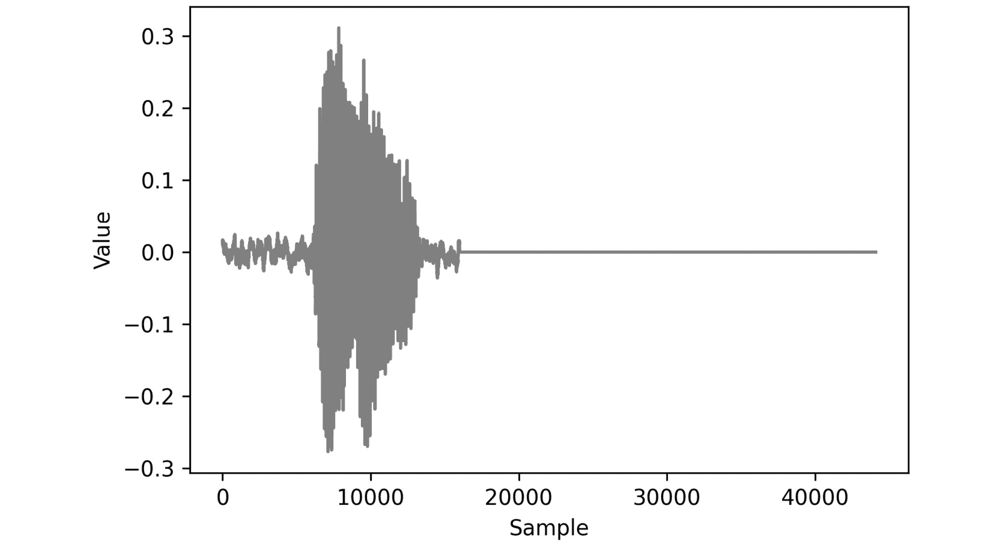

图 2.3：音频数据的可视化表示

现在你已经了解了在构建机器学习模型时可能遇到的一些数据类型，接下来的部分将揭示如何预处理不同类型的数据。

# 数据预处理

数据预处理是指将原始数据转换为适合机器学习模型使用的形式的过程。不同的数据类型将需要不同的预处理步骤，最基本的要求是，结果张量仅包含数值元素，如整数或小数。需要数值张量，因为模型依赖于线性变换，如加法和乘法，而这些变换只能在数值张量上执行。

虽然许多数据集仅包含数值字段，但也有很多数据集不止如此。它们可能包含字符串、布尔值、类别型或日期类型的字段，这些字段都必须转换为数值字段。有些转换可能很简单；例如，布尔值字段可以映射为 `true` 对应 `1`，`false` 对应 `0`。因此，将布尔字段映射为数值字段是简单的，并且所有必要的信息都得以保留。然而，当转换其他数据类型（如日期字段）时，除非另有明确说明，否则转换为数值字段时可能会丢失信息。

一个可能的信息丢失示例是将日期字段通过 Unix 时间转换为数值字段。Unix 时间表示自 Unix 纪元以来经过的秒数；即 1970 年 1 月 1 日 00:00:00 UTC，忽略闰秒。使用 Unix 时间移除了月份、星期几、小时等的显式指示，而这些信息在训练模型时可能作为重要特征。

在将字段转换为数值数据类型时，重要的是尽可能保留信息上下文，因为这将有助于训练模型理解特征与目标之间的关系。以下图示展示了如何将日期字段转换为一系列数值字段：

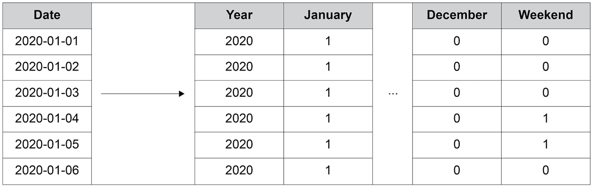

图 2.4：日期列的数值编码

如前图所示，左侧是日期字段，表示一个特定日期，而右侧则提供了一种方法，将其转化为数值信息：

+   从日期中提取年份，作为整数。

+   月份使用独热编码（one-hot encoding）。每个月份都有一个列，并且月份被二进制编码，如果日期的月份与该列的名称相符。

+   创建了一个列，指示日期是否为周末。

这里仅是对`date`列进行编码的方法；并不是所有前述的方法都是必须的，且还有许多其他方法可以使用。将所有字段适当地编码为数值字段对于创建高效的机器学习模型至关重要，这样模型才能学习特征与目标之间的关系。

数据归一化是另一种预处理技术，用于加速训练过程。归一化过程会重新缩放字段，使它们都具有相同的尺度。这也有助于确保模型的权重具有相同的尺度。

在前面的图示中，`year`列的数量级为`10³`，而其他列的数量级为`10⁰`。这意味着列之间存在三个数量级的差异。字段的数值范围差异很大的话，可能会导致模型不够精确，因为在最小化误差函数时，可能无法找到最优的权重。这可能是由于在训练前定义的容忍限度或学习率，并不适用于这两个数量级的权重更新。在前面的例子中，重新缩放`year`列，使其与其他列具有相同的数量级，可能是有益的。

在本章中，你将探索多种方法来预处理表格数据、图像数据、文本数据和音频数据，以便将其用于训练机器学习模型。

# 处理表格数据

在本节中，你将学习如何将表格数据加载到 Python 开发环境中，以便可以用于 TensorFlow 建模。你将使用 pandas 和 scikit-learn 来利用有助于处理数据的类和函数，并探索可用于预处理数据的方法。

可以通过使用 pandas 的`read_csv`函数并传入数据集路径，将表格数据加载到内存中。这个函数非常适合且易于使用来加载表格数据，使用方法如下：

```py
df = pd.read_csv('path/to/dataset')
```

为了对数据进行归一化，你可以使用在 scikit-learn 中可用的缩放器。可以应用多种缩放器；`StandardScaler`会对数据进行归一化，使数据集的字段均值为`0`，标准差为`1`。另一个常用的缩放器是`MinMaxScaler`，它会重新缩放数据集，使字段的最小值为`0`，最大值为`1`。

要使用缩放器，必须先初始化并将其拟合到数据集。通过这样做，数据集就可以通过缩放器进行转换。实际上，拟合和转换过程可以通过使用`fit_transform`方法一步完成，如下所示：

```py
scaler = StandardScaler()
transformed_df = scaler.fit_transform(df)
```

在第一个练习中，你将学习如何使用 pandas 和 scikit-learn 加载数据集并对其进行预处理，使其适合建模。

## 练习 2.01：加载表格数据并重新缩放数值字段

数据集 `Bias_correction_ucl.csv` 包含了针对韩国首尔的次日最高和最低气温预报的偏差修正信息。各字段代表给定日期的温度测量值、测量数据的天气站、与天气相关的模型预报指标（如湿度），以及次日的温度预报。你需要对数据进行预处理，使所有列符合正态分布，均值为 `0`，标准差为 `1`。你将以 `Present_Tmax` 列为例，展示其效果，该列表示给定日期和天气站的最高温度。

注意

数据集可以在这里找到：[`packt.link/l83pR`](https://packt.link/l83pR)。

执行以下步骤以完成此练习：

1.  打开一个新的 Jupyter notebook 来实现这个练习。将文件保存为 `Exercise2-01.ipnyb`。

1.  在新的 Jupyter Notebook 单元格中，导入 pandas 库，如下所示：

    ```py
    import pandas as pd
    ```

    注意

    你可以在以下链接找到 pandas 的文档：[`pandas.pydata.org/docs/`](https://pandas.pydata.org/docs/)。

1.  创建一个新的 pandas DataFrame，命名为 `df`，并将 `Bias_correction_ucl.csv` 文件读取到其中。通过打印结果 DataFrame 来检查数据是否正确加载：

    ```py
    df = pd.read_csv('Bias_correction_ucl.csv')
    df
    ```

    注意

    确保根据 CSV 文件在系统中的位置更改路径（高亮部分）。如果你从存储 CSV 文件的同一目录运行 Jupyter notebook，则可以直接运行上述代码而无需修改。

    输出结果如下：

    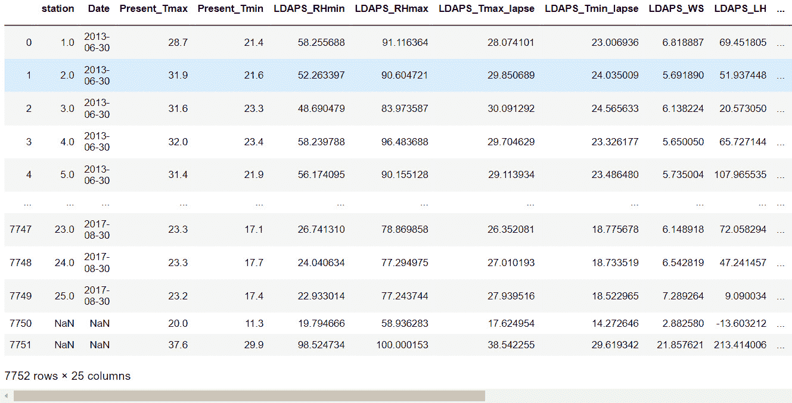

    ](img/B16341_02_06.jpg)

    图 2.5：打印 DataFrame 后的输出结果

1.  使用 DataFrame 的 `drop` 方法删除 `date` 列，并传入列名。删除 `date` 列是因为它是非数值型字段，存在非数值型字段时无法进行缩放。由于要删除列，因此需要同时传入 `axis=1` 和 `inplace=True` 参数：

    ```py
    df.drop('Date', inplace=True, axis=1)
    ```

1.  绘制表示数据集中各日期和天气站的最大温度的 `Present_Tmax` 列的直方图：

    ```py
    ax = df['Present_Tmax'].hist(color='gray')
    ax.set_xlabel("Temperature")
    ax.set_ylabel("Frequency")
    ```

    输出结果如下：

    

    ](img/B16341_02_05.jpg)

    图 2.6：表示 `Present_Tmax` 列的温度与频率的直方图

    结果直方图显示了 `Present_Tmax` 列的值的分布。可以看到，温度值的范围从 20 到 38 摄氏度。绘制特征值的直方图是查看值的分布并判断是否需要缩放的好方法。

1.  从 scikit-learn 的预处理包中导入 `StandardScaler` 类。初始化缩放器，拟合缩放器并使用缩放器的 `fit_transform` 方法对 DataFrame 进行变换。由于 `fit_transform` 方法的结果是一个 NumPy 数组，因此使用变换后的 DataFrame 创建一个新的 DataFrame `df2`。标准缩放器将对数值字段进行变换，使字段的均值为 `0`，标准差为 `1`：

    ```py
    from sklearn.preprocessing import StandardScaler
    scaler = StandardScaler()
    df2 = scaler.fit_transform(df)
    df2 = pd.DataFrame(df2, columns=df.columns)
    ```

    注意

    结果数据的均值和标准差可以输入到缩放器中。

1.  绘制变换后的 `Present_Tmax` 列的直方图：

    ```py
    ax = df2['Present_Tmax'].hist(color='gray')
    ax.set_xlabel("Normalized Temperature")
    ax.set_ylabel("Frequency")
    ```

    输出将如下所示：

    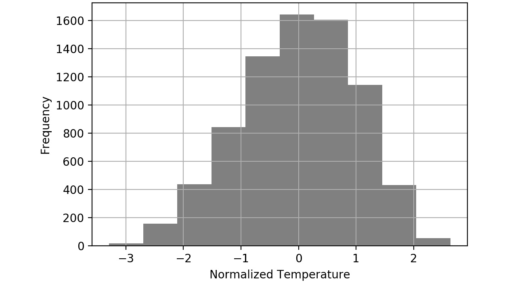

图 2.7：重新缩放后的 Present_Tmax 列的直方图

结果的直方图显示，温度值的范围大约从 `-3` 到 `3` 摄氏度，可以从直方图的 *x* 轴范围中看出。使用标准缩放器后，数值将始终具有 `0` 的均值和 `1` 的标准差。规范化特征可以加速模型训练过程。

在这个练习中，你成功地使用 pandas 库导入了表格数据，并使用 scikit-learn 库进行了一些预处理。数据的预处理包括删除 `date` 列和对数值字段进行缩放，使它们的均值为 `0`，标准差为 `1`。

在以下活动中，你将使用 pandas 库加载表格数据，并使用 scikit-learn 中的 `MinMax` 缩放器对数据进行缩放。你将使用与之前练习中相同的数据集，该数据集描述了韩国首尔空气温度预报的偏差修正。

## 活动 2.01：加载表格数据并使用 MinMax 缩放器重新缩放数值字段

在此活动中，你需要加载表格数据并使用 `MinMax` 缩放器对数据进行重新缩放。数据集 `Bias_correction_ucl.csv` 包含了韩国首尔次日最大和最小空气温度预报的偏差修正信息。字段表示给定日期的温度测量值、测量指标的气象站、与天气相关的指标（如湿度）模型预测值以及次日的温度预测值。你需要对列进行缩放，使得每列的最小值为 `0`，最大值为 `1`。

完成此活动的步骤如下：

1.  打开一个新的 Jupyter notebook 来实现这个活动。

1.  导入 pandas 和 `Bias_correction_ucl.csv` 数据集。

1.  使用 pandas 的 `read_csv` 函数读取数据集。

1.  删除 DataFrame 的 `date` 列。

1.  绘制 `Present_Tmax` 列的直方图。

1.  导入 `MinMaxScaler` 并将其拟合到并变换特征 DataFrame。

1.  绘制变换后的 `Present_Tmax` 列的直方图。

    你应该得到类似以下的输出：

    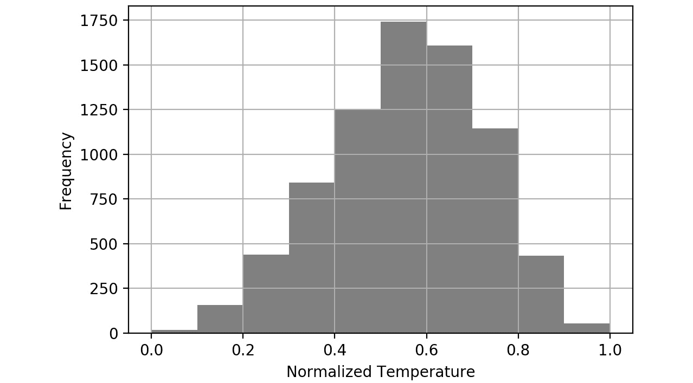

图 2.8：活动 2.01 的预期输出

注意

这个活动的解决方案可以通过这个链接找到。

转换非数值字段（如分类字段或日期字段）的一种方法是进行独热编码。`0` 表示除了与正确列对应的那一列外的所有列。新创建的虚拟列的列头对应于唯一值。独热编码可以通过使用 pandas 库的 `get_dummies` 函数来实现，并传入需要编码的列。一个可选的参数是提供前缀功能，为列头添加前缀，这对于引用列很有用：

```py
dummies = pd.get_dummies(df['feature1'], prefix='feature1')
```

注意

使用 `get_dummies` 函数时，`NaN` 值会被转换为全 0。

在接下来的练习中，你将学习如何预处理非数值字段。你将使用与之前的练习和活动相同的数据集，该数据集描述了韩国首尔的气温预报偏差修正。

## 练习 2.02：预处理非数值数据

在这个练习中，你将通过使用 `get_dummies` 函数对 `date` 列的年份和月份进行独热编码来预处理 `date` 列。你将把独热编码后的列与原始 DataFrame 合并，确保结果 DataFrame 中的所有字段都是数值类型。

完成这个练习的步骤如下：

1.  打开一个新的 Jupyter notebook 来实现这个练习。将文件保存为 `Exercise2-02.ipnyb`。

1.  在一个新的 Jupyter Notebook 单元格中，导入 pandas 库，如下所示：

    ```py
    import pandas as pd
    ```

1.  创建一个新的 pandas DataFrame，命名为 `df`，并将 `Bias_correction_ucl.csv` 文件读取到其中。通过打印结果 DataFrame 检查数据是否正确加载：

    ```py
    df = pd.read_csv('Bias_correction_ucl.csv')
    ```

    注意

    确保根据文件在你系统上的位置更改路径（高亮部分）。如果你从存储 CSV 文件的目录运行 Jupyter notebook，你可以直接运行上述代码，而无需修改。

1.  使用 pandas 的 `to_datetime` 函数将 `date` 列的数据类型更改为 `Date`：

    ```py
    df['Date'] = pd.to_datetime(df['Date'])
    ```

1.  使用 pandas 的 `get_dummies` 函数为 `year` 创建虚拟列。将 `date` 列的年份作为第一个参数传入，并为结果 DataFrame 的列添加前缀。打印出结果 DataFrame：

    ```py
    year_dummies = pd.get_dummies(df['Date'].dt.year, \
                                  prefix='year')
    year_dummies
    ```

    输出将如下所示：

    

    图 2.9：应用 `get_dummies` 函数处理日期列的年份后的输出

    结果 DataFrame 只包含 0 和 1。`1` 对应于原始 `date` 列中存在的值。空值将在新创建的 DataFrame 中对所有列显示为 0。

1.  通过从 `date` 列的月份创建虚拟列来重复此操作。打印出生成的 DataFrame：

    ```py
    month_dummies = pd.get_dummies(df['Date'].dt.month, \
                                   prefix='month')
    month_dummies
    ```

    输出将如下所示：

    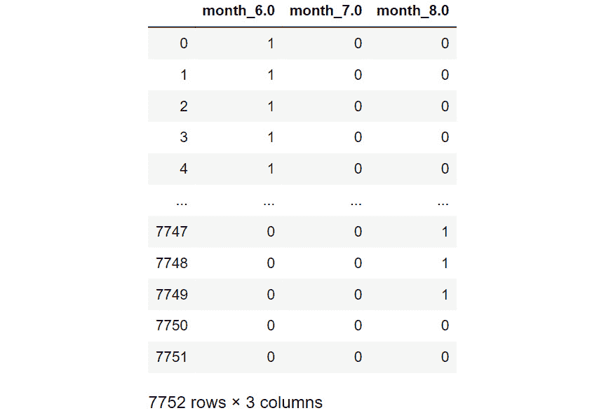

    图 2.10：应用于日期列月份的 get_dummies 函数的输出

    结果 DataFrame 现在仅包含`date`列中月份的 0 和 1。

1.  将原始 DataFrame 与您在*步骤 5*和*6*中创建的虚拟 DataFrame 连接起来：

    ```py
    df = pd.concat([df, month_dummies, year_dummies], \
                   axis=1)
    ```

1.  删除原始`date`列，因为它现在是多余的：

    ```py
    df.drop('Date', axis=1, inplace=True)
    ```

1.  验证所有列现在都是数值数据类型：

    ```py
    df.dtypes
    ```

    输出如下所示：

    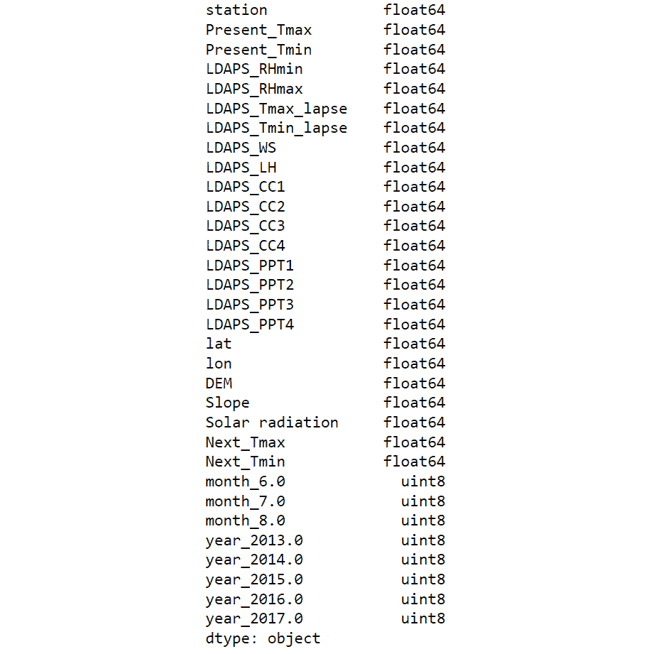

图 2.11：结果 DataFrame 的 dtypes 属性的输出

在这里，您可以看到结果 DataFrame 的所有数据类型都是数值的。这意味着它们现在可以传递到 ANN 中进行建模。

在此练习中，您成功导入了表格数据，并使用 pandas 和 scikit-learn 库预处理了`date`列。您使用了`get_dummies`函数将分类数据转换为数值数据类型。

注意

另一种从日期数据类型获取数值数据类型的方法是使用`pandas.Series.dt`访问器对象。有关可用选项的更多信息，请参阅：[`pandas.pydata.org/docs/reference/api/pandas.Series.dt.html`](https://pandas.pydata.org/docs/reference/api/pandas.Series.dt.html)。

处理非数值数据是创建高性能模型的重要步骤。如果可能，应将任何领域知识传授给训练数据特征。例如，使用日期预测温度，就像在本章前面的练习和活动中使用的数据集一样，对月份进行编码将是有帮助的，因为温度很可能与年份的月份高度相关。然而，编码星期几可能没有用，因为星期几与温度可能没有相关性。使用这些领域知识可以帮助模型学习特征与目标之间的潜在关系。

在下一节中，您将学习如何处理图像数据，以便将其输入到机器学习模型中。

# 处理图像数据

各种组织每天生成大量图像，这些图像可用于创建预测模型，例如对象检测、图像分类和对象分割。在处理图像数据和其他一些原始数据类型时，通常需要预处理数据。使用 ANN 进行建模的最大优势之一是从原始数据创建模型时的最小预处理步骤。特征工程通常涉及使用领域知识从原始数据中创建特征，这是耗时的，并不能保证模型性能的提高。利用无需特征工程的 ANN 简化了训练过程，并且不需要领域知识。

例如，在医学图像中定位肿瘤需要经过多年训练的专家知识，但对于人工神经网络（ANNs）而言，只需要足够的标注数据进行训练。通常需要对这些图像进行少量的预处理步骤。这些步骤是可选的，但对于标准化训练过程和创建高性能模型是有帮助的。

一项预处理步骤是重新缩放。由于图像的颜色值是整数，范围从`0`到`255`，它们被缩放为介于`0`和`1`之间的值，类似于*活动 2.01*，*加载表格数据并使用 MinMax Scaler 重新缩放数值字段*。另一种常见的预处理步骤是图像增强，稍后在本节中你将进一步探讨，它本质上是通过增强图像来添加更多的训练样本，从而构建一个更强大的模型。

本节还介绍了批处理。批处理一次加载一批训练数据。这可能导致比一次性加载数据更慢的训练时间；然而，这允许你在非常大体量的数据集上训练模型。图像或音频训练是需要大量数据来获得良好性能的典型例子。

例如，一个典型的图像可能是 100 KB 大小。对于 100 万张图像的训练数据集，你将需要 100 GB 的内存，这对大多数人来说可能是不可实现的。如果模型以 32 张图像为一批进行训练，那么内存需求将小很多。批量训练使你能够增强训练数据，稍后在本节中你将进一步了解这一点。

图像可以通过一个名为`ImageDataGenerator`的类加载到内存中，该类可以从 Keras 的预处理包中导入。这个类最初来自 Keras，现在也可以在 TensorFlow 中使用。在加载图像时，你可以对它们进行重新缩放。通常的做法是将图像按 1/255 像素的值进行重新缩放。这意味着原本在 0 到 255 范围内的图像值现在将位于 0 到 1 之间。

`ImageDataGenerator` 可以通过以下方式初始化并进行重新缩放：

```py
datagenerator = ImageDataGenerator(rescale = 1./255)
```

一旦初始化了 `ImageDataGenerator` 类，你可以使用 `flow_from_directory` 方法并传入图像所在的目录。该目录应包括按类标签标记的子目录，并且这些子目录应包含相应类别的图像。另一个需要传入的参数是所需的图像大小、批量大小以及类模式。类模式决定了生成的标签数组的类型。以下是使用 `flow_from_directory` 方法进行二分类的示例，批量大小为 25，图像大小为 64x64：

```py
dataset = datagenerator.flow_from_directory\
          ('path/to/data',\
           target_size = (64, 64),\
           batch_size = 25,\
           class_mode = 'binary')
```

在接下来的练习中，你将利用 `ImageDataGenerator` 类将图像加载到内存中。

注意

提供的图像数据来自 Open Image 数据集，完整描述可以在这里找到：[`storage.googleapis.com/openimages/web/index.html`](https://storage.googleapis.com/openimages/web/index.html)。

可以使用 Matplotlib 绘制图像来查看图像。这是验证图像是否与其相应标签匹配的一个有用练习。

## 练习 2.03：加载用于批量处理的图像数据

在本练习中，你将学习如何加载用于批量处理的图像数据。`image_data`文件夹包含一组船只和飞机的图像。你将加载船只和飞机的图像进行批量处理，并对它们进行重新缩放，使得图像值在`0`和`1`之间。然后，你的任务是打印出来自数据生成器的批次图像及其标签。

注意

你可以在此找到`image_data`：[`packt.link/jZ2oc`](https://packt.link/jZ2oc)。

执行以下步骤来完成此练习：

1.  打开一个新的 Jupyter Notebook 来实现本练习。将文件保存为`Exercise2-03.ipnyb`。

1.  在新的 Jupyter Notebook 单元格中，从`tensorflow.keras.preprocessing.image`导入`ImageDataGenerator`类：

    ```py
    from tensorflow.keras.preprocessing.image \
         import ImageDataGenerator
    ```

1.  实例化`ImageDataGenerator`类，并传递`rescale`参数，值为`1./255`，以将图像值转换为介于`0`和`1`之间：

    ```py
    train_datagen = ImageDataGenerator(rescale =  1./255)
    ```

1.  使用数据生成器的`flow_from_directory`方法，指示数据生成器加载图像数据。传入目标尺寸、批次大小和类别模式的参数：

    ```py
    training_set = train_datagen.flow_from_directory\
                   ('image_data',\
                    target_size = (64, 64),\
                    batch_size = 25,\
                    class_mode = 'binary')
    ```

1.  创建一个函数来显示批量图像。该函数将以 5x5 数组的形式绘制前 25 张图像及其对应的标签：

    ```py
    import matplotlib.pyplot as plt
    def show_batch(image_batch, label_batch):\
        lookup = {v: k for k, v in \
                  training_set.class_indices.items()}
        label_batch = [lookup[label] for label in \
                       label_batch]
        plt.figure(figsize=(10,10))
        for n in range(25):
            ax = plt.subplot(5,5,n+1)
            plt.imshow(image_batch[n])
            plt.title(label_batch[n].title())
            plt.axis('off')
    ```

1.  从数据生成器中获取一个批次并将其传递给函数以显示图像及其标签：

    ```py
    image_batch, label_batch = next(training_set)
    show_batch(image_batch, label_batch)
    ```

    输出将如下所示：

    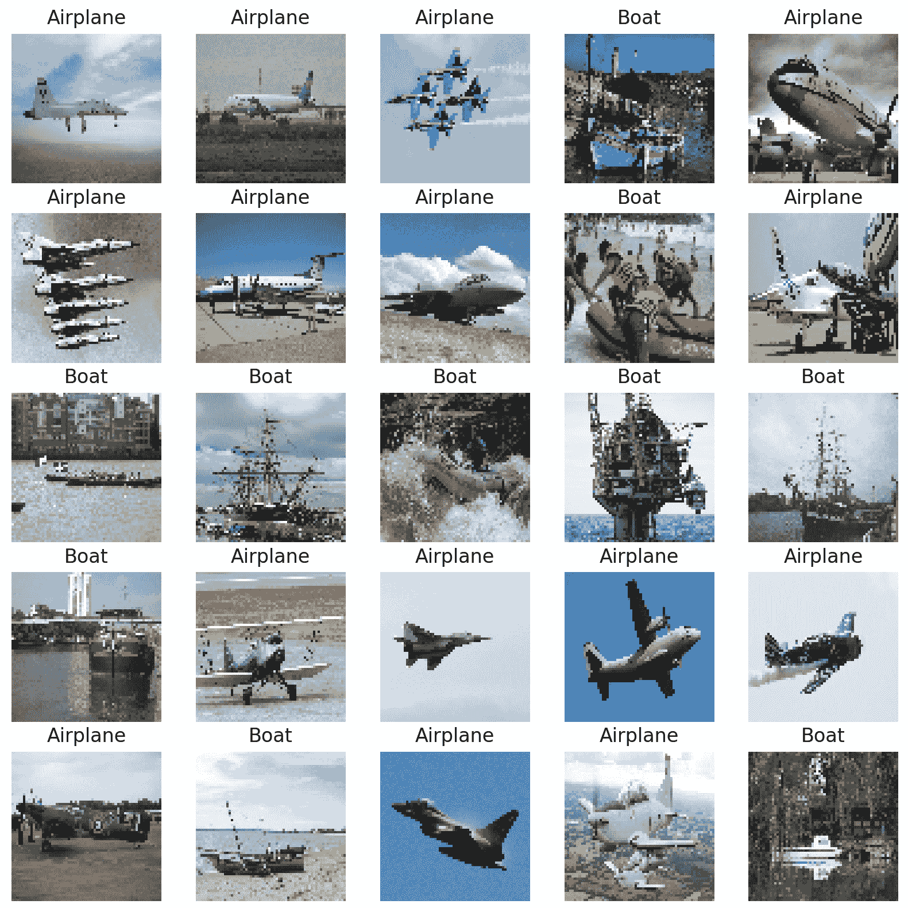

图 2.12：来自一批的图像

在这里，你可以看到一批船只和飞机的图像输出，这些图像可以输入到模型中。请注意，所有图像的大小相同，这是通过修改图像的长宽比实现的。这样可以确保图像在传入人工神经网络（ANN）时的一致性。

在本练习中，你将学习如何以批量的方式导入图像，以便它们可以用于训练人工神经网络（ANN）。图像是一次加载一个批次的，通过限制每个批次的训练图像数量，你可以确保不会超出计算机的 RAM。

在接下来的部分中，你将看到如何在图像加载时进行增强。

# 图像增强

图像增强是通过修改图像来增加可用训练样本数量的过程。该过程可以包括放大图像、旋转图像或水平/垂直翻转图像。如果增强过程不会改变图像的上下文，则可以进行增强。例如，当香蕉图像水平翻转时，它仍然可以被识别为香蕉，并且新生成的香蕉图像很可能是任意方向的。在这种情况下，训练过程中提供模型的两种方向将有助于构建一个更强大的模型。

然而，如果您有一张船只的图像，垂直翻转可能不合适，因为这并不代表船只通常在图像中的存在方式——船只不会倒立。图像增强的最终目标是增加训练图像的数量，这些图像应与物体在日常生活中的出现方式相似，并保留其上下文。这有助于训练出的模型在面对新的、未见过的图像时表现良好。图像增强的一个例子可以在下图中看到，图中的香蕉图像经过了三次增强；左侧图像为原始图像，右侧图像为增强后的图像。

右上角的图像是原始图像水平翻转后的结果，右中间的图像是原始图像放大了 15%，右下角的图像是原始图像旋转了 10 度。经过这个增强过程后，您会得到四张香蕉图像，每张图像的香蕉处于不同的位置和方向：

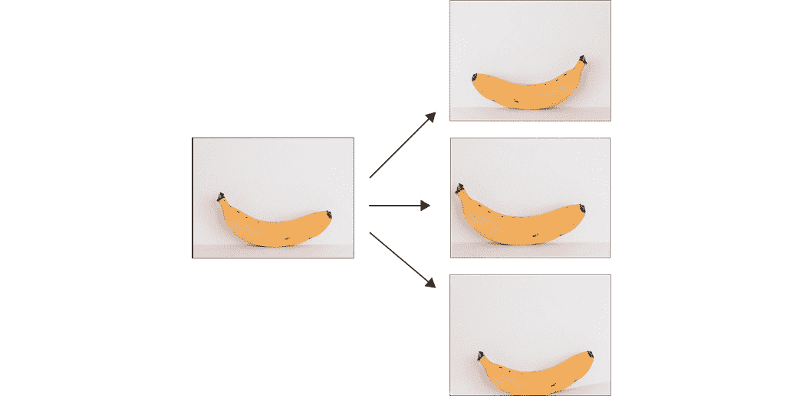

图 2.13：图像增强示例

图像增强可以通过 TensorFlow 的 `ImageDataGenerator` 类在每批图像加载时进行。与图像重缩放类似，可以应用多种图像增强过程。常见增强过程的参数包括：

+   `horizontal_flip`：水平翻转图像。

+   `vertical_flip`：垂直翻转图像。

+   `rotation_range`：旋转图像至指定的度数。

+   `width_shift_range`：沿图像的宽度轴移动图像，最多移动指定的比例或像素量。

+   `height_shift_range`：沿图像的高度轴移动图像，最多移动指定的比例或像素量。

+   `brightness_range`：修改图像的亮度，最大可调整到指定的值。

+   `shear_range`：按指定量剪切图像。

+   `zoom_range`：按指定的比例放大图像。

图像增强可以在实例化 `ImageDataGenerator` 类时应用，示例如下：

```py
datagenerator = ImageDataGenerator(rescale = 1./255,\
                                   shear_range = 0.2,\
                                   rotation_range= 180,\
                                   zoom_range = 0.2,\
                                   horizontal_flip = True)
```

在以下活动中，您将使用 TensorFlow 的 `ImageDataGenerator` 类进行图像增强。这个过程非常简单，只需要传入参数即可。您将使用与*练习 2.03*、*批处理图像数据加载*中相同的数据集，该数据集包含了船只和飞机的图像。

## 活动 2.02：批处理图像数据加载

在这个活动中，你将加载图像数据进行批处理，并在此过程中增强图像。`image_data`文件夹包含一组船只和飞机的图像。你需要加载图像数据进行批处理，并通过随机扰动（如旋转、水平翻转图像和为图像添加剪切）调整输入数据。这将从现有的图像数据中创建额外的训练数据，并通过增加不同的训练样本数来提高机器学习模型的准确性和鲁棒性，即使只有少量样本可用。接着，你的任务是打印出从数据生成器中提取的一批带标签的图像。

这个活动的步骤如下：

1.  打开一个新的 Jupyter notebook 来实现这个活动。

1.  从`tensorflow.keras.preprocessing.image`导入`ImageDataGenerator`类。

1.  实例化`ImageDataGenerator`并设置`rescale=1./255`、`shear_range=0.2`、`rotation_range=180`、`zoom_range=0.2`和`horizontal_flip=True`参数。

1.  使用`flow_from_directory`方法，将数据生成器指向图像，同时传入目标尺寸`64x64`、批量大小`25`，并将类别模式设置为`binary`。

1.  创建一个函数，将前 25 个图像按 5x5 的数组显示，并附上相关标签。

1.  从数据生成器中取一个批次，并将其传递给函数以显示图像及其标签。

    注意

    这个活动的解决方案可以通过这个链接找到。

在这个活动中，你批量增强了图像，使其可以用于训练人工神经网络（ANNs）。你已经看到，当图像作为输入时，它们可以被增强以生成更多有效的训练样本。

你学会了如何批量加载图像，这使得你可以在巨大的数据量上进行训练，而这些数据可能无法一次性全部加载到机器的内存中。你还学会了如何使用`ImageDataGenerator`类增强图像，它本质上是从训练集中的图像生成新的训练样本。

在下一节中，你将学习如何加载和预处理文本数据。

# 文本处理

文本数据代表了一大类易于获取的原始数据。例如，文本数据可以来自网页，如维基百科、转录的语音或社交媒体对话——这些数据量在大规模增加，且在用于训练机器学习模型之前必须进行处理。

处理文本数据可能会面临多种挑战，包括以下几种：

+   存在成千上万种不同的单词。

+   不同的语言带来了不同的挑战。

+   文本数据通常在大小上有所不同。

有许多方法可以将文本数据转换为数值表示。一种方法是对单词进行独热编码，这就像你在*练习 2.02*中处理日期字段时做的那样，*预处理非数值数据*。然而，这在训练模型时会带来问题，因为如果数据集包含大量独特的单词，就会导致数据稀疏，从而可能导致训练速度缓慢并且模型可能不准确。此外，如果遇到一个新单词，而这个单词不在训练数据中，模型就无法使用该单词。

一种常用的方法是将整个文本转换为嵌入向量。已有预训练模型将原始文本转换为向量。这些模型通常在大量文本数据上训练。使用预训练模型的单词嵌入向量具有一些明显的优势：

+   结果向量的大小是固定的。

+   向量保持上下文信息，因此它们能受益于迁移学习。

+   不需要对数据进行进一步的预处理，嵌入的结果可以直接输入到人工神经网络（ANN）中。

虽然 TensorFlow Hub 将在下一章中更深入地讲解，但下面是如何将预训练模型用作预处理步骤的示例。要加载预训练模型，您需要导入`tensorflow_hub`库。通过这样做，可以加载模型的 URL。然后，可以通过调用`KerasLayer`类将模型加载到环境中，`KerasLayer`类会将模型封装，使其可以像其他 TensorFlow 模型一样使用。可以如下创建：

```py
import tensorflow_hub as hub
model_url = "url_of_model"
hub_layer = hub.KerasLayer(model_url, \
                           input_shape=[], dtype=tf.string, \
                           trainable=True)
```

输入数据的数据类型，由`dtype`参数指示，应作为输入传递给`KerasLayer`类，同时还需要一个布尔参数，指示权重是否可训练。一旦使用`tensorflow_hub`库加载了模型，就可以在文本数据上调用它，如下所示：

```py
hub_layer(data)
```

这将通过预训练模型运行数据。输出将基于预训练模型的架构和权重。

在下面的练习中，您将学习如何加载包含文本字段的数据，批量处理数据集，并将预训练模型应用于文本字段，将该字段转换为嵌入向量。

注意

预训练模型可以在这里找到：[`tfhub.dev/google/tf2-preview/gnews-swivel-20dim/1`](https://tfhub.dev/google/tf2-preview/gnews-swivel-20dim/1)。

数据集可以在这里找到：[`archive.ics.uci.edu/ml/datasets/Drug+Review+Dataset+%28Drugs.com%29`](https://archive.ics.uci.edu/ml/datasets/Drug+Review+Dataset+%28Drugs.com%29)。

## 练习 2.04：为 TensorFlow 模型加载文本数据

数据集`drugsComTrain_raw.tsv`包含与患者对特定药物的评价相关的信息，包括患者对药物的满意度评分以及与之相关的病情。在本练习中，您将加载文本数据进行批处理。您将应用一个来自 TensorFlow Hub 的预训练模型，对患者评论进行词嵌入。您需要只处理`review`字段，因为该字段包含文本数据。

执行以下步骤：

1.  打开一个新的 Jupyter notebook 来实现这个练习。将文件保存为`Exercise2-04.ipnyb`。

1.  在新的 Jupyter Notebook 单元格中，导入 TensorFlow 库：

    ```py
    import tensorflow as tf
    ```

1.  使用库的`make_csv_dataset`函数创建一个 TensorFlow 数据集对象。将`batch_size`参数设置为`1`，并将`field_delim`参数设置为`\t`，因为数据集是制表符分隔的：

    ```py
    df = tf.data.experimental.make_csv_dataset\
         ('../Datasets/drugsComTest_raw.tsv', \
          batch_size=1, field_delim='\t')
    ```

1.  创建一个函数，将数据集对象作为输入，并对数据集进行洗牌、重复和批处理：

    ```py
    def prep_ds(ds, shuffle_buffer_size=1024, \
                batch_size=32):
        # Shuffle the dataset
        ds = ds.shuffle(buffer_size=shuffle_buffer_size)
        # Repeat the dataset
        ds = ds.repeat()
        # Batch the dataset
        ds = ds.batch(batch_size)
        return ds
    ```

1.  对您在*步骤 3*中创建的数据集对象应用该函数，设置`batch_size`等于`5`：

    ```py
    ds = prep_ds(df, batch_size=5)
    ```

1.  获取第一批数据并打印出来：

    ```py
    for x in ds.take(1):\
        print(x)
    ```

    您应该会看到类似以下的输出：

    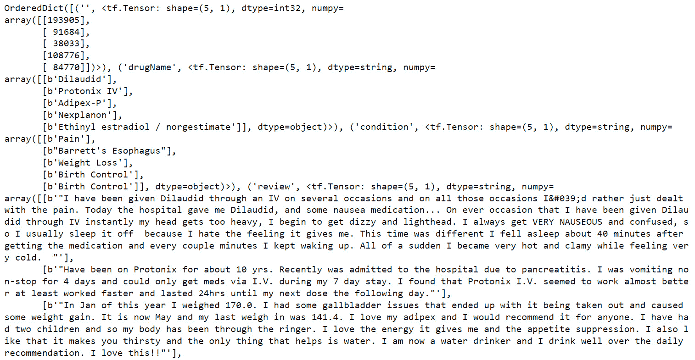

    图 2.14：来自数据集对象的一批数据

    输出表示输入数据的张量格式。

1.  从 TensorFlow Hub 导入预训练的词嵌入模型，并创建一个 Keras 层：

    ```py
    import tensorflow_hub as hub
    embedding = "https://tfhub.dev/google/tf2-preview"\
                "/gnews-swivel-20dim/1"
    hub_layer = hub.KerasLayer(embedding, input_shape=[], \
                               dtype=tf.string, \
                               trainable=True)
    ```

1.  从数据集中取出一批数据，展平对应`review`字段的张量，应用预训练层并打印输出：

    ```py
    for x in ds.take(1):\
        print(hub_layer(tf.reshape(x['review'],[-1])))
    ```

    这将显示以下输出：

    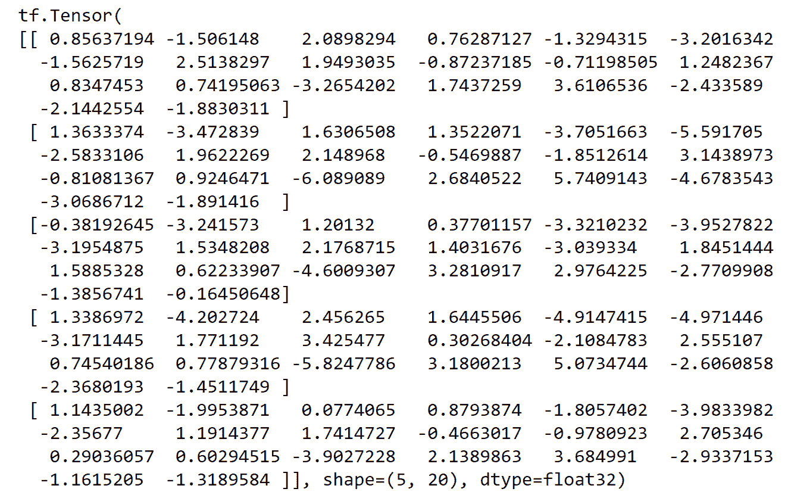

图 2.15：应用预训练模型后，评论列的一批数据

上述输出表示了第一批药物评论的嵌入向量。具体的值乍一看可能没有太大意义，但嵌入中编码了基于数据集的信息，这些数据集是嵌入模型训练的基础。批处理大小为`5`，嵌入向量的大小为`20`，这意味着在应用预训练层后，得到的大小为`5x20`。

在本练习中，您学习了如何导入可能包含各种数据类型的表格数据。您处理了`review`字段，并应用了预训练的词嵌入模型，将文本转换为数值张量。最终，您对文本数据进行了预处理和批处理，使其适合大规模训练。这是一种表示文本的方式，使其能够输入到 TensorFlow 的机器学习模型中。实际上，还可以使用其他预训练的词嵌入模型，这些模型可以在 TensorFlow Hub 上找到。在下一章中，您将进一步学习如何使用 TensorFlow Hub。

在本节中，你了解了如何为机器学习模型预处理文本数据的一种方法。实际上，你可以使用许多不同的方法来生成数值张量，例如，可以对单词进行独热编码、去除停用词、进行词干提取和词形还原，或者甚至做一些简单的操作，如统计每个评论中的单词数量。本节展示的方法具有优势，因为它简单易实施。此外，词嵌入方法能够结合文本中的上下文信息，而这些信息在其他方法中（如独热编码）难以编码。

最终，是否将任何领域知识应用于预处理步骤以保留尽可能多的上下文信息，取决于实践者自身。这将使任何后续模型能够学习特征和目标变量之间的潜在函数。

在接下来的章节中，你将学习如何加载和处理音频数据，以便这些数据可以用于 TensorFlow 模型。

# 音频处理

本节将演示如何批量加载音频数据，以及如何处理它以便用于训练机器学习模型。音频文件的预处理涉及一些高级信号处理步骤。这些步骤有些是可选的，但为了提供全面的音频数据处理方法，我们将呈现这些步骤。由于每个音频文件可能有数百 KB，因此你将利用批处理，就像处理图像数据时一样。批处理可以通过创建数据集对象来实现。创建数据集对象的一种通用方法是使用 TensorFlow 的 `from_tensor_slice` 函数。此函数通过沿张量的第一维切片来生成数据集对象，使用方式如下：

```py
dataset = tf.data.Dataset\
            .from_tensor_slices([1, 2, 3, 4, 5])
```

可以通过 TensorFlow 将音频数据加载到 Python 环境中，方法是使用 `read_file` 函数将文件读取到内存中，然后使用 `decode_wav` 函数解码文件。在使用 `decode_wav` 函数时，必须传入样本率（即表示 1 秒钟数据点的数量）以及所需的通道。例如，如果传入 `-1` 作为所需通道的值，则将解码所有音频通道。导入音频文件的方式如下：

```py
sample_rate = 44100
audio_data = tf.io.read_file('path/to/file')
audio, sample_rate = tf.audio.decode_wav\
                     (audio_data,\
                      desired_channels=-1,\
                      desired_samples=sample_rate)
```

与文本数据一样，你必须对数据进行预处理，以便生成的数值张量与数据的大小相匹配。这是通过在将数据转换到频域后对音频文件进行采样来实现的。音频采样可以看作是将音频文件切割成始终相同大小的片段。例如，一个 30 秒的音频文件可以切分成 30 个 1 秒钟的不重叠音频样本，同样，一个 15 秒钟的音频文件可以切分成 15 个 1 秒钟的不重叠样本。这样，最终你会得到 45 个大小相同的音频样本。

另一个常见的音频数据预处理步骤是将音频样本从时域转换到频域。在时域解释数据对于理解音频的强度或音量很有用，而频域则能帮助你发现哪些频率是存在的。这对于声音分类非常有用，因为不同的物体具有不同的特征声音，这些特征声音会出现在频域中。可以使用 `stft` 函数将音频数据从时域转换到频域。

该函数对输入数据进行短时傅里叶变换。函数的参数包括帧长度，这是一个整数值，表示窗口的长度（单位为样本）；帧步长，这是一个整数值，描述了每次步进的样本数；以及 **快速傅里叶变换** (**FFT**) 长度，这是一个整数值，表示要应用的 FFT 长度。频谱图是短时傅里叶变换的绝对值，因为它对视觉解释非常有用。可以按以下方式创建短时傅里叶变换和频谱图：

```py
stfts = tf.signal.stft(audio, frame_length=1024,\
                       frame_step=256,\
                       fft_length=1024)
spectrograms = tf.abs(stfts)
```

另一个可选的预处理步骤是生成 **梅尔频率倒谱系数** (**MFCCs**)。顾名思义，MFCC 是梅尔频率倒谱的系数。倒谱是音频信号短时功率谱的表示。MFCC 常用于语音识别和音乐信息检索等应用。因此，理解每一步 MFCC 的生成过程可能并不重要，但理解它们可以作为预处理步骤来增加音频数据管道的信息密度是非常有益的。

MFCC 是通过创建一个矩阵，将线性尺度映射到梅尔尺度来生成的。这个矩阵可以通过使用 `linear_to_mel_weight_matrix` 来创建，并传入生成的梅尔频谱中的带数、源频谱图中的频带数、采样率，以及要包含在梅尔频谱中的最低和最高频率。一旦线性到梅尔的权重矩阵创建完成，就可以使用 `tensordot` 函数在第一个轴上对频谱图进行张量收缩。

接下来，应用对值的对数转换以生成对数梅尔频谱图。最后，可以应用 `mfccs_from_log_mel_spectrograms` 函数，传入对数梅尔频谱图来生成 MFCC。以下是这些步骤的应用方法：

```py
lower_edge_hertz, upper_edge_hertz, num_mel_bins \
    = 80.0, 7600.0, 80
linear_to_mel_weight_matrix \
    = tf.signal.linear_to_mel_weight_matrix\
      (num_mel_bins, num_spectrogram_bins, sample_rate, \
       lower_edge_hertz, upper_edge_hertz)
mel_spectrograms = tf.tensordot\
                   (spectrograms, \
                    linear_to_mel_weight_matrix, 1)
mel_spectrograms.set_shape\
    (spectrograms.shape[:-1].concatenate\
    (linear_to_mel_weight_matrix.shape[-1:]))
log_mel_spectrograms = tf.math.log(mel_spectrograms + 1e-6)
mfccs = tf.signal.mfccs_from_log_mel_spectrograms\
        (log_mel_spectrograms)[..., :num_mfccs]
```

在接下来的练习中，你将了解如何处理音频数据。与之前的*练习 2.03*，*加载图像数据以进行批量处理*，以及*练习 2.04*，*为 TensorFlow 模型加载文本数据*类似，你将批量加载数据以提高训练效率和可扩展性。你将使用 TensorFlow 的通用 `read_file` 函数加载音频文件，然后使用 TensorFlow 的 `decode_wav` 函数解码音频数据。接着，你将创建一个函数，从每个音频样本中生成 MFCC（梅尔频率倒谱系数）。最后，将生成一个数据集对象，传递给 TensorFlow 模型进行训练。你将使用的数据集是 Google 的语音命令数据集，包含时长为 1 秒的单词发音。

注意

数据集可以在这里找到：[`packt.link/Byurf`](https://packt.link/Byurf)。

## 练习 2.05：为 TensorFlow 模型加载音频数据

在本练习中，你将学习如何为批量处理加载音频数据。数据集 `data_speech_commands_v0.02` 包含人们发音单词 `zero` 的语音样本，时长恰好为 1 秒，采样率为 44.1 kHz，意味着每秒有 44,100 个数据点。你将应用一些常见的音频预处理技术，包括将数据转换到傅里叶域、对数据进行采样以确保数据与模型大小一致，并为每个音频样本生成 MFCC。这样将生成一个预处理的数据集对象，可以输入到 TensorFlow 模型进行训练。

执行以下步骤：

1.  打开一个新的 Jupyter Notebook 来实现这个练习。将文件保存为 `Exercise2-05.ipnyb`。

1.  在一个新的 Jupyter Notebook 单元中，导入 `tensorflow` 和 `os` 库：

    ```py
    import tensorflow as tf
    import os
    ```

1.  创建一个函数，分别使用 TensorFlow 的 `read_file` 和 `decode_wav` 函数加载音频文件，并返回结果张量的转置：

    ```py
    def load_audio(file_path, sample_rate=44100):
        # Load audio at 44.1kHz sample-rate
        audio = tf.io.read_file(file_path)
        audio, sample_rate = tf.audio.decode_wav\
                             (audio,\
                              desired_channels=-1,\
                              desired_samples=sample_rate)
        return tf.transpose(audio)
    ```

1.  使用 `os.list_dir` 将音频数据的路径作为列表加载：

    ```py
    prefix = " ../Datasets/data_speech_commands_v0.02"\
            "/zero/"
    paths = [os.path.join(prefix, path) for path in \
             os.listdir(prefix)]
    ```

1.  测试函数，通过加载列表中的第一个音频文件并绘制它来验证：

    ```py
    import matplotlib.pyplot as plt
    audio = load_audio(paths[0])
    plt.plot(audio.numpy().T)
    plt.xlabel('Sample')
    plt.ylabel('Value')
    ```

    输出将如下所示：

    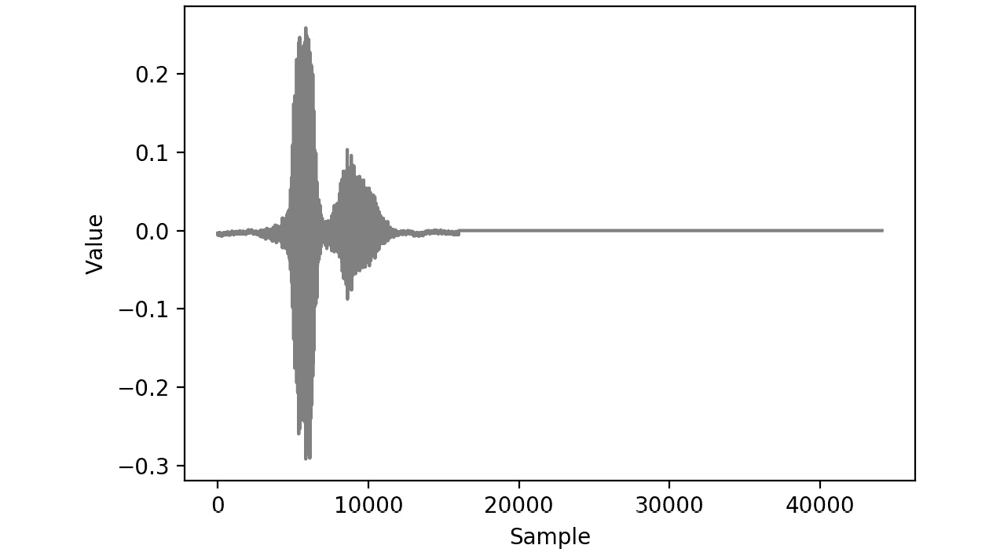

    图 2.16：音频文件的可视化表示

    图示显示了语音样本的波形。在某一时刻的振幅对应声音的音量；高振幅表示高音量。

1.  创建一个函数，从音频数据中生成 MFCC。首先，应用短时傅里叶变换，将音频信号作为第一个参数，帧长设置为`1024`作为第二个参数，帧步长设置为`256`作为第三个参数，FFT 长度作为第四个参数。然后，取结果的绝对值来计算频谱图。频谱图的 bin 数由短时傅里叶变换的最后一个维度长度给出。接下来，定义 mel 权重矩阵的上下限分别为`80`和`7600`，mel 的 bin 数为`80`。然后，使用 TensorFlow 的信号包中的`linear_to_mel_weight_matrix`计算 mel 权重矩阵。接着，通过张量收缩使用 TensorFlow 的`tensordot`函数，沿频谱图的第 1 轴与 mel 权重矩阵进行计算，得到 mel 频谱图。然后，对 mel 频谱图取对数，最后使用 TensorFlow 的`mfccs_from_log_mel_spectrograms`函数计算 MFCC。最后，从函数中返回 MFCC。

    ```py
    def apply_mfccs(audio, sample_rate=44100, num_mfccs=13):
        stfts = tf.signal.stft(audio, frame_length=1024, \
                               frame_step=256, \
                               fft_length=1024)
        spectrograms = tf.abs(stfts)
        num_spectrogram_bins = stfts.shape[-1]#.value
        lower_edge_hertz, upper_edge_hertz, \
        num_mel_bins = 80.0, 7600.0, 80
        linear_to_mel_weight_matrix = \
          tf.signal.linear_to_mel_weight_matrix\
          (num_mel_bins, num_spectrogram_bins, \
           sample_rate, lower_edge_hertz, upper_edge_hertz)
        mel_spectrograms = tf.tensordot\
                           (spectrograms, \
                            linear_to_mel_weight_matrix, 1)
        mel_spectrograms.set_shape\
        (spectrograms.shape[:-1].concatenate\
        (linear_to_mel_weight_matrix.shape[-1:]))
        log_mel_spectrograms = tf.math.log\
                               (mel_spectrograms + 1e-6)
        #Compute MFCCs from log_mel_spectrograms
        mfccs = tf.signal.mfccs_from_log_mel_spectrograms\
                (log_mel_spectrograms)[..., :num_mfccs]
        return mfccs
    ```

1.  应用该函数为你在*步骤 5*中加载的音频数据生成 MFCC：

    ```py
    mfcc = apply_mfccs(audio)
    plt.pcolor(mfcc.numpy()[0])
    plt.xlabel('MFCC log coefficient')
    plt.ylabel('Sample Value')
    ```

    输出如下所示：

    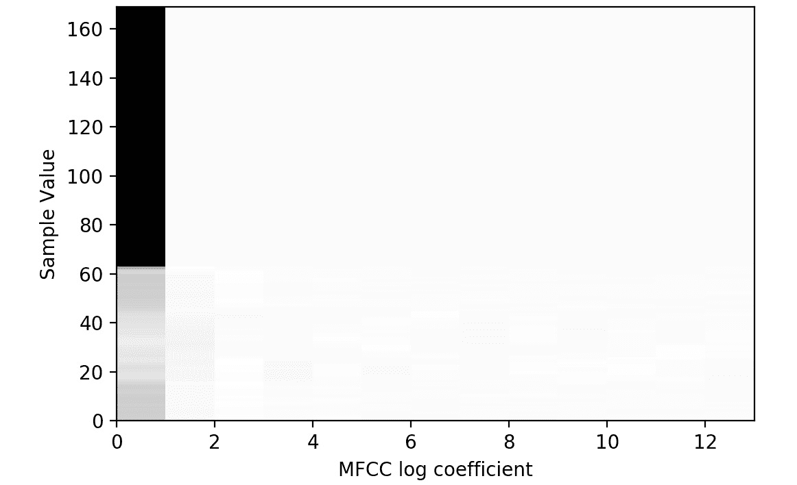

    图 2.17：音频文件 MFCC 的可视化表示

    上面的图表显示了 MFCC 值在*x*轴上的分布，以及音频样本在*y*轴上的不同点。MFCC 是原始音频信号的另一种表示方式，显示在*步骤 5*中，已被证明在语音识别相关应用中非常有用。

1.  加载`AUTOTUNE`，以便可以使用 CPU 的所有可用线程。创建一个函数，接受数据集对象，打乱数据集，使用你在*步骤 3*中创建的函数加载音频数据，使用你在*步骤 6*中创建的函数生成 MFCC，重复数据集对象，进行批处理，并进行预取操作。使用`AUTOTUNE`来根据可用的 CPU 预取数据，并设置缓冲区大小：

    ```py
    AUTOTUNE = tf.data.experimental.AUTOTUNE
    def prep_ds(ds, shuffle_buffer_size=1024, \
                batch_size=64):
        # Randomly shuffle (file_path, label) dataset
        ds = ds.shuffle(buffer_size=shuffle_buffer_size)
        # Load and decode audio from file paths
        ds = ds.map(load_audio, num_parallel_calls=AUTOTUNE)
        # generate MFCCs from the audio data
        ds = ds.map(apply_mfccs)
        # Repeat dataset forever
        ds = ds.repeat()
        # Prepare batches
        ds = ds.batch(batch_size)
        # Prefetch
        ds = ds.prefetch(buffer_size=AUTOTUNE)
        return ds
    ```

1.  使用你在*步骤 8*中创建的函数生成训练数据集。为此，使用 TensorFlow 的`from_tensor_slices`函数创建数据集对象，并传入音频文件的路径。之后，你可以使用你在*步骤 8*中创建的函数：

    ```py
    ds = tf.data.Dataset.from_tensor_slices(paths)
    train_ds = prep_ds(ds)
    ```

1.  获取数据集的第一批并打印出来：

    ```py
    for x in train_ds.take(1):\
        print(x)
    ```

    输出如下所示：

    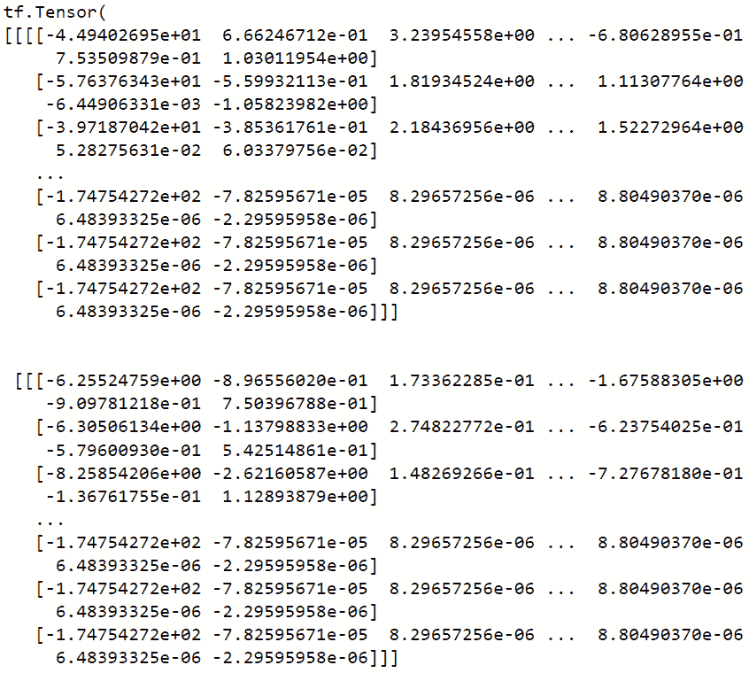

图 2.18：生成 MFCC 后的一批音频数据

输出显示了第一批 MFCC 频谱值的张量形式。

在这个练习中，你导入了音频数据。你处理了数据集并对数据集进行了批处理，以便它适合大规模训练。这个方法是一个综合性的方案，其中数据被加载并转换到频域，生成了频谱图，然后最终生成了 MFCC。

在下一个活动中，你将加载音频数据并取输入的绝对值，随后对值进行对数缩放。这将确保数据集中没有负值。你将使用与*练习 2.05*中使用的相同音频数据集，即 Google 的语音命令数据集。该数据集包含 1 秒钟长的单词发音。

## 活动 2.03：为批处理加载音频数据

在此活动中，你将加载音频数据进行批处理。所执行的音频预处理技术包括取绝对值并使用 1 加上该值的对数。这样可以确保结果值为非负且以对数形式缩放。最终结果将是一个可以输入到 TensorFlow 模型中进行训练的预处理数据集对象。

该活动的步骤如下：

1.  打开一个新的 Jupyter 笔记本以实现此活动。

1.  导入 TensorFlow 和`os`库。

1.  创建一个函数，使用 TensorFlow 的`read_file`函数加载音频文件，然后使用`decode_wav`函数解码。返回函数的结果张量的转置。

1.  使用`os.list_dir`将文件路径加载到音频数据列表中。

1.  创建一个函数，该函数接受一个数据集对象，对其进行打乱，使用你在*步骤 2*中创建的函数加载音频，并对数据集应用绝对值和`log1p`函数。此函数将数据集中的每个值加上`1`，然后对结果应用对数。接下来，重复数据集对象，对其进行批处理，并使用等于批处理大小的缓冲区大小进行预取。

1.  使用 TensorFlow 的`from_tensor_slices`函数创建一个数据集对象，并传入音频文件的路径。然后，将你在*第 4 步*中创建的函数应用到*第 5 步*中创建的数据集上。

1.  获取数据集的第一批数据并打印出来。

1.  绘制批次中的第一个音频文件。

    输出结果如下：

    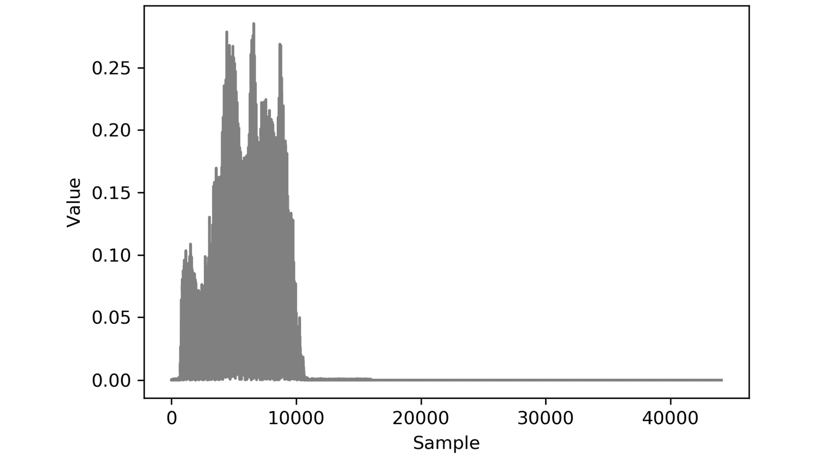

图 2.19：活动 2.03 的预期输出

注意

本活动的解决方案可以通过此链接找到。

在此活动中，你学习了如何批量加载和预处理音频数据。你使用了在*练习 2.05*中使用的大部分函数，加载数据并解码原始数据。*练习 2.05*与*活动 2.03*之间的区别在于预处理步骤；*练习 2.05*涉及为音频数据生成 MFCC，而*活动 2.03*则涉及对数据进行对数缩放。两者展示了可以用于所有音频数据建模应用的常见预处理技术。

在这一部分，你探索了如何将音频数据批量加载以用于 TensorFlow 模型。这个全面的方法展示了许多高级信号处理技术，这些技术为希望将音频数据应用于自己项目的从业者提供了良好的起点。

# 摘要

在本章中，你学习了如何加载不同形式的数据并为各种数据类型执行一些预处理步骤。你首先处理的是以 CSV 文件形式呈现的表格数据。由于数据集仅由一个 CSV 文件组成，你使用了 pandas 库将文件加载到内存中。

然后，你继续对数据进行预处理，通过缩放字段并将所有字段转换为数值数据类型。这一点很重要，因为 TensorFlow 模型只能对数值数据进行训练，如果所有字段的尺度相同，训练过程的速度和准确性都会得到提升。

然后，你探索了如何加载图像数据。你将数据批处理，这样就不需要一次性加载整个数据集，这也让你能够对图像进行数据增强。图像增强是有用的，因为它增加了有效的训练示例数量，并且有助于让模型更加稳健。

接下来，你学习了如何加载文本数据并利用预训练模型。这帮助你将文本嵌入到向量中，这些向量保留了关于文本的上下文信息。这样，你就可以将文本数据输入到 TensorFlow 模型中，因为它们需要数值张量作为输入。

最后，最后一部分讲解了如何加载和处理音频数据，并展示了一些高级信号处理技术，包括生成 MFCC（梅尔频率倒谱系数），它们可以用于生成信息密集的数值张量，并可以输入到 TensorFlow 模型中。

加载和预处理数据，以便将其输入到机器学习模型中，是训练任何机器学习模型的一个重要且必要的第一步。在下一章中，你将探索 TensorFlow 提供的许多资源，这些资源有助于模型构建的开发。
