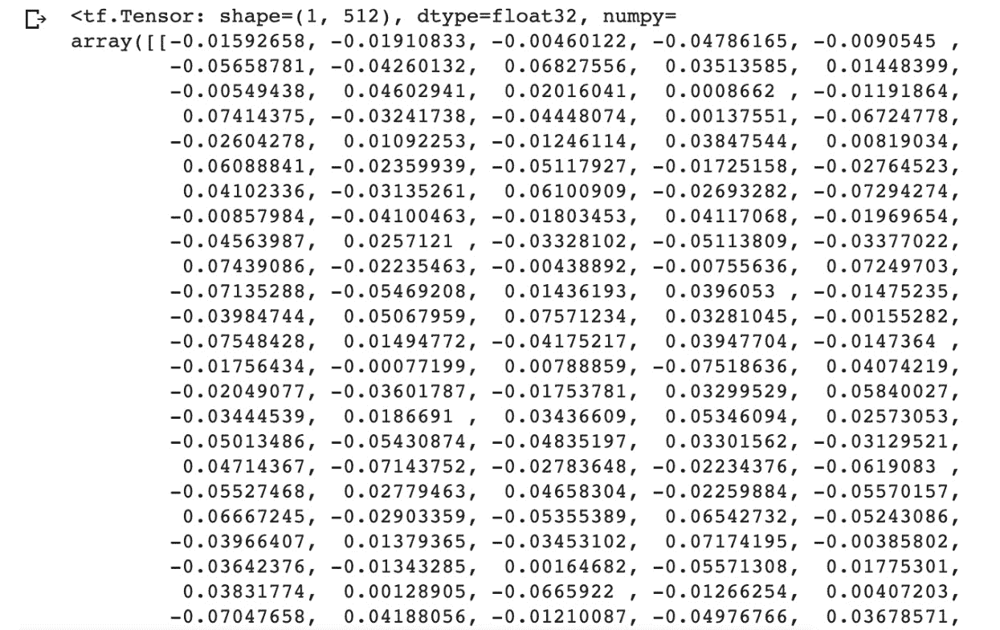

# 第三章：3. TensorFlow 开发

概述

TensorFlow 提供了许多资源，以创建高效的工作流程，帮助开发数据科学和机器学习应用程序。在本章中，你将学习如何使用 TensorBoard 来可视化 TensorFlow 图和操作，如何使用 TensorFlow Hub 来访问一个用户社区（这是一个非常好的预训练模型资源），以及如何使用 Google Colab，这是一个用于与他人共同开发代码的协作环境。你将使用这些工具通过最大化计算资源、转移预训练模型中的知识以及可视化模型构建过程的各个方面来加速开发。

# 介绍

在上一章中，你学习了如何加载和处理各种数据类型，以便在 TensorFlow 建模中使用。这包括来自 CSV 文件的表格数据、图像数据、文本数据和音频文件。到本章结束时，你应该能够处理所有这些数据类型，并从中生成数值张量，这些张量可以作为模型训练的输入。

在本章中，你将学习到有助于模型构建的 TensorFlow 资源，并帮助你创建高效的机器学习算法。你将探索实践者可以利用的实用资源，包括 TensorBoard、TensorFlow Hub 和 Google Colab。TensorBoard 是一个互动平台，提供了在 TensorFlow 开发过程中生成的计算图和数据的可视化表示。该平台解决了机器学习中常见的可视化各种数据类型的问题。该可视化工具包可以在模型构建过程中绘制模型评估指标，展示图像，播放音频数据，并执行许多其他任务，这些任务通常需要编写自定义函数。TensorBoard 提供了简单的日志写入函数，日志可以在浏览器窗口中进行可视化。

TensorFlow Hub 是一个开源库，包含了预训练的机器学习模型，代码库对所有人开放，供用户用于自己的应用程序并进行修改。用户可以通过专门的库将模型直接导入代码，并可以在[`tfhub.dev/`](https://tfhub.dev/)上查看。TensorFlow Hub 允许用户使用由领域专家创建的最先进的模型，并能显著缩短将预训练模型作为用户模型一部分时的训练时间。

例如，该平台包含了 ResNet-50 模型，这是一个 50 层的**人工神经网络**（**ANN**），在 ILSVRC 2015 分类任务中获得了第一名，该任务是将图像分类为 1000 个不同的类别。该网络拥有超过 2300 万个可训练参数，并在超过 1400 万张图像上进行了训练。从头开始在一台普通笔记本电脑上训练该模型，并达到接近 TensorFlow Hub 上预训练模型的准确性，可能需要几天时间。正因如此，利用 TensorFlow Hub 模型可以加速开发进程。

本章中你将了解的最后一个资源是 Google Colab，它是一个在线开发环境，用于在 Google 服务器上执行 Python 代码并创建机器学习算法。该环境甚至可以访问包含**图形处理单元**（**GPUs**）和**张量处理单元**（**TPUs**）的硬件，可以免费加速模型训练。Google Colab 可通过 [`colab.research.google.com/`](https://colab.research.google.com/) 访问。

Google Colab 解决了设置开发环境的问题，可以创建可以与他人共享的机器学习模型。例如，多名机器学习实践者可以开发相同的模型，并在同一硬件实例上训练该模型，而不需要各自使用自己的资源来运行该实例。顾名思义，该平台促进了机器学习实践者之间的协作。

现在，让我们来探索 TensorBoard，这是一个帮助实践者理解和调试机器学习工作流的工具。

# TensorBoard

TensorBoard 是一个用于辅助机器学习实验的可视化工具包。该平台具有仪表板功能，可以可视化数据科学或机器学习实践者可能需要的多种常见数据类型，例如标量值、图像批次和音频文件。虽然这些可视化可以通过其他绘图库创建，例如 `matplotlib` 或 `ggplot`，但 TensorBoard 将多种可视化集成在一个易于使用的环境中。此外，创建这些可视化所需的唯一操作是在构建、拟合和评估步骤中记录跟踪信息。TensorBoard 有助于以下任务：

+   可视化模型图以查看和理解模型的架构：

    

图 3.1：TensorBoard 中模型图和函数的可视化表示

+   查看变量的直方图和分布，并跟踪它们随时间的变化。

+   显示图像、文本和音频数据。例如，以下图显示了来自 Fashion MNIST 数据集的图像（[`www.tensorflow.org/datasets/catalog/fashion_mnist`](https://www.tensorflow.org/datasets/catalog/fashion_mnist)）：

    

图 3.2：在 TensorBoard 中查看图像

+   在模型训练过程中绘制模型评估指标随 epoch 变化的图：

    

图 3.3：在 TensorBoard 中绘制模型评估指标

+   用于可视化嵌入向量的降维：

    

图 3.4：在 TensorBoard 中可视化嵌入向量

TensorBoard 从开发过程中写入的日志中创建可视化图像。为了创建日志以可视化图形，需要在开发代码中初始化文件写入对象，并将日志的位置作为参数提供。文件写入对象通常在 Jupyter notebook 或等效开发环境的开始阶段创建，在写入任何日志之前。具体如下：

```py
logdir = 'logs/'
writer = tf.summary.create_file_writer(logdir)
```

在前面的代码中，设置了写入日志的目录，如果该目录尚不存在，则在运行代码后，工作目录中会自动创建一个新目录。文件写入对象在日志导出时将文件写入日志目录。要开始追踪，必须执行以下代码：

```py
tf.summary.trace_on(graph=True, profiler=True)
```

前面的命令启动了追踪功能，用于记录从执行命令时开始的计算图。如果没有开启追踪，则不会记录任何内容，因此也无法在 TensorBoard 中可视化。计算图的追踪完成后，可以使用文件写入对象将日志写入日志目录，具体如下：

```py
with writer.as_default():
    tf.summary.trace_export(name="my_func_trace",\
                            step=0, profiler_outdir=logdir)
```

在写入日志时，需要使用以下参数：

+   `name`：该参数描述了摘要的名称。

+   `step`：该参数描述了摘要的单调步长值，如果对象随时间变化不大，可以将其设置为 `0`。

+   `profiler_outdir`：该参数描述了写入日志的位置，如果在定义文件写入对象时没有提供该参数，则此参数是必需的。

日志写入目录设置完成后，可以通过命令行启动 TensorBoard，使用以下命令传入日志目录作为 `logdir` 参数：

```py
tensorboard --logdir=./logs
```

某些版本的 Jupyter Notebooks 允许在笔记本中直接运行 TensorBoard。然而，库依赖关系和冲突常常会阻止 TensorBoard 在笔记本环境中运行，在这种情况下，可以通过命令行在单独的进程中启动 TensorBoard。在本书中，你将使用 TensorFlow 版本 2.6 和 TensorBoard 版本 2.1，并且始终通过命令行启动 TensorBoard。

在第一个练习中，你将学习如何使用 TensorBoard 可视化图计算过程。你将创建一个执行张量乘法的函数，并在 TensorBoard 中可视化计算图。

## 练习 3.01：使用 TensorBoard 可视化矩阵乘法

在本练习中，你将进行 `7x7` 矩阵的矩阵乘法运算，使用随机值，并追踪计算图和性能信息。之后，你将使用 TensorBoard 查看计算图。此练习将在 Jupyter Notebook 中进行。启动 TensorBoard 需要在命令行中运行命令，如最后一步所示。

请按照以下步骤操作：

1.  打开一个新的 Jupyter Notebook，导入 TensorFlow 库，并设置随机种子以保证结果的可重复性。由于你正在生成随机值，设置种子可以确保每次运行代码时生成的值相同：

    ```py
    import tensorflow as tf
    tf.random.set_seed(42)
    ```

1.  创建一个 `file_writer` 对象，并设置日志存储目录：

    ```py
    logdir = 'logs/'
    writer = tf.summary.create_file_writer(logdir)
    ```

1.  创建一个 TensorFlow 函数来进行两个矩阵相乘：

    ```py
    @tf.function
    def my_matmult_func(x, y):
        result = tf.matmul(x, y)
        return result
    ```

1.  创建两个形状为 `7x7` 的张量，数据为随机变量：

    ```py
    x = tf.random.uniform((7, 7))
    y = tf.random.uniform((7, 7))
    ```

1.  使用 TensorFlow 的 `summary` 类开启图形追踪：

    ```py
    tf.summary.trace_on(graph=True, profiler=True)
    ```

1.  将第*3 步*中创建的函数应用于第*4 步*中创建的示例张量。接下来，将追踪数据导出到 `log` 目录，并为图形设置 `name` 参数以便参考，同时将 `log` 目录设置为 `profiler_outdir` 参数。`step` 参数表示摘要的单调步长值；如果被追踪的值有变化，该值应非零，并且可以通过该参数指定的步长进行可视化。对于静态对象，例如此处的图形追踪，步长应设置为零：

    ```py
    z = my_matmult_func(x, y)
    with writer.as_default():
        tf.summary.trace_export(name="my_func_trace",\
                                step=0,\
                                profiler_outdir=logdir)
    ```

1.  最后，使用命令行在当前工作目录下启动 TensorBoard，查看图形的可视化表示。启动 TensorBoard 后，可以通过访问提供的网址在网页浏览器中查看：

    ```py
    tensorboard --logdir=./logs
    ```

    对于在 Windows 上运行的用户，请在 Anaconda 提示符下运行以下命令：

    ```py
    tensorboard --logdir=logs
    ```

    通过运行上述代码，你将能够可视化以下模型图：

    

图 3.5：在 TensorBoard 中矩阵乘法的可视化表示

在 TensorBoard 中，你可以查看一个张量如何将两个矩阵相乘以生成另一个矩阵。通过选择不同的元素，你可以查看计算图中每个对象的相关信息，具体取决于对象的类型。在这里，你创建了两个张量，命名为 `x` 和 `y`，它们由底部的节点表示。通过选择其中一个节点，你可以查看有关张量的属性，包括它的数据类型（`float`）、用户指定的名称（`x` 或 `y`），以及输出节点的名称（`MatMul`）。这些表示输入张量的节点然后被输入到另一个节点，该节点表示张量乘法过程，标记为 `MatMul`，它是在 TensorFlow 函数之后的节点。选择该节点后，你可以查看该函数的属性，包括输入参数、输入节点（`x` 和 `y`）和输出节点（`Identity`）。最后两个节点，标记为 `Identity` 和 `identity_RetVal`，表示输出张量的创建。

在本次练习中，你使用 TensorBoard 可视化计算图。你创建了一个简单的函数，将两个张量相乘，并通过追踪图并记录结果来记录过程。在记录了计算图之后，你可以通过启动 TensorBoard 并将工具指向日志的存储位置来可视化它。

在第一个活动中，你将练习使用 TensorBoard 可视化一个更复杂的张量转换。实际上，任何张量过程和转换都可以在 TensorBoard 中可视化，前一个练习中演示的过程是创建和编写日志的好指南。

## 活动 3.01：使用 TensorBoard 可视化张量转换

给定两个形状为`5x5x5`的张量。你需要创建 TensorFlow 函数来执行张量转换，并查看转换的可视化表示。

你将采取的步骤如下：

1.  导入 TensorFlow 库并将随机种子设置为`42`。

1.  设置日志目录并初始化文件写入对象以写入跟踪。

1.  创建一个 TensorFlow 函数，将两个张量相乘，并使用 `ones_like` 函数向结果张量的所有元素加上一个值 `1`，以创建一个与矩阵乘法结果相同形状的张量。然后，对张量的每个值应用 `sigmoid` 函数。

1.  创建两个形状为`5x5x5`的张量。

1.  打开图形追踪。

1.  将函数应用于这两个张量，并将追踪记录导出到日志目录。

1.  在命令行中启动 TensorBoard，并在网页浏览器中查看图形：

    

图 3.6：TensorBoard 中张量转换的可视化表示

注意

本活动的解决方案可以通过这个链接找到。

然而，TensorBoard 不仅仅用于可视化计算图。通过使用合适的 TensorFlow `summary` 方法，将图片、标量变量、直方图和分布写入日志目录后，均可在 TensorBoard 中查看。例如，图片可以按照以下方式写入日志：

```py
with file_writer.as_default():
    tf.summary.image("Training data", training_images, step=0)
```

这样做的结果将是在日志目录中添加一个名为 `Training data` 的文件，其中包含文件写入器写入的图片。可以通过选择标签为 `IMAGES` 的选项卡在 TensorBoard 中查看这些图片。

同样地，标量变量也可以以如下方式写入日志，以便在 TensorBoard 中查看：

```py
with file_writer.as_default():
    tf.summary.scalar('scalar variable', variable, step=0)
```

音频文件也可以按照以下方式写入日志，以便在 TensorBoard 中播放：

```py
with file_writer.as_default():
    tf.summary.audio('audio file', data, sample_rate=44100, \
                     step=0)
```

可以通过传入数据如下方式记录直方图：

```py
with file_writer.as_default():
    tf.summary.histogram('histogram', data, step=0)
```

在所有这些写入日志的数据示例中，`step` 参数被设置为零，因为这是一个必需的参数，不能为 null。将参数设置为零表示该值是静态的，不会随时间变化。每种数据类型将在 TensorBoard 中的不同标签下显示。

在下一个练习中，你将把图片写入 TensorBoard，以便可以直接在平台内查看。使用 TensorBoard，这个过程变得非常简便，而不需要编写自定义代码来查看图片。你可能希望可视化图片批次，以验证标签、检查数据增强过程，或验证图片的整体质量。

## 练习 3.02：使用 TensorBoard 可视化图片批次

在这个练习中，你将使用 TensorBoard 查看图片批次。你将创建一个文件写入器和一个数据生成器，并将一批图片写入日志文件。最后，你将会在 TensorBoard 中查看这些图片。

注意

你可以在 `image_data` 文件夹中找到图片：[`packt.link/1ue46`](https://packt.link/1ue46)。

按照以下步骤操作：

1.  导入 TensorFlow 库和 `ImageDataGenerator` 类：

    ```py
    import tensorflow as tf
    from tensorflow.keras.preprocessing.image import \
        ImageDataGenerator
    ```

1.  创建一个 `file_writer` 对象，并设置日志存储的目录：

    ```py
    logdir = 'logs/'
    writer = tf.summary.create_file_writer(logdir)
    ```

1.  初始化一个 `ImageDataGenerator` 对象：

    ```py
    train_datagen = ImageDataGenerator(rescale = 1./255)
    ```

1.  使用数据生成器的 `flow_from_directory` 方法创建一个批次图片加载器：

    ```py
    batch_size = 25
    training_set = train_datagen.flow_from_directory\
                   ('image_data',\ 
                    target_size = (224, 224),\ 
                    batch_size = batch_size,\ 
                    class_mode = 'binary') 
    ```

    注意

    确保将路径（高亮部分）更改为系统上目录的位置。如果你是在存储数据集的同一目录下运行 Jupyter notebook，可以直接运行上述代码而无需修改。

1.  从第一批图片中取出并使用文件写入器将其写入日志：

    ```py
    with file_writer.as_default():
        tf.summary.image("Training data", \
                         next(training_set)[0], \
                         max_outputs=batch_size, \
                         step=0)
    ```

1.  在命令行中启动 TensorBoard 以查看图形的可视化表示。启动 TensorBoard 后，可以通过访问提供的 URL 在 Web 浏览器中查看 TensorBoard。默认的 URL 是 `http://localhost:6006/`：

    ```py
    tensorboard --logdir=./logs
    ```

    对于在 Windows 上运行的用户，请在 Anaconda 提示符下运行以下命令：

    ```py
    tensorboard --logdir=logs
    ```

    目录中的图片将在 TensorBoard 中显示如下：

    

图 3.7：在 TensorBoard 中查看图片批次

注意

系统中的图像可能会有所不同。

TensorBoard 中的结果是来自第一批次的图像。你可以看到它们是船和飞机的图像。TensorBoard 还提供了调整图像亮度和对比度的功能；然而，这仅会影响 TensorBoard 中的图像，而不会影响底层的图像数据。

在这个练习中，你通过 TensorBoard 查看了一个图像数据生成器的图像批次。这是验证训练数据质量的一个极好方法。虽然不必验证每一张图像的质量，但可以通过 TensorBoard 轻松查看样本批次。

本节介绍了 TensorFlow 提供的一项资源，帮助数据科学和机器学习从业者理解和可视化数据和算法：TensorBoard。你已使用该资源可视化计算图和图像批次。在下一节中，你将探索 TensorFlow Hub，它是一个可以轻松访问并集成到自定义应用中的机器学习模块库。这些模型由该领域的专家创建，你将学习如何将它们应用于自己的项目。

# TensorFlow Hub

TensorFlow Hub 是一个机器学习模块的在线库。该模块包含了使用任何模型所需的资产及其相关权重（例如，用于预测或迁移学习），在迁移学习中，训练一个模型所获得的知识被用于解决不同但相关的问题。这些模块可以直接用于创建它们所训练的应用，或者可以作为构建新应用的起点。可以通过以下网址访问该平台：[`tfhub.dev/`](https://tfhub.dev/)。当你访问该网站时，会看到以下页面：


图 3.8：TensorFlow Hub 首页

在这里，你可以浏览各个领域的模型。最受欢迎的领域包括图像、文本和视频；这些领域中有许多模型：


图 3.9：TensorFlow Hub 上可用的模型领域

TensorFlow Hub 上有许多模型可供使用，这些模型以图像作为输入数据。通常，这些模型用于图像分类、分割、嵌入、生成、增强和风格迁移等任务。为文本数据创建的模型通常用于文本嵌入，而用于视频数据的模型则用于视频分类。还有用于音频数据的模型，涉及命令检测和音高提取等任务。TensorFlow Hub 不断更新最新的先进模型，这些模型可用于各种应用。

选择模型后，你将进入以下页面，该页面会告诉你关于该模型的信息，如模型大小、架构、训练使用的数据集以及参考的 URL：


图 3.10：TensorFlow Hub 模型的页面

在引用自己的应用程序所需的模型时，你需要获取模型页面的 URL 以加载它。

可以通过使用 `tensorflow_hub` 库在笔记本环境中访问 TensorFlow Hub 上的模型。可以按照以下方式导入该库：

```py
import tensorflow_hub as hub
```

可以通过使用库的 `load` 函数并传入模型的参考 URL 来加载模型：

```py
module = hub.load("https://tfhub.dev/google/imagenet"\
                  "/inception_resnet_v2/classification/4")
```

可以通过访问 `signatures` 属性来查看模型模块的资源，例如其架构。每个模型的 `signatures` 属性中可能有不同的键；然而，相关信息通常会包含在 `default` 键中：

```py
model = module.signatures['default']
```

该模型还可以通过将整个模型视为一个单独的 Keras 层，并使用 `KerasLayer` 方法直接用于训练：

```py
layer = hub.KerasLayer("https://tfhub.dev/google/imagenet"\
                       "/inception_resnet_v2/classification/4")
```

将模型作为层用于自己的应用程序的过程称为**迁移学习**，将在后续章节中更深入地探讨。

可以通过将模型图写入日志来查看 TensorFlow Hub 中的模型，方法是使用文件写入器，如下所示：

```py
from tensorflow.python.client import session
from tensorflow.python.summary import summary
from tensorflow.python.framework import ops
with session.Session(graph=ops.Graph()) as sess:
    file_writer = summary.FileWriter(logdir)
    file_writer.add_graph(model.graph)
```

在接下来的练习中，你将从 TensorFlow Hub 下载一个模型。加载模型后，你将使用 TensorBoard 查看模型的架构。

## 练习 3.03：从 TensorFlow Hub 下载模型

在本练习中，你将从 TensorFlow Hub 下载一个模型，然后在 TensorBoard 中查看该模型的架构。将要下载的模型是 `InceptionV3` 模型。该模型是在 TensorFlow 1 中创建的，因此在我们使用 TensorFlow 2 时，需要一些额外的步骤来显示模型的细节。该模型包含两部分：一部分包括卷积层，用于从图像中提取特征，另一部分是具有全连接层的分类部分。

由于原作者已恰当地命名了这些层，因此它们将在 TensorBoard 中可见。

注意

你可以在这里获取 `InceptionV3` 模型：[`tfhub.dev/google/imagenet/inception_v3/classification/5`](https://tfhub.dev/google/imagenet/inception_v3/classification/5)。

按照以下步骤完成此练习：

1.  从 TensorFlow 导入以下库：

    ```py
    import tensorflow as tf
    import tensorflow_hub as hub
    from tensorflow.python.client import session
    from tensorflow.python.summary import summary
    from tensorflow.python.framework import ops
    ```

    导入和构建模型需要 TensorFlow 和 TensorFlow Hub 库，此外，还需要使用 TensorFlow 2 视图功能来可视化使用 TensorFlow 1 创建的模型，这也是你在本书中使用的版本。

1.  为存储日志创建一个变量：

    ```py
    logdir = 'logs/'
    ```

1.  通过使用 `tensorflow_hub` 库中的 `load` 方法并传入模型的 URL，可以加载模型模块：

    ```py
    module = hub.load('https://tfhub.dev/google/imagenet'\
                      '/inception_v3/classification/5')
    ```

1.  从模块的 `signatures` 属性加载模型：

    ```py
    model = module.signatures['default']
    ```

1.  使用文件写入器将模型图写入 TensorBoard：

    ```py
    with session.Session(graph=ops.Graph()) as sess:
        file_writer = summary.FileWriter(logdir)
        file_writer.add_graph(model.graph)
    ```

1.  在命令行中启动 TensorBoard，以查看图形的可视化表示。启动 TensorBoard 后，您可以通过访问提供的 URL 在网页浏览器中查看 TensorBoard：

    ```py
    tensorboard --logdir=./logs
    ```

    对于运行 Windows 的用户，在 Anaconda 提示符中运行以下命令：

    ```py
    tensorboard --logdir=logs
    ```

    您应该能看到类似以下的图像：

    

    ](img/B16341_03_11.jpg)

图 3.11：在 TensorBoard 中查看的 InceptionV3 模型架构

TensorBoard 中的结果是 `InceptionV3` 模型的架构。在这里，您可以查看模型每一层的所有细节，包括输入、输出和激活函数。

在本次练习中，您成功地使用 TensorFlow Hub 库将模型下载到 Jupyter 笔记本环境中。一旦模型被加载到环境中，您就使用 TensorBoard 可视化了模型的架构。这是一种帮助您在调试过程中可视化模型架构的有效方式。

在本节中，您已探讨了如何使用 TensorFlow Hub 作为一种方式，利用机器学习领域专家创建的众多优秀模型。正如您将在后续章节中发现的，这些模型可以用于解决与它们最初开发用途稍有不同的应用问题；这就是所谓的迁移学习。在下一节中，您将学习如何使用 Google Colab，这是一种类似于 Jupyter Notebooks 的环境，可以在 Google 服务器上在线协作开发 Python 应用程序。

# Google Colab

Google Colab 使用户能够在 Google 服务器上执行代码，专门为数据科学从业人员设计，用于在协作环境中开发机器学习代码。该平台可以在 [`colab.research.google.com/`](https://colab.research.google.com/) 上使用，提供在网页浏览器中直接开发 Python 编程语言的机会，无需在本地计算机上执行任何代码。该环境预加载了最新的数据科学和机器学习库，提供了一个方便的替代方案，而无需使用 Jupyter Notebooks 设置开发环境。此外，该平台还提供免费的使用层级，包括访问 GPU 和 TPU，无需配置，并且在协作者之间共享笔记本非常简便。

Google Colab 提供了与 Jupyter Notebooks 非常相似的开发体验，使用 Google Colab 相较于 Jupyter Notebooks 也有一些优点和缺点。

## Google Colab 的优点

以下是使用 Google Colab 的一些主要优点：

+   **协作**：许多用户可以访问同一个笔记本并共同协作工作。

+   **托管环境**：Google Colab 运行在 Google 服务器上，如果本地计算资源有限，这将非常有帮助。无需设置开发环境，因为许多软件包已经预装。

+   **易于访问**：Google Colab 直接保存到 Google Drive，提供无缝集成。由于笔记本保存在云端，因此无论何时只要能访问 Google Drive，都可以访问它们。

+   **加速训练时间**：提供 GPU 和 TPU 服务器，这可以加速训练机器学习模型的时间，尤其是有许多隐藏层的人工神经网络（ANN）。

+   **交互式小部件**：可以向笔记本添加小部件，以交互方式轻松地变化输入参数和变量。

## Google Colab 的缺点

以下是使用 Google Colab 的一些缺点：

+   **受限的运行时**：Google Colab 上仅提供两个版本的 TensorFlow，1.X 和 2.X，且它们会更新，因此某些功能可能会随时间变化，从而导致代码损坏。此外，TensorFlow 的版本可能与其他软件包不兼容。

+   **依赖互联网**：由于 Python 代码是在 Google 服务器上执行的，Google Colab 只能在有互联网连接的情况下访问。

+   **无自动保存**：笔记本必须手动保存，这与 Jupyter Notebooks 的自动保存功能不同。

+   **会话超时**：在虚拟机上运行的笔记本有最大 12 小时的使用时间，长时间未使用的环境将被断开连接。

+   `geoplotlib` 可能无法显示交互元素，因为与预装的库存在不兼容问题。

## 在 Google Colab 上开发

由于 Google Colab 使用笔记本，开发环境与 Jupyter Notebooks 非常相似。事实上，IPython 笔记本可以加载到 Google Colab 中。可以通过直接上传、Google Drive 或 GitHub 仓库加载它们。或者，该平台提供了示例笔记本，供用户入门。当你访问该平台时，[`colab.research.google.com/`](https://colab.research.google.com/)，你将看到以下界面，其中提供了可打开的笔记本或选择新笔记本开始开发的选项：


图 3.12：Google Colab 的主页

如果选择了一个新笔记本，你将看到以下界面，这可能让你想起在 Jupyter Notebooks 中开发的场景，且有许多相同的功能。你可以以完全相同的方式创建代码或文本片段，许多从业者发现从 Jupyter 过渡到 Colab 非常顺畅：


图 3.13：Google Colab 中的空白笔记本

在接下来的练习中，您将使用 Google Colab 导入并操作数据。在 Google Colab 与 Jupyter Notebooks 工作的主要区别之一是，在 Google Colab 中工作时，您是在远程服务器上开发。这意味着任何用于分析或训练模型的数据必须加载到 Google Drive 中或直接在线可用。在以下练习中，您将直接从 GitHub 仓库导入本书的 CSV 数据。

## 练习 3.04：使用 Google Colab 可视化数据

在本练习中，您将从 GitHub 仓库加载一个数据集，该数据集包含针对韩国首尔次日最高和最低气温预报的偏差校正数据。

注意

您可以在此处找到 `Bias_correction_ucl.csv` 文件：[`packt.link/8kP3j`](https://packt.link/8kP3j)。

为了执行此练习，您需要导航到 [`colab.research.google.com/`](https://colab.research.google.com/) 并创建一个新的笔记本进行操作。您需要连接到一个启用了 GPU 的环境，以加速 TensorFlow 操作，如张量乘法。一旦数据加载到开发环境中，您将查看前五行。接下来，您将删除 `Date` 字段，因为矩阵乘法需要数值字段。然后，您将对数据集进行张量乘法运算，使用一个张量或均匀随机变量。

按照以下步骤完成此练习：

1.  导入 TensorFlow 并检查库的版本：

    ```py
    import tensorflow as tf
    print('TF version:', tf.__version__)
    ```

    您应当得到 TensorFlow 库的版本：

    

    图 3.14：Google Colab 中可用的 TensorFlow 版本的输出

1.  导航到 `编辑` 标签，进入 `笔记本设置`，然后从 `硬件加速` 下拉菜单中选择 `GPU`。通过显示 GPU 设备名称来验证 GPU 是否已启用：

    ```py
    tf.test.gpu_device_name()
    ```

    您应当得到 GPU 设备的名称：

    

    图 3.15：GPU 设备名称

1.  导入 `pandas` 库并直接从 GitHub 仓库加载数据集：

    ```py
    import pandas as pd
    df = pd.read_csv('https://raw.githubusercontent.com'\
                     '/PacktWorkshops/The-TensorFlow-Workshop'\
                     '/master/Chapter03/Datasets'\
                     '/Bias_correction_ucl.csv')
    ```

1.  使用 `head` 方法查看数据集的前五行：

    ```py
    df.head()
    ```

    您应当得到以下输出：

    

    图 3.16：DataFrame 前五行的输出

1.  删除 `Date` 字段，因为您将进行矩阵乘法，而矩阵乘法需要数值字段：

    ```py
    df.drop('Date', axis=1, inplace=True)
    ```

1.  导入 NumPy，将 DataFrame 转换为 NumPy 数组，然后创建一个包含均匀随机变量的 TensorFlow 张量。张量的第一个轴的值将等于数据集字段的数量，第二个轴将等于 `1`：

    ```py
    import numpy as np
    df = np.asarray(df).astype(np.float32)
    random_tensor = tf.random.normal((df.shape[1],1))
    ```

1.  使用 TensorFlow 的 `matmul` 函数对数据集和随机张量进行张量乘法，并打印结果：

    ```py
    tf.matmul(df, random_tensor)
    ```

    您应当得到如下输出：

    

图 3.17：张量乘法的输出

执行乘法运算的结果是一个新的张量，形状为`7752x1`。

在本练习中，你学习了如何使用 Google Colab。你观察到 Google Colab 提供了一个方便的环境来构建机器学习模型，并且预先加载了许多可能需要的机器学习库。你还可以看到使用的是这些库的最新版本。不幸的是，TensorFlow 的版本不能修改，因此在生产环境中使用 Google Colab 可能不是最合适的应用。但它非常适合开发环境。

在接下来的活动中，你将进一步练习如何在开发环境中使用 Google Colab。你将以与 Jupyter Notebooks 中相同的方式使用 TensorFlow Hub。本活动将类似于*练习 2.04*（*加载文本数据到 TensorFlow 模型*），其中通过使用预训练的词嵌入模型处理文本数据。利用预训练模型将在未来章节中介绍，但本活动将展示如何轻松利用来自 TensorFlow Hub 的预训练模型。

## 活动 3.02：从 TensorFlow Hub 中进行预训练模型的词嵌入

在本活动中，你将练习在 Google Colab 环境中工作。你将从 TensorFlow Hub 下载一个通用句子编码器，URL 为：[`tfhub.dev/google/universal-sentence-encoder/4`](https://tfhub.dev/google/universal-sentence-encoder/4)。模型加载到内存后，你将使用它对一些示例文本进行编码。

按照以下步骤操作：

1.  导入 TensorFlow 和 TensorFlow Hub，并打印库的版本。

1.  将模块的句柄设置为通用句子编码器的 URL。

1.  使用 TensorFlow Hub 的`KerasLayer`类创建一个 hub 层，并传入以下参数：`module_handle`、`input_shape` 和 `dtype`。

1.  创建一个包含字符串`The TensorFlow Workshop`的列表，用该编码器进行编码。

1.  将`hub_layer`应用于文本，将句子嵌入为一个向量。

    你的最终输出应该如下所示：

    

图 3.18：活动 3.02 的预期输出

注意

本活动的解决方案可以通过此链接找到。

本节介绍了 Google Colab，这是一种在线开发环境，用于在 Google 服务器上运行 Python 代码。这可以使任何有互联网连接的从业人员开始构建机器学习模型。此外，你可以浏览预训练模型的选择，使用本章中学习到的另一个资源——TensorFlow Hub，开始为自己的应用创建模型。Google Colab 为从业者提供了零配置、最新的环境，甚至可以访问 GPU 和 TPU 以加速模型训练。

# 概要

在本章中，您使用了多种 TensorFlow 资源，包括 TensorBoard、TensorFlow Hub 和 Google Colab。 TensorBoard 为用户提供了一种可视化计算模型图、指标和任何实验结果的方法。 TensorFlow Hub 允许用户利用领域专家构建的预训练模型加速他们的机器学习开发。 Google Colab 提供了一个协作环境，让您在 Google 服务器上开发机器学习模型。 开发高效的机器学习模型是一个试验和错误的迭代过程，能够可视化每个步骤可以帮助从业者调试和改进他们的模型。 此外，理解领域专家如何构建他们的模型，并能够利用网络中的预训练权重，可以显著减少训练时间。 所有这些资源都用于提供一个有效的工作流程，以开发和调试机器学习算法。

在下一章中，您将开始在 TensorFlow 中创建自己的机器学习模型，从回归模型开始。 回归模型旨在从输入数据中预测连续变量。 您将利用 Keras 层来制作您的回归模型，这对于构建人工神经网络非常有用。
