# 第四章：4. 回归与分类模型

概述

在本章中，你将学习如何使用 TensorFlow 构建回归和分类模型。你将利用 TensorFlow 中的 Keras 层来构建模型，Keras 是一种简单的建模方法，提供了一个高级 API 来构建和训练模型。你将创建模型来解决回归和分类任务，包括分类不同分子结合特性的任务。你还将使用 TensorBoard 来可视化 TensorFlow 模型的架构并查看训练过程。

# 介绍

在上一章中，你学习了如何使用一些 TensorFlow 资源来帮助开发。这些资源包括 TensorBoard（用于可视化计算图）、TensorFlow Hub（一个机器学习模块的在线仓库）和 Google Colab（一个在线 Python 开发环境，用于在 Google 服务器上运行代码）。所有这些资源都帮助机器学习从业者高效地开发模型。

在本章中，你将探索如何使用 TensorFlow 创建人工神经网络（ANNs）。你将构建具有不同架构的 ANNs 来解决回归和分类任务。回归任务旨在从输入的训练数据中预测连续变量，而分类任务则旨在将输入数据分类到两个或更多类别中。例如，预测某一天是否会下雨的模型是一个分类任务，因为模型的结果会有两个类别——下雨或不下雨。然而，预测某一天降水量的模型则是一个回归任务，因为模型的输出是一个连续变量——降水量。

用于解决这些任务的模型代表了机器学习模型中的一大类，许多机器学习问题都属于这两大类。 本章将演示如何在 TensorFlow 中创建、训练和评估回归和分类模型。你将运用前几章所学的内容（包括使用 TensorBoard 来监控模型训练过程），了解如何构建高效的模型。

本章介绍了构建人工神经网络（ANNs）时使用的各种参数（称为**超参数**），这些参数包括激活函数、损失函数和优化器。模型拟合过程中的其他超参数包括训练轮次（epochs）和批量大小（batch size），它们分别决定了整个数据集用于更新权重的次数和每次更新时使用的数据点数量。你还将学习如何在模型拟合过程中记录变量，以便在 TensorBoard 中进行可视化。这样可以帮助你判断模型是欠拟合还是过拟合训练数据。最后，在构建模型后，你将学习如何在数据集上评估模型，看看它的表现如何。

# 序列模型

顺序模型用于构建回归和分类模型。在顺序模型中，信息从开始的输入层传播到结束的输出层。模型中的层是按顺序堆叠的，每一层都有输入和输出。

存在其他类型的人工神经网络（ANN）模型，例如递归神经网络（其输出反馈到输入中），这些将在后续章节中介绍。顺序神经网络与递归神经网络的区别如*图 4.01*所示。在这两种模型中，信息从输入层通过隐藏层流向输出层，箭头的方向表示这一流向。然而，在递归结构中，隐藏层的输出会反馈到隐藏层的输入：

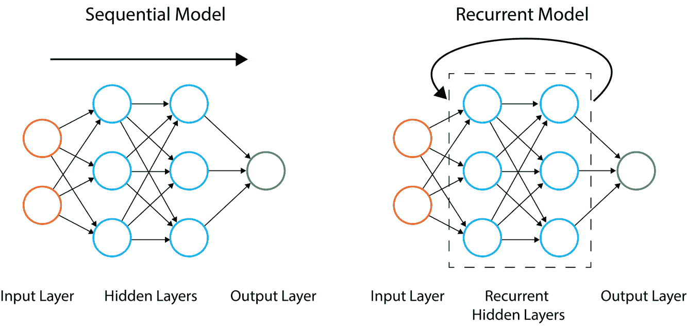

](img/B16341_04_01.jpg)

图 4.1：顺序和递归人工神经网络的架构

在接下来的章节中，您将学习如何在 TensorFlow 中创建顺序模型，这些模型构成了回归和分类模型的基础。您将使用 Keras API，该 API 现在作为 TensorFlow 库的一部分，专门用于顺序模型，因为这个高级 API 提供了一个简单的接口来创建这些模型。使用该 API，您会发现向模型中添加更多层非常容易，非常适合新手学习这个领域。

可以按如下方式初始化一个顺序模型：

```py
model = tf.keras.Sequential()
```

一旦模型初始化完成，就可以向模型添加层。在本节中，您还将探讨如何向模型中添加 Keras 层。

## Keras 层

Keras 层包含在 TensorFlow 包中。Keras 层是常用层的集合，可以轻松地添加到您的顺序模型中。

注意

您可以在这里查看 Keras 层的所有可能选项：[`www.tensorflow.org/api_docs/python/tf/keras/layers`](https://www.tensorflow.org/api_docs/python/tf/keras/layers)。

要向 `Sequential` 类的模型添加层，可以使用模型的 `add` 方法。可以选择在顺序模型的开头添加一个**输入层**，作为网络的入口点。输入层可以接受以下常见的输入参数：

+   `input_shape`（必需）：输入张量的形状，不包括批处理轴

+   `batch_size`：一个可选参数，表示输入的批处理大小

+   `name`：输入层的可选名称

可以按如下方式向模型添加输入层。以下代码片段用于添加一个层，假设输入具有八个特征：

```py
model.add(tf.keras.layers.InputLayer(input_shape=(8,), \
                                     name='Input_layer'))
```

通过提供 `name` 参数，您可以给层命名，这在 TensorBoard 中可视化模型时会非常有用。另一种常用的层是提供为参数的 `input_shape`。以下是 `Dense` 类层的常见输入参数：

+   `units`（必需）：这是一个正整数，表示该层中的单元数量。

+   `input_shape`: 这是输入张量的形状，除非它是模型的第一层，否则不需要。

+   `activation`: 这是一个可选参数，指示要应用于该层输出的激活函数。

+   `use_bias`: 这是一个布尔值参数，指示是否在层中使用偏置。默认值设置为 `True`。

+   `name`: 这是该层的名称。如果未提供该参数，将会自动生成一个名称。

+   `kernel_initializer`: 这是用于初始化核权重的初始化器。默认使用**Glorot 均匀初始化器**，它的分布以零为中心，标准差依赖于该层单元的数量。

+   `bias_initializer`: 这是偏置的初始化器。此参数的默认值将偏置值设置为零。

+   `kernel_regularizer`: 这是用于核权重的正则化器，默认情况下没有应用任何正则化器。

+   `bias_regularizer`: 这是用于偏置的正则化器，默认情况下没有应用任何正则化器。

以下是将一个 `12` 单元的密集层（dense layer）添加到模型的示例，并在该层输出处添加 `sigmoid` 激活函数，同时将该层命名为 `Dense_layer_1`：

```py
model.add(tf.keras.layers.Dense(units=12, name='Dense_layer_1', \
                                activation='sigmoid'))
```

现在你已经理解了如何初始化序列型模型并向其中添加层，你将在第一个练习中使用 TensorFlow 创建一个 Keras 序列模型。你将初始化一个模型，向模型添加层，向模型的输出添加激活函数，并将数据通过模型来模拟创建一个预测。

## 练习 4.01：使用 TensorFlow 创建人工神经网络（ANN）

在本练习中，你将创建第一个 TensorFlow 序列型人工神经网络（ANN）。你将有一个输入层、一个具有四个单元和 ReLU 激活函数的隐藏层，以及一个具有一个单元的输出层。然后，你将通过生成随机数来创建一些模拟数据，并将其通过模型，使用模型的 `predict` 方法模拟对每个数据示例的预测。

执行以下步骤以完成本次练习：

1.  打开 Jupyter Notebook 并导入 TensorFlow 库：

    ```py
    import tensorflow as tf
    ```

1.  初始化一个 Keras 序列模型：

    ```py
    model = tf.keras.Sequential()
    ```

1.  使用模型的 `add` 方法向模型添加一个输入层，并添加 `input_shape` 参数，大小为 `(8,)`，表示具有八个特征的输入数据：

    ```py
    model.add(tf.keras.layers.InputLayer(input_shape=(8,), \
                                         name='Input_layer'))
    ```

1.  向模型添加两个 `Dense` 类的层，第一个表示具有四个单元和 ReLU 激活函数的隐藏层，第二个表示具有一个单元的输出层：

    ```py
    model.add(tf.keras.layers.Dense(4, activation='relu', \
                                    name='First_hidden_layer'))
    model.add(tf.keras.layers.Dense(1, name='Output_layer'))
    ```

1.  通过调用模型的 `variables` 属性查看权重：

    ```py
    model.variables
    ```

    你应该会看到以下输出：

    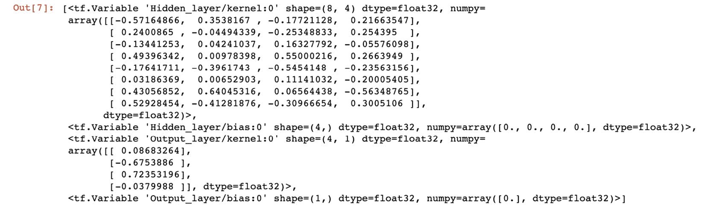

    图 4.2：人工神经网络的变量

    该输出显示了组成模型的所有变量；它们包括每一层中所有权重和偏置的值。

1.  创建一个大小为`32x8`的张量，这表示一个包含 32 条记录和 8 个特征的张量：

    ```py
    data = tf.random.normal((32,8))
    ```

1.  调用模型的`predict`方法并传入样本数据：

    ```py
    model.predict(data)
    prediction
    ```

    你应该得到以下结果：

    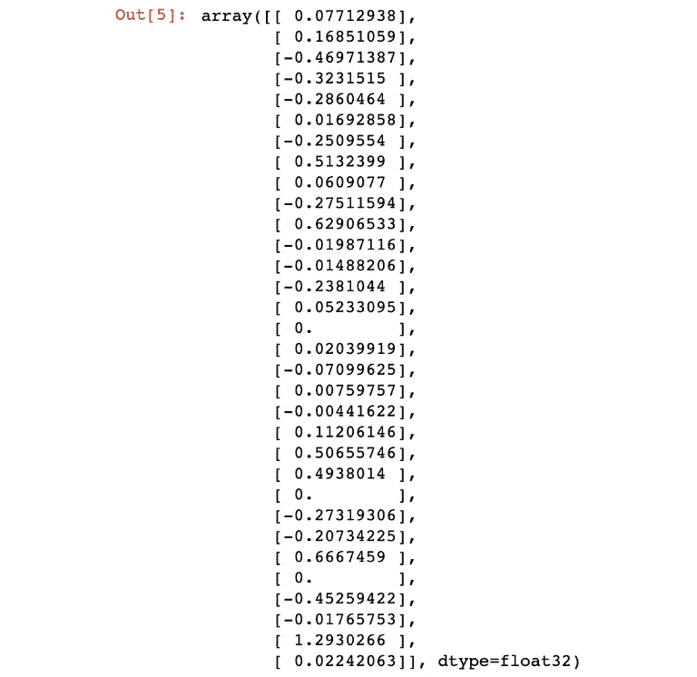

图 4.3：应用随机输入后的人工神经网络（ANN）输出

在样本数据上调用`predict()`方法将数据传递通过网络。在每一层中，数据会与权重进行矩阵乘法，偏置将被加到数据中，然后数据作为输入传递到下一层。这个过程会持续，直到最终的输出层。

在这个练习中，你创建了一个包含多层的顺序模型。你初始化了一个模型，添加了一个输入层以接受具有八个特征的数据，添加了一个具有四个单元的隐藏层，并添加了一个具有一个单元的输出层。在将模型拟合到训练数据之前，必须首先通过优化器编译模型，并选择一个损失函数来最小化通过更新训练过程中的权重计算的值。

在接下来的章节中，你将探索如何编译模型，然后将其拟合到训练数据中。

# 模型拟合

一旦模型被初始化并且层已经添加到人工神经网络（ANN）中，就必须通过编译过程使用优化器、损失函数和任何评估指标来配置模型。模型可以使用模型的`compile`方法进行编译，如下所示：

```py
model.compile(optimizer='adam', loss='binary_crossentropy', \
              metrics=['accuracy'])
```

可以通过简单地命名优化器作为参数来选择优化器。以下是 Keras 模型的默认可用优化器：

+   **随机梯度下降法**（**SGD**）：此方法更新数据集中每个示例的权重。你可以在这里找到有关 SGD 的更多信息：[`keras.io/api/optimizers/sgd/`](https://keras.io/api/optimizers/sgd/)。

+   **RMSprop**：这是一种自适应优化器，在训练过程中通过使用梯度的衰减平均值来改变权重。你可以在这里找到有关 RMSprop 的更多信息：[`keras.io/api/optimizers/rmsprop/`](https://keras.io/api/optimizers/rmsprop/)。

+   **Adam**：这也是一个自适应优化器，实施了 Adam 算法，根据一阶和二阶梯度更新学习率。你可以在这里找到有关 Adam 的更多信息：[`keras.io/api/optimizers/adam/`](https://keras.io/api/optimizers/adam/)。

+   **Adagrad**：这种自适应梯度优化器在每次更新权重时调整学习率。每个特征的学习率会根据先前的梯度和观测值进行调整。你可以在这里找到有关 Adagrad 的更多信息：[`keras.io/api/optimizers/adagrad/`](https://keras.io/api/optimizers/adagrad/)。

+   **Adadelta**：这是 Adagrad 的一个更强大的版本，通过使用梯度更新的滑动窗口来调整学习率。你可以在这里找到有关 Adadelta 的更多信息：[`keras.io/api/optimizers/adadelta/`](https://keras.io/api/optimizers/adadelta/)。

+   **Adamax**：这是一种自适应优化器，是 Adam 优化器的变种。 您可以在这里找到有关 Adamax 的更多信息：[`keras.io/api/optimizers/adamax/`](https://keras.io/api/optimizers/adamax/)。

+   **Nadam**：这是 Adam 优化器的另一种自适应变种，具有 Nesterov 动量。 您可以在这里找到有关 Nadam 的更多信息：[`keras.io/api/optimizers/Nadam/`](https://keras.io/api/optimizers/Nadam/)。

+   **Ftrl**：这是实施 FTRL 算法的优化器。 您可以在这里找到有关 Ftrl 的更多信息：[`keras.io/api/optimizers/ftrl/`](https://keras.io/api/optimizers/ftrl/)。

如果提供的优化器不相关，则还可以将自定义优化器添加到 Keras 模型中。 选择最合适的优化器通常是尝试每个优化器并确定哪个优化器通过优化过程产生最低误差的问题。 这个过程称为 **超参数调优**，将在后续章节中讨论。 在下一节中，您将了解在编译模型时的另一个选项：损失函数。 训练模型的目标是通过最小化损失函数计算的值来最小化损失函数。

## 损失函数

损失函数是预测结果与真实结果之间误差的度量。 您在训练过程中使用损失函数来确定通过优化过程中任何权重和偏差的变化是否能创建更好的模型，通过最小化优化过程中损失函数的值来实现这一目标。

可以使用许多不同类型的损失函数，具体选择将取决于问题和目标。 一般来说，回归和分类任务将使用不同的损失函数。 由于回归模型预测连续变量，回归模型的损失函数通常旨在总结预测与真实值之间的平均距离。 对于分类模型，损失函数旨在确定预测类的真阳性、真阴性、假阳性和假阴性分类数量与真实类的差异程度。

**真阳性** 是分类器正确预测为阳性的标签; 同样地，**真阴性** 是正确预测为阴性的标签。**假阳性** 是被预测为阳性但实际为阴性的预测，而 **假阴性** 是被预测为阴性但实际为阳性的预测。Keras 顺序模型中用于回归的直接可用损失函数包括以下内容：

+   `(真实值 – 预测值)²`，并返回整个数据集的平均值。 此损失函数主要用于回归问题，两个值之间的平方差确保损失函数结果为正数。

+   `|真实值 – 预测值|`，并返回整个数据集的平均值。 此方法还确保结果为正值。

+   `|(真实值 - 预测值) / 真实值|`，并返回数据集上的平均值，作为百分比表示。

对于分类问题，可用的损失函数包括以下内容：

+   `0` 和 `1`，值越接近 `1` 表示真实正例分类的数量越多。

+   `0` 和 `1`。

在编译模型时，其他指标也可以作为参数传递给方法。它们将在每个 epoch 后进行计算，并在训练过程中保存。可用于 Keras 模型计算的指标包括以下内容：

+   **准确率**：这是正确结果占总结果的比例。

+   **精确度**：这是预测为正例的真实正例的比例。

+   **召回率**：这是实际正例中真实正例的比例。

+   **AUC**：这个指标表示 ROC 曲线下的面积。

这些指标在理解模型在训练过程中的表现时非常有价值。所有指标的值都在 `0` 和 `1` 之间，值越高表示表现越好。一旦模型编译完成，就可以将其拟合到训练数据。这可以通过调用 `fit` 方法并传入以下参数来实现：

+   `x`：这是特征数据，可以是一个 TensorFlow 张量或 NumPy 数组。

+   `y`：这是目标数据，可以是一个 TensorFlow 张量或 NumPy 数组。

+   `epochs`：这是模型训练的 epoch 数量。一个 epoch 是对整个训练数据集的一个迭代。

+   `batch_size`：这是每次梯度更新时使用的训练数据样本数量。

+   `validation_split`：这是用于验证的数据占训练数据的比例，在每个 epoch 后进行评估。此部分数据不会用于权重更新过程。

+   `shuffle`：这表示是否在每个 epoch 前对训练数据进行洗牌。

要将模型拟合到训练数据，可以通过以下方式将 `fit` 方法应用于模型：

```py
model.fit(x=features, y=target, epochs=10, batch_size=32, \
         validation_split=0.2, shuffle=False)
```

一旦调用了 `fit` 方法，模型将开始拟合训练数据。每个 epoch 后，会返回训练的损失。如果定义了验证集，则验证集的损失也会被评估。

## 模型评估

一旦模型训练完成，可以通过使用模型的 `evaluate` 方法来评估模型。`evaluate` 方法根据用于训练模型的损失函数以及传递给模型的任何指标来评估模型的性能。该方法最适合用来确定模型在新数据上的表现，可以通过传入未在训练过程中使用的特征和目标数据集，或者是超出样本的数据集来实现。该方法可以按如下方式调用：

```py
eval_metrics = model.evaluate(features, target)
```

该方法的结果首先是对输入数据计算的损失，然后，如果在模型编译过程中传递了任何指标，它们也将在执行 `evaluate` 方法时计算。模型评估是确定模型表现如何的关键步骤。由于存在大量的超参数（例如隐藏层的数量、每层的单元数量以及激活函数的选择等），模型评估是确定哪些超参数组合最优的必要步骤。有效的模型评估有助于提供一个无偏的视角，帮助确定哪种模型架构在整体上表现最佳。

在以下练习中，您将进行创建 ANN、编译模型、将模型拟合到训练数据以及最终在训练数据上评估模型的过程。您将使用 ANN 重现线性回归算法，这可以被理解为一个只有一层和一个单元的 ANN。此外，您将通过 TensorBoard 查看模型的架构和模型训练过程。

## 练习 4.02：使用 TensorFlow 创建一个线性回归模型作为 ANN

在本练习中，您将使用 TensorFlow 创建一个线性回归模型作为 ANN。数据集 `Bias_correction_ucl.csv` 描述了韩国首尔空气温度预报的偏差修正。该数据字段表示给定日期的温度测量、测量数据的气象站、与天气相关的模型预报（如湿度）以及次日温度的预测。您需要根据先前时间点的测量值和气象站的属性来预测接下来的最大和最小温度。

注意

`Bias_correction_ucl.csv` 文件可以在这里找到：[`packt.link/khfeF`](https://packt.link/khfeF)。

执行以下步骤以完成本次练习：

1.  打开一个新的 Jupyter notebook 来实现本次练习。

1.  在新的 Jupyter Notebook 单元格中，导入 TensorFlow 和 pandas 库：

    ```py
    import tensorflow as tf
    import pandas as pd
    ```

1.  使用 pandas 的 `read_csv` 函数加载数据集：

    ```py
    df = pd.read_csv('Bias_correction_ucl.csv')
    ```

    注意

    确保您根据系统中 CSV 文件的位置更改路径（高亮显示的部分）。如果您从与 CSV 文件存储在同一目录的 Jupyter notebook 中运行代码，您可以在不做任何修改的情况下运行之前的代码。

1.  删除 `date` 列，并删除所有包含空值的行，因为您的模型只需要数值数据：

    ```py
    df.drop('Date', inplace=True, axis=1)
    df.dropna(inplace=True)
    ```

1.  创建目标和特征数据集。目标数据集将包含名为 `Next_Tmax` 和 `Next_Tmin` 的列，而特征数据集将包含除 `Next_Tmax` 和 `Next_Tmin` 外的所有列：

    ```py
    target = df[['Next_Tmax', 'Next_Tmin']]
    features = df.drop(['Next_Tmax', 'Next_Tmin'], axis=1)
    ```

1.  对特征数据集进行重缩放：

    ```py
    from sklearn.preprocessing import MinMaxScaler
    scaler = MinMaxScaler()
    feature_array = scaler.fit_transform(features)
    features = pd.DataFrame(feature_array, columns=features.columns)
    ```

1.  初始化一个 Keras 的 `Sequential` 类模型：

    ```py
    model = tf.keras.Sequential()
    ```

1.  使用模型的 `add` 方法为模型添加输入层，并将 `input_shape` 设置为特征数据集中的列数：

    ```py
    model.add(tf.keras.layers.InputLayer\
             (input_shape=(features.shape[1],), \
                           name='Input_layer'))
    ```

1.  将 `Dense` 类的输出层添加到模型中，大小为 `2`，表示两个目标变量：

    ```py
    model.add(tf.keras.layers.Dense(2, name='Output_layer'))
    ```

1.  使用 RMSprop 优化器和均方误差损失函数编译模型：

    ```py
    model.compile(tf.optimizers.RMSprop(0.001), loss='mse')
    ```

1.  为 TensorBoard 添加回调：

    ```py
    tensorboard_callback = tf.keras.callbacks\
                             .TensorBoard(log_dir="./logs")
    ```

1.  将模型拟合到训练数据：

    ```py
    model.fit(x=features.to_numpy(), y=target.to_numpy(),\
              epochs=50, callbacks=[tensorboard_callback])
    ```

    你应该会得到以下输出：

    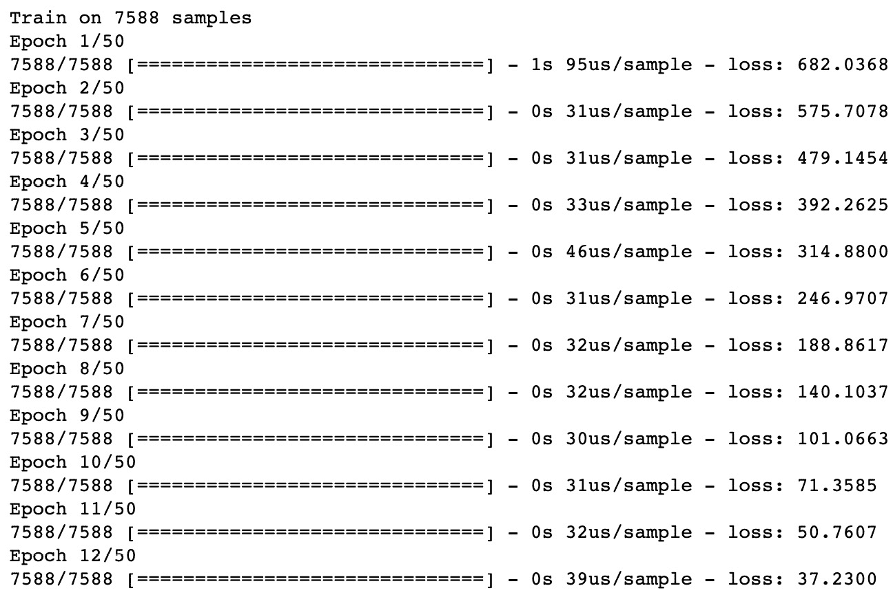

    图 4.4：拟合过程的输出，显示每个 epoch 的训练时间和损失

1.  在训练数据上评估模型：

    ```py
    loss = model.evaluate(features.to_numpy(), target.to_numpy())
    print('loss:', loss)
    ```

    这将产生以下输出：

    ```py
    loss: 3.5468221449764012
    ```

1.  通过在命令行中调用以下命令，在 TensorBoard 上查看模型架构和拟合过程：

    ```py
    tensorboard –-logdir=logs/
    ```

    你可以通过访问启动 TensorBoard 后提供的 URL，在网页浏览器中查看其执行情况。默认提供的 URL 是 `http://localhost:6006/`：

    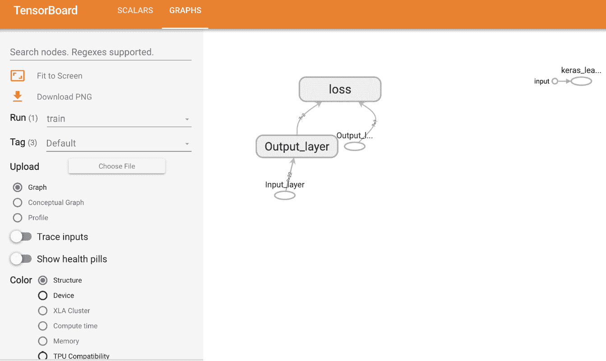

图 4.5：TensorBoard 中模型架构的可视化表示

损失函数可以通过以下图形进行可视化：

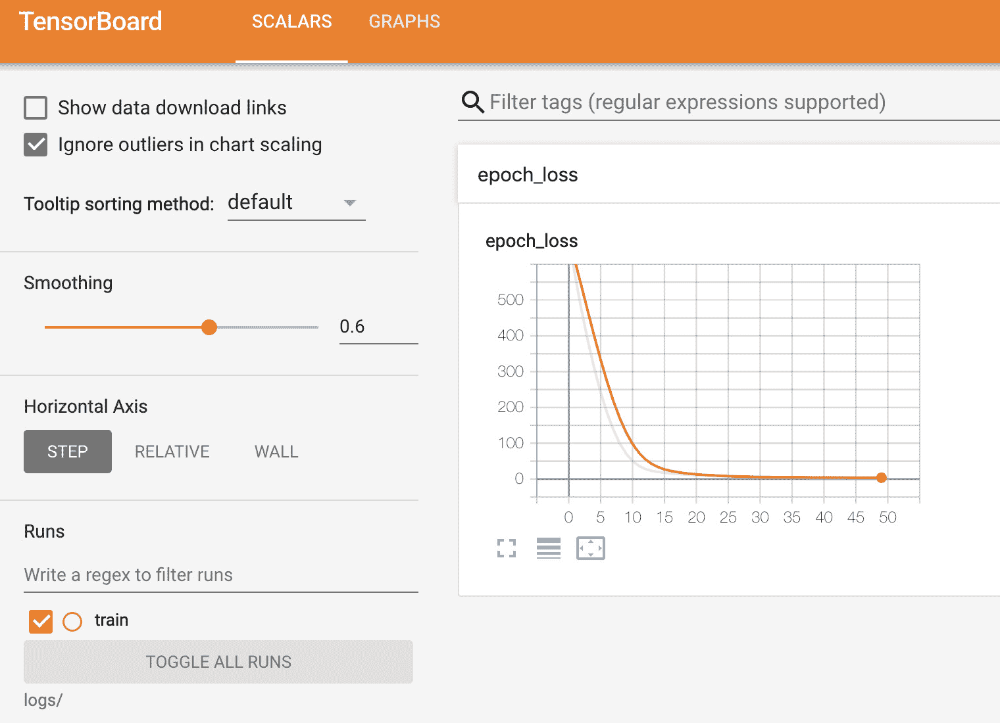

图 4.6：TensorBoard 中表示损失与每个 epoch 的关系的可视化图

你可以在 `GRAPHS` 标签页中看到模型的架构。架构显示了模型的输入层和输出层，以及计算出的损失。在模型拟合过程中，损失在每个 epoch 后都会被计算，并显示在 TensorBoard 的 `SCALARS` 标签页中。损失是在编译过程中定义的；在这个例子中，损失是均方误差。从 TensorBoard 中，你可以看到均方误差在每个 epoch 后减少，这表明模型正在从训练数据中学习，并且正在更新权重以减少总损失。

在本次练习中，你学习了如何使用 Keras 层通过 TensorFlow 创建、训练和评估一个 ANN。你通过创建一个包含输入层和输出层的 ANN 重建了线性回归算法，每个输出都有一个单元。在这里，有两个输出，分别表示温度的最大值和最小值；因此，输出层有两个单元。

在 *练习 4.01*，*使用 TensorFlow 创建人工神经网络（ANN）* 中，你创建了一个仅包含一个层（带有权重）和输出层的 ANN。这是一个 **浅层神经网络** 的例子。具有多个隐藏层且包含权重的 ANN 被称为 **深度神经网络**，而训练它们的过程称为 **深度学习**。通过增加层数并使 ANN 更深，模型变得更加灵活，能够建模更复杂的函数。然而，为了获得这种灵活性，你需要更多的训练数据和更强的计算能力来训练模型。

在下一个练习中，你将创建并训练具有多个隐藏层的 ANN。

## 练习 4.03：使用 TensorFlow 创建多层 ANN

在这个练习中，你将使用 TensorFlow 创建一个多层人工神经网络（ANN）。这个模型将有四个隐藏层。你将向模型中添加多个层，并为每一层的输出添加激活函数。第一个隐藏层将有`16`个单元，第二个隐藏层将有`8`个单元，第三个隐藏层将有`4`个单元。输出层将有`2`个单元。你将使用与*练习 4.02*相同的数据集，*使用 TensorFlow 创建线性回归模型作为 ANN*，该数据集描述了韩国首尔的气温预报偏差修正。该练习旨在根据先前时间点的测量值和气象站的属性，预测下一个最大和最小气温。

执行以下步骤以完成此练习：

1.  打开一个新的 Jupyter 笔记本以实现此练习。

1.  在新的 Jupyter Notebook 单元格中，导入 TensorFlow 和 pandas 库：

    ```py
    import tensorflow as tf
    import pandas as pd
    ```

1.  使用 pandas 的`read_csv`函数加载数据集：

    ```py
    df = pd.read_csv('Bias_correction_ucl.csv')
    ```

    注意

    确保你根据文件在系统上的位置更改路径（高亮显示的部分）。如果你是从与 CSV 文件相同的目录运行 Jupyter 笔记本，你可以不做任何修改直接运行前面的代码。

1.  删除`Date`列并删除任何包含空值的行：

    ```py
    df.drop('Date', inplace=True, axis=1)
    df.dropna(inplace=True)
    ```

1.  创建目标和特征数据集：

    ```py
    target = df[['Next_Tmax', 'Next_Tmin']]
    features = df.drop(['Next_Tmax', 'Next_Tmin'], axis=1)
    ```

1.  重新缩放特征数据集：

    ```py
    from sklearn.preprocessing import MinMaxScaler
    scaler = MinMaxScaler()
    feature_array = scaler.fit_transform(features)
    features = pd.DataFrame(feature_array, columns=features.columns)
    ```

1.  初始化一个`Sequential`类的 Keras 模型：

    ```py
    model = tf.keras.Sequential()
    ```

1.  使用模型的`add`方法为模型添加一个输入层，并将`input_shape`设置为特征数据集中的列数：

    ```py
    model.add(tf.keras.layers.InputLayer\
                             (input_shape=(features.shape[1],), \
                              name='Input_layer'))
    ```

1.  向模型中添加三个隐藏层和一个`Dense`类的输出层。第一个隐藏层将有`16`个单元，第二个隐藏层将有`8`个单元，第三个隐藏层将有`4`个单元。为各个层适当命名。输出层将有两个单元，以匹配具有两列的目标变量：

    ```py
    model.add(tf.keras.layers.Dense(16, name='Dense_layer_1'))
    model.add(tf.keras.layers.Dense(8, name='Dense_layer_2'))
    model.add(tf.keras.layers.Dense(4, name='Dense_layer_3'))
    model.add(tf.keras.layers.Dense(2, name='Output_layer'))
    ```

1.  使用 RMSprop 优化器和均方误差损失编译模型：

    ```py
    model.compile(tf.optimizers.RMSprop(0.001), loss='mse')
    ```

1.  为 TensorBoard 添加一个回调：

    ```py
    tensorboard_callback = tf.keras.callbacks\
                             .TensorBoard(log_dir="./logs")
    ```

1.  将模型拟合到训练数据，训练`50`个周期，并添加一个验证拆分，比例为 20%：

    ```py
    model.fit(x=features.to_numpy(), y=target.to_numpy(),\
              epochs=50, callbacks=[tensorboard_callback] , \
              validation_split=0.2)
    ```

    你应该得到以下输出：

    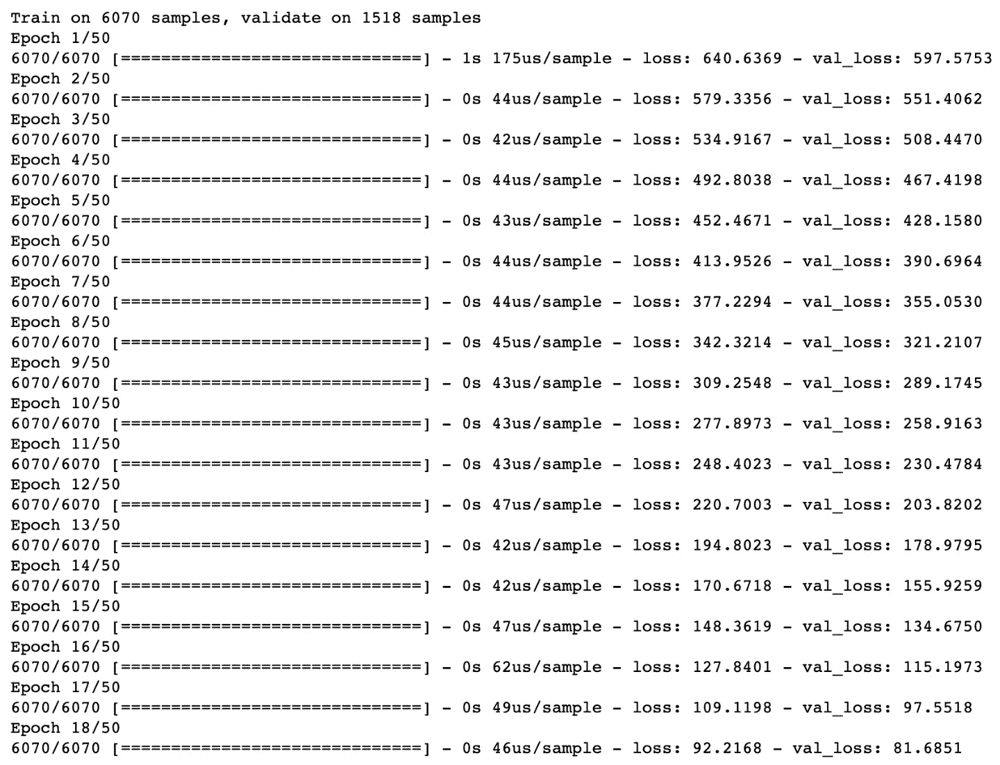

    图 4.7：拟合过程的输出，显示每个周期、每个样本的训练时间以及每个周期后的损失

1.  在训练数据上评估模型：

    ```py
    loss = model.evaluate(features.to_numpy(), target.to_numpy())
    print('loss:', loss)
    ```

    这将显示以下结果：

    ```py
    loss: 1.664448248190068
    ```

1.  在 TensorBoard 中查看模型架构和模型拟合过程：

    ```py
    tensorboard --logdir=logs/
    ```

    你应该得到如下所示的结果：

    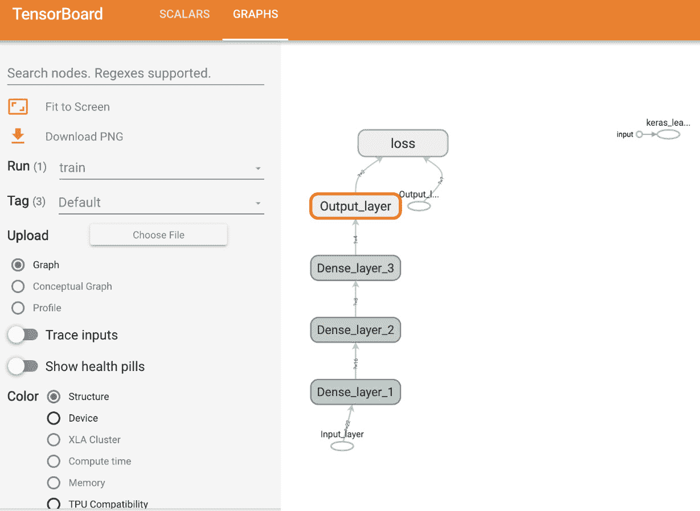

图 4.8：TensorBoard 中模型架构的可视化表示

你可以可视化损失函数，如下截图所示：

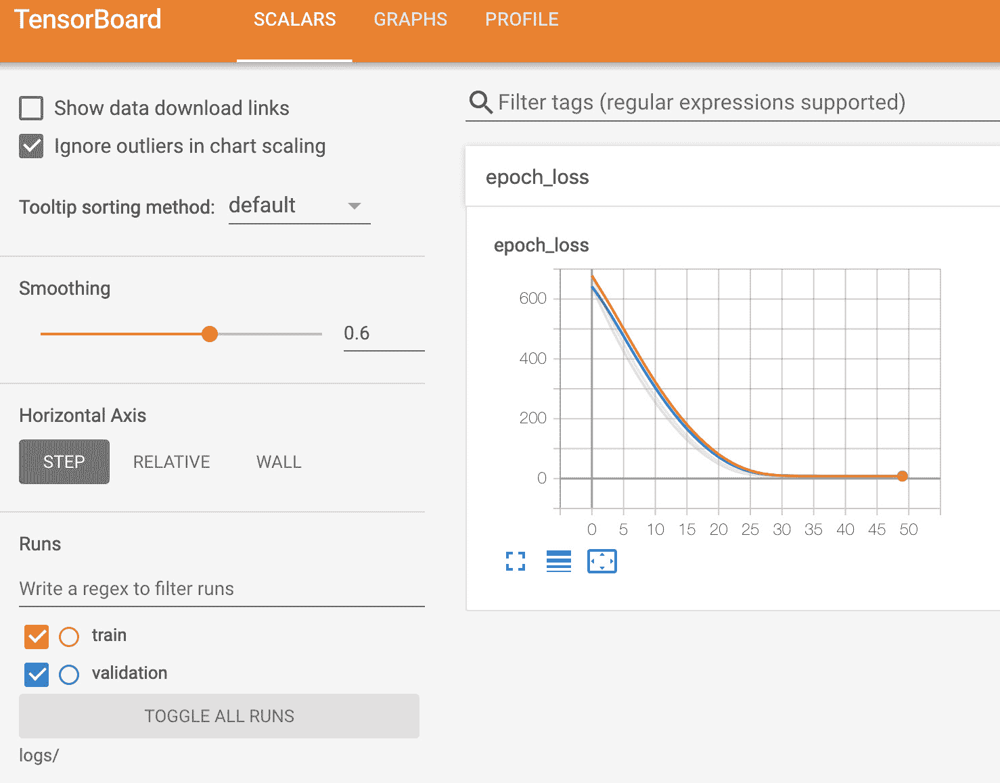

图 4.9：在训练和验证集划分上，损失随 epoch 变化的可视化表示

网络架构显示了模型的输入层和四个隐藏层，以及最终计算的损失。在模型拟合过程中，每个 epoch 后都会计算损失，并显示在 TensorBoard 的`SCALARS`选项卡中。在这里，损失是均方误差。从 TensorBoard 中，你可以看到每个 epoch 后，训练集（橙色线）和验证集（蓝色线）的均方误差在逐渐减少，表明模型正在有效地从训练数据中学习。

在本次练习中，你已经创建了一个具有多个隐藏层的 ANN。你获得的损失比使用线性回归时的损失要低，这展示了 ANN 的强大能力。通过调整超参数（例如，改变层数、每层的单元数、添加激活函数以及改变损失和优化器），损失可能会更低。在下一次活动中，你将把你的模型构建技能应用到一个新的数据集上。

## 活动 4.01：使用 TensorFlow 创建多层感知器（ANN）

特征数据集`superconductivity.csv`包含超导体的属性，包括材料的原子质量和密度。重要的是，数据集还包含材料的临界温度，即材料表现出超导特性的温度。在本次活动中，你的任务是找出材料的临界温度，或者说材料获得超导特性的温度。

注意

`superconductivity.csv`文件可以在这里找到：[`packt.link/sOCPh`](https://packt.link/sOCPh)。

执行以下步骤完成本次活动：

1.  打开一个新的 Jupyter 笔记本来实现本次活动。

1.  导入 TensorFlow 和 pandas 库。

1.  加载`superconductivity.csv`数据集。

1.  删除包含空值的行。

1.  将目标设置为`critical_temp`列，将特征数据集设置为其余列。

1.  使用标准缩放器对特征数据集进行缩放。

1.  初始化一个 Keras `Sequential`类的模型。

1.  向模型添加一个输入层，四个隐藏层，大小分别为`64`、`32`、`16`和`8`，以及一个大小为`1`的输出层。为第一个隐藏层添加 ReLU 激活函数。

1.  使用 RMSprop 优化器编译模型，学习率为`0.001`，并使用均方误差作为损失函数。

1.  添加回调函数，将日志写入 TensorBoard。

1.  将模型拟合到训练数据，训练`100`个 epochs，批量大小为`32`，验证集划分比例为 20%。

1.  在训练数据上评估模型。

1.  在 TensorBoard 中查看模型架构。

    你应该得到类似以下的输出：

    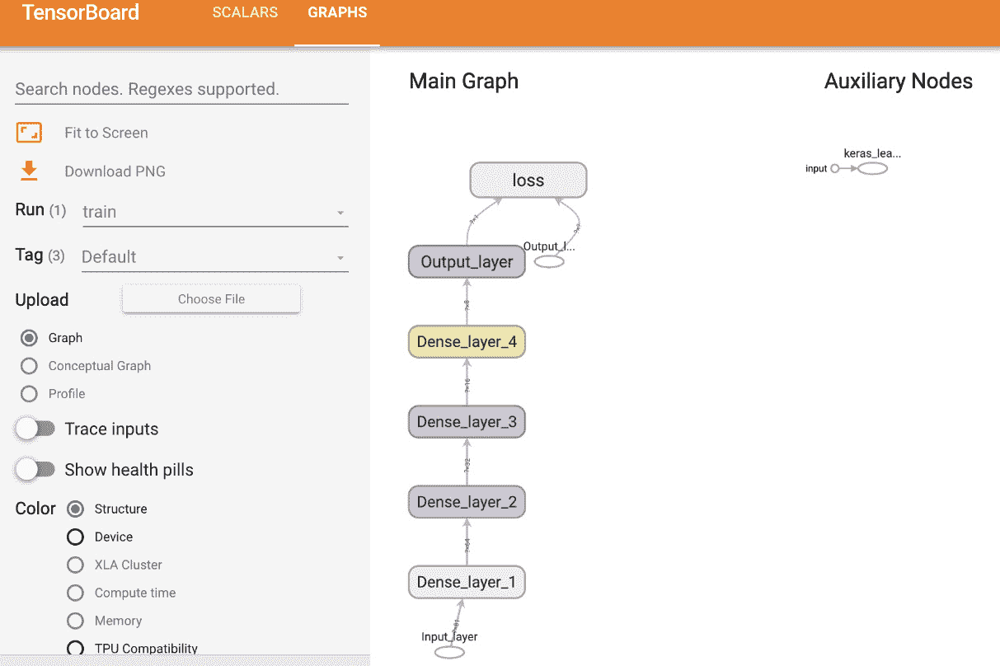

    图 4.10：在 TensorBoard 中，模型架构的可视化表示

1.  在 TensorBoard 中可视化模型拟合过程。你应该会得到如下输出：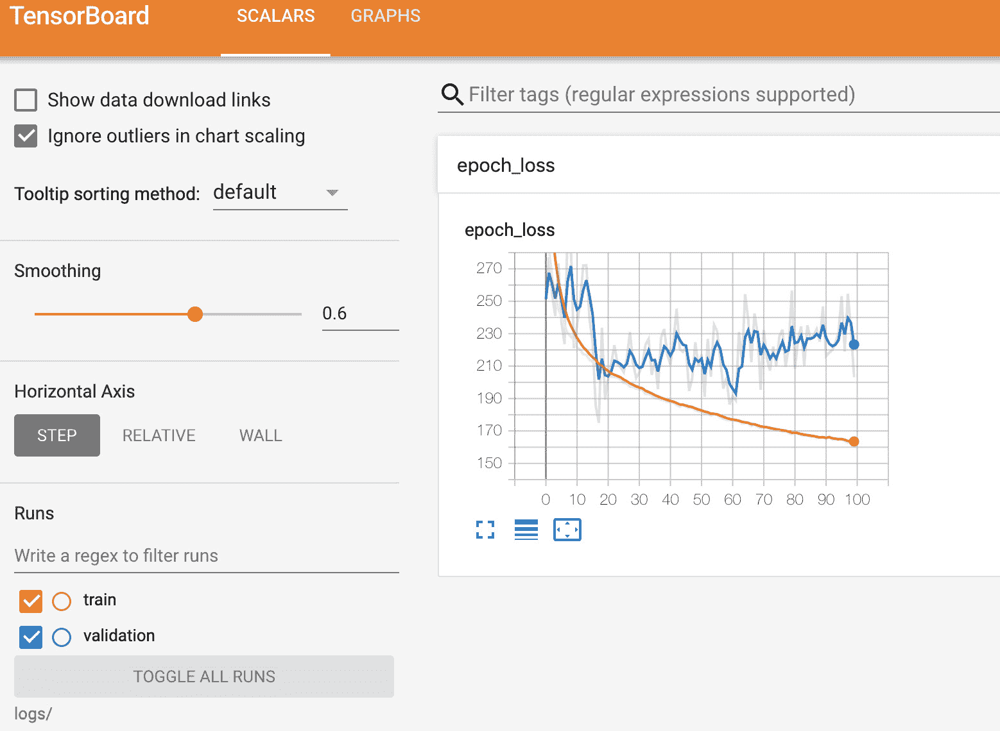

图 4.11：在 TensorBoard 中，损失随训练和验证拆分的轮次变化的可视化表示

注意

本活动的解决方案可以通过此链接找到。

在下一部分，你将探索分类模型，这些模型尝试将数据分类为不同的类别。你将从二分类模型开始，它将数据分类为仅两个类别。这是最简单的分类模型形式。一旦掌握了二分类器，就可以挑战更复杂的模型，如多标签分类和多类分类。

# 分类模型

分类模型的目标是将数据分类到不同的类别中。例如，垃圾邮件过滤器就是一个分类模型，它旨在将电子邮件分类为“垃圾邮件”（指未经请求的、不需要的邮件）或“正常邮件”（合法邮件）。垃圾邮件过滤器是一个二分类模型的例子，因为它有两个类别。输入到过滤器的内容可能包括电子邮件的内容、发件人的电子邮件地址和主题行等特征，输出将是预测的类别，`垃圾邮件`或`正常邮件`。分类模型可以将数据分类为两个以上的类别（称为**多类分类**），或者对数据进行多个正标签的分类（称为**多标签分类**）。

有几种不同的算法可以用于分类任务。一些流行的算法包括逻辑回归、决策树和人工神经网络（ANN）。ANN 是分类模型的一个不错选择，因为它们能够学习特征与目标之间的复杂关系，并且通过在 ANN 输出层应用适当的激活函数可以获得结果。

常用的分类模型激活函数是 sigmoid 函数，它与逻辑回归中使用的函数相同。事实上，可以通过构建一个具有单层、一个单元和 sigmoid 激活函数的 ANN 来创建一个逻辑回归模型。Sigmoid 函数是一种转换，其中输入是任意实数值，输出是一个严格介于 `0` 和 `1` 之间的数值。以下图示为例：

Sigmoid 转换的输出可以被解释为一个值属于正类的概率；接近 `1` 的值表示属于正类的概率较高：

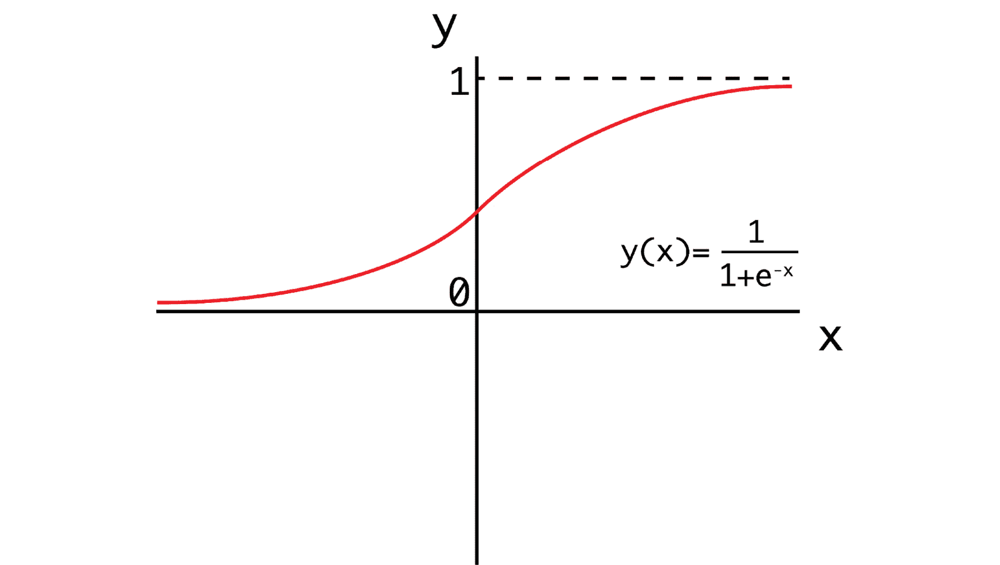

图 4.12：Sigmoid 函数的可视化表示

在应用了 sigmoid 函数后，会应用一个阈值，高于该阈值的数据将被归类为正类，低于该阈值的数据将被归类为负类。sigmoid 函数的默认阈值为 `0.5`，意味着任何值大于或等于 `0.5` 的数据将被归类为正类。

在下一个练习中，你将使用 TensorFlow 创建一个逻辑回归模型。你将通过创建一个单层人工神经网络（ANN）来实现这一点，这一过程类似于 *练习 4.02* 中的线性回归模型，*使用 TensorFlow 创建线性回归模型作为 ANN*。不同之处在于，你将在 ANN 的输出端添加一个 sigmoid 激活函数。另一个将这两个练习区分开的差异是你将使用不同的损失函数来计算损失。

## 练习 4.04：使用 TensorFlow 创建逻辑回归模型作为 ANN

在本练习中，你将使用 TensorFlow 将逻辑回归模型创建为 ANN。数据集 `qsar_androgen_receptor.csv` 用于开发分类模型，以区分具有不同分子属性的结合/非结合分子。在这里，分子属性代表数据集的特征，其结合属性代表目标变量，其中正值代表结合分子，负值代表非结合分子。你将创建一个逻辑回归模型，根据数据集中提供的分子属性预测分子的结合特性。

注意

`qsar_androgen_receptor.csv` 文件可以在这里找到：[`packt.link/hWvjc`](https://packt.link/hWvjc)。

执行以下步骤来完成本练习：

1.  打开一个新的 Jupyter notebook 来实现本练习。

1.  导入 TensorFlow 和 pandas 库：

    ```py
    import tensorflow as tf
    import pandas as pd
    ```

1.  使用 pandas 的 `read_csv` 函数加载数据集：

    ```py
    df = pd.read_csv('qsar_androgen_receptor.csv', \
                     sep=';')
    ```

    注意

    确保根据 CSV 文件在系统上的位置更改路径（已突出显示）。如果你从存储 CSV 文件的同一目录运行 Jupyter notebook，则无需修改代码即可运行上述代码。

1.  丢弃任何包含空值的行：

    ```py
    df.dropna(inplace=True)
    ```

1.  创建目标和特征数据集：

    ```py
    target = df['positive'].apply(lambda x: 1 if x=='positive' else 0)
    features = df.drop('positive', axis=1)
    ```

1.  初始化一个 Keras `Sequential` 类的模型：

    ```py
    model = tf.keras.Sequential()
    ```

1.  使用模型的 `add` 方法为模型添加输入层，并将 `input_shape` 设置为特征数据集中的列数：

    ```py
    model.add(tf.keras.layers.InputLayer\
             (input_shape=(features.shape[1],), \
                           name='Input_layer'))
    ```

1.  将 `Dense` 类的输出层添加到模型中，大小为 `1`，表示目标变量：

    ```py
    model.add(tf.keras.layers.Dense(1, name='Output_layer', \
                                    activation='sigmoid'))
    ```

1.  使用 RMSprop 优化器和二元交叉熵损失函数编译模型，并计算准确率：

    ```py
    model.compile(tf.optimizers.RMSprop(0.0001), \
                  loss='binary_crossentropy', metrics=['accuracy'])
    ```

1.  创建一个 TensorBoard 回调：

    ```py
    tensorboard_callback = tf.keras.callbacks.TensorBoard\
                           (log_dir="./logs")
    ```

1.  通过训练数据训练模型 `50` 个 epoch，并添加 TensorBoard 回调，验证集比例为 20%：

    ```py
    model.fit(x=features.to_numpy(), y=target.to_numpy(), \
             epochs=50, callbacks=[tensorboard_callback] , \
             validation_split=0.2)
    ```

    你的输出应该类似于下图：

    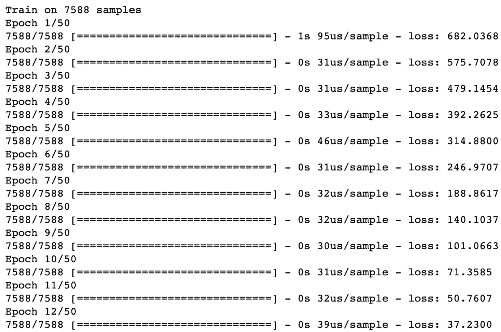

    图 4.13：拟合过程的输出，显示每个 epoch、每个样本的训练时间，以及每个 epoch 后的损失

1.  在训练数据上评估模型：

    ```py
    loss, accuracy = model.evaluate(features.to_numpy(), \
                                    target.to_numpy())
    print(f'loss: {loss}, accuracy: {accuracy}')
    ```

    你应该得到类似如下的输出：

    ```py
    loss: 0.2781583094794838, accuracy: 0.9110320210456848
    ```

1.  通过在命令行中调用以下命令，在 TensorBoard 中可视化模型拟合过程：

    ```py
    tensorboard --logdir=logs/
    ```

    你应该在浏览器中看到类似如下的界面：

    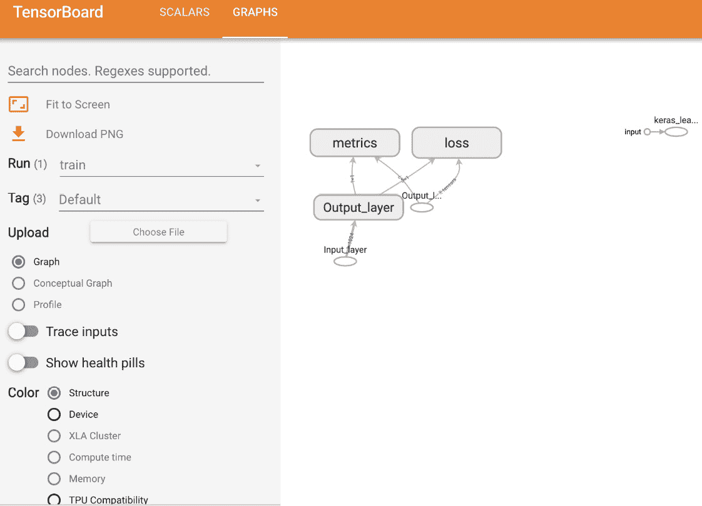

图 4.14：在 TensorBoard 中的模型架构的可视化表示

损失函数可以表示为如下形式：

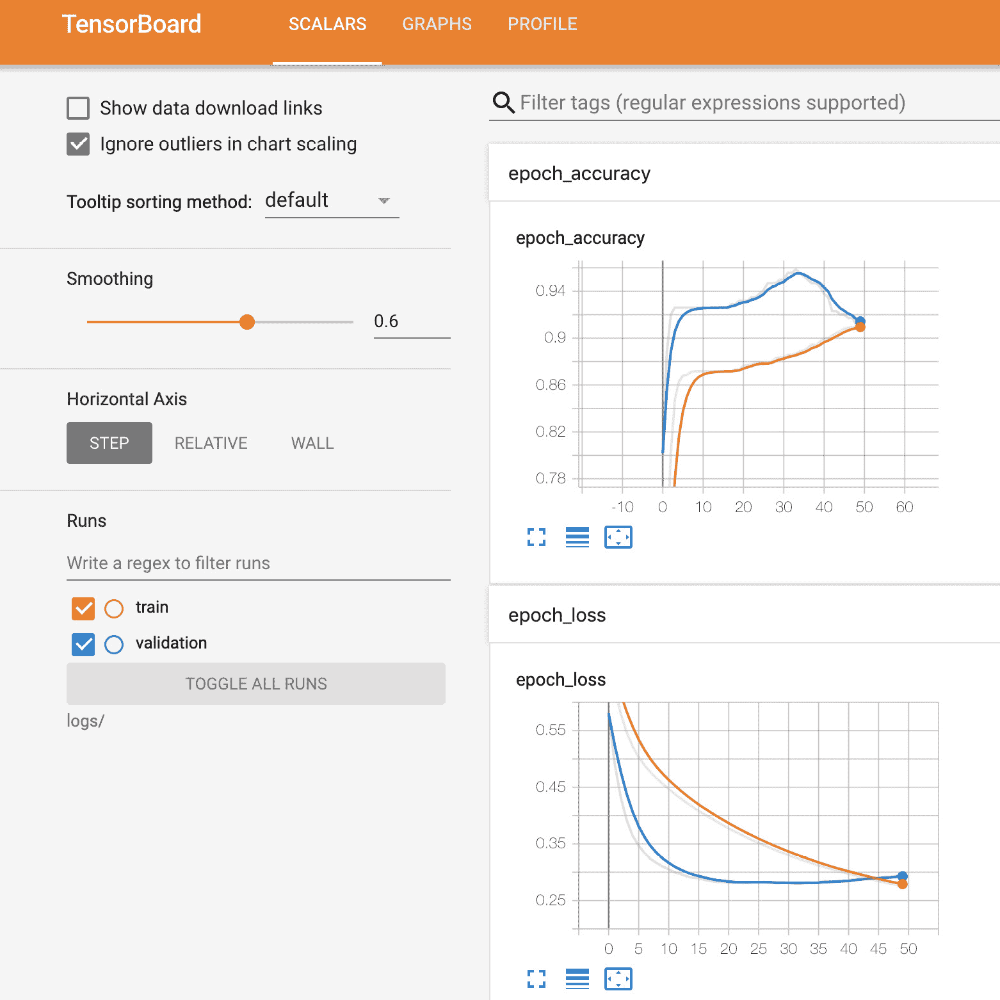

图 4.15：在 TensorBoard 中评估的训练和验证分割上，以一个 epoch 为函数的损失和准确度的可视化表示

从 TensorBoard 中可以看到，通过在模型编译过程中添加 `metrics` 参数，模型架构中有一个额外的节点用于计算准确度指标。此外，在 `SCALARS` 标签页中，还显示了训练和验证分割的准确度指标，作为一个 epoch 的函数。

从图表中可以看出，对于训练集，准确度随着时间的推移增加，损失减少，这表明模型正在学习。然而，在验证集上，准确度开始下降，损失开始增加，这表明模型可能正在过拟合训练数据。

在这个练习中，你学会了如何构建一个分类模型，用于区分不同分子在其其他分子属性基础上的结合特性。该分类模型等同于逻辑回归模型，因为它只有一层，并且之前有一个 sigmoid 激活函数。由于只有一层，每个输入特征都有一个权重，并且偏置只有一个值。sigmoid 激活函数将该层的输出转换为介于 `0` 和 `1` 之间的值，然后通过四舍五入表示你的两类。`0.5` 及以上代表一类，具有结合特性的分子，而低于 `0.5` 代表另一类，即没有结合特性的分子。

接下来的活动将通过结合你在*练习 4.03*（*使用 TensorFlow 创建多层感知机*）、*活动 4.01*（*使用 TensorFlow 创建多层感知机*）中学到的创建多层人工神经网络（ANN）的知识，以及你在*练习 4.04*（*使用 TensorFlow 创建逻辑回归模型作为 ANN*）中学到的创建分类模型的知识，来总结你在本章的学习。你将使用与前一个活动相同的数据集，但会改变目标变量，使其更适合分类任务。

## 活动 4.02：使用 TensorFlow 创建多层分类 ANN

特征数据集`superconductivity.csv`包含超导体的属性，包括材料的原子质量和密度。重要的是，数据集还包含材料的临界温度，即材料展现超导性特性的温度。你需要确定哪些超导体在氮气的沸点（77.36 K）以上展现超导性，从而使得可以使用易得的液氮进行超导性实验。目标变量将在临界温度高于 77.36 K 时为`true`，低于该温度时为`false`，表示材料是否在氮气的沸点以上展现超导性。

注意事项

`superconductivity.csv` 文件可以在此找到：[`packt.link/sOCPh`](http://packt.link/sOCPh)。

执行以下步骤来完成此活动：

1.  打开一个 Jupyter Notebook 来完成活动。

1.  导入 TensorFlow 和 pandas 库。

1.  加载 `superconductivity.csv` 数据集。

1.  删除所有包含空值的行。

1.  当 `critical_temp` 列的值高于 `77.36` 时，将目标值设置为 `true`，低于时设置为 `false`。特征数据集是数据集中的其余列。

1.  使用标准化缩放器对特征数据集进行重新缩放。

1.  初始化一个 Keras `Sequential` 类的模型。

1.  向模型中添加一个输入层，三个隐藏层，大小分别为`32`、`16`、`8`，以及一个输出层，使用 `sigmoid` 激活函数，大小为`1`。

1.  使用 RMSprop 优化器编译模型，学习率为 `0.0001`，损失函数为二元交叉熵，并计算准确率指标。

1.  添加一个回调函数，将日志写入 TensorBoard。

1.  将模型拟合到训练数据中，训练 `50` 个周期，验证集分割为 0%。

1.  在训练数据上评估模型。

1.  在 TensorBoard 中查看模型架构和模型拟合过程。

    注意事项

    本活动的解决方案可以通过此链接找到。

在本节中，你已经开始了使用 TensorFlow 构建、训练和评估分类模型的探索。你已经看到它们与回归任务的 ANN 构建方式非常相似，主要的区别在于输出层的激活函数。

# 总结

在本章中，你开始了在 TensorFlow 中创建人工神经网络（ANNs）的旅程。你了解了利用 Keras 层创建回归和分类模型是多么简单。Keras 层是一个独立的类库，在后台使用 TensorFlow。由于其流行和易用性，它们现在已经包含在 TensorFlow 中，并可以像调用任何其他 TensorFlow 类一样进行调用。

你创建了具有全连接层的人工神经网络（ANN），并且通过不同的层级进行变动，首先是一个类似于线性回归算法的 ANN，这相当于一个单层 ANN。然后，你向 ANN 中添加了更多层，并在各层的输出上添加了激活函数。激活函数可以用来判断某个单元是否激活，或者用来绑定某个单元输出的值。回归模型的目标是根据提供的数据预测一个连续变量。在本章的练习和活动中，你尝试预测了首尔的温度，给定来自气象站的数据，并预测了超导材料的临界温度，基于不同的材料特性。

最后，你探讨了分类模型，这些模型旨在将数据分类到不同的类别中。这些模型与回归模型在设置方式上相似；然而，在最终输出上使用激活函数，将输出值限制在两个数字之间，这两个数字表示数据点是否被分类到某个类别中。你从二分类模型开始，这些模型旨在将数据分为两个类别，并通过一个练习演示了二分类的概念，在该练习中，你根据分子其他属性的特征将分子分类到代表其结合特性的类别中。

在下一章，你将更深入地探讨分类模型。你将学习一些分类模型的细节和功能，包括如何对具有多个类别的数据进行分类（即多类分类），以及数据点是否可以有多个正标签（即多标签分类）。你将探讨如何构建架构来创建这些模型，训练时使用的适当损失函数，以及如何计算相关的度量指标来评估模型的表现。
