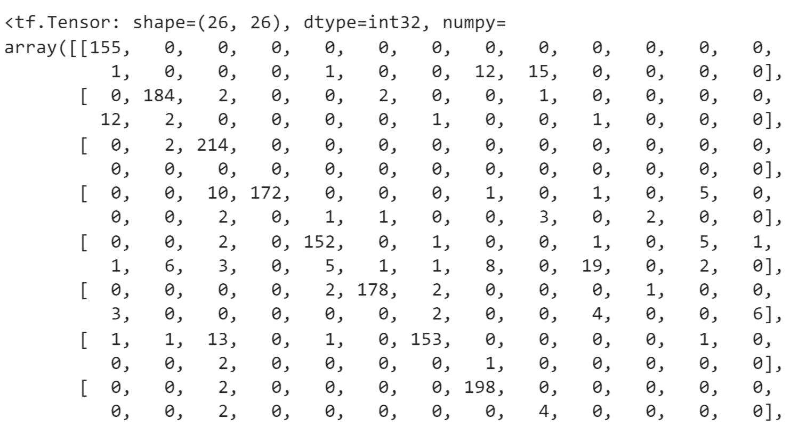

# 第五章：5. 分类模型

概述

在本章中，您将探索不同类型的分类模型。您将获得使用 TensorFlow 构建二元分类、多类别分类和多标签分类器的实际经验。最后，您将学习模型评估的概念，并了解如何使用不同的指标来评估模型的表现。

到本章结束时，您将对分类模型及使用 TensorFlow 编程有一个良好的理解。

# 介绍

在上一章中，您学习了回归问题，其中目标变量是连续的。连续变量可以取最小值和最大值之间的任何值。您已经学会了如何使用 TensorFlow 训练这样的模型。

在本章中，您将研究另一种监督学习问题，称为分类问题，其中目标变量是离散的——意味着它只能取有限数量的值。在行业中，您最有可能遇到这样的项目，其中变量被聚合为不同的组，如产品层次、用户类别、客户类别或薪资范围。分类器的目标是从数据中学习模式，并预测观察值的正确类别。

例如，在贷款提供商的情况下，分类模型将尝试根据客户的资料和财务状况预测他们在来年违约的可能性。该结果只能取两个可能的值（`是`或`否`），这就是二元分类。另一个分类器模型可能会根据用户之前的评分和这部新电影的信息，预测用户对该电影的评分，评分范围为 1 到 5。当结果可以取两个以上的值时，您正在处理多类别分类。最后，还有第三种类型的分类器，称为多标签分类，其中模型将预测多个类别。例如，模型将分析一张输入图像，并预测图像中是否有猫、狗或老鼠。在这种情况下，模型将预测三个不同的二元输出（或标签）。

本章将介绍每种分类器，详细阐述其特点，并探讨如何衡量这些模型的表现。

# 二元分类

如前所述，二元分类指的是一种监督学习类型，其中目标变量只能取两个可能的值（或类别），例如真/假或是/否。例如，在医疗行业中，您可能想根据患者的个人信息（如年龄、身高、体重和/或医疗测量值）来预测他们是否更有可能患病。同样，在营销领域，广告商可能利用类似的信息来优化电子邮件活动。

诸如随机森林分类器、支持向量分类器或逻辑回归等机器学习算法在分类任务上表现良好。神经网络也可以为二元分类实现良好的结果。将回归模型转换为二元分类器非常简单，只需要两个关键的变化：最后一层的激活函数和损失函数。

## 逻辑回归

`0`和`1`。值`0`通常对应于`false`（或`no`），而值`1`则指`true`（或`yes`）。

换句话说，逻辑回归的输出将是其为真的概率。例如，如果输出为`0.3`，则可以说结果为真（或 yes）的概率为 30%。但由于只有两个可能的值，这也意味着有 70%的概率（100% - 30%）结果为假（或 no）：


图 5.1: 逻辑回归的输出

现在您已经了解了逻辑回归的输出是什么，您只需找到一个可以将连续输入值转换为`0`和`1`之间值的函数。幸运的是，这样的数学函数确实存在，称为**sigmoid 函数**。该函数的公式如下：


图 5.2: Sigmoid 函数的公式

对应于应用于`x`的指数函数。指数函数的取值范围从`0`到正无穷。因此，如果`x`的值接近正无穷，sigmoid 的值将趋向于`1`。另一方面，如果`x`非常接近负无穷，则 sigmoid 的值将趋向于`0`：


图 5.3: Sigmoid 函数的曲线

因此，将线性回归模型的输出应用于 sigmoid 函数将其转换为逻辑回归。对于神经网络也是同样的逻辑：如果您将 sigmoid 函数应用于感知器模型（线性回归），则将获得二元分类器。要实现这一点，只需在感知器模型的最后一个全连接层中指定 sigmoid 作为激活函数。在 TensorFlow 中，您可以将`activation`参数指定为:

```py
from tensorflow.keras.layers import Dense
Dense(1, activation='sigmoid')
```

前面的代码片段展示了如何定义一个具有单个单元的全连接层，该单元可以输出任何值，并对其应用 sigmoid 激活函数。结果将在`0`和`1`之间。现在，您已经了解如何修改神经网络的回归模型以将其转变为二元分类器，需要指定相关的损失函数。

## 二元交叉熵

在上一节中，你学习了如何将一个线性回归模型转换为二分类器。使用神经网络，只需在最后的全连接层上添加 sigmoid 激活函数即可。但还有一个影响该模型训练的因素：损失函数的选择。

对于线性回归，最常用的损失函数是**均方误差**和**平均绝对误差**，如在*第四章*《回归与分类模型》中所示。这些函数会计算预测值与实际值之间的差异，神经网络模型会在反向传播过程中相应地更新所有权重。对于二分类问题，典型的损失函数是**二元交叉熵**（也叫做**对数损失**）。该函数的公式如下：


图 5.4：二元交叉熵公式

 代表观测 `i` 的实际值。

 代表观测 `i` 的预测概率。

`N` 代表观测的总数。

这个公式看起来相当复杂，但其逻辑非常简单。考虑以下单个观测的例子：实际值为 `1`，预测概率为 `0.8`。如果应用上述公式，结果将如下：


请注意，方程式右侧的值大约为零：


因此，当预测值与实际值非常接近时，损失值会非常小。

现在考虑另一个例子，其中实际值为 `0`，预测概率为 `0.99`。结果如下：


在这种情况下，损失会很高，因为预测值与实际值差异很大。

`BinaryCrossentropy` 用于计算这个损失：

```py
from tensorflow.keras.losses import BinaryCrossentropy
bce = BinaryCrossentropy()
```

## 二分类架构

二分类器的架构与线性回归非常相似，如在*第四章*《回归与分类模型》中所示。它由一个输入层组成，该层读取输入数据集的每个观测值，一个输出层负责预测响应变量，以及一些隐藏层，学习导致正确预测的模式。以下图示展示了这种架构的一个例子：


图 5.5：二分类器的架构

与线性回归的唯一区别是输出，它是一个介于`0`和`1`之间的概率值。这个概率值表示其中一个可能值发生的概率。如前所述，这通过使用 sigmoid 激活函数和二元交叉熵进行反向传播来实现。

现在你已经看到了构建二分类器的所有元素，你可以通过一个练习将它付诸实践。

## 练习 5.01：构建逻辑回归模型

在这个练习中，你将使用 TensorFlow 构建并训练一个逻辑回归模型，预测 Dota 2 比赛中哪个队伍获胜，使用的输入信息包括游戏的模式和类型等。

你将使用 Dota 2 数据集进行工作。Dota 2 是一款流行的电脑游戏。该数据集包含与游戏相关的信息，目标变量指示哪个队伍获胜。

注意

训练数据集可以在这里访问：[`packt.link/Tdvdj`](https://packt.link/Tdvdj)。

测试数据集可以在这里访问：[`packt.link/4PsPN`](https://packt.link/4PsPN)。

原始数据集可以在这里找到：[`archive.ics.uci.edu/ml/datasets/Dota2+Games+Results`](https://archive.ics.uci.edu/ml/datasets/Dota2+Games+Results)。

1.  打开一个新的 Jupyter 笔记本。

1.  导入 pandas 库并使用`pd`作为别名：

    ```py
    import pandas as pd
    ```

1.  创建一个名为`train_url`的变量，包含训练集的 URL：

    ```py
    train_url = 'https://raw.githubusercontent.com/PacktWorkshops'\
                '/The-TensorFlow-Workshop/master/Chapter05'\
                '/dataset/dota2Train.csv'
    ```

1.  使用`read_csv()`方法将训练数据集加载到一个名为`X_train`的`DataFrame()`函数中，提供 CSV 文件的 URL，并将`header=None`设置为数据集没有列名。使用`head()`方法打印 DataFrame 的前五行数据：

    ```py
    X_train = pd.read_csv(train_url, header=None)
    X_train.head()
    ```

    期望的输出如下所示：

    

    图 5.6：Dota 2 训练集的前五行数据

    你可以看到数据集包含 117 列，且它们都是数值型的。还需要注意的是，目标变量（第`0`列）包含两个不同的值：`-1`和`1`。由于你将训练一个逻辑回归模型，可能的值应该是`0`和`1`。你需要将`-1`的值替换为`0`。

1.  使用`pop()`方法提取目标变量（第 0 列），并将其保存在名为`y_train`的变量中：

    ```py
    y_train = X_train.pop(0)
    ```

1.  使用`replace()`方法将目标变量中的所有`-1`值替换为`0`，并使用`head()`方法打印前五行数据：

    ```py
    y_train = y_train.replace(-1,0)
    y_train.head()
    ```

    期望的输出如下所示：

    

    图 5.7：Dota 2 训练集中目标变量的前五行数据

    现在，训练集的目标变量中的所有值都是`0`或`1`。

1.  创建一个名为`test_url`的变量，包含测试集的 URL：

    ```py
    test_url = 'https://raw.githubusercontent.com/PacktWorkshops'\
               '/The-TensorFlow-Workshop/master/Chapter05/dataset'\
               '/dota2Test.csv'
    ```

1.  使用`read_csv()`方法加载测试数据集到名为`X_test`的`DataFrame()`函数中，提供 CSV 文件的 URL，并设置`header=None`，因为数据集没有提供列名。使用`head()`方法打印前五行：

    ```py
    X_test = pd.read_csv(test_url, header=None)
    X_test.head()
    ```

    预期的输出如下：

    

    图 5.8：Dota 2 测试集的前五行

    测试集与训练集非常相似，你需要对其进行相同的转换。

1.  使用`pop()`方法提取目标变量（第 0 列），并将其保存为名为`y_test`的变量：

    ```py
    y_test = X_test.pop(0)
    ```

1.  使用`replace()`方法将目标变量中的所有`-1`值替换为`0`，并使用`head()`方法打印前五行：

    ```py
    y_test = y_test.replace(-1,0)
    y_test.head()
    ```

    预期的输出如下：

    

    图 5.9：Dota 2 测试集中的目标变量前五行

1.  导入 TensorFlow 库并使用`tf`作为别名：

    ```py
    import tensorflow as tf
    ```

1.  使用`tf.random.set_seed()`设置 TensorFlow 的种子为`8`，以获得可重复的结果：

    ```py
    tf.random.set_seed(8)
    ```

1.  使用`tf.keras.Sequential()`实例化一个顺序模型，并将其保存为名为`model`的变量：

    ```py
    model = tf.keras.Sequential()
    ```

1.  从`tensorflow.keras.layers`导入`Dense()`类：

    ```py
    from tensorflow.keras.layers import Dense
    ```

1.  使用`Dense()`创建一个包含`512`个单元的全连接层，指定 ReLu 作为激活函数，并将输入形状设置为`(116,)`，这对应于数据集中的特征数量。将其保存为名为`fc1`的变量：

    ```py
    fc1 = Dense(512, input_shape=(116,), activation='relu')
    ```

1.  使用`Dense()`创建一个包含`512`个单元的全连接层，并指定 ReLu 作为激活函数。将其保存为名为`fc2`的变量：

    ```py
    fc2 = Dense(512, activation='relu')
    ```

1.  使用`Dense()`创建一个包含`128`个单元的全连接层，并指定 ReLu 作为激活函数。将其保存为名为`fc3`的变量：

    ```py
    fc3 = Dense(128, activation='relu')
    ```

1.  使用`Dense()`创建一个包含`128`个单元的全连接层，并指定 ReLu 作为激活函数。将其保存为名为`fc4`的变量：

    ```py
    fc4 = Dense(128, activation='relu')
    ```

1.  使用`Dense()`创建一个包含`128`个单元的全连接层，并指定 sigmoid 作为激活函数。将其保存为名为`fc5`的变量：

    ```py
    fc5 = Dense(1, activation='sigmoid')
    ```

1.  使用`add()`方法顺序添加所有五个全连接层到模型中：

    ```py
    model.add(fc1)
    model.add(fc2)
    model.add(fc3)
    model.add(fc4)
    model.add(fc5)
    ```

1.  使用`summary()`方法打印模型的摘要：

    ```py
    model.summary()
    ```

    预期的输出如下：

    

    图 5.10：模型架构摘要

    上述输出显示了模型中有五个层（如预期）并展示了每层的参数数量。例如，第一层包含 59,904 个参数，该模型的总参数数量为 404,855。所有这些参数将在训练模型时进行训练。

1.  从`tf.keras.losses`实例化一个`BinaryCrossentropy()`函数，并将其保存为名为`loss`的变量：

    ```py
    loss = tf.keras.losses.BinaryCrossentropy()
    ```

1.  从`tf.keras.optimizers`实例化`Adam()`，学习率设置为`0.001`，并将其保存为名为`optimizer`的变量：

    ```py
    optimizer = tf.keras.optimizers.Adam(0.001)
    ```

1.  使用`compile()`函数编译模型，并指定在前面步骤中创建的优化器和损失函数：

    ```py
    model.compile(optimizer=optimizer, loss=loss)
    ```

1.  使用`fit()`方法在训练集上进行五个 epoch 的模型训练：

    ```py
    model.fit(X_train, y_train, epochs=5)
    ```

    预期输出如下：

    

    图 5.11：训练过程的日志

    上述输出显示了每个 epoch 训练过程中记录的日志。请注意，处理单个 epoch 大约需要 15 秒，且损失值从`0.6923`（第一 epoch）降到`0.6650`（第五 epoch），这表明模型通过减少二元交叉熵损失正在缓慢改善其性能。

1.  使用`predict()`方法预测测试集的结果。将结果保存到名为`preds`的变量中，并显示其前五个值：

    ```py
    preds = model.predict(X_test)
    preds[:5]
    ```

    预期输出如下：

    

    图 5.12：测试集前五行的预测结果

    上述输出显示了每个预测的概率。小于`0.5`的值会被分类为`0`（该输出中的第一和最后一个观察结果），而大于或等于`0.5`的值会被分类为`1`（第二到第四个观察结果）。

1.  显示测试集前五个真实标签：

    ```py
    y_test[:5]
    ```

    预期输出如下：

    

图 5.13：测试集前五行的真实标签

将该输出与模型在测试集前五行上的预测结果进行比较，发现存在一些错误值：第三个预测（索引为`2`）应为`0`，最后一个预测应为`0`。因此，在这五个观察值中，二分类器犯了两个错误。

在接下来的部分中，你将看到如何使用不同的指标正确评估模型的性能。

# 分类器的评估指标

在前一部分中，你学习了如何训练一个二分类器来预测正确的输出：`0`或`1`。在*练习 5.01*中，*构建逻辑回归模型*，你查看了几个样本以评估所构建模型的性能。通常，你会使用像准确率或 F1 分数这样的性能指标对模型进行评估，而不仅仅是对一个小子集进行评估，而是对整个数据集进行评估。

## 准确率和空白准确率

其中一个最广泛使用的分类问题评估指标是准确率。它的公式非常简单：


图 5.14：准确率指标的公式

准确率的最大值为`1`，表示模型正确预测了 100%的案例。其最小值为`0`，表示模型无法正确预测任何案例。

对于二分类器，正确预测的数量是指那些值为`0`或`1`的观察结果，且这些值为正确预测的值：


图 5.15：二分类器的准确度指标公式

假设你正在评估两个不同的二分类器在测试集上对 10,000 个观察结果的预测表现。第一个模型正确预测了 5,000 个值为 `0` 的实例和 3,000 个值为 `1` 的实例。其准确度得分将如下：


图 5.16：模型 1 准确度公式

第二个模型正确预测了 500 个值为 `0` 的案例和 1,500 个值为 `1` 的案例。其准确度得分将如下：


图 5.17：模型 2 准确度公式

第一个模型在 80% 的情况下预测正确，而第二个模型仅在 20% 的情况下预测正确。在这种情况下，你可以说模型 1 比模型 2 更好。

尽管`0.8`通常是一个相对较好的分数，但这并不一定意味着你的模型表现良好。例如，假设你的数据集中包含 9,000 个值为 `0` 的案例和 1,000 个值为 `1` 的案例。一个非常简单的模型，如果总是预测值为 `0`，将会获得 0.9 的准确度。在这种情况下，第一个模型的表现甚至比这个极其简单的模型差。这种总是预测数据集中最频繁值的模型特性被称为 `0.9`，因为简单模型预测 `0`，它在 90% 的情况下是正确的。

注意

准确度和空准确度指标不仅适用于二分类，还可以应用于其他类型的分类。

TensorFlow 提供了一个类 `tf.keras.metrics.Accuracy`，可以从张量中计算准确度得分。该类有一个名为 `update_state()` 的方法，它接受两个张量作为输入参数，并计算它们之间的准确度得分。你可以通过调用 `result()` 方法来访问此得分。输出结果将是一个张量。你可以使用 `numpy()` 方法将其转换为 NumPy 数组。以下是如何计算准确度得分的示例：

```py
from tensorflow.keras.metrics import Accuracy
preds = [1, 1, 1, 1, 0, 0]
target = [1, 0, 1, 0, 1, 0]
acc = Accuracy()
acc.update_state(preds, target)
acc.result().numpy()
```

这将导致以下准确度得分：

```py
0.5
```

注意

TensorFlow 并没有为空准确度指标提供一个类，但你可以通过使用 `Accuracy()`，并提供一个仅包含 `1`（或 `0`）的预测张量，轻松计算它。

## 精确度、召回率和 F1 分数

在上一节中，你学习了如何使用准确度指标来评估模型的表现，并将其与称为“空准确度”的基准进行比较。准确度得分被广泛使用，因为它对于非技术性听众来说是熟知的，但它也有一些局限性。考虑以下示例。


图 5.18：模型预测与实际值的示例

该模型的准确度得分为 0.981！`(980 + 1) / 1000`，这个值相当高。但如果这个模型用于预测一个人是否患有某种疾病，它只会在一个案例中预测正确。在其他九个案例中，它错误地预测这些人没有得病，而实际上他们有该疾病。同时，它错误地预测了 10 个实际上健康的人为患病。由此可见，这个模型的表现显然不令人满意。不幸的是，准确率得分只是一个整体得分，它并不能告诉你模型表现不好的地方。

幸运的是，其他指标可以更好地评估模型，比如精确度、召回率或 F1 分数。这三项指标的取值范围与准确率得分相同：`1` 表示完美得分，所有观察值都预测正确，`0` 是最差得分，意味着没有任何正确的预测。

但在查看它们之前，你需要了解以下定义：

+   **真阳性（TP）**：所有实际值和相应预测都为真（即正类）的观察值

+   **真负（TN）**：所有实际值和相应预测都为假（即负类）的观察值

+   **假阳性（FP）**：所有预测为真，但实际值为假的观察值

+   **假阴性（FN）**：所有预测为假，但实际值为真的观察值

以 *图 5.18* 为例，你将得到以下结果：

+   TP = 1

+   TN = 980

+   FP = 10

+   FN = 9

这在下表中可以看到：


图 5.19：TP、TN、FP 和 FN 示例

精确度得分是一个评估模型是否预测了大量假阳性的指标。其公式如下：


图 5.20：精确度公式

在前面的例子中，精确度得分为 `1 / (1 + 10) = 0.09`。你可以看到该模型犯了很多错误，并且预测了大量的假阳性（FP），而实际的真阳性（TP）则相对较少。

召回率用于评估假阴性（FN）与真阳性（TP）之比。其公式如下：


图 5.21：召回率公式

在前面的例子中，召回率得分为`1 / (1 + 9) = 0.1`。通过这个指标，你可以看到模型表现不好，预测了大量的假阴性（FN）。

最后，F1 分数是一个结合了精确度和召回率的指标（它是精确度和召回率的调和平均数）。其公式如下：


图 5.22：F1 分数的公式

以与前述相同的例子，F1 分数将为`2 × (0.09 × 0.1) / (0.09 + 0.1) = 2 × 0.009 / 0.19 = 0.095`

模型实现了`0.095`的 F1 分数，这与其`0.981`的准确度分数非常不同。因此，当你希望强调不正确的预测时，F1 分数是一个很好的性能指标——该分数考虑了 FN 和 FP 的数量，以及 TP 和 TN。

注意

与准确度、精确度和召回率性能指标一样，F1 分数也可应用于其他类型的分类。

你可以通过使用`Precision()`和`Recall()`的相应类来轻松计算 TensorFlow 中的精确度和召回率：

```py
from tensorflow.keras.metrics import Precision, Recall
preds = [1, 1, 1, 1, 0, 0]
target = [1, 0, 1, 0, 1, 0]
prec = Precision()
prec.update_state(preds, target)
print(f"Precision: {prec.result().numpy()}")
rec = Recall()
rec.update_state(preds, target)
print(f"Recall: {rec.result().numpy()}")
```

这导致以下输出：


图 5.23：提供示例的精确度和召回率分数

注意

TensorFlow 并未提供用于计算 F1 分数的类，但可以通过创建自定义指标来轻松实现这一功能。这将在*练习 5.02*，*分类评估指标*中介绍。

## 混淆矩阵

混淆矩阵本身并不是一个性能指标，而更多是用于可视化模型预测与实际值之间关系的图形工具。在前一节中，你已经看到了*图 5.18* 的一个示例。

混淆矩阵将显示预测值（例如，水平轴）和实际值（例如，垂直轴）的所有可能值。在每个预测和实际值组合的交点处，你将记录属于此情况的观察数。

对于二元分类，混淆矩阵如下所示：


图 5.24：二元分类的混淆矩阵

理想情况是所有值都位于该矩阵的对角线上。这意味着你的模型正确预测了所有可能的值。在对角线之外的所有值是模型犯错的地方。

注意

混淆矩阵也可用于多类分类，不仅限于二元分类。

运行下面的代码查看混淆矩阵：

```py
from tensorflow.math import confusion_matrix
preds = [1, 1, 1, 1, 0, 0]
target = [1, 0, 1, 0, 1, 0]
print(confusion_matrix(target, preds))
```

这将显示以下输出：


图 5.25：TensorFlow 混淆矩阵

前述输出显示了混淆矩阵。从中可以看出，模型预测了以下结果：两个 TP、一个 TN、两个 FP 和一个 FN。

在下一练习中，你将应用这些性能指标到与*练习 5.01*，*构建逻辑回归模型*相同的逻辑回归模型。

## 练习 5.02：分类评估指标

在本练习中，你将重复使用与*练习 5.01*，*构建逻辑回归模型*相同的逻辑回归模型，并通过查看不同的性能指标来评估其性能：准确度、精确度、召回率和 F1 分数。

原始数据集由悉尼大学的 Stephen Tridgell 分享。

注意

训练数据集可以通过以下链接访问：[`packt.link/QJGpA`](https://packt.link/QJGpA)。

测试数据集可以通过以下链接访问：[`packt.link/ix5rW`](https://packt.link/ix5rW)。

*练习 5.01*中的模型，*构建逻辑回归模型*，可以通过以下链接找到：[`packt.link/sSRQL`](https://packt.link/sSRQL)。

现在，运行以下指令：

1.  打开一个新的 Jupyter 笔记本。

1.  导入 pandas 库，并使用`pd`作为别名：

    ```py
    import pandas as pd
    ```

1.  创建一个名为`train_url`的变量，包含训练集的 URL：

    ```py
    train_url = 'https://raw.githubusercontent.com/PacktWorkshops'\
                '/The-TensorFlow-Workshop/master/Chapter05/dataset'\
                '/dota2PreparedTrain.csv'
    ```

1.  使用`read_csv()`方法将训练数据集加载到名为`X_train`的`DataFrame()`函数中，提供 CSV 文件的 URL，并设置`header=None`，因为数据集没有提供列名：

    ```py
    X_train = pd.read_csv(train_url, header=None)
    ```

1.  使用`pop()`方法提取目标变量（第`0`列），并将其保存在名为`y_train`的变量中：

    ```py
    y_train = X_train.pop(0)
    ```

1.  创建一个名为`test_url`的变量，包含测试集的 URL：

    ```py
    test_url = 'https://raw.githubusercontent.com/PacktWorkshops'\
               '/The-TensorFlow-Workshop/master/Chapter05/dataset'\
               '/dota2PreparedTest.csv'
    ```

1.  使用`read_csv()`方法将测试数据集加载到名为`X_test`的`DataFrame()`函数中，提供 CSV 文件的 URL，并设置`header=None`，因为数据集没有提供列名：

    ```py
    X_test = pd.read_csv(test_url, header=None)
    ```

1.  使用`pop()`方法提取目标变量（第`0`列），并将其保存在名为`y_test`的变量中：

    ```py
    y_test = X_test.pop(0)
    ```

1.  使用`tf`作为别名导入`tensorflow`库，并从`tensorflow.keras.utils`导入`get_file()`方法：

    ```py
    import tensorflow as tf
    from tensorflow.keras.utils import get_file
    ```

1.  创建一个名为`model_url`的变量，包含模型的 URL：

    ```py
    model_url = 'https://github.com/PacktWorkshops'\
                '/The-TensorFlow-Workshop/blob/master/Chapter05'\
                'model/exercise5_01_model.h5?raw=true'
    ```

1.  使用`get_file()`方法，通过提供文件名（`exercise5_01_model.h5`）及其 URL 将模型下载到本地。将输出保存到一个名为`model_path`的变量中：

    ```py
    model_path = get_file('exercise5_01_model.h5', model_url)
    ```

1.  使用`tf.keras.models.load_model()`加载模型，并指定模型的本地路径：

    ```py
    model = tf.keras.models.load_model(model_path)
    ```

1.  使用`summary()`方法打印模型摘要：

    ```py
    model.summary()
    ```

    预期的输出如下：

    

    图 5.26：模型总结

    上述输出展示了与*练习 5.01*中相同的架构，即*构建逻辑回归模型*。

1.  使用`predict()`方法预测测试集的结果。将其保存在一个名为`preds_proba`的变量中，并显示其前五个值：

    ```py
    preds_proba = model.predict(X_test)
    preds_proba[:5]
    ```

    预期的输出如下：

    

    图 5.27：测试集的预测概率

    输出为每个观察值为`1`（或为真）的预测概率。你需要将这些概率转换为`0`和`1`。为此，你需要将所有概率大于或等于`0.5`的情况视为`1`（或为真），而对于概率小于`0.5`的记录则视为`0`（或为假）。

1.  当预测概率大于或等于`0.5`时，将其转换为`1`，当小于`0.5`时转换为`0`。将结果保存在名为`preds`的变量中，并打印其前五行：

    ```py
    preds = preds_proba >= 0.5
    preds[:5]
    ```

    预期的输出如下：

    

    图 5.28：测试集的预测结果

    现在，预测结果已转换为二值：真（等于`1`）和假（等于`0`）。

1.  从`tensorflow.keras.metrics`导入`Accuracy`、`Precision`和`Recall`：

    ```py
    from tensorflow.keras.metrics import Accuracy, Precision, Recall
    ```

1.  实例化`Accuracy`、`Precision`和`Recall`对象，并将其保存在名为`acc`、`pres`和`rec`的变量中：

    ```py
    acc = Accuracy()
    prec = Precision()
    rec = Recall()
    ```

1.  使用`update_state()`、`result()`和`numpy()`方法计算测试集上的准确度分数。将结果保存在名为`acc_results`的变量中并打印其内容：

    ```py
    acc.update_state(preds, y_test)
    acc_results = acc.result().numpy()
    acc_results
    ```

    预期的输出如下：

    ```py
    0.59650314
    ```

    该模型的准确率为`0.597`。

1.  使用`update_state()`、`result()`和`numpy()`方法计算测试集上的精确度分数。将结果保存在名为`prec_results`的变量中并打印其内容：

    ```py
    prec.update_state(preds, y_test)
    prec_results = prec.result().numpy()
    prec_results
    ```

    预期的输出如下：

    ```py
    0.59578335
    ```

    该模型的精确度为`0.596`。

1.  使用`update_state()`、`result()`和`numpy()`方法计算测试集上的召回率分数。将结果保存在名为`rec_results`的变量中并打印其内容：

    ```py
    rec.update_state(preds, y_test)
    rec_results = rec.result().numpy()
    rec_results
    ```

    预期的输出如下：

    ```py
    0.6294163
    ```

    该模型的召回率为`0.629`。

1.  使用上一节中显示的公式计算 F1 分数。将结果保存在名为`f1`的变量中并打印其内容：

    ```py
    f1 = 2*(prec_results * rec_results) / (prec_results + rec_results)
    f1
    ```

    预期的输出如下：

    ```py
    0.6121381493171637
    ```

    总体而言，模型在准确率、精确度、召回率和 F1 分数这四个不同指标上都取得了接近`0.6`的较低分数。因此，该模型的正确预测和错误预测几乎一样多。你可以尝试自己构建另一个模型，看看是否能提高其表现。

在接下来的部分，你将学习如何通过多类分类将分类扩展到超过两个可能值。

# 多类分类

使用二分类时，你只能处理目标变量，它只能取两个可能的值：`0`和`1`（假或真）。多类分类可以看作是二分类的扩展，它允许目标变量拥有超过两个值（或者可以说，二分类是多类分类的一个子集）。例如，预测患者疾病严重程度的模型，或者根据用户过去的购物行为将其分类到不同组的模型，都属于多类分类器。

在下一节中，你将深入了解 Softmax 函数，它用于多类分类。

## Softmax 函数

二分类器需要为神经网络的最后一个全连接层使用特定的激活函数，即 sigmoid。多类分类器的激活函数不同，它是 softmax。其公式如下：


图 5.29：Softmax 函数公式

 对应于类别`i`的预测值。

 对应于类别`j`的预测值。

此公式将应用于目标变量的每个可能值。如果有 10 个可能的值，那么该激活函数将计算 10 个不同的 softmax 值。

注意，softmax 会对分子和分母上的预测值进行指数运算。其背后的原因是，指数函数放大了预测值之间的微小变化，并使得概率更接近`0`或`1`，以便更好地解释最终的输出。例如，`exp(2) = 7.39`，而`exp(2.2) = 9.03`。因此，如果两个类别的预测值非常接近，它们的指数化值之间的差异将变得更大，从而更容易选择较大的一个。

softmax 函数的结果介于`0`和`1`之间，因为该方法将一个类别的值除以所有类别值的总和。因此，softmax 函数的实际输出是相关类别为最终预测结果的概率：


图 5.30：Softmax 转换示例

在前面的示例中，目标变量有五个不同的值，softmax 函数将它们转换为概率。第一个类别（`0`）是具有最高概率的类别，这将是最终的预测结果。

## 类别交叉熵

多类分类还需要一个特定的损失函数，这与二分类器使用的二元交叉熵不同。对于多类分类，损失函数是类别交叉熵。其公式如下：


图 5.31：类别交叉熵的公式

 表示观察值`i`属于类别`j`的实际值的概率。

 表示观察值`i`属于类别`j`的预测概率。

TensorFlow 提供了两个不同的类别来计算这个损失函数：`CategoricalCrossentropy()` 和 `SparseCategoricalCrossentropy()`：

```py
from tensorflow.keras.losses import CategoricalCrossentropy, 
                                    SparseCategoricalCrossentropy
cce = CategoricalCrossentropy()
scce = SparseCategoricalCrossentropy()
```

它们之间的区别在于目标变量的格式。如果实际值以独热编码存储，表示实际类别，则需要使用 `CategoricalCrossentropy()`。另一方面，如果响应变量以整数形式存储，表示实际类别，则需要使用 `SparseCategoricalCrossentropy()`：


图 5.32：根据目标变量的格式使用的损失函数

多类模型的输出将是一个包含每个类别概率的向量，如下所示：

```py
import numpy as np
preds_proba = np.array([0.54, 0.16, 0.09, 0.15, 0.06])
```

第一个值（`0.54`）对应于索引 0 类别的概率，`0.016` 是索引 1 类别的概率，而 `0.09` 对应于索引 2 类别的概率，依此类推。

为了得到最终的预测（即具有最高概率的类别），你需要使用 `argmax()` 函数，它会查看向量中的所有值，找到最大值并返回与其相关的索引：

```py
preds_proba.argmax()
```

这将显示以下输出：

```py
0
```

在前面的例子中，最终的预测是 `类别 0`，这对应于具有最高概率（`0.54`）的向量索引。

## 多类分类架构

多类分类器的架构与逻辑回归非常相似，区别在于最后一层将包含更多的单元。每个单元对应于目标变量的一个类。例如，如果你正在构建一个输入向量大小为 6 并使用单一隐藏层预测具有三种不同值的响应的模型，则其架构如下所示：


图 5.33：多类分类器的架构

最后一层的 softmax 激活函数为每个可能类别提供了发生的概率：`A`、`B` 和 `C`。这些概率是相互依赖的，因为最终应该只预测一个类别。如果类别 `A` 更有可能成为预测（如前面的例子所示），那么其余类别（`B` 和 `C`）的概率应该较低。请注意，所有类别的概率总和为 `1`，因此它们确实是相互依赖的。

现在你已经了解了所有的构建模块，可以在接下来的练习中构建一个多类分类器。

## 练习 5.03：构建一个多类模型

在本练习中，你将使用 TensorFlow 构建并训练一个多类分类器，该分类器将使用数据集中提供的九个不同的数值特征，从八个不同的值预测航天飞机的散热器位置。

目标变量（最后一列）包含七个不同的级别：`Rad.Flow`、`Fpv.Close`、`Fpv.Open`、`High`、`Bypass`、`Bpv.Close` 和 `Bpv.Open`。你的目标是使用数据集中提供的九个特征准确预测这七个级别中的一个。

注意

训练数据集可以通过以下链接访问：[`packt.link/46iMY`](https://packt.link/46iMY)。

测试数据集可以通过以下链接访问：[`packt.link/dcNPt`](https://packt.link/dcNPt)。

原始数据集可以通过以下链接找到：[`archive.ics.uci.edu/ml/datasets/Statlog+%28Shuttle%29`](http://archive.ics.uci.edu/ml/datasets/Statlog+%28Shuttle%29)。

执行以下步骤以完成练习：

1.  打开一个新的 Jupyter 笔记本。

1.  导入 pandas 库并使用 `pd` 作为别名：

    ```py
    import pandas as pd
    ```

1.  创建一个名为 `train_url` 的变量，包含训练集的 URL：

    ```py
    train_url = 'https://raw.githubusercontent.com/PacktWorkshops'\
                '/The-TensorFlow-Workshop/master/Chapter05'\
                '/dataset/shuttle.trn'
    ```

1.  使用 `read_table()` 方法将训练数据集加载到名为 `X_train` 的 DataFrame 中，提供 CSV 文件的 URL，使用 `header=None` 因为数据集没有列名，使用 `sep=' '` 因为数据集中的每一列是由空格分隔的。使用 `head()` 方法打印前五行：

    ```py
    X_train = pd.read_table(train_url, header=None, sep=' ')
    X_train.head()
    ```

    预期的输出将如下所示：

    

    图 5.34：训练集的前五行

    可以看到数据集包含 10 列，且都是数字类型。另外，注意目标变量（第 `9` 列）包含不同的类别值。

1.  使用 `pop()` 方法提取目标变量（第 `9` 列），并将其保存在名为 `y_train` 的变量中：

    ```py
    y_train = X_train.pop(9)
    ```

1.  创建一个名为 `test_url` 的变量，包含测试集的 URL：

    ```py
    test_url = 'https://raw.githubusercontent.com/PacktWorkshops'\
               '/The-TensorFlow-Workshop/master/Chapter05/dataset'\
               '/shuttle.tst'
    ```

1.  使用 `read_table()` 方法将测试数据集加载到名为 `X_test` 的 DataFrame 中，提供 CSV 文件的 URL，设置 `header=None` 因为数据集没有列名，使用 `sep=' '` 因为数据集中的每一列是由空格分隔的。使用 `head()` 方法打印前五行。

    ```py
    X_test = pd.read_table(test_url, header=None, sep=' ')
    X_test.head()
    ```

    预期的输出将如下所示：

    

    图 5.35：测试集的前五行

    可以看到测试集与训练集非常相似。

1.  使用 `pop()` 方法提取目标变量（第 `9` 列），并将其保存在名为 `y_test` 的变量中：

    ```py
    y_test = X_test.pop(9)
    ```

1.  导入 TensorFlow 库并使用 `tf` 作为别名：

    ```py
    import tensorflow as tf
    ```

1.  使用 `tf.random.set_seed()` 将 TensorFlow 的种子设置为 `8`，以获得可重现的结果：

    ```py
    tf.random.set_seed(8)
    ```

1.  使用 `tf.keras.Sequential()` 实例化一个顺序模型，并将其保存在一个名为 `model` 的变量中：

    ```py
    model = tf.keras.Sequential()
    ```

1.  从 `tensorflow.keras.layers` 导入 `Dense()` 类：

    ```py
    from tensorflow.keras.layers import Dense
    ```

1.  使用 `Dense()` 创建一个包含 `512` 单元的全连接层，并指定 ReLu 作为激活函数，同时将输入形状设置为 `(9,)`，这对应于数据集中的特征数量。将其保存在一个名为 `fc1` 的变量中：

    ```py
    fc1 = Dense(512, input_shape=(9,), activation='relu')
    ```

1.  使用 `Dense()` 创建一个包含 `512` 单元的全连接层，并指定 ReLu 作为激活函数。将其保存在一个名为 `fc2` 的变量中：

    ```py
    fc2 = Dense(512, activation='relu')
    ```

1.  使用 `Dense()` 创建一个包含 `128` 单元的全连接层，并指定 ReLu 作为激活函数。将其保存在一个名为 `fc3` 的变量中：

    ```py
    fc3 = Dense(128, activation='relu')
    ```

1.  再次使用 `Dense()` 创建一个包含 `128` 单元的全连接层，并指定 ReLu 作为激活函数。将其保存在一个名为 `fc4` 的变量中：

    ```py
    fc4 = Dense(128, activation='relu')
    ```

1.  使用 `Dense()` 创建一个包含 128 单元的全连接层，并指定 softmax 作为激活函数。将其保存在一个名为 `fc5` 的变量中：

    ```py
    fc5 = Dense(8, activation='softmax')
    ```

1.  顺序地将所有五个全连接层添加到模型中，使用 `add()` 方法。

    ```py
    model.add(fc1)
    model.add(fc2)
    model.add(fc3)
    model.add(fc4)
    model.add(fc5)
    ```

1.  使用 `summary()` 方法打印模型的摘要：

    ```py
    model.summary()
    ```

    预期的输出将如下所示：

    

    图 5.36：模型架构的总结

    上述输出显示了模型中的五个层（如预期），并告知每个层的参数数量。例如，第一层包含`5,120`个参数，该模型的总参数数量为`350,984`。所有这些参数将在拟合模型时进行训练。

1.  从`tf.keras.losses`中实例化`SparseCategoricalCrossentropy()`，并将其保存在名为`loss`的变量中：

    ```py
    loss = tf.keras.losses.SparseCategoricalCrossentropy()
    ```

1.  从`tf.keras.optimizers`中实例化`Adam()`，将学习率设置为`0.001`，并将其保存在名为`optimizer`的变量中：

    ```py
    optimizer = tf.keras.optimizers.Adam(0.001)
    ```

1.  使用`compile()`方法编译模型，指定优化器和损失参数，并将准确度作为需要报告的度量：

    ```py
    model.compile(optimizer=optimizer, loss=loss, \
                  metrics=['accuracy'])
    ```

1.  使用`fit()`方法在训练集上开始模型训练过程，训练五个 epochs：

    ```py
    model.fit(X_train, y_train, epochs=5)
    ```

    预期输出如下所示：

    

    图 5.37：训练过程的日志

    上述输出显示了训练过程中每个 epoch 的日志。请注意，处理一个 epoch 大约需要 7 秒，损失值从`0.5859`（第一 epoch）降至`0.0351`（第五 epoch）。

1.  使用`evaluate()`方法评估模型在测试集上的表现：

    ```py
    model.evaluate(X_test, y_test)
    ```

    预期输出如下所示：

    

图 5.38：模型在测试集上的表现

在这个练习中，你学习了如何构建和训练一个多类分类器，来预测由八个不同类别组成的结果。你的模型在训练集和测试集上的准确率接近`0.997`，这非常了不起。这意味着你的模型在大多数情况下能正确预测类别。

现在，让我们在下面的活动中巩固你的学习。

## 活动 5.01：使用 TensorFlow 构建字符识别模型

在这个活动中，你的任务是构建和训练一个多类分类器，该分类器能够识别图像中的 26 个字母。在这个数据集中，图像已经转换为 16 个不同的统计特征，这些特征将作为我们的输入。该模型的目标是确定每个观测值属于 26 个字母中的哪一个。

原始数据集由 Odesta 公司 David J. Slate 分享，数据集可以在此找到：[`archive.ics.uci.edu/ml/datasets/Letter+Recognition`](http://archive.ics.uci.edu/ml/datasets/Letter+Recognition)。

数据集可以从这里访问：[`packt.link/j8m3L`](https://packt.link/j8m3L)。

以下步骤将帮助你完成该活动：

1.  使用 pandas 的`read_csv()`加载数据。

1.  使用 pandas 的`pop()`方法提取目标变量。

1.  将数据分为训练集（前 15,000 行）和测试集（后 5,000 行）。

1.  使用五个完全连接的层，分别为`512`、`512`、`128`、`128`和`26`个单元，来构建多类分类器。

1.  在训练集上训练这个模型。

1.  使用`evaluate()`方法从 TensorFlow 评估模型在测试集上的表现。

1.  使用`confusion_matrix()`方法从 TensorFlow 打印混淆矩阵。

    预期的输出如下：

    

图 5.39：测试集的混淆矩阵

注意

该活动的解决方案可以通过这个链接找到。

# 多标签分类

多标签分类是另一种分类类型，在这种类型中，你不仅预测一个目标变量（如二元分类或多类分类），而是同时预测多个响应变量。例如，你可以预测图像中不同物体的多个输出（例如，模型将预测给定图片中是否有猫、男人和汽车），或者你可以预测文章的多个主题（例如，文章是否涉及经济、国际新闻和制造业）。

使用神经网络实现多标签分类非常简单，你已经学会了构建它所需的一切。在 TensorFlow 中，多标签分类器的架构与多类分类器相同，最终的输出层有多个单元，对应于你要预测的目标变量的数量。但不同的是，你将使用 sigmoid 作为激活函数，binary cross-entropy 作为损失函数，而不是使用 softmax 和 categorical cross-entropy。

Sigmoid 函数将预测每个目标变量的发生概率：


图 5.40：多标签分类器的架构

在前面的示例中，你有三个目标变量，每个目标变量的发生概率是相互独立的（它们的和不会等于 1）。该模型预测目标`2`和`3`很可能是这个观测的输出。

从概念上讲，多标签分类结合了多个逻辑回归模型。它们将共享相同的参数（权重和偏差），但每个模型有独立的二进制输出。TensorFlow 中多类分类器的最后一层将像这样：

```py
from tensorflow.keras.layers import Dense
Dense(3, activation='sigmoid')
```

将要使用的损失函数是二元交叉熵：

```py
from tensorflow.keras.losses import BinaryCrossentropy
bce = BinaryCrossentropy()
```

现在，将你所学到的知识付诸实践，在以下活动中动手操作。

## 活动 5.02：使用 TensorFlow 构建电影类型标签模型

在这个活动中，你的任务是构建并训练一个多标签分类器，该分类器将预测电影的类型，涵盖 28 种可能的类别。每部电影可以同时被分配到多个类型。特征是从电影简介中提取的主要关键词。该活动使用的数据集是原始数据集的一个子集，包含了 20,000 行数据。

原始数据集由 IMDb 提供，可以从这里找到：[`www.uco.es/kdis/mllresources/#ImdbDesc`](http://www.uco.es/kdis/mllresources/#ImdbDesc)。

数据集的特征可以从这里访问：[`packt.link/yW5ru`](https://packt.link/yW5ru)。

数据集的目标可以从这里访问：[`packt.link/8f1mb`](https://packt.link/8f1mb)。

以下步骤将帮助你完成该活动：

1.  使用 pandas 的 `read_csv()` 加载特征和目标。

1.  将数据分为训练集（前 15,000 行）和测试集（后 5,000 行）。

1.  构建一个多类别分类器，包含五个全连接层，分别是 `512`、`512`、`128`、`128` 和 `28` 个单元。

1.  在训练集上训练此模型。

1.  使用 TensorFlow 的 `evaluate()` 方法在测试集上评估其性能。

    预期的输出如下：

    

图 5.41：活动 5.02 的预期输出

注意

这个活动的解决方案可以通过此链接找到。

# 总结

本章开始时，你介绍了分类模型，并与回归模型进行了对比。你了解到，分类器的目标变量只能包含有限数量的可能值。

接着你探索了二元分类，其中响应变量只能取两个可能的值：`0` 或 `1`。你深入了解了如何使用 TensorFlow 构建逻辑回归模型，采用 sigmoid 激活函数和二元交叉熵作为损失函数，并为预测视频游戏《Dota 2》中的获胜队伍构建了自己的二元分类器。

之后，你了解了可以用来评估分类器模型性能的不同指标。你练习了使用 TensorFlow 计算准确率、精确度、召回率和 F1 分数，并绘制了混淆矩阵，这是一个用来查看模型正确与错误预测的可视化工具。

接着你深入探讨了多类别分类的主题。这类模型与二元分类器的区别在于，它们的响应变量可以有两个以上的可能值。你研究了 softmax 激活函数和类别交叉熵损失函数，它们在 TensorFlow 中用于训练这类模型。

最后一部分，你了解了多标签分类，其中输出可以同时是多个类别。在 TensorFlow 中，这样的模型可以通过构建类似于多类别分类的架构来轻松实现，但分别使用 sigmoid 激活函数和二元交叉熵作为损失函数。

在下一章，你将学习如何通过应用一些正则化技术来防止模型过拟合，从而帮助模型更好地对未见数据进行泛化。
