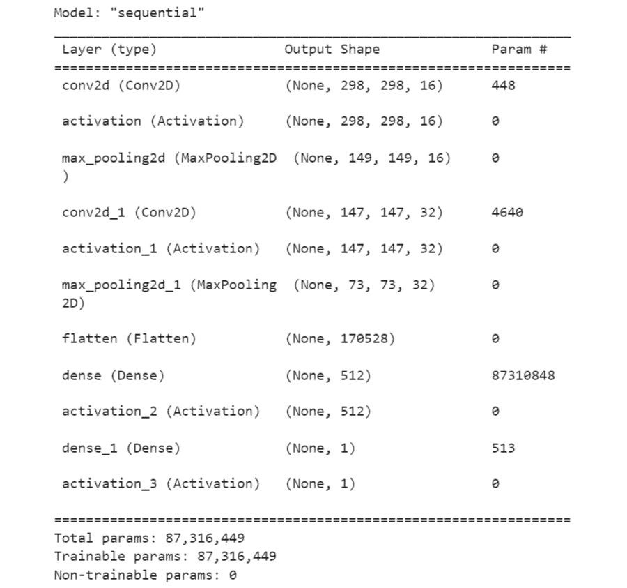

# 第七章：7\. 卷积神经网络

概述

本章你将学习**卷积神经网络**（**CNNs**）如何处理图像数据。你还将学习如何在图像数据上正确使用 CNN。

本章结束时，你将能够使用 TensorFlow 为任何图像数据集创建自己的 CNN，用于分类和物体识别。

# 介绍

本章讲解的是 CNN。CNN 使用卷积层，这些卷积层非常适合从图像中提取特征。它们使用与任务相关的学习滤波器。简单来说，它们非常擅长在图像中找到模式。

在上一章中，你探讨了正则化和超参数调整。你使用了 L1 和 L2 正则化，并为分类模型添加了 dropout，防止在 `connect-4` 数据集上发生过拟合。

在你深入了解深度学习与 CNN 的过程中，你将经历很大的转变。在本章中，你将学习 CNN 如何处理图像数据，并学会如何将这些概念应用到你自己的图像分类问题中。这里正是 TensorFlow 大显身手的地方。

# CNN

CNN 与你迄今为止构建的人工神经网络（ANNs）有许多共同的组成部分。关键的区别是网络中包含了一个或多个卷积层。卷积层通过滤波器，也叫做核，对输入数据进行卷积操作。可以把**卷积**看作是**图像转换器**。你有一个输入图像，这个图像经过 CNN 处理后会得到一个输出标签。每一层都有独特的功能或特殊能力，能够在图像中检测出如曲线或边缘等模式。CNN 将深度神经网络的强大功能与核卷积结合，能够转换图像，使得这些图像的边缘或曲线对模型来说更加容易识别。CNN 中有三个关键组件：

+   **输入图像**：原始图像数据

+   **滤波器/核**：图像转换机制

+   **输出标签**：图像分类

以下图示为例，展示了 CNN 的工作原理：图像从左侧输入网络，右侧生成输出。在隐藏层中，图像的组件被识别出来，较早的隐藏层识别的是更基础的组件，如边缘。图像组件在隐藏层中结合，形成来自数据集的可识别特征。例如，在一个 CNN 中，用于将图像分类为飞机或汽车时，可识别的特征可能是类似于轮子或螺旋桨的滤波器。这些特征的组合将帮助判断图像是飞机还是汽车。

最后，输出层是一个密集层，用于确定模型的具体输出。对于二分类模型，这可能是一个带有一个单元的密集层，使用 sigmoid 激活函数。对于更复杂的多类别分类，这可能是一个带有多个单元的密集层，单元的数量由类别数决定，并且使用 softmax 激活函数来为每个输入图像确定一个输出标签。


图 7.1：CNN

一个常见的 CNN 配置包括一个卷积层，后面跟着一个池化层。这些层通常以这种顺序（卷积和池化）一起使用，我们稍后会探讨这样做的原因，但目前，你可以把这些池化层看作是通过总结过滤器的结果来减少输入图像的大小。

在深入了解卷积层之前，首先需要理解计算机视角下的数据是怎样的。

# 图像表示

首先，考虑计算机如何处理图像。对计算机来说，图像就是数字。为了能够处理图像进行分类或物体识别，你需要理解模型如何将图像输入转化为数据。图像文件中的**像素**只是数据的一部分。

在下图中，你可以看到一个灰度图像中数字八的像素值示例。对于`28x28`像素的图像，共有`784`个像素。每个像素的值在`0`到`255`之间，表示该像素的亮度或暗度。在右侧，有一个大的列向量，其中列出了每个像素的值。这个向量被模型用来识别图像。


图 7.2：像素值

现在你已经知道了输入数据的样子，接下来是时候更仔细地看看卷积过程——更具体地说，是卷积层。

# 卷积层

把卷积看作是一个图像变换器，包含三个关键元素。首先是输入图像，然后是过滤器，最后是特征图。

本节将依次介绍这些内容，帮助你深入了解图像在卷积层中的过滤过程。卷积是将过滤窗口应用到输入数据的过程，最终得到一个激活图，这个激活图对于二维数据来说是一个`3x3`的映射，其中过滤器的具体值在训练过程中被学习到。过滤器以与过滤器大小相同的窗口尺寸在输入数据上滑动，然后计算过滤器与输入数据片段的标量积，得到所谓的**激活值**。随着该过程在整个输入数据上重复进行，使用相同的过滤器，最终生成激活图，也称为**特征图**。

这个概念在以下图中得到说明，其中有两个卷积层，产生两组特征图。在第一个卷积层生成特征图后，它们会传递到第二个卷积层。第二个卷积层的特征图将传递到分类器中：


](img/B16341_07_03.jpg)

图 7.3：用于分类的卷积

滤波器每次操作的移动距离或步数称为`0`。这就是**有效填充**。

让我们回顾一下几个关键词。这里有一个`2x2`的卷积核。还有**步长**，即卷积核每次移动的像素数。最后，有**零填充**，即在图像周围是否添加像素。这样可以确保输出与输入的尺寸相同。

## 创建模型

从第一章开始，你接触到过不同类型的维度张量。需要注意的一点是，你将只使用`Conv2D`。`Conv2D`的层名称仅指卷积核或**滤波器**的移动。所以，如果你回忆一下卷积过程的描述，它就是简单地在二维空间中滑动卷积核。所以，对于一个平的、方形的图像，卷积核只会在两个维度中滑动。

在实现`Conv2D`时，你需要传入一些参数：

1.  第一个参数是`filter`。滤波器是输出空间的维度。

1.  指定`strides`，即卷积核在每次操作中移动的像素数。

1.  然后，指定`padding`，这通常是`valid`或`same`，取决于你是否希望输出与输入具有相同的维度。

1.  最后，你还可以指定`activation`。在这里，你将指定希望应用于输出的激活函数。如果不指定激活函数，它就是一个线性激活。

在继续之前，回顾一下*第四章*，*回归与分类模型*，其中提到密集层是每个神经元都与前一层中的每个神经元相连的层。正如你在以下代码中看到的，你可以通过`model.add(Dense(32))`轻松添加一个密集层。`32`是神经元的数量，后面跟着输入形状。**AlexNet**是一个 CNN 的例子，具有多个卷积核，从图像中提取有趣的信息。


](img/B16341_07_04.jpg)

图 7.4：AlexNet 由五个卷积层和三个连接层组成

注意

AlexNet 是由 Alex Krizhevsky 设计的 CNN 的名称。

可以使用顺序模型来构建 CNN。可以使用不同的方法添加层；在这里，我们将使用顺序添加层到模型的框架，通过模型的`add`方法或在实例化模型时传入所有层的列表：

```py
model = models.Sequential()
model.add(Dense(32, input_shape=(250,)))
```

以下是一个代码块，展示了你将在本章后续使用的代码：

```py
our_cnn_model = models.Sequential([layers.Conv2D\
                                   (filters = 32, \
                                    kernel_size = (3,3),
                                    input_shape=(28, 28, 1)), \
                                   layers.Activation('relu'), \
                                   layers.MaxPool2D\
                                   (pool_size = (2, 2)), \
                                   layers.Conv2D\
                                   (filters = 64, \
                                    kernel_size = (3,3)), \
                                   layers.Activation('relu'), \
                                   layers.MaxPool2D\
                                   (pool_size = (2,2)), \
                                   layers.Conv2D\
                                   (filters = 64, \
                                    kernel_size = (3,3)), \
                                    layers.Activation('relu')])
```

在处理你想在二维中进行卷积的数据（如图像）时，使用`Conv2D`层。对于参数，设置滤波器的数量为`32`，然后是`3x3`像素的内核大小（在示例中是`(3, 3)`）。在第一层中，你总是需要指定`input_shape`的维度，包括高度、宽度和深度。`input_shape`是你将使用的图像的大小。你还可以选择应用于层末端的激活函数。

现在你已经学会了如何在模型中构建 CNN 层，你将在第一个练习中练习此操作。在这个练习中，你将构建 CNN 的第一个构建块，初始化模型，并向模型添加一个卷积层。

## 练习 7.01：创建第一层以构建 CNN

作为一个 TensorFlow 自由职业者，你被要求向潜在的雇主展示几行代码，演示如何构建 CNN 的第一层。他们要求你保持简洁，但提供创建 CNN 层的前几步。在这个练习中，你将完成创建 CNN 的第一步——即添加第一层卷积层。

按照以下步骤完成本练习：

1.  打开一个新的 Jupyter 笔记本。

1.  导入 TensorFlow 库以及`tensorflow.keras`中的`models`和`layers`类：

    ```py
    import tensorflow as tf
    from tensorflow.keras import models, layers
    ```

1.  检查 TensorFlow 版本：

    ```py
    print(tf.__version__)
    ```

    你应该会得到以下输出：

    ```py
    2.6.0
    ```

1.  现在，使用`models.Sequential`创建你的模型。第一层（`Conv2D`）将需要节点数（`filters`）、滤波器大小（`3,3`）以及输入的形状。你第一层的`input_shape`将决定输入图像的形状。添加一个 ReLU 激活层：

    ```py
    image_shape = (300, 300, 3)
    our_first_layer = models.Sequential([layers.Conv2D\
                                        (filters = 16, \
                                        kernel_size = (3,3), \
                                        input_shape = image_shape), \
                                        layers.Activation('relu')])
    ```

    很简单。你刚刚迈出了创建第一个 CNN 的第一步。

现在，你将继续学习通常跟随在卷积层后的层——池化层。

# 池化层

池化是一种常常添加到 CNN 中的操作，用于通过减少卷积层输出中的像素数量来减少图像的维度。**池化层**会将输入图像缩小，从而提高计算效率，并减少参数数量，限制**过拟合**的风险。

**池化层**紧跟在卷积层后面，是 CNN 结构中另一个重要部分。本节将重点介绍两种池化类型：

+   最大池化

+   平均池化

## 最大池化

最大池化（max pooling）中，滤波器或内核仅保留输入矩阵中最大的像素值。为了更清楚地理解发生了什么，考虑以下示例。假设你有一个`4x4`的输入。最大池化的第一步是将`4x4`矩阵划分为四个象限。每个象限的大小为`2x2`。应用一个`2`大小的滤波器。这意味着你的滤波器将完全像一个`2x2`矩阵。

首先，将滤波器放置在输入的顶部。对于最大池化，这个滤波器会查看它覆盖的`2x2`区域内的所有值。它会找到最大值，将该值发送到输出，并将其存储在特征图的左上角。


](img/B16341_07_05.jpg)

图 7.5：最大池化

然后，滤波器将向右移动并重复相同的过程，将值存储在 `2x2` 矩阵的右上角。一旦这个操作完成，滤波器将向下滑动并从最左边开始，再次重复相同的过程，查找最大值，然后将其存储在 `2x2` 矩阵的正确位置。

记住，滑动步幅被称为 `2`。这个过程会一直重复，直到每个四个象限中的最大值分别为 `8`、`5`、`7` 和 `5`。再次，为了得到这些数字，你使用了 `2x2` 的滤波器，并在该 `2x2` 矩阵内筛选出最大值。

因此，在这种情况下，你的步幅为 2，因为你移动了两个像素。这些是`filter`和`stride`的值都是`2`。*图 7.6* 显示了使用 3 x 3 滤波器和步幅 `1` 时，最大池化的实现可能是什么样的。

*图 7.6* 中显示了两个步骤。首先从特征图的左上角开始。使用 `3x3` 滤波器，你将查看以下数字：`2`、`8`、`2`、`5`、`4`、`9`、`8`、`4` 和 `6`，并选择最大值 `9`。`9` 将被放置在池化特征图的左上角。使用步幅 `1`，你会将滤波器滑动一个位置向右，如灰色所示。

现在，查找 `8`、`2`、`1`、`4`、`9`、`6`、`4`、`6` 和 `4` 中的最大值。再次，`9` 是最大值，因此在池化特征图的顶行中间位置添加 `9`（如灰色所示）。


](img/B16341_07_06.jpg)

图 7.6：池化特征图

上述池化大小为 `(2, 2)`。它指定了你将使用的下采样因子。以下是你可以用来实现 `MaxPool2D` 的更详细步骤：

```py
layers.MaxPool2D(pool_size=(2, 2), strides=None, \
                 padding='valid')
```

`MaxPool2D` 实例。代码片段初始化了一个池化大小为 `2x2` 的最大池化层，`stride` 的值未指定，因此它将默认为池化大小值。`padding` 参数设置为 `valid`，意味着没有添加填充。以下代码片段演示了它在 CNN 中的使用。

```py
image_shape = (300, 300, 3)
our_first_model = models.Sequential([
    layers.Conv2D(filters = 16, kernel_size = (3,3), \
                  input_shape = image_shape), \
    layers.Activation('relu'), \
    layers.MaxPool2D(pool_size = (2, 2)), \
    layers.Conv2D(filters = 32, kernel_size = (3,3)), \
    layers.Activation('relu')])
```

在上面的例子中，创建了一个包含两个卷积层的顺序模型，每个层后面跟着一个 ReLU 激活函数，而第一个卷积层的激活函数后跟着一个最大池化层。

现在你已经了解了最大池化，让我们来看另一种池化方法：平均池化。

## 平均池化

**平均池化** 的操作方式与最大池化类似，但它不是提取滤波器内的最大权重值，而是计算平均值。然后它将该值传递给特征图。*图 7.7* 突出了最大池化和平均池化之间的区别。

在*图 7.7*中，考虑左侧的 `4x4` 矩阵。左上象限中的数字平均值为 `13`。这就是平均池化值。如果进行最大池化，左上象限将输出 `20` 到其特征图，因为 `20` 是滤波器框内的最大值。这是最大池化与平均池化之间的比较，`filter` 和 `stride` 参数都设置为 `2`：


图 7.7：最大池化与平均池化

对于平均池化，您将使用 `AveragePooling2D` 替代 `MaxPool2D`。

要实现平均池化代码，您可以使用以下代码：

```py
layers.AveragePooling2D(pool_size=(2, 2), strides=None, \
                        padding='valid')
```

`AveragePooling2D` 层。与最大池化类似，`pool_size`、`strides` 和 `padding` 参数可以进行修改。以下代码片段演示了它在 CNN 中的使用：

```py
image_shape = (300, 300, 3)
our_first_model = models.Sequential([
    layers.Conv2D(filters = 16, kernel_size = (3,3), \
                  input_shape = image_shape), \
    layers.Activation('relu'), \
    layers.AveragePooling2D(pool_size = (2, 2)), \
    layers.Conv2D(filters = 32, kernel_size = (3,3)), \
    layers.Activation('relu')])
```

记住使用池化层的好处是一个好主意。其一是，如果您对图像进行下采样，*图像会缩小*。这意味着您将拥有 *更少的处理数据* 和更少的乘法运算，从而加快速度。

到目前为止，您已经创建了第一个 CNN 层，并学会了如何使用池化层。现在，您将利用迄今为止学到的知识，为以下练习构建 CNN 的池化层。

## 练习 7.02：为 CNN 创建池化层

您收到了来自潜在雇主的电子邮件，关于您申请的 TensorFlow 自由职业职位，该职位是在 *练习 7.01* 中的 *创建 CNN 的第一层*。邮件询问您是否能展示如何为 CNN 编写池化层的代码。在本练习中，您将通过添加池化层来构建您的基础模型，正如潜在雇主所要求的那样：

1.  打开一个新的 Jupyter notebook，并导入 TensorFlow 库：

    ```py
    import tensorflow as tf
    from tensorflow.keras import models, layers
    ```

1.  使用 `models.Sequential` 创建您的模型。第一个层，`Conv2D`，将需要节点数、滤波器大小以及张量的形状，和前一个练习一样。接下来是一个激活层，最后是神经网络的一个节点：

    ```py
    image_shape = (300, 300, 3)
    our_first_model = models.Sequential([
        layers.Conv2D(filters = 16, kernel_size = (3,3), \
                      input_shape = image_shape), \
        layers.Activation('relu')])
    ```

1.  现在，通过使用模型的 `add` 方法，添加一个 `MaxPool2D` 层：

    ```py
    our_first_model.add(layers.MaxPool2D(pool_size = (2, 2))
    ```

    在这个模型中，您已经创建了一个带有卷积层的 CNN，之后是 ReLU 激活函数，然后是最大池化层。该模型接收尺寸为 `300x300` 且有三个颜色通道的图像。

现在，您已经成功地向 CNN 添加了一个 `MaxPool2D` 层，接下来的步骤是添加一个 **展平层**，以便您的模型可以使用所有数据。

## 展平层

添加展平层是一个重要步骤，因为您需要将数据提供给神经网络以便其处理。请记住，在执行卷积操作后，数据仍然是多维的。因此，为了将数据转换回一维形式，您将使用展平层。为此，您将池化后的特征图展平为一列，如下图所示。在*图 7.8*中，您可以看到，从图表左侧的输入矩阵开始，使用最终池化的特征图，并将其拉伸成一个单列向量：


图 7.8：展平层

以下是实现的展平层：

```py
image_shape = (300, 300, 3)
our_first_model = models.Sequential([
    layers.Conv2D(filters = 16, kernel_size = (3,3), \
                  input_shape = image_shape), \
    layers.Activation('relu'), \
    layers.MaxPool2D(pool_size = (2, 2)), \
    layers.Conv2D(filters = 32, kernel_size = (3,3)), \
    layers.Activation('relu'), \
    layers.MaxPool2D(pool_size = (2, 2)), \
    layers.Flatten()])
```

在这里，作为此模型的最终层，添加了一个展平层。现在您已经创建了第一层 CNN 和池化层，接下来将把所有部分拼接在一起，并在接下来的练习中构建完整的 CNN。

## 练习 7.03：构建 CNN

您是作为自由职业者被聘用的，您的工作来源于*练习 7.01*，*创建 CNN 的第一层*，以及*练习 7.02*，*为 CNN 创建池化层*。现在您已经获得了这份工作，您的第一个任务是帮助您的初创公司构建原型产品，向投资者展示并筹集资金。该公司正在开发一个马匹或人类分类应用程序，他们希望您立刻开始。他们告诉您现在只需要分类器能够正常工作，之后会有改进的空间。

在本次练习中，您将使用 `horses_or_humans` 数据集为模型构建卷积基础层。在此数据集中，图像没有居中。目标图像以不同角度和不同位置显示在框架中。您将在本章中继续在此基础上构建，逐步完善。

注意

数据集可以通过 `tensorflow_datasets` 包下载。

1.  导入所有必要的库：

    ```py
    import numpy as np
    import matplotlib.pyplot as plt
    import matplotlib.image as mpimg
    import tensorflow as tf
    import tensorflow_datasets as tfds
    from tensorflow.keras import models, layers
    from tensorflow.keras.optimizers import RMSprop
    from keras_preprocessing import image as kimage
    ```

    首先，您需要导入 TensorFlow 库。您将使用 `tensorflow_datasets` 加载数据集，使用 `tensorflow.keras.models` 构建一个顺序 TensorFlow 模型，使用 `tensorflow.keras.layers` 为 CNN 模型添加层，使用 `RMSprop` 作为优化器，并使用 `matplotlib.pyplot` 和 `matplotlib.image` 进行一些快速可视化。

1.  从 `tensorflow_datasets` 包中加载您的数据集：

    ```py
    (our_train_dataset, our_test_dataset), \
    dataset_info = tfds.load('horses_or_humans',\
                             split = ['train', 'test'],\
                             data_dir = 'content/',\
                             shuffle_files = True,\
                             with_info = True)
    assert isinstance(our_train_dataset, tf.data.Dataset)
    ```

    在这里，您使用了以 `tfds` 导入的 `tensorflow_datasets` 包。您使用 `tfds.load()` 函数加载了 `horses_or_humans` 数据集。这是一个二分类图像数据集，包含两个类别：马和人。

    注意

    更多关于数据集的信息可以在 [`laurencemoroney.com/datasets.html`](https://laurencemoroney.com/datasets.html) 找到。

    更多关于 `tensorflow_datasets` 包的信息可以在 [`www.tensorflow.org/datasets`](https://www.tensorflow.org/datasets) 找到。

    `split = ['train', 'test']`参数指定了要加载的数据分割。在这个例子中，你将训练集和测试集分别加载到`our_train_dataset`和`our_test_dataset`中。指定`with_info = True`以将数据集的元数据加载到`dataset_info`变量中。加载后，使用`assert`来确保加载的数据集是`tf.data.Dataset`对象类的实例。

1.  查看使用加载的元数据`dataset_info`中的数据集信息：

    ```py
    image_shape = dataset_info.features["image"].shape
    print(f'Shape of Images in the Dataset: \t{image_shape}')
    print(f'Number of Classes in the Dataset: \
          \t{dataset_info.features["label"].num_classes}')
    names_of_classes = dataset_info.features["label"].names
    for name in names_of_classes:
        print(f'Label for class "{name}": \
              \t\t{dataset_info.features["label"].str2int(name)}')
    ```

    你应该得到以下输出：

    

    图 7.9：horses_or_humans 数据集信息

1.  现在，查看数据集中图像的数量及其类别分布：

    ```py
    print(f'Total examples in Train Dataset: \
          \t{len(our_train_dataset)}')
    pos_tr_samples = sum(i['label'] for i in our_train_dataset)
    print(f'Horses in Train Dataset: \t\t{len(our_train_dataset) \
                                          - pos_tr_samples}')
    print(f'Humans in Train Dataset: \t\t{pos_tr_samples}')
    print(f'\nTotal examples in Test Dataset: \
          \t{len(our_test_dataset)}')
    pos_ts_samples = sum(i['label'] for i in our_test_dataset)
    print(f'Horses in Test Dataset: \t\t{len(our_test_dataset) \
                                         - pos_ts_samples}')
    print(f'Humans in Test Dataset: \t\t{pos_ts_samples}') 
    ```

    你应该得到以下输出：

    

    图 7.10：horses_or_humans 数据集分布

1.  现在，使用`tfds.show_examples()`函数查看训练数据集中的一些样本图像：

    ```py
    fig = tfds.show_examples(our_train_dataset, dataset_info)
    ```

    该功能用于交互式使用，它显示并返回训练数据集中的图像绘图。

    你的输出应该类似于以下内容：

    

    图 7.11：样本训练图像

1.  查看测试数据集中的一些样本图像：

    ```py
    fig = tfds.show_examples(our_test_dataset, dataset_info)
    ```

    你将得到以下输出：

    

    图 7.12：样本测试图像

1.  最后，使用`our_model = models.Sequential`创建模型。设置第一个`Conv2D`层，并将`filters`设置为`16`。卷积核为`3x3`。使用 ReLU 激活函数。由于这是第一个卷积层，你还需要将`input_shape`设置为`image_shape`，即你正在处理的彩色图像的维度。接下来，添加`MaxPool2D`池化层。然后，再添加一个`Conv2D`和`MaxPool2D`层对，增加模型深度，接着添加展平层和全连接层：

    ```py
    our_cnn_model = models.Sequential([
        layers.Conv2D(filters = 16, kernel_size = (3,3), \
                      input_shape = image_shape),\
        layers.Activation('relu'),\
        layers.MaxPool2D(pool_size = (2, 2)),\
        layers.Conv2D(filters = 32, kernel_size = (3,3)),\
        layers.Activation('relu'),\
        layers.MaxPool2D(pool_size = (2, 2)),\
        layers.Flatten(),\
        layers.Dense(units = 512),\
        layers.Activation('relu'),\
        layers.Dense(units = 1),\
        layers.Activation('sigmoid')
    ])
    ```

1.  使用`RMSProp`编译模型，将`optimizer`设置为推荐的默认值`0.001`，`loss`设置为`binary_crossentropy`，并将`metrics`设置为`acc`以衡量准确率。使用`summary()`方法打印模型摘要：

    ```py
    our_cnn_model.compile(optimizer=RMSprop(learning_rate=0.001), \
                          loss='binary_crossentropy',\
                          metrics=['acc'], loss_weights=None,\
                          weighted_metrics=None, run_eagerly=None,\
                          steps_per_execution=None)
    print(our_cnn_model.summary())
    ```

    这将打印出模型摘要，详细说明每个层的类型、输出形状和参数：

    

图 7.13：模型摘要

在上面的截图中，你可以看到左侧列出了各个层和类型。各层按从上到下的顺序排列。输出形状显示在中间。每个层旁边列出了多个参数。在底部，你会看到总参数数、可训练参数数和不可训练参数数。

你已经能够深入了解卷积层和池化层了。现在，让我们来探讨在使用图像数据时的另一个重要组成部分：图像增强。

# 图像增强

增强定义为通过增大尺寸或数量使某物变得更好。这正是数据或图像增强的作用。你通过增强为模型提供更多版本的图像训练数据。记住，数据越多，模型的性能就越好。通过*增强*你的数据，你可以以一种方式转换你的图像，使得模型在真实数据上的泛化能力更强。为此，你需要*转换*现有的图像，以便你能将增强后的图像与原始图像数据集一起使用，从而训练出比原先更多样化的模型。这改善了结果并防止了过拟合。看看以下三张图片：


图 7.14：增强后的豹子图像

很明显，这三张图中的豹子是同一只，它们只是处于不同的姿势。由于卷积，神经网络仍然能够理解这一点。然而，利用图像增强，你可以提高模型学习**平移不变性**的能力。

与大多数其他类型的数据不同，图像可以进行平移、旋转和移动，从而产生原始图像的变体。这会产生更多的数据，而对于卷积神经网络（CNNs），更多的数据和数据变化将创造出表现更好的模型。为了能够创建这些图像增强操作，看看如何在 TensorFlow 中使用加载的`tf.data.Dataset`对象。你将使用`dataset.map()`函数将图像增强的预处理函数映射到你的数据集上，也就是`our_train_dataset`：

```py
from tensorflow import image as tfimage
from tensorflow.keras.preprocessing import image as kimage
```

你将使用`tensorflow.image`和`tensorflow.keras.preprocessing.image`包来实现这个目的。这些包提供了许多图像处理函数，可以用于图像数据增强：

```py
augment_dataset(image, label):
    image = kimage.random_shift(image, wrg = 0.1, hrg = 0.1)
    image = tfimage.random_flip_left_right(image)
    return image, label
```

其他函数包括以下内容：

+   `kimage.random_rotation`：此函数允许你在指定的角度范围内随机旋转图像。

+   `kimage.random_brightness`：此函数随机调整亮度级别。

+   `kimage.random_shear`：此函数应用剪切变换。

+   `kimage.random_zoom`：此函数随机缩放图像。

+   `tfimage.random_flip_left_right`：此函数随机左右翻转图像。

+   `tfimage.random_flip_up_down`：此函数随机上下翻转图像。

在下一步，你将使用`tf.data.Dataset.map()`函数传入你想要增强的数据：

```py
augment_dataset(image, label):
    image = kimage.random_shift(image, wrg = 0.1, hrg = 0.1)
    image = tfimage.random_flip_left_right(image)
    return image, label    
our_train_dataset = our_train_dataset.map(augment_dataset)
model.fit(our_train_dataset,\
          epochs=50,\
          validation_data=our_test_dataset)
```

在前面的代码块中，使用`fit()`时，你只需传入你已经创建的生成器。你需要传入`epochs`值。如果不这样做，生成器将永远不会停止。`fit()`函数返回历史记录（每次迭代绘制损失等）。

在您开始训练模型之前，您还需要为`our_train_dataset`添加一些功能。使用`batch()`函数，您可以指定每个批次将训练多少张图像。使用`cache()`函数，您可以将数据集缓存到内存中以提高性能。使用`shuffle()`函数，您可以将数据集的洗牌缓冲区设置为数据集的整个长度，从而实现真正的随机性。`prefetch()`函数也有助于提高性能：

```py
our_train_dataset = our_train_dataset.cache()
our_train_dataset = our_train_dataset.map(augment_dataset)
our_train_dataset = our_train_dataset.shuffle\
                    (len(our_train_dataset))
our_train_dataset = our_train_dataset.batch(128)
our_train_dataset = our_train_dataset.prefetch\
                    (tf.data.experimental.AUTOTUNE)
```

现在您已经了解了如何在训练模型中实现数据增强，接下来仔细看看这些变换所做的工作。

这是`random_rotation`、`random_shift`和`random_brightness`实现的一个例子。使用以下代码可以将图像随机旋转到指定值：

```py
image = kimage.random_rotation(image, rg = 135)
```

在*图 7.15*中，您可以看到`random_rotation`的效果。


图 7.15：旋转范围

图像被随机旋转了最多 135 度。

`random_shift`用于随机在宽度上偏移像素。请注意以下代码中的`.15`，这意味着图像最多可以随机偏移 15 像素：

```py
image = kimage.random_shift(image, wrg = 0.15, hrg = 0) 
```

以下图示展示了图像宽度最多可随机调整 15 像素：


图 7.16：宽度偏移范围

再次使用`random_shift`，它随机调整高度 15 像素：

```py
image = kimage.random_shift(image, wrg = 0, hrg = 0.15)
```

*图 7.17*展示了图像高度最多可以随机调整 15 像素：


图 7.17：高度偏移范围

使用`random_brightness`进行随机亮度调整时，您将使用一个浮动值范围按百分比调节图像的亮度或暗度。低于`1.0`的任何值都会使图像变暗。所以，在这个例子中，图像的亮度会在 10%到 90%之间随机变暗：

```py
image = kimage.random_brightness(image, brightness_range=(0.1,0.9))
```

在下图中，您已经使用`random_brightness`调整了亮度：


图 7.18：亮度范围

现在您已经了解了其中一些图像增强选项，接下来看看如何利用批量归一化来提高模型的性能。

## 批量归一化

在 2015 年，**批量归一化**（Batch Normalization），也叫**批归一化**（Batch Norm），由*Christian Szegedy*和*Sergey Ioffe*提出。批归一化是一种减少训练周期数、提高性能的技术。批归一化对一个小批量的输入进行标准化，并“归一化”输入层。它通常在卷积层后使用，如下图所示：


图 7.19：批量归一化

以下图示展示了批量归一化的一种常见实现方式。在以下例子中，您可以看到在卷积层后面有一个批量归一化层，且重复了三次。然后是一个展平层，接着是两个全连接层：


图 7.20：层序列

批归一化有助于模型更好地泛化。在每个批次进行训练时，模型具有不同的均值和标准差。由于批次均值和标准差与真实的总体均值和标准差略有不同，这些变化充当噪声，使模型整体表现更好。

以下是`BatchNormalization`实现的示例。你可以简单地添加一个批归一化层，然后跟随一个激活层：

```py
model.add(layers.Conv2D(filters = 64, kernel_size = (3, 3), use_bias=False))
model.add(layers.BatchNormalization())
model.add(layers.Activation("relu"))
```

到目前为止，你已经创建了一个 CNN 模型并学习了如何使用图像增强。现在你将把所有内容结合起来，并在接下来的练习中构建一个具有额外卷积层的 CNN。

## 练习 7.04：构建一个带有额外卷积层的 CNN

你的新雇主对你在*练习 7.03*中完成的工作非常满意，*构建一个 CNN*。现在，**最小可行产品**（**MVP**）或原型已经完成，是时候构建一个更好的模型了。

在本练习中，你将向模型中添加额外的 ANN 层。你将向之前创建的卷积基础层中添加额外的层。你将再次使用`horses_or_humans`数据集。

让我们开始吧。

因为你在*练习 7.03*中扩展了*构建一个 CNN*并使用相同的数据，所以从上一个练习的最后一步继续开始：

1.  创建一个函数来重新缩放图像，然后使用`map`方法将该函数应用于训练集和测试集。继续使用数据集的`cache`、`shuffle`、`batch`和`prefetch`方法来构建训练和测试数据集管道：

    ```py
    normalization_layer = layers.Rescaling(1./255)
    our_train_dataset = our_train_dataset.map\
                        (lambda x: (normalization_layer(x['image']), \
                                                        x['label']), \
                         num_parallel_calls = \
                         tf.data.experimental.AUTOTUNE)
    our_train_dataset = our_train_dataset.cache()
    our_train_dataset = our_train_dataset.shuffle\
                        (len(our_train_dataset))
    our_train_dataset = our_train_dataset.batch(128)
    our_train_dataset = \
    our_train_dataset.prefetch(tf.data.experimental.AUTOTUNE)
    our_test_dataset = our_test_dataset.map\
                       (lambda x: (normalization_layer(x['image']), \
                                                       x['label']),\
                        num_parallel_calls = \
                        tf.data.experimental.AUTOTUNE)
    our_test_dataset = our_test_dataset.cache()
    our_test_dataset = our_test_dataset.batch(32)
    our_test_dataset = our_test_dataset.prefetch\
                       (tf.data.experimental.AUTOTUNE)
    ```

1.  拟合模型。指定`epochs`和`validation_steps`的值，并将`verbose`设置为`1`：

    ```py
    history = our_cnn_model.fit\
              (our_train_dataset, \
              validation_data = our_test_dataset, \
              epochs=15, \
              validation_steps=8, \
              verbose=1)
    ```

    输出看起来像这样：

    

    图 7.21：模型拟合过程

1.  从测试数据集中获取一批数据并绘制该批次中的第一张图片。将图片转换为数组，然后使用模型预测图片显示的内容：

    ```py
    from matplotlib.pyplot import imshow
    for images, lables in our_test_dataset.take(1):
        imshow(np.asarray(images[0]))
        image_to_test = kimage.img_to_array(images[0])
        image_to_test = np.array([image_to_test])
        prediction = our_cnn_model.predict(image_to_test)
        print(prediction)
        if prediction > 0.5:
            print("Image is a human")
            else:
            print("Image is a horse")
    ```

    输出将包含以下细节：

    

    图 7.22：带有元数据的图像测试输出

    对于预测，你有一张来自测试集的人物图片，用来查看分类结果是什么。

1.  看一下每一层的变化情况。通过创建一个包含 CNN 中所有层名称的列表，以及另一个包含每一层的随机样本预测的列表来查看这一过程。接下来，迭代层名称列表及其相应的预测，并绘制特征：

    ```py
    layer_outputs = []
    for layer in our_cnn_model.layers[1:]:
        layer_outputs.append(layer.output)
    layer_names = []
    for layer in our_cnn_model.layers:
        layer_names.append(layer.name)
    features_model = models.Model(inputs = our_cnn_model.input, \
                                  outputs = layer_outputs)
    random_sample = our_train_dataset.take(1)
    layer_predictions = features_model.predict(random_sample)
    for layer_name, prediction in zip(layer_names, \
                                      layer_predictions):
        if len(prediction.shape) != 4:
            continue
        num_features = prediction.shape[-1]
        size = prediction.shape[1]
        grid = np.zeros((size, size * num_features))
        for i in range(num_features):
            img = prediction[0, :, :, i]
            img = ((((img - img.mean()) / img.std()) * 64) + 128)
            img = np.clip(img, 0, 255).astype('uint8')
            grid[:, i * size : (i + 1) * size] = img
        scale = 20\. / num_features
        plt.figure(figsize=(scale * num_features, scale))
        plt.title(layer_name)
        plt.imshow(grid)
    ```

    你应该得到如下结果：

    

图 7.23：不同层的转换

现在，您已经创建了自己的 CNN 模型，并用它来判断一张图像是马还是人，接下来你将专注于如何分类图像是否属于某个特定类别。

# 二分类图像分类

二分类是分类模型中最简单的方法，因为它将图像分类为两个类别。在这一章中，我们从卷积操作开始，讨论了如何将其用作图像转换器。接着，你了解了池化层的作用，以及最大池化和平均池化之间的区别。然后，我们还探讨了如何通过平坦层将池化特征图转换为单列。接下来，你学习了如何以及为什么使用图像增强，以及如何使用批量归一化。这些都是区分 CNN 和其他 ANN 的关键组件。

在卷积基础层、池化层和归一化层之后，CNN 通常像你迄今为止构建的许多 ANN 一样，结构包括一个或多个全连接层。与其他二分类器类似，二分类图像分类器以一个单元和一个 sigmoid 激活函数的全连接层结束。为了提供更多的实用性，图像分类器可以被配置为分类两个以上的对象。此类分类器通常称为对象分类器，关于这一点，你将在下一节中学习。

# 对象分类

在本节中，你将学习对象检测和分类。接下来的步骤包括对一个包含多个类别的数据集进行图像分类。我们将介绍的三种不同类型的对象分类模型是**图像分类**、**带定位的分类**和**检测**：

+   **图像分类**：这包括用固定数量的类别进行训练，然后尝试确定图像中展示的是哪个类别。想想 MNIST 手写数据集。对于这些问题，你将使用传统的 CNN。

+   **带定位的分类**：这种类型的模型尝试预测图像中对象所在的位置。对于这些模型，你可以使用简化版的**You Only Look Once**（**YOLO**）或 R-CNN。

+   **检测**：最后一种类型是检测。这是指模型能够检测出多个不同的对象，并且确定它们的位置。为此，你可以使用 YOLO 或 R-CNN：图 7.24：对象分类类型

    

图 7.24：对象分类类型

接下来，我们将简要了解使用 `Fashion-MNIST` 数据集进行图像分类。`Fashion-MNIST` 数据集来自 Zalando 的商品图片。Zalando 是一家总部位于德国柏林的以时尚为主的电子商务公司。该数据集包含 10 个类别，训练集有 60,000 张 `28x28` 的灰度图像，测试集有 10,000 张图像。

1.  导入 TensorFlow：

    ```py
    import tensorflow as tf
    ```

1.  接下来，进行一些额外的导入，例如 NumPy、Matplotlib，以及当然的层和模型。你会注意到这里会使用额外的 dropout 层。如果你还记得，dropout 层有助于防止过拟合：

    ```py
    import numpy as np
    import matplotlib.pyplot as plt
    import tensorflow_datasets as tfds
    from tensorflow.keras.layers import Input, Conv2D, Dense, Flatten, \
        Dropout, GlobalMaxPooling2D, Activation, Rescaling
    from tensorflow.keras.models import Model
    from sklearn.metrics import confusion_matrix, ConfusionMatrixDisplay
    import itertools
    import matplotlib.pyplot as plt
    ```

1.  使用 `tdfs` 加载 `Fashion-MNIST` 数据集，这是他们决定包含的其中一个数据集。其他的还包括 `CIFAR-10` 和 `CIFAR-100`，仅举几个例子：

    ```py
    (our_train_dataset, our_test_dataset), \
    dataset_info = tfds.load(\
                             'fashion_mnist'
                              , split = ['train', 'test']
                              , data_dir = 'content/FashionMNIST/'
                              , shuffle_files = True
                              , as_supervised = True
                              , with_info = True)
    assert isinstance(our_train_dataset, tf.data.Dataset)
    ```

1.  检查数据的属性：

    ```py
    image_shape = dataset_info.features["image"].shape
    print(f'Shape of Images in the Dataset: \t{image_shape}')
    num_classes = dataset_info.features["label"].num_classes
    print(f'Number of Classes in the Dataset: \t{num_classes}')
    names_of_classes = dataset_info.features["label"].names
    print(f'Names of Classes in the Dataset: \t{names_of_classes}\n')
    for name in names_of_classes:
        print(f'Label for class \
              "{name}":  \t\t{dataset_info.features["label"].\
              str2int(name)}')
    ```

    这将产生以下输出：

    

    图 7.25：数据属性详情

1.  现在，打印训练集和测试集的总示例数：

    ```py
    print(f'Total examples in Train Dataset: \
          \t{len(our_train_dataset)}')
    print(f'Total examples in Test Dataset: \
          \t{len(our_test_dataset)}')
    ```

    这将产生以下输出：

    

    图 7.26：训练集和测试集的详细信息

1.  使用功能 API 构建你的模型：

    ```py
    input_layer = Input(shape=image_shape)
    x = Conv2D(filters = 32, kernel_size = (3, 3), \
               strides=2)(input_layer)
    x = Activation('relu')(x)
    x = Conv2D(filters = 64, kernel_size = (3, 3), strides=2)(x)
    x = Activation('relu')(x)
    x = Conv2D(filters = 128, kernel_size = (3, 3), strides=2)(x)
    x = Activation('relu')(x)
    x = Flatten()(x)
    x = Dropout(rate = 0.2)(x)
    x = Dense(units = 512)(x)
    x = Activation('relu')(x)
    x = Dropout(rate = 0.2)(x)
    x = Dense(units = num_classes)(x)
    output = Activation('softmax')(x)
    our_classification_model = Model(input_layer, output)
    ```

1.  编译并拟合你的模型。使用 `compile()` 方法，选择 `adam` 作为优化器，将损失设置为 `sparse_categorical_crossentropy`，并设置 `accuracy` 作为评估指标。然后，在你的训练集和验证集上调用 `model.fit()`：

    ```py
    our_classification_model.compile(
                       optimizer='adam', \
                       loss='sparse_categorical_crossentropy',
                       metrics=['accuracy'], loss_weights=None,
                       weighted_metrics=None, run_eagerly=None,
                       steps_per_execution=None
    )
    history = our_classification_model.fit(our_train_dataset, validation_data=our_test_dataset, epochs=15)
    ```

    这将产生以下输出：

    

    图 7.27：返回历史记录的函数

1.  使用 `matplotlib.pyplot` 绘制损失和准确率：

    ```py
    def plot_trend_by_epoch(tr_values, val_values, title):
        epoch_number = range(len(tr_values))
        plt.plot(epoch_number, tr_values, 'r')
        plt.plot(epoch_number, val_values, 'b')
        plt.title(title)
        plt.xlabel('epochs')
        plt.legend(['Training '+title, 'Validation '+title])
        plt.figure()
    hist_dict = history.history
    tr_accuracy, val_accuracy = hist_dict['accuracy'], \
                                hist_dict['val_accuracy']
    plot_trend_by_epoch(tr_accuracy, val_accuracy, "Accuracy")
    ```

    这将产生以下绘图作为输出：

    

    图 7.28：使用 matplotlib.pyplot 绘制的准确率图

1.  绘制验证损失和训练损失。使用以下代码：

    ```py
    tr_loss, val_loss = hist_dict['loss'], hist_dict['val_loss']
    plot_trend_by_epoch(tr_loss, val_loss, "Loss")
    ```

    这将产生以下绘图作为输出：

    

图 7.29：验证损失和训练损失

正如你从准确率和损失曲线相对于周期的变化中看到的，准确率在增加，损失在减少。在验证集上，两者开始趋于平稳，这是停止训练的良好信号，以防止过拟合训练数据集。

在下一个练习中，你将构建一个 CNN，用来将图像分类为 `CIFAR-10` 数据集中的 10 个不同类别。

## 练习 7.05：构建 CNN

该初创公司现在希望扩大其能力，并与更多的类别和更大的图像数据集合作。你的挑战是准确预测图像的类别。

你将使用的数据集是 `CIFAR-10` 数据集，该数据集包含 60,000 张 `32x32` 彩色图像，分为 10 类：飞机、汽车、鸟类、猫、鹿、狗、青蛙、马、船和卡车。每个类别有 6,000 张图像，整个数据集包含 50,000 张训练图像和 10,000 张测试图像。

有关数据集的更多信息，请参阅 *学习小图像中的多个特征层*（[`www.cs.toronto.edu/~kriz/learning-features-2009-TR.pdf`](http://www.cs.toronto.edu/~kriz/learning-features-2009-TR.pdf)），*Alex Krizhevsky*，*2009*：

1.  启动一个新的 Jupyter 笔记本并导入 TensorFlow 库：

    ```py
    import tensorflow as tf
    ```

1.  导入其他必要的附加库：

    ```py
    import numpy as np
    import matplotlib.pyplot as plt
    import tensorflow_datasets as tfds
    from tensorflow.keras.layers import Input, Conv2D, Dense, Flatten, \
        Dropout, GlobalMaxPooling2D, Activation, Rescaling
    from tensorflow.keras.models import Model
    from sklearn import metrics import confusion_matrix, \
        ConfusionMatrixDisplay
    import itertools
    import matplotlib.pyplot as plt
    ```

1.  从`tfds`直接加载`CIFAR-10`数据集，如下所示：

    ```py
    (our_train_dataset, our_test_dataset), \
    dataset_info = tfds.load('cifar10',\
                             split = ['train', 'test'],\
                             data_dir = 'content/Cifar10/',\
                             shuffle_files = True,\
                             as_supervised = True,\
                             with_info = True)
    assert isinstance(our_train_dataset, tf.data.Dataset)
    ```

1.  使用以下代码打印数据集的属性：

    ```py
    image_shape = dataset_info.features["image"].shape
    print(f'Shape of Images in the Dataset: \t{image_shape}')
    num_classes = dataset_info.features["label"].num_classes
    print(f'Number of Classes in the Dataset: \t{num_classes}')
    names_of_classes = dataset_info.features["label"].names
    print(f'Names of Classes in the Dataset: \t{names_of_classes}\n')
    for name in names_of_classes:
        print(f'Label for class "{name}": \
              \t\t{dataset_info.features["label"].str2int(name)}')
    print(f'Total examples in Train Dataset: \
          \t{len(our_train_dataset)}')
    print(f'Total examples in Test Dataset: \
          \t{len(our_test_dataset)}')
    ```

    这将输出以下结果，包括属性和类别数量：

    

    图 7.30：类别数量

1.  构建训练和测试数据管道，如*练习 7.03*，*构建 CNN*所示：

    ```py
    normalization_layer = Rescaling(1./255)
    our_train_dataset = our_train_dataset.map\
                        (lambda x, y: (normalization_layer(x), y),\
                         num_parallel_calls = \
                         tf.data.experimental.AUTOTUNE)
    our_train_dataset = our_train_dataset.cache()
    our_train_dataset = our_train_dataset.shuffle\
                        (len(our_train_dataset))
    our_train_dataset = our_train_dataset.batch(128)
    our_train_dataset = our_train_dataset.prefetch\
                        (tf.data.experimental.AUTOTUNE)
    our_test_dataset = our_test_dataset.map\
                       (lambda x, y: (normalization_layer(x), y),\
                        num_parallel_calls = \
                        tf.data.experimental.AUTOTUNE)
    our_test_dataset = our_test_dataset.cache()
    our_test_dataset = our_test_dataset.batch(1024)
    our_test_dataset = our_test_dataset.prefetch\
                       (tf.data.experimental.AUTOTUNE)
    ```

1.  使用功能式 API 构建模型。设置形状、层类型、步长和激活函数：

    ```py
    input_layer = Input(shape=image_shape)
    x = Conv2D(filters = 32, \
               kernel_size = (3, 3), strides=2)(input_layer)
    x = Activation('relu')(x)
    x = Conv2D(filters = 64, kernel_size = (3, 3), strides=2)(x)
    x = Activation('relu')(x)
    x = Conv2D(filters = 128, kernel_size = (3, 3), strides=2)(x)
    x = Activation('relu')(x)
    x = Flatten()(x)
    x = Dropout(rate = 0.5)(x)
    x = Dense(units = 1024)(x)
    x = Activation('relu')(x)
    x = Dropout(rate = 0.2)(x)
    x = Dense(units = num_classes)(x)
    output = Activation('softmax')(x)
    our_classification_model = Model(input_layer, output)
    ```

1.  编译并拟合你的模型。如果可能，请确保使用 GPU，因为这将显著加速过程。如果你决定不使用 GPU，而你的计算机在计算方面有困难，你可以相应地减少训练轮数（epochs）的数量：

    ```py
    our_classification_model.compile(
                          optimizer='adam', \
                          loss='sparse_categorical_crossentropy',
                          metrics=['accuracy'], loss_weights=None,
                          weighted_metrics=None, run_eagerly=None,
                          steps_per_execution=None
    )
    print(our_classification_model.summary())
    history = our_classification_model.fit(our_train_dataset, validation_data=our_test_dataset, epochs=15)
    ```

    该函数将返回以下历史记录：

    

    图 7.31：拟合模型

1.  通过绘制每个 epoch 的损失和准确率，获得模型性能的可视化表示：

    ```py
    def plot_trend_by_epoch(tr_values, val_values, title):
        epoch_number = range(len(tr_values))
        plt.plot(epoch_number, tr_values, 'r')
        plt.plot(epoch_number, val_values, 'b')
        plt.title(title)
        plt.xlabel('epochs')
        plt.legend(['Training '+title, 'Validation '+title])
        plt.figure()
    hist_dict = history.history
    tr_loss, val_loss = hist_dict['loss'], hist_dict['val_loss']
    plot_trend_by_epoch(tr_loss, val_loss, "Loss")
    ```

    这将产生以下图：

    

    图 7.32：损失图

1.  接下来，使用以下代码获取准确率图：

    ```py
    tr_accuracy, val_accuracy = hist_dict['accuracy'], \
                                hist_dict['val_accuracy']
    plot_trend_by_epoch(tr_accuracy, val_accuracy, "Accuracy")
    ```

    这将生成如下图：

    

    图 7.33：准确率图

1.  绘制未标准化的混淆矩阵：

    ```py
    test_labels = []
    test_images = []
    for image, label in tfds.as_numpy(our_test_dataset.unbatch()):
        test_images.append(image)
        test_labels.append(label)
    test_labels = np.array(test_labels)
    predictions = our_classification_model.predict(our_test_dataset).argmax(axis=1)
    conf_matrix = confusion_matrix(test_labels, predictions)
    disp = ConfusionMatrixDisplay(conf_matrix, \
                                  display_labels = names_of_classes)
    fig = plt.figure(figsize = (12, 12))
    axis = fig.add_subplot(111)
    disp.plot(values_format = 'd', ax = axis)
    ```

    这将输出以下结果：

    

    图 7.34：未标准化的混淆矩阵

1.  使用以下代码绘制带标准化的混淆矩阵：

    ```py
    conf_matrix = conf_matrix.astype\
                  ('float') / conf_matrix.sum(axis=1) \
                  [:, np.newaxis]
    disp = ConfusionMatrixDisplay(\
           conf_matrix, display_labels = names_of_classes)
    fig = plt.figure(figsize = (12, 12))
    axis = fig.add_subplot(111)
    disp.plot(ax = axis)
    ```

    输出结果如下所示：

    

    图 7.35：带标准化的混淆矩阵

1.  查看模型预测错误的其中一张图片。使用以下代码绘制其中一个错误预测的图像：

    ```py
    incorrect_predictions = np.where(predictions != test_labels)[0]
    index = np.random.choice(incorrect_predictions)
    plt.imshow(test_images[index])
    print(f'True label: {names_of_classes[test_labels[index]]}')
    print(f'Predicted label: {names_of_classes[predictions[index]]}')
    ```

    输出结果如下所示：

    

图 7.36：真实结果与预测结果

你会注意到它显示`真实标签：鸟`和`预测标签：猫`。这意味着模型预测这张图片是猫，但实际是鸟。图片模糊，因为分辨率只有`32x32`；然而，结果还不错。可以公平地说，对于人类来说，很难判断这张图片是狗还是猫。

现在你已经完成了本章内容，是时候通过*活动 7.01*，*构建一个包含更多 ANN 层的 CNN*，来检验你所学到的一切，其中你将构建一个包含更多 ANN 层的 CNN。

## 活动 7.01：构建一个包含更多 ANN 层的 CNN

你所在的初创公司很喜欢你到目前为止的工作。他们已将你指派去创建一个新的模型，能够对 100 个不同类别的图像进行分类。

在这个活动中，你将把你所学的一切付诸实践，构建自己的分类器，并使用 `CIFAR-100` 数据集。`CIFAR-100` 是 `CIFAR-10` 数据集的更高级版本，包含 100 个类别，广泛用于机器学习研究中的性能基准测试。

1.  启动一个新的 Jupyter notebook。

1.  导入 TensorFlow 库。

1.  导入你需要的额外库，包括 NumPy、Matplotlib、Input、Conv2D、Dense、Flatten、Dropout、GlobalMaxPooling2D、Activation、Model、confusion_matrix 和 itertools。

1.  直接从 `tensorflow_datasets` 加载 `CIFAR-100` 数据集，并查看其元数据中的属性，构建训练和测试数据管道：

    

    图 7.37：CIFAR-100 数据集的属性

1.  创建一个函数来重新缩放图像。然后，通过重新缩放、缓存、打乱、批处理和预取图像，构建测试和训练数据管道。

1.  使用功能性 API 构建模型，使用 `Conv2D` 和 `Flatten` 等层。

1.  使用`model.compile`和`model.fit`编译并训练模型：

    

    图 7.38：模型拟合

1.  使用`plt.plot`绘制损失图。记得使用在 `model.fit()` 过程中收集的历史数据：

    

    图 7.39：损失与迭代次数

1.  使用`plt.plot`绘制准确率：

    

    图 7.40：准确率与迭代次数

1.  为数据集中的不同类别指定标签。

1.  使用`plt.imshow`显示一个误分类的示例：

    

图 7.41：错误分类示例

注意

这个活动的解决方案可以通过这个链接找到。

# 总结

本章介绍了卷积神经网络（CNN）。我们回顾了神经元、层、模型架构和张量等核心概念，帮助理解如何创建有效的 CNN。

你学习了卷积操作，并探索了卷积核和特征图。我们分析了如何组装一个 CNN，并探讨了不同类型的池化层及其应用时机。

你还学习了步幅操作以及如何使用填充来在图像周围创建额外的空间。然后，我们深入研究了 flatten 层，它如何将数据转换为 1D 数组以供下一层使用。在最后的活动中，你将学到的所有知识付诸实践，面临多个分类问题，包括 `CIFAR-10` 甚至 `CIFAR-100`。

完成本章后，你现在已经能够自信地实现 CNN，并直接应对图像分类问题。

在下一章，你将学习预训练模型，并了解如何通过在预训练模型上添加 ANN 层并根据自己的训练数据微调权重，来将其用于自己的应用程序。
