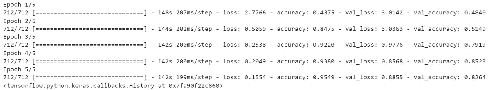
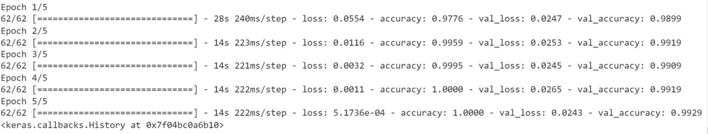

# 第八章：8. 预训练网络

概述

在本章中，您将分析预训练模型。您将通过实践体验使用 TensorFlow 上提供的不同最先进的模型架构。您将探索诸如迁移学习和微调等概念，并了解 TensorFlow Hub 及其发布的深度学习资源。

到本章结束时，您将能够直接使用 TensorFlow 和 TensorFlow Hub 中的预训练模型。

# 引言

在上一章中，您学习了 **卷积神经网络**（**CNNs**）如何分析图像并学习相关模式，以便分类其主要对象或识别其中的物体。您还了解了用于此类模型的不同类型的层。

但是，与其从头开始训练一个模型，不如利用已经计算好的权重重用现有的模型，这样会更高效。这正是 **迁移学习** 和 **微调** 的核心内容。本章中，您将学习如何将这些技术应用到自己的项目和数据集中。

您还将了解 ImageNet 比赛以及深度学习研究人员用来将自己的模型与最先进算法进行基准对比的相应数据集。最后，您将学习如何使用 TensorFlow Hub 的资源来构建自己的模型。

# ImageNet

ImageNet 是一个大型数据集，包含超过 1400 万张用于图像分类或物体检测的标注图像。它由 Fei-Fei Li 及其团队在 2007 年首次整合。其目标是构建一个计算机视觉研究人员能够受益的数据集。

该数据集首次在 2009 年发布，自 2010 年起，每年都会组织一场名为 **ImageNet 大规模视觉识别挑战赛**（**ILSVRC**）的年度竞赛，涵盖图像分类和物体检测任务。


图 8.1：来自 ImageNet 的图像示例

多年来，一些最著名的卷积神经网络（CNN）架构（如 AlexNet、Inception、VGG 和 ResNet）在 ILSVRC 比赛中取得了惊人的成果。在下面的图表中，您可以看到一些最著名的 CNN 架构在这场比赛中的表现。在不到 10 年的时间里，性能从 50% 的准确率提升到接近 90%。


图 8.2：来自 paperswithcode.com 的模型基准测试

您将在下一节中看到如何使用这些模型进行迁移学习。

# 迁移学习

在上一章中，你亲自实践了训练不同的 CNN 模型进行图像分类。尽管你取得了不错的结果，但模型花费了相当长的时间来学习相关参数。如果你继续训练这些模型，可能会得到更好的结果。使用**图形处理单元**（**GPUs**）可以缩短训练时间，但它仍然需要一些时间，尤其是在处理更大或更复杂的数据集时。

深度学习研究人员已经发布了他们的工作，以造福社区。每个人都可以通过采用现有的模型架构并进行定制，而不是从零开始设计架构，来获益。更重要的是，研究人员还分享了他们模型的权重。这样，你不仅可以重用一个架构，还可以利用它已经进行的所有训练。这就是迁移学习的核心。通过重用预训练模型，你无需从头开始。这些模型是经过大规模数据集（如 ImageNet）训练的，已经学会了如何识别成千上万种不同类别的物体。你可以直接使用这些最新的模型，而无需再次训练它们。是不是很棒？与其训练一个模型几个星期，你现在可以直接使用现有的模型。

TensorFlow 提供了一个经过 ImageNet 数据集预训练的最新模型列表，可用于其 Keras API 中的迁移学习。

注意

你可以在以下链接找到 TensorFlow 中提供的所有预训练模型的完整列表：[`www.tensorflow.org/api_docs/python/tf/keras/applications`](https://www.tensorflow.org/api_docs/python/tf/keras/applications)。

在 TensorFlow 中导入预训练模型非常简单，如以下示例所示，其中你加载了`InceptionV3`模型：

```py
import tensorflow as tf
from tensorflow.keras.applications import InceptionV3
```

现在你已经导入了预训练模型的类，你需要通过指定输入图像的尺寸和`imagenet`作为要加载的预训练权重来实例化它：

```py
model = InceptionV3(input_shape=(224, 224, 3), \
                    weights='imagenet', include_top=True)
```

`include_top=True`参数指定你将重用与原始在 ImageNet 上训练的模型相同的顶层（即最后一层）。这意味着最后一层是用来预测该数据集中 1,000 个类别的。

现在你已经实例化了预训练模型，你可以从中进行预测：

```py
model.predict(input_image)
```

如果你想使用这个预训练模型来预测与 ImageNet 类别不同的类别，你需要将顶层替换为另一个将被训练来识别输入数据集中特定类别的层。

首先，你需要通过指定`include_top=False`来移除这个层：

```py
model = InceptionV3(input_shape=(224, 224, 3), \
                    weights='imagenet', include_top=False)
```

在前面的示例中，你已经加载了一个`InceptionV3`模型。下一步将是*冻结*这个模型的所有层，这样它们的权重就不会被更新：

```py
model.trainable = False
```

在此之后，您将实例化一个新的全连接层，设置所需的单元数量和激活函数。在以下示例中，您希望预测 50 个不同的类别。为此，您创建一个具有 `20` 个单元的密集层，并使用 softmax 作为激活函数：

```py
top_layer = tf.keras.layers.Dense(20, activation='softmax')
```

然后，您需要使用 Keras 的 Sequential API 将这个全连接层添加到您的基础模型中：

```py
new_model = tf.keras.Sequential([model, top_layer])
```

现在，您可以训练这个模型，并且只有顶层的权重会被更新。其他所有层都已被冻结：

```py
new_model.compile(loss='sparse_categorical_crossentropy', \
                  optimizer=tf.keras.optimizers.Adam(0.001))
new_model.fit(X_train, t_train, epochs=50)
```

仅用几行代码，您就加载了 Inception V3 模型，这是一个在 2016 年 ILSVRC 比赛中获胜的最先进的模型。您学会了如何将其适应到自己的项目和数据集中。

在下一个练习中，您将亲手实践迁移学习。

## 练习 8.01：使用迁移学习对猫和狗进行分类

在这个练习中，您将使用迁移学习正确地将图像分类为猫或狗。您将使用一个预训练的模型 NASNet-Mobile，该模型已经在 TensorFlow 中可用，并且带有 ImageNet 上的预训练权重。

注意

本练习中使用的原始数据集由 Google 提供。该数据集包含 25,000 张猫和狗的图像，可以在此找到：[`storage.googleapis.com/mledu-datasets/cats_and_dogs_filtered.zip`](https://storage.googleapis.com/mledu-datasets/cats_and_dogs_filtered.zip)。

1.  打开一个新的 Jupyter notebook。

1.  导入 TensorFlow 库：

    ```py
    import tensorflow as tf
    ```

1.  创建一个名为 `file_url` 的变量，包含数据集的链接：

    ```py
    file_url = 'https://storage.googleapis.com'\
              '/mledu-datasets/cats_and_dogs_filtered.zip'
    ```

1.  使用 `tf.keras.get_file` 下载数据集，参数为 `'cats_and_dogs.zip'`、`origin=file_url` 和 `extract=True`，并将结果保存到一个名为 `zip_dir` 的变量中：

    ```py
    zip_dir = tf.keras.utils.get_file('cats_and_dogs.zip', \
                                      origin=file_url, extract=True)
    ```

1.  导入 `pathlib` 库：

    ```py
    import pathlib
    ```

1.  创建一个名为 `path` 的变量，使用 `pathlib.Path(zip_dir).parent` 获取 `cats_and_dogs_filtered` 目录的完整路径：

    ```py
    path = pathlib.Path(zip_dir).parent / 'cats_and_dogs_filtered'
    ```

1.  创建两个变量，分别叫做 `train_dir` 和 `validation_dir`，它们分别表示 `train` 和 `validation` 文件夹的完整路径：

    ```py
    train_dir = path / 'train'
    validation_dir = path / 'validation'
    ```

1.  创建四个变量，分别叫做 `train_cats_dir`、`train_dogs_dir`、`validation_cats_dir` 和 `validation_dogs_dir`，它们分别表示训练集和验证集中的 `cats` 和 `dogs` 文件夹的完整路径：

    ```py
    train_cats_dir = train_dir / 'cats'
    train_dogs_dir = train_dir /'dogs'
    validation_cats_dir = validation_dir / 'cats'
    validation_dogs_dir = validation_dir / 'dogs'
    ```

1.  导入 `os` 包。接下来的步骤中，您需要计算文件夹中图像的数量：

    ```py
    import os
    ```

1.  创建两个变量，分别叫做 `total_train` 和 `total_val`，用于获取训练集和验证集的图像数量：

    ```py
    total_train = len(os.listdir(train_cats_dir)) \
                  + len(os.listdir(train_dogs_dir))
    total_val = len(os.listdir(validation_cats_dir)) \
                + len(os.listdir(validation_dogs_dir))
    ```

1.  从 `tensorflow.keras.preprocessing` 导入 `ImageDataGenerator`：

    ```py
    from tensorflow.keras.preprocessing.image
        import ImageDataGenerator
    ```

1.  实例化两个 `ImageDataGenerator` 类，并将它们命名为 `train_image_generator` 和 `validation_image_generator`。这两个类将通过除以 `255` 来重新缩放图像：

    ```py
    train_image_generator = ImageDataGenerator(rescale=1./255)
    validation_image_generator = ImageDataGenerator(rescale=1./255)
    ```

1.  创建三个变量，分别叫做 `batch_size`、`img_height` 和 `img_width`，它们的值分别是 `16`、`224` 和 `224`：

    ```py
    batch_size = 16
    img_height = 224
    img_width = 224
    ```

1.  使用`flow_from_directory()`方法创建一个名为`train_data_gen`的数据生成器，并指定批量大小、训练文件夹的路径、目标大小和类别模式：

    ```py
    train_data_gen = train_image_generator.flow_from_directory\
                     (batch_size = batch_size, \
                      directory = train_dir, \
                      shuffle=True, \
                      target_size = (img_height, img_width), \
                      class_mode='binary')
    ```

1.  使用`flow_from_directory()`方法创建一个名为`val_data_gen`的数据生成器，并指定批量大小、验证文件夹的路径、目标大小和类别模式：

    ```py
    val_data_gen = validation_image_generator.flow_from_directory\
                   (batch_size = batch_size, \
                    directory = validation_dir, \
                    target_size=(img_height, img_width), \
                    class_mode='binary')
    ```

1.  从`tensorflow.keras`导入`numpy`为`np`，`tensorflow`为`tf`，并导入`layers`：

    ```py
    import numpy as np
    import tensorflow as tf
    from tensorflow.keras import layers
    ```

1.  将`8`（完全是随便设定的）作为 NumPy 和 TensorFlow 的`seed`：

    ```py
    np.random.seed(8)
    tf.random.set_seed(8)
    ```

1.  从`tensorflow.keras.applications`导入`NASNETMobile`模型：

    ```py
    from tensorflow.keras.applications import NASNetMobile
    ```

1.  使用 ImageNet 权重实例化模型，移除顶层，并指定正确的输入维度：

    ```py
    base_model = NASNetMobile(include_top=False, \
                              input_shape=(img_height, img_width, 3),\
                              weights='imagenet')
    ```

1.  冻结此模型的所有层：

    ```py
    base_model.trainable = False
    ```

1.  使用`summary()`方法打印模型的摘要：

    ```py
    base_model.summary()
    ```

    预期输出如下：

    

    图 8.3：模型摘要

1.  创建一个新模型，将`NASNETMobile`模型与两个新的顶层（分别为`500`和`1`个单元）及 ReLU 和 sigmoid 激活函数结合：

    ```py
    model = tf.keras.Sequential([base_model,\
                                 layers.Flatten(),
                                 layers.Dense(500, \
                                              activation='relu'),
                                 layers.Dense(1, \
                                              activation='sigmoid')])
    ```

1.  通过提供`binary_crossentropy`作为`loss`函数，Adam 优化器的学习率为`0.001`，并将`accuracy`作为要显示的指标，来编译模型：

    ```py
    model.compile(loss='binary_crossentropy', \
                  optimizer=tf.keras.optimizers.Adam(0.001), \
                  metrics=['accuracy'])
    ```

1.  拟合模型，提供训练和验证数据生成器，并运行五个周期：

    ```py
    model.fit(train_data_gen, \
              steps_per_epoch = total_train // batch_size, \
              epochs=5, \
              validation_data = val_data_gen, \
              validation_steps = total_val // batch_size)
    ```

    预期输出如下：

    

图 8.4：模型训练输出

您可以观察到，模型在训练集上达到了`0.99`的准确率，在验证集上达到了`0.98`的准确率。考虑到您只训练了最后两层，并且训练时间不到一分钟，这是一个相当了不起的结果。这就是应用迁移学习和使用预训练的最先进模型的好处。

在下一节中，您将看到如何对一个预训练模型进行微调。

# 微调

之前，您使用迁移学习将预训练模型应用到您自己的数据集上。您使用了在像 ImageNet 这样的庞大数据集上训练的最先进模型的权重。这些模型学会了识别图像中的不同模式的相关参数，并帮助您在不同数据集上取得了惊人的结果。

但是这种方法有一个问题。迁移学习通常效果很好，前提是您尝试预测的类别属于与 ImageNet 相同的类别列表。如果是这种情况，从 ImageNet 学到的权重也会与您的数据集相关。例如，上一个练习中的`cats`和`dogs`类别就存在于 ImageNet 中，因此其权重对于这个数据集也会有用。

然而，如果你的数据集与 ImageNet 非常不同，那么这些预训练模型的权重可能并不完全适用。例如，如果你的数据集包含卫星图像，而你试图判断房屋屋顶是否安装了太阳能板，这与 ImageNet 的数据集相比会有很大不同。最后几层的权重将非常特定于 ImageNet 中的类别，例如猫胡须或汽车车轮（对于卫星图像数据集来说这些并不太有用），而早期层的权重则更为通用，如用于检测形状、颜色或纹理（这些可以应用于卫星图像数据集）。

因此，仍然利用早期层的一些权重是很有帮助的，但需要训练最终层，使得模型能够学习与你的数据集相关的特定模式，并提高其性能。

这种技术称为微调。其背后的理念非常简单：你冻结早期的层，只更新最终层的权重。让我们看看如何在 TensorFlow 中实现这一点：

1.  首先，实例化一个没有顶层的预训练`MobileNetV2`模型：

    ```py
    from tensorflow.keras.applications import MobileNetV2
    base_model = MobileNetV2(input_shape=(224, 224, 3), \
                             weights='imagenet', include_top=False)
    ```

1.  接下来，遍历前几层，并通过将其设置为不可训练来冻结它们。在以下示例中，你将只冻结前`100`层：

    ```py
    for layer in base_model.layers[:100]:
        layer.trainable = False
    ```

1.  现在，你需要将自定义的顶层添加到基础模型中。在以下示例中，你将预测 20 个不同的类别，因此需要添加一个包含`20`个单元并使用 softmax 激活函数的全连接层：

    ```py
    prediction_layer = tf.keras.layers.Dense(20, activation='softmax')
    model = tf.keras.Sequential([base_model, prediction_layer])
    ```

1.  最后，你将编译并训练这个模型：

    ```py
    model.compile(loss='sparse_categorical_crossentropy', \
                  optimizer = tf.keras.optimizers.Adam(0.001))
    model.fit(features_train, label_train, epochs=5)
    ```

    这将显示一系列日志，如以下截图所示：

    

图 8.5：在预训练的 MobileNetV2 模型上进行微调的结果

就这样。你已经在一个预训练的 MobileNetV2 模型上进行了微调。你使用了 ImageNet 的前 100 个预训练权重，并仅根据你的数据集更新了从第 100 层开始的权重。

在接下来的活动中，你将实践刚刚学到的内容，并将微调应用于一个预训练的模型。

## 活动 8.01：使用微调进行水果分类

`Fruits 360`数据集（[`arxiv.org/abs/1712.00580`](https://arxiv.org/abs/1712.00580)），最初由*Horea Muresan 和 Mihai Oltean, 通过深度学习从图像中识别水果，Acta Univ. Sapientiae, Informatica Vol. 10, Issue 1, pp. 26-42, 2018*共享，包含超过 82,000 张 120 种不同类型水果的图像。你将使用该数据集的一个子集，其中包含超过 16,000 张图像。训练集和验证集的图像数量分别为`11398`和`4752`。

在这个活动中，你的任务是训练一个`NASNetMobile`模型来识别不同种类的水果图像（分类为 120 个不同的类别）。你将使用微调来训练这个模型的最终层。

注意

数据集可以在这里找到：[`packt.link/OFUJj`](http://packt.link/OFUJj)。

以下步骤将帮助你完成此活动：

1.  使用 TensorFlow 导入数据集并解压文件。

1.  创建一个数据生成器，使用以下数据增强：

    ```py
    Rescale = 1./255, 
    rotation_range = 40, 
    width_shift_range = 0.1, 
    height_shift_range = 0.1, 
    shear_range = 0.2, 
    zoom_range = 0.2, 
    horizontal_flip = True, 
    fill_mode = 'nearest
    ```

1.  从 TensorFlow 加载一个预训练的 `NASNetMobile` 模型。

1.  冻结模型的前 `600` 层。

1.  在 `NASNetMobile` 上添加两个全连接层：

    – 一个全连接层，`Dense(1000, activation=relu)`

    – 一个全连接层，`Dense(120, activation='softmax')`

1.  指定一个学习率为 `0.001` 的 Adam 优化器。

1.  训练模型。

1.  在测试集上评估模型。

    预期输出如下：

    

    ](img/B16341_08_06.jpg)

图 8.6：活动的预期输出

注

该活动的解决方案可以通过这个链接找到。

现在你已经了解了如何使用来自 TensorFlow 的预训练模型，接下来你将学习如何从 TensorFlow Hub 获取模型。

# TensorFlow Hub

TensorFlow Hub 是一个由 Google、NVIDIA 和 Kaggle 等出版商共享的 TensorFlow 模块库。TensorFlow 模块是基于 TensorFlow 构建的自包含模型，可以用于不同的任务。简单来说，它是一个外部集合，包含了用于迁移学习和微调的发布的 TensorFlow 模块。通过 TensorFlow Hub，你可以访问不同于直接通过 TensorFlow 核心 API 提供的深度学习模型或权重。

注

你可以在这里找到关于 TensorFlow Hub 的更多信息：[`tfhub.dev/`](https://tfhub.dev/)。

为了使用它，你首先需要安装它：

```py
pip install tensorflow-hub
```

安装完成后，你可以使用 `load()` 方法加载可用的分类模型，并指定模块的链接：

```py
import tensorflow_hub as hub
MODULE_HANDLE = 'https://tfhub.dev/tensorflow/efficientnet'\
                '/b0/classification/1'
module = hub.load(MODULE_HANDLE)
```

在前面的例子中，你加载了**EfficientNet B0**模型，该模型是在 ImageNet 上训练的。你可以在 TensorFlow Hub 页面找到更多关于它的细节：[`tfhub.dev/tensorflow/efficientnet/b0/classification/1`](https://tfhub.dev/tensorflow/efficientnet/b0/classification/1)。

注

TensorFlow Hub 提供了一个搜索引擎，帮助你找到特定的模块：[`tfhub.dev/s?subtype=module,placeholder`](https://tfhub.dev/s?subtype=module,placeholder)。

默认情况下，从 TensorFlow Hub 加载的模块包含模型的最终层，但没有激活函数。对于分类任务，你需要添加一个激活层。为此，你可以使用 Keras 的 Sequential API。只需使用 `KerasLayer` 类将模型转换为 Keras 层：

```py
import tensorflow as tf
model = tf.keras.Sequential([
    hub.KerasLayer(MODULE_HANDLE,input_shape=(224, 224, 3)),
    tf.keras.layers.Activation('softmax')
])
```

然后，你可以使用最终模型进行预测：

```py
model.predict(data)
```

你刚刚使用来自 TensorFlow Hub 的模型进行了迁移学习。这与之前使用 Keras API 学习的内容非常相似，在 Keras 中，你通过设置 `include_top=True` 加载了一个完整的模型。使用 TensorFlow Hub，你可以访问一个预训练模型库，用于物体检测或图像分割。

在下一部分，你将学习如何从 TensorFlow Hub 预训练模块中提取特征。

# 特征提取

TensorFlow Hub 提供了下载没有最终层的模型的选项。在这种情况下，你将使用 TensorFlow 模块作为特征提取器；你可以在其上设计自定义的最终层。在 TensorFlow Hub 中，用于特征提取的模块被称为特征向量：

```py
import tensorflow_hub as hub
MODULE_HANDLE = 'https://tfhub.dev/google/efficientnet/b0'\
                '/feature-vector/1'
module = hub.load(MODULE_HANDLE)
```

注意

若要查找 TensorFlow Hub 上所有可用的特征向量，你可以使用其搜索引擎：[`tfhub.dev/s?module-type=image-feature-vector&tf-version=tf2`](https://tfhub.dev/s?module-type=image-feature-vector&tf-version=tf2)。

一旦加载，你可以通过 Sequential API 将自己的最终层添加到特征向量上：

```py
model = tf.keras.Sequential([
    hub.KerasLayer(MODULE_HANDLE, input_shape=(224, 224, 3)),
    tf.keras.layers.Dense(20, activation='softmax')
])
```

在前面的示例中，你添加了一个包含 `20` 单元的全连接层，并使用了 softmax 激活函数。接下来，你需要编译并训练你的模型：

```py
model.compile(optimizer=optimizer, \
              loss='sparse_categorical_crossentropy', \
              metrics=['accuracy'])
model.fit(X_train, epochs=5)
```

至此，你已经使用了 TensorFlow Hub 上的特征向量，并添加了自定义的最终层，以便在你的数据集上训练最终的模型。

现在，测试一下你到目前为止所获得的知识，在下一活动中进行验证。

## 活动 8.02：使用 TensorFlow Hub 进行迁移学习

在此活动中，你需要通过迁移学习正确分类猫狗图片。与从头开始训练模型不同，你将从 TensorFlow Hub 获取**EfficientNet B0**特征向量，该特征向量包含了预计算的权重，可以识别不同类型的物体。

你可以在这里找到数据集：[`packt.link/RAAtm`](https://packt.link/RAAtm)。

以下步骤将帮助你完成此活动：

1.  使用 TensorFlow 导入数据集并解压文件。

1.  创建一个数据生成器，用于执行重缩放。

1.  从 TensorFlow Hub 加载预训练的**EfficientNet B0**特征向量。

1.  在特征向量上添加两个全连接层：

    – 一个全连接层，使用`Dense(500, activation=relu)`

    – 一个全连接层，使用`Dense(1, activation='sigmoid')`

1.  指定一个学习率为`0.001`的 Adam 优化器。

1.  训练模型。

1.  在测试集上评估模型。

    预期的输出如下：

    

图 8.7：活动的预期输出

预期的准确率应该在训练集和验证集上达到 `1.0` 左右。

注意

此活动的解决方案可以通过此链接找到。

# 总结

在本章中，你学习了两个非常重要的概念：迁移学习和微调。两者都帮助深度学习实践者利用现有的预训练模型，并将其适应自己的项目和数据集。

迁移学习是重复使用已在大型数据集（如 ImageNet，其中包含超过 1400 万张图像）上训练过的模型。TensorFlow 在其核心 API 中提供了这类预训练模型的列表。您还可以通过 TensorFlow Hub 访问来自谷歌和 NVIDIA 等知名出版商的其他模型。

最后，您进行了一些动手实践，微调了一个预训练模型。您学会了如何冻结模型的早期层，并根据输入数据集的特定要求仅训练最后几层。

这两种技术对社区来说是一项重大突破，因为它们为有意应用深度学习模型的任何人提供了访问先进模型的便利。

在接下来的章节中，您将研究另一种类型的模型架构，**循环神经网络**（**RNNs**）。这种类型的架构非常适合顺序数据，如时间序列或文本。
