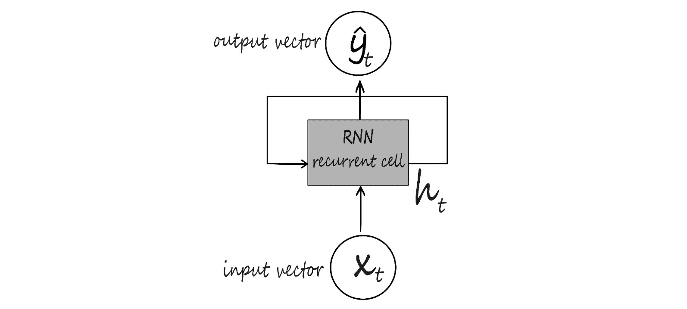

# 第九章：9. 循环神经网络

概述

在本章中，您将学习如何处理真实的序列数据。您将扩展对**人工神经网络**（**ANN**）模型和**循环神经网络**（**RNN**）架构的理解，以便训练序列数据。您还将学习如何构建一个具有 LSTM 层的 RNN 模型，用于自然语言处理。

到本章结束时，您将通过实际操作获得应用多个 LSTM 层构建 RNN 用于股票价格预测的经验。

# 引言

序列数据指的是每个数据点都依赖于前一个数据点的数据集。可以把它想象成一句话，由一系列彼此相关的单词组成。动词将与主语相关，副词则与动词相关。另一个例子是股票价格，其中某一天的价格与前几天的价格相关。传统的神经网络并不适合处理这类数据。存在一种特定类型的架构，可以处理数据序列。本章将介绍这种模型——即**循环神经网络**（**RNN**）。

RNN 模型是一种特定类型的深度学习架构，其中模型的输出会反馈到输入中。这类模型有其自身的挑战（称为消失梯度和爆炸梯度），这些问题将在本章稍后讨论。

在许多方面，RNN 代表了大脑可能如何工作。RNN 使用记忆来帮助它们学习。但是，信息只沿一个方向流动，它们怎么做到这一点呢？要理解这一点，您需要先回顾序列数据。这是一种需要工作记忆才能有效处理数据的数据类型。到目前为止，您只探索了非序列模型，如感知机或 CNN。在本章中，您将研究诸如 RNN、LSTM 或 GRU 之类的序列模型。


图 9.1：序列模型与非序列模型

# 序列数据

序列数据是按顺序发生并与过去和未来数据相关的信息。一个序列数据的例子是时间序列数据；就像你感知的时间一样，时间只朝一个方向流动。

假设您有一个球（如*图 9.2*所示），并且您想预测这个球接下来会朝哪个方向移动。如果您没有关于球被投掷的方向的任何先前信息，那么您只能猜测。然而，如果除了球的当前位置之外，您还拥有球之前位置的信息，问题就变得简单多了。为了能够预测球的下一个位置，您需要将之前位置的信息以序列（或有序）形式提供，以便对未来事件做出预测。


图 9.2：球的运动方向

循环神经网络（RNN）能够通过内部记忆帮助信息的顺序保持有效，从而发挥作用。

接下来我们将展示一些顺序数据的示例。

## 顺序数据的示例

顺序数据是一种特殊类型的数据，其中每一条信息的顺序很重要，它们彼此依赖。

顺序数据的一个例子是金融数据，比如股票价格。如果你想预测给定股票的未来数据值，就需要使用先前的时间值。事实上，你将在*练习 9.01*中进行股票预测，*为顺序数据训练一个人工神经网络——Nvidia 股票预测*。

音频和文本也可以视为顺序数据。音频可以分割成一系列声波，而文本可以分割成一系列字符或单词。声波或字符、单词序列应该按照顺序处理，以传达预期的结果。除了这两个日常遇到的例子外，顺序处理在很多其他领域也非常有用，比如分析医学信号（如脑电图）、预测股票价格以及推断和理解基因序列等。顺序数据有三种类型：

+   **多对一** 从多个输入产生一个输出。

+   **一对多** 从一个输入产生多个输出。

+   **多对多** 从多个输入产生多个输出。


图 9.3：顺序数据的分类

另一个例子是，假设你有一个语言模型，输入是一个句子或短语，你正在尝试预测接下来的单词，如下图所示：


图 9.4：句子示例

比如，你被给定了这句话 `yesterday I took my car out for a…`，并且你想预测下一个单词是 `drive`。你可以通过构建一个深度神经网络（如前馈神经网络）来实现这一点。然而，你会立即遇到一个问题：前馈网络只能接受固定长度的输入向量；你必须从一开始就指定输入的大小。

因此，你的模型需要能够处理可变长度输入的方式。你可以通过使用固定窗口来实现这一点。这意味着你强制将输入向量限制为特定的长度。例如，你可以将句子拆分为两个连续单词的组（也称为**双元语法**），然后预测下一个单词。这意味着，无论你尝试在哪个位置进行下一步预测，模型仅会将前两个单词作为输入。你需要考虑如何以数字的形式表示这些数据。一种方法是使用固定长度的向量，并为第一个单词分配一些空间，为第二个单词分配一些空间。在这些空间中，编码每个单词的身份。然而，这种方法存在问题。

为什么？因为你只使用了部分可用信息（即仅仅是两个连续的单词）。你只能访问有限的数据窗口，这不足以提供足够的上下文来准确预测下一个单词。这意味着你无法有效地建模长期依赖性。这在像*图 9.5*中的句子中非常重要，在那里你显然需要来自句子早期的信息，以便准确预测下一个单词。


图 9.5：句子示例

如果你只看过去的两个或三个单词，你就无法做出下一个预测，而你知道这个预测是`意大利语`。因此，这意味着你确实需要一种方法来整合从句子开始到结束的所有信息。

为了做到这一点，你可以使用一组计数作为固定长度向量，并使用整个句子。这种方法被称为**词袋模型**。

你有一个固定长度的向量，不管句子的身份是什么，但不同之处在于，添加了对这个词汇表的计数。你可以将其作为输入传递给模型，以生成预测结果。

然而，这里还有一个大问题。仅仅使用计数意味着你失去了所有的顺序信息以及所有关于前历史的信息。

请参考*图 9.6*。所以，这两句话，尽管语义完全相反，但在这种词袋格式中会有完全相同的表示。因为它们有完全相同的单词列表，只是顺序不同。所以，显然，这种方法行不通。另一个想法是简单地扩展固定窗口。


图 9.6：词袋示例

现在，考虑*图 9.7*。你可以这样表示你的句子，将句子输入到模型中，并生成预测。问题是，如果你将这个向量输入到一个前馈神经网络中，这些输入（`yesterday I took my car`）每个都会有一个单独的权重与网络连接。因此，如果你反复看到句子开头的单词`yesterday`，网络可能会学会`yesterday`代表一个时间或环境。然而，如果`yesterday`突然出现在固定长度向量的后面，在句子的末尾，网络可能会很难理解`yesterday`的含义。这是因为位于向量末尾的参数可能以前从未见过`yesterday`这个词，而句子开头的参数没有在整个序列中共享。


图 9.7：句子示例

因此，你需要能够处理可变长度的输入和长期依赖，跟踪顺序，并且具有可以在整个序列中共享的参数。具体来说，你需要开发能够执行以下操作的模型：

+   处理可变长度的输入序列。

+   跟踪数据中的长期依赖。

+   保持序列顺序的信息。

+   在整个序列中共享参数。

如何在信息仅朝一个方向流动的模型中做到这一点？你需要一种不同的神经网络。你需要一个递归模型。你将在以下练习中实践处理顺序数据。

## 练习 9.01：为顺序数据训练 ANN——Nvidia 股票预测

在本练习中，你将构建一个简单的人工神经网络（ANN）模型来预测 Nvidia 股票价格。但与之前章节的示例不同，这次输入数据是顺序的。因此，你需要手动处理一些数据，创建一个数据集，该数据集将包含给定日期的股票价格作为目标变量，并且将前 60 天的价格作为特征。你需要在`2019-01-01`之前和之后将数据分为训练集和测试集。

注意

你可以在这里找到`NVDA.csv`数据集：[`packt.link/Mxi80`](https://packt.link/Mxi80)。

1.  打开一个新的 Jupyter 或 Colab 笔记本。

1.  导入所需的库。使用`numpy`进行计算，`matplotlib`用于绘制可视化，`pandas`帮助处理数据集，`MinMaxScaler`用于将数据集缩放到 0 和 1 之间：

    ```py
    import numpy as np
    import matplotlib.pyplot as plt
    import pandas as pd
    from sklearn.preprocessing import StandardScaler, MinMaxScaler
    ```

1.  使用`read_csv()`函数读取 CSV 文件，并将数据集存储在 pandas 的 DataFrame 中，命名为`data`，以便进行操作：

    ```py
    import io
    data = pd.read_csv('NVDA.csv')
    ```

1.  对你的数据调用`head()`函数，查看 DataFrame 的前五行：

    ```py
    data.head()
    ```

    你应该得到以下输出：

    

    图 9.8：输出的前五行

    上表展示了原始数据。你可以看到，每一行代表一天，包含了当天开盘价和收盘价、最高价、最低价以及调整后的收盘价（例如考虑到股息或股票拆分等因素）。

1.  现在，拆分训练数据。使用`Date`列中所有 2019 年 1 月 1 日之前的数据作为训练数据。将其保存为`data_training`。通过使用`copy()`方法，将其保存在单独的文件中：

    ```py
    data_training = data[data['Date']<'2019-01-01'].copy()
    ```

1.  现在，拆分测试数据。使用`Date`列中所有 2019 年 1 月 1 日及之后的数据，将其保存为`data_test`。通过使用`copy()`方法，将其保存在单独的文件中：

    ```py
    data_test = data[data['Date']>='2019-01-01'].copy()
    ```

1.  使用`drop()`方法删除数据框中的`Date`和`Adj Close`列。记住，你使用了`Date`列来划分训练集和测试集，因此不需要日期信息。使用`axis = 1`来指定你还希望删除列标签。为了确保操作成功，调用`head()`函数查看数据框的前五行：

    ```py
    training_data = data_training.drop\
                    (['Date', 'Adj Close'], axis = 1)
    training_data.head()
    ```

    你应该得到如下输出：

    

    图 9.9：新的训练数据

    这是你在删除那两列之后应该得到的输出：

1.  创建一个来自`MinMaxScaler`的缩放器，将`training_data`缩放到 0 和 1 之间。使用`fit_transform`函数将模型拟合到数据并根据拟合的模型转换数据：

    ```py
    scaler = MinMaxScaler()
    training_data = scaler.fit_transform(training_data)
    training_data
    ```

    你应该得到如下输出：

    

    图 9.10：已缩放的训练数据

1.  将数据拆分为`X_train`和`y_train`数据集：

    ```py
    X_train = []
    y_train = []
    ```

1.  检查`training_data`的形状：

    ```py
    training_data.shape[0]
    ```

    你应该得到如下输出：

    ```py
    868
    ```

    你可以看到训练集包含 868 个观测值。

1.  创建一个训练数据集，包含过去 60 天的股价数据，这样你就可以预测第 61 天的收盘价。在这里，`X_train`将有两列。第一列将存储从 0 到 59 的值，第二列将存储从 1 到 60 的值。在`y_train`的第一列存储第 61 个值（索引为 60），在第二列存储第 62 个值（索引为 61）。使用`for`循环创建 60 个时间步的数据：

    ```py
    for i in range(60, training_data.shape[0]):
        X_train.append(training_data[i-60:i])
        y_train.append(training_data[i, 0])
    ```

1.  将`X_train`和`y_train`转换为 NumPy 数组：

    ```py
    X_train, y_train = np.array(X_train), np.array(y_train)
    ```

1.  对`X_train`和`y_train`调用`shape()`函数：

    ```py
    X_train.shape, y_train.shape
    ```

    你应该得到如下输出：

    ```py
    ((808, 60, 5), (808,))
    ```

    上面的代码片段显示，准备好的训练集包含`808`个观测值，数据集包含 60 天的五个特征（`Open`、`Low`、`High`、`Close`和`Volume`）。

1.  将数据转换为形状为样本矩阵（每个样本的样本数和特征数）的二维矩阵。将 60 天的所有特征堆叠在一起，得到输出形状为`(808, 300)`。使用以下代码完成此操作：

    ```py
    X_old_shape = X_train.shape
    X_train = X_train.reshape(X_old_shape[0], \
                              X_old_shape[1]*X_old_shape[2]) 
    X_train.shape
    ```

    你应该得到如下输出：

    ```py
    (808, 300)
    ```

1.  现在，构建一个 ANN。你需要一些额外的库来实现这一点。使用`Sequential`来初始化神经网络，`Input`来添加输入层，`Dense`来添加全连接层，`Dropout`来帮助防止过拟合：

    ```py
    from tensorflow.keras import Sequential
    from tensorflow.keras.layers import Input, Dense, Dropout
    ```

1.  通过调用`regressor_ann = Sequential()`初始化神经网络。

    ```py
    regressor_ann = Sequential()
    ```

1.  添加一个输入层，`shape`设置为`300`：

    ```py
    regressor_ann.add(Input(shape = (300,)))
    ```

1.  然后，添加第一层全连接层，设置为`512`个单元，这将是你输出空间的维度。使用 ReLU 激活函数。最后，添加一个丢弃层，在训练过程中移除 20%的单元，以防止过拟合：

    ```py
    regressor_ann.add(Dense(units = 512, activation = 'relu'))
    regressor_ann.add(Dropout(0.2))
    ```

1.  添加另一个具有`128`个单元的全连接层，使用 ReLU 作为激活函数，丢弃率为`0.3`：

    ```py
    regressor_ann.add(Dense(units = 128, activation = 'relu'))
    regressor_ann.add(Dropout(0.3))
    ```

1.  添加另一个具有`64`个单元的全连接层，使用 ReLU 作为激活函数，丢弃率为`0.4`：

    ```py
    regressor_ann.add(Dense(units = 64, activation = 'relu'))
    regressor_ann.add(Dropout(0.4))
    ```

1.  再次添加一个具有`128`个单元的全连接层，使用 ReLU 作为激活函数，丢弃率为`0.3`：

    ```py
    regressor_ann.add(Dense(units = 16, activation = 'relu'))
    regressor_ann.add(Dropout(0.5))
    ```

1.  添加一个具有一个单元的最终全连接层：

    ```py
    regressor_ann.add(Dense(units = 1))
    ```

1.  查看模型的摘要：

    ```py
    regressor_ann.summary()
    ```

    你将获得关于模型层和参数的宝贵信息。

    

    图 9.11: 模型摘要

1.  使用`compile()`方法配置你的模型以进行训练。选择 Adam 作为优化器，并使用均方误差作为损失函数的度量标准：

    ```py
    regressor_ann.compile(optimizer='adam', \
                          loss = 'mean_squared_error')
    ```

1.  最后，拟合你的模型并设置训练周期为`10`。将批量大小设置为`32`：

    ```py
    regressor_ann.fit(X_train, y_train, epochs=10, batch_size=32)
    ```

    你应该得到以下输出：

    

    图 9.12: 训练模型

1.  测试并预测股票价格，并准备数据集。通过调用`head()`方法检查数据：

    ```py
    data_test.head()
    ```

    你应该得到以下输出：

    

    图 9.13: DataFrame 的前五行

1.  使用`tail(60)`方法创建一个`past_60_days`变量，包含训练集中最后 60 天的数据。将`past_60_days`变量通过`append()`函数添加到测试数据中，并将`ignore_index`设置为`True`：

    ```py
    past_60_days = data_training.tail(60)
    df = past_60_days.append(data_test, ignore_index = True)
    ```

1.  现在，通过重复你在*步骤 8*到*15*中的操作，准备你的测试数据进行预测：

    ```py
    df = df.drop(['Date', 'Adj Close'], axis = 1)
    inputs = scaler.transform(df) 
    X_test = []
    y_test = []
    for i in range(60, inputs.shape[0]):
        X_test.append(inputs[i-60:i])
        y_test.append(inputs[i, 0])
    X_test, y_test = np.array(X_test), np.array(y_test)
    X_old_shape = X_test.shape
    X_test = X_test.reshape(X_old_shape[0], \
                            X_old_shape[1] * X_old_shape[2])
    X_test.shape, y_test.shape
    ```

    你应该得到以下输出：

    ```py
    ((391, 300), (391,))
    ```

1.  对你的股票价格进行一些预测，通过对`X_test`调用`predict()`方法进行测试：

    ```py
    y_pred = regressor_ann.predict(X_test)
    ```

1.  在查看结果之前，先使用你之前导入的`StandardScaler`工具类中的`scaler.scale_`方法反转之前的缩放操作，这样输出的数值将处于正确的尺度：

    ```py
    scaler.scale_
    ```

    你应该得到以下输出：

    

    图 9.14: 使用 StandardScaler

1.  使用前面数组中的第一个值来设置你的缩放比例，为`y_pred`和`y_test`的乘法做好准备。回想一下，你正在将数据从早期的缩放状态中转换回来，当时你将所有值转换为 0 到 1 之间：

    ```py
    scale = 1/3.70274364e-03
    scale 
    ```

    你应该得到以下输出：

    ```py
    270.0700067909643
    ```

1.  将`y_pred`和`y_test`乘以`scale`，以将数据转换回正确的数值：

    ```py
    y_pred = y_pred*scale
    y_test = y_test*scale
    ```

1.  回顾真实的 Nvidia 股票价格和你的预测：

    ```py
    plt.figure(figsize=(14,5))
    plt.plot(y_test, color = 'black', label = "Real NVDA Stock Price")
    plt.plot(y_pred, color = 'gray',\
             label = 'Predicted NVDA Stock Price')
    plt.title('NVDA Stock Price Prediction')
    plt.xlabel('time')
    plt.ylabel('NVDA Stock Price')
    plt.legend()
    plt.show()
    ```

    你应该得到以下输出：

    

    ](img/B16341_09_15.jpg)

图 9.15：真实的 Nvidia 股价与你的预测值

在前面的图表中，你可以看到你训练的模型能够捕捉到一些 Nvidia 股价的趋势。可以观察到，预测值与真实值相差很大。从这个结果可以明显看出，人工神经网络并不适合处理顺序数据。

在这个练习中，你看到了简单的人工神经网络无法处理顺序数据的局限性。在下一节中，你将了解递归神经网络，它们被设计用来从顺序数据的时间维度中学习。然后，在*练习 9.02*，*构建具有 LSTM 层的 RNN 进行 Nvidia 股票预测*中，你将使用 RNN 对相同的 Nvidia 股价数据集进行预测，并比较你的结果。

# 递归神经网络

递归型神经网络的第一个形式是由 John Hopfield 在 1982 年创建的。他有两个动机来做这件事：

+   数据的顺序处理

+   神经连接建模

本质上，RNN 在每个时间步骤处理输入数据，并将信息存储在其内存中，这些信息将用于下一步。信息首先被转换成向量，以便机器进行处理。然后，RNN 逐一处理向量序列。在处理每个向量时，它会传递前一个隐藏状态。隐藏状态保留了来自前一步的信息，充当一种记忆。它通过结合输入和前一个隐藏状态与 tanh 函数来完成这一过程，该函数将值压缩在`-1`和`1`之间。

本质上，这就是 RNN 的功能。RNN 不需要大量计算，并且在处理短序列时效果很好。



](img/B16341_09_16.jpg)

图 9.16：RNN 数据流

现在将注意力转向将神经网络应用于涉及数据顺序处理的问题。你已经稍微了解过为什么这些任务需要与之前所见的网络架构有根本不同的原因。

## RNN 架构

本节将介绍 RNN 的关键原理，它们与之前所学的内容有何根本不同，以及 RNN 计算是如何工作的。

但在此之前，先回顾一下之前讨论过的标准前馈神经网络。

在前馈神经网络中，数据只在一个方向上传播，即从输入到输出。

因此，你需要一种不同的网络架构来处理顺序数据。RNN 特别适合处理一系列输入的情况，而不是单一输入。对于那些需要将数据序列传播以获得单一输出的问题来说，RNN 非常适用。

举个例子，假设你正在训练一个模型，输入是一个单词序列，输出是与该序列相关的情感。同样，考虑那些情况，在这些情况下，你不仅仅返回一个输出，而是拥有一个输入序列，并将其传播通过你的网络，其中序列中的每个时间步都会生成一个输出。

简单来说，RNN 是一种网络，它提供了一种机制，可以使先前处理过的数据在时间上持续存在，并利用这些数据进行未来的预测。


图 9.17：RNN 计算

在上面的图中，在某个时间步 `t`，RNN 接收 `X`t 作为输入，并在该时间步计算预测值 `Y`t，这就是网络的输出。

除了这个输出外，它还保存了一个内部状态，叫做更新 `H`t。这个时间步 `t` 的内部状态随后可以用来补充下一个时间步 `t+1` 的输入。所以，基本上，它为下一个步骤提供了前一个步骤的信息。这个机制被称为 **递归**，因为信息在网络内从一个时间步传递到下一个时间步。

这里究竟发生了什么呢？这是通过使用一个简单的递归关系来处理顺序数据。RNN 保持内部状态 `H`t，并将其与下一个输入数据 `X`t+1 结合，做出预测 `Y`t+1，并存储新的内部状态 `H`t+1。关键的思想是，状态更新是前一个状态时间步与当前网络接收到的输入的组合。

需要注意的是，在这个计算过程中，使用的是相同的 `f` 函数和 `W`，以及每个时间步都使用相同的一组参数，而这些参数是在训练过程中学习得到的。为了更好地理解这些网络是如何工作的，可以逐步执行 RNN 算法：

1.  你首先需要初始化你的 RNN 以及该网络的隐藏状态。你可以指定一个句子，并基于该句子预测下一个单词。RNN 计算实际上就是它们循环处理这个句子中的每个单词。

1.  在每个时间步，你将当前正在考虑的单词以及 RNN 的上一个隐藏状态一起输入到网络中。然后，它可以根据这些信息预测序列中的下一个单词，并用来更新其隐藏状态。

1.  最后，在你循环完句子中的所有单词后，你对缺失单词的预测就是该最终时间步的 RNN 输出。

如下图所示，这个 RNN 计算包含了内部状态的更新以及正式的输出向量。


图 9.18：RNN 数据流

给定输入向量 `X`t，RNN 应用一个函数来更新它的隐藏状态。这个函数只是一个标准的神经网络操作，它包括乘以权重矩阵和应用非线性激活函数。关键的区别在于，在这种情况下，你同时将输入向量 `X`t 和前一个状态作为输入传递给这个函数 `H`t-1。

接下来，你应用一个非线性激活函数，如 tanh，来处理上一步的输出。你有这两个权重矩阵，最后，在给定时间步的输出 `y`t 就是这个内部状态的一个修改和转化版本。

当你遍历完句子中的所有单词后，你对缺失单词的预测就是在所有单词通过模型后，RNN 在最后一个时间步的输出。如前所述，RNN 计算包括内部状态更新和正式的输出向量。

另一种表示 RNN 的方式是将其模块沿时间展开。你可以将 RNN 看作是多个相同网络的副本，每个副本将信息传递给它的后代。


图 9.19：带时间的计算图

在这种表示方式中，你可以明确显示你的权重矩阵，从变换输入的权重开始，到 `H` 权重，它们用于将前一个隐藏状态转换为当前隐藏状态，最后是将隐藏状态转换为输出。

需要注意的是，你在每个时间步使用相同的权重矩阵。从这些输出中，你可以在每个时间步计算损失。损失的计算将完成你的网络前向传播。最后，要定义总损失，你只需将所有时间步的损失相加。由于你的损失依赖于每个时间步，这意味着在训练网络时，你还必须将时间作为一个组件来考虑。

现在，你对这些 RNN 是如何构建和运作的有了一些基本的了解，可以逐步演示如何从头开始在 TensorFlow 中实现一个简单的 RNN。

以下代码段使用了来自 `keras.models.Sequential` 的简单 RNN。你将单元数指定为 `1`，并将第一个输入维度设置为 `None`，因为 RNN 可以处理任何数量的时间步。简单的 RNN 默认使用 tanh 激活函数：

```py
model = keras.models.Sequential([
                                 keras.layers.SimpleRNN\
                                 (1, input_shape=[None, 1]) 
])
```

前面的代码创建了一个只有一个神经元的单层网络。

这很简单。现在你需要堆叠一些额外的递归层。代码类似，但这里有一个关键区别。你会注意到，除了最后一层外，所有层都有 `return_sequences=True`。这是为了确保输出是一个三维数组。如你所见，前两层每层都有 `20` 个单元：

```py
model = keras.models.Sequential\
        ([Keras.layers.SimpleRNN\
          (20, return_sequences=True, input_shape=[None, 1]), \
          Keras.layers.SimpleRNN(20, return_sequences=True), \
          Keras.layers.SimpleRNN(1)])
```

RNN 被定义为一个层，你可以通过继承层类来构建它。你还可以将权重矩阵和 RNN 单元的隐藏状态初始化为零。

这里的关键步骤是定义调用函数，它描述了如何在给定输入`X`的情况下，通过网络进行前向传播。为了分解这个调用函数，你首先需要根据之前讨论的方程更新隐藏状态。

取上一个隐藏状态和输入`X`，将它们与相关的权重矩阵相乘，求和后通过一个非线性函数，如双曲正切（tanh），然后传递下去。

然后，输出只是隐藏状态的变换版本，在每个时间步，你返回当前的输出和更新后的隐藏状态。

TensorFlow 通过内置的全连接层使得这一过程变得简单。RNN 也适用同样的情况。TensorFlow 已经实现了这些类型的 RNN 单元，使用简单的 RNN 层。但这种类型的层存在一些限制，比如梯度消失问题。在接下来的章节中，你将深入探讨这个问题，然后再研究不同类型的递归层。

## 梯度消失问题

如果仔细观察梯度在这个重复模块链中的流动，你会发现，在每个时间步之间，你需要进行矩阵乘法。这意味着，梯度的计算——即关于参数的损失函数的导数，追溯到你的初始状态——需要多次进行这个权重矩阵的乘法运算，以及反复使用激活函数的导数。

你可能会遇到两种特别有问题的情况：梯度爆炸问题或梯度消失问题。

梯度爆炸问题是指梯度由于矩阵乘法操作变得越来越大，导致无法再进行优化。缓解这个问题的一种方法是执行所谓的梯度裁剪。这相当于缩放大梯度，使它们的值变小并接近`1`。

你也可能遇到相反的问题，即梯度过小。这就是所谓的梯度消失问题。当你进行这些重复的乘法时，梯度会变得越来越小（接近`0`），以至于你无法继续训练网络。这在训练 RNN 时是一个非常真实的问题。

例如，考虑一种情况，你不断将一个数字与介于零和一之间的数字相乘。随着不断重复这个过程，这个数字会不断缩小，直到最终消失变为 0。当这种情况发生在梯度上时，很难将误差传播到更远的过去，因为梯度越来越小。

考虑之前的语言模型示例，你在尝试预测下一个单词。如果你要预测以下短语中的最后一个单词，那么接下来的单词是什么就比较明确了。关键的相关信息之间没有太大的间隔，比如单词“鱼”和需要预测的位置之间。


图 9.20：词预测

然而，也有一些情况需要更多的上下文信息，比如以下的例子。句子开头的信息，`她住在西班牙`，表明紧接在`她说流利的`之后的单词很可能是某种语言的名称，`西班牙语`。


图 9.21：句子示例

但是，你需要句子开头的上下文信息，即`西班牙`，才能填补相关的空白并确定正确的语言。随着语义上重要的单词之间的空隙增大，RNN（循环神经网络）变得越来越无法连接这些点并将这些相关信息联系起来。这就是梯度消失问题的表现。

如何缓解这个问题呢？第一个技巧很简单。你可以选择 tanh 或 sigmoid 作为激活函数。这两种函数的导数都小于`1`。

另一个可以使用的简单技巧是初始化网络参数的权重。事实证明，将权重初始化为单位矩阵有助于在反向传播过程中防止它们迅速收敛到零。

但最终最稳健的解决方案是使用一个稍微复杂一点的循环单元，它可以更有效地跟踪数据中的长期依赖关系。它通过控制哪些信息被传递，哪些信息被用来更新其内部状态来实现这一点。具体而言，这就是“门控单元”的概念，类似于 LSTM 层，这是下一节的重点。

## 长短期记忆网络

LSTM（长短期记忆网络）非常适合学习长期依赖关系并克服梯度消失问题。它们是处理序列数据的高效模型，在深度学习领域广泛使用。

LSTM 具有链式结构。在 LSTM 中，重复单元包含不同的交互层。关键点是，这些层相互作用，选择性地控制信息在单元内的流动。

LSTM 的关键构建块是称为“门”的结构，它使 LSTM 能够选择性地向其单元状态中添加或删除信息。门由一个神经网络层组成，例如 sigmoid 层。


图 9.22：LSTM 架构

花点时间思考一下这样的门在 LSTM 中会执行什么操作。在这种情况下，sigmoid 函数会强制其输入值保持在`0`到`1`之间。你可以将这个机制视为捕捉通过门传递的信息应该保留多少。它介于零和一之间。这有效地控制了信息的流动。

LSTM 通过四个简单的步骤处理信息：

1.  LSTM 的第一步是决定将从单元状态中丢弃哪些信息，以忘记无关的历史信息。这是先前内部状态`H`t-1 和输入`X`t 的函数，因为其中一些信息可能不重要。

1.  接下来，LSTM 决定哪些部分的新信息是相关的，并将其用于将信息存储在单元状态中。

1.  然后，它结合了先前信息中的相关部分以及当前输入，利用这些信息选择性地更新其单元状态。

1.  最后，它返回一个输出，这就是输出门，控制哪些编码在单元状态中的信息被发送到网络。[图 9.23：LSTM 处理步骤]

    ](img/B16341_09_23.jpg)

图 9.23：LSTM 处理步骤

LSTM 的关键点是它们调节信息流动和存储的顺序。再次说明，LSTM 的操作过程如下：

+   忘记无关的历史信息

+   存储新的和重要的信息

+   使用其内部记忆来更新内部状态

+   生成输出

LSTM 的一个重要特性是，所有这些不同的门控和更新机制共同作用，创建了一个内部单元状态`C`，它允许梯度在时间中不间断地流动。你可以将其看作是一条单元状态的高速公路，梯度可以在其中不受阻碍地流动。这使得你能够缓解和减轻标准 RNN 中出现的梯度消失问题。

LSTM 能够独立于输出维持这个独立的单元状态，并通过使用门控来控制信息流动，通过忘记无关的历史信息、存储相关的新信息、选择性更新其单元状态，然后返回一个经过过滤的版本作为输出。

在训练和 LSTM 的应用中，关键点是保持独立的单元状态，使得 LSTM 可以高效地进行时间反向传播，稍后会进一步讨论。

现在你已经了解了 RNN 的基本工作原理、时间反向传播算法以及一些 LSTM 架构的内容，你可以在以下示例中应用这些概念。

请考虑以下 LSTM 模型：

```py
regressor = Sequential()
regressor.add(LSTM(units= 50, activation = 'relu', \
                   return_sequences = True, \
                   input_shape = (X_train.shape[1], 5)))
regressor.add(Dropout(0.2))
regressor.add(LSTM(units= 60, activation = 'relu', \
                   return_sequences = True))
regressor.add(Dropout(0.3))
regressor.add(LSTM(units= 80, activation = 'relu', \
                   return_sequences = True))
regressor.add(Dropout(0.4))
regressor.add(LSTM(units= 120, activation = 'relu'))
regressor.add(Dropout(0.5))
regressor.add(Dense(units = 1))
```

首先，你通过调用`regressor = Sequential()`初始化了神经网络。同样需要注意的是，在最后一行中，你省略了`return_sequences = True`，因为这是最终输出：

```py
regressor = Sequential()
```

接着，添加 LSTM 层。首先，将 LSTM 层设置为`50`个单元。使用 relu 激活函数，并指定训练集的形状。最后，添加 dropout 层，使用`regressor.add(Dropout(0.2))`。`0.2`表示 20%的层会被移除。设置`return_sequences = True`，以便返回最后一个输出。

同样，向 LSTM 模型中添加三个 LSTM 层和一个全连接层。

现在你已经熟悉了处理顺序数据的基本概念，接下来是时候使用一些真实数据来完成以下练习了。

## 练习 9.02：构建带有 LSTM 层的 RNN – 英伟达股价预测

在本次练习中，你将使用与*练习 9.01*相同的数据集，即*为顺序数据训练 ANN – 英伟达股价预测*。你将继续尝试基于过去 60 天的数据预测英伟达的股价。但这次，你将训练一个 LSTM 模型。你需要在和`2019-01-01`日期之前和之后将数据拆分为训练集和测试集。

注意

你可以在这里找到`NVDA.csv`数据集：[`packt.link/Mxi80`](https://packt.link/Mxi80)。

你需要像在*练习 9.01*中一样准备数据集，即*为顺序数据训练 ANN – 英伟达股价预测*（*步骤 1*至*步骤 15*），然后再应用以下代码：

1.  开始构建 LSTM。你需要一些额外的库来实现。使用`Sequential`初始化神经网络，使用`Dense`添加全连接层，使用`LSTM`添加 LSTM 层，并使用`Dropout`来帮助防止过拟合：

    ```py
    from tensorflow.keras import Sequential
    from tensorflow.keras.layers import Dense, LSTM, Dropout
    ```

1.  通过调用`regressor = Sequential()`来初始化神经网络。添加四个 LSTM 层，分别为`50`、`60`、`80`和`120`个单元。使用 ReLU 激活函数，并将`return_sequences`设置为`True`，除了最后一个 LSTM 层。为第一个 LSTM 层提供训练集的形状。最后，添加 dropout 层，分别使用 20%、30%、40%和 50%的丢弃率：

    ```py
    regressor = Sequential()
    regressor.add(LSTM(units= 50, activation = 'relu',\
                       return_sequences = True,\
                       input_shape = (X_train.shape[1], 5)))
    regressor.add(Dropout(0.2))
    regressor.add(LSTM(units= 60, activation = 'relu', \
                  return_sequences = True))
    regressor.add(Dropout(0.3))
    regressor.add(LSTM(units= 80, activation = 'relu', \
                  return_sequences = True))
    regressor.add(Dropout(0.4))
    regressor.add(LSTM(units= 120, activation = 'relu'))
    regressor.add(Dropout(0.5))
    regressor.add(Dense(units = 1))
    ```

1.  使用`summary()`方法检查模型的摘要：

    ```py
    regressor.summary()
    ```

    你应该得到以下输出：

    

    图 9.24：模型摘要

    如前图所示，摘要提供了有关所有模型层和参数的有价值信息。这是确保层次顺序正确，且它们具有适当的输出形状和参数的好方法。

1.  使用`compile()`方法配置你的模型以进行训练。选择 Adam 作为优化器，使用均方误差作为损失函数的度量：

    ```py
    regressor.compile(optimizer='adam', loss = 'mean_squared_error')
    ```

1.  拟合你的模型，并设置运行`10`个 epoch。将批次大小设置为`32`：

    ```py
    regressor.fit(X_train, y_train, epochs=10, batch_size=32)
    ```

    你应该得到以下输出：

    

    图 9.25：训练模型

1.  测试并预测股价，并准备数据集。通过调用`head()`函数检查你的数据：

    ```py
    data_test.head()
    ```

    你应该得到以下输出：

    

    图 9.26：DataFrame 的前五行

1.  调用`tail(60)`方法查看最后 60 天的数据。你将在下一步中使用这些信息：

    ```py
    data_training.tail(60)
    ```

    你应该得到以下输出：

    

    图 9.27：DataFrame 的最后 10 行

1.  使用`tail(60)`方法创建`past_60_days`变量：

    ```py
    past_60_days = data_training.tail(60)
    ```

1.  使用`append()`函数将`past_60_days`变量添加到你的测试数据中。将`True`设置为`ignore_index`。删除`Date`和`Adj Close`列，因为你不需要这些信息：

    ```py
    df = past_60_days.append(data_test, ignore_index = True)
    df = df.drop(['Date', 'Adj Close'], axis = 1)
    ```

1.  检查 DataFrame，确保你已经成功删除了`Date`和`Adj Close`列，可以通过使用`head()`函数来验证：

    ```py
    df.head()
    ```

    你应该得到以下输出：

    

    图 9.28：检查 DataFrame 的前五行

1.  使用`scaler.transform`来自`StandardScaler`对输入数据进行标准化：

    ```py
    inputs = scaler.transform(df)
    inputs
    ```

    你应该得到以下输出：

    

    图 9.29：DataFrame 标准化

    从前面的结果来看，你可以看到标准化后，所有的值现在都接近`0`。

1.  将你的数据分割成`X_test`和`y_test`数据集。创建一个测试数据集，其中包含前 60 天的股票价格，以便你可以测试第 61 天的收盘股票价格。在这里，`X_test`将有两列。第一列将存储从 0 到 59 的值，第二列将存储从 1 到 60 的值。在`y_test`的第一列，存储第 61 个值（索引为 60），在第二列，存储第 62 个值（索引为 61）。使用`for`循环在 60 个时间步骤内创建数据：

    ```py
    X_test = []
    y_test = []
    for i in range(60, inputs.shape[0]):
        X_test.append(inputs[i-60:i])
        y_test.append(inputs[i, 0])
    ```

1.  将`X_test`和`y_test`转换为 NumPy 数组：

    ```py
    X_test, y_test = np.array(X_test), np.array(y_test)
    X_test.shape, y_test.shape
    ```

    你应该得到以下输出：

    ```py
    ((391, 60, 5), (391,))
    ```

    上述结果显示共有`391`个观测值，对于每一个观测值，你有过去`60`天的以下五个特征数据：`Open`、`High`、`Low`、`Close`和`Volume`。目标变量则包含`391`个值。

1.  通过调用`regressor.predict(X_test)`测试一些股票价格的预测：

    ```py
    y_pred = regressor.predict(X_test)
    ```

1.  在查看结果之前，使用`StandardScaler`工具类中导入的`scaler.scale_`，反转你之前进行的缩放操作，以便得到正确尺度的输出：

    ```py
    scaler.scale_
    ```

    你应该得到以下输出：

    

    图 9.30：使用 StandardScaler

1.  使用前面数组中的第一个值来设置你的缩放值，为乘法运算`y_pred`和`y_test`做准备。回想一下，你正在将数据从之前将所有值转换到 0 和 1 之间的缩放状态中转换回来：

    ```py
    scale = 1/3.70274364e-03
    scale
    ```

    你应该得到以下输出：

    ```py
    270.0700067909643
    ```

1.  将`y_pred`和`y_test`乘以`scale`以将数据转换回正确的值：

    ```py
    y_pred = y_pred*scale
    y_test = y_test*scale
    ```

1.  使用`y_pred`查看 NVIDIA 股票的预测结果：

    ```py
    y_pred
    ```

    你应该得到以下输出：

    

    图 9.31：检查预测

    上述结果显示了预测的未来日期的 Nvidia 股票价格。

1.  绘制实际的 Nvidia 股票价格和你的预测：

    ```py
    plt.figure(figsize=(14,5))
    plt.plot(y_test, color = 'black', label = "Real NVDA Stock Price")
    plt.plot(y_pred, color = 'gray',\
             label = 'Predicted NVDA Stock Price')
    plt.title('NVDA Stock Price Prediction')
    plt.xlabel('time')
    plt.ylabel('NVDA Stock Price')
    plt.legend()
    plt.show()
    ```

    你应该得到以下输出：

    

图 9.32：NVIDIA 股票价格可视化

正如在 *图 9.32* 中的灰色线所示，与你的预测模型相比，实际的股票价格（由黑线表示）显示你的预测模型相当准确。

在本练习中，你构建了一个带有 LSTM 层的 RNN 模型，用于 Nvidia 股票预测，并完成了训练、测试和预测步骤。

现在，测试你在本章中所学到的知识，完成以下活动。

## 活动 9.01：构建一个具有多个 LSTM 层的 RNN 来预测电力消耗

`household_power_consumption.csv` 数据集包含一个家庭四年内，每分钟采样率的电力消耗测量数据。你需要基于之前的测量值预测给定分钟的电力消耗。

你的任务是调整一个带有额外 LSTM 层的 RNN 模型，以便按分钟级别预测家庭电力消耗。你将构建一个包含三层 LSTM 的 RNN 模型。

注意

你可以在这里找到数据集：[`packt.link/qrloK`](https://packt.link/qrloK)。

执行以下步骤以完成此活动：

1.  加载数据。

1.  通过将 `Date` 和 `Time` 列合并成一个单一的 `Datetime` 列来准备数据，然后可以使用这个列来排序数据并填补缺失值。

1.  对数据进行标准化，并删除 `Date`、`Time`、`Global_reactive_power` 和 `Datetime` 列，因为它们在预测中不需要。

1.  对给定的分钟数据进行重塑，包含前 60 分钟的值。

1.  将数据分为训练集和测试集，分别为索引 `217440` 之前和之后的数据，该索引对应最后一个月的数据。

1.  定义并训练一个由三层不同 LSTM 层组成的 RNN 模型，分别为 `20`、`40` 和 `80` 单元，后接 `50%` 的 dropout 和 ReLU 作为激活函数。

1.  使用训练好的模型对测试集进行预测。

1.  将预测值与整个数据集中的实际值进行比较。

    你应该得到以下输出：

    

图 9.33：活动 9.01 的预期输出

注意

这个活动的解决方案可以通过此链接找到。

在下一节中，你将学习如何将 RNN 应用于文本。

# 自然语言处理

**自然语言处理**（**NLP**）是一个快速发展的领域，既充满挑战又具有回报。NLP 将传统上对机器来说很难理解的有价值数据转化为可以使用的信息。这些数据可以是句子、单词、字符、文本和音频等形式。为什么对机器来说这是一个如此困难的任务？为了回答这个问题，请考虑以下例子。

记住这两句话：*it is what it is* 和 *is it what it is*。这两句话虽然语义完全相反，但在这种词袋模型格式中，它们会有完全相同的表示。这是因为它们包含完全相同的单词，只是顺序不同。因此，你知道需要使用顺序模型来处理这个问题，但还有什么需要注意的呢？有几种工具和技术已经被开发出来来解决这些问题。但在此之前，你需要学习如何预处理顺序数据。

## 数据预处理

简单回顾，预处理通常包含训练模型所需的所有步骤。一些常见的步骤包括数据清洗、数据转换和数据降维。对于自然语言处理，更具体地说，这些步骤可能包括以下所有、部分或没有：

+   标记化

+   填充

+   小写转换

+   移除停用词

+   移除标点符号

+   词干提取

以下部分提供了对你将要使用的步骤的更深入描述。目前，这是每个步骤的概述：

+   **数据集清理**包括将大小写转换为小写、移除标点符号等。

+   **标记化**是将字符序列分割成指定单元的过程，这些单元称为标记（tokens）。

+   **填充**是通过填充使输入句子大小相同的一种方法。填充序列意味着确保序列具有统一的长度。

+   **词干提取**是将单词截断到它们的词干。例如，单词“rainy”和“raining”都具有词干“rain”。

### 数据集清理

在这里，你创建了一个 `clean_text` 函数，它在清理后返回一个包含单词的列表。你将所有文本转换为小写并使用 `lower()` 方法保存，并使用 `utf8` 编码进行字符标准化：

```py
def clean_text(txt):
    txt = "".join(v for v in txt if v not in string.punctuation)\
            .lower()
    txt = txt.encode("utf8").decode("ascii",'ignore')
    return txt 
corpus = [clean_text(x) for x in all_headlines]
```

### 生成序列和标记化

TensorFlow 提供了一个专门的类来生成 N-gram 标记序列 —— `Tokenizer` 来自 `keras.preprocessing.text`：

```py
from keras.preprocessing.text import Tokenizer
tokenizer = Tokenizer()
```

一旦你实例化了 `Tokenizer()`，你可以使用 `fit_on_texts()` 方法从语料库中提取标记。此步骤会为语料库中的每个唯一单词分配一个整数索引：

```py
tokenizer.fit_on_texts(corpus)
```

在标记化器经过语料库训练后，你可以通过 `word_index` 属性访问分配给语料库中每个单词的索引：

```py
tokenizer.word_index
```

你可以使用`texts_to_sequences()`方法将句子转换为标记化版本：

```py
tokenizer.texts_to_sequences([sentence])
```

你可以创建一个函数，通过以下代码片段从输入语料库生成标记化句子的 N-gram 序列：

```py
def get_seq_of_tokens(corpus):
    tokenizer.fit_on_texts(corpus)
    all_words = len(tokenizer.word_index) + 1

    input_sequences = []
    for line in corpus:
        token_list = tokenizer.texts_to_sequences([line])[0]
        for i in range(1, len(token_list)):
            n_gram_sequence = token_list[:i+1]
            input_sequences.append(n_gram_sequence)
    return input_sequences, all_words
inp_sequences, all_words = get_seq_of_tokens(corpus)
inp_sequences[:10]
```

`get_seq_of_tokens()`函数在给定的语料库上训练一个`Tokenizer()`。然后，你需要遍历语料库中的每一行，并将它们转换为标记化的等效形式。最后，对于每个标记化的句子，你可以从中创建不同的 N-gram 序列。

接下来，你将看到如何通过填充处理可变长度的句子。

### 填充序列

如前所述，深度学习模型期望固定长度的输入。但对于文本来说，句子的长度可以变化。一种克服这种情况的方法是将所有句子转换为相同的长度。你需要设置句子的最大长度。然后，对于短于此阈值的句子，你可以添加填充，填充将通过添加特定的标记值来填补空白。另一方面，较长的句子将被截断以适应这一约束。你可以使用`pad_sequences()`来实现这一点：

```py
from keras.preprocessing.sequence import pad_sequences
```

你可以创建`generate_padded_sequences`函数，该函数将接受`input_sequences`并生成其填充版本：

```py
def generate_padded_sequences(input_sequences):
    max_sequence_len = max([len(x) for x in input_sequences])
    input_sequences = np.array(pad_sequences\
                               (input_sequences, \
                                maxlen=max_sequence_len, \
                                padding='pre'))
    predictors, label = input_sequences[:,:-1], \
                        input_sequences[:,-1]
    label = ku.to_categorical(label, num_classes=all_words)
    return predictors, label, max_sequence_len
predictors, label, max_sequence_len = generate_padded_sequences\
                                      (inp_sequences)
```

现在你已经知道如何处理原始文本，接下来请查看下一节中的建模步骤。

# 时间反向传播（BPTT）

有很多类型的序列模型。你已经使用了简单的 RNN、深度 RNN 和 LSTM。我们来看看几个用于自然语言处理的附加模型。

记住，你是通过首先进行网络的前向传播，从输入到输出，来训练前馈模型的。这是标准的前馈模型，其中层之间是密集连接的。要训练这种模型，你可以通过网络反向传播梯度，计算每个权重参数的损失的导数。然后，你可以调整参数以最小化损失。

但在 RNN 中，如前所述，网络的前向传播也包括时间上的前进，根据输入和先前状态更新单元状态，并生成输出`Y`。在该时间步长，计算损失并最终将来自各个时间步的这些损失加总起来，得到总损失。

这意味着，与其在单个时间步长通过单个前馈网络反向传播误差，不如在每个单独的时间步长进行反向传播误差，最后，再跨越所有时间步长——从当前所在位置一直回溯到序列的开始。

这就是为什么它被称为时间反向传播（Backpropagation through Time）。正如你所看到的，所有误差都在时间上反向流动，回到数据序列的开始。

机器翻译的一个伟大例子，以及 RNN 在工业中最强大且广泛使用的应用之一，就是谷歌翻译。在机器翻译中，你输入一个语言中的序列，任务是训练 RNN 将该序列转换为新的语言。这是通过使用一个双重结构来完成的，该结构有一个编码器，它将原语言中的句子编码成状态向量，然后是一个解码器。解码器将这个编码表示作为输入并解码成新语言。

然而，这种方法存在一个关键问题：所有输入到编码器结构中的内容必须编码为单一向量。在实际操作中，这可能成为一个巨大的信息瓶颈，因为你可能有大量的文本需要翻译。为了解决这个问题，谷歌的研究人员开发了一种称为**注意力机制**的 RNN 扩展。

现在，解码器不再仅仅访问最终的编码状态，它可以访问原始句子中所有时间步的状态。这些将编码器状态连接到解码器的向量权重是在训练过程中由网络学习的。这就是所谓的注意力机制，因为在网络学习过程中，它会将注意力集中在输入句子的不同部分。

通过这种方式，它有效地捕捉了对原始句子中重要信息的某种记忆访问。因此，借助注意力机制和门控单元等构建块，像 LSTM 和 RNN 这样的模型近年来取得了巨大进展，并在现实世界中被成功应用。

到目前为止，你应该已经对 RNN 是如何工作的以及它们为何如此强大以处理序列数据有了一定的了解。你已经了解了如何通过定义递归关系使用 RNN 执行序列建模任务。你还学习了如何训练 RNN，并看到了像 LSTM 这样的门控单元如何帮助我们建模长期依赖性。

在接下来的练习中，你将看到如何使用 LSTM 模型来预测文本中的下一个单词。

## 练习 9.03：构建一个带 LSTM 层的 RNN 进行自然语言处理

在本练习中，你将使用带 LSTM 层的 RNN 来预测新闻标题的最后一个单词。

`Articles.csv`数据集包含由新闻标题组成的原始文本。你将训练一个 LTSM 模型，该模型将预测给定句子的下一个单词。

注意

你可以在这里找到数据集：[`packt.link/RQVoB`](https://packt.link/RQVoB)。

执行以下步骤以完成此练习：

1.  导入所需的库：

    ```py
    from keras.preprocessing.sequence import pad_sequences
    from keras.layers import Embedding, LSTM, Dense, Dropout
    from keras.preprocessing.text import Tokenizer
    from keras.callbacks import EarlyStopping
    from keras.models import Sequential
    import keras.utils as ku 
    import pandas as pd
    import numpy as np
    import string, os 
    import warnings
    warnings.filterwarnings("ignore")
    warnings.simplefilter(action='ignore', category=FutureWarning)
    ```

    你应该得到以下输出：

    ```py
    Using TensorFlow backend.
    ```

1.  通过将`curr_dir`设置为`content`，在本地加载数据集。创建`all_headlines`变量。使用`for`循环遍历文件夹中的文件，并提取标题。删除所有值为`Unknown`的标题。打印`all_headlines`的长度：

    ```py
    curr_dir = '/content/'
    all_headlines = []
    for filename in os.listdir(curr_dir):
        if 'Articles' in filename:
            article_df = pd.read_csv(curr_dir + filename)
            all_headlines.extend(list(article_df.headline.values))
            break
    all_headlines = [h for h in all_headlines if h != "Unknown"]
    len(all_headlines)
    ```

    输出将如下所示：

    ```py
    831
    ```

1.  创建 `clean_text` 方法，在清洗文本后返回一个包含单词的列表。使用 `lower()` 方法将所有文本转换为小写，并使用 `utf8` 编码进行字符标准化。最后，从你的语料库中输出 10 条头条新闻：

    ```py
    def clean_text(txt):
        txt = "".join(v for v in txt \
                      if v not in string.punctuation).lower()
        txt = txt.encode("utf8").decode("ascii",'ignore')
        return txt 
    corpus = [clean_text(x) for x in all_headlines]
    corpus[:10]
    ```

    你应该得到以下输出：

    

    图 9.34：语料库

1.  使用 `tokenizer.fit` 从语料库中提取词元。每个整数输出对应于一个特定的单词。使用 `input_sequences`，训练出将是一个 `list []` 的特征。通过 `token_list = tokenizer.texts_to_sequences`，将每个句子转换为其标记化的等效形式。使用 `n_gram_sequence = token_list`，生成 N-gram 序列。通过 `input_sequences.append(n_gram_sequence)`，将每个 N-gram 序列追加到特征列表中：

    ```py
    tokenizer = Tokenizer()
    def get_seq_of_tokens(corpus):
        tokenizer.fit_on_texts(corpus)
        all_words = len(tokenizer.word_index) + 1
        input_sequences = []
        for line in corpus:
            token_list = tokenizer.texts_to_sequences([line])[0]
            for i in range(1, len(token_list)):
                n_gram_sequence = token_list[:i+1]
                input_sequences.append(n_gram_sequence)
        return input_sequences, all_words
    inp_sequences, all_words = get_seq_of_tokens(corpus)
    inp_sequences[:10]
    ```

    你应该得到以下输出：

    

    图 9.35：N-gram 词元

1.  填充序列并获取 `predictors` 和 `target` 变量。使用 `pad_sequence` 来填充序列，使它们的长度相等：

    ```py
    def generate_padded_sequences(input_sequences):
        max_sequence_len = max([len(x) for x in input_sequences])
        input_sequences = np.array\
                          (pad_sequences(input_sequences, \
                                         maxlen=max_sequence_len, \
                                         padding='pre'))
        predictors, label = input_sequences[:,:-1], \
                            input_sequences[:,-1]
        label = ku.to_categorical(label, num_classes=all_words)
        return predictors, label, max_sequence_len
    predictors, label, max_sequence_len = generate_padded_sequences\
                                          (inp_sequences)
    ```

1.  准备你的模型进行训练。添加一个输入嵌入层 `model.add(Embedding)`。添加一个具有 `100` 单元的 LSTM 隐藏层，并添加 10% 的 dropout。然后，添加一个具有 softmax 激活函数的全连接层。使用 `compile` 方法配置你的模型进行训练，将损失函数设置为 `categorical_crossentropy`，并使用 Adam 优化器：

    ```py
    def create_model(max_sequence_len, all_words):
        input_len = max_sequence_len - 1
        model = Sequential()

        model.add(Embedding(all_words, 10, input_length=input_len))

        model.add(LSTM(100))
        model.add(Dropout(0.1))

        model.add(Dense(all_words, activation='softmax'))
        model.compile(loss='categorical_crossentropy', \
                      optimizer='adam')
        return model
    model = create_model(max_sequence_len, all_words)
    model.summary()
    ```

    你应该得到以下输出：

    

    图 9.36：模型总结

1.  使用 `model.fit` 拟合你的模型，并将其设置为运行 `100` 个训练周期。将 `verbose` 设置为 `5`：

    ```py
    model.fit(predictors, label, epochs=100, verbose=5)
    ```

    你应该得到以下输出：

    

    图 9.37：训练模型

1.  编写一个函数，该函数将接收输入文本、一个模型以及要预测的下一个单词的数量。该函数将准备输入文本，以便将其输入到模型中，模型将预测下一个单词：

    ```py
    def generate_text(seed_text, next_words, \
                      model, max_sequence_len):
        for _ in range(next_words):
            token_list = tokenizer.texts_to_sequences\
                         ([seed_text])[0]
            token_list = pad_sequences([token_list], \
                                       maxlen=max_sequence_len-1,\
                                       padding='pre')
            predicted = model.predict_classes(token_list, verbose=0)
            output_word = ""
            for word,index in tokenizer.word_index.items():
                if index == predicted:
                    output_word = word
                    break
            seed_text += " "+output_word
        return seed_text.title()
    ```

1.  使用 `print` 函数输出一些生成的文本。添加你自己的单词让模型使用并生成。例如，在 `the hottest new` 中，整数 `5` 是模型输出的单词数：

    ```py
    print (generate_text("the hottest new", 5, model,\
                         max_sequence_len))
    print (generate_text("the stock market", 4, model,\
                         max_sequence_len))
    print (generate_text("russia wants to", 3, model,\
                         max_sequence_len))
    print (generate_text("french citizen", 4, model,\
                         max_sequence_len))
    print (generate_text("the one thing", 15, model,\
                         max_sequence_len))
    print (generate_text("the coronavirus", 5, model,\
                         max_sequence_len))
    ```

    你应该得到以下输出：

    

图 9.38：生成的文本

在这个结果中，你可以看到你的模型为每个句子生成的文本。

在这个练习中，你成功地预测了一些新闻头条。不出所料，其中一些可能并不太令人印象深刻，但也有一些还不错。

现在你已经掌握了关于 RNN 的所有基础知识，尝试通过执行下一个活动来测试自己。

## 活动 9.02：构建一个 RNN 用于预测推文的情感

`tweets.csv` 数据集包含与一家航空公司相关的推文列表。每条推文都被分类为正面、负面或中立情感。

你被分配了分析公司推文样本的任务。你的目标是构建一个 RNN 模型，能够预测每条推文的情感：正面或负面。

注意

你可以在这里找到`tweets.csv`：[`packt.link/dVUd2`](https://packt.link/dVUd2)。

执行以下步骤以完成此活动。

1.  导入必要的包。

1.  准备数据（合并`Date`和`Time`列，命名为`datetime`，对数据进行排序，并填补缺失值）。

1.  准备文本数据（对单词进行标记化并添加填充）。

1.  将数据集拆分为训练集和测试集，训练集包含前 10,000 条推文，测试集包含剩余的推文。

1.  定义并训练一个由两层不同的 LSTM 组成的 RNN 模型，分别包含`50`和`100`个单元，后跟 20%的 dropout 和 ReLU 激活函数。

1.  使用训练好的模型对测试集进行预测。

    你应该得到以下输出：

    

图 9.39：活动 9.02 的预期输出

注意

本活动的解决方案可以通过此链接找到。

# 总结

在本章中，你探讨了不同的递归模型用于处理序列数据。你了解到每个序列数据点都依赖于之前的序列数据点，例如自然语言文本。你还学会了为什么必须使用允许模型使用数据序列并按顺序生成下一个输出的模型。

本章介绍了可以对序列数据进行预测的 RNN 模型。你观察到 RNN 可以进行自我循环，这使得模型的输出可以反馈到输入中。你回顾了使用这些模型时所面临的挑战，如梯度消失和爆炸，并学习了如何解决这些问题。

在下一章中，你将学习如何利用自定义的 TensorFlow 组件在模型中使用，包括损失函数和层。
