# 第十章：10. 自定义 TensorFlow 组件

概述

在本章中，您将更深入地了解 TensorFlow 框架，并构建自定义模块。到本章结束时，您将学会如何创建自定义的 TensorFlow 组件，并将其用于模型中，例如损失函数和层。

# 介绍

在前面的章节中，您学习了如何从预定义的 TensorFlow 模块构建 CNN 或 RNN 模型。您一直在使用 TensorFlow 提供的 API 之一——顺序 API。这个 API 是开始构建 "简单" 深度学习架构的一个好方法，几行代码就可以实现。但如果您想要获得更高的性能，可能需要构建自己的自定义架构。在这种情况下，您将需要使用另一个叫做函数式 API 的 API。研究人员在定义模型架构时会使用函数式 API。通过学习如何使用它，您将能够创建自定义损失函数或模块，例如来自 ResNet 架构的残差块。

# TensorFlow APIs

在使用 TensorFlow 时，您可以从顺序 API、函数式 API 或子类 API 中选择来定义模型。对于大多数人来说，顺序 API 是首选。然而，随着时间的推移，当您接触到更多的复杂性时，您的需求也会扩展。

**顺序 API** 是用于创建 TensorFlow 模型的最简单 API。它通过将不同的层一个接一个地堆叠来工作。例如，您将创建一个顺序模型，首先是卷积层，然后是 dropout 层，最后是全连接层。这个模型是顺序的，因为输入数据将按顺序传递到每一层。

**函数式 API** 提供了更大的灵活性。您可以定义不同的层，这些层相互之间不按顺序交互。例如，您可以创建两个不同的层，它们都会输入到第三个层。这可以通过函数式 API 轻松实现。

`Layer` 或 `Model`。您可以定义自己的自定义层或模型，但这意味着您需要遵守继承的 TensorFlow 类的所有要求，例如编写强制性的函数。

以下图表提供了 TensorFlow 提供的三种不同 API 的快速概述：

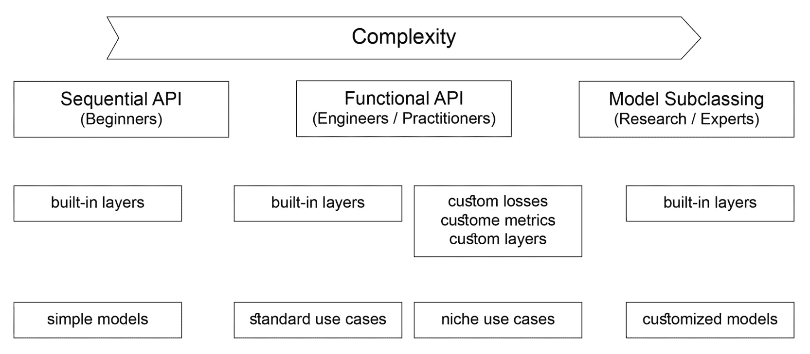

图 10.1：显示所有三种 API 比较的图示

在接下来的部分中，您将学习如何定义自定义损失函数。

# 实现自定义损失函数

机器学习中有几种常用的损失函数。在*第五章*，*分类*中，您学习了不同类型的损失函数，并在不同的分类模型中使用它们。TensorFlow 提供了许多内置的损失函数可供选择。以下是一些更常见的损失函数：

+   平均绝对误差（MAE）

+   均方误差（MSE）

+   二进制交叉熵

+   分类交叉熵

+   Hinge

+   Huber

+   均方对数误差（MSLE）

提醒一下，你可以将损失函数视为一种指南针，它可以帮助你清晰地了解算法中哪些部分是有效的，哪些部分是无效的。损失值越高，模型的准确度越低，反之亦然。

虽然 TensorFlow 提供了多种现成的损失函数，但在某些情况下，你很可能需要为特定需求创建自己的损失函数。例如，如果你正在构建一个预测股票价格的模型，你可能需要定义一个损失函数，以显著惩罚那些大幅错误的预测值。

接下来的部分将向你展示如何构建自定义损失函数。

## 使用函数式 API 构建自定义损失函数

你在前几章中看到过如何使用 TensorFlow 提供的预定义损失函数。但如果你想构建自己的自定义函数，可以使用函数式 API 或者模型子类化方法。假设你想创建一个损失函数，它将预测值与实际值之间的差异的四次方作为误差：


图 10.2：自定义损失函数的公式

在创建自定义损失函数时，你总是需要两个参数：`y_true`（实际值）和`y_pred`（预测值）。损失函数会计算这两个值之间的差异，并返回一个误差值，表示模型的预测值与实际值之间的距离。在 MAE 的情况下，损失函数将返回这个误差的绝对值。另一方面，MSE 会将实际值和预测值之间的差值平方。但在前面的例子中，误差应该被提升到 `4` 次方。

让我们看看如何使用函数式 API 来实现这一点。首先，你需要通过以下命令导入 TensorFlow 库：

```py
import tensorflow as tf
```

然后，你需要创建一个名为`custom_loss`的函数，该函数接收`y_true`和`y_pred`作为输入参数。接下来，你将使用`pow`函数将计算得到的误差的四次方。最后，你将返回计算得到的误差：

```py
def custom_loss(y_true, y_pred):
    custom_loss=tf.math.pow(y_true - y_pred, 4)
    return custom_loss
```

你已经使用函数式 API 创建了自己的自定义损失函数。现在，你可以在训练模型之前，将它传递给`compile`方法，而不是使用预定义的损失函数：

```py
model.compile(loss=custom_loss,optimizer=optimizer)
```

完成这些步骤后，你可以像在前几章中那样训练你的模型。TensorFlow 会使用你自定义的损失函数来优化模型的学习过程。

## 使用子类化 API 构建自定义损失函数

还有另一种定义自定义损失函数的方法：使用子类化 API。在这种情况下，你将定义一个自定义类，而不是创建一个函数。如果你希望添加更多自定义属性或方法，这种方法非常有用。通过子类化，你可以创建一个自定义类，该类将继承`keras.losses`模块中的`Loss`类的属性和方法。然后，你需要定义`__init__()`和`call()`方法，这是`Loss`类要求的方法。`__init__`方法是定义自定义类所有属性的地方，而`call()`方法则是你定义计算损失逻辑的地方。

以下是如何使用子类化 API 实现自定义损失函数的简要示例，其中误差应提升到`4`的幂：

```py
class MyCustomLoss(keras.losses.Loss):
    def __init__(self, threshold=1.0, **kwargs):
        super().__init__(**kwargs)
    def call(self, y_true, y_pred):
        return tf.math.pow(y_true - y_pred, 4)
```

在前面的示例中，你重新实现了之前相同的损失函数（4 的幂），但使用了从`keras.losses.Loss`进行子类化的方法。你首先通过`__init__()`方法初始化了类的属性，并使用`self`参数，这指向类的实例。

然后，在`call()`方法中，你定义了损失函数的逻辑，它计算了误差并将其提升到 4 的幂。

现在你已经掌握了损失函数的基础知识，接下来是时候在下一个练习中自己动手构建一个损失函数了。

## 练习 10.01：构建自定义损失函数

在这个练习中，你将创建一个自定义损失函数，用于训练一个卷积神经网络（CNN）模型，以区分苹果和西红柿的图片。

你将在本次练习中使用`Apple-or-Tomato`数据集。该数据集是 GitHub 上的`Fruits 360`数据集的一个子集。`Fruits 360`数据集包含 1,948 张总色彩图像，图像尺寸为 100x100 像素。`Apple-or-Tomato`数据集包含 992 张苹果图像，其中 662 张在训练集中，330 张在测试集中。番茄图像总数为 956 张，其中 638 张在训练集中，318 张在测试集中。

**注意**

你可以在以下链接获取`Apple-or-Tomato`数据集：[`packt.link/28kZY`](https://packt.link/28kZY)。

你可以在这里找到`Fruits 360`数据集：[`github.com/Horea94/Fruit-Images-Dataset/archive/master.zip`](https://github.com/Horea94/Fruit-Images-Dataset/archive/master.zip)。

首先，打开一个新的 Colab 或 Jupyter Notebook。如果你使用的是 Google Colab，你需要先将数据集下载到 Google Drive 中：

1.  打开一个新的 Jupyter Notebook 或 Google Colab 笔记本。

1.  如果你使用的是 Google Colab，请使用以下代码将数据集本地上传。否则，请跳到*步骤 4*。点击`Choose Files`选择 CSV 文件并点击`Open`。保存文件为`uploaded`。然后，进入你保存数据集的文件夹：

    ```py
    from google.colab import files
    uploaded = files.upload()
    ```

1.  在当前文件夹中解压数据集：

    ```py
    !unzip \*.zip
    ```

1.  创建一个变量`directory`，它包含数据集的路径：

    ```py
    directory = "/content/gdrive/My Drive/Datasets/apple-or-tomato/"
    ```

1.  导入`pathlib`库：

    ```py
    import pathlib
    ```

1.  创建一个变量`path`，该变量使用`pathlib.Path`包含数据集的完整路径：

    ```py
    path = pathlib.Path(directory)
    ```

1.  创建两个变量，`train_dir`和`validation_dir`，并分别赋予训练和验证文件夹的完整路径：

    ```py
    train_dir = path / 'training_set'
    validation_dir = path / 'test_set'
    ```

1.  创建四个变量，分别为`train_apple_dir`、`train_tomato_dir`、`validation_apple_dir`和`validation_tomato_dir`，它们将分别获取训练和验证集中的`apple`和`tomato`文件夹的完整路径：

    ```py
    train_apple_dir = train_dir / 'apple'
    train_tomato_dir = train_dir /'tomato'
    validation_apple_dir = validation_dir / 'apple'
    validation_tomato_dir = validation_dir / 'tomato'
    ```

1.  导入`os`包：

    ```py
    import os
    ```

1.  创建两个变量，分别为`total_train`和`total_val`，它们将获取训练集和验证集中的图像数量：

    ```py
    total_train = len(os.listdir(train_apple_dir)) + \
                  len(os.listdir(train_tomato_dir))
    total_val = len(os.listdir(validation_apple_dir)) + \
                len(os.listdir(validation_tomato_dir))
    ```

1.  从`tensorflow.keras.preprocessing`模块导入`ImageDataGenerator`：

    ```py
    from tensorflow.keras.preprocessing.image import ImageDataGenerator
    ```

1.  实例化两个`ImageDataGenerator`类，分别为`train_image_generator`和`validation_image_generator`，它们将通过除以 255 来重新缩放图像：

    ```py
    train_image_generator = ImageDataGenerator(rescale=1./255)
    validation_image_generator = ImageDataGenerator(rescale=1./255)
    ```

1.  创建三个变量，分别为`batch_size`、`img_height`和`img_width`，并将它们的值设置为`32`、`224`和`224`：

    ```py
    batch_size = 32
    img_height = 224
    img_width = 224
    ```

1.  使用`flow_from_directory()`创建一个名为`train_data_gen`的数据生成器，并指定批量大小、训练文件夹的路径、`shuffle`参数的值、目标的大小和类模式：

    ```py
    train_data_gen = train_image_generator.flow_from_directory\
                     (batch_size=batch_size, directory=train_dir, \
                      shuffle=True, \
                      target_size=(img_height, img_width), \
                      class_mode='binary')
    ```

1.  使用`flow_from_directory()`创建一个名为`val_data_gen`的数据生成器，并指定批量大小、验证文件夹的路径、目标大小和类模式：

    ```py
    val_data_gen = validation_image_generator.flow_from_directory\
                   (batch_size=batch_size, directory=validation_dir, \
                    target_size=(img_height, img_width), \
                    class_mode='binary')
    ```

1.  导入`matplotlib`并创建一个`for`循环，该循环将遍历`train_data_gen`中的五张图像并绘制它们：

    ```py
    import matplotlib.pyplot as plt
    for _ in range(5):
        img, label = train_data_gen.next()
        plt.imshow(img[0])
        plt.show()
    ```

    你应该得到以下输出：

    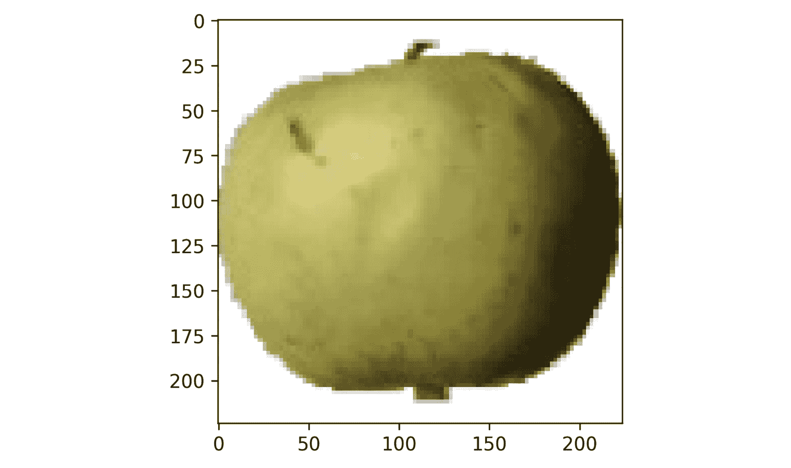

    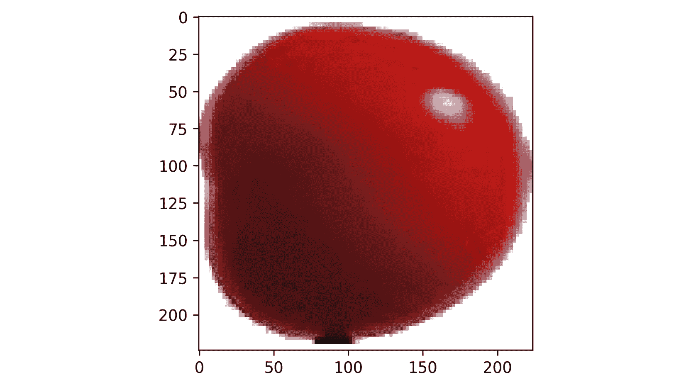

    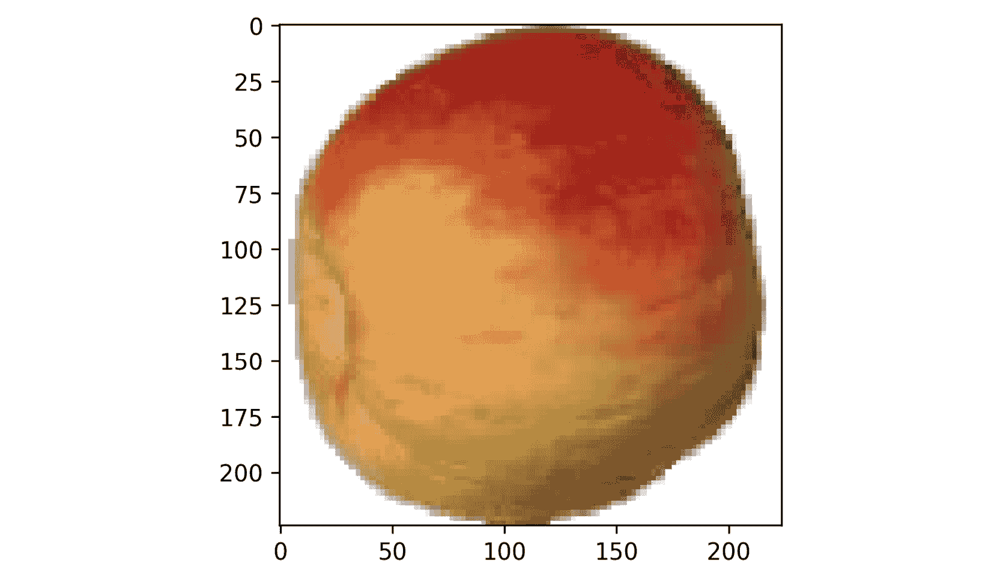

    图 10.3：数据集中的图像样本

    上述结果展示了该数据集中一些包含的图像示例。

1.  导入 TensorFlow 库：

    ```py
    import tensorflow as tf
    ```

1.  创建自定义损失函数，该函数将计算误差的平方：

    ```py
    def custom_loss_function(y_true, y_pred):
        print("y_pred ",y_pred)
        print("y_true ", y_true)
        squared_difference = tf.square(float(y_true)-float(y_pred))
        return tf.reduce_mean(squared_difference, axis=-1)
    ```

1.  从`tensorflow.keras.applications`模块导入`NASNetMobile`模型：

    ```py
    from tensorflow.keras.applications import NASNetMobile
    ```

1.  使用 ImageNet 权重实例化此模型，移除顶部层，并指定正确的输入维度：

    ```py
    base_model = NASNetMobile(include_top=False,\
                              input_shape=(100, 100, 3), \
                              weights='imagenet')
    ```

1.  冻结此模型的所有层，以确保不会更新`NASNetMobile`的模型权重：

    ```py
    base_model.trainable = False
    ```

1.  从`tensorflow.keras.layers`模块导入`Flatten`和`Dense`层：

    ```py
    from tensorflow.keras.layers import Flatten, Dense
    ```

1.  创建一个新模型，将`NASNetMobile`模型与两个新的顶部层（分别有 500 个和 1 个单元）以及 ReLu 和 sigmoid 作为激活函数进行组合：

    ```py
    model = tf.keras.Sequential([
        base_model,
        layers.Flatten(),
        layers.Dense(500, activation='relu'),
        layers.Dense(1, activation='sigmoid')
    ])
    ```

1.  打印你的模型摘要：

    ```py
    model.summary()
    ```

    你将得到以下输出：

    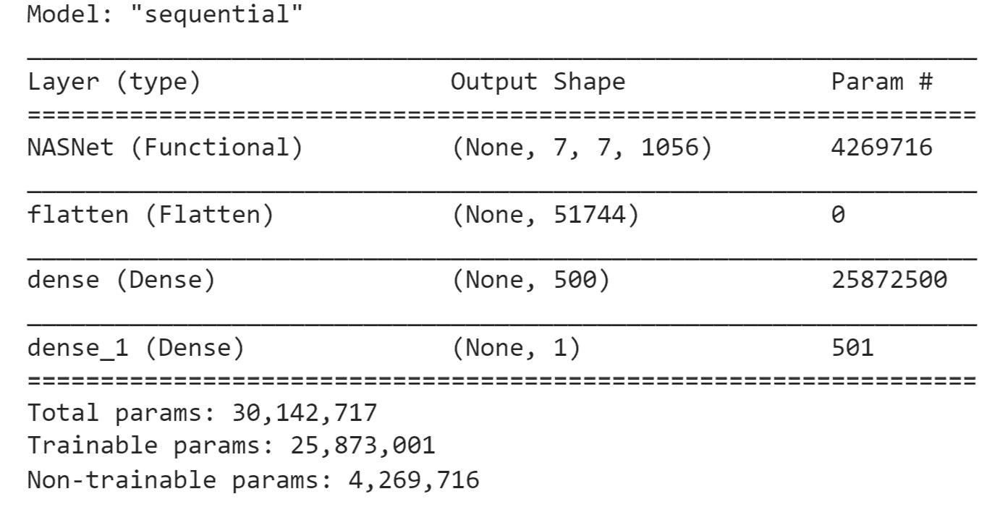

    图 10.4：模型总结

    在这里，你可以看到左侧的层。你会看到`Output Shape`—例如，`(None, 224, 224, 3)`。接下来，`Param #`下方显示了参数的数量。在底部，你将找到摘要，包括可训练和不可训练的参数。

1.  通过提供自定义损失函数、Adam 优化器和精度度量，来编译此模型并显示结果：

    ```py
    model.compile(
            optimizer='adam',
            loss=custom_loss_function,
            metrics=['accuracy'])
    ```

1.  拟合模型并提供训练和验证数据生成器、每个 epoch 的步数以及验证步骤的数量：

    ```py
    history = model.fit(
        Train_data_gen,
        steps_per_epoch=total_train // batch_size,
        epochs=5,
        validation_data=val_data_gen,
        validation_steps=total_val // batch_size)
    ```

    你应该得到以下输出：

    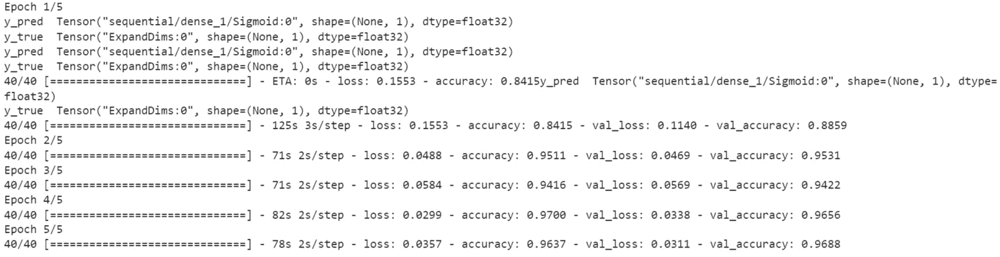

图 10.5：训练进度截图

上面的截图显示了 TensorFlow 在训练模型期间显示的信息。你可以看到每个 epoch 在训练集和验证集上达到的准确度。在第五个 epoch 时，模型在训练集和验证集上的准确度均为`96%`。

在这个练习中，你已经成功地构建了自己的损失函数，并用它训练了一个二分类器，识别苹果或番茄的图像。在接下来的章节中，你将更进一步，构建你自己的自定义层。

# 实现自定义层

之前，你已经学习了如何使用 TensorFlow 的功能性 API 或子类化方法实现自定义损失函数。这些概念也可以应用于为深度学习模型创建自定义层。在本节中，你将从零开始构建一个 ResNet 模块。

## ResNet 块简介

**残差神经网络**，或称**ResNet**，最早由*何恺明*在 2015 年的论文《深度残差学习用于图像识别》中提出。他引入了一个新的概念——残差块，用以解决梯度消失问题，这一问题限制了训练非常深的网络（具有大量层）的能力。

一个残差块由多个层组成。但不同于将每一层堆叠并顺序执行的单一路径，残差块包含两条不同的路径。第一条路径有两个不同的卷积层。第二条路径，称为**跳跃连接**，将输入传递给第一条路径的最后一层。因此，残差块的输入将经过第一条路径的卷积层序列，结果将与来自第二条路径（跳跃连接）的原始输入结合，如*图 10.6*所示。简言之，这条额外的路径允许架构在更深层次上传递梯度，而不会影响整体性能。

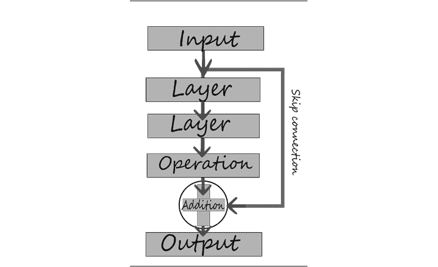

图 10.6：跳跃连接

如你所见，如果你想为前面的残差块构建一个架构，使用 TensorFlow 的顺序 API 会相当困难。这里，你需要构建一个非常定制化的层。这就是为什么你需要使用功能性 API 或模型子类化的方法。

## 使用功能性 API 构建自定义层

在本节中，你将学习如何使用 TensorFlow 的功能性 API 来构建自定义层。

首先，你将构建一个函数，该函数将输入作为张量并对其添加 ReLU 激活和批量归一化。例如，在下面的代码片段中，`relu_batchnorm_layer` 函数接收输入并返回一个张量。这将创建一个包含 ReLU 激活和批量归一化的复合层：

```py
def relu_batchnorm_layer(input):
    return BatchNormalization()(ReLU()(input))
```

现在，创建一个函数来实现你的残差块。你需要接收一个张量作为输入，并将其传递给两个 Conv2D 层。然后，你将第二个 Conv2D 层的输出与原始输入相加，这代表了跳跃连接。该加法的输出将传递给你在前面代码片段中定义的 `relu_batchnorm_layer()` 函数。最后，输出将传递给另一个 Conv2D 层：

```py
def simple_residual_block(input, filters: int, kernel_size: int = 3):
    int_output = Conv2D(filters=filters, kernel_size=kernel_size, 
                        padding="same")(input)
    int_output = Conv2D(filters=filters, kernel_size=1, strides=2,
                        padding="same")(int_output)
    output = Add()([int_output,input]) 
    output = relu_batchnorm_layer(output)
    return output
```

现在，你可以在模型中使用这个自定义层。在以下代码片段中，你将定义一个简单的模型，其中包含一个 Conv2D 层，后跟一个残差块：

```py
inputs = Input(shape=(100, 100, 3))
num_filters = 32

t = BatchNormalization()(inputs)
t = Conv2D(kernel_size=3,
           strides=1,
           filters=32,
           padding="same")(t)
t = relu_batchnorm_layer(t)
t = residual_block(t, filters=num_filters)

t = AveragePooling2D(4)(t)
t = Flatten()(t)
outputs = Dense(1, activation='sigmoid')(t)

model = Model(inputs, outputs)
```

接下来，我们将在下面的章节中使用子类化来构建自定义层。

## 使用子类化构建自定义层

之前，你已经学习了如何使用函数式 API 创建简化版的残差块。现在，你将看到如何使用模型子类化来创建自定义层。

首先，你需要导入 `Model` 类和一些层：

```py
from tensorflow.keras.models import Model 
from tensorflow.keras.layers import Dense, Dropout, Softmax, concatenate
```

然后，你将使用模型子类化来创建一个包含两个全连接层的模型。首先，定义一个名为 `MyModel` 的模型子类。从这个类生成的对象将是具有两个全连接层的模型。

在 `init` 方法中定义两个全连接层。例如，第一个可以有 `64` 个单元并使用 ReLU 激活函数，而第二个可以有 `10` 个单元并且没有激活函数（在这种情况下，默认的激活函数是线性函数）。之后，在 `call` 方法中，通过调用之前定义的全连接层来设置前向传播。首先，你可以放置 `dense_1` 层来接收输入，接着是 `dense_2` 层，它返回层的输出：

```py
class MyModel(Model): 
  def __init__(self): 
    super(MyModel, self).__init__()
    self.dense_1 = Dense(64, activation='relu')
    self.dense_2 = Dense(10)

  def call(self, inputs):, 
    X = self.dense_1(inputs)
    return self.dense_2(X)
```

下一步是实例化模型。为此，只需在括号内调用类，不带参数。接下来，用随机输入调用模型以创建权重。对于输入，本例使用一个包含 `10` 个元素的一维向量，但你也可以使用不同的输入。然后，你可以打印模型的摘要，查看之前定义的全连接层。

考虑以下模型摘要：

```py
model = MyModel()
model(tf.random.uniform([1,10]))
model.summary()
```

生成的输出应如下所示：

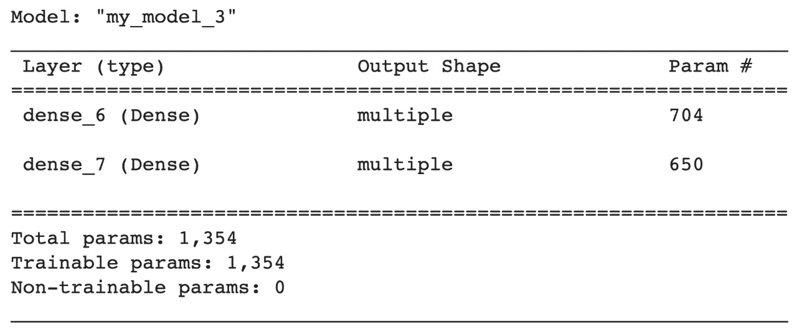

图 10.7：模型概述

现在，你可以通过添加一个名为 `training` 的关键字参数来修改 `call` 方法。如果你希望在训练和推理时有不同的行为，这将非常有用。例如，你可以创建一个只有在 `training` 为 `true` 时才会激活的 dropout 层。首先，你需要在 `init` 方法中定义一个 dropout 层，并设置学习率为 `0.4`。然后，在 `call` 方法中，写一个 `if` 语句，默认情况下 `training` 为 `true`。在其中，调用 dropout 层：

```py
class MyModel(Model):
  def __init__(self):
    super(MyModel, self).__init__()
    self.dense_1 = Dense(64, activation='relu')
    self.dense_2 = Dense(10)
    self.dropout = Dropout(0.4)  
  def call(self, inputs, training=True):
    X = self.dense_1(inputs)
    if training:                             
      X = self.dropout(X)                    
    return self.dense_2(X)
```

现在，考虑模型总结：

```py
model = MyModel()
model(tf.random.uniform([1,10]))
model.summary()
```

执行上述命令后，模型总结将如下所示：

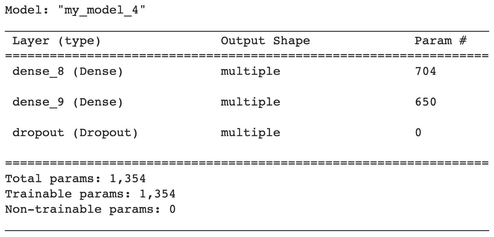

图 10.8：模型总结

在以下练习中，你将构建一个自定义层。

## 练习 10.02：构建自定义层

`Healthy-Pneumonia` 数据集是 `National Institute for Health NIH` 数据集的一个子集。该数据集包含 9,930 张总共 100x100 像素的彩色图像。`pneumonia-or-healthy` 数据集包含 1,965 张健康图像，其中训练集有 1,375 张图像，测试集有 590 张图像。

你将创建一个自定义的 ResNet 块，包含一个 Conv2D 层、一个批归一化层和一个 ReLU 激活函数。你将对图像进行二分类，以区分健康图像和肺炎图像。

注意

你可以在这里获取 `pneumonia-or-healthy` 数据集：[`packt.link/IOpUX`](https://packt.link/IOpUX)。

要开始，打开一个新的 Colab 或 Jupyter Notebook。如果你使用的是 Google Colab，你需要先将数据集下载到你的 Google Drive 中：

1.  打开一个新的 Jupyter notebook 或 Google Colab。

1.  如果你使用的是 Google Colab，可以使用以下代码在本地上传数据集。否则，请转到 *第 4 步*。点击 `Choose Files`，找到 CSV 文件并点击 `Open`。将文件保存为 `uploaded`，然后进入你保存数据集的文件夹：

    ```py
    from google.colab import files
    uploaded = files.upload()
    ```

1.  在当前文件夹中解压数据集：

    ```py
    !unzip \*.zip
    ```

1.  创建一个变量 `directory`，它包含数据集的路径：

    ```py
    directory = "/content/gdrive/My Drive/Datasets/pneumonia-or-healthy/"
    ```

1.  导入 `pathlib` 库：

    ```py
    import pathlib     
    ```

1.  创建一个变量 `path`，它使用 `pathlib.Path` 包含数据的完整路径：

    ```py
    path = pathlib.Path(directory)
    ```

1.  创建两个变量，分别为 `train_dir` 和 `validation_dir`，它们分别存储训练集和验证集文件夹的完整路径：

    ```py
    train_dir = path / 'training_set'
    validation_dir = path / 'test_set'
    ```

1.  创建四个变量，分别为 `train_healthy_dir`、`train_pneumonia_dir`、`validation_healthy_dir` 和 `validation_pneumonia_dir`，它们分别存储训练集和验证集的健康和肺炎文件夹的完整路径：

    ```py
    train_healthy_dir = train_dir / 'healthy'
    train_pneumonia_dir = train_dir /'pneumonia'
    validation_healthy_dir = validation_dir / 'healthy'
    validation_pneumonia_dir = validation_dir / 'pneumonia'
    ```

1.  导入 `os` 包：

    ```py
    import os     
    ```

1.  创建两个变量，分别为 `total_train` 和 `total_val`，用来获取训练集和验证集中的图像数量：

    ```py
    total_train = len(os.listdir(train_healthy_dir)) + \
                  len(os.listdir(train_pneumonia_dir))
    total_val = len(os.listdir(validation_healthy_dir)) + \
                len(os.listdir(validation_pneumonia_dir))
    ```

1.  从 `tensorflow.keras.preprocessing` 导入 `ImageDataGenerator`：

    ```py
    from tensorflow.keras.preprocessing.image import ImageDataGenerator
    ```

1.  实例化两个 `ImageDataGenerator` 类，并分别命名为 `train_image_generator` 和 `validation_image_generator`，它们将通过除以 255 来重新缩放图像：

    ```py
    train_image_generator = ImageDataGenerator(rescale=1./255)
    validation_image_generator = ImageDataGenerator(rescale=1./255)
    ```

1.  创建三个变量，分别命名为`batch_size`、`img_height`和`img_width`，其值分别为`32`、`100`和`100`：

    ```py
    batch_size = 32
    img_height = 100
    img_width = 100     
    ```

1.  使用`flow_from_directory()`创建一个名为`train_data_gen`的数据生成器，并指定批量大小、训练文件夹的路径、`shuffle`参数的值、目标大小和类别模式：

    ```py
    train_data_gen = train_image_generator.flow_from_directory\
                     (batch_size=batch_size, directory=train_dir, \
                      shuffle=True, \
                      target_size=(img_height, img_width), \
                      class_mode='binary')
    ```

1.  使用`flow_from_directory()`创建一个名为`val_data_gen`的数据生成器，并指定批量大小、验证文件夹的路径、目标大小和类别模式：

    ```py
    val_data_gen = validation_image_generator.flow_from_directory\
                   (batch_size=batch_size, directory=validation_dir, \
                    target_size=(img_height, img_width), \
                    class_mode='binary')
    ```

1.  导入`matplotlib`并创建一个`for`循环，该循环将遍历`train_data_gen`中的五张图像并绘制它们：

    ```py
    import matplotlib.pyplot as plt
    for _ in range(5):
        img, label = train_data_gen.next()
        plt.imshow(img[0])
        plt.show()
    ```

    你应该看到以下输出：

    

    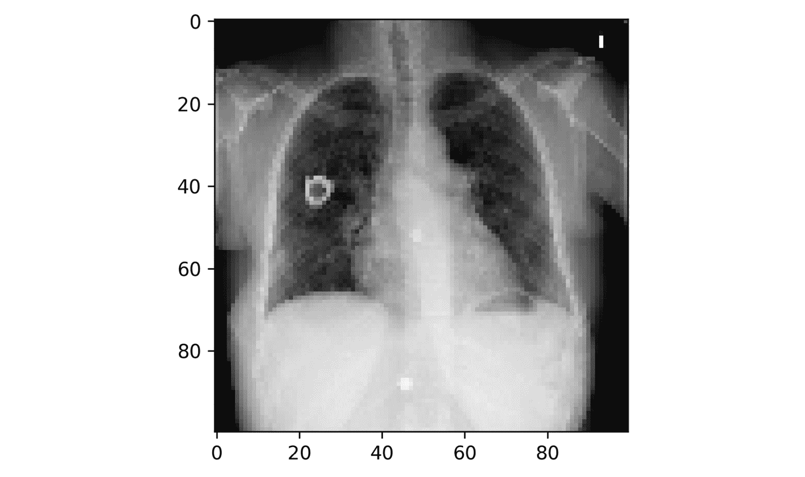

    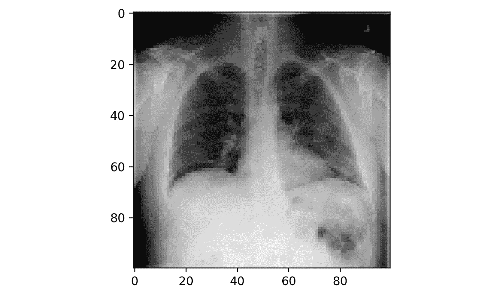

    图 10.9：数据集中样本图像

    上述结果展示了该数据集中包含的部分图像示例。

1.  导入 TensorFlow 库：

    ```py
    import tensorflow as tf
    ```

1.  导入`Input`、`Conv2D`、`ReLU`、`BatchNormalization`、`Add`、`AveragePooling2D`、`Flatten`和`Dense`：

    ```py
    from tensorflow.keras.layers import Input, Conv2D, ReLU, \
                                        BatchNormalization, Add, \
                                        AveragePooling2D, Flatten, Dense
    ```

1.  构建一个函数，该函数将输入作为张量并向其添加 ReLU 和批量归一化：

    ```py
    def relu_batchnorm_layer(input):
        return BatchNormalization()(ReLU()(input))
    ```

1.  创建一个函数来构建残差块。你需要将一个张量（`input`）作为输入，并将其传递给两个步幅为`2`的 Conv2D 层。接下来，将输入添加到输出中，然后进行 ReLU 和批量归一化，返回一个张量。再添加一个`kernel_size=1`的 Conv2D 层。将其结果添加到前一个 Conv2D 层的输出中。最后，应用`relu_batchnorm_layer()`并返回其值。你将对所有 Conv2D 层应用完全相同的滤波器（数量和维度由构造函数的两个输入参数定义）：

    ```py
    def residual_block(input, filters: int, kernel_size: int = 3):
        int_output = Conv2D(filters=filters, kernel_size=kernel_size, 
                            strides=(2), 
                            padding="same")(input)
        int_output = relu_batchnorm_layer(int_output)
        int_output = Conv2D(filters=filters, kernel_size=kernel_size, 
                            padding="same")(int_output)
        int_output2 = Conv2D(filters=filters, kernel_size=1, strides=2,
                            padding="same")(input)
        output = Add()([int_output2, int_output]) 
        output = relu_batchnorm_layer(output)
        return output
    ```

1.  导入`Model`模块：

    ```py
    from tensorflow.keras.models import Model
    ```

1.  使用`keras.layers.Input()`定义模型的输入层。这里，输入的形状为 100 像素×100 像素，并且有三种颜色（RGB）：

    ```py
    inputs = Input(shape=(100, 100, 3))
    ```

1.  对输入应用批量归一化，接着应用一个`32`个滤波器、大小为`3*3`、步幅为`1`、填充为`same`的 Conv2D 层。最后，对其输出应用`relu_batchnorm_layer()`函数：

    ```py
    t = BatchNormalization()(inputs)
    t = Conv2D(kernel_size=3,
               strides=1,
               filters=32,
               padding="same")(t)
    t = relu_batchnorm_layer(t)
    ```

1.  将前一层的输出传递给`residual_block()`函数，使用`32`个滤波器。然后，传递其输出到一个具有四个单元的平均池化层，接着将其结果展平，并将其传递给一个包含`1`个单元的全连接层，激活函数为 sigmoid：

    ```py
    t = residual_block(t, filters=32)

    t = AveragePooling2D(4)(t)
    t = Flatten()(t)
    outputs = Dense(1, activation='sigmoid')(t)
    ```

1.  实例化一个`Model()`类，使用原始输入和全连接层的输出：

    ```py
    model = Model(inputs, outputs)
    ```

1.  获取模型的摘要：

    ```py
    model.summary()
    ```

    你将看到一个摘要，包含可训练和不可训练的参数，如下所示：

    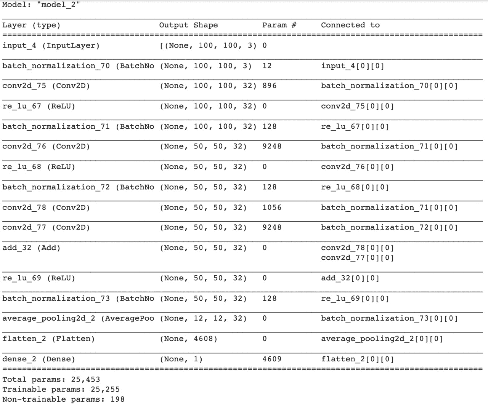

    图 10.10：模型摘要

1.  编译模型，提供二元交叉熵作为损失函数，Adam 作为优化器，并将准确度作为显示的度量：

    ```py
    model.compile(
            optimizer='adam',
            loss=binary_crossentropy,
            metrics=['accuracy'])
    ```

1.  训练模型并提供训练和验证数据生成器、训练周期数、每周期的步骤数和验证步骤：

    ```py
    history = model.fit(
        Train_data_gen,
        steps_per_epoch=total_train // batch_size,
        epochs=5,
        validation_data=val_data_gen,
        validation_steps=total_val // batch_size
    )
    ```

    你应该获得如下输出：

    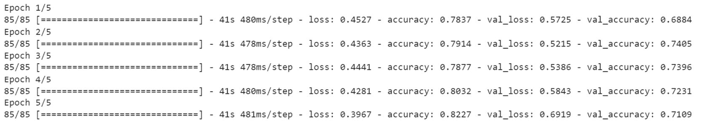

图 10.11：训练进度截图

上面的截图展示了 TensorFlow 在训练模型过程中显示的信息。你可以看到每个 epoch 在训练集和验证集上达成的准确度。

在本次练习中，你为网络创建了自己的自定义层。现在，让我们通过以下活动来测试你迄今为止学到的知识。

## 活动 10.01：构建带有自定义层和自定义损失函数的模型

`table-or-glass` 数据集是从 `Open Images V6` 数据集中提取的一部分图像。`Open Images V6` 数据集包含约 900 万张图像。`table-or-glass` 数据集由 7,484 张总颜色图像组成，每张图像的尺寸为 100×100 像素。`table-or-glass` 数据集包含 3,741 张玻璃图像，其中 2,618 张在训练集，1,123 张在测试集中。总共有 3,743 张桌面图像，其中 2,618 张在训练集，1,125 张在测试集中。你需要训练一个更复杂的模型，能够使用自定义的 ResNet 块和自定义损失函数区分玻璃和桌面图像。

注意

你可以在这里找到数据集：[`packt.link/bE5F6`](https://packt.link/bE5F6)。

以下步骤将帮助你完成本次活动：

1.  导入数据集并将文件解压到本地文件夹。

1.  为训练集和测试集创建图像列表。

1.  分析目标变量的分布。

1.  对图像进行预处理（标准化和重塑）。

1.  创建一个自定义损失函数，用于计算平均平方误差。

1.  创建一个自定义的残差块构造函数。

1.  训练你的模型。

1.  打印准确度和损失的学习曲线。

    注意

    本次活动的解决方案可以通过此链接找到。

# 总结

本章展示了如何构建和利用自定义的 TensorFlow 组件。你学会了如何设计和实现自定义损失函数、层和残差块。使用 TensorFlow 的功能性 API 或模型子类化，使你能够构建更复杂的深度学习模型，这些模型可能更适合你的项目。

在下一章，也是最后一章中，你将探索并构建生成模型，这些模型能够学习数据中的模式和关系，并利用这些关系生成新的、独特的数据。
