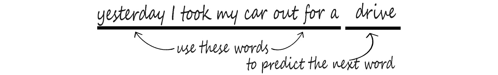
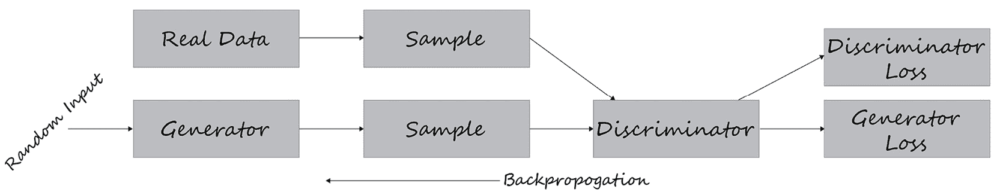
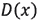
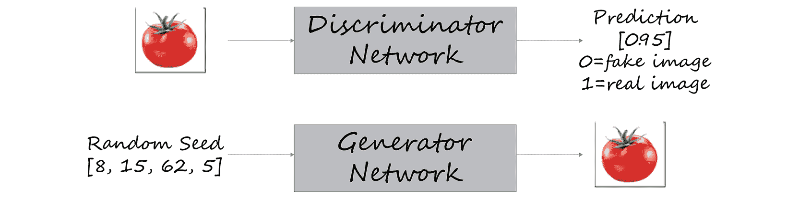

# 第十一章：11\. 生成模型

概述

本章将向你介绍生成模型——它们的组成部分、如何运作以及它们能做什么。你将从生成**长短期记忆**（**LSTM**）网络开始，学习如何使用它们生成新的文本。然后你将学习**生成对抗网络**（**GANs**）以及如何创建新数据，接着是**深度卷积生成对抗网络**（**DCGANs**）以及如何创建你自己的图像。

到本章结束时，你将知道如何有效地使用不同类型的 GANs 并生成各种类型的新数据。

# 介绍

在本章中，你将探索生成模型，它们是无监督学习算法的一种类型，可以生成全新的人工数据。生成模型与预测模型的不同之处在于，它们的目标是从与训练数据相同的分布中生成新的样本。尽管这些模型的目的可能与其他章节中介绍的模型非常不同，但你可以并且将会使用前面章节中学到的许多概念，包括加载和预处理各种数据文件、调整超参数以及构建卷积神经网络和**递归神经网络**（**RNNs**）。在本章中，你将学习如何使用 LSTM 模型基于初始种子数据生成新的数据样本，并完成数据序列的生成。

你还将学习另一种方法，即两个神经网络以对抗的方式进行竞争的概念，也就是生成器生成样本，判别器试图区分生成样本和真实样本。随着两个模型的同时训练，生成器会生成更加真实的样本，而判别器随着时间的推移能够更准确地区分“真实”数据和“假”数据。这些协同工作的网络被称为 GANs。生成模型可用于生成新的文本数据、音频样本和图像。

在本章中，你将主要集中在生成模型的三个领域——文本生成或语言建模、GANs 和 DCGANs。

# 文本生成

在*第九章*，*递归神经网络*中，你已经接触过**自然语言处理**（**NLP**）和文本生成（也称为语言建模），并解决了一些序列数据问题。在本节中，你将扩展你的序列模型，使用相同的数据集生成扩展的标题来进行文本生成。

在本书之前的内容中，你看到过序列数据，其中数据集中的每个点都依赖于前一个点，且数据的顺序很重要。回想一下*第九章*《循环神经网络》中的袋子词汇示例。在*袋子词汇*方法中，你只是使用一组词频来推导它们的含义。正如你在*图 11.1*中看到的，这两句话的语义完全相反，但在袋子词汇格式中是相同的。虽然这种方法对于某些问题可能有效，但它并不是预测下一个词或词语的理想方法。


图 11.1：具有不同语义的相同单词的示例

考虑以下语言模型的例子。给定一个句子或短语，`yesterday I took my car out for a`，然后要求预测下一个词是什么。在这里，完成该序列的适当单词是`drive`。



图 11.2：句子示例

要成功地处理序列数据，你需要一个能够存储序列值的神经网络。为此，你可以使用 RNN 和 LSTM。用于生成新序列（例如文本生成或语言建模）的 LSTM 被称为生成 LSTM。

让我们简单回顾一下 RNN 和 LSTM。

本质上，RNN 会自我回环，存储信息并重复这个过程，形成一个连续的循环。信息首先被转化为向量，以便机器进行处理。然后，RNN 按顺序逐一处理这些向量。每当 RNN 处理一个向量时，这个向量会通过前一个隐藏状态传递。通过这种方式，隐藏状态保留了来自前一步的信息，充当了一种记忆。它通过将输入和前一个隐藏状态结合，并使用 tanh 函数将值压缩到 `-1` 和 `1` 之间来实现这一点。

本质上，这就是 RNN 的工作原理。RNN 不需要大量的计算，并且在处理短序列时效果很好。简单来说，RNN 是一种具有回环的网络，可以使信息在时间中持续存在。


图 11.3：RNN 数据流

RNN 确实存在一些挑战——最显著的就是梯度爆炸和梯度消失问题。

**梯度爆炸问题**指的是当梯度变得过大以至于无法进行优化时发生的情况。相反的情况可能是梯度过小，这就是所谓的**梯度消失问题**。当你进行多次乘法运算时，梯度变得越来越小。这发生时，梯度的大小决定了权重更新的大小，梯度爆炸或消失意味着网络无法再进行训练。当训练 RNN 时，这个问题特别严重，因为网络的输出会反馈到输入中。梯度爆炸和消失的问题已经在*第九章*，*循环神经网络*中讨论过，关于如何解决这些问题的更多细节可以在那里找到。

LSTM 可以选择性地控制每个 LSTM 节点内信息的流动。通过增加控制，你可以更容易地调整模型，以防止梯度出现潜在问题。


图 11.4：LSTM 架构

那么，是什么让 LSTM 能够在多个时间步长中跟踪和存储信息呢？你会从*第九章*，*循环神经网络*中回忆起，LSTM 的关键构建块是一个叫做*门控*的结构，它使 LSTM 能够选择性地向其单元状态添加或移除信息。

门控由边界函数组成，例如 sigmoid 或 tanh。例如，如果函数是 sigmoid，它会强制其输入保持在零和一之间。直观地理解，你可以将其视为捕获通过门控传递的信息应保留多少。这个值应在零和一之间，有效地*限制*信息的流动。

LSTM 通过四个简单的步骤处理信息。

它们首先忘记不相关的历史信息。其次，它们执行计算来存储新信息中相关的部分，第三，它们将这两步结合起来，选择性地更新它们的内部状态。最后，它们生成一个输出。


图 11.5：LSTM 处理步骤

这部分内容回顾了 LSTM 以及它们如何选择性地控制和调节信息流动。现在你已经复习了 LSTM 及其架构，可以通过回顾你的代码和 LSTM 模型，将这些概念付诸实践。

你可以通过以下方式使用顺序模型创建 LSTM 模型。该 LSTM 包含四个隐藏层，分别具有`50`、`60`、`80`和`120`个单元，并使用 ReLU 激活函数。`return_sequences`参数对于除最后一层之外的所有层都设置为`True`，因为它们不是网络中的最终 LSTM 层：

```py
regressor = Sequential()
regressor.add(LSTM(units= 50, activation = 'relu', \
                   return_sequences = True, \
                   input_shape = (X_train.shape[1], 5)))
regressor.add(Dropout(0.2))
regressor.add(LSTM(units= 60, activation = 'relu', \
                   return_sequences = True))
regressor.add(Dropout(0.3))
regressor.add(LSTM(units= 80, activation = 'relu', \
              return_sequences = True))
regressor.add(Dropout(0.4))
regressor.add(LSTM(units= 120, activation = 'relu'))
regressor.add(Dropout(0.5))
regressor.add(Dense(units = 1))
```

现在你已经回顾了如何创建带有 LSTM 层的 RNN，接下来你将学习如何将它们应用于自然语言文本，并在一个序列中生成新文本。

## 扩展 NLP 序列模型以生成文本

**NLP** 接收自然语言形式的数据，传统上这些数据对机器来说非常难以理解，然后将其转换为可以用于机器学习应用的数据。这些数据可以是字符、单词、句子或段落的形式。本节将专注于文本生成。

作为一个快速的回顾，*预处理* 通常包括训练模型所需的所有步骤。一些常见的步骤包括*数据清洗*、*转换*和*数据减少*。对于 NLP，更具体地说，步骤可能是以下全部或部分：

+   **数据集清理** 包括将大小写转换为小写，去除标点符号。

+   **标记化** 是将字符序列分解为指定单元的过程，称为*token*。

+   **填充** 是一种通过填充使不同大小的输入句子相同的方法。

+   **填充序列** 是确保序列具有统一长度的过程。

+   `rainy`和`raining`都有词干`rain`。

让我们更详细地看一下这个过程是什么样子的。

## 数据集清洗

在这里，你创建了一个名为`clean_text`的函数，它返回经过清洗后的单词列表。现在，使用`lower()`方法将所有文本保存为小写，用`utf8`编码进行字符标准化。最后，输出你的语料库中的 10 个标题：

```py
def clean_text(txt):
    txt = "".join(v for v in txt \
                  if v not in string.punctuation).lower()
    txt = txt.encode("utf8").decode("ascii",'ignore')
    return txt 
corpus = [clean_text(x) for x in all_headlines]
corpus[:10]
```

以这种方式清理文本是将文本标准化以输入模型的绝佳方法。在相同编码中将所有单词转换为小写确保文本的一致性。它还确保模型不会将同一单词的大小写或不同编码视为不同的单词。

## 生成序列和标记化

神经网络期望输入数据以一致的数值格式提供。就像处理图像分类模型的图像一样，其中每个图像表示为三维数组，并且通常调整大小以满足模型的期望一样，文本必须进行类似处理。幸运的是，Keras 具有许多实用的类和函数来帮助处理神经网络的文本数据。其中一个类是从 Keras 导入的`Tokenizer`：

```py
from keras.preprocessing.text import Tokenizer
```

## 生成 n-gram Tokens 的序列

在这里，你创建了一个名为`get_seq_of_tokens`的函数。使用`tokenizer.fit_on_texts`，你从语料库中提取 token。每个整数输出对应一个特定的单词。`input_seq`参数初始化为空列表，`[]`。使用`token_list =` `tokenizer.texts_to_sequences`，你将文本转换为 token 序列的等效形式。使用`n_gram_sequence = token_list`，你生成 n-gram 序列。通过`input_seq.append(n_gram_sequence)`，你将每个序列追加到特征列表中：

```py
tokenizer = Tokenizer()
def get_seq_of_tokens(corpus):
    tokenizer.fit_on_texts(corpus)
    all_words = len(tokenizer.word_index) + 1

    input_seq = []
    for line in corpus:
        token_list = tokenizer.texts_to_sequences([line])[0]
        for i in range(1, len(token_list)):
            n_gram_sequence = token_list[:i+1]
            input_seq.append(n_gram_sequence)
    return input_seq, all_words
your_sequences, all_words = get_seq_of_tokens(corpus)
your_sequences[:10]
```

`get_seq_of_tokens` 确保语料库被拆分成等长的序列。如果语料库对于网络期望的输入来说太短，结果序列将需要填充。

## 填充序列

在这里，你创建一个 `generate_padded_sequences` 函数，接受 `input_seq` 作为输入。`pad_sequences` 函数用于填充序列，使它们的长度相等。在函数中，首先通过计算每个输入序列的长度来确定最大序列长度。一旦确定了最大序列长度，所有其他序列将被填充以匹配。接下来，创建 `predictors` 和 `label` 参数。`label` 参数是序列中的最后一个单词，`predictors` 参数是所有前面的单词。最后，`label` 参数被转换为分类数组：

```py
def generate_padded_sequences(input_seq):
    max_sequence_len = max([len(x) for x in input_seq])
    input_seq = np.array(pad_sequences\
                         (input_seq, maxlen=max_sequence_len, \
                          padding='pre'))

    predictors, label = input_seq[:,:-1],input_seq[:,-1]
    label = keras.utils.to_categorical(label, num_classes=all_words)
    return predictors, label, max_sequence_len
predictors, label, max_sequence_len = generate_padded_sequences\
                                      (your_sequences)
```

现在你已经学习了处理自然语言的一些预处理和清理步骤，包括清理、生成 n-gram 序列以及填充序列以保持一致的长度，你已经准备好进行本章的第一个练习，即文本生成。

## 练习 11.01：生成文本

在这个练习中，你将使用来自*练习 9.02*，*构建一个带有 LSTM 层的 RNN 用于 Nvidia 股票预测*，的 LSTM 模型来扩展你的预测序列并生成新文本。在那个练习中，你创建了一个 LSTM 模型，通过将历史股价输入模型来预测 Nvidia 的股票价格。该模型能够使用 LSTM 层理解历史股价中的模式，以进行未来的预测。

在这个练习中，你将使用与文本相同的原理，通过将历史标题输入模型来进行预测。你将使用 `articles.csv` 数据集进行这个练习。数据集包含来自《纽约时报》的 831 个新闻标题，格式为 CSV。除了标题，数据集还包含关于新闻文章的多个属性，包括出版日期、打印页码和关键词。你需要使用给定的数据集生成新的新闻标题。

注意

你可以在这里找到 `articles.csv`：[`packt.link/RQVoB`](http://packt.link/RQVoB)。

执行以下步骤完成本次练习：

1.  打开一个新的 Jupyter 或 Colab 笔记本。

1.  导入以下库：

    ```py
    from keras.preprocessing.sequence import pad_sequences
    from keras.models import Sequential
    from keras.layers import Embedding, LSTM, Dense, Dropout
    import tensorflow.keras.utils as ku 
    from keras.preprocessing.text import Tokenizer
    import pandas as pd
    import numpy as np
    from keras.callbacks import EarlyStopping
    import string, os 
    import warnings
    warnings.filterwarnings("ignore")
    warnings.simplefilter(action='ignore', category=FutureWarning)
    ```

    你应该得到以下输出：

    ```py
    Using TensorFlow backend.
    ```

1.  通过将 `your_dir` 设置为 `content/`，本地加载数据集。创建一个空的 `your_headlines` 参数，并使用 `for` 循环遍历：

    ```py
    your_dir = 'content/'
    your_headlines = []
    for filename in os.listdir(your_dir):
        if 'Articles' in filename:
            article_df = pd.read_csv(your_dir + filename)
            your_headlines.extend(list(article_df.headline.values))
            break
    your_headlines = [h for h in your_headlines if h != "Unknown"]
    len(our_headlines)
    ```

    输出将表示数据集中标题的数量：

    ```py
    831
    ```

1.  现在，创建一个 `clean_text` 函数来返回清理后的单词列表。使用 `lower()` 方法将文本转换为小写，并使用 `utf8` 编码进行字符标准化。最后，从你的语料库中输出 20 个标题：

    ```py
    def clean_text(txt):
        txt = "".join(v for v in txt \
                      if v not in string.punctuation).lower()
        txt = txt.encode("utf8").decode("ascii",'ignore')
        return txt 
    corpus = [clean_text(x) for x in all_headlines]
    corpus[60:80]
    ```

    你应该得到以下输出：

    

    图 11.6：语料库

1.  使用`tokenizer.fit`从语料库中提取词元。每个整数输出对应一个特定的词。`input_seq`参数初始化为空列表`[]`。使用`token_list =` `tokenizer.texts_to_sequences`，将每个句子转换为其词元化的等效形式。使用`n_gram_sequence = token_list`，你可以生成 n-gram 序列。通过`input_seq.append(n_gram_sequence)`，将每个序列添加到特征列表中：

    ```py
    tokenizer = Tokenizer()
    def get_seq_of_tokens(corpus):
        tokenizer.fit_on_texts(corpus)
        all_words = len(tokenizer.word_index) + 1

        input_seq = []
        for line in corpus:
            token_list = tokenizer.texts_to_sequences([line])[0]
            for i in range(1, len(token_list)):
                n_gram_sequence = token_list[:i+1]
                input_seq.append(n_gram_sequence)
        return input_seq, all_words
    your_sequences, all_words = get_seq_of_tokens(corpus)
    your_sequences[:20]
    ```

    你应该得到以下输出：

    

    图 11.7：n-gram 词元

    输出显示了头条新闻的 n-gram 词元。对于每个头条新闻，n-gram 的数量由头条新闻的长度决定。

1.  填充序列并获取变量`predictors`和`target`：

    ```py
    def generate_padded_sequences(input_seq):
        max_sequence_len = max([len(x) for x in input_seq])
        input_seq = np.array(pad_sequences\
                             (input_seq, maxlen=max_sequence_len, \
                              padding='pre'))
        predictors, label = input_seq[:,:-1],input_seq[:,-1]
        label = ku.to_categorical(label, num_classes=all_words)
        return predictors, label, max_sequence_len
    predictors, label, \
    max_sequence_len = generate_padded_sequences(inp_seq)
    ```

1.  准备好你的模型进行训练。添加一个输入嵌入层，使用`model.add(Embedding)`，一个隐藏的 LSTM 层，使用`model.add(LSTM(100))`，并设置 10%的 dropout。然后，使用`model.add(Dense)`添加输出层，使用 softmax 激活函数。通过`compile()`方法配置模型进行训练，并将损失函数设置为`categorical_crossentropy`。使用 Adam 优化器：

    ```py
    def create_model(max_sequence_len, all_words):
        input_len = max_sequence_len - 1
        model = Sequential()

        model.add(Embedding(all_words, 10, input_length=input_len))

        model.add(LSTM(100))
        model.add(Dropout(0.1))

        model.add(Dense(all_words, activation='softmax'))
        model.compile(loss='categorical_crossentropy', \
                      optimizer='adam')

        return model
    model = create_model(max_sequence_len, all_words)
    model.summary()
    ```

    你应该得到以下输出：

    

    图 11.8：模型概览

1.  训练模型并将`epochs`设置为`200`，`verbose`设置为`5`：

    ```py
    model.fit(predictors, label, epochs=200, verbose=5)
    ```

    你应该得到以下输出：

    

    图 11.9：训练模型

1.  创建一个函数，该函数将在给定的种子文本、生成单词的数量、模型和最大序列长度的基础上生成一个头条新闻。该函数将包括一个`for`循环来迭代生成单词的次数。在每次迭代中，tokenizer 将对文本进行分词，然后对序列进行填充，并预测序列中的下一个单词。接着，迭代会将 token 转换回单词并将其添加到句子中。一旦`for`循环完成，生成的头条新闻将被返回：

    ```py
    def generate_text(seed_text, next_words, model, max_sequence_len):
        for _ in range(next_words):
            token_list = tokenizer.texts_to_sequences([seed_text])[0]
            token_list = pad_sequences([token_list], \
                                        maxlen = max_sequence_len-1, \
                                        padding='pre')
            predicted = model.predict\
                        (token_list, verbose=0)
            output_word = ""
            for word,index in tokenizer.word_index.items():
                if index == predicted.any():
                    output_word = word
                    break
            seed_text += " "+output_word
        return seed_text.title()
    ```

1.  最后，通过`print`函数输出一些生成的文本，打印你在*步骤 9*中创建的函数的输出。使用种子词`10 ways`、`europe looks to`、`best way`、`homeless in`、`unexpected results`和`critics warn`，以及对应生成的单词数，即`11`、`8`、`10`、`10`、`10`和`10`，来生成文本：

    ```py
    print (generate_text("10 ways", 11, model, max_sequence_len))
    print (generate_text("europe looks to", 8, model, \
                         max_sequence_len))
    print (generate_text("best way", 10, model, max_sequence_len))
    print (generate_text("homeless in", 10, model, max_sequence_len))
    print (generate_text("unexpected results", 10, model,\
                         max_sequence_len))
    print (generate_text("critics warn", 10, model, \
                         max_sequence_len))
    ```

    你应该得到以下输出：

    

图 11.10：生成的文本

输出显示了使用提供的种子文本生成的头条新闻。生成的词汇受限于训练数据集中包含的内容，而该数据集本身相对较小，导致了一些无意义的结果。

现在你已经在第一个练习中使用 LSTM 生成了文本，接下来我们将通过使用 GAN 生成基于给定数据集的新图像来处理图像。

# 生成对抗网络

GAN（生成对抗网络）是通过学习训练数据集中的模式和潜在表示来生成新的、合成数据的网络。GAN 通过使用两个彼此对抗的网络来实现这一点。这些网络被称为**生成器**和**判别器**。

为了了解这些网络是如何相互竞争的，可以考虑以下示例。这个示例将跳过一些细节，这些细节将在后面的章节中更加清楚。

假设有两个实体：一个伪造货币的人和一个商家。伪造者试图制造一种看起来真实的货币，以欺骗商家认为该货币是合法的。相比之下，商家则试图识别任何假币，以免自己拿到一张无价值的纸，而不是合法的货币。

这基本上就是 GAN 的工作原理。在这个例子中，伪造者是生成器，而商家则是判别器。生成器创建一个图像并将其传递给判别器。判别器检查图像是否真实，然后两个网络相互竞争，推动彼此的改进。

生成器的任务是创建一个可以欺骗判别器的合成数据样本。生成器将尝试欺骗判别器，让它认为样本是真实的。判别器的任务是能够正确地分类由生成器创建的合成样本。


](img/B16341_11_11.jpg)

图 11.11：GAN 生成的图像

下一节将更详细地讨论生成器和判别器以及它们各自的功能，随后再在*对抗网络*部分中讨论它们的结合。

## 生成器网络

如前所述，GAN 被用于机器学习中的无监督学习任务。GAN 由两个模型（生成器和判别器）组成，这两个模型会自动发现并学习输入数据中的模式。两个模型相互竞争，分析、捕捉并创造数据中的变化。GAN 可以用来生成看起来像是来自原始数据的新数据。

首先是生成器模型。生成器是如何创建合成数据的呢？

生成器接收输入为一个*固定长度的随机向量*，称为**潜在向量**，它进入生成器网络。这有时被称为**随机噪声种子**。从中生成一个新的样本。生成的实例随后会被送到判别器进行分类。通过随机噪声，生成器学习哪些输出更具说服力，并在此方向上继续改进。

图 11.12：生成器网络中的输入输出模型

](img/B16341_11_12.jpg)

图 11.12：生成器网络中的输入输出模型

在下图中，你可以看到鉴别器从真实数据和生成器两者处获取输入。生成器神经网络试图生成看起来像真实数据的输出，以骗过鉴别器。

生成器无法看到真实数据是什么。生成器的主要目标是让鉴别器将其输出分类为真实的。


图 11.13：鉴别器模型的两个数据来源

GAN 包括以下组件：

+   含噪输入向量

+   鉴别器网络

+   生成器损失

反向传播用于通过计算权重对输出的影响来调整权重的最优方向。反向传播方法用于获取梯度，这些梯度有助于改变生成器的权重。



图 11.14：GAN 中的反向传播

单次生成器迭代的基本过程如下所示：

1.  基于数据集中的真实数据，使用*采样随机噪声*。

1.  *生成器*从噪声中生成*输出*。

1.  *鉴别器*将输出分类为“*真实*”或“*假*”。

1.  从此分类中计算出*损失*，然后通过*生成器*和*鉴别器*进行*反向传播*以获得*梯度*。

1.  *梯度*用于调整生成器的*权重*。

现在，编写生成器的代码，第一步是定义生成器模型。你从使用`define_your_gen`创建生成器函数开始。生成器的输出数量应与您要合成的数据的大小匹配。因此，生成器的最后一层应该是一个密集层，其单元数等于期望的输出大小：

```py
model.add(Dense(n_outputs, activation='linear'))
```

模型无法编译，因为它与生成器模型不完全匹配。

代码块看起来可能如下所示：

```py
def define_your_gen(latent_dim, n_outputs=2):
    model = Sequential()
    model.add(Dense(5, activation='relu', \
                    kernel_initializer='he_uniform', \
                    input_dim=latent_dim))
    model.add(Dense(n_outputs, activation='linear'))
    return model
```

生成器构成了 GAN 的一半；另一半是鉴别器。

## 鉴别器网络

**鉴别器**是一个神经网络模型，学习从生成器输入的假数据中识别真实数据。训练数据的两个来源是：真实数据样本和假生成器样本：

+   真实数据实例在训练过程中作为正样本被鉴别器使用。

+   由生成器创建的合成数据实例在训练过程中作为假例使用。


图 11.15：鉴别器网络的输入

在鉴别器的训练过程中，鉴别器与生成器和鉴别器损失连接。它需要真实数据和生成器的合成数据，但仅使用鉴别器损失进行权重更新。


图 11.16：带有鉴别器损失的反向传播

现在让我们看看判别器如何与一些代码一起工作。

你的第一步是通过`define_disc()`定义你的判别器模型。

模型接收来自生成器的一个向量，并预测该样本是真实的还是虚假的。因此，你使用二分类。

你正在创建一个简单的 GAN，因此只需要一个隐藏层。使用`model.add(Dense(25)`来创建隐藏层。

再次提醒，你的激活函数将是 ReLU，使用`activation='relu'`，权重初始化方式为`he_uniform`，即`kernel_initializer='he_uniform'`。

你的输出层只需要一个节点来进行二分类。为了确保输出为零或一，你将使用 sigmoid 激活函数：

```py
model.add(Dense(1, activation='sigmoid'))
```

模型将尝试最小化你的损失函数。使用 Adam 作为你的随机梯度下降法：

```py
model.compile(loss='binary_crossentropy', \
              optimizer='adam', metrics=['accuracy'])
```

这是你的判别器模型代码：

```py
def define_disc(n_inputs=2):
    model = Sequential()
    model.add(Dense(25, activation='relu', \
                    kernel_initializer='he_uniform', \
                    input_dim=n_inputs))
    model.add(Dense(1, activation='sigmoid'))
    model.compile(loss='binary_crossentropy', \
                  optimizer='adam', metrics=['accuracy'])
    return model
```

现在你知道如何创建组成 GAN 的两个模型，在下一节中，你可以学习如何将它们结合起来，创建你的 GAN。

## 对抗网络

GAN 由两个网络组成，一个是生成器，表示为 ，另一个是判别器，表示为 。这两个网络进行对抗性博弈。生成器网络试图学习训练数据的潜在分布并生成相似的样本，而判别器网络则试图识别生成器生成的虚假样本。

生成器网络接收一个样本并生成一个虚假的数据样本。生成器的训练目标是增加判别器网络犯错误的概率。判别器网络通过二分类来判断数据是生成的还是来自真实样本，并借助 sigmoid 函数来实现。sigmoid 函数确保输出为零或一。

以下列表概述了典型 GAN 的工作原理：

1.  首先，一个*噪声向量*或*输入向量*被输入到生成器网络中。

1.  生成器创建合成数据样本。

1.  真实数据和合成数据一起传递给判别器。

1.  然后，判别器识别数据并将其分类为真实或虚假。

1.  模型被训练，损失通过反向传播进入判别器和生成器网络。


图 11.17：具有输入和输出的 GAN 模型

要编写一个对抗网络，以下步骤是必要的。每个步骤将在后续章节中详细描述：

1.  将生成器和判别器模型结合在你的 GAN 中。

1.  使用类别标签生成真实样本。

1.  在潜在空间中创建点，作为生成器的输入。

1.  使用生成器生成虚假样本。

1.  评估判别器的性能。

1.  训练生成器和判别器。

1.  创建潜在空间、生成器、判别器和 GAN，并在训练数据上训练 GAN。

现在，既然你已经探索了生成器和判别器的内部工作原理，接下来看看如何将这两个模型组合起来相互竞争。

### 结合生成模型和判别模型

`define_your_gan()`函数创建你的组合模型。

在创建组合 GAN 模型时，通过指定`discriminator.trainable = False`来冻结判别器模型的权重。这可以防止在更新生成器权重时，判别器的权重被更新。

现在，你可以通过`model.add(generator)`和`model.add(discriminator)`将两个模型添加到组合模型中。

然后，在编译模型时指定`binary_crossentropy`作为损失函数，Adam 作为优化器：

```py
def define_your_gan(generator, discriminator):
    discriminator.trainable = False
    model = Sequential()
    model.add(generator)
    model.add(discriminator)
    model.compile(loss='binary_crossentropy', optimizer='adam')
    return model
```

### 使用类别标签生成真实样本

现在，从数据集中提取真实样本，并与假样本进行对比。你可以使用之前定义的`generate_real()`函数。在函数的第一行，`rand(n) - 0.5`，生成范围在`-0.5`到`0.5`之间的`n`个随机数。使用`hstack`来堆叠你的数组。现在，你可以使用`y = ones((n, 1))`来生成类别标签：

```py
def generate_real(n):
    X1 = rand(n) - 0.5
    X2 = X1 * X1
    X1 = X1.reshape(n, 1)
    X2 = X2.reshape(n, 1)
    X = hstack((X1, X2))
    y = ones((n, 1))
    return X, y
```

### 为生成器创建潜在点

接下来，使用生成器模型来创建假样本。你需要通过`gen_latent_points()`函数在潜在空间中生成相同数量的点。这些潜在点将被传递给生成器以创建样本。该函数使用 NumPy 的`randn`函数生成均匀随机样本。生成的数量将对应潜在维度与待生成样本数的乘积。然后，这个随机数数组将被重新调整形状以匹配生成器的预期输入：

```py
def gen_latent_points(latent_dim, n):
    x_input = randn(latent_dim * n)
    x_input = x_input.reshape(n, latent_dim)
    return x_input
```

### 使用生成器生成假样本和类别标签

`gen_fake()`函数生成类别标签为零的假样本。该函数使用前一步创建的函数生成潜在点。然后，生成器将基于潜在点生成样本。最后，类别标签`y`将生成一个零的数组，表示这是合成数据：

```py
def gen_fake(generator, latent_dim, n):
    x_input = gen_latent_points(latent_dim, n)
    X = generator.predict(x_input)
    y = zeros((n, 1))
    return X, y
```

### 评估判别模型

以下`performance_summary()`函数用于绘制真实和假数据点。该函数生成真实值和合成数据，并通过判别器在识别合成图像时的准确性来评估其性能。然后，最终将真实和合成图像绘制出来以进行视觉检查：

```py
def performance_summary(epoch, generator, \
                        discriminator, latent_dim, n=100):
    x_real, y_real = generate_real(n)
    _, acc_real = discriminator.evaluate\
                  (x_real, y_real, verbose=0)
    x_fake, y_fake = gen_fake\
                     (generator, latent_dim, n)
    _, acc_fake = discriminator.evaluate\
                  (x_fake, y_fake, verbose=0)
    print(epoch, acc_real, acc_fake)
    plt.scatter(x_real[:, 0], x_real[:, 1], color='green')
    plt.scatter(x_fake[:, 0], x_fake[:, 1], color='red')
    plt.show()
```

### 训练生成器和判别器

现在，通过`train()`函数训练你的模型。该函数包含一个`for`循环，用于迭代训练轮次。在每一轮中，真实数据的大小等于批次大小的一半，然后生成合成数据。接着，判别器在真实数据上进行训练，随后是在合成数据上的训练。然后，GAN 模型也会进行训练。当训练轮次是输入参数`n_eval`的倍数时，将生成性能总结：

```py
def train(g_model, d_model, your_gan_model, \
          latent_dim, n_epochs=1000, n_batch=128, n_eval=100):
    half_batch = int(n_batch / 2)
    for i in range(n_epochs):
        x_real, y_real = generate_real(half_batch)
        x_fake, y_fake = gen_fake\
                         (g_model, latent_dim, half_batch)
        d_model.train_on_batch(x_real, y_real)
        d_model.train_on_batch(x_fake, y_fake)
        x_gan = gen_latent_points(latent_dim, n_batch)
        y_gan = ones((n_batch, 1))
        your_gan_model.train_on_batch(x_gan, y_gan)
        if (i+1) % n_eval == 0:
            performance_summary(i, g_model, d_model, latent_dim)
```

### 创建潜在空间、生成器、判别器、GAN 和训练数据

你可以将所有步骤结合起来构建并训练模型。在这里，`latent_dim` 设置为 `5`，表示五个潜在维度：

```py
latent_dim = 5
generator = define_gen(latent_dim)
discriminator = define_discrim()
your_gan_model = define_your_gan(generator, discriminator)
train(generator, discriminator, your_gan_model, latent_dim)
```

在这一部分，你了解了 GAN、不同的组成部分、生成器和判别器，以及如何将它们结合起来创建一个对抗网络。现在你将使用这些概念来生成你自己 GAN 的序列。

## 练习 11.02：使用 GAN 生成序列

在这个练习中，你将使用 GAN 创建一个模型，该模型生成一个二次函数（`y=x²`），`x` 的值在 `-0.5` 和 `0.5` 之间。你将创建一个生成器，它将模拟正态分布，然后对这些值进行平方运算以模拟二次函数。你还将创建一个判别器，它将区分真实的二次函数和生成器的输出。接下来，你将把它们结合起来创建你的 GAN 模型。最后，你将训练你的 GAN 模型并评估模型，将生成器的结果与真实的二次函数进行比较。

执行以下步骤来完成此练习：

1.  打开一个新的 Jupyter 或 Colab 笔记本，并导入以下库：

    ```py
    from keras.models import Sequential
    from numpy import hstack, zeros, ones
    from numpy.random import rand, randn
    from keras.layers import Dense
    import matplotlib.pyplot as plt 
    ```

1.  定义生成器模型。首先，通过 `define_gen` 创建你的生成器函数。

    对于生成器网络的最后一层，使用 Keras 的 `linear` 激活函数，因为输出向量应包含连续的实数值，类似于正态分布。输出向量的第一个元素的范围是 `[-0.5,0.5]`。由于你只会考虑这两个值之间的 `x` 值，第二个元素的范围是 `[0.0,0.25]`：

    ```py
    def define_gen(latent_dim, n_outputs=2):
        model = Sequential()
        model.add(Dense(15, activation='relu', \
                  kernel_initializer='he_uniform', \
                  input_dim=latent_dim))
        model.add(Dense(n_outputs, activation='linear'))
        return model
    ```

1.  现在，使用 `define_disc()` 定义你的判别器。判别器网络有一个二进制输出，用于识别输入是真实的还是伪造的。因此，使用 sigmoid 作为激活函数，并使用二元交叉熵作为损失函数。

    你正在创建一个简单的 GAN，因此使用一个包含 `25` 个节点的隐藏层。使用 ReLU 激活函数和 `he_uniform` 权重初始化。你的输出层只需要一个节点用于二分类。使用 Adam 作为优化器。模型将尝试最小化你的损失函数：

    ```py
    def define_disc(n_inputs=2):
        model = Sequential()
        model.add(Dense(25, activation='relu', \
                        kernel_initializer='he_uniform', \
                        input_dim=n_inputs))
        model.add(Dense(1, activation='sigmoid'))
        model.compile(loss='binary_crossentropy', \
                      optimizer='adam', metrics=['accuracy'])
        return model
    ```

1.  现在，使用 `model.add(generator)` 和 `model.add(discriminator)` 将两个模型添加到一起。然后，在编译模型时指定二元交叉熵作为损失函数，Adam 作为优化器：

    ```py
    def define_your_gan(generator, discriminator):
        discriminator.trainable = False
        model = Sequential()
        model.add(generator)
        model.add(discriminator)
        model.compile(loss='binary_crossentropy', optimizer='adam')
        return model
    ```

1.  从数据集中提取真实样本，以便与伪造样本进行比较。使用之前定义的 `generate_real()` 函数。`rand(n) – 0.5` 创建一个范围在 `-0.5` 到 `0.5` 之间的 `n` 个随机数。使用 `hstack` 来堆叠你的数组。现在，使用 `y = ones((n, 1))` 生成类别标签：

    ```py
    def generate_real(n):
        X1 = rand(n) - 0.5
        X2 = X1 * X1
        X1 = X1.reshape(n, 1)
        X2 = X2.reshape(n, 1)
        X = hstack((X1, X2))
        y = ones((n, 1))
        return X, y
    ```

1.  接下来，设置生成器模型来生成伪造样本。使用你的 `gen_latent_points()` 函数在潜在空间中生成相同数量的点。然后，将它们传递给生成器并用来创建样本：

    ```py
    def gen_latent_points(latent_dim, n):
        x_input = randn(latent_dim * n)
        x_input = x_input.reshape(n, latent_dim)
        return x_input
    ```

1.  使用生成器生成带有类别标签的伪造样本：

    ```py
    def gen_fake(generator, latent_dim, n):
        x_input = gen_latent_points(latent_dim, n)
        X = generator.predict(x_input)
        y = zeros((n, 1))
        return X, y
    ```

1.  评估鉴别器模型。`performance_summary()`函数将绘制真实数据和虚假数据点：

    ```py
    def performance_summary(epoch, generator, \
                            discriminator, latent_dim, n=100):
        x_real, y_real = generate_real(n)
        _, acc_real = discriminator.evaluate\
                      (x_real, y_real, verbose=0)
        x_fake, y_fake = gen_fake\
                         (generator, latent_dim, n)
        _, acc_fake = discriminator.evaluate\
                      (x_fake, y_fake, verbose=0)
        print(epoch, acc_real, acc_fake)
        plt.scatter(x_real[:, 0], x_real[:, 1], color='green')
        plt.scatter(x_fake[:, 0], x_fake[:, 1], color='red')
        plt.show()
    ```

1.  现在，使用`train()`函数训练你的模型：

    ```py
    def train(g_model, d_model, your_gan_model, \
              latent_dim, n_epochs=1000, \
              n_batch=128, n_eval=100):
        half_batch = int(n_batch / 2)
        for i in range(n_epochs):
            x_real, y_real = generate_real(half_batch)
            x_fake, y_fake = gen_fake\
                             (g_model, latent_dim, half_batch)
            d_model.train_on_batch(x_real, y_real)
            d_model.train_on_batch(x_fake, y_fake)
            x_gan = gen_latent_points(latent_dim, n_batch)
            y_gan = ones((n_batch, 1))
            your_gan_model.train_on_batch(x_gan, y_gan)
            if (i+1) % n_eval == 0:
                performance_summary(i, g_model, d_model, latent_dim)
    ```

1.  创建一个潜在维度的参数，并将其设置为`5`。然后，使用各自的函数创建生成器、鉴别器和 GAN。使用`train`函数训练生成器、鉴别器和 GAN 模型：

    ```py
    latent_dim = 5
    generator = define_gen(latent_dim)
    discriminator = define_disc()
    your_gan_model = define_your_gan(generator, discriminator)
    train(generator, discriminator, your_gan_model, latent_dim)
    ```

    你将得到以下输出：

    

图 11.18：真实数据与虚假数据的分布

输出显示生成器通过生成越来越接近二次函数的点而逐步改进。在早期的训练过程中，生成器生成的点（以蓝色点表示）与真实的二次函数（以红色点表示）相似度较低。然而，在最后的训练周期中，生成器生成的点几乎与真实点重合，证明生成器几乎已经捕捉到了真实的底层函数——二次函数。

在这个练习中，你利用生成模型的不同组件生成符合二次函数的数据。如你在*图 11.18*中所见，到最后一个周期时，虚假数据与真实数据相似，表明生成器能够很好地捕捉到二次函数。

现在是书籍的最后一部分，关于 DCGANs，你将开始创建自己的图像。

# 深度卷积生成对抗网络（DCGANs）

DCGANs 使用卷积神经网络而非简单神经网络来构建鉴别器和生成器。它们能够生成更高质量的图像，且常用于此目的。

生成器是一组具有分数步长卷积的卷积层，也称为转置卷积。具有转置卷积的层在每一层卷积中对输入图像进行上采样，这会增加每一层之后图像的空间维度。

鉴别器是一组具有步长卷积的卷积层，因此在每一层卷积中都会对输入图像进行下采样，减少每一层之后图像的空间维度。

请看以下两张图片。你能分辨出哪一张是假图像，哪一张是真实图像吗？花点时间仔细观察每一张图。


图 11.19：人脸示例

你可能会感到惊讶，发现展示的两张图片都不是现实中的人像。这些图像是通过使用真实人物的图像生成的，但它们并不代表真实的人物。它们是由两个相互竞争的神经网络生成的。

如你所知，GAN 由两个不同的神经网络组成：鉴别器和生成器。最明显的不同是，这两个网络的输入和输出是不同的。这是理解 GAN 如何运作的关键。

对于鉴别器，输入是一张图像——一个三维张量（高度、宽度、颜色）。输出是一个单一的数字，用于进行分类。在*图 11.20*中，你可以看到`[0.95]`。这意味着该番茄图像有 95%的概率是真实的。

对于生成器，输入是一个生成的随机种子向量。输出是一张图像。

生成器网络学习生成与数据集中图像相似的图像，而鉴别器则学习区分原始图像和生成图像。在这种竞争的方式下，它们学习生成像训练数据集中一样逼真的图像。



图 11.20：鉴别器和生成器网络

让我们看看生成器是如何训练的。从*图 11.20*中可以提取的一个关键点是，生成器网络的*权重是静态的*，而鉴别器网络的*权重是经过训练的*。这一点很重要，因为它使你能够区分 GAN 损失函数如何根据生成器和鉴别器的权重更新独立变化。

请注意，`X`（随机种子）被输入模型以产生`y`。你的模型输出的是你预测的结果。


图 11.21：生成器是如何训练的

另一个需要记住的重要点是，生成器在训练时从未接触过任何真实数据。生成器的唯一目标是欺骗鉴别器。

现在，考虑一下鉴别器网络的训练过程。鉴别器在一个由真实和虚假（生成）图像组成的训练数据集上进行训练。真实图像是从原始数据集中随机抽取的，并标记为 1。生成器网络生成相同数量的虚假图像，并标记为 0。


图 11.22：鉴别器是如何训练的

原始的“普通”GAN 与 DCGAN 之间的核心区别在于架构的不同。普通 GAN 的池化层被 DCGAN 生成器中的转置卷积层和鉴别器中的步幅卷积层所替代。DCGAN 的生成器和鉴别器都使用批量归一化层，生成器输出层和鉴别器输入层除外。此外，DCGAN 的全连接隐藏层被移除。最后，DCGAN 中的激活函数通常不同，以反映卷积层的使用。在生成器中，所有层使用 ReLU，除输出层外，输出层使用 tanh；在鉴别器中，所有层使用 Leaky ReLU。

## 训练一个 DCGAN

首先，你需要设置所有定义你的 DCGAN 的常量。

您想要生成的图像分辨率由`gen_res`参数指定。最终的分辨率将是图像的高度和宽度为`32*gen_res`。您将使用`gen_res = 3`，这将导致图像分辨率为`96x96`。

图像通道，`img_chan`，表示每个像素的数字数量。对于彩色图像，您需要为每个颜色通道提供一个像素值：`3`。

您的预览图像的行数和列数（`img_rows`和`img_cols`）将是您希望在每行和每列显示多少图像。例如，如果您选择预览图像的行数为`4`，预览列数为`4`，则总共会显示 16 张图像。

`data_path`是数据存储在您计算机上的位置。这为代码提供了访问和存储数据所需的路径。

`epoch`是训练数据时的迭代次数。

批大小，`num_batch`，是每次迭代时的训练样本数。

缓冲区大小，`num_buffer`，是用于随机打乱的数据。您只需将其设置为您的数据集大小。

种子向量，`seed_vector`，是用于生成图像的种子向量的大小。

请参阅以下示例，了解如何初始化定义您 DCGAN 的所有常量：

```py
gen_res = 3
gen_square = 32 * gen_res
img_chan = 3
img_rows = 5
img_cols = 5
img_margin = 16
seed_vector = 200
data_path = '/content/drive/MyDrive/Datasets\
            '/apple-or-tomato/training_set/'
epochs = 1000
num_batch = 32
num_buffer = 1000
```

现在，您可以构建生成器和判别器。首先定义您的生成器函数，使用`def create_generator`，并将`seed_size`和`channels`作为参数：

```py
def create_generator(seed_size, channels):
    model = Sequential()
```

现在，您将创建由*输入种子*生成的图像；不同的种子编号将生成不同的图像，而您的种子大小将决定生成多少不同的图像。

接下来，添加一个密集层，输出空间的维度为`4*4*256`，并使用 ReLU 激活函数。`input_dim`是输入形状，您将其设置为`seed_size`。

使用以下代码添加一个层，将您的输入重塑为匹配`4*4*256`的输出空间：

```py
model.add(Reshape((4,4,256)))
```

您的`UpSampling2D`层是一个简单的层，它将输入的尺寸加倍。它必须跟随一个卷积层（`Conv2D`）：

```py
model.add(UpSampling2D())
```

添加您的`Conv2D`层，并将输入设置为`256`。您可以为`3x3`的卷积滤波器选择`kernel_size=3`。通过`padding="same"`，您可以确保该层的输出与其输入具有相同的空间尺寸：

```py
model.add(Conv2D(256,kernel_size=3,padding="same"))
```

使用批量归一化来规范化您的各个层，并帮助防止梯度问题。动量可以在`0.0`到`0.99`之间选择。在这里，使用`momentum=0.8`：

```py
model.add(BatchNormalization(momentum=0.8))
```

在您的最终 CNN 层，您将使用 tanh 激活函数，以确保输出图像的范围为`-1`到`1`：

```py
model.add(Conv2D(channels,kernel_size=3,padding="same"))
model.add(Activation("tanh"))
```

完整的代码块应如下所示：

```py
def create_generator(seed_size, channels):
    model = Sequential()
    model.add(Dense(4*4*256,activation="relu", \
                    input_dim=seed_size))
    model.add(Reshape((4,4,256)))
    model.add(UpSampling2D())
    model.add(Conv2D(256,kernel_size=3,padding="same"))
    model.add(BatchNormalization(momentum=0.8))
    model.add(Activation("relu"))
    model.add(UpSampling2D())
    model.add(Conv2D(256,kernel_size=3,padding="same"))
    model.add(BatchNormalization(momentum=0.8))
    model.add(Activation("relu"))

    model.add(UpSampling2D())
    model.add(Conv2D(128,kernel_size=3,padding="same"))
    model.add(BatchNormalization(momentum=0.8))
    model.add(Activation("relu"))
    if gen_res>1:
      model.add(UpSampling2D(size=(gen_res,gen_res)))
      model.add(Conv2D(128,kernel_size=3,padding="same"))
      model.add(BatchNormalization(momentum=0.8))
      model.add(Activation("relu"))
    model.add(Conv2D(channels,kernel_size=3,padding="same"))
    model.add(Activation("tanh"))
    return model
```

现在，您可以定义您的判别器：

```py
def create_discriminator(image_shape):
    model = Sequential()
```

这里，使用 `Conv2D` 层。你可以选择 `kernel_size=3` 来作为 `3x3` 卷积滤波器。通过 `strides=2`，你指定了“滑动窗口”的步幅。设置 `input_shape=image_shape` 来确保它们匹配，再通过 `padding="same"` 来确保该层的输出与输入具有相同的空间维度。为所有判别器层添加 LeakyReLU 激活函数：

```py
model.add(Conv2D(32, kernel_size=3, \
                 strides=2, input_shape=image_shape, \
                 padding="same"))
model.add(LeakyReLU(alpha=0.2))
```

`Flatten` 层将你的数据转换成一个单一的特征向量，以便输入到最后一层：

```py
model.add(Flatten())
```

对于你的激活函数，使用 sigmoid 作为二分类输出：

```py
model.add(Dense(1, activation='sigmoid'))
```

完整的代码块应如下所示：

```py
def create_discriminator(image_shape):
    model = Sequential()
    model.add(Conv2D(32, kernel_size=3, strides=2, \
                     input_shape=image_shape, 
                     padding="same"))
    model.add(LeakyReLU(alpha=0.2))
    model.add(Dropout(0.25))
    model.add(Conv2D(64, kernel_size=3, strides=2, \
                     padding="same"))
    model.add(ZeroPadding2D(padding=((0,1),(0,1))))
    model.add(BatchNormalization(momentum=0.8))
    model.add(LeakyReLU(alpha=0.2))
    model.add(Dropout(0.25))
    model.add(Conv2D(128, kernel_size=3, strides=2, \
                     padding="same"))
    model.add(BatchNormalization(momentum=0.8))
    model.add(LeakyReLU(alpha=0.2))
    model.add(Dropout(0.25))
    model.add(Conv2D(256, kernel_size=3, strides=1, \
                     padding="same"))
    model.add(BatchNormalization(momentum=0.8))
    model.add(LeakyReLU(alpha=0.2))
    model.add(Dropout(0.25))
    model.add(Conv2D(512, kernel_size=3, \
                     strides=1, padding="same"))
    model.add(BatchNormalization(momentum=0.8))
    model.add(LeakyReLU(alpha=0.2))
    model.add(Dropout(0.25))
    model.add(Flatten())
    model.add(Dense(1, activation='sigmoid'))
    return model
```

接下来，创建你的损失函数。由于判别器和生成器网络的输出不同，你需要为它们定义两个独立的损失函数。此外，它们需要在独立的网络传递中分别训练。

你可以使用 `tf.keras.losses.BinaryCrossentropy` 来计算 `cross_entropy`。这个函数计算真实标签与预测标签之间的损失。然后，使用 `tf.ones` 和 `tf.zeros` 从 `real_output` 和 `fake_output` 参数定义 `discrim_loss` 函数，以计算 `total_loss`：

```py
cross_entropy = tf.keras.losses.BinaryCrossentropy()
def discrim_loss(real_output, fake_output):
    real_loss = cross_entropy(tf.ones_like(real_output), \
                              real_output)
    fake_loss = cross_entropy(tf.zeros_like(fake_output), \
                              fake_output)
    total_loss = real_loss + fake_loss
    return total_loss
def gen_loss(fake_output):
    return cross_entropy(tf.ones_like(fake_output), \
                         fake_output)
```

生成器和判别器都使用 Adam 优化器，并且具有相同的学习率和动量：

```py
gen_optimizer = tf.keras.optimizers.Adam(1.5e-4,0.5)
disc_optimizer = tf.keras.optimizers.Adam(1.5e-4,0.5)
```

在这里，你有了你单独的训练步骤。非常重要的是你每次只能修改一个网络的权重。使用 `tf.GradientTape()`，你可以同时训练判别器和生成器，但它们是独立进行的。这就是 TensorFlow 自动微分的工作原理。它会计算导数。你将看到它创建了两个“带子”——`gen_tape` 和 `disc_tape`。

然后，为判别器创建 `real_output` 和 `fake_output`。用这个来计算生成器的损失（`g_loss`）。现在，你可以计算判别器的损失（`d_loss`），计算生成器和判别器的梯度，分别使用 `gradients_of_generator` 和 `gradients_of_discriminator`，并应用它们：

```py
@tf.function
def train_step(images):
    seed = tf.random.normal([num_batch, seed_vector])
    with tf.GradientTape() as gen_tape, \
              tf.GradientTape() as disc_tape:
    gen_imgs = generator(seed, training=True)
    real_output = discriminator(images, training=True)
    fake_output = discriminator(gen_imgs, training=True)
    g_loss = gen_loss(fake_output)
    d_loss = discrim_loss(real_output, fake_output)

    gradients_of_generator = gen_tape.gradient(\
        g_loss, generator.trainable_variables)
    gradients_of_discriminator = disc_tape.gradient(\
        d_loss, discriminator.trainable_variables)
    gen_optimizer.apply_gradients(zip(
        gradients_of_generator, generator.trainable_variables))
    disc_optimizer.apply_gradients(zip(
        gradients_of_discriminator, 
        discriminator.trainable_variables))
    return g_loss,d_loss
```

接下来，使用 `fixed_seeds` 创建一些固定的种子，每个图像显示一个种子，每个种子向量也是如此。这样做是为了你能跟踪相同的图像，观察随时间变化的变化。通过 `for epoch in range`，你可以跟踪时间。通过 `for image_batch in dataset` 遍历每个批次。现在，继续通过 `generator_loss` 和 `discriminator_loss` 跟踪生成器和判别器的损失。现在，你可以看到所有这些信息的良好展示，随着训练的进行：

```py
def train(dataset, epochs):
    fixed_seed = np.random.normal\
                (0, 1, (img_rows * img_cols, seed_vector))
    start = time.time()
    for epoch in range(epochs):
        epoch_start = time.time()
        g_loss_list = []
        d_loss_list = []
        for image_batch in dataset:
            t = train_step(image_batch)
            g_loss_list.append(t[0])
            d_loss_list.append(t[1])
        generator_loss = sum(g_loss_list) / len(g_loss_list)
        discriminator_loss = sum(d_loss_list) / len(d_loss_list)
        epoch_elapsed = time.time()-epoch_start
        print (f'Epoch {epoch+1}, gen loss={generator_loss}', \
               f'disc loss={discriminator_loss},'\
               f' {time_string(epoch_elapsed)}')
        save_images(epoch,fixed_seed)
    elapsed = time.time()-start
    print (f'Training time: {time_string(elapsed)}')
```

在本节的最后，你迈出了使用生成网络的进一步一步。你学习了如何训练一个 DCGAN，并且如何将生成器和判别器一起使用，以创造你自己的图像。

在下一个练习中，你将实现本节到目前为止所学的内容。

## 练习 11.03：使用 DCGAN 生成图像

在本次练习中，你将使用 DCGAN 从头开始生成自己的图像。你将构建一个包含卷积层的生成器和判别器的 DCGAN。然后，你将用番茄的图像训练你的 DCGAN，并在训练过程中，定期从生成器输出生成的图像，以跟踪生成器的表现。

注意

你可以在这里找到`tomato-or-apple`数据集：[`packt.link/6Z8vW`](https://packt.link/6Z8vW)。

对于本次练习，建议你使用 Google Colab：

1.  加载 Google Colab 和 Google Drive：

    ```py
    try:
        from google.colab import drive
        drive.mount('/content/drive', force_remount=True)
        COLAB = True
        print("Note: using Google CoLab")
        %tensorflow_version 2.x
    except:
        print("Note: not using Google CoLab")
        COLAB = False
    ```

    你的输出应该类似于这样：

    ```py
    Mounted at /content/drive
    Note: using Google Colab
    ```

1.  导入相关库：

    ```py
    import tensorflow as tf
    from tensorflow.keras.layers
    import Input, Reshape, Dropout, Dense 
    from tensorflow.keras.layers
    import Flatten, BatchNormalization
    from tensorflow.keras.layers
    import Activation, ZeroPadding2D
    from tensorflow.keras.layers import LeakyReLU
    from tensorflow.keras.layers import UpSampling2D, Conv2D
    from tensorflow.keras.models
    import Sequential, Model, load_model
    from tensorflow.keras.optimizers import Adam
    import zipfile
    import numpy as np
    from PIL import Image
    from tqdm import tqdm
    import os 
    import time
    import matplotlib.pyplot as plt
    from skimage.io import imread
    ```

1.  格式化时间字符串以跟踪你的时间使用：

    ```py
    def time_string(sec_elapsed):
        hour = int(sec_elapsed / (60 * 60))
        minute = int((sec_elapsed % (60 * 60)) / 60)
        second = sec_elapsed % 60
        return "{}:{:>02}:{:>05.2f}".format(hour, minute, second)
    ```

1.  将生成分辨率设置为`3`。同时，将`img_rows`和`img_cols`设置为`5`，将`img_margin`设置为`16`，这样你的预览图像将是一个`5x5`的数组（25 张图像），并有 16 像素的边距。

    将`seed_vector`设置为`200`。将`data_path`设置为你存储图像数据集的位置。正如你所看到的，你在这里使用的是 Google Drive。如果你不知道数据路径，可以简单地找到文件的位置，右键点击并选择`复制路径`。将你的周期数设置为`1000`。

    最后，打印参数：

    ```py
    gen_res = 3 
    gen_square = 32 * gen_res
    img_chan = 3
    img_rows = 5
    img_cols = 5
    img_margin = 16
    seed_vector = 200
    data_path = '/content/drive/MyDrive/Datasets'\
                '/apple-or-tomato/training_set/'
    epochs = 5000
    num_batch = 32
    num_buffer = 60000
    print(f"Will generate a resolution of {gen_res}.")
    print(f"Will generate {gen_square}px square images.")
    print(f"Will generate {img_chan} image channels.")
    print(f"Will generate {img_rows} preview rows.")
    print(f"Will generate {img_cols} preview columns.")
    print(f"Our preview margin equals {img_margin}.")
    print(f"Our data path is: {data_path}.")
    print(f"Our number of epochs are: {epochs}.")
    print(f"Will generate a batch size of {num_batch}.")
    print(f"Will generate a buffer size of {num_buffer}.")
    ```

    你的输出应该类似于这样：

    

    图 11.23：显示参数的输出

1.  加载并预处理图像。在这里，你将保存一个 NumPy 预处理文件。加载之前训练的 NumPy 文件。图像的二进制文件名包含图像的尺寸信息：

    ```py
    training_binary_path = os.path.join(data_path,\
            f'training_data_{gen_square}_{gen_square}.npy')
    print(f"Looking for file: {training_binary_path}")
    if not os.path.isfile(training_binary_path):
        start = time.time()
        print("Loading training images...")
        train_data = []
        images_path = os.path.join(data_path,'tomato')
        for filename in tqdm(os.listdir(images_path)):
            path = os.path.join(images_path,filename)
            images = Image.open(path).resize((gen_square,
                gen_square),Image.ANTIALIAS)
            train_data.append(np.asarray(images))
        train_data = np.reshape(train_data,(-1,gen_square,
                gen_square,img_chan))
        train_data = train_data.astype(np.float32)
        train_data = train_data / 127.5 - 1.
        print("Saving training images...")
        np.save(training_binary_path,train_data)
        elapsed = time.time()-start
        print (f'Image preprocessing time: {time_string(elapsed)}')
    else:
        print("Loading the training data...")
        train_data = np.load(training_binary_path)
    ```

1.  批处理并打乱数据。使用`tensorflow.data.Dataset`对象库及其功能来打乱数据集并创建批次：

    ```py
    train_dataset = tf.data.Dataset.from_tensor_slices(train_data) \
                      .shuffle(num_buffer).batch(num_batch)
    ```

1.  构建生成器：

    ```py
    def create_generator(seed_size, channels):
        model = Sequential()
        model.add(Dense(4*4*256,activation="relu", \
                        input_dim=seed_size))
        model.add(Reshape((4,4,256)))
        model.add(UpSampling2D())
        model.add(Conv2D(256,kernel_size=3,padding="same"))
        model.add(BatchNormalization(momentum=0.8))
        model.add(Activation("relu"))
        model.add(UpSampling2D())
        model.add(Conv2D(256,kernel_size=3,padding="same"))
        model.add(BatchNormalization(momentum=0.8))
        model.add(Activation("relu"))

        model.add(UpSampling2D())
        model.add(Conv2D(128,kernel_size=3,padding="same"))
        model.add(BatchNormalization(momentum=0.8))
        model.add(Activation("relu"))
        if gen_res>1:
            model.add(UpSampling2D(size=(gen_res,gen_res)))
            model.add(Conv2D(128,kernel_size=3,padding="same"))
            model.add(BatchNormalization(momentum=0.8))
            model.add(Activation("relu"))
        model.add(Conv2D(channels,kernel_size=3,padding="same"))
        model.add(Activation("tanh"))
        return model
    ```

1.  构建判别器：

    ```py
    def create_discriminator(image_shape):
        model = Sequential()
        model.add(Conv2D(32, kernel_size=3, strides=2, \
                         input_shape=image_shape, 
                         padding="same"))
        model.add(LeakyReLU(alpha=0.2))
        model.add(Dropout(0.25))
        model.add(Conv2D(64, kernel_size=3, \
                         strides=2, padding="same"))
        model.add(ZeroPadding2D(padding=((0,1),(0,1))))
        model.add(BatchNormalization(momentum=0.8))
        model.add(LeakyReLU(alpha=0.2))
        model.add(Dropout(0.25))
        model.add(Conv2D(128, kernel_size=3, strides=2, \
                         padding="same"))
        model.add(BatchNormalization(momentum=0.8))
        model.add(LeakyReLU(alpha=0.2))
        model.add(Dropout(0.25))
        model.add(Conv2D(256, kernel_size=3, strides=1, \
                         padding="same"))
        model.add(BatchNormalization(momentum=0.8))
        model.add(LeakyReLU(alpha=0.2))
        model.add(Dropout(0.25))
        model.add(Conv2D(512, kernel_size=3, strides=1, \
                         padding="same"))
        model.add(BatchNormalization(momentum=0.8))
        model.add(LeakyReLU(alpha=0.2))
        model.add(Dropout(0.25))
        model.add(Flatten())
        model.add(Dense(1, activation='sigmoid'))
        return model
    ```

1.  在训练过程中，展示生成的图像以获得一些关于进展的见解。保存这些图像。在每 100 个周期时，保存一组图像，以评估进展：

    ```py
    def save_images(cnt,noise):
        img_array = np.full(( 
          img_margin + (img_rows * (gen_square+img_margin)), 
          img_margin + (img_cols * (gen_square+img_margin)), 3), 
          255, dtype=np.uint8)
        gen_imgs = generator.predict(noise)
        gen_imgs = 0.5 * gen_imgs + 0.5
        img_count = 0
        for row in range(img_rows):
        for col in range(img_cols):
            r = row * (gen_square+16) + img_margin
            c = col * (gen_square+16) + img_margin
            img_array[r:r+gen_square,c:c+gen_square] \
                = gen_imgs[img_count] * 255
            img_count += 1
        output_path = os.path.join(data_path,'output')
        if not os.path.exists(output_path):
        os.makedirs(output_path)
        filename = os.path.join(output_path,f"train-{cnt}.png")
        im = Image.fromarray(img_array)
        im.save(filename)
    ```

1.  现在，创建一个生成噪声的生成器：

    ```py
    generator = create_generator(seed_vector, img_chan)
    noise = tf.random.normal([1, seed_vector])
    gen_img = generator(noise, training=False)
    plt.imshow(gen_img[0, :, :, 0])
    ```

    你的输出应该类似于这样：

    

    图 11.24：显示噪声的输出

1.  输入以下命令查看生成的图像之一：

    ```py
    img_shape = (gen_square,gen_square,img_chan)
    discriminator = create_discriminator(img_shape)
    decision = discriminator(gen_img)
    print (decision)
    ```

    你的输出应该类似于这样：

    ```py
    tf.Tensor([[0.4994658]], shape=(1,1), dtype=float32)
    ```

1.  创建你的损失函数。由于判别器和生成器网络的输出不同，你需要为它们定义两个独立的损失函数。此外，它们需要在通过网络的独立传递中分别训练。使用`tf.keras.losses.BinaryCrossentropy`作为`cross_entropy`。它计算真实标签与预测标签之间的损失。然后，使用`tf.ones`和`tf.zeros`从`real_output`和`fake_output`定义`discrim_loss`函数来计算`total_loss`：

    ```py
    cross_entropy = tf.keras.losses.BinaryCrossentropy()
    def discrim_loss(real_output, fake_output):
        real_loss = cross_entropy(tf.ones_like(real_output), \
                                  real_output)
        fake_loss = cross_entropy(tf.zeros_like(fake_output), \
                                  fake_output)
        total_loss = real_loss + fake_loss
        return total_loss
    def gen_loss(fake_output):
        return cross_entropy(tf.ones_like(fake_output), \
                             fake_output)
    ```

1.  创建两个 Adam 优化器（一个用于生成器，一个用于判别器），为每个优化器使用相同的学习率和动量：

    ```py
    gen_optimizer = tf.keras.optimizers.Adam(1.5e-4,0.5)
    disc_optimizer = tf.keras.optimizers.Adam(1.5e-4,0.5)
    ```

1.  创建一个函数来实现单独的训练步骤。使用`tf.GradientTape()`，同时训练鉴别器和生成器，但它们彼此分开进行。

    然后，创建`real_output`和`fake_output`用于鉴别器。将其用于生成器的损失（`g_loss`）。接着，计算鉴别器的损失（`d_loss`），并计算生成器和鉴别器的梯度，分别使用`gradients_of_generator`和`gradients_of_discriminator`，并应用它们：

    ```py
    @tf.function
    def train_step(images):
        seed = tf.random.normal([num_batch, seed_vector])
        with tf.GradientTape() as gen_tape, \
            tf.GradientTape() as disc_tape:
        gen_imgs = generator(seed, training=True)
        real_output = discriminator(images, training=True)
        fake_output = discriminator(gen_imgs, training=True)
        g_loss = gen_loss(fake_output)
        d_loss = discrim_loss(real_output, fake_output)

        gradients_of_generator = gen_tape.gradient(\
            g_loss, generator.trainable_variables)
        gradients_of_discriminator = disc_tape.gradient(\
            d_loss, discriminator.trainable_variables)
        gen_optimizer.apply_gradients(zip(
            gradients_of_generator, generator.trainable_variables))
        disc_optimizer.apply_gradients(zip(
            gradients_of_discriminator, 
            discriminator.trainable_variables))
        return g_loss,d_loss
    ```

1.  创建一个固定种子的数组，`fixed_seeds`的数量等于沿一个维度显示的图像数，另一个维度则是种子向量，以便你能够跟踪相同的图像。这使你能够看到单个种子如何随时间变化。使用`for image_batch in dataset`循环遍历每个批次。继续跟踪生成器和鉴别器的损失，分别使用`generator_loss`和`discriminator_loss`。在训练过程中，你会得到一个很好的信息展示：

    ```py
    def train(dataset, epochs):
        fixed_seed = np.random.normal(0, 1, (img_rows * img_cols, 
                                            seed_vector))
        start = time.time()
        for epoch in range(epochs):
        epoch_start = time.time()
        g_loss_list = []
        d_loss_list = []
        for image_batch in dataset:
            t = train_step(image_batch)
            g_loss_list.append(t[0])
            d_loss_list.append(t[1])
        generator_loss = sum(g_loss_list) / len(g_loss_list)
        discriminator_loss = sum(d_loss_list) / len(d_loss_list)
        epoch_elapsed = time.time()-epoch_start
        print (f'Epoch {epoch+1}, gen loss={generator_loss}', \
               f'disc loss={discriminator_loss},'\
               f' {time_string(epoch_elapsed)}')
        save_images(epoch,fixed_seed)
        elapsed = time.time()-start
        print (f'Training time: {time_string(elapsed)}')
    ```

1.  在你的训练数据集上进行训练：

    ```py
    train(train_dataset, epochs)
    ```

    你的输出应该类似于以下内容：

    

    图 11.25：训练输出

1.  仔细观察生成的图像，`train-0`、`train-100`、`train-250`、`train-500`和`train-999`。这些图像是在训练过程中自动保存的，正如在`train`函数中指定的那样：

    ```py
    a = imread('/content/drive/MyDrive/Datasets'\
               '/apple-or-tomato/training_set/output/train-0.png')
    plt.imshow(a)
    ```

    你将得到如下输出：

    

图 11.26：完成第一个周期后的输出图像

现在，运行以下命令：

```py
a = imread('/content/drive/MyDrive/Datasets'\
           '/apple-or-tomato/training_set/output/train-100.png')
plt.imshow(a)
```

你将得到如下输出：


图 11.27：完成第 101 个周期后的输出图像

此外，运行以下命令：

```py
a = imread('/content/drive/MyDrive/Datasets'\
           '/apple-or-tomato/training_set/output/train-500.png')
plt.imshow(a)
```

你将得到如下输出：


图 11.28：完成第 501 个周期后的输出图像

现在，运行以下命令：

```py
a = imread('/content/drive/MyDrive/Datasets'\
           '/apple-or-tomato/training_set/output/train-999.png')
plt.imshow(a)
```

你将得到如下输出：


图 11.29：完成第 1,000 个周期后的输出图像

输出显示，在经过 1,000 个周期后，生成器生成的合成番茄图像与真实番茄非常相似，并且图像在训练过程中逐步改善。

在这个练习中，你使用 DCGAN 生成了自己的图像。从*图 11.29*中可以看出，结果令人印象深刻。尽管有些图像很容易辨别为伪造的，但其他一些看起来非常真实。

在下一部分，你将完成一个最终的活动，将本章学到的所有知识付诸实践，并使用 GAN 生成你自己的图像。

## 活动 11.01：使用 GAN 生成图像

在本次活动中，你将构建一个 GAN 来生成新图像。然后，通过分别创建经典 GAN 和 DCGAN，并在相同数据集上训练它们 500 个周期，比较两者的结果。此活动将展示模型架构对输出的影响，并说明为什么选择合适的模型如此重要。你将使用`banana-or-orange`数据集。你将只使用香蕉训练集的图像进行训练并生成新图像。

注意

你可以在这里找到`banana-or-orange`数据集：[`packt.link/z6TCy`](https://packt.link/z6TCy)。

执行以下步骤完成任务：

1.  加载 Google Colab 和 Google Drive。

    导入相关库，包括`tensorflow`、`numpy`、`zipfile`、`tqdm`、`zipfile`、`skimage`、`time`和`os`。

1.  创建一个函数来格式化时间字符串，以便跟踪你的时间使用情况。

1.  将生成分辨率设置为`3`。同时，将`img_rows`和`img_cols`设置为`5`，并将`img_margin`设置为`16`，以便预览图像为`5x5`的数组（25 张图像），并具有 16 像素的边距。将`seed_vector`设为`200`，`data_path`设为你存储图像数据集的位置，`epochs`设为`500`。最后，打印参数。

1.  如果存在先前执行时处理的 NumPy 文件，则将其加载到内存中；否则，预处理数据并保存图像二进制数据。

1.  批量处理并打乱数据。使用`tensorflow.data.Dataset`对象库，利用其功能来打乱数据集并创建批次。

1.  构建 DCGAN 的生成器。

1.  构建 DCGAN 的判别器。

1.  构建经典 GAN 的生成器。

1.  构建经典 GAN 的判别器。

1.  创建一个函数来生成并保存图像，可以在模型训练过程中查看进度。

1.  接下来，初始化 DCGAN 的生成器并查看输出。

1.  初始化经典 GAN 的生成器并查看输出。

1.  打印 DCGAN 判别器在种子图像上的决策结果。

1.  打印经典 GAN 判别器在种子图像上的决策结果。

1.  创建你的损失函数。由于判别器和生成器网络的输出不同，你可以为它们定义两个独立的损失函数。此外，它们需要在网络中独立训练。两个 GAN 可以使用相同的损失函数来训练它们的判别器和生成器。你可以使用`tf.keras.losses.BinaryCrossentropy`来计算`cross_entropy`，该函数计算真实标签和预测标签之间的损失。然后，使用`tf.ones`和`tf.zeros`从`real_output`和`fake_output`定义`discrim_loss`函数来计算`total_loss`。

1.  创建两个 Adam 优化器，一个用于生成器，一个用于判别器。为每个优化器使用相同的学习率和动量。

1.  创建判别器的`real_output`和`fake_output`。然后，使用这些计算生成器损失（`g_loss`）。接着，计算判别器损失（`d_loss`）以及生成器和判别器的梯度，使用`gradients_of_generator`和`gradients_of_discriminator`并应用这些梯度。将这些步骤封装在一个函数中，传入生成器、判别器和图像，并返回生成器损失（`g_loss`）和判别器损失（`d_loss`）。

1.  接下来，创建一定数量的固定种子，`fixed_seeds`的数量等于要显示的图像数，这样你就可以跟踪相同的图像。这让你可以看到每个种子随时间的演变，并通过`for epoch in range`跟踪你的训练进度。现在，通过`for image_batch in dataset`循环遍历每个批次，继续跟踪生成器和判别器的损失，使用`generator_loss`和`discriminator_loss`。现在，你已经有了一个很好的信息显示界面，展示了训练过程中的所有数据。

1.  在你的训练数据集上训练 DCGAN 模型。

1.  在你的训练数据集上训练基础模型。

1.  查看在第 100 次训练轮次（epoch）后由 DCGAN 模型生成的图像。

1.  查看在第 500 次训练轮次（epoch）后由 DCGAN 模型生成的图像。

1.  查看在第 100 次训练轮次（epoch）后由基础 GAN 模型生成的图像。

1.  查看在第 500 次训练轮次（epoch）后由基础 GAN 模型生成的图像。

    注意

    这项活动的解决方案可以通过这个链接找到。

# 总结

在本章中，你了解了一类非常激动人心的机器学习模型——生成模型。你通过使用生成 LSTM（长短期记忆网络）在语言建模挑战中生成文本输出，发现了这一新兴且不断发展的机器学习领域的惊人潜力。

然后，你了解了生成对抗模型。你实现了一个生成对抗网络（GAN），用来生成符合正态分布的点数据。你还更进一步研究了深度卷积生成对抗网络（DCGAN），发现了如何使用 GAN 的一个强大应用，在训练的番茄和香蕉图像中创建出具有可被人类识别的水果特征的新图像。

我们希望你喜欢《*TensorFlow 工作坊*》的最后一章，并且享受了整本书的学习过程。

让我们回顾一下你完成的这段精彩旅程。首先，你通过学习 TensorFlow 的基础知识，了解了如何对人工神经网络（ANN）的基本构建块——张量（tensors）进行操作。然后，你学会了如何加载和预处理各种数据类型，包括表格数据、图像、音频文件和文本。

接下来，你了解了与 TensorFlow 配合使用的各种资源，包括用于可视化模型重要组件的 TensorBoard，访问预训练模型的 TensorFlow Hub，以及在托管环境中构建和训练模型的 Google Colab。然后，你深入了解了如何构建顺序模型来解决回归和分类问题。

为了提高模型性能，你学习了正则化和超参数调优，这些方法用于确保你的模型不仅能在训练数据上表现良好，还能在新的、未见过的数据上也表现优异。从那里，你探索了卷积神经网络，它们在处理图像数据时表现出色。之后，你深入学习了如何利用预训练网络来解决自己的问题，并根据自己的数据进行微调。接着，你学习了如何构建和训练 RNN，这些网络在处理序列数据时非常有效，例如股票价格或自然语言。在书籍的后部分，你探索了使用功能性 API 的更高级的 TensorFlow 能力，并学习了如何在 TensorFlow 中开发你可能需要的任何东西，最后，你学会了如何通过生成模型使用 TensorFlow 进行更多创意性的工作。

通过这本书，你不仅迈出了使用 TensorFlow 的第一步，还学会了如何创建模型并为复杂问题提供解决方案。从头到尾的旅程充满了兴奋，我们祝愿你在未来的进步中好运。
