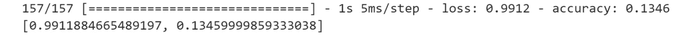
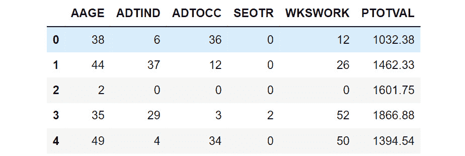
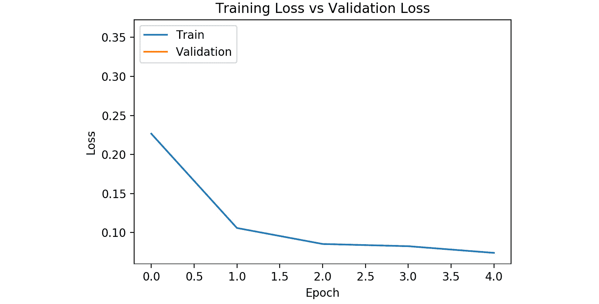
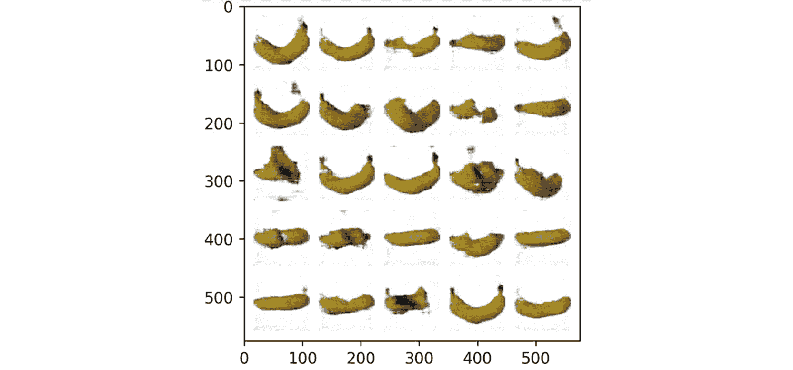

# 附录

# 1\. 使用 TensorFlow 进行机器学习简介

## 活动 1.01：在 TensorFlow 中执行张量加法

**解答：**

1.  导入 TensorFlow 库：

    ```py
    import tensorflow as tf
    ```

1.  使用 TensorFlow 的 `Variable` 类创建两个秩为 `0` 的张量：

    ```py
    var1 = tf.Variable(2706, tf.int32)
    var2 = tf.Variable(2386, tf.int32)
    ```

1.  创建一个新变量，将创建的两个标量相加，并打印结果：

    ```py
    var_sum = var1 + var2
    var_sum.numpy()
    ```

    这将产生以下输出：

    ```py
    5092
    ```

    该输出显示 `产品 A` 在 `地点 X` 的总收入。

1.  使用 TensorFlow 的 `Variable` 类创建两个张量，一个是秩为 `0` 的标量，另一个是秩为 `1` 的向量：

    ```py
    scalar1 = tf.Variable(95, tf.int32)
    vector1 = tf.Variable([2706, 2799, 5102], \
                          tf.int32)
    ```

1.  创建一个新变量，将创建的标量和向量相加，并打印结果：

    ```py
    vector_scalar_sum = scalar1 + vector1
    vector_scalar_sum.numpy()
    ```

    这将产生以下输出：

    ```py
    array([2801, 2894, 5197])
    ```

    结果是 `销售员 1` 在 `地点 X` 的新销售目标。

1.  现在使用 TensorFlow 的 `Variable` 类创建三个秩为 2 的张量，表示每个产品、销售人员和地点的收入：

    ```py
    matrix1 = tf.Variable([[2706, 2799, 5102], \
                           [2386, 4089, 5932]], tf.int32)
    matrix2 = tf.Variable([[5901, 1208, 645], \
                           [6235, 1098, 948]], tf.int32)
    matrix3 = tf.Variable([[3908, 2339, 5520], \
                           [4544, 1978, 4729]], tf.int32)
    ```

1.  创建一个新变量，作为三个张量的和，并打印结果：

    ```py
    matrix_sum = matrix1 + matrix2 + matrix3
    matrix_sum.numpy()
    ```

    这将产生以下输出：

    

图 1.42：矩阵求和结果作为 NumPy 变量的输出

结果表示每个产品在每个地点的总收入。

在本活动中，你对秩为 `0`、`1` 和 `2` 的张量进行了加法运算，并展示了标量（秩为 0 的张量）可以与其他秩的张量相加，这被称为标量加法。

## 活动 1.02：在 TensorFlow 中执行张量重塑和转置

**解答：**

1.  导入 TensorFlow 库：

    ```py
    import tensorflow as tf
    ```

1.  使用 TensorFlow 的 `Variable` 类创建一个包含 24 个元素的单维数组。验证矩阵的形状：

    ```py
    array1 = tf.Variable([*range(24)])
    array1.shape.as_list()
    ```

    这将产生以下输出：

    ```py
    [24]
    ```

1.  使用 TensorFlow 的 `reshape` 函数将矩阵重塑为 12 行 2 列。验证新矩阵的形状：

    ```py
    reshape1 = tf.reshape(array1, shape=[12, 2])
    reshape1.shape.as_list()
    ```

    这将产生以下输出：

    ```py
    [12, 2]
    ```

1.  使用 TensorFlow 的 `reshape` 函数将矩阵重塑为 `3x4x2` 的形状。验证新矩阵的形状：

    ```py
    reshape2 = tf.reshape(array1, shape=[3, 4, 2])
    reshape2.shape.as_list()
    ```

    这将产生以下输出：

    ```py
    [3, 4, 2]
    ```

1.  通过使用 TensorFlow 的 `rank` 函数验证这个新张量的秩为 `3`：

    ```py
    tf.rank(reshape2).numpy()
    ```

    这将产生以下输出：

    ```py
    3
    ```

1.  转置 *步骤 3* 中创建的张量。验证新张量的形状：

    ```py
    transpose1 = tf.transpose(reshape1)
    transpose1.shape.as_list()
    ```

    这将产生以下输出：

    ```py
    [2, 12]
    ```

在本活动中，你练习了对各种秩的张量进行重塑和转置，并学习了如何通过重塑改变张量的秩。你使用 TensorFlow 的 `reshape` 和 `transpose` 函数模拟了将 24 个小学生分组为不同大小的班级项目。

## 活动 1.03：应用激活函数

**解答：**

1.  导入 TensorFlow 库：

    ```py
    import tensorflow as tf
    ```

1.  创建一个`3x4`的张量作为输入，其中行表示来自不同销售代表的销售数据，列表示经销商提供的各种汽车，值表示与建议零售价（MSRP）的平均百分比差异。根据销售人员是否能够以高于或低于 MSRP 的价格销售，值可以是正数或负数：

    ```py
    input1 = tf.Variable([[-0.013, 0.024, 0.06, 0.022], \
                          [0.001, -0.047, 0.039, 0.016], \
                          [0.018, 0.030, -0.021, -0.028]], \
                         tf.float32)
    ```

1.  创建一个`4x1`的`weights`张量，形状为`4x1`，表示汽车的建议零售价（MSRP）：

    ```py
    weights = tf.Variable([[19995.95], [24995.50], \
                           [36745.50], [29995.95]], \
                          tf.float32)
    ```

1.  创建一个大小为`3x1`的偏置张量，表示与每个销售人员相关的固定成本：

    ```py
    bias = tf.Variable([[-2500.0],[-2500.0],[-2500.0]], \
                       tf.float32)
    ```

1.  将输入矩阵与权重进行矩阵乘法，显示所有汽车的平均偏差值，并加上偏置来减去销售人员的固定成本：

    ```py
    output = tf.matmul(input1,weights) + bias
    output
    ```

    以下是输出：

    

    图 1.43: 矩阵乘法的输出

1.  应用 ReLU 激活函数来突出显示净正销售的销售人员：

    ```py
    output = tf.keras.activations.relu(output)
    output 
    ```

    这将产生以下输出：

    

图 1.44: 应用激活函数后的输出

这个结果显示了那些有净正销售的销售人员的结果；那些净负销售的销售人员被置为零。

在这个活动中，你对不同大小的张量进行了张量乘法、张量加法，并且应用了激活函数。你首先定义了张量，然后对其中两个进行了矩阵乘法，接着加上了一个偏置张量，最后对结果应用了激活函数。

# 2. 加载和处理数据

## 活动 2.01：加载表格数据并使用 MinMaxScaler 重新缩放数值字段

**解答：**

1.  打开一个新的 Jupyter 笔记本来实现此活动。将文件保存为`Activity2-01.ipnyb`。

1.  在新的 Jupyter Notebook 单元格中，导入 pandas 库，如下所示：

    ```py
    import pandas as pd
    ```

1.  创建一个新的 pandas DataFrame，命名为`df`，并将`Bias_correction_ucl.csv`文件读取到其中。通过打印结果 DataFrame 来检查数据是否正确加载：

    ```py
    df = pd.read_csv('Bias_correction_ucl.csv')
    ```

    注意

    确保你根据文件在系统上的位置更改路径（高亮部分）。如果你在存储 CSV 文件的同一目录中运行 Jupyter 笔记本，可以不做任何修改直接运行上述代码。

1.  使用`drop`方法删除`date`列。由于你正在删除列，请将`1`传递给`axis`参数，将`True`传递给`inplace`参数：

    ```py
    df.drop('Date', inplace=True, axis=1)
    ```

1.  绘制`Present_Tmax`列的直方图，表示数据集中不同日期和气象站的最高温度：

    ```py
    ax = df['Present_Tmax'].hist(color='gray')
    ax.set_xlabel("Normalized Temperature")
    ax.set_ylabel("Frequency")
    ```

    输出将如下所示：

    

    图 2.20: Present_Tmax 列的温度与频率的直方图

    结果直方图显示了`Present_Tmax`列值的分布。

1.  导入`MinMaxScaler`并使用它来拟合和转换特征 DataFrame：

    ```py
    from sklearn.preprocessing import MinMaxScaler
    scaler = MinMaxScaler()
    df2 = scaler.fit_transform(df)
    df2 = pd.DataFrame(df2, columns=df.columns)
    ```

1.  绘制变换后的 `Present_Tmax` 列的直方图：

    ```py
    ax = df2['Present_Tmax'].hist(color='gray')
    ax.set_xlabel("Normalized Temperature")
    ax.set_ylabel("Frequency")
    ```

    输出结果如下：

    

图 2.21：重新缩放的 `Present_Tmax` 列的直方图

结果的直方图显示温度值范围从 `0` 到 `1`，这一点从直方图的 *x* 轴范围可以看出。通过使用 `MinMaxScaler`，这些值将始终保持最小值为 `0`，最大值为 `1`。

在本次活动中，您进一步对数值字段进行了预处理。在这里，您对数值字段进行了缩放，使其最小值为 `0`，最大值为 `1`。如果数值字段不是正态分布的，这比标准缩放器更有用。它还确保结果字段限制在最小值和最大值之间。

## 活动 2.02：加载用于批处理的图像数据

**解决方案：**

1.  打开一个新的 Jupyter Notebook 来实现此活动。将文件保存为 `Activity2-02.ipnyb`。

1.  在新的 Jupyter Notebook 单元格中，导入 Keras 的预处理包中的 `ImageDataGenerator` 类：

    ```py
    from tensorflow.keras.preprocessing.image \
        import ImageDataGenerator
    ```

1.  实例化 `ImageDataGenerator` 类，并传入 `rescale` 参数，值为 `1/255`，以将图像值转换为介于 `0` 和 `1` 之间：

    ```py
    train_datagen = ImageDataGenerator(rescale = 1./255,\
                                       shear_range = 0.2,\
                                       rotation_range= 180,\
                                       zoom_range = 0.2,\
                                       horizontal_flip = True)
    ```

1.  使用数据生成器的 `flow_from_directory` 方法将数据生成器指向图像数据。传入目标大小、批量大小和类别模式等参数：

    ```py
    training_set = train_datagen.flow_from_directory\
                   ('image_data',\
                    target_size = (64, 64),\
                    batch_size = 25,\
                    class_mode = 'binary')
    ```

1.  创建一个函数来显示批次中的图像：

    ```py
    import matplotlib.pyplot as plt
    def show_batch(image_batch, label_batch):\
        lookup = {v: k for k, v in 
            training_set.class_indices.items()}
        label_batch = [lookup[label] for label in \
                      label_batch]
        plt.figure(figsize=(10,10))
        for n in range(25):
            ax = plt.subplot(5,5,n+1)
            plt.imshow(image_batch[n])
            plt.title(label_batch[n].title())
            plt.axis('off')
    ```

1.  从数据生成器中获取一个批次，并将其传递给函数以显示图像及其标签：

    ```py
    image_batch, label_batch = next(training_set)
    show_batch(image_batch, label_batch)
    ```

    输出结果如下：

    

图 2.22：从批次中增强的图像

输出显示了一个批次的 25 张图像及其各自的标签，这些图像通过旋转、缩放和剪切进行增强。增强后的图像显示了相同的物体，但具有不同的像素值，这有助于创建更强健的模型。

## 活动 2.03：加载用于批处理的音频数据

**解决方案：**

1.  打开一个新的 Jupyter Notebook 来实现此活动。将文件保存为 `Activity2-03.ipnyb`。

1.  在新的 Jupyter Notebook 单元格中，导入 TensorFlow 和 `os` 库：

    ```py
    import tensorflow as tf
    import os
    ```

1.  创建一个函数，使用 TensorFlow 的 `read_file` 函数加载音频文件，然后用 `decode_wav` 函数返回音频数据，最终返回结果张量的转置：

    ```py
    def load_audio(file_path, sample_rate=44100):
        # Load audio at 44.1kHz sample-rate
        audio = tf.io.read_file(file_path)
        audio, sample_rate = tf.audio.decode_wav\
                             (audio,\
                              desired_channels=-1,\
                              desired_samples=sample_rate)
        return tf.transpose(audio)
    ```

1.  使用 `os.list_dir` 将音频数据的路径加载为列表：

    ```py
    prefix = " ../Datasets/data_speech_commands_v0.02"\
            "/zero/"
    paths = [os.path.join(prefix, path) for path in \
             os.listdir(prefix)]
    ```

1.  创建一个函数，接收数据集对象，对其进行洗牌，并使用在*步骤 2*中创建的函数加载音频数据。然后，将绝对值和 `log1p` 函数应用到数据集。此函数将每个值加 `1`，然后取对数。接着，重复数据集对象，批量化，并使用等于批量大小的缓冲区大小预取数据：

    ```py
    def prep_ds(ds, shuffle_buffer_size=1024, \
                batch_size=16):
        # Randomly shuffle (file_path, label) dataset
        ds = ds.shuffle(buffer_size=shuffle_buffer_size)
        # Load and decode audio from file paths
        ds = ds.map(load_audio)
        # Take the absolute value
        ds = ds.map(tf.abs)
        # Apply log1p function
        ds = ds.map(tf.math.log1p)
        # Repeat dataset forever
        ds = ds.repeat()
        # Prepare batches
        ds = ds.batch(batch_size)
        # Prefetch
        ds = ds.prefetch(buffer_size=batch_size)
        return ds
    ```

1.  使用 TensorFlow 的`from_tensor_slices`函数创建数据集对象，并传入音频文件的路径。然后，将你在*第 5 步*中创建的函数应用到数据集对象上：

    ```py
    ds = tf.data.Dataset.from_tensor_slices(paths)
    train_ds = prep_ds(ds)
    ```

1.  获取数据集的第一批数据并打印出来：

    ```py
    for x in train_ds.take(1):\
         print(x)
    ```

    输出将如下所示：

    

    图 2.23：音频数据的一批数据

    输出显示了第一批 MFCC 频谱值的张量形式。

1.  绘制第一批音频文件：

    ```py
    import matplotlib.pyplot as plt
    plt.plot(x[0,:,:].numpy().T, color = 'gray')
    plt.xlabel('Sample')
    plt.ylabel('Value'))
    ```

    输出将如下所示：

    

图 2.24：预处理音频数据批次的可视化表示

上述图表展示了预处理后的音频数据。你可以看到，值是非负的，最小值为`0`，并且数据是以对数比例缩放的。

# 3. TensorFlow 开发

## 活动 3.01：使用 TensorBoard 可视化张量变换

**解决方案：**

1.  导入 TensorFlow 库并设置种子：

    ```py
    import tensorflow as tf
    tf.random.set_seed(42)
    ```

1.  设置日志目录并初始化一个文件写入对象以写入追踪记录：

    ```py
    logdir = 'logs/'
    writer = tf.summary.create_file_writer(logdir)
    ```

1.  创建一个 TensorFlow 函数，用于将两个张量相乘，并使用`ones_like`函数将`1`加到结果张量的所有元素中，`ones_like`函数创建一个与矩阵乘法结果相同形状的张量。然后，对张量的每个值应用 sigmoid 函数：

    ```py
    @tf.function
    def my_func(x, y):
        r1 = tf.matmul(x, y)
        r2 = r1 + tf.ones_like(r1)
        r3 = tf.keras.activations.sigmoid(r2)
        return r3
    ```

1.  创建形状为`5x5x5`的两个张量：

    ```py
    x = tf.random.uniform((5, 5, 5))
    y = tf.random.uniform((5, 5, 5))
    ```

1.  开启图形追踪：

    ```py
    tf.summary.trace_on(graph=True, profiler=True)
    ```

1.  将该函数应用于两个张量，并将追踪记录导出到日志目录：

    ```py
    z = my_func(x, y)
    with writer.as_default():
        tf.summary.trace_export(name="my_func_trace",\
                                step=0,\
                                profiler_outdir=logdir)
    ```

1.  在命令行启动 TensorBoard 并在浏览器中查看图形：

    ```py
    tensorboard --logdir=./logs
    ```

    你应该得到如下图像：

    

图 3.19：TensorBoard 中张量变换的可视化表示

结果表示为张量变换创建的图形。你可以看到，在图形的左下角，执行了矩阵乘法操作，操作的张量为命名为`x`和`y`的张量，位于名为`MatMul`的节点上。在右下角，使用`ones_like`函数创建了张量。输入节点表示张量的形状和常量值。创建两个张量后，它们被输入到一个表示加法函数的节点中，然后输出被输入到一个表示应用 sigmoid 函数的节点中。最终节点表示输出张量的创建。

在这个活动中，你创建了张量变换的函数，并在 TensorBoard 中展示了变换的可视化表示。

## 活动 3.02：从 TensorFlow Hub 使用预训练模型进行词嵌入

**解决方案：**

1.  导入 TensorFlow 和 TensorFlow Hub 并打印库的版本：

    ```py
    import tensorflow as tf
    import tensorflow_hub as hub
    print('TF version: ', tf.__version__)
    print('HUB version: ', hub.__version__)
    ```

    你应该获得 TensorFlow 和 TensorFlow Hub 的版本。

    

    图 3.20：Google Colab 中 TensorFlow 和 TensorFlow Hub 的版本输出

1.  设置通用句子编码器模块的句柄：

    ```py
    module_handle ="https://tfhub.dev/google"\
                   "/universal-sentence-encoder/4"
    ```

1.  使用 TensorFlow Hub 的`KerasLayer`类创建 hub 层，传入以下参数：`module_handle`、`input_shape`和`dtype`：

    ```py
    hub_layer = hub.KerasLayer(module_handle, input_shape=[],\ 
                               dtype=tf.string)
    ```

1.  创建一个包含待编码字符串的列表：

    ```py
    text = ['The TensorFlow Workshop']
    ```

1.  应用`hub_layer`到文本上，将句子嵌入为一个向量：

    ```py
    hub_layer(text)
    ```

    你应该得到以下输出：

    

图 3.21：嵌入向量的输出

在这里，你可以看到文本已经被转换成了一个 512 维的嵌入向量。嵌入向量是一个一维张量，将文本映射为一个连续变量的向量，如前面的图所示。

在这个活动中，你使用了 Google Colab 环境从 TensorFlow Hub 下载了一个模型。你使用了一个通用句子编码器将句子嵌入为一个 512 维的向量。这个活动展示了通过在强大的远程服务器上只用几行简短的代码，你可以为任何应用访问最先进的机器学习模型。

# 4\. 回归和分类模型

## 活动 4.01：使用 TensorFlow 创建多层 ANN

**解决方案：**

1.  打开一个新的 Jupyter 笔记本来实现这个活动。

1.  导入 TensorFlow 和 pandas 库：

    ```py
    import tensorflow as tf
    import pandas as pd
    ```

1.  使用 pandas 的`read_csv`函数加载数据集：

    ```py
    df = pd.read_csv('superconductivity.csv')
    ```

    注意

    确保你根据系统中的 CSV 文件位置更改路径（高亮部分）。如果你从与 CSV 文件存储在同一目录的 Jupyter 笔记本中运行代码，可以直接运行前面的代码而无需修改。

1.  删除`date`列并删除任何包含空值的行：

    ```py
    df.dropna(inplace=True)
    ```

1.  创建目标和特征数据集：

    ```py
    target = df['critical_temp']
    features = df.drop('critical_temp', axis=1)
    ```

1.  重新缩放特征数据集：

    ```py
    from sklearn.preprocessing import StandardScaler
    scaler = StandardScaler()
    feature_array = scaler.fit_transform(features)
    features = pd.DataFrame(feature_array, columns=features.columns)
    ```

1.  初始化一个`Sequential`类的 Keras 模型：

    ```py
    model = tf.keras.Sequential()
    ```

1.  使用模型的`add`方法为模型添加输入层，并将`input_shape`设置为特征数据集中的列数。向模型中添加四个大小分别为`64`、`32`、`16`和`8`的隐藏层，第一个隐藏层使用 ReLU 激活函数，然后添加一个包含一个单元的输出层：

    ```py
    model.add(tf.keras.layers.InputLayer\
             (input_shape=features.shape[1],), \
              name='Input_layer'))
    model.add(tf.keras.layers.Dense(64, activation='relu', \
                                    name='Dense_layer_1'))
    model.add(tf.keras.layers.Dense(32, name='Dense_layer_2'))
    model.add(tf.keras.layers.Dense(16, name='Dense_layer_3'))
    model.add(tf.keras.layers.Dense(8, name='Dense_layer_4'))
    model.add(tf.keras.layers.Dense(1, name='Output_layer'))
    ```

1.  使用 RMSprop 优化器编译模型，学习率为`0.001`，损失使用均方误差：

    ```py
    model.compile(tf.optimizers.RMSprop(0.001), loss='mse')
    ```

1.  创建一个 TensorBoard 回调：

    ```py
    tensorboard_callback = tf.keras.callbacks\
                             .TensorBoard(log_dir="./logs")
    ```

1.  将模型拟合到训练数据上，训练`100`个 epoch，批次大小为`32`，验证集比例为 20%：

    ```py
    model.fit(x=features.to_numpy(), y=target.to_numpy(), \
              epochs=100, callbacks=[tensorboard_callback], \
              batch_size=32, validation_split=0.2)
    ```

    你应该得到以下输出：

    

    图 4.16：拟合过程的输出，显示了每个 epoch 的训练时间和损失

1.  在训练数据上评估模型：

    ```py
    loss = model.evaluate(features.to_numpy(), target.to_numpy())
    print('loss:', loss)
    ```

    这将导致以下输出：

    ```py
    loss: 165.735601268987
    ```

1.  通过在命令行中调用以下内容来可视化 TensorBoard 中的模型架构和模型拟合过程：

    ```py
    tensorboard –-logdir=logs/
    ```

    模型架构应如下所示：

    

    图 4.17：在 TensorBoard 中显示模型架构的可视化表示

1.  在 TensorBoard 中可视化模型拟合过程。你应该得到如下输出：

    

图 4.18：训练和验证集在 TensorBoard 中显示的损失函数与 epoch 的关系

在模型拟合过程中，每个 epoch 后会计算训练集和验证集的损失，并在 TensorBoard 的`SCALARS`标签页中显示。在 TensorBoard 中，你可以看到训练集的均方误差在每个 epoch 后持续减少，但在验证集上则趋于平稳。

在本次活动中，你进一步练习了使用 TensorFlow 构建模型，并在 TensorBoard 中查看其架构和训练过程。在这一部分，你学习了如何使用 TensorFlow 构建、训练和评估用于回归任务的 ANN（人工神经网络）。你使用了`Dense`类的 Keras 层，这是一种简单的方式来创建完全连接的层，并在层的输出上包括激活函数。通过传递所需的单位数，Keras 可以简单地创建这些层。Keras 还负责配置权重和偏差的初始化，以及任何其他机器学习工作流程中常见的额外参数。

## 活动 4.02：使用 TensorFlow 创建多层分类 ANN

**解决方案：**

1.  打开一个新的 Jupyter 笔记本来实现此活动。

1.  导入 TensorFlow 和 pandas 库：

    ```py
    import tensorflow as tf
    import pandas as pd
    ```

1.  使用 pandas 的`read_csv`函数加载数据集：

    ```py
    df = pd.read_csv('superconductivity.csv')
    ```

    注意

    确保根据 CSV 文件在你系统上的位置更改路径（高亮部分）。如果你在与 CSV 文件存储在同一目录下运行 Jupyter 笔记本，则无需修改代码即可运行上述代码。

1.  删除任何包含空值的行：

    ```py
    df.dropna(inplace=True)
    ```

1.  当`critical_temp`列的值大于`77.36`时，将目标值设置为`true`，小于时设置为`false`。特征数据集是数据集中剩余的列：

    ```py
    target = df['critical_temp'].apply(lambda x: 1 if x>77.36 else 0)
    features = df.drop('critical_temp', axis=1)
    ```

1.  重新缩放特征数据集：

    ```py
    from sklearn.preprocessing import StandardScaler
    scaler = StandardScaler()
    feature_array = scaler.fit_transform(features)
    features = pd.DataFrame(feature_array, columns=features.columns)
    ```

1.  初始化一个`Sequential`类的 Keras 模型：

    ```py
    model = tf.keras.Sequential()
    ```

1.  使用模型的`add`方法添加一个输入层，并将`input_shape`设置为特征数据集中的列数。向模型添加三个隐藏层，大小分别为`32`、`16`和`8`，然后添加一个输出层，包含`1`个单位并使用 sigmoid 激活函数：

    ```py
    model.add(tf.keras.layers.InputLayer\
             (input_shape=features.shape[1], \
              name='Input_layer'))
    model.add(tf.keras.layers.Dense(32, name='Hidden_layer_1'))
    model.add(tf.keras.layers.Dense(16, name='Hidden_layer_2'))
    model.add(tf.keras.layers.Dense(8, name='Hidden_layer_3'))
    model.add(tf.keras.layers.Dense(1, name='Output_layer', \
                                    activation='sigmoid'))
    ```

1.  使用 RMSprop 优化器编译模型，学习率设置为`0.0001`，损失函数使用二元交叉熵，并计算准确度指标：

    ```py
    model.compile(tf.optimizers.RMSprop(0.0001), \
                  loss= 'binary_crossentropy', metrics=['accuracy'])
    ```

1.  创建一个 TensorBoard 回调：

    ```py
    tensorboard_callback = tf.keras.callbacks.TensorBoard\
                           (log_dir="./logs")
    ```

1.  将模型拟合到训练数据上，进行`50`个周期，并且设置验证集比例为 20%：

    ```py
    model.fit(x=features.to_numpy(), y=target.to_numpy(),\
              epochs=50, callbacks=[tensorboard_callback],\
              validation_split=0.2)
    ```

    你应该会得到以下输出：

    

    图 4.19：拟合过程的输出，显示了每个周期、每个样本的训练时间、损失和准确度，并在验证集上进行了评估

1.  在训练数据上评估模型：

    ```py
    loss, accuracy = model.evaluate(features.to_numpy(), \
                                    target.to_numpy())
    print(f'loss: {loss}, accuracy: {accuracy}')
    ```

    这将显示以下输出：

    ```py
    loss: 0.21984571637242145, accuracy: 0.8893383145332336
    ```

1.  通过在命令行中调用以下命令，在 TensorBoard 中可视化模型架构和模型拟合过程：

    ```py
    tensorboard –-logdir=logs/
    ```

    你应该会在浏览器中看到类似以下的屏幕：

    

图 4.20：TensorBoard 中模型架构的可视化表示

损失函数可以如下所示进行可视化：


图 4.21：TensorBoard 中显示训练和验证集准确度与损失随周期变化的可视化表示

在模型拟合过程中，每个周期后计算训练集和验证集的准确度和损失，并在 TensorBoard 的 `SCALARS` 标签页中显示。从 TensorBoard 中你可以看到，损失指标（二元交叉熵）在训练集上每个周期后都会持续下降，但在验证集上则趋于平稳。

在这个活动中，你通过构建一个多层人工神经网络（ANN），练习了如何在 TensorFlow 中构建分类模型，以判断某种材料是否会在氮气的沸点上方或下方表现出超导性。此外，你还使用 TensorBoard 查看模型的架构，并在训练过程中监控关键指标，包括损失和准确率。

# 5\. 分类模型

## 活动 5.01：使用 TensorFlow 构建字符识别模型

**解决方案**：

1.  打开一个新的 Jupyter 笔记本。

1.  导入 pandas 库并使用`pd`作为别名：

    ```py
    import pandas as pd
    ```

1.  创建一个名为`file_url`的变量，其中包含数据集的 URL：

    ```py
    file_url = 'https://raw.githubusercontent.com/PacktWorkshops'\
              '/The-TensorFlow-Workshop/master/Chapter05'\
              '/dataset/letter-recognition.data'
    ```

1.  使用`read_csv()`方法将数据集加载到一个名为`data`的`DataFrame()`函数中，提供 CSV 文件的 URL，并设置`header=None`，因为数据集没有提供列名。使用`head()`方法打印前五行。

    ```py
    data = pd.read_csv(file_url, header=None)
    data.head()
    ```

    预期的输出将如下所示：

    

    图 5.42：数据的前五行

    你可以看到数据集包含了`17`列，并且所有列都是数字型的。列`0`是`目标`变量，每个值对应字母表中的一个字母。

1.  使用`pop()`方法提取目标变量（列`0`），并将其保存在名为`target`的变量中：

    ```py
    target = data.pop(0)
    ```

1.  将`data`划分为训练集，保留前 15,000 个观测值，并将其保存在名为`X_train`的变量中。对`target`进行相同的划分，并将前 15,000 个案例保存在名为`y_train`的变量中：

    ```py
    X_train = data[:15000]
    y_train = target[:15000]
    ```

1.  将`data`划分为测试集，保留最后 5,000 个观测值，并将其保存在名为`X_test`的变量中。对`target`进行相同的划分，并将最后 5,000 个案例保存在名为`y_test`的变量中：

    ```py
    X_test = data[15000:]
    y_test = target[15000:]
    ```

1.  导入 TensorFlow 库，并使用`tf`作为别名：

    ```py
    import tensorflow as tf
    ```

1.  使用`tf.random.set_seed()`将种子设置为`8`，以获得可重复的结果：

    ```py
    tf.random.set_seed(8)
    ```

1.  使用`tf.keras.Sequential()`实例化一个顺序模型，并将其保存在名为`model`的变量中：

    ```py
    model = tf.keras.Sequential()
    ```

1.  从`tensorflow.keras.layers`导入`Dense()`类：

    ```py
    from tensorflow.keras.layers import Dense
    ```

1.  使用`Dense()`创建一个包含`512`个单元的全连接层，指定 ReLu 为激活函数，输入形状为`(16,)`，这对应数据集中的特征数量。将其保存在名为`fc1`的变量中：

    ```py
    fc1 = Dense(512, input_shape=(16,), activation='relu')
    ```

1.  使用`Dense()`创建一个包含`512`个单元的全连接层，并指定 ReLu 为激活函数。将其保存在名为`fc2`的变量中：

    ```py
    fc2 = Dense(512, activation='relu')
    ```

1.  使用`Dense()`创建一个包含`128`个单元的全连接层，并指定 ReLu 为激活函数。将其保存在名为`fc3`的变量中：

    ```py
    fc3 = Dense(128, activation='relu')
    ```

1.  使用`Dense()`创建一个包含`128`个单元的全连接层，并指定 ReLu 为激活函数。将其保存在名为`fc4`的变量中：

    ```py
    fc4 = Dense(128, activation='relu')
    ```

1.  使用`Dense()`创建一个包含`26`个单元的全连接层，并指定 softmax 为激活函数。将其保存在名为`fc5`的变量中：

    ```py
    fc5 = Dense(26, activation='softmax')
    ```

1.  使用`add()`方法顺序地将所有五个全连接层添加到模型中。

    ```py
    model.add(fc1)
    model.add(fc2)
    model.add(fc3)
    model.add(fc4)
    model.add(fc5)
    ```

1.  使用`summary()`方法打印模型的总结。

    ```py
    model.summary()
    ```

    预期的输出如下：

    

    图 5.43：模型架构总结

    上述输出显示了模型中有五个层（符合预期），并且告诉你每个层的参数数量。

1.  从`tf.keras.losses`实例化`SparseCategoricalCrossentropy()`，并将其保存在名为`loss`的变量中：

    ```py
    loss = tf.keras.losses.SparseCategoricalCrossentropy()
    ```

1.  从`tf.keras.optimizers`实例化`Adam()`，学习率为`0.001`，并将其保存在名为`optimizer`的变量中：

    ```py
    optimizer = tf.keras.optimizers.Adam(0.001)
    ```

1.  使用`compile()`方法编译模型，指定刚刚创建的优化器和损失函数参数，并使用准确度作为报告的指标：

    ```py
    model.compile(optimizer=optimizer, loss=loss, \
                  metrics=['accuracy'])
    ```

1.  使用`fit()`方法开始模型的训练过程，在训练集上训练五个 epoch：

    ```py
    model.fit(X_train, y_train, epochs=5)
    ```

    预期的输出如下：

    

    图 5.44：训练过程的日志

    上述输出显示了模型训练过程中每个 epoch 的日志。请注意，处理一个 epoch 大约需要 2 秒，且准确率从`0.6229`（第一个 epoch）提高到`0.9011`（第五个 epoch）。

1.  使用`evaluate()`方法评估模型在测试集上的表现。

    ```py
    model.evaluate(X_test, y_test)
    ```

    预期的输出如下：

    

    图 5.45：模型在测试集上的表现

1.  使用`predict()`方法预测测试集上每个类别的概率，并将结果保存在名为`preds_proba`的变量中：

    ```py
    preds_proba = model.predict(X_test)
    ```

1.  使用`argmax()`方法并设置`axis=1`，将类别概率转换为单一的预测值：

    ```py
    preds = preds_proba.argmax(axis=1)
    ```

1.  从`tensorflow.math`导入`confusion_matrix`：

    ```py
    from tensorflow.math import confusion_matrix
    ```

1.  打印测试集上的混淆矩阵：

    ```py
    confusion_matrix(y_test, preds)
    ```

    预期的输出如下所示：

    

图 5.46：测试集的混淆矩阵

上面的输出显示，模型大多数时候正确地预测了 26 个字母（大多数值位于对角线上）。它在训练集和测试集上的准确率约为 0.89。这个活动结束了多类别分类部分。在接下来的部分，你将了解另一种分类方法——多标签分类。

## 活动 5.02：使用 TensorFlow 构建电影类型标记模型

**解决方案：**

1.  打开一个新的 Jupyter notebook。

1.  导入 pandas 库并将其别名设为`pd`：

    ```py
    import pandas as pd
    ```

1.  创建一个名为`feature_url`的变量，包含数据集的 URL：

    ```py
    feature_url = 'https://raw.githubusercontent.com'\
                  '/PacktWorkshops'/The-TensorFlow-Workshop'\
                  '/master/Chapter05'/dataset/IMDB-F-features.csv'
    ```

1.  使用`read_csv()`方法将数据集加载到名为`feature`的 DataFrame 中，并提供 CSV 文件的 URL。使用`head()`方法打印前五行：

    ```py
    feature = pd.read_csv(feature_url)
    feature.head()
    ```

    预期的输出如下所示：

    

    图 5.47：特征数据的前五行

1.  创建一个名为`target_url`的变量，包含数据集的 URL：

    ```py
    target_url = 'https://raw.githubusercontent.com'\
                 '/PacktWorkshops/The-TensorFlow-Workshop'\
                 '/master/Chapter05'/dataset/IMDB-F-targets.csv'
    ```

1.  使用`read_csv()`方法将数据集加载到名为`target`的 DataFrame 中，并提供 CSV 文件的 URL。使用`head()`方法打印前五行：

    ```py
    target = pd.read_csv(target_url)
    target.head()
    ```

    预期的输出如下所示：

    

    图 5.48：目标数据的前五行

1.  将数据拆分为训练集，保留前 15,000 条观察数据并将其保存在名为`X_train`的变量中。对`target`进行相同的拆分，将前 15,000 条数据保存在名为`y_train`的变量中：

    ```py
    X_train = feature[:15000]
    y_train = target[:15000]
    ```

1.  将数据拆分为测试集，保留最后的 5,000 条观察数据并将其保存在名为`X_test`的变量中。对`target`进行相同的拆分，将最后的 5,000 条数据保存在名为`y_test`的变量中：

    ```py
    X_test = feature[15000:]
    y_test = target[15000:]
    ```

1.  导入 TensorFlow 库并将其别名设为`tf`：

    ```py
    import tensorflow as tf
    ```

1.  使用`tf.random.set_seed()`将`tensorflow`的种子设置为`8`，这将帮助获得可重复的结果：

    ```py
    tf.random.set_seed(8)
    ```

1.  使用`tf.keras.Sequential()`实例化一个顺序模型，并将其保存在名为`model`的变量中：

    ```py
    model = tf.keras.Sequential()
    ```

1.  从`tensorflow.keras.layers`导入`Dense()`类：

    ```py
    from tensorflow.keras.layers import Dense
    ```

1.  使用`Dense()`创建一个包含`512`个单元的全连接层，并指定 ReLu 作为激活函数，输入形状为`(1001,)`，对应数据集的特征数量。将其保存在名为`fc1`的变量中：

    ```py
    fc1 = Dense(512, input_shape=(1001,), activation='relu')
    ```

1.  使用`Dense()`创建一个包含`512`个单元的全连接层，并指定 ReLu 作为激活函数。将其保存在一个名为`fc2`的变量中：

    ```py
    fc2 = Dense(512, activation='relu')
    ```

1.  使用`Dense()`创建一个包含`128`个单元的全连接层，并指定 ReLu 作为激活函数。将其保存在一个名为`fc3`的变量中：

    ```py
    fc3 = Dense(128, activation='relu')
    ```

1.  使用`Dense()`创建一个包含`128`个单元的全连接层，并指定 ReLu 作为激活函数。将其保存在一个名为`fc4`的变量中：

    ```py
    fc4 = Dense(128, activation='relu')
    ```

1.  使用`Dense()`创建一个包含`28`个单元的全连接层，并指定 sigmoid 作为激活函数。将其保存在一个名为`fc5`的变量中：

    ```py
    fc5 = Dense(28, activation='sigmoid')
    ```

1.  使用`add()`方法依次将所有五个全连接层添加到模型中。

    ```py
    model.add(fc1)
    model.add(fc2)
    model.add(fc3)
    model.add(fc4)
    model.add(fc5)
    ```

1.  使用`summary()`方法打印模型的总结。

    ```py
    model.summary()
    ```

    预期的输出将如下所示：

    

    图 5.49：模型架构的总结

1.  从`tf.keras.losses`实例化`BinaryCrossentropy()`并将其保存在一个名为`loss`的变量中：

    ```py
    loss = tf.keras.losses.BinaryCrossentropy()
    ```

1.  从`tf.keras.optimizers`实例化`Adam()`，设置学习率为`0.001`，并将其保存在一个名为`optimizer`的变量中：

    ```py
    optimizer = tf.keras.optimizers.Adam(0.001)
    ```

1.  使用`compile()`方法编译模型，并指定刚刚创建的优化器和损失函数参数，同时设置准确率为报告的指标：

    ```py
    model.compile(optimizer=optimizer, loss=loss, \
                  metrics=['accuracy'])
    ```

1.  使用`fit()`方法开始在训练集上进行模型训练，训练 20 个 epoch：

    ```py
    model.fit(X_train, y_train, epochs=20)
    ```

    预期的输出将如下所示：

    

    图 5.50：训练过程的日志

    你可以观察到，模型在训练了 20 个 epoch 后，准确率逐步提高，在第九个 epoch 时达到了`61.67%`。

1.  使用`evaluate()`方法评估模型在测试集上的表现：

    ```py
    model.evaluate(X_test, y_test)
    ```

    预期的输出将如下所示：

    

图 5.51：模型在测试集上的表现

上面的输出显示，模型在测试集上达到了`0.13`的准确率，这个值非常低，而在训练集上的准确率为`0.62`。这个模型在学习如何正确预测不同类型电影的模式上存在困难。你可以尝试不同的架构，使用不同数量的隐藏层和单元。你还可以尝试不同的学习率和优化器。由于训练集和测试集上的得分差异很大，说明模型发生了过拟合，只学到了与训练集相关的模式。

# 6. 正则化和超参数调整

## 活动 6.01：使用 L1 和 L2 正则化器预测收入

**解决方案：**

1.  打开一个新的 Jupyter 笔记本。

1.  导入 pandas 库并使用`pd`作为别名：

    ```py
    import pandas as pd
    ```

1.  创建一个名为`usecols`的列表，包含列名`AAGE`、`ADTIND`、`ADTOCC`、`SEOTR`、`WKSWORK`和`PTOTVAL`：

    ```py
    usecols = ['AAGE','ADTIND','ADTOCC','SEOTR','WKSWORK', 'PTOTVAL']
    ```

1.  创建一个名为`train_url`的变量，包含训练集的 URL：

    ```py
    train_url = 'https://raw.githubusercontent.com/PacktWorkshops'\
                '/The-TensorFlow-Workshop/master/Chapter06'\
                '/dataset/census-income-train.csv'
    ```

1.  使用`read_csv()`方法将训练数据集加载到`train_data`的 DataFrame 中。为`usecols`参数提供 CSV 文件的 URL 和`usecols`列表。使用`head()`方法打印前五行：

    ```py
    train_data = pd.read_csv(train_url, usecols=usecols)
    train_data.head()
    ```

    预期输出如下：

    

    图 6.23：训练集的前五行

1.  使用`pop()`方法提取目标变量（`PTOTVAL`），并将其保存在名为`train_target`的变量中：

    ```py
    train_target = train_data.pop('PTOTVAL')
    ```

1.  创建一个名为`test_url`的变量，包含测试集的 URL：

    ```py
    test_url = 'https://github.com/PacktWorkshops'\
               '/The-TensorFlow-Workshop/blob/master/Chapter06'\
               '/dataset/census-income-test.csv?raw=true'
    ```

1.  使用`read_csv()`方法将测试数据集加载到`X_test`的 DataFrame 中。为`usecols`参数提供 CSV 文件的 URL 和`usecols`列表。使用`head()`方法打印前五行：

    ```py
    test_data = pd.read_csv(test_url, usecols=usecols)
    test_data.head()
    ```

    预期输出如下：

    

    图 6.24：测试集的前五行

1.  使用`pop()`方法提取目标变量（`PTOTVAL`），并将其保存在名为`test_target`的变量中：

    ```py
    test_target = test_data.pop('PTOTVAL')
    ```

1.  导入 TensorFlow 库并使用`tf`作为别名。然后，从`tensorflow.keras.layers`导入`Dense`类：

    ```py
    import tensorflow as tf
    from tensorflow.keras.layers import Dense
    ```

1.  使用`tf.random.set_seed()`将种子设置为`8`，以获取可复现的结果：

    ```py
    tf.random.set_seed(8)
    ```

1.  使用`tf.keras.Sequential()`实例化一个顺序模型，并将其保存在名为`model`的变量中：

    ```py
    model = tf.keras.Sequential()
    ```

1.  从`tensorflow.keras.layers`导入`Dense`类：

    ```py
    from tensorflow.keras.layers import Dense
    ```

1.  使用`Dense()`创建一个包含`1048`个单元的全连接层，指定 ReLu 作为激活函数，并将输入形状设置为`(5,)`，这对应数据集中的特征数量。将其保存在名为`fc1`的变量中：

    ```py
    fc1 = Dense(1048, input_shape=(5,), activation='relu')
    ```

1.  使用`Dense()`创建三个全连接层，分别包含`512`、`128`和`64`个单元，并指定 ReLu 作为激活函数。将它们分别保存在名为`fc2`、`fc3`和`fc4`的三个变量中：

    ```py
    fc2 = Dense(512, activation='relu')
    fc3 = Dense(128, activation='relu')
    fc4 = Dense(64, activation='relu')
    ```

1.  使用`Dense()`创建一个包含三个单元的全连接层（对应类别数量），并指定 softmax 作为激活函数。将其保存在名为`fc5`的变量中：

    ```py
    fc5 = Dense(3, activation='softmax')
    ```

1.  使用`Dense()`创建一个包含单个单元的全连接层。将其保存在名为`fc5`的变量中：

    ```py
    fc5 = Dense(1)
    ```

1.  按顺序使用`add()`方法将五个全连接层添加到模型中：

    ```py
    model.add(fc1)
    model.add(fc2)
    model.add(fc3)
    model.add(fc4)
    model.add(fc5)
    ```

1.  打印模型的总结：

    ```py
    model.summary()
    ```

    你将得到以下输出：

    

    图 6.25：模型架构的总结

1.  从`tf.keras.optimizers`实例化`Adam()`，学习率为`0.05`，并将其保存到名为`optimizer`的变量中：

    ```py
    optimizer = tf.keras.optimizers.Adam(0.05)
    ```

1.  编译模型，指定优化器，并将`mse`设置为损失函数和显示的度量：

    ```py
    model.compile(optimizer=optimizer, loss='mse', metrics=['mse'])
    ```

1.  使用`fit()`方法开始模型训练过程，训练五个周期，并将数据拆分为 20%的验证集：

    ```py
    model.fit(train_data, train_target, epochs=5, \
              validation_split=0.2)
    ```

    预期输出如下：

    

    图 6.26：训练过程的日志

    上述输出表明模型存在过拟合问题。在训练集上的 MSE 分数为`1005740`，而在验证集上的 MSE 分数为`1070237`。现在，训练另一个模型，使用 L1 和 L2 正则化。

1.  创建五个全连接层，类似于之前的模型，并为`kernel_regularizer`参数指定 L1 和 L2 正则化器。正则化器因子使用`0.001`。将其保存为五个变量，分别命名为`reg_fc1`、`reg_fc2`、`reg_fc3`、`reg_fc4`和`reg_fc5`：

    ```py
    reg_fc1 = Dense(1048, input_shape=(5,), activation='relu', \
                    kernel_regularizer=tf.keras.regularizers\
                                         .l1_l2(l1=0.001, l2=0.001))
    reg_fc2 = Dense(512, activation='relu', \
                    kernel_regularizer=tf.keras.regularizers\
                                         .l1_l2(l1=0.001, l2=0.001))
    reg_fc3 = Dense(128, activation='relu', \
                    kernel_regularizer=tf.keras.regularizers\
                                         .l1_l2(l1=0.001, l2=0.001))
    reg_fc4 = Dense(64, activation='relu', \
                    kernel_regularizer=tf.keras.regularizers\
                                         .l1_l2(l1=0.001, l2=0.001))
    reg_fc5 = Dense(1, activation='relu')
    ```

1.  使用`tf.keras.Sequential()`实例化一个顺序模型，将其存储在名为`model2`的变量中，并使用`add()`方法将五个全连接层按顺序添加到模型中：

    ```py
    model2 = tf.keras.Sequential()
    model2.add(reg_fc1)
    model2.add(reg_fc2)
    model2.add(reg_fc3)
    model2.add(reg_fc4)
    model2.add(reg_fc5)
    ```

1.  打印模型概览：

    ```py
    model2.summary()
    ```

    输出结果如下：

    

    图 6.27：模型架构概览

1.  使用`compile()`方法编译模型，指定优化器，并将`mse`作为损失函数和要显示的评估指标：

    ```py
    optimizer = tf.keras.optimizers.Adam(0.1)
    model2.compile(optimizer=optimizer, loss='mse', metrics=['mse'])
    ```

1.  使用`fit()`方法启动模型训练过程，进行五轮训练，并将数据分为验证集，其中 20%的数据用于验证：

    ```py
    model2.fit(train_data, train_target, epochs=5, \
               validation_split=0.2)
    ```

    输出结果如下：

    

图 6.28：训练过程日志

添加 L1 和 L2 正则化后，模型在训练集（`4028182`）和测试集（`3970020`）上的准确度分数相似。因此，模型没有严重的过拟合问题。

## 活动 6.02：使用 Keras Tuner 中的贝叶斯优化预测收入

**解决方案：**

1.  打开一个新的 Jupyter 笔记本。

1.  导入 pandas 库，并使用`pd`作为别名：

    ```py
    import pandas as pd
    ```

1.  创建一个名为`usecols`的列表，包含以下列名：`AAGE`、`ADTIND`、`ADTOCC`、`SEOTR`、`WKSWORK`和`PTOTVAL`：

    ```py
    usecols = ['AAGE','ADTIND','ADTOCC','SEOTR','WKSWORK', 'PTOTVAL']
    ```

1.  创建一个名为`train_url`的变量，包含训练集的 URL：

    ```py
    train_url = 'https://raw.githubusercontent.com/PacktWorkshops'\
                '/The-TensorFlow-Workshop/master/Chapter06'\
                '/dataset/census-income-train.csv'
    ```

1.  使用`read_csv()`方法将训练数据集加载到名为`train_data`的 DataFrame 中，并将 CSV 文件的 URL 和`usecols`列表提供给`usecols`参数。使用`head()`方法打印前五行：

    ```py
    train_data = pd.read_csv(train_url, usecols=usecols)
    train_data.head()
    ```

1.  你将获得如下输出图 6.29：训练集的前五行    ](img/B16341_06_29.jpg)

    图 6.29：训练集的前五行

1.  使用`pop()`方法提取目标变量（`PTOTVAL`），并将其保存到名为`train_target`的变量中：

    ```py
    train_target = train_data.pop('PTOTVAL')
    ```

1.  创建一个名为`test_url`的变量，包含测试集的 URL：

    ```py
    test_url = 'https://github.com/PacktWorkshops'\
               '/The-TensorFlow-Workshop/blob/master/Chapter06'\
               '/dataset/census-income-test.csv?raw=true'
    ```

1.  使用`read_csv()`方法将测试数据集加载到名为`X_test`的 DataFrame 中，并将 CSV 文件的 URL 和`usecols`列表提供给`usecols`参数。使用`head()`方法打印前五行：

    ```py
    test_data = pd.read_csv(test_url, usecols=usecols)
    test_data.head()
    ```

    输出结果如下：

    

    图 6.30：测试集的前五行

1.  使用`pop()`方法提取目标变量（`PTOTVAL`），并将其保存到名为`test_target`的变量中：

    ```py
    test_target = test_data.pop('PTOTVAL')
    ```

1.  导入 TensorFlow 库并使用`tf`作为别名。然后，从`tensorflow.keras.layers`导入`Dense`类：

    ```py
    import tensorflow as tf
    from tensorflow.keras.layers import Dense
    ```

1.  使用`tf.random.set_seed()`设置种子为`8`，以获得可复现的结果：

    ```py
    tf.random.set_seed(8)
    ```

1.  定义一个名为`model_builder`的函数，用于创建一个与*活动 6.01*、*使用 L1 和 L2 正则化预测收入*相同架构的顺序模型。 但这次，提供一个超参数`hp.Choice`来选择学习率，`hp.Int`来设置输入层的单元数，`hp.Choice`来设置 L2 正则化：

    ```py
    def model_builder(hp):
    model = tf.keras.Sequential()
    hp_l2 = hp.Choice('l2', values = [0.1, 0.01, 0.001])
    hp_units = hp.Int('units', min_value=128, max_value=512, step=64)
    reg_fc1 = Dense(hp_units, input_shape=(5,), activation='relu', \
                    kernel_regularizer=tf.keras.regularizers\
                                         .l2(l=hp_l2))
    reg_fc2 = Dense(512, activation='relu', \
                    kernel_regularizer=tf.keras.regularizers\
                                         .l2(l=hp_l2))
    reg_fc3 = Dense(128, activation='relu', \
                    kernel_regularizer=tf.keras.regularizers\
                                         .l2(l=hp_l2))
    reg_fc4 = Dense(128, activation='relu', \
                    kernel_regularizer=tf.keras.regularizers\
                                         .l2(l=hp_l2))
    reg_fc5 = Dense(1)
    model.add(reg_fc1)
    model.add(reg_fc2)
    model.add(reg_fc3)
    model.add(reg_fc4)
    model.add(reg_fc5)
    hp_learning_rate = hp.Choice('learning_rate', \
                                 values = [0.01, 0.001])
    optimizer = tf.keras.optimizers.Adam(hp_learning_rate)
    model.compile(optimizer=optimizer, loss='mse', metrics=['mse'])
    return model
    ```

1.  安装`keras-tuner`包，然后导入它并赋予`kt`别名：

    ```py
    !pip install keras-tuner
    import kerastuner as kt
    ```

1.  实例化一个`BayesianOptimization`调优器，并将`val_mse`赋值给`objective`，将`10`赋值给`max_trials`：

    ```py
    tuner = kt.BayesianOptimization(model_builder, \
                                    objective = 'val_mse', \
                                    max_trials = 10)
    ```

1.  使用`search()`方法在训练集和测试集上启动超参数搜索：

    ```py
    tuner.search(train_data, train_target, \
                 validation_data=(test_data, test_target))
    ```

1.  使用`get_best_hyperparameters()`提取最佳超参数组合（索引为`0`），并将其保存在名为`best_hps`的变量中：

    ```py
    best_hps = tuner.get_best_hyperparameters()[0]
    ```

1.  提取输入层单元数的最佳值，将其保存在名为`best_units`的变量中，并打印其值：

    ```py
    best_units = best_hps.get('units')
    best_units
    ```

    你将得到以下输出：

    ```py
    128
    ```

    Hyperband 找到的输入层单元数的最佳值是`128`。

1.  提取学习率的最佳值，将其保存在名为`best_lr`的变量中，并打印其值：

    ```py
    best_lr = best_hps.get('learning_rate')
    best_lr
    ```

    Hyperband 找到的学习率超参数的最佳值是`0.001`：

    ```py
    0.001
    ```

1.  提取 L2 正则化的最佳值，将其保存在名为`best_l2`的变量中，并打印其值：

    ```py
    best_l2 = best_hps.get('l2')
    best_l2
    ```

1.  Hyperband 找到的学习率超参数的最佳值是`0.001`：

    ```py
    0.001
    ```

1.  使用`fit()`方法开始模型训练过程，训练五个周期，并将测试集作为`validation_data`：

    ```py
    model = tuner.hypermodel.build(best_hps)
    model.fit(X_train, y_train, epochs=5, \
              validation_data=(X_test, y_test))
    ```

    你应该得到类似以下的输出：

    

图 6.31：训练过程的日志

使用贝叶斯优化，你找到了输入层单元数（`128`）、学习率（`0.001`）和 L2 正则化（`0.001`）的最佳超参数组合。使用这些超参数，最终模型在训练集上的 MSE 得分为`994174`，在测试集上的 MSE 得分为`989335`。这相比于*活动 6.01*、*使用 L1 和 L2 正则化预测收入*，有了很大的改进，且模型没有出现过拟合。

# 7. 卷积神经网络

## 活动 7.01：构建具有更多 ANN 层的 CNN

**解决方案：**

有多种方法可以得出此活动的解决方案。以下步骤描述了其中一种方法，类似于本章之前在`CIFAR-10`数据集上使用的步骤：

1.  启动一个新的 Jupyter 笔记本。

1.  导入 TensorFlow 库：

    ```py
    import tensorflow as tf
    ```

1.  导入所需的附加库：

    ```py
    import numpy as np
    import matplotlib.pyplot as plt
    import tensorflow as tf
    import tensorflow_datasets as tfds
    from tensorflow.keras.layers import Input, Conv2D, Dense, Flatten, \
        Dropout, Activation, Rescaling
    from tensorflow.keras.models import Model
    from sklearn.metrics import confusion_matrix, ConfusionMatrixDisplay
    ```

1.  直接从`tensorflow_datasets`加载`CIFAR-100`数据集并查看其属性：

    ```py
    (c100_train_dataset, c100_test_dataset), \
    dataset_info = tfds.load('cifar100',\
                             split = ['train', 'test'],\
                             data_dir = 'content/Cifar100/',\
                             shuffle_files = True,\
                             as_supervised = True,\
                             with_info = True)
    assert isinstance(c100_train_dataset, tf.data.Dataset)
    image_shape = dataset_info.features["image"].shape
    print(f'Shape of Images in the Dataset: \t{image_shape}')
    num_classes = dataset_info.features["label"].num_classes
    print(f'Number of Classes in the Dataset: \t{num_classes}')
    names_of_classes = dataset_info.features["label"].names
    print(f'Names of Classes in the Dataset: \t{names_of_classes}\n')
    print(f'Total examples in Train Dataset: \
          \t{len(c100_train_dataset)}')
    print(f'Total examples in Test Dataset: \
          \t{len(c100_test_dataset)}')
    ```

    这将给出以下输出：

    

    图 7.42：CIFAR-100 数据集的属性

1.  使用重缩放层对图像进行重缩放。然后，通过重缩放、缓存、打乱、批处理和预取图像，构建测试和训练数据管道：

    ```py
    normalization_layer = Rescaling(1./255)
    c100_train_dataset = c100_train_dataset.map\
                         (lambda x, y: (normalization_layer(x), y), \
                          num_parallel_calls = \
                          tf.data.experimental.AUTOTUNE)
    c100_train_dataset = c100_train_dataset.cache()
    c100_train_dataset = c100_train_dataset.shuffle\
                         (len(c100_train_dataset))
    c100_train_dataset = c100_train_dataset.batch(32)
    c100_train_dataset = c100_train_dataset.prefetch(tf.data.experimental.AUTOTUNE)
    c100_test_dataset = c100_test_dataset.map\
                        (lambda x, y: (normalization_layer(x), y), \
                         num_parallel_calls = \
                         tf.data.experimental.AUTOTUNE)
    c100_test_dataset = c100_test_dataset.cache()
    c100_test_dataset = c100_test_dataset.batch(128)
    c100_test_dataset = \
    c100_test_dataset.prefetch(tf.data.experimental.AUTOTUNE)
    ```

1.  使用函数式 API 构建模型：

    ```py
    input_layer = Input(shape=image_shape)
    x = Conv2D(filters = 32, kernel_size = \
               (3, 3), strides=2)(input_layer)
    x = Activation('relu')(x)
    x = Conv2D(filters = 64, kernel_size = (3, 3), strides=2)(x)
    x = Activation('relu')(x)
    x = Conv2D(filters = 128, kernel_size = (3, 3), strides=2)(x)
    x = Activation('relu')(x)
    x = Flatten()(x)
    x = Dropout(rate = 0.5)(x)
    x = Dense(units = 1024)(x)
    x = Activation('relu')(x)
    x = Dropout(rate = 0.2)(x)
    x = Dense(units = num_classes)(x)
    output = Activation('softmax')(x)
    c100_classification_model = Model(input_layer, output)
    ```

1.  编译并拟合模型：

    ```py
    c100_classification_model.compile(\
        optimizer='adam', \
        loss='sparse_categorical_crossentropy', \
        metrics = ['accuracy'], loss_weights = None, \
        weighted_metrics = None, run_eagerly = None, \
        steps_per_execution = None
    )
    history = c100_classification_model.fit\
              (c100_train_dataset, \
               validation_data=c100_test_dataset, \
               epochs=15)
    ```

    输出将如下图所示：

    

    图 7.43：模型拟合

1.  使用以下代码绘制损失和准确率：

    ```py
    def plot_trend_by_epoch(tr_values, val_values, title):
        epoch_number = range(len(tr_values))
        plt.plot(epoch_number, tr_values, 'r')
        plt.plot(epoch_number, val_values, 'b')
        plt.title(title)
        plt.xlabel('epochs')
        plt.legend(['Training '+title, 'Validation '+title])
        plt.figure()
    hist_dict = history.history
    tr_loss, val_loss = hist_dict['loss'], \
                        hist_dict['val_loss']
    plot_trend_by_epoch(tr_loss, val_loss, "Loss")
    tr_accuracy, val_accuracy = hist_dict['accuracy'], \
                                hist_dict['val_accuracy']
    plot_trend_by_epoch(tr_accuracy, val_accuracy, "Accuracy")
    ```

    损失图将如下所示：

    

    图 7.44：损失图

    准确率图将如下所示：

    

    图 7.45：准确率图

1.  显示一个错误分类的示例。使用以下代码：

    ```py
    test_labels = []
    test_images = []
    for image, label in tfds.as_numpy(c100_test_dataset.unbatch()):
        test_images.append(image)
        test_labels.append(label)
    test_labels = np.array(test_labels)
    predictions = c100_classification_model.predict\
                  (c100_test_dataset).argmax(axis=1)
    incorrect_predictions = np.where(predictions != test_labels)[0]
    index = np.random.choice(incorrect_predictions)
    plt.imshow(test_images[index])
    print(f'True label: {names_of_classes[test_labels[index]]}')
    print(f'Predicted label: {names_of_classes[predictions[index]]}')
    ```

    这将产生以下输出：

    

图 7.46：错误分类示例

输出显示了一个错误分类的例子：预测为狮子，真实标签为老鼠。在这个任务中，类别数为 100，这使得它比*练习 7.05*、*构建 CNN*（仅有 10 个类别）要困难得多。不过，你可以看到，在经过 15 个 epoch 后，准确率持续提高，损失不断减少，甚至在验证数据集上也是如此。如果让模型继续训练更多的 epoch，你可以期待更好的模型性能。

# 8\. 预训练网络

## 活动 8.01：通过微调进行水果分类

**解决方案：**

1.  打开一个新的 Jupyter notebook。

1.  导入 TensorFlow 库为`tf`：

    ```py
    import tensorflow as tf
    ```

1.  创建一个名为`file_url`的变量，包含数据集的链接：

    ```py
    file_url = 'https://github.com/PacktWorkshops/'\
              'The-TensorFlow-Workshop/blob/master'\
              '/Chapter08/dataset/fruits360.zip'
    ```

1.  使用`tf.keras.get_file`下载数据集，参数为`'fruits360.zip'`、`origin=file_url`和`extract=True`，并将结果保存到名为`zip_dir`的变量中：

    ```py
    zip_dir = tf.keras.utils.get_file('fruits360.zip', \
                                      origin=file_url, extract=True)
    ```

1.  导入`pathlib`库：

    ```py
    import pathlib
    ```

1.  创建一个名为`path`的变量，使用`pathlib.Path(zip_dir).parent`存储`fruits360_filtered`目录的完整路径：

    ```py
    path = pathlib.Path(zip_dir).parent / 'fruits360_filtered'
    ```

1.  创建两个变量`train_dir`和`validation_dir`，分别存储训练（`Training`）和验证（`Test`）文件夹的完整路径：

    ```py
    train_dir = path / 'Training'
    validation_dir = path / 'Test'
    ```

1.  创建两个变量`total_train`和`total_val`，获取训练集和验证集中的图像数量：

    ```py
    total_train = 11398
    total_val = 4752
    ```

1.  从`tensorflow.keras.preprocessing`导入`ImageDataGenerator`：

    ```py
    from tensorflow.keras.preprocessing.image
        import ImageDataGenerator
    ```

1.  创建一个名为`train_img_gen`的`ImageDataGenerator`模型，进行数据增强：

    ```py
    train_img_gen = ImageDataGenerator(rescale=1./255, \
                                       rotation_range=40, \
                                       width_shift_range=0.1, \
                                       height_shift_range=0.1, \
                                       shear_range=0.2, \
                                       zoom_range=0.2, \
                                       horizontal_flip=True, \
                                       fill_mode='nearest'))
    ```

1.  创建一个名为`val_img_gen`的`ImageDataGenerator`模型，按`255`进行重缩放：

    ```py
    val_img_gen = ImageDataGenerator(rescale=1./255)
    ```

1.  创建四个变量`batch_size`、`img_height`、`img_width`和`channel`，并分别赋值为`32`、`224`、`224`和`3`：

    ```py
    Batch_size = 32
    img_height = 224
    img_width = 224
    channel = 3
    ```

1.  使用`flow_from_directory()`创建一个名为`train_data_gen`的数据生成器，并指定批处理大小、训练文件夹和目标大小：

    ```py
    train_data_gen = train_image_generator.flow_from_directory\
                     (batch_size=batch_size, directory=train_dir, \
                      target_size=(img_height, img_width))
    ```

1.  使用`flow_from_directory()`创建一个名为`val_data_gen`的数据生成器，并指定批处理大小、验证文件夹和目标大小：

    ```py
    val_data_gen = validation_image_generator.flow_from_directory\
                   (batch_size=batch_size, directory=validation_dir,\
                    target_size=(img_height, img_width))
    ```

1.  导入`numpy`为`np`，`tensorflow`为`tf`，以及从`tensorflow.keras`导入`layers`：

    ```py
    import numpy as np
    import tensorflow as tf
    from tensorflow.keras import layers
    ```

1.  设置`8`为`numpy`和`tensorflow`的随机种子：

    ```py
    np.random.seed(8)
    tf.random.set_seed(8)
    ```

1.  从`tensorflow.keras.applications`导入`NASNetMobile`：

    ```py
    from tensorflow.keras.applications
    import NASNetMobile
    ```

1.  实例化一个`NASNetMobile`模型并保存到名为`base_model`的变量中：

    ```py
    base_model = NASNetMobile(input_shape=(img_height, img_width, \
                                           channel), \
                              weights='imagenet', include_top=False)
    ```

1.  打印`NASNetMobile`模型的摘要：

    ```py
    base_model.summary()
    ```

    预期输出如下：

    

    图 8.8：模型总结

1.  使用`tf.keras.Sequential()`创建一个新模型，将基础模型添加到`Flatten`和`Dense`层中，并将此模型保存到名为`model`的变量中：

    ```py
    model = tf.keras.Sequential([base_model,\
                                 layers.Flatten(),\
                                 layers.Dense(500, \
                                              activation='relu'), \
                                 layers.Dense(120, \
                                              activation='softmax')])
    ```

1.  实例化一个`tf.keras.optimizers.Adam()`类，设置学习率为`0.001`，并将其保存到名为`optimizer`的变量中：

    ```py
    optimizer = tf.keras.optimizers.Adam(0.001)
    ```

1.  使用`compile()`方法编译神经网络，设置`categorical_crossentropy`为损失函数，使用学习率为`0.001`的 Adam 优化器，并将`accuracy`作为显示的指标：

    ```py
    model.compile(loss='categorical_crossentropy', \
                  optimizer=optimizer, metrics=['accuracy'])
    ```

1.  使用`fit()`方法训练神经网络。该模型可能需要几分钟才能完成训练：

    ```py
    model.fit(train_data_gen,
              steps_per_epoch=len(features_train) // batch_size,\
              epochs=5,\
              validation_data=val_data_gen,\
              validation_steps=len(features_test) // batch_size\
    )
    ```

    预期输出如下：

    

图 8.9：训练模型的 Epochs

在本活动中，您使用了微调技术，将预先在 ImageNet 上训练的`NASNetMobile`模型自定义为一个包含水果图像的数据集。您冻结了模型的前 700 层，并仅在五个 Epoch 上训练了最后几层。您在训练集上的准确率为`0.9549`，在测试集上的准确率为`0.8264`。

## 活动 8.02：使用 TensorFlow Hub 进行迁移学习

**解决方案：**

1.  打开一个新的 Jupyter 笔记本。

1.  导入 TensorFlow 库：

    ```py
    import tensorflow as tf
    ```

1.  创建一个名为`file_url`的变量，包含指向数据集的链接：

    ```py
    file_url = 'https://storage.googleapis.com'\
               '/mledu-datasets/cats_and_dogs_filtered.zip'
    ```

1.  使用`tf.keras.get_file`下载数据集，设置参数`cats_and_dogs.zip`、`origin=file_url`和`extract=True`，并将结果保存到名为`zip_dir`的变量中：

    ```py
    zip_dir = tf.keras.utils.get_file('cats_and_dogs.zip', \
                                      origin=file_url, extract=True)
    ```

1.  导入`pathlib`库：

    ```py
    import pathlib
    ```

1.  创建一个名为`path`的变量，使用`pathlib.Path(zip_dir).parent`获取`cats_and_dogs_filtered`目录的完整路径：

    ```py
    path = pathlib.Path(zip_dir).parent / 'cats_and_dogs_filtered'
    ```

1.  创建两个变量，分别命名为`train_dir`和`validation_dir`，并赋值为`train`和`validation`文件夹的完整路径：

    ```py
    train_dir = path / 'train'
    validation_dir = path / 'validation'
    ```

1.  创建两个变量，分别命名为`total_train`和`total_val`，它们将获取训练集和验证集的图像数量（分别为`2000`和`1000`）：

    ```py
    total_train = 2000
    total_val = 1000
    ```

1.  从`tensorflow.keras.preprocessing`导入`ImageDataGenerator`：

    ```py
    from tensorflow.keras.preprocessing.image 
    import ImageDataGenerator
    ```

1.  实例化两个`ImageDataGenerator`类，并分别命名为`train_image_generator`和`validation_image_generator`。它们将通过除以`255`来重新缩放图像：

    ```py
    train_image_generator = ImageDataGenerator(rescale=1./255)
    validation_image_generator = ImageDataGenerator(rescale=1./255)
    ```

1.  创建三个变量，分别命名为`batch_size`、`img_height`和`img_width`，并分别赋值为`32`、`224`和`224`：

    ```py
    batch_size = 32
    img_height = 224
    img_width = 224
    ```

1.  创建一个名为`train_data_gen`的数据生成器，使用`flow_from_directory()`并指定批次大小、训练文件夹路径、目标大小和类的模式：

    ```py
    train_data_gen = train_image_generator.flow_from_directory\
                     (batch_size=batch_size, directory=train_dir, \
                      shuffle=True, target_size=(img_height, \
                                                 img_width), \
                      class_mode='binary')
    ```

1.  创建一个名为`val_data_gen`的数据生成器，使用`flow_from_directory()`并指定批次大小、验证文件夹路径、目标大小和类的模式：

    ```py
    val_data_gen = validation_image_generator.flow_from_directory\
                   (batch_size=batch_size, \
                    directory=validation_dir, \
                    target_size=(img_height, img_width), \
                    class_mode='binary')
    ```

1.  导入`numpy`作为`np`，`tensorflow`作为`tf`，以及从`tensorflow.keras`导入`layers`：

    ```py
    import numpy as np
    import tensorflow as tf
    from tensorflow.keras import layers
    ```

1.  设置`8`（这是完全任意的）作为`numpy`和 tensorflow 的`seed`：

    ```py
    np.random.seed(8)
    tf.random.set_seed(8)
    ```

1.  导入`tensorflow_hub`，如下所示：

    ```py
    import tensorflow_hub as hub
    ```

1.  从 TensorFlow Hub 加载 EfficientNet B0 特征向量：

    ```py
    MODULE_HANDLE = 'https://tfhub.dev/google/efficientnet/b0'\
                    '/feature-vector/1'
    module = hub.load(MODULE_HANDLE)
    ```

1.  创建一个新的模型，结合 EfficientNet B0 模块和两个新的顶层，单位分别为`500`和`1`，激活函数为 ReLu 和 sigmoid：

    ```py
    model = tf.keras.Sequential\
            ([hub.KerasLayer(MODULE_HANDLE,\
                             input_shape=(224, 224, 3)),
              layers.Dense(500, activation='relu'),
              layers.Dense(1, activation='sigmoid')])
    ```

1.  编译该模型，提供`binary_crossentropy`作为`loss`函数，使用学习率为`0.001`的 Adam 优化器，并设置`accuracy`作为显示的指标：

    ```py
    model.compile(loss='binary_crossentropy', \
                  optimizer=tf.keras.optimizers.Adam(0.001), \
                  metrics=['accuracy'])
    ```

1.  拟合模型并提供训练和验证数据生成器。运行五个 epoch：

    ```py
    model.fit(train_data_gen, \
              steps_per_epoch = total_train // batch_size, \
              epochs=5, \
              validation_data=val_data_gen, \
              validation_steps=total_val // batch_size)
    ```

    预期的输出如下：

    

图 8.10：模型训练输出

在本次活动中，您通过使用来自 TensorFlow Hub 的迁移学习，取得了非常高的准确率（训练集和测试集的准确率分别为`1`和`0.99`）。您使用了**EfficientNet B0**特征向量，结合了两个自定义的最终层，最终模型几乎完美地预测了猫狗图像。

# 9\. 循环神经网络

## 活动 9.01：构建一个具有多个 LSTM 层的 RNN 来预测电力消耗

**解决方案：**

执行以下步骤以完成此活动。

1.  打开一个新的 Jupyter 或 Colab 笔记本。

1.  导入所需的库。使用`numpy`、`pandas`、`datetime`和`MinMaxScaler`将数据集缩放到零到一之间：

    ```py
    import numpy as np
    import pandas as pd
    import datetime
    from sklearn.preprocessing import MinMaxScaler
    ```

1.  使用`read_csv()`函数读取 CSV 文件并将数据集存储在一个 pandas DataFrame 中，命名为`data`：

    ```py
    data = pd.read_csv("household_power_consumption.csv")
    ```

1.  使用以下代码通过组合`Date`和`Time`列来创建一个新的列`Datetime`：

    ```py
    data['Date'] = pd.to_datetime(data['Date'], format="%d/%m/%Y")
    data['Datetime'] = data['Date'].dt.strftime('%Y-%m-%d') + ' ' \
                       +  data['Time']
    data['Datetime'] = pd.to_datetime(data['Datetime'])
    ```

1.  使用`Datetime`列按升序排序 DataFrame：

    ```py
    data = data.sort_values(['Datetime'])
    ```

1.  创建一个名为`num_cols`的列表，其中包含具有数值值的列——`Global_active_power`、`Global_reactive_power`、`Voltage`、`Global_intensity`、`Sub_metering_1`、`Sub_metering_2`和`Sub_metering_3`：

    ```py
    num_cols = ['Global_active_power', 'Global_reactive_power', \
                'Voltage', 'Global_intensity', 'Sub_metering_1', \
                'Sub_metering_2', 'Sub_metering_3']
    ```

1.  将`num_cols`中列出的所有列转换为数值数据类型：

    ```py
    for col in num_cols:
        data[col] = pd.to_numeric(data[col], errors='coerce')
    ```

1.  在数据上调用`head()`函数，查看 DataFrame 的前五行：

    ```py
    data.head()
    ```

    你应该会得到以下输出：

    

    图 9.40：DataFrame 的前五行

1.  在数据上调用`tail()`函数，查看 DataFrame 的最后五行：

    ```py
    data.tail()
    ```

    你应该会得到以下输出：

    

    图 9.41：DataFrame 的最后五行

1.  迭代`num_cols`中的列，并使用以下代码用平均值填充缺失值：

    ```py
    for col in num_cols:
        data[col].fillna(data[col].mean(), inplace=True)
    ```

1.  使用`drop()`删除 DataFrame 中的`Date`、`Time`、`Global_reactive_power`和`Datetime`列，并将结果保存在名为`df`的变量中：

    ```py
    df = data.drop(['Date', 'Time', 'Global_reactive_power', 'Datetime'], \
                   axis = 1)
    ```

1.  使用`MinMaxScaler`从 DataFrame 中创建一个缩放器，将数据转换到 0 到 1 之间。使用`fit_transform`将模型拟合到数据，并根据拟合的模型转换数据：

    ```py
    scaler = MinMaxScaler()
    scaled_data = scaler.fit_transform(df)
    scaled_data 
    ```

    你应该得到以下输出：

    

    图 9.42：标准化训练数据

    前面的截图显示数据已经标准化。现在数值位于 0 和 1 之间。

1.  创建两个空列表，命名为`X`和`y`，它们将用于存储特征和目标变量：

    ```py
    X = []
    y = []
    ```

1.  创建一个训练数据集，包含前 60 分钟的用电量，以便预测下一分钟的值。使用`for`循环在 60 个时间步长中创建数据：

    ```py
    for i in range(60, scaled_data.shape[0]):
        X.append(scaled_data [i-60:i])
        y.append(scaled_data [i, 0])
    ```

1.  将`X`和`y`转换为 NumPy 数组，为训练模型做准备：

    ```py
    X, y = np.array(X), np.array(y)
    ```

1.  将数据集分为训练集和测试集，分别使用索引`217440`之前和之后的数据：

    ```py
    X_train = X[:217440]
    y_train = y[:217440]
    X_test = X[217440:]
    y_test = y[217440:]
    ```

1.  构建 LSTM 时，你需要一些额外的库。使用`Sequential`初始化神经网络，使用`Dense`添加密集层，使用`LSTM`添加 LSTM 层，使用`Dropout`帮助防止过拟合：

    ```py
    from tensorflow.keras import Sequential
    from tensorflow.keras.layers import Dense, LSTM, Dropout
    ```

1.  初始化你的神经网络。添加 LSTM 层，其中包含`20`、`40`和`80`个单元。使用 ReLU 激活函数，并将`return_sequences`设置为`True`。`input_shape`应为训练集的维度（特征数和天数）。最后，添加 Dropout 层：

    ```py
    regressor = Sequential()
    regressor.add(LSTM(units= 20, activation = 'relu',\
                       return_sequences = True,\
                       input_shape = (X_train.shape[1], X_train.shape[2])))
    regressor.add(Dropout(0.5))
    regressor.add(LSTM(units= 40, \
                       activation = 'relu', \
                       return_sequences = True))
    regressor.add(Dropout(0.5))
    regressor.add(LSTM(units= 80, \
                       activation = 'relu'))
    regressor.add(Dropout(0.5))
    regressor.add(Dense(units = 1))  
    ```

1.  使用`summary()`函数打印模型的架构：

    ```py
    regressor.summary()
    ```

    前面的命令提供了有关模型、层和参数的宝贵信息：

    

    图 9.43：模型摘要

1.  使用`compile()`方法配置你的模型进行训练。选择 Adam 作为优化器，使用均方误差来衡量损失函数：

    ```py
    regressor.compile(optimizer='adam', loss = 'mean_squared_error')
    ```

1.  拟合你的模型，并设置运行两次迭代。将批处理大小设置为`32`：

    ```py
    regressor.fit(X_train, y_train, epochs=2, batch_size=32)
    ```

1.  使用`regressor.predict(X_test)`将测试集的预测值保存在名为`y_pred`的变量中：

    ```py
    y_pred = regressor.predict(X_test)
    ```

1.  查看测试集数据中最后一小时的真实家庭用电量和你的预测值：

    ```py
    plt.figure(figsize=(14,5))
    plt.plot(y_test[-60:], color = 'black', \
             label = "Real Power Consumption")
    plt.plot(y_pred[-60:], color = 'gray', \
             label = 'Predicted Power Consumption')
    plt.title('Power Consumption Prediction')
    plt.xlabel('time')
    plt.ylabel('Power Consumption')
    plt.legend()
    plt.show()
    ```

    你应该得到以下输出：

    

图 9.44：家庭用电量预测可视化

如*图 9.44*所示，你的结果相当不错。你可以观察到，大多数情况下，预测值接近实际值。

## 活动 9.02：构建 RNN 预测推文情感

**解决方案：**

执行以下步骤完成此活动：

1.  打开一个新的 Jupyter 或 Colab 笔记本。

1.  导入所需的库。使用`numpy`进行计算，使用`pandas`处理数据集：

    ```py
    import numpy as np
    import pandas as pd
    ```

1.  使用`read_csv`方法读取 CSV 文件，并将数据集存储在 pandas 的 DataFrame `data`中：

    ```py
    data = pd.read_csv("https://raw.githubusercontent.com"\
                       "/PacktWorkshops/The-TensorFlow-Workshop"\
                       "/master/Chapter09/Datasets/tweets.csv")
    ```

1.  调用数据的`head()`方法，查看 DataFrame 的前五行：

    ```py
    data.head()
    ```

    你应该得到以下输出：

    

    图 9.45：数据框的前五行

    在前面的截图中，你可以看到存储在`airline_sentiment`列中的不同情感。

1.  在数据上调用`tail()`以查看数据框的最后五行：

    ```py
    data.tail()
    ```

    你应该得到以下输出：

    

    图 9.46：数据框的最后五行

1.  创建一个新的数据框`df`，该数据框仅包含`text`作为特征，`airline_sentiment`作为目标变量：

    ```py
    df = data[['text','airline_sentiment']]
    ```

1.  使用以下命令，通过移除`airline_sentiment`等于`neutral`的所有行，来子集化`df`：

    ```py
    df = df[df['airline_sentiment'] != 'neutral']
    ```

1.  将`airline_sentiment`列转换为数值类型，将`negative`替换为`0`，`positive`替换为`1`。将结果保存到变量`y`中：

    ```py
    y = df['airline_sentiment'].map({'negative':0, 'positive':1}).values
    ```

1.  创建一个变量`X`，它将包含`df`中`text`列的数据：

    ```py
    X = df['text']
    ```

1.  从`tensorflow.keras.preprocessing.text`导入`Tokenizer`，从`tensorflow.keras.preprocessing.sequence`导入`pad_sequences`：

    ```py
    from tensorflow.keras.preprocessing.text import Tokenizer
    from tensorflow.keras.preprocessing.sequence \
        import pad_sequences
    ```

1.  实例化`Tokenizer()`类，并将`num_words`设置为`10000`。这将仅保留前 10,000 个最频繁的单词，并将其保存到一个名为`tokenizer`的变量中：

    ```py
    tokenizer = Tokenizer(num_words=10000)
    ```

1.  在数据`X`上拟合`tokenizer`：

    ```py
    tokenizer.fit_on_texts(X)
    ```

1.  打印`tokenizer`中的词汇：

    ```py
    tokenizer.word_index
    ```

    你应该得到如下输出：

    

    图 9.47：由 tokenizer 定义的词汇

    从输出词汇中，你可以看到单词`to`被分配了索引`1`，`the`被分配了索引`2`，依此类推。你可以用它将原始文本映射成其数值版本。

1.  创建`vocab_size`变量，包含 tokenizer 词汇的长度，并加上一个额外的字符，用于表示未知单词：

    ```py
    vocab_size = len(tokenizer.word_index) + 1
    ```

1.  使用`tokenizer`的词汇，将`X`中的原始文本转换为编码版本。将结果保存在名为`encoded_tweets`的变量中：

    ```py
    encoded_tweets = tokenizer.texts_to_sequences(X)
    ```

1.  对`encoded_tweets`进行填充，填充字符为`0`，最大长度为 280 个字符。将结果保存在名为`padded_tweets`的变量中：

    ```py
    padded_tweets = pad_sequences(encoded_tweets, maxlen=280, padding='post')
    ```

1.  打印`padded_tweets`的形状：

    ```py
    padded_tweets.shape
    ```

    你应该得到如下结果：

    ```py
    (11541, 280)
    ```

1.  如你所见，准备好的推文现在都具有相同的长度，即 280 个字符。

1.  随机排列`padded_tweets`的索引。将结果保存到`indices`变量中：

    ```py
    indices = np.random.permutation(padded_tweets.shape[0])
    ```

1.  创建两个变量，`train_idx`和`test_idx`，分别包含前 10,000 个索引和剩余的索引：

    ```py
    train_idx = indices[:10000]
    test_idx = indices[10000:]
    ```

1.  使用`padded_tweets`和`y`，将数据拆分为训练集和测试集，并保存为四个不同的变量，分别命名为`X_train`、`X_test`、`y_train`和`y_test`：

    ```py
    X_train = padded_tweets[train_idx,]
    X_test = padded_tweets[test_idx,]
    y_train = y[train_idx,]
    y_test = y[test_idx,]
    ```

1.  你将需要一些额外的库来构建你的模型。使用以下代码导入`Sequential`、`Dense`、`LSTM`、`Dropout`和`Embedding`：

    ```py
    from tensorflow.keras import Sequential
    from tensorflow.keras.layers import Dense, LSTM, Dropout, Embedding
    ```

1.  初始化你的神经网络。通过提供词汇表长度、嵌入层长度和输入长度来添加嵌入层。添加两个 LSTM 层，单元数分别为`50`和`100`。使用 ReLU 激活函数，并将`return_sequences`设置为`True`。然后，为每个 LSTM 层添加一个丢弃层，丢弃率为 20%。最后，添加一个全连接层，并将 sigmoid 作为最终激活函数：

    ```py
    model = Sequential()

    model.add(Embedding(vocab_size, embedding_vector_length, input_length=280))
    model.add(LSTM(units= 50, activation = 'relu', return_sequences = True))
    model.add(Dropout(0.2))
    model.add(LSTM(100, activation = 'relu'))
    model.add(Dropout(0.2))
    model.add(Dense(1, activation='sigmoid'))
    ```

1.  使用`summary()`函数检查模型的摘要：

    ```py
    model.summary()
    ```

    你应该会得到以下输出：

    

    图 9.48：模型摘要

1.  使用`compile()`方法配置你的模型进行训练。选择`adam`作为优化器，`binary_crossentropy`作为损失函数，并将`accuracy`作为显示的指标：

    ```py
    model.compile(optimizer='adam', loss='binary_crossentropy', metrics=['accuracy'])
    ```

1.  拟合你的模型并设置为运行两个 epoch。将批处理大小设置为`32`：

    ```py
    model.fit(X_train, y_train, epochs=2, batch_size=32)
    ```

    你应该会得到以下输出：

    

图 9.49：训练模型

正如你在*图 9.49*中看到的，模型在训练集上的准确率为`0.7978`，并且几乎没有数据预处理。你可以尝试通过去除停用词或极其频繁的词汇，如`the`和`a`，来改善这一点，因为这些词汇并不真正帮助评估推文的情感，看看是否能够在测试集上达到相同的表现。你可以推断出该模型能够正确预测训练数据中约 80%的推文情感。

# 10. 自定义 TensorFlow 组件

## 活动 10.01：构建具有自定义层和自定义损失函数的模型

**解决方案：**

要开始，打开一个新的 Colab 或 Jupyter Notebook。如果你使用的是 Google Colab，你需要先将数据集下载到 Google Drive 中：

1.  打开一个新的 Jupyter Notebook 或 Google Colab Notebook。

1.  如果你使用的是 Google Colab，你可以使用以下代码在本地上传数据集。否则，跳到*步骤 4*。点击`选择文件`来导航到 CSV 文件并点击`打开`。将文件保存为`uploaded`。然后，进入你保存数据集的文件夹：

    ```py
    from google.colab import files
    uploaded = files.upload()
    ```

1.  解压当前文件夹中的数据集：

    ```py
    !unzip \*.zip
    ```

1.  创建一个变量`directory`，它包含数据集的路径：

    ```py
    directory = "/content/gdrive/My Drive/Datasets/pneumonia-or-healthy/"
    ```

1.  导入所有必要的库：

    ```py
    import numpy as np
    import pandas as pd
    import pathlib
    import os
    import matplotlib.pyplot as plt
    from keras.models import Sequential
    from keras import optimizers
    from tensorflow.keras.preprocessing.image import ImageDataGenerator
    import tensorflow as tf
    from tensorflow.keras.layers import Input, Conv2D, ReLU, \
        BatchNormalization,Add, AveragePooling2D, Flatten, Dense
    from tensorflow.keras.models import Model  
    ```

1.  创建一个变量`path`，该变量包含使用`pathlib.Path`访问数据的完整路径：

    ```py
    path = pathlib.Path(directory)
    ```

1.  创建两个变量，分别命名为`train_dir`和`validation_dir`，它们保存训练和验证文件夹的完整路径：

    ```py
    train_dir = path / 'training_set'
    validation_dir = path / 'test_set'
    ```

1.  创建四个变量，分别命名为`train_table_dir`、`train_glass_dir`、`validation_table_dir`和`validation_glass_dir`，它们分别保存训练和验证集中的眼镜和桌子文件夹的完整路径：

    ```py
    train_table_dir = train_dir / 'table'
    train_glass_dir = train_dir /'glass'
    validation_table_dir = validation_dir / 'table'
    validation_glass_dir = validation_dir / 'glass'
    ```

1.  创建四个变量，这些变量将包含用于训练和验证集的眼镜和桌子的图像数量：

    ```py
    num_train_table = len([f for f in os.listdir(train_table_dir)if \
                           os.path.isfile(os.path.join\
                                          (train_table_dir, f))])
    num_train_glass = len([f for f in os.listdir(train_glass_dir)if \
                           os.path.isfile(os.path.join\
                                          (train_glass_dir, f))])
    num_validation_table = len([f for f in os.listdir\
                                (validation_table_dir)if
    os.path.isfile(os.path.join(validation_table_dir, f))])
    num_validation_glass = len([f for f in os.listdir\
                                (validation_glass_dir)if \
                                os.path.isfile\
                                (os.path.join\
                                (validation_glass_dir, f))])
    ```

1.  显示一个条形图，展示眼镜和桌子的图像总数：

    ```py
    plt.bar(['table', 'glass'], \
            [num_train_table + num_validation_table, \
             num_train_glass + num_validation_glass], \
            align='center', \
            alpha=0.5)
    plt.show()
    ```

    你应该会得到以下输出：

    

    图 10.12：眼镜和桌子图像数量

    上述图表显示数据集是平衡的。眼镜和桌子的图像几乎一样多，每种大约有 3500 张图像。

1.  创建两个变量，分别命名为`total_train`和`total_val`，它们将获取训练集和验证集的图像数量：

    ```py
    total_train = len(os.listdir(train_table_dir)) + \
                  len(os.listdir(validation_table_dir))
    total_val = len(os.listdir(train_glass_dir)) + \
                len(os.listdir(validation_glass_dir))
    ```

1.  导入`ImageDataGenerator`类：

    ```py
    from tensorflow.keras.preprocessing.image \
        import ImageDataGenerator
    ```

1.  实例化两个`ImageDataGenerator`类，`train_image_generator`和`validation_image_generator`，它们会通过除以 255 来重新缩放图像：

    ```py
    train_image_generator = ImageDataGenerator(rescale=1./255)
    validation_image_generator = ImageDataGenerator(rescale=1./255)
    ```

1.  创建三个变量，分别命名为`batch_size`、`img_height`和`img_width`，它们的值分别为`32`、`100`和`100`：

    ```py
    batch_size = 32
    img_height = 100
    img_width = 100
    ```

1.  使用`flow_from_directory()`方法创建一个数据生成器，命名为`train_data_gen`，并指定批量大小、训练文件夹路径、`shuffle`参数的值、目标大小和类别模式：

    ```py
    train_data_gen = train_image_generator.flow_from_directory\
                     (batch_size=batch_size, directory=train_dir, \
                      shuffle=True, \
                      target_size=(img_height, img_width), \
                      class_mode='binary')
    ```

1.  使用`flow_from_directory()`方法创建一个数据生成器，命名为`val_data_gen`，并指定批量大小、验证文件夹路径、目标大小和类别模式：

    ```py
    val_data_gen = validation_image_generator.flow_from_directory\
                   (batch_size=batch_size, directory=validation_dir,\
                    target_size=(img_height, img_width), \
                    class_mode='binary')
    ```

1.  创建你的自定义损失函数。使用`def`定义并选择一个名称作为自定义损失函数，本例中为`custom_loss_function`。然后，添加两个参数，`y_true`和`y_pred`。接下来，创建一个变量`squared_difference`来存储`y_true`减去`y_pred`的平方。最后，使用`tf.reduce_mean`返回由`squared_difference`计算出的损失值：

    ```py
    def custom_loss_function(y_true, y_pred):
        squared_difference = tf.square(float(y_true) - float(y_pred))
        return tf.reduce_mean(squared_difference, axis=-1)
    ```

1.  创建一个函数，将输入作为张量并为其添加 ReLU 和批归一化：

    ```py
    def relu_batchnorm_layer(input):
        return BatchNormalization()(ReLU()(input))
    ```

1.  创建一个函数来构建残差块。你需要将一个张量作为输入并将其传递给两个 Conv2D 层。接下来，将输入加到输出上，然后添加 ReLU 和批归一化。

    由于你在`residual_block`中使用了`Add`层进行跳跃连接，因此需要确保其输入始终具有相同的形状。`downsample`参数用于指定第一个 Conv2D 层的步幅。若`True`，则指定`strides=2`；若`False`，则指定`strides=1`。当`strides=1`时，输出（`int_output`）与输入相同大小。而当`strides=2`时，`int_output`的维度会减半。为了解决这个问题，在跳跃连接中添加一个`kernel_size=1`的 Conv2D 层：

    ```py
    def residual_block(input, downsample: bool, filters: int, \
                       kernel_size: int = 3):
        int_output = Conv2D(filters=filters, kernel_size=kernel_size, 
                            strides= (1 if not downsample else 2), 
                            padding="same")(input)
        int_output = relu_batchnorm_layer(int_output)
        int_output = Conv2D(filters=filters, kernel_size=kernel_size, 
                            padding="same")(int_output)
        if downsample:
            int_output2 = Conv2D(filters=filters, kernel_size=1, strides=2,
                                 padding="same")(input)
            output = Add()([int_output2, int_output]) 
        else:
            output = Add()([input, int_output])
        output = relu_batchnorm_layer(output)
        return output
    ```

1.  现在，使用`keras.layers.Input()`层来定义模型的输入层。这里，形状是 100 像素乘 100 像素，并且有三种颜色（RGB）。然后，使用自定义架构创建模型。最后，使用`model = Model(inputs, outputs)`引用输入和输出张量：

    ```py
    inputs = Input(shape=(100, 100, 3))
    num_filters = 32

    t = BatchNormalization()(inputs)
    t = Conv2D(kernel_size=3,
               strides=1,
               filters=32,
               padding="same")(t)
    t = relu_batchnorm_layer(t)

    num_blocks_list = [1, 3, 5, 6, 1]
    for i in range(len(num_blocks_list)):
        num_blocks = num_blocks_list[i]
        for j in range(num_blocks):
            t = residual_block(t, downsample=(j==0 and i!=0), filters=num_filters)
        num_filters *= 2

    t = AveragePooling2D(4)(t)
    t = Flatten()(t)
    outputs = Dense(1, activation='sigmoid')(t)

    model = Model(inputs, outputs)
    ```

1.  获取你的模型摘要：

    ```py
    model.summary()
    ```

    运行前述命令时，将显示模型的摘要：

    ![图 10.13：模型摘要]

    ](img/B16341_10_13.jpg)

    图 10.13：模型摘要

1.  使用自定义损失函数、Adam 优化器和准确率作为度量标准，编译该模型并显示：

    ```py
    model.compile(
           optimizer='adam',
           loss=custom_loss_function,
           metrics=['accuracy']
    )
    ```

1.  拟合模型，并提供训练和验证数据生成器、epoch 数量、每个 epoch 的步骤数以及验证步骤数：

    ```py
    history = model.fit(
        Train_data_gen,
        steps_per_epoch=total_train // batch_size,
        epochs=5,
        validation_data=val_data_gen,
        validation_steps=total_val // batch_size
    )
    ```

    你应该获得以下输出：

    

    图 10.14：训练进度截图

    上述截图显示了在训练模型过程中，TensorFlow 展示的信息。你可以看到每个 epoch 在训练集和验证集上获得的准确率。在第五个 epoch，模型在训练集上的准确率为`85.9%`，在验证集上的准确率为`88.5%`。

1.  绘制你的训练和验证准确率：

    ```py
    plt.plot(history.history['accuracy'])
    plt.plot(history.history['val_accuracy'])
    plt.title('Training Accuracy vs Validation Accuracy')
    plt.ylabel('Accuracy')
    plt.xlabel('Epoch')
    plt.legend(['Train', 'Validation'], loc='upper left')
    plt.show()
    ```

    你应该获得以下输出：

    

    图 10.15：训练和验证准确率

    上述图表显示了每个 epoch 在训练集和验证集上的准确度分数。

1.  绘制你的训练和验证损失：

    ```py
    plt.plot(history.history['loss'])
    plt.plot(history.history['val_loss'])
    plt.title('Training Loss vs Validation Loss')
    plt.ylabel('Loss')
    plt.xlabel('Epoch')
    plt.legend(['Train', 'Validation'], loc='upper left')
    plt.show()
    ```

    你应该获得以下输出：

    

图 10.16：训练和验证损失

上述图表显示了每个 epoch 的训练集和验证集的损失分数。

通过本活动，你已成功构建了一个自定义的 MSE 损失函数和自定义的残差块层，并在玻璃与桌面数据集上训练了该自定义深度学习模型。你现在知道如何超越 TensorFlow 提供的默认类，构建你自己的自定义深度学习模型。

# 11. 生成模型

## 活动 11.01：使用 GAN 生成图像

**解决方案**：

执行以下步骤以完成此活动：

1.  加载 Google Colab 和 Google Drive：

    ```py
    try:
        from google.colab import drive
        drive.mount('/content/drive', force_remount=True)
        COLAB = True
        print("Note: using Google CoLab")
        %tensorflow_version 2.x
    except:
        print("Note: not using Google CoLab")
        COLAB = False
    ```

    你的输出应该类似于此：

    ```py
    Mounted at /content/drive
    Note: using Google CoLab
    ```

1.  导入你将使用的库：

    ```py
    import tensorflow as tf
    from tensorflow.keras.models import Sequential, Model, load_model
    from tensorflow.keras.layers import InputLayer, Reshape, Dropout, Dense 
    from tensorflow.keras.layers import Flatten, BatchNormalization
    from tensorflow.keras.layers import UpSampling2D, Conv2D
    from tensorflow.keras.layers import Activation, ZeroPadding2D
    from tensorflow.keras.optimizers import Adam
    from tensorflow.keras.layers import LeakyReLU
    import zipfile
    import matplotlib.pyplot as plt
    import numpy as np
    from PIL import Image
    from tqdm import tqdm
    import os 
    import time
    from skimage.io import imread
    ```

1.  创建一个函数来格式化时间字符串，以跟踪你的时间使用情况：

    ```py
    def time_string(sec_elapsed):
        hour = int(sec_elapsed / (60 * 60))
        minute = int((sec_elapsed % (60 * 60)) / 60)
        second = sec_elapsed % 60
        return "{}:{:>02}:{:>05.2f}".format(hour, minute, second)
    ```

1.  将生成分辨率设置为 `3`。同时，将 `img_rows` 和 `img_cols` 设置为 `5`，`img_margin` 设置为 `16`，这样你的预览图像将是一个 `5x5` 数组（25 张图片），并有 16 像素的边距。将 `seed_vector` 设置为 `200`，`data_path` 设置为存储图像数据集的位置，`epochs` 设置为 `500`。最后，打印参数：

    ```py
    gen_res = 3 
    gen_square = 32 * gen_res
    img_chan = 3
    img_rows = 5
    img_cols = 5
    img_margin = 16
    seed_vector = 200
    data_path = 'banana-or-orange/training_set/'
    epochs = 500
    num_batch = 32
    num_buffer = 60000
    print(f"Will generate a resolution of {gen_res}.")
    print(f"Will generate {gen_square}px square images.")
    print(f"Will generate {img_chan} image channels.")
    print(f"Will generate {img_rows} preview rows.")
    print(f"Will generate {img_cols} preview columns.")
    print(f"Our preview margin equals {img_margin}.")
    print(f"Our data path is: {data_path}.")
    print(f"Our number of epochs are: {epochs}.")
    print(f"Will generate a batch size of {num_batch}.")
    print(f"Will generate a buffer size of {num_buffer}.")
    ```

    你的输出应该类似于此：

    

    图 11.30：显示参数的输出

1.  如果之前执行时已经存在一个 NumPy 预处理文件，则将其加载到内存中；否则，预处理数据并保存图像二进制文件：

    ```py
    training_binary_path = os.path.join(data_path,
            f'training_data_{gen_square}_{gen_square}.npy')
    print(f"Looking for file: {training_binary_path}")
    if not os.path.isfile(training_binary_path):
        start = time.time()
        print("Loading training images…")
        train_data = []
        images_path = os.path.join(data_path,'banana')
        for filename in tqdm(os.listdir(images_path)):
            path = os.path.join(images_path,filename)
            images = Image.open(path).resize((gen_square,
                                              gen_square),\
                                             Image.ANTIALIAS)
            train_data.append(np.asarray(images))
        train_data = np.reshape(train_data,(-1,gen_square,
                  gen_square,img_chan))
        train_data = train_data.astype(np.float32)
        train_data = train_data / 127–5 - 1.
        print("Saving training image binary...")
        np.save(training_binary_path,train_data)
        elapsed = time.time()-start
        print (f'Image preprocess time: {time_string(elapsed)}')
    else:
        print("Loading training data...")
        train_data = np.load(training_binary_path)
    ```

1.  对数据进行批处理并打乱顺序。使用 `tensorflow.data.Dataset` 对象库，利用其函数打乱数据集并创建批次：

    ```py
    train_dataset = tf.data.Dataset.from_tensor_slices(train_data) \
                           .shuffle(num_buffer).batch(num_batch)
    ```

1.  为 DCGAN 构建生成器：

    ```py
    def create_dc_generator(seed_size, channels):
        model = Sequential()
        model.add(Dense(4*4*256,activation="relu",input_dim=seed_size))
        model.add(Reshape((4,4,256)))
        model.add(UpSampling2D())
        model.add(Conv2D(256,kernel_size=3,padding="same"))
        model.add(BatchNormalization(momentum=0.8))
        model.add(Activation("relu"))
        model.add(UpSampling2D())
        model.add(Conv2D(256,kernel_size=3,padding="same"))
        model.add(BatchNormalization(momentum=0.8))
        model.add(Activation("relu"))

        # Output resolution, additional upsampling
        model.add(UpSampling2D())
        model.add(Conv2D(128,kernel_size=3,padding="same"))
        model.add(BatchNormalization(momentum=0.8))
        model.add(Activation("relu"))
        if gen_res>1:
            model.add(UpSampling2D(size=(gen_res,gen_res)))
            model.add(Conv2D(128,kernel_size=3,padding="same"))
            model.add(BatchNormalization(momentum=0.8))
            model.add(Activation("relu"))
        # Final CNN layer
        model.add(Conv2D(channels,kernel_size=3,padding="same"))
        model.add(Activation("tanh"))
        return model
    ```

1.  为 DCGAN 构建判别器：

    ```py
    def create_dc_discriminator(image_shape):
        model = Sequential()
        model.add(Conv2D(32, kernel_size=3, strides=2, \
                         input_shape=image_shape, 
                         padding="same"))
        model.add(LeakyReLU(alpha=0.2))
        model.add(Dropout(0.25))
        model.add(Conv2D(64, kernel_size=3, strides=2, padding="same"))
        model.add(ZeroPadding2D(padding=((0,1),(0,1))))
        model.add(BatchNormalization(momentum=0.8))
        model.add(LeakyReLU(alpha=0.2))
        model.add(Dropout(0.25))
        model.add(Conv2D(128, kernel_size=3, strides=2, padding="same"))
        model.add(BatchNormalization(momentum=0.8))
        model.add(LeakyReLU(alpha=0.2))
        model.add(Dropout(0.25))
        model.add(Conv2D(256, kernel_size=3, strides=1, padding="same"))
        model.add(BatchNormalization(momentum=0.8))
        model.add(LeakyReLU(alpha=0.2))
        model.add(Dropout(0.25))
        model.add(Conv2D(512, kernel_size=3, strides=1, padding="same"))
        model.add(BatchNormalization(momentum=0.8))
        model.add(LeakyReLU(alpha=0.2))
        model.add(Dropout(0.25))
        model.add(Flatten())
        model.add(Dense(1, activation='sigmoid'))
        return model
    ```

1.  为原始 GAN 构建生成器：

    ```py
    def create_generator(seed_size, channels):
        model = Sequential()
        model.add(Dense(96*96*3,activation="tanh",input_dim=seed_size))
        model.add(Reshape((96,96,3)))
        return model
    ```

1.  为原始 GAN 构建判别器：

    ```py
    def create_discriminator(img_size):
        model = Sequential()
        model.add(InputLayer(input_shape=img_size))
        model.add(Dense(1024, activation="tanh"))
        model.add(Flatten())
        model.add(Dense(1, activation='sigmoid'))
        return model
    ```

1.  创建一个函数来生成并保存图像，用于查看模型训练过程中的进展：

    ```py
    def save_images(generator, cnt, noise, prefix=None):
        img_array = np.full(( 
            img_margin + (img_rows * (gen_square+img_margin)), 
            img_margin + (img_cols * (gen_square+img_margin)), 3), 
            255, dtype=np.uint8)

        gen_imgs = generator.predict(noise)
        gen_imgs = 0.5 * gen_imgs + 0.5
        img_count = 0
        for row in range(img_rows):
            for col in range(img_cols):
                r = row * (gen_square+16) + img_margin
                c = col * (gen_square+16) + img_margin
                img_array[r:r+gen_square,c:c+gen_square] \
                    = gen_imgs[img_count] * 255
                img_count += 1

        output_path = os.path.join(data_path,'output')
        if not os.path.exists(output_path):
            os.makedirs(output_path)

        filename = os.path.join(output_path,f"train{prefix}-{cnt}.png")
        im = Image.fromarray(img_array)
        im.save(filename)
    ```

1.  初始化 DCGAN 的生成器并查看输出：

    ```py
    dc_generator = create_dc_generator(seed_vector, img_chan)
    noise = tf.random.normal([1, seed_vector])
    gen_img = dc_generator(noise, training=False)
    plt.imshow(gen_img[0, :, :, 0])
    ```

    你的输出应该类似于此：

    

    图 11.31：显示 DCGAN 生成器噪声的输出

1.  初始化原始 GAN 的生成器并查看输出：

    ```py
    generator = create_generator(seed_vector, img_chan)
    gen_van_img = generator(noise, training=False)
    plt.imshow(gen_van_img[0, :, :, 0])
    ```

    你应该得到以下输出：

    

    图 11.32：显示原始 GAN 生成器噪声的输出

1.  打印 DCGAN 判别器在种子图像上评估的决策：

    ```py
    img_shape = (gen_square,gen_square,img_chan)
    discriminator = create_discriminator(img_shape)
    decision = discriminator(gen_img)
    print (decision)
    ```

    你的输出应该如下所示：

    ```py
    tf.Tensor([[0.4994658]], shape=(1,1), dtype=float32)
    ```

1.  打印原始 GAN 在种子图像上评估的决策：

    ```py
    discriminator = create_discriminator(img_shape)
    decision = discriminator(gen_img)
    print(decision)
    ```

    你的输出应该如下所示：

    ```py
    tf.Tensor([[0.5055983]], shape=(1,1), dtype=float32)
    ```

1.  创建你的损失函数。由于判别器和生成器网络的输出不同，你可以为它们分别定义两个独立的损失函数。此外，它们需要在独立的网络传递中分别进行训练。两个 GAN 都可以为它们的判别器和生成器使用相同的损失函数。你可以使用`tf.keras.losses.BinaryCrossentropy`来计算`cross_entropy`。这会计算真实标签和预测标签之间的损失。然后，使用`tf.ones`和`tf.zeros`从`real_output`和`fake_output`定义`discrim_loss`函数，以计算`total_loss`：

    ```py
    cross_entropy = tf.keras.losses.BinaryCrossentropy()
    def discrim_loss(real_output, fake_output):
        real_loss = cross_entropy(tf.ones_like(real_output), real_output)
        fake_loss = cross_entropy(tf.zeros_like(fake_output), fake_output)
        total_loss = real_loss + fake_loss
        return total_loss
    def gen_loss(fake_output):
        return cross_entropy(tf.ones_like(fake_output), fake_output)
    ```

1.  创建两个 Adam 优化器，一个用于生成器，一个用于判别器。每个优化器使用相同的学习率和动量：

    ```py
    gen_optimizer = tf.keras.optimizers.Adam(1.5e-4,0.5)
    disc_optimizer = tf.keras.optimizers.Adam(1.5e-4,0.5)
    ```

    在这里，你有你的单个训练步骤。非常重要的一点是，你每次只能修改一个网络的权重。通过`tf.GradientTape()`，你可以同时训练判别器和生成器，但它们彼此独立。这就是 TensorFlow 自动求导的工作方式。它会计算导数。你会看到它创建了两个“录音带”——`gen_tape`和`disc_tape`。可以把它们看作是每个计算过程的记录。

1.  为判别器创建`real_output`和`fake_output`。将此用作生成器的损失（`g_loss`）。然后，计算判别器损失（`d_loss`）以及生成器和判别器的梯度，通过`gradients_of_generator`和`gradients_of_discriminator`并应用它们。将这些步骤封装在一个函数中，传入生成器、判别器和图像，并返回生成器损失（`g_loss`）和判别器损失（`d_loss`）：

    ```py
    @tf.function
    def train_step(generator, discriminator, images):
        seed = tf.random.normal([num_batch, seed_vector])
        with tf.GradientTape() as gen_tape, \
             tf.GradientTape() as disc_tape:
             gen_imgs = generator(seed, training=True)
            real_output = discriminator(images, training=True)
            fake_output = discriminator(gen_imgs, training=True)
            g_loss = gen_loss(fake_output)
            d_loss = discrim_loss(real_output, fake_output)

            gradients_of_generator = gen_tape.gradient(\
                g_loss, generator.trainable_variables)
            gradients_of_discriminator = disc_tape.gradient(\
                d_loss, discriminator.trainable_variables)
            gen_optimizer.apply_gradients(zip(
                gradients_of_generator, generator.trainable_variables))
            disc_optimizer.apply_gradients(zip(
                gradients_of_discriminator, 
                discriminator.trainable_variables))
        return g_loss,d_loss
    ```

1.  创建一个固定种子列表，`fixed_seeds`的数量等于要显示的图像数量，这样你就可以跟踪相同的图像。这使你能够看到每个种子如何随时间变化，通过`for epoch in range`来跟踪你的时间。现在，通过`for image_batch in dataset`循环处理每个批次。继续跟踪生成器和判别器的损失，使用`generator_loss`和`discriminator_loss`。现在，你可以在训练过程中查看所有这些信息：

    ```py
    def train(generator, discriminator, dataset, epochs, prefix=None):
        fixed_seed = np.random.normal(0, 1, (img_rows * img_cols, 
                                             seed_vector))
        start = time.time()
        for epoch in range(epochs):
             epoch_start = time.time()
            g_loss_list = []
            d_loss_list = []
            for image_batch in dataset:
                t = train_step(image_batch)
                g_loss_list.append(t[0])
                d_loss_list.append(t[1])
            generator_loss = sum(g_loss_list) / len(g_loss_list)
            discriminator_loss = sum(d_loss_list) / len(d_loss_list)
            epoch_elapsed = time.time() - epoch_start
            if (epoch + 1) % 100 == 0:
                print (f'Epoch {epoch+1}, gen loss={generator_loss},
            disc loss={discriminator_loss},'\
                       f' {time_string(epoch_elapsed)}')
            save_images(epoch,fixed_seed)
        elapsed = time.time()-start
        print (f'Training time: {time_string(elapsed)}')
    ```

1.  在你的训练数据集上训练 DCGAN 模型：

    ```py
    train(dc_generator, dc_discriminator, train_dataset, \
          epochs, prefix='-dc-gan')
    ```

    你的输出应该如下所示：

    

    图 11.33：DCGAN 模型训练过程中的输出

    输出显示了每个周期生成器和判别器的损失。

1.  在你的训练数据集上训练香草模型：

    ```py
    train(generator, discriminator, train_dataset, epochs, \
          prefix='-vanilla')
    ```

    你的输出应该类似于以下内容：

    

    图 11.34：香草 GAN 模型训练过程中的输出

1.  查看 DCGAN 模型在第 100 个周期后的生成图像：

    ```py
    a = imread('banana-or-orange/training_set/output'\
               '/train-dc-gan-99.png')
    plt.imshow(a)
    ```

    你将看到类似下面的输出：

    

    图 11.35：DCGAN 模型在 100 个周期后的输出图像

1.  查看 DCGAN 模型在第 500 个周期后的生成图像：

    ```py
    a = imread('/ banana-or-orange/training_set'\
               '/output/train-dc-gan-499.png')
    plt.imshow(a)
    ```

    你将看到类似下面的输出：

    

    图 11.36：DCGAN 模型在 500 个周期后的输出图像

1.  查看香草 GAN 模型在第 100 个周期后的生成图像：

    ```py
    a = imread('banana-or-orange/training_set'\
               '/output/train-vanilla-99.png')
    plt.imshow(a)
    ```

    你将看到类似下面的输出：

    

    图 11.37：香草 GAN 模型在 100 个周期后的输出图像

1.  查看香草 GAN 模型在第 500 个周期后的生成图像：

    ```py
    a = imread('/ banana-or-orange/training_set'\
               '/output/train-vanilla-499.png')
    plt.imshow(a)
    ```

    你将看到类似下面的输出：

    

图 11.38：香草 GAN 模型在 500 个周期后的输出图像

输出显示了香草 GAN 在 500 个周期后生成的图像。你可以看到它们与 DCGAN 生成的图像有很大不同。

你刚刚完成了本书的最后一项活动。你用 DCGAN 创建了自己的图像，并将其与香草 GAN 模型进行比较。如*图 11.36*和*图 11.38*所示，DCGAN 模型的结果明显不同，图像呈现出香蕉形状并具有不同的变化和方向。即使某些图像比其他的更像香蕉，但所有图像至少都有香蕉的可识别特征，比如颜色、形状和黑色尖端的存在。然而，香草 GAN 模型的结果看起来更像是训练数据集的像素平均值，整体上无法很好地代表现实中的香蕉。所有图像似乎都具有相同的方向，这可能是另一个表明结果更像是训练数据像素平均值的指示。


**Matthew Moocarme**


**Anthony So**


**Anthony Maddalone**

## 嘿！

我们是 Matthew Moocarme、Anthony So 和 Anthony Maddalone，本书的作者。我们真的希望你喜欢阅读本书，并且觉得它对学习 TensorFlow 有帮助。

如果你能在亚马逊上留下评论，分享你对*《TensorFlow 工作坊》*的看法，这将对我们（以及其他潜在的读者）大有帮助！

请访问链接 [`packt.link/r/1800205252`](https://packt.link/r/1800205252)。

或者

扫描二维码留下您的评论。


您的评论将帮助我们了解本书中的优点和未来版本可以改进的地方，因此我们非常感激。

祝一切顺利，

马修·穆卡姆，安东尼·索，安东尼·马多隆


