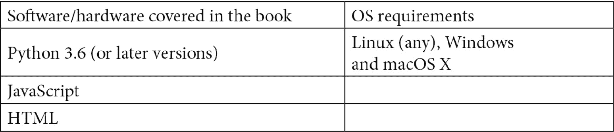

# 前言

深度强化学习使得构建智能代理、产品和服务成为可能，这些代理不仅仅局限于计算机视觉或感知，而是能够执行各种操作。TensorFlow 2.x 是最新的主要版本，是最流行的深度学习框架，广泛用于开发和训练**深度神经网络**（**DNNs**）。

本书首先介绍了深度强化学习的基础知识以及 TensorFlow 2.x 的最新主要版本。接着，你将学习 OpenAI Gym、基于模型的强化学习和无模型强化学习，并学习如何开发基本的代理。然后，你将发现如何实现高级深度强化学习算法，例如演员-评论家、深度确定性策略梯度、深度 Q 网络、近端策略优化、深度递归 Q 网络和软演员-评论家算法，以训练你的强化学习代理。你还将通过构建加密货币交易代理、股票/股市交易代理和用于自动化任务完成的智能代理来探索强化学习在实际中的应用。最后，你将了解如何将深度强化学习代理部署到云端，并使用 TensorFlow 2.x 构建适用于 Web、移动和其他平台的跨平台应用。

本书结束时，你将通过易于遵循的简洁实现，掌握深度强化学习算法的核心概念，并能够使用 TensorFlow 2.x 从头开始进行实现。

# 本书的读者对象

本书适用于机器学习应用开发人员、人工智能和应用人工智能研究人员、数据科学家、深度学习从业者，以及具有强化学习基础知识的学生，他们希望从零开始使用 TensorFlow 2.x 构建、训练和部署自己的强化学习系统。

# 本书涵盖的内容

*第一章*，*使用 TensorFlow 2.x 开发深度强化学习的构建模块*，提供了关于如何开始使用强化学习环境、基于深度神经网络的强化学习代理、进化神经代理以及其他用于离散和连续动作空间强化学习应用的构建模块的实现方法。

*第二章*，*实现基于价值的策略梯度和演员-评论家深度强化学习算法*，包括实现基于价值迭代的学习代理的实现方法，并将强化学习中几个基础算法的实现分解为简单步骤，例如蒙特卡洛控制、SARSA 和 Q 学习、演员-评论家以及策略梯度算法。

*第三章*，*实现高级强化学习算法*，提供了实现完整的代理训练系统的简明方法，使用的算法包括深度 Q 网络（DQN）、双重深度 Q 网络（DDQN、DDDQN）、深度递归 Q 网络（DRQN）、异步优势演员-评论家（A3C）、近端策略优化（PPO）和深度确定性策略梯度（DDPG）强化学习算法。

*第四章*，*现实世界中的强化学习* *–* *构建加密货币交易代理*，展示了如何在自定义 RL 环境中实现并训练一个软演员-评论家代理，使用来自交易所（如 Gemini）的真实市场数据进行比特币和以太坊交易，涵盖了表格和视觉（图像）状态/观测以及离散和连续动作空间。

*第五章*，*现实世界中的强化学习* *–* *构建股票/证券交易代理*，介绍了如何训练先进的 RL 代理，通过使用视觉价格图表和/或表格票据数据等，在由真实股票市场交易所数据驱动的自定义 RL 环境中进行股票市场交易以获取利润。

*第六章*，*现实世界中的强化学习* *–* *构建智能代理来完成您的待办事项*，提供了构建、训练和测试基于视觉的 RL 代理的食谱，用于在网络上完成任务，帮助您自动化诸如点击网页上的弹出/确认对话框、登录各大网站、查找并预订最便宜的机票、清理电子邮件收件箱、在社交媒体上进行点赞/分享/转发以与粉丝互动等任务。

*第七章*，*将深度强化学习代理部署到云端*，包含了帮助您超越潮流的工具和细节，使用深度 RL 构建基于云的模拟即服务（Simulation-as-a-Service）和代理/机器人即服务（Agent/Bot-as-a-Service）程序。学习如何使用运行在云端的远程模拟器训练 RL 代理，如何打包 RL 代理的运行时组件，并通过部署您自己的交易机器人即服务将深度 RL 代理部署到云端。

*第八章*，*加速深度 RL 代理开发的分布式训练*，包含了通过利用 TensorFlow 2.x 的功能，使用深度神经网络模型的分布式训练加速深度 RL 代理开发的食谱。学习如何利用单台机器或集群机器上的多个 CPU 和 GPU 来扩展深度 RL 代理训练，并学习如何利用 Ray、Tune 和 RLLib 进行大规模加速训练。

*第九章*，*在多个平台上部署深度 RL 代理*，提供了可定制的模板，您可以用来构建和部署您自己深度 RL 应用程序，以满足您的使用案例。学习如何将 RL 代理模型导出为各种生产就绪格式进行服务/部署，例如 TensorFlow Lite、TensorFlow.js 和 ONNX，并学习如何利用 NVIDIA Triton 或构建您自己的解决方案来启动生产就绪的基于 RL 的 AI 服务。您还将学习如何将 RL 代理部署到移动和网页应用，并如何在您的 Node.js 应用中部署 RL 机器人。

# 为了最大程度地利用本书

本书中的代码在 Ubuntu 18.04 和 Ubuntu 20.04 上进行了广泛测试，如果安装了 Python 3.6+，则应该能在更高版本的 Ubuntu 上正常运行。安装了 Python 3.6+以及每个示例开头列出的必要 Python 包后，代码也应该能够在 Windows 和 macOS X 上顺利运行。



建议创建并使用名为 tfrl-cookbook 的 Python 虚拟环境来安装包并运行本书中的代码。推荐使用 Miniconda 或 Anaconda 进行 Python 虚拟环境管理。

**如果你正在使用本书的数字版本，建议你自己输入代码，或者通过 GitHub 仓库访问代码（下节提供链接）。这样可以帮助你避免与代码复制粘贴相关的潜在错误。**

强烈建议你为 GitHub 仓库加星并进行分叉，以便接收代码示例的更新和改进。我们鼓励你分享你所构建的内容，并与其他读者和社区互动，访问[`github.com/PacktPublishing/Tensorflow-2-Reinforcement-Learning-Cookbook/discussions`](https://github.com/PacktPublishing/Tensorflow-2-Reinforcement-Learning-Cookbook/discussions)。

# 下载示例代码文件

你可以通过你的账户在[www.packt.com](http://www.packt.com)下载本书的示例代码文件。如果你在其他地方购买了本书，你可以访问[www.packtpub.com/support](http://www.packtpub.com/support)并注册，以便将文件直接通过电子邮件发送给你。

你可以通过以下步骤下载代码文件：

1.  在[www.packt.com](http://www.packt.com)登录或注册。

1.  选择**支持**选项卡。

1.  点击**代码下载**。

1.  在**搜索**框中输入书名，并按照屏幕上的说明操作。

下载完成后，请确保使用以下最新版本的工具解压或提取文件夹：

+   Windows 版的 WinRAR/7-Zip

+   Zipeg/iZip/UnRarX（适用于 Mac）

+   Linux 版的 7-Zip/PeaZip

本书的代码包也托管在 GitHub 上，地址为[`github.com/PacktPublishing/Tensorflow-2-Reinforcement-Learning-Cookbook/`](https://github.com/PacktPublishing/Tensorflow-2-Reinforcement-Learning-Cookbook/)。如果代码有更新，将会在现有的 GitHub 仓库中进行更新。

我们还提供了其他代码包，来自我们丰富的图书和视频目录，访问[`github.com/PacktPublishing/`](https://github.com/PacktPublishing/)。快去看看吧！

# 下载彩色图片

我们还提供了一份 PDF 文件，包含了本书中使用的截图/图表的彩色图片。你可以在这里下载：[`static.packt-cdn.com/downloads/9781838982546_ColorImages.pdf`](https://static.packt-cdn.com/downloads/9781838982546_ColorImages.pdf)。

# 使用的约定

本书中使用了多种文本约定。

`文本中的代码`：表示在配方中使用的代码词。例如：“我们将从在`Actor`类中实现`save`方法开始，以将 Actor 模型导出为 TensorFlow 的`SavedModel`格式。”

一段代码设置如下：

```py
def save(self, model_dir: str, version: int = 1):
    actor_model_save_dir = os.path.join(model_dir, "actor", str(version), "model.savedmodel")
    self.model.save(actor_model_save_dir, save_format="tf")
    print(f"Actor model saved at:{actor_model_save_dir}") 
```

当我们希望引起您对代码块中特定部分的注意时，相关行或项将设置为粗体：

```py
if args.agent != "SAC":
    print(f"Unsupported Agent: {args.agent}. Using SAC Agent")
    args.agent = "SAC"
    # Create an instance of the Soft Actor-Critic Agent
    agent = SAC(env.observation_space.shape, env.action_space) 
```

任何命令行输入或输出如下所示：

```py
(tfrl-cookbook)praveen@desktop:~/tensorflow2-reinforcement-learning-cookbook/src/ch7-cloud-deploy-deep-rl-agents$ python 3_training_rl_agents_using_remote_sims.py 
```

**粗体**：表示新术语、重要单词或您在屏幕上看到的单词。例如，菜单或对话框中的文字通常会以这种方式显示。以下是一个示例：“点击**打开现有项目**选项，您将看到一个弹出窗口，要求您选择文件系统中的目录。导航到*第九章*的配方，并选择**9.2_rl_android_app**。”

提示或重要注意事项

显示如下。

# 联系我们

我们始终欢迎读者的反馈。

`customercare@packtpub.com`。

**勘误**：尽管我们已尽最大努力确保内容的准确性，但错误有时仍会发生。如果您发现本书中的错误，请向我们报告。请访问[www.packtpub.com/support/errata](http://www.packtpub.com/support/errata)，选择您的书籍，点击“勘误提交表单”链接并填写详细信息。

`copyright@packt.com`，并附上相关链接。

**如果您有兴趣成为作者**：如果您在某个领域有专长，并且有意写作或为书籍做贡献，请访问[authors.packtpub.com](http://authors.packtpub.com)。

# 书评

请留下评论。当您阅读并使用完本书后，为什么不在您购买该书的网站上留下评论呢？潜在的读者可以看到并根据您的客观意见做出购买决定，我们 Packt 也能了解您对我们产品的看法，而我们的作者也能看到您对他们书籍的反馈。谢谢！

欲了解有关 Packt 的更多信息，请访问[packt.com](http://packt.com)。
