# 第一章：使用 Tensorflow 2.x 开发深度强化学习的构建模块

本章提供了 **深度强化学习**（**Deep RL**）基础的实际和具体描述，充满了使用最新主要版本 **TensorFlow 2.x** 实现构建模块的食谱。它包括启动 RL 环境、**OpenAI Gym**、开发基于神经网络的智能体以及用于解决具有离散和连续值空间的深度 RL 应用的进化神经智能体的食谱。

本章讨论了以下食谱：

+   构建训练 RL 智能体的环境和奖励机制

+   为离散动作空间和决策问题实现基于神经网络的 RL 策略

+   为连续动作空间和连续控制问题实现基于神经网络的 RL 策略

+   使用 OpenAI Gym 进行 RL 训练环境的工作

+   构建神经智能体

+   构建神经进化智能体

# 技术要求

本书中的代码已经在 Ubuntu 18.04 和 Ubuntu 20.04 上进行了广泛测试，只要 Python 3.6+ 可用，它应该也能在更高版本的 Ubuntu 上正常运行。安装 Python 3.6 以及书中每个食谱开始前列出的必要 Python 包后，代码也可以在 Windows 和 macOS X 上顺利运行。建议创建并使用名为 `tf2rl-cookbook` 的 Python 虚拟环境来安装包并运行本书中的代码。建议使用 Miniconda 或 Anaconda 安装 Python 虚拟环境管理工具。本章中每个食谱的完整代码可以在此获取：[`github.com/PacktPublishing/Tensorflow-2-Reinforcement-Learning-Cookbook`](https://github.com/PacktPublishing/Tensorflow-2-Reinforcement-Learning-Cookbook)。

# 构建训练 RL 智能体的环境和奖励机制

本食谱将引导你完成构建 **Gridworld** 学习环境的步骤，以训练 RL 智能体。Gridworld 是一个简单的环境，其中世界被表示为一个网格。网格中的每个位置可以称为一个单元格。智能体在这个环境中的目标是找到一条通往目标状态的路径，类似于这里展示的网格：

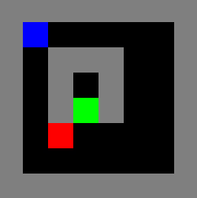

图 1.1 – Gridworld 环境的截图

智能体的位置由网格中的蓝色单元格表示，目标和地雷/炸弹/障碍物的位置分别通过绿色和红色单元格在网格中表示。智能体（蓝色单元格）需要找到一条穿越网格到达目标（绿色单元格）的路径，同时避免踩到地雷/炸弹（红色单元格）。

## 准备工作

要完成这个食谱，你首先需要激活 `tf2rl-cookbook` Python/Conda 虚拟环境并运行 `pip install numpy gym`。如果以下导入语句没有问题，那么你可以开始了！

```py
import copy
import sys
import gym
import numpy as np
```

现在我们可以开始了。

## 如何做到……

为了训练强化学习（RL）智能体，我们需要一个学习环境，类似于监督学习中使用的数据集。学习环境是一个模拟器，它为 RL 智能体提供观察，支持 RL 智能体通过执行动作来执行一组动作，并返回执行动作后获得的结果/新观察。

执行以下步骤来实现一个 Gridworld 学习环境，该环境表示一个简单的二维地图，具有不同颜色的单元格，表示智能体、目标、地雷/炸弹/障碍物、墙壁和空白空间在网格中的位置：

1.  我们首先定义不同单元格状态与其颜色代码之间的映射关系，以便在 Gridworld 环境中使用：

    ```py
    EMPTY = BLACK = 0
    WALL = GRAY = 1
    AGENT = BLUE = 2
    MINE = RED = 3
    GOAL = GREEN = 4
    SUCCESS = PINK = 5
    ```

1.  接下来，使用 RGB 强度值生成颜色映射：

    ```py
    COLOR_MAP = {
        BLACK: [0.0, 0.0, 0.0],
        GRAY: [0.5, 0.5, 0.5],
        BLUE: [0.0, 0.0, 1.0],
        RED: [1.0, 0.0, 0.0],
        GREEN: [0.0, 1.0, 0.0],
        PINK: [1.0, 0.0, 1.0],
    }
    ```

1.  现在让我们定义动作映射关系：

    ```py
    NOOP = 0
    DOWN = 1
    UP = 2
    LEFT = 3
    RIGHT = 4
    ```

1.  然后，我们创建一个`GridworldEnv`类，并定义一个`__init__`函数来定义必要的类变量，包括观察空间和动作空间：

    ```py
    class GridworldEnv():
    	def __init__(self):
    ```

    我们将在接下来的步骤中实现`__init__()`方法。

1.  在这一步中，让我们使用网格单元格状态映射来定义 Gridworld 环境的布局：

    ```py
    	self.grid_layout = """
            1 1 1 1 1 1 1 1
            1 2 0 0 0 0 0 1
            1 0 1 1 1 0 0 1
            1 0 1 0 1 0 0 1
            1 0 1 4 1 0 0 1
            1 0 3 0 0 0 0 1
            1 0 0 0 0 0 0 1
            1 1 1 1 1 1 1 1
            """
    ```

    在之前的布局中，`0`表示空白单元格，`1`表示墙壁，`2`表示智能体的起始位置，`3`表示地雷/炸弹/障碍物的位置，`4`表示目标位置，这些是根据我们在第一步中定义的映射关系。

1.  现在，我们准备定义 Gridworld RL 环境的观察空间：

    ```py
    	self.initial_grid_state = np.fromstring(
                        self.grid_layout, dtype=int, sep=" ")
    	self.initial_grid_state = \
                        self.initial_grid_state.reshape(8, 8)
    	self.grid_state = copy.deepcopy(
                                     self.initial_grid_state)
    	self.observation_space = gym.spaces.Box(
    		low=0, high=6, shape=self.grid_state.shape
    	)
    	self.img_shape = [256, 256, 3]
    	self.metadata = {"render.modes": ["human"]}
    ```

1.  让我们定义动作空间，以及动作与智能体在网格中移动之间的映射关系：

    ```py
    	   self.action_space = gym.spaces.Discrete(5)
            self.actions = [NOOP, UP, DOWN, LEFT, RIGHT]
            self.action_pos_dict = {
                NOOP: [0, 0],
                UP: [-1, 0],
                DOWN: [1, 0],
                LEFT: [0, -1],
                RIGHT: [0, 1],
            }
    ```

1.  现在让我们通过使用`get_state()`方法初始化智能体的起始状态和目标状态来完成`__init__`函数（我们将在下一步实现该方法）：

    ```py
    (self.agent_start_state, self.agent_goal_state,) = \
                                             self.get_state()
    ```

1.  现在我们需要实现`get_state()`方法，该方法返回 Gridworld 环境的起始状态和目标状态：

    ```py
    def get_state(self):
            start_state = np.where(self.grid_state == AGENT)
            goal_state = np.where(self.grid_state == GOAL)
            start_or_goal_not_found = not (start_state[0] \
                                           and goal_state[0])
            if start_or_goal_not_found:
                sys.exit(
                    "Start and/or Goal state not present in 
                     the Gridworld. "
                    "Check the Grid layout"
                )
            start_state = (start_state[0][0], 
                           start_state[1][0])
            goal_state = (goal_state[0][0], goal_state[1][0])
            return start_state, goal_state
    ```

1.  在这一步中，我们将实现`step(action)`方法来执行动作并获取下一个状态/观察、相关奖励以及是否结束回合：

    ```py
    def step(self, action):
            """return next observation, reward, done, info"""
            action = int(action)
            info = {"success": True}
            done = False
            reward = 0.0
            next_obs = (
                self.agent_state[0] + \
                    self.action_pos_dict[action][0],
                self.agent_state[1] + \
                    self.action_pos_dict[action][1],
            )
    ```

1.  接下来，指定奖励，最后返回`grid_state`、`reward`、`done`和`info`：

    ```py
     # Determine the reward
            if action == NOOP:
                return self.grid_state, reward, False, info
            next_state_valid = (
                next_obs[0] < 0 or next_obs[0] >= \
                                    self.grid_state.shape[0]
            ) or (next_obs[1] < 0 or next_obs[1] >= \
                                    self.grid_state.shape[1])
            if next_state_valid:
                info["success"] = False
                return self.grid_state, reward, False, info
            next_state = self.grid_state[next_obs[0], 
                                         next_obs[1]]
            if next_state == EMPTY:
                self.grid_state[next_obs[0], 
                                next_obs[1]] = AGENT
            elif next_state == WALL:
                info["success"] = False
                reward = -0.1
                return self.grid_state, reward, False, info
            elif next_state == GOAL:
                done = True
                reward = 1
            elif next_state == MINE:
                done = True
                reward = -1        # self._render("human")
            self.grid_state[self.agent_state[0], 
                            self.agent_state[1]] = EMPTY
            self.agent_state = copy.deepcopy(next_obs)
            return self.grid_state, reward, done, info
    ```

1.  接下来是`reset()`方法，它会在一个回合完成时（或者在请求重置环境时）重置 Gridworld 环境：

    ```py
    def reset(self):
            self.grid_state = copy.deepcopy(
                                     self.initial_grid_state)
            (self.agent_state, self.agent_goal_state,) = \
                                             self.get_state()
            return self.grid_state
    ```

1.  为了以更易于人类理解的方式可视化 Gridworld 环境的状态，让我们实现一个渲染函数，将我们在第五步中定义的`grid_layout`转换为图像并显示它。至此，Gridworld 环境的实现将完成！

    ```py
    def gridarray_to_image(self, img_shape=None):
            if img_shape is None:
                img_shape = self.img_shape
            observation = np.random.randn(*img_shape) * 0.0
            scale_x = int(observation.shape[0] / self.grid_\
                                             state.shape[0])
            scale_y = int(observation.shape[1] / self.grid_\
                                             state.shape[1])
            for i in range(self.grid_state.shape[0]):
                for j in range(self.grid_state.shape[1]):
                    for k in range(3):  # 3-channel RGB image
                        pixel_value = \
                          COLOR_MAP[self.grid_state[i, j]][k]
                        observation[
                            i * scale_x : (i + 1) * scale_x,
                            j * scale_y : (j + 1) * scale_y,
                            k,
                        ] = pixel_value
            return (255 * observation).astype(np.uint8)
        def render(self, mode="human", close=False):
            if close:
                if self.viewer is not None:
                    self.viewer.close()
                    self.viewer = None
                return
            img = self.gridarray_to_image()
            if mode == "rgb_array":
                return img
            elif mode == "human":
                from gym.envs.classic_control import \
                   rendering
                if self.viewer is None:
                    self.viewer = \
                            rendering.SimpleImageViewer()
                self.viewer.imshow(img)
    ```

1.  为了测试环境是否按预期工作，让我们添加一个`__main__`函数，该函数将在直接运行环境脚本时执行：

    ```py
    if __name__ == "__main__":
    	env = GridworldEnv()
    	obs = env.reset()
    	# Sample a random action from the action space
    	action = env.action_space.sample()
    	next_obs, reward, done, info = env.step(action)
    	print(f"reward:{reward} done:{done} info:{info}")
    	env.render()
    	env.close()
    ```

1.  一切就绪！Gridworld 环境已经准备好，我们可以通过运行脚本（`python envs/gridworld.py`）来快速测试它。将显示类似如下的输出：

    ```py
    reward:0.0 done:False info:{'success': True}
    ```

    还将显示以下 Gridworld 环境的渲染图：

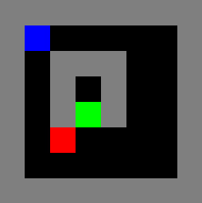

图 1.2 – Gridworld

现在让我们看看它是如何工作的！

## 它是如何工作的…

第 5 步中*如何实现…*部分定义的`grid_layout`表示学习环境的状态。Gridworld 环境定义了观察空间、动作空间和奖励机制，以实现`env.render()`方法将环境的内部网格表示转换为图像并显示，以便进行视觉理解。

# 为离散动作空间和决策问题实现基于神经网络的 RL 策略

许多强化学习（RL）环境（无论是模拟的还是实际的）要求 RL 智能体从一系列动作中选择一个动作，换句话说，执行离散动作。虽然简单的线性函数可以用来表示此类智能体的策略，但它们通常无法扩展到复杂问题。像（深度）神经网络这样的非线性函数逼近器可以逼近任意函数，甚至是解决复杂问题所需的函数。

基于神经网络的策略网络是高级 RL 和**深度 RL**的关键构建块，并将适用于一般的离散决策问题。

在本节结束时，你将实现一个基于神经网络的策略智能体，该智能体使用**TensorFlow 2.x**并能够在**Gridworld**环境中执行动作，并且（经过很少或不需要修改）可以在任何离散动作空间环境中运行。

## 准备开始

激活`tf2rl-cookbook` Python 虚拟环境，并运行以下命令来安装和导入相关包：

```py
pip install --upgrade numpy tensorflow tensorflow_probability seaborn 
import seaborn as sns
import tensorflow as tf
from tensorflow import keras
from tensorflow.keras import layers
import tensorflow_probability as tfp
```

让我们开始吧。

## 如何实现…

我们将看看智能体在离散动作空间环境中可以使用的策略分布类型：

1.  我们首先在 TensorFlow 2.x 中使用`tensorflow_probability`库创建一个二元策略分布：

    ```py
    binary_policy = tfp.distributions.Bernoulli(probs=0.5)
    for i in range(5):
        action = binary_policy.sample(1)
        print("Action:", action)
    ```

    前面的代码应输出如下内容：

    ```py
    Action: tf.Tensor([0], shape=(1,), dtype=int32)
    Action: tf.Tensor([1], shape=(1,), dtype=int32)
    Action: tf.Tensor([0], shape=(1,), dtype=int32)
    Action: tf.Tensor([1], shape=(1,), dtype=int32)
    Action: tf.Tensor([1], shape=(1,), dtype=int32)
    ```

    重要提示

    你得到的动作值将与这里显示的不同，因为它们是从伯努利分布中采样的，而这不是一个确定性过程。

1.  让我们快速可视化二元策略分布：

    ```py
    # Sample 500 actions from the binary policy distribution
    sample_actions = binary_policy.sample(500)
    sns.distplot(sample_actions)
    ```

    前面的代码将生成一个如图所示的分布图：

    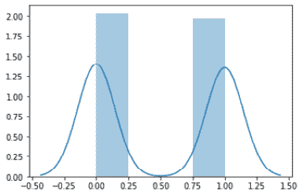

    图 1.3 – 二元策略的分布图

1.  在这一阶段，我们将实现一个离散的策略分布。一个单一离散变量的类别分布，具有*k*个有限类别，被称为**多项分布**。多项分布的推广是多次试验的多项分布，我们将使用它来表示离散策略分布：

    ```py
    action_dim = 4  # Dimension of the discrete action space
    action_probabilities = [0.25, 0.25, 0.25, 0.25]
    discrete_policy = tfp.distributions.Multinomial(probs=action_probabilities, total_count=1)
    for i in range(5):
        action = discrete_policy.sample(1)
        print(action)
    ```

    前面的代码应输出类似以下内容：

    ```py
    tf.Tensor([[0\. 0\. 0\. 1.]], shape=(1, 4), dtype=float32)
    tf.Tensor([[0\. 0\. 1\. 0.]], shape=(1, 4), dtype=float32)
    tf.Tensor([[0\. 0\. 1\. 0.]], shape=(1, 4), dtype=float32)
    tf.Tensor([[1\. 0\. 0\. 0.]], shape=(1, 4), dtype=float32)
    tf.Tensor([[0\. 1\. 0\. 0.]], shape=(1, 4), dtype=float32)
    ```

1.  接下来，我们将可视化离散的概率分布：

    ```py
    sns.distplot(discrete_policy.sample(1))
    ```

    前面的代码将生成一个分布图，类似于这里显示的`discrete_policy`：

    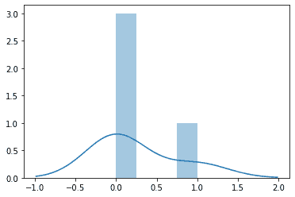

    图 1.4 – 离散策略的分布图

1.  然后，计算离散策略的熵：

    ```py
    def entropy(action_probs):
        return -tf.reduce_sum(action_probs * \
                          tf.math.log(action_probs), axis=-1)
    action_probabilities = [0.25, 0.25, 0.25, 0.25]
    print(entropy(action_probabilities))
    ```

1.  同时，实现一个离散策略类：

    ```py
    class DiscretePolicy(object):
        def __init__(self, num_actions):
            self.action_dim = num_actions
        def sample(self, actino_logits):
            self.distribution = tfp.distributions.Multinomial(logits=action_logits, total_count=1)
            return self.distribution.sample(1)
        def get_action(self, action_logits):
            action = self.sample(action_logits)
            return np.where(action)[-1]  
            # Return the action index
        def entropy(self, action_probabilities):
            return – tf.reduce_sum(action_probabilities * tf.math.log(action_probabilities), axis=-1)
    ```

1.  现在我们实现一个辅助方法，用于在给定环境中评估智能体：

    ```py
    def evaluate(agent, env, render=True):
        obs, episode_reward, done, step_num = env.reset(), 
                                              0.0, False, 0
        while not done:
            action = agent.get_action(obs)
            obs, reward, done, info = env.step(action)
            episode_reward += reward
            step_num += 1
            if render:
                env.render()
        return step_num, episode_reward, done, info
    ```

1.  现在，让我们使用 TensorFlow 2.x 实现一个神经网络大脑类：

    ```py
    class Brain(keras.Model):
        def __init__(self, action_dim=5, 
                     input_shape=(1, 8 * 8)):
            """Initialize the Agent's Brain model
            Args:
                action_dim (int): Number of actions
            """
            super(Brain, self).__init__()
            self.dense1 = layers.Dense(32, input_shape=\
                              input_shape, activation="relu")
            self.logits = layers.Dense(action_dim)
        def call(self, inputs):
            x = tf.convert_to_tensor(inputs)
            if len(x.shape) >= 2 and x.shape[0] != 1:
                x = tf.reshape(x, (1, -1))
            return self.logits(self.dense1(x))
        def process(self, observations):
    # Process batch observations using `call(inputs)` behind-the-scenes
            action_logits = \
                         self.predict_on_batch(observations)
            return action_logits
    ```

1.  现在，让我们实现一个简单的智能体类，使用`DiscretePolicy`对象在离散环境中进行操作：

    ```py
    class Agent(object):
        def __init__(self, action_dim=5, 
                     input_dim=(1, 8 * 8)):
            self.brain = Brain(action_dim, input_dim)
            self.policy = DiscretePolicy(action_dim)
        def get_action(self, obs):
            action_logits = self.brain.process(obs)
            action = self.policy.get_action(
                                np.squeeze(action_logits, 0))
            return action
    ```

1.  现在，让我们在`GridworldEnv`中测试智能体：

    ```py
    from envs.gridworld import GridworldEnv
    env = GridworldEnv()
    agent = Agent(env.action_space.n, 
                  env.observation_space.shape)
    steps, reward, done, info = evaluate(agent, env)
    print(f"steps:{steps} reward:{reward} done:{done} info:{info}")
    env.close()
    ```

这展示了如何实现策略。我们将在接下来的部分看到这一点是如何运作的。

## 它是如何工作的…

RL 智能体的核心组件之一是策略函数，它将观察与动作之间进行映射。形式上，策略是一个动作的分布，它规定了给定观察时选择某个动作的概率。

在智能体最多只能采取两个不同动作的环境中，例如，在二元动作空间中，我们可以使用**伯努利分布**来表示策略，其中采取动作 0 的概率由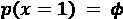给出，采取动作 1 的概率由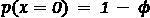给出，从而产生以下概率分布：

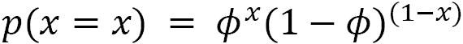

离散概率分布可以用来表示 RL 智能体的策略，当智能体可以在环境中采取*k*个可能的行动时。

从一般意义上讲，这种分布可以用来描述当随机变量可以取*k*个可能类别之一时的可能结果，因此也被称为**类别分布**。这是伯努利分布对 k 种事件的推广，因此是一个多项伯努利分布。

# 实现基于神经网络的 RL 策略，适用于连续动作空间和连续控制问题

强化学习已被用于许多控制问题中，取得了最先进的成果，不仅在像 Atari、围棋、国际象棋、将棋和星际争霸等各种游戏中，而且在现实世界的部署中，如暖通空调控制系统（HVAC）。

在动作空间是连续的环境中，意味着动作是实值的，需要使用实值的连续策略分布。当环境的动作空间包含实数时，可以使用连续概率分布来表示 RL 智能体的策略。从一般意义上讲，这种分布可以用来描述当随机变量可以取任何（实）值时，随机变量的可能结果。

一旦配方完成，你将拥有一个完整的脚本，控制一个在二维空间中驱车上坡的汽车，使用`MountainCarContinuous`环境和连续动作空间。`MountainCarContinuous`环境的截图如下：

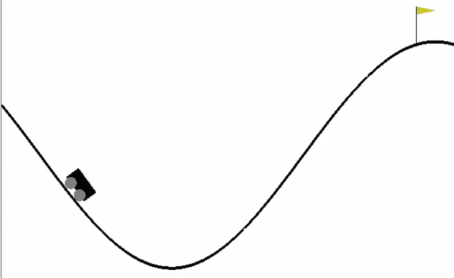

图 1.5 – MountainCarContinuous 环境的截图

## 准备工作

激活`tf2rl-cookbook` Conda Python 环境，并运行以下命令来安装和导入本食谱所需的 Python 包：

```py
pip install --upgrade tensorflow_probability
import tensorflow_probability as tfp
import seaborn as sns
```

让我们开始吧。

## 如何实现……

我们将首先通过`tensorflow_probability`库创建连续策略分布，并在此基础上构建必要的动作采样方法，以便为 RL 环境中给定的连续空间生成动作：

1.  我们使用`tensorflow_probability`库在 TensorFlow 2.x 中创建一个连续的策略分布。我们将使用高斯/正态分布来创建一个在连续值上的策略分布：

    ```py
    sample_actions = continuous_policy.sample(500)
    sns.distplot(sample_actions)
    ```

1.  接下来，我们可视化一个连续的策略分布：

    ```py
    sample_actions = continuous_policy.sample(500)
    sns.distplot(sample_actions)
    ```

    前面的代码将生成一个连续策略的分布图，类似于这里所示的图：

    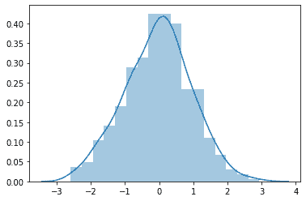

    图 1.6 – 连续策略的分布图

1.  现在，让我们使用高斯/正态分布实现一个连续策略分布：

    ```py
    mu = 0.0  # Mean = 0.0
    sigma = 1.0  # Std deviation = 1.0
    continuous_policy = tfp.distributions.Normal(loc=mu,
                                                 scale=sigma)
    # action = continuous_policy.sample(10)
    for i in range(10):
        action = continuous_policy.sample(1)
        print(action)
    ```

    前面的代码应当打印出类似于以下代码块中的内容：

    ```py
    tf.Tensor([-0.2527136], shape=(1,), dtype=float32)
    tf.Tensor([1.3262751], shape=(1,), dtype=float32)
    tf.Tensor([0.81889665], shape=(1,), dtype=float32)
    tf.Tensor([1.754675], shape=(1,), dtype=float32)
    tf.Tensor([0.30025303], shape=(1,), dtype=float32)
    tf.Tensor([-0.61728036], shape=(1,), dtype=float32)
    tf.Tensor([0.40142158], shape=(1,), dtype=float32)
    tf.Tensor([1.3219402], shape=(1,), dtype=float32)
    tf.Tensor([0.8791297], shape=(1,), dtype=float32)
    tf.Tensor([0.30356944], shape=(1,), dtype=float32)
    ```

    重要提示

    你得到的动作值将与这里显示的不同，因为它们是从高斯分布中采样的，而不是一个确定性的过程。

1.  现在，让我们更进一步，实施一个多维连续策略。**多元高斯分布**可以用来表示多维连续策略。此类策略对于在具有多维、连续且实数值动作空间的环境中行动的智能体非常有用：

    ```py
    mu = [0.0, 0.0]
    covariance_diag = [3.0, 3.0]
    continuous_multidim_policy = tfp.distributions.MultivariateNormalDiag(loc=mu, scale_diag=covariance_diag)
    # action = continuous_multidim_policy.sample(10)
    for i in range(10):
        action = continuous_multidim_policy.sample(1)
        print(action)
    ```

    前面的代码应当打印出类似以下内容：

    ```py
     tf.Tensor([[ 1.7003113 -2.5801306]], shape=(1, 2), dtype=float32)
    tf.Tensor([[ 2.744986  -0.5607129]], shape=(1, 2), dtype=float32)
    tf.Tensor([[ 6.696332  -3.3528223]], shape=(1, 2), dtype=float32)
    tf.Tensor([[ 1.2496299 -8.301748 ]], shape=(1, 2), dtype=float32)
    tf.Tensor([[2.0009246 3.557394 ]], shape=(1, 2), dtype=float32)
    tf.Tensor([[-4.491785  -1.0101566]], shape=(1, 2), dtype=float32)
    tf.Tensor([[ 3.0810184 -0.9008362]], shape=(1, 2), dtype=float32)
    tf.Tensor([[1.4185237 2.2145705]], shape=(1, 2), dtype=float32)
    tf.Tensor([[-1.9961193 -2.1251974]], shape=(1, 2), dtype=float32)
    tf.Tensor([[-1.2200387 -4.3516426]], shape=(1, 2), dtype=float32)
    ```

1.  在继续之前，让我们可视化多维连续策略：

    ```py
    sample_actions = continuous_multidim_policy.sample(500)
    sns.jointplot(sample_actions[:, 0], sample_actions[:, 1], kind='scatter')
    ```

    前面的代码将生成一个联合分布图，类似于这里所示的图：

    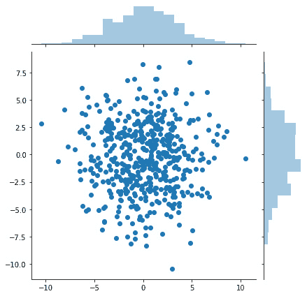

    图 1.7 – 多维连续策略的联合分布图

1.  现在，我们准备实现连续策略类：

    ```py
    class ContinuousPolicy(object):
        def __init__(self, action_dim):
            self.action_dim = action_dim
        def sample(self, mu, var):
            self.distribution = \
                tfp.distributions.Normal(loc=mu, scale=sigma)
            return self.distribution.sample(1)
        def get_action(self, mu, var):
            action = self.sample(mu, var)
            return action
    ```

1.  下一步，让我们实现一个多维连续策略类：

    ```py
    import tensorflow_probability as tfp
    import numpy as np
    class ContinuousMultiDimensionalPolicy(object):
        def __init__(self, num_actions):
            self.action_dim = num_actions
        def sample(self, mu, covariance_diag):
            self.distribution = tfp.distributions.\
                             MultivariateNormalDiag(loc=mu,
                             scale_diag=covariance_diag)
            return self.distribution.sample(1)
        def get_action(self, mu, covariance_diag):
            action = self.sample(mu, covariance_diag)
            return action
    ```

1.  现在，让我们实现一个函数，在具有连续动作空间的环境中评估智能体，以评估每一回合的表现：

    ```py
    def evaluate(agent, env, render=True):
        obs, episode_reward, done, step_num = env.reset(),
                                              0.0, False, 0
        while not done:
            action = agent.get_action(obs)
            obs, reward, done, info = env.step(action)
            episode_reward += reward
            step_num += 1
            if render:
                env.render()
        return step_num, episode_reward, done, info
    ```

1.  我们现在准备在一个连续动作环境中测试智能体：

    ```py
    from neural_agent import Brain
    import gym
    env = gym.make("MountainCarContinuous-v0")Implementing a Neural-network Brain class using TensorFlow 2.x. 
              class Brain(keras.Model):
        def __init__(self, action_dim=5, 
                     input_shape=(1, 8 * 8)):
            """Initialize the Agent's Brain model
            Args:
                action_dim (int): Number of actions
            """
            super(Brain, self).__init__()
            self.dense1 = layers.Dense(32, 
                  input_shape=input_shape, activation="relu")
            self.logits = layers.Dense(action_dim)
        def call(self, inputs):
            x = tf.convert_to_tensor(inputs)
            if len(x.shape) >= 2 and x.shape[0] != 1:
                x = tf.reshape(x, (1, -1))
            return self.logits(self.dense1(x))
        def process(self, observations):
            # Process batch observations using `call(inputs)`
            # behind-the-scenes
            action_logits = \
                self.predict_on_batch(observations)
            return action_logits
    ```

1.  让我们实现一个简单的智能体类，利用`ContinuousPolicy`对象在连续动作空间环境中进行操作：

    ```py
    class Agent(object):
        def __init__(self, action_dim=5, 
                     input_dim=(1, 8 * 8)):
            self.brain = Brain(action_dim, input_dim)
            self.policy = ContinuousPolicy(action_dim)
        def get_action(self, obs):
            action_logits = self.brain.process(obs)
            action = self.policy.get_action(*np.\
                            squeeze(action_logits, 0))
            return action
    ```

1.  最后一步，我们将在一个连续动作空间环境中测试智能体的性能：

    ```py
    from neural_agent import Brain
    import gym
    env = gym.make("MountainCarContinuous-v0") 
    action_dim = 2 * env.action_space.shape[0]  
        # 2 values (mu & sigma) for one action dim
    agent = Agent(action_dim, env.observation_space.shape)
    steps, reward, done, info = evaluate(agent, env)
    print(f"steps:{steps} reward:{reward} done:{done} info:{info}")
    env.close()
    ```

    前面的脚本将调用`MountainCarContinuous`环境，渲染到屏幕上，并展示智能体在这个连续动作空间环境中的表现：

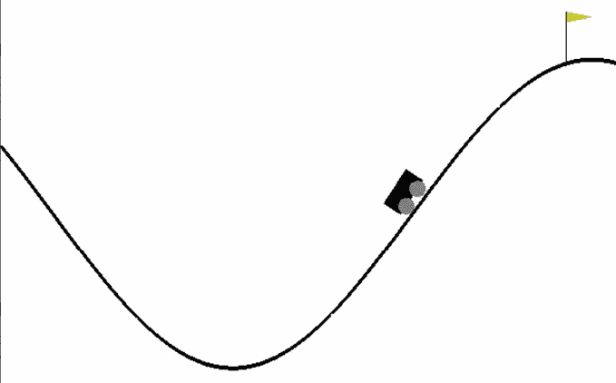

图 1.8 – MountainCarContinuous-v0 环境中代理的截图

接下来，让我们探索它是如何工作的。

## 如何操作…

我们为 RL 代理实现了一个使用**高斯分布**的连续值策略。高斯分布，也称为**正态分布**，是最广泛使用的实数分布。它通过两个参数表示：µ和σ。我们通过从分布中抽样，基于由以下公式给出的概率密度，生成这种策略的连续值动作：

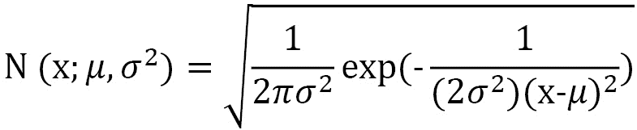

**多元正态分布**将正态分布扩展到多个变量。我们使用这种分布来生成多维连续策略。

# 使用 OpenAI Gym 进行 RL 训练环境的工作

本篇提供了一个快速指南，帮助你快速启动并运行 OpenAI Gym 环境。Gym 环境和接口为训练 RL 代理提供了一个平台，是目前最广泛使用和接受的 RL 环境接口。

## 准备工作

我们将需要完整安装 OpenAI Gym，以便能够使用可用的环境。请按照[`github.com/openai/gym#id5`](https://github.com/openai/gym#id5)中列出的 Gym 安装步骤进行操作。

至少，你应该执行以下命令：

```py
pip install gym[atari]
```

## 如何操作…

让我们从选择一个环境并探索 Gym 接口开始。你可能已经熟悉了前面食谱中用于创建 Gym 环境的基本函数调用。

你的步骤应该按以下格式排列：

1.  让我们首先探索 Gym 中的环境列表：

    ```py
    #!/usr/bin/env python
    from gym import envs
    env_names = [spec.id for spec in envs.registry.all()]
    for name in sorted(env_names):
        print(name)
    ```

1.  这个脚本将打印出通过你的 Gym 安装可用的所有环境的名称，按字母顺序排序。你可以使用以下命令运行这个脚本，查看已安装并可用的环境名称。你应该能看到列出的一长串环境。前几个环境在以下截图中提供，供你参考：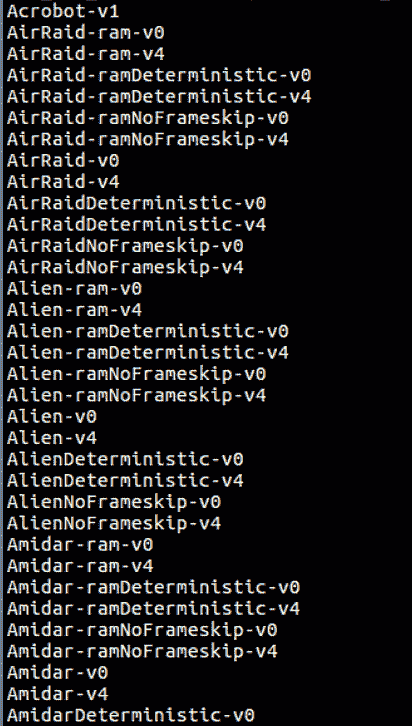

    图 1.9 – 使用 openai-gym 包可用的环境列表

    现在让我们来看一下如何运行其中一个 Gym 环境。

1.  以下脚本将让你探索任何可用的 Gym 环境：

    ```py
    #!/usr/bin/env python
    import gym
    import sys
    def run_gym_env(argv):
        env = gym.make(argv[1]) # Name of the environment 
                                # supplied as 1st argument
        env.reset()
        for _ in range(int(argv[2])):
            env.render()
            env.step(env.action_space.sample())
        env.close()
    if __name__ == "__main__":
        run_gym_env(sys.argv)
    ```

1.  你可以将前面的脚本保存为`run_gym_env.py`，然后像这样运行脚本：

    ```py
    Alien-v4 environment, which should look like the following screenshot:
    ```

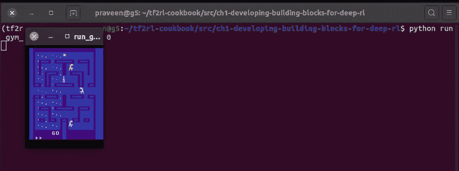

图 1.10 – 使用 Alien-v4 1000 作为参数的 run_gym_env.py 样本输出

提示

你可以将`Alien-v4`更改为上一步骤中列出的任何可用 Gym 环境。

## 如何操作…

以下表格总结了 Gym 环境的工作原理：

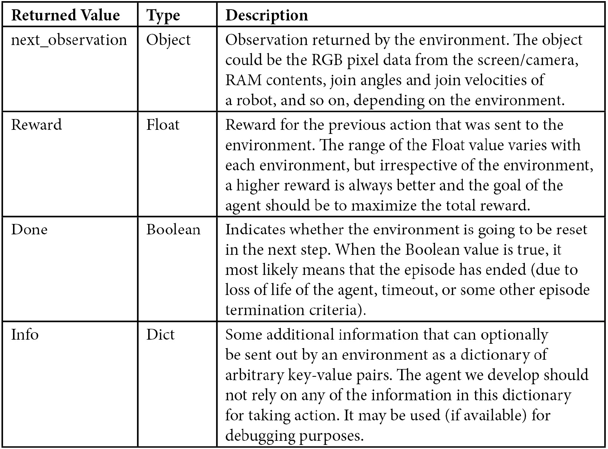

表 1.1 – Gym 环境接口概述

## 参见

您可以在这里找到有关 OpenAI Gym 的更多信息：[`gym.openai.com/`](http://gym.openai.com/)。

# 构建一个神经代理

本教程将指导您完成构建完整代理和代理-环境交互循环的步骤，这是任何强化学习应用程序的主要构建块。完成教程后，您将拥有一个可执行脚本，其中一个简单代理尝试在 Gridworld 环境中执行动作。您建立的代理可能会执行如下截图所示的操作：

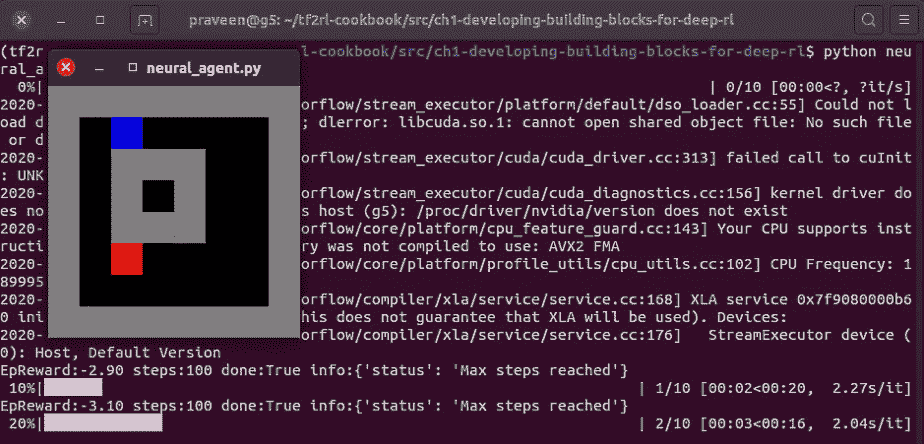

图 1.11 – neural_agent.py 脚本输出的截图

## 准备工作

让我们开始通过激活`tf2rl-cookbook`的 Conda Python 环境，并运行以下代码来安装和导入必要的 Python 模块：

```py
pip install tensorflow gym tqdm  # Run this line in a terminal
```

import tensorflow as tf

```py
from tensorflow import keras
from tensorflow.keras import layers
import gym
import envs
from tqdm import tqdm
```

## 如何操作…

我们将首先实现由 TensorFlow 2.x 驱动的 Brain 类，其基于神经网络实现：

1.  让我们首先使用 TensorFlow 2.x 和 Keras 函数 API 初始化一个神经脑模型：

    ```py
    class Brain(keras.Model):
        def __init__(self, action_dim=5, 
                       input_shape=(1, 8 * 8)):
            """Initialize the Agent's Brain model
            Args:
                action_dim (int): Number of actions
            """
            super(Brain, self).__init__()
            self.dense1 = layers.Dense(32, input_shape= \
                              input_shape, activation="relu")
            self.logits = layers.Dense(action_dim)
    ```

1.  接下来，我们实现`Brain`类的`call(…)`方法：

    ```py
    def call(self, inputs):
            x = tf.convert_to_tensor(inputs)
            if len(x.shape) >= 2 and x.shape[0] != 1:
                x = tf.reshape(x, (1, -1))
            return self.logits(self.dense1(x))
    ```

1.  现在我们需要实现 Brain 类的`process()`方法，方便地对一批输入/观测进行预测：

    ```py
    def process(self, observations):
            # Process batch observations using `call(inputs)`
            # behind-the-scenes
            action_logits = \
                self.predict_on_batch(observations)
            return action_logits
    ```

1.  现在让我们实现代理类的 init 函数：

    ```py
    class Agent(object):
        def __init__(self, action_dim=5, 
                     input_shape=(1, 8 * 8)):
            """Agent with a neural-network brain powered
               policy
            Args:
                brain (keras.Model): Neural Network based 
            model
            """
            self.brain = Brain(action_dim, input_shape)
            self.policy = self.policy_mlp
    ```

1.  现在让我们为代理定义一个简单的策略函数：

    ```py
    def policy_mlp(self, observations):
            observations = observations.reshape(1, -1)
            # action_logits = self.brain(observations)
            action_logits = self.brain.process(observations)
            action = tf.random.categorical(tf.math.\
                           log(action_logits), num_samples=1)
            return tf.squeeze(action, axis=1)
    ```

1.  然后，让我们为代理实现一个方便的`get_action`方法：

    ```py
    def get_action(self, observations):
            return self.policy(observations)
    ```

1.  现在让我们创建一个`learn()`的占位函数，将作为未来教程中 RL 算法实现的一部分：

    ```py
    def learn(self, samples):
            raise NotImplementedError
    ```

    这完成了我们基本代理的实现及所需的组成部分！

1.  现在让我们在给定环境中为代理评估一个 episode：

    ```py
    def evaluate(agent, env, render=True):
        obs, episode_reward, done, step_num = env.reset(),
                                              0.0, False, 0
        while not done:
            action = agent.get_action(obs)
            obs, reward, done, info = env.step(action)
            episode_reward += reward
            step_num += 1
            if render:
                env.render()
        return step_num, episode_reward, done, info
    ```

1.  最后，让我们实现主函数：

    ```py
    if __name__ == "__main__":
        env = gym.make("Gridworld-v0")
        agent = Agent(env.action_space.n, 
                      env.observation_space.shape)
        for episode in tqdm(range(10)):
            steps, episode_reward, done, info = \
                                         evaluate(agent, env)
            print(f"EpReward:{episode_reward:.2f}\
                   steps:{steps} done:{done} info:{info}")
        env.close()
    ```

1.  按以下方式执行脚本：

    ```py
    python neural_agent.py
    ```

    您应该看到 Gridworld 环境 GUI 弹出。这将显示代理在环境中的操作，看起来像以下截图所示：

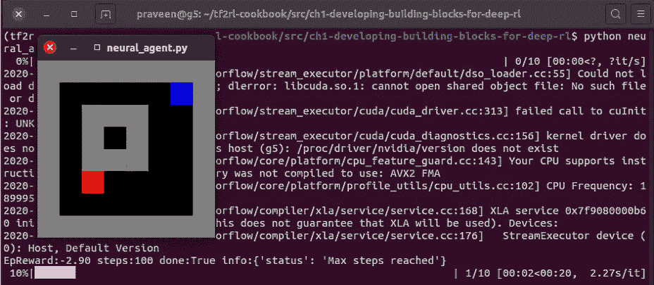

图 1.12 – 神经代理在 Gridworld 环境中执行操作的截图

这提供了一个简单但完整的配方，用于构建一个代理和代理-环境交互循环。剩下的就是向`learn()`方法添加您选择的 RL 算法，代理将开始智能地行动！

## 工作原理…

本教程汇集了构建完整代理-环境系统的必要组成部分。`Brain`类实现了作为代理处理单元的神经网络，代理类利用`Brain`类和一个简单的策略，在处理从环境接收到的观测后基于脑的输出选择动作。

我们将`Brain`类实现为`keras.Model`类的子类，这使我们能够为智能体的大脑定义一个自定义的基于神经网络的模型。`__init__`方法初始化`Brain`模型并使用`Brain`模型定义所需的层，我们创建了两个`__init__`方法，`call(…)`方法也是一个必须由继承自`keras.Model`类的子类实现的方法。`call(…)`方法首先将输入转换为 TensorFlow 2.x 张量，然后将输入展平为形状为`1 x total_number_of_elements`的输入张量。例如，如果输入数据的形状是 8 x 8（8 行 8 列），数据首先被转换为张量，形状展平为 1 x 8 * 8 = 1 x 64。然后，展平后的输入通过包含 32 个神经元和 ReLU 激活函数的 dense1 层进行处理。最后，logits 层处理来自前一层的输出，并产生 n 个输出，分别对应动作维度（n）。

`predict_on_batch(…)`方法对作为参数提供的一批输入进行预测。与**Keras**的`predict()`函数不同，这个函数假设提供的输入（观测值）正好是一批输入，因此将这批输入直接传递给网络，而不再进一步拆分输入数据。

然后，我们实现了`Agent`类，并在智能体初始化函数中通过定义以下内容创建了一个`Brain`类的对象实例：

```py
self.brain = Brain(action_dim, input_shape)
```

在这里，`input_shape`是大脑预计处理的输入形状，`action_dim`是大脑预计输出的形状。智能体的策略被定义为来自前述配方的自定义`DiscretePolicy`，以初始化智能体的策略。

智能体的策略函数`policy_mlp`会展平输入观测值，并将其发送到智能体的大脑进行处理，得到`action_logits`，即动作的未归一化概率。最终的动作是通过使用 TensorFlow 2.x 的`categorical`方法从随机模块中获取的，该方法从给定的`action_logits`（未归一化概率）中采样一个有效的动作。

重要提示

如果提供给`predict_on_batch`函数的所有观测值无法在给定的 GPU 内存或 RAM（CPU）中容纳，则此操作可能导致 GPU **内存溢出**（**OOM**）错误。

如果直接运行`neural_agent.py`脚本，启动的主函数会创建一个 Gridworld-v0 环境实例，使用该环境的动作空间和观测空间初始化一个智能体，并开始对智能体进行 10 轮评估。

# 构建一个神经进化智能体

进化方法基于黑盒优化，也被称为无梯度方法，因为它不涉及梯度计算。本食谱将指导你实现一个简单的基于交叉熵的神经进化代理，使用 **TensorFlow 2.x**。

## 准备工作

激活 `tf2rl-cookbook` Python 环境并导入以下运行此食谱所需的包：

```py
from collections import namedtuple
import gym
import matplotlib.pyplot as plt
import numpy as np
import tensorflow as tf
from tensorflow import keras
from tensorflow.keras import layers
from tqdm import tqdm
import envs
```

安装了所需的包后，我们准备开始了。

## 如何做到……

让我们将本章所学的所有内容结合起来，构建一个神经代理，通过进化过程改进其策略，以在 Gridworld 环境中导航：

1.  让我们从 `neural_agent.py` 导入基本的神经代理和 Brain 类：

    ```py
    from neural_agent import Agent, Brain
    from envs.gridworld import GridworldEnv
    ```

1.  接下来，让我们实现一个方法，在给定的环境中滚动代理进行一轮，并返回 `obs_batch`、`actions_batch` 和 `episode_reward`：

    ```py
    def rollout(agent, env, render=False):
        obs, episode_reward, done, step_num = env.reset(),
    							 0.0, False, 0
        observations, actions = [], []
        episode_reward = 0.0
        while not done:
            action = agent.get_action(obs)
            next_obs, reward, done, info = env.step(action)
            # Save experience
            observations.append(np.array(obs).reshape(1, -1))  	        # Convert to numpy & reshape (8, 8) to (1, 64)
            actions.append(action)
            episode_reward += reward

            obs = next_obs
            step_num += 1
            if render:
                env.render()
        env.close()
        return observations, actions, episode_reward
    ```

1.  现在让我们测试轨迹滚动方法：

    ```py
    env = GridworldEnv()
    # input_shape = (env.observation_space.shape[0] * \
                     env.observation_space.shape[1], )
    brain = Brain(env.action_space.n)
    agent = Agent(brain)
    obs_batch, actions_batch, episode_reward = rollout(agent,
                                                       env)
    ```

1.  现在，是时候验证使用滚动操作生成的经验数据是否一致了：

    ```py
    assert len(obs_batch) == len(actions_batch)
    ```

1.  现在让我们滚动多个完整的轨迹以收集经验数据：

    ```py
    # Trajectory: (obs_batch, actions_batch, episode_reward)
    # Rollout 100 episodes; Maximum possible steps = 100 * 100 = 10e4
    trajectories = [rollout(agent, env, render=True) \
                    for _ in tqdm(range(100))]
    ```

1.  然后我们可以从经验数据样本中可视化奖励分布。我们还将在收集的经验数据中的期望奖励值的第 50 百分位处绘制一条红色竖线：

    ```py
    from tqdm.auto import tqdm
    import matplotlib.pyplot as plt
    %matplotlib inline
    sample_ep_rewards = [rollout(agent, env)[-1] for _ in \
                         tqdm(range(100))]
    plt.hist(sample_ep_rewards, bins=10, histtype="bar");
    ```

    运行此代码将生成一个如下面图所示的图表：

    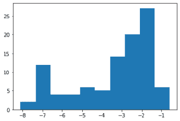

    图 1.13 – 期望奖励值的直方图

1.  现在让我们创建一个用于存储轨迹的容器：

    ```py
    from collections import namedtuple
    Trajectory = namedtuple("Trajectory", ["obs", "actions",
                                           "reward"])
    # Example for understanding the operations:
    print(Trajectory(*(1, 2, 3)))
    # Explanation: `*` unpacks the tuples into individual 
    # values
    Trajectory(*(1, 2, 3)) == Trajectory(1, 2, 3)
    # The rollout(...) function returns a tuple of 3 values: 
    # (obs, actions, rewards)
    # The Trajectory namedtuple can be used to collect 
    # and store mini batch of experience to train the neuro 
    # evolution agent
    trajectories = [Trajectory(*rollout(agent, env)) \
                    for _ in range(2)]
    ```

1.  现在是时候为进化过程选择精英经验了：

    ```py
    def gather_elite_xp(trajectories, elitism_criterion):
        """Gather elite trajectories from the batch of 
           trajectories
        Args:
            batch_trajectories (List): List of episode \
            trajectories containing experiences (obs,
                                      actions,episode_reward)
        Returns:
            elite_batch_obs
            elite_batch_actions
            elite_reard_threshold

        """
        batch_obs, batch_actions, 
        batch_rewards = zip(*trajectories)
        reward_threshold = np.percentile(batch_rewards,
                                         elitism_criterion)
        indices = [index for index, value in enumerate(
                 batch_rewards) if value >= reward_threshold]

        elite_batch_obs = [batch_obs[i] for i in indices]
        elite_batch_actions = [batch_actions[i] for i in \
                                indices]
        unpacked_elite_batch_obs = [item for items in \
                           elite_batch_obs for item in items]
        unpacked_elite_batch_actions = [item for items in \
                       elite_batch_actions for item in items]
        return np.array(unpacked_elite_batch_obs), \
               np.array(unpacked_elite_batch_actions), \
               reward_threshold
    ```

1.  现在让我们测试精英经验收集例程：

    ```py
    elite_obs, elite_actions, reward_threshold = gather_elite_xp(trajectories, elitism_criterion=75)
    ```

1.  现在让我们看一下如何实现一个帮助方法，将离散的动作索引转换为 one-hot 编码向量或动作概率分布：

    ```py
    def gen_action_distribution(action_index, action_dim=5):
        action_distribution = np.zeros(action_dim).\
                                   astype(type(action_index))
        action_distribution[action_index] = 1
        action_distribution = \
                       np.expand_dims(action_distribution, 0)
        return action_distribution
    ```

1.  现在是测试动作分布生成函数的时候了：

    ```py
    elite_action_distributions = np.array([gen_action_distribution(a.item()) for a in elite_actions])
    ```

1.  现在，让我们使用 Keras 函数式 API 在 TensorFlow 2.x 中创建并编译神经网络大脑：

    ```py
    brain = Brain(env.action_space.n)
    brain.compile(loss="categorical_crossentropy", optimizer="adam", metrics=["accuracy"])
    ```

1.  你现在可以按如下方式测试大脑训练循环：

    ```py
    elite_obs, elite_action_distributions = elite_obs.astype("float16"), elite_action_distributions.astype("float16")
    brain.fit(elite_obs, elite_action_distributions, batch_size=128, epochs=1);
    ```

    这应该会产生以下输出：

    ```py
    1/1 [==============================] - 0s 960us/step - loss: 0.8060 - accuracy: 0.4900
    ```

    提示

    数值可能会有所不同。

1.  下一大步是实现一个代理类，可以通过大脑初始化并在环境中行动：

    ```py
    class Agent(object):
        def __init__(self, brain):
            """Agent with a neural-network brain powered 
               policy
            Args:
                brain (keras.Model): Neural Network based \
                model
            """
            self.brain = brain
            self.policy = self.policy_mlp
        def policy_mlp(self, observations):
            observations = observations.reshape(1, -1)
            action_logits = self.brain.process(observations)
            action = tf.random.categorical(
                   tf.math.log(action_logits), num_samples=1)
            return tf.squeeze(action, axis=1)
        def get_action(self, observations):
            return self.policy(observations)
    ```

1.  接下来，我们将实现一个帮助函数，用于评估给定环境中的代理：

    ```py
    def evaluate(agent, env, render=True):
        obs, episode_reward, done, step_num = env.reset(),
                                              0.0, False, 0
        while not done:
            action = agent.get_action(obs)
            obs, reward, done, info = env.step(action)
            episode_reward += reward
            step_num += 1
            if render:
                env.render()
        return step_num, episode_reward, done, info
    ```

1.  现在让我们测试代理评估循环：

    ```py
    env = GridworldEnv()
    agent = Agent(brain)
    for episode in tqdm(range(10)):
        steps, episode_reward, done, info = evaluate(agent,
                                                     env)
    env.close()
    ```

1.  下一步，让我们定义训练循环的参数：

    ```py
    total_trajectory_rollouts = 70
    elitism_criterion = 70  # percentile
    num_epochs = 200
    mean_rewards = []
    elite_reward_thresholds = []
    ```

1.  现在让我们创建 `environment`、`brain` 和 `agent` 对象：

    ```py
    env = GridworldEnv()
    input_shape = (env.observation_space.shape[0] * \
                   env.observation_space.shape[1], )
    brain = Brain(env.action_space.n)
    brain.compile(loss="categorical_crossentropy",
                  optimizer="adam", metrics=["accuracy"])
    agent = Agent(brain)
    for i in tqdm(range(num_epochs)):
        trajectories = [Trajectory(*rollout(agent, env)) \
                   for _ in range(total_trajectory_rollouts)]
        _, _, batch_rewards = zip(*trajectories)
        elite_obs, elite_actions, elite_threshold = \
                       gather_elite_xp(trajectories, 
                       elitism_criterion=elitism_criterion)
        elite_action_distributions = \
            np.array([gen_action_distribution(a.item()) \
                         for a in elite_actions])
        elite_obs, elite_action_distributions = \
            elite_obs.astype("float16"), 
            elite_action_distributions.astype("float16")
        brain.fit(elite_obs, elite_action_distributions, 
                  batch_size=128, epochs=3, verbose=0);
        mean_rewards.append(np.mean(batch_rewards))
        elite_reward_thresholds.append(elite_threshold)
        print(f"Episode#:{i + 1} elite-reward-\
              threshold:{elite_reward_thresholds[-1]:.2f} \
              reward:{mean_rewards[-1]:.2f} ")
    plt.plot(mean_rewards, 'r', label="mean_reward")
    plt.plot(elite_reward_thresholds, 'g', 
             label="elites_reward_threshold")
    plt.legend()
    plt.grid()
    plt.show()
    ```

    这将生成一个如下面图所示的图表：

    重要提示

    期望奖励将有所不同，图表可能看起来不同。

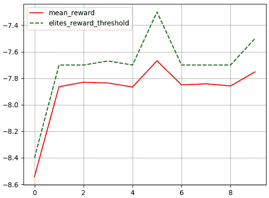

图 1.14 – 平均奖励（实线，红色）和精英奖励阈值（虚线，绿色）的图

图中的实线表示神经进化代理获得的平均回报，虚线则表示用于确定精英的回报阈值。

## 它是如何工作的……

在每次迭代中，进化过程会展开或收集一系列轨迹，通过使用当前神经网络权重来构建经验数据，这些权重位于代理的大脑中。然后，会采用精英选择过程，基于该轨迹中获得的回报来挑选出前* k *百分位（精英标准）的轨迹/经验。接着，这些筛选出的经验数据将用于更新代理的大脑模型。这个过程会重复预设的迭代次数，从而使代理的大脑模型不断改进，并收集更多的回报。

## 另请参见

欲了解更多信息，我建议阅读 *CMA 进化策略：教程*：[`arxiv.org/pdf/1604.00772.pdf`](https://arxiv.org/pdf/1604.00772.pdf)。
