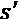

# 第二章：实现基于值、基于策略和演员-评论员深度 RL 算法

本章提供了一种实际的方法，用于构建基于值、基于策略和基于演员-评论员算法的**强化学习**（**RL**）智能体。它包括实现基于值迭代的学习智能体的食谱，并将 RL 中几个基础算法的实现细节分解为简单的步骤。基于策略梯度的智能体和演员-评论员智能体使用最新版本的**TensorFlow 2.x**来定义神经网络策略。

本章将涵盖以下食谱：

+   构建用于训练 RL 智能体的随机环境

+   构建基于值的（RL）智能体算法

+   实现时序差分学习

+   为 RL 构建蒙特卡罗预测和控制算法

+   实现 SARSA 算法和 RL 智能体

+   构建 Q-learning 智能体

+   实现策略梯度

+   实现演员-评论员算法

开始吧！

# 技术要求

本书中的代码已在 Ubuntu 18.04 和 Ubuntu 20.04 上进行了广泛测试，并应当能在更高版本的 Ubuntu 上运行，只要安装了 Python 3.6+。在安装了 Python 3.6 以及每个食谱开头列出的必要 Python 包后，代码也应该可以在 Windows 和 Mac OS X 上运行。建议你创建并使用名为`tf2rl-cookbook`的 Python 虚拟环境来安装包并运行本书中的代码。推荐安装 Miniconda 或 Anaconda 来进行 Python 虚拟环境管理。

每个章节中每个食谱的完整代码可以在这里找到：[`github.com/PacktPublishing/Tensorflow-2-Reinforcement-Learning-Cookbook`](https://github.com/PacktPublishing/Tensorflow-2-Reinforcement-Learning-Cookbook)。

# 构建用于训练 RL 智能体的随机环境

要为现实世界训练 RL 智能体，我们需要随机的学习环境，因为现实世界问题本质上是随机的。本食谱将带你一步步构建一个**迷宫**学习环境来训练 RL 智能体。迷宫是一个简单的随机环境，世界被表示为一个网格。网格上的每个位置可以称为一个单元格。这个环境中智能体的目标是找到通往目标状态的道路。考虑下图中的迷宫，其中黑色单元格表示墙壁：


图 2.1 – 迷宫环境

智能体的位置初始化为位于迷宫的左上角单元格。智能体需要绕过网格，找到通往迷宫右上角目标单元格的路径，在此过程中收集最多数量的金币，同时避免碰到墙壁。目标位置、金币、墙壁和智能体的起始位置可以在环境代码中修改。

该环境中支持的四维离散动作如下：

+   *0*: 向上移动

+   *1*: 向下移动

+   *2*: 向左移动

+   *3*: 向右移动

奖励基于智能体在到达目标状态之前收集的硬币数量。由于环境具有随机性，环境执行的动作有 0.1 的概率发生“滑动”，即实际执行的动作会随机发生变化。滑动动作将是顺时针方向的动作（左 -> 上，上 -> 右，依此类推）。例如，当`slip_probability=0.2`时，右移动作有 0.2 的概率会变成下移。

## 准备中

要完成此任务，您需要激活`tf2rl-cookbook` Python/conda 虚拟环境，并运行`pip install -r requirements.txt`。如果以下导入语句运行没有问题，那么您可以开始了：

```py
import gym
import numpy as np
```

现在，我们可以开始了。

## 如何做……

学习环境是一个模拟器，提供 RL 智能体的观察，支持 RL 智能体可以执行的一组动作，并返回执行动作后得到的新观察结果。

按照以下步骤实现一个随机迷宫学习环境，表示一个简单的二维地图，单元格代表智能体的位置、目标、墙壁、硬币和空白区域：

1.  我们将首先定义 MazeEnv 类和迷宫环境的地图：

    ```py
    class MazeEnv(gym.Env):
        def __init__(self, stochastic=True):
            """Stochastic Maze environment with coins,\
               obstacles/walls and a goal state.  
            """
            self.map = np.asarray(["SWFWG", "OOOOO", "WOOOW",
                                   "FOWFW"])
    ```

1.  接下来，将障碍物/墙壁放置在环境地图的适当位置：

    ```py
            self.dim = (4, 5)
            self.img_map = np.ones(self.dim)
            self.obstacles = [(0, 1), (0, 3), (2, 0), 
                              (2, 4), (3, 2), (3, 4)]
            for x in self.obstacles:
                self.img_map[x[0]][x[1]] = 0
    ```

1.  让我们定义顺时针方向的滑动映射动作：

    ```py
    self.slip_action_map = {
                0: 3,
                1: 2,
                2: 0,
                3: 1,
            }
    ```

1.  现在，让我们定义一个字典形式的查找表，将索引映射到迷宫环境中的单元格：

    ```py
    self.index_to_coordinate_map = {
                0: (0, 0),
                1: (1, 0),
                2: (3, 0),
                3: (1, 1),
                4: (2, 1),
                5: (3, 1),
                6: (0, 2),
                7: (1, 2),
                8: (2, 2),
                9: (1, 3),
                10: (2, 3),
                11: (3, 3),
                12: (0, 4),
                13: (1, 4),
            }
    ```

1.  接下来，让我们定义反向查找，以便在给定索引时找到一个单元格：

    ```py
    	self.coordinate_to_index_map = dict((val, key) for \
            key, val in self.index_to_coordinate_map.items())
    ```

    到此，我们已经完成了环境的初始化！

1.  现在，让我们定义一个方法来处理迷宫中的硬币及其状态，其中 0 表示硬币未被智能体收集，1 表示硬币已被智能体收集：

    ```py
    	def num2coin(self, n: int):
            coinlist = [
                (0, 0, 0),
                (1, 0, 0),
                (0, 1, 0),
                (0, 0, 1),
                (1, 1, 0),
                (1, 0, 1),
                (0, 1, 1),
                (1, 1, 1),
            ]
            return list(coinlist[n])
    ```

1.  现在，让我们定义一个快速方法来执行与查找硬币的数字状态/值相反的操作：

    ```py
    	   def coin2num(self, v: List):
            if sum(v) < 2:
                return np.inner(v, [1, 2, 3])
            else:
                return np.inner(v, [1, 2, 3]) + 1
    ```

1.  接下来，我们将定义一个设置函数来设置环境的状态。对于值迭代等算法，这非常有用，因为每个状态都需要在环境中被访问，以便算法计算值：

    ```py
    def set_state(self, state: int) -> None:
            """Set the current state of the environment. 
               Useful for value iteration
            Args:
                state (int): A valid state in the Maze env \
                int: [0, 112]
            """
            self.state = state
    ```

1.  现在，是时候实现`step`方法了。我们将首先实现`step`方法，并根据`slip_probability`应用滑动动作：

    ```py
    def step(self, action, slip=True):
            """Run one step into the Maze env
            Args:
                state (Any): Current index state of the maze
                action (int): Discrete action for up, down,\
                left, right
                slip (bool, optional): Stochasticity in the \
                env. Defaults to True.
            Raises:
                ValueError: If invalid action is provided as 
                input
            Returns:
                Tuple : Next state, reward, done, _
            """
            self.slip = slip
            if self.slip:
                if np.random.rand() < self.slip_probability:
                    action = self.slip_action_map[action]
    ```

1.  继续实现`step`函数时，我们将根据执行的动作更新迷宫的状态：

    ```py
    cell = self.index_to_coordinate_map[int(self.state / 8)]
            if action == 0:
                c_next = cell[1]
                r_next = max(0, cell[0] - 1)
            elif action == 1:
                c_next = cell[1]
                r_next = min(self.dim[0] - 1, cell[0] + 1)
            elif action == 2:
                c_next = max(0, cell[1] - 1)
                r_next = cell[0]
            elif action == 3:
                c_next = min(self.dim[1] - 1, cell[1] + 1)
                r_next = cell[0]
            else:
                raise ValueError(f"Invalid action:{action}")
    ```

1.  接下来，我们将判断智能体是否已达到目标：

    ```py
    if (r_next == self.goal_pos[0]) and (
                c_next == self.goal_pos[1]
            ):  # Check if goal reached
                v_coin = self.num2coin(self.state % 8)
                self.state = 8 * self.coordinate_to_index_\
                    map[(r_next, c_next)] + self.state % 8
                return (
                    self.state,
                    float(sum(v_coin)),
                    True,
                )
    ```

1.  接下来，我们将处理当动作导致碰到障碍物/墙壁的情况：

    ```py
     else:
        if (r_next, c_next) in self.obstacles:  # obstacle 
        # tuple list
                    return self.state, 0.0, False
    ```

1.  您需要处理的最后一个情况是判断动作是否导致收集硬币：

    ```py
    else:  # Coin locations
                    v_coin = self.num2coin(self.state % 8)
                    if (r_next, c_next) == (0, 2):
                        v_coin[0] = 1
                    elif (r_next, c_next) == (3, 0):
                        v_coin[1] = 1
                    elif (r_next, c_next) == (3, 3):
                        v_coin[2] = 1
                    self.state = 8 * self.coordinate_to_index_map[(r_next, c_next)] + self.coin2num(v_coin)
                    return (
                        self.state,
                        0.0,
                        False,
                    )
    ```

1.  为了以一种对人类友好的方式可视化 Gridworld 的状态，让我们实现一个渲染函数，该函数将打印出迷宫环境当前状态的文本版本：

    ```py
    def render(self):
            cell = self.index_to_coordinate_map[int(
                                             self.state / 8)]
            desc = self.map.tolist()
            desc[cell[0]] = (
                desc[cell[0]][: cell[1]]
                + "\x1b[1;34m"
                + desc[cell[0]][cell[1]]
                + "\x1b[0m"
                + desc[cell[0]][cell[1] + 1 :]
            )
            print("\n".join("".join(row) for row in desc))
    ```

1.  为了测试环境是否按预期工作， let’s 添加一个`__main__`函数，当环境脚本直接运行时会执行：

    ```py
    if __name__ == "__main__":
        env = MazeEnv()
        obs = env.reset()
        env.render()
        done = False
        step_num = 1
        action_list = ["UP", "DOWN", "LEFT", "RIGHT"]
        # Run one episode
        while not done:
            # Sample a random action from the action space
            action = env.action_space.sample()
            next_obs, reward, done = env.step(action)
            print(
                f"step#:{step_num} action:\
                {action_list[action]} reward:{reward} \
                 done:{done}"
            )
            step_num += 1
            env.render()
        env.close()
    ```

1.  至此，我们已经准备好了！迷宫环境已经准备好，我们可以通过运行脚本（`python envs/maze.py`）快速测试它。将显示类似于以下的输出：


图 2.2 – 迷宫环境的文本表示，突出显示并下划线当前状态

让我们看看它是如何工作的。

## 它是如何工作的…

我们的`map`，如*如何做…*部分中的*步骤 1*所定义，表示学习环境的状态。迷宫环境定义了观察空间、动作空间和奖励机制，实现`env.render()`方法将环境的内部网格表示转换为简单的文本/字符串网格，并打印出来以便于可视化理解。

# 构建基于价值的强化学习代理算法

基于价值的强化学习通过学习给定环境中的状态值函数或动作值函数来工作。此配方将向您展示如何为迷宫环境创建和更新价值函数，以获得最优策略。在模型无法使用的无模型强化学习问题中，学习价值函数，尤其是在低维状态空间的强化学习问题中，可能非常有效。

完成此配方后，您将拥有一个算法，可以根据价值函数生成以下最优动作序列：


图 2.3 – 基于价值的强化学习算法生成的最优动作序列，状态值通过喷气色彩图表示

让我们开始吧。

## 准备工作

要完成此配方，您需要激活`tf2rl-cookbook` Python/conda 虚拟环境并运行`pip install numpy gym`。如果以下导入语句运行没有问题，您就可以开始了：

```py
import numpy as np
```

现在，我们可以开始了。

## 如何做…

让我们实现一个基于价值迭代的价值函数学习算法。我们将使用迷宫环境来实现并分析价值迭代算法。

按照以下步骤实施此配方：

1.  从`envs.maze`导入迷宫学习环境：

    ```py
    from envs.maze import MazeEnv
    ```

1.  创建`MazeEnv`实例并打印观察空间和动作空间：

    ```py
    env = MazeEnv()
    print(f"Observation space: {env.observation_space}")
    print(f"Action space: {env.action_space}")
    ```

1.  让我们定义状态维度，以便初始化`state-values`、`state-action values`和我们的策略：

    ```py
    state_dim = env.distinct_states
    state_values = np.zeros(state_dim)
    q_values = np.zeros((state_dim, env.action_space.n))
    policy = np.zeros(state_dim)
    ```

1.  现在，我们准备实现一个函数，当给定环境中的状态和一个动作时，能够计算状态/动作值。我们将从声明`calculate_values`函数开始；我们将在接下来的步骤中完成实现：

    ```py
    def calculate_values(state, action):
        """Evaluate Value function for given state and action
        Args:
            state (int): Valid (discrete) state in discrete \
            `env.observation_space`
            action (int): Valid (discrete) action in \
            `env.action_space`
        Returns:
            v_sum: value for given state, action
        """
    ```

1.  下一步，我们将生成`slip_action`，这是一个基于学习环境随机性的随机动作：

    ```py
        slip_action = env.slip_action_map[action]
    ```

1.  在计算给定状态-动作对的值时，能够在执行动作前设置环境状态，以便观察奖励/结果是很重要的。迷宫环境提供了一个方便的`set_state`方法来设置当前的环境状态。让我们利用它，按所需的（输入）动作一步步执行环境：

    ```py
        env.set_state(state)
        slip_next_state, slip_reward, _ = \
                            env.step(slip_action, slip=False)
    ```

1.  我们需要一个环境中的转换列表，以便根据贝尔曼方程计算奖励。让我们创建一个`transitions`列表，并附加新获得的环境转换信息：

    ```py
        transitions = []    transitions.append((slip_reward, slip_next_state,
                            env.slip))
    ```

1.  让我们通过状态和动作获取另一个转换，这一次不考虑随机性。我们可以通过不使用`slip_action`并将`slip=False`来在迷宫环境中执行：

    ```py
        env.set_state(state)
        next_state, reward, _ = env.step(action, slip=False)
        transitions.append((reward, next_state,
                            1 - env.slip))
    ```

1.  只需再执行一步，即可完成`calculate_values`函数，那就是计算值：

    ```py
        for reward, next_state, pi in transitions:
            v_sum += pi * (reward + discount * \
                           state_values[next_state])
        return v_sum
    ```

1.  现在，我们可以开始实现状态/动作值学习了。我们将从定义`max_iteration`超参数开始：

    ```py
    # Define the maximum number of iterations per learning 
    # step
    max_iteration = 1000
    ```

1.  让我们使用价值迭代来实现`state-value`函数学习循环：

    ```py
    for i in range(iters):
        v_s = np.zeros(state_dim)
        for state in range(state_dim):
            if env.index_to_coordinate_map[int(state / 8)]==\
            env.goal_pos:
                continue
            v_max = float("-inf")
            for action in range(env.action_space.n):
                v_sum = calculate_values(state, action)
                v_max = max(v_max, v_sum)
            v_s[state] = v_max
        state_values = np.copy(v_s)
    ```

1.  现在我们已经实现了`state-value`函数学习循环，接下来让我们继续实现`action-value`函数：

    ```py
    for state in range(state_dim):
        for action in range(env.action_space.n):
            q_values[state, action] = calculate_values(state,
                                                       action)
    ```

1.  计算出`action-value`函数后，我们离获得最优策略只差一步了。让我们去实现它吧！

    ```py
    for state in range(state_dim):
        policy[state] = np.argmax(q_values[state, :])
    ```

1.  我们可以使用以下代码行打印 Q 值（`state-action` 值）和策略：

    ```py
    print(f"Q-values: {q_values}")
    print("Action mapping:0 - UP; 1 - DOWN; 2 - LEFT; \
           3 - RIGHT")
    print(f"optimal_policy: {policy}")
    ```

1.  最后一步，让我们可视化价值函数的学习和策略更新：

    ```py
    from value_function_utils import viusalize_maze_values
    viusalize_maze_values(q_values, env)
    ```

    上述代码将生成以下图示，显示在学习过程中价值函数的进展以及策略更新：

![图 2.4 – 学习到的价值函数和策略的进展（从左到右，从上到下）图 2.4 – 学习到的价值函数和策略的进展（从左到右，从上到下）## 它是如何工作的……迷宫环境包含一个起始单元、一个目标单元，以及一些包含金币、墙壁和空地的单元。由于金币单元的不同性质，迷宫环境中有 112 个不同的状态。为了说明，当代理收集其中一个金币时，环境与代理收集另一个金币时的状态完全不同。这是因为金币的位置也很重要。`q_values`（状态-动作值）是一个 112 x 4 的大矩阵，因此它会打印出一长串值。我们在这里不展示这些。*第 14 步*中的其他两个打印语句应产生类似以下的输出：

图 2.5 – 最优动作序列的文本表示

基于值迭代的值函数学习遵循贝尔曼方程，最优策略是通过从 Q 值函数中选择 Q/动作值最高的动作来获得的。

在*图 2.4*中，值函数使用喷射色图表示，而策略则通过绿色箭头表示。最初，状态的值几乎相等。随着学习进展，拥有硬币的状态比没有硬币的状态更有价值，指向目标的状态获得了一个非常高的值，只有略低于目标状态本身。迷宫中的黑色单元表示墙壁。箭头表示策略在给定迷宫单元格中的指导行动。随着学习的收敛，如右下方的图所示，策略达到了最优，指引代理在收集完所有硬币后到达目标。

重要说明

本书中的彩色版本图表可供下载。你可以在本书的*前言*部分找到这些图表的链接。

# 实现时间差学习

本食谱将引导你实现**时间差（TD）**学习算法。TD 算法使我们能够从代理体验的不完整回合中逐步学习，这意味着它们可以用于需要在线学习能力的问题。TD 算法在无模型强化学习（RL）环境中非常有用，因为它们不依赖于 MDP 转换或奖励的模型。为了更直观地理解 TD 算法的学习进展，本食谱还将展示如何实现 GridworldV2 学习环境，该环境在渲染时如下所示：


图 2.6 – 带有状态值和网格单元坐标的 GridworldV2 学习环境 2D 渲染

## 准备工作

要完成本食谱，你需要激活`tf2rl-cookbook` Python/conda 虚拟环境，并运行`pip install numpy gym`。如果以下导入语句没有问题，则可以开始了：

```py
import gym
import matplotlib.pyplot as plt
import numpy as np
```

现在，我们可以开始了。

## 如何操作…

本食谱将包含两个组件，最后我们将把它们结合起来。第一个组件是 GridworldV2 的实现，第二个组件是 TD 学习算法的实现。让我们开始吧：

1.  我们将首先实现 GridworldV2，然后定义`GridworldV2Eng`类：

    ```py
    class GridworldV2Env(gym.Env):
        def __init__(self, step_cost=-0.2, max_ep_length=500,
        explore_start=False):
            self.index_to_coordinate_map = {
                "0": [0, 0],
                "1": [0, 1],
                "2": [0, 2],
                "3": [0, 3],
                "4": [1, 0],
                "5": [1, 1],
                "6": [1, 2],
                "7": [1, 3],
                "8": [2, 0],
                "9": [2, 1],
                "10": [2, 2],
                "11": [2, 3],
            }
            self.coordinate_to_index_map = {
                str(val): int(key) for key, val in self.index_to_coordinate_map.items()
            }
    ```

1.  在此步骤中，你将继续实现`__init__`方法，并定义必要的值，这些值将定义 Gridworld 的大小、目标位置、墙壁位置以及炸弹的位置等：

    ```py
    self.map = np.zeros((3, 4))
            self.observation_space = gym.spaces.Discrete(1)
            self.distinct_states = [str(i) for i in \
                                     range(12)]
            self.goal_coordinate = [0, 3]
            self.bomb_coordinate = [1, 3]
            self.wall_coordinate = [1, 1]
            self.goal_state = self.coordinate_to_index_map[
                              str(self.goal_coordinate)]  # 3
            self.bomb_state = self.coordinate_to_index_map[
                              str(self.bomb_coordinate)]  # 7
            self.map[self.goal_coordinate[0]]\
                    [self.goal_coordinate[1]] = 1
            self.map[self.bomb_coordinate[0]]\
                    [self.bomb_coordinate[1]] = -1
            self.map[self.wall_coordinate[0]]\
                    [self.wall_coordinate[1]] = 2
            self.exploring_starts = explore_start
            self.state = 8
            self.done = False
            self.max_ep_length = max_ep_length
            self.steps = 0
            self.step_cost = step_cost
            self.action_space = gym.spaces.Discrete(4)
            self.action_map = {"UP": 0, "RIGHT": 1, 
                               "DOWN": 2, "LEFT": 3}
            self.possible_actions = \
                               list(self.action_map.values())
    ```

1.  现在，我们可以继续定义`reset()`方法，该方法将在每个回合开始时调用，包括第一个回合：

    ```py
    def reset(self):
            self.done = False
            self.steps = 0
            self.map = np.zeros((3, 4))
            self.map[self.goal_coordinate[0]]\
                    [self.goal_coordinate[1]] = 1
            self.map[self.bomb_coordinate[0]]\
                     [self.bomb_coordinate[1]] = -1
            self.map[self.wall_coordinate[0]]\
                    [self.wall_coordinate[1]] = 2
            if self.exploring_starts:
                self.state = np.random.choice([0, 1, 2, 4, 6,
                                               8, 9, 10, 11])
            else:
                self.state = 8
            return self.state
    ```

1.  让我们实现一个`get_next_state`方法，这样我们就可以方便地获取下一个状态：

    ```py
    def get_next_state(self, current_position, action):
            next_state = self.index_to_coordinate_map[
                                str(current_position)].copy()
            if action == 0 and next_state[0] != 0 and \
            next_state != [2, 1]:
                # Move up
                next_state[0] -= 1
            elif action == 1 and next_state[1] != 3 and \
            next_state != [1, 0]:
                # Move right
                next_state[1] += 1
            elif action == 2 and next_state[0] != 2 and \
            next_state != [0, 1]:
                # Move down
                next_state[0] += 1
            elif action == 3 and next_state[1] != 0 and \
            next_state != [1, 2]:
                # Move left
                next_state[1] -= 1
            else:
                pass
            return self.coordinate_to_index_map[str(
                                                 next_state)]
    ```

1.  这样，我们就可以准备实现`GridworldV2`环境的主要`step`方法：

    ```py
    def step(self, action):
            assert action in self.possible_actions, \
            f"Invalid action:{action}"
            current_position = self.state
            next_state = self.get_next_state(
                                   current_position, action)
            self.steps += 1
            if next_state == self.goal_state:
                reward = 1
                self.done = True
            elif next_state == self.bomb_state:
                reward = -1
                self.done = True
            else:
                reward = self.step_cost
            if self.steps == self.max_ep_length:
                self.done = True
            self.state = next_state
            return next_state, reward, self.done
    ```

1.  现在，我们可以继续实现时序差分学习算法。我们首先通过初始化一个二维`numpy`数组来设置网格的状态值，然后设置目标位置和炸弹状态的值：

    ```py
    def temporal_difference_learning(env, max_episodes):
        grid_state_values = np.zeros((len(
                                   env.distinct_states), 1))
        grid_state_values[env.goal_state] = 1
        grid_state_values[env.bomb_state] = -1
    ```

1.  接下来，让我们定义折扣因子`gamma`、学习率`alpha`，并将`done`初始化为`False`：

    ```py
        # v: state-value function
        v = grid_state_values
        gamma = 0.99  # Discount factor
        alpha = 0.01  # learning rate
        done = False
    ```

1.  现在，我们可以定义主要的外部循环，使其运行`max_episodes`次，在每个回合开始时重置环境的状态到初始状态：

    ```py
    for episode in range(max_episodes):
            state = env.reset()
    ```

1.  现在，是时候实现带有时序差分学习更新的内部循环一行代码了：

    ```py
    while not done:
                action = env.action_space.sample()  
                  # random policy
                next_state, reward, done = env.step(action)
                # State-value function updates using TD(0)
                v[state] += alpha * (reward + gamma * \
                                    v[next_state] - v[state])
                state = next_state
    ```

1.  一旦学习已经收敛，我们希望能够可视化 GridwordV2 环境中每个状态的状态值。为此，我们可以利用`value_function_utils`中的`visualize_grid_state_values`函数：

    ```py
    visualize_grid_state_values(grid_state_values.reshape((3, 4)))
    ```

1.  我们现在准备从主函数中运行`temporal_difference_learning`函数：

    ```py
    if __name__ == "__main__":
        max_episodes = 4000
        env = GridworldV2Env(step_cost=-0.1, 
                             max_ep_length=30)
        temporal_difference_learning(env, max_episodes)
    ```

1.  上述代码将花费几秒钟时间进行`max_episodes`的时序差分学习。然后，它将生成一个类似于以下的图示：


图 2.7 – 渲染 GridworldV2 环境，网格单元的坐标和状态值根据右侧显示的尺度进行着色

## 它是如何工作的……

根据我们环境的实现，你可能已经注意到`goal_state`位于`(0, 3)`，而`bomb_state`位于`(1, 3)`。这基于网格单元的坐标、颜色和数值：


图 2.8 – 渲染 GridWorldV2 环境，带有初始状态值

状态被线性化，并使用一个整数表示 GridWorldV2 环境中每个 12 个不同状态。以下图示展示了网格状态的线性化渲染，帮助你更好地理解状态编码：


图 2.9 – 状态的线性化表示

现在我们已经了解了如何实现时序差分学习，接下来让我们开始构建蒙特卡洛算法。

# 构建蒙特卡洛预测和控制算法

这份食谱提供了构建 **蒙特卡洛** 预测与控制算法的基本材料，帮助你构建 RL 智能体。与时序差分学习算法类似，蒙特卡洛学习方法可以用来学习状态和动作值函数。蒙特卡洛方法没有偏差，因为它们从完整的回合中学习真实的经验，而没有近似预测。这些方法适用于需要良好收敛性特征的应用。以下图示展示了蒙特卡洛方法在 GridworldV2 环境中学习到的值：


图 2.10 – 蒙特卡洛预测的状态值（左）和状态-动作值（右）

## 准备就绪

要完成这个步骤，你需要激活 `tf2rl-cookbook` Python/conda 虚拟环境，并运行 `pip install -r requirements.txt`。如果以下导入语句能够顺利运行，那么你就可以开始了：

```py
import numpy as np
```

现在，让我们开始。

## 如何实现…

我们将从实现 `monte_carlo_prediction` 算法并可视化 `GridworldV2` 环境中每个状态的学习值函数开始。之后，我们将实现 `monte_carlo_control` 算法，构建一个在 RL 环境中进行决策的智能体。

按照以下步骤进行：

1.  让我们从导入语句开始，并导入必要的 Python 模块：

    ```py
    import numpy as np
    from envs.gridworldv2 import GridworldV2Env
    from value_function_utils import (
        visualize_grid_action_values,
        visualize_grid_state_values,
    )
    ```

1.  下一步是定义 `monte_carlo_prediction` 函数，并初始化所需的对象，如下所示：

    ```py
    def monte_carlo_prediction(env, max_episodes):
        returns = {state: [] for state in \
                   env.distinct_states}
        grid_state_values = np.zeros(len(
                                    env.distinct_states))
        grid_state_values[env.goal_state] = 1
        grid_state_values[env.bomb_state] = -1
        gamma = 0.99  # Discount factor
    ```

1.  现在，让我们实现外层循环。外层循环在所有强化学习智能体训练代码中都很常见：

    ```py
    for episode in range(max_episodes):
            g_t = 0
            state = env.reset()
            done = False
            trajectory = []
    ```

1.  接下来是内层循环：

    ```py
            while not done:
                action = env.action_space.sample()  
                    # random policy
                next_state, reward, done = env.step(action)
                trajectory.append((state, reward))
                state = next_state
    ```

1.  我们现在拥有计算网格中状态值所需的所有信息：

    ```py
    for idx, (state, reward) in enumerate(trajectory[::-1]):
                g_t = gamma * g_t + reward
                # first visit Monte-Carlo prediction
                if state not in np.array(trajectory[::-1])\
                [:, 0][idx + 1 :]:
                    returns[str(state)].append(g_t)
                    grid_state_values[state] = np.mean(returns[str(state)])
    Let's visualize the learned state value function using the visualize_grid_state_values helper function from the value_function_utils script:
    visualize_grid_state_values(grid_state_values.reshape((3, 4)))
    ```

1.  现在，是时候运行我们的蒙特卡洛预测器了：

    ```py
    if __name__ == "__main__":
        max_episodes = 4000
        env = GridworldV2Env(step_cost=-0.1, 
                             max_ep_length=30)
        print(f"===Monte Carlo Prediction===")
        monte_carlo_prediction(env, max_episodes)
    ```

1.  上述代码应生成一个图示，显示 GridworldV2 环境的渲染结果，以及状态值：

    图 2.11 – 使用蒙特卡洛预测算法学习的 GridworldV2 状态值渲染图

1.  让我们实现一个 epsilon-贪婪策略的函数：

    ```py
    def epsilon_greedy_policy(action_logits, epsilon=0.2):
        idx = np.argmax(action_logits)
        probs = []
        epsilon_decay_factor = np.sqrt(sum([a ** 2 for a in \
                                            action_logits]))
        if epsilon_decay_factor == 0:
            epsilon_decay_factor = 1.0
        for i, a in enumerate(action_logits):
            if i == idx:
                probs.append(round(1 - epsilon + (
                        epsilon / epsilon_decay_factor), 3))
            else:
                probs.append(round(
                        epsilon / epsilon_decay_factor, 3))
        residual_err = sum(probs) - 1
        residual = residual_err / len(action_logits)
        return np.array(probs) - residual
    ```

1.  现在，让我们进入 **蒙特卡洛控制** 算法的实现，用于强化学习。我们将从定义函数并为状态-动作值初始化初始值开始：

    ```py
    def monte_carlo_control(env, max_episodes):
        grid_state_action_values = np.zeros((12, 4))
        grid_state_action_values[3] = 1
        grid_state_action_values[7] = -1
    ```

1.  让我们继续实现蒙特卡洛控制函数，通过初始化所有可能的状态-动作对的回报值：

    ```py
        possible_states = ["0", "1", "2", "3", "4", "5", "6", "7", "8", "9", "10", "11"]
        possible_actions = ["0", "1", "2", "3"]
        returns = {}
        for state in possible_states:
            for action in possible_actions:
                returns[state + ", " + action] = []
    ```

1.  作为下一步，让我们为每个回合定义外层循环，然后为回合中的每个步骤定义内层循环。通过这样做，我们可以收集经验轨迹，直到回合结束：

    ```py
    gamma = 0.99
        for episode in range(max_episodes):
            g_t = 0
            state = env.reset()
            trajectory = []
            while True:
                action_values = \
                     grid_state_action_values[state]
                probs = epsilon_greedy_policy(action_values)
                action = np.random.choice(np.arange(4), \
                                    p=probs)  # random policy
                next_state, reward, done = env.step(action)
                trajectory.append((state, action, reward))
                state = next_state
                if done:
                    break
    ```

1.  现在我们有了一个完整的内循环轨迹，我们可以实施蒙特卡洛控制更新，以更新状态-行动值：

    ```py
            for step in reversed(trajectory):
                g_t = gamma * g_t + step[2]
                Returns[str(step[0]) + ", " + \
                        str(step[1])].append(g_t)
                grid_state_action_values[step[0]][step[1]]= \
                np.mean(
                    Returns[str(step[0]) + ", " + \
                            str(step[1])]
                )
    ```

1.  外部循环完成后，我们可以使用`value_function_utils`脚本中的`visualize_grid_action_values`辅助函数来可视化状态-行动值：

    ```py
    visualize_grid_action_values(grid_state_action_values
    ```

1.  最后，让我们运行`monte_carlo_control`函数来学习 GridworldV2 环境中的`状态-行动`值，并展示学习到的值：

    ```py
    if __name__ == "__main__":
        max_episodes = 4000
        env = GridworldV2Env(step_cost=-0.1, \
                             max_ep_length=30)
        print(f"===Monte Carlo Control===")
        monte_carlo_control(env, max_episodes)
    ```

    前面的代码将生成如下所示的渲染结果：


图 2.12 – 显示每个网格状态下的四个行动值的 GridworldV2 环境渲染图

这就是本食谱的全部内容！

## 它是如何工作的……

用于周期性任务的蒙特卡洛方法直接从经验中学习，基于一个完整的样本回报在一个回合中获得的回报。基于第一次访问平均的蒙特卡洛预测算法估算价值函数如下：


图 2.13 – 蒙特卡洛预测算法

一旦智能体收集到一系列轨迹，我们可以使用蒙特卡洛控制算法中的过渡信息来学习状态-行动值函数。这可以被智能体用来在给定的 RL 环境中进行决策。

以下图展示了蒙特卡洛控制算法：


图 2.14 – 蒙特卡洛控制算法

学习到的状态-行动值函数的结果显示在*图 2.12*中，其中网格单元中的每个三角形表示在该网格状态下采取该方向行动的状态-行动值。三角形的底部朝向行动的方向。例如，*图 2.12*左上角的三角形，值为 0.44，表示在该网格状态下采取“向左”行动的状态-行动值。

# 实现 SARSA 算法和强化学习智能体

本食谱将展示如何实现**状态-行动-奖励-状态-行动**（**SARSA**）算法，以及如何使用 SARSA 算法开发和训练一个智能体，使其能够在强化学习环境中执行任务。SARSA 算法可以应用于无模型控制问题，并允许我们优化一个未知 MDP 的价值函数。

完成这个食谱后，你将得到一个工作中的强化学习（RL）智能体，当它在 GridworldV2 环境中运行时，将使用 SARSA 算法生成如下的状态-行动值函数：


图 2.15 – GridworldV2 环境渲染 – 每个三角形表示在该网格状态下执行该方向动作的动作值

## 准备工作

要完成此实例，你需要激活 `tf2rl-cookbook` Python/conda 虚拟环境，并运行 `pip install -r requirements.txt`。如果以下导入语句没有问题，就可以开始了：

```py
import numpy as np
import random
```

现在，让我们开始吧。

## 如何做到…

让我们将 SARSA 学习更新实现为一个函数，并利用 epsilon-greedy 探索策略。将这两部分结合后，我们将拥有一个完整的智能体，用于在给定的强化学习环境中进行动作。在本实例中，我们将在 GridworldV2 环境中训练并测试智能体。

让我们一步一步开始实现： 

1.  首先，让我们定义一个函数来实现 SARSA 算法，并用零初始化状态-动作值：

    ```py
    def sarsa(env, max_episodes):
        grid_action_values = np.zeros((len(
                   env.distinct_states), env.action_space.n))
    ```

1.  现在，我们可以根据环境的配置更新目标状态和炸弹状态的值：

    ```py
        grid_action_values[env.goal_state] = 1
        grid_action_values[env.bomb_state] = -1
    ```

1.  让我们定义折扣因子 `gamma` 和学习率超参数 `alpha`。同时，为了方便起见，我们将 `grid_action_values` 创建一个别名，命名为 `q`：

    ```py
        gamma = 0.99  # discounting factor
        alpha = 0.01  # learning rate
        # q: state-action-value function
        q = grid_action_values
    ```

1.  让我们开始一步一步地实现外循环：

    ```py
    for episode in range(max_episodes):
            step_num = 1
            done = False
            state = env.reset()
            action = greedy_policy(q[state], 1)
    ```

1.  现在，是时候实现 SARSA 学习更新步骤中的内循环了：

    ```py
    while not done:
                next_state, reward, done = env.step(action)
                step_num += 1
                decayed_epsilon = gamma ** step_num  
                # Doesn't have to be gamma
                next_action = greedy_policy(q[next_state], \
                                            decayed_epsilon)
                q[state][action] += alpha * (
                    reward + gamma * q[next_state] \
                        [next_action] - q[state][action]
                )
                state = next_state
                action = next_action
    ```

1.  作为 `sarsa` 函数的最后一步，让我们可视化状态-动作值函数：

    ```py
    visualize_grid_action_values(grid_action_values)
    ```

1.  现在，我们将实现智能体将使用的 epsilon-greedy 策略：

    ```py
    def greedy_policy(q_values, epsilon):
        """Epsilon-greedy policy """
        if random.random() >= epsilon:
            return np.argmax(q_values)
        else:
            return random.randint(0, 3)
    ```

1.  最后，我们必须实现主函数并运行 SARSA 算法：

    ```py
    if __name__ == "__main__":
        max_episodes = 4000
        env = GridworldV2Env(step_cost=-0.1, \
                             max_ep_length=30)
        sarsa(env, max_episodes)
    ```

执行后，将出现 GridworldV2 环境的渲染图，状态-动作值将如以下图所示：


图 2.16 – SARSA 算法在 GridworldV2 环境中的输出

## 它是如何工作的…

SARSA 是一种基于策略的时序差分学习控制算法。本实例使用 SARSA 算法来估计最优的状态-动作值。SARSA 算法可以总结如下：


图 2.17 – SARSA 算法

如你所见，这与 Q-learning 算法非常相似。当我们查看本章的下一个实例 *构建 Q-learning 智能体* 时，相似之处将更加清晰。

# 构建一个 Q-learning 智能体

本实例将展示如何构建一个**Q-learning**智能体。Q-learning 可以应用于无模型的强化学习问题。它支持离策略学习，因此为那些使用其他策略或其他智能体（甚至人类）收集的经验提供了实际解决方案。

完成本实例后，你将拥有一个有效的强化学习智能体，该智能体在 GridworldV2 环境中执行时，将使用 SARSA 算法生成以下状态-动作值函数：


图 2.18 – 使用 Q 学习算法获得的状态-动作值

## 准备就绪

要完成此配方，您需要激活 `tf2rl-cookbook` Python/conda 虚拟环境，并运行 `pip install -r requirements.txt`。如果以下导入语句没有问题，您就可以开始了：

```py
import numpy as np
import random
```

现在，让我们开始。

## 如何实现…

让我们将 Q 学习算法作为一个函数实现，同时实现 epsilon-greedy 策略，以构建我们的 Q 学习代理。

让我们开始实现：

1.  首先，让我们定义一个函数来实现 Q 学习算法，并将状态-动作值初始化为零：

    ```py
    def q_learning(env, max_episodes):
        grid_action_values = np.zeros((len(\
            env.distinct_states), env.action_space.n))
    ```

1.  现在我们可以根据环境配置更新目标状态和炸弹状态的值：

    ```py
        grid_action_values[env.goal_state] = 1
        grid_action_values[env.bomb_state] = -1
    ```

1.  让我们定义折扣因子 `gamma` 和学习率超参数 `alpha`。同时，让我们为 `grid_action_values` 创建一个方便的别名，称其为 `q`：

    ```py
        gamma = 0.99  # discounting factor
        alpha = 0.01  # learning rate
        # q: state-action-value function
        q = grid_action_values
    ```

1.  让我们开始实现外部循环：

    ```py
    for episode in range(max_episodes):
            step_num = 1
            done = False
            state = env.reset()
    ```

1.  下一步，让我们实现带有 Q 学习更新的内部循环。同时，我们还将衰减在 epsilon-greedy 策略中使用的 epsilon：

    ```py
            while not done:
                decayed_epsilon = 1 * gamma ** step_num  
                # Doesn't have to be gamma
                action = greedy_policy(q[state], \
                         decayed_epsilon)
                next_state, reward, done = env.step(action)
                # Q-Learning update
                grid_action_values[state][action] += alpha *(
                    reward + gamma * max(q[next_state]) - \
                    q[state][action]
                )
                step_num += 1
                state = next_state
    ```

1.  在 `q_learning` 函数的最后一步，让我们可视化状态-动作值函数：

    ```py
    visualize_grid_action_values(grid_action_values)
    ```

1.  接下来，我们将实现代理将使用的 epsilon-greedy 策略：

    ```py
    def greedy_policy(q_values, epsilon):
        """Epsilon-greedy policy """
        if random.random() >= epsilon:
            return np.argmax(q_values)
        else:
            return random.randint(0, 3)
    ```

1.  最后，我们将实现主函数并运行 SARSA 算法：

    ```py
    if __name__ == "__main__":
        max_episodes = 4000
        env = GridworldV2Env(step_cost=-0.1, 
                             max_ep_length=30)
        q_learning(env, max_episodes)
    ```

    执行时，将显示带有状态-动作值的 GridworldV2 环境渲染，如下图所示：


图 2.19 – 使用 Q 学习算法获得的动作值渲染的 GridworldV2 环境

## 它是如何工作的…

Q 学习算法涉及 Q 值更新，可以通过以下方程式总结：


这里，我们有以下内容：

+    是当前状态 s 和动作 a 的 Q 函数值。

+    用于从可能的下一步中选择最大值。

+    是代理的当前位置。

+    是当前动作。

+    是学习率。

+    是在当前状态下获得的奖励。

+    是 gamma（奖励衰减，折扣因子）。

+    是下一个状态。

+    是下一个状态下可用的动作，。

如你现在可能已经能看出，Q-learning 和 SARSA 之间的区别仅在于如何计算下一状态和动作对的动作值/Q 值。在 Q-learning 中，我们使用 ，即 Q 函数的最大值，而在 SARSA 算法中，我们选择的是下一状态中所选择动作的 Q 值。这听起来可能很微妙，但因为 Q-learning 算法是通过对所有动作的最大值进行推断，而不仅仅是基于当前的行为策略进行推断，它可以直接学习最优策略。另一方面，SARSA 算法基于行为策略的探索参数（例如，ε-greedy 策略中的 ε 参数）学习近似最优策略。SARSA 算法比 Q-learning 算法具有更好的收敛性，因此更适用于在线学习或现实世界系统中的情况，或者即使有真实资源（时间和/或金钱）被投入，也比在模拟或模拟世界中训练更为合适。而 Q-learning 更适合在模拟中训练“最优”智能体，或者当资源（如时间/金钱）不那么昂贵时。

# 实现策略梯度

**策略梯度算法**是强化学习的基础，并且是许多高级 RL 算法的基础。这些算法直接优化最佳策略，相较于基于价值的算法，它们可以更快地学习。策略梯度算法对具有高维或连续动作空间的问题/应用有效。本教程将向你展示如何使用 TensorFlow 2.0 实现策略梯度算法。完成本教程后，你将能够在任何兼容的 OpenAI Gym 环境中训练 RL 智能体。

## 准备就绪

要完成这个教程，你需要激活`tf2rl-cookbook` Python/conda 虚拟环境并运行`pip install -r requirements.txt`。如果以下导入语句没有问题，那么你就准备好开始了：

```py
import tensorflow as tf
import tensorflow_probability as tfp
from tensorflow import keras
from tensorflow.keras import layers
import numpy as np
import gym
```

现在，让我们开始吧。

## 如何实现…

这个教程有三个主要部分。第一个部分是应用策略函数，它将通过在 TensorFlow 2.x 中实现的神经网络来表示。第二部分是应用 Agent 类的实现，而最后一部分是应用训练函数，用于在给定的 RL 环境中训练基于策略梯度的智能体。

让我们逐步实现各个部分：

1.  第一步是定义`PolicyNet`类。我们将定义模型，使其具有三层全连接或**密集**的神经网络层：

    ```py
    class PolicyNet(keras.Model):
        def __init__(self, action_dim=1):
            super(PolicyNet, self).__init__()
            self.fc1 = layers.Dense(24, activation="relu")
            self.fc2 = layers.Dense(36, activation="relu")
            self.fc3 = layers.Dense(action_dim,
                                    activation="softmax")
    ```

1.  接下来，我们将实现`call`函数，它将被调用来处理模型的输入：

    ```py
        def call(self, x):
            x = self.fc1(x)
            x = self.fc2(x)
            x = self.fc3(x)
            return x
    ```

1.  让我们还定义一个`process`函数，我们可以使用它来处理一批观测数据，并由模型进行处理：

    ```py
    def process(self, observations):
            # Process batch observations using `call(x)`
            # behind-the-scenes
            action_probabilities = \
                self.predict_on_batch(observations)
            return action_probabilities
    ```

1.  定义好策略网络后，我们可以实现`Agent`类，它利用该策略网络，并使用优化器来训练模型：

    ```py
    class Agent(object):
        def __init__(self, action_dim=1):
            """Agent with a neural-network brain powered 
               policy
            Args:
                action_dim (int): Action dimension
            """
            self.policy_net = PolicyNet(
                                      action_dim=action_dim)
            self.optimizer = tf.keras.optimizers.Adam(
                                         learning_rate=1e-3)
            self.gamma = 0.99
    ```

1.  现在，让我们定义一个策略辅助函数，它接受一个观测作为输入，通过策略网络处理后返回动作作为输出：

    ```py
        def policy(self, observation):
            observation = observation.reshape(1, -1)
            observation = tf.convert_to_tensor(observation,
                                            dtype=tf.float32)
            action_logits = self.policy_net(observation)
            action = tf.random.categorical(
                   tf.math.log(action_logits), num_samples=1)
            return action
    ```

1.  让我们定义另一个辅助函数来从代理那里获取动作：

    ```py
        def get_action(self, observation):
            action = self.policy(observation).numpy()
            return action.squeeze()
    ```

1.  现在，是时候定义策略梯度算法的学习更新了。让我们初始化`learn`函数，并为折扣奖励创建一个空列表：

    ```py
        def learn(self, states, rewards, actions):
            discounted_reward = 0
            discounted_rewards = []
            rewards.reverse()
    ```

1.  这是计算折扣奖励的正确位置，同时使用回合奖励作为输入：

    ```py
            for r in rewards:
                discounted_reward = r + self.gamma * \
                                        discounted_reward
                discounted_rewards.append(discounted_reward)
                discounted_rewards.reverse()
    ```

1.  现在，让我们实现计算策略梯度的关键步骤，并使用优化器更新神经网络策略的参数：

    ```py
            for state, reward, action in zip(states, 
            discounted_rewards, actions):
                with tf.GradientTape() as tape:
                    action_probabilities = \
                        self.policy_net(np.array([state]),\
                                        training=True)
                    loss = self.loss(action_probabilities, \
                                     action, reward)
                grads = tape.gradient(loss, 
                         self.policy_net.trainable_variables)
                self.optimizer.apply_gradients(
                    zip(grads, 
                        self.policy_net.trainable_variables)
                )
    ```

1.  让我们实现前一步中提到的损失函数，以计算策略参数更新：

    ```py
        def loss(self, action_probabilities, action, reward):
            dist = tfp.distributions.Categorical(
                probs=action_probabilities, dtype=tf.float32
            )
            log_prob = dist.log_prob(action)
            loss = -log_prob * reward
            return loss
    ```

1.  代理类完全实现后，我们可以继续实现代理训练函数。让我们从函数定义开始：

    ```py
    def train(agent: Agent, env: gym.Env, episodes: int, render=True):
        """Train `agent` in `env` for `episodes`
        Args:
            agent (Agent): Agent to train
            env (gym.Env): Environment to train the agent
            episodes (int): Number of episodes to train
            render (bool): True=Enable/False=Disable \
                            rendering; Default=True
        """
    ```

1.  现在，让我们开始实现代理训练函数的外部循环：

    ```py
    for episode in range(episodes):
            done = False
            state = env.reset()
            total_reward = 0
            rewards = []
            states = []
            actions = []
    ```

1.  让我们继续实现内部循环，完成 `train` 函数：

    ```py
            while not done:
                action = agent.get_action(state)
                next_state, reward, done, _ = \
                                       env.step(action)
                rewards.append(reward)
                states.append(state)
                actions.append(action)
                state = next_state
                total_reward += reward
                if render:
                    env.render()
                if done:
                    agent.learn(states, rewards, actions)
                    print("\n")
                print(f"Episode#:{episode} \
                ep_reward:{total_reward}", end="\r")
    ```

1.  最后，我们需要实现主函数：

    ```py
    if __name__ == "__main__":
        agent = Agent()
        episodes = 5000
        env = gym.make("MountainCar-v0")
        train(agent, env, episodes)
        env.close()
    ```

    上述代码将启动代理的训练过程（`render=True`），并展示代理在环境中进行的操作，即驾驶汽车向山上行驶。一旦代理经过足够多的训练轮次，你将看到代理成功地将汽车一路开上山顶，如下图所示：


图 2.20 – 策略梯度代理完成 MountainCar 任务

这就是本章节的全部内容！

## 它的工作原理…

我们使用了 TensorFlow 2.x 的 `MountainCar` 强化学习环境。策略梯度算法如图所示：


图 2.21 – 策略梯度算法

当你训练基于策略梯度的代理时，你会发现，尽管代理能够学习如何将汽车开上山，但这个过程可能非常漫长，或者它们可能会陷入局部最小值。这个基本版本的策略梯度有一些局限性。策略梯度是一种基于策略的算法，只能使用来自同一策略的经验/轨迹或回合转换，这个策略正在被优化。基本版本的策略梯度算法不能保证性能的单调提升，因为它可能会陷入局部最小值。

# 实现演员-评论员强化学习算法

**Actor-critic 算法**使我们能够结合基于值的方法和基于策略的方法进行强化学习——一个全能型的智能体。虽然策略梯度方法直接搜索并优化策略空间中的策略，导致更平滑的学习曲线和改进保证，但它们往往会卡在局部最大值（针对长期奖励优化目标）。基于值的方法不会卡在局部最优值，但它们缺乏收敛保证，像 Q-learning 这样的算法往往有较大的方差，并且样本效率较低。Actor-critic 方法结合了基于值的方法和基于策略梯度方法的优点。Actor-critic 方法的样本效率也更高。本教程将帮助你轻松实现一个基于 actor-critic 的强化学习智能体，使用 TensorFlow 2.x。在完成本教程后，你将能够在任何 OpenAI Gym 兼容的强化学习环境中训练 actor-critic 智能体。作为示例，我们将在 CartPole-V0 环境中训练该智能体。

## 准备工作

为了完成这个过程，你需要激活`tf2rl-cookbook`的 Python/conda 虚拟环境，并运行`pip install -r requirements.txt`。如果以下的导入语句没有问题，那么你就可以开始了：

```py
import numpy as np
import tensorflow as tf
import gym
import tensorflow_probability as tfp
```

现在，开始吧。

## 如何实现…

这个过程主要有三个部分。第一部分是创建 actor-critic 模型，这将通过一个在 TensorFlow 2.x 中实现的神经网络表示。第二部分是实现 Agent 类，而最后一部分则是创建一个训练器函数，用于在给定的 RL 环境中训练基于策略梯度的智能体。

让我们一步一步地开始实现各个部分：

1.  让我们从实现`ActorCritic`类开始：

    ```py
    class ActorCritic(tf.keras.Model):
        def __init__(self, action_dim):
            super().__init__()
            self.fc1 = tf.keras.layers.Dense(512, \
                                            activation="relu")
            self.fc2 = tf.keras.layers.Dense(128, \
                                            activation="relu")
            self.critic = tf.keras.layers.Dense(1, \
                                              activation=None)
            self.actor = tf.keras.layers.Dense(action_dim, \
                                             activation=None)
    ```

1.  在`ActorCritic`类中，我们需要做的最后一件事是实现`call`函数，它执行神经网络模型的前向传递：

    ```py
        def call(self, input_data):
            x = self.fc1(input_data)
            x1 = self.fc2(x)
            actor = self.actor(x1)
            critic = self.critic(x1)
            return critic, actor
    ```

1.  定义了`ActorCritic`类后，我们可以继续实现`Agent`类，并初始化一个`ActorCritic`模型，连同一个优化器，用来更新 actor-critic 模型的参数：

    ```py
    class Agent:
        def __init__(self, action_dim=4, gamma=0.99):
            """Agent with a neural-network brain powered 
               policy
            Args:
                action_dim (int): Action dimension
                gamma (float) : Discount factor. Default=0.99
            """
            self.gamma = gamma
            self.opt = tf.keras.optimizers.Adam(
                                          learning_rate=1e-4)
            self.actor_critic = ActorCritic(action_dim)
    ```

1.  接下来，我们必须实现智能体的`get_action`方法：

    ```py
        def get_action(self, state):
            _, action_probabilities = \
                         self.actor_critic(np.array([state]))
            action_probabilities = tf.nn.softmax(
                                        action_probabilities)
            action_probabilities = \
                                 action_probabilities.numpy()
            dist = tfp.distributions.Categorical(
                probs=action_probabilities, dtype=tf.float32
            )
            action = dist.sample()
            return int(action.numpy()[0])
    ```

1.  现在，让我们实现一个函数，根据 actor-critic 算法计算 actor 的损失。这将推动 actor-critic 网络的参数更新，并使智能体不断改进：

    ```py
        def actor_loss(self, prob, action, td):
            prob = tf.nn.softmax(prob)
            dist = tfp.distributions.Categorical(probs=prob,
                                           dtype=tf.float32)
            log_prob = dist.log_prob(action)
            loss = -log_prob * td
            return loss
    ```

1.  现在我们准备好实现 actor-critic 智能体的学习功能了：

    ```py
    def learn(self, state, action, reward, next_state, done):
            state = np.array([state])
            next_state = np.array([next_state])
            with tf.GradientTape() as tape:
                value, action_probabilities = \
                    self.actor_critic(state, training=True)
                value_next_st, _ = self.actor_critic(
                                   next_state, training=True)
                td = reward + self.gamma * value_next_st * \
                      (1 - int(done)) - value
                actor_loss = self.actor_loss(
                            action_probabilities, action, td)
                critic_loss = td ** 2
                total_loss = actor_loss + critic_loss
            grads = tape.gradient(total_loss, 
                       self.actor_critic.trainable_variables)
            self.opt.apply_gradients(zip(grads, 
                      self.actor_critic.trainable_variables))
            return total_loss
    ```

1.  现在，让我们定义训练函数，用于在给定的 RL 环境中训练智能体：

    ```py
    def train(agent, env, episodes, render=True):
        """Train `agent` in `env` for `episodes`
        Args:
            agent (Agent): Agent to train
            env (gym.Env): Environment to train the agent
            episodes (int): Number of episodes to train
            render (bool): True=Enable/False=Disable \
                            rendering; Default=True
        """
        for episode in range(episodes):
            done = False
            state = env.reset()
            total_reward = 0
            all_loss = []
            while not done:
                action = agent.get_action(state)
                next_state, reward, done, _ = \
                                          env.step(action)
                loss = agent.learn(state, action, reward, 
                                   next_state, done)
                all_loss.append(loss)
                state = next_state
                total_reward += reward
                if render:
                    env.render()
                if done:
                    print("\n")
                print(f"Episode#:{episode} 
                        ep_reward:{total_reward}", 
                        end="\r")
    ```

1.  最后一步是实现主函数，该函数将调用训练器来训练智能体，直到指定的训练轮次完成：

    ```py
    if __name__ == "__main__":
        env = gym.make("CartPole-v0")
        agent = Agent(env.action_space.n)
        num_episodes = 20000
        train(agent, env, num_episodes)
    ```

    一旦智能体得到了充分的训练，你将看到它能够很好地保持杆子在小车上平衡，如下图所示：

    

图 2.22 – 演员-评论员代理解决 CartPole 任务

## 它是如何工作的…

在这个例子中，我们使用 TensorFlow 2.x 的 Keras API 定义了一个基于神经网络的演员-评论员模型。在这个神经网络模型中，我们定义了两层全连接（密集）神经网络层，用于从输入中提取特征。这样产生了两个输出，分别对应演员和评论员的输出。评论员的输出是一个单一的浮动值，而演员的输出则表示给定强化学习环境中每个允许动作的 logits。
