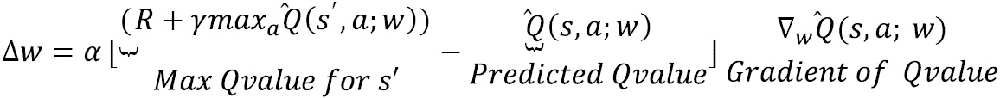
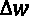
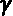
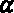
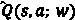
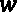
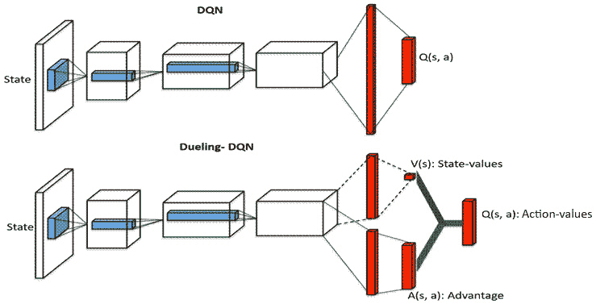
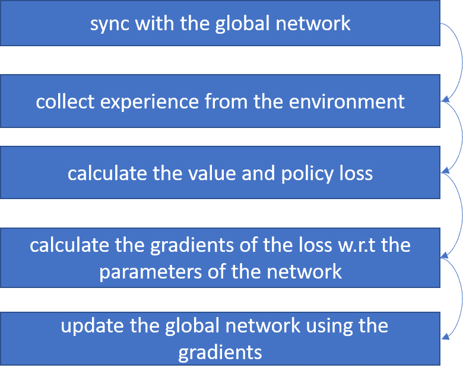

# 第三章：实现高级 RL 算法

本章提供了简短而清晰的食谱，帮助你使用 **TensorFlow 2.x** 从零开始实现先进的 **强化学习**（**RL**）算法和代理。包括构建 **深度 Q 网络**（**DQN**）、**双重和决斗深度 Q 网络**（**DDQN**，**DDDQN**）、**深度递归 Q 网络**（**DRQN**）、**异步优势演员-评论家**（**A3C**）、**近端策略优化**（**PPO**）和 **深度确定性策略梯度**（**DDPG**）的食谱。

本章将讨论以下食谱：

+   实现深度 Q 学习算法、DQN 和 Double-DQN 代理

+   实现决斗 DQN 代理

+   实现决斗双重 DQN 算法和 DDDQN 代理

+   实现深度递归 Q 学习算法和 DRQN 代理

+   实现异步优势演员-评论家算法和 A3C 代理

+   实现近端策略优化算法（Proximal Policy Optimization）和 PPO 代理

+   实现深度确定性策略梯度算法和 DDPG 代理

# 技术要求

书中的代码在 Ubuntu 18.04 和 Ubuntu 20.04 上经过广泛测试，并且如果安装了 Python 3.6+，应该可以在之后版本的 Ubuntu 上运行。安装 Python 3.6+ 以及之前章节所列的必要 Python 包后，代码也应该能够在 Windows 和 Mac OS X 上正常运行。建议创建并使用名为 `tf2rl-cookbook` 的 Python 虚拟环境来安装包并运行本书中的代码。推荐使用 Miniconda 或 Anaconda 安装 Python 虚拟环境进行管理。

每个章节中每个食谱的完整代码可以在此处获取：[`github.com/PacktPublishing/Tensorflow-2-Reinforcement-Learning-Cookbook`](https://github.com/PacktPublishing/Tensorflow-2-Reinforcement-Learning-Cookbook)。

# 实现深度 Q 学习算法、DQN 和 Double-DQN 代理

DQN 代理使用深度神经网络学习 Q 值函数。DQN 已经证明自己是离散动作空间环境和问题中一种强大的算法，并且被认为是深度强化学习历史上的一个重要里程碑，当 DQN 掌握了 Atari 游戏时，成为了一个标志性的成果。

Double-DQN 代理使用两个相同的深度神经网络，它们的更新方式不同，因此权重也不同。第二个神经网络是从过去某一时刻（通常是上一轮）复制的主神经网络。

在本章节结束时，你将从零开始使用 TensorFlow 2.x 实现一个完整的 DQN 和 Double-DQN 代理，能够在任何离散动作空间的强化学习环境中进行训练。

让我们开始吧。

## 准备工作

要完成这个食谱，你首先需要激活 `tf2rl-cookbook` Conda Python 虚拟环境，并运行 `pip install -r requirements.txt`。如果以下导入语句没有问题，那么你就可以开始了！

```py
import argparse
from datetime import datetime
import os
import random
from collections import deque
import gym
import numpy as np
import tensorflow as tf
from tensorflow.keras.layers import Dense, Input
```

现在我们可以开始了。

## 如何实现……

DQN 智能体包含几个组件，分别是`DQN`类、`Agent`类和`train`方法。执行以下步骤，从零开始实现这些组件，构建一个完整的 DQN 智能体，使用 TensorFlow 2.x：  

1.  首先，让我们创建一个参数解析器来处理脚本的配置输入：

    ```py
            parser = argparse.ArgumentParser(prog="TFRL-Cookbook-Ch3-DQN")
    parser.add_argument("--env , default="CartPole-v0")
    parser.add_argument("--lr", type=float, default=0.005)
    parser.add_argument("--batch_size", type=int, default=256)
    parser.add_argument("--gamma", type=float, default=0.95)
    parser.add_argument("--eps", type=float, default=1.0)
    parser.add_argument("--eps_decay", type=float, default=0.995)
    parser.add_argument("--eps_min", type=float, default=0.01)
    parser.add_argument("--logdir", default="logs")
    args = parser.parse_args()
    ```

1.  现在，让我们创建一个 Tensorboard 日志记录器，用于在智能体训练过程中记录有用的统计数据：

    ```py
    logdir = os.path.join(
        args.logdir, parser.prog, args.env, 
        datetime.now().strftime("%Y%m%d-%H%M%S")
    )
    print(f"Saving training logs to:{logdir}")
    writer = tf.summary.create_file_writer(logdir)
    ```

1.  接下来，让我们实现一个`ReplayBuffer`类：

    ```py
    class ReplayBuffer:
        def __init__(self, capacity=10000):
            self.buffer = deque(maxlen=capacity)
        def store(self, state, action, reward, next_state,
        done):
            self.buffer.append([state, action, reward, 
            next_state, done])
        def sample(self):
            sample = random.sample(self.buffer, 
                                   args.batch_size)
            states, actions, rewards, next_states, done = \
                                map(np.asarray, zip(*sample))
            states = np.array(states).reshape(
                                        args.batch_size, -1)
            next_states = np.array(next_states).\
                                reshape(args.batch_size, -1)
            return states, actions, rewards, next_states,
            done
        def size(self):
            return len(self.buffer)
    ```

1.  现在是时候实现 DQN 类了，该类定义了 TensorFlow 2.x 中的深度神经网络：  

    ```py
    class DQN:
        def __init__(self, state_dim, aciton_dim):
            self.state_dim = state_dim
            self.action_dim = aciton_dim
            self.epsilon = args.eps
            self.model = self.nn_model()
        def nn_model(self):
            model = tf.keras.Sequential(
                [
                    Input((self.state_dim,)),
                    Dense(32, activation="relu"),
                    Dense(16, activation="relu"),
                    Dense(self.action_dim),
                ]
            )
            model.compile(loss="mse", 
                          optimizer=Adam(args.lr))
            return model
    ```

1.  为了从 DQN 获取预测和动作，让我们实现`predict`和`get_action`方法：  

    ```py
        def predict(self, state):
            return self.model.predict(state)
        def get_action(self, state):
            state = np.reshape(state, [1, self.state_dim])
            self.epsilon *= args.eps_decay
            self.epsilon = max(self.epsilon, args.eps_min)
            q_value = self.predict(state)[0]
            if np.random.random() < self.epsilon:
                return random.randint(0, self.action_dim - 1)
            return np.argmax(q_value)
        def train(self, states, targets):
            self.model.fit(states, targets, epochs=1)
    ```

1.  实现了其他组件后，我们可以开始实现我们的`Agent`类：  

    ```py
    class Agent:
        def __init__(self, env):
            self.env = env
            self.state_dim = \
                self.env.observation_space.shape[0]
            self.action_dim = self.env.action_space.n
            self.model = DQN(self.state_dim, self.action_dim)
            self.target_model = DQN(self.state_dim, 
                                    self.action_dim)
            self.update_target()
            self.buffer = ReplayBuffer()
        def update_target(self):
            weights = self.model.model.get_weights()
            self.target_model.model.set_weights(weights)
    ```

1.  深度 Q 学习算法的核心是 q 学习更新和经验回放。让我们接下来实现它：  

    ```py
        def replay_experience(self):
            for _ in range(10):
                states, actions, rewards, next_states, done=\
                    self.buffer.sample()
                targets = self.target_model.predict(states)
                next_q_values = self.target_model.\
                             predict(next_states).max(axis=1)
                targets[range(args.batch_size), actions] = (
                    rewards + (1 - done) * next_q_values * \
                    args.gamma
                )
                self.model.train(states, targets)
    ```

1.  下一步至关重要的是实现`train`函数来训练智能体：  

    ```py
    def train(self, max_episodes=1000):
            with writer.as_default():  # Tensorboard logging
                for ep in range(max_episodes):
                    done, episode_reward = False, 0
                    observation = self.env.reset()
                    while not done:
                        action = \
                           self.model.get_action(observation)
                        next_observation, reward, done, _ = \
                           self.env.step(action)
                        self.buffer.store(
                            observation, action, reward * \
                            0.01, next_observation, done
                        )
                        episode_reward += reward
                        observation = next_observation
                    if self.buffer.size() >= args.batch_size:
                        self.replay_experience()
                    self.update_target()
                    print(f"Episode#{ep} Reward:{
                                            episode_reward}")
                    tf.summary.scalar("episode_reward",
                                     episode_reward, step=ep)
                    writer.flush()
    ```

1.  最后，让我们创建主函数以开始训练智能体：  

    ```py
    if __name__ == "__main__":
        env = gym.make("CartPole-v0")
        agent = Agent(env)
        agent.train(max_episodes=20000)
    ```

1.  要在默认环境（`CartPole-v0`）中训练 DQN 智能体，请执行以下命令：  

    ```py
    python ch3-deep-rl-agents/1_dqn.py
    ```

1.  你还可以使用命令行参数在任何 OpenAI Gym 兼容的离散动作空间环境中训练 DQN 智能体：  

    ```py
    python ch3-deep-rl-agents/1_dqn.py –env "MountainCar-v0"
    ```

1.  现在，为了实现 Double DQN 智能体，我们必须修改`replay_experience`方法，以使用 Double Q 学习的更新步骤，如下所示：  

    ```py
        def replay_experience(self):
            for _ in range(10):
                states, actions, rewards, next_states, done=\
                    self.buffer.sample()
                targets = self.target_model.predict(states)
                next_q_values = \
                    self.target_model.predict(next_states)[
                    range(args.batch_size),
                    np.argmax(self.model.predict(
                                       next_states), axis=1),
                ]
                targets[range(args.batch_size), actions] = (
                    rewards + (1 - done) * next_q_values * \
                        args.gamma
                )
                self.model.train(states, targets)
    ```

1.  最后，为了训练 Double DQN 智能体，保存并运行脚本，更新后的`replay_experience`方法，或者使用作为本书源代码一部分提供的脚本：  

    ```py
    python ch3-deep-rl-agents/1_double_dqn.py
    ```

让我们看看它是如何工作的。  

## 它是如何工作的...  

DQN 中的权重更新按以下 Q 学习方程进行：  

  

这里， 是 DQN 参数（权重）的变化，s 是当前状态，a 是当前动作，s' 是下一个状态，w 代表 DQN 的权重， 是折扣因子， 是学习率， 表示由 DQN 预测的给定状态（s）和动作（a）的 Q 值，权重为 。  

为了理解 DQN 智能体与 Double-DQN 智能体的区别，请对比第 8 步（DQN）和第 13 步（Double DQN）中的`replay_experience`方法。你会注意到，关键区别在于计算`next_q_values`。DQN 智能体使用预测的 Q 值的最大值（这可能是高估的），而 Double DQN 智能体使用两个不同神经网络的预测 Q 值。这种方法是为了避免 DQN 智能体高估 Q 值的问题。  

# 实现对抗性 DQN 智能体  

对抗性 DQN 智能体通过修改的网络架构显式地估计两个量：  

+   状态值，V(*s*)  

+   优势值，A(*s*, *a*)  

状态值估计了处于状态 s 时的价值，优势值表示在状态 *s* 中采取行动 *a* 的优势。通过显式和独立地估计这两个数量，Dueling DQN 相较于 DQN 表现得更好。这个配方将带你逐步实现一个从零开始的 Dueling DQN 智能体，使用 TensorFlow 2.x。

## 准备工作

要完成这个配方，首先需要激活 `tf2rl-cookbook` Conda Python 虚拟环境，并运行 `pip install -r requirements.txt`。如果以下导入语句没有问题，则说明可以开始了！

```py
import argparse
import os
import random
from collections import deque
from datetime import datetime
import gym
import numpy as np
import tensorflow as tf
from tensorflow.keras.layers import Add, Dense, Input
from tensorflow.keras.optimizers import Adam
```

现在我们可以开始了。

## 如何实现…

Dueling DQN 智能体由几个组件组成，即 `DuelingDQN` 类、`Agent` 类和 `train` 方法。按照以下步骤，从零开始实现这些组件，利用 TensorFlow 2.x 构建一个完整的 Dueling DQN 智能体：

1.  作为第一步，让我们创建一个参数解析器，用于处理脚本的命令行配置输入：

    ```py
    parser = argparse.ArgumentParser(prog="TFRL-Cookbook-Ch3-DuelingDQN")
    parser.add_argument("--env", default="CartPole-v0")
    parser.add_argument("--lr", type=float, default=0.005)
    parser.add_argument("--batch_size", type=int, default=64)
    parser.add_argument("--gamma", type=float, default=0.95)
    parser.add_argument("--eps", type=float, default=1.0)
    parser.add_argument("--eps_decay", type=float, default=0.995)
    parser.add_argument("--eps_min", type=float, default=0.01)
    parser.add_argument("--logdir", default="logs")
    args = parser.parse_args()
    ```

1.  为了在智能体训练过程中记录有用的统计信息，让我们创建一个 TensorBoard 日志记录器：

    ```py
    logdir = os.path.join(
        args.logdir, parser.prog, args.env, 
        datetime.now().strftime("%Y%m%d-%H%M%S")
    )
    print(f"Saving training logs to:{logdir}")
    writer = tf.summary.create_file_writer(logdir)
    ```

1.  接下来，让我们实现一个 `ReplayBuffer` 类：

    ```py
    class ReplayBuffer:
        def __init__(self, capacity=10000):
            self.buffer = deque(maxlen=capacity)
        def store(self, state, action, reward, next_state,
        done):
            self.buffer.append([state, action, reward, 
                                next_state, done])
        def sample(self):
            sample = random.sample(self.buffer, 
                                   args.batch_size)
            states, actions, rewards, next_states, done = \
                                map(np.asarray, zip(*sample))
            states = np.array(states).reshape(
                                         args.batch_size, -1)
            next_states = np.array(next_states).reshape(
                                         args.batch_size, -1)
            return states, actions, rewards, next_states,
            done
        def size(self):
            return len(self.buffer)
    ```

1.  现在是时候实现 DuelingDQN 类，该类在 TensorFlow 2.x 中定义深度神经网络了：

    ```py
    class DuelingDQN:
        def __init__(self, state_dim, aciton_dim):
            self.state_dim = state_dim
            self.action_dim = aciton_dim
            self.epsilon = args.eps
            self.model = self.nn_model()
        def nn_model(self):
            backbone = tf.keras.Sequential(
                [
                    Input((self.state_dim,)),
                    Dense(32, activation="relu"),
                    Dense(16, activation="relu"),
                ]
            )
            state_input = Input((self.state_dim,))
            backbone_1 = Dense(32, activation="relu")\
                              (state_input)
            backbone_2 = Dense(16, activation="relu")\
                              (backbone_1)
            value_output = Dense(1)(backbone_2)
            advantage_output = Dense(self.action_dim)\
                                    (backbone_2)
            output = Add()([value_output, advantage_output])
            model = tf.keras.Model(state_input, output)
            model.compile(loss="mse", 
                          optimizer=Adam(args.lr))
            return model
    ```

1.  为了从 Dueling DQN 获取预测和动作，让我们实现 `predict`、`get_action` 和 `train` 方法：

    ```py
            def predict(self, state):
            return self.model.predict(state)
        def get_action(self, state):
            state = np.reshape(state, [1, self.state_dim])
            self.epsilon *= args.eps_decay
            self.epsilon = max(self.epsilon, args.eps_min)
            q_value = self.predict(state)[0]
            if np.random.random() < self.epsilon:
                return random.randint(0, self.action_dim - 1)
            return np.argmax(q_value)
        def train(self, states, targets):
            self.model.fit(states, targets, epochs=1)
    ```

1.  现在我们可以开始实现 `Agent` 类：

    ```py
    class Agent:
        def __init__(self, env):
            self.env = env
            self.state_dim = \
                self.env.observation_space.shape[0]
            self.action_dim = self.env.action_space.n
            self.model = DuelingDQN(self.state_dim, 
                                    self.action_dim)
            self.target_model = DuelingDQN(self.state_dim,
                                           self.action_dim)
            self.update_target()
            self.buffer = ReplayBuffer()
        def update_target(self):
            weights = self.model.model.get_weights()
            self.target_model.model.set_weights(weights)
    ```

1.  Dueling Deep Q-learning 算法的关键在于 q-learning 更新和经验回放。接下来，让我们实现这些：

    ```py
        def replay_experience(self):
            for _ in range(10):
                states, actions, rewards, next_states, done=\
                    self.buffer.sample()
                targets = self.target_model.predict(states)
                next_q_values = self.target_model.\
                             predict(next_states).max(axis=1)
                targets[range(args.batch_size), actions] = (
                    rewards + (1 - done) * next_q_values * \
                    args.gamma
                )
                self.model.train(states, targets)
    ```

1.  下一个关键步骤是实现 `train` 函数来训练智能体：

    ```py
    def train(self, max_episodes=1000):
            with writer.as_default():
                for ep in range(max_episodes):
                    done, episode_reward = False, 0
                    state = self.env.reset()
                    while not done:
                        action = self.model.get_action(state)
                        next_state, reward, done, _ = \
                                        self.env.step(action)
                        self.buffer.put(state, action, \
                                        reward * 0.01, \
                                        next_state, done)
                        episode_reward += reward
                        state = next_state
                    if self.buffer.size() >= args.batch_size:
                        self.replay_experience()
                    self.update_target()
                    print(f"Episode#{ep} \
                          Reward:{episode_reward}")
                    tf.summary.scalar("episode_reward",\
                                     episode_reward, step=ep)
    ```

1.  最后，让我们创建主函数来启动智能体的训练：

    ```py
    if __name__ == "__main__":
        env = gym.make("CartPole-v0")
        agent = Agent(env)
        agent.train(max_episodes=20000)
    ```

1.  要在默认环境（`CartPole-v0`）中训练 Dueling DQN 智能体，请执行以下命令：

    ```py
    python ch3-deep-rl-agents/2_dueling_dqn.py
    ```

1.  你也可以在任何与 OpenAI Gym 兼容的离散动作空间环境中训练 DQN 智能体，使用命令行参数：

    ```py
    python ch3-deep-rl-agents/2_dueling_dqn.py –env "MountainCar-v0"
    ```

让我们来看它是如何工作的。

## 它是如何工作的…

Dueling-DQN 智能体在神经网络架构上与 DQN 智能体有所不同。

这些差异在下图中进行了总结：



图 3.1 – DQN 和 Dueling-DQN 的比较

DQN（图的上半部分）具有线性架构，预测一个单一的数量（Q(s, a)），而 Dueling-DQN 在最后一层有一个分叉，预测多个数量。

# 实现 Dueling Double DQN 算法和 DDDQN 智能体

**Dueling Double DQN**（**DDDQN**）结合了 Double Q-learning 和 Dueling 架构的优势。Double Q-learning 修正了 DQN 过高估计动作值的问题。Dueling 架构使用修改后的架构，分别学习状态值函数（V）和优势函数（A）。这种显式分离使算法能够更快学习，特别是在有许多动作可选且动作之间非常相似的情况下。Dueling 架构使智能体即使在一个状态下只采取了一个动作时也能进行学习，因为它可以更新和估计状态值函数，这与 DQN 智能体不同，后者无法从尚未采取的动作中学习。在完成这个食谱后，你将拥有一个完整的 DDDQN 智能体实现。

## 准备好了吗？

要完成这个食谱，你首先需要激活 `tf2rl-cookbook` Conda Python 虚拟环境并运行 `pip install -r requirements.txt`。如果以下导入语句没有问题，那么你就可以开始了！

```py
import argparse
from datetime import datetime
import os
import random
from collections import deque
import gym
import numpy as np
import tensorflow as tf
from tensorflow.keras.layers import Add, Dense, Input
from tensorflow.keras.optimizers import Adam
```

我们准备好了，开始吧！

## 如何做……

DDDQN 智能体结合了 DQN、Double DQN 和 Dueling DQN 中的思想。执行以下步骤，从头开始实现这些组件，以便使用 TensorFlow 2.x 构建一个完整的 Dueling Double DQN 智能体：

1.  首先，让我们创建一个参数解析器来处理脚本的配置输入：

    ```py
    parser = argparse.ArgumentParser(prog="TFRL-Cookbook-Ch3-DuelingDoubleDQN")
    parser.add_argument("--env", default="CartPole-v0")
    parser.add_argument("--lr", type=float, default=0.005)
    parser.add_argument("--batch_size", type=int, default=256)
    parser.add_argument("--gamma", type=float, default=0.95)
    parser.add_argument("--eps", type=float, default=1.0)
    parser.add_argument("--eps_decay", type=float, default=0.995)
    parser.add_argument("--eps_min", type=float, default=0.01)
    parser.add_argument("--logdir", default="logs")
    args = parser.parse_args()
    ```

1.  接下来，让我们创建一个 Tensorboard 日志记录器，用于记录智能体训练过程中的有用统计数据：

    ```py
    logdir = os.path.join(
        args.logdir, parser.prog, args.env, \
        datetime.now().strftime("%Y%m%d-%H%M%S")
    )
    print(f"Saving training logs to:{logdir}")
    writer = tf.summary.create_file_writer(logdir)
    ```

1.  现在，让我们实现一个 `ReplayBuffer`：

    ```py
    class ReplayBuffer:
        def __init__(self, capacity=10000):
            self.buffer = deque(maxlen=capacity)
        def store(self, state, action, reward, next_state, done):
            self.buffer.append([state, action, reward, \
            next_state, done])
        def sample(self):
            sample = random.sample(self.buffer, \
                                   args.batch_size)
            states, actions, rewards, next_states, done = \
                                map(np.asarray, zip(*sample))
            states = np.array(states).reshape(
                                         args.batch_size, -1)
            next_states = np.array(next_states).\
                                 reshape(args.batch_size, -1)
            return states, actions, rewards, next_states, \
            done
        def size(self):
            return len(self.buffer)
    ```

1.  现在是时候实现 Dueling DQN 类了，它将按照 Dueling 架构定义神经网络，后续我们会在此基础上添加 Double DQN 更新：

    ```py
    class DuelingDQN:
        def __init__(self, state_dim, aciton_dim):
            self.state_dim = state_dim
            self.action_dim = aciton_dim
            self.epsilon = args.eps
            self.model = self.nn_model()
        def nn_model(self):
            state_input = Input((self.state_dim,))
            fc1 = Dense(32, activation="relu")(state_input)
            fc2 = Dense(16, activation="relu")(fc1)
            value_output = Dense(1)(fc2)
            advantage_output = Dense(self.action_dim)(fc2)
            output = Add()([value_output, advantage_output])
            model = tf.keras.Model(state_input, output)
            model.compile(loss="mse", \
                          optimizer=Adam(args.lr))
            return model
    ```

1.  为了从 Dueling DQN 获取预测和动作，让我们实现 `predict` 和 `get_action` 方法：

    ```py
        def predict(self, state):
            return self.model.predict(state)
        def get_action(self, state):
            state = np.reshape(state, [1, self.state_dim])
            self.epsilon *= args.eps_decay
            self.epsilon = max(self.epsilon, args.eps_min)
            q_value = self.predict(state)[0]
            if np.random.random() < self.epsilon:
                return random.randint(0, self.action_dim - 1)
            return np.argmax(q_value)
        def train(self, states, targets):
            self.model.fit(states, targets, epochs=1)
    ```

1.  其他组件实现完成后，我们可以开始实现 `Agent` 类：

    ```py
    class Agent:
        def __init__(self, env):
            self.env = env
            self.state_dim = \
                self.env.observation_space.shape[0]
            self.action_dim = self.env.action_space.n
            self.model = DuelingDQN(self.state_dim, 
                                    self.action_dim)
            self.target_model = DuelingDQN(self.state_dim,
                                           self.action_dim)
            self.update_target()
            self.buffer = ReplayBuffer()
        def update_target(self):
            weights = self.model.model.get_weights()
            self.target_model.model.set_weights(weights)
    ```

1.  Dueling Double Deep Q-learning 算法的主要元素是 Q-learning 更新和经验回放。接下来我们将实现这些：

    ```py
        def replay_experience(self):
            for _ in range(10):
                states, actions, rewards, next_states, done=\
                                         self.buffer.sample()
                targets = self.target_model.predict(states)
                next_q_values = \
                    self.target_model.predict(next_states)[
                    range(args.batch_size),
                    np.argmax(self.model.predict(
                                       next_states), axis=1),
                ]
                targets[range(args.batch_size), actions] = (
                    rewards + (1 - done) * next_q_values * \
                    args.gamma
                )
                self.model.train(states, targets)
    ```

1.  下一个关键步骤是实现 `train` 函数来训练智能体：

    ```py
    def train(self, max_episodes=1000):
            with writer.as_default():
                for ep in range(max_episodes):
                    done, episode_reward = False, 0
                    observation = self.env.reset()
                    while not done:
                        action = \
                           self.model.get_action(observation)
                        next_observation, reward, done, _ = \
                            self.env.step(action)
                        self.buffer.store(
                            observation, action, reward * \
                                                              0.01, next_observation, done
                        )
                        episode_reward += reward
                        observation = next_observation
                    if self.buffer.size() >= args.batch_size:
                        self.replay_experience()
                    self.update_target()
                    print(f"Episode#{ep} \
                          Reward:{episode_reward}")
                    tf.summary.scalar("episode_reward", 
                                       episode_reward, 
                                       step=ep)
    ```

1.  最后，让我们创建主函数来开始训练智能体：

    ```py
    if __name__ == "__main__":
        env = gym.make("CartPole-v0")
        agent = Agent(env)
        agent.train(max_episodes=20000)
    ```

1.  要在默认环境（`CartPole-v0`）中训练 DQN 智能体，请执行以下命令：

    ```py
    python ch3-deep-rl-agents/3_dueling_double_dqn.py
    ```

1.  你还可以在任何兼容 OpenAI Gym 的离散动作空间环境中使用命令行参数训练 Dueling Double DQN 智能体：

    ```py
    python ch3-deep-rl-agents/3_dueling_double_dqn.py –env "MountainCar-v0"
    ```

## 它是如何工作的……

Dueling Double DQN 架构结合了 Double DQN 和 Dueling 架构引入的进展。

# 实现深度递归 Q-learning 算法和 DRQN 智能体

DRQN 使用递归神经网络来学习 Q 值函数。DRQN 更适合在部分可观察环境中进行强化学习。DRQN 中的递归网络层允许智能体通过整合时间序列的观察信息来进行学习。例如，DRQN 智能体可以推测环境中移动物体的速度，而无需任何输入的变化（例如，不需要帧堆叠）。在完成这个配方后，您将拥有一个完整的 DRQN 智能体，准备在您选择的强化学习环境中进行训练。

## 准备开始

要完成这个配方，您首先需要激活`tf2rl-cookbook` Conda Python 虚拟环境，并运行`pip install -r requirements.txt`。如果以下导入语句没有问题，那么您就准备好开始了！

```py
import tensorflow as tf
from datetime import datetime
import os
from tensorflow.keras.layers import Input, Dense, LSTM
from tensorflow.keras.optimizers import Adam
import gym
import argparse
import numpy as np
from collections import deque
import random
```

让我们开始吧！

## 怎么做…

对抗双重 DQN 智能体结合了 DQN、双重 DQN 和对抗 DQN 的理念。执行以下步骤，从零开始实现这些组件，以使用 TensorFlow 2.x 构建完整的 DRQN 智能体：

1.  首先，创建一个参数解析器来处理脚本的配置输入：

    ```py
    parser = argparse.ArgumentParser(prog="TFRL-Cookbook-Ch3-DRQN")
    parser.add_argument("--env", default="CartPole-v0")
    parser.add_argument("--lr", type=float, default=0.005)
    parser.add_argument("--batch_size", type=int, default=64)
    parser.add_argument("--time_steps", type=int, default=4)
    parser.add_argument("--gamma", type=float, default=0.95)
    parser.add_argument("--eps", type=float, default=1.0)
    parser.add_argument("--eps_decay", type=float, default=0.995)
    parser.add_argument("--eps_min", type=float, default=0.01)
    parser.add_argument("--logdir", default="logs")
    args = parser.parse_args()
    ```

1.  让我们在智能体的训练过程中使用 Tensorboard 记录有用的统计信息：

    ```py
    logdir = os.path.join(
        args.logdir, parser.prog, args.env, \
        datetime.now().strftime("%Y%m%d-%H%M%S")
    )
    print(f"Saving training logs to:{logdir}")
    writer = tf.summary.create_file_writer(logdir)
    ```

1.  接下来，让我们实现一个`ReplayBuffer`：

    ```py
    class ReplayBuffer:
        def __init__(self, capacity=10000):
            self.buffer = deque(maxlen=capacity)
        def store(self, state, action, reward, next_state,\
        done):
            self.buffer.append([state, action, reward, \
                                next_state, done])
        def sample(self):
            sample = random.sample(self.buffer, 
                                   args.batch_size)
            states, actions, rewards, next_states, done = \
                map(np.asarray, zip(*sample))
            states = np.array(states).reshape(
                                         args.batch_size, -1)
            next_states = np.array(next_states).reshape(
                                         args.batch_size, -1)
            return states, actions, rewards, next_states, \
            done
        def size(self):
            return len(self.buffer)
    ```

1.  现在是时候实现定义深度神经网络的 DRQN 类了，使用的是 TensorFlow 2.x：

    ```py
    class DRQN:
        def __init__(self, state_dim, action_dim):
            self.state_dim = state_dim
            self.action_dim = action_dim
            self.epsilon = args.eps
            self.opt = Adam(args.lr)
            self.compute_loss = \
                tf.keras.losses.MeanSquaredError()
            self.model = self.nn_model()
        def nn_model(self):
            return tf.keras.Sequential(
                [
                    Input((args.time_steps, self.state_dim)),
                    LSTM(32, activation="tanh"),
                    Dense(16, activation="relu"),
                    Dense(self.action_dim),
                ]
            )
    ```

1.  为了从 DRQN 获取预测和动作，让我们实现`predict`和`get_action`方法：

    ```py
        def predict(self, state):
            return self.model.predict(state)
        def get_action(self, state):
            state = np.reshape(state, [1, args.time_steps,
                                       self.state_dim])
            self.epsilon *= args.eps_decay
            self.epsilon = max(self.epsilon, args.eps_min)
            q_value = self.predict(state)[0]
            if np.random.random() < self.epsilon:
                return random.randint(0, self.action_dim - 1)
            return np.argmax(q_value)
        def train(self, states, targets):
            targets = tf.stop_gradient(targets)
            with tf.GradientTape() as tape:
                logits = self.model(states, training=True)
                assert targets.shape == logits.shape
                loss = self.compute_loss(targets, logits)
            grads = tape.gradient(loss, 
                              self.model.trainable_variables)
            self.opt.apply_gradients(zip(grads, 
                             self.model.trainable_variables))
    ```

1.  实现了其他组件后，我们可以开始实现我们的`Agent`类：

    ```py
    class Agent:
        def __init__(self, env):
            self.env = env
            self.state_dim = \
                self.env.observation_space.shape[0]
            self.action_dim = self.env.action_space.n
            self.states = np.zeros([args.time_steps, 
                                    self.state_dim])
            self.model = DRQN(self.state_dim, 
                              self.action_dim)
            self.target_model = DRQN(self.state_dim, 
                                     self.action_dim)
            self.update_target()
            self.buffer = ReplayBuffer()
        def update_target(self):
            weights = self.model.model.get_weights()
            self.target_model.model.set_weights(weights)
    ```

1.  除了我们在第 6 步中实现的 DRQN 类中的`train`方法外，深度递归 Q 学习算法的核心是 Q 学习更新和经验回放。接下来，让我们实现这一部分：

    ```py
        def replay_experience(self):
            for _ in range(10):
                states, actions, rewards, next_states, done=\
                    self.buffer.sample()
                targets = self.target_model.predict(states)
                next_q_values = self.target_model.\
                             predict(next_states).max(axis=1)
                targets[range(args.batch_size), actions] = (
                    rewards + (1 - done) * next_q_values * \
                    args.gamma
                )
                self.model.train(states, targets)
    ```

1.  由于 DRQN 智能体使用递归状态，让我们实现`update_states`方法来更新智能体的递归状态：

    ```py
        def update_states(self, next_state):
            self.states = np.roll(self.states, -1, axis=0)
            self.states[-1] = next_state
    ```

1.  下一个关键步骤是实现`train`函数来训练智能体：

    ```py
    def train(self, max_episodes=1000):
            with writer.as_default():
                for ep in range(max_episodes):
                    done, episode_reward = False, 0
                    self.states = np.zeros([args.time_steps, 
                                            self.state_dim])
                    self.update_states(self.env.reset())
                    while not done:
                        action = self.model.get_action(
                                                 self.states)
                        next_state, reward, done, _ = \
                                        self.env.step(action)
                        prev_states = self.states
                        self.update_states(next_state)
                        self.buffer.store(
                            prev_states, action, reward * \
                            0.01, self.states, done
                        )
                        episode_reward += reward
                    if self.buffer.size() >= args.batch_size:
                        self.replay_experience()
                    self.update_target()
                    print(f"Episode#{ep} \
                          Reward:{episode_reward}")
                    tf.summary.scalar("episode_reward", episode_reward, step=ep)
    ```

1.  最后，让我们为智能体创建主要的训练循环：

    ```py
    if __name__ == "__main__":
        env = gym.make("Pong-v0")
        agent = Agent(env)
        agent.train(max_episodes=20000)
    ```

1.  要在默认环境（`CartPole-v0`）中训练 DRQN 智能体，请执行以下命令：

    ```py
    python ch3-deep-rl-agents/4_drqn.py
    ```

1.  您还可以使用命令行参数在任何 OpenAI Gym 兼容的离散动作空间环境中训练 DQN 智能体：

    ```py
    python ch3-deep-rl-agents/4_drqn.py –env "MountainCar-v0"
    ```

## 它是如何工作的…

DRQN 智能体使用 LSTM 层，这为智能体增加了递归学习能力。LSTM 层在配方的第 5 步中添加到智能体的网络中。配方中的其他步骤与 DQN 智能体类似。

# 实现异步优势演员评论家算法和 A3C 智能体

A3C 算法在 Actor-Critic 类算法的基础上构建，通过使用神经网络来逼近演员（actor）和评论家（critic）。演员使用深度神经网络学习策略函数，而评论家则估计价值函数。算法的异步性质使得智能体能够从状态空间的不同部分进行学习，从而实现并行学习和更快的收敛。与使用经验回放记忆的 DQN 智能体不同，A3C 智能体使用多个工作线程来收集更多样本进行学习。在本配方的结尾，你将拥有一个完整的脚本，可以用来训练一个适用于任何连续动作值环境的 A3C 智能体！

## 准备开始

要完成这个配方，你首先需要激活 `tf2rl-cookbook` Conda Python 虚拟环境并运行 `pip install -r requirements.txt`。如果以下的导入语句没有问题，那就说明你已经准备好开始了！

```py
import argparse
import os
from datetime import datetime
from multiprocessing import cpu_count
from threading import Thread
import gym
import numpy as np
import tensorflow as tf
from tensorflow.keras.layers import Input, Dense, Lambda
```

现在我们可以开始了。

## 如何实现…

我们将通过利用 Python 的多进程和多线程功能实现一个 **异步优势演员评论家（A3C）** 算法。以下步骤将帮助你从零开始使用 TensorFlow 2.x 实现一个完整的 A3C 智能体：

1.  首先，让我们创建一个参数解析器，用来处理脚本的配置输入：

    ```py
    parser = argparse.ArgumentParser(prog="TFRL-Cookbook-Ch3-A3C")
    parser.add_argument("--env", default="MountainCarContinuous-v0")
    parser.add_argument("--actor-lr", type=float, default=0.001)
    parser.add_argument("--critic-lr", type=float, default=0.002)
    parser.add_argument("--update-interval", type=int, default=5)
    parser.add_argument("--gamma", type=float, default=0.99)
    parser.add_argument("--logdir", default="logs")
    args = parser.parse_args()
    ```

1.  现在让我们创建一个 Tensorboard 日志记录器，以便在智能体训练过程中记录有用的统计信息：

    ```py
    logdir = os.path.join(
        args.logdir, parser.prog, args.env, \
           datetime.now().strftime("%Y%m%d-%H%M%S")
    )
    print(f"Saving training logs to:{logdir}")
    writer = tf.summary.create_file_writer(logdir)
    ```

1.  为了统计全局回合数，让我们定义一个全局变量：

    ```py
    GLOBAL_EPISODE_NUM = 0
    ```

1.  现在我们可以集中精力实现 `Actor` 类，它将包含一个基于神经网络的策略来在环境中执行动作：

    ```py
    class Actor:
        def __init__(self, state_dim, action_dim, 
        action_bound, std_bound):
            self.state_dim = state_dim
            self.action_dim = action_dim
            self.action_bound = action_bound
            self.std_bound = std_bound
            self.model = self.nn_model()
            self.opt = tf.keras.optimizers.Adam(
                                               args.actor_lr)
            self.entropy_beta = 0.01
        def nn_model(self):
            state_input = Input((self.state_dim,))
            dense_1 = Dense(32, activation="relu")\
                            (state_input)
            dense_2 = Dense(32, activation="relu")(dense_1)
            out_mu = Dense(self.action_dim, \
                           activation="tanh")(dense_2)
            mu_output = Lambda(lambda x: x * \
                               self.action_bound)(out_mu)
            std_output = Dense(self.action_dim, 
                              activation="softplus")(dense_2)
            return tf.keras.models.Model(state_input, 
                                     [mu_output, std_output])
    ```

1.  为了在给定状态下从演员获取动作，让我们定义 `get_action` 方法：

    ```py
        def get_action(self, state):
            state = np.reshape(state, [1, self.state_dim])
            mu, std = self.model.predict(state)
            mu, std = mu[0], std[0]
            return np.random.normal(mu, std, 
                                    size=self.action_dim)
    ```

1.  接下来，为了计算损失，我们需要计算策略（概率）密度函数的对数：

    ```py
        def log_pdf(self, mu, std, action):
            std = tf.clip_by_value(std, self.std_bound[0],
                                   self.std_bound[1])
            var = std ** 2
            log_policy_pdf = -0.5 * (action - mu) ** 2 / var\
                              - 0.5 * tf.math.log(
                var * 2 * np.pi
            )
            return tf.reduce_sum(log_policy_pdf, 1,
                                 keepdims=True)
    ```

1.  现在让我们使用 `log_pdf` 方法来计算演员损失：

    ```py
        def compute_loss(self, mu, std, actions, advantages):
            log_policy_pdf = self.log_pdf(mu, std, actions)
            loss_policy = log_policy_pdf * advantages
            return tf.reduce_sum(-loss_policy)
    ```

1.  作为 `Actor` 类实现的最后一步，让我们定义 `train` 方法：

    ```py
        def train(self, states, actions, advantages):
            with tf.GradientTape() as tape:
                mu, std = self.model(states, training=True)
                loss = self.compute_loss(mu, std, actions,
                                         advantages)
            grads = tape.gradient(loss, 
                             self.model.trainable_variables)
            self.opt.apply_gradients(zip(grads, 
                             self.model.trainable_variables))
            return loss
    ```

1.  定义好 `Actor` 类后，我们可以继续定义 `Critic` 类：

    ```py
    class Critic:
        def __init__(self, state_dim):
            self.state_dim = state_dim
            self.model = self.nn_model()
            self.opt = tf.keras.optimizers.Adam\
                                (args.critic_lr)
        def nn_model(self):
            return tf.keras.Sequential(
                [
                    Input((self.state_dim,)),
                    Dense(32, activation="relu"),
                    Dense(32, activation="relu"),
                    Dense(16, activation="relu"),
                    Dense(1, activation="linear"),
                ]
            )
    ```

1.  接下来，让我们定义 `train` 方法和一个 `compute_loss` 方法来训练评论家：

    ```py
        def compute_loss(self, v_pred, td_targets):
            mse = tf.keras.losses.MeanSquaredError()
            return mse(td_targets, v_pred)
        def train(self, states, td_targets):
            with tf.GradientTape() as tape:
                v_pred = self.model(states, training=True)
                assert v_pred.shape == td_targets.shape
                loss = self.compute_loss(v_pred, \
                                tf.stop_gradient(td_targets))
            grads = tape.gradient(loss, \
                             self.model.trainable_variables)
            self.opt.apply_gradients(zip(grads, 
                             self.model.trainable_variables))
            return loss
    ```

1.  是时候基于 Python 的线程接口实现 `A3CWorker` 类了：

    ```py
    class A3CWorker(Thread):
        def __init__(self, env, global_actor, global_critic,
        max_episodes):
            Thread.__init__(self)
            self.env = env
            self.state_dim = \
                self.env.observation_space.shape[0]
            self.action_dim = self.env.action_space.shape[0]
            self.action_bound = self.env.action_space.high[0]
            self.std_bound = [1e-2, 1.0]
            self.max_episodes = max_episodes
            self.global_actor = global_actor
            self.global_critic = global_critic
            self.actor = Actor(
                self.state_dim, self.action_dim, 
                self.action_bound, self.std_bound
            )
            self.critic = Critic(self.state_dim)
            self.actor.model.set_weights(
                self.global_actor.model.get_weights())
            self.critic.model.set_weights(
                self.global_critic.model.get_weights())
    ```

1.  我们将使用 **n 步时间差分 (TD)** 学习更新。因此，让我们定义一个方法来计算 n 步 TD 目标：

    ```py
        def n_step_td_target(self, rewards, next_v_value,
        done):
            td_targets = np.zeros_like(rewards)
            cumulative = 0
            if not done:
                cumulative = next_v_value
            for k in reversed(range(0, len(rewards))):
                cumulative = args.gamma * cumulative + \
                             rewards[k]
                td_targets[k] = cumulative
            return td_targets
    ```

1.  我们还需要计算优势值。优势值的最简单形式很容易实现：

    ```py
        def advantage(self, td_targets, baselines):
            return td_targets - baselines
    ```

1.  我们将把 `train` 方法的实现分为以下两个步骤。首先，让我们实现外部循环：

    ```py
        def train(self):
            global GLOBAL_EPISODE_NUM
            while self.max_episodes >= GLOBAL_EPISODE_NUM:
                state_batch = []
                action_batch = []
                reward_batch = []
                episode_reward, done = 0, False
                state = self.env.reset()
                while not done:
                    # self.env.render()
                    action = self.actor.get_action(state)
                    action = np.clip(action, 
                                     -self.action_bound,
                                     self.action_bound)
                    next_state, reward, done, _ = \
                        self.env.step(action)
                    state = np.reshape(state, [1, 
                                            self.state_dim])
                    action = np.reshape(action, [1, 1])
                    next_state = np.reshape(next_state, 
                                         [1, self.state_dim])
                    reward = np.reshape(reward, [1, 1])
                    state_batch.append(state)
                    action_batch.append(action)
                    reward_batch.append(reward)
    ```

1.  在这一步，我们将完成 `train` 方法的实现：

    ```py
                    if len(state_batch) >= args.update_\
                    interval or done:
                        states = np.array([state.squeeze() \
                                   for state in state_batch])
                        actions = np.array([action.squeeze()\
                                 for action in action_batch])
                        rewards = np.array([reward.squeeze()\
                                 for reward in reward_batch])
                        next_v_value = self.critic.model.\
                                          predict(next_state)
                        td_targets = self.n_step_td_target(
                            (rewards + 8) / 8, next_v_value,
                             done
                        )
                        advantages = td_targets - \
                            self.critic.model.predict(states)
                        actor_loss = self.global_actor.train(
                                states, actions, advantages)
                        critic_loss = self.global_critic.\
                                train(states, td_targets)
                        self.actor.model.set_weights(self.\
                            global_actor.model.get_weights())
                        self.critic.model.set_weights(
                            self.global_critic.model.\
                            get_weights()
                        )
                        state_batch = []
                        action_batch = []
                        reward_batch = []
                    episode_reward += reward[0][0]
                    state = next_state[0]
                print(f"Episode#{GLOBAL_EPISODE_NUM}\
                      Reward:{episode_reward}")
                tf.summary.scalar("episode_reward", 
                                   episode_reward,
                                   step=GLOBAL_EPISODE_NUM)
                GLOBAL_EPISODE_NUM += 1
    ```

1.  `A3CWorker` 线程的 run 方法将是以下内容：

    ```py
        def run(self):
            self.train()
    ```

1.  接下来，让我们实现 `Agent` 类：

    ```py
    class Agent:
        def __init__(self, env_name, 
                     num_workers=cpu_count()):
            env = gym.make(env_name)
            self.env_name = env_name
            self.state_dim = env.observation_space.shape[0]
            self.action_dim = env.action_space.shape[0]
            self.action_bound = env.action_space.high[0]
            self.std_bound = [1e-2, 1.0]
            self.global_actor = Actor(
                self.state_dim, self.action_dim, 
                self.action_bound, self.std_bound
            )
            self.global_critic = Critic(self.state_dim)
            self.num_workers = num_workers
    ```

1.  A3C 智能体利用多个并发工作线程。为了更新每个工作线程以更新 A3C 智能体，以下代码是必要的：

    ```py
    def train(self, max_episodes=20000):
            workers = []
            for i in range(self.num_workers):
                env = gym.make(self.env_name)
                workers.append(
                    A3CWorker(env, self.global_actor, 
                            self.global_critic, max_episodes)
                )
            for worker in workers:
                worker.start()
            for worker in workers:
                worker.join()
    ```

1.  这样，我们的 A3C 智能体实现就完成了，接下来我们准备定义我们的主函数：

    ```py
    if __name__ == "__main__":
        env_name = "MountainCarContinuous-v0"
        agent = Agent(env_name, args.num_workers)
        agent.train(max_episodes=20000)
    ```

## 它是如何工作的…

简单来说，A3C 算法的核心可以通过以下步骤总结，每个迭代中都会执行这些步骤：



图 3.2 – A3C 智能体学习迭代中的更新步骤

步骤会从上到下重复进行，直到收敛。

# 实现邻近策略优化算法和 PPO 智能体

**邻近策略优化**（**PPO**）算法是在**信任域策略优化**（**TRPO**）的基础上发展而来的，通过将新策略限制在旧策略的信任区域内。PPO 通过使用一个剪切的替代目标函数简化了这一核心思想的实现，这个目标函数更容易实现，但仍然非常强大和高效。它是最广泛使用的强化学习算法之一，尤其适用于连续控制问题。在完成本教程后，你将构建一个 PPO 智能体，并能在你选择的强化学习环境中进行训练。

## 准备开始

为了完成本教程，你需要先激活`tf2rl-cookbook` Conda Python 虚拟环境并运行`pip install -r requirements.txt`。如果以下导入语句没有问题，你就准备好开始了！

```py
import argparse
import os
from datetime import datetime
import gym
import numpy as np
import tensorflow as tf
from tensorflow.keras.layers import Dense, Input, Lambda 
```

我们已经准备好开始了。

## 如何做...

以下步骤将帮助你从头开始使用 TensorFlow 2.x 实现一个完整的 PPO 智能体：

1.  首先，创建一个参数解析器来处理脚本的配置输入：

    ```py
    parser = argparse.ArgumentParser(prog="TFRL-Cookbook-Ch3-PPO")
    parser.add_argument("--env", default="Pendulum-v0")
    parser.add_argument("--update-freq", type=int, default=5)
    parser.add_argument("--epochs", type=int, default=3)
    parser.add_argument("--actor-lr", type=float, default=0.0005)
    parser.add_argument("--critic-lr", type=float, default=0.001)
    parser.add_argument("--clip-ratio", type=float, default=0.1)
    parser.add_argument("--gae-lambda", type=float, default=0.95)
    parser.add_argument("--gamma", type=float, default=0.99)
    parser.add_argument("--logdir", default="logs")
    args = parser.parse_args()
    ```

1.  接下来，我们创建一个 Tensorboard 日志记录器，以便在智能体训练过程中记录有用的统计信息：

    ```py
    logdir = os.path.join(
        args.logdir, parser.prog, args.env, 
        datetime.now().strftime("%Y%m%d-%H%M%S")
    )
    print(f"Saving training logs to:{logdir}")
    writer = tf.summary.create_file_writer(logdir)
    ```

1.  我们现在可以集中精力实现`Actor`类，它将包含一个基于神经网络的策略来执行动作：

    ```py
    class Actor:
        def __init__(self, state_dim, action_dim, 
        action_bound, std_bound):
            self.state_dim = state_dim
            self.action_dim = action_dim
            self.action_bound = action_bound
            self.std_bound = std_bound
            self.model = self.nn_model()
            self.opt = \
                tf.keras.optimizers.Adam(args.actor_lr)

        def nn_model(self):
            state_input = Input((self.state_dim,))
            dense_1 = Dense(32, activation="relu")\
                           (state_input)
            dense_2 = Dense(32, activation="relu")\
                           (dense_1)
            out_mu = Dense(self.action_dim,
                           activation="tanh")(dense_2)
            mu_output = Lambda(lambda x: x * \
                               self.action_bound)(out_mu)
            std_output = Dense(self.action_dim, 
                              activation="softplus")(dense_2)
            return tf.keras.models.Model(state_input, 
                                     [mu_output, std_output])
    ```

1.  为了从演员那里获得一个动作给定一个状态，先定义`get_action`方法：

    ```py
        def get_action(self, state):
            state = np.reshape(state, [1, self.state_dim])
            mu, std = self.model.predict(state)
            action = np.random.normal(mu[0], std[0], 
                                      size=self.action_dim)
            action = np.clip(action, -self.action_bound, 
                             self.action_bound)
            log_policy = self.log_pdf(mu, std, action)
            return log_policy, action
    ```

1.  接下来，为了计算损失，我们需要计算策略（概率）密度函数的对数：

    ```py
        def log_pdf(self, mu, std, action):
            std = tf.clip_by_value(std, self.std_bound[0], 
                                   self.std_bound[1])
            var = std ** 2
            log_policy_pdf = -0.5 * (action - mu) ** 2 / var\
                              - 0.5 * tf.math.log(
                var * 2 * np.pi
            )
            return tf.reduce_sum(log_policy_pdf, 1,
                                 keepdims=True)
    ```

1.  现在我们使用`log_pdf`方法来计算演员损失：

    ```py
        def compute_loss(self, log_old_policy, 
                         log_new_policy, actions, gaes):
            ratio = tf.exp(log_new_policy - \
                           tf.stop_gradient(log_old_policy))
            gaes = tf.stop_gradient(gaes)
            clipped_ratio = tf.clip_by_value(
                ratio, 1.0 - args.clip_ratio, 1.0 + \
                args.clip_ratio
            )
            surrogate = -tf.minimum(ratio * gaes, \
                                    clipped_ratio * gaes)
            return tf.reduce_mean(surrogate)
    ```

1.  作为`Actor`类实现的最后一步，让我们定义`train`方法：

    ```py
        def train(self, log_old_policy, states, actions,
        gaes):
            with tf.GradientTape() as tape:
                mu, std = self.model(states, training=True)
                log_new_policy = self.log_pdf(mu, std,
                                              actions)
                loss = self.compute_loss(log_old_policy, 
                              log_new_policy, actions, gaes)
            grads = tape.gradient(loss, 
                              self.model.trainable_variables)
            self.opt.apply_gradients(zip(grads, 
                             self.model.trainable_variables))
            return loss
    ```

1.  定义好`Actor`类后，我们可以继续定义`Critic`类：

    ```py
    class Critic:
        def __init__(self, state_dim):
            self.state_dim = state_dim
            self.model = self.nn_model()
            self.opt = tf.keras.optimizers.Adam(
                                             args.critic_lr)
        def nn_model(self):
            return tf.keras.Sequential(
                [
                    Input((self.state_dim,)),
                    Dense(32, activation="relu"),
                    Dense(32, activation="relu"),
                    Dense(16, activation="relu"),
                    Dense(1, activation="linear"),
                ]
            )
    ```

1.  接下来，定义`train`方法和`compute_loss`方法来训练评论员：

    ```py
        def compute_loss(self, v_pred, td_targets):
            mse = tf.keras.losses.MeanSquaredError()
            return mse(td_targets, v_pred)
        def train(self, states, td_targets):
            with tf.GradientTape() as tape:
                v_pred = self.model(states, training=True)
                assert v_pred.shape == td_targets.shape
                loss = self.compute_loss(v_pred, 
                                tf.stop_gradient(td_targets))
            grads = tape.gradient(loss, 
                             self.model.trainable_variables)
            self.opt.apply_gradients(zip(grads, 
                             self.model.trainable_variables))
            return loss
    ```

1.  现在是时候实现 PPO `Agent`类了：

    ```py
    class Agent:
        def __init__(self, env):
            self.env = env
            self.state_dim = \
                self.env.observation_space.shape[0]
            self.action_dim = self.env.action_space.shape[0]
            self.action_bound = self.env.action_space.high[0]
            self.std_bound = [1e-2, 1.0]
            self.actor_opt = \
                tf.keras.optimizers.Adam(args.actor_lr)
            self.critic_opt = \
                tf.keras.optimizers.Adam(args.critic_lr)
            self.actor = Actor(
                self.state_dim, self.action_dim, 
                self.action_bound, self.std_bound
            )
            self.critic = Critic(self.state_dim)    
    ```

1.  我们将使用**广义优势估计**（**GAE**）。让我们实现一个方法来计算 GAE 目标值：

    ```py
        def gae_target(self, rewards, v_values, next_v_value,
        done):
            n_step_targets = np.zeros_like(rewards)
            gae = np.zeros_like(rewards)
            gae_cumulative = 0
            forward_val = 0
            if not done:
                forward_val = next_v_value
            for k in reversed(range(0, len(rewards))):
                delta = rewards[k] + args.gamma * \
                        forward_val - v_values[k]
                gae_cumulative = args.gamma * \
                    args.gae_lambda * gae_cumulative + delta
                gae[k] = gae_cumulative
                forward_val = v_values[k]
                n_step_targets[k] = gae[k] + v_values[k]
            return gae, n_step_targets
    ```

1.  现在我们将拆分`train`方法的实现。首先，让我们实现外部循环：

    ```py
        def train(self, max_episodes=1000):
            with writer.as_default():
                for ep in range(max_episodes):
                    state_batch = []
                    action_batch = []
                    reward_batch = []
                    old_policy_batch = []
                    episode_reward, done = 0, False
                    state = self.env.reset()
    ```

1.  在这一步，我们将开始内循环（每个回合）实现，并在接下来的几个步骤中完成它：

    ```py
                    while not done:
                        # self.env.render()
                        log_old_policy, action = \
                            self.actor.get_action(state)
                        next_state, reward, done, _ = \
                                       self.env.step(action)
                        state = np.reshape(state, [1, 
                                             self.state_dim])
                        action = np.reshape(action, [1, 1])
                        next_state = np.reshape(next_state, 
                                         [1, self.state_dim])
                        reward = np.reshape(reward, [1, 1])
                        log_old_policy = \
                           np.reshape(log_old_policy, [1, 1])
                        state_batch.append(state)
                        action_batch.append(action)
                        reward_batch.append((reward + 8) / 8)
                        old_policy_batch.append(log_old_policy)
    ```

1.  在这一步，我们将使用 PPO 算法所做的价值预测来为策略更新过程做准备：

    ```py
        if len(state_batch) >= args.update_freq or done:
                            states = np.array([state.\
                                       squeeze() for state \
                                       in state_batch])
                            actions = np.array(
                                [action.squeeze() for action\
                                 in action_batch]
                            )
                            rewards = np.array(
                                [reward.squeeze() for reward\
                                 in reward_batch]
                            )
                            old_policies = np.array(
                                [old_pi.squeeze() for old_pi\
                                 in old_policy_batch]
                            )
                            v_values = self.critic.model.\
                                        predict(states)
                            next_v_value =self.critic.model.\
                                          predict(next_state)
                            gaes, td_targets = \
                                 self.gae_target(
                                     rewards, v_values, \
                                     next_v_value, done
                            )
    ```

1.  在这一步，我们将实现 PPO 算法的策略更新步骤。这些步骤发生在内循环中，每当足够的智能体轨迹信息以采样经验批次的形式可用时：

    ```py
                            actor_losses, critic_losses=[],[]
                            for epoch in range(args.epochs):
                                actor_loss =self.actor.train(
                                    old_policies, states,\
                                    actions, gaes
                                )
                                actor_losses.append(
                                                 actor_loss)
                                critic_loss = self.critic.\
                                    train(states, td_targets)
                                critic_losses.append(
                                                 critic_loss)
                            # Plot mean actor & critic losses 
                            # on every update
                            tf.summary.scalar("actor_loss", 
                              np.mean(actor_losses), step=ep)
                            tf.summary.scalar(
                                "critic_loss", 
                                 np.mean(critic_losses), 
                                 step=ep
                            )
    ```

1.  作为 `train` 方法的最后一步，我们将重置中间变量，并打印出智能体获得的每个回合奖励的总结：

    ```py
                            state_batch = []
                            action_batch = []
                            reward_batch = []
                            old_policy_batch = []
                        episode_reward += reward[0][0]
                        state = next_state[0]
                    print(f"Episode#{ep} \
                            Reward:{episode_reward}")
                    tf.summary.scalar("episode_reward", \
                                       episode_reward, \
                                       step=ep)
    ```

1.  有了这些，我们的 PPO 智能体实现就完成了，接下来我们可以定义主函数来开始训练！

    ```py
    if __name__ == "__main__":
        env_name = "Pendulum-v0"
        env = gym.make(env_name)
        agent = Agent(env)
        agent.train(max_episodes=20000)
    ```

## 它是如何工作的……

PPO 算法使用截断来形成一个替代损失函数，并根据策略更新使用多个周期的 **随机梯度下降/上升**（**SGD**）优化。PPO 引入的截断减少了对策略的有效变化，从而提高了策略在学习过程中的稳定性。

PPO 智能体使用演员（Actor）根据最新的策略参数从环境中收集样本。第 15 步中定义的循环会从经验中采样一个小批量，并使用截断的替代目标函数在 n 个周期（通过 `--epoch` 参数传递给脚本）中训练网络。然后使用新的经验样本重复此过程。

# 实现深度确定性策略梯度算法和 DDPG 智能体

**确定性策略梯度（DPG）** 是一种演员-评论家强化学习算法，使用两个神经网络：一个用于估计动作价值函数，另一个用于估计最优目标策略。**深度确定性策略梯度**（**DDPG**）智能体建立在 DPG 的基础上，并且由于使用了确定性动作策略，相较于普通的演员-评论家智能体，它在效率上更高。通过完成这个食谱，你将获得一个强大的智能体，可以在多种强化学习环境中高效训练。

## 准备工作

要完成这个食谱，首先需要激活 `tf2rl-cookbook` Conda Python 虚拟环境，并运行 `pip install -r requirements.txt`。如果以下导入语句没有问题，那么你已经准备好开始了！

```py
import argparse
import os
import random
from collections import deque
from datetime import datetime
import gym
import numpy as np
import tensorflow as tf
from tensorflow.keras.layers import Dense, Input, Lambda, concatenate
```

现在我们可以开始了。

## 如何做到这一点……

以下步骤将帮助你从零开始使用 TensorFlow 2.x 实现一个完整的 DDPG 智能体：

1.  首先创建一个参数解析器来处理脚本的命令行配置输入：

    ```py
    parser = argparse.ArgumentParser(prog="TFRL-Cookbook-Ch3-DDPG")
    parser.add_argument("--env", default="Pendulum-v0")
    parser.add_argument("--actor_lr", type=float, default=0.0005)
    parser.add_argument("--critic_lr", type=float, default=0.001)
    parser.add_argument("--batch_size", type=int, default=64)
    parser.add_argument("--tau", type=float, default=0.05)
    parser.add_argument("--gamma", type=float, default=0.99)
    parser.add_argument("--train_start", type=int, default=2000)
    parser.add_argument("--logdir", default="logs")
    args = parser.parse_args()
    ```

1.  让我们创建一个 Tensorboard 日志记录器，用来记录在智能体训练过程中的有用统计信息：

    ```py
    logdir = os.path.join(
        args.logdir, parser.prog, args.env, \
        datetime.now().strftime("%Y%m%d-%H%M%S")
    )
    print(f"Saving training logs to:{logdir}")
    writer = tf.summary.create_file_writer(logdir)
    ```

1.  现在让我们实现一个经验回放内存：

    ```py
    class ReplayBuffer:
        def __init__(self, capacity=10000):
            self.buffer = deque(maxlen=capacity)
        def store(self, state, action, reward, next_state,
                  done):
            self.buffer.append([state, action, reward, 
                                next_state, done])
        def sample(self):
            sample = random.sample(self.buffer, 
                                   args.batch_size)
            states, actions, rewards, next_states, done = \
                                map(np.asarray, zip(*sample))
            states = np.array(states).reshape(
                                         args.batch_size, -1)
            next_states = np.array(next_states).\
                              reshape(args.batch_size, -1)
            return states, actions, rewards, next_states, \
            done
        def size(self):
            return len(self.buffer)
    ```

1.  我们现在可以集中精力实现 `Actor` 类，它将包含一个基于神经网络的策略进行操作：

    ```py
    class Actor:
        def __init__(self, state_dim, action_dim, 
        action_bound):
            self.state_dim = state_dim
            self.action_dim = action_dim
            self.action_bound = action_bound
            self.model = self.nn_model()
            self.opt = tf.keras.optimizers.Adam(args.actor_lr)
        def nn_model(self):
            return tf.keras.Sequential(
                [
                    Input((self.state_dim,)),
                    Dense(32, activation="relu"),
                    Dense(32, activation="relu"),
                    Dense(self.action_dim, 
                          activation="tanh"),
                    Lambda(lambda x: x * self.action_bound),
                ]
            )
    ```

1.  为了根据状态从演员获取动作，让我们定义 `get_action` 方法：

    ```py
        def get_action(self, state):
            state = np.reshape(state, [1, self.state_dim])
            return self.model.predict(state)[0]
    ```

1.  接下来，我们将实现一个预测函数来返回演员网络的预测结果：

    ```py
        def predict(self, state):
            return self.model.predict(state)
    ```

1.  作为 `Actor` 类实现的最后一步，让我们定义 `train` 方法：

    ```py
        def train(self, states, q_grads):
            with tf.GradientTape() as tape:
                grads = tape.gradient(
                    self.model(states), 
                    self.model.trainable_variables, -q_grads
                )
            self.opt.apply_gradients(zip(grads, 
                             self.model.trainable_variables))
    ```

1.  定义了 `Actor` 类后，我们可以继续定义 `Critic` 类：

    ```py
    class Critic:
        def __init__(self, state_dim, action_dim):
            self.state_dim = state_dim
            self.action_dim = action_dim
            self.model = self.nn_model()
            self.opt = \
                tf.keras.optimizers.Adam(args.critic_lr)
        def nn_model(self):
            state_input = Input((self.state_dim,))
            s1 = Dense(64, activation="relu")(state_input)
            s2 = Dense(32, activation="relu")(s1)
            action_input = Input((self.action_dim,))
            a1 = Dense(32, activation="relu")(action_input)
            c1 = concatenate([s2, a1], axis=-1)
            c2 = Dense(16, activation="relu")(c1)
            output = Dense(1, activation="linear")(c2)
            return tf.keras.Model([state_input, 
                                   action_input], output)
    ```

1.  在此步骤中，我们将实现一个方法来计算 Q 函数的梯度：

    ```py
        def q_gradients(self, states, actions):
            actions = tf.convert_to_tensor(actions)
            with tf.GradientTape() as tape:
                tape.watch(actions)
                q_values = self.model([states, actions])
                q_values = tf.squeeze(q_values)
            return tape.gradient(q_values, actions)
    ```

1.  作为一个便捷方法，我们还可以定义一个 `predict` 函数来返回评论家网络的预测结果：

    ```py
        def predict(self, inputs):
            return self.model.predict(inputs)
    ```

1.  接下来，让我们定义 `train` 方法和 `compute_loss` 方法来训练评论家：

    ```py
        def train(self, states, actions, td_targets):
            with tf.GradientTape() as tape:
                v_pred = self.model([states, actions],
                                      training=True)
                assert v_pred.shape == td_targets.shape
                loss = self.compute_loss(v_pred, 
                                tf.stop_gradient(td_targets))
            grads = tape.gradient(loss, 
                              self.model.trainable_variables)
            self.opt.apply_gradients(zip(grads, 
                             self.model.trainable_variables))
            return loss
    ```

1.  现在是时候实现 DDPG 的`Agent`类了：

    ```py
    class Agent:
        def __init__(self, env):
            self.env = env
            self.state_dim = \
                self.env.observation_space.shape[0]
            self.action_dim = self.env.action_space.shape[0]
            self.action_bound = self.env.action_space.high[0]
            self.buffer = ReplayBuffer()
            self.actor = Actor(self.state_dim, \
                               self.action_dim, 
                               self.action_bound)
            self.critic = Critic(self.state_dim, 
                                 self.action_dim)
            self.target_actor = Actor(self.state_dim, 
                                      self.action_dim, 
                                      self.action_bound)
            self.target_critic = Critic(self.state_dim, 
                                       self.action_dim)
            actor_weights = self.actor.model.get_weights()
            critic_weights = self.critic.model.get_weights()
            self.target_actor.model.set_weights(
                                               actor_weights)
            self.target_critic.model.set_weights(
                                              critic_weights)
    ```

1.  现在让我们实现`update_target`方法，用目标网络的权重来更新演员和评论员网络的权重：

    ```py
        def update_target(self):
            actor_weights = self.actor.model.get_weights()
            t_actor_weights = \
                self.target_actor.model.get_weights()
            critic_weights = self.critic.model.get_weights()
            t_critic_weights = \
                self.target_critic.model.get_weights()
            for i in range(len(actor_weights)):
                t_actor_weights[i] = (
                    args.tau * actor_weights[i] + \
                    (1 - args.tau) * t_actor_weights[i]
                )
            for i in range(len(critic_weights)):
                t_critic_weights[i] = (
                    args.tau * critic_weights[i] + \
                    (1 - args.tau) * t_critic_weights[i]
                )
            self.target_actor.model.set_weights(
                                             t_actor_weights)
            self.target_critic.model.set_weights(
                                            t_critic_weights)
    ```

1.  接下来，让我们实现一个辅助方法来计算 TD 目标：

    ```py
        def get_td_target(self, rewards, q_values, dones):
            targets = np.asarray(q_values)
            for i in range(q_values.shape[0]):
                if dones[i]:
                    targets[i] = rewards[i]
                else:
                    targets[i] = args.gamma * q_values[i]
            return targets
    ```

1.  确定性策略梯度算法的目的是向从确定性策略中采样的动作添加噪声。我们将使用**奥恩斯坦-乌伦贝克**（**OU**）过程来生成噪声：

    ```py
        def add_ou_noise(self, x, rho=0.15, mu=0, dt=1e-1,
         sigma=0.2, dim=1):
            return (
                x + rho * (mu - x) * dt + sigma * \
                np.sqrt(dt) * np.random.normal(size=dim)
            )
    ```

1.  在这一步中，我们将使用经验回放来更新演员网络和评论员网络：

    ```py
        def replay_experience(self):
            for _ in range(10):
                states, actions, rewards, next_states, \
                    dones = self.buffer.sample()
                target_q_values = self.target_critic.predict(
                    [next_states, self.target_actor.\
                     predict(next_states)]
                )
                td_targets = self.get_td_target(rewards,
                                      target_q_values, dones)
                self.critic.train(states, actions, 
                                  td_targets)
                s_actions = self.actor.predict(states)
                s_grads = self.critic.q_gradients(states, 
                                                  s_actions)
                grads = np.array(s_grads).reshape((-1, 
                                            self.action_dim))
                self.actor.train(states, grads)
                self.update_target()
    ```

1.  利用我们实现的所有组件，我们现在准备将它们组合在一起，放入`train`方法中：

    ```py
        def train(self, max_episodes=1000):
            with writer.as_default():
                for ep in range(max_episodes):
                    episode_reward, done = 0, False
                    state = self.env.reset()
                    bg_noise = np.zeros(self.action_dim)
                    while not done:
                        # self.env.render()
                        action = self.actor.get_action(state)
                        noise = self.add_ou_noise(bg_noise, \
                                         dim=self.action_dim)
                        action = np.clip(
                            action + noise, -self.action_\
                              bound, self.action_bound
                        )
                        next_state, reward, done, _ = \
                                       self.env.step(action)
                        self.buffer.store(state, action, \
                          (reward + 8) / 8, next_state, done)
                        bg_noise = noise
                        episode_reward += reward
                        state = next_state
                    if (
                        self.buffer.size() >= args.batch_size
                        and self.buffer.size() >= \
                            args.train_start
                    ):
                        self.replay_experience()
                    print(f"Episode#{ep} \
                            Reward:{episode_reward}")
                    tf.summary.scalar("episode_reward", 
                                     episode_reward, step=ep)
    ```

1.  至此，我们的 DDPG 代理实现已经完成，我们准备定义主函数以开始训练！

    ```py
    if __name__ == "__main__":
        env_name = "Pendulum-v0"
        env = gym.make(env_name)
        agent = Agent(env)
        agent.train(max_episodes=20000)
    ```

## 它是如何工作的…

DDPG 代理估计两个量——Q 值函数和最优策略。DDPG 结合了 DQN 和 DPG 中介绍的思想。DDPG 除了采用 DQN 中引入的思想外，还使用了策略梯度更新规则，如第 14 步中定义的更新步骤所示。
