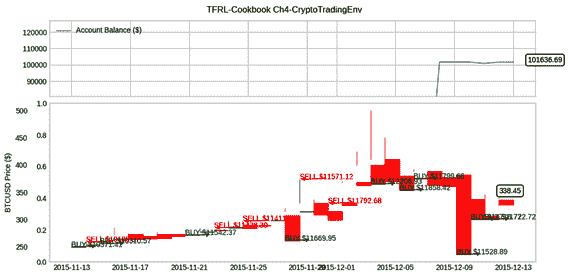
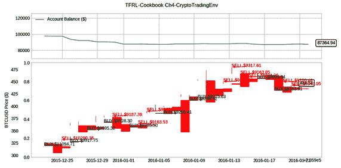
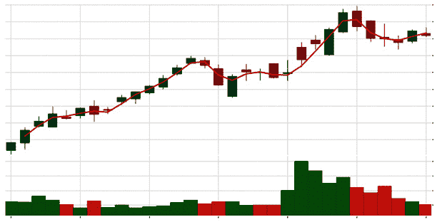
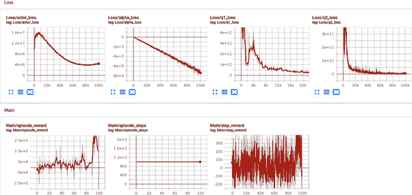

# 第四章：*第四章*：现实世界中的强化学习——构建加密货币交易智能体

**深度强化学习**（**深度 RL**）智能体在解决现实世界中的挑战性问题时具有很大的潜力，并且存在许多机会。然而，现实世界中成功应用深度 RL 智能体的故事较少，除了游戏领域，主要是由于与 RL 智能体在实际部署中相关的各种挑战。本章包含了一些食谱，帮助你成功开发用于一个有趣且具有回报的现实世界问题的 RL 智能体：**加密货币交易**。本章的食谱包含了如何为加密货币交易实现自定义的、兼容 OpenAI Gym 的学习环境，这些环境支持离散和连续值的动作空间。此外，你还将学习如何为加密货币交易构建和训练 RL 智能体。交易学习环境也将提供。

具体来说，本章将涉及以下食谱：

+   使用真实市场数据构建比特币交易强化学习平台

+   使用价格图表构建以太坊交易强化学习平台

+   为强化学习智能体构建一个先进的加密货币交易平台

+   使用 RL 训练加密货币交易机器人

让我们开始吧！

# 技术要求

书中的代码在 Ubuntu 18.04 和 Ubuntu 20.04 上经过了广泛测试，并且如果安装了 Python 3.6+，它应该也能在后续版本的 Ubuntu 上运行。安装了 Python 3.6+ 并且根据每个食谱开头列出的必要 Python 包后，这些代码应该在 Windows 和 macOS X 上也能正常运行。你应该创建并使用一个名为 `tf2rl-cookbook` 的 Python 虚拟环境来安装这些包，并运行本书中的代码。建议安装 Miniconda 或 Anaconda 来管理 Python 虚拟环境。

每个章节中每个食谱的完整代码可以在这里找到：[`github.com/PacktPublishing/Tensorflow-2-Reinforcement-Learning-Cookbook`](https://github.com/PacktPublishing/Tensorflow-2-Reinforcement-Learning-Cookbook)。

# 使用真实市场数据构建比特币交易强化学习平台

这个食谱将帮助你为智能体构建一个加密货币交易强化学习环境。这个环境模拟了基于来自 Gemini 加密货币交易所的真实数据的比特币交易所。在这个环境中，强化学习智能体可以进行买入/卖出/持有交易，并根据它的利润/亏损获得奖励，初始时智能体的交易账户中会有一笔现金余额。

## 准备工作

为完成这个食谱，请确保你使用的是最新版本。你需要激活 `tf2rl-cookbook` Python/conda 虚拟环境。确保更新该环境，使其与本书代码库中的最新 conda 环境规范文件（`tfrl-cookbook.yml`）匹配。如果以下 `import` 语句没有问题，那么你就可以开始了：

```py
import os
import random
from typing import Dict
import gym
import numpy as np
import pandas as pd
from gym import spaces
```

现在，让我们开始吧！

## 如何做……

按照以下步骤学习如何实现 `CryptoTradingEnv`：

1.  让我们从导入所需的 Python 模块开始：

1.  我们还将使用在 `trading_utils.py` 中实现的 `TradeVisualizer` 类。我们将在实际使用时更详细地讨论这个类：

    ```py
    from trading_utils import TradeVisualizer
    ```

1.  为了方便配置加密货币交易环境，我们将设置一个环境配置字典。请注意，我们的加密货币交易环境已被配置好，能够基于来自 Gemini 加密货币交易所的真实数据进行比特币交易：

    ```py
    env_config = {
        "exchange": "Gemini", # Cryptocurrency exchange
        # (Gemini, coinbase, kraken, etc.)
        "ticker": "BTCUSD", # CryptoFiat
        "frequency": "daily", # daily/hourly/minutes
        "opening_account_balance": 100000,
        # Number of steps (days) of data provided to the 
        # agent in one observation.
        "observation_horizon_sequence_length": 30,
        "order_size": 1, # Number of coins to buy per 
        # buy/sell order
    }
    ```

1.  让我们开始定义我们的 `CryptoTradingEnv` 类：

    ```py
    class CryptoTradingEnv(gym.Env):
        def __init__(self, env_config: Dict = env_config):
            super(CryptoTradingEnv, self).__init__()
            self.ticker = env_config.get("ticker", "BTCUSD")
            data_dir = os.path.join(os.path.dirname(os.path.\
                                 realpath(__file__)), "data")
            self.exchange = env_config["exchange"]
            freq = env_config["frequency"]
            if freq == "daily":
                self.freq_suffix = "d"
            elif freq == "hourly":
                self.freq_suffix = "1hr"
            elif freq == "minutes":
                self.freq_suffix = "1min"
    ```

1.  我们将使用一个文件对象作为加密货币交易所的数据源。我们必须确保在加载/流式传输数据到内存之前，数据源是存在的：

    ```py
            self.ticker_file_stream = os.path.join(
                f"{data_dir}",
                f"{'_'.join([self.exchange, self.ticker,
                             self.freq_suffix])}.csv",
            )
            assert os.path.isfile(
                self.ticker_file_stream
            ), f"Cryptocurrency data file stream not found \
              at: data/{self.ticker_file_stream}.csv"
            # Cryptocurrency exchange data stream. An offline 
            # file stream is used. Alternatively, a web
            # API can be used to pull live data.
            self.ohlcv_df = pd.read_csv(self.ticker_file_\
                stream, skiprows=1).sort_values(by="Date"
            )
    ```

1.  代理账户中的初始余额通过 `env_config` 配置。让我们根据配置的值初始化初始账户余额：

    ```py
    self.opening_account_balance = env_config["opening_account_balance"]
    ```

1.  接下来，让我们使用 OpenAI Gym 库提供的标准空间类型定义来定义该加密货币交易环境的动作空间和观察空间：

    ```py
            # Action: 0-> Hold; 1-> Buy; 2 ->Sell;
            self.action_space = spaces.Discrete(3)
            self.observation_features = [
                "Open",
                "High",
                "Low",
                "Close",
                "Volume BTC",
                "Volume USD",
            ]
            self.horizon = env_config.get(
                       "observation_horizon_sequence_length")
            self.observation_space = spaces.Box(
                low=0,
                high=1,
                shape=(len(self.observation_features), 
                           self.horizon + 1),
                dtype=np.float,
            )
    ```

1.  让我们定义代理在进行交易时将执行的交易订单大小：

    ```py
            self.order_size = env_config.get("order_size")
    ```

1.  至此，我们已成功初始化环境！接下来，让我们定义 `step(…)` 方法。你会注意到，为了简化理解，我们使用了两个辅助成员方法：`self.execute_trade_action` 和 `self.get_observation`，简化了 `step(…)` 方法的实现。我们将在稍后定义这些辅助方法，等到我们完成基本的 RL Gym 环境方法（`step`、`reset` 和 `render`）的实现。现在，让我们看看 `step` 方法的实现：

    ```py
    def step(self, action):
            # Execute one step within the trading environment
            self.execute_trade_action(action)
            self.current_step += 1
            reward = self.account_value - \
                     self.opening_account_balance  
                    # Profit (loss)
            done = self.account_value <= 0 or \
                   self.current_step >= len(
                self.ohlcv_df.loc[:, "Open"].values
            )
            obs = self.get_observation()
            return obs, reward, done, {}
    ```

1.  现在，让我们定义 `reset()` 方法，它将在每个 episode 开始时执行：

    ```py
    def reset(self):
            # Reset the state of the environment to an 
            # initial state
            self.cash_balance = self.opening_account_balance
            self.account_value = self.opening_account_balance
            self.num_coins_held = 0
            self.cost_basis = 0
            self.current_step = 0
            self.trades = []
            if self.viz is None:
                self.viz = TradeVisualizer(
                    self.ticker,
                    self.ticker_file_stream,
                    "TFRL-Cookbook Ch4-CryptoTradingEnv",
                    skiprows=1,  # Skip the first line with 
                    # the data download source URL
                )
            return self.get_observation()
    ```

1.  下一步，我们将定义 `render()` 方法，它将为我们提供加密货币交易环境的视图，帮助我们理解发生了什么！在这里，我们将使用来自 `trading_utils.py` 文件中的 `TradeVisualizer` 类。`TradeVisualizer` 帮助我们可视化代理在环境中学习时的实时账户余额。该可视化工具还通过显示代理在环境中执行的买卖交易，直观地呈现代理的操作。以下是 `render()` 方法输出的示例截图，供您参考：

    ```py
        def render(self, **kwargs):
            # Render the environment to the screen
            if self.current_step > self.horizon:
                self.viz.render(
                    self.current_step,
                    self.account_value,
                    self.trades,
                    window_size=self.horizon,
                )
    ```

1.  接下来，我们将实现一个方法，在训练完成后关闭所有可视化窗口：

    ```py
        def close(self):
            if self.viz is not None:
                self.viz.close()
                self.viz = None
    ```

1.  现在，我们可以实现 `execute_trade_action` 方法，它在之前第 9 步的 `step(…)` 方法中有所使用。我们将把实现过程分为三个步骤，每个步骤对应一个订单类型：Hold、Buy 和 Sell。我们先从 Hold 订单类型开始，因为它是最简单的。稍后你会明白为什么！

    ```py
        def execute_trade_action(self, action):
            if action == 0:  # Hold position
                return

    ```

1.  实际上，在我们继续实现买入和卖出订单执行逻辑之前，我们需要实现另一个中间步骤。在这里，我们必须确定订单类型（买入或卖出），然后获取当前模拟时间下比特币的价格：

    ```py
            order_type = "buy" if action == 1 else "sell"
            # Stochastically determine the current price 
            # based on Market Open & Close
            current_price = random.uniform(
                self.ohlcv_df.loc[self.current_step, "Open"],
                self.ohlcv_df.loc[self.current_step, 
                                  "Close"],
            )
    ```

1.  现在，我们准备好实现执行买入交易订单的逻辑，代码如下：

    ```py
            if order_type == "buy":
                allowable_coins = \
                    int(self.cash_balance / current_price)
                if allowable_coins < self.order_size:
                    # Not enough cash to execute a buy order
                    return
                # Simulate a BUY order and execute it at 
                # current_price
                num_coins_bought = self.order_size
                current_cost = self.cost_basis * \
                               self.num_coins_held
                additional_cost = num_coins_bought * \
                                  current_price
                self.cash_balance -= additional_cost
                self.cost_basis = (current_cost + \
                    additional_cost) / (
                    self.num_coins_held + num_coins_bought
                )
                self.num_coins_held += num_coins_bought
    ```

1.  让我们使用最新的买入交易更新`trades`列表：

    ```py
                self.trades.append(
                    {
                        "type": "buy",
                        "step": self.current_step,
                        "shares": num_coins_bought,
                        "proceeds": additional_cost,
                    }
                )
    ```

1.  下一步是实现执行卖出交易订单的逻辑：

    ```py
            elif order_type == "sell":
                # Simulate a SELL order and execute it at 
                # current_price
                if self.num_coins_held < self.order_size:
                    # Not enough coins to execute a sell 
                    # order
                    return
                num_coins_sold = self.order_size
                self.cash_balance += num_coins_sold * \
                                     current_price
                self.num_coins_held -= num_coins_sold
                sale_proceeds = num_coins_sold * \
                                current_price
                self.trades.append(
                    {
                        "type": "sell",
                        "step": self.current_step,
                        "shares": num_coins_sold,
                        "proceeds": sale_proceeds,
                    }
                )
    ```

1.  为了完成我们的交易执行函数，我们需要添加几行代码来更新账户价值，一旦交易订单执行完毕：

    ```py
            if self.num_coins_held == 0:
                self.cost_basis = 0
            # Update account value
            self.account_value = self.cash_balance + \
                                 self.num_coins_held * \
                                 current_price
    ```

1.  到此为止，我们已经完成了一个由 Gemini 加密货币交易所提供的真实 BTCUSD 数据驱动的比特币交易强化学习环境的实现！让我们看看如何轻松创建环境并运行示例，而不是在这个环境中使用一个随机代理，所有这一切只需要六行代码：

    ```py
    if __name__ == "__main__":
        env = CryptoTradingEnv()
        obs = env.reset()
        for _ in range(600):
            action = env.action_space.sample()
            next_obs, reward, done, _ = env.step(action)
            env.render()
    ```

    你应该能看到在`CryptoTradingEnv`环境中随机代理的示例。`env.render()`函数应该产生类似以下的渲染：



图 4.2 – 展示 CryptoTradingEnv 环境的渲染，显示代理的当前账户余额以及买卖交易的执行情况

现在，让我们看看这一切是如何运作的。

## 它是如何工作的……

在这个配方中，我们实现了`CryptoTradingEnv`函数，它提供了形状为(6, horizon + 1)的表格型观察数据，其中 horizon 可以通过`env_config`字典进行配置。horizon 参数指定了时间窗口的持续时间（例如，3 天），即 Agent 在每次交易之前允许观察加密货币市场数据的时间长度。一旦 Agent 执行了允许的离散动作之一——0（保持）、1（买入）或 2（卖出）——相应的交易将在当前的加密货币（比特币）交易价格下执行，并且交易账户余额将随之更新。Agent 还将根据从本集开始的交易所获得的利润（或亏损）获得奖励。

# 使用价格图表构建以太坊交易强化学习平台

这个配方将教你如何为 RL 代理实现一个以太坊加密货币交易环境，提供视觉观察数据。Agent 将观察指定时间段内的价格图表，图表包含开盘价、最高价、最低价、收盘价和交易量信息，以便做出决策（保持、买入或卖出）。Agent 的目标是最大化其奖励，即如果你将 Agent 部署到你的账户进行交易时所能获得的利润！

## 准备就绪

为了完成这个食谱，确保你使用的是最新版本。你需要激活`tf2rl-cookbook` Python/conda 虚拟环境。确保它会更新环境，使其匹配最新的 conda 环境规格文件（`tfrl-cookbook.yml`），该文件可以在本食谱的代码库中找到。如果以下`import`语句没有问题，你就可以开始了：

```py
import os
import random
from typing import Dict
import cv2
import gym
import numpy as np
import pandas as pd
from gym import spaces
from trading_utils import TradeVisualizer
```

## 如何做到…

让我们遵循 OpenAI Gym 框架来实现我们的学习环境接口。我们将添加一些逻辑，模拟加密货币交易执行并适当地奖励智能体，因为这将有助于你的学习。

按照以下步骤完成你的实现：

1.  让我们通过使用字典来配置环境：

    ```py
    env_config = {
        "exchange": "Gemini",  # Cryptocurrency exchange 
        # (Gemini, coinbase, kraken, etc.)
        "ticker": "ETHUSD",  # CryptoFiat
        "frequency": "daily",  # daily/hourly/minutes
        "opening_account_balance": 100000,
        # Number of steps (days) of data provided to the 
        # agent in one observation
        "observation_horizon_sequence_length": 30,
        "order_size": 1,  # Number of coins to buy per 
        # buy/sell order
    }
    ```

1.  让我们定义`CryptoTradingVisualEnv`类并从`env_config`加载设置：

    ```py
    class CryptoTradingVisualEnv(gym.Env):
        def __init__(self, env_config: Dict = env_config):
            """Cryptocurrency trading environment for RL 
            agents
            The observations are cryptocurrency price info 
            (OHLCV) over a horizon as specified in 
            env_config. Action space is discrete to perform 
            buy/sell/hold trades.
            Args:
                ticker(str, optional): Ticker symbol for the\
                crypto-fiat currency pair.
                Defaults to "ETHUSD".
                env_config (Dict): Env configuration values
            """
            super(CryptoTradingVisualEnv, self).__init__()
            self.ticker = env_config.get("ticker", "ETHUSD")
            data_dir = os.path.join(os.path.dirname(os.path.\
                                 realpath(__file__)), "data")
            self.exchange = env_config["exchange"]
            freq = env_config["frequency"]
    ```

1.  下一步，根据市场数据源的频率配置，加载来自输入流的加密货币交易所数据：

    ```py
        if freq == "daily":
                self.freq_suffix = "d"
            elif freq == "hourly":
                self.freq_suffix = "1hr"
            elif freq == "minutes":
                self.freq_suffix = "1min"
            self.ticker_file_stream = os.path.join(
                f"{data_dir}",
                f"{'_'.join([self.exchange, self.ticker, \
                             self.freq_suffix])}.csv",
            )
            assert os.path.isfile(
                self.ticker_file_stream
            ), f"Cryptocurrency exchange data file stream \
            not found at: data/{self.ticker_file_stream}.csv"
            # Cryptocurrency exchange data stream. An offline 
            # file stream is used. Alternatively, a web
            # API can be used to pull live data.
            self.ohlcv_df = pd.read_csv(self.ticker_file_\
                stream, skiprows=1).sort_values(
                by="Date"
            )
    ```

1.  让我们初始化其他环境类变量，并定义状态和动作空间：

    ```py
            self.opening_account_balance = \
                env_config["opening_account_balance"]
            # Action: 0-> Hold; 1-> Buy; 2 ->Sell;
            self.action_space = spaces.Discrete(3)
            self.observation_features = [
                "Open",
                "High",
                "Low",
                "Close",
                "Volume ETH",
                "Volume USD",
            ]
            self.obs_width, self.obs_height = 128, 128
            self.horizon = env_config.get("
                observation_horizon_sequence_length")
            self.observation_space = spaces.Box(
                low=0, high=255, shape=(128, 128, 3),
                dtype=np.uint8,
            )
            self.order_size = env_config.get("order_size")
            self.viz = None  # Visualizer
    ```

1.  让我们定义`reset`方法，以便（重新）初始化环境类变量：

    ```py
        def reset(self):
            # Reset the state of the environment to an 
            # initial state
            self.cash_balance = self.opening_account_balance
            self.account_value = self.opening_account_balance
            self.num_coins_held = 0
            self.cost_basis = 0
            self.current_step = 0
            self.trades = []
            if self.viz is None:
                self.viz = TradeVisualizer(
                    self.ticker,
                    self.ticker_file_stream,
                    "TFRL-Cookbook\
                       Ch4-CryptoTradingVisualEnv",
                    skiprows=1,
                )
            return self.get_observation()
    ```

1.  这个环境的关键特性是，智能体的观察是价格图表的图像，类似于你在人工交易员的计算机屏幕上看到的图表。这个图表包含闪烁的图形、红绿条和蜡烛！让我们定义`get_observation`方法，以返回图表屏幕的图像：

    ```py
        def get_observation(self):
            """Return a view of the Ticker price chart as 
               image observation
            Returns:
                img_observation(np.ndarray): Image of ticker
                candle stick plot with volume bars as 
                observation
            """
            img_observation = \
                self.viz.render_image_observation(
                self.current_step, self.horizon
            )
            img_observation = cv2.resize(
                img_observation, dsize=(128, 128), 
                interpolation=cv2.INTER_CUBIC
            )
            return img_observation
    ```

1.  现在，我们将实现交易环境的交易执行逻辑。必须从市场数据流中提取以太坊加密货币（以美元计）的当前价格（在本例中为一个文件）：

    ```py
        def execute_trade_action(self, action):
            if action == 0:  # Hold position
                return
            order_type = "buy" if action == 1 else "sell"
            # Stochastically determine the current price
            # based on Market Open & Close
            current_price = random.uniform(
                self.ohlcv_df.loc[self.current_step, "Open"],
                self.ohlcv_df.loc[self.current_step, 
                                  "Close"],
            )
    ```

1.  如果智能体决定执行买入订单，我们必须计算智能体在单步中可以购买的以太坊代币/币的数量，并在模拟交易所执行“买入”订单：

    ```py
                # Buy Order             allowable_coins = \
                    int(self.cash_balance / current_price)
                if allowable_coins < self.order_size:
                    # Not enough cash to execute a buy order
                    return
                # Simulate a BUY order and execute it at 
                # current_price
                num_coins_bought = self.order_size
                current_cost = self.cost_basis * \
                               self.num_coins_held
                additional_cost = num_coins_bought * \
                                  current_price
                self.cash_balance -= additional_cost
                self.cost_basis = \
                    (current_cost + additional_cost) / (
                    self.num_coins_held + num_coins_bought
                )
                self.num_coins_held += num_coins_bought
                self.trades.append(
                    {
                        "type": "buy",
                        "step": self.current_step,
                        "shares": num_coins_bought,
                        "proceeds": additional_cost,
                    }
                )
    ```

1.  相反，如果智能体决定卖出，以下逻辑将执行卖出订单：

    ```py
               # Simulate a SELL order and execute it at 
               # current_price
                if self.num_coins_held < self.order_size:
                    # Not enough coins to execute a sell
                    # order
                    return
                num_coins_sold = self.order_size
                self.cash_balance += num_coins_sold * \
                                     current_price
                self.num_coins_held -= num_coins_sold
                sale_proceeds = num_coins_sold * \
                                current_price
                self.trades.append(
                    {
                        "type": "sell",
                        "step": self.current_step,
                        "shares": num_coins_sold,
                        "proceeds": sale_proceeds,
                    }
                )
    ```

1.  让我们更新账户余额，以反映买卖交易的影响：

    ```py
            if self.num_coins_held == 0:
                self.cost_basis = 0
            # Update account value
            self.account_value = self.cash_balance + \
                                 self.num_coins_held * \
                                 current_price
    ```

1.  我们现在准备实现`step`方法：

    ```py
        def step(self, action):
            # Execute one step within the trading environment
            self.execute_trade_action(action)
            self.current_step += 1
            reward = self.account_value - \
                self.opening_account_balance  # Profit (loss)
            done = self.account_value <= 0 or \
                     self.current_step >= len(
                self.ohlcv_df.loc[:, "Open"].values
            )
            obs = self.get_observation()
            return obs, reward, done, {}
    ```

1.  让我们实现一个方法，将当前状态渲染为图像并显示到屏幕上。这将帮助我们理解智能体在学习交易时环境中发生了什么：

    ```py
        def render(self, **kwargs):
            # Render the environment to the screen
            if self.current_step > self.horizon:
                self.viz.render(
                    self.current_step,
                    self.account_value,
                    self.trades,
                    window_size=self.horizon,
                )
    ```

1.  这就完成了我们的实现！让我们快速查看一下使用随机智能体的环境：

    ```py
    if __name__ == "__main__":
        env = CryptoTradingVisualEnv()
        obs = env.reset()
        for _ in range(600):
            action = env.action_space.sample()
            next_obs, reward, done, _ = env.step(action)
            env.render()
    ```

    你应该看到示例随机智能体在`CryptoTradinVisualEnv`中执行的情况，其中智能体接收与此处所示相似的视觉/图像观察：



图 4.3 – 发送给学习智能体的示例观察

就这样，这个食谱完成了！

## 它是如何工作的……

在这个食谱中，我们实现了一个可视化的以太坊加密货币交易环境，提供图像作为代理的输入。图像包含了图表信息，如开盘、最高、最低、收盘和成交量数据。这个图表看起来就像一个人类交易员的屏幕，向代理提供当前市场的信号。

# 构建一个高级的加密货币交易平台为 RL 代理

如果我们不让代理只采取离散的动作，比如购买/卖出/持有预设数量的比特币或以太坊代币，而是让代理决定它想买或卖多少加密货币/代币呢？这正是这个食谱所要让你实现的功能，创建一个`CryptoTradingVisualContinuousEnv`的 RL 环境。

## 准备工作

为了完成这个方案，你需要确保你拥有最新版本的内容。你需要激活`tf2rl-cookbook` Python/conda 虚拟环境。确保你更新环境，以便它符合最新的 conda 环境规范文件（`tfrl-cookbook.yml`），该文件可以在这个食谱的代码库中找到。如果以下的`import`语句没有任何问题地运行，那么你就可以开始了：

```py
import os
import random
from typing import Dict
import cv2
import gym
import numpy as np
import pandas as pd
from gym import spaces
from trading_utils import TradeVisualizer
```

## 怎么做…

这是一个复杂的环境，因为它使用高维图像作为观察输入，并允许执行连续的真实值动作。不过，由于你在本章中已经实现了前面几个食谱的经验，你很可能已经熟悉这个食谱的各个组成部分。

让我们开始吧：

1.  首先，我们需要定义该环境允许的配置参数：

    ```py
    env_config = {
        "exchange": "Gemini",  # Cryptocurrency exchange 
         # (Gemini, coinbase, kraken, etc.)
        "ticker": "BTCUSD",  # CryptoFiat
        "frequency": "daily",  # daily/hourly/minutes
        "opening_account_balance": 100000,
        # Number of steps (days) of data provided to the 
        # agent in one observation
        "observation_horizon_sequence_length": 30,
    }
    ```

1.  让我们直接进入学习环境类的定义：

    ```py
    class CryptoTradingVisualContinuousEnv(gym.Env):
        def __init__(self, env_config: Dict = env_config):
            """Cryptocurrency trading environment for RL 
            agents with continuous action space
            Args:
                ticker (str, optional): Ticker symbol for the 
                crypto-fiat currency pair.
                Defaults to "BTCUSD".
                env_config (Dict): Env configuration values
            """
            super(CryptoTradingVisualContinuousEnv, 
                  self).__init__()
            self.ticker = env_config.get("ticker", "BTCUSD")
            data_dir = os.path.join(os.path.dirname(os.path.\
                                 realpath(__file__)), "data")
            self.exchange = env_config["exchange"]
            freq = env_config["frequency"]
            if freq == "daily":
                self.freq_suffix = "d"
            elif freq == "hourly":
                self.freq_suffix = "1hr"
            elif freq == "minutes":
                self.freq_suffix = "1min"
    ```

1.  这一步很直接，因为我们只需要将市场数据从输入源加载到内存中：

    ```py
            self.ticker_file_stream = os.path.join(
                f"{data_dir}",
                f"{'_'.join([self.exchange, self.ticker, \
                             self.freq_suffix])}.csv",
            )
            assert os.path.isfile(
                self.ticker_file_stream
            ), f"Cryptocurrency exchange data file stream \
            not found at: data/{self.ticker_file_stream}.csv"
            # Cryptocurrency exchange data stream. An offline 
            # file stream is used. Alternatively, a web
            # API can be used to pull live data.
            self.ohlcv_df = pd.read_csv(
                self.ticker_file_stream, 
                skiprows=1).sort_values(by="Date"
            )
            self.opening_account_balance = \
                env_config["opening_account_balance"]
    ```

1.  现在，让我们定义环境的连续动作空间和观察空间：

    ```py
            self.action_space = spaces.Box(
                low=np.array([-1]), high=np.array([1]), \
                             dtype=np.float
            )
            self.observation_features = [
                "Open",
                "High",
                "Low",
                "Close",
                "Volume BTC",
                "Volume USD",
            ]
            self.obs_width, self.obs_height = 128, 128
            self.horizon = env_config.get(
                       "observation_horizon_sequence_length")
            self.observation_space = spaces.Box(
                low=0, high=255, shape=(128, 128, 3), 
                dtype=np.uint8,
            )
    ```

1.  让我们定义环境中`step`方法的大致框架。接下来的步骤中我们将完成帮助方法的实现：

    ```py
        def step(self, action):
            # Execute one step within the environment
            self.execute_trade_action(action)
            self.current_step += 1
            reward = self.account_value - \
                self.opening_account_balance  # Profit (loss)
            done = self.account_value <= 0 or \
                    self.current_step >= len(
                self.ohlcv_df.loc[:, "Open"].values
            )
            obs = self.get_observation()
            return obs, reward, done, {}
    ```

1.  第一个帮助方法是`execute_trade_action`方法。接下来的几步实现应该很简单，因为前面几个食谱已经实现了在交易所按汇率买卖加密货币的逻辑：

    ```py
        def execute_trade_action(self, action):
            if action == 0:  # Indicates "HODL" action
                # HODL position; No trade to be executed
                return
            order_type = "buy" if action > 0 else "sell"
            order_fraction_of_allowable_coins = abs(action)
            # Stochastically determine the current price 
            # based on Market Open & Close
            current_price = random.uniform(
                self.ohlcv_df.loc[self.current_step, "Open"],
                self.ohlcv_df.loc[self.current_step,
                                  "Close"],
            )
    ```

1.  可以通过如下方式模拟交易所中的买入订单：

    ```py
            if order_type == "buy":
                allowable_coins = \
                    int(self.cash_balance / current_price)
                # Simulate a BUY order and execute it at 
                # current_price
                num_coins_bought = int(allowable_coins * \
                order_fraction_of_allowable_coins)
                current_cost = self.cost_basis * \
                               self.num_coins_held
                additional_cost = num_coins_bought * \
                                  current_price
                self.cash_balance -= additional_cost
                self.cost_basis = (current_cost + \
                                   additional_cost) / (
                    self.num_coins_held + num_coins_bought
                )
                self.num_coins_held += num_coins_bought
                if num_coins_bought > 0:
                    self.trades.append(
                        {
                            "type": "buy",
                            "step": self.current_step,
                            "shares": num_coins_bought,
                            "proceeds": additional_cost,
                        }
                    )
    ```

1.  同样地，卖出订单可以通过以下方式模拟：

    ```py
            elif order_type == "sell":
                # Simulate a SELL order and execute it at 
                # current_price
                num_coins_sold = int(
                    self.num_coins_held * \
                    order_fraction_of_allowable_coins
                )
                self.cash_balance += num_coins_sold * \
                                     current_price
                self.num_coins_held -= num_coins_sold
                sale_proceeds = num_coins_sold * \
                                current_price
                if num_coins_sold > 0:
                    self.trades.append(
                        {
                            "type": "sell",
                            "step": self.current_step,
                            "shares": num_coins_sold,
                            "proceeds": sale_proceeds,
                        }
                    )
    ```

1.  一旦买入/卖出订单执行完毕，账户余额需要更新：

    ```py
            if self.num_coins_held == 0:
                self.cost_basis = 0
            # Update account value
            self.account_value = self.cash_balance + \
                                 self.num_coins_held * \
                                 current_price
    ```

1.  为了测试`CryptoTradingVisualcontinuousEnv`，你可以使用以下代码行来进行`__main__`函数的测试：

    ```py
    if __name__ == "__main__":
        env = CryptoTradingVisualContinuousEnv()
        obs = env.reset()
        for _ in range(600):
            action = env.action_space.sample()
            next_obs, reward, done, _ = env.step(action)
            env.render()
    ```

## 它是如何工作的…

`CryptoTradingVisualcontinuousEnv`提供了一个强化学习环境，观察值是类似交易者屏幕的图像，并为代理提供了一个连续的、实值的动作空间。在这个环境中，动作是单维的、连续的且实值的，大小表示加密货币的购买/出售比例。如果动作为正（0 到 1），则解释为买入指令；如果动作为负（-1 到 0），则解释为卖出指令。这个比例值根据交易账户中的余额转换成可以买卖的加密货币数量。

# 使用强化学习训练加密货币交易机器人

Soft Actor-Critic（SAC）代理是目前最流行、最先进的强化学习代理之一，基于一个脱离策略的最大熵深度强化学习算法。这个配方提供了你从零开始构建 SAC 代理所需的所有组件，使用 TensorFlow 2.x，并使用来自 Gemini 加密货币交易所的真实数据来训练它进行加密货币（比特币、以太坊等）交易。

## 准备工作

为了完成这个配方，请确保你使用的是最新版本。你需要激活`tf2rl-cookbook`的 Python/conda 虚拟环境。确保更新环境，使其与最新的 conda 环境规格文件（`tfrl-cookbook.yml`）匹配，该文件可以在本配方的代码库中找到。如果以下`import`语句没有问题，说明你可以开始操作了：

```py
mport functools
import os
import random
from collections import deque
from functools import reduce
import imageio
import numpy as np
import tensorflow as tf
import tensorflow_probability as tfp
from tensorflow.keras.layers import Concatenate, Dense, Input
from tensorflow.keras.models import Model
from tensorflow.keras.optimizers import Adam
from crypto_trading_continuous_env import CryptoTradingContinuousEnv
```

## 如何操作…

这个配方将指导你逐步实现 SAC 代理的过程，并帮助你在加密货币交易环境中训练代理，从而实现自动化的盈利机器！

让我们准备好，开始实现：

1.  SAC 是一个演员-评论家代理，所以它有演员和评论家两个组件。让我们先定义使用 TensorFlow 2.x 的演员神经网络：

    ```py
    def actor(state_shape, action_shape, units=(512, 256, 64)):
        state_shape_flattened = \
            functools.reduce(lambda x, y: x * y, state_shape)
        state = Input(shape=state_shape_flattened)
        x = Dense(units[0], name="L0", activation="relu")\
                  (state)
        for index in range(1, len(units)):
            x = Dense(units[index],name="L{}".format(index),\ 
                      activation="relu")(x)
        actions_mean = Dense(action_shape[0], \
                        name="Out_mean")(x)
        actions_std = Dense(action_shape[0], \
                       name="Out_std")(x)
        model = Model(inputs=state, 
                      outputs=[actions_mean, actions_std])
        return model
    ```

1.  接下来，让我们定义评论家神经网络：

    ```py
    def critic(state_shape, action_shape, units=(512, 256, 64)):
        state_shape_flattened = \
            functools.reduce(lambda x, y: x * y, state_shape)
        inputs = [Input(shape=state_shape_flattened),
                  Input(shape=action_shape)]
        concat = Concatenate(axis=-1)(inputs)
        x = Dense(units[0], name="Hidden0", 
                  activation="relu")(concat)
        for index in range(1, len(units)):
            x = Dense(units[index], 
                      name="Hidden{}".format(index),
                      activation="relu")(x)
        output = Dense(1, name="Out_QVal")(x)
        model = Model(inputs=inputs, outputs=output)
        return model
    ```

1.  给定当前模型的权重和目标模型的权重，让我们实现一个快速的函数，利用`tau`作为平均因子，慢慢更新目标权重。这就像 Polyak 平均步骤：

    ```py
    def update_target_weights(model, target_model, tau=0.005):
        weights = model.get_weights()
        target_weights = target_model.get_weights()
        for i in range(len(target_weights)):  # set tau% of
        # target model to be new weights
            target_weights[i] = weights[i] * tau + \
                                target_weights[i] * (1 - tau)
        target_model.set_weights(target_weights)
    ```

1.  我们现在准备初始化我们的 SAC 代理类：

    ```py
    class SAC(object):
        def __init__(
            self,
            env,
            lr_actor=3e-5,
            lr_critic=3e-4,
            actor_units=(64, 64),
            critic_units=(64, 64),
            auto_alpha=True,
            alpha=0.2,
            tau=0.005,
            gamma=0.99,
            batch_size=128,
            memory_cap=100000,
        ):
            self.env = env
            self.state_shape = env.observation_space.shape  
            # shape of observations
            self.action_shape = env.action_space.shape  
            # number of actions
            self.action_bound = (env.action_space.high - \
                                 env.action_space.low) / 2
            self.action_shift = (env.action_space.high + \
                                 env.action_space.low) / 2
            self.memory = deque(maxlen=int(memory_cap))
    ```

1.  作为下一步，我们将初始化演员网络，并打印演员神经网络的摘要：

    ```py
            # Define and initialize actor network
            self.actor = actor(self.state_shape, 
                              self.action_shape, actor_units)
            self.actor_optimizer = \
                Adam(learning_rate=lr_actor)
            self.log_std_min = -20
            self.log_std_max = 2
            print(self.actor.summary())
    ```

1.  接下来，我们将定义两个评论家网络，并打印评论家神经网络的摘要：

    ```py
            self.critic_1 = critic(self.state_shape, 
                             self.action_shape, critic_units)
            self.critic_target_1 = critic(self.state_shape,
                             self.action_shape, critic_units)
            self.critic_optimizer_1 = \
                 Adam(learning_rate=lr_critic)
            update_target_weights(self.critic_1, \
                             self.critic_target_1, tau=1.0)
            self.critic_2 = critic(self.state_shape, \
                             self.action_shape, critic_units)
            self.critic_target_2 = critic(self.state_shape,\
                             self.action_shape, critic_units)
            self.critic_optimizer_2 = \
                Adam(learning_rate=lr_critic)
            update_target_weights(self.critic_2, \
                self.critic_target_2, tau=1.0)
            print(self.critic_1.summary())
    ```

1.  让我们初始化`alpha`温度参数和目标熵：

    ```py
            self.auto_alpha = auto_alpha
            if auto_alpha:
                self.target_entropy = \
                    -np.prod(self.action_shape)
                self.log_alpha = \
                    tf.Variable(0.0, dtype=tf.float64)
                self.alpha = \
                    tf.Variable(0.0, dtype=tf.float64)
                self.alpha.assign(tf.exp(self.log_alpha))
                self.alpha_optimizer = \
                    Adam(learning_rate=lr_actor)
            else:
                self.alpha = tf.Variable(alpha, 
                                         dtype=tf.float64)
    ```

1.  我们还将初始化 SAC 的其他超参数：

    ```py
            self.gamma = gamma  # discount factor
            self.tau = tau  # target model update
            self.batch_size = batch_size
    ```

1.  这完成了 SAC 代理的`__init__`方法。接下来，我们将实现一个方法来（预）处理采取的动作：

    ```py
        def process_actions(self, mean, log_std, test=False, 
        eps=1e-6):
            std = tf.math.exp(log_std)
            raw_actions = mean
            if not test:
                raw_actions += tf.random.normal(shape=mean.\
                               shape, dtype=tf.float64) * std
            log_prob_u = tfp.distributions.Normal(loc=mean,
                            scale=std).log_prob(raw_actions)
            actions = tf.math.tanh(raw_actions)
            log_prob = tf.reduce_sum(log_prob_u - \
                        tf.math.log(1 - actions ** 2 + eps))
            actions = actions * self.action_bound + \
                       self.action_shift
            return actions, log_prob
    ```

1.  我们现在准备实现`act`方法，以便在给定状态下生成 SAC 代理的动作：

    ```py
        def act(self, state, test=False, use_random=False):
            state = state.reshape(-1)  # Flatten state
            state = \
             np.expand_dims(state, axis=0).astype(np.float64)
            if use_random:
                a = tf.random.uniform(
                    shape=(1, self.action_shape[0]), \
                    minval=-1, maxval=1, dtype=tf.float64
                )
            else:
                means, log_stds = self.actor.predict(state)
                log_stds = tf.clip_by_value(log_stds, 
                                            self.log_std_min,
                                            self.log_std_max)
                a, log_prob = self.process_actions(means,
                                                   log_stds, 
                                                   test=test)
            q1 = self.critic_1.predict([state, a])[0][0]
            q2 = self.critic_2.predict([state, a])[0][0]
            self.summaries["q_min"] = tf.math.minimum(q1, q2)
            self.summaries["q_mean"] = np.mean([q1, q2])
            return a
    ```

1.  为了将经验保存到回放记忆中，让我们实现`remember`函数：

    ```py
        def remember(self, state, action, reward, next_state, 
        done):
            state = state.reshape(-1)  # Flatten state
            state = np.expand_dims(state, axis=0)
            next_state = next_state.reshape(-1)  
           # Flatten next-state
            next_state = np.expand_dims(next_state, axis=0)
            self.memory.append([state, action, reward, 
                                next_state, done])
    ```

1.  现在，让我们开始实现经验回放过程。我们将从初始化回放方法开始。我们将在接下来的步骤中完成回放方法的实现：

    ```py
        def replay(self):
            if len(self.memory) < self.batch_size:
                return
            samples = random.sample(self.memory, self.batch_size)
            s = np.array(samples).T
            states, actions, rewards, next_states, dones = [
                np.vstack(s[i, :]).astype(np.float) for i in\
                range(5)
            ]
    ```

1.  让我们启动一个持久化的`GradientTape`函数，并开始累积梯度。我们通过处理动作并获取下一组动作和对数概率来实现这一点：

    ```py
            with tf.GradientTape(persistent=True) as tape:
                # next state action log probs
                means, log_stds = self.actor(next_states)
                log_stds = tf.clip_by_value(log_stds, 
                                            self.log_std_min,
                                            self.log_std_max)
                next_actions, log_probs = \
                    self.process_actions(means, log_stds)
    ```

1.  这样，我们现在可以计算两个评论者网络的损失：

    ```py
                current_q_1 = self.critic_1([states, 
                                             actions])
                current_q_2 = self.critic_2([states,
                                             actions])
                next_q_1 = self.critic_target_1([next_states, 
                                               next_actions])
                next_q_2 = self.critic_target_2([next_states,
                                               next_actions])
                next_q_min = tf.math.minimum(next_q_1,
                                              next_q_2)
                state_values = next_q_min - self.alpha * \
                                            log_probs
                target_qs = tf.stop_gradient(
                    rewards + state_values * self.gamma * \
                    (1.0 - dones)
                )
                critic_loss_1 = tf.reduce_mean(
                    0.5 * tf.math.square(current_q_1 - \
                                         target_qs)
                )
                critic_loss_2 = tf.reduce_mean(
                    0.5 * tf.math.square(current_q_2 - \
                                         target_qs)
                )
    ```

1.  当前的状态-动作对和由演员提供的对数概率可以通过以下方式计算：

    ```py
                means, log_stds = self.actor(states)
                log_stds = tf.clip_by_value(log_stds, 
                                            self.log_std_min,
                                            self.log_std_max)
                actions, log_probs = \
                    self.process_actions(means, log_stds)
    ```

1.  我们现在可以计算演员的损失并将梯度应用到评论者上：

    ```py
                current_q_1 = self.critic_1([states, 
                                             actions])
                current_q_2 = self.critic_2([states,
                                             actions])
                current_q_min = tf.math.minimum(current_q_1,
                                                current_q_2)
                actor_loss = tf.reduce_mean(self.alpha * \
                                   log_probs - current_q_min)
                if self.auto_alpha:
                    alpha_loss = -tf.reduce_mean(
                        (self.log_alpha * \
                        tf.stop_gradient(log_probs + \
                                        self.target_entropy))
                    )
            critic_grad = tape.gradient(
                critic_loss_1, 
                self.critic_1.trainable_variables
            )  
            self.critic_optimizer_1.apply_gradients(
                zip(critic_grad, 
                self.critic_1.trainable_variables)
            )
    ```

1.  类似地，我们可以计算并应用演员的梯度：

    ```py
            critic_grad = tape.gradient(
                critic_loss_2, 
            self.critic_2.trainable_variables
            )  # compute actor gradient
            self.critic_optimizer_2.apply_gradients(
                zip(critic_grad, 
                self.critic_2.trainable_variables)
            )
            actor_grad = tape.gradient(
                actor_loss, self.actor.trainable_variables
            )  # compute actor gradient
            self.actor_optimizer.apply_gradients(
                zip(actor_grad, 
                    self.actor.trainable_variables)
            )
    ```

1.  现在，让我们将摘要记录到 TensorBoard：

    ```py
            # tensorboard info
            self.summaries["q1_loss"] = critic_loss_1
            self.summaries["q2_loss"] = critic_loss_2
            self.summaries["actor_loss"] = actor_loss
            if self.auto_alpha:
                # optimize temperature
                alpha_grad = tape.gradient(alpha_loss, 
                                           [self.log_alpha])
                self.alpha_optimizer.apply_gradients(
                           zip(alpha_grad, [self.log_alpha]))
                self.alpha.assign(tf.exp(self.log_alpha))
                # tensorboard info
                self.summaries["alpha_loss"] = alpha_loss
    ```

1.  这完成了我们的经验回放方法。现在，我们可以继续`train`方法的实现。让我们从初始化`train`方法开始。我们将在接下来的步骤中完成此方法的实现：

    ```py
        def train(self, max_epochs=8000, random_epochs=1000,
        max_steps=1000, save_freq=50):
            current_time = datetime.datetime.now().\
                               strftime("%Y%m%d-%H%M%S")
            train_log_dir = os.path.join("logs", 
                       "TFRL-Cookbook-Ch4-SAC", current_time)
            summary_writer = \
                tf.summary.create_file_writer(train_log_dir)
            done, use_random, episode, steps, epoch, \
            episode_reward = (
                False,
                True,
                0,
                0,
                0,
                0,
            )
            cur_state = self.env.reset()
    ```

1.  现在，我们准备开始主训练循环。首先，让我们处理结束集的情况：

    ```py
            while epoch < max_epochs:
                if steps > max_steps:
                    done = True
                if done:
                    episode += 1
                    print(
                        "episode {}: {} total reward, 
                         {} alpha, {} steps, 
                         {} epochs".format(
                            episode, episode_reward, 
                            self.alpha.numpy(), steps, epoch
                        )
                    )
                    with summary_writer.as_default():
                        tf.summary.scalar(
                            "Main/episode_reward", \
                             episode_reward, step=episode
                        )
                        tf.summary.scalar(
                            "Main/episode_steps", 
                             steps, step=episode)
                    summary_writer.flush()
                    done, cur_state, steps, episode_reward =\
                         False, self.env.reset(), 0, 0
                    if episode % save_freq == 0:
                        self.save_model(
                            "sac_actor_episode{}.h5".\
                                 format(episode),
                            "sac_critic_episode{}.h5".\
                                 format(episode),
                        )
    ```

1.  每次进入环境时，SAC 代理学习需要执行以下步骤：

    ```py
                if epoch > random_epochs and \
                    len(self.memory) > self.batch_size:
                    use_random = False
                action = self.act(cur_state, \
                   use_random=use_random)  # determine action
                next_state, reward, done, _ = \
                    self.env.step(action[0])  # act on env
                # self.env.render(mode='rgb_array')
                self.remember(cur_state, action, reward, 
                            next_state, done)  #add to memory
                self.replay()  # train models through memory
                # replay
                update_target_weights(
                    self.critic_1, self.critic_target_1, 
                    tau=self.tau
                )  # iterates target model
                update_target_weights(self.critic_2, 
                self.critic_target_2, 
                tau=self.tau)
                cur_state = next_state
                episode_reward += reward
                steps += 1
                epoch += 1
    ```

1.  处理完代理更新后，我们现在可以将一些有用的信息记录到 TensorBoard 中：

    ```py
                # Tensorboard update
                with summary_writer.as_default():
                    if len(self.memory) > self.batch_size:
                        tf.summary.scalar(
                            "Loss/actor_loss", 
                             self.summaries["actor_loss"], 
                             step=epoch
                        )
                        tf.summary.scalar(
                            "Loss/q1_loss", 
                             self.summaries["q1_loss"], 
                             step=epoch
                        )
                        tf.summary.scalar(
                            "Loss/q2_loss", 
                           self.summaries["q2_loss"], 
                           step=epoch
                        )
                        if self.auto_alpha:
                            tf.summary.scalar(
                                "Loss/alpha_loss", 
                                self.summaries["alpha_loss"],
                                step=epoch
                            )
                    tf.summary.scalar("Stats/alpha", 
                                      self.alpha, step=epoch)
                    if self.auto_alpha:
                        tf.summary.scalar("Stats/log_alpha",
                                  self.log_alpha, step=epoch)
                    tf.summary.scalar("Stats/q_min", 
                        self.summaries["q_min"], step=epoch)
                    tf.summary.scalar("Stats/q_mean", 
                        self.summaries["q_mean"], step=epoch)
                    tf.summary.scalar("Main/step_reward", 
                                       reward, step=epoch)
                summary_writer.flush()
    ```

1.  作为我们`train`方法实现的最后一步，我们可以保存演员和评论者模型，以便在需要时恢复训练或从检查点重新加载：

    ```py
            self.save_model(
                "sac_actor_final_episode{}.h5".format(episode),
                "sac_critic_final_episode{}.h5".format(episode),
            )
    ```

1.  现在，我们将实际实现之前引用的`save_model`方法：

    ```py
        def save_model(self, a_fn, c_fn):
            self.actor.save(a_fn)
            self.critic_1.save(c_fn)
    ```

1.  让我们快速实现一个方法，从保存的模型中加载演员和评论者的状态，以便在需要时可以从之前保存的检查点恢复或继续：

    ```py
        def load_actor(self, a_fn):
            self.actor.load_weights(a_fn)
            print(self.actor.summary())
        def load_critic(self, c_fn):
            self.critic_1.load_weights(c_fn)
            self.critic_target_1.load_weights(c_fn)
            self.critic_2.load_weights(c_fn)
            self.critic_target_2.load_weights(c_fn)
            print(self.critic_1.summary())
    ```

1.  要以“测试”模式运行 SAC 代理，我们可以实现一个辅助方法：

    ```py
        def test(self, render=True, fps=30, 
        filename="test_render.mp4"):
            cur_state, done, rewards = self.env.reset(), \
                                        False, 0
            video = imageio.get_writer(filename, fps=fps)
            while not done:
                action = self.act(cur_state, test=True)
                next_state, reward, done, _ = \
                                     self.env.step(action[0])
                cur_state = next_state
                rewards += reward
                if render:
                    video.append_data(
                        self.env.render(mode="rgb_array"))
            video.close()
            return rewards
    ```

1.  这完成了我们的 SAC 代理实现。我们现在准备在`CryptoTradingContinuousEnv`中训练 SAC 代理：

    ```py
    if __name__ == "__main__":
        gym_env = CryptoTradingContinuousEnv()
        sac = SAC(gym_env)
        # Load Actor and Critic from previously saved 
        # checkpoints
        # sac.load_actor("sac_actor_episodexyz.h5")
        # sac.load_critic("sac_critic_episodexyz.h5")
        sac.train(max_epochs=100000, random_epochs=10000, 
                  save_freq=50)
        reward = sac.test()
        print(reward)
    ```

## 它是如何工作的…

SAC 是一种强大的 RL 算法，已证明在各种 RL 仿真环境中有效。SAC 不仅优化最大化每集奖励，还最大化代理策略的熵。您可以通过 TensorBoard 观察代理的学习进度，因为这个示例包括了记录代理进展的代码。您可以使用以下命令启动 TensorBoard：

```py
tensorboard –-logdir=logs
```

上述命令将启动 TensorBoard。您可以通过浏览器在默认地址`http://localhost:6006`访问它。这里提供了一个 TensorBoard 截图供参考：



图 4.4 – TensorBoard 截图，显示 SAC 代理在 CryptoTradingContinuousEnv 中的训练进度

这就是本章节的内容。祝你训练愉快！
