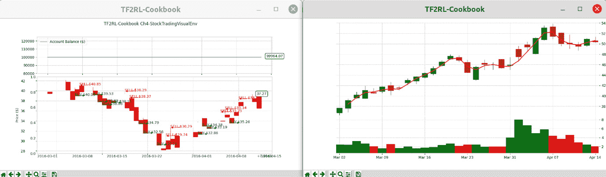

# 第五章：*第五章*：现实世界中的强化学习——构建股票/股市交易智能体

基于软件的**深度强化学习**（**深度 RL**）智能体在执行交易策略时具有巨大的潜力，能够不知疲倦且毫无瑕疵地执行任务，且不受人类交易员常见的内存容量、速度、效率以及情绪干扰等限制。股票市场中的盈利交易涉及在考虑多个市场因素（如交易条件、宏观和微观市场条件、社会、政治和公司特定变化）后，仔细执行买入/卖出交易，并处理股票符号/代码。深度 RL 智能体在解决现实世界中的复杂问题时具有巨大潜力，并且存在大量的机会。

然而，由于与现实世界中 RL 智能体部署相关的各种挑战，目前只有少数成功的案例，展示了深度强化学习（RL）智能体在游戏以外的现实世界中的应用。本章包含的食谱将帮助你成功地开发用于另一个有趣且有回报的现实世界问题——股票市场交易的 RL 智能体。提供的食谱包含有关如何实现与 OpenAI Gym 兼容的股票市场交易学习环境的定制方法，这些环境包括离散和连续值的动作空间。此外，你还将学习如何为股票交易学习环境构建和训练 RL 智能体。

本章将涵盖以下食谱：

+   使用真实股票交易数据构建股票市场交易强化学习平台

+   使用价格图表构建股票市场交易强化学习平台

+   构建一个先进的股票交易强化学习平台，训练智能体模仿专业交易员

让我们开始吧！

# 技术要求

本书中的代码已在 Ubuntu 18.04 和 Ubuntu 20.04 上进行了广泛测试，如果安装了 Python 3.6+，则应适用于更新版本的 Ubuntu。安装了 Python 3.6+ 及所需的 Python 包（如每个章节开始时列出的包）后，代码也应能在 Windows 和 Mac OS X 上正常运行。你应该创建并使用名为 `tf2rl-cookbook` 的 Python 虚拟环境来安装包并运行本书中的代码。建议安装 Miniconda 或 Anaconda 以便进行 Python 虚拟环境管理。

每章中的完整代码可以在此处找到：[`github.com/PacktPublishing/Tensorflow-2-Reinforcement-Learning-Cookbook`](https://github.com/PacktPublishing/Tensorflow-2-Reinforcement-Learning-Cookbook)。

# 使用真实股票交易数据构建股票市场交易强化学习平台

股票市场为任何人提供了一个高利润的机会，可以参与并赚取利润。虽然它易于接触，但并不是所有人都能持续获得盈利的交易，因为市场的动态性和情绪因素可能会影响人的决策。RL 代理将情绪因素排除在外，并可以训练成持续盈利的交易者。这个配方将教你如何实现一个股票市场交易环境，让你的 RL 代理学习如何使用真实的股市数据进行交易。当你训练足够后，你可以部署它们，让它们自动为你进行交易（并赚钱）！

## 准备开始

要完成此配方，请确保您拥有最新版本。您需要激活`tf2rl-cookbook`的 Python/conda 虚拟环境。请确保更新环境，以便它与最新的 conda 环境规范文件（`tfrl-cookbook.yml`）匹配，您可以在本烹饪书的代码库中找到该文件。如果以下`import`语句运行没有任何问题，您就可以开始了：

```py
import os
import random
from typing import Dict
import gym
import numpy as np
import pandas as pd
from gym import spaces
from trading_utils import TradeVisualizer
```

## 如何操作…

按照以下逐步流程来实现`StockTradingEnv`：

1.  让我们初始化环境的可配置参数：

    ```py
    env_config = {
        "ticker": "TSLA",
        "opening_account_balance": 1000,
        # Number of steps (days) of data provided to the 
        # agent in one observation
        "observation_horizon_sequence_length": 30,
        "order_size": 1,  # Number of shares to buy per 
        # buy/sell order
    }
    ```

1.  让我们初始化`StockTradingEnv`类并加载配置的股票交易代码的数据：

    ```py
    class StockTradingEnv(gym.Env):
        def __init__(self, env_config: Dict = env_config):
            """Stock trading environment for RL agents
            Args:
                ticker (str, optional): Ticker symbol for the
                stock. Defaults to "MSFT".
                env_config (Dict): Env configuration values
            """
            super(StockTradingEnv, self).__init__()
            self.ticker = env_config.get("ticker", "MSFT")
            data_dir = os.path.join(os.path.dirname(os.path.\
                                 realpath(__file__)), "data")
            self.ticker_file_stream = os.path.join(f"{
                            data_dir}", f"{self.ticker}.csv")
    ```

1.  让我们确保股票市场数据源存在，然后加载数据流：

    ```py
            assert os.path.isfile(
                self.ticker_file_stream
            ), f"Historical stock data file stream not found 
             at: data/{self.ticker}.csv"
            # Stock market data stream. An offline file 
            # stream is used. Alternatively, a web
            # API can be used to pull live data.
            # Data-Frame: Date Open High Low Close Adj-Close 
            # Volume
            self.ohlcv_df = \
                pd.read_csv(self.ticker_file_stream)
    ```

1.  现在我们准备好定义观察空间和动作空间/环境，以便完成初始化函数的定义：

    ```py
            self.opening_account_balance = \
                env_config["opening_account_balance"]
            # Action: 0-> Hold; 1-> Buy; 2 ->Sell;
            self.action_space = spaces.Discrete(3)
            self.observation_features = [
                "Open",
                "High",
                "Low",
                "Close",
                "Adj Close",
                "Volume",
            ]
            self.horizon = env_config.get(
                       "observation_horizon_sequence_length")
            self.observation_space = spaces.Box(
                low=0,
                high=1,
                shape=(len(self.observation_features),
                       self.horizon + 1),
                dtype=np.float,
            )
            self.order_size = env_config.get("order_size")
    ```

1.  接下来，我们将实现一个方法，以便收集观察数据：

    ```py
        def get_observation(self):
            # Get stock price info data table from input 
            # (file/live) stream
            observation = (
                self.ohlcv_df.loc[
                    self.current_step : self.current_step + \
                         self.horizon,
                    self.observation_features,
                ]
                .to_numpy()
                .T
            )
            return observation
    ```

1.  接下来，为了执行交易订单，我们需要确保相关逻辑已经就位。让我们现在添加这个：

    ```py
        def execute_trade_action(self, action):
            if action == 0:  # Hold position
                return
            order_type = "buy" if action == 1 else "sell"
            # Stochastically determine the current stock 
            # price based on Market Open & Close
            current_price = random.uniform(
                self.ohlcv_df.loc[self.current_step, "Open"],
                self.ohlcv_df.loc[self.current_step, 
                                  "Close"],
            )
    ```

1.  初始化完成后，我们可以添加买入股票的逻辑：

    ```py
            if order_type == "buy":
                allowable_shares = \
                    int(self.cash_balance / current_price)
                if allowable_shares < self.order_size:
                    # Not enough cash to execute a buy order
                    # return
                # Simulate a BUY order and execute it at
                # current_price
                num_shares_bought = self.order_size
                current_cost = self.cost_basis * \
                               self.num_shares_held
                additional_cost = num_shares_bought * \
                                  current_price
                self.cash_balance -= additional_cost
                self.cost_basis = (current_cost + \
                                   additional_cost) / (
                    self.num_shares_held + num_shares_bought
                )
                self.num_shares_held += num_shares_bought
                self.trades.append(
                    {
                        "type": "buy",
                        "step": self.current_step,
                        "shares": num_shares_bought,
                        "proceeds": additional_cost,
                    }
                )
    ```

1.  同样，我们现在可以添加卖出股票的逻辑：

    ```py
            elif order_type == "sell":
                # Simulate a SELL order and execute it at 
                # current_price
                if self.num_shares_held < self.order_size:
                    # Not enough shares to execute a sell 
                    # order
                    return
                num_shares_sold = self.order_size
                self.cash_balance += num_shares_sold * \
                                     current_price
                self.num_shares_held -= num_shares_sold
                sale_proceeds = num_shares_sold * current_price
                self.trades.append(
                    {
                        "type": "sell",
                        "step": self.current_step,
                        "shares": num_shares_sold,
                        "proceeds": sale_proceeds,
                    }
                )
    ```

1.  最后，让我们更新账户余额：

    ```py
            # Update account value
            self.account_value = self.cash_balance + \
                                 self.num_shares_held * \
                                 current_price
    ```

1.  我们现在准备好启动并检查新环境了：

    ```py
    if __name__ == "__main__":
        env = StockTradingEnv()
        obs = env.reset()
        for _ in range(600):
            action = env.action_space.sample()
            next_obs, reward, done, _ = env.step(action)
            env.render()
    ```

## 工作原理…

观察是股票价格信息（OHLCV），在`env_config`中指定的时间范围内。动作空间是离散的，以便我们可以执行买入/卖出/持有操作。这是一个为 RL 代理设计的入门环境，旨在帮助其学习在股市中进行交易。祝您训练愉快！

# 使用价格图表构建股票市场交易 RL 平台

人类交易者会查看多个指标来分析和识别潜在交易。我们能否也允许代理通过查看价格蜡烛图来进行交易，而不是仅仅提供表格/CSV 表示？当然可以！这个配方将教你如何为你的 RL 代理构建一个视觉丰富的交易环境。

## 准备开始

为了完成本教程，请确保你使用的是最新版本。你需要激活`tf2rl-cookbook` Python/conda 虚拟环境。确保更新环境，使其与最新的 conda 环境规范文件（`tfrl-cookbook.yml`）匹配，该文件可以在本教程的代码库中找到。如果以下`import`语句没有问题，那么你就准备好开始了：

```py
import os
import random
from typing import Dict
import cv2
import gym
import numpy as np
import pandas as pd
from gym import spaces
from trading_utils import TradeVisualizer
```

## 如何实现……

让我们从配置环境开始。接下来，我们将带你完成实现的过程。在本教程结束时，你将构建一个完整的股票交易 RL 环境，允许智能体处理可视化的股票图表并做出交易决策。

让我们开始吧：

1.  配置学习环境，具体如下：

    ```py
    env_config = {
        "ticker": "TSLA",
        "opening_account_balance": 100000,
        # Number of steps (days) of data provided to the 
        # agent in one observation
        "observation_horizon_sequence_length": 30,
        "order_size": 1,  # Number of shares to buy per 
         # buy/sell order
    }
    ```

1.  让我们实现`StockTradingVisualEnv`的初始化步骤：

    ```py
    class StockTradingVisualEnv(gym.Env):
        def __init__(self, env_config: Dict = env_config):
            """Stock trading environment for RL agents

            Args:
                ticker (str, optional): Ticker symbol for the 
                stock. Defaults to "MSFT".
                env_config (Dict): Env configuration values
            """
            super(StockTradingVisualEnv, self).__init__()
            self.ticker = env_config.get("ticker", "MSFT")
            data_dir = os.path.join(os.path.dirname(os.path.\
                                 realpath(__file__)), "data")
            self.ticker_file_stream = os.path.join(
                         f"{data_dir}", f"{self.ticker}.csv")
            assert os.path.isfile(
                self.ticker_file_stream
            ), f"Historical stock data file stream not found\
                 at: data/{self.ticker}.csv"
            # Stock market data stream. An offline file 
            # stream is used. Alternatively, a web
            # API can be used to pull live data.
            # Data-Frame: Date Open High Low Close Adj-Close 
            # Volume
            self.ohlcv_df = \
                pd.read_csv(self.ticker_file_stream)
    ```

1.  让我们完成`__init__`方法的实现：

    ```py
            self.opening_account_balance = \
                env_config["opening_account_balance"]

            self.action_space = spaces.Discrete(3)
            self.observation_features = [
                "Open",
                "High",
                "Low",
                "Close",
                "Adj Close",
                "Volume",
            ]
            self.obs_width, self.obs_height = 128, 128
            self.horizon = env_config.get(
                "observation_horizon_sequence_length")
            self.observation_space = spaces.Box(
                low=0, high=255, shape=(128, 128, 3),
                dtype=np.uint8,
            )
            self.order_size = env_config.get("order_size")
            self.viz = None  # Visualizer
    ```

1.  下一步是为环境定义`step`方法：

    ```py
        def step(self, action):
            # Execute one step within the trading environment
            self.execute_trade_action(action)
            self.current_step += 1
            reward = self.account_value - \
                self.opening_account_balance  # Profit (loss)
            done = self.account_value <= 0 or \
                      self.current_step >= len(
                self.ohlcv_df.loc[:, "Open"].values
            )
            obs = self.get_observation()
            return obs, reward, done, {}
    ```

1.  让我们实现前一步中用到的两个缺失的方法。为了实现`get_observation`方法，我们需要初始化`TradeVisualizer`方法。鉴于此，让我们首先实现`reset`方法：

    ```py
        def reset(self):
            # Reset the state of the environment to an 
            # initial state
            self.cash_balance = self.opening_account_balance
            self.account_value = self.opening_account_balance
            self.num_shares_held = 0
            self.cost_basis = 0
            self.current_step = 0
            self.trades = []
            if self.viz is None:
                self.viz = TradeVisualizer(
                    self.ticker,
                    self.ticker_file_stream,
                    "TFRL-Cookbook Ch4-StockTradingVisualEnv",
                )
            return self.get_observation()
    ```

1.  现在，让我们继续实现`get_observation`方法：

    ```py
        def get_observation(self):
            """Return a view of the Ticker price chart as 
               image observation
            Returns:
                img_observation (np.ndarray): Image of ticker 
                candle stick plot with volume bars as 
                observation
            """
            img_observation = \
                self.viz.render_image_observation(
                    self.current_step, self.horizon
                )
            img_observation = cv2.resize(
                img_observation, dsize=(128, 128), 
                interpolation=cv2.INTER_CUBIC
            )
            return img_observation
    ```

1.  是时候实现执行智能体交易动作的逻辑了。我们将把交易执行逻辑的实现分为接下来的三步：

    ```py
       def execute_trade_action(self, action):
            if action == 0:  # Hold position
                return
            order_type = "buy" if action == 1 else "sell"
            # Stochastically determine the current stock 
            # price based on Market Open & Close
            current_price = random.uniform(
                self.ohlcv_df.loc[self.current_step, "Open"],
                self.ohlcv_df.loc[self.current_step, \
                                  "Close"],
            ) 
    ```

1.  让我们实现执行“买入”订单的逻辑：

    ```py
    if order_type == "buy":
                allowable_shares = \
                    int(self.cash_balance / current_price)
                if allowable_shares < self.order_size:
                    return
                num_shares_bought = self.order_size
                current_cost = self.cost_basis * \
                                self.num_shares_held
                additional_cost = num_shares_bought * \
                                   current_price
                self.cash_balance -= additional_cost
                self.cost_basis = (current_cost + \
                                   additional_cost)/ \
                                  (self.num_shares_held +\
                                    num_shares_bought)
                self.num_shares_held += num_shares_bought
                self.trades.append(
                    {   "type": "buy",
                        "step": self.current_step,
                        "shares": num_shares_bought,
                        "proceeds": additional_cost,
                    }
            )
    ```

1.  现在，让我们处理“卖出”订单：

    ```py
    elif order_type == "sell":
                # Simulate a SELL order and execute it at 
                # current_price
                if self.num_shares_held < self.order_size:
                    # Not enough shares to execute a sell 
                    # order
                    return
                num_shares_sold = self.order_size
                self.cash_balance += num_shares_sold * \
                                     current_price
                self.num_shares_held -= num_shares_sold
                sale_proceeds = num_shares_sold * \
                                current_price
                self.trades.append(
                    {
                        "type": "sell",
                        "step": self.current_step,
                        "shares": num_shares_sold,
                        "proceeds": sale_proceeds,
                    }
                )
            if self.num_shares_held == 0:
                self.cost_basis = 0
            # Update account value
            self.account_value = self.cash_balance + \
                                 self.num_shares_held * \
                                 current_price
    ```

1.  到这里，我们的实现就完成了！现在我们可以使用一个随机动作的智能体来测试环境：

    ```py
    if __name__ == "__main__":
        env = StockTradingVisualEnv()
        obs = env.reset()
        for _ in range(600):
            action = env.action_space.sample()
            next_obs, reward, done, _ = env.step(action)
            env.render()
    ```

## 它是如何工作的……

`StockTradingVisualEnv`中的观测值是一个时间范围内的股票价格信息（OHLCV），如`env_config`中所指定。动作空间是离散的，因此我们可以进行买入/卖出/持有交易。更具体地，动作具有以下含义：0->持有；1->买入；2->卖出。

下图展示了环境的运行情况：



图 5.1 – StockTradingVisualEnv 运行的示例截图

# 构建一个先进的股票交易 RL 平台，训练智能体模仿专业交易员

本教程将帮助你实现一个完整的股票交易环境，具有高维图像观测空间和连续动作空间，用于训练你的 RL 和深度 RL 智能体。这将使你能够使用强化学习（RL）构建智能交易机器人，进而模拟专业股票交易员的交易方式。像专业交易员一样，你训练的 RL 智能体将通过蜡烛图和价格线图的形式观察股票市场数据，并做出交易决策。一个经过良好训练的 RL 智能体，可能在不需要休息或佣金的情况下进行数千次盈利交易，与人类专业交易员不同，从而大大提高你的利润！

## 正在准备中

要完成此配方，请确保您拥有最新版本。您需要激活 `tf2rl-cookbook` Python/conda 虚拟环境。确保更新环境，使其与最新的 conda 环境规范文件（`tfrl-cookbook.yml`）匹配，该文件可以在本书的代码仓库中找到。如果以下的 `import` 语句没有问题，则表示您可以开始了：

```py
import os
import random
from typing import Dict
import cv2
import gym
import numpy as np
import pandas as pd
from gym import spaces
from trading_utils import TradeVisualizer
```

## 如何实现…

到现在为止，通过在本章中完成之前的配方，你应该已经熟悉了实现的基本流程。按照这些步骤，你可以从零开始构建一个完整的股市交易环境，用于训练你的高级 RL 智能体：

1.  让我们开始实现 `StockTradingVisualContinuousEnv`：

    ```py
        def __init__(self, env_config: Dict = env_config):
            """Stock trading environment for RL agents with 
               continuous action space
            Args:
                ticker (str, optional): Ticker symbol for the 
                stock. Defaults to "MSFT".
                env_config (Dict): Env configuration values
            """
            super(StockTradingVisualContinuousEnv, 
                  self).__init__()
            self.ticker = env_config.get("ticker", "MSFT")
            data_dir = os.path.join(os.path.dirname(os.path.\
                                 realpath(__file__)), "data")
            self.ticker_file_stream = os.path.join(
                         f"{data_dir}", f"{self.ticker}.csv")
            assert os.path.isfile(
                self.ticker_file_stream
            ), f"Historical stock data file stream not found
                 at: data/{self.ticker}.csv"

            self.ohlcv_df = \
                pd.read_csv(self.ticker_file_stream)
    ```

1.  让我们定义状态空间、动作空间和其他必要的变量，以完成 `__init__` 方法的实现：

    ```py
            self.opening_account_balance = \
                env_config["opening_account_balance"]
            # Action: 1-dim value indicating a fraction 
            # amount of shares to Buy (0 to 1) or
            # sell (-1 to 0). The fraction is taken on the 
            # allowable number of
            # shares that can be bought or sold based on the 
            # account balance (no margin).
            self.action_space = spaces.Box(
                low=np.array([-1]), high=np.array([1]), 
                    dtype=np.float
            )
            self.observation_features = [
                "Open",
                "High",
                "Low",
                "Close",
                "Adj Close",
                "Volume",
            ]
            self.obs_width, self.obs_height = 128, 128
            self.horizon = env_config.get(
                "observation_horizon_sequence_length")
            self.observation_space = spaces.Box(
                low=0, high=255, shape=(128, 128, 3), 
                dtype=np.uint8,
            )
            self.viz = None  # Visualizer
    ```

1.  接下来，我们来实现 `get_observation` 方法：

    ```py
        def get_observation(self):
            """Return a view of the Ticker price chart as 
               image observation
            Returns:
                img_observation (np.ndarray): Image of ticker 
                candle stick plot with volume bars as 
                observation
            """
            img_observation = \
                self.viz.render_image_observation(
                self.current_step, self.horizon
            )
            img_observation = cv2.resize(
                img_observation, dsize=(128, 128), 
                interpolation=cv2.INTER_CUBIC
            )
            return img_observation
    ```

1.  让我们初始化交易执行逻辑：

    ```py
        def execute_trade_action(self, action):
            if action == 0:  # Indicates "Hold" action
                # Hold position; No trade to be executed
                return
            order_type = "buy" if action > 0 else "sell"
            order_fraction_of_allowable_shares = abs(action)
            # Stochastically determine the current stock 
            # price based on Market Open & Close
            current_price = random.uniform(
                self.ohlcv_df.loc[self.current_step, "Open"],
                self.ohlcv_df.loc[self.current_step, 
                                  "Close"],
            )
    ```

1.  现在，我们准备好定义 `"buy"` 动作的行为了：

    ```py
            if order_type == "buy":
                allowable_shares = \
                    int(self.cash_balance / current_price)
                # Simulate a BUY order and execute it at 
                # current_price
                num_shares_bought = int(
                    allowable_shares * \
                        order_fraction_of_allowable_shares
                )
                current_cost = self.cost_basis * \
                               self.num_shares_held
                additional_cost = num_shares_bought * \
                                  current_price
                self.cash_balance -= additional_cost
                self.cost_basis = (current_cost + \
                                   additional_cost) / (
                    self.num_shares_held + num_shares_bought
                )
                self.num_shares_held += num_shares_bought
                if num_shares_bought > 0:
                    self.trades.append(
                        {
                            "type": "buy",
                            "step": self.current_step,
                            "shares": num_shares_bought,
                            "proceeds": additional_cost,
                        }
                    )
    ```

1.  类似地，我们可以定义 `"sell"` 动作的行为，并更新账户余额来完成该方法的实现：

    ```py
            elif order_type == "sell":
                # Simulate a SELL order and execute it at
                # current_price
                num_shares_sold = int(
                    self.num_shares_held * \
                   order_fraction_of_allowable_shares
                )
                self.cash_balance += num_shares_sold * \
                                     current_price
                self.num_shares_held -= num_shares_sold
                sale_proceeds = num_shares_sold * \
                                current_price
                if num_shares_sold > 0:
                    self.trades.append(
                        {
                            "type": "sell",
                            "step": self.current_step,
                            "shares": num_shares_sold,
                            "proceeds": sale_proceeds,
                        }
                    )
            if self.num_shares_held == 0:
                self.cost_basis = 0
            # Update account value
            self.account_value = self.cash_balance + \
                                 self.num_shares_held * \
                                 current_price
    ```

1.  我们现在准备好实现 `step` 方法，该方法允许智能体在环境中执行一步操作：

    ```py
        def step(self, action):
            # Execute one step within the environment
            self.execute_trade_action(action)
            self.current_step += 1
            reward = self.account_value - \
                self.opening_account_balance  # Profit (loss)
            done = self.account_value <= 0 or \
                self.current_step >= len(
                self.ohlcv_df.loc[:, "Open"].values
            )
            obs = self.get_observation()
            return obs, reward, done, {}
    ```

1.  接下来，让我们实现 `reset()` 方法，该方法将在每个训练回合开始时执行：

    ```py
        def reset(self):
            # Reset the state of the environment to an 
            # initial state
            self.cash_balance = self.opening_account_balance
            self.account_value = self.opening_account_balance
            self.num_shares_held = 0
            self.cost_basis = 0
            self.current_step = 0
            self.trades = []
            if self.viz is None:
                self.viz = TradeVisualizer(
                    self.ticker,
                    self.ticker_file_stream,
                    "TFRL-Cookbook \
                     Ch4-StockTradingVisualContinuousEnv",
                )
            return self.get_observation()
    ```

1.  让我们通过实现 `render` 和 `close` 方法来完成环境的实现：

    ```py
        def render(self, **kwargs):
            # Render the environment to the screen
            if self.current_step > self.horizon:
                self.viz.render(
                    self.current_step,
                    self.account_value,
                    self.trades,
                    window_size=self.horizon,
                )
        def close(self):
            if self.viz is not None:
                self.viz.close()
                self.viz = None
    ```

1.  现在，是时候让你在上一章中构建的一个智能体来训练和测试这个真实数据支持的股市交易环境了。现在，让我们用一个简单的随机智能体来测试这个环境：

    ```py
    if __name__ == "__main__":
        env = StockTradingVisualContinuousEnv()
        obs = env.reset()
        for _ in range(600):
            action = env.action_space.sample()
            next_obs, reward, done, _ = env.step(action)
            env.render()
    ```

## 它是如何工作的……

为了模拟股市，必须使用真实的股市数据流。我们使用离线基于文件的数据流作为替代，避免了需要互联网连接和可能需要用户账户来获取市场数据的网页 API。该文件流包含标准格式的市场数据：日期、开盘、最高、最低、收盘、调整收盘和成交量。

智能体以蜡烛图的形式观察股市数据，下面的图像供你参考：


图 5.2 – StockTradingVisualContinuousEnvironment 的视觉观察

智能体的动作和学习进度可以从以下图像中看到，该图像是通过 `render()` 方法生成的：


图 5.3 – 实时账户余额和智能体在当前时间窗口内执行的交易动作的可视化

这就是本配方和本章的内容。祝训练愉快！
