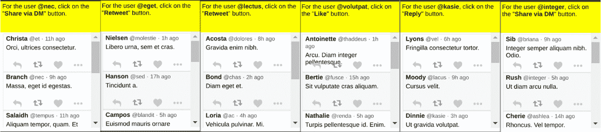

# 第六章：*第六章*：现实世界中的强化学习 – 构建智能体来完成您的待办事项

RL 智能体需要与环境进行互动，以进行学习和训练。为现实世界的应用训练 RL 智能体通常会面临物理限制和挑战。这是因为智能体在学习过程中可能会对它所操作的现实世界系统造成损害。幸运的是，现实世界中有许多任务并不一定面临这些挑战，且可以非常有用，帮助我们完成日常待办事项列表中的任务！

本章中的食谱将帮助您构建能够完成互联网上任务的 RL 智能体，这些任务包括响应烦人的弹窗、在网页上预订航班、管理电子邮件和社交媒体账户等等。我们可以在不使用随着时间变化而改变的 API，或者不依赖硬编码脚本的情况下完成这些任务，这些脚本可能会在网页更新后停止工作。您将通过使用鼠标和键盘训练智能体完成这些待办事项任务，就像人类一样！本章还将帮助您构建**WebGym** API，它是一个兼容 OpenAI Gym 的通用 RL 学习环境接口，您可以使用它将 50 多种网页任务转换为 RL 的训练环境，并训练自己的 RL 智能体。

本章将覆盖以下具体内容：

+   为现实世界的强化学习（RL）构建学习环境

+   构建一个 RL 智能体来完成网页上的任务 – 行动呼吁

+   构建一个视觉自动登录机器人

+   训练一个 RL 智能体来自动化旅行中的航班预订

+   训练一个 RL 智能体来管理您的电子邮件

+   训练一个 RL 智能体来自动化社交媒体账户管理

开始吧！

# 技术要求

本书中的代码已经在 Ubuntu 18.04 和 Ubuntu 20.04 上进行了广泛测试，这意味着它应该也能在较新版本的 Ubuntu 上运行，只要安装了 Python 3.6 及以上版本。安装了 Python 3.6+，以及每个食谱的准备部分中列出的必要 Python 包后，代码应该也可以在 Windows 和 Mac OSX 上正常运行。建议您创建并使用名为`tf2rl-cookbook`的 Python 虚拟环境来安装本书中的包并运行代码。推荐使用 Miniconda 或 Anaconda 进行 Python 虚拟环境管理。您还需要在系统上安装 Chromium Chrome 驱动程序。在 Ubuntu 18.04+上，您可以使用`sudo apt-get install chromium-chromedriver`命令进行安装。

每个食谱中的完整代码将在此处提供：[`github.com/PacktPublishing/Tensorflow-2-Reinforcement-Learning-Cookbook`](https://github.com/PacktPublishing/Tensorflow-2-Reinforcement-Learning-Cookbook)。

# 为现实世界的强化学习（RL）构建学习环境

本教程将教你如何设置并构建基于 **世界比特**（**WoB**）的 OpenAI Gym 兼容学习平台 WebGym，用于训练 RL 代理完成全球 web 上的真实任务。WoB 是一个开放领域的平台，专为基于 web 的代理而设计。如需了解更多关于 WoB 的信息，请查看以下链接：[`proceedings.mlr.press/v70/shi17a/shi17a.pdf`](http://proceedings.mlr.press/v70/shi17a/shi17a.pdf)。

WebGym 提供了供代理学习的环境，让代理以我们（人类）感知全球 web 的方式进行感知——通过我们显示器上呈现的像素。代理通过使用键盘和鼠标事件作为操作与环境进行互动。这使得代理能够像我们一样体验全球 web，这意味着我们不需要对代理进行任何额外修改，代理就能进行训练。这样，我们便能够训练能够直接与 web 页面和应用程序协作，完成现实世界任务的 RL 代理。

下图展示了一个 **点击行动**（**CTA**）任务的示例环境，在此环境中，任务是点击特定链接以进入下一个页面或步骤：


图 6.1 – 需要点击特定链接的示例 CTA 任务

另一个 CTA 任务的示例如以下图片所示：


图 6.2 – 需要选择并提交特定选项的示例 CTA 任务

让我们开始吧！

## 准备就绪

要完成本教程，你需要激活 `tf2rl-cookbook` Python/conda 虚拟环境。确保更新环境，以使其与本教程代码库中的最新 conda 环境规范文件（`tfrl-cookbook.yml`）匹配。WebGym 是构建在 miniwob-plusplus 基准之上的，后者也作为本书代码库的一部分提供，便于使用。

现在，让我们开始吧！

## 如何操作……

我们将通过定义自定义的 `reset` 和 `step` 方法来构建 WebGym。然后，我们将为训练环境定义状态和动作空间。首先，我们来看看 `miniwob_env` 模块的实现。让我们开始：

1.  让我们首先导入必要的 Python 模块：

    ```py
    import os
    import gym
    from PIL import Image
    from miniwob.action import MiniWoBCoordClick
    from miniwob.environment import MiniWoBEnvironment
    ```

1.  让我们指定导入本地 `miniwob` 环境的目录：

    ```py
    cur_path_dir = \
        os.path.dirname(os.path.realpath(__file__))
    miniwob_dir = os.path.join(cur_path_dir, "miniwob",
                               "html", "miniwob")
    ```

1.  现在，我们可以开始创建 `MiniWoBEnvironment` 的子类。然后，我们可以调用父类的初始化函数来初始化环境并在配置 `miniwob` 环境之前设置 `base_url` 的值：

    ```py
    class MiniWoBEnv(MiniWoBEnvironment, gym.Env):
        def __init__(
            self,
            env_name: str,
            obs_im_shape,
            num_instances: int = 1,
            miniwob_dir: str = miniwob_dir,
            seeds: list = [1],
        ):
            super().__init__(env_name)
            self.base_url = f"file://{miniwob_dir}"
            self.configure(num_instances=num_instances,
                         seeds=seeds, base_url=self.base_url)
            # self.set_record_screenshots(True)
            self.obs_im_shape = obs_im_shape
    ```

1.  现在是定制 `reset(…)` 方法的时候了。为了使环境可以随机化，我们将使用 `seeds` 参数来接收随机种子。这可以用来生成随机的起始状态和任务，确保我们训练的代理不会对固定/静态网页产生过拟合：

    ```py
    def reset(self, seeds=[1], mode=None, 
    record_screenshots=False):
            """Forces stop and start all instances.
            Args:
                seeds (list[object]): Random seeds to set for 
                each instance;
                    If specified, len(seeds) must be equal to
                    the number of instances.
                    A None entry in the list = do not set a 
                    new seed.
                mode (str): If specified, set the data mode 
                    to this value before starting new
                    episodes.
                record_screenshots (bool): Whether to record 
                    screenshots of the states.
            Returns:
                states (list[MiniWoBState])
            """
            miniwob_state = super().reset(seeds, mode, 
                      record_screenshots=True)
            return [
                state.screenshot.resize(self.obs_im_shape, 
                                        Image.ANTIALIAS)
                for state in miniwob_state
            ]
    ```

1.  接下来，我们将重新定义`step(…)`方法。让我们分两步完成实现。首先，我们将定义该方法并添加文档字符串，解释方法的参数：

    ```py
        def step(self, actions):
            """Applies an action on each instance and returns 
            the results.
            Args:
                actions (list[MiniWoBAction or None])
            Returns:
                tuple (states, rewards, dones, info)
                    states (list[PIL.Image.Image])
                    rewards (list[float])
                    dones (list[bool])
                    info (dict): additional debug 
                    information.
                        Global debug information is directly 
                        in the root level
                        Local information for instance i is 
                        in info['n'][i]
            """
    ```

1.  在这一步，我们将完成`step(…)`方法的实现：

    ```py
            states, rewards, dones, info = \
                                    super().step(actions)
            # Obtain screenshot & Resize image obs to match 
            # config
            img_states = [
                state.screenshot.resize(self.obs_im_shape) \
                if not dones[i] else None
                for i, state in enumerate(states)
            ]
            return img_states, rewards, dones, info
    ```

1.  这就完成了我们的`MiniWoBEnv`类实现！为了测试我们的类实现，并理解如何使用这个类，我们将编写一个简短的`main()`函数：

    ```py
    if __name__ == "__main__":
        env = MiniWoBVisualEnv("click-pie")
        for _ in range(10):
            obs = env.reset()
            done = False
            while not done:
                action = [MiniWoBCoordClick(90, 150)]
                obs, reward, done, info = env.step(action)
                [ob.show() for ob in obs if ob is not None]
        env.close()
    ```

1.  你可以将前面的脚本保存为`miniwob_env.py`并执行它，查看一个随机智能体在样本环境中的表现。在接下来的几个步骤中，我们将扩展`MiniWoBEnv`，以创建一个与 OpenAI Gym 兼容的学习环境接口。让我们首先创建一个名为`envs.py`的新文件，并包括以下导入：

    ```py
    import gym.spaces
    import numpy as np
    import string
    from miniwob_env import MiniWoBEnv
    from miniwob.action import MiniWoBCoordClick, MiniWoBType
    ```

1.  对于第一个环境，我们将实现`MiniWoBVisualClickEnv`类：

    ```py
    class MiniWoBVisualClickEnv(MiniWoBEnv):
        def __init__(self, name, num_instances=1):
            """RL environment with visual observations and 
               touch/mouse-click action space
                Two dimensional, continuous-valued action 
                space allows Agents to specify (x, y)
                coordinates on the visual rendering to click/
                touch to interact with the world-of bits
            Args:
                name (str): Name of the supported \
                MiniWoB-PlusPlus environment
                num_instances (int, optional): Number of \
                parallel env instances. Defaults to 1.
            """
            self.miniwob_env_name = name
            self.task_width = 160
            self.task_height = 210
            self.obs_im_width = 64
            self.obs_im_height = 64
            self.num_channels = 3  # RGB
            self.obs_im_size = (self.obs_im_width, \
                                self.obs_im_height)
            super().__init__(self.miniwob_env_name, 
                             self.obs_im_size, 
                             num_instances)
    ```

1.  让我们在`__init__`方法中定义该环境的观察空间和动作空间：

    ```py
            self.observation_space = gym.spaces.Box(
                0,
                255,
                (self.obs_im_width, self.obs_im_height, 
                 self.num_channels),
                dtype=int,
            )
            self.action_space = gym.spaces.Box(
                low=np.array([0, 0]),
                high=np.array([self.task_width, 
                               self.task_height]),
                shape=(2,),
                dtype=int,
            )
    ```

1.  接下来，我们将进一步扩展`reset(…)`方法，以提供与 OpenAI Gym 兼容的接口方法：

    ```py
        def reset(self, seeds=[1]):
            """Forces stop and start all instances.
            Args:
                seeds (list[object]): Random seeds to set for 
                each instance;
                    If specified, len(seeds) must be equal to 
                    the number of instances.
                    A None entry in the list = do not set a 
                    new seed.
            Returns:
                states (list[PIL.Image])
            """
            obs = super().reset(seeds)
            # Click somewhere to Start!
            # miniwob_state, _, _, _ = super().step(
            # self.num_instances * [MiniWoBCoordClick(10,10)]
            # )
            return obs
    ```

1.  下一个重要的部分是`step`方法。我们将分以下两步来实现它：

    ```py
        def step(self, actions):
            """Applies an action on each instance and returns 
               the results.
            Args:
                actions (list[(x, y) or None]);
                  - x is the number of pixels from the left
                    of browser window
                  - y is the number of pixels from the top of 
                    browser window
            Returns:
                tuple (states, rewards, dones, info)
                    states (list[PIL.Image.Image])
                    rewards (list[float])
                    dones (list[bool])
                    info (dict): additional debug 
                    information.
                        Global debug information is directly 
                        in the root level
                        Local information for instance i is 
                        in info['n'][i]
            """
    ```

1.  为了完成`step`方法的实现，让我们先检查动作的维度是否符合预期，然后在必要时绑定动作。最后，我们必须在环境中执行一步：

    ```py
            assert (
                len(actions) == self.num_instances
            ), f"Expected len(actions)={self.num_instances}.\
                 Got {len(actions)}."
            def clamp(action, low=self.action_space.low,\
                       high=self.action_space.high):
                low_x, low_y = low
                high_x, high_y = high
                return (
                    max(low_x, min(action[0], high_x)),
                    max(low_y, min(action[1], high_y)),
                )
            miniwob_actions = \
                [MiniWoBCoordClick(*clamp(action)) if action\
                is not None else None for action in actions]
            return super().step(miniwob_actions)
    ```

1.  我们可以使用描述性的类名将环境注册到 Gym 的注册表中：

    ```py
    class MiniWoBClickButtonVisualEnv(MiniWoBVisualClickEnv):
        def __init__(self, num_instances=1):
            super().__init__("click-button", num_instances)
    ```

1.  最后，为了将环境本地注册到 OpenAI Gym 的注册表中，我们必须将环境注册信息添加到`__init__.py`文件中：

    ```py
    import sys
    import os
    from gym.envs.registration import register
    sys.path.append(os.path.dirname(os.path.abspath(__file__)))
    _AVAILABLE_ENVS = {
        "MiniWoBClickButtonVisualEnv-v0": {
            "entry_point": \
                 "webgym.envs:MiniWoBClickButtonVisualEnv",
            "discription": "Click the button on a web page",
        }
    }
    for env_id, val in _AVAILABLE_ENVS.items():
        register(id=env_id, 
                 entry_point=val.get("entry_point"))
    ```

    这样，我们就完成了这个教程！

## 工作原理…

我们已经在`MiniWoBEnv`中扩展了`MiniWoB-plusplus`的实现，以便可以使用基于文件的网页来表示任务。我们进一步扩展了`MiniWoBEnv`类，在`MiniWoBVisualClickEnv`中提供了与 OpenAI Gym 兼容的接口：

为了清楚地了解 RL 智能体如何在这个环境中学习完成任务，请参考以下截图。在这里，智能体通过尝试不同的动作来理解任务的目标，在这个环境中，动作表现为点击网页上的不同区域（右侧由蓝色点表示）。最终，RL 智能体点击了正确的按钮，开始理解任务描述的含义，以及按钮的作用，因为它点击正确位置后得到了奖励：


图 6.3 – 可视化智能体在学习完成 CTA 任务时的动作

现在，到了继续下一个教程的时候！

# 构建一个 RL 智能体以在网页上完成任务——行动号召

本配方将教您如何实现一个 RL 训练脚本，使您能够训练一个 RL 代理来处理 `OK`/`Cancel` 对话框，您需要点击以确认/取消弹出通知，以及 `Click to learn more` 按钮。在本配方中，您将实例化一个 RL 训练环境，该环境为包含 CTA 任务的网页提供视觉渲染。您将训练一个基于 **近端策略优化**（**PPO**）的深度 RL 代理，该代理使用 TensorFlow 2.x 实现，学习如何完成当前任务。

以下图片展示了来自随机化 CTA 环境（使用不同种子）的一组观察数据，以便您理解代理将要解决的任务：


图 6.4 – 来自随机化 CTA 环境的代理观察截图

让我们开始吧！

## 准备中

要完成此配方，您需要激活 `tf2rl-cookbook` Python/conda 虚拟环境。确保更新该环境，使其与本食谱代码库中的最新 conda 环境规范文件（`tfrl-cookbook.yml`）匹配。如果以下 `import` 语句能够顺利执行，那么您就准备好开始了：

```py
import argparse
import os
from datetime import datetime
import gym
import numpy as np
import tensorflow as tf
from tensorflow.keras.layers import (Conv2D,Dense,Dropout,Flatten,Input,Lambda,MaxPool2D,)
import webgym  # Used to register webgym environments
```

让我们开始吧！

## 如何做到…

在这个配方中，我们将实现一个完整的训练脚本，包括用于训练超参数配置的命令行参数解析。正如您从 `import` 语句中看到的，我们将使用 Keras 的 TensorFlow 2.x 函数式 API 来实现我们将在代理算法实现中使用的**深度神经网络**（**DNNs**）。

以下步骤将指导您完成实现：

1.  让我们首先定义 CTA 代理训练脚本的命令行参数：

    ```py
    parser = argparse.ArgumentParser(prog="TFRL-Cookbook-Ch5-Click-To-Action-Agent")
    parser.add_argument("--env", default="MiniWoBClickButtonVisualEnv-v0")
    parser.add_argument("--update-freq", type=int, default=16)
    parser.add_argument("--epochs", type=int, default=3)
    parser.add_argument("--actor-lr", type=float, default=1e-4)
    parser.add_argument("--Critic-lr", type=float, default=1e-4)
    parser.add_argument("--clip-ratio", type=float, default=0.1)
    parser.add_argument("--gae-lambda", type=float, default=0.95)
    parser.add_argument("--gamma", type=float, default=0.99)
    parser.add_argument("--logdir", default="logs")
    ```

1.  接下来，我们将创建一个 TensorBoard 日志记录器，以便记录和可视化 CTA 代理的实时训练进度：

    ```py
    args = parser.parse_args()
    logdir = os.path.join(
        args.logdir, parser.prog, args.env, \
        datetime.now().strftime("%Y%m%d-%H%M%S")
    )
    print(f"Saving training logs to:{logdir}")
    writer = tf.summary.create_file_writer(logdir)
    ```

1.  在接下来的步骤中，我们将实现 `Actor` 类。然而，我们将首先实现 `__init__` 方法：

    ```py
    class Actor:
        def __init__(self, state_dim, action_dim, 
        action_bound, std_bound):
            self.state_dim = state_dim
            self.action_dim = action_dim
            self.action_bound = np.array(action_bound)
            self.std_bound = std_bound
            self.weight_initializer = \
                tf.keras.initializers.he_normal()
            self.eps = 1e-5
            self.model = self.nn_model()
            self.model.summary()  # Print a summary of the 
            @ Actor model
            self.opt = \
                tf.keras.optimizers.Nadam(args.actor_lr)
    ```

1.  接下来，我们将定义表示代理模型的 DNN。我们将把 DNN 的实现拆分为多个步骤，因为它会稍长一些，涉及多个神经网络层的堆叠。作为第一个主要处理步骤，我们将通过堆叠卷积-池化-卷积-池化层来实现一个模块：

    ```py
        def nn_model(self):
            obs_input = Input(self.state_dim)
            conv1 = Conv2D(
                filters=64,
                kernel_size=(3, 3),
                strides=(1, 1),
                padding="same",
                input_shape=self.state_dim,
                data_format="channels_last",
                activation="relu",
            )(obs_input)
            pool1 = MaxPool2D(pool_size=(3, 3), strides=1)\
                              (conv1)
            conv2 = Conv2D(
                filters=32,
                kernel_size=(3, 3),
                strides=(1, 1),
                padding="valid",
                activation="relu",
            )(pool1)
            pool2 = MaxPool2D(pool_size=(3, 3), strides=1)\
                             (conv2)
    ```

1.  现在，我们将扁平化池化层的输出，以便开始使用带有丢弃层的全连接层或稠密层，生成我们期望的代理网络输出：

    ```py
            flat = Flatten()(pool2)
            dense1 = Dense(
                16, activation="relu", \
                   kernel_initializer=self.weight_initializer
            )(flat)
            dropout1 = Dropout(0.3)(dense1)
            dense2 = Dense(
                8, activation="relu", \
                   kernel_initializer=self.weight_initializer
            )(dropout1)
            dropout2 = Dropout(0.3)(dense2)
            # action_dim[0] = 2
            output_val = Dense(
                self.action_dim[0],
                activation="relu",
                kernel_initializer=self.weight_initializer,
            )(dropout2)
    ```

1.  我们需要对预测值进行缩放和裁剪，以确保值被限定在我们期望的范围内。让我们使用 **Lambda 层** 来实现自定义的裁剪和缩放，如以下代码片段所示：

    ```py
            mu_output = Lambda(
                lambda x: tf.clip_by_value(x * \
                  self.action_bound, 1e-9, self.action_bound)
            )(output_val)
            std_output_1 = Dense(
                self.action_dim[0],
                activation="softplus",
                kernel_initializer=self.weight_initializer,
            )(dropout2)
            std_output = Lambda(
                lambda x: tf.clip_by_value(
                    x * self.action_bound, 1e-9, \
                    self.action_bound / 2
                )
            )(std_output_1)
            return tf.keras.models.Model(
                inputs=obs_input, outputs=[mu_output, std_output], name="Actor"
            )
    ```

1.  这完成了我们的`nn_model`实现。现在，让我们定义一个便捷函数，以便给定状态时获取一个动作：

    ```py
        def get_action(self, state):
            # Convert [Image] to np.array(np.adarray)
            state_np = np.array([np.array(s) for s in state])
            if len(state_np.shape) == 3:
                # Convert (w, h, c) to (1, w, h, c)
                state_np = np.expand_dims(state_np, 0)
            mu, std = self.model.predict(state_np)
            action = np.random.normal(mu, std + self.eps, \
                                size=self.action_dim).astype(
                "int"
            )
            # Clip action to be between 0 and max obs screen 
            # size
            action = np.clip(action, 0, self.action_bound)
            # 1 Action per instance of env; Env expects: 
            # (num_instances, actions)
            action = (action,)
            log_policy = self.log_pdf(mu, std, action)
            return log_policy, action
    ```

1.  现在，到了实现主要训练方法的时候。这个方法将更新 Actor 网络的参数：

    ```py
        def train(self, log_old_policy, states, actions, 
        gaes):
            with tf.GradientTape() as tape:
                mu, std = self.model(states, training=True)
                log_new_policy = self.log_pdf(mu, std, 
                                              actions)
                loss = self.compute_loss(log_old_policy, 
                               log_new_policy, actions, gaes)
            grads = tape.gradient(loss, 
                              self.model.trainable_variables)
            self.opt.apply_gradients(zip(grads, 
                             self.model.trainable_variables))
            return loss
    ```

1.  尽管我们在之前的`train`方法中使用了`compute_loss`和`log_pdf`，但我们还没有真正定义它们！让我们一个接一个地实现它们，从`compute_loss`方法开始：

    ```py
        def compute_loss(self, log_old_policy, 
        log_new_policy, actions, gaes):
            # Avoid INF in exp by setting 80 as the upper 
            # bound since,
            # tf.exp(x) for x>88 yeilds NaN (float32)
            ratio = tf.exp(
                tf.minimum(log_new_policy - \
                    tf.stop_gradient(log_old_policy), 80)
            )
            gaes = tf.stop_gradient(gaes)
            clipped_ratio = tf.clip_by_value(
                ratio, 1.0 - args.clip_ratio, 1.0 + \
                args.clip_ratio
            )
            surrogate = -tf.minimum(ratio * gaes, \
                                    clipped_ratio * gaes)
            return tf.reduce_mean(surrogate)
    ```

1.  在这一步，我们将实现`log_pdf`方法：

    ```py
        def log_pdf(self, mu, std, action):
            std = tf.clip_by_value(std, self.std_bound[0],
                                   self.std_bound[1])
            var = std ** 2
            log_policy_pdf = -0.5 * (action - mu) ** 2 / var\
                             - 0.5 * tf.math.log(
                var * 2 * np.pi
            )
            return tf.reduce_sum(log_policy_pdf, 1,
                                 keepdims=True)
    ```

1.  上一步已经完成了 Actor 的实现。现在是时候开始实现`Critic`类了：

    ```py
    class Critic:
        def __init__(self, state_dim):
            self.state_dim = state_dim
            self.weight_initializer = \
                tf.keras.initializers.he_normal()
            self.model = self.nn_model()
            self.model.summary()  # Print a summary of the 
            # Critic model
            self.opt = \
                tf.keras.optimizers.Nadam(args.Critic_lr)
    ```

1.  接下来是`Critic`类的神经网络模型。与 Actor 的神经网络模型类似，这也是一个 DNN。我们将把实现分为几个步骤。首先，来实现一个卷积-池化-卷积-池化模块：

    ```py
            obs_input = Input(self.state_dim)
            conv1 = Conv2D(
                filters=64,
                kernel_size=(3, 3),
                strides=(1, 1),
                padding="same",
                input_shape=self.state_dim,
                data_format="channels_last",
                activation="relu",
            )(obs_input)
            pool1 = MaxPool2D(pool_size=(3, 3), strides=2)\
                              (conv1)
            conv2 = Conv2D(
                filters=32,
                kernel_size=(3, 3),
                strides=(1, 1),
                padding="valid",
                activation="relu",
            )(pool1)
            pool2 = MaxPool2D(pool_size=(3, 3), strides=2)\
                              (conv2)
    ```

1.  虽然我们可以堆叠更多的模块或层来加深神经网络，但对于我们当前的任务，DNN 中已经有足够的参数来学习如何在 CTA 任务中表现良好。让我们添加全连接层，这样我们就能最终产生状态条件下的动作值：

    ```py
            flat = Flatten()(pool2)
            dense1 = Dense(
                16, activation="relu", \
                   kernel_initializer=self.weight_initializer
            )(flat)
            dropout1 = Dropout(0.3)(dense1)
            dense2 = Dense(
                8, activation="relu", \
                   kernel_initializer=self.weight_initializer
            )(dropout1)
            dropout2 = Dropout(0.3)(dense2)
            value = Dense(
                1, activation="linear", \
                   kernel_initializer=self.weight_initializer
            )(dropout2)
    ```

1.  让我们实现一个方法来计算 Critic 的学习损失，本质上是时间差学习目标与 Critic 预测的值之间的均方误差：

    ```py
        def compute_loss(self, v_pred, td_targets):
            mse = tf.keras.losses.MeanSquaredError()
            return mse(td_targets, v_pred)
    ```

1.  让我们通过实现`train`方法来更新 Critic 的参数，从而最终完成`Critic`类的实现：

    ```py
        def train(self, states, td_targets):
            with tf.GradientTape() as tape:
                v_pred = self.model(states, training=True)
                # assert v_pred.shape == td_targets.shape
                loss = self.compute_loss(v_pred, \
                                tf.stop_gradient(td_targets))
            grads = tape.gradient(loss, \
                              self.model.trainable_variables)
            self.opt.apply_gradients(zip(grads, \
                             self.model.trainable_variables))
            return loss
    ```

1.  现在，我们可以利用 Actor 和 Critic 的实现来构建我们的 PPO 代理，使其能够处理高维（图像）观察。让我们从定义`PPOAgent`类的`__init__`方法开始：

    ```py
    class PPOAgent:
        def __init__(self, env):
            self.env = env
            self.state_dim = self.env.observation_space.shape
            self.action_dim = self.env.action_space.shape
            # Set action_bounds to be within the actual 
            # task-window/browser-view of the Agent
            self.action_bound = [self.env.task_width, 
                                 self.env.task_height]
            self.std_bound = [1e-2, 1.0]
            self.actor = Actor(
                self.state_dim, self.action_dim, 
                self.action_bound, self.std_bound
            )
            self.Critic = Critic(self.state_dim)
    ```

1.  我们将使用**广义优势估计**（**GAE**）来更新我们的策略。所以，让我们实现一个方法来计算 GAE 目标值：

    ```py
        def gae_target(self, rewards, v_values, next_v_value, 
        done):
            n_step_targets = np.zeros_like(rewards)
            gae = np.zeros_like(rewards)
            gae_cumulative = 0
            forward_val = 0
            if not done:
                forward_val = next_v_value
            for k in reversed(range(0, len(rewards))):
                delta = rewards[k] + args.gamma * \
                        forward_val - v_values[k]
                gae_cumulative = args.gamma * \
                                 args.gae_lambda * \
                                 gae_cumulative + delta
                gae[k] = gae_cumulative
                forward_val = v_values[k]
                n_step_targets[k] = gae[k] + v_values[k]
            return gae, n_step_targets
    ```

1.  我们来到了这个脚本的核心！让我们为深度 PPO 代理定义训练例程。我们将把实现分为多个步骤，以便于跟随。我们将从最外层的循环开始，这个循环必须为可配置的最大回合数运行：

    ```py
        def train(self, max_episodes=1000):
            with writer.as_default():
                for ep in range(max_episodes):
                    state_batch = []
                    action_batch = []
                    reward_batch = []
                    old_policy_batch = []
                    episode_reward, done = 0, False
                    state = self.env.reset()
                    prev_state = state
                    step_num = 0
    ```

1.  接下来，我们将实现遍历环境并通过检查环境中的`done`值来处理回合结束的逻辑：

    ```py
                        while not done:
                            log_old_policy, action = \
                                 self.actor.get_action(state)
                        next_state, reward, dones, _ = \
                             self.env.step(action)
                        step_num += 1
                        print(
                            f"ep#:{ep} step#:{step_num} \
                            step_rew:{reward} \
                            action:{action} dones:{dones}"
                        )
                        done = np.all(dones)
                        if done:
                            next_state = prev_state
                        else:
                            prev_state = next_state
                        state = np.array([np.array(s) for s\
                                          in state])
                        next_state = np.array([np.array(s) \
                                        for s in next_state])
                        reward = np.reshape(reward, [1, 1])
                        log_old_policy = np.reshape(
                                      log_old_policy, [1, 1])
                        state_batch.append(state)
                        action_batch.append(action)
                        reward_batch.append((reward + 8) / 8)
                        old_policy_batch.append(
                                              log_old_policy)
    ```

1.  接下来，我们将实现检查回合是否结束或是否需要更新的逻辑，并执行更新步骤：

    ```py
                        if len(state_batch) >= \
                        args.update_freq or done:
                            states = \
                                np.array([state.squeeze() \
                                for state in state_batch])
                            # Convert ([x, y],) to [x, y]
                            actions = np.array([action[0] \
                                for action in action_batch])
                            rewards = np.array(
                                [reward.squeeze() for reward\
                                 in reward_batch]
                            )
                            old_policies = np.array(
                                [old_pi.squeeze() for old_pi\
                                 in old_policy_batch]
                            )
                            v_values = self.Critic.model.\
                                predict(states)
                            next_v_value = self.Critic.\
                                model.predict(next_state)
                            gaes, td_targets = \
                                self.gae_target(
                                    rewards, v_values, \
                                    next_v_value, done
                            )
                            actor_losses, Critic_losses=[],[]
    ```

1.  现在，我们已经有了更新的 GAE 目标，可以训练 Actor 和 Critic 网络，并记录损失和其他训练指标以便追踪：

    ```py
                            for epoch in range(args.epochs):
                                actor_loss = \
                                    self.actor.train(
                                        old_policies, states,
                                        actions, gaes
                                    )
                                actor_losses.append(
                                     actor_loss)
                                Critic_loss = \
                                    self.Critic.train(states,
                                                  td_targets)
                                Critic_losses.append(
                                                 Critic_loss)
                            # Plot mean actor & Critic losses 
                            # on every update
                            tf.summary.scalar("actor_loss", 
                                 np.mean(actor_losses), 
                                 step=ep)
                            tf.summary.scalar(
                                "Critic_loss", 
                                 np.mean(Critic_losses),
                                 step=ep
                            )
                            state_batch = []
                            action_batch = []
                            reward_batch = []
                            old_policy_batch = []
                        episode_reward += reward[0][0]
                        state = next_state[0]
    ```

1.  最后，让我们实现`__main__`函数来训练 CTA 代理：

    ```py
    if __name__ == "__main__":
        env_name = "MiniWoBClickButtonVisualEnv-v0"
        env = gym.make(env_name)
        cta_Agent = PPOAgent(env)
        cta_Agent.train()
    ```

这就完成了这个食谱！让我们简要回顾一下它是如何工作的。

## 它是如何工作的……

在这个食谱中，我们实现了一个基于 PPO 的深度强化学习代理，并提供了一个训练机制来开发 CTA 代理。请注意，为了简化起见，我们使用了一个环境实例，尽管代码可以扩展为更多环境实例，以加速训练。

为了理解智能体训练的进展，考虑以下一系列图像。在训练的初期阶段，当智能体试图理解任务及其目标时，智能体可能只是在执行随机动作（探索），甚至可能点击屏幕外，如以下截图所示：


图 6.5 – 智能体在初始探索阶段点击屏幕外（没有可见的蓝点）

随着智能体通过偶然发现正确的点击按钮开始取得进展，以下截图显示了智能体取得的一些进展：


图 6.6 – 深度 PPO 智能体在 CTA 任务中的进展

最后，当回合完成或结束（由于时间限制），智能体将接收到类似以下截图（左侧）所示的观察：


图 6.7 – 回合结束时的观察（左）和性能总结（右）

现在，是时候进入下一个教程了！

# 构建一个可视化自动登录机器人

想象一下，你有一个智能体或机器人，它观察你正在做的事情，并在你点击登录页面时自动帮你登录网站。虽然浏览器插件可以自动登录，但它们使用的是硬编码的脚本，只能在预先编程的网站登录网址上工作。那么，如果你有一个仅依赖于渲染页面的智能体——就像你自己完成任务一样——即使网址发生变化，或者你进入一个没有任何先前保存数据的新网站时，它仍然能够工作，这会有多酷呢？！这个教程将帮助你开发一个脚本，训练一个智能体在网页上登录！你将学习如何随机化、定制和增加智能体的通用性，使它能够在任何登录页面上工作。

随机化和定制任务的用户名和密码的示例如下图所示：


图 6.8 – 随机化用户登录任务的示例观察

让我们开始吧！

## 做好准备

为了完成这个教程，请确保你拥有最新版本。首先，你需要激活`tf2rl-cookbook` Python/conda 虚拟环境。确保更新该环境，使其与本教程代码库中最新的 conda 环境规范文件（`tfrl-cookbook.yml`）匹配。如果以下`import`语句能顺利运行，那么你已经准备好开始了：

```py
import argparse
import os
from datetime import datetime
import gym
import numpy as np
import tensorflow as tf
from tensorflow.keras.layers import (Conv2D,Dense,Dropout,Flatten,Input,Lambda,MaxPool2D,)
import webgym  # Used to register webgym environments
```

让我们开始吧！

## 如何实现……

在这个教程中，我们将使用 PPO 算法实现基于深度强化学习的登录智能体。

让我们开始吧：

1.  首先，让我们设置训练脚本的命令行参数和日志记录：

    ```py
    parser = argparse.ArgumentParser(prog="TFRL-Cookbook-Ch5-Login-Agent")
    parser.add_argument("--env", default="MiniWoBLoginUserVisualEnv-v0")
    parser.add_argument("--update-freq", type=int, default=16)
    parser.add_argument("--epochs", type=int, default=3)
    parser.add_argument("--actor-lr", type=float, default=1e-4)
    parser.add_argument("--Critic-lr", type=float, default=1e-4)
    parser.add_argument("--clip-ratio", type=float, default=0.1)
    parser.add_argument("--gae-lambda", type=float, default=0.95)
    parser.add_argument("--gamma", type=float, default=0.99)
    parser.add_argument("--logdir", default="logs")
    args = parser.parse_args()
    logdir = os.path.join(
        args.logdir, parser.prog, args.env, \
        datetime.now().strftime("%Y%m%d-%H%M%S")
    )
    print(f"Saving training logs to:{logdir}")
    writer = tf.summary.create_file_writer(logdir)
    ```

1.  现在，我们可以直接跳入`Critic`类的定义：

    ```py
    class Critic:
        def __init__(self, state_dim):
            self.state_dim = state_dim
            self.weight_initializer = \
                tf.keras.initializers.he_normal()
            self.model = self.nn_model()
            self.model.summary()  # Print a summary of the 
            # Critic model
            self.opt = \
                tf.keras.optimizers.Nadam(args.Critic_lr)
    ```

1.  现在，让我们定义 Critic 模型的 DNN。我们将从实现一个由卷积-池化-卷积-池化组成的感知块开始。在随后的步骤中，我们将通过堆叠另一个感知块来增加网络的深度：

    ```py
        def nn_model(self):
            obs_input = Input(self.state_dim)
            conv1 = Conv2D(
                filters=64,
                kernel_size=(3, 3),
                strides=(1, 1),
                padding="same",
                input_shape=self.state_dim,
                data_format="channels_last",
                activation="relu",
            )(obs_input)
            pool1 = MaxPool2D(pool_size=(3, 3), strides=2)\
                             (conv1)
            conv2 = Conv2D(
                filters=32,
                kernel_size=(3, 3),
                strides=(1, 1),
                padding="valid",
                activation="relu",
            )(pool1)
            pool2 = MaxPool2D(pool_size=(3, 3), strides=2)
                             (conv2)
    ```

1.  接下来，我们将添加另一个感知块，以便提取更多特征：

    ```py
            conv3 = Conv2D(
                filters=16,
                kernel_size=(3, 3),
                strides=(1, 1),
                padding="valid",
                activation="relu",
            )(pool2)
            pool3 = MaxPool2D(pool_size=(3, 3), strides=1)\
                              (conv3)
            conv4 = Conv2D(
                filters=8,
                kernel_size=(3, 3),
                strides=(1, 1),
                padding="valid",
                activation="relu",
            )(pool3)
            pool4 = MaxPool2D(pool_size=(3, 3), strides=1)\
    (conv4)
    ```

1.  接下来，我们将添加一个展平层，接着是全连接（密集）层，将网络输出的形状压缩成一个单一的动作值：

    ```py
            flat = Flatten()(pool4)
            dense1 = Dense(
                16, activation="relu", 
                kernel_initializer=self.weight_initializer
            )(flat)
            dropout1 = Dropout(0.3)(dense1)
            dense2 = Dense(
                8, activation="relu", 
                kernel_initializer=self.weight_initializer
            )(dropout1)
            dropout2 = Dropout(0.3)(dense2)
            value = Dense(
                1, activation="linear", 
                kernel_initializer=self.weight_initializer
            )(dropout2)
            return tf.keras.models.Model(inputs=obs_input, 
                             outputs=value, name="Critic")
    ```

1.  为了完成我们的 Critic 实现，让我们定义`compute_loss`方法和`update`方法，以便训练参数：

    ```py
        def compute_loss(self, v_pred, td_targets):
            mse = tf.keras.losses.MeanSquaredError()
            return mse(td_targets, v_pred)
        def train(self, states, td_targets):
            with tf.GradientTape() as tape:
                v_pred = self.model(states, training=True)
                # assert v_pred.shape == td_targets.shape
                loss = self.compute_loss(v_pred, 
                                tf.stop_gradient(td_targets))
            grads = tape.gradient(loss, 
                              self.model.trainable_variables)
            self.opt.apply_gradients(zip(grads, 
                             self.model.trainable_variables))
            return loss
    ```

1.  现在，我们可以开始实现`Actor`类。我们将在这一步初始化`Actor`类，并在随后的步骤中继续实现：

    ```py
    class Actor:
        def __init__(self, state_dim, action_dim, 
        action_bound, std_bound):
            self.state_dim = state_dim
            self.action_dim = action_dim
            self.action_bound = np.array(action_bound)
            self.std_bound = std_bound
            self.weight_initializer = \
                tf.keras.initializers.he_normal()
            self.eps = 1e-5
            self.model = self.nn_model()
            self.model.summary()  # Print a summary of the 
            # Actor model
            self.opt = tf.keras.optimizers.Nadam(
                                              args.actor_lr)
    ```

1.  我们将为我们的 Actor 使用与 Critic 实现中相似的 DNN 架构。因此，`nn_model`方法的实现将保持不变，除了最后几层，Actor 和 Critic 的实现将在此处有所不同。Actor 网络模型输出均值和标准差，这取决于动作空间的维度。另一方面，Critic 网络输出一个状态条件下的动作值，无论动作空间的维度如何。与 Critic 的 DNN 实现不同的层如下所示：

    ```py
            # action_dim[0] = 2
            output_val = Dense(
                self.action_dim[0],
                activation="relu",
                kernel_initializer=self.weight_initializer,
            )(dropout2)
            # Scale & clip x[i] to be in range [0, 
            # action_bound[i]]
            mu_output = Lambda(
                lambda x: tf.clip_by_value(x * \
                  self.action_bound, 1e-9, self.action_bound)
            )(output_val)
            std_output_1 = Dense(
                self.action_dim[0],
                activation="softplus",
                kernel_initializer=self.weight_initializer,
            )(dropout2)
            std_output = Lambda(
                lambda x: tf.clip_by_value(
                    x * self.action_bound, 1e-9, 
                    self.action_bound / 2
                )
            )(std_output_1)
            return tf.keras.models.Model(
                inputs=obs_input, outputs=[mu_output, 
                  std_output], name="Actor"
            )
    ```

1.  让我们实现一些方法来计算 Actor 的损失和`log_pdf`：

    ```py
        def log_pdf(self, mu, std, action):
            std = tf.clip_by_value(std, self.std_bound[0], 
                                   self.std_bound[1])
            var = std ** 2
            log_policy_pdf = -0.5 * (action - mu) ** 2 / var\
                             - 0.5 * tf.math.log(
                var * 2 * np.pi
            )
            return tf.reduce_sum(log_policy_pdf, 1, 
                                 keepdims=True)
        def compute_loss(self, log_old_policy, 
                         log_new_policy, actions, gaes):
            # Avoid INF in exp by setting 80 as the upper 
            # bound since,
            # tf.exp(x) for x>88 yeilds NaN (float32)
            ratio = tf.exp(
                tf.minimum(log_new_policy - \
                        tf.stop_gradient(log_old_policy), 80)
            )
            gaes = tf.stop_gradient(gaes)
            clipped_ratio = tf.clip_by_value(
                ratio, 1.0 - args.clip_ratio, 1.0 + \
                args.clip_ratio
            )
            surrogate = -tf.minimum(ratio * gaes, 
                                    clipped_ratio * gaes)
            return tf.reduce_mean(surrogate)
    ```

1.  借助这些辅助方法，我们的训练方法实现变得更加简洁：

    ```py
        def train(self, log_old_policy, states, actions, 
        gaes):
            with tf.GradientTape() as tape:
                mu, std = self.model(states, training=True)
                log_new_policy = self.log_pdf(mu, std, 
                                              actions)
                loss = self.compute_loss(log_old_policy, 
                                         log_new_policy,
                                         actions, gaes)
            grads = tape.gradient(loss, 
                              self.model.trainable_variables)
            self.opt.apply_gradients(zip(grads, 
                             self.model.trainable_variables))
            return loss
    ```

1.  最后，让我们实现一个方法，当给定一个状态作为输入时，它将从 Actor 中获取一个动作：

    ```py
        def get_action(self, state):
            # Convert [Image] to np.array(np.adarray)
            state_np = np.array([np.array(s) for s in state])
            if len(state_np.shape) == 3:
                # Convert (w, h, c) to (1, w, h, c)
                state_np = np.expand_dims(state_np, 0)
            mu, std = self.model.predict(state_np)
            action = np.random.normal(mu, std + self.eps, 
                                size=self.action_dim).astype(
                "int"
            )
            # Clip action to be between 0 and max obs 
            # screen size
            action = np.clip(action, 0, self.action_bound)
            # 1 Action per instance of env; Env expects: 
            # (num_instances, actions)
            action = (action,)
            log_policy = self.log_pdf(mu, std, action)
            return log_policy, action
    ```

1.  这完成了我们的 Actor 实现。现在，我们可以通过`PPOAgent`类的实现将 Actor 和 Critic 结合起来。由于之前的食谱中已经讨论了 GAE 目标计算，我们将跳过这一部分，专注于训练方法的实现：

    ```py
                   while not done:
                        # self.env.render()
                        log_old_policy, action = \
                            self.actor.get_action(state)
                        next_state, reward, dones, _ = \
                            self.env.step(action)
                        step_num += 1
                        # Convert action[2] from int idx to 
                        # char for verbose printing
                        action_print = []
                        for a in action:  # Map apply
                            action_verbose = (a[:2], \
                            self.get_typed_char(a[2]))
                            action_print.append(
                                          action_verbose)
                        print(
                            f"ep#:{ep} step#:{step_num} 
                            step_rew:{reward} \
                            action:{action_print} \
                            dones:{dones}"
                        )
                        done = np.all(dones)
                        if done:
                            next_state = prev_state
                        else:
                            prev_state = next_state
                        state = np.array([np.array(s) for \
                            s in state])
                        next_state = np.array([np.array(s) \
                            for s in next_state])
                        reward = np.reshape(reward, [1, 1])
                        log_old_policy = np.reshape(
                                      log_old_policy, [1, 1])
                        state_batch.append(state)
                        action_batch.append(action)
                        reward_batch.append((reward + 8) / 8)
                        old_policy_batch.append(\
                                              log_old_policy)
    ```

1.  Agent 的更新是在预设的频率下执行的，频率依据收集的样本数量或每个回合结束时执行——以先到者为准：

    ```py
                        if len(state_batch) >= \
                            args.update_freq or done:
                            states = np.array([state.\
                                         squeeze() for state\
                                         in state_batch])
                            actions = np.array([action[0]\
                                 for action in action_batch])
                            rewards = np.array(
                                [reward.squeeze() for reward\
                                 in reward_batch])
                            old_policies = np.array(
                                [old_pi.squeeze() for old_pi\
                                 in old_policy_batch])
                            v_values = self.Critic.model.\
                                           predict(states)
                            next_v_value = self.Critic.\
                                    model.predict(next_state)
                            gaes, td_targets = \
                                        self.gae_target(
                                rewards, v_values, \
                                next_v_value, done)
                            actor_losses, Critic_losses=[],[]
                            for epoch in range(args.epochs):
                                actor_loss = \
                                    self.actor.train(
                                        old_policies, states,
                                      actions, gaes)
                                actor_losses.append(
                                                  actor_loss)
                                Critic_loss = self.Critic.\
                                    train(states, td_targets)
                                Critic_losses.append(
                                                 Critic_loss)
    ```

1.  最后，我们可以运行`MiniWoBLoginUserVisualEnv-v0`并使用以下代码片段训练 Agent：

    ```py
    if __name__ == "__main__":
        env_name = "MiniWoBLoginUserVisualEnv-v0"
        env = gym.make(env_name)
        cta_Agent = PPOAgent(env)
        cta_Agent.train()
    ```

这完成了我们的自动登录 Agent 脚本。现在是时候运行脚本，查看 Agent 的训练过程了！

## 它是如何工作的……

登录任务包括点击正确的表单字段并输入正确的用户名和/或密码。为了让 Agent 能够执行此操作，它需要掌握如何使用鼠标和键盘，以及处理网页视觉信息以理解任务和网页登录表单。通过足够的样本，深度 RL Agent 将学习一个策略来完成此任务。让我们来看一下 Agent 在不同阶段的进度状态快照。

以下图片显示了代理成功输入用户名并正确点击密码字段输入密码，但仍未完成任务：


图 6.9 – 训练有素的代理成功输入用户名，但未输入密码

在下图中，你可以看到代理已经学会输入用户名和密码，但它们并不完全正确，因此任务尚未完成：


图 6.10 – 代理输入用户名和密码，但输入错误

同样的代理，通过不同的检查点，在经历了几千次学习后，已经接近完成任务，如下图所示


图 6.11 – 一位训练有素的代理模型即将成功完成登录任务

现在你已经理解了代理是如何工作的及其行为，你可以根据自己的需求对其进行定制，并使用案例来训练代理自动登录任何你想要的自定义网站！

# 训练一个 RL 代理来自动化你的旅行机票预订

在本食谱中，你将学习如何基于 `MiniWoBBookFlightVisualEnv` 飞行预订环境实现一个深度 RL 代理：


图 6.12 – 来自随机化 MiniWoBBookFlightVisualEnv 环境的样本起始状态观察

让我们开始吧！

## 准备工作

为了完成这个食谱，你需要激活 `tf2rl-cookbook` Python/conda 虚拟环境。确保更新环境，以便它与本食谱代码仓库中的最新 conda 环境规范文件 (`tfrl-cookbook.yml`) 匹配。如果以下的 `import` 语句能正常运行，那么你就可以开始了：

```py
import argparse
import os
import random
from collections import deque
from datetime import datetime
import gym
import numpy as np
import tensorflow as tf
from tensorflow.keras.layers import (Conv2D,Dense,Dropout, Flatten, Input,Lambda,MaxPool2D)
import webgym  # Used to register webgym environments
```

## 如何做到……

在本食谱中，我们将实现一个完整的训练脚本，你可以定制并训练它来预订机票！

让我们开始吧：

1.  首先，让我们将超参数暴露为可配置的参数，以便在训练脚本中使用：

    ```py
    parser = argparse.ArgumentParser(
        prog="TFRL-Cookbook-Ch5-SocialMedia-Mute-User-DDPGAgent"
    )
    parser.add_argument("--env", default="Pendulum-v0")
    parser.add_argument("--actor_lr", type=float, default=0.0005)
    parser.add_argument("--Critic_lr", type=float, default=0.001)
    parser.add_argument("--batch_size", type=int, default=64)
    parser.add_argument("--tau", type=float, default=0.05)
    parser.add_argument("--gamma", type=float, default=0.99)
    parser.add_argument("--train_start", type=int, default=2000)
    parser.add_argument("--logdir", default="logs")
    args = parser.parse_args()
    ```

1.  接下来，我们将设置 TensorBoard 日志记录，以便实时可视化训练进度：

    ```py
    logdir = os.path.join(
        args.logdir, parser.prog, args.env, \
        datetime.now().strftime("%Y%m%d-%H%M%S")
    )
    print(f"Saving training logs to:{logdir}")
    writer = tf.summary.create_file_writer(logdir)	
    ```

1.  我们将使用重放缓冲区来实现经验回放。让我们实现一个简单的 `ReplayBuffer` 类：

    ```py
    class ReplayBuffer:
        def __init__(self, capacity=10000):
            self.buffer = deque(maxlen=capacity)
        def store(self, state, action, reward, next_state, 
        done):
            self.buffer.append([state, action, reward, 
                                next_state, done])
        def sample(self):
            sample = random.sample(self.buffer, 
                                   args.batch_size)
            states, actions, rewards, next_states, done = \
                                map(np.asarray, zip(*sample))
            states = \
                np.array(states).reshape(args.batch_size, -1)
            next_states = np.array(next_states).\
                          reshape(args.batch_size, -1)
            return states, actions, rewards, next_states,\
            done
        def size(self):
            return len(self.buffer)
    ```

1.  让我们从实现 `Actor` 类开始：

    ```py
    class Actor:
        def __init__(self, state_dim, action_dim, 
        action_bound):
            self.state_dim = state_dim
            self.action_dim = action_dim
            self.action_bound = action_bound
            self.weight_initializer = \
                tf.keras.initializers.he_normal()
            self.eps = 1e-5
            self.model = self.nn_model()
            self.opt = tf.keras.optimizers.Adam(
                                               args.actor_lr)
    ```

1.  Actor 的 DNN 模型将由两个感知块组成，每个感知块包含卷积-池化-卷积-池化层，正如我们之前的配方。我们将在这里跳过这一部分，直接查看`train`方法的实现。像往常一样，完整的源代码将会在本食谱的代码库中提供。让我们继续实现`train`和`predict`方法：

    ```py
        def train(self, states, q_grads):
            with tf.GradientTape() as tape:
                grads = tape.gradient(
                    self.model(states), 
                    self.model.trainable_variables, 
                    -q_grads
                )
            self.opt.apply_gradients(zip(grads, \
                             self.model.trainable_variables))
        def predict(self, state):
            return self.model.predict(state)
    ```

1.  `Actor`类的最后一部分是实现一个函数来获取动作：

    ```py
        def get_action(self, state):
            # Convert [Image] to np.array(np.adarray)
            state_np = np.array([np.array(s) for s in state])
            if len(state_np.shape) == 3:
                # Convert (w, h, c) to (1, w, h, c)
                state_np = np.expand_dims(state_np, 0)
            action = self.model.predict(state_np)
            # Clip action to be between 0 and max obs 
            # screen size
            action = np.clip(action, 0, self.action_bound)
            # 1 Action per instance of env; Env expects: 
            # (num_instances, actions)
            return action
    ```

1.  这样，我们的`Actor`类就准备好了。现在，我们可以继续并实现`Critic`类：

    ```py
    class Critic:
        def __init__(self, state_dim, action_dim):
            self.state_dim = state_dim
            self.action_dim = action_dim
            self.weight_initializer = \
                tf.keras.initializers.he_normal()
            self.model = self.nn_model()
            self.opt = \
                tf.keras.optimizers.Adam(args.Critic_lr)
    ```

1.  类似于`Actor`类的 DNN 模型，我们将重新使用之前食谱中的类似架构来构建`Critic`类，包含两个感知块。你可以参考这个食谱的完整源代码或前一个食谱中的 DNN 实现，以获得完整性。让我们深入实现`predict`和`g_gradients`的计算，以计算 Q 函数：

    ```py
        def predict(self, inputs):
            return self.model.predict(inputs)
        def q_gradients(self, states, actions):
            actions = tf.convert_to_tensor(actions)
            with tf.GradientTape() as tape:
                tape.watch(actions)
                q_values = self.model([states, actions])
                q_values = tf.squeeze(q_values)
            return tape.gradient(q_values, actions)
    ```

1.  为了更新我们的 Critic 模型，我们需要一个损失函数来驱动参数更新，并且需要一个实际的训练步骤来执行更新。在这一步中，我们将实现这两个核心方法：

    ```py
        def compute_loss(self, v_pred, td_targets):
            mse = tf.keras.losses.MeanSquaredError()
            return mse(td_targets, v_pred)
        def train(self, states, actions, td_targets):
            with tf.GradientTape() as tape:
                v_pred = self.model([states, actions], 
                                     training=True)
                assert v_pred.shape == td_targets.shape
                loss = self.compute_loss(v_pred, 
                               tf.stop_gradient(td_targets))
            grads = tape.gradient(loss, 
                              self.model.trainable_variables)
            self.opt.apply_gradients(zip(grads, 
                             self.model.trainable_variables))
            return loss
    ```

1.  现在是时候将 Actor 和 Critic 结合起来实现 DDPGAgent 了！让我们深入了解：

    ```py
    class DDPGAgent:
        def __init__(self, env):
            self.env = env
            self.state_dim = self.env.observation_space.shape
            self.action_dim = self.env.action_space.shape
            self.action_bound = self.env.action_space.high
            self.buffer = ReplayBuffer()
            self.actor = Actor(self.state_dim, 
                          self.action_dim, self.action_bound)
            self.Critic = Critic(self.state_dim, 
                                 self.action_dim)
            self.target_actor = Actor(self.state_dim, 
                          self.action_dim, self.action_bound)
            self.target_Critic = Critic(self.state_dim, 
                                        self.action_dim)
            actor_weights = self.actor.model.get_weights()
            Critic_weights = self.Critic.model.get_weights()
            self.target_actor.model.set_weights(
                                              actor_weights)
            self.target_Critic.model.set_weights
                                             (Critic_weights)
    ```

1.  我们来实现一个方法，用于更新 Actor 和 Critic 的目标模型：

    ```py
        def update_target(self):
            actor_weights = self.actor.model.get_weights()
            t_actor_weights = \
                self.target_actor.model.get_weights()
            Critic_weights = self.Critic.model.get_weights()
            t_Critic_weights = \
                self.target_Critic.model.get_weights()
            for i in range(len(actor_weights)):
                t_actor_weights[i] = (args.tau * \
                actor_weights[i] + (1 - args.tau) * \
                t_actor_weights[i])
            for i in range(len(Critic_weights)):
                t_Critic_weights[i] = (args.tau * \
                Critic_weights[i] + (1 - args.tau) * \
                t_Critic_weights[i])
            self.target_actor.model.set_weights(
                                          t_actor_weights)
            self.target_Critic.model.set_weights(
                                         t_Critic_weights)
    ```

1.  接下来，我们将实现一个方法，用于计算时序差分目标：

    ```py
        def get_td_target(self, rewards, q_values, dones):
            targets = np.asarray(q_values)
            for i in range(q_values.shape[0]):
                if dones[i]:
                    targets[i] = rewards[i]
                else:
                    targets[i] = args.gamma * q_values[i]
            return targets
    ```

1.  因为我们使用的是确定性策略梯度且没有分布来从中采样，我们将使用一个噪声函数来在 Actor 网络预测的动作周围进行采样。**Ornstein Uhlenbeck**（**OU**）噪声过程是 DDPG 代理的一个流行选择。我们将在这里实现它：

    ```py
        def add_ou_noise(self, x, rho=0.15, mu=0, dt=1e-1,
                         sigma=0.2, dim=1):
            return (
                x + rho * (mu - x) * dt + sigma * \
                np.sqrt(dt) * np.random.normal(size=dim))
    ```

1.  接下来，我们将实现一个方法，用于重放 Replay Buffer 中的经验：

    ```py
        def replay_experience(self):
            for _ in range(10):
                states, actions, rewards, next_states, \
                    dones = self.buffer.sample()
                target_q_values = self.target_Critic.predict(
                    [next_states, 
                     self.target_actor.predict(next_states)])
                td_targets = self.get_td_target(rewards,
                                      target_q_values, dones)
                self.Critic.train(states, actions, 
                                  td_targets)
                s_actions = self.actor.predict(states)
                s_grads = self.Critic.q_gradients(states, 
                                                  s_actions)
                grads = np.array(s_grads).reshape(
                                       (-1, self.action_dim))
                self.actor.train(states, grads)
                self.update_target()
    ```

1.  我们在代理（Agent）实现中的最后一个但最关键的任务是实现`train`方法。我们将把实现分为几个步骤。首先，我们将从最外层的循环开始，该循环必须运行至最多的回合数：

    ```py
        def train(self, max_episodes=1000):
            with writer.as_default():
                for ep in range(max_episodes):
                    step_num, episode_reward, done = 0, 0,\
                                                     False
                    state = self.env.reset()
                    prev_state = state
                    bg_noise = np.random.randint(
                        self.env.action_space.low,
                        self.env.action_space.high,
                        self.env.action_space.shape,
                    )
    ```

1.  接下来，我们将实现内层循环，它将一直运行到回合结束：

    ```py
                    while not done:
                        # self.env.render()
                        action = self.actor.get_action(state)
                        noise = self.add_ou_noise(bg_noise,\
                                         dim=self.action_dim)
                        action = np.clip(action + noise, 0, \
                             self.action_bound).astype("int")
                        next_state, reward, dones, _ = \
                                       self.env.step(action)
                        done = np.all(dones)
                        if done:
                            next_state = prev_state
                        else:
                            prev_state = next_state
    ```

1.  我们还没有完成！我们仍然需要用代理收集到的新经验来更新我们的 Replay Buffer：

    ```py
                    for (s, a, r, s_n, d) in zip(next_state,\
                    action, reward, next_state, dones):
                            self.buffer.store(s, a, \
                                         (r + 8) / 8, s_n, d)
                            episode_reward += r
                        step_num += 1  # 1 across 
                        # num_instances
                        print(f"ep#:{ep} step#:{step_num} \
                              step_rew:{reward} \
                              action:{action} dones:{dones}")
                        bg_noise = noise
                        state = next_state
    ```

1.  我们完成了吗？！差不多！我们只需要记得在 Replay Buffer 的大小大于我们用于训练的批量大小时重放经验：

    ```py
                    if (self.buffer.size() >= args.batch_size
                        and self.buffer.size() >= \
                        args.train_start):
                        self.replay_experience()
                    print(f"Episode#{ep} \
                            Reward:{episode_reward}")
                    tf.summary.scalar("episode_reward", \
                                       episode_reward, \
                                       step=ep)
    ```

1.  这就完成了我们的实现。现在，我们可以使用以下`__main__`函数启动在 Visual Flight Booking 环境中的 Agent 训练：

    ```py
    if __name__ == "__main__":
        env_name = "MiniWoBBookFlightVisualEnv-v0"
        env = gym.make(env_name)
        Agent = DDPGAgent(env)
        Agent.train()
    ```

就这样！

## 它是如何工作的……

DDPG 代理从航班预订环境中收集一系列样本，在探索过程中利用这些经验，通过演员和评论员的更新来更新其策略参数。我们之前讨论的 OU 噪声允许代理在使用确定性行动策略的同时进行探索。航班预订环境相当复杂，因为它要求代理不仅掌握键盘和鼠标的操作，还需要通过查看任务描述的视觉图像（视觉文本解析）来理解任务，推断预期的任务目标，并按正确的顺序执行操作。以下截图展示了代理在完成足够多的训练回合后表现出的效果：


图 6.13 – 代理在不同学习阶段执行航班预订任务的截图

以下截图展示了代理在任务的最终阶段进展后的屏幕（尽管离完成任务还有很长距离）：


图 6.14 – 代理完成航班预订任务的最终阶段的截图

完成这些步骤后，我们将进入下一个食谱！

# 训练一个 RL 代理来管理你的电子邮件

电子邮件已经成为许多人生活中不可或缺的一部分。一个普通的工作专业人士每天处理的电子邮件数量正逐日增加。虽然存在许多用于垃圾邮件控制的电子邮件过滤器，但如果有一个智能代理，可以执行一系列电子邮件管理任务，只需提供任务描述（通过文本或语音转文本的方式），且不受任何具有速率限制的 API 限制，岂不是很方便？在本食谱中，你将开发一个深度强化学习代理，并训练它执行电子邮件管理任务！以下图片展示了一组示例任务：


图 6.15 – 来自随机化 MiniWoBEmailInboxImportantVisualEnv 环境的一组观察样本

让我们深入细节！

## 准备开始

为了完成这个食谱，请确保你拥有最新版本。首先，你需要激活 `tf2rl-cookbook` Python/conda 虚拟环境。确保更新该环境，以便它与本食谱代码库中的最新 conda 环境规范文件（`tfrl-cookbook.yml`）匹配。如果以下 `import` 语句可以顺利运行，那么你就可以开始了：

```py
import tensorflow as tf
from tensorflow.keras.layers import (
    Conv2D,
    Dense,
    Dropout,
    Flatten,
    Input,
    Lambda,
    MaxPool2D,
)
import webgym  # Used to register webgym environments
```

让我们开始吧！

## 如何操作…

按照以下步骤实现深度 RL 代理，并训练它来管理重要电子邮件：

1.  首先，我们将定义一个 `ArgumentParser`，以便从命令行配置脚本。有关可配置超参数的完整列表，请参考本食谱的源代码：

    ```py
    parser = argparse.ArgumentParser(
        prog="TFRL-Cookbook-Ch5-Important-Emails-Manager-Agent"
    )
    parser.add_argument("--env", default="MiniWoBEmailInboxImportantVisualEnv-v0")
    ```

1.  接下来，让我们设置 TensorBoard 日志记录：

    ```py
    args = parser.parse_args()
    logdir = os.path.join(
        args.logdir, parser.prog, args.env, \
        datetime.now().strftime("%Y%m%d-%H%M%S")
    )
    print(f"Saving training logs to:{logdir}")
    writer = tf.summary.create_file_writer(logdir)
    ```

1.  现在，我们可以初始化 `Actor` 类：

    ```py
    class Actor:
        def __init__(self, state_dim, action_dim, 
        action_bound, std_bound):
            self.state_dim = state_dim
            self.action_dim = action_dim
            self.action_bound = np.array(action_bound)
            self.std_bound = std_bound
            self.weight_initializer = \
                tf.keras.initializers.he_normal()
            self.eps = 1e-5
            self.model = self.nn_model()
            self.model.summary()  # Print a summary of the 
            # Actor model
            self.opt = \
                tf.keras.optimizers.Nadam(args.actor_lr)
    ```

1.  由于我们的电子邮件管理环境中的观察结果是视觉的（图像），我们需要为 Agent 的 Actor 提供感知能力。为此，我们必须使用基于卷积的感知块，如下所示：

    ```py
        def nn_model(self):
            obs_input = Input(self.state_dim)
            conv1 = Conv2D(
                filters=32,
                kernel_size=(3, 3),
                strides=(1, 1),
                padding="same",
                input_shape=self.state_dim,
                data_format="channels_last",
                activation="relu",
            )(obs_input)
            pool1 = MaxPool2D(pool_size=(3, 3), strides=1)\
                             (conv1)
            conv2 = Conv2D(
                filters=32,
                kernel_size=(3, 3),
                strides=(1, 1),
                padding="valid",
                activation="relu",
            )(pool1)
            pool2 = MaxPool2D(pool_size=(3, 3), strides=1)\
                             (conv2)
    ```

1.  现在，让我们添加更多的感知块，包括卷积层，接着是最大池化层：

    ```py
            conv3 = Conv2D(
                filters=16,
                kernel_size=(3, 3),
                strides=(1, 1),
                padding="valid",
                activation="relu",
            )(pool2)
            pool3 = MaxPool2D(pool_size=(3, 3), strides=1)\
                             (conv3)
            conv4 = Conv2D(
                filters=16,
                kernel_size=(3, 3),
                strides=(1, 1),
                padding="valid",
                activation="relu",
            )(pool3)
            pool4 = MaxPool2D(pool_size=(3, 3), strides=1)\
                             (conv4)
    ```

1.  现在，我们准备将 DNN 输出展平，以生成我们希望从 Actor 输出的均值（mu）和标准差。首先，让我们添加展平层和全连接层：

    ```py
           flat = Flatten()(pool4)
            dense1 = Dense(
                16, activation="relu", \
                   kernel_initializer=self.weight_initializer
            )(flat)
            dropout1 = Dropout(0.3)(dense1)
            dense2 = Dense(
                8, activation="relu", \
                   kernel_initializer=self.weight_initializer
            )(dropout1)
            dropout2 = Dropout(0.3)(dense2)
            # action_dim[0] = 2
            output_val = Dense(
                self.action_dim[0],
                activation="relu",
                kernel_initializer=self.weight_initializer,
            )(dropout2)
    ```

1.  我们现在准备定义我们 Actor 网络的最终层。这些层将帮助我们生成 `mu` 和 `std`，正如我们在前一步中讨论的那样：

    ```py
            # Scale & clip x[i] to be in range [0, 
                                             action_bound[i]]
            mu_output = Lambda(
                lambda x: tf.clip_by_value(x * \
                  self.action_bound, 1e-9, self.action_bound)
            )(output_val)
            std_output_1 = Dense(
                self.action_dim[0],
                activation="softplus",
                kernel_initializer=self.weight_initializer,
            )(dropout2)
            std_output = Lambda(
                lambda x: tf.clip_by_value(
                    x * self.action_bound, 1e-9, \
                    self.action_bound / 2))(std_output_1)
            return tf.keras.models.Model(
                inputs=obs_input, outputs=[mu_output, \
                           std_output], name="Actor"
            )
    ```

1.  这完成了我们 Actor 的 DNN 模型实现。为了实现剩余的方法并完成 Actor 类，请参考本食谱的完整代码，该代码可以在本食谱的代码库中找到。接下来，我们将专注于定义 `Critic` 类的接口：

    ```py
    class Critic:
        def __init__(self, state_dim):
            self.state_dim = state_dim
            self.weight_initializer = \
                    tf.keras.initializers.he_normal()
            self.model = self.nn_model()
            self.model.summary()  # Print a summary of the 
            # Critic model
            self.opt = \
                tf.keras.optimizers.Nadam(args.Critic_lr)
    ```

1.  Critic 的 DNN 模型也基于与我们为 `Actor` 使用的相同的卷积神经网络架构。为了完整性，请参考本食谱的完整源代码，该代码可在本食谱的代码库中找到。我们将在这里实现损失计算和训练方法：

    ```py
        def compute_loss(self, v_pred, td_targets):
            mse = tf.keras.losses.MeanSquaredError()
            return mse(td_targets, v_pred)
        def train(self, states, td_targets):
            with tf.GradientTape() as tape:
                v_pred = self.model(states, training=True)
                # assert v_pred.shape == td_targets.shape
                loss = self.compute_loss(v_pred, \
                           tf.stop_gradient(td_targets))
            grads = tape.gradient(loss, \
                              self.model.trainable_variables)
            self.opt.apply_gradients(zip(grads, \
                             self.model.trainable_variables))
            return loss
    ```

1.  有了这些，我们现在可以定义我们的 Agent 类：

    ```py
    class PPOAgent:
        def __init__(self, env):
            self.env = env
            self.state_dim = self.env.observation_space.shape
            self.action_dim = self.env.action_space.shape
            # Set action_bounds to be within the actual 
            # task-window/browser-view of the Agent
            self.action_bound = [self.env.task_width, \
                                 self.env.task_height]
            self.std_bound = [1e-2, 1.0]
            self.actor = Actor(
                self.state_dim, self.action_dim, \
                self.action_bound, self.std_bound
            )
            self.Critic = Critic(self.state_dim)
    ```

1.  上述代码应该对你来说是熟悉的，来自本章中前面的 Agent 实现。你可以基于我们之前的实现完成剩余的方法（和训练循环）。如果遇到困难，可以通过访问本食谱的代码库，查看完整源代码。我们现在将编写 `__main__` 函数，这样我们就可以在 `MiniWoBEmailInboxImportantVisualEnv` 中训练 Agent。这将使我们能够看到 Agent 学习过程的实际表现：

    ```py
    if __name__ == "__main__":
        env_name = "MiniWoBEmailInboxImportantVisualEnv-v0"
        env = gym.make(env_name)
        cta_Agent = PPOAgent(env)
        cta_Agent.train()
    ```

## 它是如何工作的…

PPO 代理使用卷积神经网络层来处理演员和评论家类中的高维视觉输入。PPO 算法通过使用一个替代损失函数来更新代理的策略参数，从而防止策略参数的剧烈更新。然后，它将策略更新保持在信任区域内，这使得它对超参数选择以及其他可能导致代理训练过程中不稳定的因素具有鲁棒性。电子邮件管理环境为深度 RL 代理提供了一个很好的顺序决策问题。首先，代理需要从收件箱中的一系列电子邮件中选择正确的电子邮件，然后执行所需的操作（例如标记电子邮件）。代理只能访问收件箱的视觉渲染，因此它需要提取任务规范的细节，解读任务规范，然后进行规划并执行操作！

以下是代理在学习不同阶段的表现截图（从不同的检查点加载）：


图 6.16 – 展示代理学习进展的一系列截图

现在，让我们继续下一个教程！

# 训练一个 RL 代理来自动化你的社交媒体账号管理

在本教程结束时，你将构建一个完整的深度 RL 代理训练脚本，可以训练代理来执行社交媒体账号的管理任务！

以下图像展示了一系列（随机化的）来自环境的任务，我们将在其中训练代理：



图 6.17 – 一个示例社交媒体账号管理任务集，代理被要求解决这些任务

请注意，这个任务中有一个滚动条，代理需要学习如何使用它！与此任务相关的推文可能会被隐藏在屏幕的不可见区域，因此代理必须主动进行探索（通过上下滑动滚动条）才能继续！

## 准备开始

要完成这个教程，你需要激活 `tf2rl-cookbook` Python/conda 虚拟环境。确保更新环境，使其与本教程代码库中的最新 conda 环境规范文件（`tfrl-cookbook.yml`）匹配。如果以下的 `import` 语句能够正常运行，那么你就可以开始了：

```py
import tensorflow as tf
from tensorflow.keras.layers import (Conv2D, Dense, Dropout, Flatten, Input, Lambda, MaxPool2D, concatenate,)
import webgym  # Used to register webgym environments
```

## 如何做到这一点…

让我们从配置代理训练脚本开始。之后，你将看到如何完成实现。

让我们开始吧：

1.  让我们直接进入实现！我们将从 `ReplayBuffer` 实现开始：

    ```py
    class ReplayBuffer:
        def __init__(self, capacity=10000):
            self.buffer = deque(maxlen=capacity)
        def store(self, state, action, reward, next_state,
        done):
            self.buffer.append([state, action, reward, 
                                next_state, done])
        def sample(self):
            sample = random.sample(self.buffer, 
                                   args.batch_size)
            states, actions, rewards, next_states, done = \
                                map(np.asarray, zip(*sample))
            states = \
                np.array(states).reshape(args.batch_size, -1)
            next_states = np.array(next_states).\
                           reshape(args.batch_size, -1)
            return states, actions, rewards, next_states,\
            done
        def size(self):
            return len(self.buffer)
    ```

1.  接下来，我们将实现我们的 `Actor` 类：

    ```py
    class Actor:
        def __init__(self, state_dim, action_dim, 
        action_bound):
            self.state_dim = state_dim
            self.action_dim = action_dim
            self.action_bound = action_bound
            self.weight_initializer = \
                tf.keras.initializers.he_normal()
            self.eps = 1e-5
            self.model = self.nn_model()
            self.opt = \
                tf.keras.optimizers.Adam(args.actor_lr)
    ```

1.  下一个核心部分是我们演员的 DNN 定义：

    ```py
        def nn_model(self):
            obs_input = Input(self.state_dim)
            conv1 = Conv2D(filters=64, kernel_size=(3, 3),\ 
                           strides=(1, 1), padding="same", \
                           input_shape=self.state_dim, \
                           data_format="channels_last", \
                           activation="relu")(obs_input)
            pool1 = MaxPool2D(pool_size=(3, 3), \
                              strides=1)(conv1)
            conv2 = Conv2D(filters=32, kernel_size=(3, 3),\
                           strides=(1, 1), padding="valid", \
                           activation="relu",)(pool1)
            pool2 = MaxPool2D(pool_size=(3, 3), strides=1)\
                              (conv2)
    ```

1.  根据任务的复杂性，我们可以修改（增加/减少）DNN 的深度。我们将通过将池化层的输出连接到带有丢弃层的全连接层开始：

    ```py
            flat = Flatten()(pool2)
            dense1 = Dense(
                16, activation="relu", \
                kernel_initializer=self.weight_initializer)\
                (flat)
            dropout1 = Dropout(0.3)(dense1)
            dense2 = Dense(8, activation="relu", \
                kernel_initializer=self.weight_initializer)\
                (dropout1)
            dropout2 = Dropout(0.3)(dense2)
            # action_dim[0] = 2
            output_val = Dense(self.action_dim[0], 
                               activation="relu",
                               kernel_initializer= \
                                   self.weight_initializer,)\
                               (dropout2)
            # Scale & clip x[i] to be in range 
            # [0, action_bound[i]]
            mu_output=Lambda(lambda x: tf.clip_by_value(x *\
                             self.action_bound, 1e-9, \
                             self.action_bound))(output_val)
            return tf.keras.models.Model(inputs=obs_input, 
                                         outputs=mu_output, 
                                         name="Actor")
    ```

1.  这完成了我们对 Actor 的 DNN 模型实现。现在，让我们实现一些方法来训练 Actor 并获取 Actor 模型的预测：

    ```py
        def train(self, states, q_grads):
            with tf.GradientTape() as tape:
                grads = tape.gradient(self.model(states),\ 
                             self.model.trainable_variables,\
                             -q_grads)
            self.opt.apply_gradients(zip(grads, \
                 self.model.trainable_variables))
        def predict(self, state):
            return self.model.predict(state)
    ```

1.  我们现在可以从我们的 Actor 获取动作：

    ```py
        def get_action(self, state):
            # Convert [Image] to np.array(np.adarray)
            state_np = np.array([np.array(s) for s in state])
            if len(state_np.shape) == 3:
                # Convert (w, h, c) to (1, w, h, c)
                state_np = np.expand_dims(state_np, 0)
            action = self.model.predict(state_np)
            action = np.clip(action, 0, self.action_bound)
            return action
    ```

1.  让我们开始实现 Critic。这里，我们需要实现我们所需要的智能体类：

    ```py
    class Critic:
        def __init__(self, state_dim, action_dim):
            self.state_dim = state_dim
            self.action_dim = action_dim
            self.weight_initializer = \
                tf.keras.initializers.he_normal()
            self.model = self.nn_model()
            self.opt = \
                tf.keras.optimizers.Adam(args.Critic_lr)
    ```

1.  请注意，Critic 的模型是通过 `self.nn_model()` 初始化的。让我们在这里实现它：

    ```py
        def nn_model(self):
            obs_input = Input(self.state_dim)
            conv1 = Conv2D(filters=64, kernel_size=(3, 3), 
                           strides=(1, 1), padding="same", 
                           input_shape=self.state_dim, 
                           data_format="channels_last",
                           activation="relu",)(obs_input)
            pool1 = MaxPool2D(pool_size=(3, 3), strides=2)\
                             (conv1)
            conv2 = Conv2D(filters=32, kernel_size=(3, 3), 
                           strides=(1, 1), padding="valid", 
                           activation="relu",)(pool1)
            pool2 = MaxPool2D(pool_size=(3, 3), 
                              strides=2)(conv2)
    ```

1.  我们将通过将输出传递通过带有丢弃层的全连接层来完成 Critic 的 DNN 架构。这样，我们可以得到所需的动作值：

    ```py
            flat = Flatten()(pool2)
            dense1 = Dense(16, activation="relu", 
                           kernel_initializer= \
                               self.weight_initializer)(flat)
            dropout1 = Dropout(0.3)(dense1)
            dense2 = Dense(8, activation="relu", 
                           kernel_initializer= \
                               self.weight_initializer)\
                           (dropout1)
            dropout2 = Dropout(0.3)(dense2)
            value = Dense(1, activation="linear", 
                          kernel_initializer= \
                              self.weight_initializer)\
                          (dropout2)
            return tf.keras.models.Model(inputs=obs_input, 
                                         outputs=value,
                                         name="Critic")
    ```

1.  现在，让我们实现 `g_gradients` 和 `compute_loss` 方法。这应该是相当直接的：

    ```py
        def q_gradients(self, states, actions):
            actions = tf.convert_to_tensor(actions)
            with tf.GradientTape() as tape:
                tape.watch(actions)
                q_values = self.model([states, actions])
                q_values = tf.squeeze(q_values)
            return tape.gradient(q_values, actions)
        def compute_loss(self, v_pred, td_targets):
            mse = tf.keras.losses.MeanSquaredError()
            return mse(td_targets, v_pred)
    ```

1.  最后，我们可以通过实现 `predict` 和 `train` 方法来完成 Critic 的实现：

    ```py
        def predict(self, inputs):
            return self.model.predict(inputs)    
        def train(self, states, actions, td_targets):
            with tf.GradientTape() as tape:
                v_pred = self.model([states, actions],\
                                     training=True)
                assert v_pred.shape == td_targets.shape
                loss = self.compute_loss(v_pred, \
                                tf.stop_gradient(td_targets))
            grads = tape.gradient(loss, \
                             self.model.trainable_variables)
            self.opt.apply_gradients(zip(grads, \
                            self.model.trainable_variables))
            return loss
    ```

1.  我们现在可以利用 Actor 和 Critic 来实现我们的智能体：

    ```py
    class DDPGAgent:
        def __init__(self, env):
            self.env = env
            self.state_dim = self.env.observation_space.shape
            self.action_dim = self.env.action_space.shape
            self.action_bound = self.env.action_space.high
            self.buffer = ReplayBuffer()
            self.actor = Actor(self.state_dim, 
                               self.action_dim, 
                               self.action_bound)
            self.Critic = Critic(self.state_dim, 
                                 self.action_dim)
            self.target_actor = Actor(self.state_dim, 
                                      self.action_dim, 
                                      self.action_bound)
            self.target_Critic = Critic(self.state_dim, 
                                        self.action_dim)
            actor_weights = self.actor.model.get_weights()
            Critic_weights = self.Critic.model.get_weights()
            self.target_actor.model.set_weights(
                                             actor_weights)
            self.target_Critic.model.set_weights(
                                            Critic_weights)
    ```

1.  接下来，我们将根据 DDPG 算法实现 `update_target` 方法：

    ```py
        def update_target(self):
            actor_weights = self.actor.model.get_weights()
            t_actor_weights = \
                self.target_actor.model.get_weights()
            Critic_weights = self.Critic.model.get_weights()
            t_Critic_weights = \
                self.target_Critic.model.get_weights()
            for i in range(len(actor_weights)):
                t_actor_weights[i] = (args.tau * \
                                      actor_weights[i] + \
                                      (1 - args.tau) * \
                                      t_actor_weights[i])
            for i in range(len(Critic_weights)):
                t_Critic_weights[i] = (args.tau * \
                                       Critic_weights[i] + \
                                       (1 - args.tau) * \
                                       t_Critic_weights[i])
            self.target_actor.model.set_weights(
                                            t_actor_weights)
            self.target_Critic.model.set_weights(
                                            t_Critic_weights)
    ```

1.  我们在这里不讨论 `train` 方法的实现。相反，我们将从外部循环的实现开始，然后在接下来的步骤中完成它：

    ```py
        def train(self, max_episodes=1000):
            with writer.as_default():
                for ep in range(max_episodes):
                    step_num, episode_reward, done = 0, 0, \
                                                     False
                    state = self.env.reset()
                    prev_state = state
                    bg_noise = np.random.randint( 
                                 self.env.action_space.low, 
                                 self.env.action_space.high, 
                                 self.env.action_space.shape)
    ```

1.  主要的内部循环实现如下：

    ```py
                    while not done:
                        action = self.actor.get_action(state)
                        noise = self.add_ou_noise(bg_noise, 
                                         dim=self.action_dim)
                        action = np.clip(action + noise, 0,
                             self.action_bound).astype("int")
                        next_state, reward, dones, _ = \
                             self.env.step(action)
                        done = np.all(dones)
                        if done:
                            next_state = prev_state
                        else:
                            prev_state = next_state
                        for (s, a, r, s_n, d) in zip\
                        (next_state, action, reward, \
                         next_state, dones):
                            self.buffer.store(s, a, \
                                       (r + 8) / 8, s_n, d)
                            episode_reward += r
                        step_num += 1  
                        # 1 across num_instances
                        bg_noise = noise
                        state = next_state
                    if (self.buffer.size() >= args.batch_size
                        and self.buffer.size() >= \
                            args.train_start):
                        self.replay_experience()
                    tf.summary.scalar("episode_reward", 
                                       episode_reward, 
                                       step=ep)
    ```

1.  这完成了我们训练方法的实现。关于 `replay_experience`、`add_ou_noise` 和 `get_td_targets` 方法的实现，请参考本食谱的完整源代码，该代码可以在本食谱的代码库中找到。

1.  让我们编写 `__main__` 函数，这样我们就可以开始在社交媒体环境中训练智能体：

    ```py
    if __name__ == "__main__":
        env_name = "MiniWoBSocialMediaMuteUserVisualEnv-v0"
        env = gym.make(env_name)
        Agent = DDPGAgent(env)
        Agent.train()
    ```

## 它是如何工作的…

让我们直观地探索一下一个训练良好的智能体是如何在社交媒体管理任务中进展的。下图展示了智能体学习使用滚动条在这个环境中“导航”：


图 6.18 – 智能体学习使用滚动条进行导航

请注意，任务规范并未涉及任何与滚动条或导航相关的内容，智能体能够探索并发现它需要导航才能继续进行任务！下图展示了智能体在选择正确的推文后，点击了错误的操作；也就是点击了 `Embed Tweet` 而不是 `Mute` 按钮：


图 6.19 – 当目标是点击“静音”时，智能体点击了“嵌入推文”

在 9600 万个训练回合后，智能体已足够能够解决该任务。下图展示了智能体在评估回合中的表现（智能体是从检查点加载的）


图 6.20 – 从训练参数加载的代理即将成功完成任务

这就是本教程的内容以及本章的总结。祝你训练愉快！
