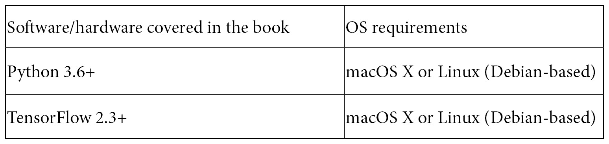

# 序言

2019 年 TensorFlow 2.x 的发布是深度学习和人工智能领域最盛大且最受期待的事件之一，因为它带来了对这个流行且相关框架的久违改进，主要集中在简化和易用性上。

Keras 被作为官方 TensorFlow 高级 API，支持在急切执行和基于图执行之间来回切换（得益于`tf.function`），以及通过`tf.data`创建复杂数据管道，这些只是 TensorFlow 2.x 带来的一些重要新功能。

在本书中，你将发现大量实用的示例，帮助你在计算机视觉领域的深度学习应用中，利用这些进步。我们将涵盖广泛的应用，从图像分类到更具挑战性的任务，如目标检测、图像分割以及**自动化机器学习**（**AutoML**）。

到本书结束时，你将准备好并有足够的信心应对任何计算机视觉问题，得益于 TensorFlow 2.x 的无价帮助！

# 本书适用对象

本书适用于计算机视觉开发者、计算机视觉工程师和深度学习从业者，尤其是那些寻找计算机视觉中常见问题解决方案的人。你将学习如何使用现代机器学习技术和深度学习架构来完成各种计算机视觉任务。要求具备 Python 编程和计算机视觉的基础知识。

# 本书涵盖内容

*第一章*，*TensorFlow 2.x 计算机视觉入门*，概述了基本的深度学习概念，同时也首次介绍了一些重要的 TensorFlow 2.x 特性，如 Keras 和`tf.data.Dataset` API。它还教你如何完成一些常见且必要的任务，如保存和加载模型，以及可视化网络架构。最后，章节通过实现一个简单的图像分类器作结。

*第二章*，*执行图像分类*，深入探讨了深度神经网络在计算机视觉中最常见的应用——图像分类。它探索了常见的分类种类，如二分类和多分类，然后转向多标签分类的示例，并介绍了使用迁移学习和 TensorFlow Hub 的现成解决方案。

*第三章*，*利用迁移学习发挥预训练网络的优势*，重点介绍迁移学习，这是一种强大的技术，可以重复利用在庞大数据集上预训练的网络，从而提高开发生产力和深度学习驱动的计算机视觉应用的性能。本章首先让你使用预训练的网络作为特征提取器。接着，你将学习如何通过一种叫做增量学习的过程，将深度学习与传统机器学习算法结合。最后，本章通过两个微调示例作结：第一个使用 Keras API，第二个依赖于 TensorFlow Hub。

*第四章*，*利用 DeepDream、神经风格迁移和图像超分辨率增强和美化图像*，聚焦于计算机视觉中深度神经网络的一些有趣和不那么传统的应用，特别是 DeepDream、神经风格迁移和图像超分辨率。

*第五章*，*使用自编码器减少噪声*，讲解了自编码器，这是一种在图像修复、逆向图像搜索索引和图像去噪等领域广泛应用的复合架构。它首先介绍了自编码器的密集型和卷积变体，然后解释了若干应用，如逆向图像搜索引擎和异常值检测。

*第六章*，*生成模型与对抗攻击*，向你介绍了许多**生成对抗网络**（**GANs**）的示例和应用。本章以一个示例结束，展示如何对卷积神经网络执行对抗攻击。

*第七章*，*使用 CNN 和 RNN 为图像生成描述*，重点介绍了如何结合卷积神经网络和循环神经网络，生成图像的文字描述。

*第八章*，*通过图像分割实现图像的细粒度理解*，重点讲解图像分割，这是图像分类的细粒度版本，作用于像素级别。它涵盖了开创性的分割架构，如 U-Net 和 Mask-RCNN。

*第九章*，*通过目标检测定位图像中的元素*，涵盖了复杂而常见的目标检测任务。它介绍了基于图像金字塔和滑动窗口的传统方法，以及更现代的解决方案，如 YOLO。章节中还详细解释了如何利用 TensorFlow 目标检测 API，在自定义数据集上训练最先进的模型。

*第十章*，*将深度学习的力量应用于视频*，扩展了深度神经网络在视频中的应用。在这里，你将看到如何检测情绪、识别动作和生成视频帧的示例。

*第十一章*，*通过 AutoML 简化网络实现*，探讨了使用 Autokeras 这一基于 TensorFlow 2.x 的实验性库，开启了 AutoML 这一令人兴奋的子领域。Autokeras 使用**神经网络架构搜索**（**NAS**）来为给定问题找到最佳模型。本章首先探讨了 Autokeras 的基本功能，最后通过 AutoML 创建一个年龄和性别预测工具。

*第十二章*，*提升性能*，详细介绍了许多可以用来提升网络性能的不同技术，从简单但强大的方法，如使用集成方法，到更先进的技术，如使用 GradientTape 来根据项目的具体需求定制训练过程。

# 为了充分利用本书的内容

你需要安装 TensorFlow 2 的版本。本书中的所有示例都已经在 macOS X 和 Ubuntu 20.04 上使用 TensorFlow 2.3 进行实现和测试，但它们应该也适用于未来的稳定版本。请注意，Windows 系统不受支持。

虽然并非绝对必要，但强烈建议访问支持 GPU 的机器，无论是在本地还是云端，因为这样可以大幅缩短示例的运行时间。



**如果你正在使用本书的数字版本，建议你自己输入代码或通过 GitHub 仓库（下节中提供的链接）访问代码。这样做将有助于避免与复制粘贴代码相关的潜在错误**。

因为这是一本以实践为导向的书，专注于解决各种实际问题，我鼓励你在任何特别的食谱中，拓展你对任何感兴趣的主题的知识。在每个食谱的*另见*部分，你会找到链接、参考资料以及推荐阅读或扩展点，它们将巩固你对示例中解释的技术的理解。

## 下载示例代码文件

你可以从 GitHub 下载本书的示例代码文件，地址是[`github.com/PacktPublishing/Tensorflow-2.0-Computer-Vision-Cookbook`](https://github.com/PacktPublishing/Tensorflow-2.0-Computer-Vision-Cookbook)。如果代码有更新，将会在现有的 GitHub 仓库中进行更新。

我们还在[`github.com/PacktPublishing/`](https://github.com/PacktPublishing/)提供了其他代码包，来自我们丰富的书籍和视频目录。快去看看吧！

# 《实战代码》

本书的《实战代码》视频可以在[`bit.ly/2NmdZ5G`](https://bit.ly/2NmdZ5G)观看。

# 下载彩色图像

我们还提供了一份包含本书中使用的截图/图表的彩色图像的 PDF 文件。你可以在此下载：[`static.packt-cdn.com/downloads/9781838829131_ColorImages.pdf`](https://static.packt-cdn.com/downloads/9781838829131_ColorImages.pdf)。

# 使用的约定

本书中使用了多种文本约定。

`正文中的代码`：表示文本中的代码词汇、数据库表名、文件夹名、文件名、文件扩展名、路径名、虚拟 URL、用户输入和 Twitter 账号。例如：“使用`image_generator`，我们将直接从存储图像的目录中选择并显示一批随机的 10 张图像。”

代码块如下所示：

```py
iterator = (image_generator
           .flow_from_directory(directory=data_directory, 
                                 batch_size=10))
for batch, _ in iterator:
plt.figure(figsize=(5, 5))
for index, image in enumerate(batch, start=1):
ax = plt.subplot(5, 5, index)
plt.imshow(image)
plt.axis(‘off’)
plt.show()
break
```

当我们希望特别引起你对代码块中某一部分的注意时，相关的行或项会被加粗显示：

```py
[default]
exten => s,1,Dial(Zap/1|30)
exten => s,2,Voicemail(u100)
exten => s,102,Voicemail(b100)
exten => i,1,Voicemail(s0)
```

任何命令行输入或输出都如下所示：

```py
$ pip install tensorflow-hub Pillow
$ pip install tensorflow-datasets tqdm
```

**粗体**：表示一个新术语、一个重要的词汇或在屏幕上看到的词汇。例如，菜单或对话框中的词汇会以这种方式出现在文本中。以下是一个例子：“从**管理**面板中选择**系统信息**。”

提示或重要说明

在本章节的后续食谱中，我们将继续使用我们刚刚处理过的修改版斯坦福汽车数据集。

# 章节

在本书中，你会发现几个经常出现的标题（*准备工作*、*如何操作…*、*工作原理…*、*更多内容…* 和 *另见*）。

为了给出清晰的操作指南，请按照以下方式使用这些部分：

准备工作

本节告诉你在该食谱中会遇到什么内容，并描述如何设置任何所需的软硬件或前期设置。

## 如何操作…

本部分包含遵循食谱所需的步骤。

## 工作原理…

本部分通常包含对上一节所发生内容的详细说明。

## 更多内容…

本部分包含关于食谱的附加信息，帮助你更好地理解食谱。

## 另见

本部分提供了指向其他有用信息的链接，帮助你更好地完成食谱。

# 联系我们

我们欢迎读者提供反馈意见。

`customercare@packtpub.com`。

**勘误表**：尽管我们已尽最大努力确保内容的准确性，但错误仍然可能发生。如果你在本书中发现错误，我们将不胜感激你能向我们报告。请访问 [www.packtpub.com/support/errata](http://www.packtpub.com/support/errata)，选择你的书籍，点击“勘误表提交表格”链接，并填写相关细节。

`copyright@packt.com`，并提供相关链接。

**如果你有意成为作者**：如果你在某个领域有专长，并且有兴趣写作或为书籍贡献内容，请访问 [authors.packtpub.com](http://authors.packtpub.com)。

# 书评

请留下评论。在您阅读并使用本书后，为什么不在您购买该书的网站上留下评论呢？潜在的读者可以根据您的客观评价做出购买决定，我们在 Packt 可以了解您对我们产品的看法，而我们的作者也能看到您对他们书籍的反馈。谢谢！

如需了解有关 Packt 的更多信息，请访问[packt.com](http://packt.com)。
