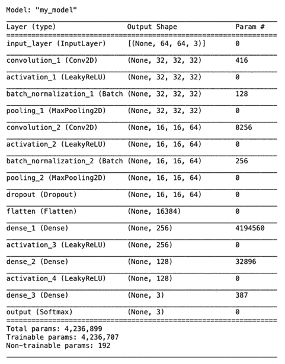

# 第一章：使用 TensorFlow 2.x 进行计算机视觉入门

TensorFlow 2.x 最棒的特点之一是，它终于将 Keras 纳入了高层 API。这为什么如此重要呢？虽然 Keras 和 TensorFlow 之间已经有很好的兼容性，但它们依然是独立的库，拥有不同的开发周期，这导致了频繁的兼容性问题。如今，这两个极为流行的工具关系正式确立，它们将朝着同一个方向发展，遵循同一条路线图，实现无缝的互操作性。最终，Keras 就是 TensorFlow，TensorFlow 也就是 Keras。

或许这次合并最大的优势就是，通过使用 Keras 的高层功能，我们在性能上丝毫没有妥协。简单来说，Keras 代码已经准备好用于生产！

除非某个项目的具体要求另有规定，否则在本书的大多数配方中，我们将依赖 TensorFlow 的 Keras API。

这一决策背后的原因有两个：

+   Keras 更易于理解和使用。

+   它是使用 TensorFlow 2.x 开发的推荐方式。

在本章中，我们将涵盖以下配方：

+   使用 Keras API 的基本构建模块

+   使用 Keras API 加载图像

+   使用 tf.data.Dataset API 加载图像

+   保存和加载模型

+   可视化模型架构

+   创建一个基本的图像分类器

我们开始吧！

# 技术要求

对于本章内容，您需要安装并配置好 TensorFlow 2.x。如果能访问到 GPU，无论是物理 GPU 还是通过云服务提供商提供的 GPU，您的体验将更加愉快。在每个配方的 *准备工作* 部分，您都能找到完成它所需的具体前期步骤和依赖项。最后，本章中所有的代码都可以在本书的 GitHub 仓库中找到，地址为 [`github.com/PacktPublishing/Tensorflow-2.0-Computer-Vision-Cookbook/tree/master/ch1`](https://github.com/PacktPublishing/Tensorflow-2.0-Computer-Vision-Cookbook/tree/master/ch1)。

请查看以下链接，观看“代码实战”视频：

[`bit.ly/39wkpGN`](https://bit.ly/39wkpGN)。

# 使用 Keras API 的基本构建模块

Keras 是 TensorFlow 2.x 的官方高层 API，并且强烈建议在实验性和生产级代码中使用。因此，在本配方中，我们将通过创建一个非常简单的全连接神经网络来回顾 Keras 的基本构建模块。

准备好了吗？我们开始吧！

## 准备工作

在最基本的层面上，安装好 TensorFlow 2.x 就能满足所有需求。

## 如何操作…

在接下来的章节中，我们将逐步讲解完成此配方所需的步骤。我们开始吧：

1.  从 Keras API 导入所需的库：

    ```py
    from sklearn.model_selection import train_test_split
    from sklearn.preprocessing import LabelBinarizer
    from tensorflow.keras import Input
    from tensorflow.keras.datasets import mnist
    from tensorflow.keras.layers import Dense
    from tensorflow.keras.models import Model
    from tensorflow.keras.models import Sequential
    ```

1.  使用 Sequential API 创建模型，通过将层列表传递给 Sequential 构造函数。每一层中的数字对应其包含的神经元或单元数：

    ```py
    layers = [Dense(256, input_shape=(28 * 28 * 1,), 
                    activation='sigmoid'),
              Dense(128, activation='sigmoid'),
              Dense(10, activation='softmax')]
    sequential_model_list = Sequential(layers)
    ```

1.  使用 `add()` 方法逐层添加模型。每一层中的数字对应其包含的神经元或单元数：

    ```py
    sequential_model = Sequential()
    sequential_model.add(Dense(256, 
                         input_shape=(28 * 28 * 1,), 
                         activation='sigmoid'))
    sequential_model.add(Dense(128, activation='sigmoid'))
    sequential_model.add(Dense(10, activation='softmax'))
    ```

1.  使用功能 API 创建模型。每一层中的数字对应其包含的神经元或单元数：

    ```py
    input_layer = Input(shape=(28 * 28 * 1,))
    dense_1 = Dense(256, activation='sigmoid')(input_layer)
    dense_2 = Dense(128, activation='sigmoid')(dense_1)
    predictions = Dense(10, activation='softmax')(dense_2)
    functional_model = Model(inputs=input_layer, 
                             outputs=predictions)
    ```

1.  使用面向对象的方法，通过子类化 `tensorflow.keras.models.Model` 来创建模型。每一层中的数字对应其包含的神经元或单元数：

    ```py
    class ClassModel(Model):
        def __init__(self):
            super(ClassModel, self).__init__()
            self.dense_1 = Dense(256, activation='sigmoid')
            self.dense_2 = Dense(256, activation='sigmoid')
            self.predictions = Dense(10,activation='softmax')
        def call(self, inputs, **kwargs):
            x = self.dense_1(inputs)
            x = self.dense_2(x)
      return self.predictions(x)
    class_model = ClassModel()
    ```

1.  准备数据，以便我们可以训练之前定义的所有模型。我们必须将图像重塑为向量格式，因为这是全连接网络所期望的格式：

    ```py
    (X_train, y_train), (X_test, y_test) = mnist.load_data()
    X_train = X_train.reshape((X_train.shape[0], 28 * 28 * 
                               1))
    X_test = X_test.reshape((X_test.shape[0], 28 * 28 * 
                              1))
    X_train = X_train.astype('float32') / 255.0
    X_test = X_test.astype('float32') / 255.0
    ```

1.  对标签进行独热编码，以消除任何不必要的排序偏差：

    ```py
    label_binarizer = LabelBinarizer()
    y_train = label_binarizer.fit_transform(y_train)
    y_test = label_binarizer.fit_transform(y_test)
    ```

1.  将 20% 的数据用于验证：

    ```py
    X_train, X_valid, y_train, y_valid = train_test_split(X_train, y_train, train_size=0.8)
    ```

1.  编译、训练这些模型 50 个 epochs，并在测试集上进行评估：

    ```py
    models = {
        'sequential_model': sequential_model,
        'sequential_model_list': sequential_model_list,
        'functional_model': functional_model,
        'class_model': class_model
    }
    for name, model in models.items():
        print(f'Compiling model: {name}')
        model.compile(loss='categorical_crossentropy', 
                      optimizer='adam', 
                      metrics=['accuracy'])
        print(f'Training model: {name}')
        model.fit(X_train, y_train,
                  validation_data=(X_valid, y_valid),
                  epochs=50,
                  batch_size=256,
                  verbose=0)
        _, accuracy = model.evaluate(X_test, y_test, 
                                     verbose=0)
        print(f'Testing model: {name}. \nAccuracy: 
              {accuracy}')
        print('---')
    ```

在 50 个 epochs 后，所有三个模型应该在测试集上达到约 98% 的准确率。

## 工作原理如下…

在前一节中，我们讨论了构建大多数基于 TensorFlow 2.x 的深度学习计算机视觉项目所需的基本构建模块。

首先，我们导入了 Keras API，这是 TensorFlow 第二版的高级接口。我们了解到所有与 Keras 相关的功能都位于 `tensorflow` 包内。

接下来，我们发现 TensorFlow 2.x 在定义模型时提供了很大的灵活性。特别是，我们有两个主要的 API 可以用来构建模型：

+   **符号化**：也被称为声明式 API，它允许我们将模型定义为**有向无环图（DAG）**，其中每一层构成一个节点，层之间的交互或连接是边缘。这个 API 的优点是可以通过绘图或打印其架构来检查模型；框架会运行兼容性检查，减少运行时错误的概率；如果模型编译通过，它就会运行。另一方面，其主要缺点是不适合非 DAG 架构（具有循环的网络），例如 Tree-LSTMs。

+   **命令式**：也称为**模型子类化 API**，这种 API 是一种更符合 Python 编程习惯、对开发者友好的指定模型方式。与其符号化的对应方式相比，它也允许在前向传播中具有更多的灵活性。该 API 的优点是，开发模型与其他面向对象任务没有区别，这加快了尝试新想法的速度；使用 Python 的内置结构指定控制流很容易；它适用于非 DAG 架构，如树形 RNN。缺点是，由于架构隐藏在类内部，复用性降低；几乎不进行层间兼容性检查，因此将大部分调试责任从框架转移到开发者身上；并且由于层之间的相互联系信息不可用，透明性降低。

我们使用了 Sequential 和 Functional API 定义了相同的架构，分别对应符号化或声明式的网络实现方式，并且还使用命令式方法定义了第三种方式。

为了明确说明，无论我们采用哪种方法，最终这三种网络是相同的，我们在著名的`MNIST`数据集上进行了训练和评估，最终在测试集上达到了 98%的不错准确率。

## 另见

如果你对 Tree-LSTM（树形 LSTM）感兴趣，可以阅读首次介绍它们的论文，点击这里查看：https://nlp.stanford.edu/pubs/tai-socher-manning-acl2015.pdf。

# 使用 Keras API 加载图像

在这个教程中，我们将学习如何使用 Keras API 加载图像，这在计算机视觉中是一个非常重要的任务，因为我们总是需要处理视觉数据。具体来说，我们将学习如何打开、浏览和可视化单张图像，以及一批图像。此外，我们还将学习如何通过编程下载数据集。

## 准备工作

Keras 依赖于`Pillow`库来处理图像。你可以通过`pip`轻松安装它：

```py
$> pip install Pillow
```

开始吧！

## 如何实现…

现在，让我们开始本教程：

1.  导入必要的包：

    ```py
    import glob
    import os
    import tarfile
    import matplotlib.pyplot as plt
    from tensorflow.keras.preprocessing.image import ImageDataGenerator
    from tensorflow.keras.preprocessing.image 
    import load_img, img_to_array
    from tensorflow.keras.utils import get_file
    ```

1.  定义`CINIC-10`数据集的 URL 和目标路径，这是著名`CIFAR-10`数据集的替代品：

    ```py
    DATASET_URL = 'https://datashare.is.ed.ac.uk/bitstream/handle/10283/3192/CINIC-10.tar.gz?sequence=4&isAllowed=y'
    DATA_NAME = 'cinic10'
    FILE_EXTENSION = 'tar.gz'
    FILE_NAME = '.'.join([DATA_NAME, FILE_EXTENSION])
    ```

1.  下载并解压数据。默认情况下，它将存储在`~/.keras/datasets/<FILE_NAME>`中：

    ```py
    downloaded_file_location = get_file(origin=DATASET_URL, fname=FILE_NAME, extract=False)
    # Build the path to the data directory based on the location of the downloaded file.
    data_directory, _ = downloaded_file_location.rsplit(os.path.sep, maxsplit=1)
    data_directory = os.path.sep.join([data_directory, 
                                       DATA_NAME])
    # Only extract the data if it hasn't been extracted already
    if not os.path.exists(data_directory):
        tar = tarfile.open(downloaded_file_location)
        tar.extractall(data_directory)
    ```

1.  加载所有图像路径并打印找到的图像数量：

    ```py
    data_pattern = os.path.sep.join([data_directory, 
                                     '*/*/*.png'])
    image_paths = list(glob.glob(data_pattern))
    print(f'There are {len(image_paths):,} images in the 
          dataset')
    ```

    输出应该如下所示：

    ```py
    There are 270,000 images in the dataset
    ```

1.  从数据集中加载单张图像并打印其元数据：

    ```py
    sample_image = load_img(image_paths[0])
    print(f'Image type: {type(sample_image)}')
    print(f'Image format: {sample_image.format}')
    print(f'Image mode: {sample_image.mode}')
    print(f'Image size: {sample_image.size}')
    ```

    输出应该如下所示：

    ```py
    Image type: <class 'PIL.PngImagePlugin.PngImageFile'>
    Image format: PNG
    Image mode: RGB
    Image size: (32, 32)
    ```

1.  将图像转换为`NumPy`数组：

    ```py
    sample_image_array = img_to_array(sample_image)
    print(f'Image type: {type(sample_image_array)}')
    print(f'Image array shape: {sample_image_array.shape}')
    ```

    这是输出：

    ```py
    Image type: <class 'numpy.ndarray'>
    Image array shape: (32, 32, 3)
    ```

1.  使用`matplotlib`显示图像：

    ```py
    plt.imshow(sample_image_array / 255.0)
    ```

    这给我们带来了以下图像：

    

    图 1.1 – 示例图像

1.  使用`ImageDataGenerator`加载一批图像。与前一步一样，每张图像将被重新缩放到[0, 1]的范围内：

    ```py
    image_generator = ImageDataGenerator(horizontal_flip=True, rescale=1.0 / 255.0)
    ```

1.  使用`image_generator`，我们将从存储图像的目录中直接挑选并显示一批随机的 10 张图像：

    ```py
    iterator = (image_generator
            .flow_from_directory(directory=data_directory, 
                                     batch_size=10))
    for batch, _ in iterator:
        plt.figure(figsize=(5, 5))
        for index, image in enumerate(batch, start=1):
            ax = plt.subplot(5, 5, index)
            plt.imshow(image)
            plt.axis('off')
        plt.show()
        break
    ```

    显示的批次如下所示：


图 1.2 – 图像批次

让我们看看这一切是如何工作的。

## 它是如何工作的……

首先，我们借助`get_file()`函数下载了一个视觉数据集，该函数默认将文件存储在我们选择的文件名下，并保存在`~/.keras/datasets`目录中。如果文件已存在于此位置，`get_file()`会智能地避免重新下载。

接下来，我们使用`untar`解压了`CINIC-10`数据集。尽管这些步骤并非加载图像所必需（我们可以手动下载和解压数据集），但通常将尽可能多的步骤自动化是个好主意。

然后我们用`load_img()`加载了一张图像到内存中，这个函数底层使用了`Pillow`库。由于该函数返回的结果格式不是神经网络可以理解的格式，我们使用`img_to_array()`将其转换为`NumPy`数组。

最后，为了批量加载图像而不是一个一个地加载，我们使用了`ImageDataGenerator`，它已被配置为同时对每张图像进行归一化处理。`ImageDataGenerator`能够做更多的事情，我们通常会在需要实现数据增强时使用它，但在这个示例中，我们只使用它一次性从磁盘加载 10 张图像，得益于`flow_from_directory()`方法。最后需要说明的是，尽管这个方法返回的是一批图像和标签，但我们忽略了标签，因为我们只对图像感兴趣。

## 另见

要了解更多关于使用 Keras 处理图像的信息，请参考官方文档：https://www.tensorflow.org/api_docs/python/tf/keras/preprocessing/image。有关`CINIC-10`数据集的更多信息，请访问此链接：[`datashare.is.ed.ac.uk/handle/10283/3192`](https://datashare.is.ed.ac.uk/handle/10283/3192)。

# 使用 tf.data.Dataset API 加载图像

在本示例中，我们将学习如何使用`tf.data.Dataset` API 加载图像，这是 TensorFlow 2.x 带来的最重要创新之一。其函数式接口以及高效的优化，使其在大规模项目中成为比传统 Keras API 更好的选择，尤其是在效率和性能至关重要的场景下。

具体来说，我们将学习如何打开、探索和可视化单张图像，以及一批图像。此外，我们还将学习如何通过编程下载数据集。

## 如何做到这一点……

让我们开始这个示例：

1.  首先，我们需要导入本示例所需的所有包：

    ```py
    import os
    import tarfile
    import matplotlib.pyplot as plt
    import numpy as np
    import tensorflow as tf
    from tensorflow.keras.utils import get_file
    ```

1.  定义`CINIC-10`数据集的 URL 和存储路径，这是`CIFAR-10`数据集的一个替代品：

    ```py
    DATASET_URL = 'https://datashare.is.ed.ac.uk/bitstream/handle/10283/3192/CINIC-10.tar.gz?sequence=4&isAllowed=y'
    DATA_NAME = 'cinic10'
    FILE_EXTENSION = 'tar.gz'
    FILE_NAME = '.'.join([DATA_NAME, FILE_EXTENSION])
    ```

1.  下载并解压数据。默认情况下，它将存储在`~/keras/dataset/<FILE_NAME>`路径下：

    ```py
    downloaded_file_location = get_file(origin=DATASET_URL, fname=FILE_NAME, extract=False)
    # Build the path to the data directory based on the location of the downloaded file.
    data_directory, _ = downloaded_file_location.rsplit(os.path.sep, maxsplit=1)
    data_directory = os.path.sep.join([data_directory, 
                                      DATA_NAME])
    # Only extract the data if it hasn't been extracted already
    if not os.path.exists(data_directory):
        tar = tarfile.open(downloaded_file_location)
        tar.extractall(data_directory)
    ```

1.  使用类似 glob 模式的方式创建图像路径的数据集：

    ```py
    data_pattern = os.path.sep.join([data_directory, '*/*/*.png'])
    image_dataset = tf.data.Dataset.list_files(data_pattern)
    ```

1.  从数据集中获取一个路径，并用它读取相应的图像：

    ```py
    for file_path in image_dataset.take(1):
        sample_path = file_path.numpy()
    sample_image = tf.io.read_file(sample_path)
    ```

1.  尽管图像现在已经加载到内存中，我们仍然需要将其转换为神经网络可以处理的格式。为此，我们必须将其从 PNG 格式解码为`NumPy`数组，如下所示：

    ```py
    sample_image = tf.image.decode_png(sample_image, 
                                       channels=3)
    sample_image = sample_image.numpy()
    ```

1.  使用`matplotlib`显示图像：

    ```py
    plt.imshow(sample_image / 255.0)
    ```

    这是结果：

    

    

    图 1.3 – 示例图像

1.  取`image_dataset`的前 10 个元素，解码并归一化它们，然后使用`matplotlib`进行显示：

    ```py
    plt.figure(figsize=(5, 5))
    for index, image_path in enumerate(image_dataset.take(10), start=1):
        image = tf.io.read_file(image_path)
        image = tf.image.decode_png(image, channels=3)
        image = tf.image.convert_image_dtype(image, 
                                             np.float32)
        ax = plt.subplot(5, 5, index)
        plt.imshow(image)
        plt.axis('off')
    plt.show()
    plt.close()
    ```

    这是输出结果：


图 1.4 – 图像批次

让我们更详细地解释一下。

## 工作原理……

首先，我们使用`get_file()`辅助函数下载了`CINIC-10`数据集，该函数默认将获取的文件保存在`~/.keras/datasets`目录下，并使用我们指定的文件名。如果文件已经下载过，`get_files()`将不会再次下载。

由于 CINIC-10 是压缩文件，我们使用`untar`提取了它的内容。当然，每次加载图像时并不需要执行这些步骤，因为我们可以手动下载并解压数据集，但将尽可能多的步骤自动化是一个良好的实践。

为了将图像加载到内存中，我们创建了一个包含其文件路径的数据集，这使得我们几乎可以使用相同的流程来显示单张或多张图像。我们通过路径加载图像到内存，然后将其从源格式（本教程中是 PNG）解码，转换为`NumPy`数组，并根据需要进行预处理。

最后，我们取了数据集中前 10 张图像，并使用`matplotlib`进行了显示。

## 另见

如果你想了解更多关于`tf.data.Dataset` API 的内容，请参阅官方文档：[`www.tensorflow.org/api_docs/python/tf/data/Dataset`](https://www.tensorflow.org/api_docs/python/tf/data/Dataset)。关于 CINIC-10 数据集的更多信息，请访问此链接：https://datashare.is.ed.ac.uk/handle/10283/3192。

# 保存和加载模型

训练神经网络是一个艰难且耗时的工作。因此，每次都重新训练模型并不实际。好消息是，我们可以将网络保存到磁盘，并在需要时加载，无论是通过更多训练提升其性能，还是用它来对新数据进行预测。在本教程中，我们将学习不同的保存模型的方法。

让我们开始吧！

## 如何做到……

在这个教程中，我们将训练一个`mnist`模型，仅用于说明我们的观点。让我们开始：

1.  导入我们需要的所有内容：

    ```py
    import json
    import numpy as np
    from sklearn.model_selection import train_test_split
    from sklearn.preprocessing import LabelBinarizer
    from tensorflow.keras import Model
    from tensorflow.keras.datasets import mnist
    from tensorflow.keras.layers import BatchNormalization
    from tensorflow.keras.layers import Conv2D
    from tensorflow.keras.layers import Dense
    from tensorflow.keras.layers import Dropout
    from tensorflow.keras.layers import Flatten
    from tensorflow.keras.layers import Input
    from tensorflow.keras.layers import MaxPooling2D
    from tensorflow.keras.layers import ReLU
    from tensorflow.keras.layers import Softmax
    from tensorflow.keras.models import load_model
    from tensorflow.keras.models import model_from_json
    ```

1.  定义一个函数来下载并准备数据，方法是对训练集和测试集进行归一化，并进行标签的独热编码：

    ```py
    def load_data():
     (X_train, y_train), (X_test, y_test) = mnist.load_data()
        # Normalize data.
        X_train = X_train.astype('float32') / 255.0
        X_test = X_test.astype('float32') / 255.0
        # Reshape grayscale to include channel dimension.
        X_train = np.expand_dims(X_train, axis=3)
        X_test = np.expand_dims(X_test, axis=3)
        # Process labels.
        label_binarizer = LabelBinarizer()
        y_train = label_binarizer.fit_transform(y_train)
        y_test = label_binarizer.fit_transform(y_test)
        return X_train, y_train, X_test, y_test
    ```

1.  定义一个用于构建网络的函数。该架构包含一个卷积层和两个全连接层：

    ```py
    def build_network():
        input_layer = Input(shape=(28, 28, 1))
        convolution_1 = Conv2D(kernel_size=(2, 2),
                               padding='same',
                               strides=(2, 2),
                               filters=32)(input_layer)
        activation_1 = ReLU()(convolution_1)
        batch_normalization_1 = BatchNormalization()    
                                (activation_1)
        pooling_1 = MaxPooling2D(pool_size=(2, 2),
                                  strides=(1, 1),
           padding='same')(batch_normalization_1)
        dropout = Dropout(rate=0.5)(pooling_1)
        flatten = Flatten()(dropout)
        dense_1 = Dense(units=128)(flatten)
        activation_2 = ReLU()(dense_1)
        dense_2 = Dense(units=10)(activation_2)
        output = Softmax()(dense_2)
        network = Model(inputs=input_layer, outputs=output)
        return network
    ```

1.  实现一个函数，用来使用测试集评估网络：

    ```py
    def evaluate(model, X_test, y_test):
        _, accuracy = model.evaluate(X_test, y_test, 
                                     verbose=0)
        print(f'Accuracy: {accuracy}')
    ```

1.  准备数据，创建验证集，并实例化神经网络：

    ```py
    X_train, y_train, X_test, y_test = load_data()
    X_train, X_valid, y_train, y_valid = train_test_split(X_train, y_train, train_size=0.8)
    model = build_network()
    ```

1.  编译并训练模型 50 个 epoch，批次大小为`1024`。根据你机器的性能调整这些值：

    ```py
    model.compile(loss='categorical_crossentropy', 
                  optimizer='adam', 
                  metrics=['accuracy'])
    model.fit(X_train, y_train, 
              validation_data=(X_valid, y_valid), 
              epochs=50, 
              batch_size=1024, 
              verbose=0)
    ```

1.  使用`save()`方法将模型及其权重以 HDF5 格式保存。然后，使用`load_model()`加载保存的模型，并评估该网络在测试集上的表现：

    ```py
    # Saving model and weights as HDF5.
    model.save('model_and_weights.hdf5')
    # Loading model and weights as HDF5.
    loaded_model = load_model('model_and_weights.hdf5')
    # Predicting using loaded model.
    evaluate(loaded_model, X_test, y_test)
    ```

    输出如下：

    ```py
    Accuracy: 0.9836000204086304
    ```

在这里，我们可以看到加载的模型在测试集上达到了 98.36%的准确率。让我们更详细地看看这个结果。

## 它是如何工作的…

我们刚刚学会了如何使用 TensorFlow 的 2.0 Keras API 将模型持久化到磁盘并再加载到内存中，这包括通过单一的`save()`方法保存模型及其权重。虽然还有其他方法可以实现同样的目标，但这是最常用和推荐的方法，因为我们可以通过`load_model()`函数简单地恢复网络的保存状态，然后继续训练或用于推断。

## 还有更多…

你也可以将模型与权重分开存储——分别使用`to_json()`和`save_weights()`。这种方法的优势在于，我们可以通过`model_from_json()`函数从头开始复制一个具有相同架构的网络。然而，缺点是我们需要更多的函数调用，这种做法很少值得采用。

# 可视化模型架构

由于神经网络的复杂性，调试神经网络最有效的方式之一就是可视化它的架构。在本教程中，我们将学习两种不同的方式来展示模型的架构：

+   使用文本摘要

+   使用视觉图示

## 准备工作

我们需要`Pillow`和`pydot`来生成网络架构的视觉表示。我们可以通过以下方式使用 pip 安装这两个库：

```py
$> pip install Pillow pydot
```

## 如何操作…

可视化模型的架构非常简单，正如我们将在接下来的步骤中所学到的：

1.  导入所有必需的库：

    ```py
    from PIL import Image
    from tensorflow.keras import Model
    from tensorflow.keras.layers import BatchNormalization
    from tensorflow.keras.layers import Conv2D
    from tensorflow.keras.layers import Dense
    from tensorflow.keras.layers import Dropout
    from tensorflow.keras.layers import Flatten
    from tensorflow.keras.layers import Input
    from tensorflow.keras.layers import LeakyReLU
    from tensorflow.keras.layers import MaxPooling2D
    from tensorflow.keras.layers import Softmax
    from tensorflow.keras.utils import plot_model
    ```

1.  使用我们在前一步中导入的所有层来实现一个模型。请注意，我们为方便后续引用给每个层命名。首先，让我们定义输入：

    ```py
    input_layer = Input(shape=(64, 64, 3), 
                        name='input_layer')
    ```

    这是第一个卷积块：

    ```py
    convolution_1 = Conv2D(kernel_size=(2, 2),
                           padding='same',
                           strides=(2, 2),
                           filters=32,
                           name='convolution_1')(input_layer)
    activation_1 = LeakyReLU(name='activation_1')(convolution_1)
    batch_normalization_1 = BatchNormalization(name='batch_normalization_1')(activation_1)
    pooling_1 = MaxPooling2D(pool_size=(2, 2),
                             strides=(1, 1),
                             padding='same',
                             name='pooling_1')(batch_
                             normalization_1)
    ```

    这是第二个卷积块：

    ```py
    convolution_2 = Conv2D(kernel_size=(2, 2),
                           padding='same',
                           strides=(2, 2),
                           filters=64,
                           name='convolution_2')(pooling_1)
    activation_2 = LeakyReLU(name='activation_2')(convolution_2)
    batch_normalization_2 = BatchNormalization(name='batch_normalization_2')(activation_2)
    pooling_2 = MaxPooling2D(pool_size=(2, 2),
                             strides=(1, 1),
                             padding='same',
                             name='pooling_2')
                            (batch_normalization_2)
    dropout = Dropout(rate=0.5, name='dropout')(pooling_2)
    ```

    最后，我们将定义密集层和模型本身：

    ```py
    flatten = Flatten(name='flatten')(dropout)
    dense_1 = Dense(units=256, name='dense_1')(flatten)
    activation_3 = LeakyReLU(name='activation_3')(dense_1)
    dense_2 = Dense(units=128, name='dense_2')(activation_3)
    activation_4 = LeakyReLU(name='activation_4')(dense_2)
    dense_3 = Dense(units=3, name='dense_3')(activation_4)
    output = Softmax(name='output')(dense_3)
    model = Model(inputs=input_layer, outputs=output, 
                  name='my_model')
    ```

1.  通过打印其架构的文本表示来总结模型，如下所示：

    ```py
    print(model.summary())
    ```

    这是摘要。**输出形状**列中的数字描述了该层生成的体积的维度，而**参数数量**列中的数字则表示该层中的参数数量：

    

    图 1.5 – 网络的文本表示

    最后几行总结了可训练和不可训练参数的数量。模型的参数越多，训练起来就越困难和缓慢。

1.  绘制网络架构的图示：

    ```py
    plot_model(model, 
               show_shapes=True, 
               show_layer_names=True, 
               to_file='my_model.jpg')
    model_diagram = Image.open('my_model.jpg')
    ```

    这会产生以下输出：


图 1.6 – 网络的视觉表示

现在，让我们了解这一切是如何工作的。

## 它是如何工作的…

可视化一个模型就像对包含模型的变量调用`plot_model()`一样简单。然而，为了使其正常工作，我们必须确保已安装所需的依赖项；例如，`pydot`。尽管如此，如果我们希望更详细地总结网络各层的参数数量，我们必须调用`summarize()`方法。

最后，为每一层命名是一个良好的约定。这使得架构更具可读性，并且在将来更容易重用，因为我们可以通过名称简单地检索某一层。这一特性的一个显著应用是**神经风格迁移**。

# 创建一个基本的图像分类器

我们将通过在`Fashion-MNIST`数据集上实现一个图像分类器来结束本章，`Fashion-MNIST`是`mnist`的一个流行替代品。这将帮助我们巩固从前面教程中学到的知识。如果在某个步骤中你需要更多的细节，请参考之前的教程。

## 准备工作

我鼓励你在处理本教程之前先完成前面五个教程，因为我们的目标是通过本章学到的知识形成一个完整的循环。此外，确保你的系统中已经安装了`Pillow`和`pydot`。你可以使用 pip 安装它们：

```py
$> pip install Pillow pydot
```

最后，我们将使用`tensorflow_docs`包来绘制模型的损失和准确率曲线。你可以通过以下命令安装这个库：

```py
$> pip install git+https://github.com/tensorflow/docs
```

## 如何操作…

按照以下步骤完成本教程：

1.  导入必要的包：

    ```py
    import matplotlib.pyplot as plt
    import numpy as np
    import tensorflow as tf
    import tensorflow_docs as tfdocs
    import tensorflow_docs.plots
    from sklearn.model_selection import train_test_split
    from sklearn.preprocessing import LabelBinarizer
    from tensorflow.keras import Model
    from tensorflow.keras.datasets import fashion_mnist as fm
    from tensorflow.keras.layers import BatchNormalization
    from tensorflow.keras.layers import Conv2D
    from tensorflow.keras.layers import Dense
    from tensorflow.keras.layers import Dropout
    from tensorflow.keras.layers import ELU
    from tensorflow.keras.layers import Flatten
    from tensorflow.keras.layers import Input
    from tensorflow.keras.layers import MaxPooling2D
    from tensorflow.keras.layers import Softmax
    from tensorflow.keras.models import load_model
    from tensorflow.keras.utils import plot_model
    ```

1.  定义一个函数来加载并准备数据集。它将对数据进行归一化处理，对标签进行独热编码，取部分训练集用于验证，并将三个数据子集包装成三个独立的`tf.data.Dataset`实例，以通过`from_tensor_slices()`提高性能：

    ```py
    def load_dataset():
        (X_train, y_train), (X_test, y_test) = fm.load_data()
        X_train = X_train.astype('float32') / 255.0
        X_test = X_test.astype('float32') / 255.0
        # Reshape grayscale to include channel dimension.
        X_train = np.expand_dims(X_train, axis=3)
        X_test = np.expand_dims(X_test, axis=3)
        label_binarizer = LabelBinarizer()
        y_train = label_binarizer.fit_transform(y_train)
        y_test = label_binarizer.fit_transform(y_test)
        (X_train, X_val,
         y_train, y_val) = train_test_split(X_train, y_train, 

                            train_size=0.8)
        train_ds = (tf.data.Dataset
                    .from_tensor_slices((X_train, 
                                         y_train)))
        val_ds = (tf.data.Dataset
                  .from_tensor_slices((X_val, y_val)))
        test_ds = (tf.data.Dataset
                   .from_tensor_slices((X_test, y_test)))
    ```

1.  实现一个函数，构建一个类似于`BatchNormalization`的网络，我们将使用它来使网络更快、更稳定；同时也实现`Dropout`层，帮助我们应对过拟合问题，这是由于方差过大导致网络失去泛化能力的情况。

    ```py
    def build_network():
        input_layer = Input(shape=(28, 28, 1))
        x = Conv2D(filters=20, 
                   kernel_size=(5, 5),
                   padding='same', 
                   strides=(1, 1))(input_layer)
        x = ELU()(x)
        x = BatchNormalization()(x)
        x = MaxPooling2D(pool_size=(2, 2), 
                         strides=(2, 2))(x)
        x = Dropout(0.5)(x)
        x = Conv2D(filters=50, 
                   kernel_size=(5, 5), 
                   padding='same', 
                   strides=(1, 1))(x)
        x = ELU()(x)
        x = BatchNormalization()(x)
        x = MaxPooling2D(pool_size=(2, 2), 
                         strides=(2, 2))(x)
        x = Dropout(0.5)(x)
        x = Flatten()(x)
        x = Dense(units=500)(x)
        x = ELU()(x)
        x = Dropout(0.5)(x)
        x = Dense(10)(x)
        output = Softmax()(x)
        model = Model(inputs=input_layer, outputs=output)
        return model
    ```

1.  定义一个函数，该函数接收模型的训练历史记录以及一个感兴趣的度量标准，用于创建对应于训练和验证曲线的图：

    ```py
    def plot_model_history(model_history, metric, ylim=None):
        plt.style.use('seaborn-darkgrid')
        plotter = tfdocs.plots.HistoryPlotter()
        plotter.plot({'Model': model_history}, metric=metric)
        plt.title(f'{metric.upper()}')
        if ylim is None:
            plt.ylim([0, 1])
        else:
            plt.ylim(ylim)
        plt.savefig(f'{metric}.png')
        plt.close()
    ```

1.  以每次 256 张图片的批次来消费训练和验证数据集。`prefetch()`方法会启动一个后台线程，填充大小为`1024`的缓冲区，缓存图像批次：

    ```py
    BATCH_SIZE = 256
    BUFFER_SIZE = 1024
    train_dataset, val_dataset, test_dataset = load_dataset()
    train_dataset = (train_dataset
                     .shuffle(buffer_size=BUFFER_SIZE)
                     .batch(BATCH_SIZE)
                     .prefetch(buffer_size=BUFFER_SIZE))
    val_dataset = (val_dataset
                   .batch(BATCH_SIZE)
                   .prefetch(buffer_size=BUFFER_SIZE))
    test_dataset = test_dataset.batch(BATCH_SIZE)
    ```

1.  构建并训练网络：

    ```py
    EPOCHS = 100
    model = build_network()
    model.compile(loss='categorical_crossentropy', optimizer='adam', metrics=['accuracy'])
    model_history = model.fit(train_dataset, validation_data=validation_dataset, epochs=EPOCHS, verbose=0)
    ```

1.  绘制训练和验证的损失与准确率：

    ```py
    plot_model_history(model_history, 'loss', [0., 2.0])
    plot_model_history(model_history, 'accuracy')
    ```

    第一个图对应训练集和验证集的损失曲线：

    

    图 1.7 – 损失图

    第二个图显示了训练和验证集的准确率曲线：

    

    图 1.8 – 准确率图

1.  可视化模型的架构：

    ```py
    plot_model(model, show_shapes=True, show_layer_names=True, to_file='model.png')
    ```

    以下是我们模型的示意图：

    

    图 1.9 – 模型架构

1.  保存模型：

    ```py
    model.save('model.hdf5')
    ```

1.  加载并评估模型：

    ```py
    loaded_model = load_model('model.hdf5')
    results = loaded_model.evaluate(test_dataset, verbose=0)
    print(f'Loss: {results[0]}, Accuracy: {results[1]}')
    ```

    输出如下：

    ```py
    Loss: 0.2943768735975027, Accuracy: 0.9132000207901001
    ```

这完成了本章的最终步骤。让我们回顾一下它的全部运作。

## 它是如何工作的…

在这个步骤中，我们运用了本章中学到的所有教训。我们首先下载了`Fashion-MNIST`，并使用`tf.data.Dataset` API 加载其图像，以便将它们馈送到我们使用声明式功能高级 Keras API 实现的网络中。在将我们的模型拟合到数据之后，我们通过检查在训练和验证集上的损失和准确率曲线来审视其性能，借助`matplotlib`和`tensorflow_docs`。为了更好地理解网络，我们使用`plot_model()`可视化其架构，然后将其以便捷的 HDF5 格式保存到磁盘上，包括其权重。最后，我们使用`load_model()`加载模型以在新的、未见过的数据上评估它 —— 即测试集 —— 获得了令人满意的 91.3% 的准确率评分。

## 另请参阅

欲深入了解`Fashion-MNIST`，请访问此网站：[`github.com/zalandoresearch/fashion-mnist`](https://github.com/zalandoresearch/fashion-mnist)。TensorFlow 文档的 GitHub 仓库在此处可用：[`github.com/tensorflow/docs`](https://github.com/tensorflow/docs)。
