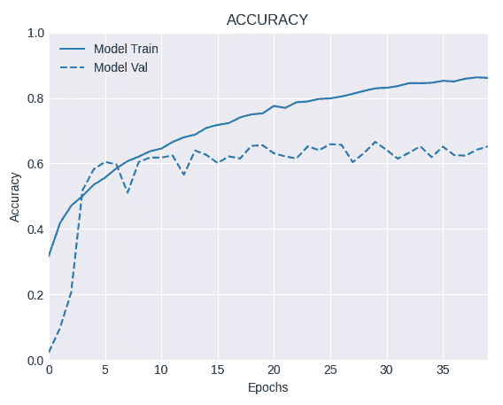

# 第二章：*第二章*：执行图像分类

计算机视觉是一个广泛的领域，借鉴了许多地方的灵感。当然，这意味着它的应用也非常广泛和多样。然而，过去十年里，特别是在深度学习应用于视觉任务的背景下，最大的突破出现在一个特定领域，即**图像分类**。

顾名思义，图像分类的过程是根据图像的视觉内容来识别图像中的内容。这个图像中有狗还是猫？这张图片中显示的数字是什么？这张照片中的人是微笑还是不微笑？

由于图像分类是计算机视觉领域深度学习应用中的一项重要而广泛的任务，本章中的食谱将重点介绍使用 TensorFlow 2.x 进行图像分类的所有细节。

我们将涵盖以下食谱：

+   创建一个二分类器来检测微笑

+   创建一个多类别分类器来玩石头剪刀布

+   创建一个多标签分类器来标记手表

+   从零开始实现 ResNet

+   使用 Keras API 通过预训练网络进行图像分类

+   使用预训练网络通过 TensorFlow Hub 进行图像分类

+   使用数据增强来提高 Keras API 的性能

+   使用 tf.data 和 tf.image API 进行数据增强以提高性能

# 技术要求

除了正确安装 TensorFlow 2.x 外，强烈建议使用 GPU，因为某些食谱非常消耗资源，使用 CPU 将无法完成任务。在每个食谱中，你将找到完成它所需的步骤和依赖项，这些内容位于*准备工作*部分。最后，本章中展示的代码可以在这里完整查看：[`github.com/PacktPublishing/Tensorflow-2.0-Computer-Vision-Cookbook/tree/master/ch2`](https://github.com/PacktPublishing/Tensorflow-2.0-Computer-Vision-Cookbook/tree/master/ch2)。

查看以下链接，观看《代码实践》视频：

[`bit.ly/3bOjqnU`](https://bit.ly/3bOjqnU)

# 创建一个二分类器来检测微笑

在最基本的形式下，图像分类是区分两种类别，或者判断某种特征是否存在。 在本食谱中，我们将实现一个二分类器，用于判断照片中的人是否在微笑。

那么我们开始吧，好吗？

## 准备工作

你需要安装`Pillow`，使用`pip`安装非常简单：

```py
$> pip install Pillow
```

我们将使用`SMILEs`数据集，位于这里：[`github.com/hromi/SMILEsmileD`](https://github.com/hromi/SMILEsmileD)。克隆或下载该仓库的压缩版本到你喜欢的目录。在本食谱中，我们假设数据位于`~/.keras/datasets`目录下，文件夹名为`SMILEsmileD-master`：


图 2.1 – 正例（左）和反例（右）

开始吧！

## 如何实现…

按照以下步骤，从头开始训练一个基于`SMILEs`数据集的微笑分类器：

1.  导入所有必要的包：

    ```py
    import os
    import pathlib
    import glob
    import numpy as np
    from sklearn.model_selection import train_test_split
    from tensorflow.keras import Model
    from tensorflow.keras.layers import *
    from tensorflow.keras.preprocessing.image import *
    ```

1.  定义一个函数从文件路径列表中加载图像和标签：

    ```py
    def load_images_and_labels(image_paths):
        images = []
        labels = []
        for image_path in image_paths:
            image = load_img(image_path, target_size=(32,32), 
                             color_mode='grayscale')
            image = img_to_array(image)
            label = image_path.split(os.path.sep)[-2]
            label = 'positive' in label
            label = float(label)
            images.append(image)
            labels.append(label)
        return np.array(images), np.array(labels)
    ```

    注意，我们正在以灰度图像的形式加载图像，并通过检查图像路径中是否包含单词*positive*来对标签进行编码。

1.  定义一个函数来构建神经网络。该模型的结构基于**LeNet**（你可以在*另见*部分找到 LeNet 论文的链接）：

    ```py
    def build_network():
        input_layer = Input(shape=(32, 32, 1))
        x = Conv2D(filters=20,
                   kernel_size=(5, 5),
                   padding='same',
                   strides=(1, 1))(input_layer)
        x = ELU()(x)
        x = BatchNormalization()(x)
        x = MaxPooling2D(pool_size=(2, 2),
                         strides=(2, 2))(x)
        x = Dropout(0.4)(x)
        x = Conv2D(filters=50,
                   kernel_size=(5, 5),
                   padding='same',
                   strides=(1, 1))(x)
        x = ELU()(x)
        x = BatchNormalization()(x)
        x = MaxPooling2D(pool_size=(2, 2),
                         strides=(2, 2))(x)
        x = Dropout(0.4)(x)
        x = Flatten()(x)
        x = Dense(units=500)(x)
        x = ELU()(x)
        x = Dropout(0.4)(x)
        output = Dense(1, activation='sigmoid')(x)
        model = Model(inputs=input_layer, outputs=output)
        return model
    ```

    由于这是一个二分类问题，输出层只需要一个 Sigmoid 激活的神经元。

1.  将图像路径加载到列表中：

    ```py
    files_pattern = (pathlib.Path.home() / '.keras' / 
                     'datasets' /
                     'SMILEsmileD-master' / 'SMILEs' / '*' 
                        / '*' / 
                     '*.jpg')
    files_pattern = str(files_pattern)
    dataset_paths = [*glob.glob(files_pattern)]
    ```

1.  使用之前定义的`load_images_and_labels()`函数将数据集加载到内存中：

    ```py
    X, y = load_images_and_labels(dataset_paths)
    ```

1.  对图像进行归一化处理，并计算数据集中的正例、负例和总例数：

    ```py
    X /= 255.0
    total = len(y)
    total_positive = np.sum(y)
    total_negative = total - total_positive
    ```

1.  创建训练、测试和验证数据子集：

    ```py
    (X_train, X_test,
     y_train, y_test) = train_test_split(X, y,
                                         test_size=0.2,
                                         stratify=y,
                                         random_state=999)
    (X_train, X_val,
     y_train, y_val) = train_test_split(X_train, y_train,
                                        test_size=0.2,
                                        stratify=y_train,
                                        random_state=999)
    ```

1.  实例化模型并编译它：

    ```py
    model = build_network()
    model.compile(loss='binary_crossentropy',
                  optimizer='rmsprop',
                  metrics=['accuracy'])
    ```

1.  训练模型。由于数据集不平衡，我们为每个类别分配了与数据集中正负图像数量成比例的权重：

    ```py
    BATCH_SIZE = 32
    EPOCHS = 20
    model.fit(X_train, y_train,
              validation_data=(X_val, y_val),
              epochs=EPOCHS,
              batch_size=BATCH_SIZE,
              class_weight={
                  1.0: total / total_positive,
                  0.0: total / total_negative
              })
    ```

1.  在测试集上评估模型：

    ```py
    test_loss, test_accuracy = model.evaluate(X_test, 
                                              y_test)
    ```

在经过 20 个周期后，网络应该能够在测试集上达到约 90%的准确率。在接下来的部分中，我们将解释前述步骤。

## 工作原理…

我们刚刚训练了一个网络来判断一个人是否在图片中微笑。我们的第一个大任务是将数据集中的图像加载成适合神经网络的格式。具体来说，`load_image_and_labels()`函数负责加载灰度图像，调整其大小为 32x32x1，然后将其转换为`numpy`数组。为了提取标签，我们查看了每个图像所在的文件夹：如果文件夹名称中包含单词 positive，我们就将标签编码为 1；否则，将其编码为 0（这里我们用的是将布尔值转换为浮点数的技巧，像这样：`float(label)`）。

接下来，我们构建了神经网络，它受到 LeNet 架构的启发。这里的最大收获是，由于这是一个二分类问题，我们可以使用一个 Sigmoid 激活的神经元来区分两个类别。

然后，我们将 20%的图像用作测试集，从剩下的 80%中再取 20%用作验证集。设置好这三个子集后，我们开始在 20 个周期内训练网络，使用`binary_crossentropy`作为损失函数，`rmsprop`作为优化器。

为了处理数据集中的类别不平衡问题（在 13,165 张图像中，只有 3,690 张包含微笑的人，而其余 9,475 张不包含），我们传递了一个`class_weight`字典，其中我们为每个类别分配了与类别实例数成反比的权重，从而有效地迫使模型更多关注 1.0 类，即*微笑*类别。

最终，我们在测试集上取得了大约 90.5%的准确率。

## 另见

有关`SMILEs`数据集的更多信息，可以访问官方 GitHub 仓库：[`github.com/hromi/SMILEsmileD`](https://github.com/hromi/SMILEsmileD)。你也可以阅读 LeNet 论文（虽然很长）：[`yann.lecun.com/exdb/publis/pdf/lecun-98.pdf`](http://yann.lecun.com/exdb/publis/pdf/lecun-98.pdf)。

# 创建一个多类别分类器来玩石头剪刀布

更多时候，我们关注的是将图像分类为两个以上的类别。正如我们在这个示例中看到的，实现一个神经网络来区分多个类别是相对简单的，最好的展示方法是什么呢？那就是训练一个能够玩著名的“石头剪刀布”游戏的模型。

你准备好了吗？让我们深入了解！

## 准备就绪

我们将使用`Rock-Paper-Scissors Images`数据集，该数据集托管在 Kaggle 上，位置如下：[`www.kaggle.com/drgfreeman/rockpaperscissors`](https://www.kaggle.com/drgfreeman/rockpaperscissors)。要下载它，你需要一个 Kaggle 账户，请登录或注册。然后，在你选择的位置解压缩数据集。在这个示例中，我们假设解压缩后的文件夹位于`~/.keras/datasets`目录下，名为`rockpaperscissors`。

下面是一些示例图像：


图 2.2 – 石头（左）、布（中）和剪刀（右）的示例图像

让我们开始实现吧。

## 如何做……

以下步骤说明如何训练一个多类别**卷积神经网络**（**CNN**）来区分石头剪刀布游戏的三种类别：

1.  导入所需的包：

    ```py
    import os
    import pathlib
    import glob
    import numpy as np
    import tensorflow as tf
    from sklearn.model_selection import train_test_split
    from tensorflow.keras import Model
    from tensorflow.keras.layers import *
    from tensorflow.keras.losses import CategoricalCrossentropy
    ```

1.  定义一个包含三个类别的列表，并为`tf.data.experimental.AUTOTUNE`定义一个别名，我们稍后将使用它：

    ```py
    CLASSES = ['rock', 'paper', 'scissors']
    AUTOTUNE = tf.data.experimental.AUTOTUNE
    ```

    `CLASSES`中的值与每个类别的图像所在目录的名称匹配。

1.  定义一个函数来加载图像及其标签，给定图像的文件路径：

    ```py
    def load_image_and_label(image_path, target_size=(32, 32)):
        image = tf.io.read_file(image_path)
        image = tf.image.decode_jpeg(image, channels=3)
        image = tf.image.rgb_to_grayscale(image)
        image = tf.image.convert_image_dtype(image, 
                                             np.float32)
        image = tf.image.resize(image, target_size)
        label = tf.strings.split(image_path,os.path.sep)[-2]
        label = (label == CLASSES)  # One-hot encode.
        label = tf.dtypes.cast(label, tf.float32)
        return image, label
    ```

    请注意，我们通过将包含图像的文件夹名称（从`image_path`提取）与`CLASSES`列表进行比较来进行 one-hot 编码。

1.  定义一个函数来构建网络架构。在这个例子中，这是一个非常简单和浅层的架构，对于我们要解决的问题足够了：

    ```py
    def build_network():
        input_layer = Input(shape=(32, 32, 1))
        x = Conv2D(filters=32,
                   kernel_size=(3, 3),
                   padding='same',
                   strides=(1, 1))(input_layer)
        x = ReLU()(x)
        x = Dropout(rate=0.5)(x)
        x = Flatten()(x)
        x = Dense(units=3)(x)
        output = Softmax()(x)
        return Model(inputs=input_layer, outputs=output)
    ```

1.  定义一个函数，给定数据集路径，返回一个`tf.data.Dataset`实例，其中包含图像和标签，按批次并可选地进行洗牌：

    ```py
    def prepare_dataset(dataset_path,
                        buffer_size,
                        batch_size,
                        shuffle=True):
        dataset = (tf.data.Dataset
                   .from_tensor_slices(dataset_path)
                   .map(load_image_and_label,
                        num_parallel_calls=AUTOTUNE))
        if shuffle:
            dataset.shuffle(buffer_size=buffer_size)
        dataset = (dataset
                   .batch(batch_size=batch_size)
                   .prefetch(buffer_size=buffer_size))
        return dataset
    ```

1.  将图像路径加载到列表中：

    ```py
    file_patten = (pathlib.Path.home() / '.keras' / 
                   'datasets' /
                   'rockpaperscissors' / 'rps-cv-images' / 
                     '*' /
                   '*.png')
    file_pattern = str(file_patten)
    dataset_paths = [*glob.glob(file_pattern)]
    ```

1.  创建训练、测试和验证数据集的图像路径：

    ```py
    train_paths, test_paths = train_test_split(dataset_paths,
                                              test_size=0.2,
                                            random_state=999)
    train_paths, val_paths = train_test_split(train_paths,
                                          test_size=0.2,
                                         random_state=999)
    ```

1.  准备训练、测试和验证数据集：

    ```py
    BATCH_SIZE = 1024
    BUFFER_SIZE = 1024
    train_dataset = prepare_dataset(train_paths,
                                  buffer_size=BUFFER_SIZE,
                                    batch_size=BATCH_SIZE)
    validation_dataset = prepare_dataset(val_paths,
                                  buffer_size=BUFFER_SIZE,
                                   batch_size=BATCH_SIZE,
                                    shuffle=False)
    test_dataset = prepare_dataset(test_paths,
                                  buffer_size=BUFFER_SIZE,
                                   batch_size=BATCH_SIZE,
                                   shuffle=False)
    ```

1.  实例化并编译模型：

    ```py
    model = build_network()
    model.compile(loss=CategoricalCrossentropy
                 (from_logits=True),
                  optimizer='adam',
                  metrics=['accuracy'])
    ```

1.  将模型拟合`250`个 epoch：

    ```py
    EPOCHS = 250
    model.fit(train_dataset,
              validation_data=validation_dataset,
              epochs=EPOCHS)
    ```

1.  在测试集上评估模型：

    ```py
    test_loss, test_accuracy = model.evaluate(test_dataset)
    ```

在经过 250 轮训练后，我们的网络在测试集上达到了大约 93.5%的准确率。让我们来理解一下我们刚才做了什么。

## 它是如何工作的……

我们首先定义了`CLASSES`列表，这使得我们可以快速根据每张图片所在目录的名称，对其标签进行独热编码，正如我们在`load_image_and_label()`函数中观察到的那样。在同一个函数中，我们从磁盘读取图片，解码 JPEG 格式，将其转换为灰度图（此问题不需要颜色信息），然后将其调整为 32x32x1 的尺寸。

`build_network()`创建了一个非常简单且浅的卷积神经网络（CNN），包含一个卷积层，使用`ReLU()`激活函数，后接一个输出层，包含三个神经元，分别对应数据集中类别的数量。由于这是一个多类分类任务，我们使用`Softmax()`来激活输出层。

`prepare_dataset()`利用之前定义的`load_image_and_label()`函数，将文件路径转换为图像张量批次和独热编码标签。

使用此处解释的三个功能，我们准备了三个数据子集，目的是训练、验证和测试神经网络。我们训练模型 250 个 epoch，使用`adam`优化器和`CategoricalCrossentropy(from_logits=True)`作为损失函数（`from_logits=True`提供了更高的数值稳定性）。

最终，我们在测试集上达到了约 93.5%的准确率。根据这些结果，你可以将这个网络作为石头剪刀布游戏的一个组件，用来识别玩家的手势并做出相应的反应。

另见

关于`Rock-Paper-Scissors Images`数据集的更多信息，请参考它的 Kaggle 官方页面：[`www.kaggle.com/drgfreeman/rockpaperscissors`](https://www.kaggle.com/drgfreeman/rockpaperscissors)。

# 创建一个多标签分类器来标记手表

神经网络不仅仅局限于建模单一变量的分布。实际上，它可以轻松处理每张图片关联多个标签的情况。在这个配方中，我们将实现一个卷积神经网络（CNN），用来分类手表的性别和风格/用途。

让我们开始吧。

## 准备工作

首先，我们必须安装`Pillow`：

```py
$> pip install Pillow
```

接下来，我们将使用 Kaggle 上托管的`Fashion Product Images (Small)`数据集，登录后可以在这里下载：[`www.kaggle.com/paramaggarwal/fashion-product-images-small`](https://www.kaggle.com/paramaggarwal/fashion-product-images-small)。在本配方中，我们假设数据位于`~/.keras/datasets`目录下，文件夹名为`fashion-product-images-small`。我们只会使用该数据集的一个子集，专注于手表部分，这将在*如何操作……*部分通过编程方式构建。

这里是一些示例图片：


图 2.3 – 示例图片

让我们开始这个配方吧。

## 如何操作……

让我们回顾一下完成这个配方的步骤：

1.  导入必要的包：

    ```py
    import os
    import pathlib
    from csv import DictReader
    import glob
    import numpy as np
    from sklearn.model_selection import train_test_split
    from sklearn.preprocessing import MultiLabelBinarizer
    from tensorflow.keras.layers import *
    from tensorflow.keras.models import Model
    from tensorflow.keras.preprocessing.image import *
    ```

1.  定义一个函数来构建网络架构。首先，实现卷积模块：

    ```py
    def build_network(width, height, depth, classes):
        input_layer = Input(shape=(width, height, depth))
        x = Conv2D(filters=32,
                   kernel_size=(3, 3),
                   padding='same')(input_layer)
        x = ReLU()(x)
        x = BatchNormalization(axis=-1)(x)
        x = Conv2D(filters=32,
                   kernel_size=(3, 3),
                   padding='same')(x)
        x = ReLU()(x)
        x = BatchNormalization(axis=-1)(x)
        x = MaxPooling2D(pool_size=(2, 2))(x)
        x = Dropout(rate=0.25)(x)
        x = Conv2D(filters=64,
                   kernel_size=(3, 3),
                   padding='same')(x)
        x = ReLU()(x)
        x = BatchNormalization(axis=-1)(x)
        x = Conv2D(filters=64,
                   kernel_size=(3, 3),
                   padding='same')(x)
        x = ReLU()(x)
        x = BatchNormalization(axis=-1)(x)
        x = MaxPooling2D(pool_size=(2, 2))(x)
        x = Dropout(rate=0.25)(x)
    ```

    接下来，添加全卷积层：

    ```py
        x = Flatten()(x)
        x = Dense(units=512)(x)
        x = ReLU()(x)
        x = BatchNormalization(axis=-1)(x)
        x = Dropout(rate=0.5)(x)
        x = Dense(units=classes)(x)
        output = Activation('sigmoid')(x)
        return Model(input_layer, output)
    ```

1.  定义一个函数，根据图像路径列表和与每个图像关联的元数据字典，加载所有图像和标签（性别和使用场景）：

    ```py
    def load_images_and_labels(image_paths, styles, 
                               target_size):
        images = []
        labels = []
        for image_path in image_paths:
            image = load_img(image_path, 
                             target_size=target_size)
            image = img_to_array(image)
            image_id = image_path.split(os.path.sep)[-
                                             1][:-4]
            image_style = styles[image_id]
            label = (image_style['gender'], 
                     image_style['usage'])
            images.append(image)
            labels.append(label)
        return np.array(images), np.array(labels)
    ```

1.  设置随机种子以确保结果可复现：

    ```py
    SEED = 999
    np.random.seed(SEED)
    ```

1.  定义图像路径和`styles.csv`元数据文件的路径：

    ```py
    base_path = (pathlib.Path.home() / '.keras' / 
                 'datasets' /
                 'fashion-product-images-small')
    styles_path = str(base_path / 'styles.csv')
    images_path_pattern = str(base_path / 'images/*.jpg')
    image_paths = glob.glob(images_path_pattern)
    ```

1.  仅保留适用于`Casual`、`Smart Casual`和`Formal`使用场景的`Watches`图像，适合`Men`和`Women`：

    ```py
    with open(styles_path, 'r') as f:
        dict_reader = DictReader(f)
        STYLES = [*dict_reader]
        article_type = 'Watches'
        genders = {'Men', 'Women'}
        usages = {'Casual', 'Smart Casual', 'Formal'}
        STYLES = {style['id']: style
                  for style in STYLES
                  if (style['articleType'] == article_type 
                                               and
                      style['gender'] in genders and
                      style['usage'] in usages)}
    image_paths = [*filter(lambda p: 
                   p.split(os.path.sep)[-1][:-4]
                                     in STYLES.keys(),
                           image_paths)]
    ```

1.  加载图像和标签，将图像调整为 64x64x3 的形状：

    ```py
    X, y = load_images_and_labels(image_paths, STYLES, 
                                  (64, 64))
    ```

1.  对图像进行归一化，并对标签进行多热编码：

    ```py
    X = X.astype('float') / 255.0
    mlb = MultiLabelBinarizer()
    y = mlb.fit_transform(y)
    ```

1.  创建训练集、验证集和测试集的划分：

    ```py
    (X_train, X_test,
     y_train, y_test) = train_test_split(X, y,
                                         stratify=y,
                                         test_size=0.2,

                                        random_state=SEED)
    (X_train, X_valid,
     y_train, y_valid) = train_test_split(X_train, y_train,
                                        stratify=y_train,
                                          test_size=0.2,
                                       random_state=SEED)
    ```

1.  构建并编译网络：

    ```py
    model = build_network(width=64,
                          height=64,
                          depth=3,
                          classes=len(mlb.classes_))
    model.compile(loss='binary_crossentropy',
                  optimizer='rmsprop',
                  metrics=['accuracy'])
    ```

1.  训练模型`20`个 epoch，每次批处理`64`张图像：

    ```py
    BATCH_SIZE = 64
    EPOCHS = 20
    model.fit(X_train, y_train,
              validation_data=(X_valid, y_valid),
              batch_size=BATCH_SIZE,
              epochs=EPOCHS)
    ```

1.  在测试集上评估模型：

    ```py
    result = model.evaluate(X_test, y_test, 
                           batch_size=BATCH_SIZE)
    print(f'Test accuracy: {result[1]}')
    ```

    该块打印如下内容：

    ```py
    Test accuracy: 0.90233546
    ```

1.  使用模型对测试图像进行预测，显示每个标签的概率：

    ```py
    test_image = np.expand_dims(X_test[0], axis=0)
    probabilities = model.predict(test_image)[0]
    for label, p in zip(mlb.classes_, probabilities):
        print(f'{label}: {p * 100:.2f}%')
    ```

    打印出如下内容：

    ```py
    Casual: 100.00%
    Formal: 0.00%
    Men: 1.08%
    Smart Casual: 0.01%
    Women: 99.16%
    ```

1.  比较真实标签与网络预测的结果：

    ```py
    ground_truth_labels = np.expand_dims(y_test[0], 
                                         axis=0)
    ground_truth_labels = mlb.inverse_transform(ground_truth_labels)
    print(f'Ground truth labels: {ground_truth_labels}')
    ```

    输出如下：

    ```py
    Ground truth labels: [('Casual', 'Women')]
    ```

接下来，我们将看到所有内容如何工作。

## 它是如何工作的…

我们实现了一个较小版本的与每个手表相关联的`gender`和`usage`元数据。换句话说，我们同时建模了两个二分类问题：一个是`gender`（性别），另一个是`usage`（使用场景）。这就是为什么我们使用 Sigmoid 激活网络输出，而不是 Softmax，并且使用`binary_crossentropy`损失函数而不是`categorical_crossentropy`的原因。

我们在上述网络上训练了 20 个 epoch，每次使用 64 张图像的批处理，最终在测试集上获得了 90%的准确率。最后，我们在一个未见过的测试集图像上进行了预测，并验证了网络以高度确信（`Casual`的 100%确信度，`Women`的 99.16%确信度）输出的标签与真实标签`Casual`和`Women`完全一致。

## 另见

更多关于`Fashion Product Images (Small)`数据集的信息，请参考官方 Kaggle 页面：[`www.kaggle.com/paramaggarwal/fashion-product-images-small`](https://www.kaggle.com/paramaggarwal/fashion-product-images-small)。我建议你阅读介绍**VGG**架构的论文：[`arxiv.org/abs/1409.1556`](https://arxiv.org/abs/1409.1556)。

# 从零实现 ResNet

**残差网络**（**ResNet**的简称）是深度学习中最具突破性的进展之一。该架构依赖于一种叫做残差模块的组件，它使得我们能够将深度网络组合起来，构建出几年前无法想象的深度网络。某些**ResNet**变种的层数超过 100 层，且性能没有任何下降！

在此配方中，我们将实现`CIFAR-10`、`CINIC-10`。

## 准备工作

我们不会深入解释**ResNet**，因此如果你对细节感兴趣，最好先了解一下该架构。你可以在这里阅读原始论文：[`arxiv.org/abs/1512.03385`](https://arxiv.org/abs/1512.03385)。

## 如何实现……

按照以下步骤从头开始实现**ResNet**：

1.  导入所有必要的模块：

    ```py
    import os
    import numpy as np
    import tarfile
    import tensorflow as tf
    from tensorflow.keras.callbacks import ModelCheckpoint
    from tensorflow.keras.layers import *
    from tensorflow.keras.models import *
    from tensorflow.keras.regularizers import l2
    from tensorflow.keras.utils import get_file
    ```

1.  定义一个别名给`tf.data.experimental.AUTOTUNE`选项，稍后我们会使用它：

    ```py
    AUTOTUNE = tf.data.experimental.AUTOTUNE
    ```

1.  定义一个函数，在`reduce=True`时创建一个残差模块，我们应用 1x1 卷积：

    ```py
        if reduce:
            shortcut = Conv2D(filters=filters,
                              kernel_size=(1, 1),
                              strides=stride,
                              use_bias=False,
                        kernel_regularizer=l2(reg))(act_1)
    ```

    最后，我们将跳跃连接和第三个块合并成一个单一的层，并将其作为输出返回：

    ```py
        x = Add()([conv_3, shortcut])
        return x
    ```

1.  定义一个函数来构建自定义**ResNet**网络：

    ```py
    def build_resnet(input_shape,
                     classes,
                     stages,
                     filters,
                     reg=1e-3,
                     bn_eps=2e-5,
                     bn_momentum=0.9):
        inputs = Input(shape=input_shape)
        x = BatchNormalization(axis=-1,
                               epsilon=bn_eps,

                             momentum=bn_momentum)(inputs)
        x = Conv2D(filters[0], (3, 3),
                   use_bias=False,
                   padding='same',
                   kernel_regularizer=l2(reg))(x)
        for i in range(len(stages)):
            stride = (1, 1) if i == 0 else (2, 2)
            x = residual_module(data=x,
                                filters=filters[i + 1],
                                stride=stride,
                                reduce=True,
                                bn_eps=bn_eps,
                                bn_momentum=bn_momentum)
            for j in range(stages[i] - 1):
                x = residual_module(data=x,
                                    filters=filters[i + 
                                                   1],
                                    stride=(1, 1),
                                    bn_eps=bn_eps,

                                bn_momentum=bn_momentum)
        x = BatchNormalization(axis=-1,
                               epsilon=bn_eps,
                               momentum=bn_momentum)(x)
        x = ReLU()(x)
        x = AveragePooling2D((8, 8))(x)
        x = Flatten()(x)
        x = Dense(classes, kernel_regularizer=l2(reg))(x)
        x = Softmax()(x)
        return Model(inputs, x, name='resnet')
    ```

1.  定义一个函数来加载图像及其一热编码标签，基于其文件路径：

    ```py
    def load_image_and_label(image_path, target_size=(32, 32)):
        image = tf.io.read_file(image_path)
        image = tf.image.decode_png(image, channels=3)
        image = tf.image.convert_image_dtype(image, 
                                            np.float32)
        image -= CINIC_MEAN_RGB  # Mean normalize
        image = tf.image.resize(image, target_size)
        label = tf.strings.split(image_path, os.path.sep)[-2]
        label = (label == CINIC_10_CLASSES)  # One-hot encode.
        label = tf.dtypes.cast(label, tf.float32)
        return image, label
    ```

1.  定义一个函数，通过类似 glob 的模式创建`tf.data.Dataset`实例，模式指向图像所在的文件夹：

    ```py
    def prepare_dataset(data_pattern, shuffle=False):
        dataset = (tf.data.Dataset
                   .list_files(data_pattern)
                   .map(load_image_and_label,
                        num_parallel_calls=AUTOTUNE)
                   .batch(BATCH_SIZE))

        if shuffle:
            dataset = dataset.shuffle(BUFFER_SIZE)

        return dataset.prefetch(BATCH_SIZE)
    ```

1.  定义`CINIC-10`数据集的平均 RGB 值，这些值将在`load_image_and_label()`函数中用于图像的均值归一化（该信息可在官方`CINIC-10`网站上找到）：

    ```py
    CINIC_MEAN_RGB = np.array([0.47889522, 0.47227842, 0.43047404])
    ```

1.  定义`CINIC-10`数据集的类别：

    ```py
    CINIC_10_CLASSES = ['airplane', 'automobile', 'bird', 'cat',
                        'deer', 'dog', 'frog', 'horse',    'ship',
                        'truck']
    ```

1.  下载并解压`CINIC-10`数据集到`~/.keras/datasets`目录：

    ```py
    DATASET_URL = ('https://datashare.is.ed.ac.uk/bitstream/handle/'
                   '10283/3192/CINIC-10.tar.gz?'
                   'sequence=4&isAllowed=y')
    DATA_NAME = 'cinic10'
    FILE_EXTENSION = 'tar.gz'
    FILE_NAME = '.'.join([DATA_NAME, FILE_EXTENSION])
    downloaded_file_location = get_file(origin=DATASET_URL,
                                        fname=FILE_NAME,
                                        extract=False)
    data_directory, _ = (downloaded_file_location
                         .rsplit(os.path.sep, maxsplit=1))
    data_directory = os.path.sep.join([data_directory, 
                                      DATA_NAME])
    tar = tarfile.open(downloaded_file_location)
    if not os.path.exists(data_directory):
        tar.extractall(data_directory)
    ```

1.  定义类似 glob 的模式来表示训练、测试和验证子集：

    ```py
    train_pattern = os.path.sep.join(
        [data_directory, 'train/*/*.png'])
    test_pattern = os.path.sep.join(
        [data_directory, 'test/*/*.png'])
    valid_pattern = os.path.sep.join(
        [data_directory, 'valid/*/*.png'])
    ```

1.  准备数据集：

    ```py
    BATCH_SIZE = 128
    BUFFER_SIZE = 1024
    train_dataset = prepare_dataset(train_pattern, 
                                    shuffle=True)
    test_dataset = prepare_dataset(test_pattern)
    valid_dataset = prepare_dataset(valid_pattern)
    ```

1.  构建、编译并训练`ModelCheckpoint()`回调：

    ```py
    model = build_resnet(input_shape=(32, 32, 3),
                         classes=10,
                         stages=(9, 9, 9),
                         filters=(64, 64, 128, 256),
                         reg=5e-3)
    model.compile(loss='categorical_crossentropy',
                  optimizer='rmsprop',
                  metrics=['accuracy'])
    model_checkpoint_callback = ModelCheckpoint(
        filepath='./model.{epoch:02d}-{val_accuracy:.2f}.hdf5',
        save_weights_only=False,
        monitor='val_accuracy')
    EPOCHS = 100
    model.fit(train_dataset,
              validation_data=valid_dataset,
              epochs=EPOCHS,
              callbacks=[model_checkpoint_callback])
    ```

1.  加载最佳模型（在此例中为`model.38-0.72.hdf5`）并在测试集上进行评估：

    ```py
    model = load_model('model.38-0.72.hdf5')
    result = model.evaluate(test_dataset)
    print(f'Test accuracy: {result[1]}')
    ```

    这将打印以下内容：

    ```py
    Test accuracy: 0.71956664
    ```

在下一部分我们将学习它是如何工作的。

## 它是如何工作的……

`residual_module()`函数的关键接收输入数据（`data`）、滤波器数量（`filters`）、卷积块的步幅（`stride`）、`reduce`标志用于指示是否通过应用 1x1 卷积来减少跳跃分支的空间大小（该技术用于减少滤波器输出的维度），以及调整不同层的正则化（`reg`）和批量归一化（`bn_eps`和`bn_momentum`）的参数。

一个残差模块由两条分支组成：第一条是跳跃连接，也叫捷径分支，基本上和输入相同。第二条或主分支由三个卷积块组成：一个 1x1 的卷积块，使用四分之一的滤波器，一个 3x3 的卷积块，同样使用四分之一的滤波器，最后是另一个 1x1 的卷积块，使用所有的滤波器。跳跃分支和主分支最终通过`Add()`层连接在一起。

`build_network()` 允许我们指定使用的阶段数量，以及每个阶段的过滤器数量。我们首先对输入应用一个 3x3 的卷积（在进行批量归一化后）。然后我们开始创建各个阶段。一个阶段是由一系列残差模块相互连接组成的。`stages` 列表的长度控制要创建的阶段数，每个元素则控制该阶段中层数的数量。`filters` 参数包含每个阶段中每个残差块要使用的过滤器数量。最后，我们在这些阶段的基础上构建了一个全连接网络，并使用 Softmax 激活函数，其单位数等于数据集中类别的数量（在此情况下为 10）。

由于 `CINIC-10` 数据集并不容易，而且我们没有应用任何数据增强或迁移学习。

## 参见

欲了解更多关于 `CINIC-10` 数据集的信息，请访问此链接：[`datashare.is.ed.ac.uk/handle/10283/3192`](https://datashare.is.ed.ac.uk/handle/10283/3192)。

# 使用 Keras API 和预训练网络进行图像分类

我们并不总是需要从头开始训练一个分类器，特别是当我们想要分类的图像与其他网络训练过的图像相似时。在这些情况下，我们可以简单地重用已训练的模型，从而节省大量时间。在这个教程中，我们将使用一个在 ImageNet 上预训练的网络来对自定义图像进行分类。

我们开始吧！

## 正在准备中

我们将需要 `Pillow`。可以通过以下方式安装：

```py
$> pip install Pillow
```

你可以自由使用你自己的图像，也可以从这个链接下载一张：[`github.com/PacktPublishing/Tensorflow-2.0-Computer-Vision-Cookbook/tree/master/ch2/recipe5/dog.jpg`](https://github.com/PacktPublishing/Tensorflow-2.0-Computer-Vision-Cookbook/tree/master/ch2/recipe5/dog.jpg)。

这是我们将传递给分类器的图像：


图 2.4 – 输入到预训练分类器的图像

## 如何操作…

正如我们在这一节中将看到的，重用一个预训练的分类器非常简单！

1.  导入所需的包，包括用于分类的预训练网络，以及一些预处理图像的辅助函数：

    ```py
    import matplotlib.pyplot as plt
    import numpy as np
    from tensorflow.keras.applications import imagenet_utils
    from tensorflow.keras.applications.inception_v3 import *
    from tensorflow.keras.preprocessing.image import *
    ```

1.  实例化一个在 ImageNet 上预训练的 `InceptionV3` 网络：

    ```py
    model = InceptionV3(weights='imagenet')
    ```

1.  加载要分类的图像。`InceptionV3` 接受一个 299x299x3 的图像，因此我们必须相应地调整其大小：

    ```py
    image = load_img('dog.jpg', target_size=(299, 299))
    ```

1.  将图像转换为 `numpy` 数组，并将其包装成一个单例批次：

    ```py
    image = img_to_array(image)
    image = np.expand_dims(image, axis=0)
    ```

1.  按照 `InceptionV3` 的方式预处理图像：

    ```py
    image = preprocess_input(image)
    ```

1.  使用模型对图像进行预测，然后将预测解码为矩阵：

    ```py
    predictions = model.predict(image)
    prediction_matrix = (imagenet_utils
                         .decode_predictions(predictions))
    ```

1.  查看前 `5` 个预测及其概率：

    ```py
    for i in range(5):
        _, label, probability = prediction_matrix[0][i]
        print(f'{i + 1}. {label}: {probability * 100:.3f}%')
    ```

    这将产生以下输出：

    ```py
    1\. pug: 85.538%
    2\. French_bulldog: 0.585%
    3\. Brabancon_griffon: 0.543%
    4\. Boston_bull: 0.218%
    5\. bull_mastiff: 0.125%
    ```

1.  绘制原始图像及其最可能的标签：

    ```py
    _, label, _ = prediction_matrix[0][0]
    plt.figure()
    plt.title(f'Label: {label}.')
    original = load_img('dog.jpg')
    original = img_to_array(original)
    plt.imshow(original / 255.0)
    plt.show()
    ```

    这个块生成了以下图像：


图 2.5 – 正确分类的图像

让我们在下一节看看它是如何工作的。

## 如何操作…

如此所示，为了轻松分类图像，只需使用在 ImageNet 上预训练的网络，我们只需要用正确的权重实例化适当的模型，像这样：`InceptionV3(weights='imagenet')`。如果这是第一次使用它，它将下载架构和权重；否则，这些文件的版本将被缓存到我们的系统中。

然后，我们加载了我们想要分类的图像，将其调整为与`InceptionV3`兼容的尺寸（299x299x3），通过`np.expand_dims(image, axis=0)`将其转换为单例批次，并以`InceptionV3`训练时相同的方式进行预处理，使用`preprocess_input(image)`。

接下来，我们从模型中获取预测结果，我们需要借助`imagenet_utils.decode_predictions(predictions)`将其转换为预测矩阵。这个矩阵在第 0 行包含了标签和概率，我们检查了它以获取最有可能的五个类别。

## 另见

你可以在这里阅读更多关于 Keras 预训练模型的内容：[`www.tensorflow.org/api_docs/python/tf/keras/applications`](https://www.tensorflow.org/api_docs/python/tf/keras/applications)。

# 使用 TensorFlow Hub 通过预训练网络对图像进行分类

**TensorFlow Hub** (**TFHub**) 是一个包含数百个机器学习模型的仓库，受到了围绕 TensorFlow 的庞大社区的贡献。在这里，我们可以找到多种不同任务的模型，不仅限于计算机视觉，还包括许多其他领域的应用，如**自然语言处理** (**NLP**)和强化学习。

在这个食谱中，我们将使用一个在 ImageNet 上训练的模型，该模型托管在 TFHub 上，用来对自定义图像进行预测。让我们开始吧！

## 准备工作

我们需要`tensorflow-hub`和`Pillow`包，它们可以通过`pip`轻松安装，如下所示：

```py
$> pip install tensorflow-hub Pillow
```

如果你想使用我们在这个食谱中使用的相同图像，可以在这里下载：[`github.com/PacktPublishing/Tensorflow-2.0-Computer-Vision-Cookbook/tree/master/ch2/recipe6/beetle.jpg`](https://github.com/PacktPublishing/Tensorflow-2.0-Computer-Vision-Cookbook/tree/master/ch2/recipe6/beetle.jpg)。

这是我们将要分类的图像：


图 2.6 – 待分类的图像

我们进入下一节。

## 如何操作…

让我们继续食谱步骤：

1.  导入必要的包：

    ```py
    import matplotlib.pyplot as plt
    import numpy as np
    import tensorflow_hub as hub
    from tensorflow.keras import Sequential
    from tensorflow.keras.preprocessing.image import *
    from tensorflow.keras.utils import get_file
    ```

1.  定义预训练的`ResNetV2152`分类器的 URL 地址，托管在**TFHub**上：

    ```py
    classifier_url = ('https://tfhub.dev/google/imagenet/'
                      'resnet_v2_152/classification/4')
    ```

1.  下载并实例化托管在 TFHub 上的分类器：

    ```py
    model = Sequential([
        hub.KerasLayer(classifier_url, input_shape=(224, 
                                                  224, 3))])
    ```

1.  加载我们要分类的图像，将其转换为`numpy`数组，对其进行归一化，并将其包装为单例批次：

    ```py
    image = load_img('beetle.jpg', target_size=(224, 224))
    image = img_to_array(image)
    image = image / 255.0
    image = np.expand_dims(image, axis=0)
    ```

1.  使用预训练模型对图像进行分类：

    ```py
    predictions = model.predict(image)
    ```

1.  提取最可能的预测的索引：

    ```py
    predicted_index = np.argmax(predictions[0], axis=-1)
    ```

1.  下载名为`ImageNetLabels.txt`的 ImageNet 标签文件：

    ```py
    file_name = 'ImageNetLabels.txt'
    file_url = ('https://storage.googleapis.com/'
        'download.tensorflow.org/data/ImageNetLabels.txt')
             labels_path = get_file(file_name, file_url)
    ```

1.  将标签读取到`numpy`数组中：

    ```py
    with open(labels_path) as f:
        imagenet_labels = np.array(f.read().splitlines())
    ```

1.  提取与最可能的预测索引对应的类别名称：

    ```py
    predicted_class = imagenet_labels[predicted_index]
    ```

1.  绘制原始图像及其最可能的标签：

    ```py
    plt.figure()
    plt.title(f'Label: {predicted_class}.')
    original = load_img('beetle.jpg')
    original = img_to_array(original)
    plt.imshow(original / 255.0)
    plt.show()
    ```

    这将生成以下结果：


图 2.7 – 正确分类的图像

让我们看看这一切是如何工作的。

## 它是如何工作的…

在导入相关包后，我们继续定义我们想要用来分类输入图像的模型 URL。为了下载并将这个网络转换为 Keras 模型，我们在*步骤 3* 中使用了方便的 `hub.KerasLayer` 类。然后，在*步骤 4* 中，我们将想要分类的图像加载到内存中，确保它的维度与网络所期望的相匹配：224x224x3。

*步骤 5* 和 *6* 分别执行分类和提取最可能的类别。然而，为了使这个预测对人类可读，我们在*步骤 7* 中下载了一个包含所有 ImageNet 标签的纯文本文件，然后使用 `numpy` 解析它，这样我们就可以使用最可能类别的索引来获取对应的标签，最终在*步骤 10* 中与输入图像一起显示出来。

## 另见

你可以在这里了解更多关于我们使用的预训练模型：[`tfhub.dev/google/imagenet/resnet_v2_152/classification/4`](https://tfhub.dev/google/imagenet/resnet_v2_152/classification/4)。

# 使用数据增强通过 Keras API 提高性能

通常情况下，我们可以通过为模型提供更多的数据来提高效果。但数据是昂贵且稀缺的。有办法绕过这一限制吗？是的，有办法！我们可以通过对已有数据进行一些小的修改，如随机旋转、随机裁剪和水平翻转等，来合成新的训练样本。在本食谱中，我们将学习如何使用 Keras API 进行数据增强来提升性能。

让我们开始吧。

## 准备开始

我们必须安装 `Pillow` 和 `tensorflow_docs`：

```py
$> pip install Pillow git+https://github.com/tensorflow/docs
```

在这个食谱中，我们将使用 `Caltech 101` 数据集，可以在这里找到：[`www.vision.caltech.edu/Image_Datasets/Caltech101/`](http://www.vision.caltech.edu/Image_Datasets/Caltech101/)。下载并解压 `101_ObjectCategories.tar.gz` 到你选择的位置。从现在开始，我们假设数据位于 `~/.keras/datasets` 目录下，文件名为 `101_ObjectCategories`。

这里是来自`Caltech 101`的数据集的示例图像：


图 2.8 – Caltech 101 示例图像

让我们实现吧！

## 如何实现…

这里列出的步骤是完成该食谱所必需的。让我们开始吧！

1.  导入所需的模块：

    ```py
    import os
    import pathlib
    import matplotlib.pyplot as plt
    import numpy as np
    import tensorflow_docs as tfdocs
    import tensorflow_docs.plots
    from glob import glob
    from sklearn.model_selection import train_test_split
    from sklearn.preprocessing import LabelBinarizer
    from tensorflow.keras.layers import *
    from tensorflow.keras.models import Model
    from tensorflow.keras.preprocessing.image import *
    ```

1.  定义一个函数，根据文件路径加载数据集中的所有图像及其标签：

    ```py
    def load_images_and_labels(image_paths, target_size=(64, 64)):
        images = []
        labels = []
        for image_path in image_paths:
            image = load_img(image_path, 
                             target_size=target_size)
            image = img_to_array(image)
            label = image_path.split(os.path.sep)[-2]
            images.append(image)
            labels.append(label)
        return np.array(images), np.array(labels)
    ```

1.  定义一个函数来构建一个更小版本的**VGG**：

    ```py
    def build_network(width, height, depth, classes):
        input_layer = Input(shape=(width, height, depth))
        x = Conv2D(filters=32,
                   kernel_size=(3, 3),
                   padding='same')(input_layer)
        x = ReLU()(x)
        x = BatchNormalization(axis=-1)(x)
        x = Conv2D(filters=32,
                   kernel_size=(3, 3),
                   padding='same')(x)
        x = ReLU()(x)
        x = BatchNormalization(axis=-1)(x)
        x = MaxPooling2D(pool_size=(2, 2))(x)
        x = Dropout(rate=0.25)(x)
        x = Conv2D(filters=64,
                   kernel_size=(3, 3),
                   padding='same')(x)
        x = ReLU()(x)
        x = BatchNormalization(axis=-1)(x)
        x = Conv2D(filters=64,
                   kernel_size=(3, 3),
                   padding='same')(x)
        x = ReLU()(x)
        x = BatchNormalization(axis=-1)(x)
        x = MaxPooling2D(pool_size=(2, 2))(x)
        x = Dropout(rate=0.25)(x)
        x = Flatten()(x)
        x = Dense(units=512)(x)
        x = ReLU()(x)
        x = BatchNormalization(axis=-1)(x)
        x = Dropout(rate=0.25)(x)
        x = Dense(units=classes)(x)
        output = Softmax()(x)
        return Model(input_layer, output)
    ```

1.  定义一个函数来绘制并保存模型的训练曲线：

    ```py
    def plot_model_history(model_history, metric, 
                           plot_name):
        plt.style.use('seaborn-darkgrid')
        plotter = tfdocs.plots.HistoryPlotter()
        plotter.plot({'Model': model_history}, 
                      metric=metric)
        plt.title(f'{metric.upper()}')
        plt.ylim([0, 1])
        plt.savefig(f'{plot_name}.png')
        plt.close()
    ```

1.  设置随机种子：

    ```py
    SEED = 999
    np.random.seed(SEED)
    ```

1.  加载数据集中所有图像的路径，除了 `BACKGROUND_Google` 类别的图像：

    ```py
    base_path = (pathlib.Path.home() / '.keras' / 
                 'datasets' /
                 '101_ObjectCategories')
    images_pattern = str(base_path / '*' / '*.jpg')
    image_paths = [*glob(images_pattern)]
    image_paths = [p for p in image_paths if
                   p.split(os.path.sep)[-2] !=
                  'BACKGROUND_Google']
    ```

1.  计算数据集中的类别集合：

    ```py
    classes = {p.split(os.path.sep)[-2] for p in 
              image_paths}
    ```

1.  将数据集加载到内存中，对图像进行归一化处理并进行 one-hot 编码标签：

    ```py
    X, y = load_images_and_labels(image_paths)
    X = X.astype('float') / 255.0
    y = LabelBinarizer().fit_transform(y)
    ```

1.  创建训练和测试子集：

    ```py
    (X_train, X_test,
     y_train, y_test) = train_test_split(X, y,
                                         test_size=0.2,
                                        random_state=SEED)
    ```

1.  构建、编译、训练并评估一个没有数据增强的神经网络：

    ```py
    EPOCHS = 40
    BATCH_SIZE = 64
    model = build_network(64, 64, 3, len(classes))
    model.compile(loss='categorical_crossentropy',
                  optimizer='rmsprop',
                  metrics=['accuracy'])
    history = model.fit(X_train, y_train,
                        validation_data=(X_test, y_test),
                        epochs=EPOCHS,
                        batch_size=BATCH_SIZE)
    result = model.evaluate(X_test, y_test)
    print(f'Test accuracy: {result[1]}')
    plot_model_history(history, 'accuracy', 'normal')
    ```

    测试集上的准确率如下：

    ```py
    Test accuracy: 0.61347926
    ```

    这里是准确率曲线：

    

    图 2.9 – 没有数据增强的网络训练和验证准确率

1.  构建、编译、训练并评估相同的网络，这次使用数据增强：

    ```py
    model = build_network(64, 64, 3, len(classes))
    model.compile(loss='categorical_crossentropy',
                  optimizer='rmsprop',
                  metrics=['accuracy'])
    augmenter = ImageDataGenerator(horizontal_flip=True,
                                   rotation_range=30,
                                   width_shift_range=0.1,
                                   height_shift_range=0.1,
                                   shear_range=0.2,
                                   zoom_range=0.2,
                                   fill_mode='nearest')
    train_generator = augmenter.flow(X_train, y_train, 
                                      BATCH_SIZE)
    hist = model.fit(train_generator,
                     steps_per_epoch=len(X_train) // 
                     BATCH_SIZE,
                     validation_data=(X_test, y_test),
                     epochs=EPOCHS)
    result = model.evaluate(X_test, y_test)
    print(f'Test accuracy: {result[1]}')
    plot_model_history(hist, 'accuracy', 'augmented')
    ```

    使用数据增强时，我们在测试集上的准确率如下：

    ```py
    Test accuracy: 0.65207374
    ```

    准确率曲线如下所示：



图 2.10 – 使用数据增强的网络训练和验证准确率

比较*步骤 10*和*步骤 11*，我们观察到通过使用数据增强，性能有了显著提升。让我们在下一节中更好地理解我们做了什么。

## 它是如何工作的……

在本示例中，我们实现了一个简化版的`Caltech 101`数据集。首先，我们只用原始数据训练一个网络，然后使用数据增强。第一个网络（见*步骤 10*）在测试集上的准确率为 61.3%，并且明显表现出过拟合的迹象，因为训练和验证准确率曲线之间的差距非常大。另一方面，通过应用一系列随机扰动，使用`ImageDataGenerator()`，例如水平翻转、旋转、宽度和高度平移等（见*步骤 11*），我们将测试集上的准确率提高到了 65.2%。此外，这次训练和验证准确率曲线之间的差距明显缩小，这表明数据增强的应用产生了正则化效应。

## 另见

您可以在这里了解更多关于`Caltech 101`的信息：[`www.vision.caltech.edu/Image_Datasets/Caltech101/`](http://www.vision.caltech.edu/Image_Datasets/Caltech101/)。

# 使用数据增强来提高性能，使用 tf.data 和 tf.image API

数据增强是一个强大的技术，我们可以通过创建稍作修改的图像副本，人工增加数据集的大小。在本示例中，我们将利用`tf.data`和`tf.image` API 来提高在具有挑战性的`Caltech 101`数据集上训练的 CNN 性能。

## 准备工作

我们必须安装`tensorflow_docs`：

```py
$> pip install git+https://github.com/tensorflow/docs
```

在本示例中，我们将使用`Caltech 101`数据集，您可以在这里找到：[`www.vision.caltech.edu/Image_Datasets/Caltech101/`](http://www.vision.caltech.edu/Image_Datasets/Caltech101/)。下载并解压`101_ObjectCategories.tar.gz`到您喜欢的位置。从现在开始，我们假设数据位于`~/.keras/datasets`目录下的名为`101_ObjectCategories`的文件夹中。

这里是`Caltech 101`的一些示例图像：


图 2.11 – Caltech 101 示例图像

让我们进入下一节。

## 如何操作……

让我们回顾一下完成此任务所需的步骤。

1.  导入必要的依赖项：

    ```py
    import os
    import pathlib
    import matplotlib.pyplot as plt
    import numpy as np
    import tensorflow as tf
    import tensorflow_docs as tfdocs
    import tensorflow_docs.plots
    from glob import glob
    from sklearn.model_selection import train_test_split
    from tensorflow.keras.layers import *
    from tensorflow.keras.models import Model
    ```

1.  为`tf.data.experimental.AUTOTUNE`标志创建一个别名，稍后我们将使用它：

    ```py
    AUTOTUNE = tf.data.experimental.AUTOTUNE
    ```

1.  定义一个函数来创建一个更小版本的**VGG**。首先创建输入层和第一组具有 32 个滤波器的两个卷积层：

    ```py
    def build_network(width, height, depth, classes):
        input_layer = Input(shape=(width, height, depth))
        x = Conv2D(filters=32,
                   kernel_size=(3, 3),
                   padding='same')(input_layer)
        x = ReLU()(x)
        x = BatchNormalization(axis=-1)(x)
        x = Conv2D(filters=32,
                   kernel_size=(3, 3),
                   padding='same')(x)
        x = ReLU()(x)
        x = BatchNormalization(axis=-1)(x)
        x = MaxPooling2D(pool_size=(2, 2))(x)
        x = Dropout(rate=0.25)(x)
    ```

1.  继续进行第二个包含两个卷积层的模块，这次每个模块有 64 个卷积核：

    ```py
        x = Conv2D(filters=64,
                   kernel_size=(3, 3),
                   padding='same')(x)
        x = ReLU()(x)
        x = BatchNormalization(axis=-1)(x)
        x = Conv2D(filters=64,
                   kernel_size=(3, 3),
                   padding='same')(x)
        x = ReLU()(x)
        x = BatchNormalization(axis=-1)(x)
        x = MaxPooling2D(pool_size=(2, 2))(x)
        x = Dropout(rate=0.25)(x)
    ```

1.  定义架构的最后部分，其中包括一系列全连接层：

    ```py
        x = Flatten()(x)
        x = Dense(units=512)(x)
        x = ReLU()(x)
        x = BatchNormalization(axis=-1)(x)
        x = Dropout(rate=0.5)(x)
        x = Dense(units=classes)(x)
        output = Softmax()(x)
        return Model(input_layer, output)
    ```

1.  定义一个函数，根据模型的训练历史绘制并保存训练曲线：

    ```py
    def plot_model_history(model_history, metric, 
                           plot_name):
        plt.style.use('seaborn-darkgrid')
        plotter = tfdocs.plots.HistoryPlotter()
        plotter.plot({'Model': model_history}, 
                      metric=metric)
        plt.title(f'{metric.upper()}')
        plt.ylim([0, 1])
        plt.savefig(f'{plot_name}.png')
        plt.close()
    ```

1.  定义一个函数来加载图像并进行独热编码标签，基于图像的文件路径：

    ```py
    def load_image_and_label(image_path, target_size=(64, 
                                                     64)):
        image = tf.io.read_file(image_path)
        image = tf.image.decode_jpeg(image, channels=3)
        image = tf.image.convert_image_dtype(image, 
                                             np.float32)
        image = tf.image.resize(image, target_size)
        label = tf.strings.split(image_path, os.path.sep)[-2]
        label = (label == CLASSES)  # One-hot encode.
        label = tf.dtypes.cast(label, tf.float32)
        return image, label
    ```

1.  定义一个函数，通过对图像执行随机变换来增强图像：

    ```py
    def augment(image, label):
        image = tf.image.resize_with_crop_or_pad(image, 
                                                 74, 74)
        image = tf.image.random_crop(image, size=(64, 64, 3))
        image = tf.image.random_flip_left_right(image)
        image = tf.image.random_brightness(image, 0.2)
        return image, label
    ```

1.  定义一个函数来准备基于类似 glob 模式的`tf.data.Dataset`图像集，该模式指向图像所在的文件夹：

    ```py
    def prepare_dataset(data_pattern):
        return (tf.data.Dataset
                .from_tensor_slices(data_pattern)
                .map(load_image_and_label,
                     num_parallel_calls=AUTOTUNE))
    ```

1.  设置随机种子：

    ```py
    SEED = 999
    np.random.seed(SEED)
    ```

1.  加载数据集中所有图像的路径，排除`BACKGROUND_Google`类别的图像：

    ```py
    base_path = (pathlib.Path.home() / '.keras' / 
                 'datasets' /
                 '101_ObjectCategories')
    images_pattern = str(base_path / '*' / '*.jpg')
    image_paths = [*glob(images_pattern)]
    image_paths = [p for p in image_paths if
                   p.split(os.path.sep)[-2] !=
                  'BACKGROUND_Google']
    ```

1.  计算数据集中的唯一类别：

    ```py
    CLASSES = np.unique([p.split(os.path.sep)[-2]
                         for p in image_paths])
    ```

1.  将图像路径分割成训练集和测试集：

    ```py
    train_paths, test_paths = train_test_split(image_paths,
                                              test_size=0.2,
                                          random_state=SEED)
    ```

1.  准备训练和测试数据集，不进行数据增强：

    ```py
    BATCH_SIZE = 64
    BUFFER_SIZE = 1024
    train_dataset = (prepare_dataset(train_paths)
                     .batch(BATCH_SIZE)
                     .shuffle(buffer_size=BUFFER_SIZE)
                     .prefetch(buffer_size=BUFFER_SIZE))
    test_dataset = (prepare_dataset(test_paths)
                    .batch(BATCH_SIZE)
                    .prefetch(buffer_size=BUFFER_SIZE))
    ```

1.  实例化、编译、训练并评估网络：

    ```py
    EPOCHS = 40
    model = build_network(64, 64, 3, len(CLASSES))
    model.compile(loss='categorical_crossentropy',
                  optimizer='rmsprop',
                  metrics=['accuracy'])
    history = model.fit(train_dataset,
                        validation_data=test_dataset,
                        epochs=EPOCHS)
    result = model.evaluate(test_dataset)
    print(f'Test accuracy: {result[1]}')
    plot_model_history(history, 'accuracy', 'normal')
    ```

    在测试集上的精度是：

    ```py
    Test accuracy: 0.6532258
    ```

    这是精度曲线：

    

    图 2.12 – 没有数据增强的网络的训练和验证精度

1.  准备训练和测试集，这次对训练集应用数据增强：

    ```py
    train_dataset = (prepare_dataset(train_paths)
                     .map(augment, 
                         num_parallel_calls=AUTOTUNE)
                     .batch(BATCH_SIZE)
                     .shuffle(buffer_size=BUFFER_SIZE)
                     .prefetch(buffer_size=BUFFER_SIZE))
    test_dataset = (prepare_dataset(test_paths)
                    .batch(BATCH_SIZE)
                    .prefetch(buffer_size=BUFFER_SIZE))
    ```

1.  实例化、编译、训练并在增强数据上评估网络：

    ```py
    model = build_network(64, 64, 3, len(CLASSES))
    model.compile(loss='categorical_crossentropy',
                  optimizer='rmsprop',
                  metrics=['accuracy'])
    history = model.fit(train_dataset,
                        validation_data=test_dataset,
                        epochs=EPOCHS)
    result = model.evaluate(test_dataset)
    print(f'Test accuracy: {result[1]}')
    plot_model_history(history, 'accuracy', 'augmented')
    ```

    使用数据增强时，测试集上的精度如下所示：

    ```py
    Test accuracy: 0.74711984
    ```

    精度曲线如下所示：


图 2.13 – 具有数据增强的网络的训练和验证精度

让我们在下一节中了解我们刚刚做了什么。

## 它是如何工作的……

我们刚刚实现了著名的`Caltech 101`数据集的精简版本。为了更好地理解数据增强的优势，我们在原始数据上拟合了第一个版本，未进行任何修改，在测试集上的准确率为 65.32%。该模型表现出过拟合的迹象，因为训练和验证精度曲线之间的差距在训练初期就开始变宽。

接下来，我们在增强数据集上训练了相同的网络（参见*步骤 15*），使用之前定义的`augment()`函数。这极大地提升了模型性能，在测试集上达到了 74.19%的准确率。此外，训练和验证精度曲线之间的差距明显缩小，这表明数据增强的应用具有正则化效果。

## 另见

你可以在这里了解更多关于`Caltech 101`的信息：[`www.vision.caltech.edu/Image_Datasets/Caltech101/`](http://www.vision.caltech.edu/Image_Datasets/Caltech101/)。
