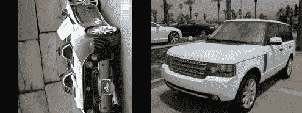

# 第三章：*第三章*：利用预训练网络的迁移学习威力

尽管深度神经网络为计算机视觉带来了不可否认的强大力量，但它们在调整、训练和提高性能方面非常复杂。这种难度来自三个主要来源：

+   深度神经网络通常在数据充足时才会发挥作用，但往往并非如此。此外，数据既昂贵又有时难以扩展。

+   深度神经网络包含许多需要调节的参数，这些参数会影响模型的整体表现。

+   深度学习在时间、硬件和精力方面是非常资源密集型的。

别灰心！通过**迁移学习**，我们可以通过利用在庞大数据集（如 ImageNet）上预训练的经典架构中丰富的知识，节省大量时间和精力。而最棒的部分是？除了它是如此强大且有用的工具，迁移学习还很容易应用。在本章中，我们将学习如何做到这一点。

在本章中，我们将覆盖以下食谱：

+   使用预训练网络实现特征提取器

+   在提取的特征上训练一个简单的分类器

+   检查提取器和分类器的效果

+   使用增量学习训练分类器

+   使用 Keras API 微调网络

+   使用 TFHub 微调网络

我们开始吧！

# 技术要求

强烈建议你拥有 GPU 访问权限，因为迁移学习通常计算密集型。在每个食谱的*准备工作*部分，你将收到有关如何安装该食谱所需依赖项的具体说明。如果需要，你可以在这里找到本章的所有代码：[`github.com/PacktPublishing/Tensorflow-2.0-Computer-Vision-Cookbook/tree/master/ch3`](https://github.com/PacktPublishing/Tensorflow-2.0-Computer-Vision-Cookbook/tree/master/ch3)。

查看以下链接，观看 Code in Action 视频：

[`bit.ly/39wR6DT`](https://bit.ly/39wR6DT)。

# 使用预训练网络实现特征提取器

利用迁移学习的最简单方法之一是将预训练模型用作特征提取器。这样，我们可以将深度学习和机器学习相结合，而这通常是我们做不到的，因为传统的机器学习算法无法处理原始图像。在这个示例中，我们将实现一个可重用的`FeatureExtractor`类，从一组输入图像中生成特征向量数据集，并将其保存在极速的 HDF5 格式中。

你准备好了吗？我们开始吧！

## 准备工作

你需要安装`Pillow`和`tqdm`（我们将用它来显示一个漂亮的进度条）。幸运的是，使用`pip`安装非常容易：

```py
$> pip install Pillow tqdm
```

我们将使用`Stanford Cars`数据集，你可以在这里下载：[`imagenet.stanford.edu/internal/car196/car_ims.tgz`](http://imagenet.stanford.edu/internal/car196/car_ims.tgz)。将数据解压到你选择的位置。在本配方中，我们假设数据位于`~/.keras/datasets`目录下，名为`car_ims`。

以下是数据集中的一些示例图像：


图 3.1 – 示例图像

我们将把提取的特征以 HDF5 格式存储，HDF5 是一种用于在磁盘上存储非常大的数值数据集的二进制分层协议，同时保持易于访问和按行级别计算。你可以在这里了解更多关于 HDF5 的内容：[`portal.hdfgroup.org/display/HDF5/HDF5`](https://portal.hdfgroup.org/display/HDF5/HDF5)。

## 如何做到这一点…

按照以下步骤完成此配方：

1.  导入所有必要的包：

    ```py
    import glob
    import os
    import pathlib
    import h5py
    import numpy as np
    import sklearn.utils as skutils
    from sklearn.preprocessing import LabelEncoder
    from tensorflow.keras.applications import imagenet_utils
    from tensorflow.keras.applications.vgg16 import VGG16
    from tensorflow.keras.preprocessing.image import *
    from tqdm import tqdm
    ```

1.  定义`FeatureExtractor`类及其构造函数：

    ```py
    class FeatureExtractor(object):
        def __init__(self,
                     model,
                     input_size,
                     label_encoder,
                     num_instances,
                     feature_size,
                     output_path,
                     features_key='features',
                     buffer_size=1000):
    ```

1.  我们需要确保输出路径是可写的：

    ```py
            if os.path.exists(output_path):
                error_msg = (f'{output_path} already 
                               exists. '
                             f'Please delete it and try 
                              again.')
                raise FileExistsError(error_msg)
    ```

1.  现在，让我们将输入参数存储为对象成员：

    ```py
            self.model = model
            self.input_size = input_size
            self.le = label_encoder
            self.feature_size = feature_size
            self.buffer_size = buffer_size
            self.buffer = {'features': [], 'labels': []}
            self.current_index = 0
    ```

1.  `self.buffer`将包含实例和标签的缓冲区，而`self.current_index`将指向 HDF5 数据库内数据集中的下一个空闲位置。我们现在将创建它：

    ```py
            self.db = h5py.File(output_path, 'w')
            self.features = self.db.create_dataset(features_      key,
                                           (num_instances,
                                             feature_size),
                                             dtype='float')

    self.labels = self.db.create_dataset('labels',
                                      (num_instances,),
                                      dtype='int')
    ```

1.  定义一个方法，从图像路径列表中提取特征和标签，并将它们存储到`HDF5`数据库中：

    ```py
        def extract_features(self,
                           image_paths,
                           labels,
                           batch_size=64,
                           shuffle=True):
            if shuffle:
                image_paths, labels = 
                skutils.shuffle(image_paths,
                               labels)
            encoded_labels = self.le.fit_transform(labels)
            self._store_class_labels(self.le.classes_)
    ```

1.  在对图像路径及其标签进行洗牌，并对标签进行编码和存储后，我们将遍历图像的批次，将它们传递通过预训练的网络。一旦完成，我们将把结果特征保存到 HDF5 数据库中（我们在这里使用的辅助方法稍后会定义）：

    ```py
            for i in tqdm(range(0, len(image_paths), 
                                batch_size)):
                batch_paths = image_paths[i: i + 
                                          batch_size]
                batch_labels = encoded_labels[i:i + 
                                             batch_size]
                batch_images = []
                for image_path in batch_paths:
                    image = load_img(image_path,

                            target_size=self.input_size)
                    image = img_to_array(image)
                    image = np.expand_dims(image, axis=0)
                    image = 
                   imagenet_utils.preprocess_input(image)
                    batch_images.append(image)
                batch_images = np.vstack(batch_images)
                feats = self.model.predict(batch_images,
                                    batch_size=batch_size)
                new_shape = (feats.shape[0], 
                            self.feature_size)
                feats = feats.reshape(new_shape)
                self._add(feats, batch_labels)
            self._close()
    ```

1.  定义一个私有方法，将特征和标签添加到相应的数据集：

    ```py
        def _add(self, rows, labels):
            self.buffer['features'].extend(rows)
            self.buffer['labels'].extend(labels)
            if len(self.buffer['features']) >= 
                                   self.buffer_size:
                self._flush()
    ```

1.  定义一个私有方法，将缓冲区刷新到磁盘：

    ```py
        def _flush(self):
            next_index = (self.current_index +
                          len(self.buffer['features']))
            buffer_slice = slice(self.current_index, 
                                next_index)
            self.features[buffer_slice] = 
                           self.buffer['features']
            self.labels[buffer_slice] = self.buffer['labels']
            self.current_index = next_index
            self.buffer = {'features': [], 'labels': []}
    ```

1.  定义一个私有方法，将类别标签存储到 HDF5 数据库中：

    ```py
        def _store_class_labels(self, class_labels):
            data_type = h5py.special_dtype(vlen=str)
            shape = (len(class_labels),)
            label_ds = self.db.create_dataset('label_names',
                          shape,
                        dtype=data_type)
            label_ds[:] = class_labels
    ```

1.  定义一个私有方法，将关闭 HDF5 数据集：

    ```py
        def _close(self):
            if len(self.buffer['features']) > 0:
                self._flush()
            self.db.close()
    ```

1.  加载数据集中图像的路径：

    ```py
    files_pattern = (pathlib.Path.home() / '.keras' / 
                    'datasets' /'car_ims' / '*.jpg')
    files_pattern = str(files_pattern)
    input_paths = [*glob.glob(files_pattern)]
    ```

1.  创建输出目录。我们将创建一个旋转车图像的数据集，以便潜在的分类器可以学习如何正确地将照片恢复到原始方向，通过正确预测旋转角度：

    ```py
    output_path = (pathlib.Path.home() / '.keras' / 
                  'datasets' /
                   'car_ims_rotated')
    if not os.path.exists(str(output_path)):
        os.mkdir(str(output_path))
    ```

1.  创建数据集的副本，对图像进行随机旋转：

    ```py
    labels = []
    output_paths = []
    for index in tqdm(range(len(input_paths))):
        image_path = input_paths[index]
        image = load_img(image_path)
        rotation_angle = np.random.choice([0, 90, 180, 270])
        rotated_image = image.rotate(rotation_angle)
        rotated_image_path = str(output_path / 
                              f'{index}.jpg')
        rotated_image.save(rotated_image_path, 'JPEG')
        output_paths.append(rotated_image_path)
        labels.append(rotation_angle)
        image.close()
        rotated_image.close()
    ```

1.  实例化`FeatureExtractor`，并使用预训练的`VGG16`网络从数据集中的图像提取特征：

    ```py
    features_path = str(output_path / 'features.hdf5')
    model = VGG16(weights='imagenet', include_top=False)
    fe = FeatureExtractor(model=model,
                          input_size=(224, 224, 3),
                          label_encoder=LabelEncoder(),
                          num_instances=len(input_paths),
                          feature_size=512 * 7 * 7,
                          output_path=features_path)
    ```

1.  提取特征和标签：

    ```py
    fe.extract_features(image_paths=output_paths, 
                        labels=labels)
    ```

几分钟后，应该会在`~/.keras/datasets/car_ims_rotated`中生成一个名为`features.hdf5`的文件。

## 它是如何工作的…

在本配方中，我们实现了一个可重用的组件，以便在 ImageNet 上使用预训练网络，如`逻辑回归`和`支持向量机`。

由于图像数据集通常过大，无法全部载入内存，我们选择了高性能且用户友好的 HDF5 格式，这种格式非常适合将大规模数值数据存储在磁盘上，同时保留了`NumPy`典型的易访问性。这意味着我们可以像操作常规`NumPy`数组一样与 HDF5 数据集进行交互，使其与整个`SciPy`生态系统兼容。

`FeatureExtractor`的结果是一个分层的 HDF5 文件（可以将其视为文件系统中的一个文件夹），包含三个数据集：`features`，包含特征向量；`labels`，存储编码后的标签；以及`label_names`，保存编码前的人类可读标签。

最后，我们使用`FeatureExtractor`创建了一个二进制表示的数据集，数据集包含了旋转了 0º、90º、180º或 270º的汽车图像。

提示

我们将在本章的后续教程中继续使用刚刚处理过的修改版`Stanford Cars`数据集。

## 另见

关于`Stanford Cars`数据集的更多信息，您可以访问官方页面：[`ai.stanford.edu/~jkrause/cars/car_dataset.html`](https://ai.stanford.edu/~jkrause/cars/car_dataset.html)。要了解更多关于 HDF5 的信息，请访问 HDF Group 的官方网站：[`www.hdfgroup.org/`](https://www.hdfgroup.org/)。

# 在提取特征后训练一个简单的分类器

机器学习算法并不适合直接处理张量，因此它们无法直接从图像中学习。然而，通过使用预训练的网络作为特征提取器，我们弥补了这一差距，使我们能够利用广泛流行且经过实战验证的算法，如**逻辑回归**、**决策树**和**支持向量机**。

在本教程中，我们将使用在前一个教程中生成的特征（以 HDF5 格式）来训练一个图像方向检测器，以修正图像的旋转角度，将其恢复到原始状态。

## 准备工作

正如我们在本教程的介绍中提到的，我们将使用在前一个教程中生成的`features.hdf5`数据集，该数据集包含了来自`Stanford Cars`数据集的旋转图像的编码信息。我们假设该数据集位于以下位置：`~/.keras/datasets/car_ims_rotated/features.hdf5`。

以下是一些旋转的样本：


图 3.2 – 一辆旋转了 180º的汽车（左），以及另一辆旋转了 90º的汽车（右）

让我们开始吧！

## 如何操作…

按照以下步骤完成本教程：

1.  导入所需的包：

    ```py
    import pathlib
    import h5py
    from sklearn.linear_model import LogisticRegressionCV
    from sklearn.metrics import classification_report
    ```

1.  加载 HDF5 格式的数据集：

    ```py
    dataset_path = str(pathlib.Path.home()/'.keras'/'datasets'/'car_ims_rotated'/'features.hdf5')
    db = h5py.File(dataset_path, 'r')
    ```

1.  由于数据集太大，我们只处理 50%的数据。以下代码将特征和标签分成两半：

    ```py
    SUBSET_INDEX = int(db['labels'].shape[0] * 0.5)
    features = db['features'][:SUBSET_INDEX]
    labels = db['labels'][:SUBSET_INDEX]
    ```

1.  取数据的前 80%来训练模型，其余 20%用于之后的评估：

    ```py
    TRAIN_PROPORTION = 0.8
    SPLIT_INDEX = int(len(labels) * TRAIN_PROPORTION)
    X_train, y_train = (features[:SPLIT_INDEX],
                        labels[:SPLIT_INDEX])
    X_test, y_test = (features[SPLIT_INDEX:],
                      labels[SPLIT_INDEX:])
    ```

1.  训练一个交叉验证的`LogisticRegressionCV`，通过交叉验证找到最佳的`C`参数：

    ```py
    model = LogisticRegressionCV(n_jobs=-1)
    model.fit(X_train, y_train)
    ```

    请注意，`n_jobs=-1`意味着我们将使用所有可用的核心来并行寻找最佳模型。您可以根据硬件的性能调整此值。

1.  在测试集上评估模型。我们将计算分类报告，以获得模型性能的细节：

    ```py
    predictions = model.predict(X_test)
    report = classification_report(y_test, predictions,
                           target_names=db['label_names'])
    print(report)
    ```

    这将打印以下报告：

    ```py
                  precision    recall  f1-score   support
               0       1.00      1.00      1.00       404
              90       0.98      0.99      0.99       373
             180       0.99      1.00      1.00       409
             270       1.00      0.98      0.99       433
        accuracy                           0.99      1619
       macro avg       0.99      0.99      0.99      1619
    weighted avg       0.99      0.99      0.99      1619
    ```

    该模型在区分四个类别方面表现良好，在测试集上达到了 99%的整体准确率！

1.  最后，关闭 HDF5 文件以释放任何资源：

    ```py
    db.close()                    
    ```

我们将在下一节中了解这一切如何工作。

## 它是如何工作的…

我们刚刚训练了一个非常简单的**逻辑回归**模型，用于检测图像的旋转角度。为了实现这一点，我们利用了使用预训练**VGG16**网络在 ImageNet 上提取的丰富且富有表现力的特征（若需要更详细的解释，请参考本章的第一个食谱）。

由于数据量过大，而**scikit-learn**的机器学习算法一次性处理所有数据（更具体来说，大多数算法无法批处理数据），我们只使用了 50%的特征和标签，因内存限制。

几分钟后，我们在测试集上获得了惊人的 99%的表现。此外，通过分析分类报告，我们可以看到模型对其预测非常有信心，在所有四个类别中 F1 分数至少达到了 0.99。

## 另见

有关如何从预训练网络中提取特征的更多信息，请参阅本章的*使用预训练网络实现特征提取器*一节。

# 快速检查提取器和分类器

在处理一个新项目时，我们常常成为选择悖论的受害者：由于有太多选择，我们不知道从哪里或如何开始。哪个特征提取器最好？我们能训练出最具性能的模型吗？我们应该如何预处理数据？

在本食谱中，我们将实现一个框架，自动快速检查特征提取器和分类器。目标不是立即获得最好的模型，而是缩小选择范围，以便在后期专注于最有前景的选项。

## 准备工作

首先，我们需要安装`Pillow`和`tqdm`：

```py
$> pip install Pillow tqdm
```

我们将使用一个名为`17 Category Flower Dataset`的数据集，下载地址：[`www.robots.ox.ac.uk/~vgg/data/flowers/17`](http://www.robots.ox.ac.uk/~vgg/data/flowers/17)。不过，也可以下载一个整理好的版本，该版本按照类别组织成子文件夹，下载地址：[`github.com/PacktPublishing/Tensorflow-2.0-Computer-Vision-Cookbook/tree/master/ch3/recipe3/flowers17.zip`](https://github.com/PacktPublishing/Tensorflow-2.0-Computer-Vision-Cookbook/tree/master/ch3/recipe3/flowers17.zip)。请将其解压到您喜欢的位置。在本食谱中，我们假设数据位于`~/.keras/datasets`目录下，名称为`flowers17`。

最后，我们将重用在本章开头的*使用预训练网络实现特征提取器*食谱中定义的`FeatureExtractor()`类。如果你想了解更多，可以参考它。

以下是来自本食谱数据集`17 类别花卉数据集`的一些示例图像：


图 3.3 – 示例图像

准备工作完成后，让我们开始吧！

## 它是如何实现的……

以下步骤将帮助我们对几种特征提取器和机器学习算法的组合进行抽查。按照以下步骤完成本食谱：

1.  导入必要的包：

    ```py
    import json
    import os
    import pathlib
    from glob import glob
    import h5py
    from sklearn.ensemble import *
    from sklearn.linear_model import *
    from sklearn.metrics import accuracy_score
    from sklearn.neighbors import KNeighborsClassifier
    from sklearn.preprocessing import LabelEncoder
    from sklearn.svm import LinearSVC
    from sklearn.tree import *
    from tensorflow.keras.applications import *
    from tqdm import tqdm
    from ch3.recipe1.feature_extractor import FeatureExtractor
    ```

1.  定义所有特征提取器的输入大小：

    ```py
    INPUT_SIZE = (224, 224, 3)
    ```

1.  定义一个函数，用于获取预训练网络的元组列表，以及它们输出的向量的维度：

    ```py
    def get_pretrained_networks():
        return [
            (VGG16(input_shape=INPUT_SIZE,
                   weights='imagenet',
                   include_top=False),
             7 * 7 * 512),
            (VGG19(input_shape=INPUT_SIZE,
                   weights='imagenet',
                   include_top=False),
             7 * 7 * 512),
            (Xception(input_shape=INPUT_SIZE,
                      weights='imagenet',
                      include_top=False),
             7 * 7 * 2048),
            (ResNet152V2(input_shape=INPUT_SIZE,
                         weights='imagenet',
                         include_top=False),
             7 * 7 * 2048),
            (InceptionResNetV2(input_shape=INPUT_SIZE,
                               weights='imagenet',
                               include_top=False),
             5 * 5 * 1536)
        ]
    ```

1.  定义一个返回机器学习模型`dict`以进行抽查的函数：

    ```py
    def get_classifiers():
        models = {}
        models['LogisticRegression'] = 
                                LogisticRegression()
        models['SGDClf'] = SGDClassifier()
        models['PAClf'] = PassiveAggressiveClassifier()
        models['DecisionTreeClf'] = 
                             DecisionTreeClassifier()
        models['ExtraTreeClf'] = ExtraTreeClassifier()
        n_trees = 100
        models[f'AdaBoostClf-{n_trees}'] = \
            AdaBoostClassifier(n_estimators=n_trees)
        models[f'BaggingClf-{n_trees}'] = \
            BaggingClassifier(n_estimators=n_trees)
        models[f'RandomForestClf-{n_trees}'] = \
            RandomForestClassifier(n_estimators=n_trees)
        models[f'ExtraTreesClf-{n_trees}'] = \
            ExtraTreesClassifier(n_estimators=n_trees)
        models[f'GradientBoostingClf-{n_trees}'] = \
            GradientBoostingClassifier(n_estimators=n_trees)
        number_of_neighbors = range(3, 25)
        for n in number_of_neighbors:
            models[f'KNeighborsClf-{n}'] = \
                KNeighborsClassifier(n_neighbors=n)
        reg = [1e-3, 1e-2, 1, 10]
        for r in reg:
            models[f'LinearSVC-{r}'] = LinearSVC(C=r)
            models[f'RidgeClf-{r}'] = 
                  RidgeClassifier(alpha=r)
        print(f'Defined {len(models)} models.')
        return models
    ```

1.  定义数据集的路径，以及所有图像路径的列表：

    ```py
    dataset_path = (pathlib.Path.home() / '.keras' / 
                   'datasets' 'flowers17')
    files_pattern = (dataset_path / 'images' / '*' / '*.jpg')
    images_path = [*glob(str(files_pattern))]
    ```

1.  将标签加载到内存中：

    ```py
    labels = []
    for index in tqdm(range(len(images_path))):
        image_path = images_path[index]
        label = image_path.split(os.path.sep)[-2]
        labels.append(label)
    ```

1.  定义一些变量以便跟踪抽查过程。`final_report`将包含每个分类器的准确率，分类器是在不同预训练网络提取的特征上训练的。`best_model`、`best_accuracy`和`best_features`将分别包含最佳模型的名称、准确率和生成特征的预训练网络的名称：

    ```py
    final_report = {}
    best_model = None
    best_accuracy = -1
    best_features = None
    ```

1.  遍历每个预训练网络，使用它从数据集中的图像提取特征：

    ```py
    for model, feature_size in get_pretrained_networks():
        output_path = dataset_path / f'{model.name}_features.hdf5'
        output_path = str(output_path)
        fe = FeatureExtractor(model=model,
                              input_size=INPUT_SIZE,
                              label_encoder=LabelEncoder(),
                              num_instances=len(images_path),
                              feature_size=feature_size,
                              output_path=output_path)
        fe.extract_features(image_paths=images_path,
                            labels=labels)
    ```

1.  使用 80%的数据进行训练，20%的数据进行测试：

    ```py
        db = h5py.File(output_path, 'r')
        TRAIN_PROPORTION = 0.8
        SPLIT_INDEX = int(len(labels) * TRAIN_PROPORTION)
        X_train, y_train = (db['features'][:SPLIT_INDEX],
                            db['labels'][:SPLIT_INDEX])
        X_test, y_test = (db['features'][SPLIT_INDEX:],
                          db['labels'][SPLIT_INDEX:])
        classifiers_report = {
            'extractor': model.name
        }
        print(f'Spot-checking with features from 
              {model.name}')
    ```

1.  使用当前迭代中提取的特征，遍历所有机器学习模型，使用训练集进行训练，并在测试集上进行评估：

    ```py
        for clf_name, clf in get_classifiers().items():
            try:
                clf.fit(X_train, y_train)
            except Exception as e:
                print(f'\t{clf_name}: {e}')
                continue
            predictions = clf.predict(X_test)
            accuracy = accuracy_score(y_test, predictions)
            print(f'\t{clf_name}: {accuracy}')
            classifiers_report[clf_name] = accuracy
    ```

1.  检查是否有新的最佳模型。如果是，请更新相应的变量：

    ```py
            if accuracy > best_accuracy:
                best_accuracy = accuracy
                best_model = clf_name
                best_features = model.name
    ```

1.  将本次迭代的结果存储在`final_report`中，并释放 HDF5 文件的资源：

    ```py
        final_report[output_path] = classifiers_report
        db.close()
    ```

1.  更新`final_report`，并写入最佳模型的信息。最后，将其写入磁盘：

    ```py
    final_report['best_model'] = best_model
    final_report['best_accuracy'] = best_accuracy
    final_report['best_features'] = best_features
    with open('final_report.json', 'w') as f:
        json.dump(final_report, f)
    ```

检查`final_report.json`文件，我们可以看到最好的模型是`PAClf`（`PassiveAggressiveClassifier`），它在测试集上的准确率为 0.934（93.4%），并且是在我们从**VGG19**网络提取的特征上训练的。你可以在这里查看完整的输出：[`github.com/PacktPublishing/Tensorflow-2.0-Computer-Vision-Cookbook/tree/master/ch3/recipe3/final_report.json`](https://github.com/PacktPublishing/Tensorflow-2.0-Computer-Vision-Cookbook/tree/master/ch3/recipe3/final_report.json)。让我们进入下一部分，详细研究一下我们在本食谱中完成的项目。

## 它是如何工作的……

在本配方中，我们开发了一个框架，使我们能够自动抽查 40 种不同的机器学习算法，使用由五种不同的预训练网络生成的特征，最终进行了 200 次实验。通过这种方法的结果，我们发现，对于这个特定问题，最佳的模型组合是使用**VGG19**网络生成的向量训练`PassiveAggressiveClassifier`。

请注意，我们并没有专注于实现最大性能，而是基于充分的证据做出明智的决策，决定在优化此数据集的分类器时如何合理地分配时间和资源。现在，我们知道微调**被动攻击性分类器**最有可能带来回报。那么，我们多久才能得出这个结论呢？几个小时，甚至几天。

让计算机完成繁重工作的好处是，我们不必猜测，同时可以将时间自由地用于其他任务。这是不是很棒？

# 使用增量学习训练分类器  

传统机器学习库的一个问题，如**scikit-learn**，是它们很少提供在大规模数据上训练模型的可能性，而这恰好是深度神经网络最适合处理的数据。拥有大量数据又能有什么用，如果我们不能使用它呢？

幸运的是，有一种方法可以绕过这个限制，叫做`creme`，它可以在数据集过大无法加载到内存时训练分类器。

## 准备工作

在本配方中，我们将利用`creme`，这是一个专门设计用于在无法加载到内存的大数据集上训练机器学习模型的实验性库。要安装`creme`，请执行以下命令：

```py
$> pip install creme==0.5.1
```

我们将在本章的*使用预训练网络实现特征提取器*配方中使用我们生成的`features.hdf5`数据集，该数据集包含来自`Stanford Cars`数据集中旋转图像的编码信息。我们假设数据集位于以下位置：`~/.keras/datasets/car_ims_rotated/features.hdf5`。

以下是该数据集中的一些示例图像：



图 3.4 – 旋转 90º的汽车示例（左），和旋转 0º的另一辆汽车（右）

让我们开始吧！

## 如何做……

以下步骤将指导我们如何在大数据上逐步训练分类器：

1.  导入所有必要的软件包：

    ```py
    import pathlib
    import h5py
    from creme import stream
    from creme.linear_model import LogisticRegression
    from creme.metrics import Accuracy
    from creme.multiclass import OneVsRestClassifier
    from creme.preprocessing import StandardScaler
    ```

1.  定义一个函数，将数据集保存为 CSV 文件：

    ```py
    def write_dataset(output_path, feats, labels, 
                      batch_size):
        feature_size = feats.shape[1]
        csv_columns = ['class'] + [f'feature_{i}'
                                   for i in range(feature_        size)]
    ```

1.  我们将为每个特征的类别设置一列，每个特征向量中的元素将设置多列。接下来，我们将批量写入 CSV 文件的内容，从头部开始：

    ```py
        dataset_size = labels.shape[0]
        with open(output_path, 'w') as f:
            f.write(f'{“,”.join(csv_columns)}\n')
    ```

1.  提取本次迭代中的批次：

    ```py
            for batch_number, index in \
                    enumerate(range(0, dataset_size, 
                              batch_size)):
                print(f'Processing batch {batch_number + 
                                          1} of '
                      f'{int(dataset_size / 
                      float(batch_size))}')
                batch_feats = feats[index: index + 
                                     batch_size]
                batch_labels = labels[index: index + 
                                      batch_size]
    ```

1.  现在，写入批次中的所有行：

    ```py
                for label, vector in \
                        zip(batch_labels, batch_feats):
                    vector = ','.join([str(v) for v in 
                                       vector])
                    f.write(f'{label},{vector}\n')
    ```

1.  加载 HDF5 格式的数据集：

    ```py
    dataset_path = str(pathlib.Path.home()/'.keras'/'datasets'/'car_ims_rotated'/'features.hdf5')
    db = h5py.File(dataset_path, 'r')
    ```

1.  定义分割索引，将数据分为训练集（80%）和测试集（20%）：

    ```py
    TRAIN_PROPORTION = 0.8
    SPLIT_INDEX = int(db['labels'].shape[0] * 
                      TRAIN_PROPORTION) 
    ```

1.  将训练集和测试集子集写入磁盘，保存为 CSV 文件：

    ```py
    BATCH_SIZE = 256
    write_dataset('train.csv',
                  db['features'][:SPLIT_INDEX],
                  db['labels'][:SPLIT_INDEX],
                  BATCH_SIZE)
    write_dataset('test.csv',
                  db['features'][SPLIT_INDEX:],
                  db['labels'][SPLIT_INDEX:],
                  BATCH_SIZE)
    ```

1.  `creme`要求我们将 CSV 文件中每一列的类型指定为`dict`实例。以下代码块指定了`class`应该编码为`int`类型，而其余列（对应特征）应该为`float`类型：

    ```py
    FEATURE_SIZE = db['features'].shape[1]
    types = {f'feature_{i}': float for i in range(FEATURE_SIZE)}
    types['class'] = int
    ```

1.  在以下代码中，我们定义了一个`creme`管道，每个输入在传递给分类器之前都会进行标准化。由于这是一个多类别问题，我们需要将`LogisticRegression`与`OneVsRestClassifier`包装在一起：

    ```py
    model = StandardScaler()
    model |= OneVsRestClassifier(LogisticRegression())
    ```

1.  将`Accuracy`定义为目标指标，并创建一个针对`train.csv`数据集的迭代器：

    ```py
    metric = Accuracy()
    dataset = stream.iter_csv('train.csv',
                              target_name='class',
                              converters=types)
    ```

1.  一次训练一个样本的分类器。每训练 100 个样本时，打印当前准确率：

    ```py
    print('Training started...')
    for i, (X, y) in enumerate(dataset):
        predictions = model.predict_one(X)
        model = model.fit_one(X, y)
        metric = metric.update(y, predictions)
        if i % 100 == 0:
            print(f'Update {i} - {metric}')
    print(f'Final - {metric}')
    ```

1.  创建一个针对`test.csv`文件的迭代器：

    ```py
    metric = Accuracy()
    test_dataset = stream.iter_csv('test.csv',
                                   target_name='class',
                                   converters=types)
    ```

1.  再次在测试集上评估模型，一次处理一个样本：

    ```py
    print('Testing model...')
    for i, (X, y) in enumerate(test_dataset):
        predictions = model.predict_one(X)
        metric = metric.update(y, predictions)
        if i % 1000 == 0:
            print(f'(TEST) Update {i} - {metric}')
    print(f'(TEST) Final - {metric}')
    ```

几分钟后，我们应该会得到一个在测试集上准确率约为 99% 的模型。我们将在下一部分详细查看这个过程。

## 它是如何工作的…

通常情况下，尽管我们有大量的数据可用，但由于硬件或软件限制，我们无法使用所有数据（在*在提取特征上训练简单分类器*这一食谱中，我们只使用了 50% 的数据，因为无法将其全部保存在内存中）。然而，通过增量学习（也称为在线学习），我们可以像训练神经网络一样，以批处理的方式训练传统的机器学习模型。

在这个食谱中，为了捕获我们`Stanford Cars`数据集的特征向量的全部信息，我们不得不将训练集和测试集写入 CSV 文件。接下来，我们训练了`LogisticRegression`并将其包装在`OneVsRestClassifier`中，后者学习了如何检测图像特征向量中的旋转角度。最后，我们在测试集上达到了非常满意的 99% 准确率。

# 使用 Keras API 微调网络

或许迁移学习的最大优势之一就是能够利用预训练网络中所编码的知识带来的顺风。在这些网络中，只需交换较浅的层，我们就能在新的、无关的数据集上获得出色的表现，即使我们的数据量很小。为什么？因为底层的信息几乎是普遍适用的：它编码了适用于几乎所有计算机视觉问题的基本形式和形状。

在这个食谱中，我们将对一个小型数据集微调预训练的**VGG16**网络，从而实现一个原本不太可能得到的高准确率。

## 准备工作

我们需要`Pillow`来实现此食谱。可以按如下方式安装：

```py
$> pip install Pillow
```

我们将使用一个名为`17 Category Flower Dataset`的数据集，可以通过以下链接访问：[`www.robots.ox.ac.uk/~vgg/data/flowers/17`](http://www.robots.ox.ac.uk/~vgg/data/flowers/17)。该数据集的一个版本已经按照每个类的子文件夹进行组织，可以在此链接找到：[`github.com/PacktPublishing/Tensorflow-2.0-Computer-Vision-Cookbook/tree/master/ch3/recipe3/flowers17.zip`](https://github.com/PacktPublishing/Tensorflow-2.0-Computer-Vision-Cookbook/tree/master/ch3/recipe3/flowers17.zip)。下载并解压到您选择的位置。从现在起，我们假设数据存储在`~/.keras/datasets/flowers17`目录中。

以下是来自该数据集的一些示例图像：


图 3.5 – 示例图像

让我们开始吧！

## 如何实现…

微调很简单！按照以下步骤完成这个食谱：

1.  导入必要的依赖项：

    ```py
    import os
    import pathlib
    from glob import glob
    import numpy as np
    from sklearn.model_selection import train_test_split
    from sklearn.preprocessing import LabelBinarizer
    from tensorflow.keras import Model
    from tensorflow.keras.applications import VGG16
    from tensorflow.keras.layers import *
    from tensorflow.keras.optimizers import *
    from tensorflow.keras.preprocessing.image import *
    ```

1.  设置随机种子：

    ```py
    SEED = 999
    ```

1.  定义一个函数，从预训练模型构建一个新的网络，其中顶部的全连接层将是全新的，并且针对当前问题进行了调整：

    ```py
    def build_network(base_model, classes):
        x = Flatten()(base_model.output)
        x = Dense(units=256)(x)
        x = ReLU()(x)
        x = BatchNormalization(axis=-1)(x)
        x = Dropout(rate=0.5)(x)
        x = Dense(units=classes)(x)
        output = Softmax()(x)
        return output
    ```

1.  定义一个函数，将数据集中的图像和标签加载为`NumPy`数组：

    ```py
    def load_images_and_labels(image_paths,
                               target_size=(256, 256)):
        images = []
        labels = []
        for image_path in image_paths:
            image = load_img(image_path, 
                             target_size=target_size)
            image = img_to_array(image)
            label = image_path.split(os.path.sep)[-2]
            images.append(image)
            labels.append(label)
        return np.array(images), np.array(labels)
    ```

1.  加载图像路径并从中提取类集合：

    ```py
    dataset_path = (pathlib.Path.home() / '.keras' / 
                   'datasets' /'flowers17')
    files_pattern = (dataset_path / 'images' / '*' / '*.jpg')
    image_paths = [*glob(str(files_pattern))]
    CLASSES = {p.split(os.path.sep)[-2] for p in 
               image_paths}
    ```

1.  加载图像并对其进行归一化，使用`LabelBinarizer()`进行一热编码，并将数据拆分为训练集（80%）和测试集（20%）：

    ```py
    X, y = load_images_and_labels(image_paths)
    X = X.astype('float') / 255.0
    y = LabelBinarizer().fit_transform(y)
    (X_train, X_test,
     y_train, y_test) = train_test_split(X, y,
                                         test_size=0.2,

                                      random_state=SEED)
    ```

1.  实例化一个预训练的`VGG16`模型，去除顶部的全连接层。指定输入形状为 256x256x3：

    ```py
    base_model = VGG16(weights='imagenet',
                       include_top=False,
                       input_tensor=Input(shape=(256, 256, 
                                                  3)))
    ```

    冻结基础模型中的所有层。我们这样做是因为我们不希望重新训练它们，而是使用它们已有的知识：

    ```py
    for layer in base_model.layers:
        layer.trainable = False
    ```

1.  使用`build_network()`（在*步骤 3*中定义）构建一个完整的网络，并在其上添加一组新层：

    ```py
    model = build_network(base_model, len(CLASSES))
    model = Model(base_model.input, model)
    ```

1.  定义批处理大小和一组要通过`ImageDataGenerator()`应用的增强方法：

    ```py
    BATCH_SIZE = 64
    augmenter = ImageDataGenerator(rotation_range=30,
                                   horizontal_flip=True,
                                   width_shift_range=0.1,
                                   height_shift_range=0.1,
                                   shear_range=0.2,
                                   zoom_range=0.2,
                                   fill_mode='nearest')
    train_generator = augmenter.flow(X_train, y_train, 
                                     BATCH_SIZE)
    ```

1.  预热网络。这意味着我们将只训练新添加的层（其余部分被冻结），训练 20 个周期，使用**RMSProp**优化器，学习率为 0.001。最后，我们将在测试集上评估网络：

    ```py
    WARMING_EPOCHS = 20
    model.compile(loss='categorical_crossentropy',
                  optimizer=RMSprop(lr=1e-3),
                  metrics=['accuracy'])
    model.fit(train_generator,
              steps_per_epoch=len(X_train) // BATCH_SIZE,
              validation_data=(X_test, y_test),
              epochs=WARMING_EPOCHS)
    result = model.evaluate(X_test, y_test)
    print(f'Test accuracy: {result[1]}')
    ```

1.  现在，网络已经预热完毕，我们将微调基础模型的最终层，特别是从第 16 层开始（记住，索引从零开始），以及全连接层，训练 50 个周期，使用**SGD**优化器，学习率为 0.001：

    ```py
    for layer in base_model.layers[15:]:
        layer.trainable = True
    EPOCHS = 50
    model.compile(loss='categorical_crossentropy',
                  optimizer=SGD(lr=1e-3),
                  metrics=['accuracy'])
    model.fit(train_generator,
              steps_per_epoch=len(X_train) // BATCH_SIZE,
              validation_data=(X_test, y_test),
              epochs=EPOCHS)
    result = model.evaluate(X_test, y_test)
    print(f'Test accuracy: {result[1]}')
    ```

在预热后，网络在测试集上的准确率达到了 81.6%。然后，当我们进行了微调后，经过 50 个周期，测试集上的准确率提高到了 94.5%。我们将在下一节看到这一过程的具体细节。

## 它是如何工作的…

我们成功地利用了在庞大的 ImageNet 数据库上预训练的**VGG16**模型的知识。通过替换顶部的全连接层，这些层负责实际分类（其余部分充当特征提取器），我们使用自己的一组深度层来适应当前问题，从而在测试集上获得了超过 94.5%的不错准确率。

这个结果展示了迁移学习的强大能力，特别是考虑到数据集中每个类别只有 81 张图片（81x17=1,377 张图片），这对于从头开始训练一个表现良好的深度学习模型来说显然是不足够的。

提示

虽然并非总是必需的，但在微调网络时，最好先*热身*一下*头部*（顶部的全连接层），让它们有时间适应来自预训练网络的特征。

## 另见

你可以在这里阅读更多关于 Keras 预训练模型的内容：https://www.tensorflow.org/api_docs/python/tf/keras/applications。

# 使用 TFHub 微调网络

微调网络的最简单方法之一是依赖于**TensorFlow Hub**（**TFHub**）中丰富的预训练模型。在这个任务中，我们将微调一个**ResNetV1152**特征提取器，以便从一个非常小的数据集中分类花卉。

## 准备就绪

我们需要`tensorflow-hub`和`Pillow`来完成这个任务。两者都可以很容易地安装，方法如下：

```py
$> pip install tensorflow-hub Pillow
```

我们将使用一个名为`17 类花卉数据集`的数据集，您可以通过[`www.robots.ox.ac.uk/~vgg/data/flowers/17`](http://www.robots.ox.ac.uk/~vgg/data/flowers/17)访问。建议你在这里获取数据的重组织版本：[`github.com/PacktPublishing/Tensorflow-2.0-Computer-Vision-Cookbook/tree/master/ch3/recipe3/flowers17.zip`](https://github.com/PacktPublishing/Tensorflow-2.0-Computer-Vision-Cookbook/tree/master/ch3/recipe3/flowers17.zip)。下载并解压到您选择的位置。从现在开始，我们假设数据存储在`~/.keras/datasets/flowers17`。

以下是该数据集的一些示例图片：


图 3.6 – 示例图片

让我们开始吧！

## 如何做……

按照以下步骤成功完成这个任务：

1.  导入所需的包：

    ```py
    import os
    import pathlib
    from glob import glob
    import numpy as np
    from sklearn.model_selection import train_test_split
    from sklearn.preprocessing import LabelBinarizer
    from tensorflow.keras import Sequential
    from tensorflow.keras.layers import *
    from tensorflow.keras.optimizers import RMSprop
    from tensorflow.keras.preprocessing.image import *
    from tensorflow_hub import KerasLayer
    ```

1.  设置随机种子：

    ```py
    SEED = 999
    ```

1.  定义一个函数，从预训练模型构建一个新的网络，其中顶部的全连接层将是全新的，并且会根据我们数据中的类别数量进行调整：

    ```py
    def build_network(base_model, classes):
        return Sequential([
            base_model,
            Dense(classes),
            Softmax()
        ])
    ```

1.  定义一个函数，将数据集中的图片和标签加载为`NumPy`数组：

    ```py
    def load_images_and_labels(image_paths,
                               target_size=(256, 256)):
        images = []
        labels = []
        for image_path in image_paths:
            image = load_img(image_path, 
                             target_size=target_size)
            image = img_to_array(image)
            label = image_path.split(os.path.sep)[-2]
            images.append(image)
            labels.append(label)
        return np.array(images), np.array(labels)
    ```

1.  加载图片路径并从中提取类别集合：

    ```py
    dataset_path = (pathlib.Path.home() / '.keras' / 
                     'datasets' /'flowers17')
    files_pattern = (dataset_path / 'images' / '*' / '*.jpg')
    image_paths = [*glob(str(files_pattern))]
    CLASSES = {p.split(os.path.sep)[-2] for p in image_paths}
    ```

1.  加载图片并进行归一化，使用`LabelBinarizer()`进行独热编码标签，然后将数据拆分为训练集（80%）和测试集（20%）：

    ```py
    X, y = load_images_and_labels(image_paths)
    X = X.astype('float') / 255.0
    y = LabelBinarizer().fit_transform(y)
    (X_train, X_test,
     y_train, y_test) = train_test_split(X, y,
                                         test_size=0.2,
                                       random_state=SEED)
    ```

1.  实例化一个预训练的`KerasLayer()`类，指定输入形状为 256x256x3：

    ```py
    model_url = ('https://tfhub.dev/google/imagenet/'
                 'resnet_v1_152/feature_vector/4')
    base_model = KerasLayer(model_url, input_shape=(256, 
                                                  256, 3))
    ```

    使基础模型不可训练：

    ```py
    base_model.trainable = False
    ```

1.  在使用基础模型作为起点的基础上，构建完整的网络：

    ```py
    model = build_network(base_model, len(CLASSES))
    ```

1.  定义批量大小以及通过`ImageDataGenerator()`应用的一组数据增强操作：

    ```py
    BATCH_SIZE = 32
    augmenter = ImageDataGenerator(rotation_range=30,
                                   horizontal_flip=True,
                                   width_shift_range=0.1,
                                   height_shift_range=0.1,
                                   shear_range=0.2,
                                   zoom_range=0.2,
                                   fill_mode='nearest')
    train_generator = augmenter.flow(X_train, y_train, 
                                     BATCH_SIZE)
    ```

1.  训练整个模型 20 个 epoch，并评估其在测试集上的性能：

    ```py
    EPOCHS = 20
    model.compile(loss='categorical_crossentropy',
                  optimizer=RMSprop(lr=1e-3),
                  metrics=['accuracy'])
    model.fit(train_generator,
              steps_per_epoch=len(X_train) // BATCH_SIZE,
              validation_data=(X_test, y_test),
              epochs=EPOCHS)
    result = model.evaluate(X_test, y_test)
    print(f'Test accuracy: {result[1]}')
    ```

只需几分钟，我们就在测试集上获得了大约 95.22%的准确率。太棒了，你不觉得吗？现在，让我们深入了解一下。

## 它是如何工作的……

我们利用了预训练的`17 类花卉数据集`中编码的知识。

通过简单地更换顶层，我们在测试集上达到了令人印象深刻的 95.22%的准确率，考虑到所有的约束，这可是一个不小的成就。

与*使用 Keras API 微调网络*的做法不同，这次我们没有对模型的头部进行预热。再次强调，这不是硬性规定，而是我们工具箱中的另一种方法，我们应该根据具体项目尝试使用。

## 另见

你可以在这里阅读更多关于我们在本教程中使用的预训练模型的信息：[`tfhub.dev/google/imagenet/resnet_v1_152/feature_vector/4`](https://tfhub.dev/google/imagenet/resnet_v1_152/feature_vector/4)。
