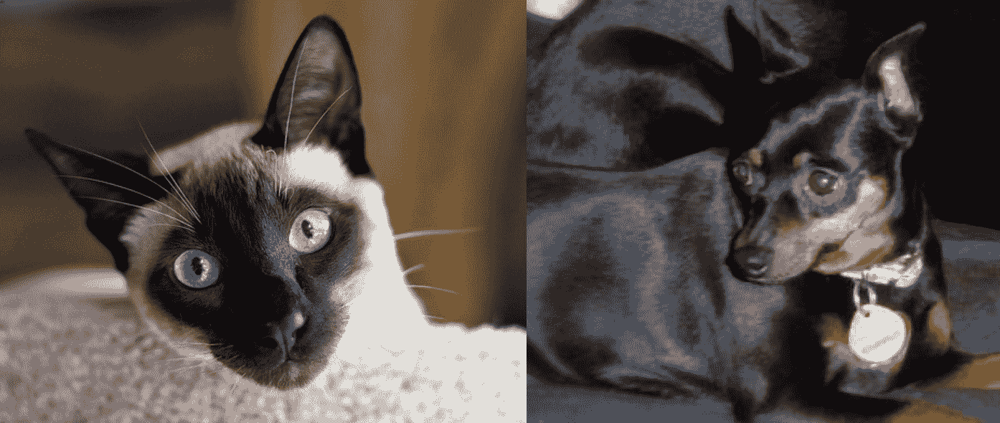

# 第四章：*第四章*：通过 DeepDream、神经风格迁移和图像超分辨率增强和美化图像

虽然深度神经网络在传统计算机视觉任务中表现出色，尤其是在纯粹的实际应用中，但它们也有有趣的一面！正如我们将在本章中发现的那样，我们可以借助一点聪明才智和数学的帮助，解锁深度学习的艺术面。

本章将从介绍**DeepDream**开始，这是一种使神经网络生成梦幻般图像的算法。接下来，我们将利用迁移学习的力量，将著名画作的风格应用到我们自己的图像上（这就是**神经风格迁移**）。最后，我们将结束于**图像超分辨率**，这是一种用于提升图像质量的深度学习方法。

本章将涵盖以下食谱：

+   实现 DeepDream

+   生成你自己的梦幻图像

+   实现神经风格迁移

+   将风格迁移应用到自定义图像

+   使用 TFHub 应用风格迁移

+   利用深度学习提高图像分辨率

让我们开始吧！

# 技术要求

在进行深度学习时，一般建议适用：如果可能，使用 GPU，因为它可以大大提高效率并减少计算时间。在每个食谱中，你会在*准备工作*部分找到具体的准备说明（如有必要）。你可以在这里找到本章的所有代码：[`github.com/PacktPublishing/Tensorflow-2.0-Computer-Vision-Cookbook/tree/master/ch4`](https://github.com/PacktPublishing/Tensorflow-2.0-Computer-Vision-Cookbook/tree/master/ch4)。

查看以下链接，观看代码实战视频：

[`bit.ly/3bDns2A`](https://bit.ly/3bDns2A)。

# 实现 DeepDream

**DeepDream**是一个实验的产物，旨在可视化神经网络学习到的内部模式。为了实现这一目标，我们可以将一张图像传入网络，计算它关于特定层激活的梯度，然后修改图像，以增强这些激活的幅度，从而放大模式。结果？迷幻、超现实的照片！

尽管由于**DeepDream**的性质，本食谱稍显复杂，但我们将一步一步来，别担心。

让我们开始吧。

## 准备工作

本食谱无需额外安装任何内容。不过，我们不会深入讨论**DeepDream**的细节，但如果你对这个话题感兴趣，可以在这里阅读 Google 的原始博客文章：[`ai.googleblog.com/2015/06/inceptionism-going-deeper-into-neural.html`](https://ai.googleblog.com/2015/06/inceptionism-going-deeper-into-neural.html)。

## 如何操作……

按照以下步骤操作，你很快就能拥有自己的深度梦幻生成器：

1.  导入所有必要的包：

    ```py
    import numpy as np
    import tensorflow as tf
    from tensorflow.keras import Model
    from tensorflow.keras.applications.inception_v3 import *
    ```

1.  定义`DeepDreamer`类及其构造函数：

    ```py
    class DeepDreamer(object):
        def __init__(self,
                     octave_scale=1.30,
                     octave_power_factors=None,
                     layers=None):
    ```

1.  构造函数参数指定了我们将如何按比例增大图像的尺寸（`octave_scale`），以及将应用于尺度的因子（`octave_power_factors`）。`layers`包含将用于生成梦境的目标层。接下来，我们将这些参数存储为对象成员：

    ```py
            self.octave_scale = octave_scale
            if octave_power_factors is None:
                self.octave_power_factors = [*range(-2, 3)]
            else:
                self.octave_power_factors = 
                           octave_power_factors
            if layers is None:
                self.layers = ['mixed3', 'mixed5']
            else:
                self.layers = layers
    ```

1.  如果某些输入是`None`，我们使用默认值。如果不是，我们使用输入值。最后，通过从预训练的`InceptionV3`网络中提取`layers`来创建梦境生成模型：

    ```py
            self.base_model = InceptionV3(weights='imagenet',
                                         include_top=False)
            outputs = [self.base_model.get_layer(name).output
                      for name in self.layers]
            self.dreamer_model = Model(self.base_model.input,
                                       outputs)
    ```

1.  定义一个私有方法来计算损失：

    ```py
        def _calculate_loss(self, image):
            image_batch = tf.expand_dims(image, axis=0)
            activations = self.dreamer_model(image_batch)
            if len(activations) == 1:
                activations = [activations]
            losses = []
            for activation in activations:
                loss = tf.math.reduce_mean(activation)
                losses.append(loss)
            total_loss = tf.reduce_sum(losses)
            return total_loss
    ```

1.  定义一个私有方法来执行梯度上升（记住，我们希望放大图像中的图案）。为了提高性能，我们可以将此函数封装在`tf.function`中：

    ```py
        @tf.function
        def _gradient_ascent(self, image, steps, step_size):
            loss = tf.constant(0.0)
            for _ in range(steps):
                with tf.GradientTape() as tape:
                    tape.watch(image)
                    loss = self._calculate_loss(image)
                gradients = tape.gradient(loss, image)
                gradients /= tf.math.reduce_std(gradients) 
                                              + 1e-8
                image = image + gradients * step_size
                image = tf.clip_by_value(image, -1, 1)
            return loss, image
    ```

1.  定义一个私有方法，将梦境生成器产生的图像张量转换回`NumPy`数组：

    ```py
        def _deprocess(self, image):
            image = 255 * (image + 1.0) / 2.0
            image = tf.cast(image, tf.uint8)
            image = np.array(image)
            return image
    ```

1.  定义一个私有方法，通过执行`_gradient_ascent()`一定步数来生成梦幻图像：

    ```py
        def _dream(self, image, steps, step_size):
            image = preprocess_input(image)
            image = tf.convert_to_tensor(image)
            step_size = tf.convert_to_tensor(step_size)
            step_size = tf.constant(step_size)
            steps_remaining = steps
            current_step = 0
            while steps_remaining > 0:
                if steps_remaining > 100:
                    run_steps = tf.constant(100)
                else:
                    run_steps = 
                         tf.constant(steps_remaining)
                steps_remaining -= run_steps
                current_step += run_steps
                loss, image = self._gradient_ascent(image,
                                               run_steps,
                                               step_size)
            result = self._deprocess(image)
            return result
    ```

1.  定义一个公共方法来生成梦幻图像。这与`_dream()`（在*第 6 步*中定义，并在此内部使用）之间的主要区别是，我们将使用不同的图像尺寸（称为`self.octave_scale`，每个`self.octave_power_factors`中的幂次）：

    ```py
        def dream(self, image, steps=100, step_size=0.01):
            image = tf.constant(np.array(image))
            base_shape = tf.shape(image)[:-1]
            base_shape = tf.cast(base_shape, tf.float32)
            for factor in self.octave_power_factors:
                new_shape = tf.cast(
                    base_shape * (self.octave_scale ** 
                                   factor),
                                   tf.int32)
                image = tf.image.resize(image, 
                                       new_shape).numpy()
                image = self._dream(image, steps=steps,
                                    step_size=step_size)
            base_shape = tf.cast(base_shape, tf.int32)
            image = tf.image.resize(image, base_shape)
            image = tf.image.convert_image_dtype(image / 
                                                  255.0,
                                           dtype=tf.uint8)
            image = np.array(image)
            return np.array(image)
    ```

`DeepDreamer()`类可以重用，用于生成我们提供的任何图像的梦幻版本。我们将在下一节中看到这个如何工作。

## 它是如何工作的……

我们刚刚实现了一个实用类，方便地应用**DeepDream**。该算法通过计算一组层的激活值的梯度，然后使用这些梯度来增强网络所见的图案。

在我们的`DeepDreamer()`类中，之前描述的过程已在`_gradient_ascent()`方法中实现（在*第 4 步*中定义），我们计算了梯度并将其添加到原始图像中，通过多个步骤得到结果。最终结果是一个激活图，其中在每个后续步骤中，目标层中某些神经元的**兴奋度**被放大。

生成梦境的过程包括多次应用梯度上升，我们在`_dream()`方法中基本上已经做了这个（*第 6 步*）。

应用梯度上升于相同尺度的一个问题是，结果看起来噪声较大，分辨率低。而且，图案似乎发生在相同的粒度层级，这会导致结果的均匀性，从而减少我们想要的梦幻效果。为了解决这些问题，主要方法`dream()`在不同的尺度上应用梯度上升（称为**八度音阶**），其中一个八度的梦幻输出作为下一次迭代的输入，并且在更高的尺度上进行处理。

## 另见

要查看将不同参数组合传递给`DeepDreamer()`后的梦幻效果，请参阅下一篇食谱，*生成你自己的梦幻图像*。

# 生成你自己的梦幻图像

深度学习有一个有趣的方面。**DeepDream** 是一个应用程序，旨在通过激活特定层的某些激活点来理解深度神经网络的内部工作原理。然而，除了实验的调查意图外，它还产生了迷幻、梦幻般有趣的图像。

在这个配方中，我们将尝试几种**DeepDream**的配置，看看它们如何影响结果。

## 准备开始

我们将使用本章第一个配方中的`DeepDreamer()`实现（*实现 DeepDream*）。虽然我鼓励你尝试用自己的图像进行测试，但如果你想尽量跟随这个配方，你可以在这里下载示例图像：https://github.com/PacktPublishing/Tensorflow-2.0-Computer-Vision-Cookbook/tree/master/ch4/recipe2/road.jpg。

让我们来看一下示例图像：


图 4.1 – 示例图像

让我们开始吧。

## 如何实现……

按照以下步骤制作你自己的梦幻照片：

1.  让我们从导入所需的包开始。请注意，我们正在从之前的配方中导入`DeepDreamer()`，*实现 DeepDream*：

    ```py
    import matplotlib.pyplot as plt
    from tensorflow.keras.preprocessing.image import *
    from ch4.recipe1.deepdream import DeepDreamer
    ```

1.  定义`load_image()`函数，从磁盘加载图像到内存中，作为`NumPy`数组：

    ```py
    def load_image(image_path):
        image = load_img(image_path)
        image = img_to_array(image)
        return image
    ```

1.  定义一个函数，使用`matplotlib`显示图像（以`NumPy`数组表示）：

    ```py
    def show_image(image):
        plt.imshow(image)
        plt.show()
    ```

1.  加载原始图像并显示：

    ```py
    original_image = load_image('road.jpg')
    show_image(original_image / 255.0)
    ```

    这里，我们可以看到显示的原始图像：

    

    图 4.2 – 我们将很快修改的原始图像

    如我们所见，这只是穿过森林的一条道路。

1.  使用默认参数生成图像的梦幻版，并显示结果：

    ```py
    dreamy_image = DeepDreamer().dream(original_image)
    show_image(dreamy_image)
    ```

    这是结果：

    

    图 4.3 – 使用默认参数的 DeepDream 结果

    结果保留了原始照片的整体主题，但在其上添加了大量失真，形成了圆形、曲线和其他基本图案。酷——又有点怪异！

1.  使用三层。靠近顶部的层（例如，`'mixed7'`）编码更高层次的模式：

    ```py
    dreamy_image = (DeepDreamer(layers=['mixed2',
                                        'mixed5',
                                        'mixed7'])
                    .dream(original_image))
    show_image(dreamy_image)
    ```

    这是使用三层后的结果：

    

    图 4.4 – 使用更多更高层次层的 DeepDream 结果

    更多层的加入让生成的梦幻效果变得更柔和。我们可以看到，图案比以前更平滑，这很可能是因为`'mixed7'`层编码了更多的抽象信息，因为它离网络架构的末端更远。我们记得，网络中的前几层学习基本的模式，如线条和形状，而靠近输出的层则将这些基本模式组合起来，学习更复杂、更抽象的信息。

1.  最后，让我们使用更多的**八度音阶**。我们期望的结果是图像中噪声较少，且具有更多异质模式：

    ```py
    dreamy_image = (DeepDreamer(octave_power_factors=[-3, -1,
                                                      0, 3])
                    .dream(original_image))
    show_image(dreamy_image)                
    ```

    这是使用更多八度后得到的结果图像：


图 4.5 – 使用更多八度的 DeepDream 效果

生成的梦境包含了一种令人满意的高低层次模式的混合，并且比*步骤 4*中生成的梦境具有更好的色彩分布。

让我们进入下一部分，了解我们刚刚做了什么。

## 它是如何工作的……

在这个食谱中，我们利用了在*实现 DeepDream*食谱中所做的工作，生成了几种我们输入图像（森林中的一条道路）的梦幻版本。通过结合不同的参数，我们发现结果可以有很大的变化。使用更高层次的抽象信息，我们获得了噪音更少、模式更精细的图片。

如果我们选择使用更多八度，这意味着网络将处理更多的图像，且在不同的尺度上进行处理。这种方法生成的图像饱和度较低，同时保留了卷积神经网络前几层中典型的更原始、更基本的模式。

最后，通过仅使用一张图片和一点创造力，我们可以获得非常有趣的结果！

深度学习的另一个更具娱乐性的应用是神经风格迁移，我们将在下一个食谱中讲解。

# 实现神经风格迁移

创造力和艺术表现并不是我们通常将其与深度神经网络和人工智能相联系的特征。然而，你知道吗，通过正确的调整，我们可以将预训练网络转变为令人印象深刻的艺术家，能够将像莫奈、毕加索和梵高这样的著名画家的独特风格应用到我们的平凡照片中？

这正是神经风格迁移的工作原理。通过这个食谱的学习，最终我们将掌握任何画家的艺术造诣！

## 正在准备中

我们不需要安装任何库或引入额外的资源来实现神经风格迁移。然而，由于这是一个实践性的食谱，我们不会详细描述解决方案的内部工作原理。如果你对神经风格迁移的细节感兴趣，建议阅读原始论文：[`arxiv.org/abs/1508.06576`](https://arxiv.org/abs/1508.06576)。

我希望你已经准备好，因为我们马上就要开始了！

## 如何操作……

按照这些步骤实现你自己的可重用神经风格迁移器：

1.  导入必要的包（注意，在我们的实现中，我们使用了一个预训练的**VGG19**网络）：

    ```py
    import numpy as np
    import tensorflow as tf
    from tensorflow.keras import Model
    from tensorflow.keras.applications.vgg19 import *
    ```

1.  定义`StyleTransferrer()`类及其构造函数：

    ```py
    class StyleTransferrer(object):
        def __init__(self,
                     content_layers=None,
                     style_layers=None):
    ```

1.  唯一相关的参数是内容和风格生成的两个可选层列表。如果它们是`None`，我们将在内部使用默认值（稍后我们会看到）。接下来，加载预训练的`VGG19`并将其冻结：

    ```py
            self.model = VGG19(weights='imagenet',
                               include_top=False)
            self.model.trainable = False
    ```

1.  设置风格和内容损失的权重（重要性）（稍后我们会使用这些参数）。另外，存储内容和风格层（如果需要的话，可以使用默认设置）：

    ```py
            self.style_weight = 1e-2
            self.content_weight = 1e4
            if content_layers is None:
                self.content_layers = ['block5_conv2']
            else:
                self.content_layers = content_layers
            if style_layers is None:
                self.style_layers = ['block1_conv1',
                                     'block2_conv1',
                                     'block3_conv1',
                                     'block4_conv1',
                                     'block5_conv1']
            else:
                self.style_layers = style_layers
    ```

1.  定义并存储样式迁移模型，该模型以**VGG19**输入层为输入，输出所有内容层和样式层（请注意，我们可以使用任何模型，但通常使用 VGG19 或 InceptionV3 能获得最佳效果）：

    ```py
            outputs = [self.model.get_layer(name).output
                       for name in
                       (self.style_layers + 
                       self.content_layers)]
            self.style_model = Model([self.model.input], 
                                    outputs)
    ```

1.  定义一个私有方法，用于计算**Gram 矩阵**，它用于计算图像的样式。它由一个矩阵表示，其中包含输入张量中不同特征图之间的均值和相关性（例如，特定层中的权重），被称为**Gram 矩阵**。有关**Gram 矩阵**的更多信息，请参阅本配方中的*另请参阅*部分：

    ```py
        def _gram_matrix(self, input_tensor):
            result = tf.linalg.einsum('bijc,bijd->bcd',
                                      input_tensor,
                                      input_tensor)
            input_shape = tf.shape(input_tensor)
            num_locations = np.prod(input_shape[1:3])
            num_locations = tf.cast(num_locations,tf.float32)
            result = result / num_locations
            return result
    ```

1.  接下来，定义一个私有方法，用于计算输出（内容和样式）。该私有方法的作用是将输入传递给模型，然后计算所有样式层的**Gram 矩阵**以及内容层的身份，返回映射每个层名称到处理后值的字典：

    ```py
        def _calc_outputs(self, inputs):
            inputs = inputs * 255
            preprocessed_input = preprocess_input(inputs)
            outputs = self.style_model(preprocessed_input)
            style_outputs = outputs[:len(self.style_layers)]
            content_outputs = 
                        outputs[len(self.style_layers):]
            style_outputs = 
           [self._gram_matrix(style_output)
                             for style_output in 
                                style_outputs]
            content_dict = {content_name: value
                            for (content_name, value)
                            in zip(self.content_layers,
                                   content_outputs)}
            style_dict = {style_name: value
                          for (style_name, value)
                          in zip(self.style_layers,
                                 style_outputs)}
            return {'content': content_dict,
                    'style': style_dict}
    ```

1.  定义一个静态辅助私有方法，用于将值限制在`0`和`1`之间：

    ```py
        @staticmethod
        def _clip_0_1(image):
            return tf.clip_by_value(image,
                                    clip_value_min=0.0,
                                    clip_value_max=1.0)
    ```

1.  定义一个静态辅助私有方法，用于计算一对输出和目标之间的损失：

    ```py
        @staticmethod
        def _compute_loss(outputs, targets):
            return tf.add_n([
                tf.reduce_mean((outputs[key] - 
                               targets[key]) ** 2)
                for key in outputs.keys()
            ])
    ```

1.  定义一个私有方法，用于计算总损失，该损失是通过分别计算样式损失和内容损失，乘以各自权重并分配到相应层，再加总得到的：

    ```py
        def _calc_total_loss(self,
                             outputs,
                             style_targets,
                             content_targets):
            style_outputs = outputs['style']
            content_outputs = outputs['content']
            n_style_layers = len(self.style_layers)
            s_loss = self._compute_loss(style_outputs,
                                        style_targets)
            s_loss *= self.style_weight / n_style_layers
            n_content_layers = len(self.content_layers)
            c_loss = self._compute_loss(content_outputs,
                                        content_targets)
            c_loss *= self.content_weight / n_content_layers
            return s_loss + c_loss
    ```

1.  接下来，定义一个私有方法，用于训练模型。在一定数量的 epochs 和每个 epoch 的指定步数下，我们将计算输出（样式和内容），计算总损失，并获取并应用梯度到生成的图像，同时使用`Adam`作为优化器：

    ```py
        @tf.function()
        def _train(self,
                   image,
                   s_targets,
                   c_targets,
                   epochs,
                   steps_per_epoch):
            optimizer = 
                  tf.optimizers.Adam(learning_rate=2e-2,
                                           beta_1=0.99,
                                           epsilon=0.1)
            for _ in range(epochs):
                for _ in range(steps_per_epoch):
                    with tf.GradientTape() as tape:
                        outputs = 
                             self._calc_outputs(image)
                        loss = 
                          self._calc_total_loss(outputs,
                                               s_targets,
                                              c_targets)
                    gradient = tape.gradient(loss, image)
                    optimizer.apply_gradients([(gradient, 
                                                image)])
                    image.assign(self._clip_0_1(image))
            return image 
    ```

1.  定义一个静态辅助私有方法，用于将张量转换为`NumPy`图像：

    ```py
        @staticmethod
        def _tensor_to_image(tensor):
            tensor = tensor * 255
            tensor = np.array(tensor, dtype=np.uint8)
            if np.ndim(tensor) > 3:
                tensor = tensor[0]
            return tensor
    ```

1.  最后，定义一个公共的`transfer()`方法，该方法接受一张样式图像和一张内容图像，生成一张新图像。它应该尽可能保留内容，同时应用样式图像的样式：

    ```py
        def transfer(self, s_image, c_image, epochs=10,
                     steps_per_epoch=100):
            s_targets = self._calc_outputs(s_image)['style']
            c_targets = 
              self._calc_outputs(c_image)['content']
            image = tf.Variable(c_image)
            image = self._train(image,
                                s_targets,
                                c_targets,
                                epochs,
                                steps_per_epoch)
            return self._tensor_to_image(image)
    ```

这可真是费了一番功夫！我们将在下一部分深入探讨。

## 它是如何工作的…

在本配方中，我们学到，神经风格迁移是通过优化两个损失而不是一个来工作的。一方面，我们希望尽可能保留内容，另一方面，我们希望让这个内容看起来像是使用样式图像的风格生成的。

内容量化是通过使用内容层实现的，正如我们在图像分类中通常会做的那样。那么，如何量化样式呢？这时，**Gram 矩阵**发挥了至关重要的作用，因为它计算了样式层的特征图（更准确地说，是输出）之间的相关性。

我们如何告诉网络内容比风格更重要呢？通过在计算组合损失时使用权重。默认情况下，内容权重是*10,000*，而风格权重仅为*0.01*。这告诉网络它的大部分努力应该集中在重现内容上，但也要稍微优化一下风格。

最终，我们获得了一张图像，它保留了原始图像的连贯性，但却拥有了风格参考图像的视觉吸引力，这是通过优化输出，使其匹配两个输入图像的统计特征所得到的结果。

## 另见

如果你想了解更多关于`StyleTransferrer()`运作背后的数学原理，请参见下一个配方，*将风格迁移应用于自定义图像*。

# 将风格迁移应用于自定义图像

你是否曾经想过，如果你最喜欢的艺术家画了你的小狗 Fluffy 的照片会是什么样子？如果你车子的照片与最喜爱的画作的魔力结合，会变成什么样？好吧，你再也不需要想象了！通过神经风格迁移，我们可以轻松地将我们最喜欢的图像变成美丽的艺术作品！

在这个配方中，我们将使用我们在*实现神经风格迁移*配方中实现的`StyleTransferrer()`类来为我们自己的图像添加风格。

## 准备中

在这个配方中，我们将使用上一个配方中的`StyleTransferrer()`实现。为了最大化您从这个配方中获得的乐趣，您可以在这里找到示例图像以及许多不同的画作（您可以用作风格参考）：

[`github.com/PacktPublishing/Tensorflow-2.0-Computer-Vision-Cookbook/tree/master/ch4/recipe4`](https://github.com/PacktPublishing/Tensorflow-2.0-Computer-Vision-Cookbook/tree/master/ch4/recipe4)。

以下是我们将使用的示例图像：


图 4.6 – 示例内容图像

让我们开始吧！

## 如何操作…

以下步骤将教您如何将著名画作的风格转移到您自己的图像上：

1.  导入必要的包：

    ```py
    import matplotlib.pyplot as plt
    import tensorflow as tf
    from chapter4.recipe3.styletransfer import StyleTransferrer
    ```

    请注意，我们正在导入在*实现神经风格迁移*配方中实现的`StyleTransferrer()`。

1.  告诉 TensorFlow 我们希望以急切模式运行，因为否则，它会尝试在图模式下运行`StyleTransferrer()`中的`tf.function`装饰器函数，这将导致其无法正常工作：

    ```py
    tf.config.experimental_run_functions_eagerly(True)
    ```

1.  定义一个函数，将图像加载为 TensorFlow 张量。请注意，我们正在将其重新缩放到一个合理的大小。我们这样做是因为神经风格迁移是一个资源密集型的过程，因此处理大图像可能需要很长时间：

    ```py
    def load_image(image_path):
        dimension = 512
        image = tf.io.read_file(image_path)
        image = tf.image.decode_jpeg(image, channels=3)
        image = tf.image.convert_image_dtype(image, 
                                             tf.float32)
        shape = tf.cast(tf.shape(image)[:-1], tf.float32)
        longest_dimension = max(shape)
        scale = dimension / longest_dimension
        new_shape = tf.cast(shape * scale, tf.int32)
        image = tf.image.resize(image, new_shape)
        return image[tf.newaxis, :]
    ```

1.  定义一个函数，用于通过`matplotlib`显示图像：

    ```py
    def show_image(image):
        if len(image.shape) > 3:
            image = tf.squeeze(image, axis=0)
        plt.imshow(image)
        plt.show()
    ```

1.  加载内容图像并显示它：

    ```py
    content = load_image('bmw.jpg')
    show_image(content)
    ```

    这是内容图像：

    

    图 4.7 – 一辆车的内容图像

    我们将把一幅画作的风格应用到这张图像上。

1.  加载并显示风格图像：

    ```py
    style = load_image(art.jpg')
    show_image(style)
    ```

    这是风格图像：

    

    ](img/B14768_04_009.jpg)

    图 4.8 – 风格图像

    你能想象如果这幅画的艺术家为我们的车绘制图像，它会是什么样子吗？

1.  使用 `StyleTransferrer()` 将画作的风格应用到我们的 BMW 图像上。然后，展示结果：

    ```py
    stylized_image = StyleTransferrer().transfer(style, 
                                                 content)
    show_image(stylized_image)
    ```

    这是结果：

    

    ](img/B14768_04_009.jpg)

    图 4.9 – 将画作的风格应用到内容图像的结果

    惊艳吧，是不是？

1.  重复这个过程，这次进行 100 个训练周期：

    ```py
    stylized_image = StyleTransferrer().transfer(style, 
                                                 content,
                                               epochs=100)
    show_image(stylized_image)
    ```

    这是结果：


](img/B14768_04_008.jpg)

图 4.10 – 对内容图像应用画作风格的结果（100 个训练周期）

这次，结果更为锐利。然而，我们不得不等一段时间才能完成这个过程。时间和质量之间的权衡非常明显。

让我们继续进入下一部分。

## 它是如何工作的…

在这个食谱中，我们利用了在*实现神经风格迁移*食谱中所做的辛勤工作。我们取了一张汽车的图像，并将一幅酷炫迷人的艺术作品风格应用到其中。正如我们所看到的，结果非常吸引人。

然而，我们必须意识到这个过程的负担，因为在 CPU 上完成它需要很长时间——即使是在 GPU 上也是如此。因此，我们需要在用于精细化结果的训练周期或迭代次数与最终输出质量之间进行权衡。

## 参见也

我鼓励你尝试使用自己的图片和风格来应用这个食谱。作为起点，你可以使用以下仓库中的图像来快速入门：[`github.com/PacktPublishing/Tensorflow-2.0-Computer-Vision-Cookbook/tree/master/ch4/recipe4`](https://github.com/PacktPublishing/Tensorflow-2.0-Computer-Vision-Cookbook/tree/master/ch4/recipe4)。在那里，你将找到来自沃霍尔、马蒂斯、莫奈等人的著名艺术作品。

# 使用 TFHub 应用风格迁移

从零开始实现神经风格迁移是一项艰巨的任务。幸运的是，我们可以使用**TensorFlow Hub**（**TFHub**）中的现成解决方案。

在这个食谱中，我们只需几行代码，就能通过 TFHub 提供的工具和便捷性，快速为自己的图像添加风格。

## 准备工作

我们必须安装 `tensorflow-hub`。我们只需一个简单的 `pip` 命令即可完成：

```py
$> pip install tensorflow-hub
```

如果你想访问不同的示例内容和风格图像，请访问这个链接：[`github.com/PacktPublishing/Tensorflow-2.0-Computer-Vision-Cookbook/tree/master/ch4/recipe5`](https://github.com/PacktPublishing/Tensorflow-2.0-Computer-Vision-Cookbook/tree/master/ch4/recipe5)。

让我们来看一下示例图像：


](img/B14768_04_011.jpg)

图 4.11 – 内容图像

让我们开始吧！

## 如何操作…

使用 TFHub 进行神经风格迁移非常简单！按照以下步骤完成此食谱：

1.  导入必要的依赖项：

    ```py
    import matplotlib.pyplot as plt
    import numpy as np
    import tensorflow as tf
    from tensorflow_hub import load
    ```

1.  定义一个将图像加载为 TensorFlow 张量的函数。由于神经风格迁移是一个计算密集型的过程，因此我们需要对图像进行重缩放，以节省时间和资源，因为处理大图像可能会花费很长时间：

    ```py
    def load_image(image_path):
        dimension = 512
        image = tf.io.read_file(image_path)
        image = tf.image.decode_jpeg(image, channels=3)
        image = tf.image.convert_image_dtype(image, 
                                             tf.float32)
        shape = tf.cast(tf.shape(image)[:-1], tf.float32)
        longest_dimension = max(shape)
        scale = dimension / longest_dimension
        new_shape = tf.cast(shape * scale, tf.int32)
        image = tf.image.resize(image, new_shape)
        return image[tf.newaxis, :]
    ```

1.  定义一个将张量转换为图像的函数：

    ```py
    def tensor_to_image(tensor):
        tensor = tensor * 255
        tensor = np.array(tensor, dtype=np.uint8)
        if np.ndim(tensor) > 3:
            tensor = tensor[0]
        return tensor
    ```

1.  定义一个使用`matplotlib`显示图像的函数：

    ```py
    def show_image(image):
        if len(image.shape) > 3:
            image = tf.squeeze(image, axis=0)
        plt.imshow(image)
        plt.show()
    ```

1.  定义风格迁移实现的路径，并加载模型：

    ```py
    module_url = ('https://tfhub.dev/google/magenta/'
                  'arbitrary-image-stylization-v1-256/2')
    hub_module = load(module_url)
    ```

1.  加载内容图像，然后显示它：

    ```py
    image = load_image('bmw.jpg')
    show_image(image)
    ```

    就是这个：

    

    图 4.12 – 一辆车的内容图像

    我们将在下一步应用风格迁移到这张照片上。

1.  加载并显示风格图像：

    ```py
    style_image = load_image('art4.jpg')
    show_image(style_image)
    ```

    在这里，你可以看到风格图像：

    

    图 4.13 – 这是我们选择的风格图像

    我们将这个和内容图像传递给我们最近创建的 TFHub 模块，并等待结果。

1.  使用我们从 TFHub 下载的模型应用神经风格迁移，并显示结果：

    ```py
    results = hub_module(tf.constant(image),
                         tf.constant(style_image))
    stylized_image = tensor_to_image(results[0])
    show_image(stylized_image)
    ```

    这是使用 TFHub 应用神经风格迁移的结果：


图 4.14 – 使用 TFHub 应用风格迁移的结果

*瞧！* 结果看起来相当不错，你不觉得吗？我们将在下一节深入探讨。

## 它是如何工作的……

在这个食谱中，我们学到，使用 TFHub 进行图像风格化比从头实现算法要容易得多。然而，它给了我们较少的控制，因为它像一个黑盒子。

无论哪种方式，结果都相当令人满意，因为它保持了原始场景的连贯性和意义，同时将风格图像的艺术特征叠加在上面。

最重要的部分是从 TFHub 下载正确的模块，然后使用 `load()` 函数加载它。

为了让预打包模块正常工作，我们必须将内容和风格图像都作为 `tf.constant` 常量传递。

最后，由于我们接收到的是一个张量，为了正确地在屏幕上显示结果，我们使用了自定义函数 `tensor_to_image()`，将其转化为可以通过 `matplotlib` 容易绘制的 `NumPy` 数组。

## 另见

你可以在此链接阅读更多关于我们使用的 TFHub 模块：https://tfhub.dev/google/magenta/arbitrary-image-stylization-v1-256/2。

另外，为什么不尝试一下你自己的图像和其他风格呢？你可以使用这里的资源作为起点：[`github.com/PacktPublishing/Tensorflow-2.0-Computer-Vision-Cookbook/tree/master/ch4/recipe5`](https://github.com/PacktPublishing/Tensorflow-2.0-Computer-Vision-Cookbook/tree/master/ch4/recipe5)。

# 使用深度学习提高图像分辨率

**卷积神经网络（CNN）** 也可以用来提高低质量图像的分辨率。历史上，我们可以通过使用插值技术、基于示例的方法，或需要学习的低到高分辨率映射来实现这一点。

正如我们在这个步骤中将看到的，通过使用基于端到端深度学习的方法，我们可以更快地获得更好的结果。

听起来有趣吗？那我们就开始吧！

## 准备工作

在这个步骤中，我们需要使用`Pillow`，你可以通过以下命令安装：

```py
$> pip install Pillow
```

在这个步骤中，我们使用的是`Dog and Cat Detection`数据集，该数据集托管在 Kaggle 上：[`www.kaggle.com/andrewmvd/dog-and-cat-detection`](https://www.kaggle.com/andrewmvd/dog-and-cat-detection)。要下载它，你需要在网站上登录或注册。一旦登录，将其保存到你喜欢的地方，命名为`dogscats.zip`。然后，将其解压到一个名为`dogscats`的文件夹中。从现在开始，我们假设数据存储在`~/.keras/datasets/dogscats`目录下。

以下是数据集中两个类别的示例：



图 4.15 – 示例图像

让我们开始吧！

## 如何做……

按照以下步骤实现一个全卷积网络，以执行图像超分辨率：

1.  导入所有必要的模块：

    ```py
    import pathlib
    from glob import glob
    import matplotlib.pyplot as plt
    import numpy as np
    from PIL import Image
    from tensorflow.keras import Model
    from tensorflow.keras.layers import *
    from tensorflow.keras.optimizers import Adam
    from tensorflow.keras.preprocessing.image import *
    ```

1.  定义一个函数，构建网络架构。请注意，这是一个全卷积网络，这意味着它仅由卷积层（除了激活层）组成，包括输出层：

    ```py
    def build_srcnn(height, width, depth):
        input = Input(shape=(height, width, depth))
        x = Conv2D(filters=64, kernel_size=(9, 9),
                   kernel_initializer='he_normal')(input)
        x = ReLU()(x)
        x = Conv2D(filters=32, kernel_size=(1, 1),
                   kernel_initializer='he_normal')(x)
        x = ReLU()(x)
        output = Conv2D(filters=depth, kernel_size=(5, 5),
                        kernel_initializer='he_normal')(x)
        return Model(input, output)
    ```

1.  定义一个函数，根据缩放因子调整图像的大小。需要考虑的是，它接收的是一个表示图像的`NumPy`数组：

    ```py
    def resize_image(image_array, factor):
        original_image = Image.fromarray(image_array)
        new_size = np.array(original_image.size) * factor
        new_size = new_size.astype(np.int32)
        new_size = tuple(new_size)
        resized = original_image.resize(new_size)
        resized = img_to_array(resized)
        resized = resized.astype(np.uint8)
        return resized
    ```

1.  定义一个函数，紧密裁剪图像。我们这样做是因为当我们稍后应用滑动窗口提取补丁时，希望图像能恰当地适应。`SCALE`是我们希望网络学习如何放大图像的因子：

    ```py
    def tight_crop_image(image):
        height, width = image.shape[:2]
        width -= int(width % SCALE)
        height -= int(height % SCALE)
        return image[:height, :width]
    ```

1.  定义一个函数，故意通过缩小图像然后再放大它来降低图像分辨率：

    ```py
    def downsize_upsize_image(image):
        scaled = resize_image(image, 1.0 / SCALE)
        scaled = resize_image(scaled, SCALE / 1.0)
        return scaled
    ```

1.  定义一个函数，用于从输入图像中裁剪补丁。`INPUT_DIM`是我们输入到网络中的图像的高度和宽度：

    ```py
    def crop_input(image, x, y):
        y_slice = slice(y, y + INPUT_DIM)
        x_slice = slice(x, x + INPUT_DIM)
        return image[y_slice, x_slice]
    ```

1.  定义一个函数，用于裁剪输出图像的区域。`LABEL_SIZE`是网络输出图像的高度和宽度。另一方面，`PAD`是用于填充的像素数，确保我们正确裁剪感兴趣的区域：

    ```py
    def crop_output(image, x, y):
        y_slice = slice(y + PAD, y + PAD + LABEL_SIZE)
        x_slice = slice(x + PAD, x + PAD + LABEL_SIZE)
        return image[y_slice, x_slice]
    ```

1.  设置随机种子：

    ```py
    SEED = 999
    np.random.seed(SEED)
    ```

1.  加载数据集中所有图像的路径：

    ```py
    file_patten = (pathlib.Path.home() / '.keras' / 
                   'datasets' /
                   'dogscats' / 'images' / '*.png')
    file_pattern = str(file_patten)
    dataset_paths = [*glob(file_pattern)]
    ```

1.  因为数据集非常庞大，而我们并不需要其中所有的图像来实现我们的目标，所以让我们随机挑选其中 1,500 张：

    ```py
    SUBSET_SIZE = 1500
    dataset_paths = np.random.choice(dataset_paths, 
                                     SUBSET_SIZE)
    ```

1.  定义将用于创建低分辨率补丁数据集（作为输入）和高分辨率补丁（作为标签）数据集的参数。除了`STRIDE`参数外，所有这些参数都在前面的步骤中定义过。`STRIDE`是我们在水平和垂直轴上滑动提取补丁时使用的像素数：

    ```py
    SCALE = 2.0
    INPUT_DIM = 33
    LABEL_SIZE = 21
    PAD = int((INPUT_DIM - LABEL_SIZE) / 2.0)
    STRIDE = 14
    ```

1.  构建数据集。输入将是从图像中提取的低分辨率补丁，这些补丁是通过缩小和放大处理过的。标签将是来自未改变图像的补丁：

    ```py
    data = []
    labels = []
    for image_path in dataset_paths:
        image = load_img(image_path)
        image = img_to_array(image)
        image = image.astype(np.uint8)
        image = tight_crop_image(image)
        scaled = downsize_upsize_image(image)
        height, width = image.shape[:2]
        for y in range(0, height - INPUT_DIM + 1, STRIDE):
            for x in range(0, width - INPUT_DIM + 1, STRIDE):
                crop = crop_input(scaled, x, y)
                target = crop_output(image, x, y)
                data.append(crop)
                labels.append(target)
    data = np.array(data)
    labels = np.array(labels)
    ```

1.  实例化网络，我们将在 12 个周期内进行训练，并使用`Adam()`作为优化器，同时进行学习率衰减。损失函数是`'mse'`。为什么？因为我们的目标不是实现高准确率，而是学习一组过滤器，正确地将低分辨率图像块映射到高分辨率：

    ```py
    EPOCHS = 12
    optimizer = Adam(lr=1e-3, decay=1e-3 / EPOCHS)
    model = build_srcnn(INPUT_DIM, INPUT_DIM, 3)
    model.compile(loss='mse', optimizer=optimizer)
    ```

1.  训练网络：

    ```py
    BATCH_SIZE = 64
    model.fit(data, labels, batch_size=BATCH_SIZE, 
              epochs=EPOCHS)
    ```

1.  现在，为了评估我们的解决方案，我们将加载一张测试图像，将其转换为`NumPy`数组，并降低其分辨率：

    ```py
    image = load_img('dogs.jpg')
    image = img_to_array(image)
    image = image.astype(np.uint8)
    image = tight_crop_image(image)
    scaled = downsize_upsize_image(image)
    ```

1.  显示低分辨率图像：

    ```py
    plt.title('Low resolution image (Downsize + Upsize)')
    plt.imshow(scaled)
    plt.show()
    ```

    让我们看看结果：

    

    图 4.16 – 低分辨率测试图像

    现在，我们想要创建这张照片的更清晰版本。

1.  创建一个与输入图像相同尺寸的画布。这是我们存储网络生成的高分辨率图像块的地方：

    ```py
    output = np.zeros(scaled.shape)
    height, width = output.shape[:2]
    ```

1.  提取低分辨率图像块，将它们传入网络以获得高分辨率的对应图像块，并将它们放置在输出画布的正确位置：

    ```py
    for y in range(0, height - INPUT_DIM + 1, LABEL_SIZE):
        for x in range(0, width - INPUT_DIM + 1, LABEL_SIZE):
            crop = crop_input(scaled, x, y)
            image_batch = np.expand_dims(crop, axis=0)
            prediction = model.predict(image_batch)
            new_shape = (LABEL_SIZE, LABEL_SIZE, 3)
            prediction = prediction.reshape(new_shape)
            output_y_slice = slice(y + PAD, y + PAD + 
                                   LABEL_SIZE)
            output_x_slice = slice(x + PAD, x + PAD + 
                                  LABEL_SIZE)
            output[output_y_slice, output_x_slice] = 
                                     prediction
    ```

1.  最后，显示高分辨率结果：

    ```py
    plt.title('Super resolution result (SRCNN output)')
    plt.imshow(output / 255)
    plt.show()
    ```

    这是超分辨率输出：


图 4.17 – 高分辨率测试图像

与低分辨率图像相比，这张照片更好地展示了狗和整个场景的细节，你不觉得吗？

提示

我建议你在 PDF 或照片查看器中同时打开低分辨率和高分辨率的图像。这将帮助你仔细检查它们之间的差异，并让你确信网络完成了它的工作。在本书的打印版本中，可能很难判断这种区别。

## 它是如何工作的……

在这个教程中，我们创建了一个能够提高模糊或低分辨率图像分辨率的模型。这个实现的最大收获是它由**完全卷积神经网络**驱动，意味着它只包含卷积层及其激活。

这是一个回归问题，输出中的每个像素都是我们想要学习的特征。

然而，我们的目标不是优化准确性，而是训练模型，使特征图能够编码必要的信息，从低分辨率图像生成高分辨率图像块。

现在，我们必须问自己：为什么是图像块？我们不想*学习*图像中的内容。相反，我们希望网络弄清楚如何从低分辨率到高分辨率。图像块足够适合这个目的，因为它们包含了局部的模式，更容易理解。

你可能已经注意到我们并没有训练很多周期（只有 12 个）。这是经过设计的，因为研究表明，训练过长实际上会损害网络的性能。

最后需要注意的是，由于该网络是在狗和猫的图像上进行训练的，因此它的专长在于放大这些动物的照片。尽管如此，通过更换数据集，我们可以轻松地创建一个专门处理其他类型数据的超分辨率网络。

## 另请参见

我们的实现基于董等人的重要工作，有关该主题的论文可以在这里阅读：[`arxiv.org/abs/1501.00092`](https://arxiv.org/abs/1501.00092)
