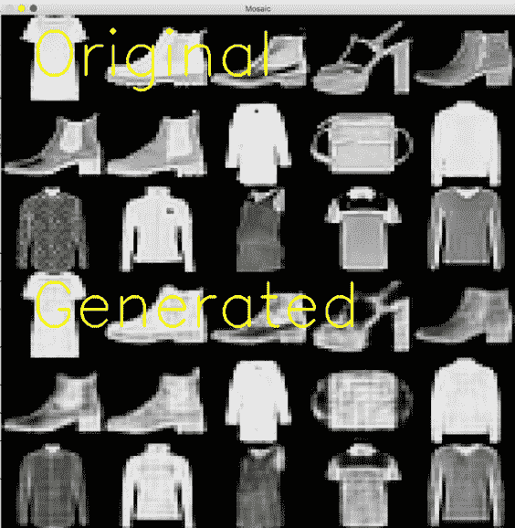
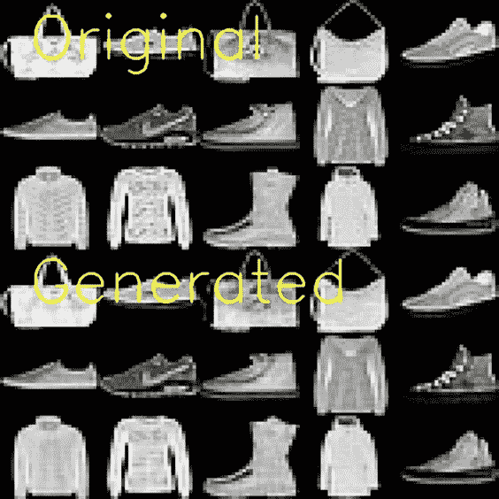
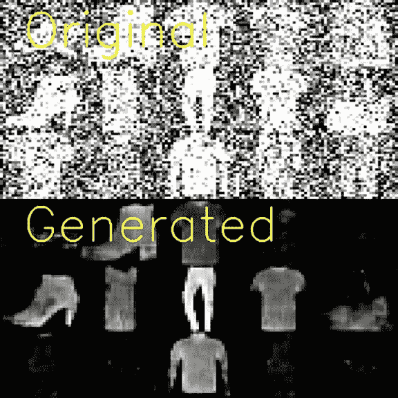
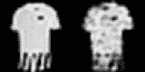
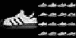
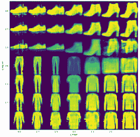

# 第五章：*第五章*：使用自编码器减少噪声

在深度神经网络家族中，最有趣的家族之一就是自编码器家族。正如其名称所示，它们的唯一目的就是处理输入数据，然后将其重建为原始形状。换句话说，自编码器学习将输入复制到输出。为什么？因为这一过程的副作用就是我们所追求的目标：不是生成标签或分类，而是学习输入到自编码器的图像的高效、高质量表示。这种表示的名称是**编码**。

它们是如何实现这一点的呢？通过同时训练两个网络：一个**编码器**，它接受图像并生成编码，另一个是**解码器**，它接受编码并尝试从中重建输入数据。

在本章中，我们将从基础开始，首先实现一个简单的全连接自编码器。之后，我们将创建一个更常见且多功能的卷积自编码器。我们还将学习如何在更实际的应用场景中使用自编码器，比如去噪图像、检测数据集中的异常值和创建逆向图像搜索索引。听起来有趣吗？

在本章中，我们将涵盖以下食谱：

+   创建一个简单的全连接自编码器

+   创建一个卷积自编码器

+   使用自编码器去噪图像

+   使用自编码器检测异常值

+   使用深度学习创建逆向图像搜索索引

+   实现一个变分自编码器

让我们开始吧！

# 技术要求

尽管使用 GPU 始终是一个好主意，但其中一些示例（特别是*创建一个简单的全连接自编码器*）在中端 CPU（如 Intel i5 或 i7）上运行良好。如果某个特定的示例依赖外部资源或需要预备步骤，您将在*准备工作*部分找到详细的准备说明。您可以随时访问本章的所有代码：[`github.com/PacktPublishing/Tensorflow-2.0-Computer-Vision-Cookbook/tree/master/ch5`](https://github.com/PacktPublishing/Tensorflow-2.0-Computer-Vision-Cookbook/tree/master/ch5)。

请查看以下链接，观看《代码实践》视频：

[`bit.ly/3qrHYaF`](https://bit.ly/3qrHYaF)。

# 创建一个简单的全连接自编码器

**自编码器**在设计和功能上都很独特。这也是为什么掌握自编码器基本原理，尤其是实现可能是最简单版本的自编码器——全连接自编码器，是一个好主意。

在本示例中，我们将实现一个全连接自编码器，来重建`Fashion-MNIST`中的图像，这是一个标准数据集，几乎不需要预处理，允许我们专注于自编码器本身。

你准备好了吗？让我们开始吧！

## 准备工作

幸运的是，`Fashion-MNIST`已经与 TensorFlow 一起打包，因此我们无需自己下载。

我们将使用`OpenCV`，一个著名的计算机视觉库，来创建一个马赛克，以便我们能够将原始图像与自编码器重建的图像进行对比。你可以通过`pip`轻松安装`OpenCV`：

```py
$> pip install opencv-contrib-python
```

现在，所有准备工作都已完成，来看看具体步骤吧！

## 如何操作…

按照以下步骤，来实现一个简单而有效的自编码器：

1.  导入必要的包来实现全连接自编码器：

    ```py
    import cv2
    import numpy as np
    from tensorflow.keras import Model
    from tensorflow.keras.datasets import fashion_mnist
    from tensorflow.keras.layers import *
    ```

1.  定义一个函数来构建自编码器的架构。默认情况下，编码或潜在向量的维度是*128*，但*16*、*32*和*64*也是不错的选择：

    ```py
    def build_autoencoder(input_shape=784, encoding_dim=128):
        input_layer = Input(shape=(input_shape,))
        encoded = Dense(units=512)(input_layer)
        encoded = ReLU()(encoded)
        encoded = Dense(units=256)(encoded)
        encoded = ReLU()(encoded)
        encoded = Dense(encoding_dim)(encoded)
        encoding = ReLU()(encoded)
        decoded = Dense(units=256)(encoding)
        decoded = ReLU()(decoded)
        decoded = Dense(units=512)(decoded)
        decoded = ReLU()(decoded)
        decoded = Dense(units=input_shape)(decoded)
        decoded = Activation('sigmoid')(decoded)
        return Model(input_layer, decoded)
    ```

1.  定义一个函数，用于将一组常规图像与其原始对应图像进行对比绘制，以便直观评估自编码器的性能：

    ```py
    def plot_original_vs_generated(original, generated):
        num_images = 15
        sample = np.random.randint(0, len(original), 
                                   num_images)
    ```

1.  前一个代码块选择了 15 个随机索引，我们将用它们从`original`和`generated`批次中挑选相同的样本图像。接下来，定义一个内部函数，这样我们就可以将 15 张图像按 3x5 网格排列：

    ```py
        def stack(data):
            images = data[sample]
            return np.vstack([np.hstack(images[:5]),
                              np.hstack(images[5:10]),
                              np.hstack(images[10:15])])
    ```

1.  现在，定义另一个内部函数，以便我们可以在图像上添加文字。这将有助于区分生成的图像和原始图像，稍后我们将看到如何操作：

    ```py
        def add_text(image, text, position):
            pt1 = position
            pt2 = (pt1[0] + 10 + (len(text) * 22),
                   pt1[1] - 45)
            cv2.rectangle(image,
                          pt1,
                          pt2,
                          (255, 255, 255),
                          -1)
            cv2.putText(image, text,
                        position,
                        fontFace=cv2.FONT_HERSHEY_SIMPLEX,
                        fontScale=1.3,
                        color=(0, 0, 0),
                        thickness=4)
    ```

1.  完成该函数，通过从原始和生成的图像组中选择相同的图像。然后，将这两组图像堆叠在一起形成马赛克，调整其大小为 860x860，使用`add_text()`在马赛克中标注原始图像和生成图像，并显示结果：

    ```py
        original = stack(original)
        generated = stack(generated)
        mosaic = np.vstack([original,
                            generated])
        mosaic = cv2.resize(mosaic, (860, 860), 
                            interpolation=cv2.INTER_AREA)
        mosaic = cv2.cvtColor(mosaic, cv2.COLOR_GRAY2BGR)
        add_text(mosaic, 'Original', (50, 100))
        add_text(mosaic, 'Generated', (50, 520))
        cv2.imshow('Mosaic', mosaic)
        cv2.waitKey(0)
    ```

1.  下载（或加载缓存的）`Fashion-MNIST`。由于这不是一个分类问题，我们只保留图像，而不保留标签：

    ```py
    (X_train, _), (X_test, _) = fashion_mnist.load_data()
    ```

1.  对图像进行归一化：

    ```py
    X_train = X_train.astype('float32') / 255.0
    X_test = X_test.astype('float32') / 255.0
    ```

1.  将图像重塑为向量：

    ```py
    X_train = X_train.reshape((X_train.shape[0], -1))
    X_test = X_test.reshape((X_test.shape[0], -1))
    ```

1.  构建自编码器并进行编译。我们将使用`'adam'`作为优化器，均方误差（`'mse'`）作为损失函数。为什么？我们不关心分类是否正确，而是尽可能准确地重建输入，这意味着要最小化总体误差：

    ```py
    autoencoder = build_autoencoder()
    autoencoder.compile(optimizer='adam', loss='mse')
    ```

1.  在 300 个 epoch 上拟合自编码器，这是一个足够大的数字，能够让网络学习到输入的良好表示。为了加快训练过程，我们每次传入`1024`个向量的批次（可以根据硬件能力自由调整批次大小）。请注意，输入特征也是标签或目标：

    ```py
    EPOCHS = 300
    BATCH_SIZE = 1024
    autoencoder.fit(X_train, X_train,
                    epochs=EPOCHS,
                    batch_size=BATCH_SIZE,
                    shuffle=True,
                    validation_data=(X_test, X_test))
    ```

1.  对测试集进行预测（基本上就是生成测试向量的副本）：

    ```py
    predictions = autoencoder.predict(X_test)
    ```

1.  将预测值和测试向量重新调整为 28x28x1 尺寸的灰度图像：

    ```py
    original_shape = (X_test.shape[0], 28, 28)
    predictions = predictions.reshape(original_shape)
    X_test = X_test.reshape(original_shape)
    ```

1.  生成原始图像与自编码器生成图像的对比图：

    ```py
    plot_original_vs_generated(X_test, predictions)
    ```

    这是结果：



图 5.1 – 原始图像（前三行）与生成的图像（底部三行）

根据结果来看，我们的自编码器做得相当不错。在所有情况下，服装的形状都得到了很好的保留。然而，它在重建内部细节时并不如预期准确，如第六行第四列中的 T 恤所示，原图中的横条纹在生成的副本中缺失了。

## 它是如何工作的……

在这个食谱中，我们了解到自编码器是通过将两个网络结合成一个来工作的：编码器和解码器。在 `build_autoencoder()` 函数中，我们实现了一个完全连接的自编码架构，其中编码器部分接受一个 784 元素的向量并输出一个包含 128 个数字的编码。然后，解码器接收这个编码并通过几个堆叠的全连接层进行扩展，最后一个层生成一个 784 元素的向量（与输入的维度相同）。

训练过程因此包括最小化编码器接收的输入与解码器产生的输出之间的距离或误差。实现这一目标的唯一方法是学习能在压缩输入时最小化信息损失的编码。

尽管损失函数（在此情况下为 `MSE`）是衡量自编码器学习进展的好方法，但对于这些特定的网络，视觉验证同样重要，甚至可能更为关键。这就是我们实现 `plot_original_vs_generated()` 函数的原因：检查副本是否看起来像它们的原始对应物。

你为什么不试试改变编码大小呢？它是如何影响副本质量的？

## 另见

如果你想知道为什么 `Fashion-MNIST` 会存在，可以查看这里的官方仓库：[`github.com/zalandoresearch/fashion-mnist`](https://github.com/zalandoresearch/fashion-mnist)。

# 创建卷积自编码器

与常规神经网络一样，处理图像时，使用卷积通常是最好的选择。在自编码器的情况下，这也是一样的。在这个食谱中，我们将实现一个卷积自编码器，用于重建 `Fashion-MNIST` 中的图像。

区别在于，在解码器中，我们将使用反向或转置卷积，它可以放大体积，而不是缩小它们。这是传统卷积层中发生的情况。

这是一个有趣的食谱。你准备好开始了吗？

## 准备工作

因为 TensorFlow 提供了方便的函数来下载 `Fashion-MNIST`，所以我们不需要在数据端做任何手动准备。然而，我们必须安装 `OpenCV`，以便我们可以可视化自编码器的输出。可以使用以下命令来完成：

```py
$> pip install opencv-contrib-python
```

事不宜迟，让我们开始吧。

## 如何做……

按照以下步骤实现一个完全功能的卷积自编码器：

1.  让我们导入必要的依赖：

    ```py
    import cv2
    import numpy as np
    from tensorflow.keras import Model
    from tensorflow.keras.datasets import fashion_mnist
    from tensorflow.keras.layers import * 
    ```

1.  定义`build_autoencoder()`函数，该函数内部构建自编码器架构，并返回编码器、解码器以及自编码器本身。首先定义输入层和第一组 32 个卷积过滤器：

    ```py
    def build_autoencoder(input_shape=(28, 28, 1),
                          encoding_size=32,
                          alpha=0.2):
        inputs = Input(shape=input_shape)
        encoder = Conv2D(filters=32,
                         kernel_size=(3, 3),
                         strides=2,
                         padding='same')(inputs)
        encoder = LeakyReLU(alpha=alpha)(encoder)
        encoder = BatchNormalization()(encoder)
    ```

    定义第二组卷积层（这次是 64 个卷积核）：

    ```py
        encoder = Conv2D(filters=64,
                         kernel_size=(3, 3),
                         strides=2,
                         padding='same')(encoder)
        encoder = LeakyReLU(alpha=alpha)(encoder)
        encoder = BatchNormalization()(encoder)
    ```

    定义编码器的输出层：

    ```py
        encoder_output_shape = encoder.shape
        encoder = Flatten()(encoder)
        encoder_output = Dense(units=encoding_size)(encoder)
        encoder_model = Model(inputs, encoder_output)
    ```

1.  在*步骤 2*中，我们定义了编码器模型，这是一个常规的卷积神经网络。下一块代码定义了解码器模型，从输入和 64 个反卷积过滤器开始：

    ```py
        decoder_input = Input(shape=(encoding_size,))
        target_shape = tuple(encoder_output_shape[1:])
        decoder = Dense(np.prod(target_shape))(decoder_input)
        decoder = Reshape(target_shape)(decoder)
        decoder = Conv2DTranspose(filters=64,
                                  kernel_size=(3, 3),
                                  strides=2,
                                  padding='same')(decoder)
        decoder = LeakyReLU(alpha=alpha)(decoder)
        decoder = BatchNormalization()(decoder)
    ```

    定义第二组反卷积层（这次是 32 个卷积核）：

    ```py
        decoder = Conv2DTranspose(filters=32,
                                  kernel_size=(3, 3),
                                  strides=2,
                                  padding='same')(decoder)
        decoder = LeakyReLU(alpha=alpha)(decoder)
        decoder = BatchNormalization()(decoder)
    ```

    定义解码器的输出层：

    ```py
        decoder = Conv2DTranspose(filters=1,
                                  kernel_size=(3, 3),
                                  padding='same')(decoder)
        outputs = Activation('sigmoid')(decoder)
        decoder_model = Model(decoder_input, outputs)
    ```

1.  解码器使用`Conv2DTranspose`层，该层将输入扩展以生成更大的输出体积。注意，我们进入解码器的层数越多，`Conv2DTranspose`层使用的过滤器就越少。最后，定义自编码器：

    ```py
        encoder_model_output = encoder_model(inputs)
        decoder_model_output = 
           decoder_model(encoder_model_output)
        autoencoder_model = Model(inputs, 
           decoder_model_output)
      return encoder_model, decoder_model, autoencoder_model
    ```

    自编码器是端到端的架构。它从输入层开始，进入编码器，最后通过解码器输出层，得出结果。

1.  定义一个函数，将一般图像样本与其原始图像进行对比绘制。这将帮助我们直观评估自编码器的性能。（这是我们在前一个示例中定义的相同函数。有关更完整的解释，请参考本章的*创建简单的全连接自编码器*一节。）请看以下代码：

    ```py
    def plot_original_vs_generated(original, generated):
        num_images = 15
        sample = np.random.randint(0, len(original), 
                                   num_images)
    ```

1.  定义一个内部辅助函数，用于将图像样本堆叠成一个 3x5 的网格：

    ```py
        def stack(data):
            images = data[sample]
            return np.vstack([np.hstack(images[:5]),
                              np.hstack(images[5:10]),
                              np.hstack(images[10:15])])
    ```

1.  接下来，定义一个函数，将文本放置到图像的指定位置：

    ```py
    def add_text(image, text, position):
            pt1 = position
            pt2 = (pt1[0] + 10 + (len(text) * 22),
                   pt1[1] - 45)
            cv2.rectangle(image,
                          pt1,
                          pt2,
                          (255, 255, 255),
                          -1)
            cv2.putText(image, text,
                        position,
                        fontFace=cv2.FONT_HERSHEY_SIMPLEX,
                        fontScale=1.3,
                        color=(0, 0, 0),
                        thickness=4)
    ```

1.  最后，创建一个包含原始图像和生成图像的马赛克：

    ```py
        original = stack(original)
        generated = stack(generated)
        mosaic = np.vstack([original,
                            generated])
        mosaic = cv2.resize(mosaic, (860, 860),
                            interpolation=cv2.INTER_AREA)
        mosaic = cv2.cvtColor(mosaic, cv2.COLOR_GRAY2BGR)
        add_text(mosaic, 'Original', (50, 100))
        add_text(mosaic, 'Generated', (50, 520))
        cv2.imshow('Mosaic', mosaic)
        cv2.waitKey(0)
    ```

1.  下载（或加载，如果已缓存）`Fashion-MNIST`。我们只关心图像，因此可以丢弃标签：

    ```py
    (X_train, _), (X_test, _) = fashion_mnist.load_data()
    ```

1.  对图像进行归一化并添加通道维度：

    ```py
    X_train = X_train.astype('float32') / 255.0
    X_test = X_test.astype('float32') / 255.0
    X_train = np.expand_dims(X_train, axis=-1)
    X_test = np.expand_dims(X_test, axis=-1)
    ```

1.  这里，我们只关心自编码器，因此会忽略`build_autoencoder()`函数的其他两个返回值。然而，在不同的情况下，我们可能需要保留它们。我们将使用`'adam'`优化器训练模型，并使用`'mse'`作为损失函数，因为我们希望减少误差，而不是优化分类准确性：

    ```py
    _, _, autoencoder = build_autoencoder(encoding_size=256)
    autoencoder.compile(optimizer='adam', loss='mse')
    ```

1.  在 300 个训练周期中训练自编码器，每次批处理 512 张图像。注意，输入图像也是标签：

    ```py
    EPOCHS = 300
    BATCH_SIZE = 512
    autoencoder.fit(X_train, X_train,
                    epochs=EPOCHS,
                    batch_size=BATCH_SIZE,
                    shuffle=True,
                    validation_data=(X_test, X_test),
                    verbose=1)
    ```

1.  复制测试集：

    ```py
    predictions = autoencoder.predict(X_test)
    ```

1.  将预测结果和测试图像的形状调整回 28x28（无通道维度）：

    ```py
    original_shape = (X_test.shape[0], 28, 28)
    predictions = predictions.reshape(original_shape)
    X_test = X_test.reshape(original_shape)
    predictions = (predictions * 255.0).astype('uint8')
    X_test = (X_test * 255.0).astype('uint8')
    ```

1.  生成原始图像与自编码器输出的复制图像的对比马赛克：

    ```py
    plot_original_vs_generated(X_test, predictions)
    ```

    让我们看看结果：



图 5.2 – 原始图像的马赛克（前三行），与卷积自编码器生成的图像（后三行）进行对比

正如我们所见，自编码器已经学到了一个很好的编码，它使得它能够以最小的细节损失重建输入图像。让我们进入下一个部分，了解它是如何工作的！

## 它是如何工作的…

在这个教程中，我们了解到卷积自编码器是这一系列神经网络中最常见且最强大的成员之一。该架构的编码器部分是一个常规的卷积神经网络，依赖卷积和密集层来缩小输出并生成向量表示。解码器则是最有趣的部分，因为它必须处理相反的问题：根据合成的特征向量（即编码）重建输入。

它是如何做到的呢？通过使用转置卷积（`Conv2DTranspose`）。与传统的`Conv2D`层不同，转置卷积产生的是较浅的体积（较少的过滤器），但是它们更宽更高。结果是输出层只有一个过滤器，并且是 28x28 的维度，这与输入的形状相同。很有趣，不是吗？

训练过程包括最小化输出（生成的副本）和输入（原始图像）之间的误差。因此，均方误差（MSE）是一个合适的损失函数，因为它为我们提供了这个信息。

最后，我们通过目视检查一组测试图像及其合成的对照图像来评估自编码器的性能。

提示

在自编码器中，编码的大小至关重要，以确保解码器有足够的信息来重建输入。

## 另见

这里有一个关于转置卷积的很好的解释：[`towardsdatascience.com/transposed-convolution-demystified-84ca81b4baba`](https://towardsdatascience.com/transposed-convolution-demystified-84ca81b4baba)。

# 使用自编码器去噪图像

使用图像重建输入是很棒的，但有没有更有用的方式来应用自编码器呢？当然有！其中之一就是图像去噪。如其名所示，这就是通过用合理的值替换损坏的像素和区域来恢复损坏的图像。

在这个教程中，我们将故意损坏`Fashion-MNIST`中的图像，然后训练一个自编码器去噪它们。

## 准备就绪

`Fashion-MNIST`可以通过 TensorFlow 提供的便利函数轻松访问，因此我们不需要手动下载数据集。另一方面，因为我们将使用`OpenCV`来创建一些可视化效果，所以我们必须安装它，方法如下：

```py
$> pip install opencv-contrib-python
```

让我们开始吧！

## 如何做…

按照以下步骤实现一个能够恢复损坏图像的卷积自编码器：

1.  导入所需的包：

    ```py
    import cv2
    import numpy as np
    from tensorflow.keras import Model
    from tensorflow.keras.datasets import fashion_mnist
    from tensorflow.keras.layers import *
    ```

1.  定义`build_autoencoder()`函数，它创建相应的神经网络架构。请注意，这是我们在前一个教程中实现的相同架构；因此，我们在这里不再详细讲解。有关详细解释，请参见*创建卷积自编码器*教程：

    ```py
    def build_autoencoder(input_shape=(28, 28, 1),
                          encoding_size=128,
                          alpha=0.2):
        inputs = Input(shape=input_shape)
        encoder = Conv2D(filters=32,
                         kernel_size=(3, 3),
                         strides=2,
                         padding='same')(inputs)
        encoder = LeakyReLU(alpha=alpha)(encoder)
        encoder = BatchNormalization()(encoder)
        encoder = Conv2D(filters=64,
                         kernel_size=(3, 3),
                         strides=2,
                         padding='same')(encoder)
        encoder = LeakyReLU(alpha=alpha)(encoder)
        encoder = BatchNormalization()(encoder)
        encoder_output_shape = encoder.shape
        encoder = Flatten()(encoder)
        encoder_output = 
          Dense(units=encoding_size)(encoder)
        encoder_model = Model(inputs, encoder_output)
    ```

1.  现在我们已经创建了编码器模型，接下来创建解码器：

    ```py
        decoder_input = Input(shape=(encoding_size,))
        target_shape = tuple(encoder_output_shape[1:])
        decoder = 
        Dense(np.prod(target_shape))(decoder_input)
        decoder = Reshape(target_shape)(decoder)
        decoder = Conv2DTranspose(filters=64,
                                  kernel_size=(3, 3),
                                  strides=2,
                                  padding='same')(decoder)
        decoder = LeakyReLU(alpha=alpha)(decoder)
        decoder = BatchNormalization()(decoder)
        decoder = Conv2DTranspose(filters=32,
                                  kernel_size=(3, 3),
                                  strides=2,
                                  padding='same')(decoder)
        decoder = LeakyReLU(alpha=alpha)(decoder)
        decoder = BatchNormalization()(decoder)
        decoder = Conv2DTranspose(filters=1,
                                  kernel_size=(3, 3),
                                  padding='same')(decoder)
        outputs = Activation('sigmoid')(decoder)
        decoder_model = Model(decoder_input, outputs)
    ```

1.  最后，定义自编码器本身并返回三个模型：

    ```py
        encoder_model_output = encoder_model(inputs)
        decoder_model_output = 
        decoder_model(encoder_model_output)
        autoencoder_model = Model(inputs, 
                                  decoder_model_output)
        return encoder_model, decoder_model, autoencoder_model
    ```

1.  定义 `plot_original_vs_generated()` 函数，该函数创建原始图像与生成图像的比较拼图。我们稍后将使用此函数来显示噪声图像及其恢复后的图像。与 `build_autoencoder()` 类似，该函数的工作方式与我们在*创建一个简单的全连接自编码器*食谱中定义的相同，因此如果您需要详细解释，请查阅该食谱：

    ```py
    def plot_original_vs_generated(original, generated):
        num_images = 15
        sample = np.random.randint(0, len(original), 
                                  num_images)
    ```

1.  定义一个内部辅助函数，将一组图像按 3x5 网格堆叠：

    ```py
        def stack(data):
            images = data[sample]
            return np.vstack([np.hstack(images[:5]),
                              np.hstack(images[5:10]),
                              np.hstack(images[10:15])])
    ```

1.  定义一个函数，将自定义文本放置在图像上的特定位置：

    ```py
    def add_text(image, text, position):
            pt1 = position
            pt2 = (pt1[0] + 10 + (len(text) * 22),
                   pt1[1] - 45)
            cv2.rectangle(image,
                          pt1,
                          pt2,
                          (255, 255, 255),
                          -1)
            cv2.putText(image, text,
                        position,
                        fontFace=cv2.FONT_HERSHEY_SIMPLEX,
                        fontScale=1.3,
                        color=(0, 0, 0),
                        thickness=4)
    ```

1.  创建包含原始图像和生成图像的拼图，标记每个子网格并显示结果：

    ```py
        original = stack(original)
        generated = stack(generated)
        mosaic = np.vstack([original,
                            generated])
        mosaic = cv2.resize(mosaic, (860, 860),
                            interpolation=cv2.INTER_AREA)
        mosaic = cv2.cvtColor(mosaic, cv2.COLOR_GRAY2BGR)
        add_text(mosaic, 'Original', (50, 100))
        add_text(mosaic, 'Generated', (50, 520))
        cv2.imshow('Mosaic', mosaic)
        cv2.waitKey(0)
    ```

1.  使用 TensorFlow 的便捷函数加载 `Fashion-MNIST`。我们将只保留图像，因为标签不需要：

    ```py
    (X_train, _), (X_test, _) = fashion_mnist.load_data()
    ```

1.  对图像进行归一化，并使用 `np.expand_dims()` 为其添加单一颜色通道：

    ```py
    X_train = X_train.astype('float32') / 255.0
    X_test = X_test.astype('float32') / 255.0
    X_train = np.expand_dims(X_train, axis=-1)
    X_test = np.expand_dims(X_test, axis=-1)
    ```

1.  生成两个与 `X_train` 和 `X_test` 相同维度的张量。它们将对应于随机的 `0.5`：

    ```py
    train_noise = np.random.normal(loc=0.5, scale=0.5,
                                   size=X_train.shape)
    test_noise = np.random.normal(loc=0.5, scale=0.5,
                                  size=X_test.shape)
    ```

1.  通过分别向 `X_train` 和 `X_test` 添加 `train_noise` 和 `test_noise` 来故意损坏这两个数据集。确保使用 `np.clip()` 将值保持在 `0` 和 `1` 之间：

    ```py
    X_train_noisy = np.clip(X_train + train_noise, 0, 1)
    X_test_noisy = np.clip(X_test + test_noise, 0, 1)
    ```

1.  创建自编码器并编译它。我们将使用`'adam'`作为优化器，`'mse'`作为损失函数，因为我们更关心减少误差，而不是提高准确率：

    ```py
    _, _, autoencoder = build_autoencoder(encoding_size=128)
    autoencoder.compile(optimizer='adam', loss='mse')
    ```

1.  将模型训练 `300` 个周期，每次批量处理 `1024` 张噪声图像。注意，特征是噪声图像，而标签或目标是原始图像，即未经损坏的图像：

    ```py
    EPOCHS = 300
    BATCH_SIZE = 1024
    autoencoder.fit(X_train_noisy, X_train,
                    epochs=EPOCHS,
                    batch_size=BATCH_SIZE,
                    shuffle=True,
                    validation_data=(X_test_noisy,X_test))
    ```

1.  使用训练好的模型进行预测。将噪声图像和生成图像都重新调整为 28x28，并将它们缩放到[0, 255]范围内：

    ```py
    predictions = autoencoder.predict(X_test)
    original_shape = (X_test_noisy.shape[0], 28, 28)
    predictions = predictions.reshape(original_shape)
    X_test_noisy = X_test_noisy.reshape(original_shape)
    predictions = (predictions * 255.0).astype('uint8')
    X_test_noisy = (X_test_noisy * 255.0).astype('uint8')
    ```

1.  最后，显示噪声图像与恢复图像的拼图：

    ```py
    plot_original_vs_generated(X_test_noisy, predictions)
    ```

    这是结果：



图 5.3 – 噪声图像（顶部）与网络恢复的图像（底部）拼图

看看顶部的图像有多么受损！好消息是，在大多数情况下，自编码器成功地恢复了它们。然而，它无法正确去除拼图边缘部分的噪声，这表明可以进行更多实验以提高性能（公平地说，这些坏例子即使对人类来说也很难辨别）。

## 它是如何工作的…

本食谱的新颖之处在于实际应用卷积自编码器。网络和其他构建模块在前两个食谱中已被详细讨论，因此我们将重点关注去噪问题本身。

为了重现实际中损坏图像的场景，我们在`Fashion-MNIST`数据集的训练集和测试集中加入了大量的高斯噪声。这种噪声被称为“盐和胡椒”，因为损坏后的图像看起来像是洒满了这些调料。

为了教会我们的自编码器图像原本的样子，我们将带噪声的图像作为特征，将原始图像作为目标或标签。这样，经过 300 个 epoch 后，网络学会了一个编码，可以在许多情况下将带盐和胡椒噪声的实例映射到令人满意的恢复版本。

然而，模型并不完美，正如我们在拼图中看到的那样，网络无法恢复网格边缘的图像。这证明了修复损坏图像的困难性。

# 使用自编码器检测异常值

自编码器的另一个重要应用是异常检测。这个应用场景的理念是，自编码器会对数据集中最常见的类别学习出一个误差非常小的编码，而对于稀有类别（异常值）的重建能力则会误差较大。

基于这个前提，在本教程中，我们将依赖卷积自编码器来检测`Fashion-MNIST`子集中的异常值。

让我们开始吧！

## 准备中

要安装`OpenCV`，请使用以下`pip`命令：

```py
$> pip install opencv-contrib-python
```

我们将依赖 TensorFlow 内建的便捷函数来加载`Fashion-MNIST`数据集。

## 如何实现…

按照以下步骤完成这个教程：

1.  导入所需的包：

    ```py
    import cv2
    import numpy as np
    from sklearn.model_selection import train_test_split
    from tensorflow.keras import Model
    from tensorflow.keras.datasets import fashion_mnist as fmnist
    from tensorflow.keras.layers import *
    ```

1.  设置随机种子以保证可重复性：

    ```py
    SEED = 84
    np.random.seed(SEED)
    ```

1.  定义一个函数来构建自编码器架构。这个函数遵循我们在*创建卷积自编码器*教程中学习的结构，如果你想了解更深入的解释，请回到那个教程。让我们从创建编码器模型开始：

    ```py
    def build_autoencoder(input_shape=(28, 28, 1),
                          encoding_size=96,
                          alpha=0.2):
        inputs = Input(shape=input_shape)
        encoder = Conv2D(filters=32,
                         kernel_size=(3, 3),
                         strides=2,
                         padding='same')(inputs)
        encoder = LeakyReLU(alpha=alpha)(encoder)
        encoder = BatchNormalization()(encoder)
        encoder = Conv2D(filters=64,
                         kernel_size=(3, 3),
                         strides=2,
                         padding='same')(encoder)
        encoder = LeakyReLU(alpha=alpha)(encoder)
        encoder = BatchNormalization()(encoder)
        encoder_output_shape = encoder.shape
        encoder = Flatten()(encoder)
        encoder_output = Dense(encoding_size)(encoder)
        encoder_model = Model(inputs, encoder_output)
    ```

1.  接下来，构建解码器：

    ```py
        decoder_input = Input(shape=(encoding_size,))
        target_shape = tuple(encoder_output_shape[1:])
        decoder = Dense(np.prod(target_shape))(decoder_input)
        decoder = Reshape(target_shape)(decoder)
        decoder = Conv2DTranspose(filters=64,
                                  kernel_size=(3, 3),
                                  strides=2,
                                  padding='same')(decoder)
        decoder = LeakyReLU(alpha=alpha)(decoder)
        decoder = BatchNormalization()(decoder)
        decoder = Conv2DTranspose(filters=32,
                                  kernel_size=(3, 3),
                                  strides=2,
                                  padding='same')(decoder)
        decoder = LeakyReLU(alpha=alpha)(decoder)
        decoder = BatchNormalization()(decoder)
        decoder = Conv2DTranspose(filters=1,
                                  kernel_size=(3, 3),
                                  padding='same')(decoder)
        outputs = Activation('sigmoid')(decoder)
        decoder_model = Model(decoder_input, outputs)
    ```

1.  最后，构建自编码器并返回三个模型：

    ```py
        encoder_model_output = encoder_model(inputs)
        decoder_model_output = 
        decoder_model(encoder_model_output)
        autoencoder_model = Model(inputs, 
                                  decoder_model_output)
        return encoder_model, decoder_model, autoencoder_model
    ```

1.  然后，定义一个函数来构建一个包含两个类别的数据集，其中一个类别表示异常或离群点。首先选择与这两个类别相关的实例，然后将它们打乱，以打破可能存在的顺序偏差：

    ```py
    def create_anomalous_dataset(features,
                                 labels,
                                 regular_label,
                                 anomaly_label,
                                 corruption_proportion=0.01):
        regular_data_idx = np.where(labels == 
                                    regular_label)[0]
        anomalous_data_idx = np.where(labels == 
                                      anomaly_label)[0]
        np.random.shuffle(regular_data_idx)
        np.random.shuffle(anomalous_data_idx)
    ```

1.  接下来，从异常类别中选择与`corruption_proportion`成比例的实例。最后，通过将常规实例与离群点合并来创建最终的数据集：

    ```py
        num_anomalies = int(len(regular_data_idx) *
                            corruption_proportion)
        anomalous_data_idx = 
                anomalous_data_idx[:num_anomalies]
        data = np.vstack([features[regular_data_idx],
                          features[anomalous_data_idx]])
        np.random.shuffle(data)
        return data
    ```

1.  加载`Fashion-MNIST`。将训练集和测试集合并为一个数据集：

    ```py
    (X_train, y_train), (X_test, y_test) = fmnist.load_data()
    X = np.vstack([X_train, X_test])
    y = np.hstack([y_train, y_test])
    ```

1.  定义常规标签和异常标签，然后创建异常数据集：

    ```py
    REGULAR_LABEL = 5  # Sandal
    ANOMALY_LABEL = 0  # T-shirt/top
    data = create_anomalous_dataset(X, y,
                                    REGULAR_LABEL,
                                    ANOMALY_LABEL)
    ```

1.  向数据集中添加一个通道维度，进行归一化，并将数据集分为 80%作为训练集，20%作为测试集：

    ```py
    data = np.expand_dims(data, axis=-1)
    data = data.astype('float32') / 255.0
    X_train, X_test = train_test_split(data,
                                       train_size=0.8,
                                       random_state=SEED)
    ```

1.  构建自编码器并编译它。我们将使用`'adam'`作为优化器，`'mse'`作为损失函数，因为这可以很好地衡量模型的误差：

    ```py
    _, _, autoencoder = build_autoencoder(encoding_size=256)
    autoencoder.compile(optimizer='adam', loss='mse')
    ```

1.  将自编码器训练 300 个 epoch，每次处理`1024`张图像：

    ```py
    EPOCHS = 300
    BATCH_SIZE = 1024
    autoencoder.fit(X_train, X_train,
                    epochs=EPOCHS,
                    batch_size=BATCH_SIZE,
                    validation_data=(X_test, X_test))
    ```

1.  对数据进行预测以找出异常值。我们将计算原始图像与自动编码器生成图像之间的均方误差：

    ```py
    decoded = autoencoder.predict(data)
    mses = []
    for original, generated in zip(data, decoded):
        mse = np.mean((original - generated) ** 2)
        mses.append(mse)
    ```

1.  选择误差大于 99.9%分位数的图像索引。这些将是我们的异常值：

    ```py
    threshold = np.quantile(mses, 0.999)
    outlier_idx = np.where(np.array(mses) >= threshold)[0]
    print(f'Number of outliers: {len(outlier_idx)}')
    ```

1.  为每个异常值保存原始图像与生成图像的比较图像：

    ```py
    decoded = (decoded * 255.0).astype('uint8')
    data = (data * 255.0).astype('uint8')
    for i in outlier_idx:
        image = np.hstack([data[i].reshape(28, 28),
                           decoded[i].reshape(28, 28)])
        cv2.imwrite(f'{i}.jpg', image)
    ```

    这是一个异常值的示例：



图 5.4 – 左：原始异常值。右：重建图像。

正如我们所看到的，我们可以利用自动编码器学习的编码知识轻松检测数据集中的异常或不常见图像。我们将在下一节中更详细地讨论这一点。

## 它是如何工作的…

本配方背后的思想非常简单：根据定义，异常值是数据集中事件或类别的稀有发生。因此，当我们在包含异常值的数据集上训练自动编码器时，它将没有足够的时间或示例来学习它们的适当表示。

通过利用网络在重建异常图像（在此示例中为 T 恤）时表现出的低置信度（换句话说，高误差），我们可以选择最差的副本来发现异常值。

然而，为了使此技术有效，自动编码器必须擅长重建常规类别（例如，凉鞋）；否则，误报率将太高。

# 使用深度学习创建逆图像搜索索引

因为自动编码器的核心目的是学习图像集合的编码或低维表示，它们是非常优秀的特征提取器。此外，正如我们将在本配方中发现的那样，我们可以将它们作为图像搜索索引的完美构建模块。

## 准备就绪

让我们使用`pip`安装`OpenCV`。我们将用它来可视化自动编码器的输出，从而直观地评估图像搜索索引的有效性：

```py
$> pip install opencv-python
```

我们将在下一节开始实现这个配方。

## 如何实现…

按照以下步骤创建您自己的图像搜索索引：

1.  导入必要的库：

    ```py
    import cv2
    import numpy as np
    from tensorflow.keras import Model
    from tensorflow.keras.datasets import fashion_mnist
    from tensorflow.keras.layers import *
    ```

1.  定义`build_autoencoder()`，该函数实例化自动编码器。首先，让我们组装编码器部分：

    ```py
    def build_autoencoder(input_shape=(28, 28, 1),
                          encoding_size=32,
                          alpha=0.2):
        inputs = Input(shape=input_shape)
        encoder = Conv2D(filters=32,
                         kernel_size=(3, 3),
                         strides=2,
                         padding='same')(inputs)
        encoder = LeakyReLU(alpha=alpha)(encoder)
        encoder = BatchNormalization()(encoder)
        encoder = Conv2D(filters=64,
                         kernel_size=(3, 3),
                         strides=2,
                         padding='same')(encoder)
        encoder = LeakyReLU(alpha=alpha)(encoder)
        encoder = BatchNormalization()(encoder)
        encoder_output_shape = encoder.shape
        encoder = Flatten()(encoder)
        encoder_output = Dense(units=encoding_size,
                               name='encoder_output')(encoder)
    ```

1.  下一步是定义解码器部分：

    ```py
        target_shape = tuple(encoder_output_shape[1:])
        decoder = Dense(np.prod(target_shape))(encoder _output)
        decoder = Reshape(target_shape)(decoder)
        decoder = Conv2DTranspose(filters=64,
                                  kernel_size=(3, 3),
                                  strides=2,
                                  padding='same')(decoder)
        decoder = LeakyReLU(alpha=alpha)(decoder)
        decoder = BatchNormalization()(decoder)
        decoder = Conv2DTranspose(filters=32,
                                  kernel_size=(3, 3),
                                  strides=2,
                                  padding='same')(decoder)
        decoder = LeakyReLU(alpha=alpha)(decoder)
        decoder = BatchNormalization()(decoder)
        decoder = Conv2DTranspose(filters=1,
                                  kernel_size=(3, 3),
                                  padding='same')(decoder)
        outputs = Activation(activation='sigmoid',

                         name='decoder_output')(decoder)
    ```

1.  最后，构建自动编码器并返回它：

    ```py
        autoencoder_model = Model(inputs, outputs)
        return autoencoder_model
    ```

1.  定义一个计算两个向量之间欧几里得距离的函数：

    ```py
    def euclidean_dist(x, y):
        return np.linalg.norm(x - y)
    ```

1.  定义`search()`函数，该函数使用搜索索引（一个将特征向量与相应图像配对的字典）来检索与查询向量最相似的结果：

    ```py
    def search(query_vector, search_index, 
               max_results=16):
        vectors = search_index['features']
        results = []
        for i in range(len(vectors)):
            distance = euclidean_dist(query_vector, 
                                       vectors[i])
            results.append((distance, 
                           search_index['images'][i]))
        results = sorted(results, 
                         key=lambda p: p[0])[:max_results]
        return results
    ```

1.  加载`Fashion-MNIST`数据集。仅保留以下图像：

    ```py
    (X_train, _), (X_test, _) = fashion_mnist.load_data()     
    ```

1.  对图像进行归一化并添加颜色通道维度：

    ```py
    X_train = X_train.astype('float32') / 255.0
    X_test = X_test.astype('float32') / 255.0
    X_train = np.expand_dims(X_train, axis=-1)
    X_test = np.expand_dims(X_test, axis=-1)
    ```

1.  构建自动编码器并进行编译。我们将使用`'adam'`作为优化器，`'mse'`作为损失函数，因为这样可以很好地衡量模型的误差：

    ```py
    autoencoder = build_autoencoder()
    autoencoder.compile(optimizer='adam', loss='mse')
    ```

1.  训练自动编码器 10 个周期，每次批处理`512`张图像：

    ```py
    EPOCHS = 50
    BATCH_SIZE = 512
    autoencoder.fit(X_train, X_train,
                    epochs=EPOCHS,
                    batch_size=BATCH_SIZE,
                    shuffle=True,
                    validation_data=(X_test, X_test))
    ```

1.  创建一个新模型，我们将用它作为特征提取器。它将接收与自编码器相同的输入，并输出自编码器学到的编码。实质上，我们是使用自编码器的编码器部分将图像转换为向量：

    ```py
    fe_input = autoencoder.input
    fe_output = autoencoder.get_layer('encoder_output').output
    feature_extractor = Model(inputs=fe_input, 
                             outputs=fe_output)
    ```

1.  创建搜索索引，由`X_train`的特征向量和原始图像组成（原始图像必须重新调整为 28x28 并重新缩放到[0, 255]的范围）：

    ```py
    train_vectors = feature_extractor.predict(X_train)
    X_train = (X_train * 255.0).astype('uint8')
    X_train = X_train.reshape((X_train.shape[0], 28, 28))
    search_index = {
        'features': train_vectors,
        'images': X_train
    }
    ```

1.  计算`X_test`的特征向量，我们将把它用作查询图像的样本。并将`X_test`调整为 28x28 的形状，并将其值重新缩放到[0, 255]的范围：

    ```py
    test_vectors = feature_extractor.predict(X_test)
    X_test = (X_test * 255.0).astype('uint8')
    X_test = X_test.reshape((X_test.shape[0], 28, 28))
    ```

1.  选择 16 个随机测试图像（以及其对应的特征向量）作为查询：

    ```py
    sample_indices = np.random.randint(0, X_test.shape[0],16)
    sample_images = X_test[sample_indices]
    sample_queries = test_vectors[sample_indices]
    ```

1.  对测试样本中的每个图像进行搜索，并保存查询图像与从索引中提取的结果之间的并排视觉对比（记住，索引是由训练数据组成的）：

    ```py
    for i, (vector, image) in \
            enumerate(zip(sample_queries, sample_images)):
        results = search(vector, search_index)
        results = [r[1] for r in results]
        query_image = cv2.resize(image, (28 * 4, 28 * 4),
                              interpolation=cv2.INTER_AREA)
        results_mosaic = 
                 np.vstack([np.hstack(results[0:4]),
                            np.hstack(results[4:8]),
                            np.hstack(results[8:12]),
                            np.hstack(results[12:16])])
        result_image = np.hstack([query_image, 
                                 results_mosaic])
        cv2.imwrite(f'{i}.jpg', result_image)
    ```

    下面是一个搜索结果的示例：



图 5.5 – 左：鞋子的查询图像。右：最佳的 16 个搜索结果，所有结果也都包含鞋子

正如前面的图像所示，我们的图像搜索索引是成功的！我们将在下一部分看到它是如何工作的。

## 它是如何工作的…

在本食谱中，我们学习了如何利用自编码器的独特特征——学习一个大大压缩输入图像信息的编码，从而实现最小的信息损失。然后，我们使用卷积自编码器的编码器部分提取时尚物品照片的特征，并构建了一个图像搜索索引。

通过这样做，使用这个索引作为搜索引擎就像计算查询向量（对应于查询图像）与索引中所有图像之间的欧几里得距离一样简单，只选择那些最接近查询的图像。

我们解决方案中最重要的方面是训练一个足够优秀的自编码器，以生成高质量的向量，因为它们决定了搜索引擎的成败。

## 另见

该实现基于 Dong *等人*的出色工作，论文可在此阅读：[`github.com/PacktPublishing/Tensorflow-2.0-Computer-Vision-Cookbook/tree/master/ch5/recipe5`](https://github.com/PacktPublishing/Tensorflow-2.0-Computer-Vision-Cookbook/tree/master/ch5/recipe5)。

# 实现变分自编码器

自编码器的一些最现代且复杂的应用场景是**变分自编码器**（**VAE**）。它们与其他自编码器的不同之处在于，变分自编码器并不是学习一个任意的函数，而是学习输入图像的概率分布。我们可以从这个分布中采样，以生成新的、未见过的数据点。

**VAE**实际上是一个生成模型，在这个食谱中，我们将实现一个。

## 准备就绪

我们不需要为这个食谱做任何特别的准备，所以让我们立即开始吧！

## 如何操作…

按照以下步骤学习如何实现和训练**VAE**：

1.  导入必要的包：

    ```py
    import matplotlib.pyplot as plt
    import numpy as np
    import tensorflow as tf
    from tensorflow.keras import Model
    from tensorflow.keras import backend as K
    from tensorflow.keras.datasets import fashion_mnist
    from tensorflow.keras.layers import *
    from tensorflow.keras.losses import mse
    from tensorflow.keras.optimizers import Adam
    ```

1.  因为我们很快会使用`tf.function`注解，所以我们必须告诉 TensorFlow 以急切执行（eager execution）的方式运行函数：

    ```py
    tf.config.experimental_run_functions_eagerly(True)
    ```

1.  定义一个类，封装我们实现`self.z_log_var`和`self.z_mean`的功能，它们是我们将学习的潜在高斯分布的参数：

    ```py
            self.z_log_var = None
            self.z_mean = None
    ```

1.  定义一些成员变量，用于存储`encoder`、`decoder`和`vae`的输入和输出：

    ```py
            self.inputs = None
            self.outputs = None
            self.encoder = None
            self.decoder = None
            self.vae = None
    ```

1.  定义`build_vae()`方法，该方法构建变分自编码器架构（请注意，我们使用的是全连接层而不是卷积层）：

    ```py
        def build_vae(self):
            self.inputs = Input(shape=(self.original_dimension,))
            x = Dense(self.encoding_dimension)(self.inputs)
            x = ReLU()(x)
            self.z_mean = Dense(self.latent_dimension)(x)
            self.z_log_var = Dense(self.latent_dimension)(x)
            z = Lambda(sampling)([self.z_mean, 
                                 self.z_log_var])
            self.encoder = Model(self.inputs,
                                 [self.z_mean, 
                                 self.z_log_var, z])
    ```

    请注意，编码器只是一个完全连接的网络，它产生三个输出：`self.z_mean`，这是我们训练建模的高斯分布的均值；`self.z_log_var`，这是该分布的对数方差；以及`z`，这是该概率空间中的一个样本点。为了简单地生成`z`，我们必须在`Lambda`层中包装一个自定义函数`sampling()`（在*第 5 步*中实现）。

1.  接下来，定义解码器：

    ```py
            latent_inputs = Input(shape=(self.latent_dimension,))
            x = Dense(self.encoding_dimension)(latent_inputs)
            x = ReLU()(x)
            self.outputs = Dense(self.original_dimension)(x)
            self.outputs = Activation('sigmoid')(self.outputs)
            self.decoder = Model(latent_inputs, 
                                 self.outputs)
    ```

1.  解码器只是另一个完全连接的网络。解码器将从潜在维度中取样，以重构输入。最后，将编码器和解码器连接起来，创建**VAE**模型：

    ```py
            self.outputs = self.encoder(self.inputs)[2]
            self.outputs = self.decoder(self.outputs)
            self.vae = Model(self.inputs, self.outputs)
    ```

1.  定义`train()`方法，该方法训练变分自编码器。因此，它接收训练和测试数据，以及迭代次数和批次大小：

    ```py
        @tf.function
        def train(self, X_train,
                  X_test, 
                  epochs=50, 
                  batch_size=64):
    ```

1.  将重建损失定义为输入和输出之间的均方误差（MSE）：

    ```py
            reconstruction_loss = mse(self.inputs, 
                                      self.outputs)
            reconstruction_loss *= self.original_dimension
    ```

    `kl_loss`是`reconstruction_loss`：

    ```py
            kl_loss = (1 + self.z_log_var -
                       K.square(self.z_mean) -
                       K.exp(self.z_log_var))
            kl_loss = K.sum(kl_loss, axis=-1)
            kl_loss *= -0.5
            vae_loss = K.mean(reconstruction_loss + kl_loss)
    ```

1.  配置`self.vae`模型，使其使用`vae_loss`和`Adam()`作为优化器（学习率为 0.003）。然后，在指定的迭代次数内拟合网络。最后，返回三个模型：

    ```py
            self.vae.add_loss(vae_loss)
            self.vae.compile(optimizer=Adam(lr=1e-3))
            self.vae.fit(X_train,
                         epochs=epochs,
                         batch_size=batch_size,
                         validation_data=(X_test, None))
            return self.encoder, self.decoder, self.vae
    ```

1.  定义一个函数，该函数将在给定两个相关参数（通过`arguments`数组传递）时生成潜在空间中的随机样本或点；即，`z_mean`和`z_log_var`：

    ```py
    def sampling(arguments):
        z_mean, z_log_var = arguments
        batch = K.shape(z_mean)[0]
        dimension = K.int_shape(z_mean)[1]
        epsilon = K.random_normal(shape=(batch, dimension))
        return z_mean + K.exp(0.5 * z_log_var) * epsilon
    ```

    请注意，`epsilon`是一个随机的高斯向量。

1.  定义一个函数，该函数将生成并绘制从潜在空间生成的图像。这将帮助我们了解靠近分布的**形状**，以及接近曲线尾部的形状：

    ```py
    def generate_and_plot(decoder, grid_size=5):
        cell_size = 28
        figure_shape = (grid_size * cell_size,
                        grid_size * cell_size)
        figure = np.zeros(figure_shape)
    ```

1.  创建一个值的范围，X 轴和 Y 轴的值从-4 到 4。我们将使用这些值在每个位置生成和可视化样本：

    ```py
        grid_x = np.linspace(-4, 4, grid_size)
        grid_y = np.linspace(-4, 4, grid_size)[::-1]
    ```

1.  使用解码器为每个`z_mean`和`z_log_var`的组合生成新的样本：

    ```py
        for i, z_log_var in enumerate(grid_y):
            for j, z_mean in enumerate(grid_x):
                z_sample = np.array([[z_mean, z_log_var]])
                generated = decoder.predict(z_sample)[0]
    ```

1.  重塑样本，并将其放置在网格中的相应单元格中：

    ```py
                fashion_item = 
                       generated.reshape(cell_size,
                                        cell_size)
                y_slice = slice(i * cell_size, 
                                (i + 1) * cell_size)
                x_slice = slice(j * cell_size, 
                                (j + 1) * cell_size)
                figure[y_slice, x_slice] = fashion_item
    ```

1.  添加刻度和坐标轴标签，然后显示图形：

    ```py
        plt.figure(figsize=(10, 10))
        start = cell_size // 2
        end = (grid_size - 2) * cell_size + start + 1
        pixel_range = np.arange(start, end, cell_size)
        sample_range_x = np.round(grid_x, 1)
        sample_range_y = np.round(grid_y, 1)
        plt.xticks(pixel_range, sample_range_x)
        plt.yticks(pixel_range, sample_range_y)
        plt.xlabel('z_mean')
        plt.ylabel('z_log_var')
        plt.imshow(figure)
        plt.show()
    ```

1.  加载`Fashion-MNIST`数据集。对图像进行归一化，并添加颜色通道：

    ```py
    (X_train, _), (X_test, _) = fashion_mnist.load_data()
    X_train = X_train.astype('float32') / 255.0
    X_test = X_test.astype('float32') / 255.0
    X_train = X_train.reshape((X_train.shape[0], -1))
    X_test = X_test.reshape((X_test.shape[0], -1))
    ```

1.  实例化并构建**变分自编码器**：

    ```py
    vae = VAE(original_dimension=784,
              encoding_dimension=512,
              latent_dimension=2)
    vae.build_vae()
    ```

1.  训练模型 100 个周期：

    ```py
    _, decoder_model, vae_model = vae.train(X_train, X_test, 
                                            epochs=100)
    ```

1.  使用解码器生成新图像并绘制结果：

    ```py
    generate_and_plot(decoder_model, grid_size=7)
    ```

    这是结果：



图 5.6 – VAE 学习的潜在空间可视化

在这里，我们可以看到构成潜在空间的点集，以及这些点对应的服装项目。 这是网络学习的概率分布的一个表示，其中分布中心的项目类似于 T 恤，而边缘的项目则更像裤子、毛衣和鞋子。

让我们继续进入下一节。

## 它是如何工作的……

在这个示例中，我们了解到，**变分自编码器**是一种更先进、更复杂的自编码器，它不像学习一个任意的、简单的函数来将输入映射到输出，而是学习输入的概率分布。这样，它就能够生成新的、未见过的图像，成为更现代生成模型的前驱，例如**生成对抗网络**（**GANs**）。

这个架构与我们在本章中学习的其他自编码器并没有太大不同。理解`z`的关键在于，我们通过`sampling()`函数在 Lambda 层中生成`z`。

这意味着，在每次迭代中，整个网络都在优化`z_mean`和`z_log_var`参数，使其与输入的概率分布尽可能接近。这样做是因为，只有这样，随机样本（`z`）的质量才足够高，解码器才能生成更好、更逼真的输出。

## 另见

我们可以用来调节**VAE**的一个关键组件是**Kullback-Leibler**散度，您可以在这里阅读更多内容：[`en.wikipedia.org/wiki/Kullback%E2%80%93Leibler_divergence`](https://en.wikipedia.org/wiki/Kullback%E2%80%93Leibler_divergence)。

请注意，**VAE**是生成模型的完美开端，我们将在下一章深入讨论它！
