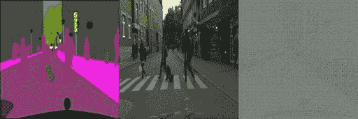

# 第六章：生成模型与对抗攻击

能够区分两个或更多类别无疑是令人印象深刻的，且是深度神经网络确实在学习的健康信号。

但如果传统的分类任务令人印象深刻，那么生成新内容则令人叹为观止！这绝对需要对领域有更高的理解。那么，有没有神经网络能够做到这一点呢？当然有！

在本章中，我们将研究神经网络中最迷人且最有前景的一种类型：**生成对抗网络**（**GANs**）。顾名思义，这些网络实际上是由两个子网络组成的系统：生成器和判别器。生成器的任务是生成足够优秀的图像，使它们*看起来*像是来自原始分布（但实际上并非如此；它们是从零开始生成的），从而欺骗判别器，而判别器的任务是分辨真假图像。

**GANs** 在半监督学习和图像到图像的翻译等领域处于尖端位置，这两个主题我们将在本章中讨论。作为补充，本章最后的食谱将教我们如何使用**快速梯度符号方法**（**FGSM**）对网络进行对抗攻击。

本章我们将涉及的食谱如下：

+   实现一个深度卷积 GAN

+   使用 DCGAN 进行半监督学习

+   使用 Pix2Pix 进行图像翻译

+   使用 CycleGAN 翻译未配对的图像

+   使用快速梯度符号方法实现对抗攻击

# 技术要求

GANs 很棒，但在计算能力方面非常消耗资源。因此，GPU 是必不可少的，才能在这些食谱上进行操作（即使如此，大多数情况仍需运行几个小时）。在*准备工作*部分，你会发现每个食谱所需的准备工作（如果有的话）。本章的代码可以在这里找到：[`github.com/PacktPublishing/Tensorflow-2.0-Computer-Vision-Cookbook/tree/master/ch6`](https://github.com/PacktPublishing/Tensorflow-2.0-Computer-Vision-Cookbook/tree/master/ch6)。

查看以下链接，观看《代码实践》视频：[`bit.ly/35Z8IYn`](https://bit.ly/35Z8IYn)。

# 实现一个深度卷积 GAN

一个 `seed`，它只是一个高斯噪声的向量。

在本食谱中，我们将实现一个 `EMNIST` 数据集，它是在原有的 `MNIST` 数据集的基础上，加入了大写和小写的手写字母，并涵盖了从 0 到 9 的数字。

让我们开始吧！

## 准备工作

我们需要安装 `tensorflow-datasets` 来更方便地访问 `EMNIST`。另外，为了在训练 GAN 时显示漂亮的进度条，我们将使用 `tqdm`。

这两个依赖项可以按如下方式安装：

```py
$> pip install tensorflow-datasets tqdm
```

我们可以开始了！

## 如何实现…

执行以下步骤来在 `EMNIST` 上实现 DCGAN：

1.  导入必要的依赖项：

    ```py
    import matplotlib.pyplot as plt
    import tensorflow as tf
    import tensorflow_datasets as tfds
    from tensorflow.keras.layers import *
    from tensorflow.keras.losses import BinaryCrossentropy
    from tensorflow.keras.models import Model
    from tensorflow.keras.optimizers import Adam
    from tqdm import tqdm
    ```

1.  定义 `AUTOTUNE` 设置的别名，我们将在后续处理中使用它来确定处理数据集时的并行调用数量：

    ```py
    AUTOTUNE = tf.data.experimental.AUTOTUNE
    ```

1.  定义一个 `DCGAN()` 类来封装我们的实现。构造函数创建判别器、生成器、损失函数以及两个子网络各自的优化器：

    ```py
    class DCGAN(object):
        def __init__(self):
            self.loss = BinaryCrossentropy(from_logits=True)
            self.generator = self.create_generator()
            self.discriminator = self.create_discriminator()
            self.generator_opt = Adam(learning_rate=1e-4)
            self.discriminator_opt = Adam(learning_rate=1e-4)
    ```

1.  定义一个静态方法来创建生成器网络。它从一个 100 元素的输入张量重建一个 28x28x1 的图像。注意，使用了转置卷积（`Conv2DTranspose`）来扩展输出体积，随着网络的深入，卷积层数量也增多。同时，注意激活函数为 `'tanh'`，这意味着输出将处于 [-1, 1] 的范围内：

    ```py
       @staticmethod
        def create_generator(alpha=0.2):
            input = Input(shape=(100,))
            x = Dense(units=7 * 7 * 256, 
                     use_bias=False)(input)
            x = LeakyReLU(alpha=alpha)(x)
            x = BatchNormalization()(x)
            x = Reshape((7, 7, 256))(x)
    ```

1.  添加第一个转置卷积块，具有 128 个滤波器：

    ```py
            x = Conv2DTranspose(filters=128,
                                strides=(1, 1),
                                kernel_size=(5, 5),
                                padding='same',
                                use_bias=False)(x)
            x = LeakyReLU(alpha=alpha)(x)
            x = BatchNormalization()(x)
    ```

1.  创建第二个转置卷积块，具有 64 个滤波器：

    ```py
            x = Conv2DTranspose(filters=64,
                                strides=(2, 2),
                                kernel_size=(5, 5),
                                padding='same',
                                use_bias=False)(x)
            x = LeakyReLU(alpha=alpha)(x)
            x = BatchNormalization()(x)
    ```

1.  添加最后一个转置卷积块，只有一个滤波器，对应于网络的输出：

    ```py
            x = Conv2DTranspose(filters=1,
                                strides=(2, 2),
                                kernel_size=(5, 5),
                                padding='same',
                                use_bias=False)(x)
            output = Activation('tanh')(x)
            return Model(input, output)
    ```

1.  定义一个静态方法来创建判别器。该架构是一个常规的 CNN：

    ```py
        @staticmethod
        def create_discriminator(alpha=0.2, dropout=0.3):
            input = Input(shape=(28, 28, 1))
            x = Conv2D(filters=64,
                       kernel_size=(5, 5),
                       strides=(2, 2),
                       padding='same')(input)
            x = LeakyReLU(alpha=alpha)(x)
            x = Dropout(rate=dropout)(x)
            x = Conv2D(filters=128,
                       kernel_size=(5, 5),
                       strides=(2, 2),
                       padding='same')(x)
            x = LeakyReLU(alpha=alpha)(x)
            x = Dropout(rate=dropout)(x)
            x = Flatten()(x)
            output = Dense(units=1)(x)
            return Model(input, output)
    ```

1.  定义一个方法来计算判别器的损失，它是实际损失和假损失的总和：

    ```py
        def discriminator_loss(self, real, fake):
            real_loss = self.loss(tf.ones_like(real), real)
            fake_loss = self.loss(tf.zeros_like(fake), fake)
            return real_loss + fake_loss
    ```

1.  定义一个方法来计算生成器的损失：

    ```py
        def generator_loss(self, fake):
            return self.loss(tf.ones_like(fake), fake)
    ```

1.  定义一个方法来执行单次训练步骤。我们将从生成一个随机高斯噪声向量开始：

    ```py
        @tf.function
        def train_step(self, images, batch_size):
            noise = tf.random.normal((batch_size,noise_dimension))
    ```

1.  接下来，将随机噪声传递给生成器以生成假图像：

    ```py
            with tf.GradientTape() as gen_tape, \
                    tf.GradientTape() as dis_tape:
                generated_images = self.generator(noise,
                                            training=True)
    ```

1.  将真实图像和假图像传递给判别器，并计算两个子网络的损失：

    ```py
                real = self.discriminator(images, 
                                          training=True)
                fake = self.discriminator(generated_images,
                                          training=True)
                gen_loss = self.generator_loss(fake)
                disc_loss = self.discriminator_loss(real, 
                                                   fake)
    ```

1.  计算梯度：

    ```py
            generator_grad = gen_tape \
                .gradient(gen_loss,
                          self.generator.trainable_variables)
            discriminator_grad = dis_tape \
                .gradient(disc_loss,
                    self.discriminator.trainable_       variables)
    ```

1.  接下来，使用各自的优化器应用梯度：

    ```py
            opt_args = zip(generator_grad,
                          self.generator.trainable_variables)
            self.generator_opt.apply_gradients(opt_args)
            opt_args = zip(discriminator_grad,

                   self.discriminator.trainable_variables)
            self.discriminator_opt.apply_gradients(opt_args)
    ```

1.  最后，定义一个方法来训练整个架构。每训练 10 个周期，我们将绘制生成器生成的图像，以便直观地评估它们的质量：

    ```py
        def train(self, dataset, test_seed, epochs, 
                   batch_size):
            for epoch in tqdm(range(epochs)):
                for image_batch in dataset:
                    self.train_step(image_batch, 
                                     batch_size)
                if epoch == 0 or epoch % 10 == 0:

               generate_and_save_images(self.generator,
                                             epoch,
                                             test_seed)
    ```

1.  定义一个函数来生成新图像，然后将它们的 4x4 马赛克保存到磁盘：

    ```py
    def generate_and_save_images(model, epoch, test_input):
        predictions = model(test_input, training=False)
        plt.figure(figsize=(4, 4))
        for i in range(predictions.shape[0]):
            plt.subplot(4, 4, i + 1)
            image = predictions[i, :, :, 0] * 127.5 + 127.5
            image = tf.cast(image, tf.uint8)
            plt.imshow(image, cmap='gray')
            plt.axis('off')
        plt.savefig(f'{epoch}.png')
        plt.show()
    ```

1.  定义一个函数来将来自 `EMNIST` 数据集的图像缩放到 [-1, 1] 区间：

    ```py
    def process_image(input):
        image = tf.cast(input['image'], tf.float32)
        image = (image - 127.5) / 127.5
        return image
    ```

1.  使用 `tfds` 加载 `EMNIST` 数据集。我们只使用 `'train'` 数据集，其中包含超过 60 万张图像。我们还会确保将每张图像缩放到 `'tanh'` 范围内：

    ```py
    BUFFER_SIZE = 1000
    BATCH_SIZE = 512
    train_dataset = (tfds
                     .load('emnist', split='train')
                     .map(process_image,
                          num_parallel_calls=AUTOTUNE)
                     .shuffle(BUFFER_SIZE)
                     .batch(BATCH_SIZE))
    ```

1.  创建一个测试种子，在整个 DCGAN 训练过程中用于生成图像：

    ```py
    noise_dimension = 100
    num_examples_to_generate = 16
    seed_shape = (num_examples_to_generate, 
                  noise_dimension)
    test_seed = tf.random.normal(seed_shape)
    ```

1.  最后，实例化并训练一个 `DCGAN()` 实例，训练 200 个周期：

    ```py
    EPOCHS = 200
    dcgan = DCGAN()
    dcgan.train(train_dataset, test_seed, EPOCHS, BATCH_SIZE)
    ```

    由 GAN 生成的第一张图像将类似于这个，只是一些没有形状的斑点：


图 6.1 – 在第 0 个周期生成的图像

在训练过程结束时，结果要好得多：


图 6.2 – 在第 200 个周期生成的图像

在 *图 6.2* 中，我们可以辨认出熟悉的字母和数字，包括 *A*、*d*、*9*、*X* 和 *B*。然而，在第一行中，我们注意到几个模糊的形状，这表明生成器还有改进的空间。

让我们在下一节中看看它是如何工作的。

## 它是如何工作的……

在这个配方中，我们学到 GAN 是协同工作的，不像自编码器那样相互配合，它们是相互对抗的（因此名字中有 *对抗* 二字）。当我们专注于生成器时，判别器只是一个训练生成器的工具，正如本例中的情况一样。这意味着训练后，判别器会被丢弃。

我们的生成器实际上是一个解码器，它接收一个包含 100 个元素的随机高斯向量，并生成 28x28x1 的图像，接着这些图像被传递给判别器，一个常规的 CNN，判别器需要判断它们是真实的还是伪造的。

因为我们的目标是创造最好的生成器，所以判别器尝试解决的分类问题与 `EMNIST` 中的实际类别无关。因此，我们不会事先明确标记图像为真实或伪造，但在 `discriminator_loss()` 方法中，我们知道所有来自 `real` 的图像都来自 `EMNIST`，因此我们对一个全为 1 的张量（`tf.ones_like(real)`）计算损失，类似地，所有来自 `fake` 的图像是合成的，我们对一个全为 0 的张量（`tf.zeros_like(fake)`）计算损失。

另一方面，生成器在计算其损失时会考虑来自判别器的反馈，以改进其输出。

必须注意的是，这里的目标是实现平衡，而不是最小化损失。因此，视觉检查至关重要，这也是我们每隔 10 个周期保存生成器输出的图像的原因。

最终，我们从第 0 个周期的随机、无形的块，到了第 200 个周期时，生成了可识别的数字和字母，尽管网络仍然可以进一步改进。

## 另见

你可以在这里阅读更多关于 `EMNIST` 的内容：[`arxiv.org/abs/1702.05373v1`](https://arxiv.org/abs/1702.05373v1)。

# 使用 DCGAN 进行半监督学习

数据是开发任何深度学习模型中最重要的部分。然而，好的数据通常稀缺且获取成本高。好消息是，GAN 可以在这些情况下提供帮助，通过人工生成新颖的训练示例，这个过程被称为 **半监督学习**。

在这个配方中，我们将开发一个特殊的 DCGAN 架构，在 `Fashion-MNIST` 的一个非常小的子集上训练分类器，并仍然达到不错的性能。

让我们开始吧，怎么样？

## 准备工作

我们不需要额外的东西来访问 `Fashion-MNIST`，因为它与 TensorFlow 一起捆绑提供。为了显示一个好看的进度条，让我们安装 `tqdm`：

```py
$> pip install tqdm
```

现在让我们进入下一部分，开始实现这个配方。

## 如何操作……

执行以下步骤以完成配方：

1.  让我们开始导入所需的包：

    ```py
    import numpy as np
    from numpy.random import *
    from tensorflow.keras import backend as K
    from tensorflow.keras.datasets import fashion_mnist as fmnist
    from tensorflow.keras.layers import *
    from tensorflow.keras.models import Model
    from tensorflow.keras.optimizers import Adam
    from tqdm import tqdm
    ```

1.  定义 `pick_supervised_subset()` 函数来选择数据的子集。这将帮助我们模拟数据稀缺的情况，非常适合半监督学习。

    ```py
    def pick_supervised_subset(feats,
                               labels,
                               n_samples=1000,
                               n_classes=10):
        samples_per_class = int(n_samples / n_classes)
        X = []
        y = []
        for i in range(n_classes):
            class_feats = feats[labels == i]
            class_sample_idx = randint(low=0,

                                   high=len(class_feats),
                                  size=samples_per_class)
            X.extend([class_feats[j] for j in 
                      class_sample_idx])
            y.extend([i] * samples_per_class)
        return np.array(X), np.array(y)
    ```

1.  现在，定义一个函数来选择一个随机数据样本用于分类。这意味着我们将使用原始数据集中的标签：

    ```py
    def pick_samples_for_classification(feats, labels, 
                                         n_samples):
        sample_idx = randint(low=0,
                             high=feats.shape[0],
                             size=n_samples)
        X = np.array([feats[i] for i in sample_idx])
        y = np.array([labels[i] for i in sample_idx])
        return X, y
    ```

1.  定义 `pick_samples_for_discrimination()` 函数以选择一个随机样本用于判别。与上一个函数的主要区别在于这里的标签都是 1，表示所有的图像都是真实的，这清楚地表明该样本是为判别器准备的：

    ```py
    def pick_samples_for_discrimination(feats, n_samples):
        sample_idx = randint(low=0,
                             high=feats.shape[0],
                             size=n_samples)
        X = np.array([feats[i] for i in sample_idx])
        y = np.ones((n_samples, 1))
        return X, y
    ```

1.  实现 `generate_fake_samples()` 函数来生成一批潜在点，换句话说，就是一组随机噪声向量，生成器将利用这些向量生成假图像：

    ```py
    def generate_fake_samples(model, latent_size, 
                              n_samples):
        z_input = generate_latent_points(latent_size, 
                                          n_samples)
        images = model.predict(z_input)
        y = np.zeros((n_samples, 1))
        return images, y
    ```

1.  创建 `generate_fake_samples()` 函数，用生成器生成假数据：

    ```py
    def generate_fake_samples(model, latent_size, 
                              n_samples):
        z_input = generate_latent_points(latent_size, 
                                          n_samples)
        images = model.predict(z_input)
        y = np.zeros((n_samples, 1))
        return images, y
    ```

1.  我们已经准备好定义我们的半监督式 DCGAN，接下来将它封装在此处定义的 `SSGAN()` 类中。我们将从构造函数开始：

    ```py
    class SSGAN(object):
        def __init__(self,
                     latent_size=100,
                     input_shape=(28, 28, 1),
                     alpha=0.2):
            self.latent_size = latent_size
            self.input_shape = input_shape
            self.alpha = alpha
    ```

1.  在将参数作为成员存储后，让我们实例化判别器：

    ```py
            (self.classifier,
             self.discriminator) = self._create_discriminators()
    ```

1.  现在，编译分类器和判别器模型：

    ```py
            clf_opt = Adam(learning_rate=2e-4, beta_1=0.5)
            self.classifier.compile(
                loss='sparse_categorical_crossentropy',
                optimizer=clf_opt,
                metrics=['accuracy'])
            dis_opt = Adam(learning_rate=2e-4, beta_1=0.5)
            self.discriminator.compile(loss='binary_crossentropy',
                                       optimizer=dis_opt)
    ```

1.  创建生成器：

    ```py
            self.generator = self._create_generator()
    ```

1.  创建 GAN 并进行编译：

    ```py
            self.gan = self._create_gan()
            gan_opt = Adam(learning_rate=2e-4, beta_1=0.5)
            self.gan.compile(loss='binary_crossentropy',
                             optimizer=gan_opt)
    ```

1.  定义私有的 `_create_discriminators()` 方法来创建判别器。内部的 `custom_activation()` 函数用于激活分类器模型的输出，生成一个介于 0 和 1 之间的值，用于判断图像是真实的还是假的：

    ```py
        def _create_discriminators(self, num_classes=10):
            def custom_activation(x):
                log_exp_sum = K.sum(K.exp(x), axis=-1,
                                    keepdims=True)
                return log_exp_sum / (log_exp_sum + 1.0)
    ```

1.  定义分类器架构，它只是一个常规的 softmax 激活的 CNN：

    ```py
            input = Input(shape=self.input_shape)
            x = input
            for _ in range(3):
                x = Conv2D(filters=128,
                           kernel_size=(3, 3),
                           strides=2,
                           padding='same')(x)
                x = LeakyReLU(alpha=self.alpha)(x)
            x = Flatten()(x)
            x = Dropout(rate=0.4)(x)
            x = Dense(units=num_classes)(x)
            clf_output = Softmax()(x)
            clf_model = Model(input, clf_output)
    ```

1.  判别器与分类器共享权重，但不同的是，它不再使用 softmax 激活输出，而是使用之前定义的 `custom_activation()` 函数：

    ```py
            dis_output = Lambda(custom_activation)(x)
            discriminator_model = Model(input, dis_output)
    ```

1.  返回分类器和判别器：

    ```py
            return clf_model, discriminator_model
    ```

1.  创建私有的 `_create_generator()` 方法来实现生成器架构，实际上它只是一个解码器，正如本章第一节中所解释的那样：

    ```py
        def _create_generator(self):
            input = Input(shape=(self.latent_size,))
            x = Dense(units=128 * 7 * 7)(input)
            x = LeakyReLU(alpha=self.alpha)(x)
            x = Reshape((7, 7, 128))(x)
            for _ in range(2):
                x = Conv2DTranspose(filters=128,
                                    kernel_size=(4, 4),
                                    strides=2,
                                    padding='same')(x)
                x = LeakyReLU(alpha=self.alpha)(x)
            x = Conv2D(filters=1,
                       kernel_size=(7, 7),
                       padding='same')(x)
            output = Activation('tanh')(x)
            return Model(input, output)
    ```

1.  定义私有的 `_create_gan()` 方法来创建 GAN 本身，实际上它只是生成器和判别器之间的连接：

    ```py
        def _create_gan(self):
            self.discriminator.trainable = False
            output = 
                  self.discriminator(self.generator.output)
            return Model(self.generator.input, output)
    ```

1.  最后，定义 `train()` 函数来训练整个系统。我们将从选择将要训练的 `Fashion-MNIST` 子集开始，然后定义所需的批次和训练步骤数量来适配架构：

    ```py
        def train(self, X, y, epochs=20, num_batches=100):
            X_sup, y_sup = pick_supervised_subset(X, y)
            batches_per_epoch = int(X.shape[0] / num_batches)
            num_steps = batches_per_epoch * epochs
            num_samples = int(num_batches / 2)
    ```

1.  选择用于分类的样本，并使用这些样本来训练分类器：

    ```py
            for _ in tqdm(range(num_steps)):
                X_sup_real, y_sup_real = \
                    pick_samples_for_classification(X_sup,
                                                    y_sup,
                                              num_samples)
                self.classifier.train_on_batch(X_sup_real,
                                               y_sup_real)
    ```

1.  选择真实样本进行判别，并使用这些样本来训练判别器：

    ```py
                X_real, y_real = \
                    pick_samples_for_discrimination(X,
                                              num_samples)
            self.discriminator.train_on_batch(X_real, y_real)
    ```

1.  使用生成器生成假数据，并用这些数据来训练判别器：

    ```py
                X_fake, y_fake = \
                    generate_fake_samples(self.generator,
                                        self.latent_size,
                                          num_samples)
                self.discriminator.train_on_batch(X_fake, 
                                                 y_fake)
    ```

1.  生成潜在点，并利用这些点训练 GAN：

    ```py
                X_gan = generate_latent_points(self.latent_size,
                          num_batches)
                y_gan = np.ones((num_batches, 1))
                self.gan.train_on_batch(X_gan, y_gan)
    ```

1.  加载 `Fashion-MNIST` 数据集并对训练集和测试集进行归一化处理：

    ```py
    (X_train, y_train), (X_test, y_test) = fmnist.load_data()
    X_train = np.expand_dims(X_train, axis=-1)
    X_train = (X_train.astype(np.float32) - 127.5) / 127.5
    X_test = np.expand_dims(X_test, axis=-1)
    X_test = (X_test.astype(np.float32) - 127.5) / 127.5
    ```

1.  实例化一个 `SSCGAN()` 并训练 30 个 epoch：

    ```py
    ssgan = SSGAN()
    ssgan.train(X_train, y_train, epochs=30)
    ```

1.  报告分类器在训练集和测试集上的准确率：

    ```py
    train_acc = ssgan.classifier.evaluate(X_train, 
                                          y_train)[1]
    train_acc *= 100
    print(f'Train accuracy: {train_acc:.2f}%')
    test_acc = ssgan.classifier.evaluate(X_test, y_test)[1]
    test_acc *= 100
    print(f'Test accuracy: {test_acc:.2f}%')
    ```

训练完成后，训练集和测试集的准确率应该都在 83% 左右，如果考虑到我们只使用了 50,000 个样本中的 1,000 个，这个结果是相当令人满意的！

## 它的工作原理…

在本食谱中，我们实现了一个与本章开头的 *实现深度卷积 GAN* 食谱中实现的架构非常相似。主要的区别在于我们有两个判别器：第一个实际上是一个分类器，训练时使用我们手头的少量标记数据的子集；另一个是常规判别器，其唯一任务是不要被生成器欺骗。

分类器如何在如此少的数据下取得如此出色的性能？答案是共享权重。分类器和判别器共享相同的特征提取层，唯一的区别在于最终的输出层，分类器使用普通的 softmax 函数进行激活，而判别器则使用一个 `Lambda()` 层包裹我们的 `custom_activation()` 函数进行激活。

这意味着每次分类器在一批标记数据上训练时，这些共享权重都会被更新，同时判别器在真实和假图像上训练时也会更新。最终，我们借助生成器解决了数据稀缺问题。

很厉害吧？

## 参见

你可以通过阅读最初提出这种方法的论文来巩固对本食谱中使用的半监督训练方法的理解：[`arxiv.org/abs/1606.03498`](https://arxiv.org/abs/1606.03498)。

# 使用 Pix2Pix 翻译图像

GAN 最有趣的应用之一是图像到图像的翻译，顾名思义，它包括将一个图像领域的内容翻译到另一个领域（例如，素描到照片，黑白图像到 RGB，Google Maps 到卫星视图等）。

在本食谱中，我们将实现一个相当复杂的条件对抗网络，称为 Pix2Pix。我们将专注于解决方案的实际应用，如果你想了解更多文献，可以查看食谱末尾的 *参见* 部分。

## 准备工作

我们将使用 `cityscapes` 数据集，它可以在此处找到：https://people.eecs.berkeley.edu/~tinghuiz/projects/pix2pix/datasets/cityscapes.tar.gz。下载并解压到你选择的位置。为了本教程的目的，我们假设它被放置在 `~/.keras/datasets` 目录下，命名为 `cityscapes`。为了在训练过程中显示进度条，安装 `tqdm`：

```py
$> pip install tqdm
```

在本节结束时，我们将学会如何使用 Pix2Pix 从右侧的图像生成左侧的图像：


图 6.3 – 我们将使用右侧的分割图像生成像左侧那样的真实世界图像

让我们开始吧！

## 如何实现…

完成这些步骤后，你将从头实现 Pix2Pix！

1.  导入依赖项：

    ```py
    import pathlib
    import cv2
    import numpy as np
    import tensorflow as tf
    import tqdm
    from tensorflow.keras.layers import *
    from tensorflow.keras.losses import BinaryCrossentropy
    from tensorflow.keras.models import *
    from tensorflow.keras.optimizers import Adam
    ```

1.  定义 TensorFlow 的自动调优和调整大小选项的常量，以及图像尺寸。我们将调整数据集中的所有图像：

    ```py
    AUTOTUNE = tf.data.experimental.AUTOTUNE
    NEAREST_NEIGHBOR = tf.image.ResizeMethod.NEAREST_NEIGHBOR
    IMAGE_WIDTH = 256
    IMAGE_HEIGHT = 256
    ```

1.  数据集中的每张图像由输入和目标组成，因此在处理完图像后，我们需要将它们拆分成单独的图像。`load_image()` 函数实现了这一点：

    ```py
    def load_image(image_path):
        image = tf.io.read_file(image_path)
        image = tf.image.decode_jpeg(image)
        width = tf.shape(image)[1]
        width = width // 2
        real_image = image[:, :width, :]
        input_image = image[:, width:, :]
        input_image = tf.cast(input_image, tf.float32)
        real_image = tf.cast(real_image, tf.float32)
        return input_image, real_image
    ```

1.  让我们创建 `resize()` 函数来调整输入图像和目标图像的大小：

    ```py
     def resize(input_image, real_image, height, width):
        input_image = tf.image.resize(input_image,
                                  size=(height,width),
                                 method=NEAREST_NEIGHBOR)
        real_image = tf.image.resize(real_image,
                                     size=(height, width),
                                  method=NEAREST_NEIGHBOR)
        return input_image, real_image
    ```

1.  现在，实施 `random_crop()` 函数，对图像进行随机裁剪：

    ```py
    def random_crop(input_image, real_image):
        stacked_image = tf.stack([input_image, 
                                 real_image],axis=0)
        size = (2, IMAGE_HEIGHT, IMAGE_WIDTH, 3)
        cropped_image = tf.image.random_crop(stacked_image,
                                             size=size)
        input_image = cropped_image[0]
        real_image = cropped_image[1]
        return input_image, real_image
    ```

1.  接下来，编写 `normalize()` 函数，将图像归一化到 [-1, 1] 范围内：

    ```py
    def normalize(input_image, real_image):
        input_image = (input_image / 127.5) - 1
        real_image = (real_image / 127.5) - 1
        return input_image, real_image
    ```

1.  定义 `random_jitter()` 函数，对输入图像进行随机抖动（注意它使用了 *第 4 步* 和 *第 5 步* 中定义的函数）：

    ```py
    @tf.function
    def random_jitter(input_image, real_image):
        input_image, real_image = resize(input_image, 
                                         real_image,
                                         width=286, 
                                          height=286)
        input_image, real_image = random_crop(input_image,
                                              real_image)
        if np.random.uniform() > 0.5:
            input_image = \
                  tf.image.flip_left_right(input_image)
            real_image = \
                 tf.image.flip_left_right(real_image)
        return input_image, real_image
    ```

1.  创建 `load_training_image()` 函数，用于加载和增强训练图像：

    ```py
    def load_training_image(image_path):
        input_image, real_image = load_image(image_path)
        input_image, real_image = \
            random_jitter(input_image, real_image)
        input_image, real_image = \
            normalize(input_image, real_image)
        return input_image, real_image
    ```

1.  现在，让我们实现 `load_test_image()` 函数，顾名思义，它将用于加载测试图像：

    ```py
    def load_test_image(image_path):
        input_image, real_image = load_image(image_path)
        input_image, real_image = resize(input_image, 
                                         real_image,
                                       width=IMAGE_WIDTH,
                                     height=IMAGE_HEIGHT)
        input_image, real_image = \
            normalize(input_image, real_image)
        return input_image, real_image
    ```

1.  现在，让我们继续创建 `generate_and_save_images()` 函数，来存储生成器模型生成的合成图像。结果图像将是 `input`、`target` 和 `prediction` 的拼接：

    ```py
    def generate_and_save_images(model, input, target,epoch):
        prediction = model(input, training=True)
        display_list = [input[0], target[0], prediction[0]]
        image = np.hstack(display_list)
        image *= 0.5
        image += 0.5
        image *= 255.0
        image = cv2.cvtColor(image, cv2.COLOR_RGB2BGR)
        cv2.imwrite(f'{epoch + 1}.jpg', image)
    ```

1.  接下来，定义 `Pix2Pix()` 类，封装此架构的实现。首先是构造函数：

    ```py
    class Pix2Pix(object):
        def __init__(self, output_channels=3, 
                     lambda_value=100):
            self.loss = BinaryCrossentropy(from_logits=True)
            self.output_channels = output_channels
            self._lambda = lambda_value
            self.generator = self.create_generator()
            self.discriminator = self.create_discriminator()
            self.gen_opt = Adam(learning_rate=2e-4, 
                                 beta_1=0.5)
            self.dis_opt = Adam(learning_rate=2e-4, 
                                 beta_1=0.5)
    ```

1.  *第 11 步* 中实现的构造函数定义了要使用的损失函数（**二元交叉熵**）、lambda 值（用于 *第 18 步*），并实例化了生成器和判别器及其各自的优化器。我们的生成器是一个修改过的 **U-Net**，它是一个 U 形网络，由下采样和上采样块组成。现在，让我们创建一个静态方法来生成下采样块：

    ```py
        @staticmethod
        def downsample(filters, size, batch_norm=True):
           initializer = tf.random_normal_initializer(0.0, 0.02)
            layers = Sequential()
            layers.add(Conv2D(filters=filters,
                              kernel_size=size,
                              strides=2,
                              padding='same',

                          kernel_initializer=initializer,
                              use_bias=False))
            if batch_norm:
                layers.add(BatchNormalization())
            layers.add(LeakyReLU())
            return layers
    ```

1.  下采样块是一个卷积块，可选地进行批归一化，并激活 `LeakyReLU()`。现在，让我们实现一个静态方法来创建上采样块：

    ```py
        @staticmethod
        def upsample(filters, size, dropout=False):
            init = tf.random_normal_initializer(0.0, 0.02)
            layers = Sequential()
            layers.add(Conv2DTranspose(filters=filters,
                                       kernel_size=size,
                                       strides=2,
                                       padding='same',
                                 kernel_initializer=init,
                                       use_bias=False))
            layers.add(BatchNormalization())
            if dropout:
                layers.add(Dropout(rate=0.5))
            layers.add(ReLU())
            return layers
    ```

1.  上采样块是一个转置卷积，后面可选地跟随 dropout，并激活 `ReLU()`。现在，让我们使用这两个便捷方法来实现 U-Net 生成器：

    ```py
        def create_generator(self, input_shape=(256, 256,3)):
            down_stack = [self.downsample(64,4,batch_norm=False)]
            for filters in (128, 256, 512, 512, 512, 512, 
                             512):
                down_block = self.downsample(filters, 4)
                down_stack.append(down_block)
    ```

1.  在定义了下采样堆栈后，让我们对上采样层做同样的事情：

    ```py
            up_stack = []
            for _ in range(3):
                up_block = self.upsample(512, 4,dropout=True)
                up_stack.append(up_block)
            for filters in (512, 256, 128, 64):
                up_block = self.upsample(filters, 4)
                up_stack.append(up_block)
    ```

1.  将输入通过下采样和上采样堆栈，同时添加跳跃连接，以防止网络的深度妨碍其学习：

    ```py
            inputs = Input(shape=input_shape)
            x = inputs
            skip_layers = []
            for down in down_stack:
                x = down(x)
                skip_layers.append(x)
            skip_layers = reversed(skip_layers[:-1])
            for up, skip_connection in zip(up_stack, 
                                           skip_layers):
                x = up(x)
                x = Concatenate()([x, skip_connection])
    ```

1.  输出层是一个转置卷积，激活函数为 `'tanh'`：

    ```py
            init = tf.random_normal_initializer(0.0, 0.02)
            output = Conv2DTranspose(
                filters=self.output_channels,
                kernel_size=4,
                strides=2,
                padding='same',
                kernel_initializer=init,
                activation='tanh')(x)
            return Model(inputs, outputs=output)
    ```

1.  定义一个方法来计算生成器的损失，正如 Pix2Pix 的作者所推荐的那样。注意 `self._lambda` 常量的使用：

    ```py
        def generator_loss(self,
                           discriminator_generated_output,
                           generator_output,
                           target):
            gan_loss = self.loss(
                tf.ones_like(discriminator_generated_output),
                discriminator_generated_output)
            # MAE
            error = target - generator_output
            l1_loss = tf.reduce_mean(tf.abs(error))
            total_gen_loss = gan_loss + (self._lambda * 
                                          l1_loss)
            return total_gen_loss, gan_loss, l1_loss
    ```

1.  本步骤中定义的判别器接收两张图像；输入图像和目标图像：

    ```py
        def create_discriminator(self):
            input = Input(shape=(256, 256, 3))
            target = Input(shape=(256, 256, 3))
            x = Concatenate()([input, target])
            x = self.downsample(64, 4, False)(x)
            x = self.downsample(128, 4)(x)
            x = self.downsample(256, 4)(x)
            x = ZeroPadding2D()(x)
    ```

1.  注意，最后几层是卷积层，而不是 `Dense()` 层。这是因为判别器一次处理的是图像的一个小块，并判断每个小块是真实的还是假的：

    ```py
            init = tf.random_normal_initializer(0.0, 0.02)
            x = Conv2D(filters=512,
                       kernel_size=4,
                       strides=1,
                       kernel_initializer=init,
                       use_bias=False)(x)
            x = BatchNormalization()(x)
            x = LeakyReLU()(x)
            x = ZeroPadding2D()(x)
            output = Conv2D(filters=1,
                            kernel_size=4,
                            strides=1,
                            kernel_initializer=init)(x)
            return Model(inputs=[input, target], 
                        outputs=output)
    ```

1.  定义判别器的损失：

    ```py
        def discriminator_loss(self,
                               discriminator_real_output,
                             discriminator_generated_output):
            real_loss = self.loss(
                tf.ones_like(discriminator_real_output),
                discriminator_real_output)
            fake_loss = self.loss(
                tf.zeros_like(discriminator_generated_output),
                discriminator_generated_output)
            return real_loss + fake_loss
    ```

1.  定义一个执行单个训练步骤的函数，命名为`train_step()`，该函数包括：将输入图像传入生成器，然后使用判别器对输入图像与原始目标图像配对，再对输入图像与生成器输出的假图像配对进行处理：

    ```py
        @tf.function
        def train_step(self, input_image, target):
            with tf.GradientTape() as gen_tape, \
                    tf.GradientTape() as dis_tape:
                gen_output = self.generator(input_image,
                                            training=True)
                dis_real_output = self.discriminator(
                    [input_image, target], training=True)
                dis_gen_output = self.discriminator(
                    [input_image, gen_output], 
                            training=True)
    ```

1.  接下来，计算损失值以及梯度：

    ```py
                (gen_total_loss, gen_gan_loss,   
                   gen_l1_loss) = \
                    self.generator_loss(dis_gen_output,
                                        gen_output,
                                        target)
                dis_loss = \
                    self.discriminator_loss(dis_real_output,

                            dis_gen_output)
            gen_grads = gen_tape. \
                gradient(gen_total_loss,
                         self.generator.trainable_variables)
            dis_grads = dis_tape. \
                gradient(dis_loss,
                         self.discriminator.trainable_variables)
    ```

1.  使用梯度通过相应的优化器更新模型：

    ```py
            opt_args = zip(gen_grads,
                           self.generator.trainable_variables)
            self.gen_opt.apply_gradients(opt_args)
            opt_args = zip(dis_grads,
                           self.discriminator.trainable_variables)
            self.dis_opt.apply_gradients(opt_args)
    ```

1.  实现`fit()`方法来训练整个架构。对于每一轮，我们将生成的图像保存到磁盘，以便通过视觉方式评估模型的性能：

    ```py
        def fit(self, train, epochs, test):
            for epoch in tqdm.tqdm(range(epochs)):
                for example_input, example_target in 
                                  test.take(1):
                    generate_and_save_images(self.generator,
                                           example_input,
                                           example_target,
                                             epoch)
                for input_image, target in train:
                    self.train_step(input_image, target)
    ```

1.  组装训练集和测试集数据的路径：

    ```py
    dataset_path = (pathlib.Path.home() / '.keras' / 
                    'datasets' /'cityscapes')
    train_dataset_pattern = str(dataset_path / 'train' / 
                                 '*.jpg')
    test_dataset_pattern = str(dataset_path / 'val' / 
                               '*.jpg')
    ```

1.  定义训练集和测试集数据：

    ```py
    BUFFER_SIZE = 400
    BATCH_SIZE = 1
    train_ds = (tf.data.Dataset
                .list_files(train_dataset_pattern)
                .map(load_training_image,
                     num_parallel_calls=AUTOTUNE)
                .shuffle(BUFFER_SIZE)
                .batch(BATCH_SIZE))
    test_ds = (tf.data.Dataset
               .list_files(test_dataset_pattern)
               .map(load_test_image)
               .batch(BATCH_SIZE))
    ```

1.  实例化`Pix2Pix()`并训练 150 轮：

    ```py
    pix2pix = Pix2Pix()
    pix2pix.fit(train_ds, epochs=150, test=test_ds)
    ```

    这是第 1 轮生成的图像：



图 6.4 – 最初，生成器只会产生噪声

这是第 150 轮的结果：


图 6.5 – 在训练结束时，生成器能够产生合理的结果

当训练结束时，我们的 Pix2Pix 架构能够将分割后的图像转换为真实场景，如*图 6.5*所示，其中第一张是输入图像，第二张是目标图像，最右边的是生成的图像。

接下来我们将在下一部分连接这些点。

## 它是如何工作的…

在本示例中，我们实现了一个稍微复杂的架构，但它基于与所有 GAN 相同的思路。主要的区别是，这次判别器工作在图像块上，而不是整个图像。更具体地说，判别器一次查看原始图像和假图像的图像块，并判断这些图像块是否属于真实图像或合成图像。

由于图像到图像的转换是一种图像分割形式，我们的生成器是一个经过修改的 U-Net，U-Net 是一种首次用于生物医学图像分割的突破性 CNN 架构。

因为 Pix2Pix 是一个如此复杂且深度的网络，训练过程需要几个小时才能完成，但最终，我们在将分割后的城市景观内容转换为真实感预测方面取得了非常好的结果。令人印象深刻！

如果你想查看其他生成的图像以及生成器和判别器的图形表示，请查阅官方仓库：[`github.com/PacktPublishing/Tensorflow-2.0-Computer-Vision-Cookbook/tree/master/ch6/recipe3`](https://github.com/PacktPublishing/Tensorflow-2.0-Computer-Vision-Cookbook/tree/master/ch6/recipe3)。

## 另见

我建议你阅读**Pix2Pix**的原始论文，作者为 Phillip Isola、Jun-Yan Zhu、Tinghui Zhou 和 Alexei A. Efros，论文链接在此：[`arxiv.org/abs/1611.07004`](https://arxiv.org/abs/1611.07004)。我们使用了 U-Net 作为生成器，你可以在这里了解更多：[`arxiv.org/abs/1505.04597`](https://arxiv.org/abs/1505.04597)。

# 使用 CycleGAN 翻译未配对的图像

在*使用 Pix2Pix 翻译图像*的配方中，我们探索了如何将图像从一个领域转移到另一个领域。然而，最终这仍然是监督学习，需要输入和目标图像的配对，以便 Pix2Pix 学习正确的映射。如果我们能够绕过这个配对条件，让网络自己找出如何将一个领域的特征翻译到另一个领域，同时保持图像的一致性，那该多好？

好吧，这正是**CycleGAN**的作用，在这个配方中，我们将从头开始实现一个，将夏季拍摄的优胜美地国家公园的照片转换为冬季版本！

开始吧。

## 准备工作

在这个配方中，我们将使用`OpenCV`、`tqdm`和`tensorflow-datasets`。

使用`pip`同时安装这些：

```py
$> pip install opencv-contrib-python tqdm tensorflow-datasets
```

通过 TensorFlow 数据集，我们将访问`cyclegan/summer2winter_yosemite`数据集。

以下是该数据集的一些示例图像：


图 6.6 – 左：夏季的优胜美地；右：冬季的优胜美地

提示

CycleGAN 的实现与 Pix2Pix 非常相似。因此，我们不会详细解释其中的大部分内容。相反，我建议你先完成*使用 Pix2Pix 翻译图像*的配方，然后再来挑战这个。

## 如何操作…

执行以下步骤来完成这个配方：

1.  导入必要的依赖项：

    ```py
    import cv2
    import numpy as np
    import tensorflow as tf
    import tensorflow_datasets as tfds
    from tensorflow.keras.layers import *
    from tensorflow.keras.losses import BinaryCrossentropy
    from tensorflow.keras.models import *
    from tensorflow.keras.optimizers import Adam
    from tqdm import tqdm
    ```

1.  定义`tf.data.experimental.AUTOTUNE`的别名：

    ```py
    AUTOTUNE = tf.data.experimental.AUTOTUNE
    ```

1.  定义一个函数来执行图像的随机裁剪：

    ```py
    def random_crop(image):
        return tf.image.random_crop(image, size=(256, 256, 
                                                   3))
    ```

1.  定义一个函数，将图像归一化到[-1, 1]的范围：

    ```py
    def normalize(image):
        image = tf.cast(image, tf.float32)
        image = (image / 127.5) - 1
        return image
    ```

1.  定义一个函数，执行图像的随机抖动：

    ```py
    def random_jitter(image):
        method = tf.image.ResizeMethod.NEAREST_NEIGHBOR
        image = tf.image.resize(image, (286, 286), 
                                method=method)
        image = random_crop(image)
        image = tf.image.random_flip_left_right(image)
        return image
    ```

1.  定义一个函数来预处理并增强训练图像：

    ```py
    def preprocess_training_image(image, _):
        image = random_jitter(image)
        image = normalize(image)
        return image
    ```

1.  定义一个函数来预处理测试图像：

    ```py
    def preprocess_test_image(image, _):
        image = normalize(image)
        return image
    ```

1.  定义一个函数，使用生成器模型生成并保存图像。生成的图像将是输入图像与预测结果的拼接：

    ```py
    def generate_images(model, test_input, epoch):
        prediction = model(test_input)
        image = np.hstack([test_input[0], prediction[0]])
        image *= 0.5
        image += 0.5
        image *= 255.0
        image = cv2.cvtColor(image, cv2.COLOR_RGB2BGR)
        cv2.imwrite(f'{epoch + 1}.jpg', image)
    ```

1.  定义一个自定义实例归一化层，从构造函数开始：

    ```py
    class InstanceNormalization(Layer):
        def __init__(self, epsilon=1e-5):
            super(InstanceNormalization, self).__init__()
            self.epsilon = epsilon
    ```

1.  现在，定义`build()`方法，它创建`InstanceNormalization()`类的内部组件：

    ```py
        def build(self, input_shape):
            init = tf.random_normal_initializer(1.0, 0.02)
            self.scale = self.add_weight(name='scale',
                                   shape=input_shape[-1:],
                                         initializer=init,
                                         trainable=True)
            self.offset = self.add_weight(name='offset',
                                   shape=input_shape[-1:],
                                      initializer='zeros',
                                          trainable=True)
    ```

1.  创建`call()`方法，该方法实现实例归一化输入张量`x`的逻辑：

    ```py
        def call(self, x):
            mean, variance = tf.nn.moments(x,
                                           axes=(1, 2),
                                           keepdims=True)
            inv = tf.math.rsqrt(variance + self.epsilon)
            normalized = (x - mean) * inv
            return self.scale * normalized + self.offset
    ```

1.  定义一个类来封装 CycleGAN 的实现。首先是构造函数：

    ```py
    class CycleGAN(object):
        def __init__(self, output_channels=3, 
                     lambda_value=10):
            self.output_channels = output_channels
            self._lambda = lambda_value
            self.loss = BinaryCrossentropy(from_logits=True)
            self.gen_g = self.create_generator()
            self.gen_f = self.create_generator()
            self.dis_x = self.create_discriminator()
            self.dis_y = self.create_discriminator()
            self.gen_g_opt = Adam(learning_rate=2e-4, 
                                   beta_1=0.5)
            self.gen_f_opt = Adam(learning_rate=2e-4, 
                                  beta_1=0.5)
            self.dis_x_opt = Adam(learning_rate=2e-4, 
                                  beta_1=0.5)
            self.dis_y_opt = Adam(learning_rate=2e-4, 
                                  beta_1=0.5)
    ```

    与 Pix2Pix 的主要区别在于我们有两个生成器（`gen_g`和`gen_f`）和两个鉴别器（`dis_x`和`dis_y`）。`gen_g`学习如何将图像 X 转换为图像 Y，而`gen_f`学习如何将图像 Y 转换为图像 X。类似地，`dis_x`学习区分真实的图像 X 和`gen_f`生成的图像，而`dis_y`学习区分真实的图像 Y 和`gen_g`生成的图像。

1.  现在，让我们创建一个静态方法来生成下采样块（这与上一个示例相同，只是这次我们使用实例化而不是批处理归一化）：

    ```py
        @staticmethod
        def downsample(filters, size, norm=True):
            initializer = tf.random_normal_initializer(0.0, 0.02)
            layers = Sequential()
            layers.add(Conv2D(filters=filters,
                              kernel_size=size,
                              strides=2,
                              padding='same',

                         kernel_initializer=initializer,
                              use_bias=False))
            if norm:
                layers.add(InstanceNormalization())
            layers.add(LeakyReLU())
            return layers
    ```

1.  现在，定义一个静态方法来生成上采样块（这与上一个示例相同，只是这次我们使用实例化而不是批处理归一化）：

    ```py
        @staticmethod
        def upsample(filters, size, dropout=False):
            init = tf.random_normal_initializer(0.0, 0.02)
            layers = Sequential()
            layers.add(Conv2DTranspose(filters=filters,
                                       kernel_size=size,
                                       strides=2,
                                       padding='same',

                                 kernel_initializer=init,
                                       use_bias=False))
            layers.add(InstanceNormalization())
            if dropout:
                layers.add(Dropout(rate=0.5))
            layers.add(ReLU())
            return layers
    ```

1.  定义一个方法来构建生成器。首先创建下采样层：

    ```py
        def create_generator(self):
            down_stack = [
                self.downsample(64, 4, norm=False),
                self.downsample(128, 4),
                self.downsample(256, 4)]
            for _ in range(5):
                down_block = self.downsample(512, 4)
                down_stack.append(down_block)
    ```

1.  现在，创建上采样层：

    ```py
            for _ in range(3):
                up_block = self.upsample(512, 4, 
                                       dropout=True)
                up_stack.append(up_block)
            for filters in (512, 256, 128, 64):
                up_block = self.upsample(filters, 4)
                up_stack.append(up_block)
    ```

1.  将输入通过下采样和上采样层。添加跳跃连接以避免梯度消失问题：

    ```py
    inputs = Input(shape=(None, None, 3))
            x = inputs
            skips = []
            for down in down_stack:
                x = down(x)
                skips.append(x)
            skips = reversed(skips[:-1])
            for up, skip in zip(up_stack, skips):
                x = up(x)
                x = Concatenate()([x, skip])
    ```

1.  输出层是一个激活函数为`'tanh'`的转置卷积层：

    ```py
            init = tf.random_normal_initializer(0.0, 0.02)
            output = Conv2DTranspose(
                filters=self.output_channels,
                kernel_size=4,
                strides=2,
                padding='same',
                kernel_initializer=init,
                activation='tanh')(x)
            return Model(inputs, outputs=output)
    ```

1.  定义一个方法来计算生成器损失：

    ```py
        def generator_loss(self, generated):
            return self.loss(tf.ones_like(generated), 
                             generated)
    ```

1.  定义一个方法来创建鉴别器：

    ```py
        def create_discriminator(self):
            input = Input(shape=(None, None, 3))
            x = input
            x = self.downsample(64, 4, False)(x)
            x = self.downsample(128, 4)(x)
            x = self.downsample(256, 4)(x)
            x = ZeroPadding2D()(x)
    ```

1.  添加最后几层卷积层：

    ```py
            init = tf.random_normal_initializer(0.0, 0.02)
            x = Conv2D(filters=512,
                       kernel_size=4,
                       strides=1,
                       kernel_initializer=init,
                       use_bias=False)(x)
            x = InstanceNormalization()(x)
            x = LeakyReLU()(x)
            x = ZeroPadding2D()(x)
            output = Conv2D(filters=1,
                            kernel_size=4,
                            strides=1,
                            kernel_initializer=init)(x)
            return Model(inputs=input, outputs=output)
    ```

1.  定义一个方法来计算鉴别器损失：

    ```py
        def discriminator_loss(self, real, generated):
            real_loss = self.loss(tf.ones_like(real), 
                                         real)
            generated_loss = 
                  self.loss(tf.zeros_like(generated),
                                       generated)
            total_discriminator_loss = real_loss + generated_loss
            return total_discriminator_loss * 0.5
    ```

1.  定义一个方法来计算真实图像和循环图像之间的损失。这个损失用于量化循环一致性，即如果你将图像 X 翻译为 Y，然后再将 Y 翻译为 X，结果应该是 X，或者接近 X：

    ```py
        def calculate_cycle_loss(self, real_image, 
                                 cycled_image):
            error = real_image - cycled_image
            loss1 = tf.reduce_mean(tf.abs(error))
            return self._lambda * loss1
    ```

1.  定义一个方法来计算身份损失。这个损失确保如果你将图像 Y 通过`gen_g`传递，我们应该得到真实的图像 Y 或接近它（`gen_f`也同样适用）：

    ```py
        def identity_loss(self, real_image, same_image):
            error = real_image - same_image
            loss = tf.reduce_mean(tf.abs(error))
            return self._lambda * 0.5 * loss
    ```

1.  定义一个方法来执行单步训练。它接收来自不同领域的图像 X 和 Y。然后，使用`gen_g`将 X 转换为 Y，并使用`gen_f`将 Y 转换为 X：

    ```py
        @tf.function
        def train_step(self, real_x, real_y):
            with tf.GradientTape(persistent=True) as tape:
                fake_y = self.gen_g(real_x, training=True)
                cycled_x = self.gen_f(fake_y, 
                                     training=True)
                fake_x = self.gen_f(real_y, training=True)
                cycled_y = self.gen_g(fake_x, 
                                       training=True)
    ```

1.  现在，将 X 通过`gen_f`传递，将 Y 通过`gen_y`传递，以便稍后计算身份损失：

    ```py
                same_x = self.gen_f(real_x, training=True)
                same_y = self.gen_g(real_y, training=True)
    ```

1.  将真实的 X 和伪造的 X 传递给`dis_x`，将真实的 Y 以及生成的 Y 传递给`dis_y`：

    ```py
                dis_real_x = self.dis_x(real_x, 
                                        training=True)
                dis_real_y = self.dis_y(real_y, 
                                        training=True)
                dis_fake_x = self.dis_x(fake_x,training=True)
                dis_fake_y = self.dis_y(fake_y, 
                                       training=True)
    ```

1.  计算生成器的损失：

    ```py
                gen_g_loss = self.generator_loss(dis_fake_y)
                gen_f_loss = self.generator_loss(dis_fake_x)
    ```

1.  计算循环损失：

    ```py
                cycle_x_loss = \
                    self.calculate_cycle_loss(real_x, 
                                              cycled_x)
                cycle_y_loss = \
                    self.calculate_cycle_loss(real_y, 
                                             cycled_y)
                total_cycle_loss = cycle_x_loss + 
                                       cycle_y_loss
    ```

1.  计算身份损失和总生成器 G 的损失：

    ```py
                identity_y_loss = \
                    self.identity_loss(real_y, same_y)
                total_generator_g_loss = (gen_g_loss +
                                          total_cycle_loss +
                                          identity_y_loss)
    ```

1.  对生成器 F 重复此过程：

    ```py
                identity_x_loss = \
                    self.identity_loss(real_x, same_x)
                total_generator_f_loss = (gen_f_loss +
                                          total_cycle_loss +
                                          identity_x_loss)
    ```

1.  计算鉴别器的损失：

    ```py
             dis_x_loss = \
               self.discriminator_loss(dis_real_x,dis_fake_x)
             dis_y_loss = \
               self.discriminator_loss(dis_real_y,dis_fake_y)
    ```

1.  计算生成器的梯度：

    ```py
            gen_g_grads = tape.gradient(
                total_generator_g_loss,
                self.gen_g.trainable_variables)
            gen_f_grads = tape.gradient(
                total_generator_f_loss,
                self.gen_f.trainable_variables)
    ```

1.  计算鉴别器的梯度：

    ```py
            dis_x_grads = tape.gradient(
                dis_x_loss,
                self.dis_x.trainable_variables)
            dis_y_grads = tape.gradient(
                dis_y_loss,
                self.dis_y.trainable_variables)
    ```

1.  使用相应的优化器将梯度应用到每个生成器：

    ```py
            gen_g_opt_params = zip(gen_g_grads,
                             self.gen_g.trainable_variables)
            self.gen_g_opt.apply_gradients(gen_g_opt_params)
            gen_f_opt_params = zip(gen_f_grads,
                                   self.gen_f.trainable_variables)
            self.gen_f_opt.apply_gradients(gen_f_opt_params)
    ```

1.  使用相应的优化器将梯度应用到每个鉴别器：

    ```py
            dis_x_opt_params = zip(dis_x_grads,
                              self.dis_x.trainable_variables)
            self.dis_x_opt.apply_gradients(dis_x_opt_params)
            dis_y_opt_params = zip(dis_y_grads,
                              self.dis_y.trainable_variables)
            self.dis_y_opt.apply_gradients(dis_y_opt_params)
    ```

1.  定义一个方法来拟合整个架构。它将在每个 epoch 之后将生成器 G 生成的图像保存到磁盘：

    ```py
        def fit(self, train, epochs, test):
            for epoch in tqdm(range(epochs)):
                for image_x, image_y in train:
                    self.train_step(image_x, image_y)
                test_image = next(iter(test))
                generate_images(self.gen_g, test_image, 
                                   epoch)
    ```

1.  加载数据集：

    ```py
    dataset, _ = tfds.load('cycle_gan/summer2winter_  yosemite',
                           with_info=True,
                           as_supervised=True)
    ```

1.  解包训练和测试集：

    ```py
    train_summer = dataset['trainA']
    train_winter = dataset['trainB']
    test_summer = dataset['testA']
    test_winter = dataset['testB']
    ```

1.  定义训练集的数据处理管道：

    ```py
    BUFFER_SIZE = 400
    BATCH_SIZE = 1
    train_summer = (train_summer
                    .map(preprocess_training_image,
                         num_parallel_calls=AUTOTUNE)
                    .cache()
                    .shuffle(BUFFER_SIZE)
                    .batch(BATCH_SIZE))
    train_winter = (train_winter
                    .map(preprocess_training_image,
                         num_parallel_calls=AUTOTUNE)
                    .cache()
                    .shuffle(BUFFER_SIZE)
                    .batch(BATCH_SIZE))
    ```

1.  定义测试集的数据处理管道：

    ```py
    test_summer = (test_summer
                   .map(preprocess_test_image,
                        num_parallel_calls=AUTOTUNE)
                   .cache()
                   .shuffle(BUFFER_SIZE)
                   .batch(BATCH_SIZE))
    test_winter = (test_winter
                   .map(preprocess_test_image,
                        num_parallel_calls=AUTOTUNE)
                   .cache()
                   .shuffle(BUFFER_SIZE)
                   .batch(BATCH_SIZE))
    ```

1.  创建一个`CycleGAN()`实例并训练 40 个 epoch：

    ```py
    cycle_gan = CycleGAN()
    train_ds = tf.data.Dataset.zip((train_summer, 
                                    train_winter))
    cycle_gan.fit(train=train_ds,
                  epochs=40,
                  test=test_summer)
    ```

    在第 1 个 epoch 时，我们会注意到网络尚未学到很多东西：


图 6.7 – 左：夏季的原始图像；右：翻译后的图像（冬季）

然而，在第 40 个周期时，结果更加令人鼓舞：


图 6.8 – 左：夏季的原始图像；右：翻译后的图像（冬季）

如前图所示，我们的 `CycleGAN()` 在某些区域（如小道和树木）添加了更多的白色，使得翻译后的图像看起来像是冬季拍摄的。当然，训练更多的周期可能会带来更好的结果，我鼓励你这么做，以加深你对 CycleGAN 的理解！

## 它是如何工作的……

在本教程中，我们了解到，CycleGAN 的工作方式与 Pix2Pix 非常相似。然而，最大优势是 CycleGAN 不需要配对图像数据集就能实现目标。相反，它依赖于两组生成器和判别器，实际上，这些生成器和判别器形成了一个学习循环，因此得名。

特别地，CycleGAN 的工作方式如下：

+   生成器 G 必须学习从图像 X 到图像 Y 的映射。

+   生成器 F 必须学习从图像 Y 到图像 X 的映射。

+   判别器 D(X) 必须区分真实图像 X 和由 G 生成的假图像。

+   判别器 D(Y) 必须区分真实图像 Y 和由 F 生成的假图像。

有两个条件确保翻译在两个领域中保持含义（就像我们从英语翻译成西班牙语时，希望保留词语的含义，反之亦然）：

+   循环一致性：从 X 到 Y，再从 Y 到 X 应该产生原始的 X 或与 X 非常相似的东西。Y 也是如此。

+   身份一致性：将 X 输入 G 应该产生相同的 X 或与 X 非常相似的东西。Y 也是如此。

使用这四个组件，CycleGAN 试图在翻译中保持循环和身份一致性，从而在无需监督、配对数据的情况下生成非常令人满意的结果。

## 另见

你可以在这里阅读关于 CycleGAN 的原始论文：[`arxiv.org/abs/1703.10593`](https://arxiv.org/abs/1703.10593)。此外，这里有一个非常有趣的讨论，帮助你理解实例归一化与批归一化之间的区别：[`intellipaat.com/community/1869/instance-normalisation-vs-batch-normalisation`](https://intellipaat.com/community/1869/instance-normalisation-vs-batch-normalisation)。

# 使用快速梯度符号方法实现对抗性攻击

我们通常认为高度准确的深度神经网络是强大的模型，但由 GAN 之父伊恩·古德费洛（Ian Goodfellow）提出的**快速梯度符号方法**（**FGSM**）却证明了相反的观点。在这个示例中，我们将对一个预训练模型执行 FGSM 攻击，看看如何通过引入看似无法察觉的变化，完全欺骗一个网络。

## 准备工作

让我们用`pip`安装`OpenCV`。

我们将使用它来使用 FGSM 方法保存扰动后的图像：

```py
$> pip install opencv-contrib-python
```

让我们开始吧。

## 如何操作

完成以下步骤后，您将成功执行一次对抗性攻击：

1.  导入依赖项：

    ```py
    import cv2
    import tensorflow as tf
    from tensorflow.keras.applications.nasnet import *
    from tensorflow.keras.losses import CategoricalCrossentropy
    ```

1.  定义一个函数来预处理图像，这包括调整图像大小并应用与我们将要使用的预训练网络相同的处理（在这个例子中是`NASNetMobile`）：

    ```py
    def preprocess(image, target_shape):
        image = tf.cast(image, tf.float32)
        image = tf.image.resize(image, target_shape)
        image = preprocess_input(image)
        image = image[None, :, :, :]
        return image
    ```

1.  定义一个函数来根据一组概率获取人类可读的图像：

    ```py
    def get_imagenet_label(probabilities):
        return decode_predictions(probabilities, top=1)[0][0]
    ```

1.  定义一个函数来保存图像。这个函数将使用预训练模型来获取正确的标签，并将其作为图像文件名的一部分，文件名中还包含预测的置信度百分比。在将图像存储到磁盘之前，它会确保图像在预期的[0, 255]范围内，并且处于 BGR 空间中，这是 OpenCV 使用的颜色空间：

    ```py
    def save_image(image, model, description):
        prediction = model.predict(image)
        _, label, conf = get_imagenet_label(prediction)
        image = image.numpy()[0] * 0.5 + 0.5
        image = (image * 255).astype('uint8')
        image = cv2.cvtColor(image, cv2.COLOR_RGB2BGR)
        conf *= 100
        img_name = f'{description}, {label} ({conf:.2f}%).jpg'
        cv2.imwrite(img_name, image)
    ```

1.  定义一个函数来创建对抗性模式，该模式将在后续用于执行实际的 FGSM 攻击：

    ```py
    def generate_adv_pattern(model,
                             input_image,
                             input_label,
                             loss_function):
        with tf.GradientTape() as tape:
            tape.watch(input_image)
            prediction = model(input_image)
            loss = loss_function(input_label, prediction)
        gradient = tape.gradient(loss, input_image)
        signed_gradient = tf.sign(gradient)
        return signed_gradient
    ```

    这个模式非常简单：它由一个张量组成，其中每个元素表示梯度的符号。更具体地说，`signed_gradient`将包含一个`-1`表示梯度值小于`0`，`1`表示梯度值大于`0`，而当梯度为`0`时，则是`0`。

1.  实例化预训练的`NASNetMobile()`模型并冻结其权重：

    ```py
    pretrained_model = NASNetMobile(include_top=True,
                                    weights='imagenet')
    pretrained_model.trainable = False
    ```

1.  加载测试图像并通过网络传递：

    ```py
    image = tf.io.read_file('dog.jpg')
    image = tf.image.decode_jpeg(image)
    image = preprocess(image, pretrained_model.input.shape[1:-1])
    image_probabilities = pretrained_model.predict(image)    
    ```

1.  对原始图像的地面真值标签进行独热编码，并用它生成对抗性模式：

    ```py
    cce_loss = CategoricalCrossentropy()
    pug_index = 254
    label = tf.one_hot(pug_index, image_probabilities.shape[-1])
    label = tf.reshape(label, (1, image_probabilities.shape[-1]))
    disturbances = generate_adv_pattern(pretrained_model,
                                        image,
                                        label,
                                        cce_loss)
    ```

1.  执行一系列对抗性攻击，使用逐渐增大但仍然较小的`epsilon`值，这些值将在梯度方向上应用，利用`disturbances`中的模式：

    ```py
    for epsilon in [0, 0.005, 0.01, 0.1, 0.15, 0.2]:
        corrupted_image = image + epsilon * disturbances
        corrupted_image = tf.clip_by_value(corrupted_image, -1, 1)
        save_image(corrupted_image,
                   pretrained_model,
                   f'Epsilon = {epsilon:.3f}')
    ```

    对于 epsilon = 0（无攻击），图像如下，标签为`pug`，置信度为 80%：


](img/B14768_06_009.jpg)

图 6.9 – 原始图像。标签：pug（80.23% 置信度）

当 epsilon = 0.005（一个非常小的扰动）时，标签变为`Brabancon_griffon`，置信度为 43.03%：


图 6.10 – 在梯度方向上应用 epsilon = 0.005。标签：Brabancon_griffon（43.03% 置信度）

如前图所示，像素值的微小变化会导致网络产生截然不同的响应。然而，随着ε（epsilon）值增大的情况变得更糟。有关完整的结果列表，请参阅[`github.com/PacktPublishing/Tensorflow-2.0-Computer-Vision-Cookbook/tree/master/ch6/recipe5`](https://github.com/PacktPublishing/Tensorflow-2.0-Computer-Vision-Cookbook/tree/master/ch6/recipe5)。

## 它是如何工作的……

在这个食谱中，我们实现了一个基于 Ian Goodfellow 提出的 FGSM（快速梯度符号法）的简单攻击方法，主要通过确定每个位置的梯度方向（符号）并利用该信息创建对抗性图案。其基本原理是该技术在每个像素值上最大化损失。

接下来，我们使用此图案来对图像中的每个像素进行加减微小的扰动，然后将其传递给网络。

尽管这些变化通常人眼难以察觉，但它们能够完全扰乱网络，导致荒谬的预测，正如在本食谱的最后一步所展示的那样。

## 另请参见

幸运的是，针对这种类型攻击（以及更复杂攻击）的防御措施已经出现。你可以阅读一篇相当有趣的对抗攻击与防御的综述，内容在这里：[`arxiv.org/abs/1810.00069`](https://arxiv.org/abs/1810.00069)。
