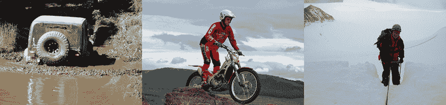
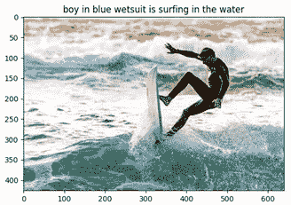
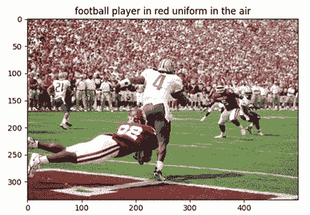
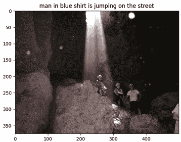
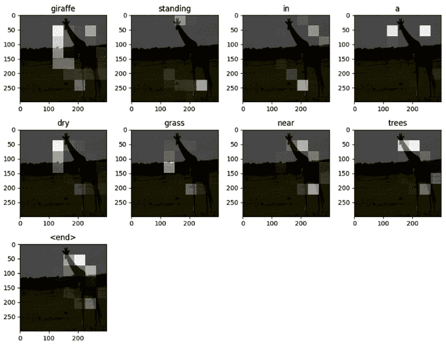

# 第七章：*第七章*：使用 CNN 和 RNN 给图像加上字幕

赋予神经网络描述视觉场景的能力以人类可读的方式，必定是深度学习中最有趣但也最具挑战性的应用之一。主要困难在于，这个问题结合了人工智能的两个主要子领域：**计算机视觉**（**CV**）和**自然语言处理**（**NLP**）。

大多数图像字幕网络的架构使用**卷积神经网络**（**CNN**）来将图像编码为数字格式，以便解码器消费，解码器通常是**递归神经网络**（**RNN**）。这是一种专门用于学习序列数据（如时间序列、视频和文本）的网络。

正如我们在这一章中将看到的，构建具有这些能力的系统的挑战从准备数据开始，我们将在第一个实例中讨论这一点。然后，我们将从头开始实现一个图像字幕解决方案。在第三个实例中，我们将使用这个模型为我们自己的图片生成字幕。最后，在第四个实例中，我们将学习如何在我们的架构中包含注意力机制，以便我们可以理解网络在生成输出字幕中每个单词时看到图像的哪些部分。

相当有趣，你同意吗？

具体来说，在本章中我们将涵盖以下实例：

+   实现可重复使用的图像字幕特征提取器

+   实现图像字幕网络

+   为您自己的照片生成字幕

+   在 COCO 上实现带注意力的图像字幕网络

+   让我们开始吧！

# 技术要求

图像字幕是一个需要大量内存、存储和计算资源的问题。我建议您使用像 AWS 或 FloydHub 这样的云解决方案来运行本章中的实例，除非您有足够强大的硬件。如预期的那样，GPU 对于完成本章中的实例至关重要。在每个实例的“准备就绪”部分，您将找到所需准备的内容。本章的代码在此处可用：[`github.com/PacktPublishing/Tensorflow-2.0-Computer-Vision-Cookbook/tree/master/ch7`](https://github.com/PacktPublishing/Tensorflow-2.0-Computer-Vision-Cookbook/tree/master/ch7)。

点击以下链接查看“代码实战”视频：

[`bit.ly/3qmpVme`](https://bit.ly/3qmpVme)。

# 实现可重复使用的图像字幕特征提取器

创建基于深度学习的图像字幕解决方案的第一步是将数据转换为可以被某些网络使用的格式。这意味着我们必须将图像编码为向量或张量，将文本编码为嵌入，即句子的向量表示。

在本食谱中，我们将实现一个可自定义和可重用的组件，允许我们提前预处理实现图像标题生成器所需的数据，从而节省后续过程中大量时间。

让我们开始吧！

## 准备就绪

我们需要的依赖是`tqdm`（用于显示漂亮的进度条）和`Pillow`（用于使用 TensorFlow 的内置函数加载和处理图像）：

```py
$> pip install Pillow tqdm
```

我们将使用`Flickr8k`数据集，该数据集位于`~/.keras/datasets/flickr8k`文件夹中。

这里是一些示例图像：



图 7.1 – 来自 Flickr8k 的示例图像

有了这些，我们就可以开始了！

## 如何实现……

按照以下步骤创建一个可重用的特征提取器，用于图像标题问题：

1.  导入所有必要的依赖项：

    ```py
    import glob
    import os
    import pathlib
    import pickle
    from string import punctuation
    import numpy as np
    import tqdm
    from tensorflow.keras.applications.vgg16 import *
    from tensorflow.keras.layers import *
    from tensorflow.keras.preprocessing.image import *
    from tensorflow.keras.preprocessing.sequence import \
        pad_sequences
    from tensorflow.keras.preprocessing.text import Tokenizer
    from tensorflow.keras.utils import to_categorical
    from tqdm import tqdm
    ```

1.  定义`ImageCaptionFeatureExtractor`类及其构造函数：

    ```py
    class ImageCaptionFeatureExtractor(object):
        def __init__(self,
                     output_path,
                     start_token='beginsequence',
                     end_token='endsequence',
                     feature_extractor=None,
                     input_shape=(224, 224, 3)):
    ```

1.  接下来，我们必须接收输出存储路径，以及我们将用于分隔文本序列起始和结束的标记。我们还必须将特征提取器的输入形状作为参数。接下来，让我们将这些值存储为成员：

    ```py
            self.input_shape = input_shape
            if feature_extractor is None:
                input = Input(shape=input_shape)
                self.feature_extractor = VGG16(input_ 
                                         tensor=input,
                                       weights='imagenet',
                                       include_top=False)
            else:
                self.feature_extractor = feature_extractor
            self.output_path = output_path
            self.start_token = start_token
            self.end_token = end_token
            self.tokenizer = Tokenizer()
            self.max_seq_length = None
    ```

1.  如果没有接收到任何`feature_extractor`，我们将默认使用`VGG16`。接下来，定义一个公共方法，该方法根据图像路径提取图像的特征：

    ```py
        def extract_image_features(self, image_path):
            image = load_img(image_path,
                           target_size=self.input_shape[:2])
            image = img_to_array(image)
            image = np.expand_dims(image, axis=0)
            image = preprocess_input(image)
            return self.feature_extractor.predict(image)[0]
    ```

1.  为了清理标题，我们必须去除所有标点符号和单个字母的单词（如*a*）。`_clean_captions()`方法执行了这个任务，并且还添加了特殊标记，也就是`self.start_token`和`self.end_token`：

    ```py
        def _clean_captions(self, captions):
            def remove_punctuation(word):
                translation = str.maketrans('', '',
                                            punctuation)
                return word.translate(translation)
            def is_valid_word(word):
                return len(word) > 1 and word.isalpha()
            cleaned_captions = []
            for caption in captions:
                caption = caption.lower().split(' ')
                caption = map(remove_punctuation, caption)
                caption = filter(is_valid_word, caption)
                cleaned_caption = f'{self.start_token} ' \
                                  f'{“ “.join(caption)} ' \
                                  f'{self.end_token}'
                cleaned_captions.append(cleaned_caption)
            return cleaned_captions
    ```

1.  我们还需要计算最长标题的长度，可以通过`_get_max_seq_length()`方法来实现。方法定义如下：

    ```py
        def _get_max_seq_length(self, captions):
            max_sequence_length = -1
            for caption in captions:
                caption_length = len(caption.split(' '))
                max_sequence_length = 
                                max(max_sequence_length,
                                          caption_length)
            return max_sequence_length
    ```

1.  定义一个公共方法`extract_features()`，它接收一个包含图像路径和标题的列表，并利用这些数据从图像和文本序列中提取特征：

    ```py
        def extract_features(self, images_path, captions):
            assert len(images_path) == len(captions)
    ```

1.  请注意，两个列表必须具有相同的大小。接下来的步骤是清理标题，计算最大序列长度，并为所有标题适配一个分词器：

    ```py
            captions = self._clean_captions(captions)
            self.max_seq_length=self._get_max_seq_ 
                                       length(captions) 
            self.tokenizer.fit_on_texts(captions)
    ```

1.  我们将遍历每一对图像路径和标题，从图像中提取特征。然后，我们将在`data_mapping`的`dict`中保存一个条目，将图像 ID（存在于`image_path`中）与相应的视觉特征和清理后的标题相关联：

    ```py
            data_mapping = {}
            print('\nExtracting features...')
            for i in tqdm(range(len(images_path))):
                image_path = images_path[i]
                caption = captions[i]
             feats = self.extract_image_features(image_ path)
                image_id = image_path.split(os.path.sep)[-1]
                image_id = image_id.split('.')[0]
                data_mapping[image_id] = {
                    'features': feats,
                    'caption': caption
                }
    ```

1.  我们将把这个`data_mapping`保存到磁盘，以 pickle 格式存储：

    ```py
            out_path = f'{self.output_path}/data_mapping.pickle'
            with open(out_path, 'wb') as f:
                pickle.dump(data_mapping, f, protocol=4)
    ```

1.  我们将通过创建和存储将在未来输入图像标题网络的序列来完成此方法：

    ```py
            self._create_sequences(data_mapping)
    ```

1.  以下方法创建了用于训练图像标题模型的输入和输出序列（详细说明请见*如何实现……*部分）。我们将从确定输出类别数开始，这个数值是词汇大小加一（以便考虑超出词汇表的标记）。我们还必须定义存储序列的列表：

    ```py
        def _create_sequences(self, mapping):
            num_classes = len(self.tokenizer.word_index) + 1
            in_feats = []
            in_seqs = []
            out_seqs = []
    ```

1.  接下来，我们将迭代每个特征-标题对。我们将把标题从字符串转换为表示句子中单词的数字序列：

    ```py
            print('\nCreating sequences...')
            for _, data in tqdm(mapping.items()):
                feature = data['features']
                caption = data['caption']
                seq = self.tokenizer.texts_to_
                           sequences([caption])
                seq = seq[0]
    ```

1.  接下来，我们将生成与标题中单词数量相同的输入序列。每个输入序列将用于生成序列中的下一个单词。因此，对于给定的索引`i`，输入序列将是到`i-1`的所有元素，而相应的输出序列或标签将是在`i`处的独热编码元素（即下一个单词）。为了确保所有输入序列的长度相同，我们必须对它们进行填充：

    ```py
                for i in range(1, len(seq)):
                    input_seq = seq[:i]
                    input_seq, = 
                       pad_sequences([input_seq],

                         self.max_seq_length)
                    out_seq = seq[i]
                    out_seq = to_categorical([out_seq],

                                           num_classes)[0]
    ```

1.  然后，我们将视觉特征向量、输入序列和输出序列添加到相应的列表中：

    ```py
                    in_feats.append(feature)
                    in_seqs.append(input_seq)
                    out_seqs.append(out_seq)
    ```

1.  最后，我们必须将序列以 pickle 格式写入磁盘：

    ```py
            file_paths = [
                f'{self.output_path}/input_features.pickle',
                f'{self.output_path}/input_sequences.pickle',
                f'{self.output_path}/output_sequences.
                                                     pickle']
            sequences = [in_feats,
                         in_seqs,
                         out_seqs]
            for path, seq in zip(file_paths, sequences):
                with open(path, 'wb') as f:
                    pickle.dump(np.array(seq), f, 
                                protocol=4)
    ```

1.  让我们定义`Flickr8k`图像和标题的路径：

    ```py
    BASE_PATH = (pathlib.Path.home() / '.keras' / 'datasets'       
                                          /'flickr8k')
    IMAGES_PATH = str(BASE_PATH / 'Images')
    CAPTIONS_PATH = str(BASE_PATH / 'captions.txt')
    ```

1.  创建我们刚刚实现的特征提取器类的实例：

    ```py
    extractor = ImageCaptionFeatureExtractor(output_path='.')
    ```

1.  列出`Flickr8k`数据集中的所有图像文件：

    ```py
    image_paths = list(glob.glob(f'{IMAGES_PATH}/*.jpg'))
    ```

1.  读取标题文件的内容：

    ```py
    with open(CAPTIONS_PATH, 'r') as f:
        text = f.read()
        lines = text.split('\n')
    ```

1.  现在，我们必须创建一个映射，将每个图像与多个标题关联起来。键是图像 ID，而值是与该图像相关的所有标题的列表：

    ```py
    mapping = {}
    for line in lines:
        if '.jpg' not in line:
            continue
        tokens = line.split(',', maxsplit=1)
        if len(line) < 2:
            continue
        image_id, image_caption = tokens
        image_id = image_id.split('.')[0]
        captions_per_image = mapping.get(image_id, [])
        captions_per_image.append(image_caption)
        mapping[image_id] = captions_per_image
    ```

1.  我们将仅保留每个图像的一个标题：

    ```py
    captions = []
    for image_path in image_paths:
        image_id = image_path.split('/')[-1].split('.')[0]
        captions.append(mapping[image_id][0])
    ```

1.  最后，我们必须使用我们的提取器生成数据映射和相应的输入序列：

    ```py
    extractor.extract_features(image_paths, captions)
    ```

    这个过程可能需要一些时间。几分钟后，我们应该在输出路径中看到以下文件：

    ```py
    data_mapping.pickle     input_features.pickle   input_sequences.pickle  output_sequences.pickle
    ```

接下来的部分将详细介绍这一切是如何工作的。

## 工作原理如下...

在这个示例中，我们学到了创建良好的图像字幕系统的关键之一是将数据放入适当的格式中。这使得网络能够学习如何用文本描述视觉场景中发生的事情。

有许多方法可以构建图像字幕问题，但最流行和有效的方法是使用每个单词来生成标题中的下一个单词。这样，我们将逐词构造句子，通过每个中间输出作为下一个周期的输入传递。 （这就是**RNNs**的工作原理。要了解更多信息，请参阅*参考*部分。）

你可能想知道如何将视觉信息传递给网络。这就是特征提取步骤至关重要的地方，因为我们将数据集中的每个图像转换为一个数值向量，该向量总结了每张图片中的空间信息。然后，在训练网络时，我们通过每个输入序列传递相同的特征向量。这样，网络将学会将标题中的所有单词与同一图像关联起来。

如果我们不小心，可能会陷入无限循环的单词生成中。我们如何防止这种情况发生？通过使用一个特殊的标记来信号化序列的结束（这意味着网络在遇到这样的标记时应停止生成单词）。在我们的情况下，默认的标记是`endsequence`。

一个类似的问题是如何启动一个序列。我们应该使用哪个词？在这种情况下，我们也必须使用一个特殊的标记（我们的默认值是`beginsequence`）。这个标记充当一个种子，网络将基于它开始生成字幕。

这一切现在听起来可能有点令人困惑，这是因为我们只专注于数据预处理阶段。在本章的剩余食谱中，我们将利用在这里所做的工作来训练许多不同的图像字幕生成器，一切都会变得明了！

## 另请参见

这是一个很好的关于**RNNs**如何工作的解释：[`www.youtube.com/watch?v=UNmqTiOnRfg`](https://www.youtube.com/watch?v=UNmqTiOnRfg)。

# 实现图像字幕生成网络

一个图像字幕生成架构由编码器和解码器组成。编码器是一个**CNN**（通常是一个预训练的模型），它将输入图像转换为数值向量。然后，这些向量与文本序列一起传递给解码器，解码器是一个**RNN**，它将基于这些值学习如何逐步生成对应字幕中的每个单词。

在这个食谱中，我们将实现一个已在`Flickr8k`数据集上训练的图像字幕生成器。我们将利用在*实现可重用的图像字幕特征提取器*食谱中实现的特征提取器。

我们开始吧，好吗？

## 准备工作

在这个食谱中，我们将使用的外部依赖是`Pillow`、`nltk`和`tqdm`。你可以通过以下命令一次性安装它们：

```py
$> pip install Pillow nltk tqdm
```

我们将使用`Flickr8k`数据集，您可以从`~/.keras/datasets/flickr8k`目录中获取它。

以下是一些来自`Flickr8k`数据集的示例图像：


图 7.2 – 来自 Flickr8k 的示例图像

让我们进入下一部分，开始本食谱的实现。

## 如何实现……

按照以下步骤实现基于深度学习的图像字幕生成系统：

1.  首先，我们必须导入所有必需的包：

    ```py
    import glob
    import pathlib
    import pickle
    import numpy as np
    from nltk.translate.bleu_score import corpus_bleu
    from sklearn.model_selection import train_test_split
    from tensorflow.keras.applications.vgg16 import *
    from tensorflow.keras.callbacks import ModelCheckpoint
    from tensorflow.keras.layers import *
    from tensorflow.keras.models import *
    from tensorflow.keras.preprocessing.sequence import \
        pad_sequences
    from ch7.recipe1.extractor import ImageCaptionFeatureExtractor
    ```

1.  定义图像和字幕的路径，以及输出路径，这将是我们存储在本食谱中创建的工件的位置：

    ```py
    BASE_PATH = (pathlib.Path.home() / '.keras' / 'datasets'     
                 /'flickr8k')
    IMAGES_PATH = str(BASE_PATH / 'Images')
    CAPTIONS_PATH = str(BASE_PATH / 'captions.txt')
    OUTPUT_PATH = '.'
    ```

1.  定义一个函数，该函数将加载图像路径及其对应的字幕列表。此实现类似于*步骤* *20*到*22*，来自*实现可重用的图像字幕特征提取器*食谱：

    ```py
    def load_paths_and_captions():
        image_paths = list(glob.glob(f'{IMAGES_PATH}/*.jpg'))
        with open(f'{CAPTIONS_PATH}', 'r') as f:
            text = f.read()
            lines = text.split('\n')
        mapping = {}
        for line in lines:
            if '.jpg' not in line:
                continue
            tokens = line.split(',', maxsplit=1)
            if len(line) < 2:
                continue
            image_id, image_caption = tokens
            image_id = image_id.split('.')[0]
            captions_per_image = mapping.get(image_id, [])
            captions_per_image.append(image_caption)
            mapping[image_id] = captions_per_image
    ```

1.  编译所有字幕：

    ```py
        all_captions = []
        for image_path in image_paths:
            image_id = image_path.split('/')[-
                       1].split('.')[0]
            all_captions.append(mapping[image_id][0])
        return image_paths, all_captions
    ```

1.  定义一个函数，该函数将构建网络的架构，接收词汇表大小、最大序列长度以及编码器的输入形状：

    ```py
    def build_network(vocabulary_size,
                      max_sequence_length,
                      input_shape=(4096,)):
    ```

1.  网络的第一部分接收特征向量并将其通过一个全连接的`ReLU`激活层：

    ```py
        x = Dropout(rate=0.5)(feature_inputs)
        x = Dense(units=256)(x)
        feature_output = ReLU()(x)
    ```

1.  层的第二部分接收文本序列，这些文本序列被转换为数值向量，并训练一个包含 256 个元素的嵌入层。然后，它将该嵌入传递给`LSTM`层：

    ```py
        sequence_inputs = 
                Input(shape=(max_sequence_length,))
        y = Embedding(input_dim=vocabulary_size,
                      output_dim=256,
                      mask_zero=True)(sequence_inputs)
        y = Dropout(rate=0.5)(y)
        sequence_output = LSTM(units=256)(y)
    ```

1.  我们将这两部分的输出连接起来，并通过一个全连接网络传递，输出层的单元数量与词汇表中的单词数相同。通过对该输出进行`Softmax`激活，我们得到一个对应词汇表中某个单词的 one-hot 编码向量：

    ```py
        z = Add()([feature_output, sequence_output])
        z = Dense(units=256)(z)
        z = ReLU()(z)
        z = Dense(units=vocabulary_size)(z)
        outputs = Softmax()(z)
    ```

1.  最后，我们构建模型，传入图像特征和文本序列作为输入，并输出 one-hot 编码向量：

    ```py
        return Model(inputs=[feature_inputs, 
                      sequence_inputs],
                     outputs=outputs)
    ```

1.  定义一个函数，通过使用分词器的内部映射将整数索引转换为单词：

    ```py
    def get_word_from_index(tokenizer, index):
        return tokenizer.index_word.get(index, None)
    ```

1.  定义一个函数来生成标题。它将从将`beginsequence`标记输入到网络开始，网络会迭代构建句子，直到达到最大序列长度或遇到`endsequence`标记：

    ```py
    def produce_caption(model,
                        tokenizer,
                        image,
                        max_sequence_length):
        text = 'beginsequence'
        for _ in range(max_sequence_length):
           sequence = tokenizer.texts_to_sequences([text])[0]
            sequence = pad_sequences([sequence],
                   maxlen=max_sequence_length)
            prediction = model.predict([[image], sequence])
            index = np.argmax(prediction)
            word = get_word_from_index(tokenizer, index)
            if word is None:
                break
            text += f' {word}'
            if word == 'endsequence':
                break
        return text
    ```

1.  定义一个函数来评估模型的表现。首先，我们将为测试数据集中每个图像的特征生成一个标题：

    ```py
    def evaluate_model(model, features, captions, 
                         tokenizer,
                       max_seq_length):
        actual = []
        predicted = []
        for feature, caption in zip(features, captions):
            generated_caption = produce_caption(model,
                                                tokenizer,
                                                feature,
                                         max_seq_length)
            actual.append([caption.split(' ')])
            predicted.append(generated_caption.split(' '))
    ```

1.  接下来，我们将使用不同的权重计算**BLEU**分数。虽然**BLEU**分数超出了本教程的范围，但你可以在*另见*部分找到一篇详细解释的优秀文章。你需要知道的是，它用于衡量生成的标题与一组参考标题的相似度：

    ```py
        for index, weights in enumerate([(1, 0, 0, 0),
                                         (.5, .5, 0, 0),
                                         (.3, .3, .3, 0),
                                         (.25, .25, .25, 
                                            .25)],
                                        start=1):
            b_score = corpus_bleu(actual, predicted, weights)
            print(f'BLEU-{index}: {b_score}')
    ```

1.  加载图像路径和标题：

    ```py
    image_paths, all_captions = load_paths_and_captions()
    ```

1.  创建图像提取模型：

    ```py
    extractor_model = VGG16(weights='imagenet')
    inputs = extractor_model.inputs
    outputs = extractor_model.layers[-2].output
    extractor_model = Model(inputs=inputs, outputs=outputs)
    ```

1.  创建图像标题特征提取器（传入我们在*步骤 15*中创建的常规图像提取器），并用它从数据中提取序列：

    ```py
    extractor = ImageCaptionFeatureExtractor(
        feature_extractor=extractor_model,
        output_path=OUTPUT_PATH)
    extractor.extract_features(image_paths, all_captions)
    ```

1.  加载我们在*步骤 16*中创建的已序列化输入和输出序列：

    ```py
    pickled_data = []
    for p in [f'{OUTPUT_PATH}/input_features.pickle',
              f'{OUTPUT_PATH}/input_sequences.pickle',
              f'{OUTPUT_PATH}/output_sequences.pickle']:
        with open(p, 'rb') as f:
            pickled_data.append(pickle.load(f))
    input_feats, input_seqs, output_seqs = pickled_data
    ```

1.  使用 80% 的数据进行训练，20% 用于测试：

    ```py
    (train_input_feats, test_input_feats,
     train_input_seqs, test_input_seqs,
     train_output_seqs,
     test_output_seqs) = train_test_split(input_feats,
                                          input_seqs,
                                          output_seqs,
                                          train_size=0.8,
                                          random_state=9)
    ```

1.  实例化并编译模型。因为最终这是一个多类分类问题，我们将使用`categorical_crossentropy`作为损失函数：

    ```py
    vocabulary_size = len(extractor.tokenizer.word_index) + 1
    model = build_network(vocabulary_size,
                          extractor.max_seq_length)
    model.compile(loss='categorical_crossentropy',
                  optimizer='adam')
    ```

1.  由于训练过程非常消耗资源，并且网络通常在早期就能给出最佳结果，因此我们创建了一个`ModelCheckpoint`回调，它将存储具有最低验证损失的模型：

    ```py
    checkpoint_path = ('model-ep{epoch:03d}-
                         loss{loss:.3f}-'
                       'val_loss{val_loss:.3f}.h5')
    checkpoint = ModelCheckpoint(checkpoint_path,
                                 monitor='val_loss',
                                 verbose=1,
                                 save_best_only=True,
                                 mode='min')
    ```

1.  在 30 个训练周期内拟合模型。请注意，我们必须传入两组输入或特征，但只有一组标签：

    ```py
    EPOCHS = 30
    model.fit(x=[train_input_feats, train_input_seqs],
              y=train_output_seqs,
              epochs=EPOCHS,
              callbacks=[checkpoint],
              validation_data=([test_input_feats,test_input_
                                                     seqs],
                                           test_output_seqs))
    ```

1.  加载最佳模型。这个模型可能会因运行而异，但在本教程中，它存储在`model-ep003-loss3.847-val_loss4.328.h5`文件中：

    ```py
    model = load_model('model-ep003-loss3.847-
                       val_loss4.328.h5')
    ```

1.  加载数据映射，其中包含所有特征与真实标题的配对。将特征和映射提取到不同的集合中：

    ```py
    with open(f'{OUTPUT_PATH}/data_mapping.pickle', 'rb') as f:
        data_mapping = pickle.load(f)
    feats = [v['features'] for v in data_mapping.values()]
    captions = [v['caption'] for v in data_mapping.values()]
    ```

1.  评估模型：

    ```py
    evaluate_model(model,
                   features=feats,
                   captions=captions,
                   tokenizer=extractor.tokenizer,
                   max_seq_length=extractor.max_seq_length)
    ```

    这个步骤可能需要一些时间。最终，你会看到类似这样的输出：

    ```py
    BLEU-1: 0.35674398077995173
    BLEU-2: 0.17030332240763874
    BLEU-3: 0.12170338107914261
    BLEU-4: 0.05493477725774873
    ```

训练图像标题生成器并不是一项简单的任务。然而，通过按正确的顺序执行合适的步骤，我们成功创建了一个表现不错的模型，并且在测试集上表现良好，基于前面代码块中显示的**BLEU**分数。继续阅读下一部分，了解它是如何工作的！

## 它是如何工作的……

在这个教程中，我们从零开始实现了一个图像描述生成网络。尽管一开始看起来可能有些复杂，但我们必须记住，这只是一个编码器-解码器架构的变种，类似于我们在*第五章*《使用自编码器减少噪声》和*第六章*《生成模型与对抗攻击》中研究过的架构。

在这种情况下，编码器只是一个完全连接的浅层网络，将我们从 ImageNet 的预训练模型中提取的特征映射到一个包含 256 个元素的向量。

另一方面，解码器并不是使用转置卷积，而是使用一个**RNN**，它接收文本序列（映射为数字向量）和图像特征，将它们连接成一个由 512 个元素组成的长序列。

网络的训练目标是根据前面时间步生成的所有词，预测句子中的下一个词。注意，在每次迭代中，我们传递的是与图像对应的相同特征向量，因此网络会学习按特定顺序映射某些词，以描述编码在该向量中的视觉数据。

网络的输出是独热编码，这意味着只有与网络认为应该出现在句子中的下一个词对应的位置包含 1，其余位置包含 0。

为了生成描述，我们遵循类似的过程。当然，我们需要某种方式告诉模型开始生成词汇。为此，我们将`beginsequence`标记传递给网络，并不断迭代，直到达到最大序列长度，或模型输出`endsequence`标记。记住，我们将每次迭代的输出作为下一次迭代的输入。

一开始这可能看起来有些困惑和繁琐，但现在你已经掌握了解决任何图像描述问题所需的构建块！

## 参见

如果你希望全面理解**BLEU**分数，可以参考这篇精彩的文章：[`machinelearningmastery.com/calculate-bleu-score-for-text-python/`](https://machinelearningmastery.com/calculate-bleu-score-for-text-python/)。

# 为你的照片生成描述

训练一个优秀的图像描述生成系统只是整个过程的一部分。为了实际使用它，我们必须执行一系列的步骤，类似于我们在训练阶段执行的操作。

在这个教程中，我们将使用一个训练好的图像描述生成网络来生成新图像的文字描述。

让我们开始吧！

## 准备工作

虽然在这个特定的教程中我们不需要外部依赖，但我们需要访问一个训练好的图像描述生成网络，并且需要清理过的描述文本来对其进行训练。强烈建议你在开始这个教程之前，先完成*实现可复用的图像描述特征提取器*和*实现图像描述生成网络*的教程。

你准备好了吗？让我们开始描述吧！

## 如何做……

按照以下步骤生成自己图像的标题：

1.  和往常一样，让我们首先导入必要的依赖项：

    ```py
    import glob
    import pickle
    import matplotlib.pyplot as plt
    import numpy as np
    from tensorflow.keras.applications.vgg16 import *
    from tensorflow.keras.models import *
    from tensorflow.keras.preprocessing.sequence import \
        pad_sequences
    from tensorflow.keras.preprocessing.text import Tokenizer
    from ch7.recipe1.extractor import ImageCaptionFeatureExtractor
    ```

1.  定义一个函数，将整数索引转换为分词器映射中的对应单词：

    ```py
    def get_word_from_index(tokenizer, index):
        return tokenizer.index_word.get(index, None)
    ```

1.  定义`produce_caption()`函数，该函数接受标题生成模型、分词器、要描述的图像以及生成文本描述所需的最大序列长度：

    ```py
    def produce_caption(model,
                        tokenizer,
                        image,
                        max_sequence_length):
        text = 'beginsequence'
        for _ in range(max_sequence_length):
           sequence = tokenizer.texts_to_sequences([text])[0]
           sequence = pad_sequences([sequence],
                                 maxlen=max_sequence_length)
            prediction = model.predict([[image], sequence])
            index = np.argmax(prediction)
            word = get_word_from_index(tokenizer, index)
            if word is None:
                break
            text += f' {word}'
            if word == 'endsequence':
                break
        return text
    ```

    注意，我们必须持续生成单词，直到遇到`endsequence`标记或达到最大序列长度。

1.  定义一个预训练的**VGG16**网络，我们将其用作图像特征提取器：

    ```py
    extractor_model = VGG16(weights='imagenet')
    inputs = extractor_model.inputs
    outputs = extractor_model.layers[-2].output
    extractor_model = Model(inputs=inputs, outputs=outputs)
    ```

1.  将图像提取器传递给`ImageCaptionFeatureExtractor()`的一个实例：

    ```py
    extractor = ImageCaptionFeatureExtractor(
        feature_extractor=extractor_model)
    ```

1.  加载我们用于训练模型的清理过的标题。我们需要它们来拟合*步骤 7*中的分词器：

    ```py
    with open('data_mapping.pickle', 'rb') as f:
        data_mapping = pickle.load(f)
    captions = [v['caption'] for v in 
                data_mapping.values()]
    ```

1.  实例化`Tokenizer()`并将其拟合到所有标题。还需计算最大序列长度：

    ```py
    tokenizer = Tokenizer()
    tokenizer.fit_on_texts(captions)
    max_seq_length = extractor._get_max_seq_length(captions)
    ```

1.  加载训练好的网络（在本例中，网络名称为`model-ep003-loss3.847-val_loss4.328.h5`）：

    ```py
    model = load_model('model-ep003-loss3.847-
                         val_loss4.328.h5')
    ```

1.  遍历当前目录中的所有测试图像，提取相应的数字特征：

    ```py
    for idx, image_path in enumerate(glob.glob('*.jpg'), 
                                       start=1):
        img_feats = (extractor
                     .extract_image_features(image_path))
    ```

1.  生成标题并移除`beginsequence`和`endsequence`特殊标记：

    ```py
        description = produce_caption(model,
                                      tokenizer,
                                      img_feats,
                                      max_seq_length)
        description = (description
                       .replace('beginsequence', '')
                       .replace('endsequence', ''))
    ```

1.  打开图像，将生成的标题作为其标题并保存：

    ```py
        image = plt.imread(image_path)
        plt.imshow(image)
        plt.title(description)
        plt.savefig(f'{idx}.jpg')
    ```

    这是一个图像，网络在生成适当的标题方面表现得非常好：



图 7.3 – 我们可以看到，标题非常接近实际发生的情况：

这是另一个例子，尽管网络在技术上是正确的，但它的准确性可以更高：



图 7.4 – 一名穿红色制服的足球运动员确实在空中，但还发生了更多的事情

最后，这里有一个网络完全无能为力的例子：



图 7.5 – 网络无法描述这一场景

这样，我们已经看到模型在一些图像上的表现不错，但仍有提升空间。我们将在下一节深入探讨。

## 它是如何工作的……

在本次配方中，我们了解到图像标题生成是一个困难的问题，且严重依赖于许多因素。以下是一些因素：

+   一个训练良好的**CNN**用于提取高质量的视觉特征：

+   为每个图像提供一组丰富的描述性标题：

+   具有足够容量的嵌入，能够以最小的损失编码词汇的表现力：

+   一个强大的**RNN**来学习如何将这一切组合在一起：

尽管存在这些明显的挑战，在这个教程中，我们使用了一个在 `Flickr8k` 数据集上训练的网络来生成新图像的标注。我们遵循的过程与我们训练系统时实施的过程类似：首先，我们必须将图像转换为特征向量。然后，我们需要对词汇表进行分词器拟合，获取适当的机制，以便能够将序列转换为人类可读的单词。最后，我们逐字拼接标注，同时传递图像特征和我们已经构建的序列。那么，我们如何知道何时停止呢？我们有两个停止标准：

+   标注达到了最大序列长度。

+   网络遇到了 `endsequence` 标记。

最后，我们在多张图片上测试了我们的解决方案，结果不一。在某些情况下，网络能够生成非常精确的描述，而在其他情况下，生成的标注则稍显模糊。在最后一个示例中，网络完全没有达成预期，这清楚地表明了仍有很大的改进空间。

如果你想查看其他带标注的图像，请查阅官方仓库：[`github.com/PacktPublishing/Tensorflow-2.0-Computer-Vision-Cookbook/tree/master/ch7/recipe3`](https://github.com/PacktPublishing/Tensorflow-2.0-Computer-Vision-Cookbook/tree/master/ch7/recipe3)。

# 在 COCO 上实现带注意力机制的图像标注网络

理解图像标注网络如何生成描述的一个好方法是向架构中添加一个注意力组件。这使我们能够看到在生成每个单词时，网络注视图像的哪些部分。

在本教程中，我们将在更具挑战性的 **常见物体上下文** (**COCO**) 数据集上训练一个端到端的图像标注系统。我们还将为网络配备注意力机制，以提高其性能，并帮助我们理解其内部推理过程。

这是一个较长且复杂的教程，但不用担心！我们将逐步进行。如果你想深入了解支撑该实现的理论，请查看 *另请参阅* 部分。

## 准备就绪

尽管我们将使用 `COCO` 数据集，但你无需提前做任何准备，因为我们将在教程中下载它（不过，你可以在这里了解更多关于这个开创性数据集的信息：https://cocodataset.org/#home）。

以下是 `COCO` 数据集中的一个示例：


](img/B14768_07_006.jpg)

图 7.6 – 来自 COCO 的示例图片

让我们开始工作吧！

## 如何实现…

按照以下步骤完成这个教程：

1.  导入所有必要的依赖项：

    ```py
    import json
    import os
    import time
    import matplotlib.pyplot as plt
    import numpy as np
    import tensorflow as tf
    from sklearn.model_selection import train_test_split
    from sklearn.utils import shuffle
    from tensorflow.keras.applications.inception_v3 import *
    from tensorflow.keras.layers import *
    from tensorflow.keras.losses import \
        SparseCategoricalCrossentropy
    from tensorflow.keras.models import Model
    from tensorflow.keras.optimizers import Adam
    from tensorflow.keras.preprocessing.sequence import \
        pad_sequences
    from tensorflow.keras.preprocessing.text import Tokenizer
    from tensorflow.keras.utils import get_file
    ```

1.  为 `tf.data.experimental.AUTOTUNE` 定义一个别名：

    ```py
    AUTOTUNE = tf.data.experimental.AUTOTUNE
    ```

1.  定义一个函数来加载图像。它必须返回图像及其路径：

    ```py
    def load_image(image_path):
        image = tf.io.read_file(image_path)
        image = tf.image.decode_jpeg(image, channels=3)
        image = tf.image.resize(image, (299, 299))
        image = preprocess_input(image)
        return image, image_path
    ```

1.  定义一个函数来获取最大序列长度。这将在稍后使用：

    ```py
    def get_max_length(tensor):
        return max(len(t) for t in tensor)
    ```

1.  为图像标注网络定义一个函数，从磁盘加载图像（存储为 `NumPy` 格式）：

    ```py
    def load_image_and_caption(image_name, caption):
        image_name = image_name.decode('utf-8').split('/')
                                          [-1]
        image_tensor = np.load(f'./{image_name}.npy')
        return image_tensor, caption
    ```

1.  使用模型子类化实现**巴赫达努的注意力机制**：

    ```py
    class BahdanauAttention(Model):
        def __init__(self, units):
            super(BahdanauAttention, self).__init__()
            self.W1 = Dense(units)
            self.W2 = Dense(units)
            self.V = Dense(1)
    ```

1.  前面的代码块定义了网络层。现在，我们在`call()`方法中定义前向传播：

    ```py
        def call(self, features, hidden):
            hidden_with_time_axis = tf.expand_dims(hidden, 
                                                     1)
            score = tf.nn.tanh(self.W1(features) +
                            self.W2(hidden_with_time_axis))
            attention_w = tf.nn.softmax(self.V(score), 
                                         axis=1)
            ctx_vector = attention_w * features
            ctx_vector = tf.reduce_sum(ctx_vector, axis=1)
            return ctx_vector, attention_w
    ```

1.  定义图像编码器。这只是一个`ReLU`：

    ```py
    class CNNEncoder(Model):
        def __init__(self, embedding_dim):
            super(CNNEncoder, self).__init__()
            self.fc = Dense(embedding_dim)
        def call(self, x):
            x = self.fc(x)
            x = tf.nn.relu(x)
            return x
    ```

1.  定义解码器。它是一个`GRU`和注意力机制，学习如何从视觉特征向量和文本输入序列中生成标题：

    ```py
    class RNNDecoder(Model):
        def __init__(self, embedding_size, units, 
                         vocab_size):
            super(RNNDecoder, self).__init__()
            self.units = units
            self.embedding = Embedding(vocab_size, 
                                        embedding_size)
            self.gru = GRU(self.units,
                           return_sequences=True,
                           return_state=True,
                           recurrent_initializer='glorot_
                           uniform')
            self.fc1 = Dense(self.units)
            self.fc2 = Dense(vocab_size)
            self.attention = BahdanauAttention(self.units)
    ```

1.  现在我们已经定义了**RNN**架构中的各个层，接下来实现前向传播。首先，我们必须通过注意力子网络传递输入：

    ```py
        def call(self, x, features, hidden):
            context_vector, attention_weights = \
                self.attention(features, hidden)
    ```

1.  然后，我们必须将输入序列（`x`）通过嵌入层，并将其与从注意力机制中获得的上下文向量进行连接：

    ```py
            x = self.embedding(x)
            expanded_context = tf.expand_dims(context_vector, 
                                               1)
            x = Concatenate(axis=-1)([expanded_context, x])
    ```

1.  接下来，我们必须将合并后的张量传递给`GRU`层，然后通过全连接层。这样返回的是输出序列、状态和注意力权重：

    ```py
            output, state = self.gru(x)
            x = self.fc1(output)
            x = tf.reshape(x, (-1, x.shape[2]))
            x = self.fc2(x)
    ```

1.  最后，我们必须定义一个方法来重置隐藏状态：

    ```py
        def reset_state(self, batch_size):
            return tf.zeros((batch_size, self.units))
    ```

1.  定义`ImageCaptionerClass`。构造函数实例化基本组件，包括编码器、解码器、分词器、以及训练整个系统所需的优化器和损失函数：

    ```py
    class ImageCaptioner(object):
        def __init__(self, embedding_size, units, 
                     vocab_size,
                     tokenizer):
            self.tokenizer = tokenizer
            self.encoder = CNNEncoder(embedding_size)
            self.decoder = RNNDecoder(embedding_size, 
                                        units,
                                      vocab_size)
            self.optimizer = Adam()
            self.loss = SparseCategoricalCrossentropy(
                from_logits=True,
                reduction='none')
    ```

1.  创建一个方法来计算损失函数：

    ```py
        def loss_function(self, real, predicted):
            mask = tf.math.logical_not(tf.math.equal(real, 
                                                   0))
            _loss = self.loss(real, predicted)
            mask = tf.cast(mask, dtype=_loss.dtype)
            _loss *= mask
            return tf.reduce_mean(_loss)
    ```

1.  接下来，定义一个函数来执行单个训练步骤。我们将从创建隐藏状态和输入开始，输入仅是包含`<start>`标记索引的单一序列批次，`<start>`是一个特殊元素，用于指示句子的开始：

    ```py
        @tf.function
        def train_step(self, image_tensor, target):
            loss = 0
            hidden = 
           self.decoder.reset_state(target.shape[0])
            start_token_idx = 
           self.tokenizer.word_index['<start>']
            init_batch = [start_token_idx] * 
            target.shape[0]
            decoder_input = tf.expand_dims(init_batch, 1)
    ```

1.  现在，我们必须编码图像张量。然后，我们将反复将结果特征传递给解码器，连同到目前为止的输出序列和隐藏状态。关于**RNNs**如何工作的更深层次解释，请参考*另见*部分：

    ```py
          with tf.GradientTape() as tape:
                features = self.encoder(image_tensor)
                for i in range(1, target.shape[1]):
                    preds, hidden, _ = 
                    self.decoder(decoder_input,
                                features,
                                 hidden)
                    loss += self.loss_function(target[:, i],
                                               preds)
                    decoder_input = 
                           tf.expand_dims(target[:, i],1)
    ```

1.  请注意，在前面的代码块中我们在每个时间步计算了损失。为了获得总损失，我们必须计算平均值。为了让网络真正学习，我们必须通过反向传播计算梯度，并通过优化器应用这些梯度：

    ```py
            total_loss = loss / int(target.shape[1])
            trainable_vars = (self.encoder.trainable_
                                variables +
                              self.decoder.trainable_
                                 variables)
            gradients = tape.gradient(loss, trainable_vars)
            self.optimizer.apply_gradients(zip(gradients,
                                          trainable_vars))
            return loss, total_loss
    ```

1.  本类中的最后一个方法负责训练系统：

    ```py
        def train(self, dataset, epochs, num_steps):
            for epoch in range(epochs):
                start = time.time()
                total_loss = 0
                for batch, (image_tensor, target) \
                        in enumerate(dataset):
                    batch_loss, step_loss = \
                        self.train_step(image_tensor, target)
                    total_loss += step_loss
    ```

1.  每经过 100 个 epoch，我们将打印损失。在每个 epoch 结束时，我们还将打印该 epoch 的损失和已用时间：

    ```py
                    if batch % 100 == 0:
                        loss = batch_loss.numpy()
                        loss = loss / int(target.shape[1])
                        print(f'Epoch {epoch + 1}, batch 
                                                 {batch},'
                              f' loss {loss:.4f}')
                print(f'Epoch {epoch + 1},'
                      f' loss {total_loss / 
                               num_steps:.6f}')
                epoch_time = time.time() - start
                print(f'Time taken: {epoch_time} seconds. 
                       \n')
    ```

1.  下载并解压`COCO`数据集的注释文件。如果它们已经在系统中，只需存储文件路径：

    ```py
    INPUT_DIR = os.path.abspath('.')
    annots_folder = '/annotations/'
    if not os.path.exists(INPUT_DIR + annots_folder):
        origin_url = ('http://images.cocodataset.org/
                annotations''/annotations_trainval2014.zip')
        cache_subdir = os.path.abspath('.')
        annots_zip = get_file('all_captions.zip',
                              cache_subdir=cache_subdir,
                              origin=origin_url,
                              extract=True)
        annots_file = (os.path.dirname(annots_zip) +
                      '/annotations/captions_train2014.json')
        os.remove(annots_zip)
    else:
        annots_file = (INPUT_DIR +
                      '/annotations/captions_train2014.json')
    ```

1.  下载并解压`COCO`数据集的图像文件。如果它们已经在系统中，只需存储文件路径：

    ```py
    image_folder = '/train2014/'
    if not os.path.exists(INPUT_DIR + image_folder):
        origin_url = ('http://images.cocodataset.org/zips/'
                      'train2014.zip')
        cache_subdir = os.path.abspath('.')
        image_zip = get_file('train2014.zip',
                             cache_subdir=cache_subdir,
                             origin=origin_url,
                             extract=True)
        PATH = os.path.dirname(image_zip) + image_folder
        os.remove(image_zip)
    else:
        PATH = INPUT_DIR + image_folder
    ```

1.  加载图像路径和标题。我们必须将特殊的`<start>`和`<end>`标记添加到每个标题中，以便它们包含在我们的词汇表中。这些特殊标记使我们能够分别指定序列的开始和结束位置：

    ```py
    with open(annots_file, 'r') as f:
        annotations = json.load(f)
    captions = []
    image_paths = []
    for annotation in annotations['annotations']:
        caption = '<start>' + annotation['caption'] + ' <end>'
        image_id = annotation['image_id']
        image_path = f'{PATH}COCO_train2014_{image_id:012d}.jpg'
        image_paths.append(image_path)
        captions.append(caption)
    ```

1.  由于`COCO`数据集庞大，训练一个模型需要很长时间，我们将选择 30,000 张图像及其对应的标题作为随机样本：

    ```py
    train_captions, train_image_paths = shuffle(captions,
                                            image_paths, 
                                          random_state=42)
    SAMPLE_SIZE = 30000
    train_captions = train_captions[:SAMPLE_SIZE]
    train_image_paths = train_image_paths[:SAMPLE_SIZE]
    train_images = sorted(set(train_image_paths))
    ```

1.  我们使用`InceptionV3`的预训练实例作为我们的图像特征提取器：

    ```py
    feature_extractor = InceptionV3(include_top=False,
                                    weights='imagenet')
    feature_extractor = Model(feature_extractor.input,
                              feature_extractor.layers[-
                                            1].output)
    ```

1.  创建一个 `tf.data.Dataset`，将图像路径映射到张量。使用它遍历我们样本中的所有图像，将它们转换为特征向量，并将其保存为 `NumPy` 数组。这将帮助我们在将来节省内存：

    ```py
    BATCH_SIZE = 8
    image_dataset = (tf.data.Dataset
                     .from_tensor_slices(train_images)
                     .map(load_image, 
                         num_parallel_calls=AUTOTUNE)
                     .batch(BATCH_SIZE))
    for image, path in image_dataset:
        batch_features = feature_extractor.predict(image)
        batch_features = tf.reshape(batch_features,
                                 (batch_features.shape[0],
                                     -1,
                                batch_features.shape[3]))
        for batch_feature, p in zip(batch_features, path):
            feature_path = p.numpy().decode('UTF-8')
            image_name = feature_path.split('/')[-1]
            np.save(f'./{image_name}', batch_feature.numpy())
    ```

1.  在我们标题中的前 5,000 个单词上训练一个分词器。然后，将每个文本转换为数字序列，并进行填充，使它们的大小一致。同时，计算最大序列长度：

    ```py
    top_k = 5000
    filters = '!”#$%&()*+.,-/:;=?@[\]^_`{|}~ '
    tokenizer = Tokenizer(num_words=top_k,
                          oov_token='<unk>',
                          filters=filters)
    tokenizer.fit_on_texts(train_captions)
    tokenizer.word_index['<pad>'] = 0
    tokenizer.index_word[0] = '<pad>'
    train_seqs = tokenizer.texts_to_sequences(train_captions)
    captions_seqs = pad_sequences(train_seqs, 
                                  padding='post')
    max_length = get_max_length(train_seqs)
    ```

1.  我们将使用 20% 的数据来测试模型，其余 80% 用于训练：

    ```py
    (images_train, images_val, caption_train, caption_val) = \
        train_test_split(train_img_paths,
                         captions_seqs,
                         test_size=0.2,
                         random_state=42)
    ```

1.  我们将一次加载 64 张图像的批次（以及它们的标题）。请注意，我们使用的是 *第 5 步* 中定义的 `load_image_and_caption()` 函数，它读取与图像对应的特征向量，这些向量以 `NumPy` 格式存储。此外，由于该函数在 `NumPy` 层面工作，我们必须通过 `tf.numpy_function` 将其包装，以便它能作为有效的 TensorFlow 函数在 `map()` 方法中使用：

    ```py
    BATCH_SIZE = 64
    BUFFER_SIZE = 1000
    dataset = (tf.data.Dataset
               .from_tensor_slices((images_train, 
                                    caption_train))
               .map(lambda i1, i2:
                    tf.numpy_function(
                        load_image_and_caption,
                        [i1, i2],
                        [tf.float32, tf.int32]),
                    num_parallel_calls=AUTOTUNE)
               .shuffle(BUFFER_SIZE)
               .batch(BATCH_SIZE)
               .prefetch(buffer_size=AUTOTUNE))
    ```

1.  让我们实例化一个 `ImageCaptioner`。嵌入层将包含 256 个元素，解码器和注意力模型的单元数将是 512。词汇表大小为 5,001。最后，我们必须传入 *第 27 步* 中拟合的分词器：

    ```py
    image_captioner = ImageCaptioner(embedding_size=256,
                                     units=512,
                                     vocab_size=top_k + 1,
                                     tokenizer=tokenizer)
    EPOCHS = 30
    num_steps = len(images_train) // BATCH_SIZE
    image_captioner.train(dataset, EPOCHS, num_steps)
    ```

1.  定义一个函数，用于在图像上评估图像标题生成器。它必须接收编码器、解码器、分词器、待描述的图像、最大序列长度以及注意力向量的形状。我们将从创建一个占位符数组开始，这里将存储构成注意力图的子图：

    ```py
    def evaluate(encoder, decoder, tokenizer, image, 
                  max_length,
                 attention_shape):
        attention_plot = np.zeros((max_length,
                                   attention_shape))
    ```

1.  接下来，我们必须初始化隐藏状态，提取输入图像的特征，并将其传递给编码器。我们还必须通过创建一个包含 `<start>` 标记索引的单一序列来初始化解码器输入：

    ```py
        hidden = decoder.reset_state(batch_size=1)
        temp_input = tf.expand_dims(load_image(image)[0], 
                                        0)
        image_tensor_val = feature_extractor(temp_input)
        image_tensor_val = tf.reshape(image_tensor_val,
                               (image_tensor_val.shape[0],
                                       -1,
                              image_tensor_val.shape[3]))
        feats = encoder(image_tensor_val)
        start_token_idx = tokenizer.word_index['<start>']
        dec_input = tf.expand_dims([start_token_idx], 0)
        result = []
    ```

1.  现在，让我们构建标题，直到达到最大序列长度或遇到 `<end>` 标记：

    ```py
        for i in range(max_length):
            (preds, hidden, attention_w) = \
                decoder(dec_input, feats, hidden)
            attention_plot[i] = tf.reshape(attention_w,
                                           (-1,)).numpy()
            pred_id = tf.random.categorical(preds,
                                         1)[0][0].numpy()
            result.append(tokenizer.index_word[pred_id])
            if tokenizer.index_word[pred_id] == '<end>':
                return result, attention_plot
            dec_input = tf.expand_dims([pred_id], 0)
        attention_plot = attention_plot[:len(result), :]
        return result, attention_plot
    ```

1.  请注意，对于每个单词，我们都会更新 `attention_plot`，并返回解码器的权重。

1.  让我们定义一个函数，用于绘制网络对每个单词的注意力。它接收图像、构成标题的单个单词列表（`result`）、由 `evaluate()` 返回的 `attention_plot`，以及我们将存储图形的输出路径：

    ```py
    def plot_attention(image, result,
                       attention_plot, output_path):
        tmp_image = np.array(load_image(image)[0])
        fig = plt.figure(figsize=(10, 10))
    ```

1.  我们将遍历每个单词，创建相应注意力图的子图，并以其链接的特定单词为标题：

    ```py
        for l in range(len(result)):
            temp_att = np.resize(attention_plot[l], (8, 8))
            ax = fig.add_subplot(len(result) // 2,
                                 len(result) // 2,
                                 l + 1)
            ax.set_title(result[l])
            image = ax.imshow(tmp_image)
            ax.imshow(temp_att,
                      cmap='gray',
                      alpha=0.6,
                      extent=image.get_extent())
    ```

1.  最后，我们可以保存完整的图：

    ```py
        plt.tight_layout()
        plt.show()
        plt.savefig(output_path)
    ```

1.  在验证集上评估网络的随机图像：

    ```py
    attention_features_shape = 64
    random_id = np.random.randint(0, len(images_val))
    image = images_val[random_id]
    ```

1.  构建并清理实际（真实标签）标题：

    ```py
    actual_caption = ' '.join([tokenizer.index_word[i]
                             for i in caption_val[random_id]
                               if i != 0])
    actual_caption = (actual_caption
                      .replace('<start>', '')
                      .replace('<end>', ''))
    ```

1.  为验证图像生成标题：

    ```py
    result, attention_plot = evaluate(image_captioner               
                                    encoder,
                       image_captioner.decoder,
                                      tokenizer,
                                      image,
                                      max_length,
                              attention_feats_shape)
    ```

1.  构建并清理预测的标题：

    ```py
    predicted_caption = (' '.join(result)
                         .replace('<start>', '')
                         .replace('<end>', '')) 
    ```

1.  打印真实标签和生成的标题，然后将注意力图保存到磁盘：

    ```py
    print(f'Actual caption: {actual_caption}')
    print(f'Predicted caption: {predicted_caption}')
    output_path = './attention_plot.png'
    plot_attention(image, result, attention_plot, output_path)
    ```

1.  在以下代码块中，我们可以欣赏到真实标题与模型输出标题之间的相似性：

    ```py
    Actual caption: a lone giraffe stands in the midst of a grassy area
    Predicted caption: giraffe standing in a dry grass near trees
    ```

    现在，让我们来看一下注意力图：



图 7.7 – 注意力图

注意在生成每个单词时，网络关注的区域。较浅的方块表示更多的关注被放在这些像素上。例如，要生成单词*giraffe*，网络关注了照片中长颈鹿的周围环境。此外，我们可以看到，当网络生成单词*grass*时，它关注了长颈鹿腿部的草地部分。难道这不令人惊讶吗？

我们将在*它是如何工作的...*部分中详细讨论这个问题。

它是如何工作的…

在这个食谱中，我们实现了一个更完整的图像描述系统，这一次使用了挑战更大的`COCO`数据集，该数据集不仅比`Flickr8k`大几个数量级，而且更加多样化，因此网络理解起来更为困难。

然而，我们通过为网络提供一个注意力机制，使其拥有优势，这一机制灵感来自 Dzmitry Bahdanau 提出的令人印象深刻的突破（更多细节请参见*另见*部分）。这个功能赋予模型进行软搜索的能力，查找与预测目标词相关的源描述部分，简而言之，就是在输出句子中生成最佳的下一个词。这种注意力机制相对于传统方法具有优势，传统方法是使用固定长度的向量（如我们在*实现图像描述网络*食谱中所做的那样），解码器从中生成输出句子。这样表示的问题在于，当提高性能时，它往往会成为瓶颈。

此外，注意力机制使我们能够以更直观的方式理解网络生成描述时的思考过程。

因为神经网络是复杂的软件（通常像一个黑箱），使用视觉技术来检查其内部工作原理是我们可以利用的一种很好的工具，有助于我们在训练、微调和优化过程中。

另见

在这个食谱中，我们使用模型子类化模式实现了我们的架构，你可以在这里阅读更多内容：[`www.tensorflow.org/guide/keras/custom_layers_and_models`](https://www.tensorflow.org/guide/keras/custom_layers_and_models)。

请查看以下链接，复习一下**RNN**的内容：[`www.youtube.com/watch?v=UNmqTiOnRfg`](https://www.youtube.com/watch?v=UNmqTiOnRfg)。

最后，我强烈鼓励你阅读 Dzmitry Bahdanau 关于我们刚刚实现和使用的注意力机制的论文：[`arxiv.org/abs/1409.0473`](https://arxiv.org/abs/1409.0473)。
