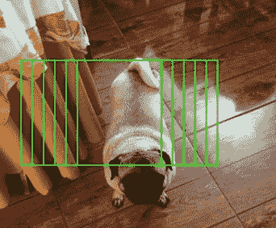
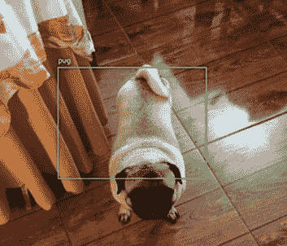
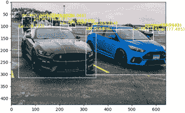
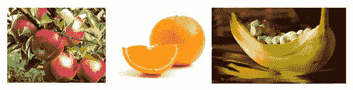
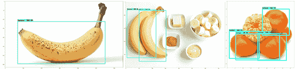
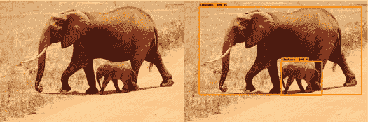
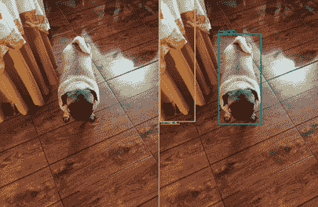

# 第九章：*第九章*：通过目标检测在图像中定位元素

目标检测是计算机视觉中最常见但最具挑战性的任务之一。它是图像分类的自然演变，我们的目标是识别图像中的内容。另一方面，目标检测不仅关注图像的内容，还关注数字图像中感兴趣元素的位置。

与计算机视觉中的许多其他知名任务一样，目标检测已经通过各种技术得到解决，从简单的解决方案（如目标匹配）到基于机器学习的解决方案（如 Haar 级联）。尽管如此，如今最有效的检测器都由深度学习驱动。

从零开始实现最先进的目标检测器（如**YOLO（一次看全）**（**YOLO**）和**快速区域卷积神经网络**（**Fast R-CNN**））是一个非常具有挑战性的任务。然而，我们可以利用许多预训练的解决方案，不仅可以进行预测，还可以从零开始训练我们自己的模型，正如本章所介绍的那样。

这里列出了我们将要快速处理的配方：

+   使用图像金字塔和滑动窗口创建目标检测器

+   使用 YOLOv3 进行目标检测

+   使用 TensorFlow 的目标检测**应用程序编程接口**（**API**）训练你自己的目标检测器

+   使用**TensorFlow Hub**（**TFHub**）进行目标检测

# 技术要求

鉴于目标检测器的复杂性，拥有**图形处理单元**（**GPU**）是个不错的选择。你可以使用许多云服务商来运行本章中的配方，我个人最喜欢的是 FloydHub，但你可以使用你最喜欢的任何服务！当然，如果你不想有意外费用，记得关注费用问题！在*准备工作*部分，你将找到每个配方的准备步骤。本章的代码可以在[`github.com/PacktPublishing/Tensorflow-2.0-Computer-Vision-Cookbook/tree/master/ch9`](https://github.com/PacktPublishing/Tensorflow-2.0-Computer-Vision-Cookbook/tree/master/ch9)上找到。

查看以下链接，观看代码实战视频：

[`bit.ly/39wInla`](https://bit.ly/39wInla)。

# 使用图像金字塔和滑动窗口创建目标检测器

传统上，目标检测器通过一种迭代算法工作，该算法将窗口以不同的尺度滑过图像，以检测每个位置和视角下的潜在目标。尽管这种方法因其明显的缺点（我们将在*工作原理...*部分中进一步讨论）而已过时，但它的一个重要优点是它对我们使用的图像分类器类型没有偏见，这意味着我们可以将其作为一个框架，将任何分类器转变为目标检测器。这正是我们在第一个配方中所做的！

让我们开始吧。

## 准备工作

我们需要安装一些外部库，比如`OpenCV`、`Pillow`和`imutils`，可以通过以下命令轻松完成：

```py
$> pip install opencv-contrib-python Pillow imutils
```

我们将使用一个预训练模型来为我们的物体检测器提供支持，因此我们不需要为此食谱提供任何数据。

## 如何实现…

按照以下步骤完成食谱：

1.  导入必要的依赖项：

    ```py
    import cv2
    import imutils
    import numpy as np
    from tensorflow.keras.applications import imagenet_utils
    from tensorflow.keras.applications.inception_resnet_v2 \
        import *
    from tensorflow.keras.preprocessing.image import img_to_array
    ```

1.  接下来，定义我们的`ObjectDetector()`类，从构造函数开始：

    ```py
    class ObjectDetector(object):
        def __init__(self, 
                     classifier,
                     preprocess_fn=lambda x: x,
                     input_size=(299, 299),
                     confidence=0.98,
                     window_step_size=16,
                     pyramid_scale=1.5,
                     roi_size=(200, 150),
                     nms_threshold=0.3):
            self.classifier = classifier
            self.preprocess_fn = preprocess_fn
            self.input_size = input_size
            self.confidence = confidence
            self.window_step_size = window_step_size
            self.pyramid_scale = pyramid_scale
            self.roi_size = roi_size
            self.nms_threshold = nms_threshold
    ```

    `classifier`只是一个经过训练的网络，我们将用它来分类每个窗口，而`preprocess_fn`是用于处理每个窗口的函数，在将其传递给分类器之前进行处理。`confidence`是我们允许检测结果的最低概率，只有达到这个概率才能认为检测结果有效。剩余的参数将在下一步中解释。

1.  现在，我们定义一个`sliding_window()`方法，该方法提取输入图像的部分区域，尺寸等于`self.roi_size`。它将在图像上水平和垂直滑动，每次移动`self.window_step_size`像素（注意使用了`yield`而不是`return`——这是因为它是一个生成器）：

    ```py
        def sliding_window(self, image):
            for y in range(0,
                           image.shape[0],
                           self.window_step_size):
                for x in range(0,
                               image.shape[1],
                               self.window_step_size):
                  y_slice = slice(y, y + self.roi_size[1], 1)
                  x_slice = slice(x, x + self.roi_size[0], 1)
                    yield x, y, image[y_slice, x_slice]
    ```

1.  接下来，定义`pyramid()`方法，该方法会生成输入图像的越来越小的副本，直到达到最小尺寸（类似于金字塔的各个层级）：

    ```py
        def pyramid(self, image):
            yield image
            while True:
                width = int(image.shape[1] / 
                         self.pyramid_scale)
                image = imutils.resize(image, width=width)
                if (image.shape[0] < self.roi_size[1] or
                        image.shape[1] < 
                      self.roi_size[0]):
                    break
                yield image
    ```

1.  因为在不同尺度上滑动窗口会很容易产生与同一物体相关的多个检测结果，我们需要一种方法来将重复项保持在最低限度。这就是我们下一个方法`non_max_suppression()`的作用：

    ```py
        def non_max_suppression(self, boxes, probabilities):
            if len(boxes) == 0:
                return []
            if boxes.dtype.kind == 'i':
                boxes = boxes.astype(np.float)
            pick = []
            x_1 = boxes[:, 0]
            y_1 = boxes[:, 1]
            x_2 = boxes[:, 2]
            y_2 = boxes[:, 3]
            area = (x_2 - x_1 + 1) * (y_2 - y_1 + 1)
            indexes = np.argsort(probabilities)
    ```

1.  我们首先计算所有边界框的面积，并按概率升序对它们进行排序。接下来，我们将选择具有最高概率的边界框的索引，并将其添加到最终选择中（`pick`），直到剩下`indexes`个边界框需要进行修剪：

    ```py
            while len(indexes) > 0:
                last = len(indexes) - 1
                i = indexes[last]
                pick.append(i)
    ```

1.  我们计算选中的边界框与其他边界框之间的重叠部分，然后剔除那些重叠部分超过`self.nms_threshold`的框，这意味着它们很可能指的是同一个物体：

    ```py
                xx_1 = np.maximum(x_1[i],x_1[indexes[:last]])
                yy_1 = np.maximum(y_1[i],y_1[indexes[:last]])
                xx_2 = np.maximum(x_2[i],x_2[indexes[:last]])
                yy_2 = np.maximum(y_2[i],y_2[indexes[:last]])
                width = np.maximum(0, xx_2 - xx_1 + 1)
                height = np.maximum(0, yy_2 - yy_1 + 1)
                overlap = (width * height) / 
                          area[indexes[:last]]
                redundant_boxes = \
                    np.where(overlap > 
                            self.nms_threshold)[0]
                to_delete = np.concatenate(
                    ([last], redundant_boxes))
                indexes = np.delete(indexes, to_delete)
    ```

1.  返回选中的边界框：

    ```py
            return boxes[pick].astype(np.int)
    ```

1.  `detect()`方法将物体检测算法串联在一起。我们首先定义一个`rois`列表及其对应的`locations`（在原始图像中的坐标）：

    ```py
        def detect(self, image):
            rois = []
            locations = []
    ```

1.  接下来，我们将使用`pyramid()`生成器在多个尺度上生成输入图像的不同副本，并在每个层级上，我们将通过`sliding_windows()`生成器滑动窗口，提取所有可能的 ROI：

    ```py
            for img in self.pyramid(image):
                scale = image.shape[1] / 
                        float(img.shape[1])
                for x, y, roi_original in \
                        self.sliding_window(img):
                    x = int(x * scale)
                    y = int(y * scale)
                    w = int(self.roi_size[0] * scale)
                    h = int(self.roi_size[1] * scale)
                    roi = cv2.resize(roi_original, 
                                     self.input_size)
                    roi = img_to_array(roi)
                    roi = self.preprocess_fn(roi)
                    rois.append(roi)
                    locations.append((x, y, x + w, y + h))
            rois = np.array(rois, dtype=np.float32)
    ```

1.  一次性通过分类器传递所有的 ROI：

    ```py
            predictions = self.classifier.predict(rois)
            predictions = \
           imagenet_utils.decode_predictions(predictions, 
                                                  top=1)
    ```

1.  构建一个`dict`来将分类器生成的每个标签映射到所有的边界框及其概率（注意我们只保留那些概率至少为`self.confidence`的边界框）：

    ```py
            labels = {}
            for i, pred in enumerate(predictions):
                _, label, proba = pred[0]
                if proba >= self.confidence:
                    box = locations[i]
                    label_detections = labels.get(label, [])
                    label_detections.append({'box': box,
                                             'proba': 
                                              proba})
                    labels[label] = label_detections
            return labels
    ```

1.  实例化一个在 ImageNet 上训练的`InceptionResnetV2`网络，作为我们的分类器，并将其传递给新的`ObjectDetector`。注意，我们还将`preprocess_function`作为输入传递：

    ```py
    model = InceptionResNetV2(weights='imagenet',
                              include_top=True)
    object_detector = ObjectDetector(model, preprocess_input)
    ```

1.  加载输入图像，将其最大宽度调整为 600 像素（高度将相应计算以保持宽高比），并通过物体检测器进行处理：

    ```py
    image = cv2.imread('dog.jpg')
    image = imutils.resize(image, width=600)
    labels = object_detector.detect(image)
    ```

1.  遍历所有对应每个标签的检测结果，首先绘制所有边界框：

    ```py
    GREEN = (0, 255, 0)
    for i, label in enumerate(labels.keys()):
        clone = image.copy()
        for detection in labels[label]:
            box = detection['box']
            probability = detection['proba']
            x_start, y_start, x_end, y_end = box
            cv2.rectangle(clone, (x_start, y_start),
                          (x_end, y_end), (0, 255, 0), 2)
        cv2.imwrite(f'Before_{i}.jpg', clone)
    ```

    然后，使用**非最大抑制**（**NMS**）去除重复项，并绘制剩余的边界框：

    ```py
        clone = image.copy()
        boxes = np.array([d['box'] for d in 
                       labels[label]])
        probas = np.array([d['proba'] for d in 
                        labels[label]])
        boxes = object_detector.non_max_suppression(boxes,
                                                  probas)
        for x_start, y_start, x_end, y_end in boxes:
            cv2.rectangle(clone, (x_start, y_start),
                          (x_end, y_end), GREEN, 2)

            if y_start - 10 > 10:
                y = y_start - 10
            else:
                y = y_start + 10

            cv2.putText(clone, label, (x_start, y),
                        cv2.FONT_HERSHEY_SIMPLEX, .45,
                        GREEN, 2)
        cv2.imwrite(f'After_{i}.jpg', clone)
    ```

    这是没有应用 NMS 的结果：



图 9.1 – 同一只狗的重叠检测

这是应用 NMS 后的结果：



图 9.2 – 使用 NMS 后，我们去除了冗余的检测

尽管我们在前面的照片中成功检测到了狗，但我们注意到边界框并没有像我们预期的那样紧密包裹住物体。让我们在接下来的章节中讨论这个问题以及传统物体检测方法的其他问题。

## 它是如何工作的…

在这个方案中，我们实现了一个可重用的类，利用迭代方法在不同的视角层次（图像金字塔）提取 ROI（滑动窗口），并将其传递给图像分类器，从而确定照片中物体的位置和类别。我们还使用了**非最大抑制**（NMS）来减少这种策略所特有的冗余和重复检测。

尽管这是创建对象检测器的一个很好的初步尝试，但它仍然存在一些缺陷：

+   它非常慢，这使得它在实时场景中不可用。

+   边界框的准确性很大程度上取决于图像金字塔、滑动窗口和 ROI 大小的参数选择。

+   该架构不是端到端可训练的，这意味着边界框预测中的误差不会通过网络反向传播，以便通过更新权重来产生更好、更准确的检测结果。相反，我们只能使用预训练模型，这些模型仅限于推断，而无法学习，因为框架不允许它们学习。

然而，别急着排除这种方法！如果你处理的图像在尺寸和视角上变化很小，且你的应用程序绝对不在实时环境中运行，那么本方案中实现的策略可能会对你的项目大有裨益！

## 另见

你可以在这里阅读更多关于 NMS 的内容：

[`towardsdatascience.com/non-maximum-suppression-nms-93ce178e177c`](https://towardsdatascience.com/non-maximum-suppression-nms-93ce178e177c)

# 使用 YOLOv3 检测物体

在*使用图像金字塔和滑动窗口创建物体检测器*的实例中，我们学会了如何通过将任何图像分类器嵌入到依赖于图像金字塔和滑动窗口的传统框架中，来将其转变为物体检测器。然而，我们也学到，这种方法并不理想，因为它无法让网络从错误中学习。

深度学习之所以在物体检测领域占据主导地位，是因为它的端到端方法。网络不仅能弄清楚如何对物体进行分类，还能发现如何生成最佳的边界框来定位图像中的每个元素。

基于这个端到端的策略，网络可以在一次遍历中检测到无数个物体！当然，这也使得这样的物体检测器极为高效！

YOLO 是开创性的端到端物体检测器之一，在这个实例中，我们将学习如何使用预训练的 YOLOv3 模型进行物体检测。

我们开始吧！

## 准备工作

首先安装`tqdm`，如下所示：

```py
$> pip install tqdm
```

我们的实现深受精彩的`keras-yolo3`库的启发，该库由*Huynh Ngoc Anh（GitHub 上的 experiencor）*实现，你可以在这里查看：

[`github.com/experiencor/keras-yolo3`](https://github.com/experiencor/keras-yolo3)

因为我们将使用预训练的 YOLO 模型，所以需要下载权重文件。它们可以在这里获取：[`pjreddie.com/media/files/yolov3.weights`](https://pjreddie.com/media/files/yolov3.weights)。在本教程中，我们假设这些权重文件位于伴随代码库中的`ch9/recipe2/resources`文件夹内，名为`yolov3.weights`。这些权重与 YOLO 的原作者使用的是相同的。更多关于 YOLO 的内容，请参考*另见*部分。

一切准备就绪！

如何操作…

按照以下步骤完成该实例：

1.  首先导入相关的依赖：

    ```py
    import glob
    import json
    import struct
    import matplotlib.pyplot as plt
    import numpy as np
    import tqdm
    from matplotlib.patches import Rectangle
    from tensorflow.keras.layers import *
    from tensorflow.keras.models import *
    from tensorflow.keras.preprocessing.image import *
    ```

1.  定义一个`WeightReader()`类，自动加载 YOLO 的权重，无论原作者使用了什么格式。请注意，这是一个非常底层的解决方案，但我们不需要完全理解它就可以加以利用。让我们从构造函数开始：

    ```py
    class WeightReader:
        def __init__(self, weight_file):
            with open(weight_file, 'rb') as w_f:
                major, = struct.unpack('i', w_f.read(4))
                minor, = struct.unpack('i', w_f.read(4))
                revision, = struct.unpack('i', w_f.read(4))
                if (major * 10 + minor) >= 2 and \
                        major < 1000 and \
                        minor < 1000:
                    w_f.read(8)
                else:
                    w_f.read(4)
                binary = w_f.read()
            self.offset = 0
            self.all_weights = np.frombuffer(binary,
                                         dtype='float32')
    ```

1.  接下来，定义一个方法来从`weights`文件中读取指定数量的字节：

    ```py
        def read_bytes(self, size):
            self.offset = self.offset + size
            return self.all_weights[self.offset-
                                   size:self.offset]
    ```

1.  `load_weights()`方法加载了组成 YOLO 架构的 106 层每一层的权重：

    ```py
        def load_weights(self, model):
            for i in tqdm.tqdm(range(106)):
                try:
                    conv_layer = model.get_layer(f'conv_{i}')
                    if i not in [81, 93, 105]:
                        norm_layer = 
                 model.get_layer(f'bnorm_{i}')
                        size = np.prod(norm_layer.

                                  get_weights()[0].shape)
                        bias = self.read_bytes(size)
                        scale = self.read_bytes(size)
                        mean = self.read_bytes(size)
                        var = self.read_bytes(size)
                        norm_layer.set_weights([scale, 
                                                bias, mean, 
                                                var])
    ```

1.  加载卷积层的权重：

    ```py
                    if len(conv_layer.get_weights()) > 1:
                        bias = self.read_bytes(np.prod(
                       conv_layer.get_weights()[1].shape))
                        kernel = self.read_bytes(np.prod(
                       conv_layer.get_weights()[0].shape))
                        kernel = 
                      kernel.reshape(list(reversed(
                    conv_layer.get_weights()[0].shape)))
                        kernel = kernel.transpose([2, 3, 
                                                   1, 0])
                        conv_layer.set_weights([kernel, 
                                                bias])
                    else:
                        kernel = self.read_bytes(np.prod(
                      conv_layer.get_weights()[0].shape))
                        kernel = 
                   kernel.reshape(list(reversed(

                conv_layer.get_weights()[0].shape)))
                      kernel = kernel.transpose([2, 3, 1, 0])
                        conv_layer.set_weights([kernel])
                except ValueError:
                    pass
    ```

1.  定义一个方法来重置偏移量：

    ```py
        def reset(self):
            self.offset = 0
    ```

1.  定义一个`BoundBox()`类，封装边界框的顶点，以及该框中元素为物体的置信度（`objness`）：

    ```py
    class BoundBox(object):
        def __init__(self, x_min, y_min, x_max, y_max,
                     objness=None,
                     classes=None):
            self.xmin = x_min
            self.ymin = y_min
            self.xmax = x_max
            self.ymax = y_max
            self.objness = objness
            self.classes = classes
            self.label = -1
            self.score = -1
        def get_label(self):
            if self.label == -1:
                self.label = np.argmax(self.classes)
            return self.label
        def get_score(self):
            if self.score == -1:
                self.score = self.classes[self.get_label()]
            return self.score
    ```

1.  定义一个`YOLO()`类，封装网络的构建和检测逻辑。让我们从构造函数开始：

    ```py
    class YOLO(object):
        def __init__(self, weights_path,
                     anchors_path='resources/anchors.json',
                     labels_path='resources/coco_labels.txt',
                     class_threshold=0.65):
            self.weights_path = weights_path
            self.model = self._load_yolo()
            self.labels = []
            with open(labels_path, 'r') as f:
                for l in f:
                    self.labels.append(l.strip())
            with open(anchors_path, 'r') as f:
                self.anchors = json.load(f)
            self.class_threshold = class_threshold
    ```

    YOLO 的输出是一组在锚框上下文中定义的编码边界框，这些锚框是由 YOLO 的作者精心挑选的。这是基于对 `COCO` 数据集中物体大小的分析。因此，我们将锚框存储在 `self.anchors` 中，`COCO` 的标签存储在 `self.labels` 中。此外，我们依赖于 `self._load_yolo()` 方法（稍后定义）来构建模型。

1.  YOLO 由一系列卷积块和可选的跳跃连接组成。 `_conv_block()` 辅助方法允许我们轻松地实例化这些块：

    ```py
        def _conv_block(self, input, convolutions, 
                       skip=True):
            x = input
            count = 0
            for conv in convolutions:
                if count == (len(convolutions) - 2) and 
                    skip:
                    skip_connection = x
                count += 1
                if conv['stride'] > 1:
                    x = ZeroPadding2D(((1, 0), (1, 0)))(x)
                x = Conv2D(conv['filter'],
                           conv['kernel'],
                           strides=conv['stride'],
                           padding=('valid' if 
                           conv['stride'] > 1
                                    else 'same'),

                 name=f'conv_{conv["layer_idx"]}',
                           use_bias=(False if 
                               conv['bnorm']
                                     else True))(x)
    ```

1.  检查是否需要添加批量归一化、leaky ReLU 激活和跳跃连接：

    ```py
                if conv['bnorm']:
                    name = f'bnorm_{conv["layer_idx"]}'
                    x = BatchNormalization(epsilon=1e-3,
                                           name=name)(x)
                if conv['leaky']:
                    name = f'leaky_{conv["layer_idx"]}'
                    x = LeakyReLU(alpha=0.1, name=name)(x)
            return Add()([skip_connection, x]) if skip else x
    ```

1.  `_make_yolov3_architecture()` 方法，如下所示，通过堆叠一系列卷积块来构建 YOLO 网络，使用先前定义的 `_conv_block()` 方法：

    ```py
        def _make_yolov3_architecture(self):
            input_image = Input(shape=(None, None, 3))
            # Layer  0 => 4
            x = self._conv_block(input_image, [
                {'filter': 32, 'kernel': 3, 'stride': 1,
                 'bnorm': True,
                 'leaky': True, 'layer_idx': 0},
                {'filter': 64, 'kernel': 3, 'stride': 2,
                 'bnorm': True,
                 'leaky': True, 'layer_idx': 1},
                {'filter': 32, 'kernel': 1, 'stride': 1,
                 'bnorm': True,
                 'leaky': True, 'layer_idx': 2},
                {'filter': 64, 'kernel': 3, 'stride': 1,
                 'bnorm': True,
                 'leaky': True, 'layer_idx': 3}])
    ...
    ```

    因为这个方法比较大，请参考附带的代码库获取完整实现。

1.  `_load_yolo()` 方法创建架构、加载权重，并实例化一个 TensorFlow 可理解的训练过的 YOLO 模型：

    ```py
        def _load_yolo(self):
            model = self._make_yolov3_architecture()
            weight_reader = WeightReader(self.weights_path)
            weight_reader.load_weights(model)
            model.save('model.h5')
            model = load_model('model.h5')
            return model
    ```

1.  定义一个静态方法来计算张量的 Sigmoid 值：

    ```py
        @staticmethod
        def _sigmoid(x):
            return 1.0 / (1.0 + np.exp(-x))
    ```

1.  `_decode_net_output()` 方法解码 YOLO 产生的候选边界框和类别预测：

    ```py
        def _decode_net_output(self, 
                               network_output,
                               anchors,
                               obj_thresh,
                               network_height,
                               network_width):
          grid_height, grid_width = network_output.shape[:2]
            nb_box = 3
            network_output = network_output.reshape(
                (grid_height, grid_width, nb_box, -1))
            boxes = []
            network_output[..., :2] = \
                self._sigmoid(network_output[..., :2])
            network_output[..., 4:] = \
                self._sigmoid(network_output[..., 4:])
            network_output[..., 5:] = \
                (network_output[..., 4][..., np.newaxis] *
                 network_output[..., 5:])
            network_output[..., 5:] *= \
                network_output[..., 5:] > obj_thresh
            for i in range(grid_height * grid_width):
                r = i / grid_width
                c = i % grid_width
    ```

1.  我们跳过那些不能自信地描述物体的边界框：

    ```py
                for b in range(nb_box):
                    objectness = \
                        network_output[int(r)][int(c)][b][4]
                    if objectness.all() <= obj_thresh:
                        continue
    ```

1.  我们从网络输出中提取坐标和类别，并使用它们来创建 `BoundBox()` 实例：

    ```py
                    x, y, w, h = \
                        network_output[int(r)][int(c)][b][:4]
                    x = (c + x) / grid_width
                    y = (r + y) / grid_height
                    w = (anchors[2 * b] * np.exp(w) /
                         network_width)
                    h = (anchors[2 * b + 1] * np.exp(h) /
                         network_height)
                   classes = network_output[int(r)][c][b][5:]
                    box = BoundBox(x_min=x - w / 2,
                                   y_min=y - h / 2,
                                   x_max=x + w / 2,
                                   y_max=y + h / 2,
                                   objness=objectness,
                                   classes=classes)
                    boxes.append(box)
            return boxes
    ```

1.  `_correct_yolo_boxes()` 方法将边界框调整为原始图像的尺寸：

    ```py
        @staticmethod
        def _correct_yolo_boxes(boxes,
                                image_height,
                                image_width,
                                network_height,
                                network_width):
            new_w, new_h = network_width, network_height
            for i in range(len(boxes)):
                x_offset = (network_width - new_w) / 2.0
                x_offset /= network_width
                x_scale = float(new_w) / network_width
                y_offset = (network_height - new_h) / 2.0
                y_offset /= network_height
                y_scale = float(new_h) / network_height
                boxes[i].xmin = int((boxes[i].xmin - x_     
                                        offset) /
                                    x_scale * image_width)
                boxes[i].xmax = int((boxes[i].xmax - x_
                                 offset) /x_scale * image_
                                            width)
                boxes[i].ymin = int((boxes[i].ymin - y_
                                    offset) /
                                    y_scale * image_height)
                boxes[i].ymax = int((boxes[i].ymax - y_
                                     offset) /
                                    y_scale * image_height)
    ```

1.  我们稍后会执行 NMS，以减少冗余的检测。为此，我们需要一种计算两个区间重叠量的方法：

    ```py
        @staticmethod
        def _interval_overlap(interval_a, interval_b):
            x1, x2 = interval_a
            x3, x4 = interval_b
            if x3 < x1:
                if x4 < x1:
                    return 0
                else:
                    return min(x2, x4) - x1
            else:
                if x2 < x3:
                    return 0
                else:
                    return min(x2, x4) - x3
    ```

1.  接下来，我们可以计算前面定义的 `_interval_overlap()` 方法：

    ```py
        def _bbox_iou(self, box1, box2):
            intersect_w = self._interval_overlap(
                [box1.xmin, box1.xmax],
                [box2.xmin, box2.xmax])
            intersect_h = self._interval_overlap(
                [box1.ymin, box1.ymax],
                [box2.ymin, box2.ymax])
            intersect = intersect_w * intersect_h
            w1, h1 = box1.xmax - box1.xmin, box1.ymax - box1.ymin
            w2, h2 = box2.xmax - box2.xmin, box2.ymax - box2.ymin
            union = w1 * h1 + w2 * h2 - intersect
            return float(intersect) / union
    ```

1.  有了这些方法，我们可以对边界框应用 NMS，从而将重复检测的数量降到最低：

    ```py
        def _non_max_suppression(self, boxes, nms_thresh):
            if len(boxes) > 0:
                nb_class = len(boxes[0].classes)
            else:
                return
            for c in range(nb_class):
                sorted_indices = np.argsort(
                    [-box.classes[c] for box in boxes])
                for i in range(len(sorted_indices)):
                    index_i = sorted_indices[i]
                    if boxes[index_i].classes[c] == 0:
                        continue
                    for j in range(i + 1, 
                    len(sorted_indices)):
                        index_j = sorted_indices[j]
                        iou = self._bbox_iou(boxes[index_i],

                        boxes[index_j])
                        if iou >= nms_thresh:
                            boxes[index_j].classes[c] = 0
    ```

1.  `_get_boxes()` 方法仅保留那些置信度高于构造函数中定义的 `self.class_threshold` 方法（默认值为 0.6 或 60%）的框：

    ```py
        def _get_boxes(self, boxes):
            v_boxes, v_labels, v_scores = [], [], []
            for box in boxes:
                for i in range(len(self.labels)):
                    if box.classes[i] > 
                   self.class_threshold:
                        v_boxes.append(box)
                        v_labels.append(self.labels[i])
                        v_scores.append(box.classes[i] * 
                                          100)
            return v_boxes, v_labels, v_scores
    ```

1.  `_draw_boxes()` 在输入图像中绘制最自信的检测结果，这意味着每个边界框都会显示其类别标签及其置信度：

    ```py
        @staticmethod
        def _draw_boxes(filename, v_boxes, v_labels, 
                        v_scores):
            data = plt.imread(filename)
            plt.imshow(data)
            ax = plt.gca()
            for i in range(len(v_boxes)):
                box = v_boxes[i]
                y1, x1, y2, x2 = \
                    box.ymin, box.xmin, box.ymax, box.xmax
                width = x2 - x1
                height = y2 - y1
                rectangle = Rectangle((x1, y1), width, 
                                     height,
                                      fill=False, 
                                   color='white')
                ax.add_patch(rectangle)
                label = f'{v_labels[i]} ({v_scores[i]:.3f})'
                plt.text(x1, y1, label, color='green')
            plt.show()
    ```

1.  `YOLO()` 类中的唯一公共方法是 `detect()`，它实现了端到端的逻辑，用于检测输入图像中的物体。首先，它将图像传入模型：

    ```py
        def detect(self, image, width, height):
            image = np.expand_dims(image, axis=0)
            preds = self.model.predict(image)
            boxes = []
    ```

1.  然后，它解码网络的输出：

    ```py
            for i in range(len(preds)):
                boxes.extend(
                    self._decode_net_output(preds[i][0],
                                        self.anchors[i],
                                    self.class_threshold,
                                            416,
                                            416))
    ```

1.  接下来，它修正这些框，使它们与输入图像的比例正确。它还应用 NMS 来去除冗余的检测结果：

    ```py
            self._correct_yolo_boxes(boxes, height, width, 
                                     416,
                                     416)
            self._non_max_suppression(boxes, .5)
    ```

1.  最后，它获取有效的边界框，并将其绘制到输入图像中：

    ```py
            valid_boxes, valid_labels, valid_scores = \
                self._get_boxes(boxes)
            for i in range(len(valid_boxes)):
                print(valid_labels[i], valid_scores[i])
            self._draw_boxes(image_path,
                             valid_boxes,
                             valid_labels,
                             valid_scores)
    ```

1.  定义了 `YOLO()` 类后，我们可以按如下方式实例化它：

    ```py
    model = YOLO(weights_path='resources/yolov3.weights')
    ```

1.  最后一步是遍历所有测试图像，并在其上运行模型：

    ```py
    for image_path in glob.glob('test_images/*.jpg'):
        image = load_img(image_path, target_size=(416, 
                                                  416))
        image = img_to_array(image)
        image = image.astype('float32') / 255.0
        original_image = load_img(image_path)
        width, height = original_image.size
        model.detect(image, width, height)
    ```

    这是第一个示例：

![图 9.3 – YOLO 检测到狗，具有非常高的置信度]

](img/B14768_09_003.jpg)

图 9.3 – YOLO 以非常高的置信度检测到了这只狗

我们可以观察到，YOLO 非常自信地检测到了我的狗，并且置信度高达 94.5%！太棒了！接下来看看第二张测试图像：



图 9.4 – YOLO 在一次处理过程中检测到了不同尺度的多个物体

尽管结果很拥挤，但快速一瞥便能看出，网络成功识别了前景中的两辆车，以及背景中的人。这是一个有趣的例子，因为它展示了 YOLO 作为端到端物体检测器的强大能力，它能够在一次处理过程中对许多不同的物体进行分类和定位，且尺度各异。是不是很令人印象深刻？

我们前往*如何工作...*部分，来连接这些点。

## 如何工作…

在这个配方中，我们发现了端到端物体检测器的巨大威力——特别是其中最著名和最令人印象深刻的一个：YOLO。

尽管 YOLO 最初是用 C++ 实现的，但我们利用了*Huynh Ngoc Anh* 的精彩 Python 适配，使用这个架构的预训练版本（特别是第 3 版）在开创性的 `COCO` 数据集上进行物体检测。

正如你可能已经注意到的那样，YOLO 和许多其他端到端物体检测器都是非常复杂的网络，但它们相对于传统方法（如图像金字塔和滑动窗口）有明显的优势。结果不仅更好，而且得益于 YOLO 能够一次性查看输入图像并产生所有相关检测的能力，处理速度也更快。

但如果你想在自己的数据上训练一个端到端的物体检测器呢？难道你只能依赖现成的解决方案吗？你需要花费数小时去解读难懂的论文，才能实现这些网络吗？

好吧，那是一个选项，但还有另一个，我们将在下一个配方中探讨，它涉及 TensorFlow 物体检测 API，这是一个实验性仓库，汇集了最先进的架构，能够简化并提升你的物体检测工作！

## 另见

YOLO 是深度学习和物体检测领域的一个里程碑，因此阅读这篇论文是一个非常明智的时间投资。你可以在这里找到它：

[`arxiv.org/abs/1506.02640`](https://arxiv.org/abs/1506.02640)

你可以直接从作者的网站了解更多关于 YOLO 的信息，网址如下：

[`pjreddie.com/darknet/yolo/`](https://pjreddie.com/darknet/yolo/)

如果你有兴趣了解我们基于其实现的`keras-yolo3`工具，可以参考这个链接：

[`github.com/experiencor/keras-yolo3`](https://github.com/experiencor/keras-yolo3)

# 使用 TensorFlow 的物体检测 API 训练你自己的物体检测器

现代物体检测器无疑是实现和调试最复杂、最具挑战性的架构之一！然而，这并不意味着我们不能利用这个领域的最新进展，在我们自己的数据集上训练物体检测器。*怎么做？*你问。那就让我们来了解一下 TensorFlow 的物体检测 API！

在这个食谱中，我们将安装这个 API，准备一个自定义数据集进行训练，调整几个配置文件，并使用训练好的模型在测试图像上定位物体。这个食谱与你之前做过的有所不同，因为我们将在 Python 和命令行之间来回切换。

你准备好了吗？那就让我们开始吧。

## 准备工作

有几个依赖项需要安装才能使这个食谱工作。让我们从最重要的开始：TensorFlow 物体检测 API。首先，`cd`到你喜欢的位置并克隆 `tensorflow/models` 仓库：

```py
$> git clone –-depth 1 https://github.com/tensorflow/models
```

接下来，像这样安装 TensorFlow 物体检测 API：

```py
$> sudo apt install -y protobuf-compiler
$> cd models/research
$> protoc object_detection/protos/*.proto –-python_out=.
$> cp object_detection/packages/tf2/setup.py .
$> python -m pip install -q . 
```

就本食谱而言，我们假设它与`ch9`文件夹位于同一层级（https://github.com/PacktPublishing/Tensorflow-2.0-Computer-Vision-Cookbook/tree/master/ch9）。现在，我们必须安装`pandas`和`Pillow`：

```py
$> pip install pandas Pillow
```

我们将使用的数据集是`Fruit Images for Object Detection`，托管在 Kaggle 上，你可以通过以下链接访问：[`www.kaggle.com/mbkinaci/fruit-images-for-object-detection`](https://www.kaggle.com/mbkinaci/fruit-images-for-object-detection)。登录或注册后，下载数据并保存到你喜欢的位置，文件名为`fruits.zip`（数据可以在本书配套仓库的`ch9/recipe3`文件夹中找到）。最后，解压缩它：



图 9.5 – 数据集中三类样本图像：苹果、橙子和香蕉

这个数据集的标签采用**Pascal VOC**格式，其中**VOC**代表**视觉物体类别**。请参考*另见…*部分了解更多信息。

现在，我们准备好了！让我们开始实现。

## 如何进行操作……

完成这些步骤后，你将使用 TensorFlow 物体检测 API 训练出你自己的最先进物体检测器：

1.  在这个食谱中，我们将处理两个文件：第一个用于准备数据（你可以在仓库中找到它，名为`prepare.py`），第二个用于使用物体检测器进行推理（在仓库中为`inference.py`）。打开`prepare.py`并导入所有需要的包：

    ```py
    import glob
    import io
    import os
    from collections import namedtuple
    from xml.etree import ElementTree as tree
    import pandas as pd
    import tensorflow.compat.v1 as tf
    from PIL import Image
    from object_detection.utils import dataset_util
    ```

1.  定义`encode_class()`函数，将文本标签映射到它们的整数表示：

    ```py
    def encode_class(row_label):
        class_mapping = {'apple': 1, 'orange': 2, 
                         'banana': 3}
        return class_mapping.get(row_label, None)
    ```

1.  定义一个函数，将标签的数据框（我们稍后会创建）拆分成组：

    ```py
    def split(df, group):
        Data = namedtuple('data', ['filename', 'object'])
        groups = df.groupby(group)
        return [Data(filename, groups.get_group(x))
                for filename, x
                in zip(groups.groups.keys(), 
              groups.groups)]
    ```

1.  TensorFlow 目标检测 API 使用一种名为`tf.train.Example`的数据结构。下一个函数接收图像的路径及其标签（即包含的所有对象的边界框集和真实类别），并创建相应的`tf.train.Example`。首先，加载图像及其属性：

    ```py
    def create_tf_example(group, path):
        groups_path = os.path.join(path, f'{group.filename}')
        with tf.gfile.GFile(groups_path, 'rb') as f:
            encoded_jpg = f.read()
        image = Image.open(io.BytesIO(encoded_jpg))
        width, height = image.size
        filename = group.filename.encode('utf8')
        image_format = b'jpg'
    ```

1.  现在，存储边界框的维度以及图像中每个对象的类别：

    ```py
        xmins = []
        xmaxs = []
        ymins = []
        ymaxs = []
        classes_text = []
        classes = []
        for index, row in group.object.iterrows():
            xmins.append(row['xmin'] / width)
            xmaxs.append(row['xmax'] / width)
            ymins.append(row['ymin'] / height)
            ymaxs.append(row['ymax'] / height)
            classes_text.append(row['class'].encode('utf8'))
            classes.append(encode_class(row['class']))
    ```

1.  创建一个`tf.train.Features`对象，包含图像及其对象的相关信息：

    ```py
        features = tf.train.Features(feature={
            'image/height':
                dataset_util.int64_feature(height),
            'image/width':
                dataset_util.int64_feature(width),
            'image/filename':
                dataset_util.bytes_feature(filename),
            'image/source_id':
                dataset_util.bytes_feature(filename),
            'image/encoded':
                dataset_util.bytes_feature(encoded_jpg),
            'image/format':
                dataset_util.bytes_feature(image_format),
            'image/object/bbox/xmin':
                dataset_util.float_list_feature(xmins),
            'image/object/bbox/xmax':
                dataset_util.float_list_feature(xmaxs),
            'image/object/bbox/ymin':
                dataset_util.float_list_feature(ymins),
            'image/object/bbox/ymax':
                dataset_util.float_list_feature(ymaxs),
            'image/object/class/text':
               dataset_util.bytes_list_feature(classes_text),
            'image/object/class/label':
                dataset_util.int64_list_feature(classes)
        })
    ```

1.  返回一个用先前创建的特征初始化的`tf.train.Example`结构：

    ```py
        return tf.train.Example(features=features)
    ```

1.  定义一个函数，将包含图像边界框信息的**可扩展标记语言**（**XML**）文件转换为等效的**逗号分隔值**（**CSV**）格式文件：

    ```py
    def bboxes_to_csv(path):
        xml_list = []
        bboxes_pattern = os.path.sep.join([path, '*.xml'])
        for xml_file in glob.glob(bboxes_pattern):
            t = tree.parse(xml_file)
            root = t.getroot()
            for member in root.findall('object'):
                value = (root.find('filename').text,
                         int(root.find('size')[0].text),
                         int(root.find('size')[1].text),
                         member[0].text,
                         int(member[4][0].text),
                         int(member[4][1].text),
                         int(member[4][2].text),
                         int(member[4][3].text))
                xml_list.append(value)
        column_names = ['filename', 'width', 'height', 
                'class','xmin', 'ymin', 'xmax', 'ymax']
        df = pd.DataFrame(xml_list, columns=column_names)
        return df
    ```

1.  遍历`fruits`文件夹中的`test`和`train`子集，将标签从 CSV 转换为 XML：

    ```py
    base = 'fruits'
    for subset in ['test', 'train']:
        folder = os.path.sep.join([base, f'{subset}_zip', 
                                   subset])
        labels_path = os.path.sep.join([base,f'{subset}_
                                           labels.           
                                           csv'])
        bboxes_df = bboxes_to_csv(folder)
        bboxes_df.to_csv(labels_path, index=None)
    ```

1.  然后，使用相同的标签生成与当前正在处理的数据子集对应的`tf.train.Examples`：

    ```py
        writer = (tf.python_io.
                TFRecordWriter(f'resources/{subset}.record'))
        examples = pd.read_csv(f'fruits/{subset}_labels.csv')
        grouped = split(examples, 'filename')
        path = os.path.join(f'fruits/{subset}_zip/{subset}')
        for group in grouped:
            tf_example = create_tf_example(group, path)
            writer.write(tf_example.SerializeToString())
        writer.close()
    ```

1.  在运行*第 1 步*至*第 10 步*中实现的`prepare.py`脚本后，你将获得适合 TensorFlow 目标检测 API 训练的数据形状。下一步是下载`EfficientDet`的权重，这是我们将要微调的最先进架构。从`Desktop`文件夹下载权重。

1.  创建一个文件，将类别映射到整数。命名为`label_map.txt`并将其放在`ch9/recipe3/resources`中：

    ```py
    item {
        id: 1
        name: 'apple'
    }
    item {
        id: 2
        name: 'orange'
    }
    item {
        id: 3
        name: 'banana'
    }
    ```

1.  接下来，我们必须更改该网络的配置文件，以使其适应我们的数据集。你可以将其放置在`models/research/object_detection/configs/tf2/ssd_efficientdet_d0_512x512_coco17_tpu-8.config`（假设你已将 TensorFlow 目标检测 API 安装在与`ch9`文件夹同一级别的伴随库中），或者直接从以下网址下载：[`github.com/tensorflow/models/blob/master/research/object_detection/configs/tf2/ssd_efficientdet_d0_512x512_coco17_tpu-8.config`](https://github.com/tensorflow/models/blob/master/research/object_detection/configs/tf2/ssd_efficientdet_d0_512x512_coco17_tpu-8.config)。无论你选择哪种方式，请将文件复制到`ch9/recipe3/resources`中，并修改*第 13 行*，以反映我们数据集中类别的数量：

    ```py
    num_classes: 3
    ```

    然后，修改*第 140 行*，使其指向我们在*第 7 步*中下载的`EfficientDet`权重：

    ```py
    fine_tune_checkpoint: "/home/jesus/Desktop/efficientdet_d0_coco17_tpu-32/checkpoint/ckpt-0"
    ```

    在*第 143 行*将`fine_tune_checkpoint_type`从`classification`改为`detection`：

    ```py
    fine_tune_checkpoint_type: "detection"
    ```

    修改*第 180 行*，使其指向*第 8 步*中创建的`label_map.txt`文件：

    ```py
    label_map_path: "/home/jesus/Desktop/tensorflow-computer-vision/ch9/recipe3/resources/label_map.txt"
    ```

    修改*第 182 行*，使其指向*第 11 步*中创建的`train.record`文件，该文件对应于已准备好的训练数据：

    ```py
    input_path: "/home/jesus/Desktop/tensorflow-computer-vision/ch9/recipe3/resources/train.record"
    ```

    修改*第 193 行*，使其指向*第 12 步*中创建的`label_map.txt`文件：

    ```py
    label_map_path: "/home/jesus/Desktop/tensorflow-computer-vision/ch9/recipe3/resources/label_map.txt"
    ```

    修改*第 197 行*，使其指向*第 11 步*中创建的`test.record`文件，该文件对应于已准备好的测试数据：

    ```py
    input_path: "/home/jesus/Desktop/tensorflow-computer-vision/ch9/recipe3/resources/test.record"
    ```

1.  到了训练模型的时候！首先，假设你在配套仓库的根目录下，`cd`进入 TensorFlow 对象检测 API 中的`object_detection`文件夹：

    ```py
    $> cd models/research/object_detection
    ```

    然后，使用以下命令训练模型：

    ```py
    $> python model_main_tf2.py --pipeline_config_path=../../../ch9/recipe3/resources/ssd_efficientdet_d0_512x512_coco17_tpu-8.config --model_dir=../../../ch9/recipe3/training --num_train_steps=10000
    ```

    在这里，我们正在训练模型进行`10000`步训练。此外，我们将把结果保存在`ch9/recipe3`中的`training`文件夹内。最后，我们通过`--pipeline_config_path`选项指定配置文件的位置。这个步骤将持续几个小时。

1.  一旦网络进行了精调，我们必须将其导出为冻结图，以便用于推理。为此，再次`cd`进入 TensorFlow 对象检测 API 中的`object_detection`文件夹：

    ```py
    $> cd models/research/object_detection
    ```

    现在，执行以下命令：

    ```py
    $> python exporter_main_v2.py --trained_checkpoint_dir=../../../ch9/recipe3/training/ --pipeline_config_path=../../../ch9/recipe3/resources/ssd_efficientdet_d0_512x512_coco17_tpu-8.config --output_directory=../../../ch9/recipe3/resources/inference_graph
    ```

    `trained_checkpoint_dir`参数用于指定训练好的模型所在的位置，而`pipeline_config_path`则指向模型的配置文件。最后，冻结的推理图将保存在`ch9/recipe3/resources/inference_graph`文件夹中，正如`output_directory`标志所指定的那样。

1.  打开一个名为`inference.py`的文件，并导入所有相关的依赖项：

    ```py
    import glob
    import random
    from io import BytesIO
    import matplotlib.pyplot as plt
    import numpy as np
    import tensorflow as tf
    from PIL import Image
    from object_detection.utils import ops
    from object_detection.utils import visualization_utils as viz
    from object_detection.utils.label_map_util import \
        create_category_index_from_labelmap
    ```

1.  定义一个函数，从磁盘加载图像并将其转换为 NumPy 数组：

    ```py
    def load_image(path):
        image_data = tf.io.gfile.GFile(path, 'rb').read()
        image = Image.open(BytesIO(image_data))
        width, height = image.size
        shape = (height, width, 3)
        image = np.array(image.getdata())
        image = image.reshape(shape).astype('uint8')
        return image
    ```

1.  定义一个函数，在单张图像上运行模型。首先，将图像转换为张量：

    ```py
    def infer_image(net, image):
        image = np.asarray(image)
        input_tensor = tf.convert_to_tensor(image)
        input_tensor = input_tensor[tf.newaxis, ...]
    ```

1.  将张量传递给网络，提取检测的数量，并在结果字典中保留与检测数量相等的值：

    ```py
        num_detections = int(result.pop('num_detections'))
        result = {key: value[0, :num_detections].numpy()
                  for key, value in result.items()}
        result['num_detections'] = num_detections
        result['detection_classes'] = \
            result['detection_classes'].astype('int64')
    ```

1.  如果有检测掩膜存在，将它们重框为图像掩膜并返回结果：

    ```py
        if 'detection_masks' in result:
            detection_masks_reframed = \
                ops.reframe_box_masks_to_image_masks(
                    result['detection_masks'],
                    result['detection_boxes'],
                    image.shape[0],
                    image.shape[1])
            detection_masks_reframed = \
                tf.cast(detection_masks_reframed > 0.5, 
                        tf.uint8)
            result['detection_masks_reframed'] = \
                detection_masks_reframed.numpy()
        return result
    ```

1.  从我们在*步骤 12*中创建的`label_map.txt`文件中创建类别索引，同时从*步骤 15*中生成的冻结推理图中加载模型：

    ```py
    labels_path = 'resources/label_map.txt'
    CATEGORY_IDX = \
        create_category_index_from_labelmap(labels_path,
                                      use_display_name=True)
    model_path = 'resources/inference_graph/saved_model'
    model = tf.saved_model.load(model_path)
    ```

1.  随机选择三张测试图像：

    ```py
    test_images = list(glob.glob('fruits/test_zip/test/*.jpg'))
    random.shuffle(test_images)
    test_images = test_images[:3]
    ```

1.  在样本图像上运行模型，并保存结果检测：

    ```py
    for image_path in test_images:
        image = load_image(image_path)
        result = infer_image(model, image)
        masks = result.get('detection_masks_reframed', 
                            None)
        viz.visualize_boxes_and_labels_on_image_array(
            image,
            result['detection_boxes'],
            result['detection_classes'],
            result['detection_scores'],
            CATEGORY_IDX,
            instance_masks=masks,
            use_normalized_coordinates=True,
            line_thickness=5)
        plt.figure(figsize=(24, 32))
        plt.imshow(image)
        plt.savefig(f'detections_{image_path.split("/")[-1]}')
    ```

    我们可以在*图 9.6*中看到结果：



图 9.6 – EfficientDet 在随机样本测试图像上的检测结果

我们可以在*图 9.6*中看到，我们精调后的网络产生了相当准确且自信的检测结果。考虑到我们仅关注数据准备和推理，并且在架构方面我们只是根据需要调整了配置文件，结果相当令人印象深刻！

让我们继续阅读*如何工作...*部分。

## 如何工作...

在本食谱中，我们发现训练一个物体检测器是一个艰难且富有挑战的任务。然而，好消息是，我们可以使用 TensorFlow 对象检测 API 来训练各种前沿网络。

由于 TensorFlow 物体检测 API 是一个实验性工具，它使用与常规 TensorFlow 不同的约定，因此，为了使用它，我们需要对输入数据进行一些处理，将其转化为 API 可以理解的格式。这是通过将`Fruits for Object Detection`数据集中的标签（最初是 XML 格式）转换为 CSV，再转为序列化的`tf.train.Example`对象来完成的。

然后，为了使用训练好的模型，我们通过`exporter_main_v2.py`脚本将其导出为推理图，并利用 API 中的一些可视化工具显示样本测试图像上的检测结果。

那么，训练呢？可以说这是最简单的部分，包含三个主要步骤：

+   创建从文本标签到整数的映射（*步骤 12*）

+   修改与模型对应的配置文件，以便在所有相关位置进行微调（*步骤 13*）

+   运行`model_main_tf2.py`文件来训练网络，并传递正确的参数（*步骤 14*）

这个方案为你提供了一个模板，你可以对其进行调整和适应，以便在任何你选择的数据集上训练几乎所有现代物体检测器（API 支持的）。相当酷，对吧？

## 另见

你可以在这里了解更多关于 TensorFlow 物体检测 API 的信息：

[`github.com/tensorflow/models/tree/master/research/object_detection`](https://github.com/tensorflow/models/tree/master/research/object_detection)

此外，我鼓励你阅读这篇精彩的文章，了解更多关于`EfficientDet`的信息：

[`towardsdatascience.com/a-thorough-breakdown-of-efficientdet-for-object-detection-dc6a15788b73`](https://towardsdatascience.com/a-thorough-breakdown-of-efficientdet-for-object-detection-dc6a15788b73)

如果你想深入了解**Pascal VOC**格式，那么你一定要观看这个视频：

[`www.youtube.com/watch?v=-f6TJpHcAeM`](https://www.youtube.com/watch?v=-f6TJpHcAeM)

# 使用 TFHub 进行物体检测

TFHub 是物体检测领域的一个丰富宝库，充满了最先进的模型。正如我们在这个方案中将发现的那样，使用它们来识别图像中的感兴趣元素是一项相当直接的任务，尤其是考虑到它们已经在庞大的`COCO`数据集上进行了训练，这使得它们成为现成物体检测的绝佳选择。

## 准备工作

首先，我们必须安装`Pillow`和 TFHub，步骤如下：

```py
$> pip install Pillow tensorflow-hub
```

此外，由于我们将使用的一些可视化工具位于 TensorFlow 物体检测 API 中，我们必须先安装它。首先，`cd`到你喜欢的位置，并克隆`tensorflow/models`仓库：

```py
$> git clone –-depth 1 https://github.com/tensorflow/models
```

接下来，安装 TensorFlow 物体检测 API，像这样：

```py
$> sudo apt install -y protobuf-compiler
$> cd models/research
$> protoc object_detection/protos/*.proto –-python_out=.
$> cp object_detection/packages/tf2/setup.py .
$> python -m pip install -q . 
```

就是这样！让我们开始吧。

## 如何操作……

按照以下步骤学习如何使用 TFHub 检测你自己照片中的物体：

1.  导入我们需要的包：

    ```py
    import glob
    from io import BytesIO
    import matplotlib.pyplot as plt
    import numpy as np
    import tensorflow as tf
    import tensorflow_hub as hub
    from PIL import Image
    from object_detection.utils import visualization_utils as viz
    from object_detection.utils.label_map_util import \
        create_category_index_from_labelmap
    ```

1.  定义一个函数，将图像加载到 NumPy 数组中：

    ```py
    def load_image(path):
        image_data = tf.io.gfile.GFile(path, 'rb').read()
        image = Image.open(BytesIO(image_data))
        width, height = image.size
        shape = (1, height, width, 3)
        image = np.array(image.getdata())
        image = image.reshape(shape).astype('uint8')
        return image
    ```

1.  定义一个函数，通过模型进行预测，并将结果保存到磁盘。首先加载图像并将其传入模型：

    ```py
    def get_and_save_predictions(model, image_path):
        image = load_image(image_path)
        results = model(image)
    ```

1.  将结果转换为 NumPy 数组：

    ```py
    model_output = {k: v.numpy() for k, v in results.items()}
    ```

1.  创建一个包含检测框、得分和类别的可视化结果：

    ```py
        boxes = model_output['detection_boxes'][0]
        classes = \
           model_output['detection_classes'][0].astype('int')
        scores = model_output['detection_scores'][0]

        clone = image.copy()
        viz.visualize_boxes_and_labels_on_image_array(
            image=clone[0],
            boxes=boxes,
            classes=classes,
            scores=scores,
            category_index=CATEGORY_IDX,
            use_normalized_coordinates=True,
            max_boxes_to_draw=200,
            min_score_thresh=0.30,
            agnostic_mode=False,
            line_thickness=5
        )
    ```

1.  将结果保存到磁盘：

    ```py
        plt.figure(figsize=(24, 32))
        plt.imshow(image_with_mask[0])
        plt.savefig(f'output/{image_path.split("/")[-1]}')
    ```

1.  加载`COCO`的类别索引：

    ```py
    labels_path = 'resources/mscoco_label_map.pbtxt'
    CATEGORY_IDX =create_category_index_from_labelmap(labels_path)
    ```

1.  从 TFHub 加载 Faster R-CNN：

    ```py
    MODEL_PATH = ('https://tfhub.dev/tensorflow/faster_rcnn/'
                  'inception_resnet_v2_1024x1024/1')
    model = hub.load(MODEL_PATH)
    ```

1.  在所有测试图像上运行 Faster R-CNN：

    ```py
    test_images_paths = glob.glob('test_images/*')
    for image_path in test_images_paths:
        get_and_save_predictions(model, image_path)
    ```

    一段时间后，标注过的图像应该会出现在`output`文件夹中。第一个示例展示了网络的强大能力，它以 100%的信心检测到了照片中的两只大象：



图 9.7 – 两只大象被检测到，且得分完美

然而，也有模型出现一些错误的情况，像这样：



图 9.8 – 网络错误地将桌布中的一个人检测出来

在这个例子中，网络将桌布中的一个人检测出来，置信度为 42%，虽然它正确识别了我的狗是巴哥犬，准确率为 100%。通过提高传递给`visualize_boxes_and_labels_on_image_array()`方法的`min_score_thresh`值，可以防止这种误报和其他假阳性。

让我们继续进入下一部分。

## 它是如何工作的…

在这个示例中，我们利用了 TFHub 中强大模型的易用性，进行开箱即用的物体检测，并取得了相当不错的结果。

为什么我们应该将 TFHub 视为满足物体检测需求的可行选择呢？好吧，那里绝大多数模型在从零开始时实现起来非常具有挑战性，更不用说训练它们以达到可接受的结果了。除此之外，这些复杂的架构是在`COCO`上训练的，`COCO`是一个庞大的图像数据集，专门用于物体检测和图像分割任务。然而，我们必须牢记，无法重新训练这些网络，因此它们最适用于包含`COCO`中已有物体的图像。如果我们需要创建自定义物体检测器，本章中介绍的其他策略应该足够了。

## 参见

您可以在此访问 TFHub 中所有可用物体检测器的列表：

[`tfhub.dev/tensorflow/collections/object_detection/1`](https://tfhub.dev/tensorflow/collections/object_detection/1)
