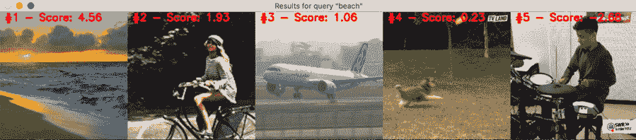

# 第十章：将深度学习的力量应用到视频中

计算机视觉关注的是视觉数据的理解。当然，这也包括视频，视频本质上是图像的序列，这意味着我们可以利用我们关于图像处理的深度学习知识，应用到视频中并获得很好的结果。

在本章中，我们将开始训练卷积神经网络，检测人脸中的情感，然后学习如何在实时上下文中使用我们的摄像头应用它。

然后，在接下来的食谱中，我们将使用**TensorFlow Hub**（**TFHub**）托管的非常先进的架构，专门用于解决与视频相关的有趣问题，如动作识别、帧生成和文本到视频的检索。

这里是我们将要覆盖的食谱内容：

+   实时检测情感

+   使用 TensorFlow Hub 识别动作

+   使用 TensorFlow Hub 生成视频的中间帧

+   使用 TensorFlow Hub 进行文本到视频的检索

# 技术要求

和往常一样，拥有 GPU 是一个很大的优势，特别是在第一个食谱中，我们将从零开始实现一个网络。因为本章剩余部分利用了 TFHub 中的模型，所以即使是 CPU 也应该足够，尽管 GPU 能显著提高速度！在*准备就绪*部分，你可以找到每个食谱的准备步骤。你可以在这里找到本章的代码：[`github.com/PacktPublishing/Tensorflow-2.0-Computer-Vision-Cookbook/tree/master/ch10`](https://github.com/PacktPublishing/Tensorflow-2.0-Computer-Vision-Cookbook/tree/master/ch10)。

查看以下链接，观看代码实际演示视频：

[`bit.ly/3qkTJ2l`](https://bit.ly/3qkTJ2l)。

# 实时检测情感

从最基本的形式来看，视频仅仅是图像序列。通过利用这一看似简单或微不足道的事实，我们可以将图像分类的知识应用到视频处理上，从而创建出由深度学习驱动的非常有趣的视频处理管道。

在本食谱中，我们将构建一个算法，实时检测情感（来自摄像头流或视频文件）。非常有趣，对吧？

让我们开始吧。

## 准备就绪

首先，我们需要安装一些外部库，如`OpenCV`和`imutils`。执行以下命令安装它们：

```py
$> pip install opencv-contrib-python imutils
```

为了训练情感分类器网络，我们将使用来自 Kaggle 比赛的数据集（`~/.keras/datasets`文件夹），将其提取为`emotion_recognition`，然后解压`fer2013.tar.gz`文件。

这里是一些示例图像：


图 10.1 – 示例图像。情感从左到右：悲伤、生气、害怕、惊讶、开心和中立

让我们开始吧！

## 如何实现……

在本食谱结束时，你将拥有自己的情感检测器！

1.  导入所有依赖项：

    ```py
    import csv
    import glob
    import pathlib
    import cv2
    import imutils
    import numpy as np
    from tensorflow.keras.callbacks import ModelCheckpoint
    from tensorflow.keras.layers import *
    from tensorflow.keras.models import *
    from tensorflow.keras.optimizers import Adam
    from tensorflow.keras.preprocessing.image import *
    from tensorflow.keras.utils import to_categorical
    ```

1.  定义数据集中所有可能情感的列表，并为每个情感指定一个颜色：

    ```py
    EMOTIONS = ['angry', 'scared', 'happy', 'sad', 
              'surprised','neutral']
    COLORS = {'angry': (0, 0, 255),
        'scared': (0, 128, 255),
        'happy': (0, 255, 255),
        'sad': (255, 0, 0),
        'surprised': (178, 255, 102),
        'neutral': (160, 160, 160)
    }
    ```

1.  定义一个方法来构建情感分类器的架构。它接收输入形状和数据集中的类别数量：

    ```py
    def build_network(input_shape, classes):
        input = Input(shape=input_shape)
        x = Conv2D(filters=32,
                   kernel_size=(3, 3),
                   padding='same',
                   kernel_initializer='he_normal')(input)
        x = ELU()(x)
        x = BatchNormalization(axis=-1)(x)
        x = Conv2D(filters=32,
                   kernel_size=(3, 3),
                   kernel_initializer='he_normal',
                   padding='same')(x)
        x = ELU()(x)
        x = BatchNormalization(axis=-1)(x)
        x = MaxPooling2D(pool_size=(2, 2))(x)
        x = Dropout(rate=0.25)(x) 
    ```

1.  网络中的每个块由两个 ELU 激活、批量归一化的卷积层组成，接着是一个最大池化层，最后是一个丢弃层。前面定义的块每个卷积层有 32 个滤波器，而后面的块每个卷积层有 64 个滤波器：

    ```py
        x = Conv2D(filters=64,
                   kernel_size=(3, 3),
                   kernel_initializer='he_normal',
                   padding='same')(x)
        x = ELU()(x)
        x = BatchNormalization(axis=-1)(x)
        x = Conv2D(filters=64,
                   kernel_size=(3, 3),
                   kernel_initializer='he_normal',
                   padding='same')(x)
        x = ELU()(x)
        x = BatchNormalization(axis=-1)(x)
        x = MaxPooling2D(pool_size=(2, 2))(x)
        x = Dropout(rate=0.25)(x)
    ```

1.  第三个块每个卷积层有 128 个滤波器：

    ```py
        x = Conv2D(filters=128,
                   kernel_size=(3, 3),
                   kernel_initializer='he_normal',
                   padding='same')(x)
        x = ELU()(x)
        x = BatchNormalization(axis=-1)(x)
        x = Conv2D(filters=128,
                   kernel_size=(3, 3),
                   kernel_initializer='he_normal',
                   padding='same')(x)
        x = ELU()(x)
        x = BatchNormalization(axis=-1)(x)
        x = MaxPooling2D(pool_size=(2, 2))(x)
        x = Dropout(rate=0.25)(x)
    ```

1.  接下来，我们有两个密集层，ELU 激活、批量归一化，后面也跟着一个丢弃层，每个层有 64 个单元：

    ```py
        x = Flatten()(x)
        x = Dense(units=64,
                  kernel_initializer='he_normal')(x)
        x = ELU()(x)
        x = BatchNormalization(axis=-1)(x)
        x = Dropout(rate=0.5)(x)
        x = Dense(units=64,
                  kernel_initializer='he_normal')(x)
        x = ELU()(x)
        x = BatchNormalization(axis=-1)(x)
        x = Dropout(rate=0.5)(x)
    ```

1.  最后，我们遇到输出层，神经元数量与数据集中的类别数量相同，当然，采用 softmax 激活函数：

    ```py
        x = Dense(units=classes,
                  kernel_initializer='he_normal')(x)
        output = Softmax()(x)
        return Model(input, output)
    ```

1.  `load_dataset()`加载训练集、验证集和测试集的图像和标签：

    ```py
    def load_dataset(dataset_path, classes):
        train_images = []
        train_labels = []
        val_images = []
        val_labels = []
        test_images = []
        test_labels = []
    ```

1.  这个数据集中的数据存储在一个 CSV 文件中，分为`emotion`、`pixels`和`Usage`三列。我们首先解析`emotion`列。尽管数据集包含七类面部表情，我们将*厌恶*和*愤怒*（分别编码为`0`和`1`）合并，因为它们共享大多数面部特征，合并后会得到更好的结果：

    ```py
        with open(dataset_path, 'r') as f:
            reader = csv.DictReader(f)
            for line in reader:
                label = int(line['emotion'])
                if label <= 1:
                  label = 0  # This merges classes 1 and 0.
                if label > 0:
                  label -= 1  # All classes start from 0.
    ```

1.  接下来，我们解析`pixels`列，它包含 2,034 个空格分隔的整数，代表图像的灰度像素（48x48=2034）：

    ```py
                image = np.array(line['pixels'].split
                                        (' '),
                                 dtype='uint8')
                image = image.reshape((48, 48))
                image = img_to_array(image)
    ```

1.  现在，为了弄清楚这张图像和标签属于哪个子集，我们需要查看`Usage`列：

    ```py
                if line['Usage'] == 'Training':
                    train_images.append(image)
                    train_labels.append(label)
                elif line['Usage'] == 'PrivateTest':
                    val_images.append(image)
                    val_labels.append(label)
                else:
                    test_images.append(image)
                    test_labels.append(label)
    ```

1.  将所有的图像转换为 NumPy 数组：

    ```py
        train_images = np.array(train_images)
        val_images = np.array(val_images)
        test_images = np.array(test_images)
    ```

1.  然后，对所有标签进行独热编码：

    ```py
        train_labels = 
        to_categorical(np.array(train_labels),
                                      classes)
        val_labels = to_categorical(np.array(val_labels), 
                                     classes)
        test_labels = to_categorical(np.array(test_labels),
                                     classes)
    ```

1.  返回所有的图像和标签：

    ```py
        return (train_images, train_labels), \
               (val_images, val_labels), \
               (test_images, test_labels)
    ```

1.  定义一个计算矩形区域面积的函数。稍后我们将用它来获取最大的面部检测结果：

    ```py
    def rectangle_area(r):
        return (r[2] - r[0]) * (r[3] - r[1])
    ```

1.  现在，我们将创建一个条形图来显示每一帧中检测到的情感的概率分布。以下函数用于绘制每个条形图，代表某一特定情感：

    ```py
    def plot_emotion(emotions_plot, emotion, probability, 
                     index):
        w = int(probability * emotions_plot.shape[1])
        cv2.rectangle(emotions_plot,
                      (5, (index * 35) + 5),
                      (w, (index * 35) + 35),
                      color=COLORS[emotion],
                      thickness=-1)
        white = (255, 255, 255)
        text = f'{emotion}: {probability * 100:.2f}%'
        cv2.putText(emotions_plot,
                    text,
                    (10, (index * 35) + 23),
                    fontFace=cv2.FONT_HERSHEY_COMPLEX,
                    fontScale=0.45,
                    color=white,
                    thickness=2)
        return emotions_plot
    ```

1.  我们还会在检测到的面部周围画一个边界框，并标注上识别出的情感：

    ```py
    def plot_face(image, emotion, detection):
        frame_x, frame_y, frame_width, frame_height = detection
        cv2.rectangle(image,
                      (frame_x, frame_y),
                      (frame_x + frame_width,
                       frame_y + frame_height),
                      color=COLORS[emotion],
                      thickness=2)
        cv2.putText(image,
                    emotion,
                    (frame_x, frame_y - 10),
                    fontFace=cv2.FONT_HERSHEY_COMPLEX,
                    fontScale=0.45,
                    color=COLORS[emotion],
                    thickness=2)
        return image
    ```

1.  定义`predict_emotion()`函数，该函数接收情感分类器和输入图像，并返回模型输出的预测结果：

    ```py
    def predict_emotion(model, roi):
        roi = cv2.resize(roi, (48, 48))
        roi = roi.astype('float') / 255.0
        roi = img_to_array(roi)
        roi = np.expand_dims(roi, axis=0)
        predictions = model.predict(roi)[0]
        return predictions
    ```

1.  如果有保存的模型，则加载它：

    ```py
    checkpoints = sorted(list(glob.glob('./*.h5')), reverse=True)
    if len(checkpoints) > 0:
        model = load_model(checkpoints[0])
    ```

1.  否则，从头开始训练模型。首先，构建 CSV 文件的路径，然后计算数据集中的类别数量：

    ```py
    else:
        base_path = (pathlib.Path.home() / '.keras' / 
                     'datasets' /
                     'emotion_recognition' / 'fer2013')
        input_path = str(base_path / 'fer2013.csv')
        classes = len(EMOTIONS)
    ```

1.  然后，加载每个数据子集：

    ```py
        (train_images, train_labels), \
        (val_images, val_labels), \
        (test_images, test_labels) = load_dataset(input_path,
                                                  classes)
    ```

1.  构建网络并编译它。同时，定义一个`ModelCheckpoint`回调函数来保存最佳表现的模型（基于验证损失）：

    ```py
        model = build_network((48, 48, 1), classes)
        model.compile(loss='categorical_crossentropy',
                      optimizer=Adam(lr=0.003),
                      metrics=['accuracy'])
        checkpoint_pattern = ('model-ep{epoch:03d}-
                              loss{loss:.3f}'
                              '-val_loss{val_loss:.3f}.h5')
        checkpoint = ModelCheckpoint(checkpoint_pattern,
                                     monitor='val_loss',
                                     verbose=1,
                                     save_best_only=True,
                                     mode='min')
    ```

1.  定义训练集和验证集的增强器和生成器。注意，我们仅增强训练集，而验证集中的图像只是进行重缩放：

    ```py
        BATCH_SIZE = 128
        train_augmenter = ImageDataGenerator(rotation_
                                range=10,zoom_range=0.1,
                                  horizontal_flip=True,
                                        rescale=1\. / 255.,
                                    fill_mode='nearest')
        train_gen = train_augmenter.flow(train_images,
                                         train_labels,
                                     batch_size=BATCH_SIZE)
        train_steps = len(train_images) // BATCH_SIZE
        val_augmenter = ImageDataGenerator(rescale=1\. / 255.)
        val_gen = val_augmenter.flow(val_images,val_labels,
                             batch_size=BATCH_SIZE)
    ```

1.  训练模型 300 个周期，然后在测试集上评估模型（我们只对该子集中的图像进行重缩放）：

    ```py
        EPOCHS = 300
        model.fit(train_gen,
                  steps_per_epoch=train_steps,
                  validation_data=val_gen,
                  epochs=EPOCHS,
                  verbose=1,
                  callbacks=[checkpoint])
       test_augmenter = ImageDataGenerator(rescale=1\. / 255.)
        test_gen = test_augmenter.flow(test_images,
                                       test_labels,
                                       batch_size=BATCH_SIZE)
        test_steps = len(test_images) // BATCH_SIZE
        _, accuracy = model.evaluate(test_gen, 
                                     steps=test_steps)
        print(f'Accuracy: {accuracy * 100}%')
    ```

1.  实例化一个`cv2.VideoCapture()`对象来获取测试视频中的帧。如果你想使用你的网络摄像头，将`video_path`替换为`0`：

    ```py
    video_path = 'emotions.mp4'
    camera = cv2.VideoCapture(video_path)  # Pass 0 to use webcam
    ```

1.  创建一个**Haar 级联**人脸检测器（这是本书范围之外的内容。如果你想了解更多关于 Haar 级联的内容，请参考本配方中的*另见*部分）：

    ```py
    cascade_file = 'resources/haarcascade_frontalface_default.xml'
    det = cv2.CascadeClassifier(cascade_file)
    ```

1.  遍历视频中的每一帧（或网络摄像头流），只有在没有更多帧可以读取，或用户按下 Q 键时才退出：

    ```py
    while True:
        frame_exists, frame = camera.read()
        if not frame_exists:
            break
    ```

1.  将帧调整为宽度为 380 像素（高度会自动计算以保持宽高比）。同时，创建一个画布，用于绘制情感条形图，并创建一个输入帧的副本，用于绘制检测到的人脸：

    ```py
        frame = imutils.resize(frame, width=380)
        emotions_plot = np.zeros_like(frame, 
                                      dtype='uint8')
        copy = frame.copy()
    ```

1.  由于 Haar 级联方法是在灰度图像上工作的，我们必须将输入帧转换为黑白图像。然后，我们在其上运行人脸检测器：

    ```py
        gray = cv2.cvtColor(frame, cv2.COLOR_BGR2GRAY)
        detections = \
            det.detectMultiScale(gray,scaleFactor=1.1,
                                 minNeighbors=5,
                                 minSize=(35, 35),

                            flags=cv2.CASCADE_SCALE_IMAGE)
    ```

1.  验证是否有任何检测，并获取面积最大的那个：

    ```py
        if len(detections) > 0:
            detections = sorted(detections,
                                key=rectangle_area)
            best_detection = detections[-1]
    ```

1.  提取与检测到的面部表情对应的感兴趣区域（`roi`），并从中提取情感：

    ```py
            (frame_x, frame_y,
             frame_width, frame_height) = best_detection
            roi = gray[frame_y:frame_y + frame_height,
                       frame_x:frame_x + frame_width]
            predictions = predict_emotion(model, roi)
            label = EMOTIONS[predictions.argmax()]
    ```

1.  创建情感分布图：

    ```py
            for i, (emotion, probability) in \
                    enumerate(zip(EMOTIONS, predictions)):
                emotions_plot = plot_emotion(emotions_plot,
                                             emotion,
                                             probability,
                                             i)
    ```

1.  绘制检测到的面部表情及其所展示的情感：

    ```py
            clone = plot_face(copy, label, best_detection)
    ```

1.  显示结果：

    ```py
        cv2.imshow('Face & emotions',
                   np.hstack([copy, emotions_plot]))
    ```

1.  检查用户是否按下了 Q 键，如果按下了，则退出循环：

    ```py
        if cv2.waitKey(1) & 0xFF == ord('q'):
            break
    ```

1.  最后，释放资源：

    ```py
    camera.release()
    cv2.destroyAllWindows()
    ```

    在 300 个周期后，我获得了 65.74%的测试准确率。在这里，你可以看到一些测试视频中检测到的情感快照：


图 10.2 – 在两个不同快照中检测到的情感

我们可以看到网络正确地识别出了顶部帧中的悲伤表情，底部帧中识别出了幸福表情。让我们来看一个另一个例子：


图 10.3 – 在三个不同快照中检测到的情感

在第一帧中，女孩显然呈现出中性表情，网络正确地识别出来了。第二帧中，她的面部表情显示出愤怒，分类器也检测到这一点。第三帧更有趣，因为她的表情显示出惊讶，但也可以被解读为恐惧。我们的检测器似乎在这两种情感之间有所犹豫。

让我们前往下一部分，好吗？

## 它是如何工作的……

在本配方中，我们实现了一个相当强大的情感检测器，用于视频流，无论是来自内建的网络摄像头，还是存储的视频文件。我们首先解析了`FER 2013`数据集，它与大多数其他图像数据集不同，是 CSV 格式的。然后，我们在其图像上训练了一个情感分类器，在测试集上达到了 65.74%的准确率。

我们必须考虑到面部表情的解读非常复杂，甚至对于人类来说也是如此。在某一时刻，我们可能会展示混合情感。此外，还有许多表情具有相似特征，比如*愤怒*和*厌恶*，以及*恐惧*和*惊讶*，等等。

本食谱中的最后一步是将输入视频流中的每一帧传递给 Haar Cascade 人脸检测器，然后使用训练好的分类器从检测到的人脸区域获取情感。

尽管这种方法对这个特定问题有效，但我们必须考虑到我们忽略了一个关键假设：每一帧都是独立的。简单来说，我们将视频中的每一帧当作一个独立的图像处理，但实际上，处理视频时并非如此，因为存在时间维度，如果考虑到这一点，将会得到更稳定、更好的结果。

## 另请参见

这是一个很好的资源，用于理解 Haar Cascade 分类器：[`docs.opencv.org/3.4/db/d28/tutorial_cascade_classifier.html`](https://docs.opencv.org/3.4/db/d28/tutorial_cascade_classifier.html)。

# 使用 TensorFlow Hub 识别动作

深度学习在视频处理中的一个非常有趣的应用是动作识别。这是一个具有挑战性的问题，因为它不仅涉及到图像分类中通常遇到的困难，还包括了时间维度。视频中的一个动作可能会根据帧呈现的顺序而有所不同。

好消息是，存在一个非常适合这种问题的架构，称为**膨胀 3D 卷积网络**（**I3D**），在本食谱中，我们将使用 TFHub 上托管的训练版本来识别一组多样化视频中的动作！

开始吧。

## 准备工作

我们需要安装几个补充库，如`OpenCV`、`TFHub`和`imageio`。执行以下命令：

```py
$> pip install opencv-contrib-python tensorflow-hub imageio
```

就是这样！让我们开始实现吧。

## 如何做…

执行以下步骤以完成本食谱：

1.  导入所有所需的依赖项：

    ```py
    import os
    import random
    import re
    import ssl
    import tempfile
    from urllib import request
    import cv2
    import imageio
    import numpy as np
    import tensorflow as tf
    import tensorflow_hub as tfhub
    from tensorflow_docs.vis import embed
    ```

1.  定义`UCF101 – 动作识别`数据集的路径，从中获取我们稍后将传递给模型的测试视频：

    ```py
    UCF_ROOT = 'https://www.crcv.ucf.edu/THUMOS14/UCF101/UCF101/'
    ```

1.  定义`Kinetics`数据集的标签文件路径，后者用于训练我们将很快使用的 3D 卷积网络：

    ```py
    KINETICS_URL = ('https://raw.githubusercontent.com/deepmind/'
                    'kinetics-i3d/master/data/label_map.txt')
    ```

1.  创建一个临时目录，用于缓存下载的资源：

    ```py
    CACHE_DIR = tempfile.mkdtemp()
    ```

1.  创建一个未经验证的 SSL 上下文。我们需要这个以便能够从 UCF 的网站下载数据（在编写本书时，似乎他们的证书已过期）：

    ```py
    UNVERIFIED_CONTEXT = ssl._create_unverified_context()
    ```

1.  定义`fetch_ucf_videos()`函数，该函数下载我们将从中选择的测试视频列表，以测试我们的动作识别器：

    ```py
    def fetch_ucf_videos():
        index = \
            (request
             .urlopen(UCF_ROOT, 
                      context=UNVERIFIED_CONTEXT)
             .read()
             .decode('utf-8'))
        videos = re.findall('(v_[\w]+\.avi)', index)
        return sorted(set(videos))
    ```

1.  定义`fetch_kinetics_labels()`函数，用于下载并解析`Kinetics`数据集的标签：

    ```py
    def fetch_kinetics_labels():
        with request.urlopen(KINETICS_URL) as f:
            labels = [line.decode('utf-8').strip()
                      for line in f.readlines()]
        return labels
    ```

1.  定义`fetch_random_video()`函数，该函数从我们的`UCF101`视频列表中选择一个随机视频，并将其下载到*第 4 步*中创建的临时目录中：

    ```py
    def fetch_random_video(videos_list):
        video_name = random.choice(videos_list)
        cache_path = os.path.join(CACHE_DIR, video_name)
        if not os.path.exists(cache_path):
            url = request.urljoin(UCF_ROOT, video_name)
            response = (request
                        .urlopen(url,

                         context=UNVERIFIED_CONTEXT)
                        .read())
            with open(cache_path, 'wb') as f:
                f.write(response)
        return cache_path
    ```

1.  定义`crop_center()`函数，该函数接受一张图片并裁剪出对应于接收帧中心的正方形区域：

    ```py
    def crop_center(frame):
        height, width = frame.shape[:2]
        smallest_dimension = min(width, height)
        x_start = (width // 2) - (smallest_dimension // 2)
        x_end = x_start + smallest_dimension
        y_start = (height // 2) - (smallest_dimension // 2)
        y_end = y_start + smallest_dimension
        roi = frame[y_start:y_end, x_start:x_end]
        return roi
    ```

1.  定义 `read_video()` 函数，它从我们的缓存中读取最多 `max_frames` 帧，并返回所有读取的帧列表。它还会裁剪每帧的中心，将其调整为 224x224x3 的大小（网络期望的输入形状），并进行归一化处理：

    ```py
    def read_video(path, max_frames=32, resize=(224, 224)):
        capture = cv2.VideoCapture(path)
        frames = []
        while len(frames) <= max_frames:
            frame_read, frame = capture.read()
            if not frame_read:
                break
            frame = crop_center(frame)
            frame = cv2.resize(frame, resize)
            frame = cv2.cvtColor(frame, cv2.COLOR_BGR2RGB)
            frames.append(frame)
        capture.release()
        frames = np.array(frames)
        return frames / 255.
    ```

1.  定义 `predict()` 函数，用于获取模型在输入视频中识别的前五个最可能的动作：

    ```py
    def predict(model, labels, sample_video):
        model_input = tf.constant(sample_video,
                                  dtype=tf.float32)
        model_input = model_input[tf.newaxis, ...]
        logits = model(model_input)['default'][0]
        probabilities = tf.nn.softmax(logits)
        print('Top 5 actions:')
        for i in np.argsort(probabilities)[::-1][:5]:
            print(f'{labels[i]}:  {probabilities[i] * 100:5.2f}%')
    ```

1.  定义 `save_as_gif()` 函数，它接收一个包含视频帧的列表，并用它们创建 GIF 格式的表示：

    ```py
    def save_as_gif(images, video_name):
        converted_images = np.clip(images * 255, 0, 255)
        converted_images = converted_images.astype(np.uint8)
        imageio.mimsave(f'./{video_name}.gif',
                        converted_images,
                        fps=25)
    ```

1.  获取视频和标签：

    ```py
    VIDEO_LIST = fetch_ucf_videos()
    LABELS = fetch_kinetics_labels()
    ```

1.  获取一个随机视频并读取其帧：

    ```py
    video_path = fetch_random_video(VIDEO_LIST)
    sample_video = read_video(video_path)
    ```

1.  从 TFHub 加载 I3D：

    ```py
    model_path = 'https://tfhub.dev/deepmind/i3d-kinetics-400/1'
    model = tfhub.load(model_path)
    model = model.signatures['default']
    ```

1.  最后，将视频传递给网络以获得预测结果，然后将视频保存为 GIF 格式：

    ```py
    predict(model, LABELS, sample_video)
    video_name = video_path.rsplit('/', maxsplit=1)[1][:-4]
    save_as_gif(sample_video, video_name)
    ```

    这是我获得的随机视频的第一帧：


图 10.4 – 随机 UCF101 视频的帧

这是模型生成的前五个预测：

```py
Top 5 actions:
mopping floor:  75.29%
cleaning floor:  21.11%
sanding floor:   0.85%
spraying:   0.69%
sweeping floor:   0.64%
```

看起来网络理解视频中呈现的动作与地板有关，因为五个预测中有四个与此相关。然而，`mopping floor`才是正确的预测。

现在让我们进入 *它是如何工作的……* 部分。

## 它是如何工作的……

在这个方案中，我们利用了 3D 卷积网络的强大功能来识别视频中的动作。顾名思义，3D 卷积是二维卷积的自然扩展，它可以在两个方向上进行操作。3D 卷积不仅考虑了宽度和高度，还考虑了深度，因此它非常适合某些特殊类型的图像，如磁共振成像（MRI），或者在本例中是视频，视频实际上就是一系列叠加在一起的图像。

我们首先从 `UCF101` 数据集中获取了一系列视频，并从 `Kinetics` 数据集中获取了一组动作标签。需要记住的是，我们从 TFHub 下载的 I3D 是在 Kinetics 数据集上训练的。因此，我们传递给它的视频是未见过的。

接下来，我们实现了一系列辅助函数，用于获取、预处理并调整每个输入视频的格式，以符合 I3D 的预期。然后，我们从 TFHub 加载了上述网络，并用它来显示视频中识别到的前五个动作。

你可以对这个解决方案进行一个有趣的扩展，即从文件系统中读取自定义视频，或者更好的是，将来自摄像头的图像流传递给网络，看看它的表现如何！

## 另请参见

I3D 是一种用于视频处理的突破性架构，因此我强烈建议你阅读原始论文：[`arxiv.org/abs/1705.07750`](https://arxiv.org/abs/1705.07750)。这里有一篇相当有趣的文章，解释了 1D、2D 和 3D 卷积的区别：[`towardsdatascience.com/understanding-1d-and-3d-convolution-neural-network-keras-9d8f76e29610`](https://towardsdatascience.com/understanding-1d-and-3d-convolution-neural-network-keras-9d8f76e29610)。你可以在这里了解更多关于`UCF101`数据集的信息：https://www.crcv.ucf.edu/data/UCF101.php。如果你对`Kinetics`数据集感兴趣，可以访问这个链接：https://deepmind.com/research/open-source/kinetics。最后，你可以在这里找到我们使用的 I3D 实现的更多细节：[`tfhub.dev/deepmind/i3d-kinetics-400/1`](https://tfhub.dev/deepmind/i3d-kinetics-400/1)。

# 使用 TensorFlow Hub 生成视频的中间帧

深度学习在视频中的另一个有趣应用涉及帧生成。这个技术的一个有趣且实用的例子是慢动作，其中一个网络根据上下文决定如何创建插入帧，从而扩展视频长度，并制造出用高速摄像机拍摄的假象（如果你想了解更多内容，可以参考*另见…*部分）。

在这个食谱中，我们将使用 3D 卷积网络来生成视频的中间帧，给定视频的第一帧和最后一帧。

为此，我们将依赖 TFHub。

让我们开始这个食谱。

## 准备就绪

我们必须安装 TFHub 和 `TensorFlow Datasets`：

```py
$> pip install tensorflow-hub tensorflow-datasets
```

我们将使用的模型是在 `BAIR Robot Pushing Videos` 数据集上训练的，该数据集可在 `TensorFlow Datasets` 中获得。然而，如果我们通过库访问它，我们将下载远超过我们这个食谱所需的数据。因此，我们将使用测试集的一个较小子集。执行以下命令来下载它并将其放入 `~/.keras/datasets/bair_robot_pushing` 文件夹中：

```py
$> wget -nv https://storage.googleapis.com/download.tensorflow.org/data/bair_test_traj_0_to_255.tfrecords -O ~/.keras/datasets/bair_robot_pushing/traj_0_to_255.tfrecords
```

现在一切准备就绪！让我们开始实施。

## 如何实现…

执行以下步骤，学习如何通过托管在 TFHub 中的模型生成中间帧，使用 **直接 3D 卷积**：

1.  导入依赖库：

    ```py
    import pathlib
    import matplotlib.pyplot as plt
    import numpy as np
    import tensorflow as tf
    import tensorflow_hub as tfhub
    from tensorflow_datasets.core import SplitGenerator
    from tensorflow_datasets.video.bair_robot_pushing import \
        BairRobotPushingSmall
    ```

1.  定义 `plot_first_and_last_for_sample()` 函数，该函数绘制四个视频样本的第一帧和最后一帧的图像：

    ```py
    def plot_first_and_last_for_sample(frames, batch_size):
        for i in range(4):
            plt.subplot(batch_size, 2, 1 + 2 * i)
            plt.imshow(frames[i, 0] / 255.)
            plt.title(f'Video {i}: first frame')
            plt.axis('off')
            plt.subplot(batch_size, 2, 2 + 2 * i)
            plt.imshow(frames[i, 1] / 255.)
            plt.title(f'Video {i}: last frame')
            plt.axis('off')
    ```

1.  定义 `plot_generated_frames_for_sample()` 函数，该函数绘制为四个视频样本生成的中间帧：

    ```py
    def plot_generated_frames_for_sample(gen_videos):
        for video_id in range(4):
            fig = plt.figure(figsize=(10 * 2, 2))
            for frame_id in range(1, 16):
                ax = fig.add_axes(
                    [frame_id / 16., 0, (frame_id + 1) / 
                           16., 1],
                    xmargin=0, ymargin=0)
                ax.imshow(gen_videos[video_id, frame_id])
                ax.axis('off')
    ```

1.  我们需要修补 `BarRobotPushingSmall()`（参见*步骤 6*）数据集构建器，只期望测试集可用，而不是同时包含训练集和测试集。因此，我们必须创建一个自定义的 `SplitGenerator()`：

    ```py
    def split_gen_func(data_path):
        return [SplitGenerator(name='test',
                               gen_kwargs={'filedir': 
                                           data_path})]
    ```

1.  定义数据路径：

    ```py
    DATA_PATH = str(pathlib.Path.home() / '.keras' / 
                       'datasets' /
                    'bair_robot_pushing')
    ```

1.  创建一个 `BarRobotPushingSmall()` 构建器，将其传递给*步骤 4*中创建的自定义拆分生成器，然后准备数据集：

    ```py
    builder = BairRobotPushingSmall()
    builder._split_generators = lambda _:split_gen_func(DATA_PATH)
    builder.download_and_prepare()
    ```

1.  获取第一批视频：

    ```py
    BATCH_SIZE = 16
    dataset = builder.as_dataset(split='test')
    test_videos = dataset.batch(BATCH_SIZE)
    for video in test_videos:
        first_batch = video
        break
    ```

1.  保留每个视频批次中的第一帧和最后一帧：

    ```py
    input_frames = first_batch['image_aux1'][:, ::15]
    input_frames = tf.cast(input_frames, tf.float32)
    ```

1.  从 TFHub 加载生成器模型：

    ```py
    model_path = 'https://tfhub.dev/google/tweening_conv3d_bair/1'
    model = tfhub.load(model_path)
    model = model.signatures['default']
    ```

1.  将视频批次传递到模型中，生成中间帧：

    ```py
    middle_frames = model(input_frames)['default']
    middle_frames = middle_frames / 255.0
    ```

1.  将每个视频批次的首尾帧与网络在*步骤 10*中生成的相应中间帧进行连接：

    ```py
    generated_videos = np.concatenate(
        [input_frames[:, :1] / 255.0,  # All first frames
         middle_frames,  # All inbetween frames
         input_frames[:, 1:] / 255.0],  # All last frames
        axis=1)
    ```

1.  最后，绘制首尾帧，以及中间帧：

    ```py
    plt.figure(figsize=(4, 2 * BATCH_SIZE))
    plot_first_and_last_for_sample(input_frames, 
                                    BATCH_SIZE)
    plot_generated_frames_for_sample(generated_videos)
    plt.show()
    ```

    在*图 10.5*中，我们可以观察到我们四个示例视频中每个视频的首尾帧：


图 10.5 – 每个视频的首尾帧

在*图 10.6*中，我们观察到模型为每个视频生成的 14 帧中间帧。仔细检查可以发现，它们与传递给网络的首尾真实帧是一致的：


图 10.6 – 模型为每个示例视频生成的中间帧

让我们进入*它是如何工作的…*部分，回顾我们所做的工作。

## 它是如何工作的…

在本节中，我们学习了深度学习在视频中的另一个有趣且有用的应用，特别是在生成模型的背景下，3D 卷积网络的应用。

我们使用了一个在 `BAIR Robot Pushing Videos` 数据集上训练的最先进架构，该数据集托管在 TFHub 上，并用它生成了一个全新的视频序列，仅以视频的首尾帧作为种子。

由于下载整个 30 GB 的 `BAIR` 数据集会显得过于冗余，考虑到我们只需要一个小得多的子集来测试我们的解决方案，我们无法直接依赖 TensorFlow 数据集的 `load()` 方法。因此，我们下载了测试视频的一个子集，并对 `BairRobotPushingSmall()` 构建器进行了必要的调整，以加载和准备示例视频。

必须提到的是，这个模型是在一个非常特定的数据集上训练的，但它确实展示了这个架构强大的生成能力。我鼓励你查看*另见*部分，其中列出了如果你想在自己的数据上实现视频生成网络时可能有帮助的有用资源。

## 另见

你可以在此了解更多关于 `BAIR Robot Pushing Videos` 数据集的信息：[`arxiv.org/abs/1710.05268`](https://arxiv.org/abs/1710.05268)。我鼓励你阅读题为 **视频中间插帧使用直接 3D 卷积** 的论文，这篇论文提出了我们在本节中使用的网络：https://arxiv.org/abs/1905.10240\. 你可以在以下链接找到我们依赖的 TFHub 模型：https://tfhub.dev/google/tweening_conv3d_bair/1\. 最后，以下是关于将普通视频转化为慢动作的 AI 的一篇有趣文章：[`petapixel.com/2020/09/08/this-ai-can-transform-regular-footage-into-slow-motion-with-no-artifacts/`](https://petapixel.com/2020/09/08/this-ai-can-transform-regular-footage-into-slow-motion-with-no-artifacts/).

# 使用 TensorFlow Hub 进行文本到视频检索

深度学习在视频中的应用不仅限于分类、分类或生成。神经网络的最大资源之一是它们对数据特征的内部表示。一个网络在某一任务上越优秀，它们的内部数学模型就越好。我们可以利用最先进模型的内部工作原理，构建有趣的应用。

在这个步骤中，我们将基于由**S3D**模型生成的嵌入创建一个小型搜索引擎，该模型已经在 TFHub 上训练并准备好使用。

你准备好了吗？让我们开始吧！

## 准备就绪

首先，我们必须安装`OpenCV`和 TFHub，方法如下：

```py
$> pip install opencv-contrib-python tensorflow-hub
```

这就是我们需要的，开始这个步骤吧！

## 如何做到这一点……

执行以下步骤，学习如何使用 TFHub 进行文本到视频的检索：

1.  第一步是导入我们将使用的所有依赖项：

    ```py
    import math
    import os
    import uuid
    import cv2
    import numpy as np
    import tensorflow as tf
    import tensorflow_hub as tfhub
    from tensorflow.keras.utils import get_file
    ```

1.  定义一个函数，使用 S3D 实例生成文本和视频嵌入：

    ```py
    def produce_embeddings(model, input_frames, input_words):
        frames = tf.cast(input_frames, dtype=tf.float32)
        frames = tf.constant(frames)
        video_model = model.signatures['video']
        video_embedding = video_model(frames)
        video_embedding = video_embedding['video_embedding']
        words = tf.constant(input_words)
        text_model = model.signatures['text']
        text_embedding = text_model(words)
        text_embedding = text_embedding['text_embedding']
        return video_embedding, text_embedding
    ```

1.  定义`crop_center()`函数，该函数接收一张图像并裁剪出与接收到的帧中心相对应的正方形区域：

    ```py
    def crop_center(frame):
        height, width = frame.shape[:2]
        smallest_dimension = min(width, height)
        x_start = (width // 2) - (smallest_dimension // 2)
        x_end = x_start + smallest_dimension
        y_start = (height // 2) - (smallest_dimension // 
                                        2)
        y_end = y_start + smallest_dimension
        roi = frame[y_start:y_end, x_start:x_end]
        return roi
    ```

1.  定义`fetch_and_read_video()`函数，顾名思义，该函数下载视频并读取它。在最后一步，我们使用 OpenCV。首先，从给定的 URL 获取视频：

    ```py
    def fetch_and_read_video(video_url,
                             max_frames=32,
                             resize=(224, 224)):
        extension = video_url.rsplit(os.path.sep,
                                     maxsplit=1)[-1]
        path = get_file(f'{str(uuid.uuid4())}.{extension}',
                        video_url,
                        cache_dir='.',
                        cache_subdir='.')
    ```

    我们从 URL 中提取视频格式。然后，我们将视频保存在当前文件夹中，文件名为一个随机生成的 UUID。

1.  接下来，我们将加载这个获取的视频的`max_frames`：

    ```py
        capture = cv2.VideoCapture(path)
        frames = []
        while len(frames) <= max_frames:
            frame_read, frame = capture.read()
            if not frame_read:
                break
            frame = crop_center(frame)
            frame = cv2.resize(frame, resize)
            frame = cv2.cvtColor(frame, cv2.COLOR_BGR2RGB)
            frames.append(frame)
        capture.release()
        frames = np.array(frames)
    ```

1.  如果视频的帧数不足，我们将重复此过程，直到达到所需的容量：

    ```py
        if len(frames) < max_frames:
            repetitions = math.ceil(float(max_frames) /        
                                    len(frames))
            repetitions = int(repetitions)
            frames = frames.repeat(repetitions, axis=0)
    ```

1.  返回归一化后的帧：

    ```py
        frames = frames[:max_frames]
        return frames / 255.0
    ```

1.  定义视频的 URL：

    ```py
    URLS = [
        ('https://media.giphy.com/media/'
         'WWYSFIZo4fsLC/source.gif'),
        ('https://media.giphy.com/media/'
         'fwhIy2QQtu5vObfjrs/source.gif'),
        ('https://media.giphy.com/media/'
         'W307DdkjIsRHVWvoFE/source.gif'),
        ('https://media.giphy.com/media/'
         'FOcbaDiNEaqqY/source.gif'),
        ('https://media.giphy.com/media/'
         'VJwck53yG6y8s2H3Og/source.gif')]
    ```

1.  获取并读取每个视频：

    ```py
    VIDEOS = [fetch_and_read_video(url) for url in URLS]
    ```

1.  定义与每个视频相关联的查询（标题）。请注意，它们必须按正确的顺序排列：

    ```py
    QUERIES = ['beach', 'playing drums', 'airplane taking 
                  off',
               'biking', 'dog catching frisbee']
    ```

1.  从 TFHub 加载 S3D：

    ```py
    model = tfhub.load
    ('https://tfhub.dev/deepmind/mil-nce/s3d/1')
    ```

1.  获取文本和视频嵌入：

    ```py
    video_emb, text_emb = produce_embeddings(model,
                                  np.stack(VIDEOS, axis=0),
                                             np.array(QUERIES))
    ```

1.  计算文本和视频嵌入之间的相似度得分：

    ```py
    scores = np.dot(text_emb, tf.transpose(video_emb))
    ```

1.  获取每个视频的第一帧，将其重新缩放回[0, 255]，然后转换为 BGR 空间，以便我们可以使用 OpenCV 显示它。我们这样做是为了展示实验结果：

    ```py
    first_frames = [v[0] for v in VIDEOS]
    first_frames = [cv2.cvtColor((f * 255.0).astype('uint8'),
                                 cv2.COLOR_RGB2BGR) for f 
                                    in  first_frames]
    ```

1.  遍历每个（查询，视频，得分）三元组，并显示每个查询的最相似视频：

    ```py
    for query, video, query_scores in zip(QUERIES,VIDEOS,scores):
        sorted_results = sorted(list(zip(QUERIES,
                                         first_frames,
                                         query_scores)),
                                key=lambda p: p[-1],
                                reverse=True)
        annotated_frames = []
        for i, (q, f, s) in enumerate(sorted_results, 
                                     start=1):
            frame = f.copy()
            cv2.putText(frame,
                        f'#{i} - Score: {s:.2f}',
                        (8, 15),
                        fontFace=cv2.FONT_HERSHEY_SIMPLEX,
                        fontScale=0.6,
                        color=(0, 0, 255),
                        thickness=2)
            annotated_frames.append(frame)
        cv2.imshow(f'Results for query “{query}”',
                   np.hstack(annotated_frames))
        cv2.waitKey(0)
    ```

    首先，我们来看一下*海滩*查询的结果：



图 10.7 – 针对“海滩”查询的排名结果

正如预期的那样，第一个结果（得分最高）是一张海滩的图片。现在，让我们试试*打鼓*：


图 10.8 – 针对“打鼓”查询的排名结果

太棒了！看来这个实例中查询文本和图像之间的相似度更强。接下来是一个更具挑战性的查询：


图 10.9 – 针对“飞机起飞”查询的排名结果

尽管*飞机起飞*是一个稍微复杂一点的查询，但我们的解决方案毫无问题地产生了正确的结果。现在让我们试试*biking*：


图 10.10 – BIKING 查询的排名结果

又一个匹配！那*狗抓飞盘*呢？


图 10.11 – DOG CATCHING FRISBEE 查询的排名结果

一点问题都没有！我们所见到的令人满意的结果，归功于 S3D 在将图像与最能描述它们的文字进行匹配方面所做的出色工作。如果你已经阅读了介绍 S3D 的论文，你不会对这一事实感到惊讶，因为它是在大量数据上进行训练的。

现在让我们继续下一部分。

## 它是如何工作的……

在这个方法中，我们利用了 S3D 模型生成嵌入的能力，既针对文本也针对视频，创建了一个小型数据库，并将其用作一个玩具搜索引擎的基础。通过这种方式，我们展示了拥有一个能够在图像和文本之间生成丰富的信息向量双向映射的网络的实用性。

## 参见

我强烈推荐你阅读我们在这个方法中使用的模型所发表的论文，内容非常有趣！这是链接：https://arxiv.org/pdf/1912.06430.pdf。说到这个模型，你可以在这里找到它：https://tfhub.dev/deepmind/mil-nce/s3d/1。
