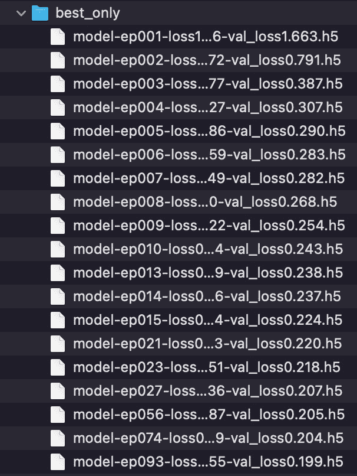

# 第十二章：*第十二章*：提升性能

更多时候，从好到优秀的跃升并不涉及剧烈的变化，而是细微的调整和微调。

人们常说，20%的努力可以带来 80%的成果（这就是**帕累托原则**）。但是 80%和 100%之间的差距呢？我们需要做什么才能超越预期，改进我们的解决方案，最大限度地提升计算机视觉算法的性能？

嗯，和所有深度学习相关的事情一样，答案是艺术与科学的结合。好消息是，本章将专注于一些简单的工具，你可以用它们来提升神经网络的性能！

本章将涵盖以下方法：

+   使用卷积神经网络集成来提高准确性

+   使用测试时数据增强来提高准确性

+   使用排名-N 准确率来评估性能

+   使用标签平滑提高性能

+   检查点模型

+   使用`tf.GradientTape`自定义训练过程

+   可视化类激活图以更好地理解你的网络

让我们开始吧！

# 技术要求

如往常一样，如果你能使用 GPU，你将能从这些方法中获得最大收益，因为本章中的某些示例对资源的需求相当高。此外，如果有任何你需要执行的准备工作以完成某个方法，你会在*准备工作*部分找到相关内容。最后，关于本章的代码可以在 GitHub 的附带仓库中找到：[`github.com/PacktPublishing/Tensorflow-2.0-Computer-Vision-Cookbook/tree/master/ch12`](https://github.com/PacktPublishing/Tensorflow-2.0-Computer-Vision-Cookbook/tree/master/ch12)。

查看以下链接，观看代码实战视频：

[`bit.ly/2Ko3H3K`](https://bit.ly/2Ko3H3K)。

# 使用卷积神经网络集成来提高准确性

在机器学习中，最强大的分类器之一，实际上是一个元分类器，叫做集成。集成由所谓的弱分类器组成，弱分类器是指比随机猜测稍微好一点的预测模型。然而，当它们结合在一起时，结果是一个相当强大的算法，特别是在面对高方差（过拟合）时。我们可能遇到的一些最著名的集成方法包括随机森林和梯度提升机。

好消息是，当涉及到神经网络时，我们可以利用相同的原理，从而创造出一个整体效果，超越单独部分的总和。你想知道怎么做吗？继续阅读吧！

## 准备工作

本方法依赖于`Pillow`和`tensorflow_docs`，可以通过以下方式轻松安装：

```py
$> pip install Pillow git+https://github.com/tensorflow/docs
```

我们还将使用著名的`Caltech 101`数据集，可以在这里找到：[`www.vision.caltech.edu/Image_Datasets/Caltech101/`](http://www.vision.caltech.edu/Image_Datasets/Caltech101/)。下载并解压`101_ObjectCategories.tar.gz`到你选择的位置。为了这个配方，我们将它放在`~/.keras/datasets/101_ObjectCategories`中。

以下是一些示例图像：


](img/B14768_12_001.jpg)

图 12.1 – Caltech 101 样本图像

让我们开始这个配方吧？

## 如何操作…

按照以下步骤创建**卷积神经网络**（**CNN**）的集成：

1.  导入所有必需的模块：

    ```py
    import os
    import pathlib
    from glob import glob
    import numpy as np
    from sklearn.metrics import accuracy_score
    from sklearn.model_selection import train_test_split
    from sklearn.preprocessing import LabelBinarizer
    from tensorflow.keras import Model
    from tensorflow.keras.layers import *
    from tensorflow.keras.preprocessing.image import *
    ```

1.  定义`load_images_and_labels()`函数，读取`Caltech 101`数据集中的图像和类别，并将它们作为 NumPy 数组返回：

    ```py
    def load_images_and_labels(image_paths, 
                               target_size=(64, 64)):
        images = []
        labels = []
        for image_path in image_paths:
            image = load_img(image_path, 
                              target_size=target_size)
            image = img_to_array(image)
            label = image_path.split(os.path.sep)[-2]
            images.append(image)
            labels.append(label)
        return np.array(images), np.array(labels)
    ```

1.  定义`build_model()`函数，负责构建一个类似 VGG 的卷积神经网络：

    ```py
    def build_network(width, height, depth, classes):
        input_layer = Input(shape=(width, height, depth))
        x = Conv2D(filters=32,
                   kernel_size=(3, 3),
                   padding='same')(input_layer)
        x = ReLU()(x)
        x = BatchNormalization(axis=-1)(x)
        x = Conv2D(filters=32,
                   kernel_size=(3, 3),
                   padding='same')(x)
        x = ReLU()(x)
        x = BatchNormalization(axis=-1)(x)
        x = MaxPooling2D(pool_size=(2, 2))(x)
        x = Dropout(rate=0.25)(x)
        x = Conv2D(filters=64,
                   kernel_size=(3, 3),
                   padding='same')(x)
        x = ReLU()(x)
        x = BatchNormalization(axis=-1)(x)
        x = Conv2D(filters=64,
                   kernel_size=(3, 3),
                   padding='same')(x)
        x = ReLU()(x)
        x = BatchNormalization(axis=-1)(x)
        x = MaxPooling2D(pool_size=(2, 2))(x)
        x = Dropout(rate=0.25)(x)
    ```

    现在，构建网络的全连接部分：

    ```py
        x = Flatten()(x)
        x = Dense(units=512)(x)
        x = ReLU()(x)
        x = BatchNormalization(axis=-1)(x)
        x = Dropout(rate=0.25)(x)
        x = Dense(units=classes)(x)
        output = Softmax()(x)
        return Model(input_layer, output)
    ```

1.  定义`plot_model_history()`函数，我们将用它来绘制集成中各个网络的训练和验证曲线：

    ```py
    def plot_model_history(model_history, metric, 
                           plot_name):
        plt.style.use('seaborn-darkgrid')
        plotter = tfdocs.plots.HistoryPlotter()
        plotter.plot({'Model': model_history}, 
                      metric=metric)
        plt.title(f'{metric.upper()}')
        plt.ylim([0, 1])
        plt.savefig(f'{plot_name}.png')
        plt.close()
    ```

1.  为了提高可复现性，设置一个随机种子：

    ```py
    SEED = 999
    np.random.seed(SEED)
    ```

1.  编译`Caltech 101`图像的路径以及类别：

    ```py
    base_path = (pathlib.Path.home() / '.keras' / 
                  'datasets' /
                 '101_ObjectCategories')
    images_pattern = str(base_path / '*' / '*.jpg')
    image_paths = [*glob(images_pattern)]
    image_paths = [p for p in image_paths if
                   p.split(os.path.sep)[-2] !='BACKGROUND_Google']
    CLASSES = {p.split(os.path.sep)[-2] for p in image_paths}
    ```

1.  加载图像和标签，同时对图像进行归一化，并对标签进行独热编码：

    ```py
    X, y = load_images_and_labels(image_paths)
    X = X.astype('float') / 255.0
    y = LabelBinarizer().fit_transform(y)
    ```

1.  保留 20%的数据用于测试，其余用于训练模型：

    ```py
    (X_train, X_test,
     y_train, y_test) = train_test_split(X, y,
                                         test_size=0.2,
                                      random_state=SEED)
    ```

1.  定义批次大小、训练轮次以及每个轮次的批次数：

    ```py
    BATCH_SIZE = 64
    STEPS_PER_EPOCH = len(X_train) // BATCH_SIZE
    EPOCHS = 40
    ```

1.  我们将在这里使用数据增强，执行一系列随机变换，如水平翻转、旋转和缩放：

    ```py
    augmenter = ImageDataGenerator(horizontal_flip=True,
                                   rotation_range=30,
                                   width_shift_range=0.1,
                                   height_shift_range=0.1,
                                   shear_range=0.2,
                                   zoom_range=0.2,
                                   fill_mode='nearest')
    ```

1.  我们的集成将包含`5`个模型。我们会将每个网络在集成中的预测保存到`ensemble_preds`列表中：

    ```py
    NUM_MODELS = 5
    ensemble_preds = []
    ```

1.  我们将以类似的方式训练每个模型。首先创建并编译网络本身：

    ```py
    for n in range(NUM_MODELS):
        print(f'Training model {n + 1}/{NUM_MODELS}')
        model = build_network(64, 64, 3, len(CLASSES))
        model.compile(loss='categorical_crossentropy',
                      optimizer='rmsprop',
                      metrics=['accuracy'])
    ```

1.  然后，我们将使用数据增强来拟合模型：

    ```py
        train_generator = augmenter.flow(X_train, y_train,
                                         BATCH_SIZE)
        hist = model.fit(train_generator,
                         steps_per_epoch=STEPS_PER_EPOCH,
                         validation_data=(X_test, y_test),
                         epochs=EPOCHS,
                         verbose=2)
    ```

1.  计算模型在测试集上的准确率，绘制训练和验证准确率曲线，并将其预测结果存储在`ensemble_preds`中：

    ```py
        predictions = model.predict(X_test, 
                                   batch_size=BATCH_SIZE)
        accuracy = accuracy_score(y_test.argmax(axis=1),
                                  predictions.argmax(axis=1))
        print(f'Test accuracy (Model #{n + 1}): {accuracy}')
        plot_model_history(hist, 'accuracy', f'model_{n +1}')
        ensemble_preds.append(predictions)
    ```

1.  最后一步是对每个集成成员的预测进行平均，从而有效地为整个元分类器产生联合预测，然后计算测试集上的准确率：

    ```py
    ensemble_preds = np.average(ensemble_preds, axis=0)
    ensemble_acc = accuracy_score(y_test.argmax(axis=1),
                             ensemble_preds.argmax(axis=1))
    print(f'Test accuracy (ensemble): {ensemble_acc}')
    ```

    因为我们训练的是五个网络，所以这个程序可能需要一段时间才能完成。完成后，你应该能看到每个集成网络成员的准确率类似于以下内容：

    ```py
    Test accuracy (Model #1): 0.6658986175115207
    Test accuracy (Model #2): 0.6751152073732719
    Test accuracy (Model #3): 0.673963133640553
    Test accuracy (Model #4): 0.6491935483870968
    Test accuracy (Model #5): 0.6756912442396313
    ```

    在这里，我们可以看到准确率在 65%到 67.5%之间。下图展示了模型 1 到 5 的训练和验证曲线（从左到右，上排为模型 1、2、3，下排为模型 4、5）：


](img/B14768_12_002.jpg)

图 12.2 – 五个模型在集成中的训练和验证准确率曲线

然而，最有趣的结果是集成模型的准确性，这是通过平均每个模型的预测结果得出的：

```py
Test accuracy (ensemble): 0.7223502304147466
```

真是令人印象深刻！仅仅通过结合五个网络的预测，我们就把准确率提升到了 72.2%，并且是在一个非常具有挑战性的数据集——`Caltech 101`上！我们将在下一部分进一步讨论这一点。

## 它是如何工作的…

在本教程中，我们通过在具有挑战性的`Caltech 101`数据集上训练五个神经网络，利用了集成的力量。必须指出的是，我们的过程相当简单而不起眼。我们首先加载并整理数据，使其适合训练，然后使用相同的模板训练多个 VGG 风格的架构副本。

为了创建更强大的分类器，我们使用了数据增强，并对每个网络进行了 40 个周期的训练。除了这些细节之外，我们没有改变网络的架构，也没有调整每个特定成员。结果是，每个模型在测试集上的准确率介于 65%和 67%之间。然而，当它们结合起来时，达到了一个不错的 72%！

那么，为什么会发生这种情况呢？集成学习的原理是每个模型在训练过程中都会形成自己的偏差，这是深度学习随机性质的结果。然而，通过投票过程（基本上就是平均它们的预测结果）结合它们的决策时，这些差异会被平滑掉，从而给出更强健的结果。

当然，训练多个模型是一项资源密集型任务，根据问题的规模和复杂性，这可能完全不可能实现。然而，这仍然是一个非常有用的工具，通过创建并结合多个相同网络的副本，可以提高预测能力。

不错吧？

## 另见

如果你想了解集成背后的数学原理，可以阅读这篇关于**詹森不等式**的文章：[`en.wikipedia.org/wiki/Jensen%27s_inequality`](https://en.wikipedia.org/wiki/Jensen%27s_inequality)。

# 使用测试时增强提高准确性

大多数情况下，当我们测试一个网络的预测能力时，我们会使用一个测试集。这个测试集包含了模型从未见过的图像。然后，我们将它们呈现给模型，并询问模型每个图像属于哪个类别。问题是……我们只做了*一次*。

如果我们更宽容一点，给模型多次机会去做这个任务呢？它的准确性会提高吗？嗯，往往会提高！

这种技术被称为**测试时增强**（**TTA**），它是本教程的重点。

## 准备工作

为了加载数据集中的图像，我们需要`Pillow`。可以使用以下命令安装：

```py
$> pip install Pillow
```

然后，下载`Caltech 101`数据集，地址如下：[`www.vision.caltech.edu/Image_Datasets/Caltech101/`](http://www.vision.caltech.edu/Image_Datasets/Caltech101/)。下载并解压`101_ObjectCategories.tar.gz`到你选择的位置。在本食谱的其余部分中，我们将假设数据集位于`~/.keras/datasets/101_ObjectCategories`。

这是`Caltech 101`中可以找到的一个示例：

![图 12.3 – Caltech 101 样本图像]

](img/B14768_12_003.jpg)

图 12.3 – Caltech 101 样本图像

我们准备开始了！

## 如何操作……

按照这些步骤学习 TTA 的好处：

1.  导入我们需要的依赖项：

    ```py
    import os
    import pathlib
    from glob import glob
    import numpy as np
    from sklearn.metrics import accuracy_score
    from sklearn.model_selection import train_test_split
    from sklearn.preprocessing import LabelBinarizer
    from tensorflow.keras import Model
    from tensorflow.keras.layers import *
    from tensorflow.keras.preprocessing.image import *
    ```

1.  定义`load_images_and_labels()`函数，以便从`Caltech 101`（NumPy 格式）中读取数据：

    ```py
    def load_images_and_labels(image_paths, 
                               target_size=(64, 64)):
        images = []
        labels = []
        for image_path in image_paths:
            image = load_img(image_path, 
                            target_size=target_size)
            image = img_to_array(image)
            label = image_path.split(os.path.sep)[-2]
            images.append(image)
            labels.append(label)
        return np.array(images), np.array(labels)
    ```

1.  定义`build_model()`函数，该函数基于著名的**VGG**架构返回一个网络：

    ```py
    def build_network(width, height, depth, classes):
        input_layer = Input(shape=(width, height, depth))
        x = Conv2D(filters=32,
                   kernel_size=(3, 3),
                   padding='same')(input_layer)
        x = ReLU()(x)
        x = BatchNormalization(axis=-1)(x)
        x = Conv2D(filters=32,
                   kernel_size=(3, 3),
                   padding='same')(x)
        x = ReLU()(x)
        x = BatchNormalization(axis=-1)(x)
        x = MaxPooling2D(pool_size=(2, 2))(x)
        x = Dropout(rate=0.25)(x)
        x = Conv2D(filters=64,
                   kernel_size=(3, 3),
                   padding='same')(x)
        x = ReLU()(x)
        x = BatchNormalization(axis=-1)(x)
        x = Conv2D(filters=64,
                   kernel_size=(3, 3),
                   padding='same')(x)
        x = ReLU()(x)
        x = BatchNormalization(axis=-1)(x)
        x = MaxPooling2D(pool_size=(2, 2))(x)
        x = Dropout(rate=0.25)(x)
    ```

    现在，构建网络的全连接部分：

    ```py
        x = Flatten()(x)
        x = Dense(units=512)(x)
        x = ReLU()(x)
        x = BatchNormalization(axis=-1)(x)
        x = Dropout(rate=0.25)(x)
        x = Dense(units=classes)(x)
        output = Softmax()(x)
        return Model(input_layer, output)
    ```

1.  `flip_augment()`函数是我们**TTA**方案的基础。它接收一张图像，并生成其副本，这些副本可以随机水平翻转（50%的概率）：

    ```py
    def flip_augment(image, num_test=10):
        augmented = []
        for i in range(num_test):
            should_flip = np.random.randint(0, 2)
            if should_flip:
                flipped = np.fliplr(image.copy())
                augmented.append(flipped)
            else:
                augmented.append(image.copy())
        return np.array(augmented)
    ```

1.  为了确保可重复性，请设置随机种子：

    ```py
    SEED = 84
    np.random.seed(SEED)
    ```

1.  编译`Caltech 101`图像的路径及其类别：

    ```py
    base_path = (pathlib.Path.home() / '.keras' / 
                 'datasets' /'101_ObjectCategories')
    images_pattern = str(base_path / '*' / '*.jpg')
    image_paths = [*glob(images_pattern)]
    image_paths = [p for p in image_paths if
                   p.split(os.path.sep)[-2] 
                   !='BACKGROUND_Google']
    CLASSES = {p.split(os.path.sep)[-2] for p in 
               image_paths}
    ```

1.  加载图像和标签，同时对图像进行标准化，并对标签进行独热编码：

    ```py
    X, y = load_images_and_labels(image_paths)
    X = X.astype('float') / 255.0
    y = LabelBinarizer().fit_transform(y)
    ```

1.  使用 20%的数据进行测试，剩余部分用于训练模型：

    ```py
    (X_train, X_test,
     y_train, y_test) = train_test_split(X, y, test_size=0.2,
                                      random_state=SEED)
    ```

1.  定义批次大小和周期数：

    ```py
    BATCH_SIZE = 64
    EPOCHS = 40
    ```

1.  我们将随机地水平翻转训练集中的图像：

    ```py
    augmenter = ImageDataGenerator(horizontal_flip=True)
    ```

1.  构建并编译网络：

    ```py
    model = build_network(64, 64, 3, len(CLASSES))
    model.compile(loss='categorical_crossentropy',
                  optimizer='adam',
                  metrics=['accuracy'])
    ```

1.  拟合模型：

    ```py
    train_generator = augmenter.flow(X_train, y_train,
                                     BATCH_SIZE)
    model.fit(train_generator,
              steps_per_epoch=len(X_train) // BATCH_SIZE,
              validation_data=(X_test, y_test),
              epochs=EPOCHS,
              verbose=2)
    ```

1.  对测试集进行预测，并利用预测结果计算模型的准确性：

    ```py
    predictions = model.predict(X_test,
                                batch_size=BATCH_SIZE)
    accuracy = accuracy_score(y_test.argmax(axis=1), 
                              predictions.argmax(axis=1))
    print(f'Accuracy, without TTA: {accuracy}')
    ```

1.  现在，我们将在测试集上使用**TTA**。我们将把每个图像副本的预测结果存储在预测列表中。我们将创建每个图像的 10 个副本：

    ```py
    predictions = []
    NUM_TEST = 10
    ```

1.  接下来，我们将对测试集中的每个图像进行迭代，创建其副本的批次，并将其传递通过模型：

    ```py
    for index in range(len(X_test)):
        batch = flip_augment(X_test[index], NUM_TEST)
        sample_predictions = model.predict(batch)
    ```

1.  每张图像的最终预测将是该批次中预测最多的类别：

    ```py
        sample_predictions = np.argmax(
            np.sum(sample_predictions, axis=0))
        predictions.append(sample_predictions)
    ```

1.  最后，我们将使用 TTA 计算模型预测的准确性：

    ```py
    accuracy = accuracy_score(y_test.argmax(axis=1), 
                              predictions)
    print(f'Accuracy with TTA: {accuracy}')
    ```

    稍等片刻，我们将看到类似于这些的结果：

    ```py
    Accuracy, without TTA: 0.6440092165898618
    Accuracy with TTA: 0.6532258064516129
    ```

网络在没有 TTA 的情况下达到 64.4%的准确率，而如果我们给模型更多机会生成正确预测，准确率将提高到 65.3%。很酷，对吧？

让我们进入*如何工作……*部分。

## 如何工作……

在这个示例中，我们学习到**测试时增强**是一种简单的技术，一旦网络训练完成，只需要做少量修改。其背后的原因是，如果我们在测试集中给网络呈现一些与训练时图像相似的变化图像，网络的表现会更好。

然而，关键在于，这些变换应当在评估阶段进行，且应该与训练期间的变换相匹配；否则，我们将向模型输入不一致的数据！

但是有一个警告：TTA 实际上非常非常慢！毕竟，我们是在将测试集的大小乘以增强因子，在我们的例子中是 10。这意味着网络不再一次处理一张图像，而是必须处理 10 张图像。

当然，TTA 不适合实时或速度受限的应用，但当时间或速度不是问题时，它仍然可以非常有用。

# 使用 rank-N 准确度来评估性能

大多数时候，当我们训练基于深度学习的图像分类器时，我们关心的是准确度，它是模型性能的一个二元度量，基于模型的预测与真实标签之间的一对一比较。当模型说照片中有一只 *豹* 时，照片中真的有 *豹* 吗？换句话说，我们衡量的是模型的 *精确度*。

然而，对于更复杂的数据集，这种评估网络学习的方法可能适得其反，甚至不公平，因为它过于限制。假如模型没有将图片中的猫科动物识别为 *豹*，而是误识别为 *老虎* 呢？更重要的是，如果第二可能性最大的类别确实是 *豹* 呢？这意味着模型还需要进一步学习，但它正在逐步接近目标！这很有价值！

这就是 **rank-N 准确度** 的原理，它是一种更宽容、更公平的评估预测模型性能的方法，当真实标签出现在模型输出的前 N 个最可能类别中时，该预测会被视为正确。在本教程中，我们将学习如何实现并使用这种方法。

让我们开始吧。

## 准备工作

安装 `Pillow`：

```py
$> pip install Pillow
```

接下来，下载并解压 `Caltech 101` 数据集，数据集可以在这里找到：[`www.vision.caltech.edu/Image_Datasets/Caltech101/`](http://www.vision.caltech.edu/Image_Datasets/Caltech101/)。确保点击下载 `101_ObjectCategories.tar.gz` 文件。下载后，将其放在你选择的位置。在本教程的后续部分，我们将假设数据集位于 `~/.keras/datasets/101_ObjectCategories` 目录下。

这是 `Caltech 101` 的一个样本：


图 12.4 – Caltech 101 样本图像

让我们开始实现这个教程吧！

## 如何实现…

按照以下步骤实现并使用 **rank-N 准确度**：

1.  导入必要的模块：

    ```py
    import os
    import pathlib
    from glob import glob
    import numpy as np
    from sklearn.metrics import accuracy_score
    from sklearn.model_selection import train_test_split
    from sklearn.preprocessing import LabelBinarizer
    from tensorflow.keras import Model
    from tensorflow.keras.layers import *
    from tensorflow.keras.preprocessing.image import *
    ```

1.  定义 `load_images_and_labels()` 函数，用于从 `Caltech 101` 读取数据：

    ```py
    def load_images_and_labels(image_paths, 
                               target_size=(64, 64)):
        images = []
        labels = []
        for image_path in image_paths:
            image = load_img(image_path, 
                             target_size=target_size)
            image = img_to_array(image)
            label = image_path.split(os.path.sep)[-2]
            images.append(image)
            labels.append(label)
        return np.array(images), np.array(labels)
    ```

1.  定义 `build_model()` 函数，创建一个 **VGG** 风格的网络：

    ```py
    def build_network(width, height, depth, classes):
        input_layer = Input(shape=(width, height, depth))
        x = Conv2D(filters=32,
                   kernel_size=(3, 3),
                   padding='same')(input_layer)
        x = ReLU()(x)
        x = BatchNormalization(axis=-1)(x)
        x = Conv2D(filters=32,
                   kernel_size=(3, 3),
                   padding='same')(x)
        x = ReLU()(x)
        x = BatchNormalization(axis=-1)(x)
        x = MaxPooling2D(pool_size=(2, 2))(x)
        x = Dropout(rate=0.25)(x)
        x = Conv2D(filters=64,
                   kernel_size=(3, 3),
                   padding='same')(x)
        x = ReLU()(x)
        x = BatchNormalization(axis=-1)(x)
        x = Conv2D(filters=64,
                   kernel_size=(3, 3),
                   padding='same')(x)
        x = ReLU()(x)
        x = BatchNormalization(axis=-1)(x)
        x = MaxPooling2D(pool_size=(2, 2))(x)
        x = Dropout(rate=0.25)(x)
    ```

    现在，构建网络的全连接部分：

    ```py
        x = Flatten()(x)
        x = Dense(units=512)(x)
        x = ReLU()(x)
        x = BatchNormalization(axis=-1)(x)
        x = Dropout(rate=0.25)(x)
        x = Dense(units=classes)(x)
        output = Softmax()(x)
        return Model(input_layer, output)
    ```

1.  定义 `rank_n()` 函数，它根据预测结果和真实标签计算 **rank-N 准确度**。请注意，它会输出一个介于 0 和 1 之间的值，当真实标签出现在模型输出的前 N 个最可能的类别中时，才会算作“命中”或正确预测：

    ```py
    def rank_n(predictions, labels, n):
        score = 0.0
        for prediction, actual in zip(predictions, labels):
            prediction = np.argsort(prediction)[::-1]
            if actual in prediction[:n]:
                score += 1
        return score / float(len(predictions))
    ```

1.  为了可复现性，设置随机种子：

    ```py
    SEED = 42
    np.random.seed(SEED)
    ```

1.  编译 `Caltech 101` 的图像路径，以及它的类别：

    ```py
    base_path = (pathlib.Path.home() / '.keras' / 'datasets' /
                 '101_ObjectCategories')
    images_pattern = str(base_path / '*' / '*.jpg')
    image_paths = [*glob(images_pattern)]
    image_paths = [p for p in image_paths if
            p.split(os.path.sep)[-2] !='BACKGROUND_Google']
    CLASSES = {p.split(os.path.sep)[-2] for p in image_paths}
    ```

1.  加载图像和标签，同时对图像进行归一化处理并对标签进行独热编码：

    ```py
    X, y = load_images_and_labels(image_paths)
    X = X.astype('float') / 255.0
    y = LabelBinarizer().fit_transform(y)
    ```

1.  将 20%的数据用于测试，剩下的用于训练模型：

    ```py
    (X_train, X_test,
     y_train, y_test) = train_test_split(X, y,
                                         test_size=0.2,
                                      random_state=SEED)
    ```

1.  定义批次大小和训练轮数：

    ```py
    BATCH_SIZE = 64
    EPOCHS = 40
    ```

1.  定义一个`ImageDataGenerator()`，以随机翻转、旋转和其他转换来增强训练集中的图像：

    ```py
    augmenter = ImageDataGenerator(horizontal_flip=True,
                                   rotation_range=30,
                                   width_shift_range=0.1,
                                   height_shift_range=0.1,
                                   shear_range=0.2,
                                   zoom_range=0.2,
                                   fill_mode='nearest')
    ```

1.  构建并编译网络：

    ```py
    model = build_network(64, 64, 3, len(CLASSES))
    model.compile(loss='categorical_crossentropy',
                  optimizer='adam',
                  metrics=['accuracy'])
    ```

1.  拟合模型：

    ```py
    train_generator = augmenter.flow(X_train, y_train,
                                     BATCH_SIZE)
    model.fit(train_generator,
              steps_per_epoch=len(X_train) // BATCH_SIZE,
              validation_data=(X_test, y_test),
              epochs=EPOCHS,
              verbose=2)
    ```

1.  在测试集上进行预测：

    ```py
    predictions = model.predict(X_test, 
                                batch_size=BATCH_SIZE)
    ```

1.  计算排名-1（常规准确率）、排名-3、排名-5 和排名-10 的准确率：

    ```py
    y_test = y_test.argmax(axis=1)
    for n in [1, 3, 5, 10]:
        rank_n_accuracy = rank_n(predictions, y_test, n=n) * 100
        print(f'Rank-{n}: {rank_n_accuracy:.2f}%')
    ```

    以下是结果：

    ```py
    Rank-1: 64.29%
    Rank-3: 78.05%
    Rank-5: 83.01%
    Rank-10: 89.69%
    ```

在这里，我们可以观察到，64.29%的时间，网络产生了完全匹配的结果。然而，78.05%的时间，正确的预测出现在前 3 名，83.01%的时间出现在前 5 名，几乎 90%的时间出现在前 10 名。这些结果相当有趣且令人鼓舞，考虑到我们的数据集包含了 101 个彼此差异很大的类别。

我们将在*如何工作...*部分深入探讨。

## 如何工作…

在本教程中，我们了解了排名-N 准确率的存在和实用性。我们还通过一个简单的函数`rank_n()`实现了它，并在一个已经训练过具有挑战性的`Caltech-101`数据集的网络上进行了测试。

排名-N，尤其是排名-1 和排名-5 的准确率，在训练过大型且具有挑战性数据集的网络文献中很常见，例如 COCO 或 ImageNet，这些数据集即使人类也很难区分不同类别。它在我们有细粒度类别且这些类别共享一个共同的父类或祖先时尤为有用，例如*巴哥犬*和*金毛猎犬*，它们都是*狗*的品种。

排名-N 之所以有意义，是因为一个训练良好的模型，能够真正学会泛化，将在其前 N 个预测中产生语境上相似的类别（通常是前 5 名）。

当然，我们也可以把排名-N 准确率使用得过头，直到它失去意义和实用性。例如，在`MNIST`数据集上进行排名-5 准确率评估，该数据集仅包含 10 个类别，这几乎是没有意义的。

## 另见

想看到排名-N 在实际应用中的效果吗？请查看这篇论文的结果部分：[`arxiv.org/pdf/1610.02357.pdf`](https://arxiv.org/pdf/1610.02357.pdf)。

# 使用标签平滑提高性能

机器学习中我们必须不断应对的一个常见问题是过拟合。我们可以使用多种技术来防止模型丧失泛化能力，例如 dropout、L1 和 L2 正则化，甚至数据增强。最近加入这个组的一个新技术是**标签平滑**，它是独热编码的一个更宽容的替代方案。

而在独热编码中，我们通过二进制向量表示每个类别，其中唯一非零元素对应被编码的类别，使用**标签平滑**时，我们将每个标签表示为一个概率分布，其中所有元素都有非零的概率。最高概率对应的类别，当然是与编码类别相符的。

例如，平滑后的* [0, 1, 0] *向量会变成* [0.01, 0.98, 0.01] *。

在这个教程中，我们将学习如何使用**标签平滑**。继续阅读！

## 准备就绪

安装`Pillow`，我们需要它来处理数据集中的图像：

```py
$> pip install Pillow
```

访问`Caltech 101`官网：[`www.vision.caltech.edu/Image_Datasets/Caltech101/`](http://www.vision.caltech.edu/Image_Datasets/Caltech101/)。下载并解压名为`101_ObjectCategories.tar.gz`的文件到你喜欢的目录。从现在开始，我们假设数据位于`~/.keras/datasets/101_ObjectCategories`。

这里是`Caltech 101`的一个样本：


图 12.5 – Caltech 101 样本图像

让我们开始吧！

## 如何操作…

按照以下步骤完成这个教程：

1.  导入必要的依赖项：

    ```py
    import os
    import pathlib
    from glob import glob
    import numpy as np
    from sklearn.metrics import accuracy_score
    from sklearn.model_selection import train_test_split
    from sklearn.preprocessing import LabelBinarizer
    from tensorflow.keras import Model
    from tensorflow.keras.layers import *
    from tensorflow.keras.losses import CategoricalCrossentropy
    from tensorflow.keras.preprocessing.image import *
    ```

1.  创建`load_images_and_labels()`函数，用来从`Caltech 101`读取数据：

    ```py
    def load_images_and_labels(image_paths, 
                               target_size=(64, 64)):
        images = []
        labels = []
        for image_path in image_paths:
            image = load_img(image_path, 
                             target_size=target_size)
            image = img_to_array(image)
            label = image_path.split(os.path.sep)[-2]
            images.append(image)
            labels.append(label)
        return np.array(images), np.array(labels)
    ```

1.  实现`build_model()`函数，创建一个基于**VGG**的网络：

    ```py
    def build_network(width, height, depth, classes):
        input_layer = Input(shape=(width, height, depth))
        x = Conv2D(filters=32,
                   kernel_size=(3, 3),
                   padding='same')(input_layer)
        x = ReLU()(x)
        x = BatchNormalization(axis=-1)(x)
        x = Conv2D(filters=32,
                   kernel_size=(3, 3),
                   padding='same')(x)
        x = ReLU()(x)
        x = BatchNormalization(axis=-1)(x)
        x = MaxPooling2D(pool_size=(2, 2))(x)
        x = Dropout(rate=0.25)(x)
        x = Conv2D(filters=64,
                   kernel_size=(3, 3),
                   padding='same')(x)
        x = ReLU()(x)
        x = BatchNormalization(axis=-1)(x)
        x = Conv2D(filters=64,
                   kernel_size=(3, 3),
                   padding='same')(x)
        x = ReLU()(x)
        x = BatchNormalization(axis=-1)(x)
        x = MaxPooling2D(pool_size=(2, 2))(x)
        x = Dropout(rate=0.25)(x)
    ```

    现在，构建网络的全连接部分：

    ```py
        x = Flatten()(x)
        x = Dense(units=512)(x)
        x = ReLU()(x)
        x = BatchNormalization(axis=-1)(x)
        x = Dropout(rate=0.25)(x)
        x = Dense(units=classes)(x)
        output = Softmax()(x)
        return Model(input_layer, output)
    ```

1.  设置一个随机种子以增强可复现性：

    ```py
    SEED = 9
    np.random.seed(SEED)
    ```

1.  编译`Caltech 101`的图像路径以及其类别：

    ```py
    base_path = (pathlib.Path.home() / '.keras' / 'datasets'         
                  /'101_ObjectCategories')
    images_pattern = str(base_path / '*' / '*.jpg')
    image_paths = [*glob(images_pattern)]
    image_paths = [p for p in image_paths if
            p.split(os.path.sep)[-2] !='BACKGROUND_Google']
    CLASSES = {p.split(os.path.sep)[-2] for p in image_paths}
    ```

1.  加载图像和标签，同时对图像进行归一化，并对标签进行独热编码：

    ```py
    X, y = load_images_and_labels(image_paths)
    X = X.astype('float') / 255.0
    y = LabelBinarizer().fit_transform(y)
    ```

1.  使用 20%的数据作为测试数据，其余数据用于训练模型：

    ```py
    (X_train, X_test,
     y_train, y_test) = train_test_split(X, y,
                                         test_size=0.2,
                                       random_state=SEED)
    ```

1.  定义批次大小和训练轮次：

    ```py
    BATCH_SIZE = 128
    EPOCHS = 40
    ```

1.  定义一个`ImageDataGenerator()`来通过随机翻转、旋转和其他变换增强训练集中的图像：

    ```py
    augmenter = ImageDataGenerator(horizontal_flip=True,
                                   rotation_range=30,
                                   width_shift_range=0.1,
                                   height_shift_range=0.1,
                                   shear_range=0.2,
                                   zoom_range=0.2,
                                   fill_mode='nearest')
    ```

1.  我们将训练两个模型：一个使用**标签平滑**，另一个不使用。这将让我们比较它们的表现，评估**标签平滑**是否对性能有影响。两个案例的逻辑几乎相同，从模型创建过程开始：

    ```py
    for with_label_smoothing in [False, True]:
        model = build_network(64, 64, 3, len(CLASSES))
    ```

1.  如果`with_label_smoothing`为`True`，则我们将平滑因子设置为 0.1。否则，平滑因子为 0，这意味着我们将使用常规的独热编码：

    ```py
        if with_label_smoothing:
            factor = 0.1
        else:
            factor = 0
    ```

1.  我们应用`损失`函数——在这种情况下是`CategoricalCrossentropy()`：

    ```py
        loss = CategoricalCrossentropy(label_smoothing=factor)
    ```

1.  编译并训练模型：

    ```py
        model.compile(loss=loss,
                      optimizer='rmsprop',
                      metrics=['accuracy'])
        train_generator = augmenter.flow(X_train, y_train,
                                         BATCH_SIZE)
        model.fit(train_generator,
                  steps_per_epoch=len(X_train) // 
                  BATCH_SIZE,
                  validation_data=(X_test, y_test),
                  epochs=EPOCHS,
                  verbose=2)
    ```

1.  在测试集上进行预测并计算准确率：

    ```py
        predictions = model.predict(X_test, 
                                   batch_size=BATCH_SIZE)
        accuracy = accuracy_score(y_test.argmax(axis=1),
                                  predictions.argmax(axis=1))
        print(f'Test accuracy '
              f'{"with" if with_label_smoothing else 
               "without"} '
              f'label smoothing: {accuracy * 100:.2f}%')
    ```

    脚本将训练两个模型：一个不使用`损失`函数。以下是结果：

    ```py
    Test accuracy without label smoothing: 65.09%
    Test accuracy with label smoothing: 65.78%
    ```

仅仅通过使用**标签平滑**，我们提高了测试分数接近 0.7%，这是一个不可忽视的提升，考虑到我们的数据集大小和复杂性。在下一部分我们将深入探讨。

## 它是如何工作的……

在这个教程中，我们学习了如何应用`CategoricalCrossentropy()`损失函数，用于衡量网络的学习效果。

那么，为什么标签平滑有效呢？尽管在许多深度学习领域中被广泛应用，包括**自然语言处理**（**NLP**）和当然的**计算机视觉**，**标签平滑**仍然没有被完全理解。然而，许多人（包括我们在这个示例中的研究者）观察到，通过软化目标，网络的泛化能力和学习速度通常显著提高，防止其过于自信，从而保护我们免受过拟合的负面影响。

要了解有关**标签平滑**的有趣见解，请阅读*另见*部分提到的论文。

另见

这篇论文探讨了**标签平滑**有效的原因，以及它何时无效。值得一读！你可以在这里下载：[`arxiv.org/abs/1906.02629`](https://arxiv.org/abs/1906.02629)。

# 检查点模型

训练一个深度神经网络是一个耗时且消耗存储和资源的过程。每次我们想要使用网络时重新训练它是不合理且不切实际的。好消息是，我们可以使用一种机制，在训练过程中自动保存网络的最佳版本。

在这个教程中，我们将讨论一种机制，称为检查点。

## 如何做……

按照以下步骤了解您在 TensorFlow 中可以使用的不同检查点方式：

1.  导入我们将使用的模块：

    ```py
    import numpy as np
    import tensorflow as tf
    from sklearn.model_selection import train_test_split
    from sklearn.preprocessing import LabelBinarizer
    from tensorflow.keras.callbacks import ModelCheckpoint
    from tensorflow.keras.datasets import fashion_mnist as fm
    from tensorflow.keras.layers import *
    from tensorflow.keras.models import *
    ```

1.  定义一个函数，将`Fashion-MNIST`加载到`tf.data.Datasets`中：

    ```py
    def load_dataset():
        (X_train, y_train), (X_test, y_test) = fm.load_data()
        X_train = X_train.astype('float32') / 255.0
        X_test = X_test.astype('float32') / 255.0
        X_train = np.expand_dims(X_train, axis=3)
        X_test = np.expand_dims(X_test, axis=3)
        label_binarizer = LabelBinarizer()
        y_train = label_binarizer.fit_transform(y_train)
        y_test = label_binarizer.fit_transform(y_test)
    ```

1.  使用 20% 的训练数据来验证数据集：

    ```py
        (X_train, X_val,
         y_train, y_val) = train_test_split(X_train, y_train,
                                            train_size=0.8)
    ```

1.  将训练集、测试集和验证集转换为`tf.data.Datasets`：

    ```py
        train_ds = (tf.data.Dataset
                    .from_tensor_slices((X_train, 
                                         y_train)))
        val_ds = (tf.data.Dataset
                  .from_tensor_slices((X_val, y_val)))
        test_ds = (tf.data.Dataset
                   .from_tensor_slices((X_test, y_test)))
        train_ds = (train_ds.shuffle(buffer_size=BUFFER_SIZE)
                    .batch(BATCH_SIZE)
                    .prefetch(buffer_size=BUFFER_SIZE))
        val_ds = (val_ds
                  .batch(BATCH_SIZE)
                  .prefetch(buffer_size=BUFFER_SIZE))
        test_ds = test_ds.batch(BATCH_SIZE)
        return train_ds, val_ds, test_ds
    ```

1.  定义`build_network()`方法，顾名思义，它创建我们将在`Fashion-MNIST`上训练的模型：

    ```py
    def build_network():
        input_layer = Input(shape=(28, 28, 1))
        x = Conv2D(filters=20,
                   kernel_size=(5, 5),
                   padding='same',
                   strides=(1, 1))(input_layer)
        x = ELU()(x)
        x = BatchNormalization()(x)
        x = MaxPooling2D(pool_size=(2, 2),
                         strides=(2, 2))(x)
        x = Dropout(0.5)(x)
        x = Conv2D(filters=50,
                   kernel_size=(5, 5),
                   padding='same',
                   strides=(1, 1))(x)
        x = ELU()(x)
        x = BatchNormalization()(x)
        x = MaxPooling2D(pool_size=(2, 2),
                         strides=(2, 2))(x)
        x = Dropout(0.5)(x)
    ```

    现在，构建网络的全连接部分：

    ```py
        x = Flatten()(x)
        x = Dense(units=500)(x)
        x = ELU()(x)
        x = Dropout(0.5)(x)
        x = Dense(10)(x)
        output = Softmax()(x)
        return Model(inputs=input_layer, outputs=output)
    ```

1.  定义`train_and_checkpoint()`函数，它加载数据集，然后根据`checkpointer`参数中设定的逻辑构建、编译并训练网络，同时保存检查点。

    ```py
    def train_and_checkpoint(checkpointer):
        train_dataset, val_dataset, test_dataset = load_dataset()

        model = build_network()
        model.compile(loss='categorical_crossentropy',
                      optimizer='adam',
                      metrics=['accuracy'])
        model.fit(train_dataset,
                  validation_data=val_dataset,
                  epochs=EPOCHS,
                  callbacks=[checkpointer])
    ```

1.  定义批量大小、训练模型的轮次数以及每个数据子集的缓冲区大小：

    ```py
    BATCH_SIZE = 256
    BUFFER_SIZE = 1024
    EPOCHS = 100
    ```

1.  生成检查点的第一种方式是每次迭代后保存一个不同的模型。为此，我们必须将`save_best_only=False`传递给`ModelCheckpoint()`：

    ```py
    checkpoint_pattern = (
        'save_all/model-ep{epoch:03d}-loss{loss:.3f}'
        '-val_loss{val_loss:.3f}.h5')
    checkpoint = ModelCheckpoint(checkpoint_pattern,
                                 monitor='val_loss',
                                 verbose=1,
                                 save_best_only=False,
                                 mode='min')
    train_and_checkpoint(checkpoint)
    ```

    注意，我们将所有的检查点保存在`save_all`文件夹中，检查点模型名称中包含了轮次、损失和验证损失。

1.  一种更高效的检查点方式是仅保存迄今为止最好的模型。我们可以通过在`ModelCheckpoint()`中将`save_best_only`设置为`True`来实现：

    ```py
    checkpoint_pattern = (
        'best_only/model-ep{epoch:03d}-loss{loss:.3f}'
        '-val_loss{val_loss:.3f}.h5')
    checkpoint = ModelCheckpoint(checkpoint_pattern,
                                 monitor='val_loss',
                                 verbose=1,
                                 save_best_only=True,
                                 mode='min')
    train_and_checkpoint(checkpoint)
    ```

    我们将把结果保存在`best_only`目录中。

1.  一种更简洁的生成检查点的方式是只保存一个与当前最佳模型相对应的检查点，而不是存储每个逐步改进的模型。为了实现这一点，我们可以从检查点名称中删除任何参数：

    ```py
    checkpoint_pattern = 'overwrite/model.h5'
    checkpoint = ModelCheckpoint(checkpoint_pattern,
                                 monitor='val_loss',
                                 verbose=1,
                                 save_best_only=True,
                                 mode='min')
    train_and_checkpoint(checkpoint)
    ```

    运行这三个实验后，我们可以检查每个输出文件夹，看看生成了多少个检查点。在第一个实验中，我们在每个 epoch 后保存了一个模型，如下图所示：



图 12.6 – 实验 1 结果

这种方法的缺点是，我们会得到很多无用的快照。优点是，如果需要的话，我们可以通过加载相应的 epoch 恢复训练。更好的方法是只保存到目前为止最好的模型，正如以下截图所示，这样生成的模型会更少。通过检查检查点名称，我们可以看到每个检查点的验证损失都低于前一个：


图 12.7 – 实验 2 结果

最后，我们可以只保存最好的模型，如下图所示：


图 12.8 – 实验 3 结果

让我们继续进入下一部分。

它是如何工作的……

在这个教程中，我们学习了如何进行模型检查点保存，这为我们节省了大量时间，因为我们不需要从头开始重新训练模型。检查点保存非常棒，因为我们可以根据自己的标准保存最好的模型，例如验证损失、训练准确度或任何其他度量标准。

通过利用 `ModelCheckpoint()` 回调，我们可以在每个完成的 epoch 后保存网络的快照，从而仅保留最好的模型或训练过程中产生的最佳模型历史。

每种策略都有其优缺点。例如，在每个 epoch 后生成模型的好处是我们可以从任何 epoch 恢复训练，但这会占用大量磁盘空间，而仅保存最好的模型则能节省空间，但会降低我们的实验灵活性。

你将在下一个项目中使用什么策略？

# 使用 tf.GradientTape 自定义训练过程

TensorFlow 的最大竞争对手之一是另一个著名框架：PyTorch。直到 TensorFlow 2.x 发布之前，PyTorch 的吸引力在于它给用户提供的控制程度，尤其是在训练神经网络时。

如果我们正在处理一些传统的神经网络以解决常见问题，如图像分类，我们不需要对如何训练模型进行过多控制，因此可以依赖 TensorFlow（或 Keras API）的内置功能、损失函数和优化器，而没有问题。

但是，如果我们是那些探索新方法、新架构以及解决挑战性问题的新策略的研究人员呢？过去，正因为 PyTorch 在自定义训练模型方面比 TensorFlow 1.x 容易得多，我们才不得不使用它，但现在情况已经不同了！TensorFlow 2.x 的`tf.GradientTape`使得我们能够更加轻松地为 Keras 和低级 TensorFlow 实现的模型创建自定义训练循环，在本章节中，我们将学习如何使用它。

## 如何做到…

按照以下步骤完成本章节：

1.  导入我们将使用的模块：

    ```py
    import time
    import numpy as np
    import tensorflow as tf
    from tensorflow.keras.datasets import fashion_mnist as fm
    from tensorflow.keras.layers import *
    from tensorflow.keras.losses import categorical_crossentropy
    from tensorflow.keras.models import Model
    from tensorflow.keras.optimizers import RMSprop
    from tensorflow.keras.utils import to_categorical
    ```

1.  定义一个函数来加载和准备`Fashion-MNIST`：

    ```py
    def load_dataset():
        (X_train, y_train), (X_test, y_test) = fm.load_data()
        X_train = X_train.astype('float32') / 255.0
        X_test = X_test.astype('float32') / 255.0
        # Reshape grayscale to include channel dimension.
        X_train = np.expand_dims(X_train, axis=-1)
        X_test = np.expand_dims(X_test, axis=-1)
        y_train = to_categorical(y_train)
        y_test = to_categorical(y_test)
        return (X_train, y_train), (X_test, y_test)
    ```

1.  定义`build_network()`方法，顾名思义，它创建我们将在`Fashion-MNIST`上训练的模型：

    ```py
    def build_network():
        input_layer = Input(shape=(28, 28, 1))
        x = Conv2D(filters=20,
                   kernel_size=(5, 5),
                   padding='same',
                   strides=(1, 1))(input_layer)
        x = ELU()(x)
        x = BatchNormalization()(x)
        x = MaxPooling2D(pool_size=(2, 2),
                         strides=(2, 2))(x)
        x = Dropout(0.5)(x)
        x = Conv2D(filters=50,
                   kernel_size=(5, 5),
                   padding='same',
                   strides=(1, 1))(x)
        x = ELU()(x)
        x = BatchNormalization()(x)
        x = MaxPooling2D(pool_size=(2, 2),
                         strides=(2, 2))(x)
        x = Dropout(0.5)(x)
    ```

    现在，构建网络的全连接部分：

    ```py
        x = Flatten()(x)
        x = Dense(units=500)(x)
        x = ELU()(x)
        x = Dropout(0.5)(x)
        x = Dense(10)(x)
        output = Softmax()(x)
        return Model(inputs=input_layer, outputs=output)
    ```

1.  为了演示如何使用`tf.GradientTape`，我们将实现`training_step()`函数，该函数获取一批数据的梯度，然后通过优化器进行反向传播：

    ```py
    def training_step(X, y, model, optimizer):
        with tf.GradientTape() as tape:
            predictions = model(X)
            loss = categorical_crossentropy(y, predictions)
        gradients = tape.gradient(loss, 
                              model.trainable_variables)
        optimizer.apply_gradients(zip(gradients,
                              model.trainable_variables))
    ```

1.  定义批次大小和训练模型的轮次：

    ```py
    BATCH_SIZE = 256
    EPOCHS = 100
    ```

1.  加载数据集：

    ```py
    (X_train, y_train), (X_test, y_test) = load_dataset()
    ```

1.  创建优化器和网络：

    ```py
    optimizer = RMSprop()
    model = build_network()
    ```

1.  现在，我们将创建自定义训练循环。首先，我们将遍历每个轮次，衡量完成的时间：

    ```py
    for epoch in range(EPOCHS):
        print(f'Epoch {epoch + 1}/{EPOCHS}')
        start = time.time()
    ```

1.  现在，我们将遍历每个数据批次，并将它们与网络和优化器一起传递给`training_step()`函数：

    ```py
        for i in range(int(len(X_train) / BATCH_SIZE)):
            X_batch = X_train[i * BATCH_SIZE:
                              i * BATCH_SIZE + BATCH_SIZE]
            y_batch = y_train[i * BATCH_SIZE:
                              i * BATCH_SIZE + BATCH_SIZE]
            training_step(X_batch, y_batch, model, 
                          optimizer)
    ```

1.  然后，我们将打印当前轮次的时间：

    ```py
        elapsed = time.time() - start
        print(f'\tElapsed time: {elapsed:.2f} seconds.')
    ```

1.  最后，在测试集上评估网络，确保它没有出现任何问题：

    ```py
    model.compile(loss=categorical_crossentropy,
                  optimizer=optimizer,
                  metrics=['accuracy'])
    results = model.evaluate(X_test, y_test)
    print(f'Loss: {results[0]}, Accuracy: {results[1]}')
    ```

    以下是结果：

    ```py
    Loss: 1.7750033140182495, Accuracy: 0.9083999991416931
    ```

让我们继续下一个部分。

## 它是如何工作的…

在本章节中，我们学习了如何创建自己的自定义训练循环。虽然我们在这个实例中没有做任何特别有趣的事情，但我们重点介绍了如何使用`tf.GradientTape`来“烹饪”一个自定义深度学习训练循环的组件（或者说是食材）：

+   网络架构本身

+   用于计算模型损失的损失函数

+   用于根据梯度更新模型权重的优化器

+   步骤函数，它实现了前向传播（计算梯度）和反向传播（通过优化器应用梯度）

如果你想研究`tf.GradientTape`的更真实和吸引人的应用，可以参考*第六章*，*生成模型与对抗攻击*；*第七章*，*用 CNN 和 RNN 进行图像描述*；以及*第八章*，*通过分割实现细粒度图像理解*。不过，你也可以直接阅读下一篇章节，在那里我们将学习如何可视化类别激活图来调试深度神经网络！

可视化类别激活图，以更好地理解你的网络

尽管深度神经网络具有无可争议的强大能力和实用性，但关于它们的最大抱怨之一就是它们的神秘性。大多数时候，我们将它们视为黑箱，知道它们能工作，但不知道为什么。

特别是，真正具有挑战性的是解释为什么一个网络会得到特定的结果，哪些神经元被激活了，为什么会被激活，或者网络在看哪里，以确定图像中物体的类别或性质。

换句话说，我们如何信任我们不理解的东西？如果它坏了，我们又该如何改进或修复它？

幸运的是，在这个配方中，我们将研究一种新方法，来揭示这些话题，称为**梯度加权类激活映射**，或简称**Grad-CAM**。

准备好了吗？我们开始吧！

## 准备工作

对于这个配方，我们需要`OpenCV`、`Pillow`和`imutils`。你可以像这样一次性安装它们：

```py
$> pip install Pillow opencv-python imutils
```

现在，我们准备好实现这个配方了。

## 如何实现…

按照这些步骤完成这个配方：

1.  导入我们将要使用的模块：

    ```py
    import cv2
    import imutils 
    import numpy as np
    import tensorflow as tf
    from tensorflow.keras.applications import *
    from tensorflow.keras.models import Model
    from tensorflow.keras.preprocessing.image import *
    ```

1.  定义`GradCAM`类，它将封装**Grad-CAM**算法，使我们能够生成给定层的激活图热力图。让我们从定义构造函数开始：

    ```py
    class GradGAM(object):
        def __init__(self, model, class_index, 
                     layer_name=None):
            self.class_index = class_index
            if layer_name is None:
                for layer in reversed(model.layers):
                    if len(layer.output_shape) == 4:
                        layer_name = layer.name
                        break
            self.grad_model = 
                      self._create_grad_model(model,

                                           layer_name)
    ```

1.  在这里，我们接收的是我们想要检查的类的`class_index`，以及我们希望可视化其激活的层的`layer_name`。如果我们没有接收到`layer_name`，我们将默认使用模型的最外层输出层。最后，我们通过调用这里定义的`_create_grad_model()`方法创建`grad_model`：

    ```py
        def _create_grad_model(self, model, layer_name):
            return Model(inputs=[model.inputs],
                         outputs=[
                           model.get_layer(layer_name).
                              output,model.output])
    ```

    这个模型与`model`的输入相同，但输出既包含兴趣层的激活，也包含`model`本身的预测。

1.  接下来，我们必须定义`compute_heatmap()`方法。首先，我们需要将输入图像传递给`grad_model`，以获取兴趣层的激活图和预测：

    ```py
        def compute_heatmap(self, image, epsilon=1e-8):
            with tf.GradientTape() as tape:
                inputs = tf.cast(image, tf.float32)
                conv_outputs, preds = self.grad_model(inputs)
                loss = preds[:, self.class_index]
    ```

1.  我们可以根据与`class_index`对应的损失来计算梯度：

    ```py
    grads = tape.gradient(loss, conv_outputs)
    ```

1.  我们可以通过基本上在`float_conv_outputs`和`float_grads`中找到正值并将其与梯度相乘来计算引导梯度，这样我们就可以可视化哪些神经元正在激活：

    ```py
            guided_grads = (tf.cast(conv_outputs > 0, 
                          'float32') *
                            tf.cast(grads > 0, 'float32') *
                            grads)
    ```

1.  现在，我们可以通过平均引导梯度来计算梯度权重，然后使用这些权重将加权映射添加到我们的**Grad-CAM**可视化中：

    ```py
            conv_outputs = conv_outputs[0]
            guided_grads = guided_grads[0]
            weights = tf.reduce_mean(guided_grads, 
                                     axis=(0, 1))
            cam = tf.reduce_sum(
                tf.multiply(weights, conv_outputs),
                axis=-1)
    ```

1.  然后，我们将**Grad-CAM**可视化结果调整为输入图像的尺寸，进行最小-最大归一化后再返回：

    ```py
            height, width = image.shape[1:3]
            heatmap = cv2.resize(cam.numpy(), (width, 
                                  height))
            min = heatmap.min()
            max = heatmap.max()
            heatmap = (heatmap - min) / ((max - min) + 
                                                   epsilon)
            heatmap = (heatmap * 255.0).astype('uint8')
            return heatmap
    ```

1.  `GradCAM`类的最后一个方法将热力图叠加到原始图像上。这使我们能够更好地了解网络在做出预测时注视的视觉线索：

    ```py
        def overlay_heatmap(self,
                            heatmap,
                            image, alpha=0.5,
                            colormap=cv2.COLORMAP_VIRIDIS):
            heatmap = cv2.applyColorMap(heatmap, colormap)
            output = cv2.addWeighted(image,
                                     alpha,
                                     heatmap,
                                     1 - alpha,
                                     0)
            return heatmap, output
    ```

1.  让我们实例化一个在 ImageNet 上训练过的**ResNet50**模型：

    ```py
    model = ResNet50(weights='imagenet')
    ```

1.  加载输入图像，将其调整为 ResNet50 所期望的尺寸，将其转换为 NumPy 数组，并进行预处理：

    ```py
    image = load_img('dog.jpg', target_size=(224, 224))
    image = img_to_array(image)
    image = np.expand_dims(image, axis=0)
    image = imagenet_utils.preprocess_input(image)
    ```

1.  将图像通过模型并提取最可能类别的索引：

    ```py
    predictions = model.predict(image)
    i = np.argmax(predictions[0])
    ```

1.  实例化一个**GradCAM**对象并计算热力图：

    ```py
    cam = GradGAM(model, i)
    heatmap = cam.compute_heatmap(image)
    ```

1.  将热力图叠加在原始图像上：

    ```py
    original_image = cv2.imread('dog.jpg')
    heatmap = cv2.resize(heatmap, (original_image.shape[1],
                                   original_image.shape[0]))
    heatmap, output = cam.overlay_heatmap(heatmap, 
                                          original_image,
                                          alpha=0.5)
    ```

1.  解码预测结果，使其可供人类读取：

    ```py
    decoded = imagenet_utils.decode_predictions(predictions)
    _, label, probability = decoded[0][0]
    ```

1.  用类别及其关联的概率标注覆盖的热力图：

    ```py
    cv2.rectangle(output, (0, 0), (340, 40), (0, 0, 0), -1)
    cv2.putText(output, f'{label}: {probability * 100:.2f}%',
                (10, 25), cv2.FONT_HERSHEY_SIMPLEX, 0.8,
                (255, 255, 255), 2)
    ```

1.  最后，将原始图像、热力图和标注覆盖层合并为一张图像并保存到磁盘：

    ```py
    output = np.hstack([original_image, heatmap, output])
    output = imutils.resize(output, height=700)
    cv2.imwrite('output.jpg', output)
    ```

这是结果：


图 12.9 – Grad-CAM 可视化

如我们所见，网络将我的狗分类为巴哥犬，这是正确的，置信度为 85.03%。此外，热力图显示网络在我的狗的鼻子和眼睛周围激活，这意味着这些是重要特征，模型的表现符合预期。

## 它是如何工作的……

在这个案例中，我们学习并实现了**Grad-CAM**，这是一种非常有用的算法，用于可视化检查神经网络的激活情况。这是调试网络行为的有效方法，它确保网络关注图像的正确部分。

这是一个非常重要的工具，因为我们模型的高准确率或性能可能与实际学习的关系不大，而与一些未考虑到的因素有更多关系。例如，如果我们正在开发一个宠物分类器来区分狗和猫，我们应该使用**Grad-CAM**来验证网络是否关注这些动物固有的特征，以便正确分类，而不是关注周围环境、背景噪音或图像中的次要元素。

## 另见

你可以通过阅读以下论文来扩展你对**Grad-CAM**的知识：[`arxiv.org/abs/1610.02391`](https://arxiv.org/abs/1610.02391)。
