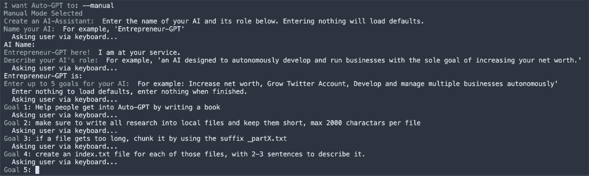

# 第一章：介绍 Auto-GPT

在*前言*中，我写了关于 Auto-GPT 是什么以及它的来源，但我问自己，“*为什么会有人阅读* *这本书？*”

我的意思是，它就是它——一种自动化的**人工智能**（**AI**），它可能帮助你完成一些任务，也可能是一个有时非常神秘的有趣玩具，对吧？

我希望你清楚了解你可以或不可以用它做什么。

当然，你越有创意，它能做的事情就越多，但有时这些边界看起来更多是随机的。例如，假设你刚刚建造了一个房屋建造机器人，它无缘无故拒绝把前门涂成蓝色，尽管你真的想要一个蓝色的门；它总是偏离主题，甚至开始解释什么是门。

当涉及到这些局限性时，Auto-GPT 可能会非常令人沮丧，因为这些限制来源于 OpenAI 的限制（它们在其 GPT 模型中给出）以及编写和编辑 Auto-GPT 的人类（还有你——作为提供指令的用户）。最初看似明确的指令，通过改变一个字符，就可能导致完全不同的结果。

对我来说，这就是它迷人的地方——你总是可以期待它像一个活生生的存在，随机选择做出不同的决定，拥有自己的思想。

注意

始终记住，这是一个快速发展的项目，因此代码可能会在本书发布之前发生变化。也可能是你很晚才买这本书，而 Auto-GPT 已经完全不同。本书的大部分内容集中在 0.4.1 版本，但也考虑到了 0.5.0 版本的变化。

例如，一旦我完成了这本书的草稿，“Forge”（我们在团队会议上提出的一个想法）已经实现了。这是一个实验，允许其他开发者构建他们自己的 Auto-GPT 变种。

Auto-GPT 项目是一个框架，包含了我们在本书中将使用的 Auto-GPT，并且可以启动其他由开发者创建的代理。这些代理存放在添加它们的程序员的仓库中，因此我们在这里不会深入探讨这些内容。

在本章中，我们将介绍 Auto-GPT，包括它的历史和发展，以及 LangChain。本章将帮助你了解 Auto-GPT 是什么，它的意义，以及它是如何发展的。在本章结束时，你将拥有坚实的基础，作为后续章节探索更高级主题的起点。

本章我们将涵盖以下主要主题：

+   Auto-GPT 概述

+   Auto-GPT 的历史与发展

+   LangChain 介绍

# Auto-GPT 概述

**Auto-GPT**或多或少是对它已经描述的内容的一个分类：

“一种自动化生成预训练变换器”

这意味着它自动化了 GPT 或 ChatGPT。然而，在本书中，主要关注的是名为 Auto-GPT 的部分。如果你从未听说过它并且只是出于好奇拿起这本书，那你来对地方了！

**Auto-GPT**最初作为一个实验性的自我提示 AI 应用程序，试图创建一个自主系统，能够创建“代理”来执行各种专业任务，以最少的人类输入来实现更大的目标。它基于 OpenAI 的 GPT，由*Toran Bruce Richards*开发，他在 GitHub 上更为人知的名字是*Significant Gravitas*。

那么，Auto-GPT 是如何思考的呢？Auto-GPT 创建了输入给**大语言模型**（**LLMs**）的提示，并允许 AI 模型生成原创内容和执行命令操作，如浏览、编码等。这代表着自主 AI 发展的重要一步，使它成为 GitHub 历史上增长最快的开源项目（截至本文写作时）。

Auto-GPT 将多个 OpenAI 语言模型——**GPT**——串联起来，通过这样做，它创建了所谓的“代理”，这些代理负责简化任务。这些代理共同协作，以最小的人类干预来完成复杂目标，例如撰写博客。

现在，让我们来谈谈它是如何崭露头角的。

## 从一个实验到成为 GitHub 上增长最快的项目之一

Auto-GPT 最初被命名为**Entrepreneur-GPT**，并于 2023 年 3 月 16 日发布。该项目的初衷是赋予 GPT-4 自主权，看看它能否在商业领域中茁壮成长，并测试其做出现实决策的能力。

一段时间以来，Auto-GPT 的开发几乎没有引起注意，直到 2023 年 3 月下旬。然而，2023 年 3 月 30 日，Significant Gravitas 在推特上发布了 Auto-GPT 最新演示的相关信息，并上传了一个演示视频，随后开始获得关注。真正引发关注的时刻是在 2023 年 4 月 2 日，计算机科学家 Andrej Karpathy 转发了 Significant Gravitas 的一条推文，并表示下一代提示工程的前沿就是 Auto-GPT。

这条推文迅速传播，Auto-GPT 成为社交媒体讨论的话题。由 Auto-GPT 创建的一个代理，名为**ChaosGPT**，因被幽默地分配了“摧毁人类”的任务而特别出名，这也促使了 Auto-GPT 的病毒式传播（[`decrypt.co/126122/meet-chaos-gpt-ai-tool-destroy-humanity`](https://decrypt.co/126122/meet-chaos-gpt-ai-tool-destroy-humanity)）。

当然，我们并不想摧毁人类；若想了解 Entrepreneur-GPT 能做什么，可以查看此处的 Entrepreneur-GPT 旧日志：

[`github.com/Significant-Gravitas/Auto-GPT/blob/c6f61db06cde7bd766e521bf7df1dc0c2285ef73/`](https://github.com/Significant-Gravitas/Auto-GPT/blob/c6f61db06cde7bd766e521bf7df1dc0c2285ef73/)

你在提示和配置上越有创意，Auto-GPT 也会越具创造力。这部分将在*第二章*中详细讲解，我们将一起运行第一个 Auto-GPT 实例。

## LLMs —— AI 的核心

尽管 Auto-GPT 可以与其他 LLM 一起使用，但它最能发挥 GPT-4 的强大功能，GPT-4 是 OpenAI 的一款最先进的语言模型。

对于没有图形卡且无法容纳像 GPT-4 等模型的用户来说，它提供了巨大的优势。尽管有许多 7-B 和 13-B 的 LLMs（**B** 代表 **十亿参数**）与 ChatGPT 相竞争，但它们无法在每个提示中保持足够的上下文，或者稳定性不足，无法实用。

在撰写本文时，GPT-4 和 GPT-3.5-turbo 都是 Auto-GPT 的默认设置。根据情况的复杂性，Auto-GPT 在两种模型之间做出选择：

+   智能模型

+   快速模型

## 在什么情况下，Auto-GPT 会使用 GPT-3.5-turbo 而不是一直使用 GPT-4？

当 Auto-GPT 进行思考时，它使用 *快速模型*。例如，当 Auto-GPT 循环思考时，它使用配置好的快速模型，但在总结网站内容或编写代码时，它会选择使用智能模型。

快速模型的默认设置是 GPT-3.5-turbo。尽管它不如 GPT-4 精确，但它的响应时间更快，从而导致更流畅的响应时间；而 GPT-4 如果思考时间过长，可能会卡住。

OpenAI 还为 Auto-GPT 等应用程序添加了新功能。其中之一是 *调用函数的能力*。在这个新功能出现之前，Auto-GPT 必须向 GPT 解释命令是什么以及如何正确地以文本形式表达它。这样就会出现许多错误，因为 GPT 有时会决定更改预期的输出语法。这是一个巨大的进步，因为这个功能现在减少了命令的沟通和执行的复杂性，使得 GPT 更好地理解每个任务的上下文。

那么，为什么我们不直接使用 LLM 呢？因为 LLM 只是响应型的：

+   它们不能执行任何任务。

+   它们的知识是固定的，无法自我更新。

+   它们不会记住任何事情；只有运行它们的框架可以做到这一点。

## Auto-GPT 如何利用 LLM？

Auto-GPT 的结构是通过终端从用户那里获取初始提示：


图 1.1 – 让 Auto-GPT 定义其角色

在这里，您可以定义一个主要任务，或者输入 `–-manual` 然后回答问题，如下所示：



图 1.2 – 设置 Auto-GPT 的主要目标

然后将主要提示保存为 `ai_settings.yaml` 文件，内容可能如下所示：

```py
ai_goals:
- Conduct a thorough analysis of the current state of the book
  and identify areas for improvement.
- Develop a comprehensive plan for creating task lists that will help you structure research, a detailed outline per chapter and individual parts.
- Be sure to ask the user for feedback and improvements.
- Continuously assess the current state of the work and use the speak property to give the user positive affirmations.
ai_name: AuthorGPT
ai_role: An AI-powered author and researcher specializing in creating comprehensive, well-structured, and engaging content on Auto-GPT and its plugins, while maintaining an open line of communication with the user for feedback and guidance.
api_budget: 120.0
```

让我们来看看前面文件中的一些 AI 组件：

+   首先，我们有 `ai_goals`，它指定了 Auto-GPT 必须承担的主要任务。它将使用这些任务来决定采取哪些具体步骤。每次迭代时，Auto-GPT 会选择一个目标来执行。

+   接着，我们有了`ai_name`，它也被作为参考来定义机器人行为或个性的一部分。这意味着，如果你称它为*AuthorGPT*，它将扮演一个基于 GPT 的作者角色，而如果你称它为*Author*，它将尝试像一个人一样表现。通常很难判断它会如何表现，因为 GPT 大多数时候是根据自己的决定来生成内容的。

+   最后，我们有了`ai_role`，可以将其视为更详细的角色描述。然而，根据我的经验，它只会稍微推动思维。目标在这里更具影响力。

一旦完成，它会总结要做的事情并开始正确思考：


图 1.3 – Auto-GPT 思维过程示例

思考通常意味着它正在向 LLM 发送聊天完成请求。

这个过程可能很慢——使用的令牌越多，需要的处理时间越长。在*理解 LLM 中的令牌*一节中，我们将看看这意味着什么。

一旦 Auto-GPT 开始“思考”，它就会启动一系列的 AI“对话”。在这些对话中，它形成一个查询，发送给 LLM，然后处理回应。这个过程会不断重复，直到找到一个满意的解决方案或达到思考时间的上限。

整个过程产生了思维，这些思维可以分为以下几类：

+   推理

+   规划

+   批评

+   说话

+   命令

然后，这些独立的思维会显示在终端上，用户会被询问是否批准该命令——就是这么简单。

当然，这里发生了更多的事情，包括构建一个提示语来生成回应。

简单来说，Auto-GPT 传递了名称、角色、目标和一些背景信息。你可以在这里看到一个示例：[`github.com/PacktPublishing/Unlocking-the-Power-of-Auto-GPT-and-Its-Plugins/blob/main/Auto-GPT_thoughts_example.md`](https://github.com/PacktPublishing/Unlocking-the-Power-of-Auto-GPT-and-Its-Plugins/blob/main/Auto-GPT_thoughts_example.md)。

## Auto-GPT 的思维过程——理解一-shot 动作

让我们理解一下这个一-shot 动作背后的思维过程：

+   **思维过程概述**：Auto-GPT 基于一-shot 动作进行操作。这个方法涉及将发送给 OpenAI 的每一个数据块作为一个单独的聊天完成动作进行处理。这个过程的结果是生成一个基于指定结构的 GPT 响应文本。

+   **GPT 的结构和任务定义**：提供给 GPT 的结构既包括当前任务，也包括响应格式。这个双重组件的结构确保了 GPT 的回应不仅相关，而且遵循预期的对话格式。

+   **Auto-GPT 中的角色分配**：这里有两个角色分配：

    +   **系统角色**：“系统”角色在提供上下文中起着关键作用。它充当信息传递的载体，并维护与 LLM 的对话历史。

    +   **用户角色**：在过程的末尾，分配了一个“用户”角色。这个角色在引导 GPT 确定接下来的命令执行时至关重要。它遵循预定义的格式，确保交互的一致性。

+   `ask_user`)

+   发送消息（`send_message`）

+   浏览（`browse`）

+   执行代码（`execute_code`）

在某些情况下，Auto-GPT 可能选择不选择任何命令。这通常发生在困惑的情况下，例如当提供的任务不清楚，或者当 Auto-GPT 完成任务并需要用户反馈以采取进一步行动时。

无论如何，每个回应只是一次文本，而且仅仅是正在自动完成的文本，意味着 LLM 仅在一次回应中提供这样的答案。

在以下示例中，我启用了规划插件；稍后会详细介绍插件：

```py
{
"thoughts": {
"text": "I need to start the planning cycle to create a plan for the book.",
"reasoning": "Starting the planning cycle will help me outline the steps needed to achieve my goals.",
"plan":
"- run_planning_cycle
- research Auto-GPT and its plugins
- collaborate with user
- create book structure
- write content
- refine content based on feedback",
"criticism": "I should have started the planning cycle earlier to ensure a smooth start.",
"speak": "I'm going to start the planning cycle to create a plan for the book."
},
"command": {
"name": "run_planning_cycle",
"args": {}
}
}
```

每个思考属性随后会显示给用户，并且如果启用了语音合成，“说话”输出会被朗读出来：

```py
"I am going to start the planning cycle to create a plan for the book. I want to run planning cycle."
```

用户现在可以通过以下方式之一进行回应：

+   `y`：接受执行。

+   `n`：拒绝执行并关闭 Auto-GPT。

+   `s`：让 Auto-GPT 重新评估其决定。

+   `y -n`：告诉 Auto-GPT 继续进行若干步骤（例如，输入`y -5`，允许它自行运行 5 步）。其中，`n`始终是一个数字。

如果用户确认，命令将被执行，并且该命令的结果将作为系统内容添加：

```py
# Check if there is a result from the command append it to the message
# history
if result is not None:
self.history.add("system", result, "action_result")
```

此时，你可能会想知道在这个上下文中“历史”是什么，为什么是`self`？

Auto-GPT 使用代理，并且代理的实例拥有自己的历史，这充当短期记忆。它包含了之前消息和结果的上下文。

每次运行代理时，历史记录会被精简，以确保它不会超过令牌限制。

那么，为什么不直接要求 LLM 提供解决方案呢？这样做有几个原因：

+   尽管大语言模型（LLMs）非常复杂，但它们无法在一次查询中解决复杂的多步骤问题。相反，它们需要通过一系列相互关联的问题来引导它们走向最终解决方案。这就是 Auto-GPT 的优势所在——它可以战略性地提出这些问题并处理答案。

+   LLMs 无法保持上下文。它们不会记住之前的查询或答案，这意味着它们无法基于过去的知识回答未来的问题。Auto-GPT 通过维护对话历史来弥补这一点，使其能够理解先前查询和回应的上下文，并利用这些信息来构建新的查询。

+   虽然 LLM 是生成类人文本的强大工具，但它们不能主动行动。它们响应提示，但不会主动寻找新的任务或知识。而 Auto-GPT 则被设计得更加主动。它不仅响应已分配给它的任务，还主动探索完成这些任务的多种方式，使其成为真正的自主代理。

在我们深入了解 Auto-GPT 如何利用 LLM 之前，理解这些模型如何处理信息的一个关键组成部分非常重要：**令牌**。

# 理解 LLM 中的令牌

令牌是 LLM（如 GPT-3 和 GPT-4）中的基本构建块。它们是知识的单元，基于给定的上下文，它们之间的接近程度可能有所不同。一个令牌可以表示一个单词、一个符号，甚至是单词的碎片。

## 语言处理中的分词

在训练 LLM 时，文本数据被分解为更小的单元，或称为令牌。例如，句子“ChatGPT is great!”会被分解为`["ChatGPT", "is", "great", "!"]`等令牌。令牌的性质在不同语言和编码范式之间可能有很大不同：

+   在英语中，令牌通常表示一个单词或部分单词。

+   在其他语言中，令牌可能表示音节或字符。

+   在编程语言中，令牌可以包括关键字、运算符或变量。

让我们看一些分词的例子：

+   `["ChatGPT", "is", "``great", "!"]`。

+   `print("Hello, World!")` 被分词为 `["print", "(", " ", "Hello", "," , " ", "World", "!"", ")"]`。

## 平衡细节与计算资源

分词策略旨在平衡细节与计算效率。更多的令牌提供更大的细节，但需要更多的资源来处理。这种平衡对模型在更细致的层面上理解和生成文本至关重要。

### LLM 中的令牌限制

令牌限制表示模型（如 GPT-3 或 GPT-4）在一次交互中可以处理的最大令牌数。设定此限制是因为处理大量令牌所需的计算资源。

令牌限制还会影响模型的“注意力”能力——它在输出生成过程中优先处理输入的不同部分的能力。

### 令牌限制的影响

一个具有令牌限制的模型可能无法完全处理超过该限制的输入。例如，若令牌限制为 20，30 个令牌的文本需要分成更小的片段才能有效地处理。

在编程中，分词有助于理解代码结构和语法，这对于代码生成或解释等任务至关重要。

总结来说，分词是**自然语言处理**（**NLP**）中的一个关键组成部分，使大语言模型能够以有意义且上下文准确的方式解读和生成文本。

例如，如果你使用该模型来生成 Python 代码，并将`["print", "("]`作为输入令牌，你会期望模型生成一个有效的参数，以便传递给 `print` 函数——例如，`[""Hello,` `World!"", ")"]`。

在接下来的章节中，我们将深入探讨 Auto-GPT 的工作原理、其能力，以及如何使用它来解决复杂问题或自动化任务。我们还将介绍它的插件，扩展了其功能，并使其能够与外部系统互动，例如它能够点外卖披萨。

简而言之，Auto-GPT 就像一个非常智能、非常执着的助手，利用最先进的 AI 技术来完成你为它设定的目标。无论你是 AI 研究员、开发者，还是单纯对 AI 潜力感到着迷的人，我希望这本书能为你提供你需要的知识和灵感，帮助你最大限度地利用 Auto-GPT。

在写作时（2023 年 6 月 1 日），Auto-GPT 不仅可以通过终端提供反馈。现在有多种文本转语音引擎已内置于 Auto-GPT 中。根据你的喜好，你可以选择默认的 Google 文本转语音选项、ElevenLabs、macOS 的 `say` 命令（一个低质量的 Siri 语音包），或 Silero TTS。

在插件方面，Auto-GPT 变得更加强大。目前，官方插件仓库中列出了许多令人赞叹的插件，如 Planner 插件、Discord、Telegram、本地或不同 LLM 的文本生成插件等。

这种模块化使得 Auto-GPT 成为我接触过的最令人兴奋的事物。

# 推出并推进 Auto-GPT——创新与社区的故事

Auto-GPT 的开发始于一个大胆的愿景：使 GPT-4 的复杂技术变得更加易于访问和用户友好。这一举措标志着一个持续不断的旅程的开始，该项目通过不断整合新特性和改进而不断发展。在其核心，Auto-GPT 是一个合作性的努力，持续受到开发者和研究人员社区贡献的推动。

Auto-GPT 的起源可以追溯到发现 GPT-4 在自动任务完成方面的潜力。这一突破成为创建一个能够充分利用 GPT-4 能力的平台的催化剂，提供给用户广泛的控制和自定义选项。

该项目最初通过一个早期版本 *Entrepreneur-GPT* 获得了关注，这是一个关键的里程碑，展示了当时 Auto-GPT 的能力。项目的这一阶段（详见：

[`github.com/PacktPublishing/Unlocking-the-Power-of-Auto-GPT-and-Its-Plugins/blob/main/Entrepreneur-GPT.md`](https://github.com/PacktPublishing/Unlocking-the-Power-of-Auto-GPT-and-Its-Plugins/blob/main/Entrepreneur-GPT.md) 显示了与后期阶段相比，提示和功能的差异。通过回顾 Git 历史，可以了解 Auto-GPT 早期的功能，包括在线研究和使用本地数据库进行长期记忆。

Auto-GPT 的崛起非常迅速，吸引了许多贡献者——包括我自己——在其开发的早期阶段就参与其中。我在这个开源项目中的经历是变革性的，提供了一种令人上瘾的激情与创新兴奋的结合。贡献者们的奉献精神带来了自豪感，尤其是当你看到自己的工作被更广泛的受众认可时，包括一些流行的 YouTube 博主。

作为一个开源项目，Auto-GPT 依赖于志愿者的贡献，形成了一个显著增强其结构的团队。这个团队在管理传入的拉取请求和指导开发路径方面发挥了重要作用，从而不断改进 Auto-GPT 的核心。

尽管其人气不断上升，但每次 Auto-GPT 发布的新版本都带来了更强大的功能。这些版本是经过社区精心测试的稳定版本，确保没有 bug，并准备好供公众使用。

Auto-GPT 进化的一个关键组成部分是其插件。这些插件在平台的定制中起着重要作用，使用户能够根据自身需求进行调整。未来的讨论将深入探讨这些插件，并将探索其安装、使用以及对提升 Auto-GPT 功能的影响。这一探索至关重要，因为大多数定制工作都是通过插件实现的，除非通过拉取请求对核心平台做出重大贡献。

# LangChain 简介

尽管 *LangChain* 本身并不是 Auto-GPT 的一部分，但它是 Auto-GPT 开发中的关键组成部分，因为它专注于使用控制的过程。这与 Auto-GPT 强调没有控制的结果相对立。

LangChain 是一个强大的工具，使用户能够利用 LLM 原语构建自己的 Auto-GPT 实现。它支持显式推理，并使 Auto-GPT 有可能成为一个自主代理。

随着多个 Auto-GPT 替代方案的出现，LangChain 已成为其中许多方案的一部分。其中一个例子是 AgentGPT。

LangChain 在语言处理和控制方面的独特方法使其成为 AgentGPT 功能的重要组成部分。通过将 LangChain 和 Auto-GPT 的优势结合起来，用户可以创建强大且定制的解决方案，充分发挥 GPT 的潜力。

## LangChain 与 Auto-GPT 的交集

LangChain 和 Auto-GPT 可能有不同的侧重点，但它们共同的目标是增强 LLM（大语言模型）的能力，这种目标使得它们之间形成了天然的协同作用。LangChain 提供结构化、可控的过程，与 Auto-GPT 专注于自动化任务完成相得益彰。二者结合，提供了一个集成的解决方案，既控制了方法，又实现了目标，在过程和结果之间取得了平衡。

LangChain 使得在 Auto-GPT 中明确推理的潜力得以实现。它提供了一条路径，将模型从一个由人类指引的工具，转变为一个能够做出明智且有理性决策的自主管理代理。

此外，LangChain 对语言处理的控制增强了 Auto-GPT 在 JSON 格式中传达用户友好信息的能力，使其成为一个对用户更为友好的平台。通过优化语言处理和控制，LangChain 显著提高了 Auto-GPT 与用户的互动体验。

你可以阅读更多内容：[`docs.langchain.com/docs/`](https://docs.langchain.com/docs/)。

# 摘要

在这一章中，我们开始了探索 Auto-GPT 这一创新 AI 应用的激动人心的旅程。Auto-GPT 利用 GPT-4 的强大能力，能够自主解决任务并在浏览器环境中运行。我们深入了解了 Auto-GPT 的历史，理解了它如何从一个雄心勃勃的实验演变成一个正在改变我们与 AI 互动方式的强大工具。

我们还探讨了令牌（tokens）的概念，令牌在像 GPT-4 这样的 LLM 处理信息时起着至关重要的作用。理解这个基本概念将帮助我们更好地理解 Auto-GPT 如何与 LLM 交互，从而生成有意义且符合上下文的响应。

此外，我们还讨论了 LangChain 的角色，这是一种通过提供对语言处理的结构化控制，来补充 Auto-GPT 的工具。LangChain 和 Auto-GPT 的交集创造了强大的协同效应，增强了 Auto-GPT 的能力，并为更高级的 AI 应用铺平了道路。

随着我们继续前进，我们将深入研究 Auto-GPT 的工作原理，探索它的插件、安装过程以及如何制定有效的提示语。我们还将深入探讨更高级的话题，例如如何将你自己的 LLM 集成到 Auto-GPT 中，如何设置 Docker，以及如何安全有效地使用持续模式。

无论你是 AI 爱好者、开发者，还是仅仅对 AI 潜力充满好奇的人，这段旅程都将会是一次引人入胜的经历。所以，系好安全带，让我们继续一起揭开 Auto-GPT 巨大潜力的面纱！
