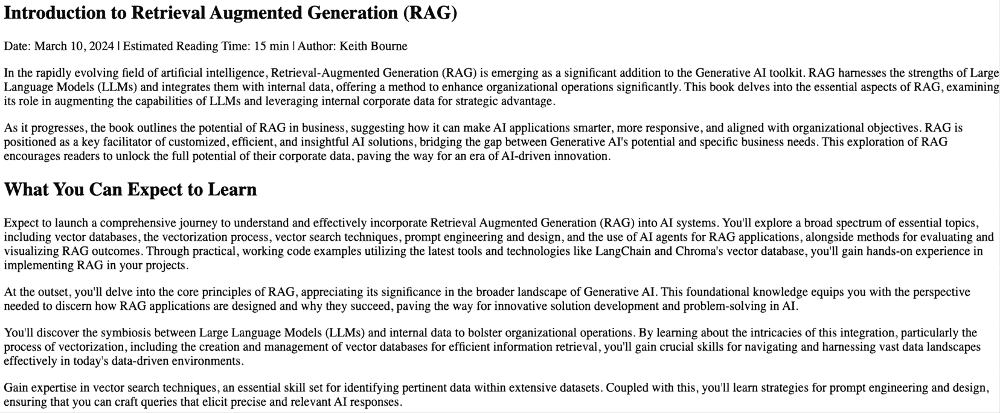

# 第二章：代码实验室：完整的 RAG 管道

本代码实验室为本书中其余代码奠定了基础。我们将在本章中详细讲解整个**检索增强生成**（**RAG**）管道。然后，随着我们逐步阅读本书，我们将查看代码的不同部分，并在过程中添加增强功能，以便您全面了解代码如何进化以解决越来越复杂的问题。在本书的最后阶段，我们将探讨 RAG 的高级应用，从语义缓存优化到将 RAG 作为高级自主代理的基础。这些是只有最先进的 AI 开发者才会使用的应用，您将有机会亲自构建它们！

我们将本章用于逐步讲解 RAG 管道的每个组件，包括以下方面：

+   使用 OpenAI 设置 LLM 账户

+   代码实验室 2.1 – 构建您的第一个 RAG 管道

在我们逐步分析代码的过程中，您将通过使用 LangChain、Chroma 和 OpenAI 的 API 等工具，程序性地全面理解 RAG 过程中的每一步。这将为您提供一个强大的基础，我们将在后续章节中在此基础上进行增强和进化，以解决越来越复杂的问题。

在后续章节中，我们将探讨可以帮助改进和定制不同用例的管道以及构建 RAG 驱动应用程序时遇到的常见挑战的解决方法。让我们深入探讨并开始构建吧！

# 技术要求

本章的代码可在以下链接找到：[`github.com/PacktPublishing/Unlocking-Data-with-Generative-AI-and-RAG-Second-Edition/tree/main/CHAPTER_02`](https://github.com/PacktPublishing/Unlocking-Data-with-Generative-AI-and-RAG-Second-Edition/tree/main/CHAPTER_02).

您需要在已设置好运行 Jupyter 笔记本的环境下运行本章的代码。熟悉 Jupyter 笔记本是使用本书的先决条件；我们无法在简短的文字中提供全面的介绍。设置笔记本环境有众多方法。有在线版本、可下载的版本、大学为学生提供的笔记本环境，以及您可以使用的不同界面。如果您是在为公司执行这项工作，他们可能有一个您需要熟悉的环境。每个选项的设置说明都大相径庭，而且这些说明经常变化。如果您需要更新关于此类环境的知识，可以从 Jupyter 网站开始：[`docs.jupyter.org/en/latest/`](https://docs.jupyter.org/en/latest/)。从这里开始，然后向您最喜欢的 LLM 寻求更多帮助以设置您的环境。

我使用什么？通常，当我旅行时，我会使用我的 Chromebook 和设置在某个云环境中的一个笔记本。我更喜欢 Google Colab 或他们的 Colab Enterprise 笔记本，你可以在 Google Cloud Platform 的**Vertex AI**部分找到它们。但这些环境需要付费，如果你很活跃，通常每月超过$20！如果你像我一样活跃，每月可能超过$1,000！

作为我如此活跃时的成本效益替代方案，我使用**Visual Studio Code**（**VS Code**）在本地运行 Jupyter 笔记本。VS Code 对 Jupyter 笔记本有出色的内置支持，并在你的本地机器上提供熟悉且强大的开发环境。你可以为 VS Code 安装 Python 扩展，它包括原生的笔记本支持，并且可以在没有任何云成本的情况下运行笔记本。这种方法在 Mac、Windows 和 Linux 系统上效果良好。主要的权衡是你受限于本地机器的计算资源，除非你配置了远程连接，否则你将无法访问强大的云 GPU。但对于许多 RAG 应用和一般开发工作，本地执行完全足够，并且消除了持续的云成本。

最终，主要要求是找到一个可以在其中使用 Python 3 运行 Jupyter 笔记本的环境。我们将提供的代码将指示你需要安装的其他包。

**注意**

所有这些代码都假设你在 Jupyter 笔记本中工作。你可以在 Python 文件（`.py`）中直接这样做，但你可能需要更改其中的一些内容。在笔记本中运行它让你能够逐个单元格地逐步执行，并更好地理解整个过程。

在下面的编码示例中，我们不会处理接口；我们将在*第六章*中介绍这一点。在此期间，我们将简单地创建一个字符串变量，代表用户会输入的提示，并将其用作完整接口输入的填充。

# 使用 OpenAI 设置 LLM 账户

对于公众来说，OpenAI 的 ChatGPT 模型目前是最受欢迎和最知名的**大型语言模型**（**LLMs**）。然而，市场上还有许多其他 LLMs，适用于各种用途。你并不总是需要使用最昂贵、最强大的 LLM。一些 LLMs 专注于一个领域，例如专注于医学研究的 Meditron LLMs，它们是 Llama 2 的微调版本。如果你在医学领域，你可能想使用那个 LLM，因为它可能在你所在的领域中比一个大型的通用 LLM 表现得更好。通常，LLMs 可以用作其他 LLMs 的二次检查，所以在这种情况下你需要不止一个。我强烈建议你不要只使用你曾经使用过的第一个 LLM，而是寻找最适合你需求的 LLM。但为了使本书早期内容更简单，我将讨论如何设置 OpenAI 的 ChatGPT：

1.  前往 OpenAI 平台网站([`platform.openai.com`](https://platform.openai.com))并注册账户，如果您还没有的话。注册过程很简单。您可以使用 Google、Microsoft、Apple 或您自己的电子邮件地址进行注册。

1.  登录后，您可能想通过创建一个项目来组织您的工作。项目可以帮助您管理 API 密钥、设置计费限制，并为不同的应用程序分别跟踪使用情况。

警告：使用 OpenAI 的 API 需要付费！请谨慎使用！在可能的情况下，在开始时寻找并使用最便宜的模式。

1.  在您的项目设置中导航到**API 密钥**部分，并点击**创建新的密钥**。

1.  在创建 API 密钥时，您需要在两种所有权类型之间进行选择：

    1.  **您**：密钥与您的用户账户绑定，非常适合个人发展和本地实验。

    1.  **服务账户**：这是一个属于项目而不是个人的机器人身份。它非常适合生产服务器，因为它可以经受团队变化。

1.  选择您的密钥的权限级别：

    1.  **所有**：对所有项目 API 的完全访问权限（默认设置）。

    1.  **受限**：细粒度控制，您可以针对每个端点组选择无权限、读取或写入权限（例如，仅启用嵌入或拒绝助手）。

    1.  **只读**：只能列出和读取元数据。不能调用生成内容的端点。

1.  *立即复制显示的密钥。* 您只会看到一次。如果您丢失了它，您将需要生成一个新的密钥。请确保这个密钥绝对保密。任何能够访问它的人都可以使用您的账户，并且您将为其使用付费。

1.  OpenAI 现在使用预付费计费系统。您必须提前购买信用额度才能使用 API。最低购买金额为 5 美元。您可以设置自动充值，当您的余额低于阈值时，系统会自动添加信用额度，并且您可以设置充值上限，以限制每月的总自动充值次数。请注意，购买的信用额度在一年后过期，且不可退款。

1.  为了控制成本，最初可以考虑关闭自动充值或设置一个较低的充值上限，直到您了解自己的典型使用模式。

通过这样，您已经设置了将成为您 RAG 管道**大脑**的关键组件：LLM！现在我们准备构建我们的第一个完整的 RAG 应用程序。在接下来的代码实验室中，我们将逐步介绍每个组件，从加载数据和处理数据到创建向量数据库，并将所有内容连接起来形成一个工作的问题回答系统。

# 代码实验室 2.1 – 构建您的第一个 RAG 管道

在这个代码实验室中，我们将使用 LangChain、Chroma DB 和 OpenAI 实现一个完整的 RAG 管道。我们将从加载和处理网页内容开始，然后创建一个向量数据库以实现语义搜索，最后将所有内容连接起来，以便我们可以提问并获得上下文准确的答案。

该管道演示了 RAG 的三个核心阶段：索引（准备和存储您的数据）、检索（查找相关信息）和生成（使用 LLM 根据检索到的上下文创建答案）。虽然这个初始实现很简单，但它为我们后续章节中处理更复杂场景和优化性能奠定了基础。

## 第 1 步 - 安装依赖项

确保这些包已安装在你的 Python 环境中。在你的笔记本的第一个单元中添加以下代码行：

```py
%pip install --upgrade pip
# Uninstall conflicting packages (including packages that depend on old langchain)
%pip uninstall -y langchain-community langchain-text-splitters langchain-openai langchain-core langsmith beautifulsoup4 python-dotenv langchain-chroma chromadb langchain langchain-together ragas langmem
# Install compatible versions of langchain-core and langchain-openai
%pip install langchain-community==0.4.1
%pip install langchain-text-splitters==1.0.0
%pip install langchain-openai==1.1.0
%pip install langsmith==0.4.49
%pip install langchain==1.1.0
# Install remaining packages
%pip install langchain-chroma==1.0.0
%pip install chromadb==1.3.5
%pip install beautifulsoup4==4.14.2
%pip install python-dotenv==1.2.1 
```

以下代码首先升级`pip`，然后卸载这些包的任何现有版本以避免依赖冲突，最后安装本教程所需的特定版本。这种方法确保了无论你的环境中可能已经有什么包，都能进行干净的安装。

**注意**

如果你在卸载步骤中看到提及 langchain-together、ragas 或 langmem 等包的依赖冲突警告，这些可以安全忽略。这些警告表明你的环境中还有其他包尚未更新为 LangChain 1.x 版本，并且对于这个实验不是必需的。

下面是安装的每个库的分解：

+   `langchain_community`：这是一个由社区驱动的 LangChain 库包，它是一个用于构建 LLM 应用程序的开源框架。它提供了一套工具和组件，用于与 LLM 一起工作并将它们集成到各种应用程序中，包括从各种来源摄取数据的文档加载器。

+   `langchain_text_splitters`：此包提供将文档拆分为可管理块的工具。它从主 LangChain 包中分离出来，以实现更好的模块化，并包含适用于不同用例的各种拆分器。

+   `langchain-openai`：此包提供 LangChain 与 OpenAI 语言模型的集成。它允许你轻松地将 OpenAI 的聊天模型和嵌入模型集成到你的 LangChain 应用程序中。

+   `langsmith`：这是 LangSmith SDK，它提供了访问 LangChain Hub 以拉取预构建提示模板的功能。LangSmith 是 LangChain 的统一开发者平台，用于构建、测试和监控 LLM 应用程序。它还支持调试你的链的可观察性和跟踪。

+   `langchain-chroma`：此包提供 LangChain 与 Chroma 的集成，允许你在 LangChain 生态系统中使用 Chroma 作为向量存储。它被分离成自己的包，以实现更好的模块化。

+   `chromadb`：这是 Chroma DB 的包名，它是一个高性能的嵌入/向量数据库，旨在进行高效的相似性搜索和检索。

+   `langchain`: 这是 LangChain 库本身的核心。它提供了一个框架和一组抽象，用于构建使用 LLM 的应用程序。LangChain 包括构建有效的 RAG 管道所需的所有组件，包括提示、内存管理、代理以及其他与各种外部工具和服务的集成。

+   `beautifulsoup4`: 这是一个用于网络爬取和从网页中提取干净内容的 HTML 解析库。

+   `python-dotenv`: 这是一个实用库，可以从`.env`文件中读取键值对并将它们设置为环境变量，这使得在不将它们硬编码到您的代码中时管理配置和 API 密钥变得容易。

在运行前面的第一个笔记本单元后，您需要重新启动您的内核才能访问您刚刚在环境中安装的所有新包。根据您所处的环境，这可以通过多种方式完成。通常，您会看到一个可以使用的刷新按钮，或者在菜单中的**重启内核**选项。

如果您找不到重启内核的方法，请添加此单元并运行它：

```py
import IPython
app = IPython.Application.instance(;
    app.kernel.do_shutdown(True) 
```

这是一个在 IPython 环境（笔记本）中执行内核重启的代码版本。您可能不需要它，但这里提供给您以防万一！

一旦您安装了这些包并重新启动了您的内核，您就可以开始编码了！让我们从导入您在环境中刚刚安装的许多包开始。

## 第 2 步 – 导入

现在，让我们导入执行 RAG 相关任务所需的所有库。我在每个导入组顶部提供了注释，以指示导入与 RAG 的哪个领域相关。这，加上以下列表中的描述，为您提供了对您第一次 RAG 管道所需的一切的基本介绍：

```py
import os
from langchain_community.document_loaders import WebBaseLoader
import bs4
import openai
from langchain_openai import ChatOpenAI, OpenAIEmbeddings
from langsmith import Client
from langchain_core.output_parsers import StrOutputParser
from langchain_core.runnables import RunnablePassthrough
from langchain_chroma import Chroma
from langchain_text_splitters import RecursiveCharacterTextSplitter
from langchain_chroma import Chroma 
```

让我们逐一查看这些导入：

+   `import os`: 这提供了一种与操作系统交互的方式。它对于执行操作，如访问环境变量和与文件路径一起工作很有用。

+   `from langchain_community.document_loaders import WebBaseLoader`: `WebBaseLoader`类是一个文档加载器，可以获取和加载网页作为文档。

+   `import bs4`: `bs4`模块，代表**Beautiful Soup 4**，是一个流行的网络爬取和解析 HTML 或 XML 文档的库。由于我们将要处理网页，这为我们提供了一个简单的方法来分别提取标题、内容和标题。

+   `import openai`: 这提供了一个与 OpenAI 的语言模型和 API 交互的接口。

+   `from langchain_openai import ChatOpenAI, OpenAIEmbeddings`: 这导入了`ChatOpenAI`（用于 LLM）和`OpenAIEmbeddings`（用于嵌入），它们是使用 OpenAI 模型并直接与 LangChain 一起工作的语言模型和嵌入的特定实现。

+   `from langsmith import Client`: 来自 LangSmith SDK 的`Client`类提供了对 LangChain Hub 的访问，您可以从那里拉取预构建的提示模板和其他组件。

+   `from langchain_core.output_parsers import StrOutputParser`: 此组件解析语言模型生成的输出，并提取相关信息。在这种情况下，它假设语言模型的输出是一个字符串，并原样返回它。

+   `from langchain_core.runnables import RunnablePassthrough`: 此组件将问题或查询原样传递，不进行任何修改。它允许将问题直接用于链的后续步骤。

+   `from langchain_chroma import Chroma`: 这提供了一个使用 LangChain 与 Chroma 向量数据库交互的接口。这个集成包从`langchain-community`中分离出来，成为一个独立的专用包，以实现更好的模块化和维护。

+   `From langchain_text_splitters import RecursiveCharacterTextSplitter`: `RecursiveCharacterTextSplitter`是一个文本分割实用工具，它将长文本分解成更易于管理的片段，同时尽量保持语义相关的文本在一起。它通过递归尝试在不同的字符（如段落、句子、单词）上分割，直到块足够小为止。

+   `from dotenv import load_dotenv`: 这行代码导入`load_dotenv`函数，该函数从`.env`文件中读取键值对并将其设置为环境变量。这是一种在不将敏感信息硬编码到代码中的情况下管理 API 密钥和其他配置的干净方法。

这些导入提供了设置你的 RAG 管道所需的 Python 基本包。你的下一步将是将你的环境连接到 OpenAI 的 API。

## 第 3 步 – OpenAI 连接

现在，我们将使用从文件加载的环境变量来设置与 OpenAI 的连接。这种方法将你的 API 密钥从代码中移除，这是一种比硬编码敏感凭证更安全的做法。

首先，在你的笔记本所在目录中创建一个名为`env.txt`的文件，并包含以下内容：

`OPENAI_API_KEY=sk-###################`

将`sk-###################`替换为你的实际 OpenAI API 密钥。然后，使用以下代码来加载它：

```py
_ = load_dotenv(dotenv_path='env.txt')
os.environ['OPENAI_API_KEY'] = 'sk-###################'
openai.api_key = os.environ['OPENAI_API_KEY'] 
```

让我们分解一下这段代码的功能：

+   `load_dotenv(dotenv_path='env.txt')`: 这行代码从你的`env.txt`文件中读取键值对，并将它们作为环境变量提供。下划线（`_`）用于丢弃返回值，因为我们不需要它。

+   `os.environ['OPENAI_API_KEY'] = os.getenv('OPENAI_API_KEY')`: 这行代码从环境中检索 API 密钥，并显式地在`os.environ`中设置它，确保它对所有寻找它的库都是可用的。

+   `openai.api_key = os.environ['OPENAI_API_KEY']`: 这行代码直接为 OpenAI 库设置 API 密钥。

    **重要提示**

    如果你正在使用版本控制，请确保将`env.txt`添加到`.gitignore`文件中。这可以防止你的 API 密钥意外提交到存储库。我们将在*第五章*中介绍额外的安全实践。

你可能已经猜到，这个 OpenAI API 密钥将用于连接到 ChatGPT LLM。但 ChatGPT 并不是我们唯一会使用的 OpenAI 服务。这个 API 密钥也用于访问 OpenAI 嵌入服务。在下一节中，我们将专注于编码 RAG 过程的索引阶段，我们将利用 OpenAI 嵌入服务将你的内容转换为向量嵌入，这是 RAG 管道的关键方面。

## 第 4 步 – 索引

接下来的几个步骤代表*索引*阶段，其中我们获取目标数据，对其进行预处理，并将其向量化。这些步骤通常在*离线*时完成，这意味着它们是为了准备应用程序的后续使用而完成的。但在某些情况下，在实时环境中这样做可能是有意义的，例如在数据变化迅速且使用的数据相对较小的情况下。在这个特定的例子中，步骤如下：

1.  网页加载和爬取。

1.  将数据分割成可消化的块，以便于 Chroma DB 向量化算法处理。

1.  将这些块嵌入并索引。

1.  将这些块和嵌入添加到 Chroma DB 向量存储中。

让我们从第一步开始：网页加载和爬取。

### 网页加载和爬取

首先，我们需要获取我们的数据。当然，这可以是任何东西，但我们必须从某个地方开始！

对于我们的示例，我提供了一个基于*第一章*中一些内容的网页示例。我采用了 LangChain 提供的示例中的原始结构，可以在[`lilianweng.github.io/posts/2023-06-23-agent/`](https://lilianweng.github.io/posts/2023-06-23-agent/)找到。

如果你阅读时这个网页仍然可用，你也可以尝试这个网页，但请确保将你用于查询内容的查询问题改为更适合该页面上内容的查询。此外，如果你更改网页，你还需要重新启动你的内核；否则，如果你重新运行加载器，它将包含两个网页的内容！这可能正是你想要的，但我只是让你知道！

我还鼓励你尝试使用其他网页，看看这些网页会带来哪些挑战。与大多数网页相比，这个示例涉及的数据非常干净，而大多数网页通常充满了广告和其他你不想显示的内容。但你可以找到一个相对干净的博客文章并拉取它，或者你可以自己创建一个。尝试不同的网页，看看结果！

```py
loader = WebBaseLoader(
    web_paths=("https://kbourne.github.io/chapter1.html",),
    bs_kwargs=dict(
        parse_only=bs4.SoupStrainer(
           class_=("post-content", "post-title",
                   "post-header")
        )
    ),
)
docs = loader.load() 
```

上一段代码从`langchain_community document_loaders`模块中的`WebBaseLoader`类开始，用于将网页作为文档加载。让我们来分解一下。

`WebBaseLoader`类使用以下参数实例化：

+   `web_paths`：一个包含要加载的网页 URLs 的元组。在这种情况下，它包含一个单独的 URL：`https://kbourne.github.io/chapter1.html`。

+   `bs_kwargs`：一个字典，包含传递给 BeautifulSoup 解析器的关键字参数。

+   `parse_only`：一个 `bs4.SoupStrainer` 对象，指定要解析的 HTML 元素。在这种情况下，它被设置为仅解析具有 CSS 类的元素，例如 post-content、post-title 和 post-header。

`WebBaseLoader` 实例启动一系列步骤，代表将文档加载到您的环境中：在 `loader` 上调用 `load` 方法，即获取和加载指定网页作为文档的 `WebBaseLoader` 实例。内部，加载器正在做很多事情！

以下是基于这段少量代码执行的步骤：

1.  向指定的 URL 发送 HTTP 请求以获取网页

1.  使用 `BeautifulSoup` 解析网页的 HTML 内容，仅考虑由 `parse_only` 参数指定的元素

1.  从解析的 HTML 元素中提取相关文本内容

1.  为每个包含提取的文本内容和元数据（如源 URL）的网页创建 `Document` 对象

生成的 `Document` 对象存储在 `docs` 变量中，以便在代码中进一步使用！

我们传递给 `bs4`（post-content、post-title 和 post-header）的类是 CSS 类。如果您使用的是没有这些 CSS 类的 HTML 页面，这将不起作用。因此，如果您使用的是不同的 URL 并且没有获取到数据，请查看您正在爬取的 HTML 中的 CSS 标签。许多网页确实使用这种模式，但并非所有！爬取网页会带来许多这样的挑战。

一旦从数据源收集到文档，您需要对其进行预处理。在这种情况下，这涉及到分割。

## 第 5 步 – 分割

如果您使用提供的 URL，您将仅解析具有 post-content、post-title 和 post-header CSS 类的元素。这将提取主要文章正文（通常由 post-content 类识别）的文本内容、博客文章的标题（通常由 post-title 类识别）以及任何标题信息（通常由 post-header 类识别）。

如果您好奇，这是该文档在网页上的样子（*图 2.1*）：



图 2.1 – 我们将处理的网页

它还会深入很多页面！这里的内容也很多，对于 LLM 直接处理来说太多了。因此，我们需要将文档分割成可消化的块：

```py
text_splitter = RecursiveCharacterTextSplitter(
    chunk_size=1000,
    chunk_overlap=200,
    length_function=len,
    is_separator_regex=False,
)
splits = text_splitter.split_documents(docs) 
```

`RecursiveCharacterTextSplitter` 是用于通用文本的推荐文本分割器。它通过递归尝试以特定顺序在不同字符上分割文本，直到块足够小。默认情况下，它尝试在 `["\n\n", "\n", " ", ""]` 上分割，这意味着它首先尝试保持段落在一起，然后是句子，然后是单词。这种方法通过尽可能长时间地保持自然相关的文本块来帮助保持语义连贯性。

我们使用的参数如下：

+   `chunk_size=1000`：将每个块限制在大约 1,000 个字符。

+   `chunk_overlap=200`: 在连续块之间包含 200 个字符的重叠，以帮助在边界处保留上下文。

+   `length_function=len`: 使用 Python 内置的 `len()` 函数来测量块的大小。

+   `is_separator_regex=False`: 将分隔符视为字面字符串，而不是正则表达式。我鼓励你尝试不同的分割器，看看会发生什么！例如，你可能想尝试不同的块大小或重叠量。

在 *第十一章* 中，我们将探讨其他文本分割器，包括 `SemanticChunker`，并看看它们与 `RecursiveCharacterTextSplitter` 在此内容上的比较。也许在你的特定情况下，速度比质量更重要，所以问题是哪个分割器更快？

一旦将内容分割成块，下一步就是将其转换为我们所谈论的向量嵌入！

## 第 6 步 – 嵌入和索引块

接下来的几个步骤代表检索和生成步骤，我们将使用 Chroma DB 作为向量数据库。如前所述多次，Chroma DB 是一个优秀的向量存储！我选择这个向量存储是因为它易于本地运行，并且对于此类演示效果良好，但它确实是一个相当强大的向量存储。如您所回忆的，当我们谈论词汇和向量存储与向量数据库之间的区别时，Chroma DB 确实是两者兼备！Chroma 是你的向量存储的许多选项之一。在第 *第七章* 中，我们将讨论许多向量存储选项以及选择其中一个而不是另一个的原因。其中一些选项甚至提供免费的向量嵌入生成。

我们在这里也使用 OpenAI 嵌入，它将使用我们的 OpenAI 密钥将我们的数据块发送到 OpenAI API，将它们转换为嵌入，并以数学形式发送回来。请注意，这确实会花费金钱！每个嵌入的费用是几分之一美分，但这是值得注意的。因此，如果你在预算紧张的情况下使用此代码，请谨慎使用！在第 *第七章* 中，我们将回顾一些使用免费向量服务免费生成这些嵌入的方法：

```py
vectorstore = Chroma.from_documents(
    documents=splits,
    embedding=OpenAIEmbeddings())
retriever = vectorstore.as_retriever() 
```

首先，我们使用 `Chroma.from_documents` 方法创建 Chroma 向量存储，该方法用于从分割的文档中创建 Chroma 向量存储。这是我们创建 Chroma 数据库的许多方法之一。这通常取决于来源，但针对这种方法，它需要以下参数：

+   `documents`: 从前面的代码片段中获得的分割文档（分割）列表

+   `embedding`: `OpenAIEmbeddings` 类的一个实例，用于为文档生成嵌入

在内部，该方法执行了一些操作：

1.  它遍历 `splits` 列表中的每个 `Document` 对象。

1.  对于每个`Document`对象，它使用提供的`OpenAIEmbeddings`实例生成一个嵌入向量。

1.  它将文档文本及其对应的嵌入向量存储在 Chroma 向量数据库中。

到目前为止，你现在有一个名为`vectorstore`的向量数据库，它充满了嵌入，这些嵌入是……？没错；是你刚刚爬取的网页上所有内容的数学表示！太酷了！

但下一部分是什么？是一个检索器吗？是犬类的吗？不，这是创建你将用于在新的向量数据库上执行向量相似性搜索的机制。你直接在`vectorstore`实例上调用`asretriever`方法来创建检索器。检索器是一个提供方便接口以执行这些相似性搜索并基于这些搜索从向量数据库检索相关文档的对象。

如果你只想执行文档检索过程，你可以这样做。这并不是代码的官方部分，但如果你想测试这个，可以在额外的单元中添加它并运行：

```py
query = "How does RAG compare with fine-tuning?"
relevant_docs = retriever.get_relevant_documents(query)
relevant_docs 
```

输出应该是我在此代码中稍后列出当我指出传递给 LLM 的内容时，但本质上是一个列表，其中包含存储在`vectorstore`向量数据库中最相似于查询的内容。

你不觉得印象深刻吗？这只是一个简单的例子，但它是构建更强大工具的基础，你可以使用这些工具来访问你的数据，并为你的组织超级充电生成式 AI 应用！

然而，在这个应用阶段，你只创建了接收器。你还没有在 RAG 管道中使用它。我们将在下一节中回顾如何使用它！

### 检索和生成

在代码中，检索和生成阶段被组合在我们设置的链中，以表示整个 RAG 过程。这利用了来自**LangChain Hub**的预构建组件，例如**提示模板**，并将它们与选定的 LLM 集成。我们还将利用**LangChain 表达式语言**（**LCEL**）来定义一系列操作，这些操作基于输入问题检索相关文档，格式化检索内容，并将其输入到 LLM 以生成响应。总的来说，我们在检索和生成中采取的步骤如下：

1.  接收用户查询。

1.  将用户查询向量化。

1.  对向量存储执行相似性搜索，以找到与用户查询向量最接近的向量及其相关内容。

1.  将检索到的内容传递到提示模板中，其中变量代表上下文。这是一个称为**填充**的过程。

1.  将那个**填充后的**提示传递给 LLM。

1.  一旦你从 LLM 收到响应，就将其展示给用户。

从编码的角度来看，我们将首先定义提示模板，以便我们在收到用户查询时有所依据。我们将在下一节中介绍这一点。

## 第 7 步 – LangChain Hub 的提示模板

LangChain Hub 是一个预构建组件和模板的集合，可以轻松集成到 LangChain 应用中。它提供了一个集中式存储库，用于共享和发现可重用的组件，如提示、代理和实用工具。Hub 现在是 LangSmith 的一部分，LangChain 的统一开发者平台。在这里，我们使用 LangSmith 客户端调用 LangChain Hub 中的提示模板，并将其分配给一个提示，该提示模板代表我们将传递给 LLM 的内容：

```py
client = Client()
prompt = hub.pull("jclemens24/rag-prompt")
print(prompt) 
```

这段代码使用`hub`模块的`pull`方法从 LangChain Hub 检索一个预构建的提示模板。提示模板由`jclemens24/rag-prompt`字符串标识。该标识符遵循*仓库/组件*约定，其中*仓库*代表托管组件的组织或用户，而*组件*代表被拉取的具体组件。`rag-prompt`组件表明它是一个为 RAG 应用设计的提示。

如果你使用`print(prompt)`打印出提示，你可以看到这里使用了什么，以及输入的内容：

```py
input_variables=['context', 'question']
messages=[HumanMessagePromptTemplate(
    prompt=PromptTemplate(
        input_variables=['context', 'question'], 
        template="You are an assistant for question-answering tasks. Use the following pieces of retrieved-context to answer the question. If you don't know the answer, just say that you don't know.\nQuestion: {question} \nContext: {context} \nAnswer:")
    )
] 
```

这是传递给 LLM 的提示的初始部分，它在这种情况下告诉它：

```py
"You are an assistant for question-answering tasks. Use the following pieces of retrieved-context to answer the question. If you don't know the answer, just say that you don't know.
Question: {question}
Context: {context}
Answer:" 
```

之后，你将问题和上下文变量添加到提示中以*激活*它，但以这种格式开始可以优化它以更好地适用于 RAG 应用。

**注意**

`jclemens24/rag-prompt`字符串是预定义起始提示的一个版本。访问 LangChain Hub 以找到更多；你甚至可能找到一个更适合你需求的：[`smith.langchain.com/hub/search?q=rag-prompt`](https://smith.langchain.com/hub/search?q=rag-prompt)。

你也可以使用自己的！该中心包含由社区贡献的数十种 RAG 提示变体，每个变体都针对不同的使用场景和模型进行了优化。

提示模板是 RAG 管道的关键部分，因为它代表了你是如何与 LLM 沟通以获取你寻求的响应。但在大多数 RAG 管道中，将提示转换为可以与提示模板一起工作的格式并不像只是传递一个字符串那样简单。在这个例子中，上下文变量代表我们从检索器获得的内容，而且它还不是字符串格式！我们将逐步介绍如何将检索内容转换为所需的正确字符串格式。

## 第 8 步 - 格式化函数以匹配下一步的输入

首先，我们将设置一个函数，该函数接受检索到的文档列表（docs）作为输入：

```py
def format_docs(docs):
    return "\n\n".join(doc.page_content for doc in docs) 
```

在这个函数内部，使用了生成器表达式（`doc.page_content for doc in docs`）来从每个文档对象中提取`page_content`属性。`page_content`属性代表每个文档的文本内容。

**注意**

在这个情况下，一个*文档*并不是你之前爬取的整个文档。它只是其中的一小部分，但我们通常将这些文档称为。

`join` 方法被调用在 `\n\n` 字符串上，用于将每个文档的 `page_content` 连接起来，每个文档的内容之间有两个换行符。格式化后的字符串由 `format_docs` 函数返回，以表示字典中的“`context`”键，并将其管道输入到提示对象中。

这个函数的目的是将检索器的输出格式化为链中下一步所需的字符串格式，在检索器步骤之后。我们稍后会进一步解释，但像这样的简短函数对于 LangChain 链来说通常是必要的，以确保整个链中输入和输出的匹配。

在我们可以创建 LangChain 链之前，我们将回顾最后一步，即定义我们将在这个链中使用的 LLM。

## 第 9 步 – 定义你的 LLM

让我们设置你将使用的 LLM：

```py
llm = ChatOpenAI(model_name="gpt-4o-mini", temperature=0) 
```

之前的代码创建了一个 `ChatOpenAI` 类的实例，该类来自 `langchain_openai` 模块，作为 OpenAI 语言模型的接口，特别是 GPT-4o mini 模型。这个模型以比旧模型更大的折扣发布。使用这个模型可以帮助你降低推理成本，同时仍然允许你使用最新的模型！如果你想尝试 ChatGPT 的不同版本，比如 GPT-5，只需更改模型名称即可。在 OpenAI API 网站上查找最新的模型，他们经常添加新的模型！

## 第 10 步 – 使用 LCEL 设置 LangChain 链

这个 *链* 使用的是 LangChain 特定的代码格式，称为 LCEL。从现在开始，你将看到我会在代码中使用 LCEL。这不仅使代码更容易阅读和更简洁，而且还开辟了专注于提高 LangChain 代码速度和效率的新技术。

如果你遍历这个链，你会看到它提供了整个 RAG 流程的绝佳表示：

```py
rag_chain = (
    {"context": retriever | format_docs,
     "question": RunnablePassthrough()}
         | prompt
         | llm
         | StrOutputParser()
) 
```

所有这些组件都已经描述过了，但为了总结，`rag_chain` 变量代表使用 LangChain 框架的一系列操作。让我们逐一分析链中的每个步骤，深入了解每个点的具体情况。

1.  链中的第一个 *链接* 可以称为 **检索**，因为它处理的就是这个。然而，它有自己的链。让我们进一步分解这个步骤。

1.  当我们稍后调用 `rag_chain` 变量时，我们将传递一个“问题”。如前述代码所示，链从定义两个键的字典开始：“`context`”和“`question`”。问题部分相当直接，但“`context`”键是从 `retriever | format_docs` 操作的结果中分配的。

1.  `format_docs`听起来熟悉吗？这是因为我们之前刚刚设置了那个函数。在这里，我们使用该函数与`retriever`一起。位于`retriever`和`format_docs`之间的`|`操作符，被称为管道，表示我们将这些操作串联在一起。因此，在这种情况下，`retriever`对象被*管道化*到`format_docs`函数中。我们在这里运行检索操作，即向量相似度搜索。相似度搜索应该返回一组匹配项；那一组匹配项就是传递给函数的内容。正如之前所描述的，我们的`format_docs`函数随后用于对检索器提供的内容进行格式化，将检索器的所有结果格式化为单个字符串。这个完整的字符串随后被分配给*上下文*，正如你可能记得的，这是一个在我们的提示中的变量。下一步的预期输入格式是一个包含两个键的字典，即`"context"`和`"question"`。分配给这些键的值预期是字符串。因此，我们不能直接传递检索器的输出，它是一个对象列表。这就是为什么我们使用`format_docs`函数将检索器结果转换为下一步所需的字符串。让我们回到传递到链中的*问题*，它已经是我们需要的字符串格式。我们不需要任何格式化！因此，我们使用`RunnablePassthrough()`对象仅让那个输入（提供的提问）以它已经格式化的字符串形式通过。该对象接收我们传递给`rag_chain`变量的提问，并毫无修改地传递它。我们现在有了链中的第一步，即定义下一步提示接受的两个变量。

1.  我们可以看到另一个管道（`|`）后面跟着`prompt`对象，我们将（字典中的）变量*管道化*到那个`prompt`对象中。这被称为填充提示。如前所述，提示对象是一个提示模板，它定义了我们将要传递给 LLM 的内容，并且通常包括首先填充/填充的输入变量（上下文和问题）。这一第二步的结果是完整的提示文本作为一个字符串，变量填充了上下文和问题的占位符。然后，我们又有另一个管道（`|`）和之前定义的`llm`对象。正如我们已经看到的，链中的这一步接受前一步的输出，即包含之前步骤所有信息的提示字符串。`llm`对象代表我们设置的语模型，在这个例子中是 GPT-4o mini。格式化的提示字符串作为输入传递给语言模型，该模型根据提供的上下文和问题生成响应。

1.  这几乎看起来就足够了，但当你使用 LLM API 时，它不仅仅是你输入 ChatGPT 时可能看到的文本。它是 JSON 格式，并包含很多其他数据。因此，为了保持简单，我们将 LLM 的输出通过管道传输到下一步，并使用 LangChain 的`StrOutputParser()`对象。请注意，`StrOutputParser()`是 LangChain 中的一个实用类，它将语言模型的关键输出解析为字符串格式。它不仅移除了你现在不想处理的所有信息，而且还确保生成的响应以字符串的形式返回。

让我们花点时间来欣赏我们刚刚所做的一切。我们使用 LangChain 创建的这个链代表了整个 RAG 管道的核心代码，而且它只有几行字符串长！

当用户使用您的应用程序时，它将从用户查询开始。但从编码的角度来看，我们设置了所有其他内容，以便我们可以正确处理查询。在这个阶段，我们已经准备好接受用户查询，所以让我们回顾一下代码中的最后一步。

## 第 11 步 – 向 RAG 提交问题

到目前为止，你已经定义了链，但还没有运行它。所以，让我们用一行代码运行整个 RAG 管道，使用你提供的查询：

```py
rag_chain.invoke("What are the advantages of using RAG?") 
```

如同在链中逐步查看发生的事情时提到的，`"What are the advantages of using RAG?"`是我们一开始要传递给链的字符串。链中的第一步期望这个字符串作为我们之前讨论的问题，作为两个期望变量之一。在某些应用中，这可能不是正确的格式，需要额外的函数来准备，但在这个应用中，它已经是我们期望的字符串格式，所以我们直接传递给那个`RunnablePassThrough()`对象。

在未来，这个提示将包括来自用户界面的查询，但就目前而言，我们将它表示为这个变量字符串。请注意，这不是 LLM 将看到的唯一文本；你之前添加了一个更健壮的提示，由`prompt`定义，并通过`"context"`和`"question"`变量进行填充。

从编码的角度来看，这就结束了！但当你运行代码时会发生什么呢？让我们回顾一下从这个 RAG 管道代码中可以预期的输出。

## 最终输出

最终输出将看起来像这样：

```py
"The advantages of using Retrieval Augmented Generation (RAG) include:\n\n1\. **Improved Accuracy and Relevance:** RAG enhances the accuracy and relevance of responses generated by large language models (LLMs) by fetching and incorporating specific information from databases or datasets in real time. This ensures outputs are based on both the model's pre-existing knowledge and the most current and relevant data provided.\n\n2\. **Customization and Flexibility:** RAG allows for the customization of responses based on domain-specific needs by integrating a company's internal databases into the model's response generation process. This level of customization is invaluable for creating personalized experiences and for applications requiring high specificity and detail.\n\n3\. **Expanding Model Knowledge Beyond Training Data:** RAG overcomes the limitations of LLMs, which are bound by the scope of their training data. By enabling models to access and utilize information not included in their initial training sets, RAG effectively expands the knowledge base of the model without the need for retraining. This makes LLMs more versatile and adaptable to new domains or rapidly evolving topics." 
```

这里面有一些基本的格式，所以当它显示时，它将看起来像这样（包括项目符号和粗体文本）：

```py
The advantages of using RAG include:
    - Improved accuracy and relevance: RAG enhances the accuracy and 
      relevance of responses generated by LLMs by fetching and 
      incorporating specific information from databases or datasets in 
      real time. This ensures outputs are based on both the model's pre-
      existing knowledge and the most current and relevant data provided.
    - Customization and flexibility: RAG allows for the customization of 
      responses based on domain-specific needs by integrating a company's 
      internal databases into the model's response generation process. 
      This level of customization is invaluable for creating personalized 
      experiences and for applications requiring high specificity and 
      detail.
    - Expanding model knowledge beyond training data: RAG overcomes the 
      limitations of LLMs, which are bound by the scope of their training 
      data. By enabling models to access and utilize information not 
      included in their initial training sets, RAG effectively expands the 
      knowledge base of the model without the need for retraining. This 
      makes LLMs more versatile and adaptable to new domains or rapidly 
      evolving topics. 
```

对于您的用例，您需要通过提出以下问题来做出决策：是否可以使用更便宜的模式以显著降低成本完成足够好的工作？或者我需要额外花钱以获得更稳健的响应？您的提示可能要求非常简短，但最终您仍然会得到与较便宜模型相同的较短的响应，那么为什么还要额外花钱呢？这在使用这些模型时是一个常见的考虑因素，在许多情况下，最大的、最昂贵的模型并不总是满足应用程序需求所需的。

当你将此与之前的 RAG 重点提示结合使用时，LLM 将看到以下内容：

```py
"You are an assistant for question-answering tasks. Use the following pieces of retrieved context to answer the question. If you don't know the answer, just say that you don't know.
Question:    What are the Advantages of using RAG?
Context:    Can you imagine what you could do with all of the benefits mentioned above, but combined with all of the data within your company, about everything your company has ever done, about your customers and all of their interactions, or about all of your products and services combined with a knowledge of what a specific customer's needs are? You do not have to imagine it, that is what RAG does! Even smaller companies are not able to access much of their internal data resources very effectively. Larger companies are swimming in petabytes of data that are not readily accessible or are not being fully utilized. Before RAG, most of the services you saw that connected customers or employees with the data resources of the company were just scratching the surface of what is possible compared to if they could access ALL of the data in the company. With the advent of RAG and generative AI in general, corporations are on the precipice of something really, really big. Comparing RAG with Model Fine-Tuning#\nEstablished Large Language Models (LLM), what we call the foundation models, can be learned in two ways:\n Fine-tuning - With fine-tuning, you are adjusting the weights and/or biases that define the model\'s intelligence based
[TRUNCATED FOR BREVITY!]
Answer:" 
```

如您所见，上下文相当大；它返回了原始文档中所有最相关的信息，以帮助 LLM 确定如何回答新问题。上下文是向量相似度搜索返回的内容，我们将在*第八章*中更深入地讨论这一点。

# 摘要

本章提供了一个全面的代码实验室，详细介绍了完整 RAG 管道的实现。我们首先安装了必要的 Python 包，包括 LangChain、Chroma DB 和各种 LangChain 扩展。然后，我们学习了如何设置 OpenAI API 密钥，使用`WebBaseLoader`从网页中加载文档，并使用 Beautiful Soup 预处理 HTML 内容以提取相关部分。

接下来，使用 LangChain 的`text-splitters`模块中的`RecursiveCharacterTextSplitter`将加载的文档分割成可管理的块。然后，这些块被嵌入到 OpenAI 的嵌入模型中，并存储在 Chroma DB 向量数据库中。

之后，我们引入了检索器的概念，它用于根据给定的查询在嵌入的文档上执行向量相似度搜索。我们逐步介绍了 RAG 的检索和生成阶段，在这个案例中，这些阶段通过 LCEL 结合成一个 LangChain 链。该链集成了来自 LangChain Hub 的预构建提示模板、选定的 LLM 以及用于格式化检索文档和解析 LLM 输出的实用函数。

我们还学习了如何向 RAG 管道提交问题并接收一个包含检索上下文的生成响应。我们看到了 LLM 的输出，并讨论了根据准确性、深度和成本选择适当模型的关键考虑因素。

最后，RAG 管道的完整代码已提供！这就足够了！现在您可以关闭这本书，仍然能够构建一个完整的 RAG 应用。祝您好运！但在您离开之前，还有许多概念需要复习，以便您优化您的 RAG 管道。如果您在网上快速搜索 RAG 或类似的问题，您可能会找到数百万个问题和高亮显示的问题，这些问题表明 RAG 应用在除了最简单的应用之外的所有应用中都存在问题。还有许多其他问题需要 RAG 解决，需要调整刚刚提供的代码。本书的其余部分致力于帮助您构建知识，帮助您克服任何这些问题，并形成许多新的解决方案。如果您遇到类似的挑战，不要绝望！有解决方案！但这可能需要您超越*第二章*！

在下一章中，我们将探讨在*第一章*中讨论的一些实际应用，并深入探讨它们在各个组织中的实施方式。我们还将提供一些与 RAG（关系抽取和生成）最常见实际应用相关的实际代码：提供 RAG 应用引用给您的内容的来源。

# 订阅免费电子书

新框架、演进的架构、研究突破、生产分解——AI_Distilled 将噪音过滤成每周简报，供实际操作 LLMs（大型语言模型）和 GenAI（通用人工智能）系统的工程师和研究人员阅读。现在订阅，即可获得免费电子书，以及每周的洞察力，帮助您保持专注并获取信息。

在[`packt.link/8Oz6Y`](https://packt.link/8Oz6Y)订阅或扫描下面的二维码。


