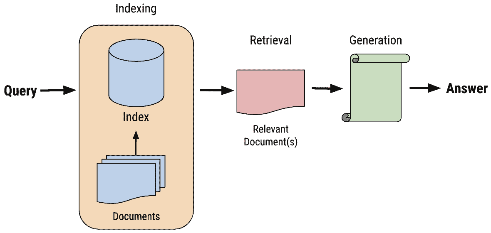
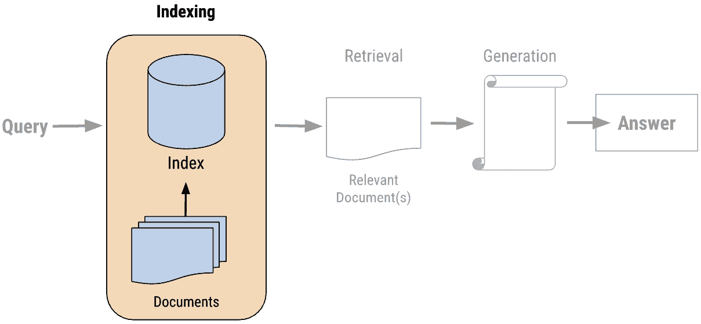
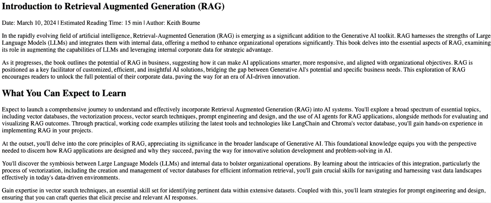
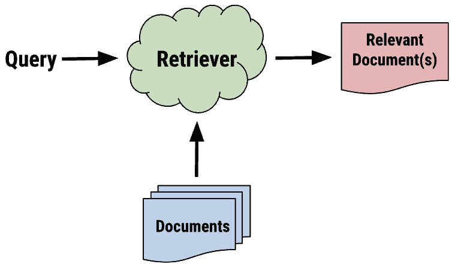
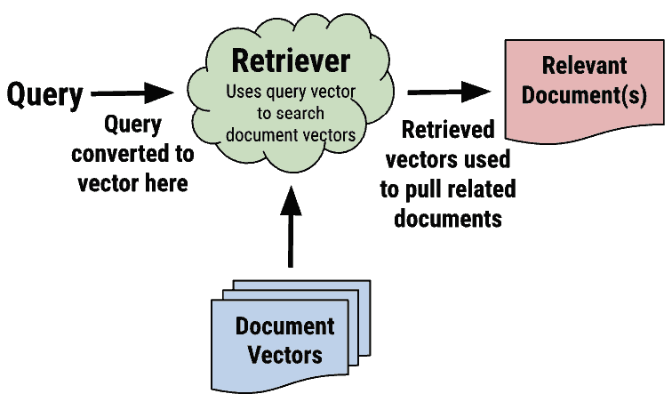
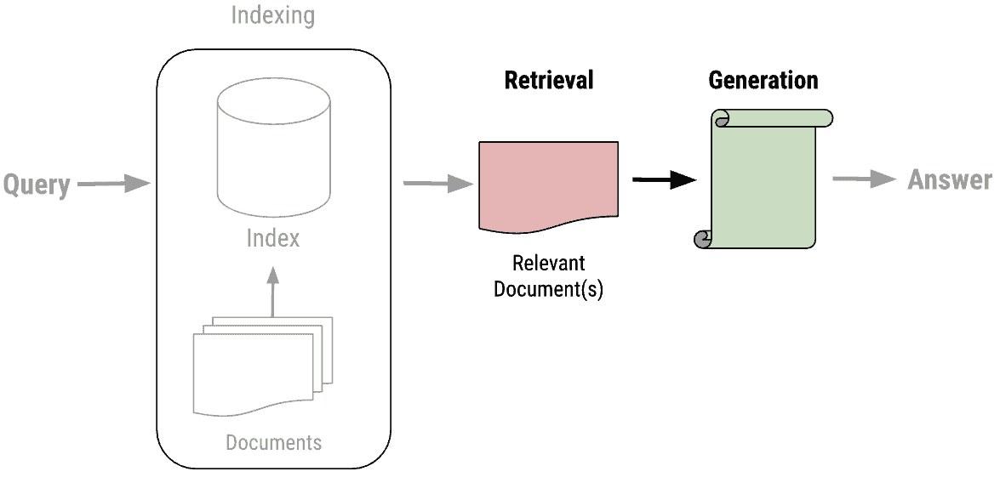
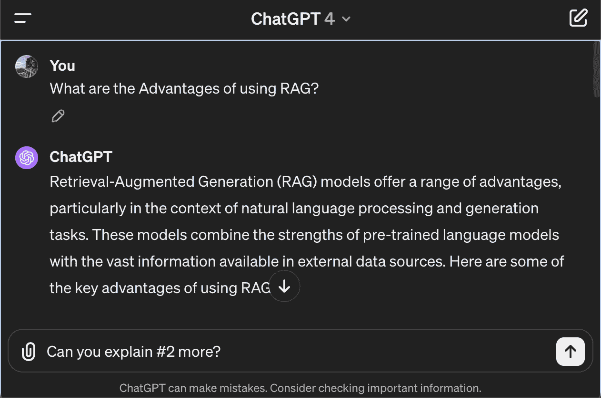

# 第四章：RAG 系统的组件

当您使用**检索增强生成**（**RAG**）进行开发时，了解每个组件的复杂性、它们如何集成以及支持这些系统的技术至关重要。

在本章中，我们将涵盖以下主题：

+   关键组件概述

+   索引

+   检索和生成

+   提示

+   定义您的 LLM

+   用户界面或 UI

+   评估

这些主题应为您提供对代表 RAG 应用程序的关键组件的全面理解。

# 技术要求

本章的代码放置在以下 GitHub 仓库中：[`github.com/PacktPublishing/Unlocking-Data-with-Generative-AI-and-RAG-Second-Edition/tree/main/CHAPTER_04`](https://github.com/PacktPublishing/Unlocking-Data-with-Generative-AI-and-RAG-Second-Edition/tree/main/CHAPTER_04)。

# 关键组件概述

本章探讨了构成 RAG 系统的复杂组件。让我们从整个系统的概述开始。

在*第一章*中，我们从技术角度介绍了 RAG 系统的三个主要阶段（参见 *图 4.1*）：

+   **索引**

+   **检索**

+   **生成**



图 4.1 – RAG 系统的三个阶段

我们将继续构建这个概念，但也会介绍构建应用程序所需的实际开发方面。这包括提示、定义您的**大型语言模型**（**LLM**）、**用户界面**（**UI**）以及评估组件。后面的章节将进一步涵盖这些领域。所有这些都将通过代码来完成，以便您可以将我们讨论的概念框架直接与实现联系起来。让我们从索引开始。

# 索引

我们将更详细地检查 RAG 系统中的第一个阶段：索引。请注意，我们跳过了设置步骤，包括安装和导入包，以及设置 OpenAI 和相关账户。这是每个生成**人工智能**（**AI**）项目的典型步骤，而不仅仅是 RAG 系统。我们在*第二章*中提供了详细的设置指南，所以如果您想回顾我们为支持这些步骤而添加的库，请回到那里。

索引是 RAG 的第一个主要阶段。如图 4.2 所示，它是用户查询之后的步骤：



图 4.2 – RAG 的索引阶段突出显示

在我们的代码中*第二章*，*索引*是您看到的第一个代码部分。这是处理您向 RAG 系统引入的数据的步骤。正如您在代码中所见，在这个场景中*数据*是通过 `WebBaseLoader` 加载的网页文档。这是该文档的开始（*图 4.3*）：



图 4.3 – 我们处理的网页

在*第二章*中，你可能已经注意到，在用户查询传递给链的后期阶段，*检索*和*生成*的代码被使用。这是在*实时*进行的，这意味着它发生在用户与之交互的时候。另一方面，索引通常在用户与 RAG 应用交互之前很久就会发生。索引的这一方面使其与其他两个阶段非常不同，具有在应用使用时不同时间运行的灵活性。这被称为**离线预处理**，意味着这一步是在用户甚至打开应用之前完成的。也有索引可以在实时进行的情况，但这要少得多。现在，我们将关注更常见的步骤：离线预处理。

以下代码是我们的**文档提取**：

```py
loader = WebBaseLoader(
    web_paths=("https://kbourne.github.io/chapter1.html",)
    bs_kwargs=dict(
        parse_only=bs4.SoupStrainer(
            class_=("post-content", "post-title",
                    "post-header")
       )
    ),
)
docs = loader.load() 
```

在这个摘录中，我们正在摄取一个网页。但想象一下，如果这是从 PDF 或 Word 文档或其他形式的无结构数据中拉取数据。如*第三章*中讨论的，无结构数据在 RAG 应用中是一个非常流行的数据格式。从历史上看，相对于结构化数据（来自 SQL 数据库和类似的应用），公司获取无结构数据非常困难。但 RAG 改变了这一切，公司终于意识到如何显著地利用这些数据。我们将在*第十一章*中回顾如何使用**文档加载器**访问其他类型的数据，以及如何使用 LangChain 实现。

无论你拉取什么类型的数据，它们都会经过一个类似的过程，如图*4.4*所示：



图 4.4 – 在 RAG 过程的索引阶段创建检索器

从代码中加载的文档加载器填充了**Documents**组件，以便以后可以使用用户查询检索文档。但在大多数 RAG 应用中，你必须将那些数据转换成更易于搜索的格式：向量。我们稍后会更多地讨论向量，但首先，为了将你的数据转换为向量格式，你必须应用**分割**。在我们的代码中，这就是这一部分：

```py
text_splitter = RecursiveCharacterTextSplitter(
    chunk_size=1000,
    chunk_overlap=200,
    length_function=len,
    is_separator_regex=False,
)
splits = text_splitter.split_documents(docs) 
```

分割将你的内容分解成可消化的块，这些块可以被向量化。`RecursiveCharacterTextSplitter`类通过递归尝试在不同的字符上分割（例如段落、然后句子、然后单词），直到块足够小。

**注意**

在 OpenAI API 中，文本使用字节级 **字节对编码**（**BPE**）词汇表进行分词。这意味着原始文本被分割成 `subword` 标记，而不是单个字符。对于给定的输入文本，消耗的标记数量取决于具体内容，因为常见单词和 `subwords` 通常由单个标记表示，而较少见的单词可能被分割成多个标记。平均而言，英文文本中的一个标记大约是四个字符。然而，这只是一个粗略估计，并且会根据具体文本而有很大差异。例如，像 *a* 或 *the* 这样的短单词可能是一个单独的标记，而一个长且不常见的单词可能被分割成几个标记。

这些可消化的块需要小于 8191 个标记的限制，其他嵌入服务也有它们的标记限制。如果你使用一个定义块大小和块重叠的分隔器，也要考虑到那个标记限制的块重叠。你必须将这个重叠加到整体块大小上，才能确定那个块的大小。扩展块重叠是确保块之间不丢失上下文的常见方法。例如，如果一个块在法律文件中恰好将一个地址切成了两半，那么你不太可能找到那个地址。但是有了块重叠，你可以考虑到这类问题。我们将在 LangChain 的 *第十一章* 中回顾各种分隔器选项，包括可以根据意义而不是仅根据字符数进行分割的语义块分割方法。*索引*阶段的最后部分是定义向量存储库，并将从你的数据分割中构建的嵌入添加到该向量存储库中。你在这里的代码中可以看到：

```py
vectorstore = Chroma.from_documents(
                   documents=splits,
                   embedding=OpenAIEmbeddings())
retriever = vectorstore.as_retriever() 
```

在这种情况下，我们使用 **Chroma** 作为向量数据库（或存储），传递分割数据，并应用 OpenAI 的嵌入算法。与其他索引步骤一样，所有这些通常在应用程序被用户访问之前 *离线* 完成。这些基于向量的嵌入存储在这个向量数据库中，以便将来进行查询和检索。Chroma 只是这里可以使用的许多数据库之一。`OpenAIEmbeddings` API 只是这里可以使用的许多向量化算法之一。我们将在 *第七章* 和 *第八章* 中更详细地探讨这个主题，当我们讨论向量、向量存储和向量搜索时。

回到我们关于 *索引*过程的图示，*图 4.5* 是一个更准确的表示：



图 4.5 – RAG 过程索引阶段中的向量

你可能想知道为什么我们不说定义*检索器*的步骤是检索步骤的一部分。这是因为我们将此作为检索的机制，但我们不会在检索步骤中应用检索，直到用户提交他们的查询。*索引*步骤专注于构建其他两个步骤工作的基础设施，我们确实在索引数据，以便以后可以检索。在这部分代码的末尾，你将有一个准备就绪并等待接收用户查询的检索器。让我们谈谈将使用此检索器的代码部分——检索和生成步骤！

# 检索与生成

在我们的 RAG 应用代码中，我们将检索和生成阶段结合起来。从图表的角度来看，这看起来就像*图 4.6*中所示的那样：



图 4.6 – RAG 过程中索引阶段的向量

虽然检索和生成是两个独立阶段，分别服务于 RAG 应用的两个重要功能，但我们在代码中将它们结合起来。当我们调用`rag_chain`作为最后一步时，它将遍历这两个阶段，这使得在谈论代码时很难将它们分开。但从概念上讲，我们将在这里将它们分开，然后展示它们如何将它们结合起来处理用户查询并提供智能生成式 AI 响应。让我们从检索步骤开始。

## 检索重点步骤

在完整的代码（可以在*第二章*中找到），在这个代码中只有两个地方实际发生检索或处理。这是第一个：

```py
# Post-processing
def format_docs(docs):
    return "\n\n".join(doc.page_content for doc in docs) 
```

第二步可以在 RAG 链中的第一步找到：

```py
 {"context": retriever | format_docs,
     "question": RunnablePassthrough()} 
```

当代码启动时，它按以下顺序运行：

```py
rag_chain.invoke("What are the Advantages of using RAG?") 
```

链接被用户查询调用，并运行我们在这里定义的链中的步骤：

```py
rag_chain = (
    {"context": retriever | format_docs,
     "question": RunnablePassthrough()}
    | prompt
    | llm
    | StrOutputParser()
) 
```

使用这个链，用户查询被传递到第一个链接，该链接将用户查询传递到我们之前定义的检索器中，在那里它执行相似性搜索以匹配用户查询与向量存储中的其他数据。在这个时候，我们有一个检索到的内容字符串列表，它与用户查询上下文相关。

然而，如*第二章*所示，由于我们使用的工具的格式问题，我们的检索步骤中存在一些小故障。`{question}`和`{context}`占位符都期望字符串，但我们用来填充上下文的检索机制是一个包含单独内容字符串的长列表。我们需要一个机制将这个内容片段列表转换为下一个链链接中提示所期望的字符串格式。

因此，如果您仔细查看检索器的代码，您可能会注意到检索器实际上在一个迷你链`(retriever | format_docs)`中，由管道`(|)`符号指示，因此检索器的输出直接传递到此处所示的`format_docs`函数：

```py
def format_docs(docs):
    return "\n\n".join(doc.page_content for doc in docs) 
```

让我们将这视为检索阶段的后处理步骤。数据已经被检索，但它不是正确的格式，所以我们还没有完成。`format_docs`函数完成了任务，并以正确的格式返回我们的内容。

然而，这仅为我们提供了`{context}`，这是输入变量占位符之一。我们需要填充提示的另一个占位符是`{question}`。与`context`相比，我们不会遇到相同的格式化问题，因为`question`已经是一个字符串。因此，我们可以使用一个方便的对象`RunnablePassThrough`，正如其名称所暗示的，它将输入（即`question`）原样传递。

如果您将整个第一个链链接完整地考虑，这本质上是在执行检索步骤，格式化其输出，并将所有内容以适当的格式汇总以传递给下一步：

```py
 {"context": retriever | format_docs,
     "question": RunnablePassthrough()} 
```

但等等。如果您正在进行向量搜索，您需要将用户查询转换为向量，对吧？我们没有说过我们正在获取用户查询的数学表示并测量与其他向量的距离，找到哪些更接近吗？那么这发生在哪里？检索器是从向量存储的方法创建的：

```py
retriever = vectorstore.as_retriever() 
```

生成此内容的向量存储是一个使用`OpenAIEmbeddings()`对象作为其嵌入函数声明的 Chroma 向量数据库：

```py
vectorstore = Chroma.from_documents(
                   documents=splits,
                   embedding=OpenAIEmbeddings()) 
```

`.as_retriever()`方法内置了所有功能，可以接受用户查询，将其转换为与其他嵌入匹配的嵌入格式，然后运行检索过程。

**注意**

因为这是使用`OpenAIEmbeddings()`对象，它会将您的嵌入发送到 OpenAI API，因此您将产生相关费用。在这种情况下，这只是单个嵌入；在 OpenAI，目前每 1M 个 token 的费用是$0.10。所以，对于`使用 RAG 的优势是什么？`这个输入，根据 OpenAI，它有 10 个 token，这将花费高达$0.000001。这可能看起来并不多，但我们希望在涉及任何费用时都完全透明！

这就结束了我们的检索阶段，输出已经正确格式化，可以传递给下一步——提示！接下来，我们将讨论生成阶段，在这个阶段，我们将利用 LLM 来执行生成响应的最后一步。

## 生成阶段

生成阶段是最后一个阶段，您将在这个阶段使用 LLM 根据在检索阶段检索到的内容生成对用户查询的响应。但在我们能够这样做之前，我们必须做一些准备工作。让我们来了解一下。

总体来说，*生成*阶段由代码的两个部分表示，从提示开始：

```py
client = Client()
prompt = client.pull_prompt("jclemens24/rag-prompt") 
```

然后，我们有 LLM：

```py
llm = ChatOpenAI(model_name="gpt-4o-mini", temperature=0) 
```

在定义了提示和 LLM 之后，这些组件在 RAG 链中被使用：

```py
 | prompt
    | llm 
```

注意，在*检索*和*生成*阶段，问题部分都被加粗了。我们之前已经提到，它在*检索*阶段是如何作为相似性搜索基础的。现在，我们将展示当将其整合到提供给 LLM 进行生成的提示中时，它是如何再次被使用的。

# 提示

**提示**是任何生成式 AI 应用的基本部分，不仅仅是 RAG。当你开始谈论提示时，尤其是与 RAG 相关时，你知道 LLM 很快就会涉及其中。但首先，你必须为我们的 LLM 创建和准备一个合适的提示。从理论上讲，你可以编写你的提示，但我想要抓住这个机会教你这个非常常见的发展模式，并让你习惯在需要时使用它。在这个例子中，我们将使用 LangSmith 客户端从 LangChain Hub 中提取提示。

LangChain Hub，现在是 LangSmith（LangChain 的统一开发者平台）的一部分，是一个“*发现、分享和版本控制提示*”的地方。Hub 的其他用户已经分享了他们的精炼提示，这使得你更容易基于共同知识进行构建。这是一个很好的开始提示的方式，拉取预先设计的提示，看看它们是如何编写的。但最终，你将想要转向编写你自己的、更定制的提示。

让我们谈谈这个提示在检索过程中的目的。这里的“提示”是我们在刚刚讨论的*检索*阶段之后的链中的下一个链接。你可以在`rag_chain`中看到它：

```py
rag_chain = (
    {"context": retriever | format_docs,
     "question": RunnablePassthrough()}
    | prompt
    | llm
    | StrOutputParser()
) 
```

坚持 LangChain 模式，提示的输入是前一步的输出。你可以通过像这样打印出来在任何时候看到这些输入：

```py
client = Client()
prompt = hub.pull("jclemens24/rag-prompt")
prompt.input_variables 
```

这导致了以下输出：

```py
['context', 'question'] 
```

这与我们之前定义的一致：

```py
{"context": retriever | format_docs,
"question": RunnablePassthrough()} 
```

使用`print(prompt)`打印出整个`prompt`对象，显示的不仅仅是文本提示和输入变量：

```py
input_variables=['context', 'question']
messages=[
    HumanMessagePromptTemplate(
        prompt=PromptTemplate(
            input_variables=['context', 'question'],
            template="You are an assistant for question-answering tasks. Use the following pieces of retrieved-context to answer the question. If you don't know the answer, just say that you don't know.\nQuestion: {question} \nContext: {context} \nAnswer:")
        )
    ] 
```

让我们进一步解开这个，从输入变量开始。这些是我们刚刚讨论的特定提示作为输入的变量。这些变量可能因提示而异。有一个消息[]列表，但在这个例子中，列表中只有一个消息。这个消息是`HumanMessagePromptTemplate`的一个实例，它代表了一种特定的消息模板。它使用一个`PromptTemplate`对象初始化。`PromptTemplate`对象是用指定的`input_variables`和模板字符串创建的。再次强调，`input_variables`是上下文和问题，你可以在模板字符串中看到它们的位置：

```py
template="You are an assistant for question-answering tasks. Use the following pieces of retrieved-context to answer the question. If you don't know the answer, just say that you don't know.\nQuestion: {question} \nContext: {context} \nAnswer:" 
```

当提示在链中使用时，`{question}` 和 `{context}` 占位符将被实际的问题和上下文变量的值所替换。这个链链接的输出是填充了从先前检索步骤中的 `{question}` 和 `{context}` 的字符串模板。

最后的部分仅仅是“答案：”，后面没有任何内容。这会提示 LLM 提供答案，并且这是一个在 LLM 交互中引发答案的常见模式。

简而言之，一个提示符是一个对象，它被连接到你的 LangChain 链中，并带有输入来填充提示模板，生成你将传递给 LLM 进行推理的提示符。这本质上是为 RAG 系统的 *生成* 阶段所做的准备阶段。

在下一步中，我们将引入 LLM，这是整个操作背后的智慧！

# 定义你的 LLM

在选择了提示模板后，我们可以选择一个 LLM，这是任何 RAG 应用程序的核心组件。以下代码显示了 LLM 模型作为 `rag_chain` 中的下一个链链接：

```py
rag_chain = (
    {"context": retriever | format_docs,
     "question": RunnablePassthrough()}
    | prompt
    | llm
    | StrOutputParser()
) 
```

如前所述，上一步的输出，即提示符对象，将成为下一步，即 LLM 的输入。在这种情况下，提示符将直接通过我们上一步生成的提示符 *管道* 进入 LLM。

在 `rag_chain` 上方，我们定义我们想要使用的 LLM：

```py
llm = ChatOpenAI(model_name="gpt-4o -mini ", temperature=0) 
```

这创建了一个来自 `langchain_openai` 模块的 `ChatOpenAI` 类的实例，该模块作为 OpenAI 语言模型的接口，具体是 GPT-4o -mini 模型。LLM 通常使用 invoke 方法接收提示，你可以在代码中直接调用它，只需添加以下内容：

```py
llm_only = llm.invoke("Answering in less than 100 words,
    what are the Advantages of using RAG?")
print(llm_only.content) 
```

以这种方式操作，你是在直接向 LLM 请求答案。

如果你运行前面的代码，它将给出 GPT-4o-mini 的响应，这将了解 RAG。但为了比较，如果我们将其更改为 GPT3.5 会怎样？以下是使用 ChatGPT 3.5 收到的响应：

```py
RAG (Red, Amber, Green) status reporting allows for clear and straightforward communication of project progress or issues. It helps to quickly identify areas that need attention or improvement, enabling timely decision-making. RAG status also provides a visual representation of project health, making it easy for stakeholders to understand the current situation at a glance. Additionally, using RAG can help prioritize tasks and resources effectively, increasing overall project efficiency and success. 
```

哎呀！ChatGPT 3.5 不了解 RAG！至少在我们讨论的上下文中不了解。这突出了使用 RAG 添加你的数据的价值。ChatGPT 3.5 的最新截止日期是 2022 年 1 月。RAG（检索增强生成）这一生成式 AI 概念可能还不够流行，以至于它能够立即知道我所说的 RAG 缩写代表什么。

使用 RAG，我们可以增强其知识，并利用 LLM 的其他技能，如总结和查找数据，以获得更成功的整体结果。但尝试将其更改为问题“用不到 100 字回答，使用检索增强生成（RAG）的优势是什么？”并看看你能得到什么结果。尝试使用一个更新的模型，该模型在其训练数据中可能包含更多关于 RAG 应用的信息。你可能会得到更好的响应，因为 LLM 训练所使用的数据的截止日期更近！

但我们不是直接调用 LLM，而是传递给它使用*检索*阶段构建的提示，从而可以得到一个更全面的信息回答。你可以在这里结束链，你的链的输出将是 LLM 返回的内容。在大多数情况下，这不仅仅是你在 ChatGPT 中输入某些内容时可能看到的文本——它是以 JSON 格式呈现的，并包含很多其他数据。因此，如果你想得到一个格式良好的字符串输出，反映 LLM 的响应，你还有一个链链接可以将 LLM 响应传递到：`StrOutputParser()`对象。`StrOutputParser()`对象是 LangChain 中的一个实用类，它将语言模型的关键输出解析为字符串格式。它不仅移除了你现在不想处理的所有信息，而且还确保生成的响应以字符串的形式返回。

当然，代码的最后一行是启动一切的那一行：

```py
rag_chain.invoke("What are the Advantages of using RAG?") 
```

在*检索*阶段之后，这个用户查询被第二次用作传递给 LLM 的提示中的一个输入变量。在这里，“使用 RAG 的优势是什么？”是传递到链中的字符串。

正如我们在*第二章*中讨论的那样，在未来，这个提示将包括一个来自 UI 的查询。让我们讨论 UI 作为 RAG 系统另一个重要组成部分。

# 用户界面或 UI

在某个时候，为了使这个应用程序更加专业和易用，你必须为那些没有你代码的普通用户提供一种直接输入查询并查看结果的方式。UI 作为用户和系统之间交互的主要点，因此在构建 RAG 应用程序时，它是一个关键组件。高级界面可能包括**自然语言理解**（NLU）功能，以更准确地解释用户的意图，这是一种专注于自然语言理解部分的**自然语言处理**（NLP）。这个组件对于确保用户能够轻松有效地将需求传达给系统至关重要。

这是从替换最后一行为一个 UI 开始：

```py
rag_chain.invoke("What are the Advantages of using RAG?") 
```

这一行将被替换为用户提交文本问题的输入字段，而不是我们传递给它的固定字符串，如下所示。

这也包括以更用户友好的界面显示 LLM 生成的响应，例如在一个设计精美的屏幕上。在*第六章*中，我们将用代码展示这一点，但现在，让我们就向你的 RAG 应用程序添加界面进行更高层次的讨论。

当一个应用程序为用户加载时，他们会有某种方式与之交互。这通常是通过一个界面来实现的，这个界面可以从网页上的简单文本输入字段到更复杂的语音识别系统不等。关键是要准确捕捉用户查询的意图，并以系统可以处理的形式呈现。添加用户界面的一个明显优势是它允许用户测试其他查询的结果。用户可以输入他们想要的任何查询并查看结果。

## 预处理

正如我们讨论的那样，尽管用户只是在用户界面中输入一个像“什么是任务分解？”这样的问题，但在提交这个问题之后，通常会有预处理来使这个查询更适合大型语言模型（LLM）。这主要是在提示中完成的，同时也会得到许多其他功能的帮助。但所有这些都是在幕后发生的，用户看不到。在这种情况下，他们只会看到以用户友好的方式显示的最终输出。

## 后处理

即使大型语言模型（LLM）返回了响应，这个响应在显示给用户之前通常也会进行后处理。

这就是实际的大型语言模型（LLM）输出的样子：

```py
AIMessage(content="The advantages of using RAG include improved accuracy and relevance of responses generated by large language models, customization and flexibility in responses tailored to specific needs, and expanding the model's knowledge beyond the initial training data.") 
```

作为链中的最后一步，我们将其传递给`StrOutput Parser()`来解析出字符串：

```py
'The advantages of using RAG (Retrieval Augmented Generation) include improved accuracy and relevance, customization, flexibility, and expanding the model's knowledge beyond the training data. This means that RAG can significantly enhance the accuracy and relevance of responses generated by large language models, tailor responses to specific needs, and access and utilize information not included in initial training sets, making the models more versatile and adaptable.' 
```

这确实比之前步骤的输出要好，但仍然是在你的笔记本中显示。在一个更专业的应用程序中，你可能会希望以对用户友好的方式在屏幕上显示这些信息。你可能还想显示其他信息，例如我们在*第三章*代码中展示的源文档。这取决于应用程序的意图，并且在不同的大语言模型（RAG）系统中会有显著差异。

## 输出界面

对于一个完整的用户界面，这个字符串将被传递到显示返回给链的消息的界面。这个界面可以非常简单，就像你在*图 4.7*中看到的 ChatGPT 一样：



图 4.7 – ChatGPT 4 界面

你也可以构建一个更健壮的界面，更适合你的特定目标用户群体。如果它旨在更具有对话性，界面也应该设计成促进进一步的交互。你可以给用户提供选项来细化他们的查询，提出后续问题，或请求更多信息。

用户界面中另一个常见的功能是收集关于响应的有用性和准确性的反馈。这可以用来持续改进系统的性能。通过分析用户交互和反馈，系统可以学习更好地理解用户意图，细化向量搜索过程，并提高生成响应的相关性和质量。这引出了我们最后一个关键组件：评估。

# 评估

评估组件对于评估和改进 RAG 系统的性能至关重要。虽然有许多常见的评估实践，但最有效的评估系统将专注于对用户最重要的方面，并提供评估以改进这些特性和功能。通常，这涉及到使用各种指标（如准确性、相关性、响应时间和用户满意度）分析系统的输出。这些反馈用于确定改进领域并指导系统设计、数据处理和 LLM 集成的调整。持续的评估对于保持高质量响应并确保系统有效满足用户需求至关重要。

如前所述，你还可以通过多种方式收集用户反馈，包括定性数据（开放式问题的表格）或定量数据（对错、评分或其他数值表示）关于响应的有用性和准确性。点赞/踩通常用于从用户那里快速获得反馈并评估应用程序在众多用户中的总体有效性。

我们将在*第九章*中更深入地探讨如何将评估融入你的代码中。

# 摘要

本章并未提供 RAG 系统组件的详尽列表。然而，这些组件往往存在于每个成功的 RAG 系统中。请记住，RAG 系统不断进化，每天都有新的组件类型出现。你 RAG 系统的关键方面应该是添加那些能够满足用户需求的组件。这可能与你的项目非常具体，但通常是你公司所做事情的直观扩展。

本章提供了对构成成功 RAG 系统必要组件的全面概述。它深入探讨了三个主要阶段：*索引*、*检索*和*生成*，并解释了这些阶段如何协同工作以向用户查询提供增强的响应。

除了核心阶段之外，本章还强调了 UI 和评估组件的重要性。UI 是用户与 RAG 系统交互的主要点，使用户能够输入他们的查询并查看生成的响应。评估对于评估和改进 RAG 系统的性能至关重要。这涉及到使用各种指标分析系统的输出，并收集用户反馈。持续的评估有助于确定改进领域并指导系统设计、数据处理和 LLM 集成的调整。

虽然本章讨论的组件并不全面，但它们构成了大多数成功 RAG 系统的基础。

然而，每个 RAG 系统都有一个非常重要的方面，我们在这章中没有涉及：安全性。我们将用下一章的整个章节来涵盖安全性的关键方面，特别是与 RAG 相关的内容。

# 参考资料

**LangChain Hub**（LangSmith 的一部分）: [`smith.langchain.com/hub`](https://smith.langchain.com/hub).

# 免费订阅电子书

新框架、演进的架构、研究论文、生产分解——AI_Distilled 将噪音过滤成每周简报，供与 LLMs 和 GenAI 系统实际工作的工程师和研究人员阅读。现在订阅，即可获得免费电子书，以及每周的洞察力，帮助您保持专注并获取信息。

在[`packt.link/8Oz6Y`](https://packt.link/8Oz6Y)订阅或扫描下面的二维码。


