# 第十三章：基于本体的图知识工程

知识工程是有效智能体 RAG 系统的基础。在 *第十二章* 中，我们向您介绍了智能体，但它们是最基本的形式。在本章中，我们探讨本体如何作为领域知识的正式表示，提供语义骨干，使 AI 智能体能够以精确和清晰的方式进行更高级别的推理。与仅依赖于向量相似性或关键词匹配的传统检索方法不同，基于本体的方法使您的智能体对其领域中的概念、关系和约束有明确的理解。

在本章中，我们将使用 **Protégé**（行业标准的本体开发工具）实现一个金融本体。这种实践方法将展示如何将领域专业知识转化为支持复杂推理能力的机器可读知识结构。

在本章中，我们将涵盖以下内容：

+   本体论与知识工程简介

+   本体在智能体架构中的作用

+   本体建模语言：RDFS 与 OWL

+   代码实验室 13.1 – 在 Protégé 中构建简单的金融本体

这些主题将为您提供开发知识结构的基础理解和实践技能，这些知识结构是使 AI 智能体基于验证过的领域专业知识的基础。

# 技术要求

要完成本章的实践练习，您需要以下软件和资源：

**软件要求**：

+   **Protégé Desktop 5.6.5**：我们将使用的免费行业标准本体编辑器，用于构建我们的金融本体。从 [`protege.stanford.edu/`](https://protege.stanford.edu/) 下载它。

+   **文本编辑器**：用于准备和审查 Turtle（`.ttl`）语法文件，我们将创建。

+   **操作系统**：Windows、macOS 或 Linux（Protégé 是跨平台的）。

**硬件要求**：

+   最小 4 GB RAM（建议 8 GB 以获得流畅的性能）

+   Protégé 安装和本体文件需要 500 MB 的可用磁盘空间

+   互联网连接，用于下载软件和访问 SKOS 本体

**章节资源**：

+   **GitHub 仓库**：[`github.com/PacktPublishing/Unlocking-Data-with-Generative-AI-and-RAG-Second-Edition/tree/main/CHAPTER_13`](https://github.com/PacktPublishing/Unlocking-Data-with-Generative-AI-and-RAG-Second-Edition/tree/main/CHAPTER_13)

+   **完成的本体文件**：本章代码实验室中的最终 `FinancialOntology.ttl` 文件可在以下位置找到：[`github.com/PacktPublishing/Unlocking-Data-with-Generative-AI-and-RAG-Second-Edition/blob/main/CHAPTER_13/FinancialOntology.ttl`](https://github.com/PacktPublishing/Unlocking-Data-with-Generative-AI-and-RAG-Second-Edition/blob/main/CHAPTER_13/FinancialOntology.ttl)

+   **SKOS 本体 URL**（用于 *步骤 14*）：[`www.w3.org/TR/skos-reference/skos-owl1-dl.rdf`](http://www.w3.org/TR/skos-reference/skos-owl1-dl.rdf)

在开始代码实验室之前，请确保 Protégé在您的系统上成功启动。如果您遇到任何与 Java 相关的问题，请验证您的 Java 安装是否满足最低要求。GitHub 仓库中的完成本体文件可以作为参考，如果您在任何步骤需要验证您的作品。

# 本体论与知识工程简介

到目前为止，当我们谈论 RAG 时，我们依赖于向量存储（语义嵌入）和有时是关键词（稀疏）搜索来检索**大型语言模型**（**LLMs**）的上下文。虽然这种混合语义加关键词的方法提高了相关性，但它仍然会在您需要精确推理、可解释性或紧密的事实基础时遇到困难。下一个进化飞跃是基于图 RAG，它利用**知识图谱**（**KGs**）提供结构化、可导航的上下文，极大地增强了可靠性、事实性和多步推理。

## 什么是本体论？

**本体论**是对领域知识进行正式、明确表示的结构化形式，包括定义好的类、属性和关系。与传统的关系数据库或纯基于向量的存储不同，本体论提供了更丰富的语义和概念之间的显式链接，促进了更好的信息检索、推理和领域特定推理。例如，本体论可以明确编码业务规则、监管约束和金融实体之间的逻辑连接，对于精确的知识检索来说是无价的。

在 KGs 中，本体论围绕我们介绍的相同核心图概念展开：顶点（节点）、边（关系）、路径、距离和子图。节点代表类或单个实例，而边定义了这些节点之间的关系。理解路径和跳数（多个节点之间的连接）允许智能体有效地在复杂的知识网络中进行导航和推理。

# 本体论在智能体架构中的作用

智能体天生具有灵活性和强大的功能，擅长同时执行多种任务。从最初仅关注单一任务（如翻译、命名实体识别或分类）的浅层学习模型，到神经网络，最终到转换器，这种变革性的进步极大地扩展了人工智能的能力。现代模型，尤其是**LLMs**，擅长多项任务，甚至将之前分离的领域，如视觉和语言，合并为集成的多模态框架。

然而，通过**检索增强生成**（**RAG**），我们重新审视了专业化。在这里，我们的系统将被设计得在特定领域内表现出色。正如个人会在特定领域专业化并成为专家一样，一个精心设计的 AI 代理将拥有明确的领域专业知识，以便有效地运作。这种领域专业知识是代理设计的关键，使得本体论的作用变得至关重要，因为它们成为代理知识的基础骨干。您的代理有一个特定的目标，需要擅长特定的领域。我们将逐步介绍如何正确规划和实施这种领域专业知识，以便您的代理能够成功！

## 编码领域专业知识

本体明确编码详细的领域知识，确保清晰和精确。要构建本体，您定义类（如组织、金融工具和监管实体）并使用本体语言建立有意义的关联和约束。捕捉行业特定的专业知识，如金融监管或公司结构的细微差别，有助于代理准确和一致地解释复杂的用户查询。

为了通过知识图谱有效地将领域专业知识嵌入到代理中，本体提供了一个结构化的框架，它封装了显式的事实信息和隐含的领域特定逻辑。通过明确定义领域实体之间的语义关系，本体促进了准确的语义推理，使代理能够从表面事实之外得出新的见解并回答复杂的查询。例如，在金融合规方面，本体可以明确地模拟监管框架、司法规则和特定合规义务之间的层次关系。这种结构化表示允许代理自动推断适用于不同金融产品或在不同司法管辖区内的活动的合规要求。

# 本体建模语言：RDFS 与 OWL

在构建知识图谱（KG）时，您需要一种方式来定义您的领域中存在哪些类型的事物以及它们如何相互关联。虽然您可以简单地创建节点和关系的临时列表，但标准化的本体语言提供了关键的好处：它们使自动推理（从显式事实中发现隐含事实）成为可能，确保与其他系统的互操作性，并允许验证数据一致性。

**资源描述框架模式**（**RDFS**）是一种词汇建模语言，它允许你为你的知识库定义类和属性。使用 RDFS，你可以指定`Employee`是`Person`的一种类型，或者`worksFor`是`people`和`companies`之间的关系。它提供了基本的构造，如类层次（`subClassOf`）和属性层次（`subPropertyOf`），使其适合简单的分类结构。当你使用 RDFS 时，使用它的系统可以理解继承。如果所有员工都是人，所有人都有名字，那么所有员工都有名字。

**Web 本体语言**（**OWL**）通过强大的逻辑能力扩展了 RDFS。RDFS 让你可以说“员工是人”，而 OWL 让你可以表达复杂的约束，例如“经理是至少管理一个人的员工”或“没有人可以既是公司又是人”。OWL 可以指定某些关系是对称的（如果 A 认识 B，那么 B 也认识 A），是传递的（如果 A 监督 B，B 又监督 C，那么 A 也监督 C），或者有基数限制（一个人恰好有两个生物学上的父母）。这些特性使得复杂的自动化推理成为可能，例如根据个体的属性进行分类或检测数据中的逻辑不一致性。

RDFS 和 OWL 之间的选择取决于你的需求。RDFS 足以满足简单的层次词汇和基本推理。当你需要复杂的领域建模、验证规则或高级推理能力时，OWL 变得至关重要。许多项目开始时使用 RDFS，因为它简单，随着需求的复杂化，会添加 OWL 结构。

在接下来的代码实验室中，我们将亲自动手使用 OWL 作为我们的建模语言。我们将使用 Protégé，这是一个专门的本体编辑器，它提供了一个用于创建 OWL 本体的可视化界面，并利用内置的推理器来验证我们的模型并推断新的知识。这种实践经验将阐明 OWL 形式推理能力在创建稳健领域模型中的强大之处。

# 代码实验室 13.1 - 在 Protégé中构建一个简单的金融本体

在这个代码实验室中，我们考虑一个为对话式 AI 助手设计的金融本体，其中可能包括`Person`（人）、`Organization`（组织）、`Account`（账户）、`Transaction`（交易）、`Financial Instrument`（金融工具）和`Regulatory Authority`（监管机构），以及如`owns`（拥有）、`isRegulatedBy`（由...监管）或`issues`（发行）等关系。通过管理层次结构（例如，`FinancialInstrument` → `Equity` → `Stock`），提供详尽的注释（标签、注释、同义词），并与行业标准（如金融本体的 FIBO）保持一致，本体变得既健壮又高度可检索。对于这个例子，我们将保持简单，只关注股票代码和证券类型，并提供一个逐步的代码实验室，指导用户在 Protégé中构建基本金融本体。这个演练将使用具体、易于跟随的例子来展示概述的过程，集中在少数几种证券类型和股票代码上。

## 什么是 Protégé？

将 Protégé视为您的工作台，用于将知识塑造成机器可以实际“思考”的形式。它是一个免费的开源工具，允许您以干净、符合标准的方式（如 OWL）构建本体、类、关系和注释，而不会迷失在细节中。回报是什么？当您准备好将本体转换为 Neo4j 的知识图谱时，一切都会井然有序地嵌入，这意味着没有混乱的转换或丢失的意义。对于对话式 AI 来说，这种整洁性至关重要：它使得您的机器人能够理解问题、跟踪关系，并给出清晰、具有上下文意识的答案，而不是模糊的猜测。

让我们开始我们的代码实验室，使用 Protégé进行工作！

## 第一步 - 定义领域、范围、目的和竞争力问题

**定义领域**：在指定特定领域之前，首先确定核心主题领域及其边界。问问自己：“中心主题是什么？为了完整性，必须包括哪些相关概念？可以排除哪些相邻领域？”本本体的领域是金融工具及其在证券市场中的关系。这包括公开交易的股票和债券、发行它们的组织以及监管它们的管理机构。我们专注于核心实体，这些实体是金融 AI 助手需要理解股票代码、证券类型（股权与债务工具）、发行公司以及监管机构，例如**证券交易委员会**（**SEC**）。这个领域故意很窄，以保持实验室的可管理性，同时仍然展示关键的本体工程原则。

+   **定义范围**: 为了有效地定义范围，考虑你用例所需的覆盖深度和广度。列出将明确包含的内容，同样重要的是，将排除的内容。考虑所需的详细程度。你是否需要粒度属性或只是高级概念？本体的范围限于建模金融工具、其发行者和监管者之间的基本关系。我们只包括公开交易的证券（如 AAPL 和 MSFT 的股票，USTB 的债券），主要组织（苹果公司，微软公司，美国财政部）以及 SEC 作为我们的监管机构。我们明确排除复杂的金融产品，如衍生品、期权或私募股权，以及详细的财务指标，如价格、成交量或历史数据。这种专注的范围使我们能够构建一个完整、实用的本体，能够回答具体问题，而不会迷失在金融复杂性中。但关键在于了解你应用所需的范围，并尽可能精确地定义它。

+   **确定目的和用户**: 首先要明确地阐述这个本体存在的目的以及谁会从中受益。通过访谈潜在的用户或利益相关者来了解他们的需求、技术专长以及他们可能会提出的问题类型。记录主要和次要的用户群体，因为这会影响你在设计选择中关于复杂性和术语方面的决策。对于这个金融本体，我们将目的定义为使对话式人工智能助手能够准确回答有关金融工具、其类型及其监管关系的问题。主要用户是进行投资决策研究的个人投资者，他们需要快速、准确的答案，例如股票或债券的标识符代表什么，哪些公司发行特定的证券，以及适用的监管机构。通过在本体中构建这种知识结构，我们确保人工智能不仅能检索事实，还能推理关系，即它能够理解，例如，如果某物是“股票”，那么它也是“权益”和因此是“金融工具”，为投资者提供具体答案和情境理解。

+   **确定关键用例**：为了识别用例，分析用户将要执行的任务和他们将要提出的问题。创建具体的场景来展示本体在实际应用中的使用方式。将类似的用例分组并基于频率和重要性进行排序，以确保本体首先解决最关键的需求。我们将为这个本体定义的关键用例集中在金融 AI 助手必须处理的分类和关系查询上。用户应该能够询问一个特定的股票代码代表的是股票还是债券，识别哪个组织发行了特定的证券，确定哪个监管机构监管特定的工具，以及检索已知股票或债券的列表。这些用例驱动我们的建模决策——确保我们拥有清晰的类层次结构（`FinancialInstrument` → `Equity` → `Stock`）、明确的关系（`issuedBy`，`i`sRegulatedBy`）和适当的数据属性（`hasTicker`），以支持关于金融领域的自然语言查询。

+   **确定能力问题**：能力问题是您本体的试金石——它必须能够回答的具体问题。将这些问题制定成反映真实用户需求的自然语言查询。使它们具体且可衡量，涵盖不同类型的查询（事实性、分类、基于关系的），以确保全面覆盖。这些问题将作为测试用例，用于验证本体的完整性和正确性。本体工程的核心是首先确定项目范围，即定义您的智能体需要知道和执行的内容。您必须清楚地概述知识域和您的 AI 智能体将要执行的具体任务。在这个实验室中，重点是回答以下问题：

    +   AAPL 是股票还是债券？

    +   USTB 是哪种类型的工具？

    +   MSFT 由哪个机构监管？

    +   哪些股票由 SEC 监管，谁发行了它们？

    +   你知道哪些股票？哪些债券？

这些能力问题指导我们选择本体需要支持的类、关系和属性。提前识别这些问题可以确保在您稍后测试本体时，您不仅是在建模概念，而是在建模对您的 AI 重要的行为。您将在整个实验室中构建支持这些查询的结构，并在第十四章中，您将导入这个本体，并使用 Cypher 查询与 RAG 系统一起实际回答这些问题。第十四章中代码实验室的最后一步演示了如何使用您在这里构建的金融知识图成功回答所有五个能力问题。

## 第 2 步 - 收集和分析领域知识

一旦确定了范围，收集语义成分。在现实世界的项目中，你会收集文本、Excel 表格、专家领域定义，甚至使用 LLM 提取候选实体和关系。对于这个实验，我们保持简单：

+   **实体/股票代码:** `AAPL` (苹果公司), `MSFT` (微软公司), `USTB` (美国国债)

+   **组织/权威实例**: `苹果公司`，`微软公司`，`美国财政部`，`SEC`

+   **概念类型**: `FinancialInstrument` → `Equity` → `Stock`/`FinancialInstrument` → `Debt` → `Bond`; `Organization` → `RegulatoryAuthority`; `Person`; (`Account`和`Transaction`保持占位符)

+   **关系**: `hasTicker`（数据类型），`issuedBy`，`isRegulatedBy`，`ownedBy`

在确定了这些领域元素并进行了文档记录后，我们现在可以组织它们，形成一个逻辑层次结构，以捕捉我们概念之间的固有关系。

## 第 3 步 – 建立初步类层次结构

在确定了这些元素后，绘制一个反映领域逻辑的草稿分类法。你的目标是创建一个初步结构，将实体分类到子类和超类中，以支持继承和类型强制。在这个实验中，我们将使用以下内容：

```py
FinancialInstrument 
├ Equity → Stock 
└ Debt → Bond 
Organization → RegulatoryAuthority 
Person 
Account 
```

这个图表将成为你在 Protégé中实现类结构的蓝图。

## 第 4 步 – 定义属性和关系

在你打开 Protégé之前，决定模式，这指的是将类联系在一起并赋予意义的属性。这包括以下内容：

+   **数据属性**: `hasTicker`—领域: `FinancialInstrument`，范围: `xsd:string`

+   **对象属性**:

    1.  `issuedBy`—连接`FinancialInstrument` → `Organization`

    1.  `isRegulatedBy`—连接`FinancialInstrument` → `RegulatoryAuthority`

    1.  `ownedBy`—链接`FinancialInstrument` → `Person`或`Organization`

领域指定哪些类可以具有属性（例如，只有`FinancialInstruments`可以具有`hasTicker`属性），而范围指定属性可以取什么类型的值（例如，`hasTicker`必须是字符串，或者`issuedBy`必须指向一个`Organization`）。

通过明确这些属性（领域和范围），你确保了 Protégé的内置推理器可以在有人后来创建与你的模式逻辑冲突的断言时检测到建模错误。在我们的类和属性明确定义后，下一个关键的决定是选择合适的本体建模语言，它可以以适当的正式程度和推理支持表达这些关系。

## 第 5 步 – 选择本体建模语言

Protégé支持 RDFS 和 OWL，并且每个都提供不同级别的表达能力。对于这个实验，我们选择 OWL 2 DL。正如我们之前讨论的，OWL 在实用性和平衡性上做得很好，允许领域/范围声明和基本基数，并支持完全推理，而 RDFS 虽然简单，但缺乏执行我们这个本体所需约束的推理能力。

选择您的本体语言就像选择您领域逻辑的语法。它将影响所有后续内容。OWL 2 DL 是我们需求中最广泛兼容和语义丰富的选择。

## 第 6 步 – 安装 Protégé 5.6.5

使用允许的最新版本以匹配说明：

+   访问 https://protege.stanford.edu/并下载适用于您操作系统的 Desktop Protégé 5.6.5。

+   **解压/提取存档。**

+   在 Windows 上：运行`run.bat`

+   在 macOS 上：启动 Protégé应用程序

+   在 Linux 上：在终端中执行`./run.sh`

如果 Protégé无法启动，打开终端并输入`java -version`。它必须报告 Java 11 或更高版本；如果需要，请安装它。

## 第 7 步 – 启动 Protégé，重命名本体 IRI，并使用正确的语法保存

保存您的本体时，您需要选择一个语法格式。这个决定可能取决于您所在的环境以及您在管道的其他部分需要的格式，但我们将使用 Turtle 语法（`.ttl`）而不是 RDF/XML 或其他格式。Turtle 比 RDF/XML 更简洁、更易于阅读，使得在需要时更容易审查或手动编辑。它保留了 OWL 本体所需的所有表达能力，同时消除了不必要的 XML 模板。编码保持精确的相同语义图，只是语法不同。此外，由于其清晰性和简单性，Turtle 在 RDF 工具、库和下游系统中得到了广泛的支持。

当您打开**Protégé 5.6.5**时，它立即创建一个新的空白本体，通常命名为某个名称，例如`untitled-ontology-1`，而不会提示任何命名对话框。导航到**Active Ontology**标签页。点击进入**Ontology IRI**字段（看起来可能像 http://www.semanticweb.org/your-username/ontologies/…/untitled-ontology-3）并将片段更改为**FinancialOntology**。如果被问及是否更新所有现有实体 IRI 以匹配，请点击**是**。这确保了所有类、属性和个体继承您选择的命名空间。

要保存您的本体，转到**文件** **→** **另存为…**。Protégé将要求您选择一个语法 – 例如，**RDF/XML、OWL/XML、Turtle**或**OWL Functional**。选择**Turtle Syntax (.ttl)**。

从第 8 步开始，我们将开始构建我们的本体。

## 第 8 步 – 使用批量输入向导在 Protégé中构建类层次结构

在添加到 Protégé之前，将此确切名称集（包括前导制表符）复制到您的剪贴板：

```py
FinancialInstrument
      Equity
           Stock
      Debt
           Bond
Organization
      RegulatoryAuthority
Person
Account 
```

将`Equity`、`Stock`等之前的每个空格字符替换为单个制表符字符（Protégé使用制表符缩进来推断子类关系）。复制粘贴即可立即生效。

当您在 Protégé中打开**按类查看个体**标签时，您将看到的最高节点是`owl:Thing`。它不是一个用户创建的类；它是 OWL 标准的内置功能。Protégé包括`owl:Thing`，以便始终有一个类树的规范根。默认情况下，所有用户定义的类都挂载在其下。它不能被删除，因为 OWL 推理（例如，子类推理、一致性检查）依赖于这个通用类。删除它将破坏模型。

### 基本 Protégé术语

在 Protégé中，“按类查看个体”指的是浏览或创建组织在特定类别（类型或类别，如`Stock`、`Organization`或`RegulatoryAuthority`）下的现实世界示例（个体，或“实例”）。**个体**标签是您实际查看、选择和为所选类别创建这些实例的地方。`Entities`是一个更通用的术语，涵盖了您本体中的所有主要构建块：类（类型）、属性（关系和属性）和个体（实例）。`Assertions`是连接个体到属性的陈述，例如说`AAPL`（一个个体）`hasTicker`“`AAPL`”（数据属性断言）或`issuedBy Apple_Inc`（对象属性断言）。因此，类是类别，个体是例子，实体是您本体的部分，断言是将它们全部联系在一起的事实。

### 一次性填充所有类

找到您之前创建的列表，转到**实体**标签，然后是**类**子标签：

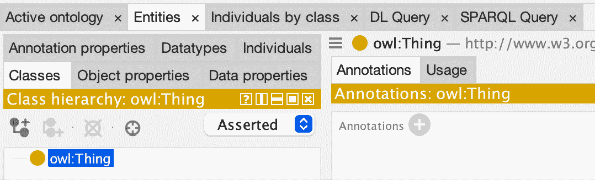

图 13.1 – Protégé中的“类”子标签显示你将构建本体结构的类层次视图

这里是创建列表时在一个批量输入步骤中输入的说明：

1.  在**类**标签中，确保**断言**层次结构视图是激活的。

1.  在`owl:Thing`（或您想要包含所有内容的类别）上**右键单击**。

1.  选择**添加子类…**。

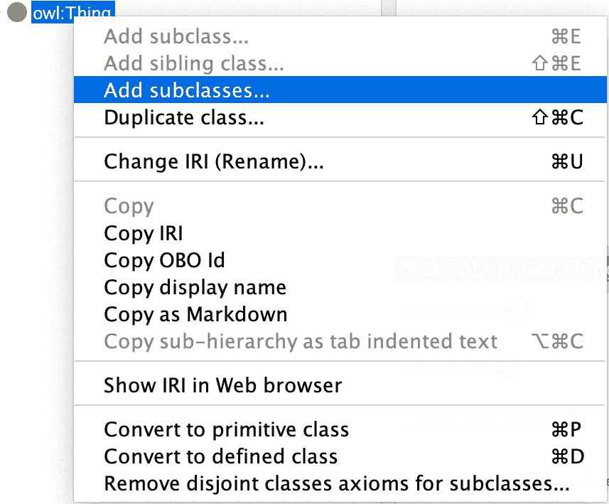

图 13.2 – 右键单击上下文菜单显示批量类输入的“添加子类”选项

1.  你应该会看到一个标题为**输入层次结构**的弹出窗口。

1.  将前面的制表符缩进列表粘贴或输入，记得使用制表符在正确的位置缩进以创建层次结构。点击**继续**。

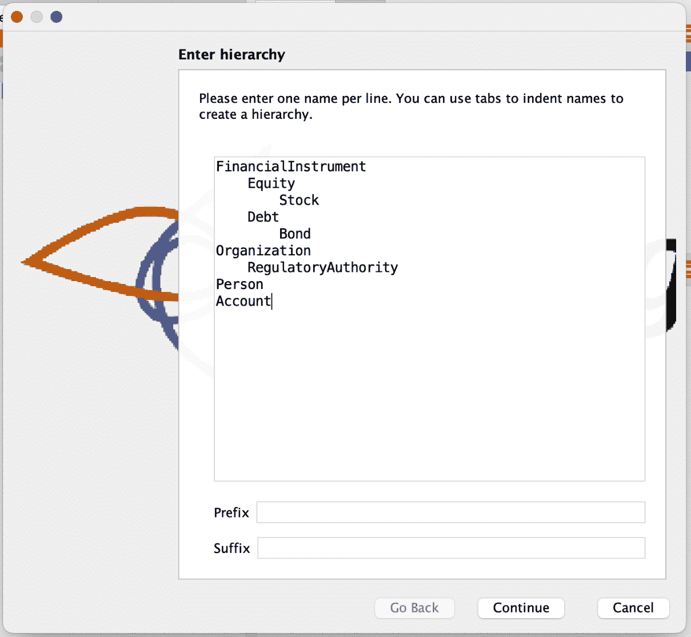图 13.3 – 使用制表符缩进文本的批量类输入的“输入层次结构”对话框

1.  保留**是否要使兄弟类互斥？**框选中。例如，`Equity`和`Debt`应该明确互斥：这确保了例如在`Equity`下的`AAPL`类不能也是一个`Debt`工具。Protégé将自动在兄弟类之间添加`owl:AllDisjointClasses`公理。

1.  点击**完成**。你可能需要点击`OwlThing`旁边的“展开”箭头以查看新添加的内容，但你的完整类树现在应该正确显示，就像你之前输入的那样，但`OwlThing`位于顶部。

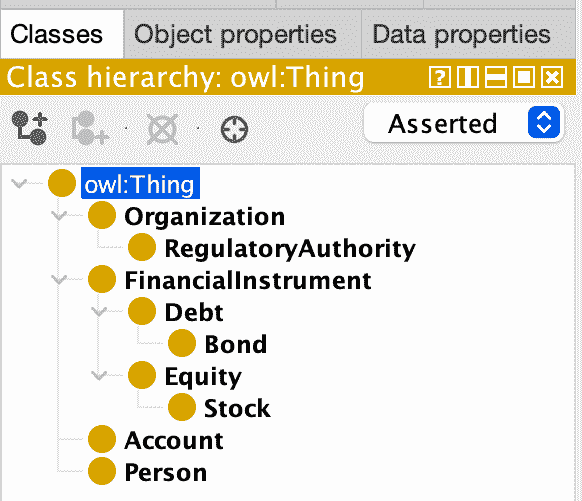

图 13.4 – 显示 FinancialInstrument、Organization、Person 和 Account 类及其相应子类的完成类层次结构

此自动化向导非常适合快速启动领域骨架，并大大减少了层次结构放置错误。你还可以选择逐个手动输入一个类，我们将在下一步介绍。

## 第 9 步 – 逐个手动添加一个类

我们故意省略了`Transaction`，以便我们可以单独添加这个类：

1.  点击`owl:Thing`。

1.  使用**添加子类 (+**) 工具栏按钮。（在前面的步骤中，你在右键单击后使用了选项，但在这个情况下，你正在使用工具栏。这是一个重要的区别！）

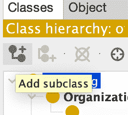

图 13.5 – 具有添加单个类按钮突出显示的工具栏

1.  在弹出窗口中输入`Transaction`并点击**确定**。

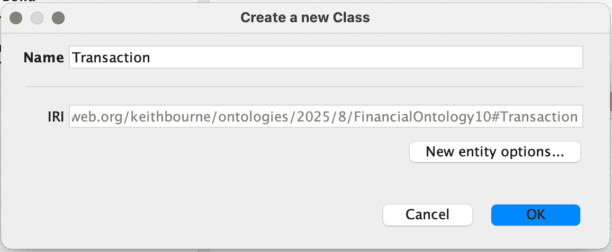

图 13.6 – 用于添加 Transaction 类的创建新类对话框

此选项每一步创建一个单独的类，适合保守的、迭代的构建。典型的方法是使用前面的步骤批量添加你的初始本体，然后审查它，然后使用这种方法添加任何额外的单个实体。这是一个重要的区别！

## 第 10 步 – 定义属性

OWL 本体中的属性定义了类（对象属性）之间的关系以及实例可以拥有的数据属性（数据属性）：

1.  导航到**对象属性**子标签页。

1.  在树中选择**owl:topObjectProperty**（这是 OWL 的规范父类）。

1.  点击**添加子属性**按钮（看起来像一个小向下箭头加号）。

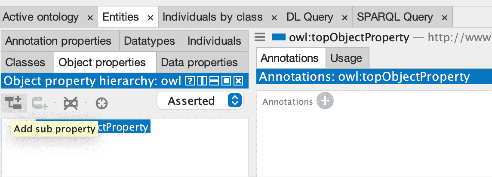

图 13.7 – 显示 owl:topObjectProperty 和添加子属性按钮的对象属性子标签页

1.  在对话框中，依次创建以下属性：

    1.  `issuedBy`

    1.  `isRegulatedBy`

    1.  `ownedBy`

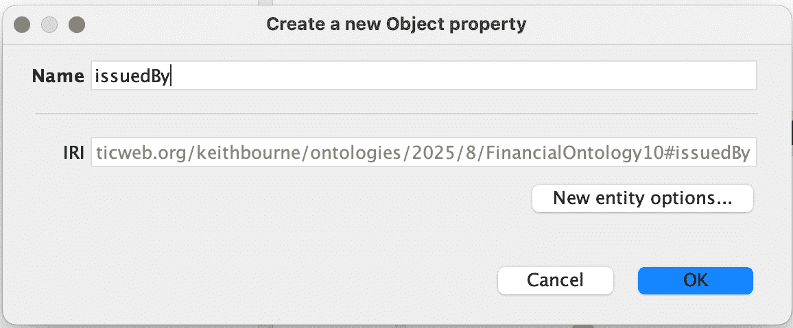

图 13.8 – 将 issuedBy 对象属性作为 owl:topObjectProperty 的子属性创建

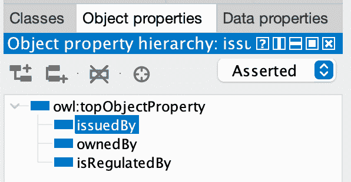

图 13.9 – 属性对象层次结构显示 issuedBy、ownedBy 和 isRegulatedBy 属性

1.  如果被询问，不要勾选**你想使兄弟对象属性不相关联吗？**（不推荐）。

    **注意：**如果你正在创建多个并排属性，也可以使用**添加兄弟**。

1.  选择`issuedBy`属性，在屏幕右侧的**Description: issuedBy**框中查找**域（交集）**。点击**域（交集）**旁边的**+**。

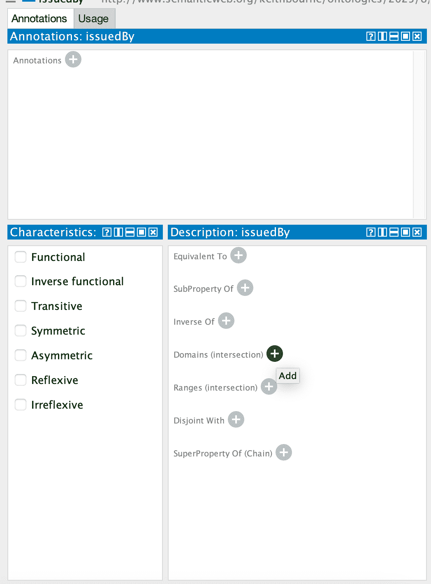

图 13.10 – 在 Description: issuedBy 面板中为 issuedBy 属性添加域限制

1.  在**issuedBy**弹出窗口中，展开`owl:Thing`，选择`FinancialInstrument`，然后点击**确定**。

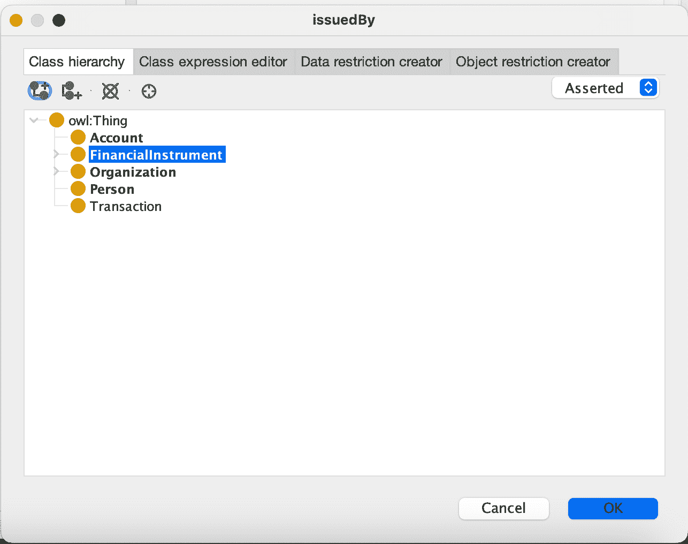

图 13.11 – 选择 FinancialInstrument 作为 issuedBy 属性的域

1.  点击**范围（交集）**旁边的**+**。

1.  在**issuedBy**弹出窗口中，展开`owl:Thing`，选择`Organization`，然后点击**确定**。

1.  对于`isRegulatedBy`，分配`域 = FinancialInstrument`，`范围 = RegulatoryAuthority`。

1.  对于`ownedBy`，分配`域 = FinancialInstrument`，然后点击**范围**旁边的**+**并选择`Organization`。

1.  切换到**数据属性**子选项卡（仍在**实体**选项卡内）。选择`owl:topDataProperty`并点击**添加子属性**按钮。

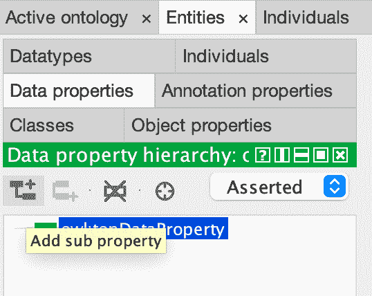

图 13.12 – 带有创建数据属性添加子属性按钮的数据属性子选项卡

1.  在**创建新数据属性**对话框中，只需键入`hasTicker`。

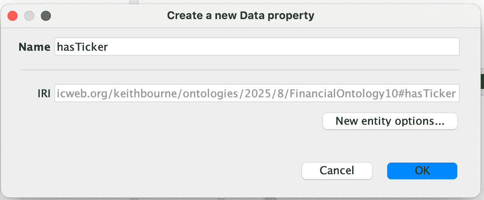

图 13.13 – 创建 hasTicker 数据属性对话框

1.  点击**继续**，然后点击**完成**。

1.  然后，为了设置域和范围，请执行以下操作：

    1.  在属性列表中选择`hasTicker`。

    1.  点击**域（交集）**旁边的**+**，然后选择**FinancialInstrument**。

    1.  点击**范围**旁边的**+**，然后在**内置数据类型**选项卡中，选择**xsd:string**。

    1.  当你完成时，你的**Description: hasTicker**部分应该看起来像这样：

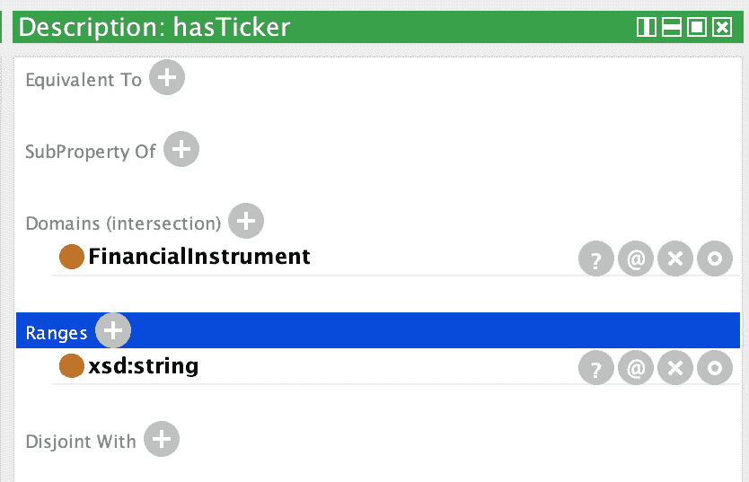

图 13.14 – 完成的`hasTicker`属性描述，显示了 FinancialInstrument 域和 xsd:string 范围

现在我们已经建立了类层次结构并定义了所有必要的属性及其域和范围，我们准备用具体例子来填充我们的本体。我们将从创建作为我们金融工具参考点的组织和监管机构开始。

## 步骤 11 – 首先创建引用个人

在 Protégé（以及在“本体”世界的通常情况下），**个人**仅仅意味着现实世界中的实际事物或事物的例子。它们可以是人、公司、股票、一个单独的苹果——无论什么。这里的“个人”一词并不意味着“人”，它意味着“一个特定的事物”。因此，尽管这可能感觉有点奇怪，我们称`AAPL`（一种股票）为**个人**，因为它是该类`股票`的单个、特定的例子。如果你的类是`组织`，那么`Apple_Inc`是该类的`个体`。如果你的类是`债券`，那么`USTB`可能是一个`个体债券`。创建所有组织`个体`：

1.  切换到**按类别查看个人**标签页。

1.  选择`组织`类。

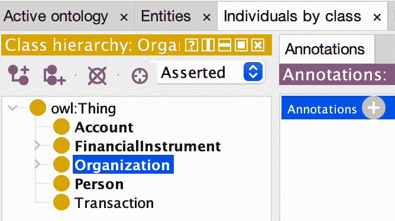

图 13.15 – 选择组织类别的按类别查看个人标签页

1.  创建`Apple_Inc`作为个体。

    1.  在屏幕右下角的**个人**面板中，你会看到一个**个人**标签页。点击看起来像钻石方形的图标带有**+**（**添加个人 +**），并创建`Apple_Inc`。

    1.  点击**确定**。

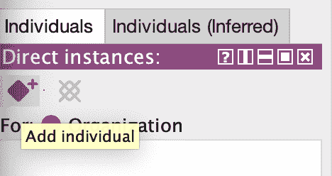

图 13.16 – 将 Apple_Inc 创建为组织类的个体

1.  对`Microsoft_Corp`重复**步骤 3**。

1.  对`US_Treasury`重复**步骤 3**。

1.  你的**个人**列表应该看起来像这样：

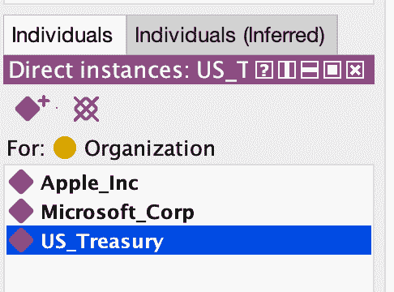

图 13.17 – 显示 Apple_Inc、Microsoft_Corp 和 US_Treasury 组织的个人面板

在本体中将我们的组织作为`个体`建立后，我们接下来需要创建监管这些金融实体的监管机构。

## 步骤 12 – 创建监管机构个体

现在我们将创建 SEC，它是监管我们本体中金融工具的监管机构。在美国金融体系中，**证券交易委员会**（**SEC**）监管股票和债券，使其成为我们金融本体的关键实体。

1.  在相同的**按类别查看个人**标签页中选择`RegulatoryAuthority`类。

1.  创建 SEC 作为个体：

    1.  点击**添加个人**。

    1.  将新个人命名为`SEC`。

    1.  点击**确定**。

1.  你的屏幕应该看起来像这样：

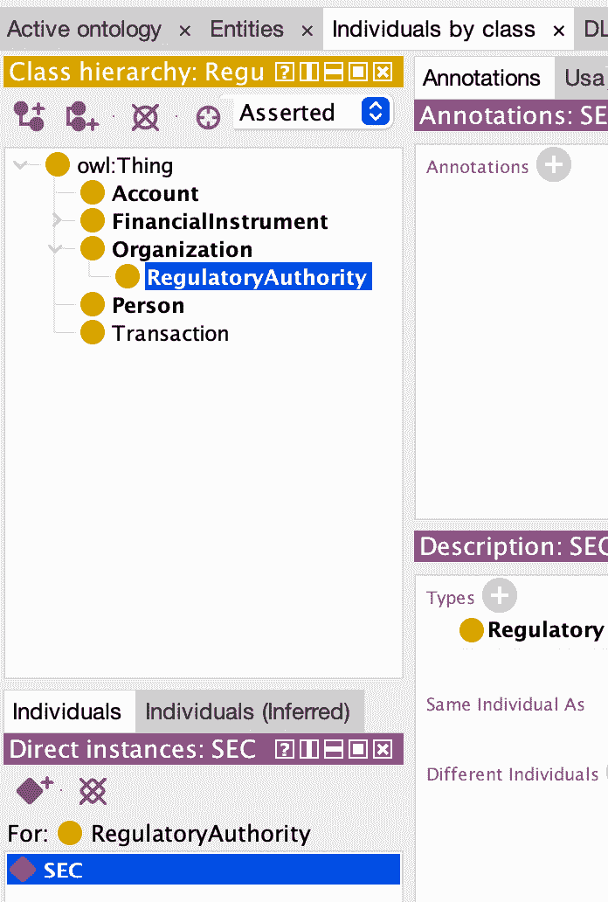

图 13.18 – 创建 SEC 个人后的监管机构类

现在我们已经将发行机构和监管机构定义为个体，我们准备创建金融工具本身，并建立所有这些实体之间的关系。

## 步骤 13 – 创建股票个体和链接属性

在我们的组织和监管机构就绪后，我们现在可以创建实际的金融工具，即这些组织发行的股票和债券。我们将每个工具作为一个个体创建，然后使用我们之前定义的属性将它们链接到其发行者和监管者。

1.  创建股票个体：

    1.  转到 **按类别的个体** 选项卡。

    1.  选择 `Stock` 类（在 `FinancialInstrument`/`Equity` 下）。

    1.  在下面的框中，您将看到一个 **个体** 选项卡。点击看起来像方形钻石带有 **+** 符号的图标（**添加个体 +**），并创建 `AAPL`.

    1.  您现在应该看到 `AAPL` 在 **个体** 选项卡下，位于 `Stock` 类别中。

    1.  对于 `MSFT` 也执行相同的操作。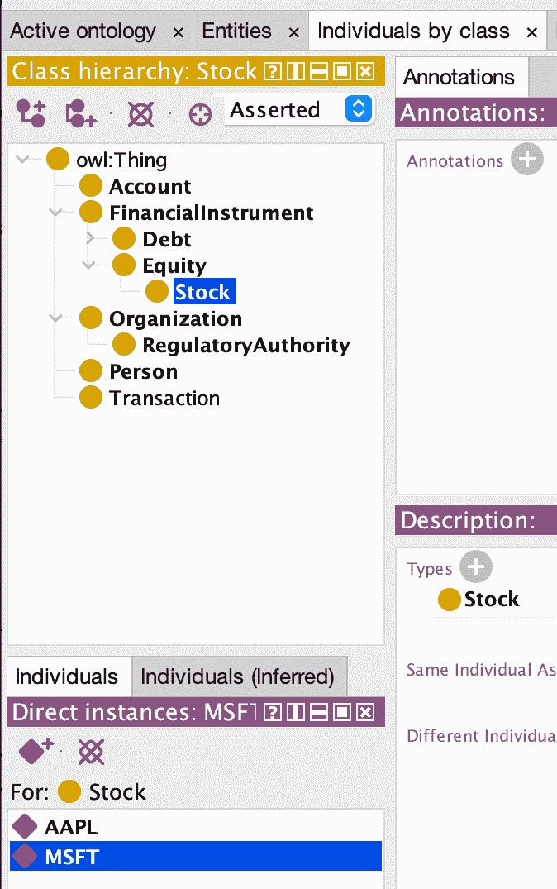

    图 13.19 – 显示 AAPL 和 MSFT 个体股票类

    1.  在 **个体** 列表中点击 **AAPL** 以选择它。

    1.  查看右侧的面板（**属性断言：AAPL** 面板）。此面板有如 **对象属性断言**、**数据属性断言** 等部分。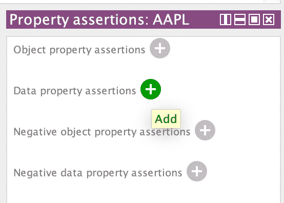

    图 13.20 – AAPL 个体属性断言面板

    1.  点击 **数据属性断言** 旁边的 **+**。

    1.  在弹出窗口中，展开 `owl:topDataProperty` 并点击 `hasTicker`.

    1.  在右侧的值字段中输入 `AAPL`，然后点击 **OK**。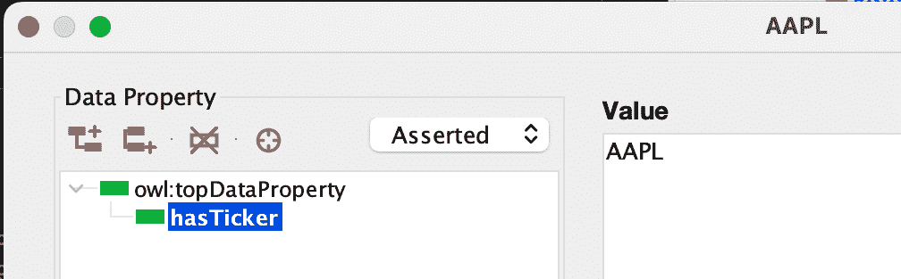

    图 13.21 – 向 AAPL 个体添加 hasTicker 数据属性值 AAPL

    1.  对于 `MSFT` 也执行相同的操作。

1.  创建一个 **Bond** 个体。

    1.  将 `USTB` 添加为 **Bond**。

    1.  将此添加到 **USTB**：**hasTicker: “USTB”**。

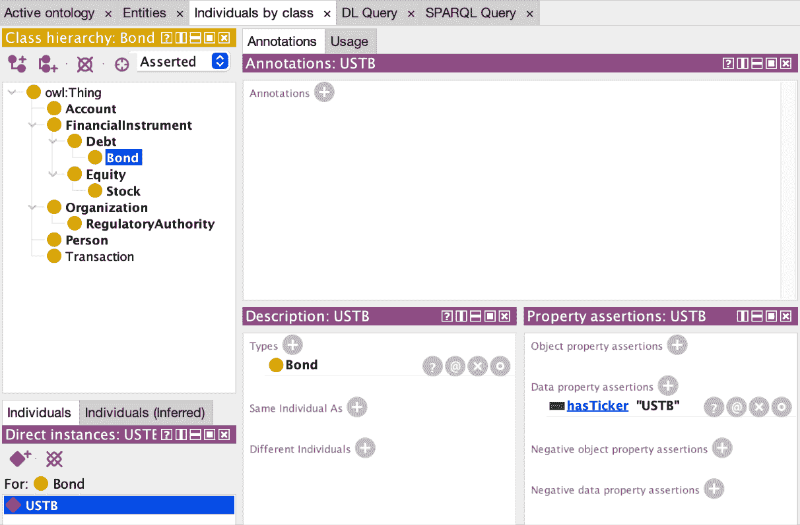

图 13.22 – 带有 USTB 个体及其 hasTicker 属性断言的债券类

1.  向金融工具添加对象属性

    1.  对于 AAPL：

        1.  从 **个体** 列表中选择 **AAPL**。

        1.  在右侧的 **属性断言** 面板上，执行以下操作：

        1.  添加对象属性：`issuedBy` = `Apple_Inc`.

        1.  添加对象属性：`isRegulatedBy` = `SEC`.

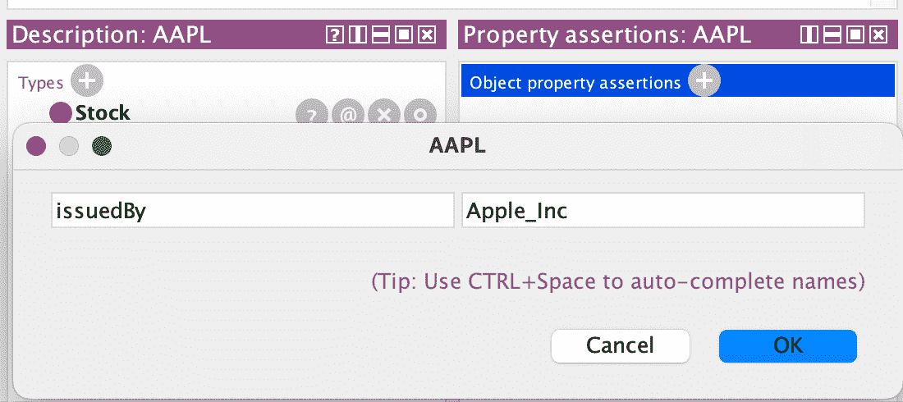

图 13.23 – AAPL 的属性断言显示由 Apple_Inc 发行和由 SEC 监管的情况

1.  对于 **MSFT**：

    1.  从 **个体** 列表中选择 **MSFT**。

    1.  添加对象属性：`issuedBy` = `Microsoft_Corp`

    1.  添加对象属性：`isRegulatedBy` = `SEC`

1.  对于 USTB：

    1.  从 **FinancialInstrument**/**Debt**/**Bond** 下的 **个体** 列表中选择 **USTB**。

    1.  添加对象属性：`issuedBy` = `US_Treasury`

    1.  添加对象属性：`isRegulatedBy` = `SEC`

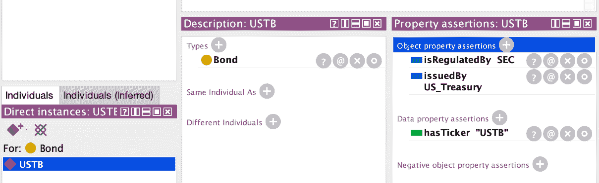

图 13.24 – USTB 的完整属性断言，包括由 US_Treasury 发行和由 SEC 监管

现在我们已经建立了完整的本体结构——包括类别、属性和个体及其关系——我们可以通过添加可读性注释来增强其清晰度和可用性，使其对未来的用户和应用更加易于访问。

## 第 14 步 – 丰富和注释

为每个类别（如`Stock`）添加标签（`rdfs:label`）和注释（`rdfs:comment`）对于使您的本体既可理解又可使用非常重要。标签为类别提供了一个可读的名称，这有助于用户快速识别每个类别代表的内容——即使技术类名不够清晰或使用类似代码的格式。注释提供了一个简短的描述或定义，解释了该类别在您的模型中的确切含义。这在较大的本体中或当分享您的工作时特别有用，因为它消除了歧义并确保每个人对`Stock`的理解是一致的。良好的标签和注释使您的本体自我文档化，更容易维护，并且对任何与之工作的人更加易于访问。

对于每个类别（从`Stock`开始），我们将执行以下操作：

1.  点击**实体**标签，然后点击**类别**子标签。在左侧查找类别列表。

1.  选择**Stock**。

1.  在右侧查找**注释**面板，选择**点击+**，并添加以下内容：

    +   rdfs:label: 股票

    +   定义：代表公司股权所有权的证券。

    +   范围注释：仅包括公开交易的股权证券；不包括私人股份类别（LP 单位，创始人股份）。

    +   示例：AAPL 是一个具有股票代码‘AAPL’的股票概念实例。

    +   隐藏标签：股权股份

    +   隐藏标签：普通股票（作为单独条目添加！）

    +   可选：备选标签：股份

注释属性`definition`、`scope note`、`example`、`hidden label`和`alternative label`来自 SKOS 词汇表。这是您学习如何导入新的本体以帮助您进行本体开发的机会：

+   在 Protégé窗口的顶部，点击**活动本体**标签。

+   在**直接导入**下的侧边栏中，点击小的**+** **加号**按钮。（是的——它在那个标签中。）

+   选择**从 Web 上的文档导入本体**。

+   为 SKOS-DL 输入此 URL：

[`www.w3.org/TR/skos-reference/skos-owl1-dl.rdf`](http://www.w3.org/TR/skos-reference/skos-owl1-dl.rdf)

+   点击**继续**。

+   它将检查本体，如果找到，您可以点击**完成**并继续。

+   一定要返回并添加此内容到`Stock`类别：定义、范围注释、示例、隐藏标签、备选标签。

注意，当您添加 SKOS 本体时，SKOS 顶级类将变得可见。SKOS 将这些类定义为受控词汇表的基础。我们目前不会深入探讨这一点，但它们在构建本体时可能很有帮助，所以我们将其保留，您可以研究并确定是否希望在将来使用它们。具体来说：

+   `概念`：代表任何想法或术语

+   `概念方案`：将概念集分组（词汇表或同义词典）

+   `集合`：用于任意概念分组（例如，股权工具类型）

现在为**债券**做同样的事情：

+   rdfs:label: 债券

+   定义：由政府或公司发行的债务证券，定期支付利息并在到期时偿还本金。

+   范围说明：包括具有定义期限和息票的固定收益证券；不包括未作为债券结构化的无担保债务。

+   示例：USTB 是由美国财政部发行并由 SEC 监管的债券个体。

+   隐藏标签：固定收益证券

+   隐藏标签：债务债券（作为单独条目添加！）

+   可选：备选标签：债券安全

虽然将类似注释添加到我们本体中的所有类（`Account`、`FinancialInstrument`、`Debt`、`Equity`、`Organization`、`RegulatoryAuthority`、`Person` 和 `Transaction`）将是有益的，但我们将跳过注释这些剩余的类，以保持实验室的专注和可管理性。在生产本体中，您希望为每个类提供全面的注释以确保清晰性和可维护性。

类似地，虽然我们在第 10 步中定义了 `ownedBy` 属性，但我们尚未在此实验室中演示其使用。在一个生产本体中，用代表投资者的**个人**个体表示，您将使用 `ownedBy` 将金融工具与其所有者链接起来。例如，断言 `John_Smith` 拥有 AAPL 以表示投资者的股票持有量。我们省略了这一点，以使实验室专注于核心本体结构，但所有权关系在现实世界的金融知识图谱中是至关重要的。注释 `个股` 和 `债券`：

+   在**类**子标签当前所在位置附近点击**个体**子标签。

+   选择以下个体：

    +   使用 `rdfs:label` = `AAPL` 注释 `AAPL`

    +   使用 `rdfs:label` = `MSFT` 注释 `MSFT`

    +   使用 `rdfs:label` = `USTB` 注释 `USTB`

最后，以 Turtle 格式保存。转到**文件**→**保存**并确保格式为**Turtle (.ttl)**。保存为 `FinancialOntology.ttl`。我们将在 *Code Lab 14.1* 中使用此文件。

## 为什么这个实验室很重要

到此练习结束时，您已积极走过了本体的完整生命周期：

+   为本体工程定义了范围、领域、目的和胜任力问题

+   收集并分析了相关的领域实体和关系

+   为金融工具和组织定义了清晰的类层次结构

+   指定具有显式域和范围的数据和对象属性

+   选择 OWL 2 DL 作为具有丰富表达能力的建模语言

+   安装并启动了用于本体编写的 Protégé `5.6.5`

+   使用批量和方法在 Protégé中构建了类结构

+   创建并链接个体（例如，AAPL，MSFT，USTB，Apple_Inc，SEC）

+   添加了详细的标签、注释和 SKOS 注释以提高清晰度

+   使用不相交类和属性断言来强制一致性

+   为对话 AI 和图应用准备了一个最小化、结构良好的金融本体

尽管这个金融本体是最小化的，但它展示了本体驱动设计的核心。它成为 AI 代理中答案检索和领域定位的结构化骨干。

# 摘要

在本章中，我们探讨了本体在创建智能 AI 代理中的基础作用。通过使用 Protégé进行实际操作，我们构建了一个金融本体，该本体正式表示领域知识——从股票和债券之间的层次关系到规范它们的结构。这个本体不仅提供了一种数据模型；它还提供了一个语义框架，使代理能够理解事物是什么，以及它们如何相互关联以及约束它们的规则。

我们创建的 OWL 本体作为机器推理的蓝图，以支持自动化推理和验证的形式编码专家知识。通过定义具有丰富注释的类、属性和个体，我们为能够精确且可解释地回答复杂领域问题的 AI 系统奠定了基础。

在下一章中，我们将把这个本体转换成 Neo4j 中的功能知识图谱。你将学习如何将你的 Protégé本体转换为图数据库，实现基于图的 RAG 技术，并看到如何将本体结构和图遍历相结合，实现强大的多跳推理能力。从形式化知识表示到实际实施的这一过程，将完成你对如何构建基于验证领域知识的 AI 代理的理解。

|

# 获取此书的 PDF 版本和独家额外内容

扫描二维码（或访问[packtpub.com/unlock](http://packtpub.com/unlock)）。通过名称搜索此书，确认版本，然后按照页面上的步骤操作。 |  |

| *注意：请保留您的发票。直接从 Packt 购买不需要* *发票。* |
| --- |
