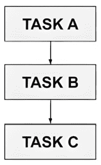
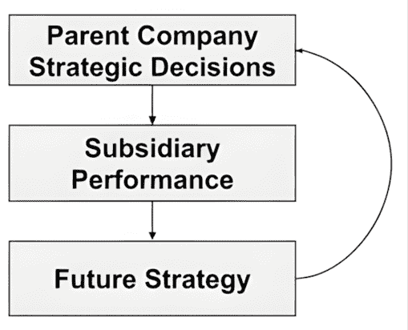

# 第十四章：基于图的 RAG

在*第十三章*中构建了一个健壮的本体之后，我们现在转向将其实现为一个功能性的**知识图谱**（**KG**）。KGs 有潜力成为有效代理 RAG 系统的“大脑”。基于图结构的**检索增强生成**（**RAG**）涉及查询 KG 数据源并将该数据呈现给 LLM 以回答查询。通过使用 KG，你可以给你的 RAG 结果提供更丰富的语义和更明确的实体间联系，从而实现多跳推理，这是传统检索方法无法实现的。

在本章中，我们将使用你在 Protégé中创建的金融本体，并在 Neo4j 中实现它，展示如何构建一个结合本体形式推理和图数据库实用能力的基于图结构的 RAG 系统。在本章中，我们将涵盖以下主题：

+   基于图结构的 RAG 简介

+   代码实验室 14.1 – 在 Neo4j 中构建和查询金融本体 KG

这些主题将使你具备将本体转化为可用于驱动复杂 AI 代理的生产级知识图谱的实用技能。让我们首先探索是什么使得基于图结构的 RAG 在传统检索方法之上如此强大。

**术语：基于图的 RAG 与 GraphRAG**

本章的名称是*基于图的 RAG*，我们有意避免将其称为 GraphRAG。“GraphRAG”是一个与我们在这里讨论的相关项目，但也有一些关键区别，因此我们想确保我们保持了两者之间的区别。微软研究院的 GraphRAG 实现是一个完整的管道，使用 LLM 来构建、结构和查询 KGs。它是对 KGs 的更稳健的实现，比我们在这里概述的简单基于图的 RAG 要复杂得多。它还有特定的实体和关系分组方式，以及特定的搜索方式，这与我们在本章中概述的方法不同。它使用两种搜索模式：一种全局搜索，查看图的高级聚类以获得概览，以及一种局部搜索，聚焦于特定相关节点以获取详细信息。在此阶段，它采取与我们在本章中概述的类似步骤；基于图的检索结果被输入到 LLM 中以生成最终答案，并且它具有相同的好处，即结构化和固有的关系性结果，有助于 LLM 综合出一个连贯且涵盖所有必要部分的答案。他们进行的实验表明，GraphRAG 能够比标准 RAG 管道更准确地回答复杂的多跳问题，有助于支持 KGs 在 RAG 中使用时的强大能力。了解更多关于 GraphRAG 的信息，请参阅[`arxiv.org/abs/2404.16130`](https://arxiv.org/abs/2404.16130)。

GitHub 仓库地址如下：[`github.com/microsoft/graphrag`](https://github.com/microsoft/graphrag)。

# 基于图结构的 RAG 简介

当我们在前几章讨论 RAG 时，我们依赖于向量存储（语义嵌入）和有时是关键词（稀疏）搜索来检索 LLMs 的上下文。虽然这种混合语义加关键词方法提高了相关性，但它仍然会在需要精确推理、可解释性或紧密事实基础时遇到困难。下一个进化飞跃是基于图的 RAG，它利用 KGs 提供结构化、可导航的上下文，极大地增强了可靠性、事实性和多步推理。

以下是将 KGs 与 RAG 结合用于 AI 代理的关键优势：

+   **增强检索精度和相关性**：通过遍历显式图边而非仅依赖向量邻近度，基于图的 RAG 过滤掉噪声，并返回高度针对查询意图的子图。

+   **更深入的语义和上下文理解**：KGs 编码实体、同义词和消歧路径，保留细微含义并防止多义词的误解。它们可以远远超出仅使用平面嵌入所能捕捉的内容。

+   **多跳推理和复杂查询处理**：代理可以遍历关系链（A→B→C…）以逻辑地连接不同的事实，支持复杂的多步推理，这是传统检索所遗漏的。

+   **可解释性和可追溯性**：每个检索到的节点和边都带有来源元数据，这为医疗保健和金融等受监管领域提供了至关重要的清晰审计轨迹。

+   **全面总结和连贯响应**：而不是零散的片段，基于图的 RAG 可以提取和总结连接的子图——产生尊重领域潜在结构的连贯概述。

+   **异构数据源的集成**：KGs 将结构化表格、本体和未结构化文本统一在一个模式下，让代理能够在不针对每种格式进行定制提示工程的情况下跨孤岛查询。

+   **改进数据新鲜度和可更新性**：由于图可以增量更新，代理有查询最新事实的能力。如果操作得当，这可以减少幻觉并消除昂贵模型重新训练的需求。

考虑到这些优势，让我们明确区分我们在前几章中如何使用 KGs，以及我们在这章中如何使用它们。

## 循环图与基于本体论的 KGs

在*第十二章*中，我们使用 LangGraph 介绍了循环图。这些是实体和关系形成反馈循环的结构，使得递归、上下文相关的推理成为可能。它们在具有相互影响的领域表现出色，例如财务建模，其中母公司的决策影响子公司的表现，反过来，这种表现又塑造了未来的战略。在本章中我们将实现的基于本体论的 KGs 采用了一种根本不同的方法。它们主要是静态的、基于模式的结构，建立在**有向无环图**（**DAGs**）之上，这意味着你不能跟随边返回起点。

在其核心，是一个编码“是”和“部分”关系的分类法，其中类型层次结构强制执行无环性（没有类成为自己的祖先）同时支持清晰的继承模式。例如，任务依赖关系，其中任务 A 必须在任务 B 完成之前完成，任务 B 在任务 C 之前完成，形成一个 DAG。



图 14.1 – DAG 中的单向信息流

相比之下，循环图拥抱循环。考虑一个财务场景，其中母公司的战略决策影响子公司的表现，反过来，这种表现又塑造了母公司的未来战略。



图 14.2 – 循环图

这些循环通过条件边、相互依赖或时间反馈出现，丰富了表达能力，但需要循环检测和遍历策略来防止无限循环。

这种架构差异对实现很重要。循环图创建主动探索循环，其中代理提出基于假设的遍历，并回访节点直到推理收敛。这对于模拟来说很强大，但需要循环检测策略。基于本体论的 KGs 允许直接查找：代理查询定义或约束，并将其直接纳入提示或后处理中。在 RAG 系统中，它们擅长通过精确的类型检查进行过滤检索，确保只有有效、符合模式的真实事实达到 LLM。您在*第十三章*中提到的金融本体，具有清晰的类层次结构（`Stock`、`Bond`、`Organization`）和关系（`issuedBy`、`isRegulatedBy`），正是这种稳定的骨干，它将 LLM 的响应建立在经过验证的领域知识上。

在建立好这个概念基础之后，我们就可以将理论付诸实践。在接下来的代码实验室中，我们将把你在*第十三章*中构建的金融本体转换为一个功能性的 Neo4j 知识图谱。你将亲身体验到基于本体的 KGs 的静态、模式驱动特性如何为可靠的基于图的 RAG 提供稳定的基石，同时仍然保持回答关于金融工具及其关系的复杂、多跳查询的灵活性。

# 代码实验室 14-1 – 在 Neo4j 中构建和查询金融本体 KG（从 Protégé）

在这个全面的动手实验室中，我们将把你在*第十三章*中创建的金融本体转换为一个在 Neo4j 中运行的完全功能性的知识图谱。这个实际练习将展示如何将形式本体设计和生产就绪的图数据库之间的差距连接起来，使你能够构建强大的基于图的 RAG 系统。

## 在 Neo4j 中设计和实现由本体驱动的 KGs

你在*第十三章*中构建了一个本体，当你使用 Protégé这样做时，本质上你已经有一个知识图谱了。但我们需要采取更多步骤，将当前格式转换为将其放入 Neo4J，这是一个流行的 KG 服务。让我们首先谈谈 KGs 的一般情况，然后我们将处于一个很好的位置来将你的新本体放入其中！

## 核心图概念复习

一个知识图谱本质上依赖于实体及其关系的清晰、结构化表示。图的主要组成部分如下：

+   **节点（顶点）**：节点是实体或对象，如人、地点、事件或概念

+   **关系（边）**：关系描述节点之间的连接或交互

+   **属性（属性）**：属性为节点和关系提供详细的上下文或属性，如名称、描述和时间戳

社交网络常被用来解释图论，其中人们是节点，他们之间的“连接”是边。这些连接可以赋予值，例如一个数字表示两个相连的人相互互动的次数。这意味着互动更多的人有“更强”的联系，这可以用于社交网络的分析。但在我看来，图论最重要的方面是它不仅仅是社交网络。任何事物都可以用图来表示。任何两个事物之间的关系都可以用边来表示。因此，知识图谱（KGs）可以真正地表示存在于几乎所有无法仅用传统平面数据库捕获的事物中的隐藏知识世界。你越是用图工作，就越会意识到它们在表示数据方面的强大能力，远远超出了行和列。这也解释了为什么它们在用 RAG 方法向你的 LLM 表示“知识”时如此理想！

重要的图指标包括距离（节点之间的最短路径）、路径长度（连接中的跳数）、度（节点的连接数）、邻域（相邻节点和关系）以及边/关系的相对“强度”。这些指标对于有效地将用户查询转换为有意义的图检索操作至关重要。

现在我们已经涵盖了基本的图论，是时候通过逐步构建你的知识图谱来将这些概念付诸实践了。

### 第 1 步 - 回顾：你在 Protégé中的内容

在*第十三章*中生成的本体描述了金融工具、组织和监管机构，以及如`ownedBy`、`issuedBy`、`hasTicker`和`isRegulatedBy`等关系，还有标签、注释以及 AAPL、MSFT、USTB、苹果公司、微软公司和美国证券交易委员会等个人。

在*第十三章*的末尾，你已将本体从 Protégé导出为名为`FinancialOntology.ttl`的 Turtle（`.ttl`）文件。我们将从这个文件开始这个代码实验。如果你目前无法访问*第十三章*中生成的文件，我们已在 GitHub 上提供了一个示例文件。

### 第 2 步 - 准备你的笔记本环境

我们将在本地使用 Neo4j Desktop，这样你可以轻松地运行和检查你的本体驱动的 KG。

#### 第 2.1 步 - 安装并启动 Neo4j Desktop

安装 Neo4j Desktop 的步骤如下：

1.  前往[`neo4j.com/download/`](https://neo4j.com/download/)下载适用于您操作系统的 Neo4j Desktop。

1.  安装应用程序并启动它。

1.  在 Neo4j Desktop 中，执行以下操作：

    1.  点击**创建实例**并给它起一个名字（例如，`FinancialOntologyKG`）。

    1.  选择一个你记得的密码并点击**创建**。

    1.  它应该正在运行，但如果不在，请点击**启动**来打开它。

    1.  在界面中，您将看到一个连接 URI；复制它并将其添加到下面描述的 `env.txt` 中。

#### 步骤 2.2 – 在本地文件中保存您的凭据

我们将这些凭据存储在笔记本同一目录下的 `env.txt` 文件中。

将以下内容添加到 `env.txt` 中：

```py
NEO4J_URI = "bolt://127.0.0.1:7687"
NEO4J_USER = "neo4j"
NEO4J_PASS = "your_password_here" 
```

这允许您的笔记本在不将凭据硬编码到代码中时加载凭据。

#### 步骤 2.3 – 安装所需的 Python 包

在您的 Jupyter/Colab 笔记本的第一单元格中，安装我们将需要的包：

```py
%pip install neo4j ==6.0.3
%pip install rdflib==7.5.0
%pip install pandas==2.3.3
%pip install sentence-transformers==5.1.2
%pip install faiss-cpu==1.13.1
%pip install python-dotenv==1.2.1
%pip install langchain==1.1.0
%pip install langchain-openai==1.1.0
%pip install langchain-community==0.4.1 
```

如果提示，安装后重新启动笔记本内核。

这些库在本代码实验室中用于以下目的：

+   `neo4j`：用于连接到您的本地 Neo4j 实例、运行 Cypher（创建唯一性约束、导入节点/边/属性）以及在 *步骤 4*–*7* 中查询图的官方 Python 驱动程序

+   `rdflib`：解析 Protégé Turtle (`.ttl`) 本体，迭代三元组以构建三个 CSV 文件（节点、边、数据）和用于 `:IS_A` 边的 `rdf:type` 对（*步骤 3* 和 *5*）

+   `pandas`：将提取的 RDF 作为 DataFrame 存储，写入/读取 CSV 以进行导入，并格式化搜索/查询的小型表格结果

+   `sentence-transformers`：为图实体的“混合”描述生成本地文本嵌入，以支持语义搜索（*步骤 6*）

+   `faiss-cpu`：LangChain 包装的内存向量索引（仅 CPU），用于在这些嵌入上快速执行相似性搜索（*步骤 6*–*7*）

+   `python-dotenv`：加载 `env.txt`，以便笔记本可以读取 `NEO4J_URI/USER/PASS` 和 `OPENAI_API_KEY` 而无需硬编码机密（*步骤 2.2*）。

+   `langchain`,`langchain-openai`,`langchainhub`,`langchain-community`, 和 `langchain-experimental`：RAG 流的粘合剂：文档、FAISS 向量存储包装器、检索器、提示模板、可运行的链、输出解析和 OpenAI 聊天模型；`hub`/`experimental` 包含了您可以后来可选使用的模板/实用工具（*步骤 6*–*8*）

在我们的环境完全配置并且所有必要的库都已安装后，我们准备开始转换过程。

### 步骤 3 – 将您的 Protégé 本体转换为 Neo4j 导入格式

在这一步，我们将从 *代码实验室 13.1* 的末尾保存的本体文件（`FinancialOntology.ttl`）准备好导入到 Neo4j。我们将通过解析 Turtle 文件到三个 CSV 文件来完成此操作——一个用于节点，一个用于边，一个用于数据属性——这样 Neo4j 就可以轻松地加载它们。

#### 步骤 3.1 – 将本体文件放置在您的笔记本文件夹中

从 *代码实验室 13.1* 定位 `FinancialOntology.ttl`。将其复制或移动到您现在正在工作的笔记本所在的同一目录中。

这确保了笔记本可以读取文件，而无需额外的文件路径。

#### 步骤 3.2 – 设置导入

在一个新的单元格中，导入我们将使用的库：

```py
# --- Core libraries ---
import os
import rdflib
from rdflib.namespace import RDF, RDFS, OWL
import pandas as pd
from neo4jimport GraphDatabase
from sentence_transformers import SentenceTransformer
from typing import List, Dict, Any
# --- LangChain components ---
from langchain.docstore.document import Document
from langchain_core.embeddings import Embeddings
from langchain_community.vectorstores import FAISS
from langchain_core.output_parsers import StrOutputParser
from langchain_core.prompts import ChatPromptTemplate
from langchain_core.runnables import RunnableLambda
from langchain_openai import ChatOpenAI
from dotenv import load_dotenv
import textwrap
# Load env vars from the file used in previous chapters
_ = load_dotenv(dotenv_path='env.txt')
os.environ['OPENAI_API_KEY'] = os.getenv('OPENAI_API_KEY')
# --- Neo4j connection settings ---
NEO4J_URI = os.getenv('NEO4J_URI', 'neo4j://127.0.0.1:7687')
NEO4J_USER = os.getenv('NEO4J_USER', 'neo4j')
NEO4J_PASS =os.getenv('NEO4J_PASS', 'password')
 # --- LLM setup ---
CHAT_MODEL = "gpt-4o-mini"
llm = ChatOpenAI(model=CHAT_MODEL, temperature=0.2)
 # Turn off hosted LangSmith tracing (optional: silences that warning)
os.environ["LANGCHAIN_TRACING_V2"] = "false"
# --- Initialize Neo4j driver ---
driver = GraphDatabase.driver(NEO4J_URI, auth=(NEO4J_USER, NEO4J_PASS))
 # --- Database reset utility ---
def reset_neo4j_database():
    """Remove all nodes and relationships from Neo4j"""
    with driver.session() as session:
        # Delete everything in one query
        result = session.run("MATCH (n) DETACH DELETE n")
        summary = result.consume()
        print(f"Neo4j database reset - deleted {summary.counters.nodes_deleted} nodes and {summary.counters.relationships_deleted} relationships")
# Uncomment the line below to reset your database
# WARNING: This will delete ALL data in your Neo4j instance
reset_neo4j_database()
print(f"Connected to Neo4j at {NEO4J_URI} as user {NEO4J_USER}") 
```

下面是这个单元格块中的代码从上到下所做的事情：

+   导入您稍后将要使用的库：RDF 解析（`rdflib`、`RDF/RDFS/OWL`）、表格处理（`pandas`）、Neo4j 驱动程序、本地嵌入器（`SentenceTransformer`）、类型提示、LangChain 的文档/嵌入/向量存储/提示/可运行/解析器、OpenAI 聊天包装器、`dotenv` 用于 `env` 文件、以及 `textwrap`。

+   使用 `load_dotenv(...)` 从 `env.txt` 加载机密/配置，然后从环境中拉取 `OPENAI_API_KEY` 并将其分配给 `openai.api_key`。

+   如果缺失，从 `env` 中读取 Neo4j 连接设置并使用合理的默认值：

    +   `NEO4J_URI`（默认为 `neo4j://127.0.0.1:7687`）

    +   `NEO4J_USER`（默认为 `neo4j`）

    +   `NEO4J_PASS`（默认为 `password`）

+   通过选择聊天模型（`gpt-4o-mini`）来设置 LLM，并使用 `temperature=0.2`（更确定性的输出）创建 LangChain `ChatOpenAI` 客户端。

+   通过设置 `LANGCHAIN_TRACING_V2=false` 来静默 LangSmith 追踪，以避免笔记本中的“追踪”警告。

+   使用之前加载的连接 URI、用户名和密码创建 Neo4j 数据库驱动程序。

+   定义了一个 `reset_neo4j_database()` 函数，使用 `DETACH DELETE` 从您的 Neo4j 实例中清除所有节点和关系，这在一个查询中删除节点及其关系。

+   执行 `reset` 函数以从干净的数据库开始（注意：在生产环境中，您通常会在初始设置后注释掉此操作以保留您的数据）。

+   通过打印连接详细信息来确认 Neo4j 连接。

现在我们已经加载了所有依赖项并设置了配置，让我们解析本体文件并将其结构提取成 Neo4j 可以理解的格式。

#### 步骤 3.3 – 将 Turtle 文件解析成 CSV 文件（新单元格）

Neo4j 不能直接导入 RDF/Turtle 文件，因此我们需要将我们的本体转换成它理解的格式：清晰分离节点（实体）、边（关系）和属性（属性）的 CSV 文件。这个中间步骤也给了我们检查和验证数据的机会，在将其加载到图数据库之前，如果出现问题，调试会更容易。

运行此单元格以读取您的本体并创建 `ontology_nodes.csv` 和 `ontology_edges.csv`：

```py
g = rdflib.Graph()
g.parse('FinancialOntology.ttl', format='turtle')
# Helper to get first value of a given property
def get_first(subject, prop):
   for val in g.objects(subject, prop):
       return str(val)
   return None
# --- Collect nodes —
nodes = []
for s in g.subjects(RDF.type, OWL.Class):
    nodes.append({
        'id': str(s),
        'label': get_first(s, RDFS.label) or s.split('#')[-1],
        'comment': get_first(s, RDFS.comment),
        'type': 'Class'
    })
for s in g.subjects(RDF.type, OWL.NamedIndividual):
    nodes.append({
        'id': str(s),
        'label': get_first(s, RDFS.label) or s.split('#')[-1],
        'comment': get_first(s, RDFS.comment),
        'type': 'Individual'
    })
nodes_df = pd.DataFrame(nodes)
nodes_df.to_csv('ontology_nodes.csv', index=False)
# --- Collect edges —
edges = []
for s, p, o in g.triples((None, None, None)):
   if p in [RDF.type, RDFS.label, RDFS.comment]:
       continue
   if str(p).startswith('http://www.w3.org/2002/07/owl#'):
       continue
   if isinstance(o, rdflib.term.Identifier) and str(o).startswith('http'):
       edges.append({
           'source': str(s),
           'target': str(o),
           'type': p.split('#')[-1] if '#' in str(p) else str(p).split('/')[-1]
       })
edges_df = pd.DataFrame(edges)
edges_df.to_csv('ontology_edges.csv', index=False)
print("Created ontology_nodes.csv and ontology_edges.csv")
data_rows = []
for s, p, o in g.triples((None, None, None)):
    # Keep only literal values (data properties)
   if isinstance(o, rdflib.term.Literal):
       prop_name = p.split('#')[-1] if '#' in str(p) else str(p).rstrip('/').split('/')[-1]
        # capture datatype if present
       dtype = str(o.datatype) if o.datatype else None
       data_rows.append({
           'subject': str(s),
           'property': prop_name,
           'value': str(o),
           'datatype': dtype
       })
pd.DataFrame(data_rows).to_csv('ontology_data.csv', index=False)
print("Created ontology_data.csv") 
```

这里是对我们在这里所做事情的说明：

+   将导出的 Turtle 本体文件加载到内存中的 RDF 图中。

+   定义了一个小助手来获取给定 RDF 属性的第一个值，例如标签或注释。

+   遍历所有本体类和个体，捕获它们的 IRI、可读标签、可选注释和类型，然后将它们写入节点 CSV：

    +   **节点 CSV** (`ontology_nodes.csv`): 本体中的每个类和个体都有一行，包含其 ID（IRI）、标签（友好名称）、可选注释以及它是否是 `Class` 或 `Individual` 类型

+   遍历所有对象属性三元组（资源之间的链接），跳过元数据和 OWL 模式术语，并将它们写入边 CSV：

    +   **边 CSV** (`ontology_edges.csv`): 每个对象属性断言（两个节点之间的链接）都成为一行，包含源、目标和类型（属性名称）

+   遍历所有数据属性三元组（附加到资源上的文字值），记录属性名称、值和数据类型，并将它们写入数据属性 CSV：

    +   **数据属性 CSV** (`ontology_data.csv`): 每个数据属性断言（分配给节点的文字值，例如`hasTicker = "AAPL"`）都通过主题节点的 IRI、属性名称、文字值及其数据类型进行捕获

+   这三个 CSV 文件共同描述了 Neo4j 导入将使用的节点、关系和文字属性。

在我们的本体成功转换为 CSV 格式后，我们现在准备将结构化数据加载到 Neo4j 中，并使我们的知识图谱变得生动。

### 第 4 步 – 将节点、边和数据属性导入 Neo4j

在此步骤中，您将从笔记本连接到您的 Neo4j 实例，在节点 ID 上创建唯一性约束，然后导入以下内容：

+   `ontology_nodes.csv` → 节点

+   `ontology_edges.csv` → 关系（`issuedBy`、`isRegulatedBy`、`ownedBy`）

+   `ontology_data.csv` → 数据属性（我们将设置`hasTicker`）

这种方法避免了将 CSV 文件复制到 Neo4j 的`import`文件夹中的需求，并且对于中小型演示效果很好。

#### 第 4.1 步 – 配置您的 Neo4j 连接

首先，我们将使用从环境文件中加载的凭据与您的 Neo4j 数据库建立连接：

```py
def run_tx(query, params=None):
   with driver.session() as session:
       return session.run(query, params or {}).consume()
print(f"Connected to Neo4j at {NEO4J_URI} as user {NEO4J_USER}") 
```

下面是代码执行的操作：

+   定义一个辅助函数，在它自己的会话中运行 Cypher 查询并立即消耗结果

+   打印一个确认消息，显示连接细节以验证数据库是否可访问

当运行时，应该输出以下内容：

```py
Connected to Neo4j at neo4j://127.0.0.1:7687 as user neo4j 
```

在我们的数据库连接建立并验证后，我们需要设置适当的约束以确保在导入过程中的数据完整性。

#### 第 4.2 步 – 创建模式约束

我们将导入所有具有通用标签如`:Resource`和`unique ID`的资源。稍后（可选步骤），您可以添加更具体的标签，如`:Stock`或`:Bond`：

```py
run_tx(""" CREATE CONSTRAINT resource_id_unique IF NOT EXISTS FOR (n:Resource) REQUIRE n.id IS UNIQUE """)
print("Constraint ensured: (:Resource {id}) is UNIQUE.") 
```

当运行时，应该输出以下内容（其中`id`表示为`{id}`）：

```py
Constraint ensured: (:Resource {id}) is UNIQUE. 
```

#### 第 4.3 步 – 从 ontology_nodes.csv 加载节点

此步骤读取从 CSV 导出的本体节点，并将它们作为图资源插入到 Neo4j 中：

```py
nodes_df = pd.read_csv("ontology_nodes.csv")
print(nodes_df.head())
# MERGE all nodes as :Resource; store label/comment/type for later use
node_query = """
MERGE (n:Resource {id: $id})
SET n.rdfs_label = $rdfs_label,
    n.comment = $comment,
    n.kind = $kind
"""
with driver.session() as session:
    for rec in nodes_df.to_dict(orient="records"):
        params = {
            "id": rec["id"],
            "rdfs_label": rec.get("label"),
            "comment": rec.get("comment"),
            "kind": rec.get("type")
        }
        session.run(node_query, params)
print(f"Imported {len(nodes_df)} nodes as :Resource.") 
```

下面是代码执行的操作：

+   将`ontology_nodes.csv`文件加载到 DataFrame 中并预览前几行

+   定义一个 Cypher 查询，将每个节点与图中的`:Resource`标签合并，通过其唯一 ID 进行键控

+   在每个节点上设置额外的属性：可读性标签、注释和类型（`Class`或`Individual`）

+   遍历 CSV 中的所有行，将它们的值传递给 Cypher 查询

+   打印一个确认消息，显示导入的节点数量

+   在这一点上，它将列出节点并输出：

    ```py
    Imported 17 nodes as :Resource. 
    ```

现在所有节点都在图中，我们需要根据我们定义的本体中的关系将它们连接起来。

#### 第 4.4 步 - 从 ontology_edges.csv 加载关系

当我们将你的本体中的关系引入 Neo4j 时，每个关系都需要分配一个具体的关系类型（例如`:ISSUED_BY`或`:OWNED_BY`）。在 Cypher 中，你不能简单地插入一个变量作为关系类型。它必须直接在查询中写出。Neo4j 的**Cypher 的神奇过程库**（**APOC**）提供了高级工具来实现这一点，但由于我们保持这个实验室自包含和简单，我们将采取直接的方法：我们只关注对我们金融本体重要的三种边缘类型（`issuedBy`、`isRegulatedBy`和`ownedBy`），并为每种类型创建一个小 Cypher 查询。然后，当我们遍历 CSV 中的边缘时，我们将根据边缘的名称选择正确的查询。这样，我们的本体边缘可以干净地映射到 Neo4j 的关系类型，而不增加额外的复杂性：

```py
edges_df = pd.read_csv("ontology_edges.csv")
print(edges_df.head())
# --- Define relationship type mapping ---
rel_map = {
    "issuedBy": "ISSUED_BY",
    "isRegulatedBy": "IS_REGULATED_BY",
    "ownedBy": "OWNED_BY",
}
# --- Cypher queries for each relationship type ---
query_issued = """
MATCH (a:Resource {id: $src}), (b:Resource {id: $tgt})
MERGE (a)-[:ISSUED_BY]->(b)
"""
query_regulated = """
MATCH (a:Resource {id: $src}), (b:Resource {id: $tgt})
MERGE (a)-[:IS_REGULATED_BY]->(b)
"""
query_owned = """
MATCH (a:Resource {id: $src}), (b:Resource {id: $tgt})
MERGE (a)-[:OWNED_BY]->(b)
"""
# --- Import edges into Neo4j ---
with driver.session() as session:
    count = 0
    for rec in edges_df.to_dict(orient="records"):
        t = str(rec.get("type", "")).strip()
        src = rec.get("source")
        tgt = rec.get("target")
        if t not in rel_map:
            continue # skip edges we aren't modeling here
    if t == "issuedBy":
        session.run(query_issued, {"src": src, "tgt": tgt})
    elif t == "isRegulatedBy":
        session.run(query_regulated, {"src": src, "tgt": tgt})
    elif t == "ownedBy":
        session.run(query_owned, {"src": src, "tgt": tgt})
    count += 1
print(f"Imported {count} relationships (ISSUED_BY, IS_REGULATED_BY, OWNED_BY).") 
```

这段代码做了以下操作：

+   将`ontology_edges.csv`文件读入 DataFrame 并预览前几行

+   定义从本体属性名称到在 Neo4j 中创建的大写关系类型的映射

+   为每种关系类型（`ISSUED_BY`、`IS_REGULATED_BY`和`OWNED_BY`）准备单独的 Cypher 查询

+   遍历每个边缘记录，过滤掉不在映射中的任何关系

+   执行适当的 Cypher 查询以使用正确的关联类型连接源节点和目标节点

+   计算创建的总关系数并打印摘要信息

+   在这一点上，它将列出关系并输出：

    ```py
    Imported 4 relationships (ISSUED_BY, IS_REGULATED_BY, OWNED_BY). 
    ```

现在我们已经通过它们的关系正确连接了节点，我们需要添加提供特定属性的数据属性。

#### 第 4.5 步 - 从 ontology_data.csv 加载数据属性

我们将在`subject`节点上设置`hasTicker`。你可以稍后扩展这个块来处理更多的属性或数据类型：

```py
Try:
    data_df = pd.read_csv("ontology_data.csv")
except FileNotFoundError:
    data_df = pd.DataFrame(
        columns=["subject","property","value","datatype"])
print(edges_df.head())
# Only apply properties we care about in this lab (hasTicker)
query_has_ticker = """
MATCH (n:Resource {id: $id})
SET n.hasTicker = $val
"""
with driver.session() as session:
    tick_count = 0
    for rec in data_df.to_dict(orient="records"):
        prop = str(rec.get("property", "")).strip()
        if prop != "hasTicker":
            continue
        session.run(query_has_ticker, {"id": rec.get("subject"), 
            "val": rec.get("value")})
        tick_count += 1
print(f"Set hasTicker on {tick_count} nodes.") 
```

这段代码做了以下操作：

+   尝试读取`ontology_data.csv`文件；如果不存在，则创建一个具有预期列的空 DataFrame

+   显示数据的前几行以供检查

+   定义一个 Cypher 查询来设置由其 ID 识别的节点的`hasTicker`属性

+   遍历每个记录，过滤出属性名为`hasTicker`的记录

+   执行查询以更新匹配的节点并设置`ticker`值

+   计算更新的节点数量并打印摘要信息

+   在这一点上，它将输出以下内容：

    ```py
    Set hasTicker on 3 nodes. 
    ```

现在我们已经从我们的本体中导入了所有节点、关系和数据属性，让我们通过运行快速测试查询来验证一切是否正确加载。

#### 第 4.6 步 - 快速烟雾测试

运行以下代码作为测试：

```py
# Find anything that looks like a stock-ish resource with a ticker
with driver.session() as session:
   result = session.run("""
       MATCH (n:Resource)
       WHERE n.hasTicker IS NOT NULL
       RETURN n.rdfs_label AS label, n.hasTicker AS ticker, n.id AS id
       ORDER BY label
   """)
   rows = result.data()
rows 
```

如果你看到`AAPL`、`MSFT`和`USTB`及其股票代码的行，你就做得很好了。

它看起来如下所示：

```py
[{'label': 'AAPL',
  'ticker': 'AAPL',
  'id':
'http://www.semanticweb.org/keithbourne/ontologies/2025/7/FinancialOntology/AAPL'},
{'label': 'MSFT',
  'ticker': 'MSFT',
  'id':
'http://www.semanticweb.org/keithbourne/ontologies/2025/7/FinancialOntology/MSFT'},
{'label': 'USTB',
  'ticker': 'USTB',
  'id': 'http://www.semanticweb.org/keithbourne/ontologies/2025/7/FinancialOntology/USTB'}] 
```

在确认并验证了基本图结构和工作状态后，我们可以通过添加导航元素来增强它，这将使查询更加直观，并能够基于类检索我们的金融工具。

### 第 5 步 – 添加导航锚节点（股票、债券等）

在这一步，你将执行以下操作：

1.  从你的 `Turtle` 中导入 `rdf:type` (类成员关系) 到 Neo4j。

1.  创建 **概念** 节点（例如，`All Stocks`，`All Bonds`）并将它们连接到其成员。

为什么进行这个更改？早期的代码片段假设节点已经有了 `:Stock/:Bond` 这样的标签。我们的导入使用通用的 `:Resource`，因此我们添加了显式的成员边（`(:Resource)-[:IS_A]->(:Resource {rdfs_label:'Stock'})`）并使用这些边来构建锚点。

#### 第 5.1 步 – 从 TTL 添加类成员关系边

从 Turtle 文件构建 `rdf:type`（类成员关系）边并将其推送到 Neo4j：

```py
type_pairs = [] # (individual_iri, class_iri)
# We only want membership of individuals to classes (not "is a Class" or "is a NamedIndividual")
for s, _, o in g.triples((None, RDF.type, None)):
    # skip ontology meta (i.e., don't create type edges for the classes themselves)
    if o in (OWL.Class, OWL.NamedIndividual):
       continue
    # many ontologies also mark classes with RDF.type RDFS.Class
    if o == RDFS.Class:
        continue
    # keep only cases where subject looks like an IRI and object looks like a class IRI present in our graph
    if isinstance(s, rdflib.term.Identifier) and isinstance(
        o, rdflib.term.Identifier):
        type_pairs.append((str(s), str(o)))
len(type_pairs) 
```

下面是代码执行的操作：

+   创建一个空列表来存储（个体 IRI，类 IRI）对

+   遍历所有谓词为 `rdf:type`（类型分配）的三元组

+   跳过诸如 `"is a Class"`，`"is a NamedIndividual"` 或 `RDFS.Class` 这样的本体元信息

+   仅保留主语和对象都是 IRI（不是字面量）的情况，这意味着个体被链接到类

+   将这些有效的（个体，类）对添加到列表中

+   返回找到的配对总数

+   输出是 `12`

现在我们需要将这些类成员关系作为显式关系在 Neo4j 中实现。通过在个体和它们的类之间创建 `:IS_A` 边（例如，`AAPL :IS_A Stock`），我们能够实现强大的基于类的查询，并为我们在下一步中构建的导航锚节点打下基础。

将 `[:IS_A]` 边推送到 Neo4j 中的资源（个体）和类节点之间：

```py
with driver.session() as session:
    q = """
    MATCH (a:Resource {id: $sid}), (cls:Resource {id: $cid})
    MERGE (a)-[:IS_A]->(cls)
    """
    count = 0
    for sid, cid in type_pairs:
        session.run(q, {"sid": sid, "cid": cid})
        count += 1
count 
```

下面是代码执行的操作：

+   打开 Neo4j 会话进行数据库操作

+   定义一个 Cypher 查询，通过 `:IS_A` 关系将个体节点连接到其类节点

+   遍历之前收集的所有（个体 IRI，类 IRI）对

+   对每一对执行查询，如果尚未存在则创建关系

+   计算创建或匹配的关系数量并返回总数

在我们的图中建立了类成员关系后，我们可以创建导航锚节点，将相关实体分组在一起，以便更容易地进行查询和探索。

### 第 5.2 步 – 创建 All X 概念节点并连接成员

我们将创建概念中心，并通过遵循 `:IS_A` 边到相应的人类标签（`rdfs_label`）的类来连接它们。随着本体的发展，调整或添加更多锚点：

```py
# --- Define anchor nodes for each class ---
anchors = [
    {"name": "All Stocks",  "class_label": "Stock"},
    {"name": "All Bonds",   "class_label": "Bond"},
    {"name": "All Orgs",    "class_label": "Organization"},
    {"name": "All Regulators", "class_label": "RegulatoryAuthority"},
    # add more as your ontology grows
]
# --- Create anchors and connect to class members ---
with driver.session() as session:
    for a in anchors:
         # Clear old INCLUDES relationships (idempotent refresh)
        session.run("""
            MERGE (c:Concept {name: $name})
            ON CREATE SET c.description = $desc
        """, {
            "name": a["name"],
            "desc": f"Anchor node that includes all {a['class_label']} members."
        })
    # clear old INCLUDES from this concept (idempotent refresh)
    session.run("""
        MATCH (c:Concept {name: $name})-[r:INCLUDES]->()
        DELETE r
    """, {"name": a["name"]})
     # Connect anchor to all members via IS_A
    session.run("""
        MATCH (c:Concept {name: $name})
        MATCH (cls:Resource {rdfs_label: $class_label})
        MATCH (n:Resource)-[:IS_A]->(cls)
        MERGE (c)-[:INCLUDES]->(n)
    """, {"name": a["name"], "class_label": a["class_label"]})
print("Anchors created/updated and INCLUDES relationships established.") 
```

下面是代码执行的操作：

+   定义一个“锚”概念节点列表，每个节点代表一个类别（例如，`All Stocks`，`All Bonds`），与特定的本体类标签相关联

+   打开 Neo4j 会话以处理每个锚定义

+   确保每个锚概念节点存在于图中，如果它是新的，则使用描述性文本创建它

+   从该锚点节点删除任何现有的`INCLUDES`关系，以避免重复

+   通过`:IS_A`关系找到匹配类的所有资源，并将它们通过新的`INCLUDES`关系链接到锚点节点

+   当所有锚点都已创建或更新时打印确认消息

+   输出将如下所示：

    ```py
    Anchors created/updated and INCLUDES relationships established. 
    ```

让我们验证我们的锚点节点是否正确连接到其成员，以及分类是否按预期工作。

#### 第 5.3 步 – 快速检查

让我们通过计算每个锚点包含的成员数量来验证锚点节点：

```py
with driver.session() as session:
    data = session.run("""
        MATCH (c:Concept)-[:INCLUDES]->(n:Resource)
        RETURN c.name AS anchor, count(n) AS members
        ORDER BY anchor
    """).data()
data 
```

这是预期的输出：

```py
[{'anchor': 'All Bonds', 'members': 1}, {'anchor': 'All Stocks', 'members': 2}] 
```

现在，让我们检查哪些特定的股票与`All Stocks`锚点相连，以验证关系是否正确创建：

```py
with driver.session() as session:
    data = session.run("""
        MATCH (:Concept {name:'All Stocks'})-[:INCLUDES]->(n:Resource)
        RETURN n.rdfs_label AS label, n.hasTicker AS ticker
        ORDER BY label
        LIMIT 10
    """).data()
data 
```

这是预期的输出：

```py
[{'anchor': 'All Bonds', 'members': 1}, {'anchor': 'All Stocks', 'members': 2}] 
```

我们现在有一个坚实的结构基础，具有适当的类层次结构和导航锚点，但为了启用强大的语义搜索功能，我们需要用捕获其属性和关系的文本表示来丰富我们的节点。

### 第 6 步 – 启用混合嵌入（文本 + 结构）和多跳支持

到目前为止，你的 Neo4j 图已经非常强大：它了解类（`Stock`、`Bond`、`Organization`、`RegulatoryAuthority`），个人（AAPL、USTB、Apple Inc.、SEC），它们的关系（`ISSUED_BY`、`IS_REGULATED_BY`、`OWNED_BY`），以及属性（如`hasTicker`）。这使得它非常适合使用 Cypher 进行精确查询。例如，你可以问“哪些股票是由苹果发行的？”Neo4j 会给出一个精确的答案。

但这里有一个挑战：用户通常在不知道模式、Cypher 查询语言或本体中确切标签的情况下用自然语言提问。如果有人输入`equities regulated by the SEC`，你的图可能不会直接返回结果，因为节点被标记为`Stock`，而不是`Equity`，并且用户不知道`IS_REGULATED_BY`边名。这就是混合嵌入发挥作用的地方，这也是它们为什么如此强大的原因。

那么，什么是混合嵌入？

+   **文本嵌入**捕获实体的语言方面（标签、描述、评论）。

+   **图嵌入**捕获结构方面（节点如何连接，它们有哪些关系）。

+   **混合嵌入**结合了两者。它们将实体的自身信息及其连接的上下文结合起来，并将其扁平化为表示该部分图中的知识的自然语言字符串。然后，该字符串被嵌入到向量空间中进行语义搜索。

这意味着每个实体不仅仅由其名称表示；它由一个丰富的上下文描述表示，该描述已经编码了来自图的关系和事实。

这里有一个例子：`AAPL`。我们不仅嵌入`AAPL`标签，还生成一个如下所示的混合描述：

```py
"Stock AAPL [AAPL] issued by Apple Inc. regulated by SEC — A security representing equity ownership in a corporation. Issuer regulated by SEC." 
```

注意发生了什么：

+   我们结合了类别（`Stock`）、标签（`AAPL`）、股票代码（`[AAPL]`）、发行者（`Apple Inc.`）、监管机构（`SEC`），甚至多跳信息（发行者本身受 SEC 监管）

+   这为 AAPL 创建了一个更丰富、语义上更有意义的快照，不仅涵盖了其直接属性，还涵盖了其连接的上下文

#### 这对 RAG 有什么意义？

这种技术是使 KG 在 RAG 管道中显著更有效的秘密配方：

+   **提高召回率**：例如，查询“由 SEC 监管的股票”将找到 AAPL，即使“股票”这个词在原始图标签中不存在。嵌入体捕捉到了其含义。

+   **图和向量协同**：语义搜索有助于发现正确的实体，然后 Neo4j 的 Cypher 查询返回精确的结构化事实。这是两者的最佳结合。

+   **内置多跳推理**：通过嵌入丰富描述（最多*N*跳），系统在搜索之前已经“知道”了二阶关系。这意味着当有人询问发行者的监管机构时，嵌入体有很好的机会在 Cypher 展开之前就揭示正确的实体。

简而言之，混合嵌入将您的图从静态数据库转变为语义感知的检索引擎。它们在自然语言查询和结构化图事实之间架起桥梁，使您的 RAG 管道能够理解意图和精确关系中的基础答案。

这是基于 KG 的 RAG 经常优于传统仅向量 RAG 的最大原因之一。

#### 第 6.1 步 - 构建丰富的混合文本（含多跳）

此步骤为本体实体构建*混合*文本描述，结合它们自己的属性和连接节点的相关事实，以便它们可以嵌入进行语义搜索：

```py
def fetch_hybrid_text_for_class(class_label: str):
""" Returns a DataFrame with: id, class_label, hybridText for all :Resource nodes that are IS_A the given class_label, enriched with multi-hop info. """
# --- Cypher query with multi-hop traversal ---
    cypher = """
    MATCH (n:Resource)-[:IS_A]->(cls:Resource {rdfs_label: $class_label})
    OPTIONAL MATCH (n)-[:ISSUED_BY]->(org:Resource)
    OPTIONAL MATCH (n)-[:IS_REGULATED_BY]->(reg:Resource)
    OPTIONAL MATCH (org)-[:IS_REGULATED_BY]->(orgreg:Resource)
    WITH n, cls, org, reg, orgreg
    RETURN
        n.id AS id,
        cls.rdfs_label AS class_label,
        ( coalescecls.rdfs_label, '') + ' ' +
        coalesce(n.rdfs_label, '') +
        CASE WHEN n.hasTicker IS NOT NULL THEN ' [' + n.hasTicker + ']' ELSE '' END +
        CASE WHEN org.rdfs_label IS NOT NULL THEN ' issued by ' + org.rdfs_label ELSE '' END +
        CASE WHEN reg.rdfs_label IS NOT NULL THEN ' regulated by ' + reg.rdfs_label ELSE '' END +
CASE WHEN n.comment IS NOT NULL THEN ' — ' + n.comment ELSE '' END +
        CASE WHEN orgreg.rdfs_label IS NOT NULL THEN '. Issuer regulated by ' + orgreg.rdfs_label ELSE '' END
    ) AS hybridText
    ORDER BY n.rdfs_label
    """
    with driver.session() as session:
        rows = session.run(cypher, {"class_label": class_label}).data()
    return pd.DataFrame(rows)
# --- Build hybrid text for Stocks and Bonds ---
stocks_df = fetch_hybrid_text_for_class("Stock")
bonds_df = fetch_hybrid_text_for_class("Bond")
display(stocks_df.head())
display(bonds_df.head()) 
```

下面是代码做了什么：

+   定义了一个函数，该函数接受一个类别标签（例如，`"Stock"`、`"Bond"`）并通过`:IS_A`关系查询 Neo4j 中属于该类别的所有`:Resource`节点

+   可选地匹配通过`ISSUED_BY`、`IS_REGULATED_BY`以及发行者自身的`IS_REGULATED_BY`关系连接的相关节点，以捕获多跳上下文

+   使用 Cypher 字符串连接和条件逻辑将类别标签、节点标签、股票代码、发行者、监管机构、注释以及发行者的监管机构组合成一个单一的描述性文本字符串（`hybridText`）

+   返回一个包含每个节点 ID、类别标签和生成的混合文本的 DataFrame

+   调用`"Stock"`和`"Bond"`的函数以生成这些类别的丰富描述，并显示每个类别的几个结果

+   输出将是 DataFrame

现在，让我们扩展这种方法，将我们的本体中的所有实体类型都包括在内，创建一个用于语义搜索的丰富描述的全面数据集。

#### 第 6.2 步 - 包含更多实体类型

以下代码为`Organization`和`RegulatoryAuthority`类生成混合文本条目，然后将它们与之前创建的`Stock`和`Bond`条目合并到一个 DataFrame 中。它打印出条目的总数并显示前 10 行以供检查：

```py
orgs_df = fetch_hybrid_text_for_class("Organization")
regs_df = fetch_hybrid_text_for_class("RegulatoryAuthority")
hybrid_df = pd.concat([stocks_df, bonds_df, orgs_df, regs_df],
    ignore_index=True)
print(f"Total hybrid text entries: {len(hybrid_df)}")
hybrid_df.head(10) 
```

此代码的输出也将是 DataFrames。

#### 第 6.3 步 – 导出用于嵌入服务

现在我们已经为所有实体生成了丰富的混合文本，让我们将这些数据保存到 CSV 文件中。这创建了一个关于混合描述的干净记录，并在需要时可以轻松地重新生成嵌入：

```py
out_path = "hybrid_embeddings_input.csv"
hybrid_df.to_csv(out_path, index=False)
print(f"Wrote {len(hybrid_df)} rows to {out_path}") 
```

以下是输出：

```py
Wrote 3 rows to hybrid_embeddings_input.csv. 
```

以下是它在基于图的 RAG 管道中的位置：

1.  生成丰富的混合文本（本步骤）。

1.  使用语义嵌入模型（例如，OpenAI text-embedding-3-large）嵌入这些字符串。

1.  将向量存储在向量数据库或 Neo4j 的本地向量索引中。

1.  查询流程：

    1.  嵌入用户的问题。

    1.  在向量索引中搜索相似的混合文本条目。

    1.  将匹配的 ID 返回到 Neo4j。

    1.  通过 Cypher 扩展结构化事实和多跳推理。

    1.  将混合文本和结构化事实传递给 LLM 以生成答案。

#### 第 6.4 步 – 嵌入和向量存储

此步骤将混合文本描述转换为数值嵌入并将它们存储在 FAISS 向量索引中，以便可以通过语义相似性快速检索：

```py
class STEmbeddings(Embeddings):
    def init(self, model_name="sentence-transformers/all-MiniLM-L6-v2"):
        self.st = SentenceTransformer(model_name)
    def embed_documents(self, texts):
        return self.st.encode(texts, convert_to_numpy=True,
            normalize_embeddings=True).tolist()
    def embed_query(self, text):
        return self.st.encode([text], convert_to_numpy=True,
            normalize_embeddings=True)[0].tolist()
embedder = STEmbeddings()
# Build documents from your hybrid_df (from Step 6.1 / 6.2)
docs = [
    Document(
        page_content=row.hybridText,
        metadata={"id": row.id, "class_label": row.class_label}
    )
    for row in hybrid_df.itertuples(index=False)
]
# Let LangChain build and hold FAISS; no direct `import faiss`
vectorstore = FAISS.from_documents(docs, embedder)
retriever = vectorstore.as_retriever(search_kwargs={"k": 5}) 
```

以下是前述代码执行的操作：

+   定义了一个自定义的`STEmbeddings`类，该类使用本地的`SentenceTransformer`模型为文档和查询生成归一化嵌入，避免任何外部 API 调用

+   使用`"all-MiniLM-L6-v2"`模型实例化嵌入器，以实现轻量级、快速的向量生成

+   从`hybrid_df` DataFrame 创建一个 LangChain `Document`对象列表，存储每个实体的混合文本和相关元数据（`id`和`class_label`）

+   使用 LangChain 的 FAISS 集成从这些文档中构建内存中的向量存储，使用自定义嵌入器

+   从向量存储创建一个检索器，配置为返回给定查询最相似的五个文档

现在我们已经将混合文本描述嵌入并索引以进行快速相似性搜索，让我们创建结合语义搜索和图遍历以提供丰富、上下文相关的结果的辅助函数。

#### 第 6.5 步 – 使用 LangChain FAISS 的语义搜索助手和图扩展

使用 LangChain FAISS 向量存储搜索混合文本。`search_hybrid()`函数返回一个包含`id`、`class_label`、`hybridText`和`score`（`score`是 FAISS 的距离；越低越好）的 DataFrame。我们还添加了`expand_in_graph()`函数，以提供一个 Neo4j 节点 ID 列表并获取一个小邻域（使用早期步骤中的驱动程序）：

```py
def search_hybrid(query: str, top_k: int = 5) -> pd.DataFrame:
    results = vectorstore.similarity_search_with_score(query, k=top_k)
    rows = []
    for doc, score in results:
        rows.append({
                "id": doc.metadata.get("id"),
                "class_label": doc.metadata.get("class_label"),
                "hybridText": doc.page_content,
                "score": score
        })
    return pd.DataFrame(rows)
def expand_in_graph(ids, depth: int = 2):
    with driver.session() as session:
        data = session.run(f"""
            MATCH (n:Resource)
            WHERE n.id IN $ids
            OPTIONAL MATCH p=(n)-[*1..{depth}]-(m:Resource)
            WITH n, collect(distinct m) AS nbrs
            RETURN n.id AS id,
                n.rdfs_label AS label,
                n.hasTicker AS ticker,
                n.comment AS comment,
                [x IN nbrs | coalesce(x.rdfs_label, x.id)] AS neighbors
            ORDER BY label
        """, {"ids": ids}).data()
    return data 
```

以下是代码执行的操作：

+   `search_hybrid`:

    +   在 FAISS 向量存储上运行相似性搜索，以找到与查询最相关的最顶部*k*个混合文本条目

    +   将每个匹配项的 ID、类别标签、混合文本和相似度分数收集到一个列表中

    +   将匹配项作为 pandas DataFrame 返回，以便更容易查看和过滤

+   `expand_in_graph`:

    +   连接到 Neo4j 并检索给定列表中 ID 的节点

    +   可选地匹配最多指定跳数的相邻节点

    +   返回每个节点的 ID、标签、股票代码、评论以及其邻居标签的列表（如果没有标签，则为 ID）

    +   将结果作为字典列表输出，以供进一步处理或显示

让我们用一些实际的查询来测试这些辅助函数，看看我们的混合嵌入方法如何捕捉语义含义并检索相关的金融实体。

#### 第 6.6 步 - 尝试一下

下面是一些示例自然语言查询以进行测试：

```py
queries = [
    "equities regulated by the SEC",
    "Apple stock",
    "government bonds",
]
for q in queries:
    print(f"\n Query: {q}")
    hits = search_hybrid(q, top_k=5)
    display(hits[["class_label","id","hybridText","score"]].head(5))
     # Expand top 3 in the graph
    top_ids = hits["id"].head(3).tolist()
    ctx = expand_in_graph(top_ids, depth=2)
    print("Graph context (top 3):")
    for row in ctx:
        print(f"- {row['label']} [{row.get('ticker')}] :: 
            neighbors={row['neighbors'][:6]}") 
```

下面是代码的功能：

+   定义一个示例自然语言搜索查询列表以测试混合搜索和图扩展工作流程

+   遍历每个查询，并打印带有搜索图标的内容以提高清晰度

+   使用`search_hybrid`从向量存储中检索与给定查询最语义相似的五个混合文本条目

+   显示一个显示类别标签、ID、混合文本和相似度分数的顶部匹配项表

+   通过 ID 选择前三个匹配项，并调用`expand_in_graph`以获取其最多两个跳数的连接节点

+   打印每个扩展节点的标签、股票代码（如有），以及最多六个相邻节点标签的样本

这使得以下操作成为可能：

+   **本地嵌入和搜索**：无云服务；在笔记本中快速迭代

+   **RAG-ready**：对于用户查询，您现在可以执行以下操作：

    +   通过 FAISS 嵌入查询并检索最相似的图实体

    +   使用 Cypher 在 Neo4j 中扩展这些实体以收集精确的多跳事实

    +   将此上下文组装并传递给您的 LLM 以获得基于事实的答案

既然我们已经验证了我们的语义搜索和图扩展功能有效，让我们将这些组件集成到一个完整的检索管道中，该管道产生 LLM 消费的上下文。

### 第 7 步 - 向量搜索和图扩展（准备好的提示上下文）

我们将把这些部分连接起来，以便自然语言查询能够执行以下操作：

1.  将嵌入的内容与您的混合文本向量进行匹配。

1.  检索顶部实体。

1.  在 Neo4j 中扩展每个匹配项以获取相关事实。

1.  返回一个紧凑的、LLM 就绪的上下文块（加上简单的引用），您可以将其放入提示中。

#### 第 7.1 步 - 辅助：向量搜索和图扩展

我们在*第 6 步*中构建的 LangChain FAISS 向量存储中执行语义搜索，并返回一个包含`id`、`class_label`、`hybridText`和`score`列的 DataFrame：

```py
def vector_search(query: str, top_k: int = 5) -> pd.DataFrame:
    results = vectorstore.similarity_search_with_score(query, k=top_k)
    rows = []
    for doc, score in results:
        rows.append({
      "id": doc.metadata.get("id"),
       "class_label": doc.metadata.get("class_label"),
       "hybridText": doc.page_content,
       "score": float(score),
   })
    return pd.DataFrame(rows)
def graph_expand(ids: List[str], depth: int = 2) -> List[Dict[str, Any]]:
   with driver.session() as session:
       data = session.run(f"""
           MATCH (n:Resource)
           WHERE n.id IN $ids
           OPTIONAL MATCH p=(n)-[*1..{depth}]-(m:Resource)
           WITH n, collect(distinct m) AS nbrs
           RETURN n.id AS id,
                  n.rdfs_label AS label,
                  n.hasTicker AS ticker,
                  n.comment AS comment,
                  [x IN nbrs | coalesce(x.rdfs_label, x.id)] AS neighbors
           ORDER BY label
       """, {"ids": ids}).data()
   return data
def build_llm_context(
    query: str, top_k: int = 5, depth: int = 2, max_neighbors: int = 8
) -> Dict[str, Any]:
    hits = vector_search(query, top_k=top_k)
    expanded = graph_expand(hits["id"].tolist(), depth=depth)
    exp_by_id = {row["id"]: row for row in expanded}
# Clean URLs to entity names
    def clean(s):
        if "FinancialOntology/" in str(s):
            return str(s).split("/")[-1].replace("_", " ")
        return str(s)
    # Build Python dictionary format (Wu & Tsioutsiouliklis, 2024)
    relationships = {"type": {}, "issuedBy": {},
        "isRegulatedBy": {}, "hasTicker": {}}
    citations = []
    for i, row in enumerate(hits.to_dict(orient="records"), start=1):
            meta = exp_by_id.get(row["id"], {})
            label = meta.get("label", row["id"].split("/")[-1])

        citations.append({"key": f"[E{i}]", "id": row["id"],
            "label": label})

             # Add properties
            if row.get("class_label"):
                relationships["type"][label] = row["class_label"]
            if meta.get("ticker"):
                relationships["hasTicker"][label] = meta["ticker"]

             # Parse relationships from hybrid text
            text = row.get("hybridText", "")
            if "issued by" in text.lower():
                issuer = text.split("issued by")[1].split()[0:2]
                issuer = " ".join(issuer).rstrip(".,")
                relationships["issuedBy"][label] = clean(issuer)
            if "regulated by" in text.lower():
                reg = text.split("regulated by")[1].split()[0]
                relationships["isRegulatedBy"][label] = clean(reg)
     # Format context with proper indentation
    relationships = {k: v for k, v in relationships.items() if v}
    rel_str = chr(10).join(
        f"    '{k}': {v}," for k, v in relationships.items()
    )
    context = f"""Query: {query}
# Financial Knowledge Graph (Python Dictionary Format)
relationships = {{
{rel_str}
}}
# Usage: relationships['property']['entity'] returns the value
# Example: relationships['type']['AAPL'] returns 'Stock'"""

    return {"context": context, "hits": hits, "citations": citations} 
```

这段代码中有很多内容，所以让我们尝试简洁地分解它，从`vector_search`函数开始：

+   在 FAISS 向量存储中针对给定查询执行语义相似度搜索，返回顶部*k*个匹配项

+   将每个匹配项的 ID、类别标签、混合文本和相似度分数提取到列表中

+   将匹配项作为 pandas DataFrame 返回，以便轻松查看和进一步处理

这与我们现在看到的类似，设置代码进行向量搜索。然后我们添加 `graph_expand` 函数：

+   连接到 Neo4j 并检索所有 ID 与提供的列表匹配的节点

+   将每个节点的邻域扩展到指定的跳数（深度）

+   返回每个节点的 ID、标签、股票代码、注释以及其邻居的标签或 ID 列表

这引入了更具体的新概念，这些概念更适用于与 KG 一起工作，但本质上，我们在该函数中执行数据检索。

下一个函数可能是最有趣的函数：`build_llm_context()`。这个函数通过搜索、扩展和格式化结果来协调管道。但这是什么格式呢？这可能与我们过去所见过的任何东西都不同。这个函数将我们的 KG 关系输出转换为 Python 静态字典。您有不同选项来决定如何向您的 LLM 展示您的 KG 数据：

+   **自然语言**：这是您将知识图谱（KG）输出的结构化格式转换为自然语言句子的地方。因此，您可能会看到这样的文本：“AAPL 是由苹果公司发行并由美国证券交易委员会（SEC）监管的股票。”这种方法直观易读，但对于复杂的多跳关系可能会变得冗长，并可能引入 LLM 需要解析的歧义。

+   **JSON**：在 JSON 格式中看到 KG 输出非常常见，其中节点在一个列表中，边在另一个列表中。LLM 自然理解这种格式，因为它非常常见且标准化，并且在训练和微调中已经看到了很多类似的格式。

然而，我们引入了第三种格式——基于 Wu 和 Tsioutsiouliklis（2024）最近的研究的 Python 静态字典，该研究证明了这种表示在 LLM 推理方面显著优于其他格式。您可能还需要向数据中引入动态元素，我们在这里没有这样做，但在这种情况下，您可以直接将此添加到该格式中，因为它已经是 Python 代码！有关该论文的更多信息，请参阅信息框。

**使用知识图谱进行思考——通过结构化数据增强 LLM 推理**

Wu 和 Tsioutsiouliklis（2024）进行了全面的实验，比较了不同的 KG 表示如何影响 LLM 推理性能。他们的突破性发现：编程语言表示——特别是 Python 静态字典——在多跳推理任务中显著优于自然语言和 JSON 格式。

研究人员在多个数据集上测试了三种表示格式。自然语言表示实现了适度的改进（44.6%的准确率），而与基线相比，JSON 实际上降低了性能（26.1%的准确率）。然而，Python 静态字典格式实现了 67.9%的准确率，这比基线提高了 78%。更令人印象深刻的是，当 LLMs 使用 Python 表示进行微调时，准确率跃升至 91.5%，超过了更大的模型。这项研究将这一成功归因于 Python 的无歧义结构和 LLMs 在代码上的广泛预训练，这使得它们能够将字典查找视为明确的推理步骤而不是模糊的模式匹配。

这项研究从根本上改变了我们如何接近 LLMs 与 KG 的集成。通过将关系表示为`relationships['property']['entity']`而不是散文或 JSON 数组，我们将模糊的语义关系转化为精确的计算操作。LLM 不仅阅读关于关系的内容——它还可以像执行代码一样遍历它们。这就是为什么我们的`build_llm_context()`函数输出 Python 字典：这不仅仅是一个格式选择，这是一个经过科学验证的方法，通过将知识检索视为程序执行而不是文本理解来提高 LLM 推理的准确性。

参考：Wu, Z. 和 Tsioutsiouliklis, K. (2024)。*用知识图谱思考：通过结构化数据增强 LLM 推理*。可在[`arxiv.org/abs/2412.10654`](https://arxiv.org/abs/2412.10654)获取。

现在，让我们通过一个实际示例来查看这个完整的检索管道是如何工作的，该示例展示了我们的系统如何将自然语言查询转化为结构化、可引用的上下文。

#### 第 7.2 步 – 示例用法

让我们用一个实际的查询来测试检索管道，看看它是如何将自然语言转化为 LLM 准备的结构化上下文的：

```py
query = "equities regulated by the SEC"
bundle = build_llm_context(query, top_k=5, depth=2, max_neighbors=8)
print(textwrap.dedent(bundle["context"]))
print("\nCitations:")
for c in bundle["citations"]:
    print(f" {c['key']} -> {c['label']} ({c['id']})") 
```

你应该看到一个紧凑、易于阅读的上下文块，其中包括每个命中项的混合文本、注释和相关实体，以及简单的引用键，如`[E1]`和`[E2]`。

#### 第 7.3 步 – 返回一个提示模板

如果你需要一个为 LLM 准备的提示，这个辅助工具创建了一个标准的指令、上下文和问题格式：

```py
chat_prompt = ChatPromptTemplate.from_template(
    "You are a financial assistant helping users understand investments and securities.\n"
    "Your approach to answering questions is to be short, direct, and concises.\n"
    "Take a conversational tone in responding to the question,"
    "but just state the facts and do not spend any extra text expanding on your answer.\n"
    "Use the relationships dictionary to answer questions accurately but conversationally.\n"
    "Important: Give clear, natural answers without mentioning URLs, technical details, or code.\n"
    "When citing sources, use the entity names naturally in your response.\n\n"
    "Context:\n{context}\n\n"
    "Question: {question}\n\n"
    "Provide a clear, conversational answer:"
) 
```

在定义了我们的提示模板后，让我们总结一下我们构建的内容以及它为生产就绪的图基础 RAG 系统提供的功能。

这使得以下成为可能：

+   **可执行的图基础 RAG 检索**：语义搜索 → 图扩展 → Python 字典上下文

+   **基于事实的推理**：Python 字典格式提供了明确的实体-关系映射，这减少了幻觉

+   **可追溯性**：引用键映射到具体的图节点 ID 以进行验证

+   **替换灵活性**：你可以稍后替换 FAISS 或嵌入模型，而无需更改流程

当我们的检索管道完全运行并产生结构化、可引用的上下文后，我们准备通过添加生成组件来完成 RAG 循环。

### 第 8 步 – 使用 LangChain 和 OpenAI 生成

为了完成我们的基于图的 RAG 实现，让我们添加生成组件，将检索到的上下文转换为自然语言答案。这一最终步骤展示了如何将本体、知识图谱、混合嵌入和语义搜索的所有部件结合起来，以回答我们在*第十三章*中定义的能力问题。

现在，让我们构建一个完整的 LangChain 管道，将我们的检索器与提示模板和 LLM 结合起来，以生成对用户查询的答案：

```py
def make_context(question: str):
    bundle = build_llm_context(
        question, top_k=5, depth=2, max_neighbors=8)
    return {"context": bundle["context"], "question": question}
rag_chain = RunnableLambda(make_context) | chat_prompt | llm | 
    StrOutputParser()
user_queries = [
   "Is AAPL a stock or bond?",
   "What type of instrument is USTB?",
   "Which authority regulates MSFT?",
   "Which equities are regulated by the SEC, and who issues them?",
   "What stocks do you know?  What bonds?"
]
for i, q in enumerate(user_queries, start=1):
    print(f"\n=== Query {i}: {q}")
    try:
        ans = rag_chain.invoke(q)
        print(ans)
    except Exception as e:
        print(f"[error] {e}") 
```

在这个“管道”代码中，我们看到以下内容：

+   `make_context`: 调用`build_llm_context`以检索和格式化知识图谱上下文

+   `RunnableLambda`: 将上下文函数包装以用于 LangChain 管道

+   `chat_prompt`: 应用提示模板以引导 LLM 的响应风格

+   `llm`: 使用结构化上下文生成答案

+   `StrOutputParser`: 提取纯文本响应

预期输出是针对五个查询的每个查询的单独结果：

```py
=== Query 1: Is AAPL a stock or bond?
AAPL is a stock.
=== Query 2: What type of instrument is USTB?
USTB is a bond.
=== Query 3: Which authority regulates MSFT?
MSFT is regulated by the SEC.
=== Query 4: Which equities are regulated by the SEC, and who issues them?
The equities regulated by the SEC are AAPL (issued by Apple Inc) and MSFT (issued by Microsoft Corp).
=== Query 5: What stocks do you know? What bonds?
I know about two stocks: AAPL and MSFT. For bonds, I know about USTB. 
```

让我们回到*代码实验室 13.1 的第 1 步*，在那里我们定义了我们的初始能力问题：

+   `AAPL 是股票还是债券？`

+   `USTB 是什么类型的工具？`

+   `哪个机构监管 MSFT？`

+   `哪些股票受 SEC 监管，谁发行它们？`

+   `你知道哪些股票？哪些债券？`

这些答案直接针对我们原始的能力问题来自*第十三章*，证明了基于图的 RAG 系统成功：

+   识别工具类型（股票与债券）

+   检索监管关系

+   执行多跳推理（找到受 SEC 监管的股票发行者）

+   总结图中的可用知识

Python 字典格式确保了 LLM 在回答问题时基于结构化知识图谱，而不是依赖于可能过时或幻觉的训练数据信息。

现在我们基于图的 RAG 系统已经完成并成功回答了复杂查询，你拥有了强大的领域特定 AI 应用的基础。形式化本体设计、知识图谱实现、混合嵌入和 Python 字典表示的结合，创建了一个能够处理从简单查找到多跳推理任务的系统。随着你的知识需求增长和演变，以下最佳实践将帮助你有效地维护和扩展这个架构。

### 最佳实践和下一步计划

继续使用 Protégé进行本体演化和注释。

定期使用前面的步骤将更新的本体导出并重新导入 Neo4j。

使用约束、索引和锚节点来保持你的知识图谱干净且快速。

为代理检索添加全文、语义和路径查询。

下面是我们在本次代码实验室中完成的工作总结：

+   在 Protégé中构建本体

+   导出为 RDF/XML 或 OWL

+   使用 Python/RDFLib 将 CSV 转换为 Neo4j

+   导入节点/边，并添加了模式约束和锚节点

+   在我们的 RAG 管道中利用了关键词和语义图查询

数据科学家使用现成的本体或内部开发的定制本体生成更大的本体并不罕见。如果本体已经生成，你可以编写代码将其转换为可以上传到 Neo4j 的格式。

# 摘要

在本章中，我们成功地将第十三章中*第十三章*的金融本体转换成了 Neo4j 中的功能知识图谱，展示了基于图的 RAG 的强大功能。通过我们的实现，我们展示了如何将 RDF 三元组转换为属性图，使用锚节点创建导航结构，并实现结合文本描述与图拓扑的混合嵌入。该系统可以回答我们的原始能力问题，从简单的分类，如“AAPL 是股票还是债券？”到复杂的多跳查询，如“哪些股票受到 SEC 的监管？”，通过遍历显式关系而不是仅仅依赖向量相似性。这种方法将 AI 代理建立在经过验证的领域知识之上，同时保持处理自然语言查询的灵活性。

将第十三章中*第十三章*的本体结构与本章的图实现相结合，为特定领域的 AI 代理提供了一个强大的基础。通过丰富实体以多跳上下文，并启用语义搜索和精确的图遍历，我们构建了一个系统，该系统将 LLM 的响应建立在经过验证的结构化知识之上，同时保持处理自然语言查询的灵活性。

在处理你的 KGs 中的内容时，务必不要将自己限制在本体上！虽然我们在这两章中用本体作为例子，因为本体确实是大多数 RAG 应用都能从中受益的东西，但还有许多其他有效使用 KGs 与 RAG 结合的方法。现在你已经掌握了基础知识，思考一下你数据基础设施的其他部分，看看是否也能从中受益，并将它们也实施起来！

在你的基于图的 RAG 基础已经建立之后，你准备好应对生产级 AI 系统中的下一个关键挑战：性能优化。*第十五章*介绍了语义缓存，这是 RAG 概念的演变，通过智能地存储和检索之前的查询结果，显著降低了延迟和计算成本。正如知识图谱赋予了你的代理更深入的推理能力一样，语义缓存将使这些能力在规模上变得实用，可能将响应时间提高 10-100 倍，同时保持准确性。这种丰富知识表示和高效缓存的结合构成了生产级代理 AI 系统的核心。

# 免费订阅电子书

新框架、演进的架构、研究突破、生产故障——AI_Distilled 将噪音过滤成每周简报，供那些与 LLMs 和生成式 AI 系统实际操作工程师和研究人员参考。现在订阅，即可获得免费电子书，以及每周的洞察力，帮助你保持专注并获取信息。

在[`packt.link/8Oz6Y`](https://packt.link/8Oz6Y)订阅或扫描下面的二维码。


