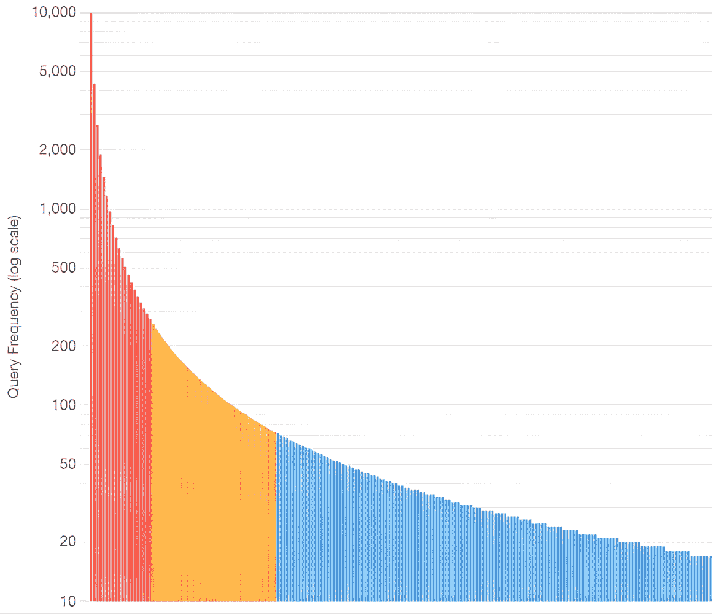

# 第十五章：语义缓存

语义缓存代表了 RAG 概念的演变，成为现代生产级生成式 AI 应用中的一个关键组件。它们在基于代理的 RAG 中特别有用，有助于抵消代理通常采取的额外推理步骤。通过利用向量搜索和智能查询匹配，语义缓存确保用户接收到正确、一致的信息，同时显著降低延迟和计算成本。本章探讨了如何在你的 AI 系统中构建、优化和部署语义缓存作为高级控制流机制。

在本章中，我们将涵盖以下主题：

+   通过长尾模式理解语义缓存

+   什么是语义缓存？拦截层

+   为什么使用语义缓存？

+   正确的语义缓存规划

+   检索、填充和驱逐策略

+   代码实验室 15.1 – 使用语义缓存进行检索

+   填充 – 查询扩展策略

+   驱逐 – 保持缓存清洁

到本章结束时，你将能够设计和实现语义缓存，通过减少延迟和推理成本 10-100 倍，同时在你的 AI 应用程序中保持高准确性和用户满意度。

# 技术要求

为了完成本章的动手练习，你需要以下软件和资源：

+   **软件要求：**

    +   **Python 3.9 或更高版本**：运行代码实验室所必需

    +   **Jupyter Notebook 或 JupyterLab**：用于执行交互式代码示例

    +   **文本编辑器或 IDE**：VS Code、PyCharm 或类似软件用于审查代码

+   **硬件要求：**

    +   至少 4 GB RAM（推荐 8 GB 以获得流畅的性能）

    +   为嵌入模型和 ChromaDB 存储保留 500 MB 的可用磁盘空间

    +   下载库和预训练模型所需的互联网连接

+   **章节资源：**

    +   **GitHub 仓库**：[`github.com/PacktPublishing/Unlocking-Data-with-Generative-AI-and-RAG-Second-Edition/tree/main/CHAPTER_15`](https://github.com/PacktPublishing/Unlocking-Data-with-Generative-AI-and-RAG-Second-Edition/tree/main/CHAPTER_15)

在开始代码实验室之前，请确保你的 Python 环境已正确配置；你可以使用 `pip` 安装软件包。`sentence-transformers` 库将在首次使用时自动下载嵌入模型，因此在初始设置期间需要互联网连接。

# 通过长尾模式理解语义缓存

考虑所有进入你应用程序的查询。如果你的查询数据像大多数基于 RAG 的应用程序查询数据一样，你可能会看到一个明显的模式出现。你查询的一小部分可能会比其他所有查询的频率高得多。通常，有一个查询占所有流量的 20% 以上！在另一端，你将有一个非常显著的查询数量，其中可能 60-70% 的查询只被请求几次。这被称为 **长尾模式**。



图 15.1 – 应用到查询中的长尾模式示例

长尾模式（或相关的帕累托指数）是一个在众多领域广泛研究和应用的概率统计概念。然而，在这种情况下，我们想要关注数据的“头部”，即代表传递给你的 RAG 应用的大多数查询的查询。理想情况下，你想要优雅地处理 100%的查询，对吧？但至少，目标应该是这个图表的“头部”，即前 20%，这在你应用中的查询使用率方面提供了 80%的覆盖率。这已经比目前最好的应用要好，那些表现最好的代理公司（我不会点名！）在他们的广告中吹嘘成功处理了 68%的查询！考虑到这一点，即使在最小的应用中，试图完全覆盖前 20%也是一项艰巨的任务。

但等等，如果我们有一个设计良好的代理，它难道不能为每个查询动态地确定正确的响应路径吗？代理的整个目的不就是要能够即时处理 100%的查询吗？是的，你可以这么说，但让我们坦率地说。除了额外的延迟和成本，设计一个如此有效的代理非常困难，而且几乎不太可能。现实是，你的代理在处理最随机的查询方面越有效，权衡总是以更高的延迟和推理成本的形式出现。代理实际上每次都必须“推理”通过一个新的查询。这意味着需要多次调用 LLM。单个 LLM 调用的典型响应时间，尤其是在复杂情况，如不常见的查询中，已经是 2-20+秒，这对于大多数面向消费者的应用来说通常是不可以接受的。但是，我们很可能会看到好几次这样的调用，以使一个设计良好的代理能够优雅地处理所有场景。这本书中提到了各种技术，你可以在其他地方更详细地了解这些技术，以降低这些单个调用的成本和延迟，减少最终响应所需的调用次数，或者减少检索并传递到生成阶段的数据量，以提高推理时间。除了实现语义缓存之外，你还将想要尝试多种技术。但最终，你会发现，在尝试让代理处理你将遇到的大量查询变化的同时，保持生产规模上的延迟和成本在可接受的水平，你会耗尽解决方案。也许你很幸运，你有足够的预算将所有这些放在一个价值十亿美元的量子计算机阵列上，它可以瞬间处理所有这些（这个场景可能只有在你在这本书出版后 5-10 年内阅读时才可能实现，但我跑题了！），但对于我们其他人来说，还有语义缓存。

让我们深入了解语义缓存到底是什么，这样你就能更好地理解为什么它在 AI 代理环境中如此有效。

**有趣的事实**

我们提到长尾模式是一个统计概念。如果你想深入了解这个概念周围的统计数学，那么你将需要了解更多关于帕累托指数的知识。帕累托指数来自帕累托分布，这是一种用于描述具有“幂律”关系的数学模型，其中少数项目占大多数效果。帕累托指数基本上衡量长尾的“重量”或“肥胖程度”。帕累托指数越低，长尾模式越明显。统计学家会使用帕累托指数来量化长尾模式。一个与之密切相关的概念是帕累托原则（80/20 法则），它表明 20%的原因导致 80%的效果，这被认为是帕累托分布的特殊情况。帕累托指数直接影响资源分配决策。例如，当α = 1.0 时，优化前 20%的查询类型可以覆盖约 80%的量，而α = 2.0 可能需要处理 40%的查询类型以达到相同的覆盖率。这种数学关系有助于设定聊天机器人性能指标和开发优先级的现实目标。此外，随着时间的推移跟踪帕累托指数的变化可以揭示你的聊天机器人的使用是否正在围绕核心功能巩固，或者是否正在向新领域多元化，这对于产品路线图决策和能力规划是至关重要的情报。

# 语义缓存 – 拦截器层

当我说“拦截器层”时，我指的是使用我们在本书前面几章中花费了多个章节讨论的相同向量搜索，并将其用于拦截查询，用超级快速、无需 LLM 推理的语义匹配来替代代理的推理步骤。考虑一下，对于大多数代理来说，第一步不是响应用户查询，而是制定一个响应计划，通常涉及选择能够有效回答查询的工具。我们将这种工具选择称为解决方案路径。最基本实现涉及拦截传入的查询，并使用向量相似度搜索将其与您已缓存的具有现有解决方案路径的查询相匹配，基本上跳过了代理的规划步骤，节省了所有涉及的时间和推理成本！

至少对于最顶尖的 20%的查询，以及尽可能深入的长尾部分，我们想要拦截它们并确保它们获得正确的数据。语义缓存的数据统计每天都在变化，所以我鼓励你查找最新的数字。此外，正如我多次在这里宣扬的，最重要的数字是你从自己的系统中获得的数据，所以设置试验以确定最佳方法并衡量这种方法的潜在影响。但一般来说，最近的 AWS、OpenAI 和 Intercom 的报告表明，最成功的实现通过基于语义缓存的“全规模推理代理”保持了 600 毫秒到 2 秒的响应时间，而未通过语义缓存处理的响应则需要 5 到 6 秒。

重要的是要明确，语义缓存**通常**不会完全去除推理。它只是替换了代理的规划阶段。这种替换在整个响应中占的比例在不同应用中差异很大，但在一个简单场景中，如果你只调用一次 LLM 进行推理（最终确定需要为 RAG 过程提取哪些数据），那么这将是处理的一半。另一半是将检索到的数据发送给 LLM，按照传统的 RAG 方式进行。

因此，在那个场景中，你正在减少第一阶段延迟和推理成本。第二阶段仍然存在，并承担其产生的任何延迟和成本。我之前说“通常”的原因是，存在一些场景，你可能只需要语义缓存，或者语义缓存可以改进生成阶段。例如，对于“静态”内容，例如 FAQ 类型的响应，如果你确切知道你想要的响应是什么，你可以在语义缓存中存储它，并且它可以无需任何推理就返回该响应。你还可以在语义缓存中存储针对特定查询优化的 SQL（或你用于检索的任何东西），这可以减少检索速度和传递给 LLM（在生成阶段）的数据量，从而也有助于改进该阶段。但一般来说，重要的是要理解，语义缓存的主要好处在于改进响应过程的推理阶段。

使用语义缓存，我们正在预测用户将要提出的查询，并预先确定我们想要为该查询提供的数据。我们通过这个“拦截器”层拦截这些查询。接下来，我们将讨论为什么我们要进行这种拦截。

## 语义缓存的核心组件

在其基础上，语义缓存由几个基本组件组成，这些组件协同工作以提供智能查询匹配。**查询嵌入**构成了系统的核心，在多维向量空间中捕捉语义意义。这些密集的向量表示不仅编码了单词，还编码了每个查询中潜在的概念和关系。

**相似度阈值**作为确定匹配的决策边界。与二进制精确匹配系统不同，语义缓存在相似度的连续体上操作，需要仔细校准以平衡捕捉有效释义和避免错误匹配。

**元数据**像每个缓存项的详细标签，提供帮助系统做出更明智决策的关键上下文。将其视为为每个缓存查询-响应对附加一张全面的信息卡。此类元数据通常包括三种关键类型的信息：

+   **来源信息**追踪缓存答案的来源，咨询了哪些数据源，哪个模型版本生成它，以及使用了哪些特定的检索方法。这有助于确定缓存答案是否仍然可信，或者它是否来自过时的来源。

+   **时间戳**记录缓存条目创建和最后访问的时间。例如，上周关于“当前股价”的缓存答案可能会被标记为可能过时，而关于“几个月前的法国首都”的答案仍然有效。这些时间戳使自动失效对时间敏感信息成为可能。

+   **相关性评分**根据诸如如何回答原始查询、用户反馈或它被成功重用的频率等因素，为每个缓存条目分配质量指标。一个始终满足用户的缓存条目可能得分为 0.95，而一个部分相关的答案可能得分为 0.70。

这丰富的元数据使复杂的过滤和管理策略成为可能。例如，系统可以优先考虑来自权威来源的最近、得分高的缓存条目，或自动清除特定主题领域超过一定阈值的旧条目。它将缓存从简单的存储系统转变为理解其内容质量、新鲜度和可靠性的智能知识库。

可能最重要的是，语义缓存存储将查询映射到适当代理操作的解决方案路径。现代实现不仅缓存响应，还缓存生成正确答案的路径，确保新鲜度的同时保持效率。

## 查询与响应之间的智能层

语义缓存不仅仅是性能优化。它们构成一个理解用户意图的智能决策层。这种智能以多种方式体现。缓存必须区分看似相似但实际上含义不同的查询，例如“什么是 Roth IRA 的税收优惠？”与“什么是 Roth IRA 的提取规则？”这两个查询都涉及 Roth IRA，但它们寻求的是根本不同的信息。

系统还必须处理用户表达方式的细微差异。财务顾问和年轻投资者可能使用完全不同的词汇、正式程度和假设知识来询问相同的概念。语义缓存必须将这些视为等效的，同时保持不同概念之间的界限。

这种智能扩展到理解上下文和管理信息的时间方面。一些缓存响应在无限期内有效（例如，金融概念的说明），而另一些则需要实时数据（例如，当前的股票价格）。现代语义缓存整合了这种理解，将适当的查询路由到缓存响应，同时确保对时间敏感的请求获得新鲜信息。

# 为什么使用语义缓存？

让我们用一个例子来说明语义缓存的力量。这假设你已经设置了自动化填充，我们将在本章后面的*代码实验室 15.1*的第 7 步中介绍。没有语义缓存，每次代理通过推理来处理查询时，这种推理就会进行并随后丢失。想想这个推理的价值；比如说它值 1 美元。所以，你花 1 美元来获取这个推理，然后下次一个类似的查询进来时，你又要再花 1 美元。假设这是一个在热门网站上流行的查询，你看到这个查询每天有 1000 次。这就是为了所有这些推理而花费的 1000 美元。现在，让我们引入一个已经存储了该查询及其解决方案路径的语义缓存。以下是你可以获得的好处：

+   **推理利用**：你只需要在第一次看到独特的查询时运行推理一次。将这与你没有语义缓存时必须运行 1000 次相比。你系统中 LLM 推理的利用率刚刚飙升！这种“利用率”很重要，因为它减轻了你整个 AI 基础设施的负担，这带来了许多好处，尤其是在更大规模的实施中，你必须开始平衡服务器负载。

+   **推理成本降低**：你仍然要花那第一美元，但之后你将重复使用相同的解决方案路径。所以，每天 1000 次仍然只需要 1 美元的推理费用，使用语义缓存。由于每个代理 RAG 查询可能需要大量的计算资源进行嵌入、检索和生成，因此在大规模上服务重复的概念查询变得过于昂贵。语义缓存可以通过识别新查询实际上是在询问一个代理角度已知解决方案路径的内容来显著降低这些成本。查询越受欢迎，你就能节省越多！

+   **延迟减少**：现在，考虑到没有语义缓存，规划推理可能需要 2-20 秒，而从语义缓存中检索可能只需要 0.03-0.3 秒。这种速度提升改变了用户体验，使人工智能助手在对话中感觉更加响应和自然。这是延迟的巨大减少！

+   **更广泛的语义覆盖**：这不仅仅是你节省金钱和时间的一个查询；任何语义上高于您与语义缓存一起使用的相似性阈值的查询都得到了覆盖！这意味着，对于查询“A”的推理，其中查询“B”、“C”、“D”和“E”都与查询“A”匹配 85%或更高，只需为所有这些查询执行一次即可。

+   **更一致的经历**：一致性是一个关键要求，尤其是在金融或医疗保健等领域，在这些领域，对类似问题的冲突答案可能会产生严重后果。通过将语义等效的查询映射到相同的解决方案路径，这些系统确保用户无论如何表述问题，都能接收到一致、经过验证的信息。一致性也是质量的关键方面，支持每次都提供相同高质量响应的努力。让我们不要忘记，这些大型语言模型不是确定性的，并且在未来的推理迭代中，响应可能会有所不同。这种意外可能会在一个基于代理的专业应用程序中造成混乱，而语义缓存可以避免这种情况！

+   **更细粒度的控制**：语义缓存通常不仅限于代理在解决方案路径规划中最初提出的那些内容。对于一家公司来说，查看其语义缓存中的某些查询，确定一些将更好地回答查询的新工具，然后将该工具添加到语义缓存解决方案路径中，而无需更改其他任何内容，这种情况并不少见。这为您提供了增加的控制，允许您策划您的用户体验以及您想要如何增强查询处理。

因此，语义缓存可以为您提供更好的推理利用，减少延迟，降低成本，提高一致性，并让您对用户体验有更多的控制。语义缓存真的有什么做不到的吗？实际上并没有，它们非常神奇！但语义缓存最大的挑战是正确设置它，以便它拦截正确的查询，而不是错误的查询。我们将在讨论如何规划您的语义缓存实现时，进一步讨论这个问题。

# 正确的语义缓存规划

当你用你的语义缓存找不到匹配项时会发生什么？很快就会有查询进入你的系统，它不会与语义缓存中的任何内容（超过你设置的阈值）匹配。在某种程度上，你可能会认为这是一个失败，因为你没有正确预测到可能出现的每一个可能的查询。不要对自己太苛刻！这是语义缓存过程的一个自然部分。接下来发生的事情与语义缓存本身一样重要，公司采取了许多不同的方法来处理接下来发生的事情。以下是一些已实施的选择方案。

### 编排器/规划系统

实施同时评估多个响应路径的分层决策框架：

+   **键值存储（50–60 毫秒）**：在键值存储中执行精确匹配查找，这本质上就是直接/精确匹配，但有一些重要的细微差别。考虑在许多系统中，最受欢迎的查询（如前所述的长尾的“头部”）通常相同或非常相似。应用程序通常会人为确保某些查询完全相同。例如，你可能看到一家公司发送一封带有链接的电子邮件，一旦进入应用程序就会触发一个查询。这个查询必须经过与其他每个查询相同的过程，但你确切地知道它是什么，那么为什么使用一个比键值匹配显著更长的过程呢？我们不会在代码实验室中涵盖这一点，但通常会在语义缓存之前添加一个键值存储层，类似于我们在代码实验室中构建的。

+   **语义向量搜索回退（100 毫秒到 2 秒）**：如果没有键值匹配，我们将回退到最流行的语义缓存实现类型，其中我们使用向量嵌入来表示缓存的查询，将传入的查询向量化，并使用向量相似度搜索来找到匹配项。这是我们已经在之前的章节中深入讨论过的非常常见的模式，只是在这次，它是专门应用于查询的，以便我们可以将其与规划代理通常提供的解决方案路径相匹配。这一步骤将是我们在代码实验室中构建的主要内容。

+   **完整代理规划回退（2–10 秒）**：如果所有其他方法都失败了，我们可能正在处理一个尚未在我们的语义缓存中捕获的新查询。我们的规划代理是最后的回退。这本质上是我们添加语义缓存之前的阶段，规划代理只是确定一个路径，然后我们跟随它来收集数据和回答用户查询。但现在我们知道语义缓存是多么有价值，我们希望为下一次得到该查询时捕获这个计划，而不是简单地将其丢弃。因此，我们仍然希望添加这个记忆。我们将在代码实验室中回顾这种机制！

在我们进入代码实验室之前，让我们谈谈一些你可以尝试的其他方法，比如多层回退架构。

### 基于规则的回退系统

通过自然语言理解模型提供确定性的回退路径，这些模型可以检测意图并将路由到决策树。例如，Rasa 框架的二级回退在生产实现中结合了意图分类和置信度阈值来确定升级路径。Dialogflow CX 通过使用自定义提示模板的生成回退来扩展这一模式，有效地连接了基于规则的生成方法。

### 意图分类路径

通过将查询分类到不同的处理路径来创建预定义的响应协议。常见问题查询路由到结构化模板，技术支持触发诊断树，一般对话保持个性一致性，升级协议根据复杂度分数确定人工接管触发。这种系统化方法确保了查询类型的一致处理。

但处理缓存缺失只是方程的一半。你还需要智能策略来管理缓存本身。

# 检索、填充和清除策略

语义缓存的有效性不仅取决于其架构，还取决于用于高效检索匹配项、填充查询以及维护缓存质量随时间变化的智能策略。这三个相互关联的政策，即检索、填充和清除，构成了任何语义缓存系统的运营核心，决定了其覆盖范围和精确度。

在代码实验室中，我们将主要解决检索步骤。然后，在代码实验室之后，我们将更多地讨论如何填充和清除你的语义缓存。让我们从以检索为导向的代码实验室开始。

# 代码实验室 15.1 - 使用语义缓存进行检索

在这个代码实验室中，我们将实现一个语义缓存，它使用向量搜索智能地捕捉到即使表述不同也相似的查询。我们将从一个基于 ChromaDB 的缓存开始，使用 sentence transformers，然后通过实体掩码来泛化特定值（如日期或股票代码），使用交叉编码器验证来减少误报，为不同匹配类型设置自适应阈值，以及从缓存缺失中学习的自动填充。

最后，你将拥有一个生产就绪的语义缓存，它可以识别当查询如“苹果的股价是多少？”和“告诉我当前的 AAPL 股票价值”询问的是同一件事时，允许你立即返回缓存结果，而不是再次调用你的 LLM 或代理。这意味着如果你的代理需要五秒钟并花费 0.10 美元来回答第一个查询，第二个查询将以毫秒级返回，几乎不花费任何成本，尽管用户使用了完全不同的词语。

让我们开始吧！

## 第 1 步 - 安装依赖项

让我们安装我们需要的两个关键库，用于语义缓存：

```py
%pip install -q chromadb
%pip install -q sentence-transformers 
```

ChromaDB 提供了一个向量数据库，用于高效地存储和搜索嵌入，而`sentence-transformers`则为我们提供了将文本转换为有意义的语义向量的预训练模型。这两个库构成了我们语义缓存的基础。ChromaDB 负责存储和检索向量嵌入，而`sentence-transformers`确保即使措辞不同，相似的查询（如“我的余额是多少？”和“显示账户余额”）也能产生相似的向量。正如我们在前面的章节中所展示的，我们有多种方法可以生成我们的嵌入。我们正在使用`sentence-transformers`来简化这个过程。

在安装了依赖项之后，让我们设置缓存的基本基础设施。

## 第 2 步 - 设置

现在我们将导入我们的库并创建一个单独的共享 ChromaDB 集合，笔记本中的每个步骤都将重用它：

```py
import re
import uuid
import chromadb
from sentence_transformers import SentenceTransformer, CrossEncoder
COLLECTION_NAME = "semantic_cache"
client = chromadb.Client()
# Clean start when running all cells
try:
    client.delete_collection(COLLECTION_NAME)
    print("✓ Cleared existing semantic_cache collection")
except Exception:
    print("✓ No existing collection to clear")
collection = client.get_or_create_collection(
    name=COLLECTION_NAME,
    metadata={"hnsw:space": "cosine"}
)
def _new_id():
    return str(uuid.uuid4()) 
```

在前面的代码块中发生的事情如下：

+   导入`uuid`，这样我们就可以为缓存条目生成唯一的 ID，而不是手动递增计数器。

+   我们只定义一次`COLLECTION_NAME`（`"semantic_cache"`）并创建一个全局客户端和集合，所有后续的缓存类都将重用它。

+   在重新运行时，代码首先尝试删除集合，这样我们就可以从头开始，这在迭代开发期间很有用。但请注意，这将删除任何以前的缓存！

+   然后，使用`get_or_create_collection`，我们确保集合以安全、幂等的方式存在，避免意外重复创建或如果它已经存在时出错。

+   `_new_id()`辅助函数为每个缓存条目提供一个唯一、无冲突的标识符。

这样，每个后续步骤（掩码缓存、验证缓存、自适应缓存等）都是基于相同的底层集合构建的，而不是尝试创建和删除新的集合。

现在我们将构建我们的第一个语义缓存类，它可以存储和检索相似的查询。

## 第 3 步 - 基本语义缓存

让我们用一个简单的语义缓存来构建我们的基础，这个缓存使用嵌入来查找相似的查询。这个缓存将使用轻量级模型（`all-MiniLM-L6-v2`）将文本转换为向量，并将它们存储在 ChromaDB 中，使用余弦相似度搜索，并在检测到相似查询时检索缓存响应。这个缓存响应与其关联的解决方案路径相关联，当有匹配时使用。魔法之所以发生，是因为语义相似的文本会产生相似的向量，即使措辞不同：

```py
# Step 3: Cache Entry Structure
class SemanticCache:
    def __init__(
        self, embedder_model='all-MiniLM-L6-v2', collection_ref=None
    ):
        """Initialize embedding model and reuse the shared ChromaDB collection."""
        self.embedder = SentenceTransformer(embedder_model)
        self.collection = collection_ref if collection_ref is not None 
            else collection
    def add(self, query, soln_path):
        """Add query-solution path pair to cache"""
        embedding = self.embedder.encode(query).tolist()
        self.collection.add(
            embeddings=[embedding],
            documents=[query],
            metadatas=[{'query': query, 'soln_path': soln_path}],
            ids=[_new_id()]
        )
    def search(self, query, threshold=0.75):
        """Search for similar cached query"""
        embedding = self.embedder.encode(query).tolist()
        results = self.collection.query(
            query_embeddings=[embedding], n_results=1)

        if results.get('distances') and results['distances'][0]:
            score = 1 - results['distances'][0][0]
            if score >= threshold:
                metadata = results['metadatas'][0][0]
                return {
                    'soln_path': metadata['soln_path'],
                    'score': score,
                    'cached_query': metadata.get('query')
                }
        return None 
```

这段代码创建了一个语义缓存，它存储查询-解决方案路径对，并根据语义相似性检索它们，步骤如下：

1.  **初始化**：缓存使用`SentenceTransformer`将文本转换为嵌入并将它们存储在我们之前创建的 ChromaDB 集合中。

1.  **添加条目**：`add`方法将查询编码为向量，并将它们与其相应的解决方案路径（如`lookup_fact()`或`get_help_article()`）一起存储，而不是直接存储答案。

1.  **搜索**：`search` 方法找到最相似的缓存查询，并且只有当相似度分数超过阈值（默认为 0.75）时才返回其解决方案路径。

下面是运行测试并查看其工作方式的代码：

```py
cache = SemanticCache()
cache.add("What is the capital of France?",
    "lookup_fact('France', 'capital')")
cache.add("How do I reset my password?",
    "get_help_article('password_reset')")
cache.add("What are your business hours?", "get_business_info('hours')")
test_queries = [
    "What's the capital of France?",
    "Password reset instructions",
    "When are you open?",
    "What's the weather today?"
]
for q in test_queries:
    # Get the raw similarity score even if below threshold
    embedding = cache.embedder.encode(q).tolist()
    results = cache.collection.query(
        query_embeddings=[embedding], n_results=1)

    if results.get('distances') and results['distances'][0]:
        score = 1 - results['distances'][0][0]

        # Now check against threshold
        result = cache.search(q)
        if result:
            print(f" '{q}' → '{result['soln_path']}' (score: 
                {result['score']:.2f})")
        else:
            print(f" '{q}' → Match below threshold (score: {score:.2f})")
    else:
        print(f" '{q}' → No match (no cached queries)") 
```

输出应该看起来像这样：

```py
 'What's the capital of France?' → 'lookup_fact('France', 'capital')' (score: 0.99)
 'Password reset instructions' → 'get_help_article('password_reset')' (score: 0.80)
 'When are you open?' → Match below threshold (score: 0.51)
 'What's the weather today?' → Match below threshold (score: 0.27) 
```

对于每个测试查询，我们计算相似度分数以显示匹配成功或失败的原因，帮助你理解和调整阈值。注意缓存如何成功匹配不同措辞但意图相同的查询。例如，“法国的首都是什么？”（0.99 分）几乎完美匹配我们缓存的“法国的首都是什么？”查询，而“密码重置说明”（0.80 分）成功匹配“我如何重置我的密码？”因为它们的嵌入在向量空间中非常接近。失败的查询（“何时开门？”得分为 0.51，“今天天气如何？”得分为 0.27）都低于我们的 0.75 阈值，防止了误报。0.75 的阈值在捕捉相关查询和避免错误匹配之间提供了良好的平衡。

这个基本实现已经使我们免于对语义相似的问题进行冗余的 API 调用。然而，它仍然难以处理包含不同特定值（如不同的年份、股票代码或金额）的查询。我们不希望将它们视为单独的缓存条目，因此在下一步中，我们将引入实体掩码以泛化它们。

## 第 4 步 - 实体掩码以实现更好的泛化

现在，我们将解决基本语义缓存的一个常见限制，这涉及到语义上相同但特定值（如年份、股票代码、美元金额或百分比）不同的查询。例如，“2023 年 AAPL 的股票价格是多少？”和“2024 年 TSLA 的股票价格是多少？”应该路由到同一个工具；唯一的区别是传递了哪个股票代码和年份。如果没有归一化，这些将生成不同的嵌入并使缓存碎片化。

实体掩码通过在嵌入之前用通用占位符替换变量值来解决这个问题。例如，AAPL 和 TSLA 都变成 `[TICKER]`，而 2023 和 2024 都变成 `[YEAR]`。这样，所有变体都折叠成相同的掩码查询，“What was `[TICKER]` stock price in `[YEAR]`?”，并映射到单个缓存的解决方案路径。

下面是更新后的实现：

```py
# Step 4: Semantic Boundaries
class MaskedSemanticCache(SemanticCache):
    def mask_entities(self, text):
        """Replace specific entities with placeholders"""
        text = re.sub(r'\$[\d,]+', '[AMOUNT]', text)       # Money amounts
        text = re.sub(r'\b[A-Z]{2,5}\b', '[TICKER]', text) # Tickers
        text = re.sub(r'\b20\d{2}\b', '[YEAR]', text)      # Years
        text = re.sub(r'\d+(\.\d+)?%', '[PERCENT]', text)  # Percentages
        text = re.sub(r'\S+@\S+', '[EMAIL]', text)         # Emails
        return text
    def add(self, query, soln_path):
        """Add with entity masking"""
        masked_query = self.mask_entities(query)
        embedding = self.embedder.encode(masked_query).tolist()
        self.collection.add(
            embeddings=[embedding],
            documents=[masked_query],
            metadatas=[{
                'original_query': query,
                'masked_query': masked_query,
                'soln_path': soln_path
            }],
            ids=[_new_id()]
        )
    def search(self, query, threshold=0.75):
        """Search using masked query"""
        masked_query = self.mask_entities(query)
        embedding = self.embedder.encode(masked_query).tolist()
        results = self.collection.query(
            query_embeddings=[embedding],
            n_results=1
        )
        if results.get('distances') and results['distances'][0]:
            score = 1 - results['distances'][0][0]
            if score >= threshold:
                metadata = results['metadatas'][0][0]
                return {
                    'soln_path': metadata['soln_path'],
                    'score': score,
                    'cached_query': metadata.get('original_query'),
                    'masked_query': metadata.get('masked_query')
                }
        return None 
```

测试它显示了现在变体如何解析到相同的缓存条目：

```py
cache = MaskedSemanticCache()
cache.add("What was AAPL stock price in 2023?", "stock_price_tool")
cache.add("My budget is $5000", "budget_tool")
print("Testing entity masking:")
result = cache.search("What was TSLA stock price in 2024?")
if result:
    print(f" Matched despite different ticker and year!")
    print(f"   Original: {result['cached_query']}")
    print(f"   Masked: {result['masked_query']}")
    print(f"   Solution path: {result['soln_path']}") 
```

输出应该看起来像以下这样：

```py
Testing entity masking:
  Matched despite different ticker and year!
    Original: What was AAPL stock price in 2023?
    Masked: What was [TICKER] stock price in [YEAR]?
    Response: Use stock_price_tool 
```

当您调用 `cache.add("What was AAPL stock price in 2023?", ...)`, `mask_entities` 将其转换为“[TICKER] 股票在 [YEAR] 年的价格是多少？”，嵌入掩码后的文本，并将其存储在 Chroma 中，其中包含保留原始和掩码形式的元数据。稍后，`cache.search("What was TSLA stock price in 2024?")` 将查询掩码为相同的“[TICKER] 股票在 [YEAR] 年的价格是多少？”，嵌入它，并运行向量搜索。由于掩码形式相同，最近邻具有很高的相似度得分（≥ 0.75），因此缓存返回该条目的元数据和响应。打印块随后显示 `Original: from the stored original_query ("What was AAPL stock price in 2023?")`, `Masked: from masked_query ("What was [TICKER] stock price in [YEAR]?")`, 和缓存的 `Response: ("Use stock_price_tool")`。 `"My budget is $5000"` 条目与此无关，不会影响此匹配。

采用这种方法，一个缓存条目可以覆盖数百种变体，显著提高命中率，同时减少冗余调用。正则表达式模式默认覆盖常见实体，并且您可以扩展它们以适应您的领域。

虽然实体掩码可以提高泛化能力，但它也增加了假阳性的风险，即经过掩码后看起来相似但实际上并不具有相同意图的查询。为了减轻这一风险，下一步添加了一个交叉编码器验证层，在返回缓存结果之前确认语义匹配。

## 第 5 步 – 交叉编码器验证

到目前为止，我们的语义缓存在召回率方面做得很好，也就是说，能够捕捉到看起来不同但实际上意思相同的查询。然而，这也有代价：有时两个查询在向量空间中可能很接近，但实际上并不具有相同的意图。例如，“我的余额是多少？”和“我的账户号码是多少？”可能被嵌入视为“相似”，但显然需要不同的响应。

这就是交叉编码器验证发挥作用的地方。与独立编码每个查询的句子嵌入不同，交叉编码器同时考虑候选查询和缓存查询，并评估它们的相似度。它本质上重新阅读这对查询，就像回答“这两个查询是在询问同一件事吗？”一样。这允许我们在向量搜索缩小候选者之后，通过应用第二个更严格的过滤器来显著减少假阳性。 

双阶段过程如下所示：

1.  **快速检索（阶段 1）**：使用基于嵌入的向量搜索快速找到最相似的 top-k 查询。

1.  **仔细验证（阶段 2）**：将每个候选查询通过交叉编码器进行重排序，根据意图级别的相似性进行排序，并仅保留高于更高置信度阈值的匹配项。

通过结合这些方法，我们得到了两者的最佳结合：从嵌入中获取速度，从交叉编码器中获取精度。这确保我们的缓存不仅检索到外观相似的查询，而且真正具有相同意图的查询。以下是如何在代码中实现这一点的示例：

```py
class CrossEncoderSemanticCache(MaskedSemanticCache):
    def __init__(
        self, embedder_model='all-MiniLM-L6-v2', collection_ref=None
    ):
        super().__init__(embedder_model=embedder_model,
            collection_ref=collection_ref)
        self.verifier = CrossEncoder(
            'cross-encoder/ms-marco-MiniLM-L-6-v2')
    def search_with_verification(
        self, query, vector_threshold=0.7, verify_threshold=3.5
    ):
        """Two-stage search: vector similarity + verification"""
        masked_query = self.mask_entities(query)
        embedding = self.embedder.encode(masked_query).tolist()
        results = self.collection.query(
            query_embeddings=[embedding], n_results=3)
        if not (results.get('distances') and results['distances'][0]):
            return None
        best_match, best_score = None, 0.0
        for i, distance in enumerate(results['distances'][0]):
            vector_score = 1 - distance
            if vector_score < vector_threshold:
                continue
            metadata = results['metadatas'][0][i]
            verify_score = float(self.verifier.predict(
                [[query, metadata.get('original_query',
                    metadata.get('query', ''))]]
            )[0])
            if verify_score > best_score 
                and verify_score >= verify_threshold:
                best_score = verify_score
                best_match = {
                    'soln_path': metadata['soln_path'],
                    'vector_score': vector_score,
                    'verify_score': verify_score,
                    'cached_query': metadata.get('original_query',
                        metadata.get('query'))
                }
        return best_match 
```

以下代码块中发生了什么：

1.  **类**：`CrossEncoderSemanticCache`类扩展了带掩码的缓存，并添加了交叉编码验证器。

1.  **初始化**：初始化方法加载`CrossEncoder('ms-marco-MiniLM-L-6-v2')`以评分查询-候选对。

1.  **阶段 1**：向量搜索快速找到前三个候选。

1.  **阶段 2**：交叉编码器重新评分以实现意图级别的相似度。

1.  **结果**：只有当向量验证阈值都满足时，才返回最佳匹配。

让我们添加一些代码来测试这个类：

```py
cache = CrossEncoderSemanticCache()
cache.add("What is my checking account balance?", "checking_balance_tool")
cache.add("What is my savings account balance?", "savings_balance_tool")
cache.add("What is my credit card balance?", "credit_balance_tool")
queries = [
    "What's my checking balance",
    "What's my savings account balance?",
    "Credit card balance"
]
print("Testing with cross-encoder verification:")
for q in queries:
    result = cache.search_with_verification(q)
    if result:
        print(f" '{q}' → '{result['soln_path']}'")
        print(f"   Vector: {result['vector_score']:.2f}, 
            Verified: {result['verify_score']:.2f}")
    else:
        print(f" '{q}' → No verified match found") 
```

输出应该看起来像这样：

```py
Testing with cross-encoder verification:
 ' What's my checking balance' → 'balance_tool'
Vector: 0.89, Verified: 4.82
 'What's my savings account balance?' → 'savings_balance_tool'
Vector: 0.99, Verified: 6.35
 'Credit card balance' → 'credit_balance_tool'
Vector: 0.88, Verified: 4.01 
```

在这里，向量分数（0-1）显示了从嵌入中得到的语义接近度，而验证分数（如 4.01、5.62 和 6.35 等原始数字）来自交叉编码器判断意图相似度。我们将截止值设置为 3.5：低于这个值被视为太弱而被拒绝，而高于这个值则被视为强匹配。这样，两个阶段就一起工作，向量用于召回，交叉编码器用于精确度，而不混合尺度。

由于有了验证，我们减少了拉取错误响应的机会。但根据模型和查询类型，我们可能仍然需要调整当我们称某物为“匹配”时的严格程度。这就是自适应阈值的作用所在。

## 第 6 步 - 自适应阈值

在这里，我们正在处理这样一个事实：并非所有场景都需要相同的严格性。对于关键任务查询（例如金融交易），我们希望有一个高阈值，因为错过匹配总比返回错误的好。对于探索性或“模糊”搜索，我们可以降低标准，允许更宽松的匹配。

自适应阈值系统使我们能够根据模型、查询类型或用户偏好动态调整匹配标准。这防止我们使用一个适用于所有情况的阈值，在某些情况下可能过于严格，而在其他情况下又过于宽松。在代码中实现这一点的办法如下：

```py
class AdaptiveSemanticCache(CrossEncoderSemanticCache):
    def __init__(
        self, model_name='all-MiniLM-L6-v2', collection_ref=None
    ):
        super().__init__(
            embedder_model=model_name, collection_ref=collection_ref)
        self.model_name = model_name
        self.model_thresholds = {
            'all-MiniLM-L6-v2': 0.75,
            'all-mpnet-base-v2': 0.80,
            'all-distilroberta-v1': 0.70
        }
    def get_threshold(self, match_type='normal'):
        base = self.model_thresholds.get(self.model_name, 0.75)
        adjustments = {
            'exact': base + 0.15,
            'normal': base,
            'fuzzy': base - 0.10,
            'exploratory': base - 0.20
        }
        return adjustments.get(match_type, base)
    def adaptive_search(self, query, match_type='normal'):
        threshold = self.get_threshold(match_type)
        verify_threshold = 0.9 if match_type == 'exact' else 0.85
        return self.search_with_verification(
            query,
            vector_threshold=threshold,
            verify_threshold=verify_threshold
        ) 
```

以下代码块展示了前述代码的功能：

1.  **类**：`AdaptiveSemanticCache`类扩展了`CrossEncoderSemanticCache`，并添加了针对特定模型的基阈值。

1.  **阈值**：`get_threshold()`方法调整向量截止值，对于精确匹配类型更严格，对于模糊/探索性匹配类型更宽松。模糊和探索性匹配使用较低的相似度阈值以允许更宽松的匹配，这在更广泛的搜索中很有用，在这种情况下，找到相关内容比确保精确匹配更重要。

1.  **自适应搜索**：`adaptive_search`方法使用调整后的向量阈值和提升的验证截止值（在原始尺度上的 3.5）。

1.  **结果**：可以在不同的严格程度下测试相同的查询，以平衡召回与精确度。

我们可以按以下方式测试此代码：

```py
cache = AdaptiveSemanticCache()
cache.add("What is the annual revenue?", "revenue_tool")
cache.add("Show me customer demographics", "demographics_tool")
test_cases = [
    ("yearly revenue", "Strong match"),
    ("customer demographic", "Weaker match")
]
for query, description in test_cases:
    print(f"\nQuery: '{query}' ({description})")
    for match_type in ['exact', 'normal', 'fuzzy']:
        result = cache.adaptive_search(query, match_type)
        threshold = cache.get_threshold(match_type)
        if result:
            print(f"  {match_type.upper()} (threshold {threshold:.2f}):  Found match")
        else:
            print(f"  {match_type.upper()} (threshold {threshold:.2f}):  No match") 
```

输出应该看起来像这样：

```py
Query: 'yearly revenue' (Strong match)
  EXACT (threshold 0.90):  Found match
  NORMAL (threshold 0.75):  Found match
  FUZZY (threshold 0.65):  Found match
Query: 'customer demographic' (Weaker match)
  EXACT (threshold 0.90):  No match
  NORMAL (threshold 0.75):  Found match
  FUZZY (threshold 0.65):  Found match 
```

在这里，我们看到自适应阈值的实际应用。第一个查询“年度收入”在语义上非常接近我们缓存的“年度收入是多少？”，因此通过了所有三个严格性级别。第二个查询“客户人口统计”与“显示客户人口统计”足够相似，可以通過 `NORMAL` 和 `FUZZY` 模式，但不足以达到 `EXACT` 模式（0.90 阈值）设定的高标准。这展示了您如何实现逐级匹配：从高置信度场景的严格 `EXACT` 匹配开始，然后在需要更广泛覆盖时回退到 `NORMAL` 或 `FUZZY` 模式。这种方法确保适当的响应策略与置信水平相匹配，同时防止在存在足够好的匹配时过度依赖昂贵的 LLM 生成。

这是在构建具有逐级相似度阈值的弹性响应层次结构中的关键步骤。这种方法确保适当的响应策略与置信水平相匹配，同时防止过度依赖昂贵的 LLM 生成。

到目前为止，我们的缓存检索更智能，过滤效果更好。但当查询完全新颖且尚未在缓存中时会发生什么？我们不希望就此止步；我们希望缓存能够自动从其未命中中学习。这就是自动填充和回退的动机。

## 第 7 步 - 自动填充和回退

缓存只有在经验增长时才强大。我们不必依赖手动填充，而可以将缓存连接到回退机制，例如在发生缓存未命中时调用代理、LLM 或自定义函数。然后，将回退调用的结果立即添加回缓存，以便下次类似查询进来时可以立即提供服务。

这使得缓存能够自我学习：今天的每个未命中都将成为明天的命中。随着时间的推移，命中率显著提高，甚至可以节省更多对昂贵的后端调用。我们添加的统计跟踪器可以帮助您实时查看这种演变，显示命中、未命中和自动添加的条目。

```py
class SmartSemanticCache(AdaptiveSemanticCache):
    def __init__(
        self, model_name='all-MiniLM-L6-v2', collection_ref=None
    ):
        super().__init__(
            model_name=model_name, collection_ref=collection_ref)
        self.stats = {'hits': 0, 'misses': 0, 'auto_added': 0}
    def query_with_fallback(
        self, query, fallback_fn=None, match_type='normal'
    ):
        """Try cache first, fallback to function if miss"""
        result = self.adaptive_search(query, match_type)
        if result:
            self.stats['hits'] += 1
            return result['soln_path'], 'cache'
        self.stats['misses'] += 1
        if fallback_fn:
            soln_path = fallback_fn(query)
            self.add(query, soln_path)
            self.stats['auto_added'] += 1
            return soln_path, 'computed'
        return None, 'miss'
    def print_stats(self):
        total = self.stats['hits'] + self.stats['misses']
        if total > 0:
            hit_rate = self.stats['hits'] / total * 100
            print("Cache Stats:")
            print(f"  Hits: {self.stats['hits']} ({hit_rate:.1f}%)")
            print(f"  Misses: {self.stats['misses']}")
            print(f"  Auto-added: {self.stats['auto_added']}")
# Mock agent function
def mock_agent(query):
    """Simulate an expensive agent call"""
    q = query.lower()
    if 'checking' in q and 'balance' in q:
        return 'checking_balance_tool'
    elif 'savings' in q and 'balance' in q:
        return 'savings_balance_tool'
    elif ('credit' in q or 'card' in q) and 'balance' in q:
        return 'credit_balance_tool'
    elif 'balance' in q:
        return 'balance_tool'  # Generic balance query
    elif 'transaction' in q:
        return 'transaction_tool'
    else:
        return 'general_tool' 
```

简而言之，以下代码做了什么：

1.  **类**：`SmartSemanticCache` 扩展了 `AdaptiveSemanticCache` 并跟踪 `hits`、`misses` 和 `auto_added`。

1.  **查询路径**：通过 `adaptive_search(..., match_type='normal')` 尝试缓存；在 `miss` 时调用 `fallback_fn`，然后自动添加新的 `query→response`。

1.  **统计**：`print_stats()` 显示命中率及计数，以便您可以看到随时间的变化。

注意：验证仍然使用您之前设置的原始交叉编码截止值（例如，3.5）通过继承的 `adaptive_search`。

您可以通过以下方式测试此代码并查看其工作原理：

```py
cache = SmartSemanticCache()
queries = [
    "What is my account balance?",
    "Show me my account balance",
    "Account balance please",
    "Recent transactions",
    "Show my transactions",
]
print("Testing with auto-population:")
for q in queries:
    soln_path, source = cache.query_with_fallback(q, mock_agent)
    print(f"'{q}' → {soln_path} ({source})")
print()
cache.print_stats() 
```

这是预期的输出：

```py
Testing with auto-population:
'What is my account balance?' → checking_balance_tool (cache)
'Show me my account balance' → balance_tool (computed)
'Account balance please' → balance_tool (cache)
'Recent transactions' → transaction_tool (computed)
'Show my transactions' → transaction_tool (computed)
Cache Stats: Hits: 2 (40.0%) Misses: 3 Auto-added: 3 
```

让我们追踪第一次运行时发生了什么：

1.  **“我的账户余额是多少？”**：缓存命中！这与我们在第 5 步添加的“我的支票账户余额？”相匹配，返回 `"checking_balance_tool"`。

1.  **“显示我的账户余额”**：这是一个缓存未命中，因为措辞与现有条目不够接近。系统调用`mock_agent`，接收`"balance_tool"`，并将条目自动添加到缓存中。

1.  **“请显示我的账户余额”**：缓存命中！这现在与我们在步骤 2 中添加的条目相匹配。

1.  **“最近的交易”**：这是一个缓存未命中，因为它引入了一个新主题。系统调用`mock_agent`，接收`"transaction_tool"`，并将条目自动添加到缓存中。

1.  **“显示我的交易”**：这是一个缓存未命中，因为查询与现有条目不够相似。系统调用`mock_agent`，接收`"transaction_tool"`，并将条目自动添加到缓存中。

注意缓存已经包含了我们之前步骤中的条目（例如，检查账户余额查询），这就是为什么第一个查询命中的原因。缓存正在构建我们之前学到的内容，同时继续展示新的模式。

但 40.0%？这并不是一个很好的命中率，对吧？再次运行单元格。你应该看到这个：

```py
Testing with auto-population:
'What is my account balance?' → checking_balance_tool (cache)
'Show me my account balance' → balance_tool (cache)
'Account balance please' → balance_tool (cache)
'Recent transactions' → transaction_tool (cache)
'Show my transactions' → transaction_tool (cache)
Cache Stats: Hits: 5 (100.0%) Misses: 0 Auto-added: 0 
```

缓存已学习！在第一次运行时，缓存中没有条目，所以大多数查询都未命中，不得不由后备代理进行计算。然后，这些结果会自动添加到缓存中。当你再次运行单元格时，相同的查询现在可以立即找到强匹配，因此每个请求都由缓存提供服务，而不是调用后备。命中率从 40%跃升至 100%，展示了系统如何持续改进：每次未命中都会丰富缓存，并且在未来的运行中，重复查询可以立即得到回答。这就是自我学习循环在发挥作用。

到目前为止，我们已经构建了一个不仅存储和回忆的缓存。实际上，它验证、适应并持续学习。在下一节中，让我们回顾语义缓存的关键特性以及为什么它们很重要。

## 将所有内容综合起来

这个语义缓存提供了以下功能：

+   **向量相似度搜索**：即使措辞不同，也能找到语义上相似的查询

+   **实体掩码**：通过用占位符替换特定值来泛化查询

+   **交叉编码验证**：通过第二个验证步骤减少误报

+   **自适应阈值**：根据用例调整匹配的严格程度

+   **自动填充**：从缓存未命中中学习，以随着时间的推移改进

缓存通过识别用户以不同方式提出本质上相同的问题，显著减少了调用昂贵的 LLM 或代理的次数。从基本的语义缓存开始，根据您的用例需求添加功能。

# 人口 - 查询扩展策略

现在我们已经探讨了语义缓存如何检索匹配项，让我们回到我们三个核心策略中的第二个：人口。虽然检索决定了我们如何将传入的查询与缓存条目相匹配，但人口策略决定了哪些查询首先进入缓存，更重要的是，我们如何扩展这个初始集以实现全面覆盖。

为了实现高缓存覆盖率，语义缓存必须预测用户表达相同基本需求的各种方式。查询扩展将有限的缓存查询集转换成一个全面的语义网，可以捕捉到用户可能产生的多数变化。在接下来的章节中，我们将讨论一些用于扩展您的语义缓存的一些更流行的技术。但要注意！查看以下专业提示，并确保在扩展您的语义缓存时采取适当的预防措施。

**专业提示！**

对于所有这些技术，请确保将您的新查询与语义缓存中现有的查询进行核对（通过运行您为语义缓存匹配运行的同向量搜索）。如果查询匹配到现有查询的阈值以上，并且（重要的是）两个查询具有相同的解决方案路径，那么您不需要将该特定查询添加到语义缓存中，因为它已经很好地在语义上得到了表示。重要的是要理解，将查询添加到语义缓存可能会最终导致您的问题，与具有其他解决方案路径的查询发生冲突，严重削弱您语义缓存的有效性。如果解决方案路径不同，那么您确实希望包括该查询，否则您的用户最终将通过该查询匹配到错误的结果。

## 基于 LLM 的释义

现代语义缓存利用 LLM 生成查询的自然释义。这种方法产生多样化的改写，同时保留原始意图。例如，对于“我如何投资债券？”这样的金融查询，LLM 可能会生成诸如“购买债券的过程是什么？”、“我如何购买债券？”和“债券投资涉及哪些步骤？”等变体。每个释义都保持了核心意图，同时变化了语言表达。

## 自然变化的反向翻译

反向翻译仍然是生成具有自然语言变化的语义等效查询的最有效技术之一。通过将查询通过一种或多种中间语言翻译，然后再翻译回源语言，系统产生保持意义同时变化结构的释义：

+   **英语** **→** **德语** **→** **英语**：由于德语的不同词序产生结构变化

+   **英语** **→** **日语** **→** **英语**：由于根本的语言差异产生高语义多样性

+   **英语** **→** **法语** **→** **俄语** **→** **英语**：产生显著的重新措辞的复合变换

不同的语言家族贡献了独特的变换模式。例如，罗曼语族（西班牙语、法语和意大利语）在风格变化方面表现出色，而汉藏语族引入了高释义多样性。关键是选择最大化有用变化同时保持语义一致性的语言对。

## 同义词和词汇扩展

在单词层面，语义缓存通过系统性的同义词替换和缩写处理来扩展覆盖范围。这在像金融这样的专业领域尤为重要，那里有大量的技术术语、缩写和俚语：

+   “401(k)供款”  “退休计划供款”

+   “EPS”  “每股收益”

+   “国债”  “美国国债”

+   “市政债券”  “munis”

当用户从不同的角度或专业知识水平接近相同的概念时，这些词汇扩展证明非常有价值。例如，一个新手投资者可能会搜索“退休储蓄”，而财务顾问可能会查询“合格计划分配”，但两者都寻求类似的基本信息。通过维护全面的同义词映射和特定领域的缩写字典，语义缓存可以识别这些等效的表达，而无需为每个变体进行单独处理。这种单词层面的理解是更复杂查询匹配的基础，但真正的语义理解需要超越简单的替换，生成完全新的查询方案，以预测用户需求。

## 人工查询生成

现代语义缓存不仅仅等待用户提供查询变体，它们在询问之前主动生成可能的问题。这种前瞻性方法认识到用户往往难以准确表达能够检索所需信息的查询，尤其是在技术领域，多个表述可能表达相同的意图。

这些系统采用几种生成策略。基于文档的生成通过分析现有内容来推导出材料可以回答的问题。基于模式的生成从用户行为中识别查询序列；例如，当数百个搜索“IRA 供款限额”的用户随后询问“追赶供款”时，系统学会预先生成和缓存那个逻辑后续问题。一些实现使用领域模型来生成技术相关的变体，理解到关于“投资组合再平衡”的查询很可能与“资产配置”和“风险调整”相关。

摩根士丹利从处理 7,000 个固定查询发展到处理“实际上任何问题”展示了这种方法的威力。他们的系统不仅仅记忆了更多的问答对；它学会了通过理解概念之间的关系、常见用户需求和金融查询的结构来生成数千个可能的金融查询。然而，这种查询空间的系统性扩展引入了一个关键问题：如果没有特定领域的约束，这些系统可能会生成听起来合理但本质上错误的等价物。下一节将探讨像金融这样的专业领域如何必须仔细限制其缓存可以建立的语义连接。

## 领域特定约束

语义缓存强大的灵活性也在特定领域创造了风险。例如，在金融系统中，你必须认识到通用模型可能忽视的关键区别。虽然“EBITDA”和“收益”都与公司盈利能力相关，但它们代表的是根本不同的指标。EBITDA 排除了利息、税收、折旧和摊销，以显示运营绩效，而“收益”可能指的是净收入、每股收益（EPS）或其他特定指标。

这些限制要求语义缓存实现领域感知的边界。系统需要足够的智能来识别“Fed”意味着“联邦储备”和“munis”意味着“市政债券”，它还必须保持诸如“毛”和“净”、“实现”和“未实现”收益等术语之间的严格区分。金融语义缓存通常通过多种机制执行这些边界：自动验证检查，评估替换是否保留了查询意图；硬编码的规则，防止特定的危险混淆；以及在训练阶段进行的专家审查流程。

这些是来自金融行业的例子，它是一个很好的例子，因为它有许多独特的“规则”可以应用。但所有领域都有需要考虑的类似独特方面。思考一下你的领域以及那里适用的独特规则。

挑战在于找到正确的平衡点。如果过于严格，缓存会错过有效的连接；如果过于宽松，它将提供不正确或误导性的结果。随着缓存随着时间的推移积累这些经过仔细验证的条目，它们面临另一个关键挑战：确定哪些信息仍然有价值，哪些已经过时。即使是最准确缓存起来的金融答案，当市场条件变化或法规更新时，也可能成为负担，因此，智能淘汰策略对于维护缓存完整性至关重要。

# 淘汰 – 保持缓存清洁

我们现在的缓存已经配备了强大的检索机制，并通过各种扩展策略进行了填充，我们现在面临本章开头提出的第三个关键策略挑战：淘汰。与传统缓存不同，淘汰不仅仅是释放空间，语义缓存淘汰必须平衡多个关注点，包括维护语义空间的覆盖范围、保留高价值条目、移除过时信息以及消除通过积极填充策略积累的冗余。

维护缓存质量需要智能的驱逐策略，以应对这些相互竞争的需求。在语义缓存中，这一挑战尤其严峻，因为条目之间的关系复杂且多维。删除一个查询可能会在语义覆盖中留下空白，影响数十个相关查询。相反，保留所有内容会导致缓存膨胀，充满过时、冗余或性能不佳的条目，从而降低整体系统性能。

下面的驱逐策略代表了应对这一挑战的越来越复杂的方法，从简单的时间规则到复杂的语义分析，后者识别并消除冗余，同时保留基本覆盖范围。每种方法在计算复杂性、缓存质量和覆盖范围维护之间提供了不同的权衡。我们将从基于时间的驱逐开始。

## 基于时间的驱逐

最简单的驱逐策略使用**生存时间**（**TTL**）值，删除超过指定持续时间的条目。然而，语义缓存从更细致的时间处理中受益：

+   永久内容（如定义和程序）可能没有过期时间

+   定期内容（如季度报告）按照已知的日程过期

+   动态内容（如市场状况）需要短的 TTL 或实时验证

虽然基于时间的驱逐提供了一个直接的基线，但它未能考虑到实际的用法模式或缓存条目的语义价值。这种限制推动了需要更智能的方法，这些方法考虑了条目的实际使用情况。接下来的方法，**最近最少使用**（**LRU**）结合语义衰减，通过结合使用统计数据与时间因素和语义漂移测量来解决这一问题。

## 结合语义衰减的最近最少使用

LRU 是一种经典的缓存驱逐策略，它基于最近使用项很快可能再次被需要的原则，删除最长时间未被访问的条目。在传统缓存中，LRU 简单地跟踪每个条目最后访问的时间，并在需要空间时驱逐最旧的条目。然而，对于语义缓存，我们可以通过添加“语义衰减”来增强这种方法，这是一种衡量缓存内容随时间意义和相关性降低的度量。

传统的 LRU 驱逐可以通过添加语义衰减因素来增强。条目的相关性不仅通过不使用而降低，还通过语言和领域知识的发展而发生的语义漂移降低。下面是一个可能处理这些各种方面的函数示例：

```py
def calculate_eviction_score(entry):
    age_factor = time_decay(entry.timestamp)
    usage_factor = 1 / (entry.hit_count + 1)
    semantic_factor = semantic_drift_score(entry.embedding)
    return age_factor * usage_factor * semantic_factor 
```

这种综合评分认识到缓存条目存在于不断变化的语义景观中。然而，即使复杂的评分也可能无法捕捉到所有问题；一些条目可能被频繁访问，但始终无法满足用户需求。基于性能的修剪通过跟踪条目被使用的频率以及它们检索时实际如何服务于用户来解决这个问题。

## 基于性能的修剪

复杂的淘汰策略不仅跟踪使用情况，还跟踪有效性。检索率很高但用户满意度评分较差的条目可能表明语义漂移或不当匹配。这些有问题的条目代表了一个特别的挑战；它们在传统指标（高命中率和近期使用）上看似成功，但实际上降低了用户体验。

现代实现收集各种性能信号以识别这些有问题的条目。用户反馈机制，如点赞/踩评分，提供直接的质量信号。间接指标，如查询重构率（当用户在收到缓存响应后立即重新表述查询）或会话放弃模式，也表明缓存存在质量问题。一些系统甚至跟踪下游任务完成情况：缓存响应实际上是否帮助用户实现了目标？

系统可以通过多种策略处理表现不佳的条目。立即修剪移除明显有问题的条目，这些条目持续未达到质量阈值。渐进衰减加速了边缘表现者的淘汰时间表。手动审查队列标记模糊案例以供人工评估，这在自动化指标可能错过细微差别的专业领域尤其有价值。这种基于性能的方法确保缓存根据实际效果而不是理论指标进行演变。

虽然基于性能的修剪消除了低质量条目，但它没有解决语义缓存中日益增长的问题：冗余。我们将要考察的最终淘汰策略使用语义聚类来识别和整合浪费资源并造成不一致的重复条目。

## 用于冗余消除的语义聚类

随着缓存的增长，覆盖相同语义空间的冗余条目浪费资源并可能导致不一致的响应。周期性聚类识别高度相似的条目组：

```py
def remove_redundancy(cache_entries, similarity_threshold=0.95):
    clusters = cluster_embeddings(cache_entries)
    for cluster in clusters:
        if cluster.max_similarity &gt; similarity_threshold:
            # Keep only the best performing entry
            representative = select_best_performer(cluster)
            remove_entries(cluster.entries - {representative}) 
```

这种整合在减少缓存大小和改进一致性的同时保持了覆盖范围。随着这些淘汰策略协同工作，基于时间、使用感知、性能驱动和冗余消除的语义缓存可以在扩展的同时保持高质量。现在让我们退一步，考虑我们对语义缓存作为一个整体所学到的东西。

# 摘要

语义缓存不再是仅仅是一种优化技巧。它们是生产级 AI 系统的一个基本控制层。通过拦截常见查询和重用解决方案路径，它们抵消了基于代理推理的成本和延迟，同时确保响应的一致性。无论是跳过重复查询的计划阶段，通过实体掩码进行泛化，还是通过验证确保正确性，缓存成为了一个乘数力量，改变了代理在实际规模下的操作方式。

语义缓存之所以特别强大，在于它们的适应性。从长尾覆盖策略到自适应阈值，从自动填充到冗余消除，它们随着您的应用需求和使用者行为的变化而进化。它们不是静态的查找表，而是平衡速度、精确度和新鲜度的动态系统。当设计得当，它们不仅减少了计算量；实际上，它们塑造了用户体验，提供快速、可靠和一致的答案，即使查询模式发生变化。

真正的收获是语义缓存是活生生的基础设施。随着它们的学习、精炼和更深入地集成到您的代理管道中，它们的价值也在增长。最成功的实现是那些持续监控缓存健康、调整阈值和更新淘汰策略，以保持响应敏锐和可信的方案。在实践中，一个调校良好的语义缓存会淡入背景。它对用户来说是不可见的，但对系统来说是不可或缺的，确保您的 AI 应用不仅高效，而且在规模上也是可靠的。

但缓存只能带你走这么远。语义缓存关乎记住如何回答常见查询，而不是代理已经看到和做的事情。为了处理更丰富的对话、长期上下文和更动态的推理，我们需要超越缓存进入内存。这就是下一章要带我们去的，因为它涉及代理记忆。这是工作、情景、语义和程序记忆的系统，让代理能够从过去的交互中学习，在正确的时间回忆正确的信息，最终更像智能协作者而不是无状态的工具。

|

## 获取本书的 PDF 版本和独家额外内容

扫描二维码（或访问[packtpub.com/unlock](http://packtpub.com/unlock)）。通过书名搜索本书，确认版本，然后按照页面上的步骤操作。 |  |

| **注意**：请妥善保管您的发票。直接从 Packt 购买的商品不需要发票。* |
| --- |
