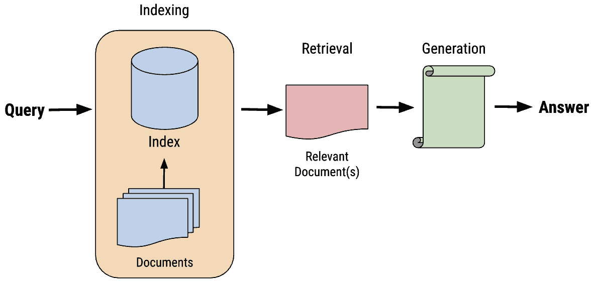
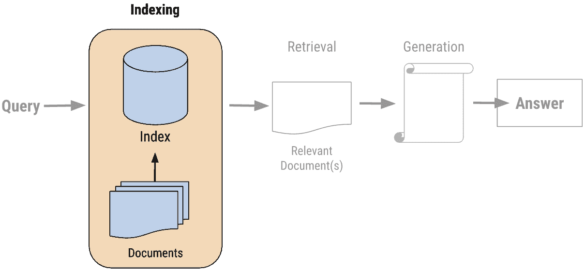
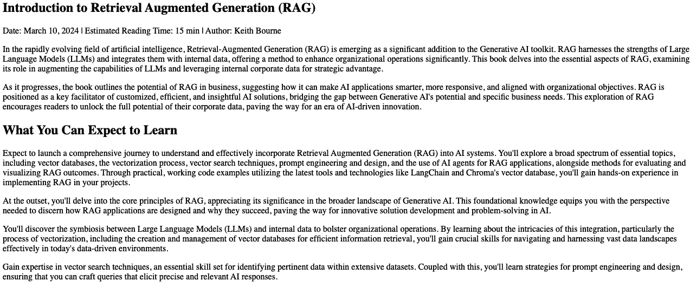
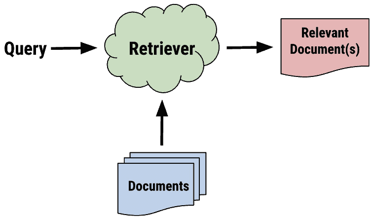
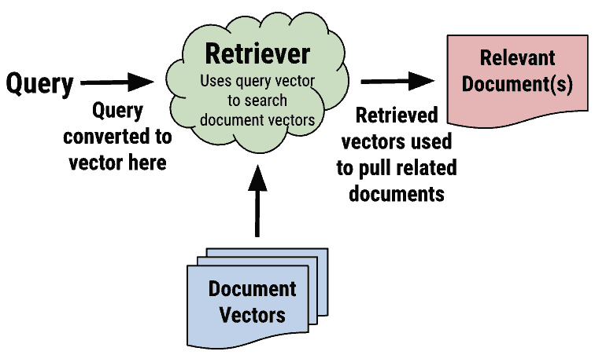
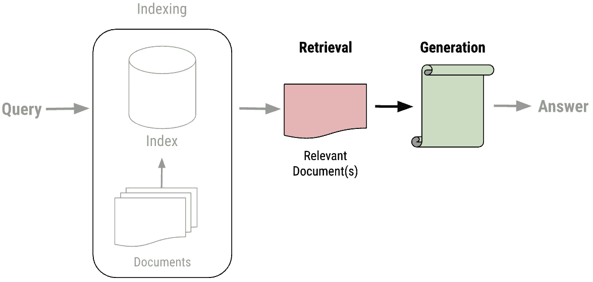
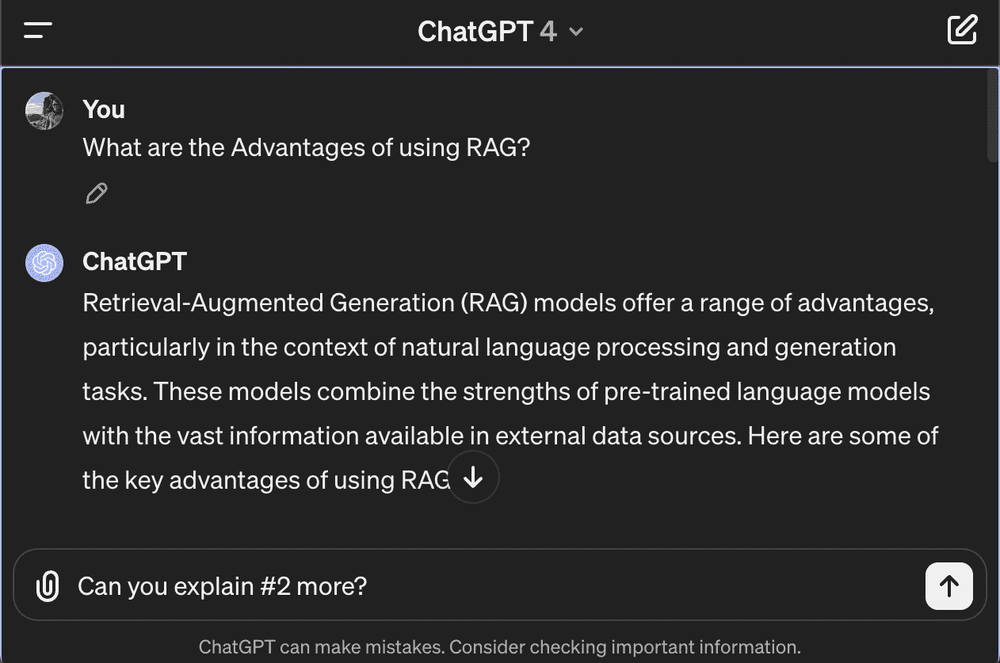

# 第四章：RAG 系统的组件

当你使用**检索增强生成** (**RAG****)进行开发时，理解每个组件的复杂性、它们如何集成以及赋予这些系统能力的科技至关重要。 这些系统。

在本章中，我们将涵盖以下主题：

+   关键组件概述

+   索引

+   检索和生成

+   提示

+   定义 你的 LLM

+   用户界面 (UI)

+   评估

这些主题应为您提供对代表 RAG 应用程序的关键组件的全面理解。

# 技术要求

本章的代码放置在以下 GitHub 仓库中： [https://github.com/PacktPublishing/Unlocking-Data-with-Generative-AI-and-RAG/tree/main/Chapter_04](https://github.com/PacktPublishing/Unlocking-Data-with-Generative-AI-and-RAG/tree/main/Chapter_04)

# 关键组件概述

本章深入探讨了构成 RAG 系统的复杂组件。 让我们从整个系统的概述开始。 让我们先概述一下 整个系统。

在*第一章*中，我们从技术角度介绍了 RAG 系统的三个主要阶段（见 *图 4**.1*）：

+   **索引**

+   **检索**

+   **生成**



图 4.1 – RAG 系统的三个阶段

我们将继续在此基础上构建，同时也会介绍构建应用程序所需的发展的实用方面。 这包括提示、定义 你的 **大型语言模型** (**LLM****)、用户界面(UI)和评估组件。 后续章节将进一步涵盖这些领域。 所有这些都将通过代码实现，以便您可以将我们讨论的概念框架直接与实现联系起来。 让我们从索引开始。

# 索引

我们将更详细地研究 RAG 系统中的第一个阶段，即索引。 注意 我们正在跳过设置步骤，其中我们安装和导入包，以及设置 OpenAI 和相关账户。 这是每个生成式人工智能（AI）项目的典型步骤，而不仅仅是 RAG 系统。 我们在*第二章*中提供了详细的设置指南，所以如果您想回顾我们为支持这些下一步骤添加的库，请回到那里。

索引是 RAG 的第一个主要阶段。 正如*图 4**.2** 所示，它是用户查询之后的步骤：



图 4.2 – 突出的 RAG 索引阶段

在我们的代码中，从*第二章*的索引是您看到的第一个代码部分。这是处理您向 RAG 系统引入的数据的步骤。 正如您在代码中所见，在这个场景中，*数据* 是正在由WebBaseLoader加载的网页文档。这是该文档的起始部分（图 4**.3**）：



图 4.3 – 我们处理的网页

在 *第二章*中，你可能已经注意到，在用户查询传递给链之后的后期阶段代码， *检索* 和 *生成*，被使用。 这是在 *实时*完成的，这意味着它发生在用户与之交互的时候。 另一方面，索引通常在用户与 RAG 应用程序交互之前就已经发生。 索引的这一特性使其与其他两个阶段非常不同，具有在应用程序使用时不同时间运行的灵活性。 这被称为 **离线预处理** ，这意味着这一步骤是在用户甚至打开应用程序之前完成的。 也有索引可以在实时完成的例子，但这要少得多。 现在，我们将关注更常见的步骤，即 离线预处理。

以下 代码 是我们的 **文档提取**：

```py
 loader = WebBaseLoader(
    web_paths=("https://kbourne.github.io/chapter1.html",)
    bs_kwargs=dict(
        parse_only=bs4.SoupStrainer(
            class_=("post-content", "post-title",
                    "post-header")
       )
    ),
)
docs = loader.load()
```

在这段摘录中，我们正在摄取一个网页。 但想象一下，如果这是从 PDF 或 Word 文档或其他非结构化数据中提取数据。 如 *第三章*中所述，非结构化数据在 RAG 应用中是一种非常流行的数据格式。 从历史上看，与结构化数据（来自 SQL 数据库和类似应用程序）相比，公司获取非结构化数据非常困难。 但 RAG 改变了这一切，公司终于意识到如何显著利用这些数据。 我们将回顾如何使用 **文档加载器** 在 *第十一章* 中访问其他类型的数据 以及如何使用 LangChain 实现。

无论你正在拉取什么类型的数据，它都会经过一个类似的过程，如图 `4`*.4**所示：



图 4.4 – 在 RAG 处理过程的索引阶段创建检索器

从代码中填充的文档加载器填充了 **Documents** 组件，以便以后可以使用用户查询检索。 但在大多数 RAG 应用中，你必须将那些数据转换成更易于搜索的格式：向量。 我们稍后会更多地讨论向量，但首先，为了将你的数据转换为向量格式，你必须 应用 **splitting**。在我们的代码中，这是 这一部分：

```py
 text_splitter = SemanticChunker(OpenAIEmbeddings())
splits = text_splitter.split_documents(docs)
```

分割将你的内容分解成可消化的块，这些块可以被向量化。 不同的向量化算法对可以传递的内容的最大大小有不同的要求 你。 在这种情况下，我们使用的是 `OpenAIEmbeddings()` 向量器，它目前的最大输入为 `8191` 标记。

注意

在 OpenAI API 中，文本使用字节级 **字节对编码** (**BPE**) 词汇进行标记化。 这意味着原始文本被分割 成子词标记，而不是单个字符。 对于给定的输入文本消耗的标记数量取决于具体内容，因为常见单词和子词由单个标记表示，而较少见的单词可能被分割成多个标记。 平均而言，一个标记大约是四个英文字符。 然而，这只是一个粗略估计，并且可以根据具体文本显著变化。 例如，像 `a` 或 *the* 这样的短词将是一个单独的标记，而一个长且不常见的词可能被分割成 几个标记。

这些可消化的块需要小于那个 `8191` 标记限制，其他嵌入服务也有它们的标记限制。 如果你使用的是定义了块大小和块重叠的分隔器，请记住那个标记限制的块重叠。 你必须将那个重叠加到整体块大小上，才能确定那个块有多大。 以下是一个使用的例子 `1000` 和块重叠 是 `200`:

```py
 text_splitter = RecursiveCharacterTextSplitter(
   chunk_size=1000, chunk_overlap=200)
splits = text_splitter.split_documents(docs)
```

扩展块重叠是确保块之间不丢失上下文的常用方法。 例如，如果一个块在法律文件中将地址切成了两半，那么在搜索时很可能找不到那个地址。 但是有了块重叠，你可以处理这类问题。 我们将回顾各种拆分器选项，包括 LangChain 中的 递归 字符 `TextSplitter` ，在 *第十一章*中。

*索引 *阶段的最后部分是定义向量存储并添加从你的数据拆分中构建的嵌入到该向量存储中。 你在这里的代码中可以看到它：

```py
 vectorstore = Chroma.from_documents(
                   documents=splits,
                   embedding=OpenAIEmbeddings())
retriever = vectorstore.as_retriever()
```

在这种情况下，我们使用 `OpenAIEmbeddings` API 只是这里可以使用的许多向量化算法之一。 我们将在第 *7 章 *和 *8 * 章中更详细地探讨这个话题，当我们讨论向量、向量存储和 向量搜索时。

回到我们的*索引 *过程图，*图 4**.5* 是对其外观的更准确描述：



图 4.5 – RAG 过程索引阶段中的向量

你可能想知道为什么我们不把定义检索器 *的步骤 称为检索步骤的一部分。 这是因为我们正在将其确立为我们检索的机制，但我们不会在用户提交查询后立即应用检索，而是在检索步骤的后期应用。 *索引 *步骤专注于构建其他两个步骤工作的基础设施，我们确实在索引数据，以便以后可以检索。 在代码的这一部分结束时，你将有一个准备就绪并等待在过程开始时接收用户查询的检索器。 让我们谈谈将使用这个检索器的代码部分 – 检索和 生成步骤！

# 检索和生成

在我们的 RAG 应用程序代码中，我们将 *检索* 和 *生成* 阶段合并。 从图表的角度来看，这看起来就像 *图 4**.6*中所示：



图 4.6 – RAG 过程索引阶段中的向量

虽然检索和生成是两个独立阶段，分别服务于 RAG 应用程序的两个重要功能，但它们在我们的代码中被合并。 当我们调用 `rag_chain` 作为最后一步时，它正在遍历这两个阶段，这使得在谈论代码时很难将它们分开。 但从概念上讲，我们将在这里将它们分开，然后展示它们如何将它们结合起来处理用户查询并提供智能生成式 AI 响应。 让我们从 检索步骤开始。

## 检索重点步骤

在 完整的 代码（可在 *第二章*中找到）中，只有两个区域在这个代码中实际进行检索或处理。 这是 第一个：

```py
 # Post-processing
def format_docs(docs):
    return "\n\n".join(doc.page_content for doc in docs)
```

第二个可以在 RAG 链中的第一步找到：

```py
 {"context": retriever | format_docs, "question": RunnablePassthrough()}
```

当代码启动时，它按照 以下顺序运行：

```py
 rag_chain.invoke("What are the Advantages of using RAG?")
```

链通过用户查询被调用，并运行通过我们在 这里定义的步骤：

```py
 rag_chain = (
    {"context": retriever | format_docs,
     "question": RunnablePassthrough()}
    | prompt
    | llm
    | StrOutputParser()
)
```

使用这个链，用户查询被传递到第一个链接，该链接将用户查询传递到我们之前定义的检索器中，在那里它执行相似性搜索以匹配用户查询与向量存储中的其他数据。 此时，我们有一个检索到的内容字符串列表，它与用户查询在上下文中相似。

然而，如图 *第二章*所示，由于我们使用的工具的格式问题，我们的检索步骤中存在一些小故障。 `{question}`和`{context}`占位符都期望字符串，但我们用来填充上下文的检索机制是一个包含多个独立内容字符串的长列表。 我们需要一个机制将这个内容片段列表 转换为 下一个链链接中提示所期望的字符串格式。

所以，如果你仔细查看检索器的代码，你可能会注意到检索器实际上在一个迷你链（`检索器 | 格式化文档`）中，由管道（`|`）符号表示，所以检索器的输出直接传递到 `格式化文档` 函数 ，如下所示：

```py
 def format_docs(docs):
    return "\n\n".join(doc.page_content for doc in docs)
```

让我们将这个步骤视为 *检索* 阶段的后期处理步骤。 数据已经被检索，但它不是正确的格式，所以我们还没有完成。 `格式化文档` 函数完成这项任务，并以正确的格式返回我们的内容。

然而，这仅仅为我们提供了 `{上下文}`，其中一个输入变量占位符。 我们需要填充提示的另一个占位符是 `{问题}` 占位符。 然而，与 *上下文* 相比，我们并没有遇到相同的格式化问题，因为 *问题* 已经是字符串。 因此，我们可以使用一个方便的对象 `RunnablePassThrough` ，正如其名称所暗示的，将输入（ *问题*） 原样传递。

如果你将整个第一个链链接完整地考虑，这本质上是在执行检索步骤，格式化其输出，并将其以正确的格式全部拉在一起，以便传递到 下一个步骤：

```py
{"context": retriever | format_docs, "question": RunnablePassthrough()}
```

但是等等。 如果你在进行向量搜索，你需要将用户查询转换为向量，对吧？ 我们不是说过，我们正在测量用户查询的数学表示与其他向量的距离，找到哪些更接近的吗？ 那么，这是在哪里发生的呢？ 检索器是由 向量存储方法 创建的：

```py
 retriever = vectorstore.as_retriever()
```

生成此向量存储的数据库是一个使用 `OpenAIEmbeddings()` 对象 作为其 嵌入函数 声明的 Chroma 向量数据库：

```py
 vectorstore = Chroma.from_documents(
                   documents=splits,
                   embedding=OpenAIEmbeddings())
```

那个 `.as_retriever()` 方法内置了所有功能，可以将用户查询转换为与其它嵌入匹配的嵌入格式，然后运行 检索过程。

注意

因为这是使用 `OpenAIEmbeddings()` 对象，它会将您的嵌入发送到 OpenAI API，您将因此产生费用。 在这种情况下，这只是一个嵌入；在 OpenAI，目前每 1M 个 token 的费用是$0.10。 因此，对于 `使用 RAG 的优势是什么？` 输入，根据 OpenAI，这是十个 token，这将花费高达$0.000001。 这可能看起来不多，但我们希望在涉及任何 费用时都完全透明！

这就结束了我们的 *检索 * 阶段，输出格式正确，为下一步——提示！ 接下来，我们将讨论 *生成 * 阶段，在这一阶段，我们利用 LLM 来完成 最终 步骤，生成 响应。

## 生成阶段

生成 *阶段是 最终阶段，您将在这里使用 LLM 根据在 *检索 * 阶段检索到的内容来生成对用户查询的响应。 但在我们能够这样做之前，我们必须做一些准备工作。 让我们来了解一下。 。

总的来说， *生成 * 阶段由代码的两个部分表示，从 提示 开始：

```py
 prompt = hub.pull("jclemens24/rag-prompt")
```

然后，我们有 LLM：

```py
 llm = ChatOpenAI(model_name="gpt-4o", temperature=0)
```

在定义了提示和 LLM 之后，这些组件被用于 RAG 链：

```py
 | prompt
  | llm
```

请注意， `问题` 部分在 *检索 * 和 *生成 * 阶段都被加粗了。 我们已经在 *检索 * 阶段说明了它如何作为相似性搜索运行的基础。 现在，我们将展示它如何再次在将其集成到 LLM 生成提示时被使用。 。

# 提示

**提示词** 是任何生成式 AI 应用的基础部分，不仅仅是 RAG。当你开始谈论提示词，尤其是与 RAG 相关时，你知道 LLMs 很快就会介入。 但首先，你必须为我们的 LLM 创建和准备一个合适的提示词。 从理论上讲，你可以编写你的提示词，但我想要抓住这个机会教你这个非常常见的发展模式，并让你习惯在需要时使用它。 在这个例子中，我们将从**LangChain Hub**中提取提示词。

LangChain 将其 Hub 描述为“*发现、分享和版本控制提示词。*”其他 Hub 用户在这里分享了他们的精炼提示词，这使得你更容易基于共同知识进行构建。 这是一个从提示词开始的好方法，下载预设计的提示词并查看它们的编写方式。 但最终你将想要过渡到编写自己的、更定制化的提示词。

让我们谈谈这个提示词在检索过程中的目的。 “提示词”是我们在讨论检索阶段之后的链中的下一个链接。 你可以在这里看到它 在 `rag_chain`:

```py
 rag_chain = (
    {"context": retriever | format_docs,
     "question": RunnablePassthrough()}
    | prompt | llm
    | StrOutputParser()
)
```

遵循 LangChain 模式，提示词的输入是前一步的输出。你可以通过像这样打印出来在任何时候看到这些输入： 像这样：

```py
 prompt = hub.pull("jclemens24/rag-prompt")
prompt.input_variables
```

这导致了以下输出：

```py
 ['context', 'question']
```

这与我们在上一步中定义的内容相匹配：

```py
 {"context": retriever | format_docs,
 "question": RunnablePassthrough()}
```

使用`print(prompt)`打印整个提示词对象，显示的不仅仅是文本提示词和 输入变量：

```py
 input_variables=['context', 'question'] messages=[HumanMessagePromptTemplate(prompt=PromptTemplate(input_variables=['context', 'question'], template="You are an assistant for question-answering tasks. Use the following pieces of retrieved-context to answer the question. If you don't know the answer, just say that you don't know.\nQuestion: {question} \nContext: {context} \nAnswer:"))]
```

让我们进一步解开这个，从输入变量开始。 这些是我们刚刚讨论的变量，这个特定的提示将其作为输入。 这些可以根据提示而变化。 有一个 `消息 []` 列表，但在这个情况下，列表中只有一个消息。 这条消息是 `HumanMessagePromptTemplate`的一个实例，它代表了一种特定的消息模板。 它 是用一个 `PromptTemplate` 对象 初始化的。 PromptTemplate 对象是用指定的 `输入变量` 和模板字符串创建的。 再次强调， `输入变量` 是 `上下文` 和 `问题`，并且你可以看到它们在 `模板` 字符串中的位置：

```py
 template="You are an assistant for question-answering tasks. Use the following pieces of retrieved-context to answer the question. If you don't know the answer, just say that you don't know.\nQuestion: {question} \nContext: {context} \nAnswer:"
```

当提示在链中使用时， `{question}` 和 `{context}` 占位符将被 `问题` 和 `上下文` 变量的实际值所替换。 这个链链接的输出是填充了 `{question}` 和 `{context}` 的字符串模板，这些是从之前的 `检索步骤` 中获取的。

最后一部分仅仅是 `答案：` 后面没有任何内容。 这促使 LLM 给出一个答案，并且这是一个在 LLM 交互中引发答案的常见模式。

简而言之，提示是一个对象，它被插入到你的 LangChain 链中，带有输入来填充提示模板，生成你将传递给 LLM 进行推理的提示。 这本质上是为 RAG 系统的 *生成 * 阶段 的准备工作。

在下一步中，我们将引入 LLM，这是整个操作背后的核心！

# 定义你的 LLM

选择了提示 `模板 后，我们可以选择一个 LLM，这是任何 RAG 应用的核心组件。 以下代码显示了 LLM 模型作为 `rag_chain`中的下一个链链接 ：

```py
 rag_chain = (
    {"context": retriever | format_docs,
     "question": RunnablePassthrough()}
    | prompt
    | llm | StrOutputParser()
)
```

如前所述，上一步的输出，即 `提示` 对象，将成为下一步，即 LLM 的输入。 在这种情况下，提示将 *管道* 直接进入 LLM，其中包含我们在 上一步中生成的提示。

在上面的 `rag_chain`中，我们定义了我们想要 使用的 LLM：

```py
 llm = ChatOpenAI(model_name="gpt-4o", temperature=0)
```

这是从 `ChatOpenAI` 类中创建一个实例，该类来自 `langchain_openai` 模块，该模块作为 OpenAI 语言模型的接口，特别是 GPT-4o 模型。 LLMs 通常使用 invoke 方法提供提示，你可以在代码中直接调用此方法，通过添加以下内容：

```py
 llm_only = llm.invoke("Answering in less than 100 words,
    what are the Advantages of using RAG?")
print(llm_only.content)
```

这样做，你是在直接要求 LLM 提供答案。

如果您运行前面的代码，它将给出 GPT-4o 的响应，这将了解 RAG。 但为了比较，如果我们将其更改为 GPT3.5 呢？ 以下是使用 ChatGPT 3.5 收到的响应：

```py
 RAG (Red, Amber, Green) status reporting allows for clear and straightforward communication of project progress or issues. It helps to quickly identify areas that need attention or improvement, enabling timely decision-making. RAG status also provides a visual representation of project health, making it easy for stakeholders to understand the current situation at a glance. Additionally, using RAG can help prioritize tasks and resources effectively, increasing overall project efficiency and success.'
```

哎呀！ ChatGPT 3.5 不了解 RAG！ 至少在我们讨论的上下文中不是。 这突出了使用 RAG 添加数据的价值。 ChatGPT 3.5 的最新截止日期是 2022 年 1 月。 生成式 AI 概念 RAG 必须不够流行，以至于它不能立即知道我提到的 RAG 缩写代表什么。

使用 RAG，我们可以 增强其知识，并利用 LLM 的其他技能，如总结和查找数据，以获得更成功的整体结果。 但尝试将其更改为以下问题 `用不到 100 字回答，使用检索增强生成 (RAG) 的优点是什么？` 并看看你能得到什么结果。 尝试使用一个更新的模型，该模型可能在其训练数据中包含更多关于 RAG 应用程序的信息。 你可能会得到更好的响应，因为 LLM 训练的数据的截止日期更近！

但是，我们不是直接调用 LLM，而是通过使用 *检索 *阶段构建的提示传递给它，从而可以得到一个更有见地的答案。 你可以在这里结束链，你的链的输出将是 LLM 返回的内容。 在大多数情况下，这不仅仅是当你输入某些内容到 ChatGPT 时可能看到的文本——它是以 JSON 格式呈现的，并且包含了很多其他数据。 因此，如果你想得到一个格式良好的字符串输出，反映 LLM 的响应，你还需要一个额外的链链接来将 LLM 的响应传递进去：即 `StrOutputParser()` 对象。 `StrOutputParser()` 对象是 LangChain 中的一个实用类，它将语言模型的关键输出解析为字符串格式。 它不仅移除了你现在不想处理的所有信息，而且还确保生成的响应以 字符串的形式返回。

当然，最后一行代码是启动一切的命令：

```py
 rag_chain.invoke("What are the Advantages of using RAG?")
```

在 *检索 *阶段之后，这个用户查询被第二次用作传递给 LLM 的提示中的一个输入变量。 在这里， `使用 RAG 的优势是什么？` 是传递到链中的字符串。

正如我们 在 *第二章 *中讨论的那样，在未来，这个提示将包括一个来自 UI 的查询。 让我们讨论 UI 作为 RAG 系统中的另一个重要组件。

# UI

在某个时刻，为了使这个应用程序更加专业和可用，你必须为那些没有你代码的普通用户提供一种直接输入查询并查看结果的方法。 用户界面是用户与系统之间交互的主要点，因此在构建 RAG 应用程序时是一个关键组件。 高级界面可能包括 **自然语言理解** (**NLU**) 功能，以更准确地解释用户的意图，这是一种 **自然语言处理** (**NLP**) 技术，专注于自然语言的理解部分。 这个组件对于确保用户能够轻松有效地向系统传达他们的需求至关重要。

这开始于用 一个 UI 替换最后一行：

```py
 rag_chain.invoke("What are the Advantages of using RAG?")
```

这一行将被替换为用户提交文本问题的输入字段，而不是我们传递给它的固定字符串，如下所示。

这还包括以更用户友好的界面显示 LLM 的结果，例如在一个设计精美的屏幕上。 在 *第六章*中，我们将用代码展示这一点，但现在，让我们先就向你的 RAG 应用程序添加界面进行更高级别的讨论。

当应用程序为用户加载时，他们将有某种方式与之交互。 这通常是通过一个界面来实现的，它可以是从网页上的简单文本输入字段到更复杂的语音识别系统。 关键是准确捕捉用户查询的意图，并以系统可以处理的形式呈现。 添加 UI 的一个明显优势是它允许用户测试其他查询的结果。 用户可以输入他们想要的任何查询并查看结果。 。

## 预处理

正如我们讨论的，尽管 用户只是在 UI 中输入一个问题，例如 `什么是任务分解？` ，在提交这个问题之后，通常会有预处理来使这个查询更适合 LLM。 这主要是在提示中完成的，同时得到了许多其他函数的帮助。 但所有这些都是在幕后发生的，而不是在用户视野中。 在这种情况下，他们唯一会看到的是以用户友好的方式显示的最终输出。

## 后处理

即使 LLM 已经返回了响应，在将其展示给用户之前，这个响应通常还会进行后处理。

以下是一个实际的 LLM 输出的样子：

```py
 AIMessage(content="The advantages of using RAG include improved accuracy and relevance of responses generated by large language models, customization and flexibility in responses tailored to specific needs, and expanding the model's knowledge beyond the initial training data.")
```

作为链中的最后一步，我们将它通过 `StrOutput Parser()` 来解析，仅获取 字符串：

```py
 'The advantages of using RAG (Retrieval Augmented Generation) include improved accuracy and relevance, customization, flexibility, and expanding the model's knowledge beyond the training data. This means that RAG can significantly enhance the accuracy and relevance of responses generated by large language models, tailor responses to specific needs, and access and utilize information not included in initial training sets, making the models more versatile and adaptable.'
```

这当然比上一步的输出要好，但这仍然显示在您的笔记本上。 在更专业的应用中，您可能希望以对用户友好的方式在屏幕上显示。 您可能还想显示其他信息，例如我们在 *第三章* 代码中显示的源文档。 这将取决于您的应用意图，并且在不同 RAG 系统中差异很大。

## 输出界面

对于完整的 UI，这个字符串 将被传递到显示返回链消息的界面。 这个界面可以非常简单，就像您在 *图 4**.7*中看到的 ChatGPT 一样：



图 4.7 – ChatGPT 4 界面

您也可以构建一个更健壮的系统，使其更适合您的特定目标用户群体。如果它旨在更具对话性，界面也应设计得便于进一步交互。 您可以提供用户选项来细化他们的查询，提出后续问题，或请求 更多信息。

UI 中另一个常见功能是对响应的有用性和准确性的反馈收集。 这可以用于持续改进系统的性能。 通过分析用户交互和反馈，系统可以学习更好地理解用户意图，细化向量搜索过程，并提高生成的响应的相关性和质量。 这使我们来到了最后一个关键 组件：评估。

# 评估

评估组件对于评估和 改进 RAG 系统的性能至关重要。 虽然有许多常见的评估实践，但最有效的评估系统将专注于对用户最重要的方面，并提供评估以改进这些功能和能力。 通常，这涉及到使用各种指标分析系统的输出，例如准确性、相关性、响应时间和用户满意度。 这种反馈用于确定改进领域，并指导系统设计、数据处理和 LLM 集成的调整。 持续评估对于保持高质量响应并确保系统有效满足用户 需求至关重要。

如前所述，您还可以通过多种方式收集用户反馈，包括定性数据（开放式问题的表格）或关于响应的有用性和准确性的定量数据（是/否、评分或其他数值表示）。 点赞/点踩通常用于从用户那里快速获得反馈并评估应用程序在众多用户中的总体有效性。

我们将在第十章中更深入地讨论如何将评估纳入您的代码 *第十章*。

# 总结

本章并未提供 RAG 系统组件的完整列表。 然而，这些是每个成功的 RAG 系统都倾向于包含的组件。 请记住，RAG 系统不断进化，每天都有新的组件类型出现。 您 RAG 系统的关键方面应该是添加能够满足用户需求的组件。 这可能与您的项目非常具体，但通常是您公司所做事情的直观扩展。

本章提供了对构成成功 RAG 系统必要组件的全面概述。 它深入探讨了三个主要阶段： *索引*, *检索*, 和 *生成*，并解释了这些阶段如何协同工作以提供对用户查询的增强响应。

除了核心阶段之外，本章还强调了 UI 和评估组件的重要性。 UI 是用户与 RAG 系统之间交互的主要点，使用户能够输入他们的查询并查看生成的响应。 评估对于评估和改进 RAG 系统的性能至关重要。 这包括使用各种指标分析系统的输出并收集用户反馈。 持续评估有助于确定改进领域并指导系统设计、数据处理和 LLM 集成方面的调整。

虽然本章讨论的组件并不全面，但它们构成了大多数成功 RAG 系统的基础。

然而，每个 RAG 系统都有一个非常重要的方面我们没有在本章中涉及：安全性。 我们将用下一章的整个章节来涵盖安全性的关键方面，特别是与 RAG 相关的方面。

# 参考文献

[LangChain 的提示中心](https://docs.smith.langchain.com/old/category/prompt-hub) 信息： [https://docs.smith.langchain.com/old/category/prompt-hub](https://docs.smith.langchain.com/old/category/prompt-hub).
