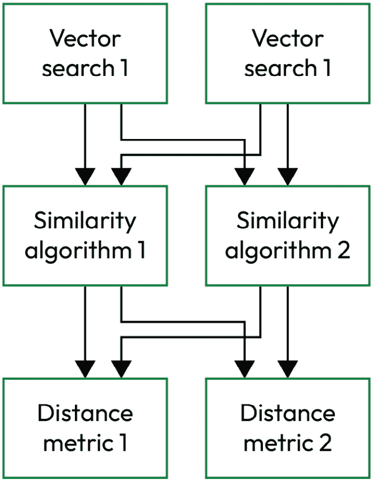
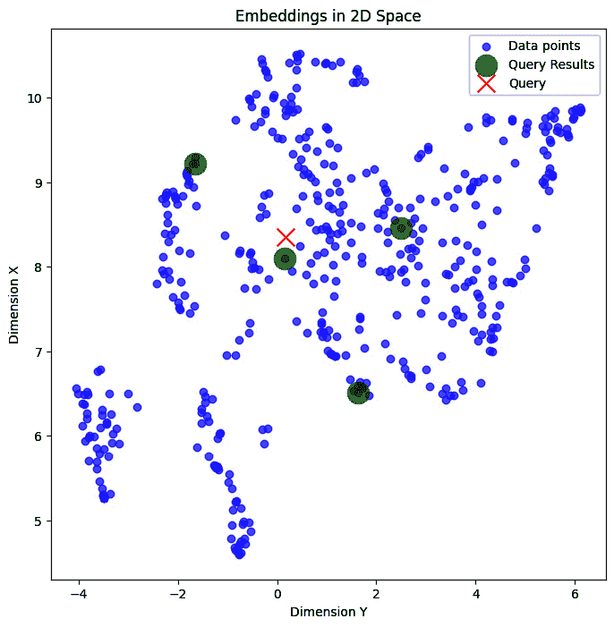

# 第八章：基于向量的相似性搜索

本章全部关于检索-augmented generation *`R`* 或 **检索 **部分 **检索增强生成 **(**RAG**). 具体来说，我们将讨论与相似性搜索相关的四个领域：**索引**，**距离度量**，**相似性算法**，以及**向量搜索服务**。考虑到这一点，在本章中，我们将涵盖以下内容： 以下内容：

+   距离度量与相似性算法与 向量搜索

+   向量空间

+   代码实验室 8.1 – 语义 距离度量

+   不同的搜索范式 – 稀疏的、密集的，以及混合的

+   代码实验室 8.2 – 使用自定义函数进行 混合搜索

+   代码实验室 8.3 – 使用 LangChain 的 EnsembleRetriever 进行混合搜索 混合搜索

+   如 k-NN 和 ANN 的语义搜索算法

+   增强 ANN 搜索效率的索引技术 搜索效率

+   向量 搜索选项

在本章结束时，你应该对基于向量的相似性搜索如何运作以及为什么它在 RAG 系统中的检索组件中起着至关重要的作用有一个全面的理解。 RAG 系统。

# 技术要求

本章的代码放置在以下 GitHub 仓库中： [https://github.com/PacktPublishing/Unlocking-Data-with-Generative-AI-and-RAG/tree/main/Chapter_08](https://github.com/PacktPublishing/Unlocking-Data-with-Generative-AI-and-RAG/tree/main/Chapter_08 )

每个代码实验室的单独文件名在各自的章节中提到。

# 距离度量与相似性算法与向量搜索

首先，让我们区分距离度量、相似性算法和向量搜索之间的区别。 相似性算法可以使用不同的距离度量，而向量搜索可以使用不同的相似性算法。 它们都是不同的概念，最终构成了你的 RAG 系统的检索组件。 如果你打算理解如何正确实施和优化你的检索解决方案，区分这些服务于不同目的的概念是很重要的。 你可以将其视为一个层次结构，如图**图 8**.1**所示：



图 8.1 – 每个选项的向量存储、相似性算法和距离度量层次结构

在 *图 8**.1*中，我们只展示了每个选项的两个选项，其中每个向量搜索都有两种不同的相似性算法选项，然后每个相似性算法都有两种不同的距离度量选项。 然而，实际上在每个层面上都有更多的选项。

这里的要点是，这些术语通常被互换使用或一起使用，好像它们是同一件事，但实际上它们是整体相似性搜索机制中非常不同的部分。 如果你犯了一个混淆它们的错误，那么理解相似性搜索背后的整体概念就会变得困难得多。 相似性搜索。

现在我们已经澄清了这一点，我们将讨论另一个可以帮助你理解相似性搜索工作基础的概念，即 向量空间。

# 向量空间

向量空间的概念与向量相似性搜索高度相关，因为搜索是在由向量表示的向量空间内进行的。 技术上讲，向量空间是一个数学结构，它表示一个高维空间中向量的集合。 向量空间的维度对应于与每个向量关联的特征或属性的数量。 在这个空间中，最相似的文本向量具有更相似的嵌入，因此它们在空间中彼此更接近。 当以更技术性的方式讨论相似性搜索时，你经常会听到向量空间的概念。 其他 常见的 这个 *空间* 的 名称 是**嵌入空间** 或**潜在空间**。

向量空间的概念有助于可视化寻找与用户查询嵌入最近的向量距离算法的工作方式。 忽略这些向量有时是数千维的事实，我们可以将它们想象在一个二维空间中，其外限由其中的向量定义，并且数据点（在免费 PDF 版本中可以看到的小点）代表每个向量（见图 8.2）。 在各个地方都有代表不同数据点之间语义相似性的小数据点（小点）簇。 当发生搜索时，一个新的查询（X）根据用户查询向量的维度出现在这个想象空间中，并且与该查询（X）最近的那些数据点（小点）将成为我们检索器协调的相似性搜索的结果。 我们检索搜索结果中所有将要检索的数据点（小点），并将它们转换为查询结果（大点）：



图 8.2 – 2D 表示向量空间中的嵌入，其中 X 代表查询，大点代表数据集中最近的嵌入

让我们来谈谈我们在这里看到的内容。 查询（大点）有四个结果。 从我们的视角来看，在这个二维空间中，看起来有一些数据点（小点）比查询结果（大点）更接近查询（X）。 为什么是这样呢？ 你可能记得这些点最初是在一个 1536 维空间中。 所以，如果你想象只是增加一个维度（高度），其中点从页面中向外扩散到你这里，那些查询结果（大点）实际上可能更近，因为它们都远高于看起来更近的数据点（小点）。 直接从上方看它们，一些数据点（小点）可能看起来更近，但数学上可以确定，当考虑所有维度时，查询结果（大点）是更接近的。 将你的空间扩展到所有 1536 维，这种情况变得更加可能。

# 语义搜索与关键词搜索

正如我们 已经 多次说过的，向量以数学形式捕捉我们数据背后的意义。 这就是所谓的 **语义** 或 **向量搜索**。与关键词匹配相比，语义搜索是寻找具有相似语义意义的文档，而不仅仅是相同的单词。 作为人类，我们可以用许多不同的方式说出相同或相似的事情！ 语义搜索可以捕捉我们语言的这个方面，因为它为相似的概念分配相似的数学值，而关键词搜索则侧重于特定的单词匹配，并且往往部分或完全错过了相似的语义意义。

从技术角度来看，语义搜索利用了我们矢量化文档的意义，这种意义以数学形式嵌入到代表它的向量中。 对于数学爱好者来说，你们必须认识到使用数学解决方案来解决语言挑战的美丽之处！ 对于语言挑战！

让我们通过一个例子来了解一下语义搜索是如何工作的。

## 语义搜索示例

想想一个简单的语义相似性例子，比如在线对毯子产品的评论，其中一位顾客说： 以下内容：

`这个毯子为我保持了很高的舒适温度！` `！`

另一位顾客 说：

`我用这个毯子感觉非常温暖舒适！` `！`

虽然他们在语义上说的相对相似，但关键词搜索不会像语义搜索那样认为它们几乎一样相似。 在这里，我们引入第三个句子，代表一个用于比较的随机在线评论： 如下：

`泰勒·斯威夫特在 2024 年` `34 岁。`

这个随机在线评论的语义被认为与最后两句中的任何一句都相当不同。 但不要只听我的话，让我们在笔记本上做一下数学计算吧！ 在下面的代码中，我们将回顾一些作为语义搜索基础元素的常用距离度量。 语义搜索。

# 代码实验室 8.1 – 语义距离度量

您需要从 GitHub 存储库访问的文件 被命名为 `CHAPTER8-1_DISTANCEMETRICS.ipynb`。

本章的第一个代码 实验室将专注于您计算向量之间距离的不同方法，让您亲身体验这些方法之间的差异。 我们将使用一个全新的笔记本 `CHAPTER8-1_DISTANCEMETRICS.ipynb` ，其中包含与我们迄今为止使用的代码不同的代码。 我们将安装并导入所需的包，为所讨论的句子创建嵌入，然后我们将逐步介绍三种在 NLP、生成式 AI 和 RAG 系统中非常常见的距离度量公式。

我们首先安装开源的 `sentence_transformers` 库，这将设置我们的 嵌入算法：

```py
 %pip install sentence_transformers -q --user
```

`sentence_transformers` 包提供了一个简单的方法来计算句子和段落的密集向量表示。 接下来，我们导入一些有助于我们 测量距离 的精选包：

```py
 import numpy as npfrom sentence_transformers import SentenceTransformer
```

在这里，我们添加了流行的 NumPy 库，它将提供我们执行距离分析所需的数学运算。 如前所述， `sentence_transformers` 被导入，以便我们可以为我们的文本创建密集向量表示。 这将使我们能够创建预训练嵌入模型的实例。

在下一行中，我们定义了我们想要 使用的转换器模型：

```py
 model = SentenceTransformer('paraphrase-MiniLM-L6-v2')
```

这个 `'paraphrase-MiniLM-L6-v2'` 模型是此包中可用的较小模型之一，希望它能与您可能在此代码上使用的更多计算机环境兼容。 如果您需要更强大的功能，请尝试 `'all-mpnet-base-v2'` 模型，其语义搜索性能评分大约 高出 50%。

我们将把之前提到的句子添加到我们可以在 代码中引用的列表中：

```py
 sentence = ['This blanket has such a cozy temperature for me!', 'I am so much warmer and snug using this spread!', 'Taylor Swift was 34 years old in 2024.']
```

然后 我们使用我们的 SentenceTransformer 模型 对句子进行编码：

```py
 embedding = model.encode(sentence)
print(embedding)
embedding.shape
```

`model.encode` 函数接受一个字符串列表，并将其转换为嵌入列表。 我们的输出显示了我们的句子 的数学表示（向量）：

```py
 [[-0.5129604   0.6386722   0.3116684  ... -0.5178649  -0.3977838  0.2960762 ][-0.07027415  0.23834501  0.44659805 ... -0.38965416  0.20492953  0.4301296 ][ 0.5601178  -0.96016043  0.48343912 ... -0.36059788  1.0021329  -0.5214774 ]]
(3, 384)
```

你会注意到 `(3, 384)` 来自 `embedding.shape` 函数。 你还记得那是什么意思吗？ 它告诉我们我们有三个向量，它们都是 384 维。 所以现在我们知道这个特定的 SentenceTransformer 模型提供的是 384D 的向量！

有趣的事实

你可能想知道是否可以使用 `sentence_transformers` 库为你的 RAG 向量存储生成嵌入，就像我们使用 OpenAI 的嵌入 API 所做的那样。 答案是响亮的肯定！ 这是使用 OpenAI 的嵌入 API 的免费替代方案，特别是如果使用更大的 `'all-mpnet-base-v2'` 模型生成的嵌入。 你可以使用 `ada` 模型，排名第 65 位，以及他们的“最佳”模型，即 `'text-embedding-3-large'` 模型，排名第 14 位。你还可以使用自己的数据微调这些模型，并可能使其比任何付费 API 嵌入服务更有效地适用于你的 RAG 系统。 最后，对于任何 API 服务，你依赖于它始终可用，而这并不总是事实。 使用 `sentence_transformers` 模型本地使用使其始终可用且 100%可靠。 查看 MTEB 以找到更好的模型，你可以下载并在类似方式中使用。

好的，我们现在 有一个环境可以开始探索 距离度量。

计算向量之间距离的方法有很多。 欧几里得距离（L2）、点积和余弦距离是 NLP 中最常用的距离度量。

让我们从 **欧几里得** **距离** (**L2**).

## 欧几里得距离（L2）

欧几里得距离 计算两个向量之间的最短距离。 当使用此方法来评分距离时，请记住，我们正在寻找更接近的，因此较低值表示更高的相似度（距离上的接近）。 让我们计算两个向量之间的欧几里得距离：

```py
 def euclidean_distance(vec1, vec2):
    return np.linalg.norm(vec1 - vec2)
```

在这个函数中，我们计算两个向量 `vec1` 和 `vec2`之间的欧几里得距离。 我们首先对两个向量进行逐元素减法，然后使用 NumPy 的 `linalg.norm()` 函数来计算向量的欧几里得范数（也称为 L2 范数）。 此函数计算向量元素平方和的平方根。 结合这些，我们得到了两个向量之间的欧几里得距离。

我们为每个 嵌入调用此函数：

```py
 print("Euclidean Distance: Review 1 vs Review 2:",
    euclidean_distance(embedding[0], embedding[1]))
print("Euclidean Distance: Review 1 vs Random Comment:",
    euclidean_distance(embedding[0], embedding[2]))
print("Euclidean Distance: Review 2 vs Random Comment:",
    euclidean_distance(embedding[1], embedding[2]))
Running this cell gives us this output:
Euclidean Distance: Review 1 vs Review 2: 4.6202903
Euclidean Distance: Review 1 vs Random Comment: 7.313547
Euclidean Distance: Review 2 vs Random Comment: 6.3389034
```

花点时间 环顾四周，寻找离你最近的 *东西* 。 然后寻找更远一点的东西。 离你最近的东西测量的距离更小。 一英尺比两英尺近，所以在这种情况下，当你想要它更近时， `1` 比 `2`是一个更好的分数。当涉及到语义搜索中的距离时，更近意味着更相似。 对于这些结果，我们希望看到一个更低的分数来说明它更相似。 `评论 1` 和 `评论 2` 的欧几里得距离为 `4.6202903`。这两个评论都显著地远离 `随机评论`。这显示了数学是如何用来确定这些文本在语义上相似或不同。 但就像数据科学中的大多数事情一样，我们有几种计算这些距离的方法。 让我们看看另一种方法， **点积**。

## 点积（也称为内积）

点积 实际上不是一个距离度量，因为它衡量的是 一个向量在另一个向量上的投影的大小，这表明的是相似性而不是距离。 然而，它是一种与其他提到的度量具有相似目的的度量。 由于我们谈论的是大小而不是接近程度，一个更高的正点积值表示更大的相似性。 因此，随着值的降低，甚至变为负值，这表明相似性更小。 在这里，我们将打印出我们每个 文本字符串的点积：

```py
 print("Dot Product: Review 1 vs Review 2:",
    np.dot(embedding[0], embedding[1]))
print("Dot Product: Review 1 vs Random Comment:",
    np.dot(embedding[0], embedding[2]))
print("Dot Product: Review 2 vs Random Comment:",
    np.dot(embedding[1], embedding[2]))
```

在这段代码中，我们使用了一个 NumPy 函数，它为我们完成了所有的点积计算。 输出如下：

```py
 Dot Product: Review 1 vs Review 2: 12.270497
Dot Product: Review 1 vs Random Comment: -0.7654616
Dot Product: Review 2 vs Random Comment: 0.95240986
```

在我们的 第一次比较中， `Review` `1` 和 `Review 2`，我们看到得分为 `12.270497`。点积的正值（`12.270497`）表明《st c="15732">Review 1` 和 `Review 2`之间有相对较高的相似度。 当我们比较 `Review` `1` 与 `Random Comment`时，我们看到得分为 `-0.7654616`，而 `Review 2` 与 `Random Comment` 的比较给出了 `0.95240986` 的点积。 这些低值和负值表明两个向量之间存在不相似或错位。 这些得分告诉我们， `Review 1` 和 `Review 2` 彼此之间比它们与 `Random Comment`的相似度更相似。

让我们看看我们的最后一个距离度量，**余弦距离**。

## 余弦距离

余弦距离 衡量向量之间的方向性差异。 鉴于这是一个距离度量，我们认为较低的值表示更接近、更相似的向量。 首先，我们设置一个函数来计算两个向量之间的余弦距离： 。

```py
 def cosine_distance(vec1,vec2):
    cosine = 1 - abs((np.dot(vec1,vec2)/(
        np.linalg.norm(vec1)*np.linalg.norm(vec2))))
    return cosine
```

注意到余弦距离的公式包含了我们之前提到的两个度量指标中的元素。首先，我们使用 `np.dot(vec1, vec2)` 来计算两个向量之间的点积。 然后，我们用向量长度的乘积来除，使用与计算欧几里得距离相同的 NumPy 函数来计算欧几里得范数。 在这种情况下，我们计算的是每个向量的欧几里得范数（而不是像欧几里得距离那样计算向量之间的差异）然后相乘。 结合这些，我们得到余弦相似度，然后从1 中减去绝对值，得到余弦距离。 在这里，我们调用 这个函数：

```py
 print("Cosine Distance: Review 1 vs Review 2:",
    cosine_distance(embedding[0], embedding[1]))
print("Cosine Distance: Review 1 vs Random Comment:",
    cosine_distance(embedding[0], embedding[2]))
print("Cosine Distance: Review 2 vs Random Comment:",
    cosine_distance(embedding[1], embedding[2]))
```

这就是我们在 输出中看到的内容：

```py
 Cosine Distance: Review 1 vs Review 2: 0.4523802399635315
Cosine Distance: Review 1 vs Random Comment: 0.970455639064312
Cosine Distance: Review 2 vs Random Comment: 0.9542623348534107
```

再次强调，衡量两个评论之间距离的值表明，与任何一个评论和随机评论相比，这两个评论的语义更加接近和相似。 然而，需要注意的是 `0.4523802399635315` 表明在评论 1和评论 2之间有更多的**中等相似性**。 但其他两个分数，1.0295443572103977 和0.9542623348534107`，表明向量之间有很高的**不相似性**。

对不起泰勒·斯威夫特，从数学上来说，我们有充分的证据证明你不是一个**温暖毯子**的语义等价物！ 就像欧几里得距离一样，距离值越低意味着越接近，也就是越相似。

请记住，还有许多其他可用于文本嵌入的距离度量标准和相似度分数，包括 **Lin 相似度**、**Jaccard 相似度**、**汉明距离**、**曼哈顿距离**和**Levenshtein 距离**。然而，之前列出的三个度量标准是 NLP 中最常用的，应该能帮助您了解这些度量标准是如何计算的。 三个 度量标准 列出的 之前 应该能帮助您了解这些度量标准是如何计算的。

到目前为止，我们讨论了密集向量，它们代表语义意义，但并非所有模型都代表语义意义。 有些模型实际上只是对我们提供的数据中单词的计数。 这些向量被称为稀疏向量。 让我们来谈谈这些类型向量之间的差异，以及我们如何利用这些差异在 RAG 中占得优势。 在 RAG 中。

# 不同的搜索范式——稀疏、密集和混合

存在不同类型的向量，这种差异对于本次讨论非常重要，因为您需要根据所搜索的向量类型使用不同类型的向量搜索。 让我们深入探讨这些类型向量之间的差异。 的向量。

## 密集搜索

**密集搜索** （语义搜索）使用 数据向量的嵌入表示 来进行搜索。 正如我们之前讨论的，这种搜索类型允许你捕捉并返回语义相似的对象。 它依赖于数据的意义来执行查询。 在理论上听起来很棒，但也有一些局限性。 如果我们使用的模型是在一个完全不同的领域上训练的，我们的查询准确性会很低。 它非常依赖于它所 训练的数据。

搜索引用某些事物（如序列号、代码、ID 甚至人名）的数据也会产生较差的结果。 这是因为这种文本中的意义不大，所以在嵌入中没有捕捉到任何意义，也无法使用意义来比较嵌入。 当搜索此类特定引用时，字符串或词匹配会更好。 我们称这种类型的搜索为关键词搜索或稀疏搜索，我们将在下一节讨论。

## 稀疏搜索

**稀疏搜索** 允许 你在所有内容中利用 关键词匹配。 它被称为 **稀疏嵌入** ，因为 文本是通过统计词汇表中每个唯一词在查询和存储句子中出现的次数来嵌入向量的。 这个向量大部分是零，因为任何给定句子包含你词汇表中所有词的可能性很低。 从数学的角度来看，如果一个嵌入向量大部分是零，它被认为是 稀疏的。

一个例子可能是 使用一个 **词袋**。词袋方法是指你统计查询和数据向量中每个词出现的次数，然后返回匹配词频率最高的对象。 这是进行 关键词匹配的最简单方法。

基于关键词的 算法的一个好例子是 **最佳匹配 25** (**BM25**) 算法。 这个非常流行的模型在搜索多个关键词时表现非常出色。 BM25 的理念是，它计算您传递的短语中的单词数量，然后那些出现频率较高的单词在匹配发生时被赋予较低的权重。 罕见的单词将获得更高的分数。 这个概念听起来熟悉吗？ 它使用了 TF-IDF，这是我们上一章中讨论过的模型之一！

虽然这两个选项提出了一个具有挑战性的问题：我们应该使用哪一个？ 如果我们需要语义匹配和关键词匹配怎么办？ 好消息是，我们不必做出选择；我们可以在所谓的 **混合搜索**中使用两者！我们将在下一节中回顾这个概念。

## 混合搜索

混合搜索 允许您充分利用密集和稀疏搜索技术，然后将返回的排名结果融合在一起。 使用混合搜索，您 执行了向量/密集搜索和关键词/稀疏搜索，然后您将 结果合并。

这种组合可以通过一个评分系统来完成，该系统衡量每个对象使用密集和稀疏搜索与查询匹配的程度。 还有什么比通过一个代码实验室来展示这种方法如何工作更好的方式吗？ 在下一节中，我们将向您介绍 BM25 以进行关键词/稀疏搜索，然后将其与我们的现有检索器结合形成 混合搜索。

# 代码实验室 8.2 – 带自定义函数的混合搜索

您需要从 GitHub 仓库访问的文件名为 titled `CHAPTER8-2_HYBRID_CUSTOM.ipynb`。

在这个代码实验室中，我们将从第五章的笔记本开始 *第五章*： `CHAPTER5-3_BLUE_TEAM_DEFENDS.ipynb`。请注意，我们不会使用 *第六章* 或 *第七章 * 的代码，其中包含我们以后不会使用的很多杂乱代码。 然而，在这个代码实验室中有一个额外的奖励；我们将介绍一些新元素，这些元素将贯穿接下来的几章，例如用于 PDF 而不是网页的新类型文档加载器，一个包含更多数据以供搜索的新大型文档，以及一个新的文本分割器。 我们还将清理掉由于这些更改而不再需要的任何代码。

一旦我们为这些更改更新了代码，我们就可以专注于手头的任务，即使用 BM25 生成我们的稀疏向量，将这些向量与我们已经使用的密集向量结合起来，形成一个混合搜索方法。 我们将使用我们之前的向量器来生成我们的密集向量。 然后，我们将使用这两组向量进行搜索，重新排名考虑出现在两次检索中的文档，并提供最终的混合结果。 BM25 已经存在了几十年，但它仍然是一个基于 TF-IDF 的非常有效的词袋算法，我们在上一章中已经讨论过。 它也非常快 地计算。

将两个检索器的结果结合起来有一个有趣的方面，那就是如何对来自两种相对不同的搜索机制的结果进行排名？ 我们的密集向量搜索使用余弦相似度并提供相似度分数。 我们的稀疏向量基于 TF-IDF，并使用 TF 和 IDF 分数，这些我们在上一章中已经讨论过。 这些分数是不可比较的。 实际上，我们可以使用许多算法来在这两个检索器之间进行排名。 我们将使用的是 **互逆排名融合** (**RRF**) 算法。 这个实验室主要关注构建一个模拟 RRF 排名方法的函数，这样你就可以亲自走一遍并理解这些 计算。

由于我们正在从处理网页转换为解析 PDF，我们不再需要这个专注于解析网页的包。 让我们从移除 这段代码：

```py
 %pip install beautifulsoup4
```

我们需要安装一个新的包来解析 PDF，因为我们需要一个新包来让我们使用 BM25 模型与 LangChain 生成 稀疏嵌入：

```py
 %pip install PyPDF2 -q –user
%pip install rank_bm25
```

这将把这两个包都加载到我们的环境中。 记住在安装后重启您的内核！ 安装后！

接下来，从 导入中删除此代码：

```py
 from langchain_community.document_loaders import WebBaseLoader
import bs4
from langchain_experimental.text_splitter import SemanticChunker
```

如前所述，我们不再需要解析网页的代码。 我们还将移除我们的文本分割器，并用一个新的替换它。

将此代码添加到 导入中：

```py
 from PyPDF2 import PdfReader
from langchain.text_splitter import RecursiveCharacterTextSplitter
from langchain.docstore.document import Document
from langchain_community.retrievers import BM25Retriever
```

在这里，我们添加 `PdfReader` 用于 PDF 提取。 我们添加了 `RecursiveCharacterTextSplitter` 文本分割器，它将替换 `SemanticChunker`。我们添加了一个新类，它将帮助我们管理并处理与 LangChain 相关的文档。 最后，我们添加了 `BM25Retriever` 加载器，它充当 LangChain 检索器。

接下来，让我们删除网页解析代码：

```py
 loader = WebBaseLoader(
    web_paths=("https://kbourne.github.io/chapter1.html",),
    bs_kwargs=dict(
        parse_only=bs4.SoupStrainer(
            class_=("post-content", "post-title",
                "post-header")
        )
    ),
)
docs = loader.load()
```

我们将把定义 OpenAI 变量的单元格扩展到定义代码中使用的所有变量；将此添加到该单元格的底部：

```py
 pdf_path = "google-2023-environmental-report.pdf"
collection_name = "google_environmental_report"
str_output_parser = StrOutputParser()
```

这设置了一些变量，我们将在使用以下代码时进一步讨论。 现在，让我们添加处理 PDF 的代码：

```py
 pdf_reader = PdfReader(pdf_path)
text = ""
for page in pdf_reader.pages:
    text += page.extract_text()
```

我们将在第十一章中更详细地讨论 LangChain 文档加载，但现在，我们想向您介绍一种除了加载网页之外的替代方法。 *第十一章*，但就目前而言，我们希望向您介绍一种除了加载网页之外的替代方法。 鉴于 PDF 的普及，这可能是您常见的场景。 需要注意的是，您需要将 `google-2023-environmental-report.pdf` 文件放在与您的笔记本相同的目录中。 您可以从访问本书中所有其他代码的同一仓库中下载该文件。 此代码将提取该文件并提取跨页面的文本，将文本重新连接起来，以确保页面之间没有文本丢失。

在这个 阶段，我们有一个表示 PDF 中所有文本的非常大的字符串。 我们现在需要使用一个分割器将文本分割成可管理的块。 这就是我们将从 `SemanticChunker` 切换到 `RecursiveCharacterTextSplitter`的地方。 这给了你使用不同的 LangChain 分割器的机会，这也是我们将在 *第十一章*中展开的另一个主题。 首先，移除

```py
 text_splitter = SemanticChunker(OpenAIEmbeddings())
splits = text_splitter.split_documents(docs)
```

然后，添加 这个：

```py
 character_splitter = RecursiveCharacterTextSplitter(
    separators=["\n\n", "\n", ". ", " ", ""],
    chunk_size=1000,
    chunk_overlap=200
)
splits = character_splitter.split_text(text)
```

`RecursiveCharacterTextSplitter` 是一个常用的分割器，同时也节省了我们使用与 `OpenAI`embeddings API 相关的 `SemanticChunker` 分割器对象。 结合我们现在上传的更大的 PDF 文档，这个分割器将在下一章查看向量空间和检索映射时给我们提供更多的块来工作。

使用新的数据和新的分割器，我们还需要更新我们的检索器相关代码。 让我们从准备 我们的文档：

```py
 documents = [Document(page_content=text, metadata={
    "id": str(i)}) for i, text in enumerate(splits)]
```

然后，检索器代码需要 被移除：

```py
 vectorstore = Chroma.from_documents(
    documents=splits,embedding=OpenAIEmbeddings())
retriever = vectorstore.as_retriever()
```

用这个 替换 这段代码：

```py
 chroma_client = chromadb.Client()
vectorstore = Chroma.from_documents(
    documents=documents,
    embedding=embedding_function,
    collection_name=collection_name,
    client=chroma_client
)
dense_retriever = vectorstore.as_retriever(
    search_kwargs={"k": 10})
sparse_retriever = BM25Retriever.from_documents(
    documents, k=10)
```

这段代码需要一点时间来加载，但一旦加载完成，我们正在设置我们的 Chroma DB 向量存储库，以更好地管理我们从 PDF 中获取的文档，并添加了 ID 元数据。 原始的检索器现在被称为 `dense_retriever`，这是一个更描述性和准确的名称，因为它与密集嵌入交互。 新的检索器，`sparse_retriever`，基于 BM25，它通过 LangChain 作为检索器方便地可用，为我们提供了与其他任何 LangChain 实例的检索器类似的功能。 在这两种情况下，我们通过将 `k` 设置为 `10`来确保我们得到 10 个结果。 此外，请注意， `vectorstore` 对象正在使用我们在代码中较早定义的 `collection_name` 字符串。

有趣的事实

不过，请注意，我们并没有像处理密集嵌入那样，将稀疏嵌入存储在 Chroma DB 向量存储中。 我们直接将文档拉入检索器，在我们使用它们时将它们保存在内存中。 在更复杂的应用中，我们可能会想要更彻底地处理这个问题，并将嵌入存储在一个更持久的向量存储中，以便将来检索。 在这个代码中，我们的 Chroma DB 也是临时的，这意味着如果我们关闭笔记本内核，我们将丢失它。 您可以使用 `vectorstore.persist()`来改善这种情况，它将 Chroma DB 数据库本地存储在一个 `sqlite` 文件中。 这些是高级技术，对于这个代码实验室不是必需的，但如果您想要为您的 RAG 管道构建一个更健壮的向量存储环境，可以查找它们！

在片刻之后，我们将 向您介绍一个为您执行混合搜索的功能，这样您可以逐步查看发生了什么。 不过，在回顾它之前，让我们讨论一下如何接近它。 请记住，这只是一个快速尝试来复制 LangChain 在其混合搜索机制中使用的排名算法。 这里的想法是，这将让您在用 LangChain 进行混合搜索时，了解底层发生了什么。 LangChain 实际上提供了一个 机制，只需一行代码就能完成所有这些操作！ 这是 `EnsembleRetriever` 以与我们函数相同的方式执行混合搜索，但它采用了一种称为 RRF 算法的复杂排名算法。 该算法负责确定如何对所有结果进行排名，类似于我们刚才讨论的 函数操作。

我们将逐步查看下一个函数，讨论每个点以及它与 LangChain 用于相同目的的 RFF 算法之间的关系。 这是迄今为止我们使用的最大的函数，但这是值得的！ 请记住，这是一个函数，您可以在代码中一起看到它。 让我们从 函数定义开始：

```py
 def hybrid_search(query, k=10, dense_weight=0.5,
    sparse_weight=0.5):
```

最初，我们将分别获取密集和稀疏结果的权重。 这符合 `EnsembleRetriever` 权重参数来自 LangChain，我们将在稍后进行回顾，但这将此函数设置为与那种类型的检索器完全一样。 我们还有一个 `k` 值，表示函数要返回的总结果数。 `k` 的默认值与检索器在代码中初始化时设置的返回值相匹配。

在函数内的第一步是专注于从两种类型的检索器中检索前k 个文档：

```py
 dense_docs = dense_retriever.get_relevant_documents(
        query)[:k]
    dense_doc_ids = [doc.metadata[
        'id'] for doc in dense_docs]
    print("\nCompare IDs:")
    print("dense IDs: ", dense_doc_ids)
    sparse_docs = sparse_retriever.get_relevant_documents(
        query)[:k]
    sparse_doc_ids = [doc.metadata[
        'id'] for doc in sparse_docs]
    print("sparse IDs: ", sparse_doc_ids)
    all_doc_ids = list(set(dense_doc_ids + sparse_doc_ids))
    dense_reciprocal_ranks = {
        doc_id: 0.0 for doc_id in all_doc_ids}
    sparse_reciprocal_ranks = {
        doc_id: 0.0 for doc_id in all_doc_ids}
```

我们的检索过程从检索密集搜索和稀疏搜索的前k 个文档开始。 就像 RRF 一样，我们根据各自的评分机制从密集搜索和稀疏搜索中检索前几个文档。 我们还希望为我们的内容分配 ID，以便我们可以跨检索器比较结果，通过将它们转换为去除所有重复项的集合来删除结果中的重复项，然后创建两个字典来存储每个文档的互信息排名。 。

接下来，我们将计算每个文档的互信息排名：

```py
 for i, doc_id in enumerate(dense_doc_ids):
    dense_reciprocal_ranks[doc_id] = 1.0 / (i + 1)
for i, doc_id in enumerate(sparse_doc_ids):
    sparse_reciprocal_ranks[doc_id] = 1.0 / (i + 1)
```

此代码将 计算密集和稀疏搜索结果中每个文档的互逆排名，并将它们存储在我们刚刚创建的字典中。 对于每个文档，我们计算它在每个排名列表中的互逆排名。 互逆排名是文档在排名列表中位置的倒数（例如，1/rank）。 互逆排名的计算方法是 `1.0` 除以文档在相应搜索结果中的位置（基于 1 的索引）。 请注意，相似度分数不涉及此计算。 正如您可能从之前的讨论中记得的那样，我们的语义搜索是基于距离排名，而 BM25 是基于相关性排名。 但是 RRF 不需要这些分数，这意味着我们不需要担心将来自不同检索方法的分数进行归一化，以便它们处于相同的尺度或直接可比。 使用 RFF，它依赖于排名位置，这使得结合来自不同评分机制的搜索结果变得更容易。 尽管如此，重要的是要注意这将对您的搜索产生的影响。 您可能有一个场景，从语义角度来看，您在语义搜索中有一个非常 *接近* 的分数（从距离的角度看），但您关键词搜索的最高排名结果仍然不太相似。 使用 RFF 并赋予相同的权重将导致这些结果具有相同的排名和因此，从排名的角度看，具有相同的价值，尽管您可能希望语义结果具有更大的权重。 您可以使用 `dense_weight` 和 `sparse_weight` 参数进行调整，但您如果遇到相反的情况怎么办？ 这是使用 RRF 和混合搜索的一般缺点，这就是为什么您想要测试以确保这是最适合您 特定需求的最佳解决方案。

在这里，我们计算从密集搜索和 稀疏搜索的排名列表中每个文档的互逆排名：

```py
 combined_reciprocal_ranks = {doc_id:
    0.0 for doc_id in all_doc_ids}
for doc_id in all_doc_ids:
   combined_reciprocal_ranks[doc_id] = dense_weight *
       dense_reciprocal_ranks[doc_id] + sparse_weight *
       sparse_reciprocal_ranks[doc_id]
```

RFF 方法的核心思想是，那些被检索方法高度排名的文档更有可能对查询相关。 通过使用互逆排名，RFF 给排名列表顶部出现的文档赋予更大的权重。 请注意，我们 正在使用我们在参数中收集的权重来加权总和。 这意味着这是我们可以使特定的一组嵌入（密集或稀疏）在搜索结果中更具影响力的地方。 

下一行根据它们的组合倒数排名分数在 降序中排序文档 ID：

```py
 sorted_doc_ids = sorted(all_doc_ids, key=lambda doc_id:
    combined_reciprocal_ranks[doc_id], reverse=True)
```

降序由 `reverse=True`表示。它使用 `sorted()` 函数，并使用一个 `key` 函数来检索每个 文档 ID 的组合倒数。

我们的下一步是遍历排序后的文档 ID，并从密集和稀疏 搜索结果中检索相应的文档：

```py
 sorted_docs = []
    all_docs = dense_docs + sparse_docs
    for doc_id in sorted_doc_ids:
        matching_docs = [
            doc for doc in all_docs if doc.metadata[
                'id'] == doc_id]
            if matching_docs:
                doc = matching_docs[0]
                doc.metadata['score'] =
                    combined_reciprocal_ranks[doc_id]
                doc.metadata['rank'] =
                    sorted_doc_ids.index(doc_id) + 1
                if len(matching_docs) > 1:
                    doc.metadata['retriever'] = 'both'
                elif doc in dense_docs:
                    doc.metadata['retriever'] = 'dense'
            else:
                 doc.metadata['retriever'] = 'sparse'
                 sorted_docs.append(doc)
```

我们使用 此来指示源检索器，这让我们更好地了解每个检索器如何影响结果。 根据排序后的文档 ID 检索文档。 生成的排名列表代表混合搜索结果，其中在密集和稀疏搜索排名中都较高的文档将具有更高的 组合分数。

最后，我们返回 结果：

```py
 return sorted_docs[:k]
```

请注意， `k` 被用于两个检索器，因此我们得到的结果是我们请求的两倍。 因此，这是将那些结果减半，只返回`k`。实际上，如果这些检索器的下半部分有结果，例如排名#8，但它们同时出现在两个结果中，那么这些结果很可能会被推到 前`k`。

接下来，我们必须在我们的 LangChain 链中考虑这个新的检索器机制。 更新 `rag_chain_with_source` 链，使用 `hybrid_search` 函数来返回 `context` 如下：

```py
 rag_chain_with_source = RunnableParallel(
    {"context": hybrid_search,
     "question": RunnablePassthrough()}
).assign(answer=rag_chain_from_docs)
```

这完成了为使用混合搜索对 RAG 管道进行代码更改的工作。 但我们添加了所有这些额外的元数据，我们希望在输出和分析中显示这些数据。 自己构建这个函数的额外好处是，它让我们能够打印出通常在使用 LangChain 的 `EnsembleRetriever`时无法看到的信息。 让我们利用这个机会，替换掉调用 RAG 管道的这个单元格。 在处理我们的 RAG 管道时，我们不是使用过去代码实验室中的最终代码，而是使用 以下代码：

```py
 user_query = "What are Google's environmental initiatives?" result = rag_chain_with_source.invoke(user_query)
relevance_score = result['answer']['relevance_score']
final_answer = result['answer']['final_answer']
retrieved_docs = result['context']
print(f"\nOriginal Question: {user_query}\n")
print(f"Relevance Score: {relevance_score}\n")
print(f"Final Answer:\n{final_answer}\n\n")
print("Retrieved Documents:")
for i, doc in enumerate(retrieved_docs, start=1):
    doc_id = doc.metadata['id']
    doc_score = doc.metadata.get('score', 'N/A')
    doc_rank = doc.metadata.get('rank', 'N/A')
    doc_retriever = doc.metadata.get('retriever', 'N/A')
    print(f"Document {i}: Document ID: {doc_id}
        Score: {doc_score} Rank: {doc_rank}
        Retriever: {doc_retriever}\n")
    print(f"Content:\n{doc.page_content}\n")
```

此代码继承了我们在前几章中使用的内容，例如我们在安全响应中使用的相关性分数。 我们添加了从我们的检索器中获取的每个结果的打印输出以及我们收集的元数据。 以下是前几个结果的示例输出：

```py
 Compare IDs:
dense IDs:  ['451', '12', '311', '344', '13', '115', '67', '346', '66', '262']
sparse IDs:  ['150', '309', '298', '311', '328', '415', '139', '432', '91', '22']
Original Question: What are Google's environmental initiatives? Relevance Score: 5
Final Answer:
Google's environmental initiatives include partnering with suppliers to reduce energy consumption and GHG emissions, engaging with suppliers to report and manage emissions, empowering individuals to take action through sustainability features in products, working together with partners and customers to reduce carbon emissions, operating sustainably at their campuses, focusing on net-zero carbon energy, water stewardship, circular economy practices, and supporting various environmental projects and initiatives such as the iMasons Climate Accord, ReFED, and The Nature Conservancy. They also work on sustainable consumption of public goods and engage with coalitions and sustainability initiatives to promote environmental sustainability. Retrieved Documents: Document 1: Document ID: 150 Score: 0.5 Rank: 1 Retriever: sparse Content: sustainability, and we're partnering with them… Document 2: Document ID: 451 Score: 0.5 Rank: 2 Retriever: dense Content: Empowering individuals: A parking lot full of electric vehicles lined up outside a Google office… Document 3: Document ID: 311 Score: 0.29166666666666663 Rank: 3 Retriever: both Content: In 2022, we audited a subset of our suppliers to verify compliance for the following environmental…
```

当我们检索文档时，我们会打印出文档 ID，以便我们可以看到有多少重叠。 然后，对于每个结果，我们会打印出文档 ID、排名分数、排名以及产生该结果的检索器（包括 `两者` 如果两者都检索到了）。 注意 ，我在这里截断了完整内容，只显示 10 个结果中的前 3 个，因为输出相当长。 但如果你在笔记本中运行这个，你可以看到 完整的输出。

如果你查看这 10 个结果，源检索器是 `稀疏`, `密集`, `两者`, `稀疏`, `密集`, `稀疏`, `密集`, `密集`, `稀疏`，以及 `稀疏`。这在不同的搜索机制中是一个相对均匀的分布，包括一个来自两者的结果，这进一步提高了它的排名。 排名分数是 `0.5`, `0.5`, `0.29`, `0.25`，以及 `0.25`, `0.17`, `0.125`, `0.1`, `0.1`, `0.83`。

这是我们仅使用 `密集` 嵌入时看到的响应：

```py
 Google's environmental initiatives include empowering individuals to take action, working together with partners and customers, operating sustainably, achieving net-zero carbon emissions, focusing on water stewardship, and promoting a circular economy. They have reached a goal to help 1 billion people make more sustainable choices through their products and aim to collectively reduce 1 gigaton of carbon equivalent emissions annually by 2030\. Google also audits suppliers for compliance with environmental criteria and is involved in public policy and advocacy efforts. Additionally, Google is a founding member of the iMasons Climate Accord, provided funding for the ReFED Catalytic Grant Fund to address food waste, and supported projects with The Nature Conservancy to promote reforestation and stop deforestation.
```

在这个阶段，判断哪个版本更好有点主观，但当我们谈到 RAG 评估时，我们会介绍一个更客观的方法。 [第九章我们将讨论。 同时，让我们看看一些突出的事情。 我们的混合搜索版本似乎对不同倡议的覆盖范围更广。

这是混合 搜索方法：

```py
 Google's environmental initiatives include partnering with suppliers to reduce energy consumption and GHG emissions, engaging with suppliers to report and manage emissions, empowering individuals to take action through sustainability features in products, working together with partners and customers to reduce carbon emissions, operating sustainably at their campuses, focusing on net-zero carbon energy, water stewardship, circular economy practices, and supporting various environmental projects and initiatives such as the iMasons Climate Accord, ReFED, and The Nature Conservancy.
```

这是 密集 搜索方法：

```py
 Google's environmental initiatives include empowering individuals to take action, working together with partners and customers, operating sustainably, achieving net-zero carbon emissions, focusing on water stewardship, and promoting a circular economy.
```

您可能会说密集搜索方法更关注精确的细节，但这是好是坏是主观的。 例如，在混合搜索中，您看不到关于十亿人目标的任何内容，但在这里的 密集搜索中可以看到：

```py
 They have reached a goal to help 1 billion people make more sustainable choices through their products and aim to collectively reduce 1 gigaton of carbon equivalent emissions annually by 2030.
```

混合搜索采用了更通用的方法，说 以下内容：

```py
 They also work on sustainable consumption of public goods and engage with coalitions and sustainability initiatives to promote environmental sustainability.
```

您可以用其他问题运行此代码，看看它们在不同 搜索方法中的比较情况。

好的，我们为设置这个函数做了很多工作，但现在我们将查看 LangChain 提供的内容，并完全替换我们的 函数。

# 代码实验室 8.3 – 使用 LangChain 的 EnsembleRetriever 进行混合搜索以替换我们的自定义函数

您需要从 GitHub 仓库访问的文件名为 “ CHAPTER8-3_HYBRID-ENSEMBLE.ipynb” 。

我们从上一个实验室的代码继续，从 `CHAPTER8-2_HYBRID-CUSTOM.ipynb` 文件开始。 此代码实验室的完整代码为 `CHAPTER8-3_HYBRID-ENSEMBLE.ipynb`。首先，我们需要从 LangChain 导入检索器；将其添加到 您的导入中：

```py
 from langchain.retrievers import EnsembleRetriever
```

这添加了 LangChain 中的 `EnsembleRetriever` ，用作第三个检索器，结合其他两个检索器。 注意，在之前，在 *代码实验室 8.2*中，我们为每个检索器添加了 `k=10` ，以确保我们得到足够的响应，与 其他响应相似。

在过去，我们只有一套文档，我们将其定义为 `documents`，但在这里我们想将这些文档的名称更改为 `dense_documents`，然后添加第二套文档 ，称为 `sparse_documents`：

```py
 dense_documents = [Document(page_content=text,
    metadata={"id": str(i), "source": "dense"}) for i,
    text in enumerate(splits)]
sparse_documents = [Document(page_content=text,
    metadata={"id": str(i), "source": "sparse"}) for i,
    text in enumerate(splits)]
```

这使我能够在密集文档的元数据中标记 `"dense"` 源，并在稀疏文档中标记 `"sparse"` 源。 我们将这些传递到最终结果中，并可以使用它来显示每份文档的来源。 但这不如我们在自定义函数中使用的方法有效，因为当内容来自两个来源时，它不会指示两个来源。 这突出了我们创建自己的函数的优势。

然后我们想要添加我们新的检索器类型， `EnsembleRetriever`，我们将将其添加到定义其他 两个检索器的单元格底部：

```py
 ensemble_retriever = EnsembleRetriever(retrievers=[
    dense_retriever, sparse_retriever], weights=[0.5, 0.5],
    c=0)
```

`ensemble_retriever` 接受两个检索器，如何强调它们的权重，以及一个 `c` 值。 `c` 值被描述为一个添加到排名中的常数，控制着高排名项的重要性和对低排名项考虑之间的平衡。 默认值是 `60`，但我将其设置为 `0`。在我们的函数中没有`c` 参数，这会使比较结果变得困难！ 但如果你想让更多 ID 从底部浮上来，这可以是一个很有用的参数。

您可以完全删除我们的 `hybrid_search` 函数。 删除以 此代码 开头的整个单元格：

```py
 def hybrid_search(query, k=10, dense_weight=0.5,
    sparse_weight=0.5):
```

接下来，我们更新 `"上下文"` 输入 `rag_chain_with_source` ，使用 新的检索器：

```py
 rag_chain_with_source = RunnableParallel(
    {"context": ensemble_retriever,
     "question": RunnablePassthrough()}
).assign(answer=rag_chain_from_docs)
```

现在我们的输出代码必须更改，因为我们不再拥有我们能够通过 自定义函数 添加的所有元数据：

```py
 user_query = "What are Google's environmental initiatives?" result = rag_chain_with_source.invoke(user_query)
relevance_score = result['answer']['relevance_score']
final_answer = result['answer']['final_answer']
retrieved_docs = result['context']
print(f"Original Question: {user_query}\n")
print(f"Relevance Score: {relevance_score}\n")
print(f"Final Answer:\n{final_answer}\n\n")
print("Retrieved Documents:")
for i, doc in enumerate(retrieved_docs, start=1):
    print(f"Document {i}: Document ID: {doc.metadata['id']}
        source: {doc.metadata['source']}")
    print(f"Content:\n{doc.page_content}\n")
```

输出 看起来像这样：

```py
 Original Question: What are Google's environmental initiatives? Relevance Score: 5
Final Answer:
Google's environmental initiatives include being a founding member of the iMasons Climate Accord, providing funding for the ReFED Catalytic Grant Fund to address food waste, supporting projects with The Nature Conservancy for reforestation and deforestation prevention, engaging with suppliers to reduce energy consumption and emissions, auditing suppliers for environmental compliance, addressing climate-related risks, advocating for sustainable consumption of public goods, engaging with coalitions like the RE-Source Platform, and working on improving data center efficiency. Retrieved Documents: Document 1: Document ID: 344 source: dense Content:
iMasons Climate AccordGoogle is a founding member and part… Document 2: Document ID: 150 source: sparse Content:
sustainability, and we're partnering with them to develop decarbonization roadmaps… Document 3: Document ID: 309 source: dense Content:
that enable us to ensure that those we partner with are responsible environmental stewards…
```

结果是 几乎与我们的函数完全相同，但密集搜索结果在顺序中赢得了任何平局（在我们的函数中，稀疏结果是获胜的），这是一个很小的变化，但你可以通过改变权重轻松解决。 不过，记得那个 `c` 值吗？ 如果你改变它，你会看到结果中的重大变化。 如果有更多时间，我们应该回到我们的函数中添加一个 `c` 值，但我跑题了！

构建我们自己的函数当然给了我们更多的灵活性，并允许我们查看和改变函数的内部工作原理。 使用 LangChain 的 `EnsembleRetriever`，我们无法更改搜索或排名中的任何步骤以更好地满足我们的需求，并且存在一些小问题，例如 `"source"` 元数据问题，我们不知道它是否或何时来自两个来源。 从这个小例子中很难判断哪种方法更好。 现实是，你做的每一件事都需要考虑，你必须自己决定在你的情况下什么有效。

如果混合搜索很重要，你可能想要考虑一个提供更多功能和灵活性的向量数据库或向量搜索服务，以便定义你的混合搜索。 LangChain 提供了权重，允许你强调一种搜索机制而不是另一种，但截至目前，你只能使用 RRF 中的内置排名机制。 例如，Weaviate 允许你从两种不同的排名算法中选择。 这是在决定在你的 RAG 管道中使用什么基础设施时需要考虑的另一个因素。

接下来，让我们谈谈使用这些距离的算法。

# 语义搜索算法

我们已经深入讨论了语义搜索的概念。 我们的下一步是探讨我们可以采取的不同方法来进行语义搜索。 这些是实际使用的搜索算法，它们使用我们之前讨论过的距离度量（欧几里得距离、点积和余弦相似度）来对其密集嵌入进行搜索。 我们从 **k-最近** **邻域** (**k-NN**).

## k-NN

一种找到 相似向量的方法是通过暴力搜索。 使用暴力搜索，你将查询向量与所有数据向量之间的距离计算出来。 然后，你将距离从最近到最远进行排序，返回一定数量的结果。 你可以根据阈值截断结果，或者定义一个返回的固定数量，例如 `5`。这个固定数量被称为 `k`，所以你会说 `k=5`。这在经典机器学习中被称为 k-NN 算法。 这是一个直接的算法，但随着数据集的增长，其性能会下降。 该算法的计算成本增加与你要查询的数据量呈线性关系。 时间复杂度用 `O(n * d)`表示，其中 `n` 是训练数据集中的实例数量，而 `d` 是数据的维度。 这意味着如果你的数据量加倍，查询时间也会加倍。 对于包含数百万甚至数十亿数据点的庞大数据集，对每一对项目进行暴力比较可能变得 在计算上不可行。

如果你有一个相对较小的数据集，考虑 k-NN 可能是有价值的，因为它被认为比我们接下来要讨论的下一个方法更准确。 什么构成 *小* 可能取决于你的数据和嵌入维度，但我已经成功地在具有 25,000 到 30,000 个嵌入和 256 维度的项目中使用了 k-NN。 我观察到在即将讨论的第九章中提到的检索评估指标上提高了 2-6%，这对于我来说足以抵消计算成本的小幅增加。

但是，我们刚才讨论的所有距离度量；在 k-NN 中它们是如何应用的呢？ k-NN 可以使用这些距离度量中的任何一个来确定查询向量与数据集中的向量之间的相似性。 在 k-NN 中最常用的距离度量是欧几里得距离。 根据数据的性质和问题的性质，也可以使用其他距离度量，例如曼哈顿距离（也称为城市街区距离）或余弦相似度。 距离度量的选择可以显著影响 k-NN 算法的性能。 一旦计算了查询向量与数据集中所有向量的距离，k-NN 就会根据所选的 距离度量对距离进行排序，并 选择 `k` 个最近邻。

如果你发现你的数据集已经超过了 k-NN 的处理能力，有许多其他算法可以更有效地找到最近向量。 通常，我们称之为 **近似最近邻** (**ANN**)，我们将在下一节中讨论。

## ANN

ANN 是一组 算法，旨在解决 k-NN 的可扩展性限制，同时仍然提供令人满意的结果。 ANN 算法旨在以更有效的方式找到与查询向量最相似的向量，牺牲一些准确性以换取 改进的性能。

与通过计算查询向量与所有数据向量之间的距离进行穷举搜索的 k-NN 相比，ANN 算法采用各种技术来减少搜索空间并加快检索过程。 这些技术包括索引、分区和近似方法，这些方法允许 ANN 算法专注于可能成为 最近邻的数据点的子集。

k-NN 和 ANN 之间的一个关键区别在于准确性和效率之间的权衡。 虽然 k-NN 保证找到精确的 `k` 最近邻，但随着数据集的增长，计算成本变得很高。 另一方面，ANN 算法通过近似最近邻来优先考虑效率，以换取更快的 检索时间。

ANN 算法通常 利用 **索引结构** ，例如 **层次树** (例如，KD 树、球树)， **哈希技术** (例如， **局部敏感哈希** (**LSH**))，或 **基于图的方法** (例如， **层次可导航小世界** (**HNSW**))来 组织 数据点 ，以便于高效 搜索。 这些索引结构允许 ANN 算法快速缩小搜索空间并识别候选邻居，而无需将查询向量与每个数据点进行详尽的比较。 我们将在下一节中更深入地讨论 ANN 的索引方法。

ANN 算法的时间复杂度因具体算法和索引技术而异。 然而，一般来说，ANN 算法旨在实现亚线性搜索时间，这意味着查询时间增长速度低于数据集的大小。 这使得 ANN 算法更适合大规模数据集，其中 k-NN 的计算成本变得过高。

再次，那些距离度量标准是什么？ 嗯，就像 k-NN 一样，ANN 算法依赖于距离度量标准来衡量 查询向量和数据集中向量之间的相似度。 距离度量标准的选择取决于数据的性质和待解决的问题。 在 ANN 中常用的距离度量标准包括欧几里得距离、曼哈顿距离和余弦相似度。 然而，与 k-NN 不同，k-NN 计算查询向量和所有数据向量之间的距离，ANN 算法采用索引结构和近似技术来减少距离计算的次数。 这些技术允许 ANN 算法快速识别出可能接近查询向量的候选邻居子集。 然后，将距离度量标准应用于这个子集，以确定近似最近邻，而不是计算整个数据集的距离。 通过最小化距离计算的次数，ANN 算法可以显著加快检索过程，同时仍然提供 令人满意的结果。

需要注意的是，k-NN 和 ANN 之间的选择取决于应用的特定要求。 如果精确的最近邻至关重要且数据集相对较小，k-NN 可能仍然是一个可行的选项。 然而，当处理大规模数据集或需要近实时检索时，ANN 算法通过在准确性和效率之间取得平衡，提供了一个实用的解决方案。 和效率。

总之，ANN 算法可以为在大数据集中找到相似向量提供比 k-NN 更可扩展和高效的替代方案。 通过采用索引技术和近似方法，ANN 算法可以显著减少搜索空间和检索时间，使其适用于需要快速和可扩展 相似性搜索的应用。

虽然了解 ANN 是什么很重要，但同样重要的是要知道真正的益处在于所有可以增强它的方式。 接下来，让我们回顾一些 这些技术。

# 使用索引技术增强搜索

ANN 和 k-NN 搜索 是计算机科学和机器学习中的基本解决方案，在图像检索、推荐系统和相似性搜索等各个领域都有应用。 虽然搜索算法在 ANN 和 k-NN 中起着至关重要的作用，但索引技术和数据结构对于提高这些算法的效率和性能同样重要。

这些 索引技术用于通过减少搜索过程中需要比较的向量数量来优化搜索过程。 它们有助于快速识别出可能类似于查询向量的较小候选向量子集。 然后，搜索算法（如 k-NN、ANN 或其他相似性搜索算法）可以在这个减少的候选向量集上操作，以找到实际的最近邻或 相似向量。

所有这些技术旨在通过减少搜索空间并允许更快地检索相关向量来提高相似性搜索的效率和可扩展性。 然而，每种技术都有其自己的优势以及在索引时间、搜索时间、内存使用和准确性方面的权衡。 技术的选择取决于应用的特定要求，例如向量的维度、所需的精度水平和可用的 计算资源。

在实践中，这些技术可以独立使用或组合使用，以达到给定向量搜索任务的最佳性能。一些库和框架，如 Facebook AI 相似性搜索（FAISS）和 pgvector，提供了多种索引技术的实现，包括 PQ（产品量化）、HNSW 和 LSH，使用户能够为他们的特定用例选择最合适的技巧。

在我们深入之前，让我们回顾一下到目前为止我们所处的位置。搜索算法使用距离/相似度度量（例如，余弦相似度、欧几里得距离和点积）。这些搜索算法包括 k-NN、ANN 和其他算法。这些搜索算法可以使用 LSH、KD 树、球树、PQ 和 HNSW 等索引技术来提高它们的效率和可扩展性。

好的，我们都跟上了吗？太好了！让我们更深入地讨论一些补充搜索算法并提高 ANN 搜索整体效率的索引技术：

+   **LSH**：LSH 是一种将相似向量以高概率映射到相同哈希桶的索引技术。LSH 的目标是通过减少搜索空间来快速识别潜在候选向量以进行相似性搜索。它通过使用哈希函数将向量空间划分为区域来实现这一点，其中相似的项目更有可能被哈希到相同的桶中。

    LSH 提供了一种在准确性和效率之间的折衷方案。通过将 LSH 作为预处理步骤，可以显著缩小需要由搜索算法检查的向量集。这减少了计算开销并提高了整体搜索性能。

+   **基于树的索引**：基于树的索引技术根据向量的空间属性将向量组织成层次结构。两种流行的基于树的索引技术是**KD 树**和**球树**。

    KD-trees 是用于在*k维空间中组织点的二叉空间划分树。它们根据向量的维度递归地将空间划分为子区域。在搜索过程中，KD 树通过剪枝树的不相关分支来启用高效的最近邻搜索。

    另一方面，球树将数据点 划分为嵌套的超球体。 树中的每个节点代表一个包含数据点子集的超球体。 球树特别适用于高维空间中的最近邻搜索。 球树特别适用于高维空间中的最近邻搜索。

    KD 树和球树都提供了一种高效导航可能候选的方法，从而加快搜索过程。 搜索过程。

+   **PQ**：PQ 是一种压缩和索引技术，它将向量量化为一组子向量，并使用代码簿来表示它们。 你还记得之前关于量化向量的讨论吗？ 我们在这里使用相同的概念。 我们在这里使用那些相同的概念。 PQ 通过近似查询向量与量化向量之间的距离，允许紧凑的存储和高效的距离计算。 PQ 通过近似查询向量与量化向量之间的距离，允许紧凑的存储和高效的距离计算。

    PQ 特别适用于高维向量，并在图像检索和推荐系统等应用中被广泛使用。 通过压缩向量和近似距离，PQ 减少了相似性搜索的内存占用和计算成本。 通过压缩向量和近似距离，PQ 减少了相似性搜索的内存占用和计算成本。

+   **HNSW**：HNSW 是一种基于图的索引技术，它构建了一个相互连接的节点层次结构，以实现快速近似最近邻搜索。 它创建了一个多层图，其中每一层代表不同的抽象级别，允许高效地遍历和检索近似最近邻。 它通过创建一个多层的图结构，每一层代表不同的抽象级别，从而实现高效的遍历和检索近似最近邻。 它创建了一个多层图，其中每一层代表不同的抽象级别，允许高效地遍历和检索近似最近邻。 它通过创建一个多层图，每一层代表不同的抽象级别，允许高效地遍历和检索近似最近邻。

    HNSW 具有高度的 可扩展性，并解决了暴力 KNN 搜索的运行时复杂性问题。 它由最先进的向量数据库提供，由于其高性能和可扩展性而受到欢迎，尤其是在处理 高维数据时。

    HNSW 中的 NSW 部分通过寻找相对于其他向量（在接近度方面）位置良好的向量来工作。 这些向量成为搜索的起点。 可以在节点之间定义连接的数量，允许选择最佳位置的节点连接到大量其他节点。 可以在节点之间定义连接的数量，允许选择最佳位置的节点连接到大量其他节点。

在查询过程中， 搜索算法从随机入口节点开始，向查询向量的最近邻移动。 对于每个越来越接近的节点，都会重新计算用户查询节点到当前节点的距离，并选择当前节点网络连接中距离最近的下一个节点。 这个过程跨越节点，跳过了大量数据，使其 显著更快。

HNSW 中的分层（H）部分在每一层上叠加了几个可导航的小世界。 这可以想象成通过乘坐飞机到达最近的机场，然后乘坐火车到达一个城镇，最后在更小的一组节点 位置中搜索以找到 目标位置。

有趣的事实

HNSW 受到了人类社交网络中观察到的现象的启发，即每个人都紧密相连，例如 六度分隔 概念。 *六度分隔 * 表示任何两个人平均通过六个熟人链接相隔。 这个概念最初是由 Frigyes Karinthy 在 1929 年的一篇短篇小说中受到启发，描述了一群人玩一个游戏，试图通过五个人链将世界上任何一个人连接到他们自己。 理论上，通过最多六步的连接，可以将世界上任何两个人连接起来。 它也被称为 六 **握手规则**。

所有这些索引技术在提高人工神经网络搜索算法的效率和性能方面发挥着至关重要的作用。局部敏感哈希（LSH）、基于树的索引、PQ 和 HNSW 是一些与搜索算法结合使用的突出索引技术 。通过利用这些索引技术，可以减少搜索空间，剪枝无关候选者，并加速整体搜索过程。索引技术提供了一种组织和结构化数据的方法，使得在 高维空间中进行高效检索和相似性搜索成为可能。

现在我们已经将索引技术添加到我们的技能库中，在我们开始实际实施这些功能之前，我们还有另一个重要方面需要讨论。 ANN 和 k-NN 不是你可以随意注册的服务；它们是服务和软件包使用的搜索算法方法。 因此，接下来，我们需要了解这些包是什么，这样你才能真正使用它们。 让我们来谈谈 向量搜索！

# 向量搜索选项

在基本术语中，向量搜索 是找到向量存储中与查询向量最相似的向量的过程。 快速识别相关向量的能力对于系统的整体性能至关重要，因为它决定了 LLM 将使用哪些信息来生成响应。 这个组件在原始用户查询和高质量生成所需的大量数据输入之间架起了桥梁。 市场上提供了众多服务和多种类型的服务，你可以使用它们来进行向量搜索。 到目前为止，我们已经讨论了很多关于构成良好向量搜索的组件和概念。 你可以将这方面的知识应用到选择最适合你特定项目需求的最佳向量搜索选项上。 服务正在快速发展，每天都有新的初创公司出现，所以在决定选择之前做一些深入研究是值得的。 在接下来的几个小节中，我们将探讨一些可以给你一个关于可用的广泛性的想法的选项。

## pgvector

pgvector 是一个 开源的向量相似度搜索 扩展，用于 PostgreSQL，这是一个流行的关系型数据库管理系统。 它允许你在 PostgreSQL 中直接存储和搜索向量，利用其强大的特性和生态系统。 pgvector 支持各种距离度量指标和索引算法，包括 L2 距离和余弦距离。 pgvector 是少数几个支持使用 ANN 算法进行精确 k-NN 搜索和近似 k-NN 搜索的服务之一。 索引选项 包括 **倒排文件索引** (**IVF**) 和 HNSW 以加速搜索过程。 pgvector 可以通过指定所需的最近邻数量并在精确或近似搜索之间进行选择来执行 k-NN 搜索。 我们已经详细讨论了 HNSW，但 IVF 是一种常与向量存储结合使用的索引技术。 IVF 旨在高效地识别一组可能与给定查询向量相似的向量子集，从而减少搜索过程中所需的距离计算数量。 IVF 可以与 HNSW 结合使用，进一步提高效率和速度。 pgvector 与现有的 PostgreSQL 工具和库无缝集成，使得将向量搜索集成到已使用 PostgreSQL 的应用程序中变得容易。 如果你已经在使用 PostgreSQL 并且想要添加向量搜索功能而不引入一个单独的系统，pgvector 是一个很好的选择。 它受益于 PostgreSQL 的可靠性、可扩展性和事务支持。

## Elasticsearch

Elasticsearch 是一种流行的开源搜索和分析 引擎，支持向量相似度搜索。 它被广泛采用，并拥有庞大的插件和集成生态系统。 Elasticsearch 使用 ANN 算法，特别是 HNSW，进行高效的向量相似度搜索。 它不明确使用 k-NN，但相似度搜索功能可以用来找到 `k`-最近邻。 Elasticsearch 提供高级搜索功能，包括全文搜索、聚合和地理空间搜索，以及允许高可扩展性和容错性的分布式架构。 它与 LangChain 集成良好，提供强大的可扩展性、分布式架构和广泛的功能。 如果你已经熟悉 Elasticsearch 或需要其高级搜索和分析功能，它是一个不错的选择。 然而，与一些其他 向量存储相比，它可能需要更多的设置和配置。

## FAISS

**FAISS** 是一个由 Facebook 开发的 用于高效相似度搜索和密集向量聚类的库。 它以其卓越的性能和能够处理数十亿规模向量数据集的能力而闻名。 FAISS 高度依赖于 ANN 算法进行高效的相似度搜索，提供包括 IVF、PQ 和 HNSW 在内的广泛 ANN 索引和搜索算法。 FAISS 可以通过检索查询向量的 *k 个最相似向量来执行 k-NN 搜索。 FAISS 提供广泛的索引和搜索算法，包括基于量化的紧凑向量表示方法，并提供 GPU 支持以加速相似度搜索。 它可以作为向量存储使用，并与 LangChain 集成。 如果你对高性能有要求并且习惯于使用底层库，FAISS 是一个不错的选择。 然而，与托管服务相比，它可能需要更多的手动设置和管理。

## Google Vertex AI Vector Search

Google Vertex AI 向量搜索 是一项由 GCP 提供的完全 管理的向量相似度搜索服务，它包括向量存储和搜索功能。 Google Vertex AI 向量搜索 在底层使用 ANN 算法来实现快速和可扩展的向量相似度搜索。 使用的具体 ANN 算法未公开，但它可能采用了基于 Google ScaNN（可扩展、通道感知最近邻）的最先进技术。 可以通过指定所需的最近邻数量来执行 k-NN 搜索。 当您使用 Vertex AI 向量搜索时，向量存储在托管服务内部。 它 与其他 Google Cloud 服务无缝集成，例如 BigQuery 和 Dataflow，从而实现高效的数据处理管道。 Vertex AI 向量搜索提供在线更新等功能，允许您在不重建整个索引的情况下增量添加或删除向量。 它与 LangChain 集成，提供可扩展性、高可用性，以及与其他 Google Cloud 服务轻松集成的功能。 如果您已经在使用 Google Cloud，并希望有一个设置最少的托管解决方案，Vertex AI 向量搜索是一个不错的选择。 然而，与自托管解决方案相比，它可能更昂贵。

## Azure AI 搜索

Azure AI 搜索是 由 Microsoft Azure 提供的完全 管理的搜索服务。 它支持向量相似度搜索以及传统的基于关键词的搜索。 Azure AI 搜索利用 ANN 算法进行高效的向量相似度搜索。 使用的具体 ANN 算法未指定，但它利用先进的索引技术来实现快速检索相似向量。 可以通过查询最近的 *k 个邻居 来执行 k-NN 搜索。 Azure AI 搜索提供同义词、自动完成和分面导航等功能。 它与 Azure Machine Learning 集成，以实现机器学习模型的无缝部署。 如果您已经在使用 Azure 服务，并希望有一个具有高级搜索功能的托管解决方案，Azure AI 搜索是一个不错的选择。 然而，与一些其他选项相比，它可能有一个更陡峭的学习曲线。

## 近似最近邻，是的

**近似最近邻，是的** (**ANNOY**) 是由 Spotify 开发的开源库，用于 ANN 搜索。它以其快速的索引和查询速度以及高效处理高维向量的能力而闻名。 它通过结合随机投影和二进制空间划分来构建一棵树森林，从而实现快速相似性搜索。 ANNOY 可以通过检索k 近似最近邻来执行 k-NN 搜索。 ANNOY 使用随机投影和二进制空间划分的组合来构建一棵树森林，从而实现快速相似性搜索。 它具有简单直观的 API，使其易于集成到现有项目中。 如果你优先考虑速度并且数据集较小，ANNOY 是一个很好的选择。 然而，对于极大数据集，它可能不如其他一些选项扩展得那么好。

## Pinecone

松果数据库是一个专门为机器学习应用设计的 完全托管向量数据库。它提供高性能向量相似性搜索，并支持密集和稀疏向量表示。松果数据库采用 ANN 算法来实现其高性能向量相似性搜索。 它支持各种 ANN 索引算法，包括 HNSW，以实现相似向量的有效检索。 松果数据库可以通过查询k-最近邻来执行 k-NN 搜索。 松果数据库提供实时更新、水平扩展和多区域复制等特性，以确保高可用性。 它具有简单的 API，并且可以无缝集成到各种机器学习框架和库中。 如果你需要一个专注于机器学习用例的专用向量数据库，松果数据库是一个不错的选择。 然而，与一些开源或自托管解决方案相比，它可能更昂贵。

## Weaviate

Weaviate 是一个 开源向量搜索引擎，它能够实现 高效的相似性搜索和数据探索。 它支持多种向量索引算法，包括 HNSW，并提供基于 GraphQL 的 API 以实现易于集成。 Weaviate 利用 ANN 算法，特别是 HNSW，进行高效的向量相似性搜索。 它利用 HNSW 的 NSW 结构来实现相似向量的快速检索。 Weaviate 可以通过指定所需的最近邻数量来执行 k-NN 搜索。 Weaviate 提供诸如模式管理、数据验证和实时更新等功能。 它可以自行托管或用作托管服务。 如果你更喜欢一个专注于数据探索和图状查询的开源解决方案，Weaviate 是一个不错的选择。 然而，与完全 托管服务相比，它可能需要更多的设置和配置。

## Chroma

这就是 你迄今为止在 本书的大部分代码中用于向量搜索的内容。 Chroma 是一个开源的嵌入式向量数据库，旨在与现有工具和框架轻松集成。 Chroma 支持 ANN 算法，包括 HNSW，以实现快速高效的向量相似性搜索。 它可以通过检索查询向量的`k`-最近邻来执行 k-NN 搜索。 Chroma 提供了一个简单直观的 Python API，用于存储和搜索向量，这使得它在机器学习和数据科学工作流程中特别方便。 这就是我们选择在本书的代码中展示它的主要原因。 Chroma 支持包括 HNSW 在内的各种索引算法，并提供如动态过滤和元数据存储等功能。 它可以作为内存数据库使用，或将数据持久化到磁盘进行长期存储。 如果你想要一个轻量级且易于使用的向量数据库，可以直接嵌入到你的 Python 应用程序中，Chroma 是一个不错的选择。 然而，它可能不具备一些更成熟向量搜索解决方案相同的可扩展性和高级功能。

# 摘要

在本章中，我们涵盖了与向量相似性搜索相关的广泛主题，这是 RAG 系统的一个关键组件。 我们探讨了向量空间的概念，讨论了语义搜索和关键词搜索之间的区别，并介绍了用于比较嵌入相似性的各种距离度量，提供了代码示例来演示 它们的计算。

我们回顾了使用 BM25 算法进行稀疏搜索和密集检索器进行语义搜索的混合搜索代码实现，展示了如何组合和重新排序结果。 我们还讨论了语义搜索算法，重点关注 k-NN 和 ANN，并介绍了增强 ANN 搜索效率的索引技术，如 LSH、基于树的索引、PQ 和 HNSW。

最后，我们概述了市场上可用的几种向量搜索选项，讨论了它们的关键特性、优势和考虑因素，以帮助您在选择针对特定 项目需求的向量搜索解决方案时做出明智的决定。

在下一章中，我们将深入探讨可视化和分析您的 RAG 管道的方法。
