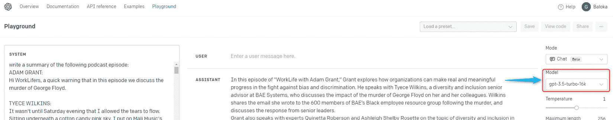
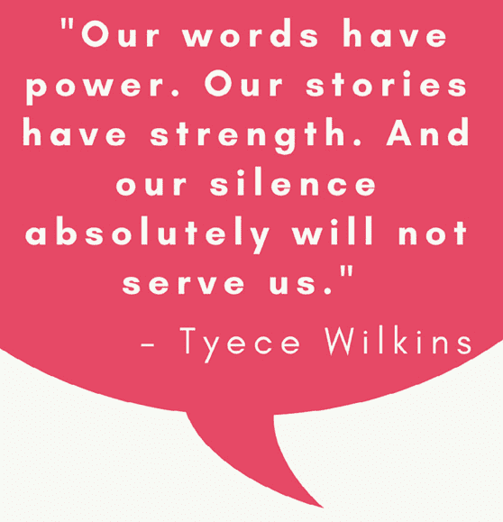

# 第三章：使用 ChatGPT 和其他实用示例创建和推广播客

生成式 AI 可以帮助播客制作者根据嘉宾的背景、兴趣和专业知识领域生成吸引人的访谈问题，无论是名人还是不太知名的人。它还可以总结播客转录本，以高效地创建推广材料。

在工作面试中，AI 可以建议与职位要求和候选人档案相一致的相关技术、情境和行为问题。它还可以提供样本回答，帮助候选人练习并做好准备。

AI 的主要优势之一是它能够通过分析上下文、数据和先前交互快速生成大量智能问题。然而，在实时对话中选择最战略性的问题并制定有效的后续问题仍需要人类专业知识。

使用 AI 进行问题准备提供了一致性和大规模个性化，并为播客制作者、访谈者、顾问、销售人员和其他需要战略提问的角色节省了准备时间。

本章将涵盖以下主题：

+   为名人嘉宾制作播客问题

+   为日常嘉宾准备播客问题

+   识别播客的主题、想法和潜在嘉宾

+   使用 AI 推广播客

+   确定有洞察力的访谈问题

+   使用 AI 生成的回应来磨练访谈技巧

+   使用 AI 为客户参与生成战略性问题

# 为名人嘉宾制作播客问题

在本节中，我们将探讨如何使用 AI 为包含名人的播客集制作有趣的访谈问题。我们将看到 AI 如何使这个过程更容易，并帮助引导更有意义的对话。

假设你想为你的播客识别一些潜在候选人。你可能不需要 ChatGPT 或类似工具来做这件事，但为了这个例子，你可以要求一个潜在采访人的名单。

提示：

```py
List 10 popular contemporary business authors and name their most popular books. Let me know if they are alive.
```

回应：

```py
1\. Erik Brynjolfsson - "The Second Machine Age: Work, Progress, and Prosperity in a Time of Brilliant Technologies" (Alive)
2\. Adam Grant - "Give and Take: Why Helping Others Drives Our Success" (Alive)
3\. Sheryl Sandberg - "Lean In: Women, Work, and the Will to Lead" (Alive)
4\. Daniel Kahneman - "Thinking, Fast and Slow" (Alive)
5\. Patrick Lencioni - "The Five Dysfunctions of a Team: A Leadership Fable" (Alive)
6\. Yuval Noah Harari - "Homo Deus: A Brief History of Tomorrow" (Alive)
7\. Chris Anderson - "The Long Tail: Why the Future of Business Is Selling Less of More" (Alive)
8\. Tom Peters - "In Search of Excellence: Lessons from America's Best-Run Companies" (Alive)
9\. Eric Ries - "The Lean Startup: How Today's Entrepreneurs Use Continuous Innovation to Create Radically Successful Businesses" (Alive)
10\. Nassim Nicholas Taleb - "The Black Swan: The Impact of the Highly Improbable" (Alive)
```

太棒了——不知何故，你设法为你的播客请到了埃里克·里斯。让我们来想一些你可以问他的问题。

这是那个问题的提示。

提示：

```py
Give me 10 really interesting questions I can ask Eric Ries about entrepreneurship and startups?
```

以下是回应。

回应：

```py
1\. In your experience, what unique qualities or circumstances differentiate startups that succeed in the long run from those that fail or fade away?
2\. How do you think the rise of global platforms and networks, such as crowdfunding and social media, is shaping the future of entrepreneurship and the way startups approach product development and market entry?
3\. The idea of a "minimum viable product" has become a popular concept in the startup world. Can you discuss the potential pitfalls of focusing too heavily on MVPs and share some strategies for striking a balance between speed and product quality?
4\. As the startup ecosystem becomes more crowded and competitive, what are your thoughts on "co-opetition" or collaboration between startups, even if they are in the same industry or share overlapping goals?
5\. What are the factors that contribute to a healthy and thriving entrepreneurial ecosystem, and how can emerging startup hubs learn from established centers like Silicon Valley?
6\. In the age of digital disruption, what are your thoughts on the importance of "soft skills" or emotional intelligence in entrepreneurship, particularly for founders looking to scale their businesses and lead their teams effectively?
7\. How do you envision the role of governments and regulatory bodies in supporting and encouraging entrepreneurship and innovation, while still maintaining a level playing field and addressing potentially negative societal consequences of disruptive technologies?
8\. What are your thoughts on the "serial entrepreneur" phenomenon and the impact of having multiple startups on an individual's personal and professional growth? Are there commonalities among successful serial entrepreneurs?
9\. In the context of the Lean Startup methodology, can you discuss the importance of having a clear and adaptable exit strategy for founders, whether through acquisitions, mergers, or going public?
10\. Given the rapid pace of change in the business world, how can founders cultivate resilience in their startups and ensure their teams remain agile, adaptable, and prepared for future challenges or unexpected disruptions?
These thought-provoking questions will enable you to engage Eric Ries in a fascinating conversation about entrepreneurship and startups, exploring various aspects of the journey from ideation to sustainable growth, as well as the evolving challenges and opportunities faced by founders today.
```

我认为这些问题中的一些相当不错，但如果您认为需要更多想法，您总是可以要求 LLM 提供 10 个或 20 个更多的问题，然后您可以选择您认为更合适的问题。

此外，你可以将这些问题的其中一些作为起点。然后，你可以根据答案提出后续问题。

为了使事情更有趣，你可能还想包括一些更独特的问题。

要做到这一点，这里是提示。

提示：

```py
What are 10 unique questions that I may ask  Eric Ries that have not been asked before. In particular i'm interested in questions about entrepreneurship and business
```

以下是回应。

回应：

```py
1\. How do you think the acceleration of space exploration and the growth of space-related industries will influence entrepreneurship, and what opportunities might arise for startups in this sector?
2\. In the hyper-competitive world of startups, how can entrepreneurs maintain a sense of purpose and avoid losing sight of their mission amidst constant pivots and changes in strategy?
3\. With advancements in neurotechnology and brain-computer interfaces, how can entrepreneurs be prepared for the ethical challenges and opportunities arising at the intersection of technology and cognitive functioning?
4\. As the sharing economy continues to grow, do you foresee any unique niches or business models that have been overlooked or underutilized by entrepreneurs so far?
5\. With the increasing societal focus on income inequality and social justice, what role do you see entrepreneurs playing in addressing these issues through their businesses or products?
6\. In the current trend of short-form content and ever-shrinking attention spans, how can entrepreneurs successfully engage and convey their complex ideas or offerings to an increasingly segmented audience?
7\. How do you envision the future of official currencies, digital assets, and cryptocurrencies impacting entrepreneurship and startup financing, particularly given the fluctuating regulatory landscape?
8\. With the growing movement toward sustainable and responsible consumerism, do you have any advice for entrepreneurs looking to transparently integrate sustainability and ethical practices into their business model without undermining their profitability or competitiveness?
9\. As the world moves toward a more connected and technologically driven global economy, how can entrepreneurs generate value by leveraging existing infrastructure, such as smart cities or the Internet of Things, in their business ideas?
10\. Given the increase in remote work and distributed teams, how can entrepreneurs effectively manage and nurture company culture across geographical and cultural boundaries, particularly in the context of the Lean Startup methodology?
```

为了增加多样性，你可能想问一些个人问题。

这是提示。

提示：

```py
Give me 10 more personal questions to ask Eric
```

以下是回应。

回应：

```py
1\. As a thought leader and author who has traveled the world extensively, are there any unique experiences or interactions you've had that have significantly influenced your perspective on entrepreneurship and life?
2\. How has fatherhood impacted your outlook on entrepreneurship, and are there any specific lessons from your own experiences that you hope to pass on to your children?
3\. Are there any non-business-related topics or causes that you are particularly passionate about and feel compelled to advocate for or contribute to?
4\. How do you maintain a sense of personal well-being and balance, given your high-profile career and the expectations that come with it? What activities or practices do you rely on to recharge and stay centered?
5\. Looking back at your education and early career, were there any defining moments or turning points that led you to develop the Lean Startup methodology?
6\. What was the biggest personal challenge or obstacle you faced while establishing yourself as an entrepreneur, author, and thought leader? How did you overcome it, and what did you learn from that experience?
7\. Can you share a story from your life outside of work that has had a lasting impact on your decision-making process or the way you approach challenges within your professional endeavors?
8\. Throughout your journey, have you had any unexpected mentors or role models who have influenced your personal growth and shaped your understanding of leadership, entrepreneurship, or life in general?
9\. What are some personal goals, dreams, or milestones that you would still like to achieve, either within your career or in other aspects of your life?
10\. How would you describe your personal leadership style as an entrepreneur, and how has it evolved over the years as you gained more experience and faced various challenges?
These personal questions offer insight into Eric Ries's experiences, values, and growth, revealing the individual behind his professional accomplishments and providing listeners with an opportunity to connect with him on a deeper level.
```

如您所见，ChatGPT 在这些情况下非常有用。它几乎可以在没有任何时间的情况下帮助您为播客访谈做好准备。

需要注意的是，ChatGPT 的截止日期是 2022 年 1 月。这意味着 ChatGPT 只了解到那个日期之前的信息，因此可能遗漏一些重要信息。然而，在 2023 年 11 月 6 日，OpenAI 发布了新的 ChatGPT 版本，GPT-3.5 和 GPT-4 Turbo，它们的截止日期是 2023 年 4 月。他们还提到，GPT-4 将很快更新到接近当前日期。

然而，在大多数情况下，你的被采访者并不是一个名人、知名作家等等。因此，在下一节中，我们将探讨如何为这些情况获取潜在的问题。

# 准备与普通嘉宾的播客问题

假设你制作一档关于独立创业者的播客，并且想要采访一位成功的创业者。以下是一个可以帮助你在采访过程中获得一些问题灵感的提示示例。在这种情况下，你应该提供一些关于你的播客和被采访者简短的背景介绍。

这里是相应的提示。

提示：

```py
I have a podcast named "The Solopreneur's Symphony". I interview successful solopreneurs about how they are building a one-person operation.
I'm gonna interview Sarah Thompson. Here is a short bio of her:
Sarah Thompson is a successful solopreneur and business coach, specializing in helping aspiring and existing solopreneurs achieve their goals and unlock their full potential. With over a decade of experience running her own successful online business, Sarah has gained a wealth of knowledge and insights that she passionately shares with others.
As a solopreneur herself, Sarah understands the unique challenges and opportunities that arise from building and managing a business on your own. She empathizes with the struggles of wearing multiple hats, maintaining work-life balance, and staying motivated in the face of uncertainty.
In addition to her hands-on experience, Sarah's background in psychology and her deep passion for personal development provide her with a unique perspective on solopreneurship. She firmly believes that success in business starts from within, and that cultivating a growth mindset and strong self-belief are crucial elements for solopreneurs to thrive.
What she values:
Encouraging others to prioritize giving and helping over receiving.
Cherishing family time, particularly when we venture into new territories, delve into diverse cultures, and grow collectively.
Having a passion for creating, experimenting with varying components, and concocting a unique concept or solution.
Fostering a sense of inclusion and providing a space that individuals can refer to as their own home.
Valuing cross-cultural distinctions that encourage diverse viewpoints.
Feeling accomplished when I can positively impact someone's life.
Indulging in outdoor activities, whether it's engaging in a soccer game, embarking on a hike, having a day out skiing, or going for a walk while appreciating the natural flora.
Give me 10 interesting questions to ask her for my podcast?
```

这里是回应。

回应：

```py
1\. Can you share with us your journey of becoming a successful solopreneur and how you managed to keep your balance during the process?
2\. In your coaching, you encourage others to prioritize giving and helping over receiving. What prompted you to adopt this philosophy, and how has it impacted your business approach?
3\. Family time seems to play a significant role in your life. How do you manage to maintain a healthy work-life balance while running a solo business?
4\. Can you please share with us an instance where your passion for creating led to a unique solution or concept in your business?
5\. Your bio mentions your dedication to fostering a sense of inclusion. How does this reflect in your business model and your relationship with your clients?
6\. As a solopreneur who values diversity, how do you ensure that you're open to and accommodating different viewpoints?
7\. You mentioned that you feel accomplished when you can positively impact someone's life. Can you share with us a memorable instance where you felt this sense of accomplishment?
8\. What is the role of outdoor activities in your life and how do you think they positively impact your productivity or creativity as a solopreneur?
9\. Tell us how your background in psychology plays a part in dealing with the challenges and benefits of being a solopreneur?
10\. Can you share some practical steps or advice you often give to people who are reluctant to dive into solopreneurship due to fear of uncertainty or failure?
```

这是一个好的起点，但也许你想讨论某些事情，比如个人品牌和这对于任何独立创业者的成功是多么重要。

这里是相应的提示。

提示：

```py
Give me a couple of questions related to how personal branding affects the success of solopreneurs
```

这里是回应。

回应：

```py
1\. As a successful solopreneur, how important do you believe personal branding is in the landscape of solopreneurship, and how has your own personal brand contributed to your success?
2.. Do you believe there's a potential risk for solopreneurs in blurring the lines between personal and professional branding? How do you maintain a balance?
3\. Personal branding seems to be a powerful tool for standing out from the competition. How do you ensure your personal brand reflects your unique value proposition to your clients?
4\. For solopreneurs who are just starting, what would be your advice on establishing a strong and credible personal brand?
```

如果你想在采访中更关注某些方面，你可以重复同样的过程。这只是一个开始，以使采访顺利进行。根据被采访者的回答，你应该自己决定后续问题，也许可以基于 ChatGPT 提供的建议。

注意，一个人越是不为人知，模型在关于他们的事实上的幻想风险就越高。因此，在创建采访问题之前，请确保验证他们的背景信息。

让我们回顾一下。假设你想要确定播客的主题、想法和潜在嘉宾。在下一节中，我们将介绍如何使用 ChatGPT 来帮助完成这些任务。

# 确定播客的主题、想法和潜在嘉宾

在这个案例中，我们将尝试获取主题和想法，并确定播客的潜在嘉宾。

因此，我们将播客及其受众的一些信息输入到 ChatGPT 中，以提供一些背景。

这里是提示。

提示：

```py
I have a podcast named "The Solopreneur's Symphony" - a highly engaging and thought-provoking podcast designed specifically for the aspiring solopreneurs, the independent masterminds, and the driven self-starters of the world. In our weekly interviews we delve deep into the world of solopreneurship as we explore the ins and outs of transforming an idea into a successful and thriving business.
"The Solopreneur's Symphony" brings together inspiring stories, valuable insights, and actionable advice from successful solopreneurs who have discovered the secrets to building a business empire all on their own. With guest appearances from experts across various industries, this podcast promises an eclectic mix of thought leadership, innovation, and creativity.
The audience for "The Solopreneur's Symphony" is a diverse and dynamic group of individuals who share a common interest in solopreneurship – the process of running a business entirely on their own. They may be at various stages in their entrepreneurial journey – from those just starting to flesh out an idea or in the midst of laying the groundwork for their dream business, to seasoned solopreneurs looking for new insights and growth opportunities.
The podcast attracts individuals from a wide range of backgrounds, industries, and skill sets, reflecting the vast landscape of solopreneurship. They possess a strong entrepreneurial spirit and a burning desire for personal and professional growth, understanding that success in solopreneurship requires ongoing education and self-improvement.
Listeners of "The Solopreneur's Symphony" come to the podcast seeking inspiration, motivation, and practical advice to overcome the unique challenges that running a one-person business presents.
What are 10 highly valuable podcast topics and ideas that I can have for the show?
```

这里是回应。

回应：

```py
1\. Building a successful business from scratch: Share insightful tips and steps to take to create a thriving solopreneur venture, including how to validate ideas, create a business plan, and set achievable goals.
2\. Finding your niche: Discuss the importance of identifying and understanding your target market, carving out a unique niche, and positioning yourself as an expert in your field.
3\. Essential marketing strategies for solopreneurs: Explore various marketing channels and techniques tailored for solopreneurs, including social media, email marketing, content marketing, and search engine optimization.
4\. Cultivating a powerful personal brand: Share how to create and maintain a strong personal brand that effectively communicates your values, offerings, and differentiators to potential clients and customers.
5\. Productivity and time management hacks: Offer practical advice on maximizing productivity, setting priorities, and managing your time and energy effectively as a solopreneur.
6\. Balancing work and life as a solopreneur: Discuss strategies to maintain a healthy balance between personal and professional commitments, avoid burnout, and sustain your mental and physical well-being.
7\. Building and maintaining a professional network: Share the benefits of networking and building strong relationships with clients, collaborators, mentors, and fellow solopreneurs.
8\. Overcoming common solopreneur challenges: Discuss common obstacles and pitfalls associated with solopreneurship, and how to navigate them, such as dealing with isolation, securing funding, and handling rejections.
9\. Solopreneur Success Stories: Share detailed interviews with successful solopreneurs who have successfully built their businesses from the ground up, highlighting their challenges, triumphs, and lessons learned.
10\. Optimize your digital presence: Discuss the importance of having a strong online presence, including your website, social media profiles, and the role of online reputation and authority-building.
```

现在我们有一些主题，我们可能需要为每个主题找到嘉宾。一如既往，如果你需要更多想法，你可以要求 10 个或 20 个更多主题。记住，你应该只选择那些你认为最适合你播客的。

这里是相应的提示。

提示：

```py
Give me some potential guests who may support each particular idea or topic
```

这里是回应。

回应：

```py
1\. Building a successful business from scratch: *Guest - Tim Ferriss*, author of The 4-Hour Workweek, and successful entrepreneur
2\. Finding your niche: *Guest - Pat Flynn*, creator of Smart Passive Income, and an expert in niche market identification
3\. Essential marketing strategies for solopreneurs: *Guest - Gary Vaynerchuk*, entrepreneur and digital marketing expert, founder of VaynerMedia
4\. Cultivating a powerful personal brand: *Guest - Chris Ducker*, serial entrepreneur, personal branding expert, and creator of Youpreneur
5\. Productivity and time management hacks: *Guest - Laura Vanderkam*, author of several time management and productivity books, including 168 Hours and Off the Clock
6\. Balancing work and life as a solopreneur: *Guest - Marie Forleo*, entrepreneur and author of Everything Is Figureoutable, and creator of the Marie Forleo B-School
7\. Building and maintaining a professional network: *Guest - Jordan Harbinger*, host of The Jordan Harbinger Show, interviewing high-achievers and experts in various fields and an expert in networking
8\. Overcoming common solopreneur challenges: *Guest - John Lee Dumas*, successful entrepreneur, founder, and host of the Entrepreneurs On Fire podcast, featuring interviews with entrepreneurs facing various challenges.
9\. Solopreneur Success Stories: *Guest - Ramit Sethi*, personal finance expert, entrepreneur, and best-selling author of I Will Teach You to Be Rich, with a unique journey into solopreneurship.
10\. Optimize your digital presence: *Guest - Neil Patel*, digital marketing expert, co-founder of NP Digital and Crazy Egg, and creator of marketing tools like Ubersuggest.
```

一旦你确定了主题，想出了新的想法，并为播客挑选了令人兴奋的嘉宾，是时候让世界知道这件事了。在接下来的章节中，我们将探讨如何使用 AI 创建有价值的推广材料，以吸引播客应得的关注。

# 使用 AI 推广播客

在推广播客之前制作播客是很常见的。因此，我们可以使用 ChatGPT 从播客中提取信息来推广它。

首先，你需要将播客中的音频转录成文本。你可以使用其他生成式 AI 工具来完成：

+   Descript 工具允许你上传音频并自动生成文本。你可以在这里找到它：[`www.descript.com/`](https://www.descript.com/).

+   使用 ChatGPT Plus 并激活*ChatGPT 语音转文本*插件，该插件可在 ChatGPT Plus 应用商店中找到。此插件允许你将音频文件上传到 ChatGPT，然后它将音频文件转录成文本。转录可能不是完美的，但对于大多数目的来说通常足够准确。

+   此外，许多工具提供 API 来进行转录。在这种情况下，你需要编写一个简单的程序来调用 API，发送音频文件，并返回转录的文本。

    其中一些最好的如下：

    +   OpenAI Whisper: [`openai.com/research/whisper`](https://openai.com/research/whisper)

    +   Deepgram: [`deepgram.com/`](https://deepgram.com/)

一旦你转录了播客，你可以让 ChatGPT 为其撰写摘要。

## 撰写播客节目摘要

在这个例子中，我们将使用 Adam Grant 的*WorkLife*播客的*如何在工作中打破偏见*一期的转录。

来源：[`www.ted.com/podcasts/worklife/how-to-bust-bias-at-work-transcript`](https://www.ted.com/podcasts/worklife/how-to-bust-bias-at-work-transcript).

转录的文本比 GPT-4 可用的 8,000 个标记还要长（我在 OpenAI 游乐场上使用的是 GPT-4）。因此，我需要切换到 gpt-3.5-turbo-16k 模型：



图 3.1：通过 OpenAI 游乐场切换模型

下面是总结的提示。

提示：

```py
Write a summary of the following podcast episode:
ADAM GRANT:
Hi WorkLifers, a quick warning that in this episode we discuss the murder of George Floyd.
TYECE WILKINS:
It wasn't until Saturday evening that I allowed the tears to flow. Sitting underneath a cotton candy pink sky. I put on Mali Music's Gonna be all right.
And try to let the music soothe me.
ADAM GRANT:
Tyece Wilkins is a diversity and inclusion senior advisor at BAE Systems, the aerospace and defense company. Following the murder of George Floyd in May 2020, Tyece painstakingly wrote and sent this email to the 600 members of BAE's Black employee resource group, which she led at the time.
…
```

下面是响应。

响应：

```py
In this episode of "WorkLife with Adam Grant," Grant explores how organizations can make real and meaningful progress in the fight against bias and discrimination. He speaks with Tyece Wilkins, a diversity and inclusion senior advisor at BAE Systems, who discusses the impact of the murder of George Floyd on her and her colleagues. Wilkins shares the email she wrote to the 600 members of BAE's Black employee resource group following the murder, and discusses the response from senior leaders.
Grant also speaks with experts Quinetta Roberson and Ashleigh Shelby Rosette on the topic of diversity and inclusion in the workplace. Roberson emphasizes the importance of dedicating resources and creating formal roles to manage diversity within organizations. Rosette discusses her research on the expectations of leaders, revealing that people subconsciously hold a white standard for leadership and judge leaders accordingly. She underscores the importance of consistent support and mentorship for underrepresented employees.
Grant concludes the episode by highlighting the necessity of changing organizational structures, habits, and cultures to combat systemic bias and discrimination. He emphasizes the importance of ongoing initiatives, such as bias training and town hall events, to maintain momentum and keep diversity and inclusion at the forefront of an organization's values.
```

它读起来不错，但也许你想要更有趣的内容，这样网站上的读者就更愿意点击播放。因此，让我们添加一个提示来改进它。

下面是一个更精细的提示。

提示：

```py
Write a summary once again, but make it more persuasive so people reading it on the TED website will be more interested in clicking play to listen to the episode.
```

下面是响应。

响应：

```py
Get ready for a jaw-dropping episode of "WorkLife with Adam Grant" that will challenge everything you thought you knew about bias in the workplace. Grant delves into the murder of George Floyd and the subsequent email that Tyece Wilkins, a diversity and inclusion senior advisor at BAE Systems, wrote to her colleagues. This raw, vulnerable email sparked a powerful transformation at her company, illuminating how organizations can truly combat bias and discrimination.
Discover why traditional bias training falls short and how BAE Systems has defied the norm with its groundbreaking approach. Through behavior-focused programs and accountability measures, BAE has seen a remarkable increase in hiring diverse talent and developing inclusive leaders.
Grant uncovers the science behind breaking biased habits and replacing them with new, healthier ones. You'll be mesmerized as he shares studies on habit change and its impact on increasing representation and reducing discrimination.
As the episode progresses, Grant delves into the importance of structural and cultural changes within organizations. He speaks with Quinetta Roberson, who emphasizes the need for diversity and inclusion to be core responsibilities rather than side gigs. Together with Ashleigh Shelby Rosette, they shed light on the white standard of leadership and the profound implications it has on underrepresented individuals.
Prepare to be captivated by the unique stories of individuals who have experienced bias in the workplace and their courageous efforts to create inclusive environments. From virtual town halls to mentoring programs, you'll hear how BAE Systems is leading the way in sustained, meaningful change.
But this episode isn't just about highlighting the successes. Grant addresses the challenges that organizations face in supporting underrepresented employees and the potential pitfalls of delegating diversity work to them without proper recognition or resources.
Get energized by the strategies and insights shared by Roberson and Rosette as they offer a roadmap for creating lasting change. Discover how to allocate work equitably, challenge the white standard of leadership, and support and mentor individuals from diverse backgrounds.
As this thought-provoking episode comes to a close, Grant reminds us that fighting bias requires a marathon-like commitment. It's about embedding diversity and inclusion into the very fabric of an organization, pushing past comfort zones, and staying the course through criticism.
If you're ready to challenge the status quo and embark on a journey of transformation within your organization, don't miss this powerful episode of "WorkLife with Adam Grant." It's time to rewrite the norms and create workplaces where diversity and inclusion are not just buzzwords, but lived experiences. Click play to step into a world of possibility and change.
```

这当然更有趣，但似乎太长了。我们可以让 LLM（大型语言模型）将其缩短。

下面是它的提示。

提示：

```py
Make it half as long
```

下面是响应。

响应：

```py
In this mind-blowing episode of "WorkLife with Adam Grant," prepare to question everything you thought you knew about bias in the workplace. Join Grant as he delves into the transformative impact of an email written by Tyece Wilkins, a diversity and inclusion senior advisor at BAE Systems, following the murder of George Floyd.
Discover why traditional bias training falls short, and how BAE Systems has revolutionized the approach with behavior-focused programs and accountability measures. The astounding results include increased hiring of diverse talent and the development of inclusive leaders.
Uncover the science behind breaking biased habits and hear captivating stories of individuals who have experienced workplace bias firsthand. Gain insights from experts Quinetta Roberson and Ashleigh Shelby Rosette as they outline strategies for creating lasting change.
This episode challenges the white standard of leadership and guides organizations on the path to equity and inclusion. Learn how to allocate work equitably, provide meaningful support and mentorship, and overcome the challenges that arise along the way.
If you're ready to ignite transformation within your organization, don't miss this powerful episode of "WorkLife with Adam Grant." Click play to embark on a journey of possibility, change, and creating workplaces where diversity and inclusion are not just buzzwords but lived experiences.
```

注意

如你所见，由于 GPT-3.5 Turbo（和 GPT-4）保持上下文（短期记忆），你不需要指定需要缩短一半的内容。

这好多了。你可以通过请求进一步的改进来继续迭代。这可以是一个很好的起点，你可以也应该做一些编辑来让它变得更好。

一旦你有了想要包含在播客网站中的摘要，你可能想要创建一些内容发布到社交媒体上以推广该期节目。

## 为社交媒体推广制作引人入胜的引言

除了集锦摘要之外，社交媒体引言可以是一种有影响力的推广播客内容并激发兴趣的方式。生成式 AI 可以分析播客转录本，并识别出值得在 Twitter 和 Facebook 等平台上突出的难忘片段。

这里是提示。

提示：

```py
Write 5 highly engaging quotes from this episode to post on social media
```

这里是回答。

回复：

```py
1\. "Our words have power. Our stories have strength. And our silence absolutely will not serve us." - Tyece Wilkins
2\. "Changing biases requires ongoing practice and repetition, like breaking a bad habit. It's a constant, intentional process." - Adam Grant
3\. "Support looks like endorsing, sponsoring, and mentoring those that are different from you. It's about making connections and changing the networks around you." - Ashleigh Shelby Rosette
4\. "To fight bias, organizations must allocate work equitably, challenge the white standard of leadership, and stay committed even in the face of criticism." - Adam Grant
5\. "It's time to rewrite the norms and create workplaces where diversity and inclusion are not just buzzwords, but lived experiences. Are you ready to challenge the status quo?" - Adam Grant
```

我认为它们都很好。你可以将每个想法都放在 Canva 上，配上漂亮的背景图片，然后你就会看到类似于*图 3.2*中所示的内容：



图 3.2：使用引言之一的 Canva 图片

由于你可能希望有更多内容来推广你的播客集锦，你可以要求 LLM 创建制作短视频的想法。

## 构思播客精彩片段

在 TikTok 和 YouTube Shorts 等平台上，短视频内容代表了播客推广的一个重大机会。生成式 AI 可以快速开发吸引人的视频想法，将播客集锦提炼成适合这些垂直视频平台的可食用、引人注目的剪辑。

让我们来看看提示。

提示：

```py
Come up with 3 ideas for 3 highly engaging short-form videos for an audience that watches them on TikTok, Instagram, or YouTube Shorts
```

这里是回答。

回复：

```py
Video 1 (TikTok/Instagram/YouTube Shorts):
Title: "Breaking Bias in 60 Seconds"
Description: In this quick, eye-opening video, learn the science of breaking biased habits and fostering inclusion in just 60 seconds. #InclusivityMatters #BreakTheBias #DiversityRevolution
Video 2 (TikTok/Instagram/YouTube Shorts):
Title: "Powerful Stories of Overcoming Workplace Bias"
Description: Discover the powerful stories of individuals who have faced workplace bias head-on and triumphed. Hear their inspiring journeys in this short video that will make you think differently. #BiasNoMore #EmpoweredVoices #InclusionChampions
Video 3 (TikTok/Instagram/YouTube Shorts):
Title: "Creating Lasting Change: Transforming Organizations"
Description: Are you ready to be part of the change? Watch this captivating video to learn how organizations are transforming their structures, cultures, and habits to foster diversity and inclusion. Let's create a better future together! #MakeChangeHappen #DiversityWins #InclusiveOrgs
```

如你所见，从转录本开始，你可以创建大量内容，无论是为了推广播客集锦，还是为了重新利用内容来增强或推广你的品牌。

我们可以继续让大型语言模型（LLM）撰写关于播客集锦中讨论的概念的博客文章。

## 将播客重新用于可分享的博客内容

播客包含大量可以转化为书面内容（如博客文章）的见解和想法。生成式 AI 使得将音频对话高效转化为吸引更广泛读者的文章成为可能。

对于博客，你应该定义长度和受众。

这里是提示。

提示：

```py
Write a blog post around the themes and ideas presented in this episode. Make it 1000 words in length and specific to  Professionals and Leaders, Diversity and Inclusion Advocates, Individuals Interested in Social Justice or Anyone Seeking Personal Growth and Self-Reflection
```

这里是回答。

回复：

```py
Title: How to Bust Bias at Work: A Roadmap to Inclusion and Equality
Introduction
In the thought-provoking podcast episode, "How to Bust Bias at Work," host Adam Grant explores the transformative journey towards creating inclusive workplaces and combating bias. This blog post delves into the key themes and ideas discussed in the episode, offering practical insights and strategies for professionals and leaders, diversity and inclusion advocates, individuals interested in social justice, and those seeking personal growth and self-reflection.
Professionals and Leaders: Driving Change from Within
For professionals and leaders, the episode emphasizes the importance of taking an active role in driving change within their organizations. It highlights the need to go beyond traditional bias training and instead focus on behavior change and accountability. By creating personal action plans, leaders can actively work towards building diverse teams, becoming more inclusive leaders, and fostering a culture of belonging. The episode encourages professionals and leaders to challenge their own biases, engage in courageous conversations, and actively seek out diverse perspectives to create lasting change.
Diversity and Inclusion Advocates: Amplifying Voices, Empowering Change
Diversity and inclusion advocates play a crucial role in amplifying marginalized voices and empowering change. The episode underscores the power of personal stories and the importance of creating safe spaces for open dialogue. Advocates are encouraged to share their own experiences and listen to the stories of others, fostering empathy and understanding. By challenging the status quo, advocating for inclusive policies and practices, and actively working towards dismantling biases, advocates can drive meaningful change within their organizations and communities.
Individuals Interested in Social Justice: A Call to Action
For individuals interested in social justice, the episode serves as a call to action. It highlights the systemic biases that exist within society and emphasizes the need for collective responsibility in addressing them. Listeners are encouraged to examine their own biases, question societal norms, and actively work towards creating a more equitable and inclusive world. The episode provides insights into the importance of allyship, intergroup interaction, and ongoing education in fostering social justice and equality.
Anyone Seeking Personal Growth and Self-Reflection: A Path to Transformation
The episode offers a path to personal growth and self-reflection for individuals seeking to challenge their own biases and foster inclusivity. Listeners are encouraged to engage in introspection, examine their own assumptions and behaviors, and actively work towards personal transformation. By embracing vulnerability, practicing empathy, and committing to ongoing learning, individuals can contribute to creating a more inclusive and equitable society.
Conclusion
The podcast episode "How to Bust Bias at Work" serves as a powerful resource for professionals, leaders, diversity advocates, social justice enthusiasts, and individuals seeking personal growth. It provides practical strategies, thought-provoking insights, and inspiring stories that can guide us on the path towards creating inclusive workplaces and fostering equality.
By challenging our biases, holding ourselves accountable, and actively working towards behavior change, we can drive meaningful transformation within our organizations. It is through courageous conversations, amplifying marginalized voices, and advocating for inclusive policies that we can create lasting change.
The journey towards equality requires collective responsibility and a commitment to ongoing learning and growth. It is a call to action for individuals to examine their own biases, question societal norms, and actively work towards creating a more equitable and inclusive world.
Let us embrace the lessons from this episode and embark on a journey of self-reflection, empathy, and action. Together, we can bust bias at work and create environments where everyone feels valued, respected, and included.
```

如果不是你预期的结果？没问题 - 重新编写提示，向系统说明你想要的内容，并逐步进行微调。再次强调，关键是实验。

在下一节中，我们将探讨如何使用 ChatGPT 或类似的应用程序来准备求职面试（针对面试官和求职者）以及如何准备回答（求职者）。

播客和求职面试在问题准备方面可能看起来是两种非常不同的用例，但它们有一些基本最佳实践是共通的。进行背景研究、个性化问题，并根据回答制定战略性的后续问题有助于确保在任何场合都能进行富有成效的讨论。

# 确定有洞察力的面试问题

在大多数公司中，不同职业级别的专业人士都要求定期面试求职者。准备面试问题是通常是一项令人沮丧的任务，需要人们花费大量时间思考要问的明智问题。

ChatGPT 可以帮助。在提示中，你应该包括你自己的简短个人简介（面试官）以及描述被采访者的档案。

这里是提示。

提示：

```py
You are a Senior Manager, Community Marketing at Samsung. You are a Communications and Marketing professional with more than 15 years of project management experience, both in-house and agency, developing and executing programs to increase brand exposure; drive positive media coverage and customer relations; establish successful influencer campaigns and paid media programs; enhance client relations and employee engagement.
You have been tasked with interviewing recent graduates in communication for a position as social media managers.
What 10 questions would you ask a candidate?
```

这里是回复。

回复：

```py
1\. Can you tell us about your experience managing social media accounts, either for personal use or for any organizations you have been involved in?
2\. Which social media platforms do you have experience with, and which do you consider yourself to be most proficient in?
3\. How do you keep up with the latest trends and updates on various social media platforms?
4\. Can you provide examples of any successful social media campaigns or content you have created or managed in the past?
5\. How would you handle a situation where you receive negative feedback or comments on our brand's social media accounts?
6\. How do you measure the success of a social media campaign or post? Which metrics do you consider most important?
7\. What strategies would you use to increase our brand's social media following and engagement?
8\. Can you give an example of a time when you had to manage a social media crisis, and how did you handle it?
9\. How do you stay organized and manage your time when handling multiple social media accounts and tasks simultaneously?
10\. How do you approach content creation for different social media platforms? Are there specific strategies or tactics you employ for each platform?
```

你可以继续迭代，提出更多个性化问题。

例如，看看这个提示。

提示：

```py
Write 10 personal question that you would ask the candidate
```

这里是回复。

回复：

```py
1\. Can you tell us a bit about yourself and what inspired you to pursue a career in social media management and communications?
2\. How do you stay motivated and focused when managing multiple tasks and deadlines in your work?
3\. What aspect of social media management do you enjoy the most, and why?
4\. How do you handle stress and maintain a healthy work-life balance, especially when managing social media accounts that require constant monitoring and updating?
5\. Can you share a specific instance in which you faced a professional challenge and how you overcame it?
6\. How do you continue to develop your skills and stay up-to-date with the ever-changing world of social media and digital marketing?
7\. What do you think sets you apart from other candidates applying for this social media manager intern position?
8\. How would your peers or previous supervisors describe your work style and communication skills?
9\. Can you share a personal or professional accomplishment that you are particularly proud of?
10\. What are your long-term career goals, and how do you see this internship opportunity fitting into your overall professional development plan?
```

现在，你可以从每个类别（专业和个人）中选择你认为最合适的三个答案进行面试。你可以要求更多想法，或者根据需要调整其中的一些。

申请工作的人可以使用相同的提示来尝试识别潜在问题，并更好地准备回答它们。

# 使用 AI 生成的回复来磨练面试技巧

作为候选人，你可能希望要求 ChatGPT 生成更多潜在问题，至少在面试前能够思考这些问题。你不想在面试中被突然提问。

你还可以使用 ChatGPT 来获取如何回答问题的建议。

继续之前的对话，你可以要求 LLM 为每个问题提供三个可能的答案。

让我们看看一个示例提示。

提示：

```py
For the first set of questions, provide for each three potential good answers
```

这里是回复。

回复：

```py
Question 1: Can you tell us about your experience managing social media accounts, either for personal use or for any organizations you have been involved in?
Answer 1: In the past, I've managed the social media accounts for my university's student council, where I was responsible for creating content, engaging with followers, and promoting campus events. This experience helped me develop my skills in content creation and community management.
Answer 2: I have managed social media accounts for a local non-profit organization, focusing on increasing awareness about their cause and driving donations through engaging content and targeted campaigns. I gained valuable experience in developing social media strategies and using analytics to measure success.
Answer 3: As a freelance social media manager, I have worked with small businesses in various industries, helping them grow their online presence, increase customer engagement, and generate leads. I have developed a strong understanding of different social media platforms and have a proven track record of delivering results for my clients.
Question 2: Which social media platforms do you have experience with, and which do you consider yourself to be most proficient in?
Answer 1: I have experience with Facebook, Instagram, Twitter, LinkedIn, and Pinterest. I consider myself to be most proficient in Instagram, as I've had the most success increating visually appealing content and driving engagement through Instagram Stories and Reels.
Answer 2: I have experience with all major social media platforms, including Facebook, Instagram, Twitter, LinkedIn, TikTok, and Snapchat. I excel in creating content for Twitter, as I have a knack for crafting concise, engaging tweets that resonate with the audience and spark conversations.
Answer 3: My experience spans across Facebook, Instagram, LinkedIn, and YouTube. I am particularly skilled in LinkedIn, where I've managed to create professional content and foster meaningful connections for various brands, helping them expand their network and generate leads.
Question 3: How do you keep up with the latest trends and updates on various social media platforms?
Answer 1: I follow industry-leading blogs, podcasts, and social media news sites, such as Social Media Today and Social Media Examiner, to stay updated on the latest trends and platform updates. I also participate in online communities and forums to exchange knowledge and ideas with other social media professionals.
Answer 2: I regularly attend webinars and industry conferences to learn about the latest trends, tools, and best practices in social media marketing. Additionally, I follow influential social media marketers and thought leaders on platforms like LinkedIn and Twitter to stay informed about the latest news and updates.
Answer 3: To stay up-to-date with social media trends, I subscribe to newsletters from reputable marketing sources and follow popular social media accounts that showcase emerging trends and platform updates. I also set up Google Alerts for keywords related to social media marketing and engage with my professional network to discuss and share new developments.
Question 4: Can you provide examples of any successful social media campaigns or content you have created or managed in the past?
Answer 1: One successful campaign I managed involved partnering with local influencers to promote a small business's product launch. We saw a significant increase in sales and social media engagement as a result of the targeted influencer posts and user-generated content from the campaign.
Answer 2: I was responsible for a non-profit's social media campaign to raise awareness about their annual fundraising event. I created a series of compelling visuals and stories that highlighted the impact of the organization's work, which led to a significant increase in event attendance and donations compared to previous years.
Answer 3: I managed a social media campaign for a local restaurant, where we ran a contest encouraging customers to share photos of their meals and tag the restaurant. This campaign not only increased user-generated content but also boosted the restaurant's online visibility and resulted in a noticeable increase in foot traffic.
Question 5: How would you handle a situation where you receive negative feedback or comments on our brand's social media accounts?
Answer 1: I would first evaluate the comment to determine if it is a genuine concern or complaint. If so, I would respond promptly and professionally, addressing the issue and offering a solution or directing them to the appropriate support channel. This demonstrates that the brand values its customers and is committed to resolving their concerns.
Answer 2: If the negative comment is not a genuine concern but rather a troll or an attempt to harm the brand's reputation, I would consult with my team and decide whether it is best to remove the comment, ignore it, or address it calmly and professionally. The key is to ensure the brand's reputation remains intact and not to escalate the situation further.
Answer 3: In any case of negative feedback, I would also take the opportunity to learn from it and see if there are any improvements or changes that the brand can make based on the feedback received. This ensures that we continually adapt and cater to our audience's needs and expectations.
Question 6: How do you measure the success of a social media campaign or post? Which metrics do you consider most important?
Answer 1: I measure the success of a social media campaign by tracking key performance indicators (KPIs) such as engagement rate, reach, impressions, and click-through rate. I consider engagement rate to be the most important metric, as it indicates how well the content resonates with the target audience and encourages interaction.
Answer 2: The metrics I prioritize depend on the campaign's specific goals. For example, if the goal is to drive website traffic, I focus on click-through rate and conversions. If the goal is to increase brand awareness, I prioritize reach, impressions, and share of voice.
Answer 3: To measure the success of a social media post or campaign, I use a combination of quantitative and qualitative metrics, such as likes, comments, shares, mentions, and sentiment analysis. I believe that understanding the audience's sentiment and feedback is crucial in determining the effectiveness of a social media strategy.
Question 7: What strategies would you use to increase our brand's social media following and engagement?
Answer 1: To increase following and engagement, I would focus on creating high-quality, shareable content that resonates with the target audience, while also maintaining a consistent posting schedule. Additionally, I would engage with relevant influencers, participate in industry-related conversations, and leverage user-generated content to create a sense of community around the brand.
Answer 2: I would implement a combination of organic and paid strategies to increase the brand's social media following and engagement. This includes optimizing the brand's social media profiles, running targeted ad campaigns to reach a larger audience, and hosting contests or giveaways to encourage audience interaction and sharing.
Answer 3: To grow our brand's social media following and engagement, I would focus on understanding our target audience's preferences and tailor our content accordingly. I would also collaborate with complementary brands or influencers, utilize relevant hashtags, and actively engage with our audience by responding to comments and messages promptly.
Question 8: Can you give an example of a time when you had to manage a social media crisis, and how did you handle it?
Answer 1: When managing a social media account for a client, a negative news article about the company went viral, resulting in a surge of negative comments on our social media channels. I quickly gathered information about the situation, collaborated with the PR team, and crafted a well-thought-out response addressing the concerns raised in the article. We also made sure to engage with the audience in a transparent and empathetic manner, which helped diffuse the situation and protect the brand's reputation.
Answer 2: During a product launch for a client, a technical glitch caused a delay in the product's availability, leading to customer frustration on social media. I worked closely with the customer support and technical teams to gather accurate information about the issue and provide real-time updates to the audience. Additionally, we offered a discount code to customers affected by the delay, turning a potential crisis into a customer-centric response that improved brand perception.
Answer 3: A social media crisis occurred when an employee accidentally posted a personal and controversial opinion on the company's official account. I immediately removed the post and issued a public apology, clarifying that the views expressed were not representative of the company's values. Internally, we reviewed and reinforced our social media guidelines and processes to prevent future incidents.
Question 9: How do you stay organized and manage your time when handling multiple social media accounts and tasks simultaneously?
Answer 1: I use a combination of tools and strategies to stay organized, such as creating a content calendar, utilizing project management software, and setting priorities and deadlines for each task. By keeping track of my progress and consistently updating my to-do list, I can efficiently manage my workload and ensure that all social media accounts are updated and monitored regularly.
Answer 2: I rely on time-blocking and the Pomodoro technique to manage my time effectively. By allocating specific time slots for each task and taking short breaks, I can maintain focus and productivity while handling multiple social media accounts and tasks.
Answer 3: I use a combination of digital tools, such as social media scheduling platforms and task management apps, along with traditional methods like pen and paper to-do lists. This helps me stay organized, prioritize tasks, and allocate my time effectively across multiple social media accounts.
Question 10: How do you approach content creation for different social media platforms? Are there specific strategies or tactics you employ for each platform?
Answer 1: I tailor content to each platform based on its unique features, audience preferences, and best practices. For example, I might create visually appealing images and stories for Instagram, concise and engaging text for Twitter, and more in-depth articles or long-form videos for LinkedIn. Additionally, I keep up-to-date with each platform's algorithms and trends to maximize content visibility and engagement.
Answer 2: I consider each platform's primary purpose and audience demographics when creating content. For instance, I would focus on creating entertaining and informative videos for TikTok, professional and industry-related content for LinkedIn, and more casual, lifestyle-oriented content for Instagram. This approach ensures that content aligns with the expectations and preferences of each platform's audience.
Answer 3: My strategy for content creation involves researching and understanding the best practices for each social media platform, such as optimal post frequency, post timing, and content formats. I also pay close attention to the platform-specific analytics to identify which types of content perform best and adjust my strategy accordingly. This helps me create tailored and effective content for each platform, maximizing engagement and reach.
```

你可以对生成的其余问题重复此过程。这里的目的是不直接使用这些答案，而是让你有想法，并思考适用于你自身经验的问题。

另一个好处是，通过这个练习，你将得到关于如何改进你工作的想法。只需查看这里提供的答案。如果你是沟通者/社交媒体经理，你可能已经得到了一些关于如何改进你工作的有用提示。

# 使用 AI 生成的问题进行客户互动战略

生成式 AI 还可以在其他领域的问题准备中发挥宝贵的作用，例如销售电话和咨询合作。以下是它能如何协助的例子：

+   **销售电话问题生成**：生成式 AI 可以分析客户数据、之前的销售互动和行业趋势，为销售专业人士提出有针对性的有效问题。通过考虑客户的具体需求和痛点，生成式 AI 可以生成一系列相关的问题，帮助在发现会议中揭示有价值的信息。

+   **销售跟进问题**：在初步销售电话之后，生成式 AI 可以分析对话并生成后续问题，这些问题针对特定关注点或探索潜在解决方案。这确保销售专业人士保持积极主动的方法，并有效地继续与客户互动。

+   **咨询合作问题生成**：生成式 AI 可以通过分析客户数据、行业洞察力和项目要求，为咨询合作生成有洞察力和定制的问题。这些问题可以涵盖各种方面，如业务流程、挑战和期望结果，使顾问能够收集全面信息并提供有价值的建议。

+   **咨询后续问题**：在初步咨询活动之后，生成式 AI 可以分析讨论并生成相关的后续问题。这些问题可以帮助顾问澄清任何含糊不清之处，获取更多细节，或寻求反馈以完善他们的建议并确保客户满意。

通过利用生成式 AI 在销售电话和咨询活动中的问题生成，专业人士可以受益于大量定制和相关的查询。这不仅节省了时间，还确保了提出的问题是有战略性的、全面的，并且与客户的特定需求相一致。

生成式 AI 算法可以分析大量数据，包括行业趋势、客户偏好以及历史销售或咨询数据，以生成针对特定情境的问题。这不仅帮助销售专业人士和顾问在准备工作中，还使他们能够与客户进行更有针对性和有意义的对话。

此外，生成式 AI 可以通过考虑个别客户档案和偏好来帮助实现个性化。它可以生成针对客户独特痛点、目标和挑战的问题，显示出更深入的理解，并强调所提解决方案的价值。

在问题准备中使用生成式 AI 也提供了可扩展性和一致性。它可以生成大量相关的问题，这些问题的内容可以保存并用于后续的互动或与团队成员共享。这确保了销售团队或咨询小组始终提出正确的问题，确保了标准化方法，并防止重要问题被遗漏。

然而，需要注意的是，尽管生成式 AI 在问题准备方面可以提供极大的帮助，但在制定后续问题、适应动态对话和解读细微差别方面，人类的专家知识和判断仍然至关重要。生成式 AI 作为一项宝贵的辅助工具，提供了丰富的选项和见解，但最终决策和分析需要涉及专业人士的技能和经验。

# 摘要

在各种面试场景中，准备问题的艺术至关重要。对于播客访谈，它包括进行彻底的研究，提出引人入胜且富有洞察力的问题，无论是针对知名人士还是不太知名的人士。AI 技术通过简化准备流程并有效推广内容，进一步提升了播客体验。在求职面试中，面试官必须精心构建问题，通过技术、情境和行为调查的组合来评估候选人的职位适合度。另一方面，求职者应投入时间了解公司和角色，预测潜在问题，并精心构思突出其资格并与组织价值观相符的深思熟虑的回答。战略性的问题准备确保了引人入胜的对话、宝贵的见解、难忘的播客集以及增加获得理想职位的机会。通过不断磨练我们的问题准备技能，我们可以建立有意义的联系，吸引听众，并实现我们的职业目标。

下一章将探讨大型语言模型（LLM）的创意应用，并教你如何利用 AI 进行不同类型的创意写作。它涵盖了利用 AI 生成小说的技术，包括如何构建提示、发展故事线和角色，以及精炼内容。我们还将探讨如何通过为模型提供文学限制来使用 AI 创作原创诗歌，从押韵诗到自由诗。在整个章节中，我们将重点关注在确保原创性和真实性同时，平衡对 AI 生成文本的依赖的策略。
