# 第八章：聊天机器人的 AI

聊天机器人迅速成为数字界面的普遍组成部分，今天的用户期望他们的对话代理智能、自然且功能强大。虽然聊天机器人过去受限于脚本响应和基本的自然语言处理能力，但**大型语言模型**（**LLMs**）如 GPT-3 正在彻底改变可能实现的内容。

在本章中，我们将探讨如何通过将 LLM API 集成到我们的对话界面中，创建更丰富、更类似人类的聊天机器人体验。这些由 AI 驱动的聊天机器人可以深入理解自然语言，进行开放式对话，并完成复杂任务，所有这些都可以通过自然对话完成。

我们将首先探讨 LLMs 的高级自然语言处理能力，以及它们如何使聊天机器人能够像人类一样理解语言。这使得它们能够更准确、更具情境性地解释各种用户输入背后的意图。接下来，我们将看到 LLMs 如何生成比传统聊天机器人更自然、更对话式的响应。这种来回互动感觉更人性化，能够吸引用户进行流畅的对话。

客户支持、电子商务和开放领域聊天等用例将展示这些 AI 能力如何在现实世界的聊天机器人中体现。您将了解 LLMs 如何通过对话推动从高度个性化的互动到完成复杂工作流程的一切。我们还将深入研究两个由 LLM 驱动的聊天机器人的案例研究：一个用于产品订购，另一个用于动态测验生成。

到本章结束时，您将深刻理解如何构建下一代智能对话代理，为您的用户提供巨大价值。LLMs 解锁的灵活性和能力为聊天机器人开辟了令人兴奋的新可能性。让我们来探索它们。

本章将涵盖以下主题：

+   如何使用 GPT-4 API 和其他 LLM API 创建聊天机器人

+   使用 LLM API 构建对话界面

+   如何使用 AI 进行客户支持

+   案例研究 – 使用 AI 辅助用户订购产品的聊天机器人

+   案例研究 – 创建交互式测验/评估并将它们作为聊天机器人流程部署

# 技术要求

要完成本章内容，您需要访问 OpenAI API（GPT-3.5 Turbo 和 GPT 4）、Antropic API（Claude 和 Claude Instant）以及/或其它 API。

要获取访问 OpenAI API 的权限，请访问[`openai.com`](https://openai.com)。

要访问 Anthropic API，您需要访问[`www.anthropic.com`](https://www.anthropic.com)。

您还可以使用[`openrouter.ai/`](https://openrouter.ai/)来访问来自 OpenAI、Anthropic、Meta（LLaMA20）、Google（PaLM2 Bison）以及一些其他公司的 API。该列表会定期更新。它提供了对 OpenAI GPT 3.5/4 的访问，甚至支持在 OpenAI 本身之前就支持 GPT 4，具有 32k 的上下文窗口。

你可以在[`platform.openai.com/docs/api-reference`](https://platform.openai.com/docs/api-reference)找到 OpenAI 的 API 文档。

本章中提到的聊天机器人构建器可以在[`twnel.com`](https://twnel.com)、[`www.voiceflow.com/`](https://www.voiceflow.com/)、[`uchat.au/`](https://uchat.au/)、[`manychat.com/`](https://manychat.com/)、[`botpress.com/`](https://botpress.com/)和[`landbot.io/`](https://landbot.io/)找到。

# 如何使用 GPT-4 API 和其他 LLM API 创建聊天机器人

虽然 ChatGPT、Bard 和 Claude 游乐场都是聊天机器人，但对于最有趣的应用，你需要拥有自己的聊天机器人，这些机器人专门定制以帮助用户完成与你的业务相关的任务。

这里有一些关键原因说明为什么在利用 GPT 或 Claude API 构建聊天机器人而不是直接与 ChatGPT 或 Claude 游乐场交互具有优势：

+   **隐藏指令/提示**：使用 API 聊天机器人，你可以将所有提供给 LLM 的提示、指令、上下文等隐藏在幕后。用户只看到最终的自然响应，从而创造更流畅的体验。

+   **集成数据源**：定制的聊天机器人可以连接到外部数据库、专有知识库和其他内部数据源，以便 LLM 在生成响应时将这些数据纳入其中。这在游乐场中是不可能的。

+   **管理会话状态**：聊天机器人可以处理会话状态、上下文跟踪和后续问题，保持用户体验的一致性。游乐场将每个提示视为独立的。

+   **部署到任何地方**：聊天机器人可以部署到你的产品、网站、应用等，然后扩展到大型用户群。游乐场仅限于个人使用。

+   **工作流程自动化**：聊天机器人可以与业务逻辑和工作流程集成，不仅提供信息，还能执行诸如下订单、提交工单等操作。

+   **持续改进**：聊天机器人的行为可以根据用户反馈进行调整和改进。游乐场模型更为静态。

+   **受控访问**：聊天机器人用户可以进行身份验证，访问可以受到控制。游乐场对任何人都是免费开放的。

因此，创建一个定制的聊天机器人解决方案，让你能够充分利用 LLM 的能力，同时控制整个最终用户体验。你可以超越简单的问答互动，构建真正理解用户和工作流程的智能助手。

ChatGPT 和其他 LLM 在特定数据分析任务中可能很有用，例如情感分析、数据分类、数据清洗和模式匹配。然而，直接在游乐场界面中使用它们有一些主要限制。

例如，假设你在 Google Sheets 中有文本数据，并想分析每个条目的情感。使用 ChatGPT，你需要手动将每个条目复制粘贴到界面中，要求它分析情感，然后将响应复制回相关的单元格。这对于大型数据集来说，这非常繁琐且效率低下。

由 GPT-3.5 驱动的自定义聊天机器人消除了这种摩擦。聊天机器人可以直接连接到数据源，如 Sheets，摄取数据，迭代调用 AI 分析每个条目，保持上下文，并将结构化结果自动记录回源。这种编排自动化了繁琐的工作，并提供了可扩展的数据分析管道，这在基本的游乐场格式中是不可能的。

关键的区别在于，自定义集成自动处理数据和 AI 之间的连接和工作流程，而游乐场界面完全依赖于手动复制粘贴操作。围绕 LLM 构建自定义粘合逻辑可以解锁更强大和可扩展的技术应用。

情感分析、数据分类和数据清洗的聊天机器人工作流程都非常相似，如此处所示：

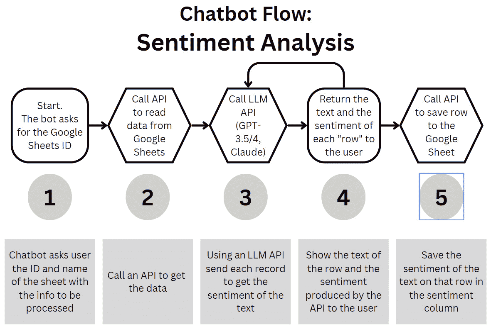

图 8.1：情感分析聊天机器人流程

让我们更仔细地看看这个聊天机器人流程：

1.  当聊天机器人启动时，它会要求用户提供 Google Sheets 的 ID。在这种情况下，我们想要进行情感分析的所有文本的存储库是一个 Google Sheets，但它也可能是 Airtable 或数据库。然后，它会要求提供 Sheet 名称。这两条信息对于 API 来说是关键的，它将从 Google Sheets 获取数据。Twnel、ManyChat、UChat 和 BotPress 等聊天机器人构建者都拥有与 Google Sheets 的原生集成，可能还有与 Airtable 的集成。其他聊天机器人构建者依赖于 Zapier、Make 等集成平台来处理集成。

1.  然后，聊天机器人获取我们想要进行情感分析的数据。

1.  一旦数据已加载，聊天机器人就可以解析每行每列的内容。因此，我们可以用提示和要分析的单元格文本来指导 LLM API。这一切都是在后台自动完成的。

1.  GPT-3.5/4、Claude 或你使用的 LLM 处理文本，并返回一个介于 0 和 1 之间的情感分数。聊天机器人接收这个响应，并根据分数阈值将其映射到“积极”、“中性”和“消极”等情感类别。

1.  一旦所有记录都已处理完毕，聊天机器人会调用另一个 API 将情感值写入 Google Sheets 中每个相应记录（行）的列中。

这种类型的实现可以在许多聊天机器人平台上完成，例如 Twnel、BotPress、VoiceFlow、ManyChat、Uchat 等。这些工具中的大多数都提供可视化构建器，因此用户只需拖放组件即可创建他们的自动化。

其中一些工具具有与 Google 表格的本地集成，允许从和向特定表格进行读写。其他则需要用户使用其他工具，如 Zapier 或 Make，来进行集成。

# 使用 LLM API 构建会话界面

在本节中，我们将创建一个聊天机器人，允许用户拍照发票并将结构化数据保存到 Google 表格中。对于这个聊天机器人，我将使用 Twnel，这是一个允许我们创建会话自动化以自动化扩展供应链流程的消息应用。然而，使用其他聊天机器人构建器，如 UChat、Botpress 等，也可以实现类似的实现。

使用 OCR 从图像中提取非结构化文本的聊天机器人工作流程如下：

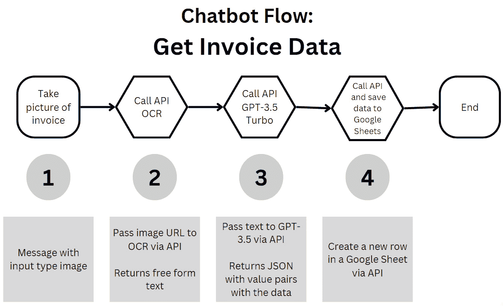

图 8.2：从图像聊天机器人流程中结构化数据

此聊天机器人使用 AI 通过**光学字符识别**（**OCR**）来结构化从图像中提取的非结构化文本。工作流程如下：

1.  用户通过消息平台将图像发送给聊天机器人。该平台需要允许用户在聊天机器人界面中上传现有图像或直接拍照。

1.  聊天机器人使用 OCR API 从图像中提取文本。此 API 以图像 URL 作为输入，并输出提取的文本。

1.  然后，聊天机器人使用 GPT-3.5 Turbo 来结构化和组织 OCR 步骤中提取的非结构化文本。

1.  最后，结构化数据被记录到 Google 表格或数据库中。

对于这个聊天机器人，消息平台需要允许用户在会话流程中发送图像。在下一节中，我们将探讨如何利用 OpenAI GPT-3.5 Turbo API 来特别处理文本结构化步骤。Twnel 提供了与 GPT-3.5 和 Google Sheets 的简单集成，使其成为构建此类 AI 驱动数据提取聊天机器人的好选择。

当调用 OpenAI GPT-3.5-Turbo API 时，你想要获取 JSON 响应并在将其返回到聊天机器人流程之前对其进行转换。

为了简化这个过程，我编写了一个 Google Apps Script 程序，它执行以下操作：

+   调用 GPT-3.5 API

+   解析 JSON 响应

+   返回修改后的 JSON 对象

这处理了您在原始 API 输出和聊天机器人之间需要的转换。

你需要获取一个 OCR API 来从图像中获取自由文本。我们提到的所有聊天机器人构建器都有连接器来读取和写入 Google 表格。如果你使用的尝试实现类似解决方案的构建器没有这样的连接器，你可以使用 Zapier、Make 或市场上任何其他集成工具。

在我们的例子中，我使用以下发票：

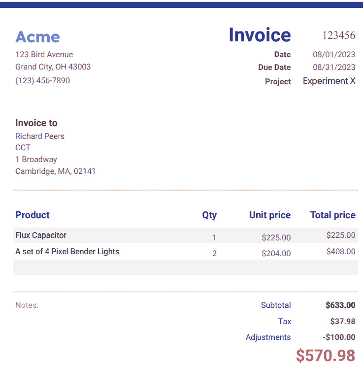

图 8.3：示例发票

在本例中，我们将扩展在*第五章*中开始的内容，在*响应中的模式匹配*部分。

我们可以从发票中提取所有信息，包括产品，或者提取所有信息，但不包括产品。对于这个例子，我们只想将以下数据保存到电子表格中：

+   发票号码

+   日期

+   付款期限

+   发票抬头名称

+   发票抬头公司

+   项目

+   小计

+   税费

+   调整

+   总计

因此，JSON 模型看起来可能像这样：

```py
json = {
      "invoiceNumber": "string",
      "date": "string",
      "dueDate": "string",
      "invoiceTo": {
         "name": "string",
         "company": "string",
      },
      "project": "string",
      "subtotal": "number",
      "tax": "number",
      "adjustments": "number",
      "total": "number"
   }
```

因此，提示符将如下所示：

```py
Use the [text] extracted from an invoice using OCR. Structure it as a JSON object with the structure shown in the [JSON model].
[text]="TEXT GENERATED BY OCR"
[JSON model] = (the model from above)
keep the same structure of the JSON as in the model, including the same keys. Output:
```

这个提示与第五章中的提示略有不同——它已经被重写，以便在调用 GPT-3.5 API 时使用。

我们可以直接调用 OpenAI API 并传递相应的参数。然而，为了提供更多灵活性，我们将使用 Google Apps Script 来调用 OpenAI API。Google Apps Script 允许我们在后端编写 JavaScript 代码，而无需创建真正的后端。然后，我们可以创建一个 webhook，通过`call_api`块从聊天机器人调用。

这种方法的优点是我们可以将其推广到任何发票或文档。Google Apps Script 代码可以读取任何文档的 JSON 模型。假设我们将 JSON 模型作为文本存储在电子表格的一个单元格中。我们可以从聊天机器人动态获取该文本，以及 OCR 生成的文本。对于需要除 JSON 模型之外更多内容的复杂情况，示例输入和输出也可以存储在同一电子表格的额外单元格中。这些示例将用于训练 LLM 以生成更好的结果。

Google Apps Script 代码可在以下位置找到：[`github.com/PacktPublishing/Unlocking-the-Secrets-of-Prompt-Engineering/tree/main`](https://github.com/PacktPublishing/Unlocking-the-Secrets-of-Prompt-Engineering/tree/main)

要运行此代码，您应该打开 Google Sheets，转到**扩展**，然后选择**Apps Script**。这将打开一个新的 Google Apps Script 项目，该项目与当前打开的 Google 电子表格相关联。接下来，将存储库中的每个文件复制到 Apps Script 项目的新文件中。就是这样。第一次尝试运行它时，您将需要使用您的 Google 账户进行身份验证。

代码定义了一组用于处理 HTTP POST 请求、处理 JSON 数据和根据输入数据向 OpenAI API 发送请求以生成文本内容的函数。注释解释了每个函数的目的以及处理请求和生成 AI 生成内容的步骤。

在这种情况下，对 GPT-3.5 API 的每次调用都是独立的，与其他调用无关。因此，我们不需要保持对话的上下文或短期记忆。这就是为什么`"messages": [{"role": "user", "content": prompt}]`数组中只有一个消息的原因。

还需要注意的是，在将 JSON 模型传递给提示之前，必须将其转换为字符串。记住，LLM 处理的是文本（字符串），因此 JSON 对象或数组可能会使它们困惑。这就是为什么我们在第 59 行有`const jsonString = JSON.stringify(json)`。

一旦使用 GPT-3.5 对文本进行了结构化，我们就可以将数据保存到 Google 表格中。

这是 Twnel 视觉聊天机器人构建器中的工作流程：

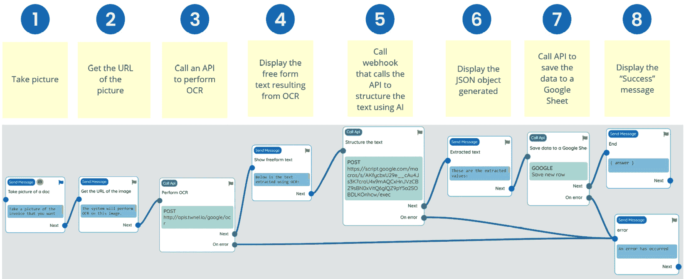

图 8.4：Twnel 视觉聊天机器人构建器中从 OCR 结构化数据

*步骤 4*和*步骤 6*是不必要的。它们被包括在这里是为了展示 OCR 生成的文本和由 GPT-3.5 生成的结构化数据的 JSON 对象。

下一个图显示了实际操作流程：

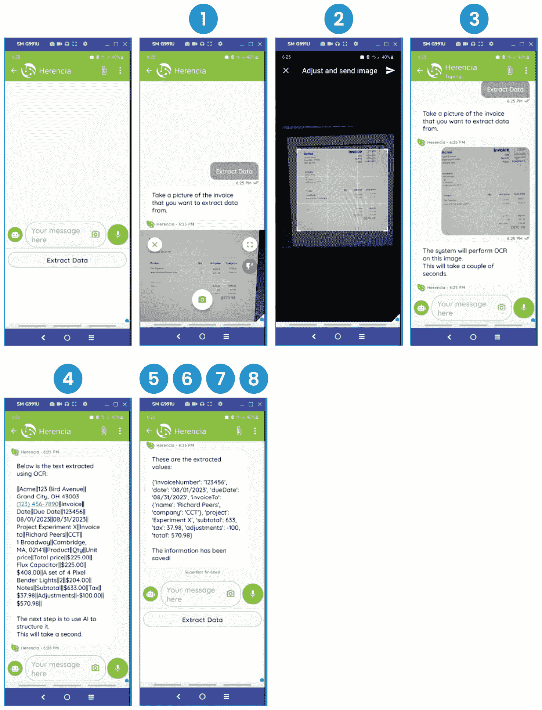

图 8.5：正在执行中的图像聊天机器人结构化数据

可以在这里看到添加了行及其信息的 Google 表格：

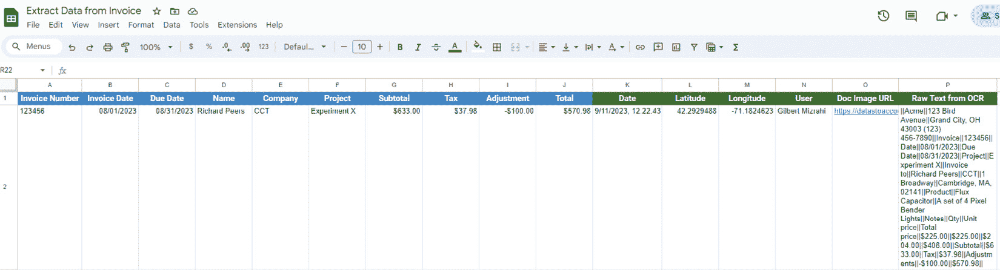

图 8.6：在 Google 表格中提取的数据

如您所见，结构化数据已保存到 Google 表格中的一行。它已扩展了额外的元数据，包括以下内容：

+   时间戳 – 拍摄图像的时间

+   位置 – 拍摄图像的位置，包括其纬度和经度

+   拍摄图像的用户名称

+   图像的 URL

+   从图像中通过 OCR 提取的原始文本

这里显示的流程应该是完整对话自动化过程的一部分。在实际用例中，提供服务的人应该做一些前期任务，例如在地点签到、记录正在执行的任务等。这正是使用生成式 AI 进行此类自动化美妙的所在——它允许我们以以前不可能的方式改进它们。 

这种聊天机器人流程有许多应用。例如，卡车司机可以保存需要报销的收据数据，如过路费、汽油、卡车维修（修补轮胎）、餐费和酒店费用等，这样既可以节省卡车司机和行政人员的大量时间。此外，它还允许司机快速获得报酬。

使用 LLM 构建对话界面在许多领域开辟了新的可能性。一个有望获得巨大收益的领域是客户服务。在下一节中，我们将专注于为客户支持需求定制生成式 AI 聊天机器人。

# 如何使用 AI 进行客户支持

由生成式 AI 驱动的聊天机器人提供了新的机会来改变客户服务互动。与过去的基于规则的聊天机器人不同，生成模型可以进行更自然、更类似人类的对话。通过适当的训练数据和提示工程，它们可以理解细微的客户问题并提供有用的答案。

这里有一些生成式 AI 聊天机器人如何用于客户服务的例子：

+   **在公司网站上回答常见 FAQ**：聊天机器人可以处理有关产品、服务、账户访问、发货时间、退货等问题。这可以转移简单的查询：

    +   生成式 AI 可以解析以许多不同方式表达的问题，并将它们与适当的存储答案相匹配。它比需要精确措辞的僵化机器人更加灵活。

    +   机器人可以通过对过去客户服务记录的培训来学习常见的提问变体，而不是手动编码规则。

    +   对于不常见的问题，机器人可以利用其语言生成能力提供有用的备用响应。

+   **提供产品支持和故障排除**：聊天机器人可以使用产品规格和手册来帮助客户诊断家电、电子产品、软件等问题，并引导他们找到解决方案：

    +   生成模型允许机器人进行流畅的诊断对话，而不是僵化的基于树的流程

    +   机器人可以吸收产品文档和手册，以加深对产品的理解并提出更好的故障排除建议

    +   机器人可以根据其训练内容，针对特定的产品型号和问题推荐定制解决方案

+   **协助账户管理**：聊天机器人可以访问公司的 CRM 系统，帮助客户检索账户详情，检查订单状态，更新信息，取消订阅等：

    +   通过与 CRM 系统集成，生成式机器人可以访问和理解客户账户数据，以解决各种请求

    +   拥有完整的账户背景信息使机器人能够进行更加个性化和情境化的对话

    +   机器人可以使用过去的账户管理记录来学习，而无需手动编写流程

+   **制作餐厅预订**：聊天机器人可以接受日期/时间、聚会规模和联系信息，并在餐厅确认预订：

    +   生成模型可以理解自然语言中提供的日期、时间、聚会规模和其他预订细节的细微差别

    +   机器人可以与餐厅的预订系统集成，而不仅仅是独立的机器人流程

    +   过去的对话可以训练机器人提出澄清问题，以顺利完成预订

+   **预订旅行**：旅行聊天机器人可以根据客户标准建议目的地，检查可用性，并预订航班、酒店和租赁汽车：

    +   机器人可以根据客户的需求和偏好建议个性化的目的地和旅行推荐

    +   生成式 AI 可以在许多旅行提供商系统中搜索，以找到最佳的航班/酒店/租赁选项

    +   机器人可以学会处理复杂的多段旅行行程，这需要多次往返交流

+   **处理保险索赔**：保险聊天机器人可以接收初步索赔信息，分配索赔编号，启动处理流程，并为客户解答问题：

    +   通过与保险系统集成，机器人拥有完整的索赔背景，可以进行更加定制的对话

    +   客户可以用日常语言而不是僵化的形式来描述索赔

    +   机器人可以询问从过去的索赔互动中学到的澄清问题，以获取所有必要的细节

+   **作为人力资源虚拟助手**：人力资源聊天机器人可以回答员工关于福利、休假申请、公司政策等问题：

    +   员工可以自然地询问各种人力资源政策、福利、工资和其它问题

    +   机器人可以利用人力资源知识库和手册更好地回答问题

    +   用户对话可以随着时间的推移不断改进机器人的能力

当使用设计良好的针对特定客户服务领域的生成式 AI 聊天机器人时，可能性是巨大的。关键是提供相关的训练数据，以便它可以处理广泛的客户需求和请求。

在接下来的两个部分中，我们将探讨几个场景，以展示生成式 AI 驱动的聊天机器人如何改善我们刚刚描述的案例的用户体验。

为了从多个文档中摄取内容，我们需要在我们的解决方案中添加一些额外的层。这将在下一章中介绍。

# 案例研究 – 使用 AI 协助用户订购产品的聊天机器人

聊天机器人已成为公司协助处理诸如下订单等任务的一种流行方式。在本节中，我们将研究一个由虚构公司 Herencia Inc.创建的聊天机器人的案例研究，该公司生产手工啤酒，帮助便利店老板在 Herencia 的网站或聊天机器人上购买不同类型的啤酒。

如果 LLM（如 GPT-4 或 Claude API）可以访问规格、价格和其他相关信息，它可以协助买家订购产品。在使用 LLM API（GPT-4 或 Claude API）时的一个限制是它可用于直接将数据加载到提示中的令牌数量。在下一章中，我们将探讨如何通过插件或管理嵌入和与向量数据库的集成来解决更复杂场景中的这个问题。

这种聊天机器人可以执行的一些任务如下：

+   **产品推荐**：一个大型语言模型（LLM）可以分析买家的需求、偏好和预算，从而建议最适合他们需求的产品

+   **产品比较**：LLM 可以帮助买家根据其功能、规格和价格比较不同的产品，使他们能够做出明智的决定

+   **定制选项**：如果公司提供可定制的产品，LLM 可以引导买家通过定制过程，确保他们选择最佳选项以满足他们的需求

+   **常见问题解答**：LLM 可以回答关于产品的常见问题，例如保修信息、退货政策和运输选项，使购买过程对买家来说更加方便

+   **价格谈判**：在可以进行价格谈判的情况下，LLM 可以根据产品的价值和市场趋势为买家提供谈判技巧和策略

+   **订单跟踪**：LLM 可以与公司的订单管理系统集成，为买家提供订单状态和预期交货时间的实时更新

+   **促销和交叉销售**：LLM 可以识别买家可能感兴趣的相关或互补产品

对于这个例子，我们不会处理嵌入或向量数据库。因此，我们将使用一个简单的场景来展示如何使用聊天机器人订购啤酒。在我们的简单案例中，假设 Herencia，我们的虚构公司，提供四种类型的啤酒：拉格、IPA、 stout 和小麦。以下是每种啤酒的包装选项和价格：

| **啤酒类型** | **12 罐装** | **24 罐装** | **12 瓶装** | **24 瓶装** |
| --- | --- | --- | --- | --- |
| 啤酒类型 | 12 罐装 | 24 罐装 | 12 瓶装 | 24 瓶装 |
| IPA | $18 | $34 | $20 | $38 |
| stout | $20 | $38 | $22 | $42 |
| 小麦 |  |  | $18 | $34 |

表 8.1：Herencia 订购啤酒产品 - 聊天机器人流程

如果我们要用 ChatGPT、Bard 或 Claude（在游乐场中）来模拟这个过程，我们需要向 LLM 提供这个产品列表，并给出明确的指令关于目标：帮助用户购买啤酒。

因此，提示将类似于以下内容。

提示：

```py
Let's say that the buyer is a convenience store owner and he wants to buy beer from a beer company named Herencia. Herencia has 4 types of beer. The products are [beers]
The buyer can purchase packs of different beers in different presentations and packaging. Assist the buyer in making an order for her store. At the end summarize the order, including the item prices and total price.
beers = the list of beers by packaging and prices – Just copy and paste the data of the table here
What do you want to order?
```

接下来是这个响应。

响应：

```py
Great! We have a variety of beer options available for your store. Here's a list of our four types of beer along with their packaging options and prices:
1\. Lager:
    - 12-pack cans: $15
    - 24-pack cans: $28
    - 12-pack bottles: $16
    - 24-pack bottles: $30
2\. IPA:
    - 12-pack cans: $18
    - 24-pack cans: $34
    - 12-pack bottles: $20
    - 24-pack bottles: $38
3\. Stout:
    - 12-pack cans: $20
    - 24-pack cans: $38
    - 12-pack bottles: $22
    - 24-pack bottles: $42
4\. Wheat:
    - 12-pack bottles: $18
    - 24-pack bottles: $34
Please let me know the quantities and packaging options you'd like to order for each type of beer.
```

接下来是这个提示。

提示：

```py
I want 3 packs of Lager, 2 packs of IPA and 6 packs of Stout
```

接下来是这个响应。

响应：

```py
Thank you for your request. To better assist you, could you please specify the packaging options (12-pack or 24-pack, cans or bottles) for each type of beer you'd like to order? Here are the options again for your reference:
1\. Lager:
    - 12-pack cans
    - 24-pack cans
    - 12-pack bottles
    - 24-pack bottles
2\. IPA:
    - 12-pack cans
    - 24-pack cans
    - 12-pack bottles
    - 24-pack bottles
3\. Stout:
    - 12-pack cans
    - 24-pack cans
    - 12-pack bottles
    - 24-pack bottles
Please provide your preferences, and I will calculate the total price for your order.
```

接下来是这个提示。

提示：

```py
3 24-pack cans of Lager, 2 12-pack bottles of IPA and 6 24-pack bottles of Stout
```

接下来是这个响应。

响应：

```py
Thank you for specifying your preferences. Here's a summary of your order:
1\. Lager:
    - 24-pack cans: 3 packs x $28 = $84
2\. IPA:
    - 12-pack bottles: 2 packs x $20 = $40
3\. Stout:
    - 24-pack bottles: 6 packs x $42 = $252
The total price for your order is $376\. Shipping costs and delivery times will be calculated based on your store's location. Please confirm if you'd like to proceed with this order or make any changes.
```

这工作得很好，但我们需要使用可以暴露给所有或至少大多数潜在客户的聊天机器人来提供这种类型的交互。否则，就没有任何意义。

当使用 LLM API 将 LLM 集成到聊天机器人中时，一个重要的事情是要记住，聊天机器人流程的开发者必须确保他们保持对话的记忆，以管理上下文。当使用 ChatGPT 或通过其游乐场使用 LLM 时，LLM 供应商为我们保持这种短期记忆。

在前面的例子中，我们看到了 GPT-3.5/4 API 有一个名为`messages`的参数，它是一个数组：

```py
"messages": [{"role": "user", "content": prompt}]
```

在这种情况下，每次我们调用 API，在用户每次响应之后，我们需要将之前的消息传递到数组中，以便 GPT-3.5/4 可以保持上下文并管理短期记忆。

流程看起来是这样的：

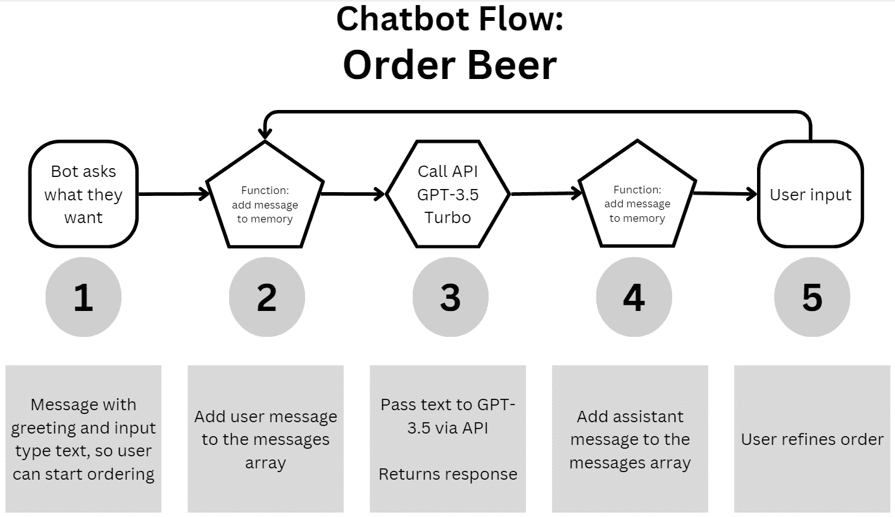

图 8.7：订购啤酒聊天机器人流程

下面是 Twnel 视觉机器人构建器中的工作流程：

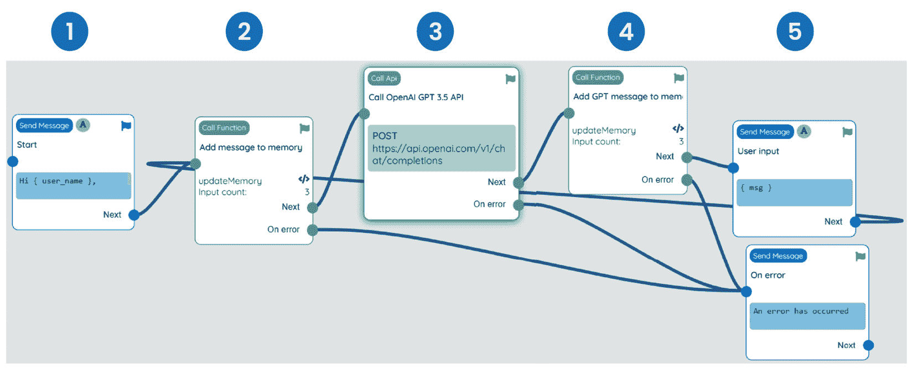

图 8.8：Twnel 视觉机器人构建器中的流程

*步骤 1*包括问候并询问用户他们想订购什么。在*步骤 2*和*步骤 4*中，调用了一个 JavaScript 函数。这个函数保留包含整个对话历史的消息数组。这个函数只是将最后一个消息对象：`{"role": "system", "content":system_ prompt}`添加到消息数组中。

在*步骤 3*中，我们直接调用 OpenAI API。*图 8.9*显示了如何设置头部：

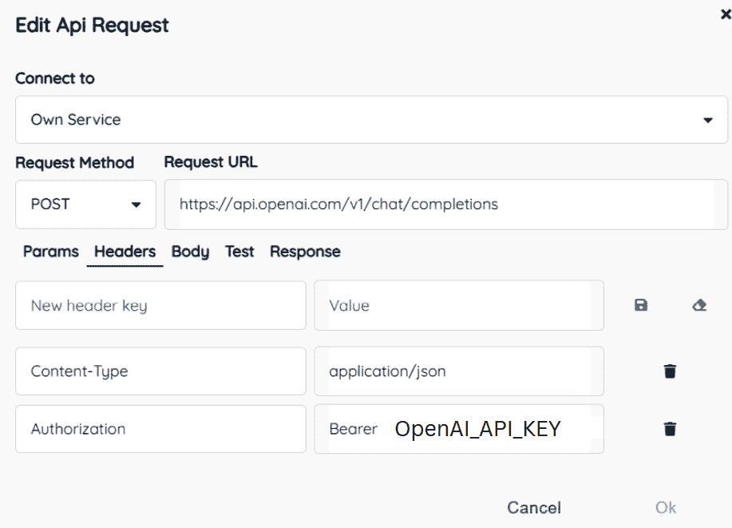

图 8.9：在 Twnel 的视觉机器人构建器中调用 API - 设置头部

*图 8.10*显示了发送到 OpenAI 聊天 API 的请求 URL 以及包含所需参数的正文——即模型和对话中的消息数组：

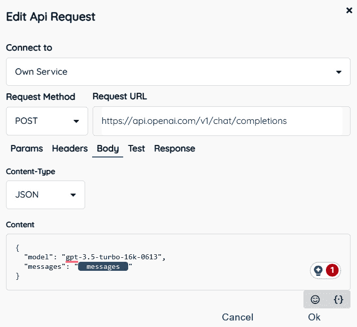

图 8.10：在 Twnel 的视觉聊天机器人构建器中的调用 API 块中请求数据

下图显示了聊天流程的实际操作：

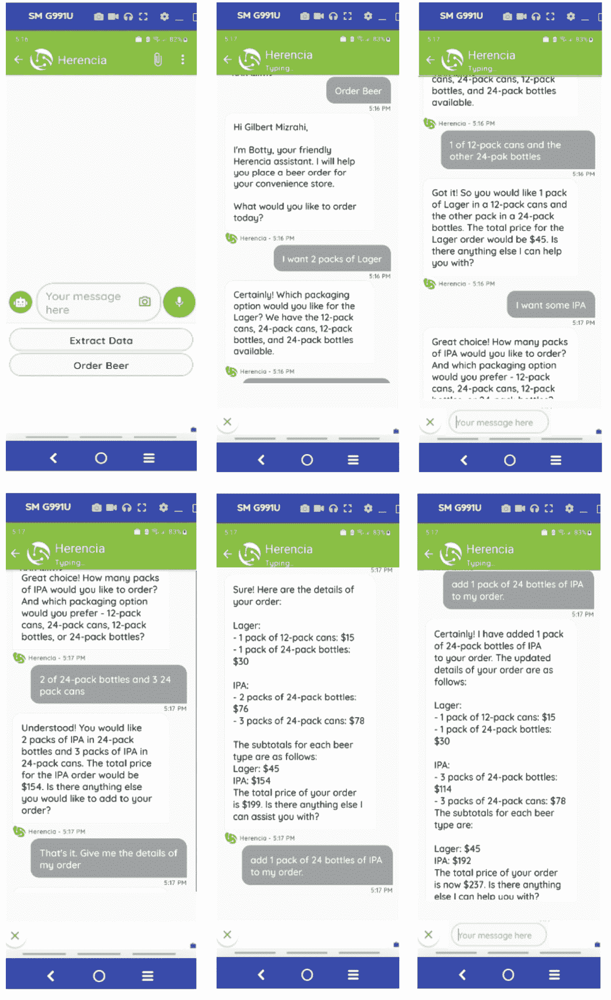

图 8.11：订购啤酒聊天机器人 – 流程实际操作

在*步骤 5*中，用户阅读响应并可以回答以细化订单。用户消息被添加到消息数组（*步骤 2*）中，流程继续循环，直到订单完成。

在任何人都可访问的聊天机器人中实施此流程使这种方法非常有用。我们可以添加更多步骤来调用与 Herencia 啤酒库存交互的 API 以检查可用性。同样，我们可以在店主付款时检查信用状况和限额。接下来，用户可以收到下单选项，并根据信用条款和余额，从聊天机器人直接支付。最后，一旦订单完成，它可以保存到订单数据库中，并生成一个跟踪链接，以便用户跟踪配送。

有了这个，你已经看到了如何让 LLM 以 JSON 格式生成结果。因此，在这种情况下，我们可以要求提示生成一个包含文本元素的 JSON，正如*图 8.11*所示，以用户熟悉的方式展示完整的（文本）响应，以及一个数组元素，包含订单上的每个项目和数量。

在聊天机器人中直接调用 LLM API（如 OpenAI）有一些限制。每个 API 请求允许的令牌数量是有限的，这限制了聊天机器人在一个流程中可以处理的产品数据量。即使令牌允许量增加，高使用率仍然会推高成本。

更好的方法涉及使用 LangChain 等工具，这些工具可以在多个请求之间链式提示并创建专门的代理。我们将在下一章探讨这一点。

转换领域，利用 LLM 的聊天机器人也可以实现更互动和自适应的测验。正如下一个案例研究所示，对话式 AI 允许定制问卷和分析自由形式的回答。

# 案例研究 – 创建交互式测验/评估并将其作为聊天机器人流程部署

聊天机器人提供了创建动态、对话式评估和测验的有趣机会。使用 LLM，聊天机器人可以被设计为引导用户通过交互式提问，理解自由形式的回答，并提供个性化反馈。

在本节中，我们将探讨一个金融咨询聊天机器人的案例研究，该聊天机器人通过风险评估问卷来衡量客户为投资目的的风险承受能力。该聊天机器人已被构建来自动化其客户入职流程的一部分。通过自然对话进行风险评估，聊天机器人可以评估客户的回答并确定其风险档案。

设计的对话流程旨在模仿人类顾问询问客户对投资风险的感受。聊天机器人可以解释非结构化答案并根据客户的回答调整问题。完成评估后，聊天机器人保存总结的风险概要，以便人类财务顾问做出适当的投资建议。

通过研究这个案例研究，展示了对话式 AI 如何通过动态提问收集关键客户数据。

使用 LLM 处理这种情况有两种可能的方式：

+   使用 LLM 为所有参与者创建相同的问题。这可以通过 ChatGPT、Bard 或其他类似工具一次性完成。然后，创建一个基于树的聊天机器人来询问用户问题，最后调用 LLM API 根据回答进行评估。

+   聊天机器人使用 LLM API 请求 AI 为每个用户动态生成问题，并在最后根据答案进行评估。

这两种方法都是有效的。

第一种方法更容易实施，因为它不是与 LLM 的对话，尽管与聊天机器人的对话本身具有互动性。LLM API 只调用一次（在请求评估时），因此不需要在每次新交互发生时重新发送之前的消息。正因为如此，它的运行成本也更低。此外，评估在用户之间更加一致。

另一方面，如果后续问题依赖于前一个问题答案的话，第二种方法可以得到更好的结果。

对于这个例子，我们将探索第二种情况。

在探索如何实现聊天机器人以协助财务顾问进行风险评估之前，让我们直接在一个 LLM 游乐场，如 ChatGPT 中模拟流程。

我们将要求 LLM 使用**互斥且完全穷尽（MECE**）框架。MECE 框架是一个在解决问题和构建信息方面常用的概念，广泛应用于管理咨询、商业分析和项目管理等领域。MECE 是一种组织和管理信息的方式，以确保清晰和全面。以下是 MECE 各部分的含义：

+   **互斥性**：这意味着你定义的类别或元素不应该重叠。换句话说，每条信息或数据应该只适合一个类别，并且不应该属于多个类别。这确保了你避免重复计数或混淆。

+   **完全穷尽性**：这意味着当你结合所有类别或元素时，它们应该覆盖整个可能性范围，没有任何缺口。不应该有遗漏或未考虑的项目。这确保了完整性，并且你已经考虑了问题或情况的所有相关方面。

当你应用 MECE 框架时，你为分析和解决问题、做决策或展示信息创建了一个清晰和有组织的结构。它帮助你将复杂问题分解为可管理的部分，并确保你没有忽略关键因素或做出重复的区分。MECE 经常用于市场细分、流程改进、项目规划和问题解决练习等任务中。

在实践中，创建 MECE 框架涉及将问题或一组信息分解为满足相互排斥和全面穷尽的标准的类别或组。这种结构化方法可以通过提供对情况的清晰和全面了解，导致更有效的决策和问题解决。

要使用聊天机器人创建一个交互式测验，你需要向 AI 助手提供一个初始提示以生成测验问题和响应选项。这个初始提示将指示 AI 以财务顾问的身份行动，并根据你的响应提出个性化的投资策略。你应该提供其他指令，如本例所示。

这是初始提示。

提示：

```py
Act as a personal financial advisor. Suggest me a personalized investment strategy based on my current financial situation, risk tolerance, objectives, preferences and so on.
In order to gather all the necessary information required for the personalization, create a personalization quiz using the MECE framework with 10 questions, each with 4 possible answers (a,b, c,d).
Ask each question and wait for the answer before asking the next question
```

下面是响应。

响应：

```py
Here is the first question:
1\. What is your investment goal?
a. Generate income
b. Grow my wealth
c. Preserve my wealth
d. A combination of the above
```

这是下一个提示。

提示：

```py
a
```

机器人会继续提问并期待答案。在接收到最后一个问题的答案后，流程将产生一个类似于这个的响应。

响应：

```py
Thank you for your response. Based on your answers, a personalized investment strategy for you could be a growth-oriented portfolio that is diversified across different asset classes, such as stocks, mutual funds, and ETFs. Since you have a moderate to high risk tolerance and are willing to take on more risk, this type of portfolio may be suitable for you.
Since you also indicated that you have limited investment experience, an actively managed mutual fund or ETF that focuses on growth stocks may be a good starting point for you. A financial advisor can help you select the right investments and monitor your portfolio on an ongoing basis.
It's important to keep in mind that investing involves risk and there is no guarantee of returns. It's important to do your own research and consult with a financial advisor before making any investment decisions.
```

在这种情况下，聊天机器人流程与上一个案例非常相似：

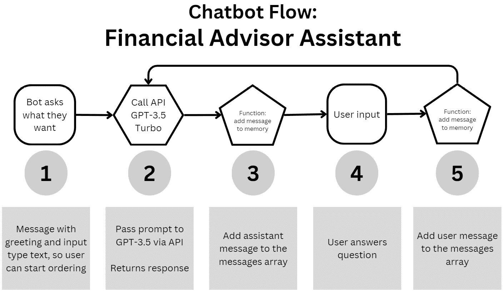

图 8.12：财务顾问助手聊天机器人流程

与上一个流程相比，唯一的区别在于在激活流程的初始消息之后，我们调用 OpenAI API，然后我们将响应添加到 `messages` 数组中。

在这种情况下，用户可以回答 `a`、`b`、`c` 或 `d`，或者选择 `text` 选项。我们可以细化聊天机器人流程，以便将答案加选项作为 JSON 对象返回，如下所示：

```py
{
  "response_type": "question",
  "question": "question text here",
  "answers": [
    {"id": "a", "label": "option 1 text"},
    {"id": "b", "label": "option 2 text"},
    {"id": "c", "label": "option 3 text"},
    {"id": "d", "label": "option 4 text"}
  ]
}
```

`answers` 参数恰好是 Twnel 接受的格式，用于在输入类型为 `checkbox` 时渲染按钮。然而，在第十个问题之后，LLM 不会在 JSON 中返回另一个问题；相反，它将返回一个文本推荐。因此，我们需要修改流程以适应这种情况，检查 LLM 的 `response_type` 是否为问题或评估。对于这个例子，我们并不关心这一点。重要的是要知道，这些对话自动化工具提供了简化用户交互的选项。

OpenAI GPT-3.5 和 GPT-4 API 有一个名为函数调用的功能。这个功能允许你向 AI 模型描述函数。然后，模型可以生成包含调用这些函数的参数的 JSON 输出。

这使得模型能够智能地选择你描述的函数的输出。

重要的是要理解，ChatCompletions 模型本身并不执行功能。相反，它生成一个 JSON 有效载荷，您可以使用它来单独调用函数。

这个主题超出了本书的范围，但可以简单地说，GPT3.5/4 API 允许您根据接收到的输出链式调用函数并重新路由它们。在本例中，我们使用它是因为我们希望在每个问题之后渲染四个选项的按钮，但在提供评估时只渲染一条消息。

在实际操作中，流程看起来是这样的：

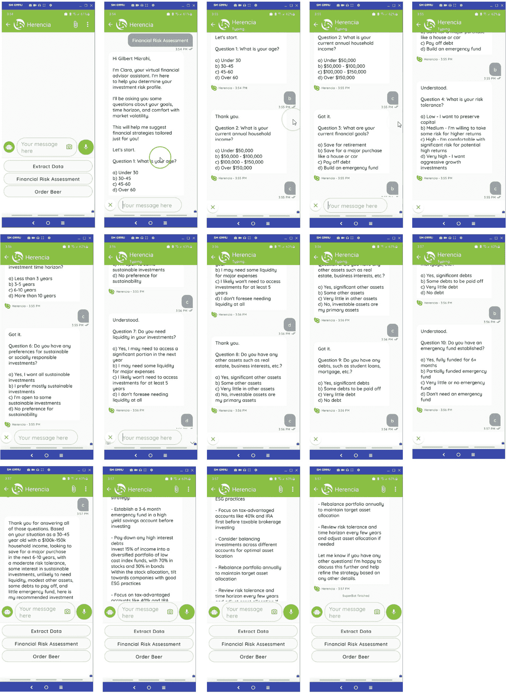

图 8.13：金融顾问助手聊天机器人流程演示

本案例研究展示了大型语言模型（LLM）如何使聊天机器人等对话人工智能代理能够动态创建交互式评估，例如金融聊天机器人进行个性化的风险测试，这使我们到达了利用人工智能进行聊天机器人对话探索的终点。

# 摘要

由 GPT-3/4 和 Claude 等大型语言模型（LLM）驱动的聊天机器人正在改变对话人工智能，并使数字体验更加自然、更接近人类。正如本章详细介绍的示例所示，这些强大的生成模型使机器人能够真正理解自然语言，与用户进行流畅的对话，并完成从商业交易到个性化评估的复杂工作流程。

解锁它们能力的关键在于精心设计的提示工程。开发者可以将关键上下文、领域知识、业务逻辑、数据源等注入提示中，以塑造机器人的行为。虽然在与游乐场互动中可以一窥其潜力，但基于 LLM API 定制的解决方案则打开了更多可能性。

这些由人工智能驱动的聊天机器人能够维持对话状态和记忆，与后端系统集成，根据用户互动优化性能，并在各个平台上无缝部署。通过自然对话自动化关键流程，它们提供了巨大的价值——无论是客户服务、电子商务、旅行预订还是其他工作流程。

虽然本章重点介绍了核心聊天机器人用例，但下一章将深入探讨 LangChain 和其他增强大型语言模型（LLM）以实现更高级对话人工智能应用的工具。我们将探讨链式提示、将文档作为嵌入体摄入、构建专用代理等。
