# 第九章：构建更智能的系统——高级 LLM 集成

LLMs，例如**GPT-4**，在能力上已经爆炸式增长。但仅仅使用它们的基本文本补全 API，只是触及了它们潜力的表面。超越孤立生成，使得 LLMs 能够推理、研究、对话并采取行动。

将 LLM 集成到我们现有的工具和工作流程中对于将这些模型从新奇转变为生产力巨头至关重要。在本章中，我们将探讨高级技术，以通过将它们连接到您的技术堆栈来提升您应用 LLMs 的方式。

本章提供了这些主题的概述。要更深入地探讨这些主题，可能需要一本或多本书来专门讲述其中的一些主题。

本章将涵盖以下主题：

+   使用 Google Sheets、Zapier 和 Make 等平台大规模自动化批量提示

+   使用 LangChain、Flowise 和 Langflow 等开发者工具构建自定义 AI 管道

+   通过链式多个 LLM，利用不同模型的专用优势

+   样本集成演练，用于竞争情报、客户数据和文档分析

+   如多模态模型和 LLM 应用插件等新兴创新

总体而言，您将了解如何通过将 LLM 与您的技术堆栈连接起来，解锁 LLMs 作为推理助手的全潜能，它们可以搜索、对话、创建并采取行动。集成赋予 LLMs 上下文和连接性，以增强实际应用，而不仅仅是独立地生成文本。

让我们从探索一个自动化大量记录提示的可行选项开始——电子表格模板和集成。

# 使用电子表格自动化批量提示

在前面的章节中，我们探讨了创建社交媒体帖子（*第二章*）和执行情感分析、数据分类和数据清洗（*第五章*）。对于这些类型的工作，通常需要处理多个记录，手动对 LLM 进行逐个案例的提示可能会很繁琐且效率低下。

虽然 ChatGPT、Bard 和 Claude 2 等工具允许使用变量，但您仍然需要复制并粘贴输入文本以通过 LLM 进行处理。然后，您必须复制模型的输出并将其粘贴到电子表格或另一个文档中。

与手动提示相比，自动化这些工作流程会更好。通过使用 Apps Script 将您的 LLM 与 Google Sheets 集成，您可以创建自定义公式，这些公式可以自动批量重新运行多个输入的提示。

例如，您可以编写一个公式，如`=AI_GPT(A2)`，它从单元格 A2 中提取文本，将其发送到 GPT-3/4 API，并在公式单元格中返回响应。

将此下拉到工作表底部将调用 API，从该行的单元格中提取输入文本。公式将直接在工作表中填充 LLM 生成的响应。

这允许你通过更新输入单元格进行大规模提示。集成公式处理将文本喂给 API 并填充输出，无需任何手动工作。Apps Script 提供粘合剂，以自动在多个案例上重新运行提示。

我已经创建了**SheetSmart**，这是一个免费的 Google Sheets 模板，包含四个自定义公式：

+   `AI_GPT`，它赋予你使用 GPT-3.5/4 输入提示并立即获得结果的能力

+   `AI_USE_EXAMPLES_GPT`，允许你选择一个值范围来*训练*模型以产生你想要的结果

+   `AI_TABLE_GPT`，根据如“列出史上最顶尖的 10 首歌曲”之类的提示创建表格

+   `AI_DALLE2`，根据你输入的提示生成图像

你可以在[`buy.sheetsmart.pro/l/AI_in_Sheets/`](https://buy.sheetsmart.pro/l/AI_in_Sheets/)下载模板。

你可以通过打开模板，转到**扩展**，然后选择**Apps Script**来访问 Apps Script 代码：

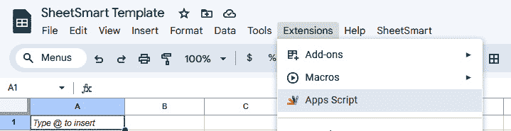

图 9.1：从 SheetSmart 模板访问 Apps Script

接下来，让我们看看前面公式的典型应用：

+   `AI_GPT`公式用于清理杂乱的数据：

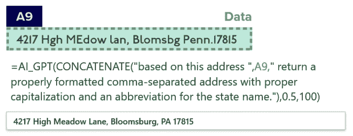

图 9.2：清理杂乱数据的示例

+   `AI_USE_EXAMPLES_GPT`公式用于使用一些示例来训练模型：

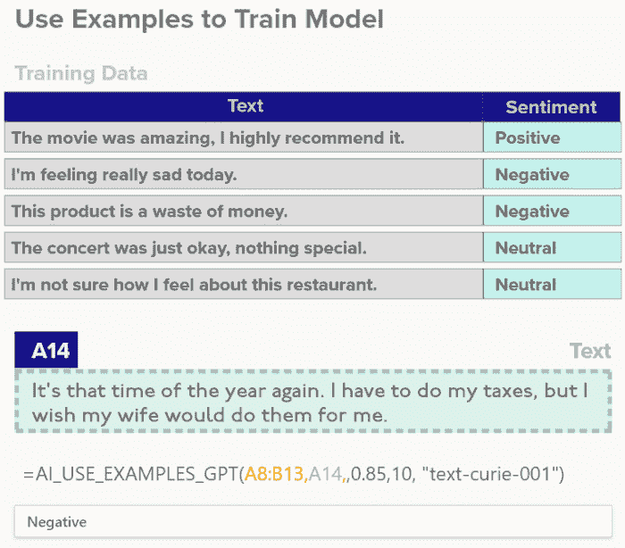

图 9.3：执行情感分析

+   `AI_GPT`公式用于创建产品描述：

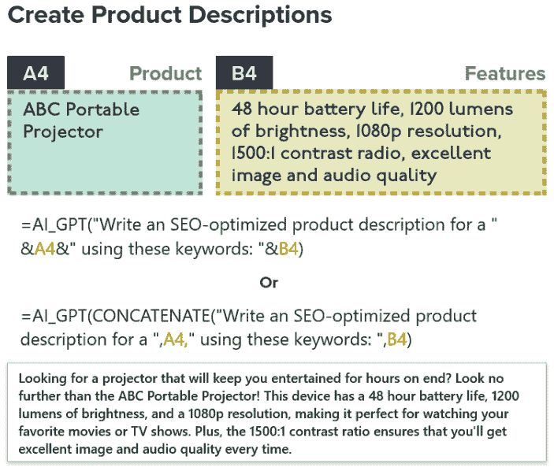

图 9.4：创建产品描述

+   `AI_TABLE_GPT`公式根据提示创建表格：

图 9.5：根据提示创建表格

通过查看这些示例，你应该对公式的应用有了更清晰的认识。

你可以在这个 Google Sheet 中查看更多示例：[`docs.google.com/spreadsheets/d/1DnHAjvV77SZg3UYGFfUVfn5gyFqZu-E02OSI0-dDBbE/edit?usp=sharing`](https://docs.google.com/spreadsheets/d/1DnHAjvV77SZg3UYGFfUVfn5gyFqZu-E02OSI0-dDBbE/edit?usp=sharing)。

微软和谷歌已经将 LLMs 如 GPT-4 集成到 Office 365 和 Google Workspace 中。尽管他们的方法与 SheetSmart 的焦点不同，但我们预计这些平台很快将提供类似的原生功能。

模板存在一个特定问题，至少在 Google Sheets 中是这样，每次你打开一个工作表或切换到另一个标签页时，所有自定义公式都会重新计算。这很麻烦，也很昂贵。所有生成的内容都需要重新制作，并且会消耗来自 OpenAI 的 token。

避免这种情况的一种方法是将结果复制并粘贴为**仅值**。通过这样做，生成的文本将不是公式的结果，而是一个文本字符串。

然而，存在更灵活的方法来将 LLMs 与电子表格集成：

+   使用 Zapier 或 Make 等平台将电子表格数据连接到 LLM API。该集成可以提供输入、捕获响应并将它们写回表格。这实现了大规模的自动化提示。

+   随着 Google 新的 Bard 扩展，Bard 可以从 Gmail、Docs、Drive、Maps 等更多地方提取相关信息以增强其响应。Bard 成为 Google 应用套件中的智能助手。

+   利用 **LangChain** 或 **Superagent** 等开发工具构建 LLMs 和数据管道之间的自定义集成。这些提供针对数据工程用例（如摘要、聊天机器人和问答）定制的 API 和框架。

最佳方法取决于您的需求和技能。虽然粘贴值锁定静态文本，但集成和扩展提供了电子表格和 LLMs 之间的动态连接。它们使应用程序之间的更复杂自动化和工作流程增强成为可能。

在下一节中，我们将通过使用 Zapier 和 Make 来扩展可能的用途。

# 使用 Zapier 和 Make 将 LLMs 集成到您的技术堆栈中

Zapier 和 Make 是集成平台服务，使连接应用程序、自动化工作流程和在不同网络服务之间共享数据变得容易。

**Zapier** 采用免费增值模式，提供预构建的集成、触发器和动作，让您无需代码即可快速构建工作流程。使用 Zapier 构建的自动化工作流程 Zaps 通过利用 Zapier 的现有连接器连接超过 2,000 个不同的应用程序。

**Make** 提供了一个企业级集成平台，用于协调复杂的流程和数据流以及构建聊天机器人。它包括 API 集成、调试流程、版本控制和访问管理的先进工具。

Zapier 和 Make 都有助于将 LLMs 集成到您的现有堆栈中。例如，使用它们为 Google Sheets 和 GPT-3.5/4 API 提供的连接器，您可以构建将电子表格数据传递给 LLM 并将输出写回的自动化。

使用这些平台的好处是加快手动流程并让 LLMs 增强您的其他工具。可能性是无限的。

Zapier 和 Make 通过 GPT-3.5/4 提供与 Google Sheets 模板相同的功能。使用 Zapier 或 Make，用户可以构建自定义前端或聊天机器人来生成提示。AI 的响应可以直接作为值而不是公式保存到表格中。这避免了昂贵的重新计算，但增加了 Zapier/Make 订阅的成本。总的来说，与仅使用 Google 模板相比，Zapier 和 Make 在提示收集和结果存储方面提供了更多的灵活性。然而，所有三种工具都赋予用户在 Sheets 工作流程中利用 LLMs 的能力。

这里有一些使用 Zapier 或 Make 将 LLMs 与其他工具集成的复杂用例：

+   **营销自动化**：

    +   **自动广告创意生成**：使用 Make 和 Stability AI 的生成式 AI 创建一个工作流程，持续生成新的广告创意。这将识别表现最佳的广告，将文案传递给 GPT-4 进行文本重写，并为 Stable Diffusion 提供提示以生成新图像。这结合了自动化和领先的 AI，以高效地生产大量高质量的新广告创意。

    +   **多语言着陆页**：使用 DeepL 进行翻译和 GPT-3.5 进行最终流畅度润色，将顶级英文着陆页和广告创意翻译成目标语言。这扩大了全球影响力。

+   **销售赋能**：

    +   **会议准备简报**：构建一个 Zap，定期总结日历条目、笔记、电子邮件等关键客户互动，并提供准备账户会议的行动项目。

    +   **提案生成**：通过让 Claude 分析他们的需求文档和过去的配置，创建针对每个客户需求的个性化、动态的产品配置和规格表提案。

    +   **演示文稿起草**：通过让 Claude 审查账户的 Salesforce 历史记录并建议要涵盖的关键点、要突出的机会和预先反驳的异议，自动生成销售会议的草案演示文稿。

+   **客户体验**：

    +   **工单文章丰富**：构建一个工作流程，从原始客户支持工单中提取信息，让 Claude 建议附加基于知识的文章，并在发送回复前为代理总结问题。

    +   **客户流失预测和优惠**：通过让大型语言模型分析 Zendesk 工单数据，主动识别高流失风险客户，并制定个性化的保留优惠和关怀套餐，从而丰富客户支持对话。

    +   **教程视频生成**：通过使用 Claude 生成定制脚本，创建针对每个客户水平和用例的动态叙述的逐步教程视频。

+   **商业智能**：

    +   **自动报告生成**：构建一个使用 Claude 或 GPT-4 分析 Salesforce 销售数据的自动报告生成工作流程，生成定制的账户绩效摘要、地区分析和预测更新。

    +   **竞争情报**：通过让 Claude 分析竞争对手的收益电话、文件、专利、网站流量、招聘、社交媒体、新闻报道等，构建定制的竞争情报简报，以生成见解。

+   **运营**：

    +   **发布说明生成**：建立一个系统，让 GPT-3.5 审查 GitHub 中的代码提交，并提供关于新功能和修复的简洁、自动化的发布说明摘要，而不是手动更新。

让我们探讨一个简单的用例来展示这些集成的工作方式。我们将创建一个 Zapier 工作流程，收集一些产品数据，并使用 GPT-3.5 生成英文和西班牙文的描述，并将它们保存到 Google 表格中。

## 创建和翻译产品描述

对于电子商务公司来说，产品内容是跨市场转化率的关键驱动因素。然而，为每个产品手动制作定制化的本地化描述非常耗时。本节概述了一个自动化工作流程，使用 Zapier 和 GPT-3.5 的力量轻松地生成高质量的多语言产品副本。

前往[`zapier.com/`](https://zapier.com/)并创建一个账户（如果您还没有的话）。然后，在仪表板上，您将找到一个界面来描述您想要执行的操作。Zapier 流程现在由 AI 驱动，因此您可以描述您想要自动化的流程，Zapier 将为您构建工作流程，如图*图 9.6*所示。

然而，这个案例很简单，所以我们将从头开始。要做到这一点，点击它所说的**从头开始创建 Zap**：

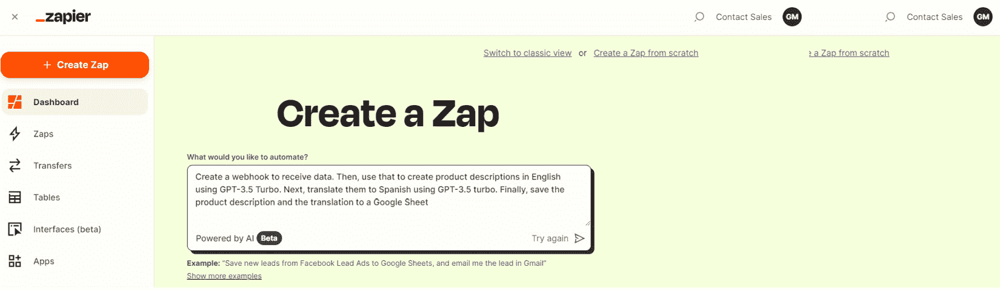

图 9.6：从头开始创建 Zap

您将得到以下输出：

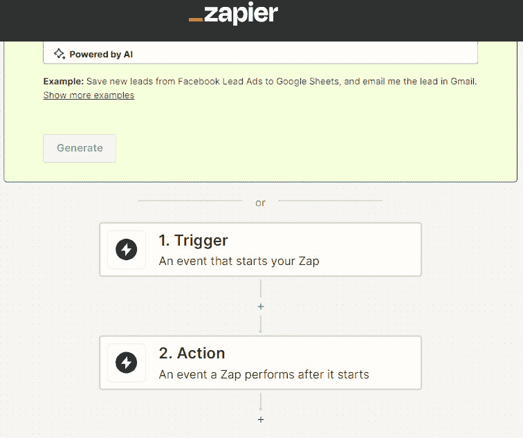

图 9.7：从头开始时的初始屏幕

通过点击触发步骤来选择触发步骤。然后，搜索`webhook`并选择**Zapier Webhooks**，如图*图 9.8*所示：

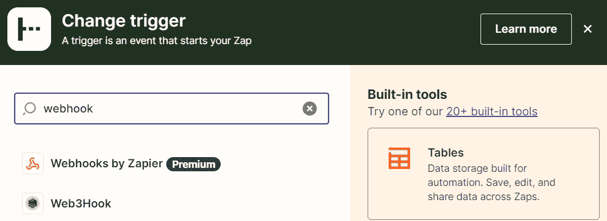

图 9.8：工作流程的 Zap

选择第一个步骤，**捕获钩子**，允许我们创建一个端点向 Zapier 发送数据。这可以用于表单或聊天机器人。在这种情况下，我们将从 Postman 发送一些数据，Postman 是一个允许我们测试 API 和 webhook 的工具。*图 9.9*显示了流程：

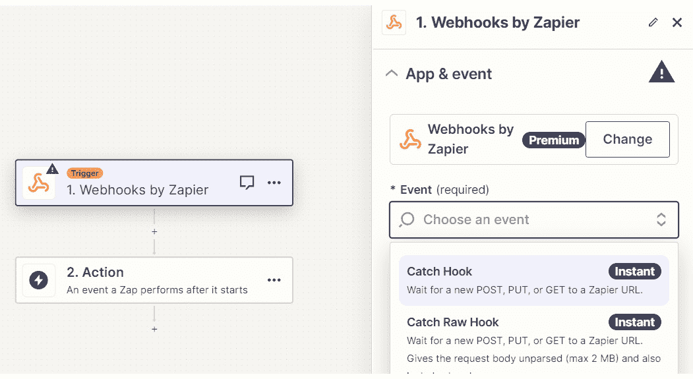

图 9.9：选择捕获钩子

然后，点击**继续**直到显示 webhook URL，如图*图 9.10*所示：

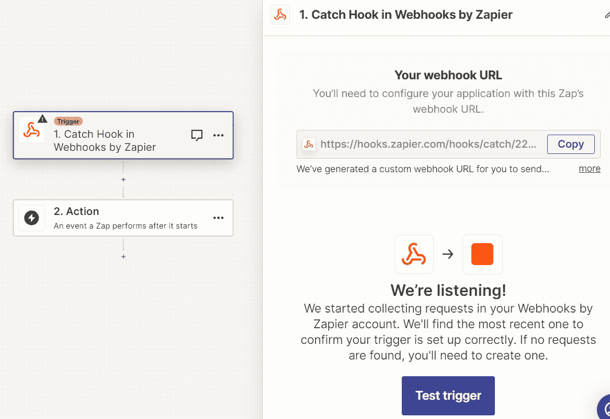

图 9.10：获取 webhook URL

您需要用一些数据测试这个 webhook URL。*图 9.10*显示了在 Postman 中对该 URL 的调用，其中包含一些产品的 JSON 有效负载：

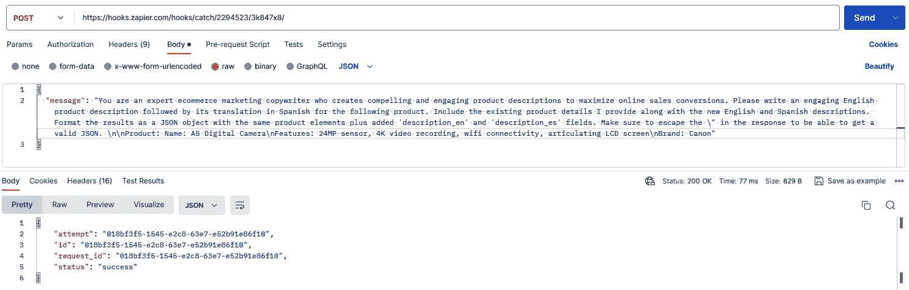

图 9.11：在 Postman 中测试 webhook

然后，在 Zapier 中点击**测试触发器**按钮（*图 9.10*）；它将获取提交的数据，如图*图 9.12*所示：

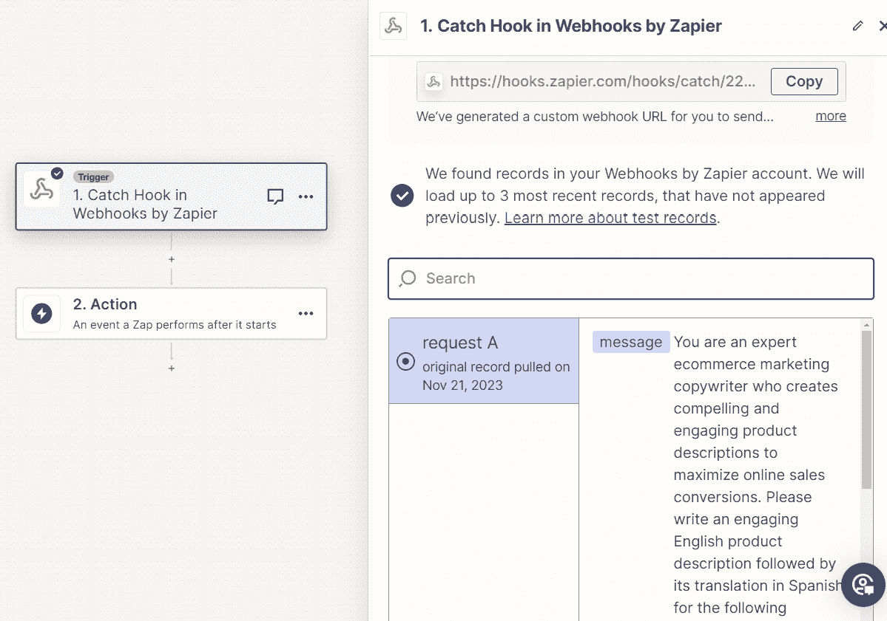

图 9.12：在 Zapier 中获取通过 webhook 发送的数据

接下来，继续到`OpenAI`，如图*图 9.13*所示：

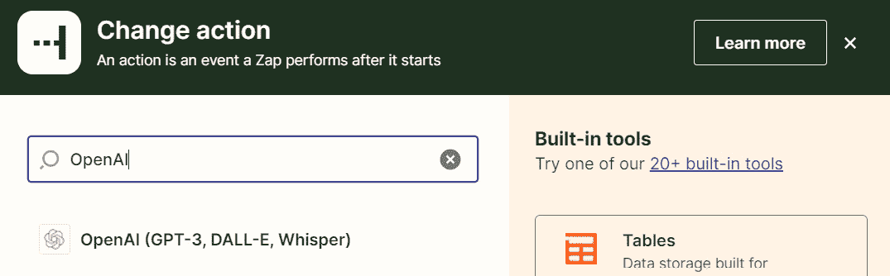

图 9.13：搜索 OpenAI

从那里，当您选择**事件**时，您必须从选项列表中选择**发送提示**。然后，点击**继续**。对于**账户**，点击**选择**（*图 9.15*）并选择**连接新账户**。您将被要求输入您的 OpenAI API 密钥和组织 ID。您可以从相应的菜单生成新的 API 密钥，您可以从 OpenAI 网站上的**设置**菜单获取您的组织 ID：

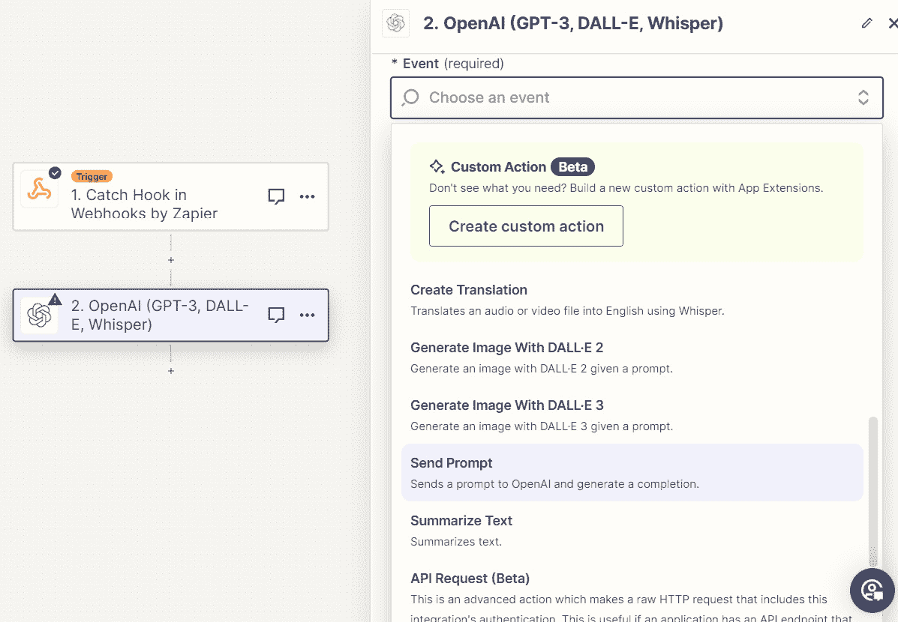

图 9.14：选择发送提示

对于 **Account**，点击 **Choose** (*图 9**.15*) 并选择 **Connect a New Account**。你将被要求输入你的 OpenAI API 密钥和组织 ID。你可以从相应的菜单生成新的 API 密钥，并且你可以从 OpenAI 网站的 **Settings** 菜单中获取你的组织 ID。

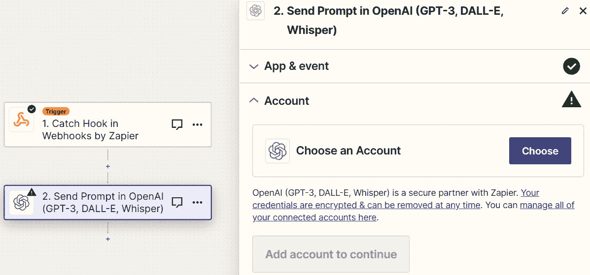

图 9.15：选择 OpenAI 账户

按照说明选择你想要的 GPT 模型。在这种情况下，GTP-3.5 Turbo 就足够好了。然后，测试该步骤。你应该看到 OpenAI 的响应。

接下来，通过点击`code`下方的加号来添加另一个步骤，并选择**JavaScript**。你需要编写一小段代码片段来将 GPT-3.5 的结果解析为 JSON 对象。虽然接收到的文本看起来像 JSON 对象，但它只是一个文本字符串。幸运的是，Zapier 提供了一个使用 AI 生成代码的选项。*图 9**.16* 展示了此选项和所需的代码：

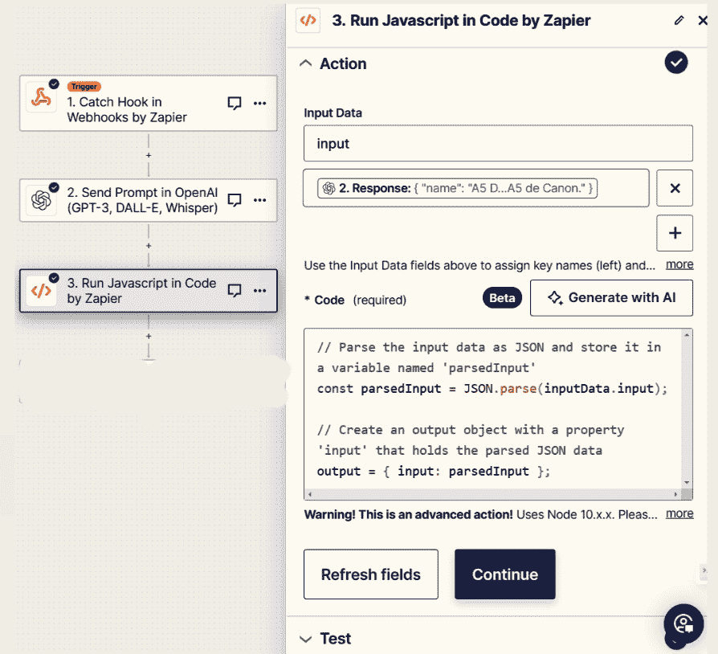

图 9.16：在 Zapier 中使用 AI 生成 JavaScript 代码

然后，点击 **Test** 来尝试代码步骤。你会得到类似于 *图 9**.17* 中所示的内容。结果是按值对很好地解析的 – **name**: **A5 Digital Camera**，**brand**: **Canon**，等等：

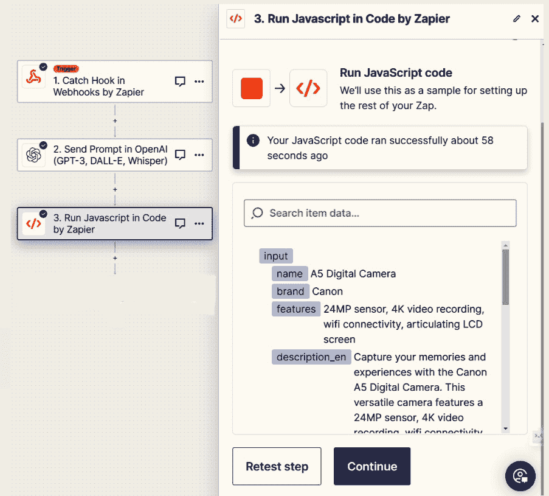

图 9.17：测试代码

现在，每个变量都已与一个键值对配对，我们可以继续到最后一步：将数据保存为 Google Sheets 中的新行。因此，点击 *Step 3* 下方的加号。搜索 `Google Sheets`。按照说明验证你的 Google Sheets 账户。接下来，选择 **Create Spreadsheet Row**。然后，选择你创建的电子表格和表来保存你的数据。你的表应该有代表要保存的变量的列。一旦你选择了你的 Google Sheet 和工作表，你应该在 **Worksheet** 字段下方看到列名，如图 *图 9**.18* 所示：

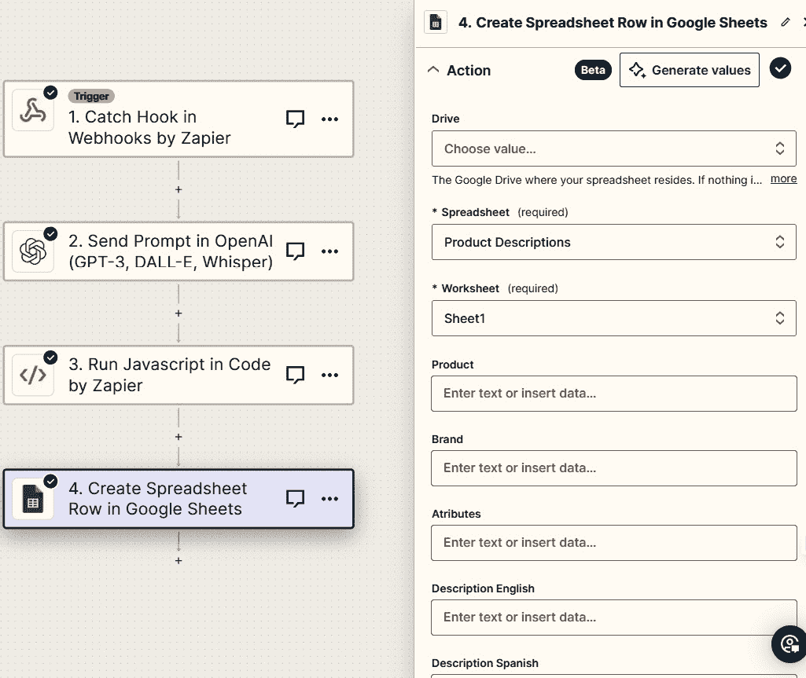

图 9.18：在 Google Sheets 中创建新行

点击每个列值的字段。我们想要获取我们在 *Step 3*（代码）中产生的值，因此我们需要选择它，然后选择代表列名的变量名称。在 *图 9**.19* 中，我们将变量名称与列产品配对。对每个列值重复此操作：

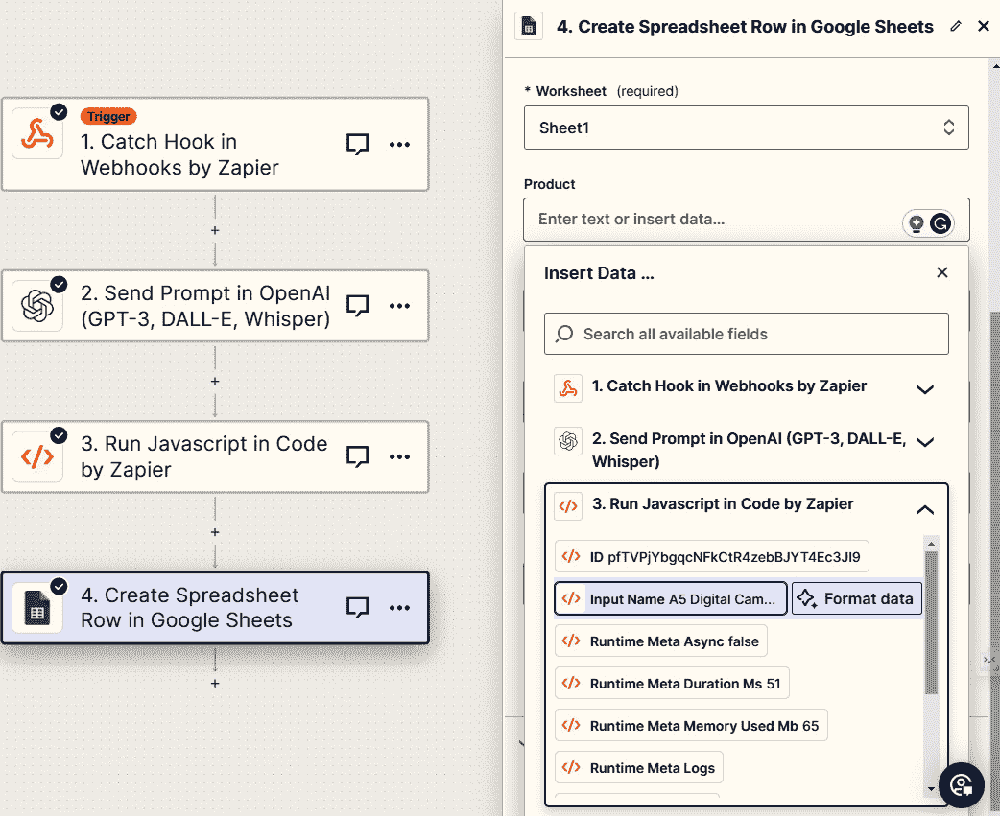

图 9.19：将值映射到每个列 – 第一部分

*图 9**.20* 展示了映射：

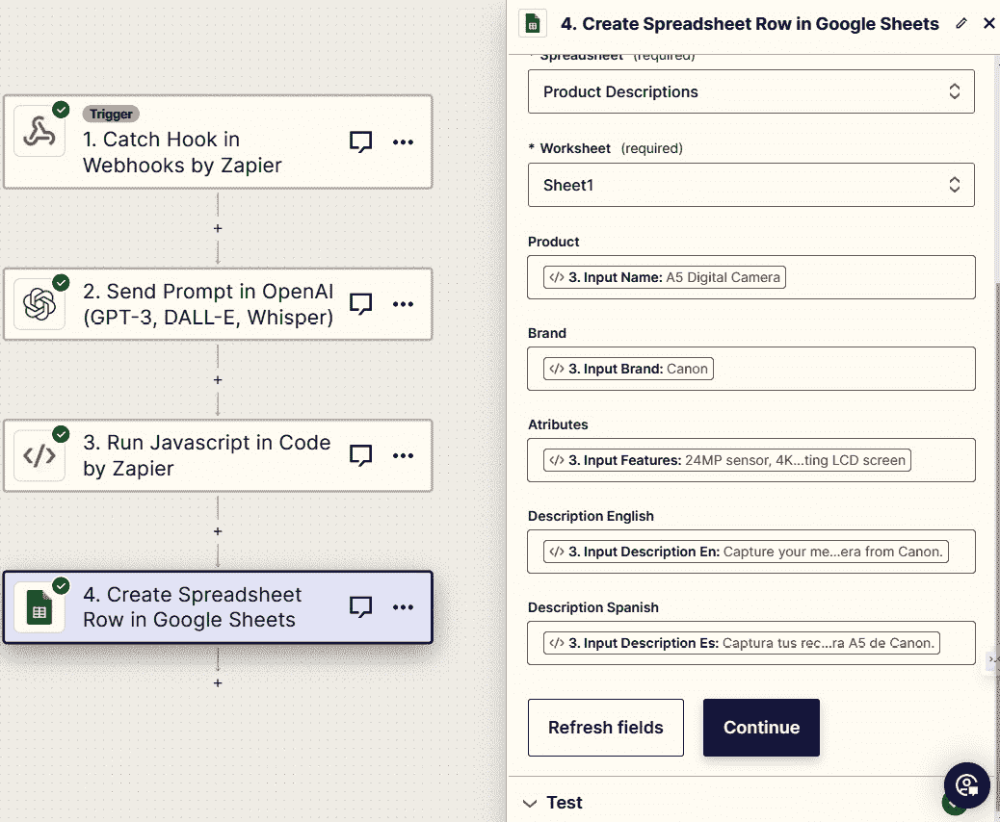

图 9.20：将值映射到每个列 – 第二部分

接下来，点击 **测试** 以检查数据是否已按预期保存到 Google Sheets。*图 9**.21* 显示了结果：

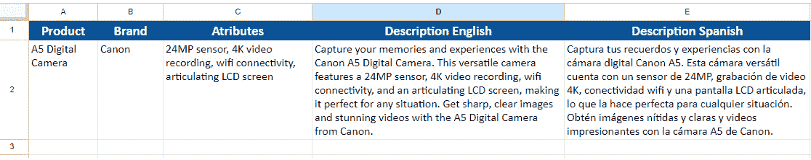

图 9.21：结果保存到 Google Sheets

最后，发布您的流程 – 当应用程序从 webhook 调用时，它将准备好接收发送的数据 – 运行提示，并向您的 Google Sheet 添加新行。

在下一节中，我们将探讨 LangChain、Langflow 和 Flowise 等工具，这些工具可以为构建针对许多不同应用的 AI 工具提供更多灵活性。

# 超越 API – 使用 LangChain 构建定制的 LLM 管道

**LangChain** 是一个开源的 Python 和 JavaScript 库，用于使用 GPT-3 等 LLMs 构建工作流程和系统。

由 Harrison Chase 创建的 LangChain 最初专注于简化与 OpenAI API 的集成。此后，它已扩展到支持其他 LLMs，包括像 Anthropic 的 Claude 这样的模型。

该库实现了 2022 年发表的 ReAct 论文中的技术。ReAct 展示了允许 LLMs 通过维护思维链上下文进行推理的提示方法。模型还可以通过利用工具（如网络搜索）来收集信息来采取行动。

这种组合，被称为 ReAct，通过逻辑思考和引入外部知识，使 LLMs 能够更有效地解决问题。LangChain 将这些技术编码为开发者友好的框架。

LangChain 支持来自各种提供商的广泛 LLMs，包括以下：

+   OpenAI 的 GPT-3

+   Anthropic 的 Claude 和 Constitutional AI

+   谷歌的 LaMDA 和 PaLM

+   Meta 的 OPT

+   百度的 ERNIE 和 PaddlePaddle

+   腾讯的 Wu Dao

+   Hugging Face 的模型，例如 BLOOM、LeoLM 和 Jurassic-1

+   AI21 Studio 的模型，例如 Jurassic-1 J1

+   Cohere 的生成式 QA 模型

+   微软的 Turing NLG 模型

LangChain 的工作流程引擎处理跨多个具有不同优势和能力的模型的路由提示和链式逻辑。这允许开发者使用最适合其需求的 LLMs 的最佳组合来编排系统，而无需供应商锁定。LangChain 还旨在为主要的新的 LLMs 提供持续支持，以便用户可以通过 LangChain 一致地集成 AI 研究的创新。

这里有一些 LangChain 可以用来利用不同 LLMs 独特功能的示例：

+   开发者可以使用 LangChain 将 GPT-4 和 Jurassic-1 连接起来，生成创意文本格式，如诗歌、代码、脚本、音乐作品、电子邮件、信件等

+   研究人员可以使用 LangChain 比较不同 LLMs 在各种**自然语言处理**（**NLP**）任务上的性能

+   一家公司可以使用 LangChain 构建一个聊天机器人，利用多个 LLMs 的优势，为用户提供更丰富、更有吸引力的回复

总体而言，LangChain 简化了将 LLM 从基本 API 使用迁移到生产就绪的 NLP 系统的过程。其工作流程增强了文本生成质量，并允许针对实际应用进行定制。

现在我们已经讨论了 LangChain 等工具的需求，让我们探索其核心组件。这些构建块为定制 AI 工作流程的开发提供了动力。

## LangChain 的构建块

LangChain 提供了一套强大的模块化组件，用于构建复杂的 NLP 系统和工作流程。这些构建块使开发者能够轻松地将 LLM 集成到现实世界的生产应用中。

现在，让我们深入探讨这些构建块：

+   **模式**

    LangChain 中的模式允许您定义工作流程中每一步的数据有效负载输入和输出的结构。您可以通过指定字段名称、数据类型和关系来为文本、图像、音频、视频和数据库格式创建模式。

    模式作为数据在 LangChain 管道中流动时如何处理的蓝图。它们确保每个组件都知道期望和返回的内容。

+   **模型**

    模型组件提供了将不同的 LLM 集成到您的工作流程中的抽象，包括 GPT-3、Claude、PaLM、Codex 和 OPT 等。您可以连接自定义训练的模型并指定参数，如引擎版本、温度、top-p 样本等。

    通过这个一致的界面，切换到替代模型变得简单。模型可以串联起来，让您能够利用不同的优势。

+   **提示**

    LangChain 提供了针对各种 NLP 任务定制的提示模板库，例如分类、摘要和问答。这些模板可以根据需要重用和定制。

    提供了工具以迭代地开发提示，分析模型如何解释它们，以及调试问题。提示可以程序化生成或手动定义。

+   **索引**

    为了在大数据集中实现高效搜索，LangChain 提供了如 Langchain 爬虫等工具，用于创建定制的关键词索引。您还可以利用为常见公共语料库预先构建的索引。

    索引允许您通过使用关键词或语义相似性快速定位相关文档或段落，为模型提供上下文。

+   **内存**

    LangChain 包括用于在工作流程步骤之间缓存中间结果、状态和临时变量的内存组件，以实现跨工作流程步骤的共享。内存可以在整个工作流程中全局作用，也可以在模块内局部作用。

    智能缓存策略通过避免冗余计算来优化成本和延迟。持久性选项允许在执行之间保留状态。

+   **链**

    构建提示和模型的链是 LangChain 开发推理和对话工作流程的核心概念。您可以构建线性链，根据条件分支，循环迭代，并将长链分解成可重用的模块化块。

+   **代理**

    LangChain 允许你将可重用的逻辑封装到模块化代理中，以实现搜索、问答、翻译和优化等功能。你必须从你的工作流程中调用这些代理以集成其功能。

    代理可以完全通过在 Python 或 JavaScript 中开发来定制。为常见需求提供预构建代理以加速开发。

此外，还有像 Langflow 和 Flowise 这样的开源无代码平台，使非技术用户能够利用 LangChain 的先进 NLP 功能来构建自然语言工作流程和应用。对于那些不是开发者的你，Flowise 和 Langflow 都是开始的好选择。在下一节中，我们将探讨这些无代码平台。

## LangChain 的无代码工具——Langflow 和 Flowise

Langflow 和 Flowise 都提供可视化工作流程构建器，用户可以拖放预构建的块来执行文本生成、分类、搜索和翻译等任务，并将它们编排成端到端管道。

直观的拖放界面消除了对编码专长的需求。用户可以从预制的模板工作流程开始，或根据特定用例自定义流程。

Langflow 和 Flowise 处理在托管基础设施上部署和托管工作流程。它们提供监控、分析、访问控制和扩展功能的连接器。

关键区别在于 Langflow 专注于 LangChain 集成，而 Flowise 有连接到 LangChain 之外服务的连接器。

Langflow 用 Python 编写，而 Flowise 用 JavaScript 编写。

最终，Langflow 和 Flowise 都为非开发者打开了 LangChain 的力量——产品经理、增长黑客、营销人员和其他领域专家可以利用 LLM 进行 NLP。

他们使得在没有工程资源的情况下，使用 LangChain 的技术库构建复杂的流程成为可能。

你可以在这里了解更多关于这些工具的信息：

+   **LangChain** **文档**: [`docs.langchain.com/docs/`](https://docs.langchain.com/docs/)

+   **Lang****f****low** **文档**: [`docs.langflow.org/`](https://docs.langflow.org/)

+   **Flowise** **文档**: [`docs.flowiseai.com/`](https://docs.flowiseai.com/)

为了展示一些可能的应用，我们将使用 Flowise 探索一些场景。

### 探索 Flowise

要查看 Flowise 的实际应用，让我们来了解一下如何安装它并构建一些示例聊天机器人：

1.  通过运行 `npm install -g flowise` 来安装 Flowise。

1.  通过运行 `npx flowise start` 来启动 Flowise。

1.  打开 `http://localhost:3000`。你应该会看到类似这样的内容：

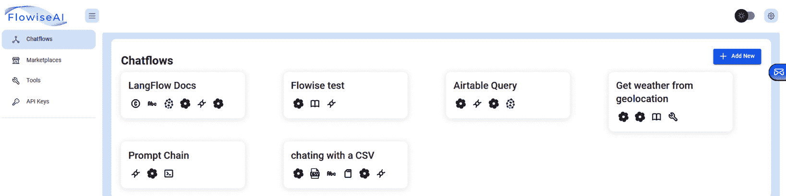

图 9.22：Flowise 界面

如果这是你第一次使用 Flowise，那么应该没有任何聊天流程。聊天流程是你开发的应用。

在 **市场** 下，你可以看到一些不同应用的模板和可使用的预制工具：

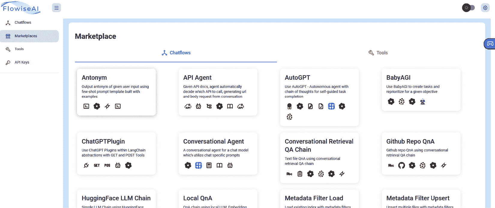

图 9.23：Flowise 聊天流程模板

您可以使用您想要或需要的工具的 API 轻松创建工具。此外，如果您使用 Zapier 或 Make 创建工作流程，并且该工作流程的入口点是**webhook**，则可以使用它来设置您自己的自定义工具。webhook 是一种自动化方式，当某些事件发生时，一个应用程序或服务可以实时向另一个应用程序或服务提供更新。这允许您构建更强大的应用程序：

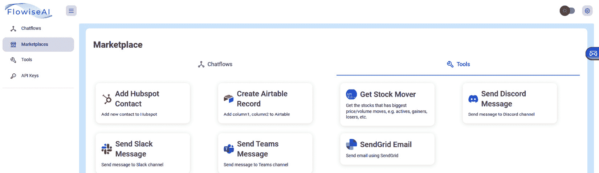

图 9.24：Flowise 预定义工具

由于 Flowise 是建立在 LangChain 之上的可视化构建工具，因此它具有几个与 LangChain 相似的块类型。对于每种类型，它都提供不同的配置选项，因此用户可以选择更适合他们特定情况的选项。这些是块类型：

+   **聊天模型**如 GPT-3.5 Turbo 和 GPT-4 是专门为对话式人工智能应用设计的。它们将之前的消息作为输入上下文，并生成相关的下一个回应。

    与通用“完成”模型（如 text-davinci-003）相比，这些以聊天为中心的模型在对话应用中更强大且成本效益更高。完成模型针对的是单轮文本生成，而不是多轮的来回聊天。

    聊天模型建立在 GPT-3 等模型的基础上，并利用针对对话流程和连贯性定制的额外训练数据和优化。这使得它们能够遵循对话上下文，整合之前的回应，并生成更自然、更相关的回复。

    例如，聊天模型可以处理诸如回答后续问题、澄清意图和纠正先前陈述等任务。它们的训练也侧重于参与度、积极性和一致性。

+   **嵌入**提供了一种将文本转换为编码语义意义的数值表示的方法。机器学习模型可以通过分析大型数据集中单词和句子之间的关系来生成嵌入。

    这些文本嵌入捕捉了超出表面单词匹配的上下文细微差别和相似性。例如，嵌入可以将同义词和类比在向量空间中映射得非常接近。

    这种文本的数值表示使得嵌入对于查找语义相关的文档非常有用。而不仅仅是通过关键字匹配，我们还可以比较文档嵌入之间的向量距离，以识别相关或相似的段落。

    嵌入编码使我们能够执行向量相似性搜索，以检索包含概念相关内容的文档。这种语义匹配水平使用关键字索引方法是不可能的。

+   **向量存储**是针对管理大量数值向量或嵌入进行优化的数据库。与传统的数据库相比，它们允许高效地存储和检索高维数据点。

    Flowise 提供了与多个向量存储的集成，如 Pinecone、Chroma、Supabase 和 Qdrant。这些可以通过两种主要方式被纳入工作流程中：

    +   **插入或更新文档嵌入**：向量器块从文本或其他媒体生成嵌入。这些嵌入可以通过 upsert 操作被摄入向量存储中，从而填充索引。upsert 是一个过程，通过单个语句在数据库中插入新记录或更新现有记录，基于记录是否已存在。

    +   **加载现有索引**：预构建的向量索引可以被加载到工作流程的状态中。这提供了使用向量存储的相似性函数在索引嵌入上进行搜索的访问权限。

+   **文档加载器**允许您从各种来源摄入文本内容，包括 PDF 文件、TXT 文件、CSV 文件、Notion 文档、Confluence 页面等。

    文档加载器从各种来源摄入内容，使用编码器进行向量化，并使检索器能够根据向量相似性匹配相关文档。它们在非结构化文本和高效语义搜索之间提供了一个桥梁。

+   **内存组件**允许聊天机器人维持上下文并像人类一样回忆之前的对话。

+   **工具**提供了代理可以利用的可重用函数来执行操作。它们封装了与外部数据源交互、执行子工作流程或访问其他代理的逻辑。

    通过将逻辑打包到工具抽象中，开发者可以将各种能力集成到代理中。代理可以专注于协调工作流程，同时作为模块化构建块重用现有工具。

在接下来的章节中，我们将探讨一些可以使用 Flowise 创建的简单聊天机器人。

#### 按照 ChatGPT 的方式组装聊天机器人

可能是 Flowise 流程最简单的实现方式是创建一个聊天机器人，该机器人可以复制 ChatGPT 的功能。这样做的好处是您可以将其嵌入到任何网站上，以便为用户提供 ChatGPT 功能。

此工作流程有三个块，如图*图 9.24*所示：

1.  一个需要两个输入的对话链：一个语言模型和一个内存。

1.  语言模型。由于我们想要克隆 ChatGPT，我们选择了**gpt-3.5-turbo-0613**模型。

1.  内存。在这种情况下，**缓冲内存足够**：

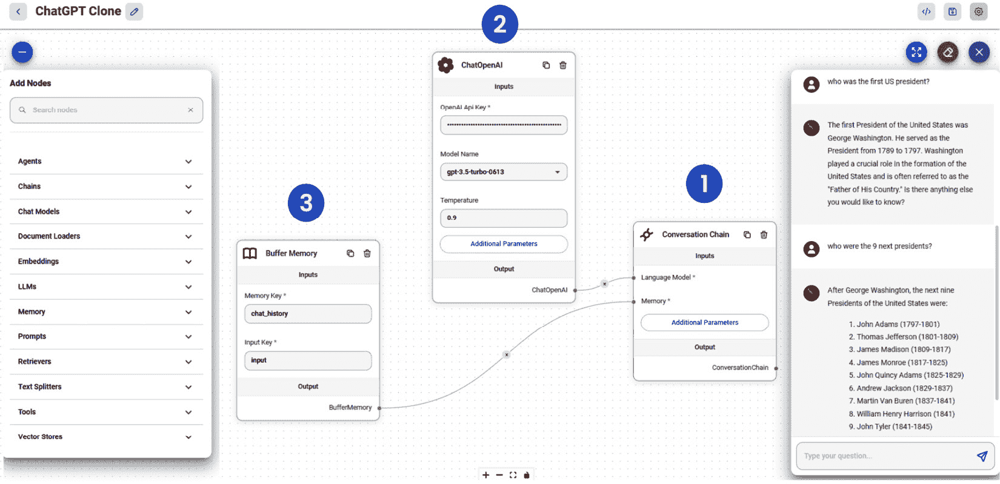

图 9.25：ChatGPT 克隆工作流程

在这里，我们可以看到左侧的节点（或块）选项和右侧正在进行的聊天，我们运行了一个测试，提出了一些问题。

一个流程可以被嵌入到网站上或用作 API。这可以通过点击右上角的**</>**图标来完成。将出现一个包含以下选项的弹出窗口：

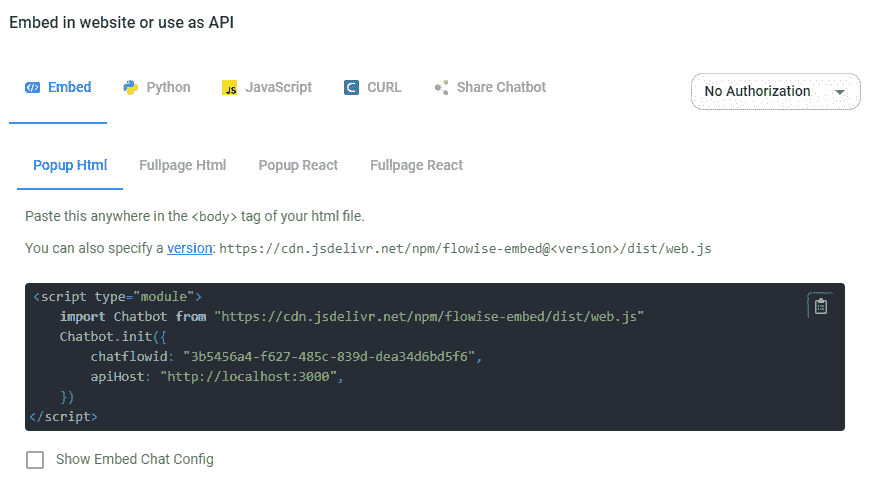

图 9.26：Flowise – 嵌入网站或作为 API 选项

在这种情况下，Flowise 在本地主机上运行，但它可以被部署到任何云服务，如 Render、Railway 或 Replit。它也可以部署到云提供商，如 AWS、Azure、GCP 和 DigitalOcean。

LLM 的一个常见应用是能够总结和就 PDF 和其他类型的文档内容提出问题。在下一节中，我们将探讨一个允许我们做到这一点的流程。

#### 使用 LLM 在 PDF 中寻找答案

许多新的初创公司和 AI 代理咨询公司提供允许用户与其文档进行聊天并对其内容提出问题的服务。使用 Flowise，你只需几分钟就能构建这样的工作流程。

工作流程看起来就像*图 9.26*中所示：

1.  我们首先需要的是一个文档加载器——在这种情况下，是一个 PDF 加载器。还有其他类型的文档加载器可以加载文本文件、CSV、DOCX、网络爬虫等。

1.  然后，我们需要一个文本分割器，将文档分割成*N*个字符的块。*N*是用户定义的字符数，在这个例子中选择了 1,000。将一个块与相邻的块相关联设置一些重叠是良好的实践。

1.  这些块必须存储在一个允许在需要时进行语义搜索的向量数据库中。我选择了 Pinecone，这是一个流行的向量存储，但选项有很多，并且还在不断增加。

1.  要使用 Pinecone，你需要在[`www.pinecone.io/`](https://www.pinecone.io/)上创建一个账户。然后，你需要在 Flowise 中的 Pinecone 节点中创建一个索引并输入 API 密钥、环境以及索引。为了向量化块，我们需要一个嵌入节点。在这种情况下，我使用的是 OpenAI 的。你需要有一个 OpenAI 账户并生成一个 API 密钥。

1.  因为我们要询问 PDF 中的问题，我选择了对话检索 QA 链。

1.  最后，我们需要一个 LLM。我选择了带有**GPT-3.5-0613**模型的 ChatOpenAI。你还需要在该节点中输入你的 OpenAI API 密钥：

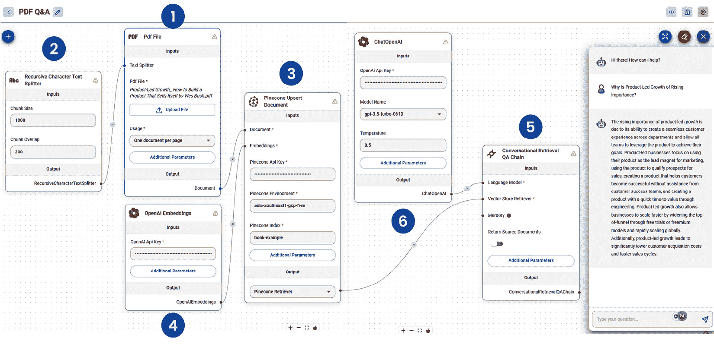

图 9.27：询问 PDF 问题的 Flowise 流程

保存你的项目后，你可以使用聊天选项进行测试。在*图 9.27*中，你可以看到它正在按预期回答问题。

如果你想与多份文档进行聊天，可以添加更多 PDF 节点。

另一种简单而强大的工作流程是允许大型语言模型（LLM）实时访问互联网。为此，一些工具提供了多个节点，例如 SERP API、Serper 和 Web 浏览器。

如这两个简单的例子所示，LangChain、Flowise 和 Langflow 提供了使用 LLM 构建复杂应用的有力功能。一个完整的工作流程可以是一个自定义工具到另一个工作流程。你甚至可以将使用 Zapier 和/或 Make 创建的工作流程集成到这些工作流程中。想象一下可能性。

LangChain 最近推出了 LangSmith，这是一个用于调试、测试和监控 LLM 应用程序的工具，它使得修复 LangChain 工作流程中的问题变得更加容易。我们将在下一节中更详细地探讨 LangSmith。

## LangSmith – 调试、测试和监控您的 LLM 工作流程

LangSmith 为开发、调试、测试和监控 LLM 应用程序提供了一个端到端解决方案。其统一平台通过在整个 LLM 应用程序生命周期中提供强大的功能，帮助团队从原型过渡到生产。其关键特性包括用于识别错误的调试工具、用于验证功能的测试框架、用于生产应用程序的监控、用于理解架构的可视化以及用于分析和共享的数据导出。LangSmith 旨在从初始原型到发布以及之后的构建企业级 LLM 应用程序。

您可以在 LangSmith 这里获取更多信息：[`www.langchain.com/langsmith`](https://www.langchain.com/langsmith)。

这个领域的创新进展非常快。我们预计很快会有新的发展。我们将在下一节中探讨其中的一些。

# LLM 集成的未来——插件、代理、助手、GPT 和多模态模型

到目前为止，我们已经探讨了使用模板、无代码工具和 LangChain 等开发者平台来集成 LLM。然而，这个领域的创新非常迅速。我们可以期待出现更强大、更灵活的集成功能。以下是即将到来的几个关键发展：

+   **LLM 插件** **和扩展**

    而不是自定义编码，您将看到插件和扩展，可以直接将 LLM 集成到常见的平台中。我们已经有 ChapGPT Plus 的插件，其中一些，如 Code Interpreter，功能极其强大。Code Interpreter 提供了一个沙盒化的 Python 环境来执行代码。虽然它是为程序员设计的，但它也可以赋予普通用户完成许多任务的能力。

    例如，您可以使用 Code Interpreter 通过 OCR 转换 PDF 文件、编辑视频文件、解决数学问题、进行数据分析与可视化、生成图表和更多操作。ChatGPT 的 Code Interpreter 允许您直接上传各种格式的本地文件。

    谷歌还推出了 Bard 的扩展。Bard 扩展将谷歌的对话式 AI 与其应用生态系统连接起来，使 Bard 能够从 Gmail、地图和 YouTube 等服务中提取上下文信息，在一个无缝的对话中提供更有用、更集成的响应。这种连接性提高了规划、内容创作和学习等任务的生产力、创造力和便利性。

    随着 LLM 成为标准的工作场所工具，轻量级的插件将允许您以最小的摩擦将现有的工作流程添加到其中。API 和 SDK 将处理简单用户界面背后的复杂性。

+   **新的 LLM（大型语言模型**）

    将继续出现新的模型。一个例子是 Google Gemini。Gemini 是一个多模态 LLM，可以处理和生成文本、图像和代码。

+   **专业** **的 LLM 代理**

    我们将看到更多模块化、专业的 LLM 出现，这些 LLM 针对特定任务进行了预训练。这些专家代理可以提供诸如高级搜索、数据分析、优化推荐和自动生成报告等能力。

    开发者可以通过结合这些最佳专家代理来编排管道，以完成复杂的流程。而不是一个通用的 LLM，基于代理的方法利用了不同模型的优势。

    除了 LangChain，还有其他针对相同目的定制的工具正在开发中，例如 Superagent ([`www.superagent.sh/`](https://www.superagent.sh/))、LlamaIndex ([`gpt-index.readthedocs.io/en/stable/index.html`](https://gpt-index.readthedocs.io/en/stable/index.html))以及许多其他工具。

+   **多模态** **LLM 集成**

    到目前为止，LLM 主要处理和生成文本、图像或音频。但模型在统一文本、图像、音频、视频和其他模态方面正在迅速改进。我们将看到 LLM 与其他媒体之间更紧密集成的工具出现。当 OpenAI 在 2023 年初宣布 GPT-4 时，他们展示了多模态能力的潜力。Bard 已经允许你加载一张图片并询问其上下文。我们将在不久的将来看到更强大的多模态模型。

而不是单独的工具，我们将看到 LLM 成为嵌入式的助手，提高日常应用的生产力。紧密集成解锁了更多上下文推荐和自动化潜力。

随着 LLM 的发展，我们可以期待集成工具将提供更广泛的访问权限，同时为特定领域定制。模板和无代码将赋予非开发者能力，而可扩展性将防止供应商锁定。下一波创新将使 LLM 成为任何人都可以根据其独特需求应用的灵活工具。

OpenAI 于 2023 年 11 月 6 日的公告指向了未来 LLM 集成的一些关键发展：

+   简化的助手 API

+   可定制的 GPTs

+   更紧密的多模态连接

OpenAI 的新助手 API 提供了一个简单的方法来构建具有代码执行、数据分析和任务自动化等能力的人工智能代理。开发者可以通过在自然语言中提示命令，快速创建针对特定用例的助手，而无需复杂的自定义编码。

助手 API 处理数据源的摄入、维护消息间的对话上下文，并在幕后利用诸如代码解释器和检索等工具。这降低了将 LLM 集成到工作流程中的门槛。

可定制的 GPT 允许用户现在为特定领域和任务创建专门的定制 GPT，例如创建一个数学辅导 GPT 或产品文案助手 GPT。GPT 使得在不需数据科学专业知识的情况下个性化 LLM 变得容易。

GPT 还允许您通过 OpenAI 即将推出的 GPT Store 与其他人分享有用的 AI 工具。这个市场将允许创作者分发并可能货币化他们的定制助手。

在多模态方面，访问如 DALL-E 3 等模型，可以从文本提示生成图像，紧密连接文本和视觉。新的文本到语音 API 同样架起了文本和音频之间的桥梁。

随着 LLM 的进步，我们将看到能够优雅地结合文本、图像、音频、视频和数据等模型。这种交织赋予了更多辅助性、个性化以及类似人类的交互能力。

与通用的 LLM 不同，针对特定用途定制的助手、GPT 以及针对独特用例的集成似乎是利用 AI 创造价值的未来之路。

# 摘要

本章探讨了将 LLM 集成到工作流程中的不同技术，以实现大规模自动提示。我们研究了如 SheetSmart 等 Google Sheets 的简单模板选项，以及如 Zapier 等无代码自动化平台。对于更高级的定制，开发者工具如 LangChain、Flowise 和 Langflow 允许使用多个 LLM 构建管道和应用。我们通过竞争情报、客户数据丰富化和与文档对话的示例用例，展示了集成在实际中的应用方式。

展望未来，对话式 AI 与日常生产力应用之间的紧密联系将使 LLM 提供更相关、更具体的推荐和自动化。然而，尽管集成解锁了实用性，但也引发了重要的伦理考量；我们将在下一章中探讨这一点。随着这些强大的技术进一步融入日常生活，透明度、问责制和控制等原则变得至关重要。

# 第四部分：伦理、局限性和未来发展趋势

*第十章* 探讨了日益强大的生成式 AI 系统崛起所提出的多方面伦理挑战。随着这些技术的进步，它们引入了持续偏见、威胁隐私、扰乱劳动力市场、加剧气候变化等风险。然而，基于人权的良好治理可以帮助引导创新走向有益的结局。解决方案强调设计伦理、算法审计、深思熟虑的法规和包容性参与。

*第十一章* 以回顾本书的核心概念结束，包括使用条件提示进行个性化，因果提示进行推理，以及匿名化提示来探测危险。随着获取的民主化，负责任的监督和管理将变得至关重要。提示工程释放了巨大的创造力，但我们必须深思熟虑地将其引导到提升应用的方向，这些应用综合了人类和人工智能的最佳优势。未来仍然不确定——我们今天的抉择将影响几代人。

总体而言，*第四部分*探讨了这些指数级加速技术的负责任管理。在道德意识的指导下进行发展和治理，敏捷工程承诺释放人工智能的潜力，同时维护人类的尊严和智慧。

本部分包含以下章节：

+   *第十章*, *生成式 AI：伦理与创新交汇处的新兴问题*

+   *第十一章*, *结论*
