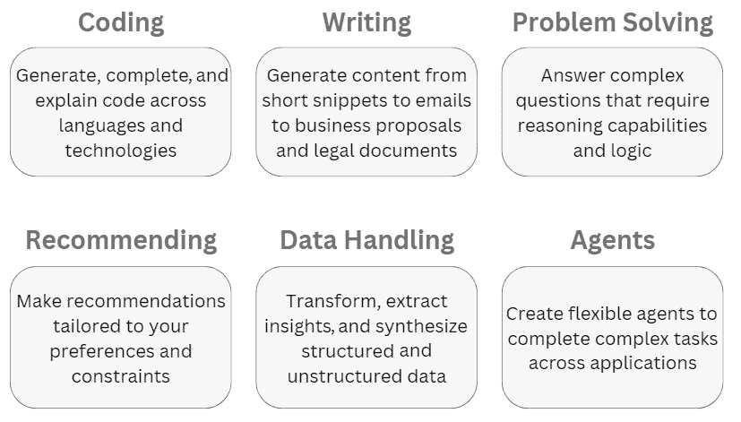

# 第十一章：结论

当我们接近探索提示工程前沿的旅程结束时，让我们总结关键教训，并展望这项技术可能带来的未来应用和功能。

提示工程代表了一个突破，当被精心引导时，可以释放 AI 的潜力，正如我们通过不同的例子所看到的那样。就像制作食谱一样，提示编写者仔细调整成分以引导**大型语言模型**（**LLMs**）。

虽然模型今天仍然需要严格的人类验证，但提示工程承诺将极大地增强人类的能力和创造力。应用可以帮助加速发现、改善决策并提高生产力。

然而，我们必须保持对风险和局限性的认识。开发人类和人工智能优势的有益综合需要谨慎、智慧和透明度。随着获取的民主化，鼓励负责任创新的政策激励将是至关重要的。

这最后一章将做以下事情：

+   提供书籍核心概念的执行摘要

+   突出提示工程在各个行业的创新应用

+   讨论如何构建提示以实现预期结果

+   检查随着能力提升所需的责任监督

在我们结束对提示工程的深入探索时，很明显，这项新兴技术代表了一个极其有希望的 AI 前沿。尽管我们只触及了可能性的一角，但提示工程显示出巨大的潜力，可以从根本上改变几乎每个行业和领域。

# 书籍内容的回顾

在前几章中，我们看到了精心设计的提示工程如何使生成式系统如 LLM 等能够提供巨大价值。从加速内容创作到自动化编码，以及解锁数据中的洞察，提示工程使得以前不可行的应用成为可能。它代表了一个突破，当被精心引导时，可以释放 AI 的潜力。

在不同的领域，定制提示使 AI 成为一个多才多艺的助手，通过自动化数据处理、生成草稿和提供个性化推荐来增强人类努力。目前，在 AI 成熟度的早期阶段，不可或缺的人类专业知识仍然至关重要。

展望未来，个性化条件提示、因果提示、去匿名化提示和 AI 辩论等技术有望为更安全、更可靠的应用带来希望。让我们简要探索这些提示类型：

+   条件提示涉及构建提示，以根据提供的用户属性和偏好条件化模型输出，使生成的内容能够针对单个用户定制。

+   因果提示旨在通过构建需要推断因果链的提示，将因果推理注入生成式 AI 中。这可以使系统能够回答因果假设性问题，并改善决策。

+   如去匿名化提示等方法旨在通过仔细提示模型重建删除的信息，以揭示潜在的重新识别风险。随着能力的增长，负责任的提示将需要探测危险。

+   技术如 AI 辩论训练模型从文本中论证对立观点，揭示矛盾证据和偏见。这可以减轻错误信息的风险。

随着研究的继续，我们可能会看到人机协作逐渐从简单的单向辅助向更深层次的双向伙伴关系发展。Excel 等工具已经赋予分析师能力，未来的创意 AI 系统可能会通过催化发现，以类似的方式革命性地改变教育、研究和医学等领域。

# 扩展可能性——创新的提示工程应用

在医疗保健和其他关键领域，当战略性地引导时，提示工程可以自动化重复性任务，并有力地增强专业人士的能力和生产力。我们的旅程揭示了未来提示工程框架可能允许非专家安全地利用这些技术的闪光点，就像 Excel 等工具将非程序员转变为软件高级用户一样。

医疗保健是提示工程最具吸引力的应用领域之一。以下是一些应用示例：

+   **临床决策支持**：精心设计的提示可以帮助 LLMs 根据症状和病史为医生提供基于证据的诊断和治疗建议。这起到临床决策支持的作用。然而，医生仍需验证任何指导。

+   **患者教育**：提示可以指导 LLMs 以适当的识字水平用简单语言向患者解释复杂健康状况、测试、程序、治疗方案等。这提高了理解和依从性。

+   **文档理解**：使用提示，LLMs 可以从病历、笔记、处方等中提取关键信息，总结或突出相关细节，帮助医生。

+   **药物发现**：提示可以引导 LLMs 分析分子相互作用和 3D 蛋白结构，以识别新的药物候选者或现有药物的重新用途。

+   **图像分析**：当得到适当提示时，LLMs 在医学图像分析方面显示出潜力，例如筛选放射学扫描中的异常情况，并为医生审查提出诊断建议。

+   **流行病学**：当使用适当的提示进行工程时，LLMs 可以快速分析大量流行病学数据、新闻和科学论文，以检测早期疾病爆发信号。

+   **虚拟助手**：使用 LLM API 构建的医疗聊天机器人可以在适当提示下为患者提供关于健康话题的对话指导、预约、填写表格等。

+   **临床试验**: 当提示时，LLMs 可以帮助筛选患者记录以识别协议候选人、监控入组标准，并确保获得适当的知情同意。这有助于分析和政策制定。

其他行业，如工程、政府、新闻和教育，也展现出通过提示工程增强人类能力的巨大潜力。通过自动化常规任务，当战略性地引导时，表面上的洞察力可以加速发现和决策。以下是一些例子：

+   **金融**: 当正确提示时，LLMs 可以分析收益报告、招股说明书、新闻等，生成投资建议或起草报告。这对于投资、交易和分析很有用。

+   **工程**: 提示可以指导 LLMs 利用其广泛的技术知识推荐材料、设计或工程问题的方法。这有助于构思和原型设计。

+   **新闻业**: 当提供适当背景时，提示可以指导 LLMs 生成文章草稿或从研究中提取关键细节的摘要。这有助于写作。

+   **政府**: 当有效设计时，LLMs 可以快速分析政策、立法、法规等，为政策制定者提供总结性见解或起草文件。这有助于分析和政策制定。

+   **科学研究**: 当提供研究目标和数据时，提示可以引导 LLMs 提出假设、设计实验框架、分析结果或起草稿件。这补充了研发工作。

+   **客户服务**: 当正确提示并具备产品知识和指南时，LLMs 可以回答客户查询、推荐解决方案或升级问题。这简化了支持流程。

+   **制造业**: 指示 LLMs 根据需求预测等参数提出优化的生产流程、库存水平或预测性维护计划，有助于提高效率。

+   **人力资源**: 当适当提示时，LLMs 可以帮助筛选简历、安排面试、提出面试问题，并起草职位描述。这简化了招聘和人力资源流程。

+   **交通**: 当正确引导时，大型语言模型（LLMs）可以分析交通模式、天气数据、车队遥测数据等，并为配送车辆推荐优化的路线和调度，从而提高效率。

+   **保险**: 提示可以指导 LLMs 从索赔中提取关键细节、评估风险，并根据政策条款和以往案例提出公平的赔偿金额。这加快了索赔处理。

+   **农业**: 当有效设计时，LLMs 可以获取土壤条件、天气、作物生长等实时数据，并提出灌溉、施肥和收获时间等干预措施。这支持精准农业。

+   **零售**: 提示可以指导 LLMs 生成产品描述、分析客户数据以定制推荐，或根据需求预测优化定价和库存。这有助于提升销售额和转化率。

+   **房地产**：LLM 可以评估房产价值、在合同中标记风险、根据市场数据提出合适的挂牌价格，或者在适当提示下起草房产描述。这有助于经纪人代理。

+   **网络安全**：LLM 可以在安全工程师编写的提示下快速扫描代码、分析威胁、识别漏洞，并提出修复建议。这加强了软件安全性。

+   **教育**：我们讨论了创建课程材料的应用，但 LLM 在适当提示下也显示出个性化自适应教育的潜力。

虽然这些高级应用展示了提示在尖端的应用，但退一步考虑 LLM 可以实现的目标的全面范围也同样重要，正如我们接下来将要探讨的。

# 实现预期结果——提示工程目标

当作为目标导向的努力来处理时，提示工程最为有效。明确界定你想要实现的目标和预期结果是一个至关重要的第一步，它将指导每一个后续的提示设计决策。

在构思你的提示之前，始终先问自己——生成这个内容或执行这个任务的目的何在？什么可以构成成功？明确具体的目标将为你的提示工程努力提供方向，并增强你引导 LLM 向期望结果发展的能力。无论你的目标是生成文本摘要、从数据中综合见解、提出个性化推荐，还是其他任何事情，将你的提示锚定在具体目标上是关键。

提示工程应用服务于不同类型的目标，如图*图 11.1*所示。

图 11.1：提示目标

虽然深思熟虑的提示工程能够通过利用 LLM 的潜力实现广泛的目标，但保持现实期望和负责任的监督仍然至关重要，正如我们接下来将要探讨的。

# 理解局限性和保持监督

当然，我们也要意识到局限性。目前，输出结果仍需要严格的人类验证，因为今天的模型在语言理解方面根本缺乏真正的理解。发展有益的互补人类和人工智能优势的合成将是一个需要极大关注、智慧和透明度的持续追求。

通过直观的工具使这些技术民主化，承诺将显著扩大访问权限，但如果没有深思熟虑的治理，也会带来重大风险。鼓励参与式社区审计潜在社会影响的政策激励措施可以促进负责任的创新，支持独立测试和标准机构评估因素，如偏见和误用预防，也可以做到这一点。在部署前进行开放算法影响评估的要求可能是明智的。

通过 Zapier 等平台将这些模型与服务集成可以极大地增强其功能。当由大型语言模型驱动时，聊天机器人能够进行自然对话。自动化将大型语言模型连接到各种数据源和输出。LangChain 等工具使大型语言模型能够访问定制数据源以增强响应。使用 LangChain，你可以通过在日历、电子邮件和笔记等独特数据上训练模型来创建个性化的 AI 代理。这使你能够构建深入了解你的背景和偏好的定制解决方案。定制的可能性是巨大的。

谨慎的提示工程为引导这些模型向有益的结果发展提供了巨大的自主权，同时保留了人类的监督。如果使用得当，生成式 AI 有潜力在巨大规模上增强人类的能力和创造力。提示是开启这种潜力的关键。

# 摘要

本书提供了文本生成技术的入门概述，但提示工程涵盖的内容更多。新兴技术也使得生成图像、音频、3D、视频等成为可能。随着大型语言模型的多模态能力增强，提示工程将解锁更丰富的创意可能性。

随着大型语言模型的快速进化，我们可以期待模型能够在其上下文中处理超过 100 万个文本标记。这将提供更大的记忆容量和对语言上下文的理解。它们将整合大量的多模态知识，并成为指数级更强大和细腻的模型。

目前，你拥有了开始为不同用例设计提示的核心知识，仅限于你的想象力。本书旨在激发 AI 如何几乎改变生活和工作各个方面的激动人心的可能性。尽管生成式 AI 仍然年轻，但未来看起来光明。

你的下一步是开始尝试这本书中提供的核心原则和技术。我期待看到你通过深思熟虑地应用提示工程所创造的令人难以置信的事物。感谢你学习这个迷人的领域——你的技能将帮助塑造其未来。故事才刚刚开始。
