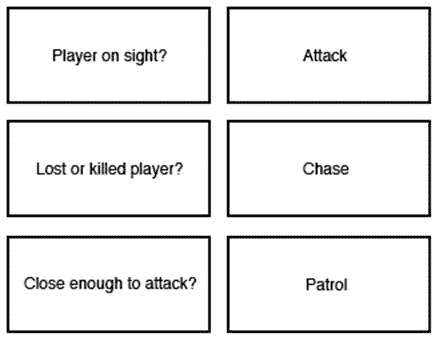

# 第一章：游戏中人工智能的基础

**人工智能**（**AI**）是一个丰富且复杂的话题。乍一看，它可能显得令人畏惧。它的用途多种多样，从机器人学到统计学，再到（对我们来说更相关的）娱乐，特别是视频游戏。本书的目标将通过将人工智能的应用分解为相关、实用的解决方案，并提供易于理解的示例，以阐明概念，从而消除噪音并直接针对核心思想，来揭开这个主题的神秘面纱。本书将引领您一头扎入人工智能的世界，并介绍您开始人工智能之旅最重要的概念。

本章将为您简要介绍学术、传统领域和游戏特定应用中的人工智能背景。以下是我们将要涉及的主题：

+   探索游戏应用和实现人工智能的方式与其他领域有何不同

+   查看游戏中对人工智能的特殊要求

+   查看游戏中使用的基

本章将作为后续章节的参考，在后续章节中，我们将将在 Unity 中实现人工智能模式。

# 创造生命的幻觉

在深入探讨之前，我们应该停下来片刻，定义一下智能。智能简单来说就是学习某事物然后应用该知识的能力。至少对我们来说，人工智能是智能的幻觉。我们的智能实体不必一定学习事物，但至少必须让玩家相信它们正在学习。我必须强调，这些定义仅适用于游戏人工智能。正如我们将在本节后面发现的那样，人工智能在游戏之外有许多应用，那里的定义更为恰当。

智能生物，如人类和其他动物，从它们的环境中学习。无论是通过视觉观察、听觉、触觉等，我们的大脑将这些刺激转化为我们处理和学习的知识。同样，我们创建的计算机人工智能必须观察并对其环境做出反应，以显得聪明。虽然我们使用眼睛、耳朵和其他方式来感知，但我们的游戏人工智能实体有一套不同的传感器可供使用。我们的代码将模拟数据的处理和那些模拟对数据做出逻辑和可信反应的行为，而不是使用像我们一样的大脑。

人工智能及其众多相关研究内容丰富且多样，但在深入探讨该主题之前，了解不同领域中使用的人工智能基础是非常重要的。人工智能只是一个通用术语；其各种实现和应用因不同需求而异，用于解决不同的问题集。

在我们转向特定于游戏的技巧之前，让我们看看以下在过去几十年中取得了巨大进步的 AI 应用研究领域。曾经被认为是科幻的东西正在迅速成为科学事实，例如自主机器人和自动驾驶汽车。你不需要看得很远就能找到 AI 进步的绝佳例子——你的智能手机很可能有一个依赖于一些新 AI 相关技术的数字助手功能。它可能比你更了解你的日程！以下是推动 AI 的研究领域：

+   **计算机视觉**: 这是指从视频和照相机等来源获取视觉输入，并对其进行分析以执行特定操作的能力，例如人脸识别、物体识别和光学字符识别。计算机视觉是自动驾驶汽车进步的前沿。即使是相对简单的系统，如碰撞缓解和自适应巡航控制，也使用一系列传感器来确定深度上下文，以帮助防止碰撞。

+   **自然语言处理 (NLP)**: 这是指机器能够像我们通常书写和说话一样阅读和理解语言的能力。问题是，我们今天使用的语言对机器来说很难理解。表达相同意思的方式有很多种，而且同一个句子根据上下文的不同可以有不同的含义。NLP 是机器的一个重要步骤，因为它们在处理和相应地做出反应之前，需要理解我们使用的语言和表达方式。幸运的是，网络上可用的数据集数量庞大，可以帮助研究人员通过自动分析语言来进行研究。

+   **常识推理**: 这是一种我们的大脑可以轻松使用的技巧，即使是从我们不完全理解的领域也能得出答案。常识知识是我们尝试某些问题的通常和常见方式，因为我们的大脑可以混合和相互作用上下文、背景知识和语言能力。但是，让机器应用这种知识非常复杂，并且仍然是研究人员面临的一个主要挑战。

+   **机器学习**: 这可能听起来像是直接来自科幻电影的东西，而现实并不太遥远。计算机程序通常由一组静态的指令组成，这些指令接受输入并提供输出。机器学习专注于编写算法和程序的科学，这些算法和程序可以从程序处理的数据中学习，并将其应用于未来的学习。

# 神经网络

经过多年的研究和开发，人工智能是一个快速发展的领域。随着消费级计算机硬件变得越来越强大，开发者们正在寻找新的和令人兴奋的方法，将越来越复杂的 AI 形式应用于各种应用中。其中一个这样的 AI 概念是**神经网络**，这是我们之前章节中提到的机器学习的一个子集。神经网络使计算机能够“学习”，并通过重复训练，在解决各种问题方面变得越来越高效和有效。一个测试神经网络机器学习的非常流行的练习是教人工智能如何辨别一组手写数字的价值。

在我们所说的**监督学习**中，我们为神经网络提供一组训练数据。在手写数字场景中，我们传递数百或数千张从任何包含手写数字的来源收集的图像。使用称为**反向传播**的过程，网络可以通过它刚刚“学习”的值和数据来调整自己，以在下一个学习周期的迭代中创建更准确的预测。

信不信由你，神经网络的概念自 20 世纪 40 年代以来就已经存在，最早的实施发生在 20 世纪 50 年代初。从高层次来看，这个概念相当简单——一系列称为**神经元**的节点通过它们的**轴突**或连接器相互连接。如果这些术语听起来熟悉，那是因为它们是从具有相同名称的脑细胞结构中借用的，并且在某些方面具有相似的功能。

这些网络的层相互连接。通常，有一个输入层、一个隐藏层和一个输出层。这种结构可以用以下图表表示：

基本神经网络结构

输入，代表智能体正在接收的数据，例如图像、音频或其他任何东西，会通过一个隐藏层，该层将数据转换为程序可以使用的格式，然后将这些数据发送到输出层进行最终处理。

在神经网络机器学习中，并非所有输入都是平等的；至少，它不应该如此。输入在传递到隐藏层之前会被加权。虽然一开始使用相等的权重通常是可行的，但程序可以通过反向传播在每个迭代中自我调整这些权重。简单来说，权重是输入数据在预测中可能有用性的概率。

经过多次训练迭代后，人工智能将能够处理全新的数据集，即使它以前从未遇到过！虽然机器学习在游戏中的应用仍然有限，但这个领域仍在扩展，并且现在是热门话题。确保不要错过这趟列车，并查看 Rodolfo Bonnin 的*开发者机器学习*，深入了解与机器学习相关的一切。

# 用人工智能提升你的游戏水平

游戏中的 AI 可以追溯到最早的电子游戏，甚至远至南梦宫的街机热门游戏《吃豆人》。当时的 AI 非常基础，但在《吃豆人》中，每个敌人——Blinky、Pinky、Inky 和 Clyde——都有独特的行动方式，以不同的方式挑战玩家。学习这些行为并对它们做出反应，为游戏增添了巨大的深度，并使玩家即使在其发布 30 多年后仍然回来玩。

优秀的游戏设计师的职责是让游戏既有挑战性又吸引人，但难度不能过高，以免玩家永远无法获胜。为此，人工智能是一个神奇的工具，可以帮助抽象化游戏中实体遵循的规律，使它们看起来更加自然、生动和真实。就像动画师通过每一帧或艺术家通过他的画笔一样，设计师或程序员可以通过巧妙地使用本书中涵盖的人工智能技术，为他们的创作注入生命。

人工智能在游戏中的角色是通过提供具有挑战性的实体来竞争，以及游戏世界中行为真实的**非玩家角色**（NPCs）。这里的目的是不是复制人类或动物的全部思维过程，而是仅仅通过让 NPCs 以对玩家有意义的方式对游戏世界中的变化情况做出反应，来营造生命的幻觉并使 NPCs 看起来更聪明。

技术使我们能够设计和创建复杂的模式和行为，但我们还没有达到游戏中的 AI 甚至开始类似于真正的人类行为的程度。虽然更小、更强大的芯片、大量的内存甚至分布式计算为程序员提供了更高的计算天花板，可以用于 AI，但最终，资源仍然与其他操作共享，如图形渲染、物理模拟、音频处理、动画等，所有这些都在实时进行。所有这些系统都必须相互配合，以在整个游戏过程中保持稳定的帧率。就像游戏开发中的所有其他学科一样，优化 AI 计算对 AI 开发者来说仍然是一个巨大的挑战。

# 在 Unity 中使用 AI

在本节中，我们将向您介绍不同类型游戏中使用的一些人工智能技术。我们将在接下来的章节中学习如何在 Unity 中实现这些功能。Unity 是一个灵活的引擎，提供了多种实现 AI 模式的方法。其中一些可以直接使用，而另一些则需要从头开始构建。在本书中，我们将专注于在 Unity 中实现最关键的 AI 模式，以便您能够快速启动并运行游戏中的 AI 实体。学习和实现本书中的技术将是进入广阔的 AI 世界的基本第一步。本书中我们将涉及到的许多概念，如路径查找和导航网格，都是相互关联的，并且建立在彼此之上。因此，在深入研究 Unity 提供的高级 API 之前，首先确保掌握基础知识是非常重要的。

# 定义代理

在我们深入探讨第一种技术之前，我们应该清楚了解本书中会多次使用的关键术语——代理。在 AI 的背景下，代理是我们的人工智能实体。当我们谈论我们的 AI 时，我们并不是特指一个角色，而是一个表现出复杂行为模式、可以被称为非随机或换句话说，智能的实体。这个实体可以是角色、生物、车辆或其他任何东西。代理是自主实体，执行我们将要讨论的模式和行为。现在我们已经明确了这一点，让我们开始吧。

# 有限状态机

**有限状态机（FSM**）可以被认为是 simplest 的 AI 模型之一，并且它们在游戏中被广泛使用。状态机基本上由一组通过它们之间的转换连接在一起的状态组成。游戏实体从一个初始状态开始，然后寻找将触发转换到另一个状态的事件和规则。游戏实体在任何给定时间只能处于确切的一个状态。

例如，让我们看看一个典型射击游戏中的 AI 守卫角色。其状态可能非常简单，如巡逻、追逐和射击：

简单的 FSM 中基本上有四个组件：

+   **状态**：此组件定义了一组游戏实体或 NPC 可以选择的不同状态（巡逻、追逐和射击）

+   **转换**：此组件定义了不同状态之间的关系

+   **规则**：此组件用于触发状态转换（玩家被发现、足够近可以攻击，以及失去/被杀的玩家）

+   **事件**：这是触发以检查规则（守卫的可见区域、与玩家的距离等）的组件

状态机（FSMs）在游戏开发中是常用的 AI 模式，因为它们相对容易实现、可视化和理解。我们可以通过简单的 if/else 语句或 switch 语句轻松实现一个状态机。当我们开始有更多状态和更多转换时，事情可能会变得混乱。我们将在第二章，《有限状态机与您》中更深入地探讨如何管理一个简单的状态机。

# 通过我们的代理的眼睛看世界

为了使我们的 AI 更具说服力，我们的代理需要能够对他周围的事件、环境、玩家，甚至其他代理做出反应。就像真实的生物体一样，我们的代理可以依靠视觉、声音和其他“物理”刺激。然而，我们有优势，能够访问比真实生物从其周围环境获得的数据多得多的数据，例如玩家的位置，无论他们是否在附近，他们的库存，世界上物品的位置，以及你在代码中选择的任何变量，你可以将其暴露给该代理：

在前面的图中，我们代理的视野由其前面的锥形表示，其听觉范围由围绕它的灰色圆圈表示：

视觉、声音和其他感官在最基本层面上可以被视为数据。视觉只是光粒子，声音只是振动，等等。虽然我们不需要复制光粒子不断弹跳并进入我们代理眼睛的复杂性，但我们仍然可以以产生可信结果的方式对数据进行建模。

如你所想，我们可以以类似的方式模拟其他感官系统，而不仅仅是用于生物体（如视觉、声音或嗅觉）的系统，甚至可以用于敌人机器人或塔等数字和机械系统，例如声纳和雷达。

如果你曾经玩过 *Metal Gear Solid*，那么你肯定在游戏中见过这些概念的实际应用——敌人的视野在玩家的迷你地图上以锥形视野表示。进入锥形视野，敌人的头上会出现一个感叹号，随后是一个清晰的铃声，让玩家知道他们已经被发现了。

# 跟随路径和转向

有时，我们希望我们的 AI 角色在游戏世界中四处游荡，遵循大致引导或详细定义的路径。例如，在赛车游戏中，AI 对手需要导航道路。在 RTS 游戏中，你的单位需要能够从他们所在的位置到达你告诉他们的位置，通过地形和彼此周围导航。

为了显得聪明，我们的智能体需要能够确定它们要去哪里，如果它们能够到达那个点，它们应该能够规划出最有效的路径，并在导航过程中如果出现障碍物时修改该路径。正如你将在后面的章节中了解到的那样，即使是路径跟随和转向也可以通过有限状态机来表示。你将看到这些系统是如何开始相互关联的。

在这本书中，我们将介绍路径查找和导航的基本方法，从我们自己的**A*路径查找系统**实现开始，接着概述 Unity 内置的**导航网格**（**NavMesh**）功能。

# Dijkstra 的算法

虽然可能没有 A*路径查找（我们将在下一章介绍）那么流行，但理解 Dijkstra 算法至关重要，因为它为在图中找到两个节点之间最短路径的其他类似方法奠定了基础。该算法由*Edsger W. Dijkstra*于 1959 年发表。Dijkstra 是一位计算机科学家，尽管他可能最出名的是以其名字命名的算法，但他也参与了其他重要计算概念的开发，例如**信号量**。*可以说，Dijkstra 在开发他的算法时可能并没有考虑到*StarCraft*，但这些概念在游戏人工智能编程中得到了完美的应用，并且至今仍然相关。

那么这个算法实际上**做什么**？简而言之，它通过给每个连接节点分配基于距离的值来计算图中两个节点之间的最短路径。起始节点被赋予零值。当算法遍历一个尚未访问的连接节点列表时，它会计算到该节点的距离并分配给该节点一个值。如果节点在循环的前一个迭代中已经被分配了值，它将保持最小的值。然后算法选择具有最小距离值的连接节点，并将之前选择的节点标记为*已访问*，因此它将不再被考虑。这个过程会重复，直到所有节点都被访问。有了这些信息，你就可以计算出最短路径。

需要帮助理解 Dijkstra 算法？旧金山大学创建了一个方便的可视化工具：[Dijkstra 算法可视化](https://www.cs.usfca.edu/~galles/visualization/Dijkstra.html)。

虽然 Dijkstra 算法已经非常完美，但其变体已被开发出来，可以更有效地解决问题。A*就是其中之一，由于它在速度上优于 Dijkstra 原始版本，因此它是游戏中应用最广泛的路径查找算法之一。

# 使用 A*路径查找

在许多游戏中，你可以找到跟随玩家或避开障碍物到达特定点的怪物或敌人。例如，让我们以一个典型的实时战略（RTS）游戏为例。你可以选择一组单位并点击你希望它们移动到的位置，或者点击敌方单位进行攻击。然后，你的单位需要找到一种方法到达目标，同时不与障碍物碰撞或尽可能智能地避开它们。敌方单位也需要能够做到这一点。障碍物可能因单位、地形或其他游戏实体而异。例如，空军单位可能能够飞越山脉，而地面或炮兵单位则需要找到绕过它的方法。A*（发音为“A star”）是一种路径查找算法，由于它的性能和准确性，在游戏中被广泛使用。让我们通过一个例子来看看它是如何工作的。假设我们希望我们的单位从点 A 移动到点 B，但中间有一堵墙阻挡，它不能直接朝向目标前进。因此，它需要找到一种方法到达点 B，同时避开墙壁。以下图示说明了这一场景：

为了找到从点 A 到点 B 的路径，我们需要更多地了解地图，例如障碍物的位置。为此，我们可以将整个地图分成小块瓦片，以网格格式表示整个地图。瓦片也可以是其他形状，如六边形和三角形。以网格形式表示整个地图使搜索区域更加简化，这是路径查找的重要步骤。现在我们可以参考一个小的 2D 数组来表示我们的地图：

一旦我们的地图被一组瓦片表示，我们就可以开始通过计算起始瓦片相邻的每个瓦片的移动得分来寻找到达目标的最佳路径，这个瓦片是地图上没有被障碍物占据的瓦片，然后选择成本最低的瓦片。我们将在第三章“寻找路径”中深入探讨我们如何分配得分和遍历网格的具体方法，但简而言之，这是 A*路径查找的概念：

A*路径查找计算穿越瓦片的成本

A* 是在寻路时需要了解的重要模式，但 Unity 也为我们提供了一些开箱即用的功能，例如自动导航网格生成和 NavMesh 代理，我们将在下一节中探讨这些功能，并在第三章 Finding Your Way 中更详细地介绍。这些功能使得在游戏中实现寻路变得非常容易（无意中用了双关语）。无论你选择实现自己的 A* 解决方案还是简单地使用 Unity 内置的 NavMesh 功能，都将取决于你的项目需求。每个选项都有其优缺点，但最终，了解两者将使你能够做出最佳选择。话虽如此，让我们快速了解一下 NavMesh。

# IDA* 寻路

IDA* 星号代表迭代加深 A*。它是对 A* 的深度优先排列，具有更低的总体内存成本，但通常在时间成本上更高。A* 在同一时间保持多个节点在内存中，而 IDA* 由于是深度优先搜索，所以不会这样做。因此，IDA* 可能会多次访问相同的节点，导致更高的时间成本。任何一种解决方案都会给出两个节点之间的最短路径。

在图太大以至于 A* 在内存方面不可行的情况下，IDA* 是首选，但普遍认为 A* 对于游戏中的大多数用例来说已经足够好了。话虽如此，我们将在第四章 Finding Your Way 中探讨这两种解决方案，这样你可以得出自己的结论，并为你的游戏选择正确的寻路算法。

# 使用导航网格

现在我们已经简要地了解了 A*，让我们看看一些可能的情况，在这些情况下，我们可能会发现 NavMesh 是计算网格的一个合适的方法。你可能注意到，在 A* 中使用简单的网格需要相当多的计算来获得到目标点的最短路径，同时避免障碍物。因此，为了使它更便宜、更容易，AI 角色能够找到路径，人们提出了使用路标点作为指南，将 AI 角色从起点移动到目标点的想法。假设我们想将我们的 AI 角色从点 A 移动到点 B，并且我们已经设置了三个路标点，如图所示：

现在我们只需要选择最近的路标点，然后跟随其连接的节点到达目标路标点。大多数游戏使用路标点进行寻路，因为它们简单且在减少计算资源方面相当有效。然而，它们确实存在一些问题。如果我们想更新地图中的障碍物怎么办？我们还需要为更新后的地图再次放置路标点，如图所示：

每次你的关卡布局发生变化时，必须手动更改航点可能会很麻烦，并且非常耗时。此外，跟随每个节点到目标意味着 AI 角色会从节点到节点移动一系列的直线。看看前面的图；AI 角色很可能会在路径靠近墙壁的地方撞到墙上。如果发生这种情况，我们的 AI 会不断尝试穿过墙壁以到达下一个目标，但它无法做到，并且会卡在那里。尽管我们可以通过将其转换为样条曲线并进行一些调整来平滑路径，以避免此类障碍，但问题在于航点没有给我们提供任何关于环境的信息，除了样条曲线在两个节点之间连接。如果我们的平滑和调整后的路径通过了悬崖或桥梁的边缘呢？新的路径可能不再是安全的路径。因此，为了使我们的 AI 实体能够有效地穿越整个关卡，我们需要大量的航点，这将非常难以实现和管理。

这是一个 NavMesh 最有意义的场景。NavMesh 是一种可以用来表示我们世界的另一种图结构，类似于我们用正方形瓦片网格或航点图所做的方式，如下面的图所示：

导航网格使用凸多边形来表示地图上 AI 实体可以到达的区域。使用导航网格最重要的好处是它比航点系统提供了更多关于环境的信息。现在我们可以安全地调整路径，因为我们知道我们的 AI 实体可以旅行的安全区域。使用导航网格的另一个优点是我们可以为不同类型的 AI 实体使用相同的网格。不同的 AI 实体可以有不同的属性，如大小、速度和移动能力。一组航点是为人类量身定制的；AI 可能不适合飞行生物或 AI 控制的车辆。这些可能需要不同的航点集。在这种情况下，使用导航网格可以节省大量时间。

根据场景程序生成导航网格可能是一个相对复杂的过程。幸运的是，Unity 3.5 引入了一个内置的导航网格生成器作为专业版功能，但自 Unity 5 个人版开始，它现在是免费的。Unity 的实现提供了一箱额外的功能。不仅包括生成 NavMesh 本身，还包括在生成的图上（当然是通过 A*）进行代理碰撞和路径查找。第四章“找到你的路”，将探讨我们可以使用 Unity 的 NavMesh 功能的一些有用和有趣的方法，并探讨 Unity 2017.1 带来的新增功能和改进。

# 群体和人群动态

在自然界中，我们可以观察到我们所说的群聚行为，这在几种物种中都可以观察到。群聚简单地说就是一群动物一起移动。鱼群、羊群和蝉群都是这种行为的绝佳例子。使用手动方式，如动画，来模拟这种行为可能会非常耗时，并且不够动态。在第五章“群聚与群体”中，我们将探讨一种动态和程序化的方法来以可信的方式模拟这种行为，使用一组简单的规则来驱动群体及其成员相对于其周围环境的行为。

同样，无论是步行还是乘坐车辆的人类群体，都可以通过将整个群体表示为一个实体来建模，而不是试图将每个个体作为其自己的代理来建模。群体中的每个个体实际上只需要知道群体将前往何方以及他们的最近邻在做什么，以便作为系统的一部分发挥作用。

# 行为树

行为树是另一种用于表示和控制人工智能代理背后逻辑的模型。行为树在 AAA 游戏如*光环*和*孢子*等应用中变得非常流行。之前，我们简要介绍了有限状态机（FSM）。它们提供了一种非常简单但高效的方法来定义代理的可能行为，基于不同的状态及其之间的转换。然而，FSMs 被认为难以扩展，因为它们可以很快变得难以控制，并且需要相当多的手动设置。我们需要添加许多状态并硬编码许多转换，以便支持我们希望代理考虑的所有场景。因此，当我们处理大型问题时，我们需要一个更可扩展的方法。这就是行为树发挥作用的地方。

行为树是一组按层次顺序组织的节点，其中节点连接到父节点，而不是状态相互连接，类似于树上的分支，因此得名。

行为树的基本元素是任务节点，而状态是 FSM 的主要元素。有几个不同的任务，如序列（Sequence）、选择器（Selector）和平行装饰器（Parallel Decorator）。跟踪它们所有的作用可能会有些令人畏惧。理解这些的最佳方式是查看一个示例。让我们将以下转换和状态分解为任务，如图所示：

让我们看看这个行为树中的一个选择器任务。选择器任务由一个带有问号的圆圈表示。选择器将按顺序评估每个子节点，从左到右。首先，它将选择攻击玩家；如果**攻击**任务返回成功，选择器任务就完成了，并将返回到父节点（如果有的话）。如果**攻击**任务失败，它将尝试**追逐**任务。如果**追逐**任务失败，它将尝试**巡逻**任务。以下图显示了此树概念的基本结构：

测试是行为树中的任务之一。以下图表显示了序列任务的用法，用内部带有箭头的矩形表示。根选择器可以选择第一个序列动作。这个序列动作的第一个任务是检查玩家角色是否足够接近可以攻击。如果这个任务成功，它将继续执行下一个任务，即攻击玩家。如果**攻击**任务也成功返回，整个序列将返回成功，选择器将完成这个行为，并且不会继续执行其他序列任务。如果接近检查任务失败，序列动作将不会继续执行**攻击**任务，并将返回失败状态给父选择器任务。然后选择器将选择序列中的下一个任务，**玩家是否已失踪或死亡？**以下图表展示了这个序列：

另外两个常见的组件是并行任务和装饰器。并行任务将同时执行其所有子任务，而序列和选择器任务则逐个执行其子任务。装饰器是另一种只有单个子任务的任务类型。它可以改变其子任务的行为，包括是否运行其子任务、应该运行多少次等。我们将在第六章中学习如何在 Unity 中实现基本的行为树系统，*行为树*。

# 使用模糊逻辑思考

最后，我们来到了模糊逻辑。简单来说，模糊逻辑是指对结果进行近似，而不是得出二进制结论。我们可以使用模糊逻辑和推理为我们的 AI 增加另一层真实性。

让我们以一款第一人称射击游戏中的通用坏蛋士兵作为我们的代理来阐述这个基本概念。无论我们使用有限状态机还是行为树，我们的代理都需要做出决策。我应该移动到状态 x、y 还是 z？这个任务会返回真还是假？如果没有模糊逻辑，我们会查看二进制值（真或假，或 0 或 1）来确定这些问题的答案。例如，我们的士兵能否看到玩家？这是一个是/否的二进制条件。然而，如果我们进一步抽象决策过程，我们可以让我们的士兵表现出更有趣的行为。一旦我们确定我们的士兵可以看到玩家，士兵就可以“询问”自己是否有足够的弹药杀死玩家，或者是否有足够的健康值来抵御射击，或者是否有其他盟友在其周围协助击倒玩家。突然间，我们的 AI 变得更加有趣、不可预测，并且更可信。

这一层额外的决策是通过使用模糊逻辑实现的，从最简单的术语来说，它归结为看似任意或模糊的术语，我们复杂的大脑可以轻松地赋予其意义，例如“热”与“温暖”，“冷”与“凉爽”，将这些转化为计算机可以轻松理解的值集。在第七章，“使用模糊逻辑使您的 AI 看起来更有生命力”中，我们将更深入地探讨如何在游戏中使用模糊逻辑。

# 摘要

游戏人工智能和学术人工智能有不同的目标。学术人工智能研究人员试图解决现实世界的问题，并证明一个理论，在资源方面没有太多限制。游戏人工智能专注于在有限的资源内构建 NPC，使其对玩家看起来很智能。游戏人工智能的目标是提供一个具有挑战性的对手，使游戏更具趣味性。

我们简要地了解了在游戏中广泛使用的不同人工智能技术，例如有限状态机、传感器和输入系统、群体和人群行为、路径跟随和转向行为、人工智能路径查找、导航网格、行为树和模糊逻辑。

在接下来的章节中，我们将探讨一些有趣且相关的方法，帮助您将这些概念应用到游戏中，使游戏更加有趣。我们将从第二章，“有限状态机与您”，以及我们自己的有限状态机实现开始，深入探讨代理和状态的概念以及它们在游戏中的应用。
