# 第五章：鸟群和人群

鸟群和人群是本书中将探讨的两个额外的核心人工智能概念。正如你将在本章中看到的那样，鸟群相对容易实现，只需几行代码就能为你的模拟增加相当多的真实感。人群可能更复杂一些，但我们将探讨 Unity 附带的一些强大工具来完成这项工作。在本章中，我们将涵盖以下主题：

+   学习鸟群和兽群的历史

+   理解鸟群背后的概念

+   使用传统算法进行群聚

+   使用逼真的人群

# 学习鸟群的起源

群聚算法可以追溯到 80 年代中期。它最初是由**克雷格·雷诺斯**开发的，用于电影制作，最著名的应用是 1992 年电影《蝙蝠侠归来》中的蝙蝠群，为此他赢得了奥斯卡奖。从那时起，群聚算法的应用已经从电影领域扩展到各个领域，从游戏到科学研究。尽管相对高效和准确，但该算法也非常简单易懂和实现。

# 理解鸟群和人群背后的概念

与之前的概念一样，通过将它们与它们所模拟的现实生活中的行为联系起来，最容易理解鸟群和兽群。听起来很简单，这些概念描述了一组对象，或者如人工智能术语中所称的“鸟群”，作为一个群体一起移动。群聚算法的名字来源于自然界中鸟类表现出的行为，一群鸟跟随彼此向一个共同的目的地移动，大多数情况下保持固定的距离。这里的重点是群体。我们已经探讨了单个代理如何自主移动和做出决策，但鸟群是一种相对计算效率高的模拟大量代理同时移动的方式，同时每个鸟的独特移动方式不依赖于随机性或预定义的路径。

本章我们将构建的群聚实现是基于克雷格·雷诺斯本人最初开发的概念。雷诺斯的群聚行为有多种实现方式，在我们的示例中，我们采用了单线程优化版本，不分配任何内存。性能将根据硬件而变化，但一般来说，你的鸟群中的鸟越多，计算鸟群方向的 CPU 时间就会越长。有三个基本概念定义了鸟群的工作方式，这些概念自 80 年代算法引入以来一直存在：

+   **分离**：这意味着与其他鸟群中的邻居保持距离，以避免碰撞。以下图解说明了这一概念：

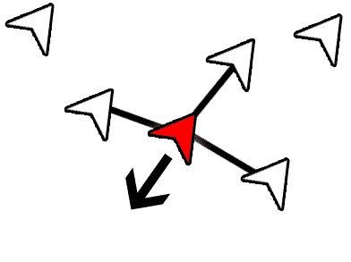

群聚中分离的图解

在前一张图中，中间的鸟以不改变航向的方式向其他鸟移动。

+   **对齐**：这意味着与鸟群以相同的方向和速度移动。以下图像说明了这个概念：

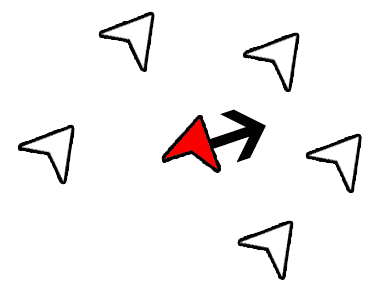

集群中的对齐图

在前面的图像中，中间的 boid 正在改变其航向，以匹配其周围的 boid 的航向。

+   **凝聚力**：这意味着保持与鸟群中心的最大距离。以下图像说明了这个概念：

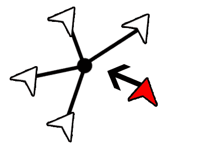

集群中的凝聚力图

在前面的图像中，鸟群右侧的 boid 移动到箭头方向，以确保其与最近的 boid 组的距离最小。

# 使用雷诺兹算法

不再拖延，让我们深入了解雷诺兹集群算法。我们的集群实现有两个主要的脚本：`Boid.cs`和`FlockController.cs`。本章的示例代码提供了一个包含所有必要设置的场景，用于测试。你还会注意到一个名为`TargetMovement.cs`的第三个脚本，我们使用它来移动场景中我们的鸟群将跟随的目标。

对于我们的 boid，我们可以使用一个简单的立方体作为预制件。当然，你可以随意用任何你想要的美术作品替换立方体。让我们将`Boid.cs`脚本添加到我们的 boid 预制件中。代码看起来是这样的：

```py
using UnityEngine;

public class Boid : MonoBehaviour 
{
    [SerializeField]
    private FlockController flockController;

    //The modified direction for the boid.
    private Vector3 targetDirection;
    //The Boid's current direction.
    private Vector3 direction;

    public FlockController FlockController 
    {
        get { return flockController; }
        set { flockController = value; }
    }

    public Vector3 Direction { get { return direction; }}

    private void Awake() 
    {
        direction = transform.forward.normalized;
        if(flockController != null) 
        {
            Debug.LogError("You must assign a flock controller!");
        }
    }

    private void Update() {
        targetDirection = FlockController.Flock(this, transform.localPosition, direction);
        if(targetDirection == Vector3.zero)
        {
            return;
        }
        direction = targetDirection.normalized;
        direction *= flockController.SpeedModifier;
        transform.Translate(direction * Time.deltaTime);
    } 
}
```

一开始，你就会注意到对`FlockController`的引用，我们将在下一步创建它。你可以将`FlockController`视为集群/鸟群的共享大脑。每个 boid 不需要直接意识到其邻居，因为`FlockController`会单独处理这些信息。这使我们能够保持 boid 代码整洁。

我们在`Awake`方法中初始化方向向量，并确保`FlockController`被分配，或者我们记录一个错误。你可以通过多种方式强制执行空安全，例如，如果没有提供，则创建实例，但在我们的情况下，我们将假设你通过检查器分配了值。

`Update`方法完成其余的工作——它在`FlockController`上调用`Flock()`方法，并传入对自身的引用、其局部位置和其方向。这将返回一个向量，然后我们将其归一化以保持运动看起来不会太突然或太快，并使用`Transform.Translate()`应用运动。像往常一样，确保你在`Time.deltaTime`上平滑运动，以确保帧与帧之间的平滑运动。

重要的是要注意，我们确保缓存尽可能多的`Vector3`变量。通过避免使用`new Vector3()`来避免分配，尽可能减少分配。

# 实现 FlockController

`FlockController`将处理整个鸟群的协调。在变量方面，这里有很多事情要做。让我们逐块查看`FlockController.cs`：

```py
private int flockSize = 20;
```

在这里，我们简单地分配我们鸟群的规模。你将在后面的`Awake`方法中看到这个值的使用：

```py
private float speedModifier = 5;

[SerializeField]
private float alignmentWeight = 1;

[SerializeField]
private float cohesionWeight = 1;

[SerializeField]
private float separationWeight = 1;

[SerializeField]
private float followWeight = 5;
```

然后，我们声明一系列的修改器和权重值。`speedModifier` 直接影响我们的鸟可以移动多快。根据需要调整这个值。`speedModifier` 后面的三个值分别是对齐、凝聚和分离的权重值。这些值将在最终计算所有驱动鸟移动的方向向量的权重中乘以其权重。`followWeight` 用于权衡目标的变化量与鸟的变化量。如果你想使鸟更紧密地跟随目标，增加这个值。

```py
[SerializeField]
private Boid prefab;
[SerializeField]
private float spawnRadius = 3.0f;
private Vector3 spawnLocation = Vector3.zero;

[SerializeField]
public Transform target;
```

以下变量块定义了一些更多的设置变量，我们在检查器中分配这些变量。首先，我们有要生成的鸟的预制体（它应该附加了 `Boid.cs` 组件）。`spawnRadius` 用于避免在所有鸟群成员都生成在同一个点上时可能出现的错误。相反，我们在给定的半径内生成它们，如这个变量所定义的。最后，`target` 是我们鸟群/群体的目标变换的引用。在我们的测试场景中，它是一个带有 `TargetMovement.cs` 组件的球体。

让我们看看 `Awake` 方法：

```py
private void Awake()
{
    flockList = new List<Boid>(flockSize); 
    for (int i = 0; i < flockSize; i++)
    {
        spawnLocation = Random.insideUnitSphere * spawnRadius + transform.position;
        Boid boid = Instantiate(prefab, spawnLocation, transform.rotation) as Boid;

        boid.transform.parent = transform;
        boid.FlockController = this;
        flockList.Add(boid);
    }
}
```

我们通过循环足够多次来生成足够的鸟以填充我们的 `flockSize` 变量。这是我们的 `spawnLocation` 和 `spawnRadius` 发挥作用的地方。Unity 的 `Random.insideUnitSphere` 生成随机位置，我们将它添加到我们的变换位置以得到实际的生成位置。然后我们实例化鸟的预制体，将其分配给一个 `Boid` 实例，然后将其添加到我们的 `flockList` 中。此外，请注意，我们在这一步分配了鸟实例的 `FlockController` 属性。

请记住，在 Unity 中实例化预制体可能会很慢，因此增加鸟群中的鸟的数量会导致实例化帧期间性能大幅下降。

本类中唯一的另一种方法是 `Flock()` 方法，我们之前在 `Boid` 中看到过它被调用。这个方法负责计算单个鸟群成员的方向。它看起来是这样的：

```py
public Vector3 Flock(Boid boid, Vector3 boidPosition, Vector3 boidDirection)
{
    flockDirection = Vector3.zero;
    flockCenter = Vector3.zero;
    targetDirection = Vector3.zero;
    separation = Vector3.zero;

    for (int i = 0; i < flockList.Count; ++i) 
    {
        Boid neighbor = flockList[i];
        //Check only against neighbors.
        if (neighbor != boid) 
        {
            //Aggregate the direction of all the boids.
            flockDirection += neighbor.Direction;
            //Aggregate the position of all the boids.
            flockCenter += neighbor.transform.localPosition;
            //Aggregate the delta to all the boids.
            separation += neighbor.transform.localPosition - boidPosition;
            separation *= -1;
        }
    }
    //Alignment. The average direction of all boids.
    flockDirection /= flockSize;
    flockDirection = flockDirection.normalized * alignmentWeight;

    //Cohesion. The centroid of the flock.
    flockCenter /= flockSize;
    flockCenter = flockCenter.normalized * cohesionWeight;

    //Separation.
    separation /= flockSize;
    separation = separation.normalized * separationWeight;

    //Direction vector to the target of the flock.
    targetDirection = target.localPosition - boidPosition;
    targetDirection = targetDirection * followWeight;

    return flockDirection + flockCenter + separation + targetDirection;
}
```

该方法接受有关我们的 `Boid` 的某些信息，以及它的一个副本。然后我们遍历 `flockList` 中的每个鸟，并将当前迭代索引处的鸟分配给一个临时值，称为 `neighbor`。为了避免进行多个循环，我们在同一个 `for` 循环中做几件事情：

+   求所有邻居的方向之和

+   求所有邻居的位置之和

+   求到所有邻居的位置变化量之和

一旦完成循环（从而汇总所有前面的值），我们计算以下内容：

+   鸟群方向，通过平均所有鸟的方向得到。由于我们已经得到了所有方向的总和，我们只需将其除以鸟的数量，即 `flockSize`。然后我们规范化这个值并应用我们之前定义的权重。这将给我们我们的对齐。

+   同样，我们通过平均所有鸟群的位置来获取鸟群的质心。与方向一样，我们在应用加权之前对向量进行归一化。`flockCenter`给我们提供了我们的凝聚力向量。

+   你在这里看到了一个模式，对吧？就像前两个值一样，我们取平均值，然后归一化，最后对分离值进行加权。

+   `targetDirection`有一点不同。我们首先计算鸟群位置和目标位置之间的差值，然后应用权重。在这个实现中，我们不归一化这个值，但你可以自由地通过这样做来实验。归一化这个值不会破坏模拟，但你可能会注意到如果你的目标移动得太快，鸟群可能会随意地漂浮离目标。

在计算出所有的值——凝聚力、对齐和分离——之后，我们将它们加起来，并将结果返回给调用该方法的`Boid`实例。鸟群将使用这个向量作为它的目标方向，正如我们在`Boid.cs`文件中看到的。

由于我们可能有一打或几百个鸟群，因此在运行时避免任何不必要的计算是很重要的。如果你对我们的实现进行性能分析，你会注意到它根本不分配任何内存，这意味着你不会因为垃圾回收而遇到任何令人烦恼的卡顿。由于系统的单线程特性，随着鸟群数量的增加，系统会变慢，但几十个鸟群运行得非常快。正如你在下面的屏幕截图中所看到的，一个小鸟群在飞行中的计算可以在不到一毫秒内完成：

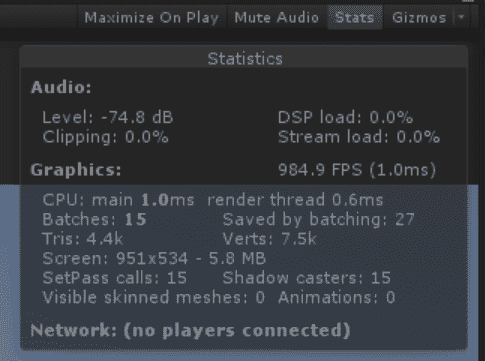

显示我们场景性能的统计面板

# 鸟群目标

最后但同样重要的是，我们有我们的鸟群目标。再次强调，你可以使用你喜欢的任何艺术作品，或者你可以坚持使用提供的示例项目中那个英俊的小球体。目标组件的代码位于`TargetMovement.cs`文件中。内容看起来是这样的：

```py
using UnityEngine;

public class TargetMovement : MonoBehaviour 
{
    [SerializeField]
    private Vector3 bounds;
    [SerializeField]
    private float moveSpeed = 10.0f;
    [SerializeField]
    private float turnSpeed = 3.0f;
    [SerializeField]
    private float targetPointTolerance = 5.0f;

    private Vector3 initialPosition;
    private Vector3 nextMovementPoint;
    private Vector3 targetPosition;

    private void Awake() 
    {
        initialPosition = transform.position;
        CalculateNextMovementPoint();
    }

    private void Update () 
    {
        transform.Translate(Vector3.forward * moveSpeed * Time.deltaTime);
        transform.rotation = Quaternion.Slerp(transform.rotation, Quaternion.LookRotation(nextMovementPoint - transform.position), turnSpeed * Time.deltaTime);

        if(Vector3.Distance(nextMovementPoint, transform.position) <= targetPointTolerance) 
        {
            CalculateNextMovementPoint();
        }
    }

    private void CalculateNextMovementPoint()
    {
        float posX = Random.Range(initialPosition.x - bounds.x, initialPosition.x + bounds.x);
        float posY = Random.Range(initialPosition.y - bounds.y, initialPosition.y + bounds.y);
        float posZ = Random.Range(initialPosition.z - bounds.z, initialPosition.z + bounds.z);
        targetPosition.x = posX;
        targetPosition.y = posY;
        targetPosition.z = posZ;
        nextMovementPoint = initialPosition + targetPosition; 
    }
}
```

这个类中有两个主要的工作部分。首先，`Update`方法将游戏对象移动到`forward`向量方向，同时旋转它朝向`targetPosition`。我们提供了两个变量来修改移动和转向速度：`moveSpeed`和`turnSpeed`。然后我们通过比较到达目标点的距离与我们在`targetPointTolerance`中定义的容差半径来检查我们是否已经到达目的地。如果我们足够接近，我们就通过调用`CalculateNextMovementPoint()`来设置下一个目标点。

在`CalculateNextMovementPoint()`中，我们设置一个随机的目标位置，但基于我们边界值进行约束，相对于我们首次运行脚本时目标的位置，因为我们已经在`Awake`中设置了`initialPosition`。约束这个点将防止目标慢慢偏离我们的游戏区域，并飘向日落。虽然这可能很戏剧化，但这并不是我们在这里追求的效果。

# 场景布局

现在我们已经覆盖了所有代码，让我们看看我们的场景。我们的示例场景看起来如下截图所示：

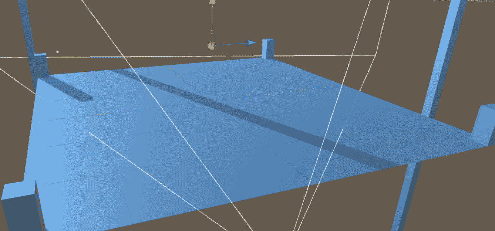

我们场景布局的概述

如前一张截图所示，我们的设置并没有太多复杂性。我们有一个平面，一些用于透视的环境立方体，一盏灯，一个摄像机和我们的目标。完整的层次结构如下截图所示：

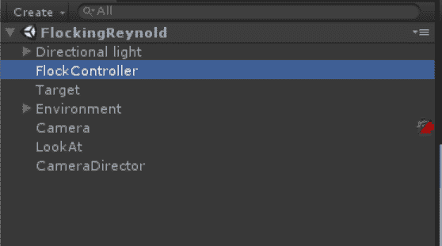

带有 FlockController 高亮的场景层次结构

如前一张截图所示，我们有一个方向光，其下嵌套了一个反射探针。这完全是出于让场景看起来更美观的目的，实际上几乎没有功能价值，但嘿，一点虚荣心永远不会伤害任何人！然后我们有一个名为 FlockController 的空游戏对象，我们的 `FlockController` 脚本附加到它上面。目标游戏对象是一个带有明亮的黄色材质的球体，并附加了 `TargetMovement` 脚本。所有环境块都嵌套在 Environment 游戏对象下，在这个例子中是一个平面。最后三项是为了驱动我们的摄像机，它将自动锁定到我们的目标，并保持在画面中。由于这超出了本书的范围，我们将跳过摄像机的工作原理，但如果你是好奇的类型，你可能会想探索官方 Unity 文档，了解更多关于 **Cinemachine** 和 **Timeline** 的信息，它们驱动着我们的场景中的摄像机。

回到正题——让我们看看 `FlockController`，它看起来如下截图所示：

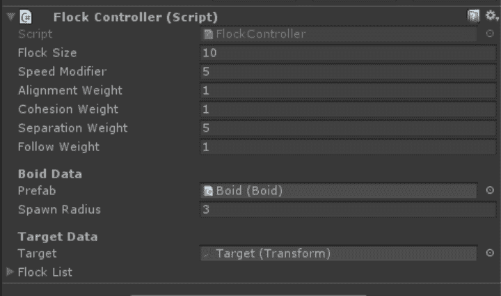

FlockController 组件

上一张截图显示了我们在示例场景中设置的值。正如你所见，分离权重略高于其他设置。在播放模式下自由调整权重值，看看它如何影响 boids 的行为。接下来，让我们看看目标游戏对象。以下截图显示了我们的示例设置：

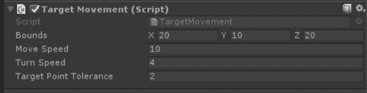

我们目标移动脚本的测试值

截图显示了测试场景的最佳值。调整边界可能会导致一些疯狂的摄像机移动，但请尝试调整移动和转向速度，看看它如何在播放模式下影响场景。最后，让我们看看我们的 boid 预制件，它上面有 `Boid` 组件。提供的示例项目的 boid 设置可以在以下截图中看到：

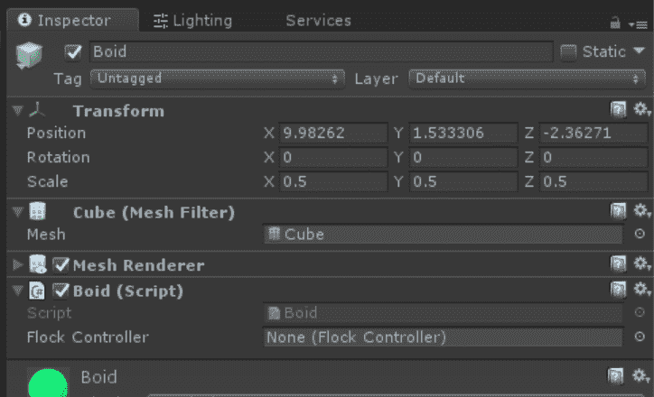

Boid 游戏对象的全部组件和设置

前一张截图并没有太多激动人心的内容。正如你所见，Flock Controller 是空的（因为我们通过代码在运行时分配它），boid 本身没有其他可调整的值，除非你愿意调整外观，但我们的霓虹绿立方体确实是一件艺术品，如果我说了算的话。

当你按下播放时，你会看到你的鸟群孵化并跟随目标在场景中移动。它看起来可能像下面的屏幕截图：

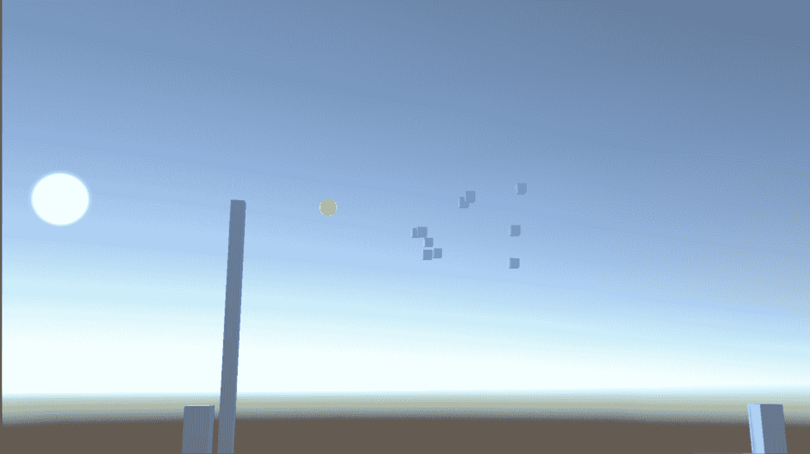

我们的一群鸟群正涌向目标球体

就这样，我们创建了自己的群体系统。强烈建议您不仅调整检查器中的值，还尝试修改代码。查看一个值如何影响整个系统的最简单方法就是将其移除，或者将其增加到荒谬的程度。接下来，我们将探讨 Unity 2017 中的群体。

# 使用群体

群体模拟远非一目了然。在广义上，并没有任何一种方法可以实施它们。虽然不是一个严格的定义，但“群体模拟”这个术语通常指的是模拟人群化代理在区域内导航，同时避免彼此和环境。像鸟群一样，群体模拟在电影中的应用已经非常广泛。例如，在《指环王》中，罗翰、刚铎和魔多的史诗般的军队相互战斗，这些军队完全是通过群体模拟软件**Massive**进行程序化生成的，该软件是为电影制作的。虽然群体算法在视频游戏中的应用不如在电影中广泛，但某些类型比其他类型更依赖于这一概念。实时策略游戏通常涉及屏幕上移动的军队，而许多沙盒游戏模拟了密集的城市，屏幕上有许多代理在避免彼此、玩家甚至交通的同时度过他们的日常生活。

# 实现一个简单的群体模拟

我们的实现将快速、简单且有效，并将专注于使用 Unity 的 NavMesh 功能。幸运的是，NavMesh 将为我们处理大部分繁重的工作。我们的示例群体场景有一个简单的行走表面，上面烘焙了 NavMesh，一些目标，以及两个胶囊队伍，如下面的屏幕截图所示：

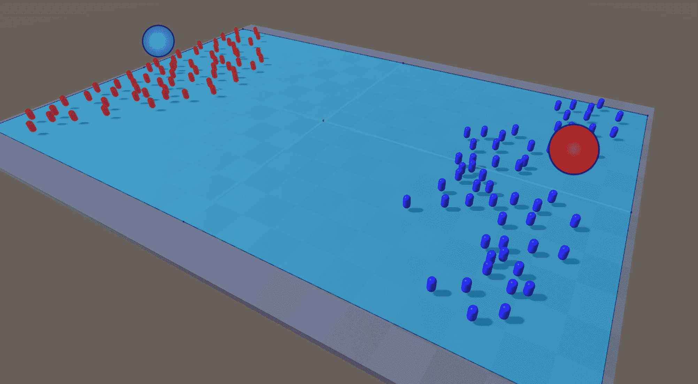

经典场景：红色对蓝色

在前面的屏幕截图中，我们可以看到我们的红色和蓝色目标分别与他们的队伍相反：红色和蓝色。关于为什么蓝色和红色部落无法相处，你的猜测和我的一样，但这对我们的样本来说适用，所以我将让他们按自己的方式行事。设置很简单。每个胶囊都附加了一个`CrowdAgent.cs`组件，当你按下播放时，每个代理将朝着他们的目标前进，同时避免彼此和来自对方队伍的迎面而来的胶囊。一旦他们到达目的地，他们将在目标周围聚集。

这种设置将我们的例子从第四章，《寻找你的路》提升到了下一个层次。现在我们有了大量智能体，它们不仅正在导航到目标位置，而且在避免大量其他智能体的同时这样做。正如你所见，Unity 的 NavMesh 优雅地处理了这些交互。该系统既高效又非常健壮。

在游戏运行时，你甚至可以在编辑器中选择单个胶囊或一组胶囊，以查看它们的可视化行为。只要你的导航窗口处于活动状态，你就能看到一些关于你的 NavMesh 及其上智能体的调试信息，如以下屏幕截图所示：

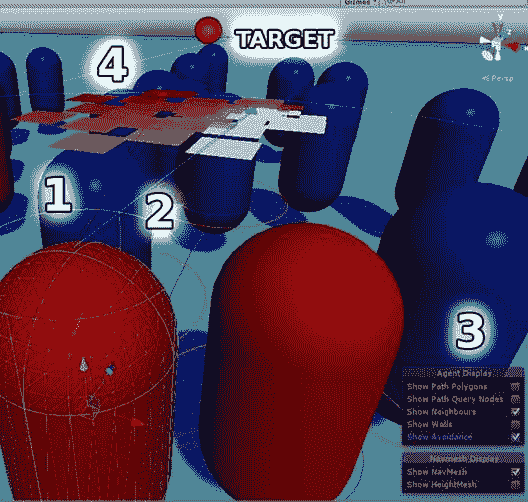

从智能体视角的调试视图

在编辑器中查看这一点，以真正了解它在运动中的样子是值得的，但我们已经在先前的屏幕截图中标出了一些关键元素：

1.  这是指向`NavMeshAgent`目的地的目的地箭头，对于这个小家伙来说，它是`RedTarget`。这个箭头所关心的只是目的地在哪里，而不管智能体面向或移动的方向如何。

1.  这个箭头是方向箭头。它显示了智能体实际移动的方向。智能体的方向考虑了多个因素，包括其邻居的位置、NavMesh 上的空间以及目的地。

1.  这个调试菜单允许你显示几个不同的事物。在我们的例子中，我们启用了显示规避和显示邻居。

1.  说到规避，这个从深色到浅色、悬浮在智能体上方的正方形群代表了我们智能体和目的地之间需要规避的区域。较暗的正方形表示其他智能体密集分布或被环境阻挡的区域，而较浅的白色正方形表示可以安全穿过的区域。当然，这是一个动态显示，所以当你在这个编辑器中玩耍时，你会看到它如何变化。

# 使用 CrowdAgent 组件

`CrowdAgent`组件非常简单，但能完成任务。如前所述，Unity 为我们做了大部分繁重的工作。以下代码为我们的`CrowdAgent`提供了一个目的地：

```py
using UnityEngine; 
using System.Collections; 

[RequireComponent(typeof(NavMeshAgent))] 
public class CrowdAgent : MonoBehaviour 
{         
    public Transform target; 

    private NavMeshAgent agent; 

    void Start () 
    { 
        agent = GetComponent<NavMeshAgent>(); 
        agent.speed = Random.Range(4.0f, 5.0f); 
        agent.SetDestination(target.position); 
    } 
}
```

脚本需要一个类型为`NavMeshAgent`的组件，它在`Start()`中将它分配给`agent`变量。然后我们随机设置其速度在两个值之间，为我们的模拟增加一些视觉多样性。最后，我们将其目的地设置为目标标记的位置。目标标记通过检查器分配，如以下屏幕截图所示：

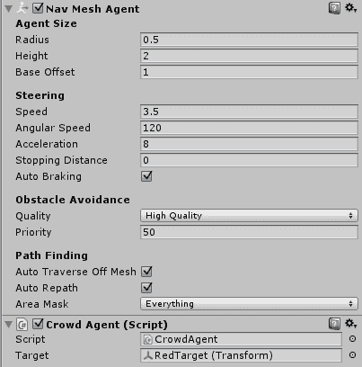

NavMeshAgent 的检查器设置

先前的屏幕截图展示了红色胶囊的`CrowdAgent`组件，其目标设置为 RedTarget（变换）。为了好玩，你可以尝试设置不同的目标。由于唯一的要求是该目标必须是`Transform`类型，你甚至可以将另一个智能体设置为目标！

# 添加一些有趣的障碍物

不需要在我们的代码中做任何其他操作，我们只需对我们的场景布局做一些修改，并启用 Unity 提供的一些组件，就可以显著改变智能体的行为。在我们的`CrowdsObstacles`场景中，我们在环境中添加了几堵墙，为我们的红色和蓝色胶囊团队创建了一个迷宫式的布局，如下面的截图所示：

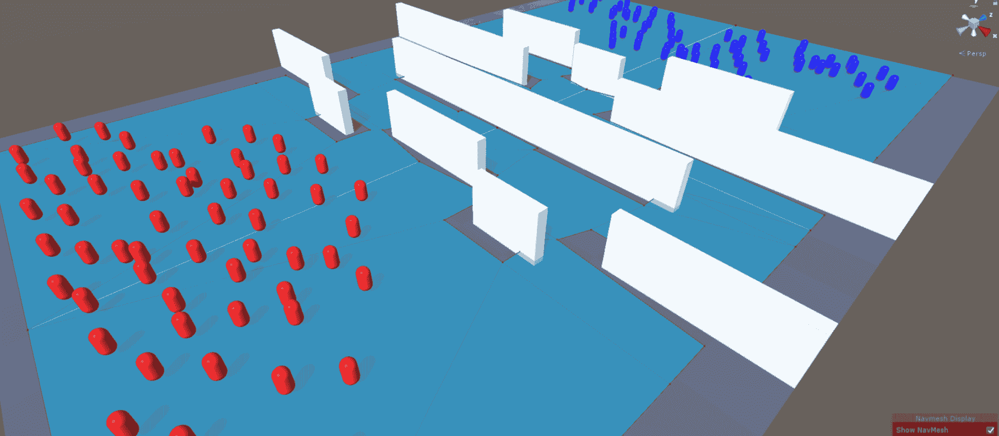

让游戏开始吧！

这个例子有趣的部分在于，由于每个智能体的随机速度，每次运行游戏时结果都会完全不同。当智能体在环境中移动时，它们会被队友或对手的智能体阻挡，并被迫重新规划路线，找到到达目标的最快路径。当然，这个概念对我们来说并不陌生，因为我们已经在第四章“寻找路径”中看到了`NavMeshAgent`如何避开障碍物，除了在这个场景中我们有很多、很多更多的智能体。为了使这个例子更有趣，我们还给一面墙和一个`NavMeshObstacle`组件添加了一个简单的上下动画，看起来就像这样：

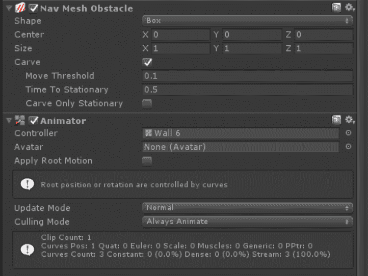

NavMeshObstacle 在 Unity 2017 中看起来略有不同

注意，当我们使用这个组件时，我们的障碍物不需要设置为静态。我们的障碍物主要是箱形的，所以我们保留默认的形状设置为箱形（胶囊形也是一个选择）。大小和中心选项让我们可以移动形状的轮廓并调整它的大小，但默认设置完美地适合我们的形状，这正是我们想要的，所以让我们保持这个设置不变。下一个选项“雕刻”非常重要。它基本上就是它所说的那样；它从 NavMesh 中雕刻出一个空间，如下面的截图所示：

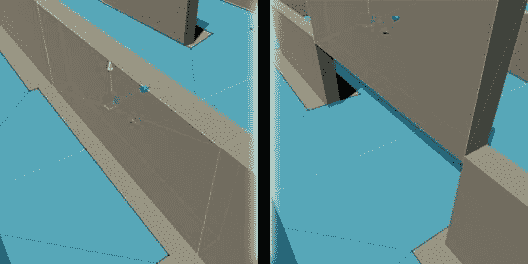

在上下动画的两个不同点上的相同障碍物

左侧截图显示了障碍物在表面上的空间，而右侧截图显示了当障碍物抬起时 NavMesh 的连接。我们可以保持时间到静止和移动阈值为默认设置，但我们确实想确保“仅雕刻静止”选项是关闭的。这是因为我们的障碍物是移动的，如果我们不勾选这个框，它就不会从 NavMesh 中雕刻出空间，我们的智能体就会试图穿过障碍物，无论它是上升还是下降，而这并不是我们想要的这种行为。

当障碍物上下移动并且网格被雕刻出来并重新连接时，你会注意到智能体在改变航向。当启用导航调试选项时，我们还可以看到在任何给定时刻我们智能体所发生的一切的非常有趣的可视化。这样对待我们可怜的智能体可能有点残忍，但我们这样做是为了科学！

以下截图让我们一窥我们让可怜的代理所承受的混乱和无序：

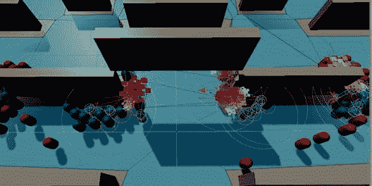

我在秘密地为蓝队加油

# 摘要

在本章中，我们学习了如何实现一个群体行为系统。我们通过自定义方向向量来实现它，这些向量控制着通过应用克雷格·雷诺兹的三个主要群体概念——对齐、凝聚和分离——计算出的鸟群运动。然后，我们将我们的群体行为应用于飞行物体，但你也可以将这些示例中的技术应用于实现其他角色行为，例如鱼群游动、昆虫集群或陆地动物的放牧。你只需实现不同的领导者运动行为，例如限制不能上下移动的角色沿 *y* 轴的运动。对于二维游戏，我们只需冻结 *y* 位置。对于不规则的地面上的二维运动，我们必须修改我们的脚本，以确保在 *y* 方向上不施加任何力。

我们还研究了人群模拟，并使用 Unity 的 NavMesh 系统实现了我们自己的版本，这是我们首次在第四章，*找到你的路*中了解到的。我们学习了如何可视化我们的代理的行为和决策过程。

在下一章中，我们将探讨行为树模式，并学习从头开始实现我们自己的版本。
