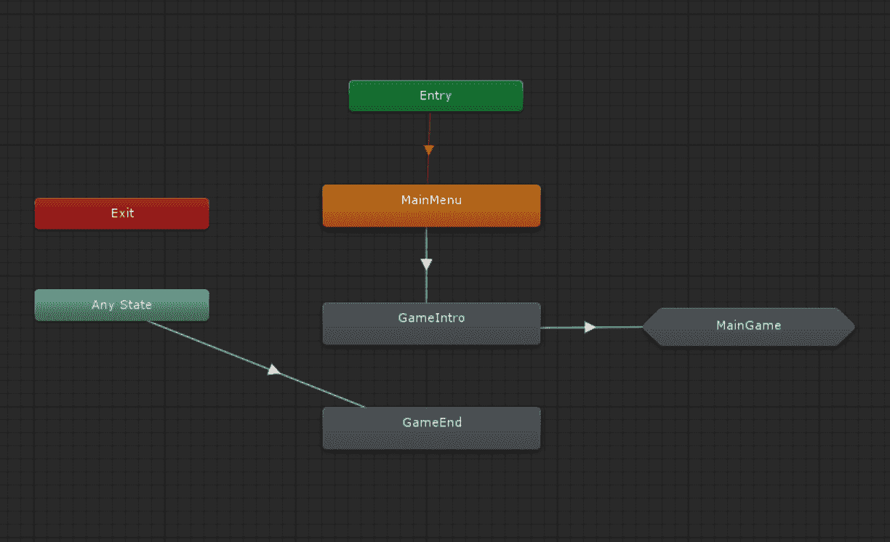

# 第六章：行为树

**行为树**（**BTs**）在游戏开发者中非常稳定地获得了人气。在过去十年中，BTs 已经成为许多开发者实现其 AI 代理行为规则的首选模式。像*光环*和*战争机器*这样的游戏系列是广泛使用 BTs 的著名游戏之一。PC、游戏机和移动设备中丰富的计算能力使它们成为在所有类型和规模的游戏中实现 AI 的好选择。

在本章中，我们将涵盖以下主题：

+   行为树的基本概念

+   使用现有行为树解决方案的好处

+   如何实现我们自己的行为树框架

+   如何使用我们的框架实现基本树

# 学习行为树的基本知识

行为树因其具有共同父节点的分层、分支节点系统而得名，这个父节点被称为根节点。正如你通过阅读本书所学到的那样，行为树也模仿了它们所命名的真实事物——在这种情况下，是树木及其分支结构。如果我们可视化一个行为树，它看起来可能就像以下图示：


基本树结构

当然，行为树可以由任意数量的节点和子节点组成。在层次结构最底层的节点被称为叶节点，就像一棵树一样。节点可以表示行为或测试。与依赖于转换规则来遍历的状态机不同，BT 的流程严格由每个节点在更大层次结构中的顺序定义。BT 从树的顶部开始评估（基于前面的可视化），然后继续通过每个子节点，这些子节点又依次运行其各自的子节点，直到满足条件或达到叶节点。BT 始终从根节点开始评估。

# 理解不同的节点类型

不同类型节点的名称可能因人而异，节点本身有时也被称为任务。虽然树的结构完全取决于 AI 的需求，但如果我们单独查看每个组件，关于 BT 如何工作的基本概念相对容易理解。以下是对每种类型的节点都成立的事实。节点将始终返回以下状态之一：

+   **成功**：节点检查的条件已经满足。

+   **失败**：节点检查的条件未满足，并且将不会满足。

+   **运行**：节点检查的条件的有效性尚未确定。这可以被视为我们的“请等待”状态。

由于 BT（行为树）的潜在复杂性，大多数实现都是异步的，至少对于 Unity 来说，这意味着评估树不会阻止游戏继续其他操作。BT 中各个节点的评估过程可能需要几个帧。如果你必须同时评估任何数量的代理上的多个树，你可以想象，如果必须等待每个树返回 true 或 false 给根节点，这将对程序的性能产生负面影响。这就是为什么“运行”状态很重要的原因。

# 定义复合节点

复合节点之所以被称为复合节点，是因为它们有一个或多个子节点。它们的状态完全基于评估子节点的结果，并且在评估子节点时，它们将处于“运行”状态。有几个复合节点类型，它们主要是由它们的子节点的评估方式来定义的：

+   **序列**：序列的定义特征是，整个子节点序列必须成功完成，它本身才能评估为成功。如果在序列的任何步骤中，任何一个子节点返回 false，序列本身将报告失败。重要的是要注意，通常情况下，序列是从左到右执行的。以下图分别显示了成功的序列和失败的序列：


成功的序列节点


不成功的序列节点

+   **选择器**：相比之下，选择器对它们的子节点更加宽容。如果一个选择器序列中的任何一个子节点返回 true，选择器就会说，“嗯，足够了！”并立即返回 true，而不会评估其子节点中的更多内容。选择器节点返回 false 的唯一方式是评估所有子节点，但没有一个返回成功。

当然，每种复合节点类型都有其用途，这取决于具体情况。你可以将不同类型的序列节点视为“与”和“或”条件。

# 理解装饰器节点

复合节点和装饰器节点之间最大的区别是，装饰器可以恰好有一个子节点，且只有一个子节点。起初，这可能会显得不必要，因为理论上你可以通过在节点本身包含条件而不是依赖其子节点来获得相同的功能，但装饰器节点是特殊的，因为它本质上接受子节点返回的状态，并根据其自己的参数评估响应。装饰器甚至可以指定其子节点的评估方式和评估频率。以下是一些常见的装饰器类型：

+   **逆变器**：将逆变器视为一个 NOT 修饰符。它接受其子节点返回的状态的反面。例如，如果子节点返回 TRUE，装饰器评估为 FALSE，反之亦然。这在 C#中相当于在布尔值前加上`!`运算符。

+   **重复器**：这个装饰器会重复评估子节点指定（或无限）次数，直到根据装饰器的判断评估为 TRUE 或 FALSE。例如，您可能希望无限期地等待直到满足某些条件，例如在角色使用攻击之前“拥有足够的能量”。

+   **限制器**：这个装饰器简单地限制了节点被评估的次数，以避免智能体陷入尴尬的无穷行为循环。与重复器相比，这个装饰器可以用来确保角色在放弃并尝试其他方法之前，例如，只能尝试打开门几次。

一些装饰节点可用于调试和测试您的树，例如：

+   **假状态**：这个状态总是根据装饰器的指定评估为真或假。这对于断言您的智能体中的某些行为非常有帮助。例如，您也可以让装饰器保持一个无限期的假“运行”状态，以观察周围的其他智能体的行为。

+   **断点**：就像代码中的断点一样，您可以让这个节点触发逻辑，通过调试日志或其他方法通知您节点已被达到。

这些类型不是互斥的单一原型。您可以将这些类型的节点组合起来以满足您的需求。只是要小心不要将太多功能组合到一个装饰器中，以至于使用序列节点可能更高效或更方便。

# 描述叶子节点

我们在本章前面简要介绍了叶子节点，以说明 BT 的结构，但叶子节点实际上可以是任何类型的行为。它们在意义上是神奇的，因为它们可以用来描述智能体可以拥有的任何逻辑。叶子节点可以指定一个行走函数、射击命令或踢动作。它所做的或你决定如何评估其状态无关紧要，它只需是其自身层次结构中的最后一个节点，并返回节点可以返回的三个状态中的任何一个。

# 评估现有解决方案

Unity 资产商店是开发者们的一个优秀资源。您不仅能够购买艺术、音频和其他类型的资产，而且它还包含大量插件和框架。对我们来说最重要的是，资产商店上有许多行为树插件可供选择，价格从免费到几百美元不等。大多数，如果不是全部，都提供某种形式的 GUI，使得可视化和管理变得相对轻松。

从资产商店中选择现成的解决方案有许多优点。许多框架包括高级功能，如运行时（和通常可视化）调试、健壮的 API、序列化和面向数据树支持。许多甚至包括用于游戏的示例叶子逻辑节点，以最小化您需要编写的代码量来启动和运行。

本书的前一版，《Unity 4.x 游戏人工智能编程》，专注于开发者 AngryAnt 的 Behave 插件，该插件目前作为付费插件在资产商店上提供，名为 Behave 2 for Unity，继续成为满足您行为树需求（以及更多）的绝佳选择。它是一个非常健壮、性能出色且设计精良的框架。

其他一些替代方案是**Behavior Machine**和**Behavior Designer**，它们提供不同的定价层次（Behavior Machine 甚至提供免费版）和广泛的有用功能。在网络上可以找到许多其他免费选项，包括通用的 C#和针对 Unity 的实现。最终，与其他任何系统一样，选择自己构建还是使用现有解决方案将取决于您的时间、预算和项目。

# 实现基本行为树框架

尽管本书的范围不包括具有图形用户界面（GUI）的完整行为树实现及其众多节点类型和变体，但我们当然可以专注于核心原则，以牢固掌握本章所涵盖的概念在实际操作中的样子。本章提供了行为树的基本框架。我们的示例将专注于简单的逻辑，以突出树的功能，而不是用复杂的游戏逻辑使示例变得复杂。我们的目标是让您对在游戏人工智能中可能显得令人生畏的概念感到舒适，并为您提供必要的工具来构建自己的树，并在需要时扩展提供的代码。

# 实现基本节点类

每个节点都需要一个基本功能。我们的简单框架将所有节点派生自一个基本的抽象`Node.cs`类。这个类将提供这种基本功能或至少是扩展该功能的签名：

```py
using UnityEngine; 
using System.Collections; 

[System.Serializable] 
public abstract class Node { 

    /* Delegate that returns the state of the node.*/ 
    public delegate NodeStates NodeReturn(); 

    /* The current state of the node */ 
    protected NodeStates m_nodeState; 

    public NodeStates nodeState { 
        get { return m_nodeState; } 
    } 

    /* The constructor for the node */ 
    public Node() {} 

    /* Implementing classes use this method to evaluate the desired set of conditions */ 
    public abstract NodeStates Evaluate(); 

} 
```

这个类相当简单。将`Node.cs`视为所有其他节点类型的基础蓝图。我们以`NodeReturn`委托开始，这在我们的示例中没有实现，但接下来的两个字段是。然而，`m_nodeState`是节点在任何给定点的状态。正如我们之前所学的，它将是`FAILURE`、`SUCCESS`或`RUNNING`之一。`nodeState`值只是`m_nodeState`的获取器，因为它受保护，我们不希望代码的其他任何部分意外地直接设置`m_nodeState`。

接下来，我们有一个空构造函数，为了明确起见，尽管它没有被使用。最后，我们有了`Node.cs`类的核心内容——`Evaluate()`方法。正如我们将在实现`Node.cs`的类中看到的那样，`Evaluate()`是魔法发生的地方。它运行确定节点状态的代码。

# 扩展节点到选择器

要创建一个选择器，我们只需扩展我们在`Node.cs`类中描述的功能：

```py
using UnityEngine; 
using System.Collections; 
using System.Collections.Generic; 

public class Selector : Node { 
    /** The child nodes for this selector */ 
    protected List<Node> m_nodes = new List<Node>(); 

    /** The constructor requires a lsit of child nodes to be  
     * passed in*/ 
    public Selector(List<Node> nodes) { 
        m_nodes = nodes; 
    } 

    /* If any of the children reports a success, the selector will 
     * immediately report a success upwards. If all children fail, 
     * it will report a failure instead.*/ 
    public override NodeStates Evaluate() { 
        foreach (Node node in m_nodes) { 
            switch (node.Evaluate()) { 
                case NodeStates.FAILURE: 
                    continue; 
                case NodeStates.SUCCESS: 
                    m_nodeState = NodeStates.SUCCESS; 
                    return m_nodeState; 
                case NodeStates.RUNNING: 
                    m_nodeState = NodeStates.RUNNING; 
                    return m_nodeState; 
                default: 
                    continue; 
            } 
        } 
        m_nodeState = NodeStates.FAILURE; 
        return m_nodeState; 
    } 
} 
```

正如我们在本章前面所学的，选择器是复合节点：这意味着它们有一个或多个子节点。这些子节点存储在 `m_nodes List<Node>` 变量中。尽管可以想象扩展这个类的功能以允许在类实例化后添加更多子节点，但我们最初通过构造函数提供这个列表。

代码的下一部分更有趣，因为它展示了我们之前学到的概念的实际实现。`Evaluate()` 方法会遍历其所有子节点，并逐个评估它们。如果一个子节点返回 `FAILURE` 并不必然意味着整个选择器的失败，如果其中一个子节点返回 `FAILURE`，我们就简单地继续到下一个子节点。相反，如果任何一个子节点返回 `SUCCESS`，那么我们就已经完成了；我们可以相应地设置这个节点的状态并返回该值。如果我们遍历了所有子节点并且它们都没有返回 `SUCCESS`，那么我们基本上可以确定整个选择器已经失败，并分配并返回一个 `FAILURE` 状态。

# 接下来是序列

序列在实现上非常相似，但正如你可能已经猜到的，`Evaluate()` 方法的行为有所不同：

```py
using UnityEngine; 
using System.Collections; 
using System.Collections.Generic; 

public class Sequence : Node { 
    /** Children nodes that belong to this sequence */ 
    private List<Node> m_nodes = new List<Node>(); 

    /** Must provide an initial set of children nodes to work */ 
    public Sequence(List<Node> nodes) { 
        m_nodes = nodes; 
    } 

    /* If any child node returns a failure, the entire node fails. Whence all  
     * nodes return a success, the node reports a success. */ 
    public override NodeStates Evaluate() { 
        bool anyChildRunning = false; 

        foreach(Node node in m_nodes) { 
            switch (node.Evaluate()) { 
                case NodeStates.FAILURE: 
                    m_nodeState = NodeStates.FAILURE; 
                    return m_nodeState;                     
                case NodeStates.SUCCESS: 
                    continue; 
                case NodeStates.RUNNING: 
                    anyChildRunning = true; 
                    continue; 
                default: 
                    m_nodeState = NodeStates.SUCCESS; 
                    return m_nodeState; 
            } 
        } 
        m_nodeState = anyChildRunning ? NodeStates.RUNNING : NodeStates.SUCCESS; 
        return m_nodeState; 
    } 
} 
```

序列中的 `Evaluate()` 方法需要为所有子节点返回 true，如果在过程中任何一个子节点失败，整个序列就会失败，这就是为什么我们首先检查 `FAILURE` 并相应地设置和报告它的原因。`SUCCESS` 状态仅仅意味着我们还有机会再战一天，然后继续到下一个子节点。如果任何一个子节点被确定为处于 `RUNNING` 状态，我们就报告这个状态为节点状态，然后父节点或驱动整个树的逻辑可以再次评估它。

# 将装饰器实现为逆或器

`Inverter.cs` 的结构略有不同，但它与所有其他节点一样，都源自 `Node`。让我们看看代码并找出差异：

```py
using UnityEngine; 
using System.Collections; 

public class Inverter : Node { 
    /* Child node to evaluate */ 
    private Node m_node; 

    public Node node { 
        get { return m_node; } 
    } 

    /* The constructor requires the child node that this inverter decorator 
     * wraps*/ 
    public Inverter(Node node) { 
        m_node = node; 
    } 

    /* Reports a success if the child fails and 
     * a failure if the child succeeds. Running will report 
     * as running */ 
    public override NodeStates Evaluate() { 
        switch (m_node.Evaluate()) { 
            case NodeStates.FAILURE: 
                m_nodeState = NodeStates.SUCCESS; 
                return m_nodeState; 
            case NodeStates.SUCCESS: 
                m_nodeState = NodeStates.FAILURE; 
                return m_nodeState; 
            case NodeStates.RUNNING: 
                m_nodeState = NodeStates.RUNNING; 
                return m_nodeState; 
        } 
        m_nodeState = NodeStates.SUCCESS; 
        return m_nodeState; 
    } 
}
```

如您所见，由于装饰器只有一个子节点，所以我们没有 `List<Node>`，而是一个单独的节点变量 `m_node`。我们通过构造函数传递这个节点（本质上要求这样做），但没有理由你不能修改这段代码以提供一个空构造函数和一个在实例化后分配子节点的方法。

`Evalute()` 的实现实现了我们在本章前面描述的逆或器的行为：当子节点评估为 `SUCCESS` 时，逆或器报告 `FAILURE`，而当子节点评估为 `FAILURE` 时，逆或器报告 `SUCCESS`。`RUNNING` 状态则正常报告。

# 创建一个通用的动作节点

现在我们来到了`ActionNode.cs`，这是一个通用的叶节点，可以通过委托传递一些逻辑。您可以根据自己的逻辑以任何方式实现叶节点，只要它从`Node`派生。这个特定的例子既灵活又有限制。它在灵活性方面允许您传递任何与委托签名匹配的方法，但正因为如此，它只提供了一个不接受任何参数的委托签名：

```py
using System; 
using UnityEngine; 
using System.Collections; 

public class ActionNode : Node { 
    /* Method signature for the action. */ 
    public delegate NodeStates ActionNodeDelegate(); 

    /* The delegate that is called to evaluate this node */ 
    private ActionNodeDelegate m_action; 

    /* Because this node contains no logic itself, 
     * the logic must be passed in in the form of  
     * a delegate. As the signature states, the action 
     * needs to return a NodeStates enum */ 
    public ActionNode(ActionNodeDelegate action) { 
        m_action = action; 
    } 

    /* Evaluates the node using the passed in delegate and  
     * reports the resulting state as appropriate */ 
    public override NodeStates Evaluate() { 
        switch (m_action()) { 
            case NodeStates.SUCCESS: 
                m_nodeState = NodeStates.SUCCESS; 
                return m_nodeState; 
            case NodeStates.FAILURE: 
                m_nodeState = NodeStates.FAILURE; 
                return m_nodeState; 
            case NodeStates.RUNNING: 
                m_nodeState = NodeStates.RUNNING; 
                return m_nodeState; 
            default: 
                m_nodeState = NodeStates.FAILURE; 
                return m_nodeState; 
        } 
    } 
} 
```

使此节点工作关键是`m_action`委托。对于那些熟悉 C++的人来说，C#中的委托可以被视为某种函数指针。您也可以将委托视为包含（或更准确地说，指向）函数的变量。这允许您在运行时设置要调用的函数。构造函数要求您传递一个与签名匹配的方法，并期望该方法返回一个`NodeStates`枚举。该方法可以实施任何您想要的逻辑，只要满足以下条件。与我们所实现的其它节点不同，此节点不会切换到 switch 之外的任何状态，因此它默认为`FAILURE`状态。您可以选择通过修改默认返回值来默认为`SUCCESS`或`RUNNING`状态。

您可以通过从它派生或简单地对其进行所需更改来轻松扩展此类。您还可以完全跳过这个通用动作节点，并实现特定叶节点的单次版本，但尽可能重用代码是一个好的实践。只需记住要从`Node`派生并实现所需的代码！

# 测试我们的框架

我们刚刚审查的框架实际上就是这个。它为我们提供了构建树所需的所有功能，但我们必须自己构建实际的树。为了本书的目的，提供了一个部分手动构建的树。

# 提前规划

在我们设置树之前，让我们看看我们试图实现什么。在实现之前可视化树通常很有帮助。我们的树将从零计数到指定的值。在这个过程中，它将检查该值是否满足某些条件，并相应地报告其状态。以下图表说明了我们树的基礎层次结构：


在我们的测试中，我们将使用一个三层树，包括根节点：

+   **节点 1**：这是我们根节点。它有子节点，我们希望能够在任何子节点成功的情况下返回成功，因此我们将它实现为一个选择器。

+   **节点 2a**：我们将使用`ActionNode`来实现此节点。

+   **节点 2b**：我们将使用此节点来演示我们的逆变器是如何工作的。

+   **节点 2c**：我们将再次从节点**2a**运行相同的`ActionNode`，并看看这对我们的树评估有何影响。

+   **节点 3**：节点 `3` 恰好是树第三层的唯一节点。它是 **2b** 装饰节点的一个子节点。这意味着如果它报告 `SUCCESS`，则 **2b** 将报告 `FAILURE`，反之亦然。

到目前为止，我们对实现细节仍然有些模糊，但前面的图将帮助我们可视化我们在代码中实现的树。在查看代码时，请将其保留以供参考。

# 检查我们的场景设置

我们已经看过了我们树的基本结构，在我们深入实际代码实现之前，让我们看看我们的场景设置。下面的截图显示了我们的层次结构；节点被突出显示以强调：


设置相当简单。有一个带有世界空间画布的四边形，它只是用于在测试期间显示一些信息。前面截图中的突出显示的节点将在代码中稍后引用，我们将使用它们来可视化每个单独节点的状态。实际场景看起来大致如下截图所示：


我们的实际布局模仿了我们之前创建的图

如您所见，我们有一个节点或框代表我们在规划阶段设置的每个节点。这些在实际情况的测试代码中会被引用，并且会根据返回的状态改变颜色。

# 探索 MathTree 代码

不再拖延，让我们看看驱动我们测试的代码。这是 `MathTree.cs`：

```py
using UnityEngine; 
using UnityEngine.UI; 
using System.Collections; 
using System.Collections.Generic; 

public class MathTree : MonoBehaviour { 
    public Color m_evaluating; 
    public Color m_succeeded; 
    public Color m_failed; 

    public Selector m_rootNode; 

    public ActionNode m_node2A; 
    public Inverter m_node2B; 
    public ActionNode m_node2C; 
    public ActionNode m_node3; 

    public GameObject m_rootNodeBox; 
    public GameObject m_node2aBox; 
    public GameObject m_node2bBox; 
    public GameObject m_node2cBox; 
    public GameObject m_node3Box; 

    public  int m_targetValue = 20; 
    private int m_currentValue = 0; 

    [SerializeField] 
    private Text m_valueLabel; 
```

前几个变量只是用于调试。三个颜色变量是我们将分配给节点框以可视化其状态的颜色。默认情况下，`RUNNING` 是黄色，`SUCCESS` 是绿色，`FAILED` 是红色。这是相当标准的事情；让我们继续前进。

然后我们声明我们的实际节点。如您所见，`m_rootNode` 是一个选择器，正如我们之前提到的。请注意，我们还没有分配任何节点变量，因为我们必须向它们的构造函数传递一些数据。

我们接下来有对我们在场景中看到的框的引用。这些只是我们拖放到检查器中的游戏对象（我们会在检查代码之后查看）。

我们接下来有几个 `int` 值，当我们查看逻辑时会更有意义，所以我们会跳过这些。最后，我们有一个 Unity UI Text 变量，在测试期间会显示一些值。

让我们来看看我们实际节点的初始化：

```py
    /* We instantiate our nodes from the bottom up, and assign the children 
     * in that order */ 
   void Start () { 
        /** The deepest-level node is Node 3, which has no children. */ 
        m_node3 = new ActionNode(NotEqualToTarget); 

        /** Next up, we create the level 2 nodes. */ 
        m_node2A = new ActionNode(AddTen); 

        /** Node 2B is a selector which has node 3 as a child, so we'll pass  
         * node 3 to the constructor */ 
        m_node2B = new Inverter(m_node3); 

        m_node2C = new ActionNode(AddTen); 

        /** Lastly, we have our root node. First, we prepare our list of children 
         * nodes to pass in */ 
        List<Node> rootChildren = new List<Node>(); 
        rootChildren.Add(m_node2A); 
        rootChildren.Add(m_node2B); 
        rootChildren.Add(m_node2C); 

        /** Then we create our root node object and pass in the list */ 
        m_rootNode = new Selector(rootChildren); 

        m_valueLabel.text = m_currentValue.ToString(); 

        m_rootNode.Evaluate(); 

        UpdateBoxes(); 
   }
```

为了组织结构，我们从树的底部到顶部声明我们的节点，或者说是根节点。我们这样做是因为我们不能在没有传递其子节点的情况下实例化父节点，所以我们必须首先实例化子节点。请注意，`m_node2A`、`m_node2C`和`m_node3`是动作节点，因此我们传递了代表（我们将在下一节中查看这些方法）。然后，作为选择器的`m_node2B`接受一个节点作为子节点，在这种情况下是`m_node3`。在我们声明了这些层级之后，我们将所有 2 级节点放入一个列表中，因为我们的 1 级节点，即根节点，是一个需要实例化子节点列表的选择器。

在我们实例化所有节点之后，我们启动流程，并开始使用其`Evaluate()`方法评估我们的根节点。`UpdateBoxes()`方法只是更新我们之前声明的`box`游戏对象的颜色；我们将在本节的稍后部分查看它：

```py
private void UpdateBoxes() { 
        /** Update root node box */ 
        if (m_rootNode.nodeState == NodeStates.SUCCESS) { 
            SetSucceeded(m_rootNodeBox); 
        } else if (m_rootNode.nodeState == NodeStates.FAILURE) { 
            SetFailed(m_rootNodeBox); 
        } 

        /** Update 2A node box */ 
        if (m_node2A.nodeState == NodeStates.SUCCESS) { 
            SetSucceeded(m_node2aBox); 
        } else if (m_node2A.nodeState == NodeStates.FAILURE) { 
            SetFailed(m_node2aBox); 
        } 

        /** Update 2B node box */ 
        if (m_node2B.nodeState == NodeStates.SUCCESS) { 
            SetSucceeded(m_node2bBox); 
        } else if (m_node2B.nodeState == NodeStates.FAILURE) { 
            SetFailed(m_node2bBox); 
        } 

        /** Update 2C node box */ 
        if (m_node2C.nodeState == NodeStates.SUCCESS) { 
            SetSucceeded(m_node2cBox); 
        } else if (m_node2C.nodeState == NodeStates.FAILURE) { 
            SetFailed(m_node2cBox); 
        } 

        /** Update 3 node box */ 
        if (m_node3.nodeState == NodeStates.SUCCESS) { 
            SetSucceeded(m_node3Box); 
        } else if (m_node3.nodeState == NodeStates.FAILURE) { 
            SetFailed(m_node3Box); 
        } 
    } 
```

这里没有太多可讨论的内容。请注意，因为我们手动设置了此树，所以我们逐个检查每个节点并获取其`nodeState`，然后使用`SetSucceeded`和`SetFailed`方法设置颜色。让我们继续到类的核心部分：

```py
private NodeStates NotEqualToTarget() {         
        if (m_currentValue != m_targetValue) { 
            return NodeStates.SUCCESS; 
        } else { 
            return NodeStates.FAILURE; 
        } 
    } 

    private NodeStates AddTen() { 
        m_currentValue += 10; 
        m_valueLabel.text = m_currentValue.ToString(); 
        if (m_currentValue == m_targetValue) { 
            return NodeStates.SUCCESS; 
        } else { 
            return NodeStates.FAILURE; 
        } 
    } 
```

首先，我们有`NotEqualToTarget()`，这是我们传递给装饰器子动作节点的方法。我们在这里实际上是在设置一个双重否定，所以尽量跟上。此方法在当前值不等于目标值时返回成功，否则返回 false。父级反转装饰器将评估为与该节点返回值相反。所以，如果值不等于，反转节点将失败；否则，它将成功。如果您现在感到有些困惑，不要担心。当我们看到它在实际操作中的表现时，一切都会变得清晰。

下一个方法是`AddTen()`方法，这是传递给我们的其他两个动作节点的方法。它确实做了它名字暗示的事情——将 10 加到我们的`m_currentValue`变量上，然后检查它是否等于我们的`m_targetValue`，如果是，则评估为`SUCCESS`，如果不是，则评估为`FAILURE`。

最后几个方法比较直观，所以我们不会详细说明。

# 执行测试

现在我们对代码的工作原理有了相当好的了解，让我们看看它在实际操作中的表现。首先，然而。让我们确保我们的组件被正确设置。从层次结构中选择 Tree 游戏对象，其检查器应该看起来类似于以下内容：


组件的默认设置

如您所见，状态颜色和盒子引用已经为您分配，以及`m_valueLabel`变量。`m_targetValue`变量也已经通过代码为您分配。确保在播放之前将其保留为（或设置为）20。播放场景，您将看到您的盒子被点亮，如下面的截图所示：


箱子被点亮，表示每个节点的评估结果

如我们所见，我们的根节点评估为 `SUCCESS`，这正是我们想要的，但让我们一步一步地检查原因，从第 2 层开始：

+   **节点 2A**：我们从 `m_currentValue` 的 `0` 开始，所以当给它加上 `10` 后，它仍然不等于我们的 `m_targetValue` (`20`)，因此它失败了。因此，它是红色的。

+   **节点 2B**：当它评估其子节点时，再次，`m_currentValue` 和 `m_targetValue` 不相等。这返回 `SUCCESS`。然后，反相逻辑启动并反转这个响应，使其报告自己的 `FAILURE`。因此，我们继续到最后一个节点。

+   **节点 2C**：再次，我们将 `10` 加到 `m_currentValue` 上。它变成了 `20`，这等于 `m_targetValue`，评估结果为 `SUCCESS`，因此我们的根节点因此成功。

测试很简单，但它清楚地说明了概念。在我们认为测试成功之前，让我们再运行一次，但首先更改 `m_targetValue`。在检查器中将其设置为 `30`，如以下截图所示：


更新后的值被突出显示

当然，这是一个小的变化，但它将改变整个树的评估方式。再次播放场景，我们最终会得到以下截图所示的节点点亮集合：


与我们第一次测试明显不同的结果

如您所见，除了一个子节点外，我们的根节点的所有子节点都失败了，因此它自己报告 `FAILURE`。让我们看看为什么：

+   **节点 2A**：这里与我们原始示例相比没有真正的变化。我们的 `m_currentValue` 变量从 `0` 开始，最终达到 `10`，这并不等于我们的 `m_targetValue` `30`，因此它失败了。

+   **节点 2B**：它再次评估其子节点，因为子节点报告 `SUCCESS`，它自己报告 `FAILURE`，然后我们继续到下一个节点。

+   **节点 2C**：再次，我们将 `10` 加到我们的 `m_currentValue` 变量上，累计到 `20`，在更改了 `m_targetValue` 变量之后，不再评估为 `SUCCESS`。

节点的当前实现将未评估的节点默认设置为 `SUCCESS`。这是因为我们的枚举顺序，如您在 `NodeState.cs` 中所见：

```py
public enum NodeStates { 
    SUCCESS, 
    FAILURE, 
    RUNNING, 
} 
```

在我们的枚举中，`SUCCESS` 是第一个枚举，所以如果一个节点从未被评估，默认值永远不会改变。如果您将 `m_targetValue` 变量更改为 `10`，例如，所有节点都会点亮为绿色。这仅仅是我们的测试实现的一个副作用，实际上并不反映我们节点的设计问题。我们的 `UpdateBoxes()` 方法会更新所有盒子，无论它们是否被评估。在这个例子中，节点 **2A** 会立即评估为 `SUCCESS`，这反过来又会导致根节点报告 `SUCCESS`，而节点 **2B**、**2C** 和 `3` 都不会评估，对整个树的评估没有影响。

非常鼓励你尝试这个测试。例如，将根节点实现从选择器改为序列。只需将 `public Selector m_rootNode;` 改为 `public Sequence m_rootNode;`，并将 `m_rootNode = new Selector(rootChildren);` 改为 `m_rootNode = new Sequence(rootChildren);`，你就可以测试一组完全不同的功能。

# HomeRock 卡牌游戏示例

为了进一步说明行为树的可能用途，让我们看看本章示例代码中的第二个例子。在`CardGame` Unity 场景中，你可以找到一个回合制卡牌游戏的实现，其中玩家和 AI 对手有三种不同的能力：攻击、治疗和防御。用户可以在他们的回合选择使用哪种能力，AI 将使用行为树来决定采取哪种行动。游戏在玩家生命值降至 0 时结束。以下图像展示了我们的游戏视图：


HomeRock—Unity 英雄的游戏屏幕

如你所见，玩家可以通过点击一张卡片来选择他们的攻击方式，这些卡片已经添加了一些风味文本。玩家的生命值显示在屏幕左下角，AI 敌人的生命值显示在屏幕右上角。前提很简单，即使例子有点愚蠢。在我们深入代码之前，让我们看看场景设置。

# 场景设置

在这个场景中发生了很多事情，因为这个例子比本书中之前的例子要复杂一些。我们将逐一介绍每个元素，但将重点放在手头的主题上：行为树。让我们看看场景层次结构，如下截图所示：


场景层次结构

在这个截图显示的层次结构中，我们会发现一些与游戏相关的元素，你也许还会注意到画布下嵌套了相当多的元素。

`Game` 游戏对象上有两个组件——`Animator`，它控制游戏状态，以及`Game.cs`组件，它控制游戏流程和规则。首先，让我们看看游戏状态。`Animator` 有一个对`GameFlowStateMachine`的引用，如下截图所示：



所示的状态机有几个样板状态，如 **MainMenu** 和 **GameEnd**。你会注意到 **MainMenu** 是我们的入口点。虽然我们的示例没有主菜单，但你可以使用这个状态来实现自己的。在示例中，状态只是自动过渡到 **GameIntro** 状态。再次强调，**GameIntro** 是一个提供给你实现任何开场序列或动画的舞台，但默认过渡到下一个阶段，**MainGame**。最后，我们有 **GameEnd**，你可以从任何状态过渡到它，只要你触发了 `EndGame`。你可能已经注意到 **MainGame** 是一个嵌套的树，如果我们双击它来深入其内容，我们会找到一个看起来像这个截图的树：


前一个截图中的设置足够简单——有一个玩家回合和一个敌人回合。这些回合在设置 `EndTurn` 触发器时来回弹跳。接下来，我们有 `Game.cs` 组件，这在检查器中看起来是这样的：


在前面的截图中，我们可以看到游戏组件对场景中其他脚本的一些引用。我们稍后会涉及到这些，但请注意，有一个对状态机的引用。让我们深入到 `Game.cs` 代码中，看看底层发生了什么：

```py
using UnityEngine;

public class Game : MonoBehaviour {
    [SerializeField]
    private Animator stateMachine;
    [SerializeField]
    private PlayerController playerController;
    [SerializeField]
    private EnemyBehaviorTree enemyBehaviorTree;
    [SerializeField]
    private Player humanPlayer;
    [SerializeField]
    private Player aiPlayer;
    [SerializeField]
    private UIController uiController;
    private int turn = 0;

    private void Awake() {
        enemyBehaviorTree.SetPlayerData(humanPlayer, aiPlayer);
        enemyBehaviorTree.onTreeExecuted += EndTurn;
        playerController.onActionExecuted += EndTurn;
    }

    public void EvaluateAITree() {
        enemyBehaviorTree.Evaluate(); 
    }

    private void EndTurn() {
        if(humanPlayer.CurrentHealth <= 0 || aiPlayer.CurrentHealth <= 0) {
            stateMachine.SetTrigger("EndGame");
            uiController.EndGame();
            return;
        }
        stateMachine.SetTrigger("EndTurn");
        turn ^= 1;
        uiController.SetTurn(turn);
    }
}
```

首先，我们有在检查器中刚刚看到的所有序列化值，还有一个私有的非序列化值，即 `turn` 值。这个值在玩家的回合和 AI 的回合之间在 0 和 1 之间切换。我们的 `Awake` 方法进行了一些设置，初始化 `EnemyBehaviorTree.cs` 脚本中的值，并添加了一些回调到敌人 AI 控制器和我们的玩家控制器。

`EvaluateAITree()` 方法简单地封装了敌人的 BT 的 `Evaluate()` 方法。我们这样做是为了实现一些伪解耦。最后，`EndTurn()` 方法执行了一些操作：检查两位玩家的健康值是否低于 0，如果是，则结束游戏；它还切换回合值，在状态机设置适当的触发器，并更新 `UIController` 上的回合信息。

在我们场景的层次结构中，在 Game 游戏对象下，我们有一个 HumanPlayer 游戏对象和一个 EnemyAI 游戏对象。两者都有一个 `Player.cs` 脚本，该脚本仅包含控制和操作该玩家值的数据和方法。下面的截图显示了 HumanPlayer 游戏对象的 Player 组件的值：


为了更好地了解前面截图中所显示的值的作用，让我们看一下 `Player.cs` 脚本并将其分解：

```py
using UnityEngine;

public class Player : MonoBehaviour {
    [SerializeField]
    private int maxHealth = 20;

    [SerializeField]
    private int currentHealth;

    [SerializeField]
    private int lowHealthThreshold = 7;

    [Header("Ability Parameters")]
    private int minHealAmount = 2;
    private int maxHealAmount = 5;

    private int minDamage = 2;
    private int maxDamage = 5;

    private bool isBuffed = false;

    public int CurrentHealth {
        get { return currentHealth; }
    }

    public bool IsBuffed {
        get { return isBuffed; }
    }

    public bool HasLowHealth {
        get { return currentHealth < lowHealthThreshold; }
    }

    private void Awake() {
        currentHealth = maxHealth;
    }

    public bool Buff() {
        isBuffed = true;
        return isBuffed;
    }

    public int Heal() {
        int healAmount = Random.Range(minHealAmount, maxHealAmount);
        currentHealth += healAmount;
        return currentHealth;
    }

    public int Damage() {
        int damageAmount = Random.Range(minDamage, maxDamage);
        if(isBuffed) {
            damageAmount /= 2;
            isBuffed = false;
        } 
        currentHealth -= damageAmount;
        return currentHealth;
    }
}
```

前几个值相当简单。`maxHealth` 代表玩家的最大健康值，`currentHealth` 代表当前健康值。我们使用 `lowHealthThreshold` 这个值让 AI 做出一些决策。它让我们能够根据其或其对手的健康状况来修改 AI 的行为。

我们随后列出了一些能力参数。`minHealAmount` 和 `maxHealAmount` 分别代表治疗能力的下限和上限。对于攻击能力，`minDamage` 和 `maxDamage` 字段也是如此。在 `isBuffed` 的情况下，我们使用 bool 来表示玩家是否“被增益”，这在某些游戏类型中是一个通用术语，表示角色或玩家具有有益的游戏状态。在我们的 `Awake` 方法中还有一些属性和初始化，然后是一系列的能力方法。

`Buff()` 方法只是将 `isBuffed` 值设置为 true。我们稍后在伤害计算中使用这个值。`Heal()` 方法选择一个介于 `minHealAmount` 和 `maxHealAmount` 指定范围内的随机数，并将这么多健康值恢复到玩家的 `currentHealth` 值。最后，`Damage()` 方法对玩家施加随机数量的伤害（通过从其当前健康值中减去），当玩家的 `isBuffed` 标志设置为 true 时，伤害减半。

我们现在可以看看 HumanPlayer 游戏对象的下一个组件，`PlayerController.cs` 脚本。组件的检查器值可以在以下屏幕截图中看到：


显示玩家控制器所有分配值的检查器

你会注意到一些对其自身的 `Player.cs` 组件以及敌人 AI 组件的引用。按钮部分包含对能力卡 UI 按钮的引用。类的代码看起来是这样的：

```py
using UnityEngine;
using UnityEngine.UI;

public class PlayerController : MonoBehaviour {
    [SerializeField]
    private Player ownData;
    [SerializeField]
    private Player enemyData;

    [Header("Buttons")]
    [SerializeField]
    private Button defendButton;
    [SerializeField]
    private Button healButton;
    [SerializeField]
    private Button attackButton;

    public delegate void ActionExecuted();
    public event ActionExecuted onActionExecuted;

  void Awake () {
        defendButton.onClick.AddListener(Defend);
        healButton.onClick.AddListener(Heal);
        attackButton.onClick.AddListener(Attack);
  }

    private void Attack() {
        enemyData.Damage();
        EndTurn();
    }

    private void Heal() {
        ownData.Heal();
        EndTurn();
    }

    private void Defend() {
        ownData.Buff();
        EndTurn();
    }

    private void EndTurn() {
        if(onActionExecuted != null) {
            onActionExecuted();
        }
    }
}
```

顶部的变量相当直接，它们正是我们在检查器中刚刚看到的那些值。你还会在这里找到一个 `onActionExecuted` 事件，如果你还记得的话，它是由 `Game.cs` 脚本的 `Awake()` 函数分配的。在这个类的 `Awake()` 方法中，我们为每个按钮分配了一个 `onClick` 处理器：**防御**、**治疗**和**攻击**。每个方法都会在 `Player.cs` 脚本上调用相应的技能方法，然后调用 `EndTurn()`，这反过来又调用 `onActionExecuted` 回调。请参考 `Game.cs` 脚本了解它所执行的操作。

# 敌人状态机

`EnemyAI` 游戏对象有自己的 `Player.cs` 脚本，正如我们之前看到的，但它还有一个我们最感兴趣的脚本：`EnemyBehaviorTree.cs` 组件。这个组件包含我们的敌人代理的 BT 以及一些辅助功能。现在让我们看看这段代码：

```py
using UnityEngine;
using System.Collections;
using System.Collections.Generic;

public class EnemyBehaviorTree : MonoBehaviour {

    private Player playerData; 
    private Player ownData;

    public RandomBinaryNode buffCheckRandomNode;
    public ActionNode buffCheckNode;
    public ActionNode healthCheckNode;
    public ActionNode attackCheckNode;
    public Sequence buffCheckSequence;
    public Selector rootNode;
```

我们像往常一样开始一些声明。最值得注意的是，我们在这里声明了我们的节点。我们有一些熟悉的节点，比如`ActionNode`、`Sequence`和`Selector`，你应该现在已经熟悉它们了。但你可能也注意到了一个不熟悉的节点——`RandomBinaryNode`。在深入挖掘`EnemyBehaviorTree.cs`代码之前，让我们看一下`RandomBinaryNode.cs`文件，看看这个节点类型的作用：

```py
using UnityEngine;

public class RandomBinaryNode : Node {
    public override NodeStates Evaluate() {
        var roll = Random.Range(0, 2);
        return (roll == 0 ? NodeStates.SUCCESS : NodeStates.FAILURE);
    }
}
```

如你所见，节点非常简单。我们“掷”一个介于 0 和 1 之间的随机值（记住`Random.Range(int, int)`有一个排他的上限，这意味着它可以返回到那个值，但不包括它），当`roll`为 0 时返回`SUCCESS`状态，否则返回`FAILURE`。

回到`EnemyBehaviorTree.cs`类，我们还有一个委托/事件声明：

```py
public delegate void TreeExecuted();
public event TreeExecuted onTreeExecuted;
```

与`PlayerController.cs`类上的`onActionExecuted`事件类似，这个事件将在 AI 执行其动作并触发回合结束检查后被调用。接下来，我们有`Start()`方法，它很重要，因为它设置了我们的节点结构，从最低级别的节点开始：

```py
void Start () { 
    healthCheckNode = new ActionNode(CriticalHealthCheck);

    attackCheckNode = new ActionNode(CheckPlayerHealth);

    buffCheckRandomNode = new RandomBinaryNode();
    buffCheckNode = new ActionNode(BuffCheck);
    buffCheckSequence = new Sequence(new List<Node> {
        buffCheckRandomNode,
        buffCheckNode,
    });

    rootNode = new Selector(new List<Node> {
        healthCheckNode,
        attackCheckNode,
        buffCheckSequence,
    });
}
```

为了更好地理解代码这一部分正在发生什么，让我们看一下下面的图示：


敌人回合行为树

如你所见，敌人的回合被分解为三个步骤——健康检查、攻击检查和增益检查。健康检查节点是一个简单的`ActionNode`。在这种情况下，我们正在模拟一个相当保守的代理，因此它优先考虑自己的健康而不是攻击性。节点调用以下方法：

```py
private NodeStates CriticalHealthCheck() {
    if(ownData.HasLowHealth) {
        return NodeStates.SUCCESS;
    } else {
        return NodeStates.FAILURE;
    }
}
```

然后我们有攻击检查节点，它也是一个`ActionNode`。这个节点会检查人类玩家的健康值是否很低，如果是，就会尝试攻击以试图杀死玩家。这个函数它会调用：

```py
private NodeStates CheckPlayerHealth() {
    if(playerData.HasLowHealth) {
        return NodeStates.SUCCESS;
    } else {
        return NodeStates.FAILURE;
    }
}
```

然后我们有一个增益检查节点，实际上是一个序列，有两个子节点。这里的想法是，如果没有治疗，也没有攻击，代理将尝试给自己增益。然而，因为这会导致一个循环，其中它不断地给自己增益，玩家攻击（从而移除增益），然后它又不断地给自己增益，直到其健康值很低，所以我们通过`RandomBinaryNode`节点添加了一个随机化因素。实际的增益检查调用以下方法：

```py
private NodeStates BuffCheck() {
    if(!ownData.IsBuffed) {
        return NodeStates.SUCCESS;
    } else {
        return NodeStates.FAILURE;
    }
}
```

根节点本身是一个`Selector`，这意味着它只需要一个子节点返回`SUCCESS`，它自己就会返回`SUCCESS`。然而，在这个例子中，我们没有使用根节点的状态值。我们 AI 代码的最后部分是`Execute()`方法，正如你可能注意到的，它是一个协程。我们这样做是为了给 AI“思考”其移动的错觉。代码如下所示：

```py
private IEnumerator Execute() {
    Debug.Log("The AI is thinking...");
    yield return new WaitForSeconds(2.5f);

    if(healthCheckNode.nodeState == NodeStates.SUCCESS) {
        Debug.Log("The AI decided to heal itself");
        ownData.Heal();
    } else if(attackCheckNode.nodeState == NodeStates.SUCCESS) {
        Debug.Log("The AI decided to attack the player!");
        playerData.Damage();
    } else if (buffCheckSequence.nodeState == NodeStates.SUCCESS) {
        Debug.Log("The AI decided to defend itself");
        ownData.Buff();
    } else {
        Debug.Log("The AI finally decided to attack the player");
        playerData.Damage();
    }
    if(onTreeExecuted != null) {
        onTreeExecuted();
    }
}
```

我们评估每个节点的状态，并相应地采取行动。如果所有节点都报告`FAILURE`，我们将回退到`else`子句，攻击敌人。在每一个阶段，我们通过调试日志调试 AI 的“过程”。在所有的`if`检查之后，我们简单地触发我们的回调，该回调随后通过`Game.cs`脚本调用我们之前传入的`EndTurn()`方法。

对于这个例子，我们需要查看的最后一段代码是`EnemyTurnState.cs`的`StateMachineBehaviour`脚本。它附加到状态机中的敌人回合状态。在其中，我们只实现了以下两个方法：

```py
override public void OnStateEnter(Animator animator, AnimatorStateInfo stateInfo, int layerIndex) {
    Debug.Log("********************* \n Strating the enemy's turn!");
    animator.gameObject.GetComponent<Game>().EvaluateAITree();
}
```

正如你所见，`OnStateEnter`将一些信息记录到控制台，然后调用`Game.cs`脚本上的`EvaluteAITree()`方法，该方法随后在`EnemyBehaviorTree.cs`脚本上调用`Evaluate()`方法：

```py
override public void OnStateExit(Animator animator, AnimatorStateInfo stateInfo, int layerIndex) {
    Debug.Log("Ending the enemy's turn. \n *********************");
}
```

`OnStateExit`方法只是将一些信息记录到控制台，这样当我们编辑器中进入播放模式时，我们会看到一个类似于以下截图的输出：


前面的截图显示了 AI 第一次回合后的控制台，此时 AI 代理和玩家都没有受到足够的伤害以使他们能够治疗或攻击，AI 选择防御自己，使用**增益**能力。

# 游戏测试

你所要做的就是点击播放，并参与其中。每场比赛都应该根据能力和`RandomBinaryNode`的随机性不同而有所不同。正如你所见，即使使用这里简单的三分支行为树，我们也能为游戏创造大量的可能结果。添加更多分支以适应你的游戏设计可以给你的游戏增加额外的挑战、重玩价值和不可预测性。

# 摘要

在这一章中，我们深入探讨了行为树的工作原理，然后我们查看可以组成行为树的每个单独的节点类型。我们还学习了某些节点在某些情况下比其他节点更有帮助的不同场景。在查看 Unity 资产商店中可用的现成解决方案之后，我们通过在 C#中实现自己的基本行为树框架并探索其内部工作原理来应用这些知识。在知识和工具准备就绪之后，我们使用我们的框架创建了一个示例行为树来测试本章学到的概念。然后我们继续探索实现*HomeRock*，一个示例卡牌游戏，展示了 AI 对手。这些知识使我们能够利用行为树在游戏中的力量，并将我们的 AI 实现提升到下一个层次。

在下一章中，第七章，“使用模糊逻辑让你的 AI 看起来更有生命力”，我们将探讨新的方法来增加我们在这章中学到的概念复杂性和功能性，修改行为树和 FSM，这些我们在第二章“有限状态机与你”中讨论过，通过模糊逻辑的概念。
