# 第八章：一切如何汇聚在一起

我们几乎到达了旅程的终点。我们已经学会了在 Unity 游戏中实现有趣 AI 的所有基本工具。我们在整本书的过程中都强调了这一点，但重要的是要强调：我们在整本书中学到的概念和模式是单独的概念，但它们可以，并且通常应该和谐地使用，以实现我们 AI 期望的行为。在我们告别之前，我们将查看一个简单的坦克防御游戏，该游戏实现了一些我们学到的概念，以实现一个统一的“游戏”，我之所以说“游戏”，是因为这更像是一个供你扩展和玩耍的蓝图。在本章中，我们将：

+   将我们学过的某些系统整合到一个单一的项目中

+   创建一个 AI 塔楼代理

+   创建我们的`NavMeshAgent`坦克

+   设置环境

+   测试我们的示例场景

# 设置规则

我们的“游戏”相当简单。虽然实际的游戏逻辑，如健康、伤害和胜利条件，完全由你决定，但我们的示例专注于为你搭建一个平台，以便你实现自己的坦克防御游戏。

当决定你的代理需要什么样的逻辑和行为时，重要的是游戏规则要具体化，而不仅仅是简单的一个想法。当然，随着你实现不同的功能，这些规则可能会改变，但尽早确定一套概念将有助于你选择最适合的工具。

这是对传统塔防游戏类型的一种小小颠覆。你不是建造塔来阻止即将到来的敌人；相反，你使用你的能力来帮助你的坦克穿过塔楼的迷宫。随着你的坦克穿越迷宫，路径上的塔将试图通过向它射击爆炸性投射物来摧毁你的坦克。为了帮助你的坦克到达另一边，你可以使用两种能力：

+   加速：这个能力会在短时间内加倍你的坦克移动速度。这对于摆脱困境中的投射物非常有用。

+   盾牌：这会在你的坦克周围创建一个短暂的护盾，以阻挡即将到来的投射物。

对于我们的示例，我们将使用有限状态机来实现塔楼，因为它们有有限的状态，不需要行为树额外的复杂性。塔楼还需要能够感知其周围环境，或者更具体地说，坦克是否在附近，以便它们可以射击它，因此我们将使用球体触发器来模拟塔楼的视野和感知。坦克需要能够独立于环境导航，因此我们使用 NavMesh 和`NavMeshAgent`来实现这一点。

# 创建塔楼

在本章的示例项目中，你会在`Prefabs`文件夹中找到一个`Tower`预制体。这个塔本身相当简单；它只是一组排列成看起来像大炮的原型，正如你在下面的截图中所见：

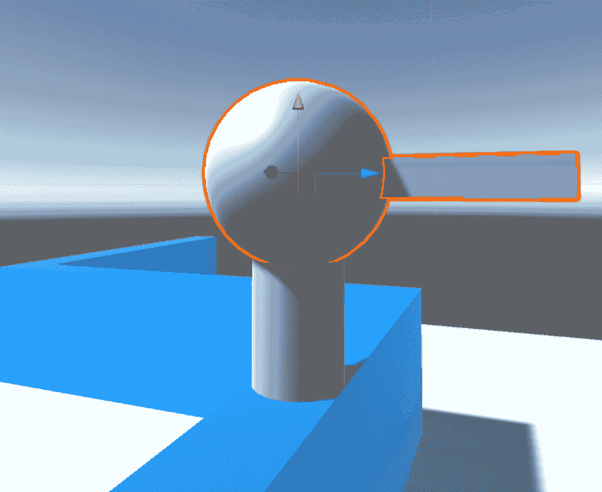

我们美丽的原始形状塔

枪管固定在塔的球形部分上。当跟踪玩家时，枪可以在其轴上自由旋转，以便向目标方向射击，但在其他方面它是不可移动的。一旦坦克足够远，塔就无法追逐它或重新定位自己。

在示例场景中，整个关卡中放置了几个塔。由于它们是预制件，因此复制塔、移动它们并在关卡之间重复使用它们非常容易。它们的设置也不太复杂。它们的层次结构看起来类似于以下截图：

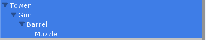

检查器中的塔层次结构

层次结构的分解如下：

+   `Tower`：从技术上讲，这是塔的基础：支撑其余部分的圆柱体。它没有任何功能，只是用来支撑其余部分。

+   `Gun`：枪是大多数魔法发生的地方。它是塔上安装有枪管的球形部件。这是塔中移动并跟踪玩家的部分。

+   `Barrel`和`Muzzle`：枪口位于枪管的尖端。这是枪中子弹的发射点。

我们提到枪是塔的业务发生地，所以让我们深入了解一下。选择枪的检查器看起来类似于以下截图：

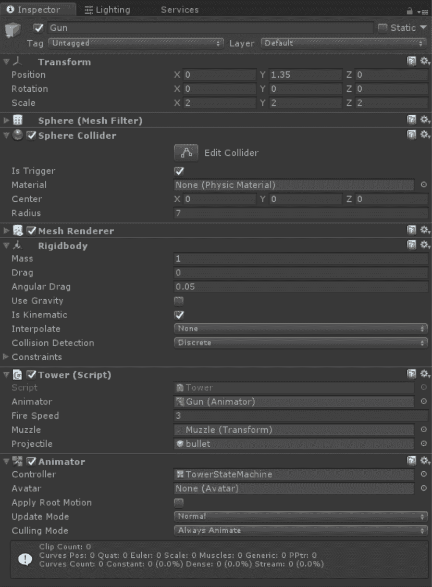

枪的检查器

在这里，检查器中有很多内容。让我们看看影响逻辑的每个组件：

+   球形碰撞体：这实际上是塔的范围。当坦克进入这个球形区域时，塔可以检测到它，并将锁定目标开始射击。这是我们为塔实现的感知功能。请注意，半径被设置为`7`。这个值可以根据你的喜好进行更改，但`7`似乎是一个合理的值。此外，请注意，我们将“是否触发”复选框设置为“是”。我们不希望这个球形实际上引起碰撞，只是触发事件。

+   Rigidbody：这个组件对于碰撞体正常工作是必需的，无论对象是否在移动。这是因为 Unity 不会向没有`Rigidbody`组件的游戏对象发送碰撞或触发事件，除非它们在移动。

+   Tower：这是塔的逻辑脚本。它与状态机和行为协同工作，但我们将稍后深入了解这些组件。

+   Animator：这是我们的塔状态机。它实际上并不处理动画。

在我们查看驱动塔的代码之前，让我们简要地看看状态机。正如你在以下截图中所见，它并不复杂：

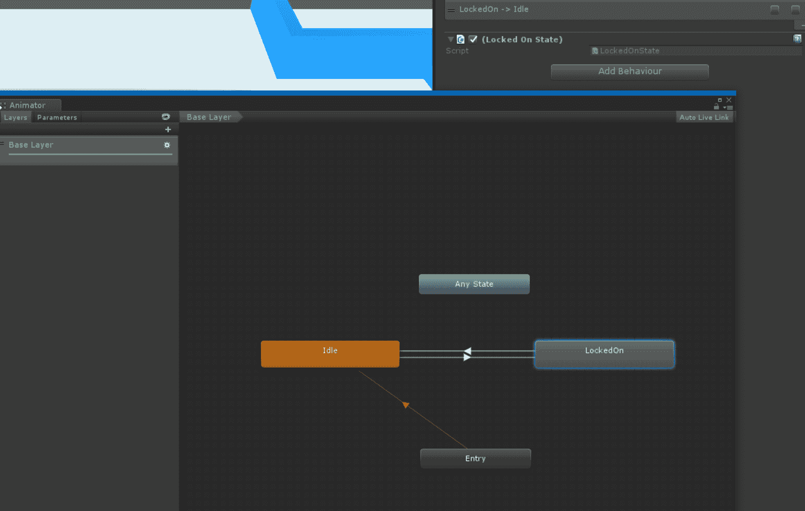

塔的状态机

我们关注两种状态：`Idle`（默认状态）和 `LockedOn`。当 `TankInRange` 布尔值设置为 `true` 时，从 `Idle` 到 `LockedOn` 的转换发生，而当布尔值设置为 `false` 时，反向转换发生。

`LockedOn` 状态附有一个 `StateMachineBehaviour` 类，我们将在下一部分进行探讨：

```py
using UnityEngine; 
using System.Collections; 

public class LockedOnState : StateMachineBehaviour { 

    GameObject player; 
    Tower tower; 

   // OnStateEnter is called when a transition starts and the state machine starts to evaluate this state 
    override public void OnStateEnter(Animator animator, AnimatorStateInfo stateInfo, int layerIndex) { 
        player = GameObject.FindWithTag("Player"); 
        tower = animator.gameObject.GetComponent<Tower>(); 
        tower.LockedOn = true; 
    } 

     //OnStateUpdate is called on each Update frame between OnStateEnter and OnStateExit callbacks 
  override public void OnStateUpdate(Animator animator, AnimatorStateInfo stateInfo, int layerIndex) { 
        animator.gameObject.transform.LookAt(player.transform); 
  } 

  // OnStateExit is called when a transition ends and the state machine finishes evaluating this state 
    override public void OnStateExit(Animator animator, AnimatorStateInfo stateInfo, int layerIndex) { 
        animator.gameObject.transform.rotation = Quaternion.identity; 
        tower.LockedOn = false; 
    } 
} 
```

当我们进入状态并调用 `OnStateEnter` 时，我们找到对玩家的引用。在提供的示例中，玩家被标记为 `"Player"`，这样我们就能使用 `GameObject.FindWithTag` 获取对其的引用。接下来，我们获取附加到我们的塔预制件上的 `Tower` 组件的引用，并将其 `LockedOn` 布尔值设置为 `true`。

只要我们处于该状态，`OnStateUpdate` 就会在每一帧被调用。在这个方法内部，我们通过提供的 `Animator` 引用获取对 `Gun GameObject`（`Tower` 组件附加到的对象）的引用。我们使用这个枪的引用，通过 `Transform.LookAt` 来跟踪坦克。

或者，由于 `Tower` 的 `LockedOn` 布尔值被设置为 `true`，这个逻辑可以在 `Tower.cs` 脚本中处理。

最后，当我们退出状态时，会调用 `OnStateExit`。我们使用此方法进行一些清理工作。我们将枪的旋转重置，以表明它不再跟踪玩家，并将塔的 `LockedOn` 布尔值重新设置为 `false`。

如我们所见，这个 `StateMachineBehaviour` 与 `Tower.cs` 脚本交互，所以让我们接下来看看 `Tower.cs`，以获得更多关于正在发生什么的上下文：

```py
using UnityEngine; 
using System.Collections; 

public class Tower : MonoBehaviour { 
    [SerializeField] 
    private Animator animator; 

    [SerializeField] 
    private float fireSpeed = 3f; 
    private float fireCounter = 0f; 
    private bool canFire = true; 

    [SerializeField] 
    private Transform muzzle; 
    [SerializeField] 
    private GameObject projectile; 

    private bool isLockedOn = false; 

    public bool LockedOn { 
        get { return isLockedOn; } 
        set { isLockedOn = value; } 
    } 
```

首先，我们声明我们的变量和属性。

我们需要一个对状态机的引用；这就是 `Animator` 变量的作用。接下来的三个变量 `fireSpeed`、`fireCounter` 和 `canFire` 都与我们的塔的射击逻辑相关。我们稍后会看到它是如何工作的。

如我们之前提到的，枪口是射击时子弹将从中发射的位置。投射物是我们将要实例化的预制件。

最后，`isLockedOn` 通过 `LockedOn` 进行获取和设置。虽然这本书总体上避免强制执行任何特定的编码约定，但通常一个好的做法是除非明确需要公开，否则保持值私有，因此，我们不是将 `isLockedOn` 设置为公开，而是提供一个属性来远程访问它（在这种情况下，从 `LockedOnState` 行为访问）：

```py
private void Update() { 
        if (LockedOn && canFire) { 
            StartCoroutine(Fire()); 
        } 
    } 

    private void OnTriggerEnter(Collider other) { 
        if (other.tag == "Player") { 
            animator.SetBool("TankInRange", true); 
        } 
    } 

    private void OnTriggerExit(Collider other) { 
        if (other.tag == "Player") { 
            animator.SetBool("TankInRange", false); 
        } 
    } 

    private void FireProjectile() { 
        GameObject bullet = Instantiate(projectile, muzzle.position, muzzle.rotation) as GameObject; 
        bullet.GetComponent<Rigidbody>().AddForce(muzzle.forward * 300); 
    } 

    private IEnumerator Fire() { 
        canFire = false; 
        FireProjectile(); 
        while (fireCounter < fireSpeed) { 
            fireCounter += Time.deltaTime; 
            yield return null; 
        } 
        canFire = true; 
        fireCounter = 0f; 
    } 
}
```

接下来，我们有所有我们的方法，以及塔逻辑的核心。在 `Update` 循环内部，我们检查两件事——我们是否锁定，以及我们是否可以开火。如果两者都为真，我们就调用 `Fire()` 协程。在我们回到 `OnTrigger` 消息之前，我们将看看为什么 `Fire()` 是一个协程。

如果你之前不熟悉协程，协程可能是一个难以理解的概念。有关如何使用协程的更多信息，请查看 Unity 的文档：[`docs.unity3d.com/Manual/Coroutines.html`](http://docs.unity3d.com/Manual/Coroutines.html)。

由于我们不希望我们的塔楼像疯狂发射弹丸的死亡机器一样不断向坦克射击，我们使用我们之前定义的变量来在每次射击之间创建一个缓冲区。在调用`FireProjectile()`并将`canFire`设置为`false`之后，我们从一个计数器从 0 开始到`fireSpeed`，然后再将`canFire`再次设置为`true`。`FireProjectile()`方法处理弹丸的实例化和向枪口指向的方向射击，使用`Rigidbody.AddForce`。实际的子弹逻辑在其他地方处理，但稍后我们会看看。

最后，我们有两个`OnTrigger`事件——一个是在有东西进入此组件附加的触发器时，另一个是在对象离开该触发器时。还记得驱动我们状态机转换的`TankInRange`布尔变量吗？当我们进入触发器时，这个变量被设置为`true`，当我们退出时，它回到`false`。本质上，当坦克进入枪的“视野”球体时，它会立即锁定坦克，当坦克离开球体时，锁定会释放。

# 让塔楼射击

如果我们回顾一下检查器中的`Tower`组件，你会注意到一个名为`bullet`的预制件被分配给`projectile`变量。这个预制件可以在示例项目的`Prefabs`文件夹中找到。预制件看起来类似于以下截图：

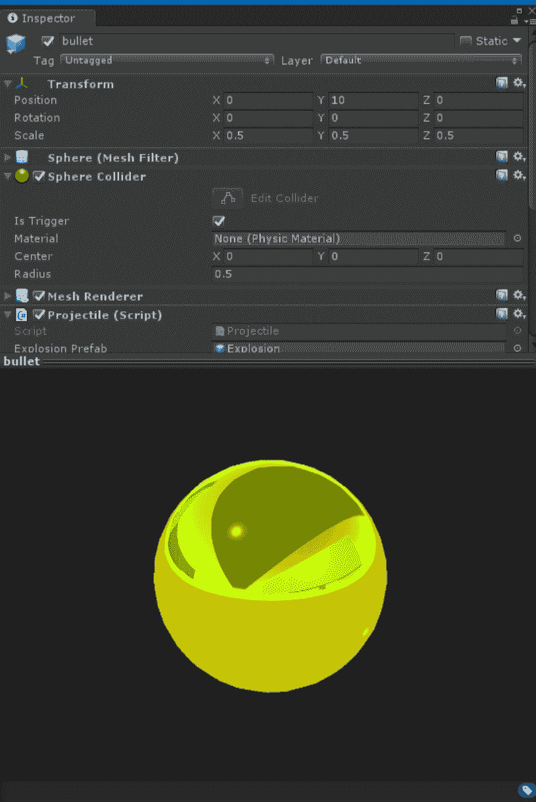

子弹预制件

`bullet`游戏对象没有什么特别的地方；它只是一个明亮的黄色球体。它附有一个球体碰撞器，并且，同样，我们必须确保`IsTrigger`设置为`true`，并且它附有一个`Rigidbody`（`gravity`被关闭）附上。我们还有一个附加到`bullet`预制件上的`Projectile`组件。这处理碰撞逻辑。让我们看看代码：

```py
using UnityEngine; 
using System.Collections; 

public class Projectile : MonoBehaviour { 

    [SerializeField] 
    private GameObject explosionPrefab; 

  void Start () {  } 

    private void OnTriggerEnter(Collider other) { 
        if (other.tag == "Player" || other.tag == "Environment") { 
            if (explosionPrefab == null) { 
                return; 
            } 
            GameObject explosion = Instantiate(explosionPrefab, transform.position, Quaternion.identity) as GameObject; 
            Destroy(this.gameObject);             
        } 
    } 
}
```

我们在这里有一个相当直接的脚本。在我们的关卡中，我们将所有地板和墙壁标记为`"Environment"`，所以在我们的`OnTriggerEnter`方法中，我们检查这个弹丸正在与之碰撞的触发器是玩家或环境。如果是，我们实例化一个`explosion`预制件并销毁弹丸。让我们看看`explosion`预制件，它看起来类似于以下截图：

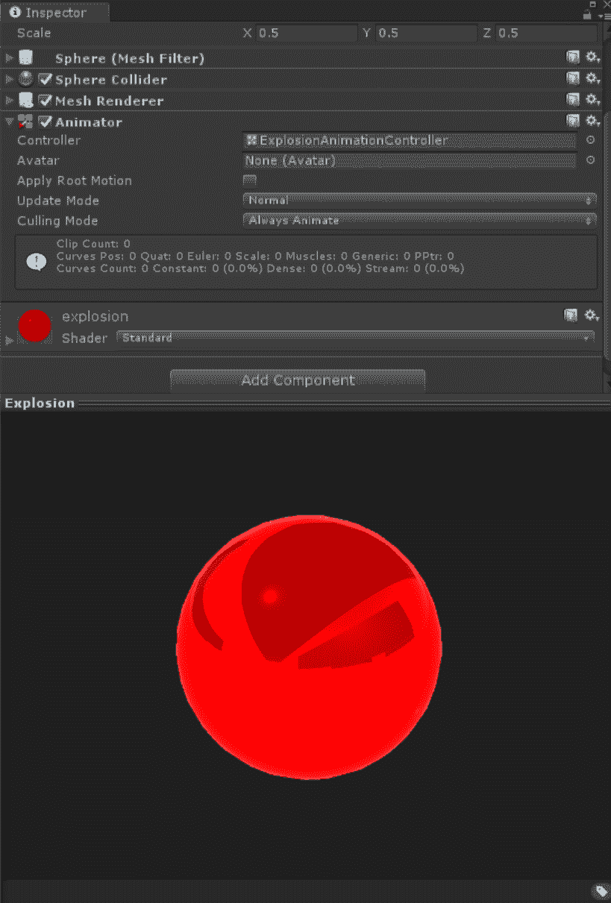

选择带有爆炸预制件的检查员

如我们所见，这里有一个非常相似的游戏对象；我们有一个设置为`true`的`IsTrigger`的球体碰撞器。主要区别是有一个`animator`组件。当这个`explosion`被实例化时，它会像爆炸一样膨胀，然后我们使用状态机在它从爆炸状态过渡出来时销毁实例。`animation`控制器看起来与以下截图类似：

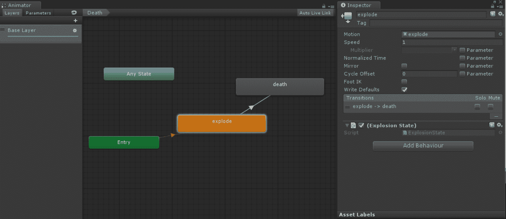

驱动爆炸预制件的动画控制器

你会注意到`explode`状态附加了一个行为。这个行为内的代码相当简单：

```py
// OnStateExit is called when a transition ends and the state machine finishes evaluating this state 
    override public void OnStateExit(Animator animator, AnimatorStateInfo stateInfo, int layerIndex) { 
        Destroy(animator.gameObject, 0.1f); 
    } 
```

我们在这里所做的只是在我们退出状态时销毁对象的实例，这发生在动画结束时。

如果你想要用你自己的游戏逻辑来丰富游戏，这可能是一个触发任何次要效果的好地方，比如伤害、环境粒子，或者你能想到的任何东西！

# 设置坦克

示例项目还包括一个坦克预制件，它简单地称为（你猜对了）`Tank`，位于`Prefabs`文件夹中。

坦克本身是一个简单的代理，它的目标只有一个：到达迷宫的尽头。如前所述，玩家必须通过激活坦克的能力来帮助坦克，使其免受来自塔楼的来犯之火的伤害。

到现在为止，你应该已经相当熟悉你将遇到的所有组件，除了附加到预制件的`Tank.cs`组件。让我们看看代码，找出幕后发生了什么：

```py
using UnityEngine; 
using System.Collections; 

public class Tank : MonoBehaviour { 
    [SerializeField] 
    private Transform goal; 
    private NavMeshAgent agent; 
    [SerializeField] 
    private float speedBoostDuration = 3; 
    [SerializeField] 
    private ParticleSystem boostParticleSystem; 
    [SerializeField] 
    private float shieldDuration = 3f; 
    [SerializeField] 
    private GameObject shield; 

    private float regularSpeed = 3.5f; 
    private float boostedSpeed = 7.0f; 
    private bool canBoost = true; 
    private bool canShield = true; 
```

我们希望能够轻松调整一些值，因此我们首先声明相应的变量。从我们技能的持续时间到与之相关的效果，所有这些都在这里首先设置：

```py
    private bool hasShield = false; 
private void Start() { 
        agent = GetComponent<NavMeshAgent>(); 
        agent.SetDestination(goal.position); 
    } 

    private void Update() { 
        if (Input.GetKeyDown(KeyCode.B)) { 
            if (canBoost) { 
                StartCoroutine(Boost()); 
            } 
        } 
        if (Input.GetKeyDown(KeyCode.S)) { 
            if (canShield) { 
                StartCoroutine(Shield()); 
            } 
        } 
    } 
```

我们的`Start`方法只是为我们坦克做一些设置；它获取`NavMeshAgent`组件并将其目的地设置为等于我们的目标变量。我们很快会详细讨论这一点。

我们使用`Update`方法来捕捉我们技能的输入。我们将`B`映射到`加速`，将`S`映射到`盾牌`。由于这些是计时技能，就像塔楼的射击能力一样，我们通过协程来实现这些：

```py
private IEnumerator Shield() { 
        canShield = false; 
        shield.SetActive(true); 
        float shieldCounter = 0f; 
        while (shieldCounter < shieldDuration) { 
            shieldCounter += Time.deltaTime; 
            yield return null; 
        } 
        canShield = true; 
        shield.SetActive(false); 
    } 

    private IEnumerator Boost() { 
        canBoost = false; 
        agent.speed = boostedSpeed; 
        boostParticleSystem.Play(); 
        float boostCounter = 0f; 
        while (boostCounter < speedBoostDuration) { 
            boostCounter += Time.deltaTime; 
            yield return null; 
        } 
        canBoost = true; 
        boostParticleSystem.Pause(); 
        agent.speed = regularSpeed; 
    }
```

两个技能的逻辑非常相似。`盾牌`通过在检查器中定义的变量来启用和禁用`盾牌`游戏对象，当经过等于`盾牌持续时间`的时间后，我们将其关闭，并允许玩家再次使用`盾牌`。

`加速`代码中的主要区别在于，它不是通过启用和禁用游戏对象，而是通过检查器分配的粒子系统上的`Play`调用，并将我们的`NavMeshAgent`的速度设置为原始值的两倍，然后在技能持续时间的末尾将其重置。

你能想到给坦克赋予的其他能力吗？这是一个非常直接的模式，你可以用它来实现你自己在项目中的新能力。你还可以在这里添加额外的逻辑来自定义盾牌和加速能力。

样本场景中已经有一个坦克实例，所有变量都已正确设置。样本场景中坦克的检查器看起来类似于以下截图：

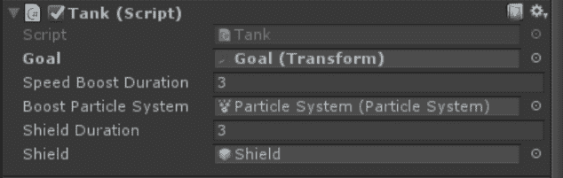

选择坦克实例的检查器

正如你在前面的屏幕截图中所见，我们将`Goal`变量分配给了具有相同名称的变换，它位于我们设置的迷宫末尾的场景中。我们还可以调整我们能力的时间长度，默认设置为 3。你也可以更换能力的艺术效果，无论是用于加速的粒子系统还是用于护盾的游戏对象。

最后要查看的代码是驱动摄像机的代码。我们希望摄像机跟随玩家，但只沿着其`z`值，水平沿着轨道。实现这一点的代码看起来类似于这样：

```py
using UnityEngine; 
using System.Collections; 

public class HorizontalCam : MonoBehaviour { 
    [SerializeField] 
    private Transform target; 

    private Vector3 targetPositon; 

    private void Update() { 
        targetPositon = transform.position; 
        targetPositon.z = target.transform.position.z; 
        transform.position = Vector3.Lerp(transform.position, targetPositon, Time.deltaTime); 
    } 
} 
```

正如你所见，我们只是将摄像机的目标位置设置为它在所有轴上的当前位置，但我们然后将目标位置的`z`轴设置为与我们的目标相同，如果你查看检查器，会发现它已经被设置为坦克的变换。然后我们使用线性插值（`Vector3.Lerp`）在每一帧将摄像机从当前位置平滑地移动到目标位置。

# 奖励坦克能力

样本项目还包括三个额外的坦克能力供你玩耍。当然，我们非常鼓励你修改这些能力或实现你自己的自定义规则，但为了使示例更加丰富，你只需要为想要添加到坦克预制件中的每个能力添加组件。

奖励能力包括：

+   **浩克模式**：你的坦克在设定的时间内变大。想要挑战？实现一个类似于我们第六章，*Behavior Trees*中的*HomeRock*示例的健康和护甲系统，并且让这个增益效果通过这个能力在视觉上表示出来！

+   **缩小模式**：这是与浩克模式相反的，对吧！你的坦克在设定的时间内缩小。如果你觉得这个任务很有挑战性，尝试实现一个潜行系统，其中炮塔在缩小模式下无法检测到你的坦克。

+   **时间扭曲，或者像我喜欢叫的，DMV 模式**：这种能力将时间缓慢到几乎停止。如果你想挑战自己，尝试实现一个选择性的武器系统，其中炮塔可以使用更快的弹丸来对抗你的时间扭曲模式！

你可以选择如何使用能力系统。看到读者如何以不同的方向使用这些样本的版本总是很有趣。如果你对这或之前的任何样本有独特的想法，请通过 Twitter（`@ray_barrera`）与作者分享。

# 设置环境

由于我们的坦克使用`NavMeshAgent`组件来穿越环境，我们需要使用静态游戏对象设置我们的场景，以便烘焙过程能够正常工作，正如我们在第四章，*Finding Your Way*中所学。迷宫被设置为塔楼分布得相当合理，坦克有足够的空间轻松地移动。以下屏幕截图显示了迷宫的一般布局：

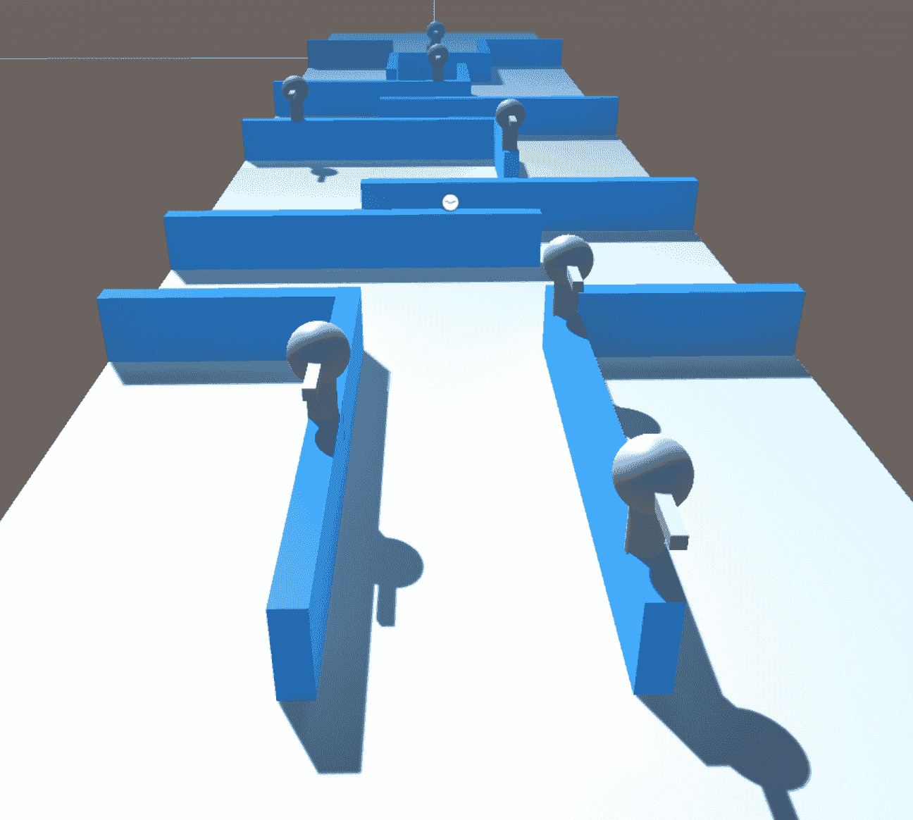

坦克必须通过的障碍

如您所见，迷宫中分布着七个塔，坦克需要绕过一些弯道才能打破视线。为了避免我们的坦克擦到墙上，我们调整了导航窗口中的设置以符合我们的喜好。默认情况下，示例场景将代理半径设置为 1.46，步高设置为 1.6。我们到达这些数字没有硬性规则；这只是试错的结果。

在烘焙 NavMesh 之后，我们将得到以下截图所示的内容：

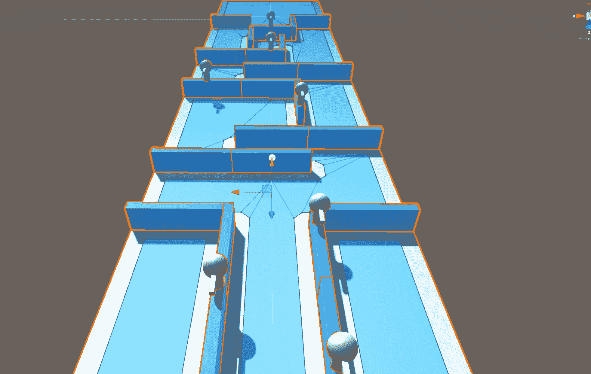

烘焙我们的 NavMesh 之后的场景

随意调整墙壁和塔的位置以符合您的喜好。只需记住，您添加到场景中的任何阻挡物体都必须标记为静态，并且您必须设置好一切后重新烘焙场景的导航。

# 测试示例

示例场景可以直接播放，所以如果您没有修改默认设置的冲动，只需按播放按钮，就可以观看您的坦克移动。您会注意到我们为玩家添加了一个带有标签的画布，解释了控制方法。这里没有复杂的功能；它只是简单的“按这个按钮做那个”类型的说明：

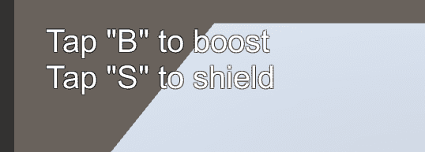

简单的说明来引导玩家

示例项目是一个很好的例子，可以在此基础上扩展并享受乐趣。通过本书学到的概念，您可以扩展塔的类型、坦克的能力、规则，甚至给坦克更复杂、细腻的行为。目前，我们可以看到状态机、导航、感知和感知以及转向的概念在一个简单而有趣示例中结合在一起。以下截图显示了游戏的实际运行情况：

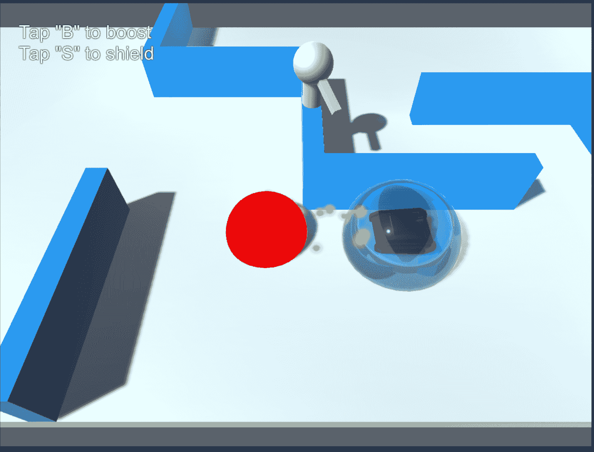

坦克防御游戏的实际运行情况

# 摘要

所以，我们已经到达了终点。在本章中，我们选取了书中的一些概念，并应用它们来创建一个小型坦克防御游戏。我们基于有限状态机的概念，这个概念我们在第二章“有限状态机与您”中最初介绍过，创建了一个人工智能来驱动我们的敌人塔的行为。然后我们通过结合感知和感知来增强行为，最后通过 Unity 的 NavMesh 功能实现了导航，帮助我们的坦克 AI 在我们的迷宫式关卡中导航，穿过一排自主 AI 塔，这些塔的简单 AI 思维只有一个目标：摧毁！

当我们结束这本书的时候，花点时间给自己鼓掌吧！我们已经覆盖了大量的内容，讨论了许多主题。你现在已经了解了状态机、行为树、A*算法、模糊逻辑等等。最令人兴奋的是思考所有你可以混合搭配并应用这些概念的方式。希望在这本书的阅读过程中，你已经想到了如何利用这些概念来增强你现有的或即将到来的游戏。你现在拥有了为你的数字世界创造更智能居民的工具。祝你好运！
