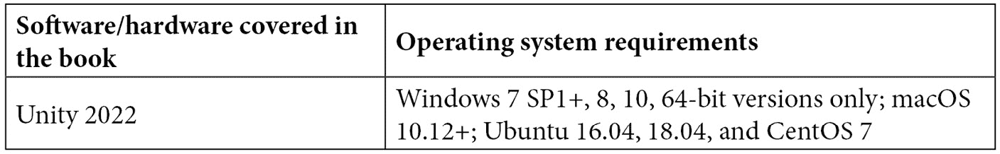

# 前言

在 Unity 中为游戏角色开发**人工智能**（**AI**）从未如此简单。Unity 为游戏和应用程序开发者提供了各种工具来实现 AI，从基本技术到由机器学习驱动的尖端智能体。通过 Unity 的 API 或内置功能利用这些工具，在创建游戏世界和角色时将拥有无限的可能性。

《Unity 人工智能编程》第五版更新版首先将人工智能分解为简单概念。通过各种示例，本书随后引导你通过实际实现，旨在突出 Unity 中游戏人工智能的关键概念和功能。随着你的进步，你将学习如何实现**有限状态机**（**FSM**）以确定 AI 的行为，应用概率和随机性使游戏更难以预测，并实现基本的感觉系统。稍后，你将了解如何设置带有导航网格的游戏地图，通过 A*路径查找等技术实现移动，并使用行为树为角色提供决策能力。

在完成这本 Unity 书籍之后，你将掌握将所学到的所有概念和实践课程整合起来构建一个令人印象深刻的车辆战斗游戏所需的所有技能。

# 本书面向对象

这本 Unity AI 书籍是为那些对 C#和 Unity 编辑器有基本了解，并希望扩展他们在 Unity 游戏 AI 开发知识领域的 Unity 开发者而编写的。

# 本书涵盖内容

*第一章*，*人工智能简介*，讨论了人工智能是什么以及它在游戏中的应用。我们还讨论了在游戏中实现 AI 的各种技术。

*第二章*，*有限状态机*，讨论了一种简化我们管理 AI 需要做出的决策的方法。我们使用有限状态机（FSM）来确定 AI 在特定状态下的行为以及如何过渡到其他状态。

*第三章*，*随机性和概率*，讨论了概率的基本原理以及如何改变特定结果的可能性。然后我们探讨如何向我们的游戏添加随机性，使 AI 更难以预测。

*第四章*，*实现传感器*，探讨了使我们的角色意识到周围世界的方法。通过我们的角色能够看到和听到，他们将知道敌人何时靠近以及何时攻击。

*第五章*，*群体行为*，讨论了许多物体作为一个群体一起移动的情况。我们将探讨两种不同的实现群体行为的方法，以及如何使物体一起移动。

*第六章*, *路径跟随和转向行为*，探讨了 AI 角色如何跟随提供的路径以到达目的地。然后我们看看 AI 角色如何在没有预定义路径的情况下找到目标，只需在移动时朝向目标并避开出现的障碍物。

*第七章*, *路径查找*，讨论了一种流行的算法，用于从给定位置找到目标位置的最佳路径。使用 A*算法，我们扫描地形并找到通向目标的最佳路径。

*第八章*, *导航网格*，讨论了如何利用 Unity 的强大功能使路径查找更容易实现。通过创建导航网格（这需要 Unity Pro），我们将能够以比使用瓦片和 A*算法更好的方式表示我们周围的场景。

*第九章*, *行为树*，教你关于行为树，这是一种流行的游戏 AI 决策技术。我们将探讨行为树的一般架构以及如何使用它们来控制一个简单的智能体。然后我们将使用免费的插件*Behavior Bricks*将我们的新知识应用到简单的迷你游戏项目中。

*第十章*, *程序内容生成*，探讨了生成式 AI 和程序内容生成的基础知识。我们将看到如何使用 Perlin 噪声生成逼真的地形，以及如何使用细胞自动机生成类似洞穴的地牢地图。

*第十一章*, *Unity 中的机器学习*，探讨了如何将机器学习（特别是强化学习）应用于游戏角色或模拟。我们将使用官方的 Unity ML-Agents 工具包。在第一部分，我们将学习如何配置 Unity 和工具包的外部要求。然后我们将展示两个简单的实际示例。

*第十二章*, *整合所学内容*，将你在本书中学到的各种元素整合到一个最后的项目中。在这里，你将应用你学到的剩余 AI 元素，并创建一个令人印象深刻的车辆战斗游戏。

# 为了充分利用这本书

对于这本书，你只需要安装 Unity3D 的最新版本。本书中的代码项目已在 macOS 和 Windows 上的 Unity 2022 和 Unity 2021 上进行了测试，但经过一些调整，它们也应该适用于未来的版本。



对于*第九章*, *行为树*，你需要为 Unity 安装 Behavior Bricks 插件。在*第十一章*, *Unity 中的机器学习*中，我们将安装 Python 3.7 和 PyTorch。

**如果你使用的是本书的数字版，我们建议你亲自输入代码或从书的 GitHub 仓库（下一节中提供链接）获取代码。这样做将帮助你避免与代码的复制和粘贴相关的任何潜在错误。**

# 下载示例代码文件

您可以从 GitHub 下载本书的示例代码文件[`github.com/PacktPublishing/Unity-Artificial-Intelligence-Programming-Fifth-Edition`](https://github.com/PacktPublishing/Unity-Artificial-Intelligence-Programming-Fifth-Edition)。如果代码有更新，它将在 GitHub 仓库中更新。

我们还提供其他来自我们丰富图书和视频目录的代码包，可在[`github.com/PacktPublishing/`](https://github.com/PacktPublishing/)找到。查看它们吧！

# 下载彩色图像

我们还提供包含本书中使用的截图和图表的彩色 PDF 文件。您可以从这里下载：[`static.packt-cdn.com/downloads/9781803238531_ColorImages.pdf`](https://static.packt-cdn.com/downloads/9781803238531_ColorImages.pdf)。

# 使用的约定

本书使用了多种文本约定。

`文本中的代码`: 表示文本中的代码单词、数据库表名、文件夹名、文件名、文件扩展名、路径名、虚拟 URL、用户输入和 Twitter 昵称。以下是一个例子：“让我们开始创建`PlayerTankController`类，通过在`PlayerTankController.cs`文件中设置`Start`函数和`Update`函数来实现。”

代码块应如下设置：

```py
public class PlayerTankController : MonoBehaviour { 
    public GameObject Bullet; 
    public GameObject Turret; 
    public GameObject bulletSpawnPoint;
```

当我们希望引起你对代码块中特定部分的注意时，相关的行或项目将以粗体显示：

```py
// ... 
    private AudioSource m_ExplosionAudio  
    private ParticleSystem m_ExplosionParticles 
    private float m_CurrentHealth; 
    private bool m_Dead; 
    public float CurrentHealth { get; } 
    // ...
```

任何命令行输入或输出都应如下编写：

```py
git clone --branch release_19 https://github.com/Unity-Technologies/ml-agents.git
```

**粗体**: 表示新术语、重要单词或你在屏幕上看到的单词。例如，菜单或对话框中的单词以**粗体**显示。以下是一个例子：“如果你播放场景并点击**拉杆**按钮，你应该能看到最终结果。”

小贴士或重要注意事项

看起来像这样。

# 联系我们

我们始终欢迎读者的反馈。

**一般反馈**: 如果你对此书任何方面有疑问，请通过 customercare@packtpub.com 给我们发邮件，并在邮件主题中提及书名。

**勘误**: 尽管我们已经尽一切努力确保内容的准确性，但错误仍然可能发生。如果你在这本书中发现了错误，我们将不胜感激，如果你能向我们报告这一点。请访问[www.packtpub.com/support/errata](http://www.packtpub.com/support/errata)并填写表格。

**盗版**: 如果你在互联网上以任何形式发现我们作品的非法副本，如果你能提供位置地址或网站名称，我们将不胜感激。请通过版权@packt.com 与我们联系，并提供材料的链接。

**如果您有兴趣成为作者**：如果您在某个领域有专业知识，并且您有兴趣撰写或为书籍做出贡献，请访问[authors.packtpub.com](http://authors.packtpub.com)。

# 分享您的想法

一旦您阅读了*《Unity 人工智能编程 - 第五版》*，我们很乐意听听您的想法！请选择[`www.amazon.in/review/1803238534`](https://www.amazon.in/review/1803238534)为这本书并分享您的反馈。

您的评论对我们和科技社区都很重要，并将帮助我们确保我们提供高质量的内容。
