# 第三章：随机性和概率

在本章中，我们将探讨如何将概率和随机性的概念应用于游戏人工智能。因为我们将会更多地讨论随机性在游戏人工智能中的应用，而不是 Unity3D，所以我们可以将本章的概念应用于任何游戏开发中间件或技术框架。我们将使用 Unity3D 中的 Mono C#进行演示，但不会过多涉及 Unity3D 引擎和编辑器的具体功能。

游戏开发者使用概率为人工智能角色的行为和更广泛的游戏世界添加一些不确定性。随机性使人工智能看起来更加真实和自然，它是那些我们不需要*有意*可预测性的所有情况的完美“调味品”。

在本章中，我们将探讨以下主题：

+   在 Unity 中引入随机性

+   学习概率的基本知识

+   探索游戏中更多概率的例子

+   创建一个老虎机

# 技术要求

对于本章，你只需要 Unity3D 2022。你可以在本书仓库中的`第三章`文件夹中找到本章描述的示例项目：[`github.com/PacktPublishing/Unity-Artificial-Intelligence-Programming-Fifth-Edition/tree/main/Chapter03`](https://github.com/PacktPublishing/Unity-Artificial-Intelligence-Programming-Fifth-Edition/tree/main/Chapter03)。

# 在 Unity 中引入随机性

游戏设计师和开发者使用随机性在游戏人工智能中，通过改变角色决策的结果，使游戏及其角色更加真实。

让我们以一场典型的足球比赛为例。足球比赛的一条规则是，如果一方球员在试图夺回球权时犯规，将判给对方直接任意球。然而，游戏开发者可以应用概率，只对 98%的所有犯规判给直接任意球。

在现实中，裁判有时也会犯错误。由于这个简单的改变，玩家通常可以得到预期的直接任意球。然而，当剩下的两百分之一发生时，游戏为两队提供更多的情感反馈（假设你在与另一名人类玩家对战，一名玩家会感到高兴，而另一名玩家会向虚拟裁判抱怨）。

当然，随机性并不总是人工智能所期望的附加功能。正如我们在引言中所预期的，一定程度的可预测性允许玩家学习人工智能模式，而理解人工智能模式通常是游戏玩法的主要组成部分。例如，在潜行游戏中，学习敌方守卫的路径对于玩家找到潜行路线是必要的。或者想象你需要为像《黑暗之魂》这样的游戏设计一个 Boss。

然而，在某些情况下，一点随机性是有用的，对于某些游戏，如赌博迷你游戏，它是一个必要的先决条件。在这些情况下，计算机如何产生随机值？更重要的是，我们如何在 Unity 中使用随机数？

## 计算机科学中的随机性

计算机是确定性的机器：按照设计，如果我们多次给计算机相同的输入，以程序代码和数据的形态，它总是返回相同的输出。因此，我们如何让程序返回不可预测和随机的输出呢？

如果我们需要真正随机的数字，那么我们就需要从其他地方获取这种随机性。这就是为什么许多高级应用尝试将不同的外部随机性来源组合成一个随机值：它们可能会观察鼠标在特定时间间隔内的移动，互联网连接的噪声，甚至要求用户随机敲击键盘等等。甚至还有专门用于生成随机数的硬件！

幸运的是，在游戏中，我们不需要真正随机的数字，我们可以使用更简单的算法来生成看起来像随机数字序列的序列。这类算法被称为**伪随机数生成器**（**PRNGs**）。使用一个初始种子，它们可以以确定性的方式生成一个序列，这个序列在统计上近似于真正随机数字序列的性质。问题是，如果我们从相同的种子开始，我们总是会得到相同的数字序列。

因此，我们通常从一些我们认为每次用户打开应用程序时总是不同的事物中初始化种子值，例如，例如，自计算机开始运行以来的毫秒数，或者自 1970 年（*Unix 时间戳*）以来的毫秒数。然而，请注意，每次都能获得相同的随机序列在调试时确实非常有用！

最后，请注意，一些伪随机数生成器（PRNGs）比其他生成器更随机。如果我们正在创建一个加密程序，我们希望研究那些被称为**加密安全伪随机数生成器**（**CSPRNGs**）的更不可预测的 PRNGs。幸运的是，对于游戏来说，Unity 自带的基础**随机数生成**（**RNG**）就足够好了。

## Unity 随机类

Unity3D 脚本中有一个 `Random` 类用于生成随机数据。您可以使用 `InitState(int seed)` 函数设置生成器的种子。通常情况下，我们不会希望反复设置相同的值，因为这会在每次执行时生成相同的可预测的随机数序列。

然而，有些情况下我们希望用户能够控制种子 – 例如，当我们测试游戏或希望玩家使用特定的种子生成程序化地图/关卡时。然后，你可以读取`Random.value`属性来获取 0.0 到 1.0 之间的随机数。这个生成器是包含的，因此这个属性可以返回 0.0 和 1.0。

例如，在下面的代码片段中，我们通过为红色、绿色和蓝色组件选择 0 到 1 之间的随机值来生成一个随机颜色：

```py
Color randomColor = new Color(Random.value, Random.value, Random.value); 
```

另一个非常有用的类方法是`Range`方法：

```py
static function Range (min : float, max : float) : float
```

我们可以使用`Range`方法从一个范围内生成一个随机数。当给定一个整数值时，它返回一个介于`min`（包含）和`max`（不包含）之间的随机整数。因此，如果我们设置`min`为 1，`max`为 4，我们可以得到 1、2 或 3，但永远不会得到 4。相反，如果我们使用`Range`函数为浮点值，`min`和`max`都是包含的，这意味着我们可以得到 1.0、4.0 或介于两者之间的所有浮点数。请注意，当使用 Unity 的`Random`类时，参数是包含的还是不包含的是常见的错误（和混淆）来源。

## 一个简单的随机掷骰子游戏

让我们在一个新的场景中设置一个简单的掷骰子游戏，在这个场景中我们需要猜测六面骰子的输出（通过生成一个介于 1 到 6 之间的随机整数来模拟）。如果输入值与随机生成的骰子结果匹配，玩家获胜，如下面的`DiceGame.cs`文件所示：

```py
using UnityEngine;
using TMPro;
using UnityEngine.UI;
public class DiceGame : MonoBehaviour {
    public string inputValue = "1";
    public TMP_Text outputText;
    public TMP_InputField inputField;
    public Button button;
    int throwDice() {
        Debug.Log("Throwing dice...");
        Debug.Log("Finding random between 1 to 6...");
        int diceResult = Random.Range(1,7);
        Debug.Log($"Result: {diceResult}");
        return diceResult;
    }
    public void processGame() {
        inputValue = inputField.text;
        try {
            int inputInteger = int.Parse(inputValue);
            int totalSix = 0;
            for (var i = 0; i < 10; i++) {
                var diceResult = throwDice();
                if (diceResult == 6) { totalSix++; }
                if (diceResult == inputInteger) {
                    outputText.text = $"DICE RESULT:
                      {diceResult} \r\nYOU WIN!";
                } else {
                    outputText.text = $"DICE RESULT:
                      {diceResult} \r\nYOU LOSE!";
                }
            }
            Debug.Log($"Total of six: {totalSix}");
        } catch {
            outputText.text = "Input is not a number!";
            Debug.LogError("Input is not a number!");
        }
    }
}
```

在前面的代码中，我们看到了实现整个游戏的`DiceGame`类。然而，我们仍然需要设置场景，使用适当的 UI 对象来接受玩家的输入并显示结果：

1.  首先，我们需要创建`guiText`来显示结果。点击游戏场景中的`New Text`文本。

1.  将其置于画布顶部中央。

1.  然后，以同样的方式，通过选择**Game Object** | **UI** | **Button – TextMeshPro**创建一个按钮，通过选择**Game Object** | **UI** | **Input Field – TextMeshPro**创建一个输入字段。

1.  将它们垂直排列在屏幕上。

1.  创建一个空的游戏对象，并将其命名为`DiceGame`。此时，你应该有类似于*图 3.1*的界面：

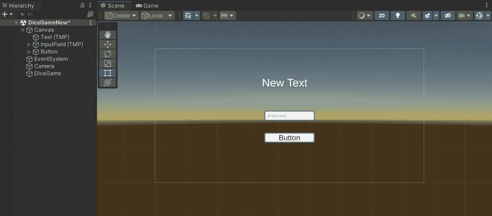

图 3.1 – 我们简单的 Unity 界面

1.  在按钮内部选择文本，并在**TextMeshPro**组件中将`Button`替换为`Play!`：

1.  在**TextMeshPro**组件中选择`New Text`文本，并将其替换为`Result:`：

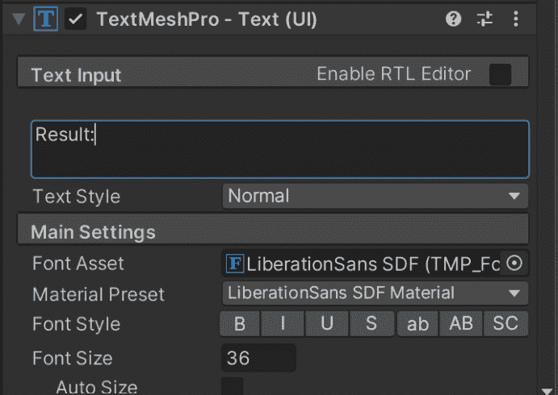

图 3.2 – TextMeshPro 组件

1.  现在，将`DiceGame`组件附加到`DiceGame`对象上，并将我们之前创建的 UI 元素树连接到`DiceGame`组件：

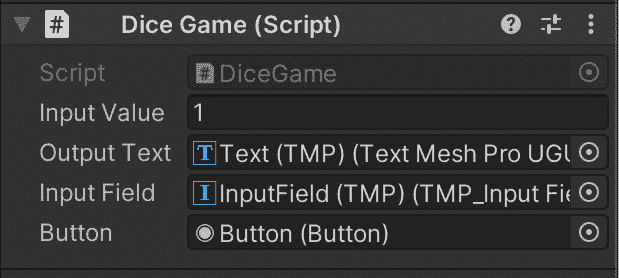

图 3.3 – DiceGame 组件

1.  最后，选择“按钮”并查找“按钮”组件中的`onClick()`部分。将`DiceGame`对象拖放到带有`None (GameObject)`的字段中，并将`processGame`函数分配给按钮的点击事件：

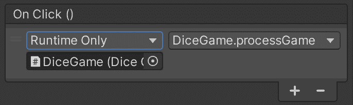

图 3.4 – 单击事件配置

到这一点，游戏应该已经准备好了。点击 Unity 的播放按钮，开始游戏。

要成功管理随机数，我们需要对概率定律有一个基本的了解。因此，这就是我们将在下一节学习的内容。

# 学习概率的基础

定义概率的方法有很多。最直观的概率定义被称为**频率主义**。根据频率主义，事件的概率是在我们无限次重复观察时事件发生的频率。换句话说，如果我们掷骰子 100 次，我们期望平均看到一次六，大约是六分之一的时间，并且随着 1,000 次、10,000 次和 1,000,000 次的投掷，我们应该越来越接近六分之一。

我们可以将事件 A 发生的概率写成 *P(A)*。要计算 *P(A)*，我们需要知道观察的所有可能结果 (`N`) 以及期望事件发生的总次数 (`n`)。

我们可以按照以下方式计算事件 `A` 的概率：

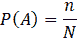

如果 *P(A)* 是事件 `A` 发生的概率，那么事件 `A` 不发生的概率等于以下：

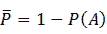

概率必须是一个介于零和一之间的实数。概率为零意味着没有机会发生期望的事件；另一方面，概率为一意味着事件一定会发生。因此，以下必须等于一：

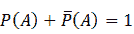

然而，并非所有事件都是相同的。概率论中最关键的概念之一是**独立和非独立事件**的概念。这就是下一节的主题。

## 独立和非相关事件

概率论中的另一个重要概念是，一个特定事件发生的概率是否以某种方式依赖于其他事件。例如，考虑掷两次六面骰子并得到一个双六。每次掷骰子都可以看作是一个独立事件。每次掷骰子，每个面出现的概率是六分之一，第二次掷骰子的结果不会因第一次掷骰子的结果而改变。另一方面，在从同一副牌中抽取两张 A 时，每次抽取并不是相互独立的。如果你在第一次事件中抽到了 A，那么第二次抽到 A 的概率会不同，因为牌堆中现在少了一个 A（并且少了一张牌）。

事件的独立性至关重要，因为它显著简化了一些计算。例如，想象一下我们想知道事件 `A` 或事件 `B` 发生的概率。如果 `A` 和 `B` 是两个独立事件，那么我们可以将 `A` 和 `B` 的概率相加：

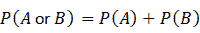

同样地，如果我们想知道同时发生事件 `A` 和 `B` 的概率，那么我们可以将各自的概率相乘：

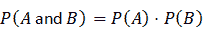

例如，如果我们想知道通过掷两个骰子得到两个六的概率，我们可以将 1/6 乘以 1/6 来得到正确的概率：1/36。

## 条件概率

现在，让我们考虑另一个例子。我们仍然在掷两个骰子，但这次，我们感兴趣的是两个骰子显示的数字之和等于二的概率。由于只有一种方式得到这个总和，即一加一，所以概率与两个骰子显示相同数字的概率相同。在这种情况下，它仍然是 1/36。

但是，如何得到两个骰子显示数字之和为七呢？正如你所见，总共有六种可能的方式得到总和为七，如下表所示：

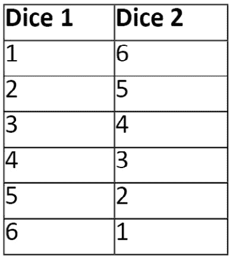

图 3.5 – 两个骰子的可能结果

在这种情况下，我们需要使用一般概率公式。从前面的表格中，我们可以看到我们有六个结果，总共有七个。因为我们知道两个骰子总共有 36 种可能的结果，所以我们可以快速计算出最终概率为 6/36，或者简化为六分之一（16.7%）。

## 加重骰子

现在，让我们假设我们并不完全诚实，并且我们的骰子是加重的，使得数字六的面有双倍的机会向上。由于我们增加了得到六的机会，我们需要将得到六的概率加倍——比如说，大约三分之一（0.34）——因此，其余的均匀分布在剩下的五个面上（每个面 0.132）。

我们可以这样实现一个加重的骰子算法：首先，我们生成一个介于 1 到 100 之间的随机值。然后，我们检查这个随机值是否落在 1 到 35 之间。如果是，我们的算法返回六；否则，我们得到一个介于 1 到 5 之间的随机骰子值（因为这些值有相同的概率）。

对于这个，我们创建一个新的类，称为 `DiceGameLoaded`。游戏与 `DiceGame` 相同，但有一个重要的区别：`throwDice` 函数被更改，如下所示：

```py
    int throwDice() {
        Debug.Log("Throwing dice...");
        int randomProbability = Random.Range(0, 100);
        int diceResult = 0;
        if (randomProbability < 35) {
            diceResult = 6;
        } else {
            diceResult = Random.Range(1, 5);
        }
        Debug.Log("Result: " + diceResult);
        return diceResult;
    }
```

要尝试这个新版本的游戏，将 `DiceGame` 组件与 `DiceGame` 对象中的 `DiceGame` 组件交换，并重新绑定我们之前所做的 `onClick` 按钮事件。如果我们通过多次掷骰子来测试我们的新加重骰子算法，你会注意到 `6` 值比平常更多。

如您所见，代码与非加载骰子非常相似。然而，这次我们抛的是一个不公平的骰子，其返回六的概率远高于正常情况：我们首先在 `0` 和 `100` 之间选择一个随机数；如果这个数小于 `35`，则返回 `6`。否则，我们在 `1` 和 `5` 之间选择一个随机数。因此，我们有 `35%` 的概率得到 `6`，而其他数字的大约 `15%` 的概率（我们将剩余的 `75%` 除以 `5`）。

记住，在游戏中，如果目标是给玩家带来更激动人心和有趣的体验，那么这并不算作弊！

# 探索游戏中概率的更多示例

在本节中，我们将探讨概率和随机性在视频游戏中最常见的应用。

## 角色性格

概率和随机性不仅与骰子有关。我们还可以使用概率分布来指定游戏角色的特长。例如，让我们假设我们为地方政府设计了一个人口管理游戏的游戏提案。我们需要解决和模拟诸如税收与全球人才吸引、移民与社会凝聚力等问题。在我们的提案中，我们有三种类型的角色——即工人、科学家和专业人士。他们在执行特定任务时的效率定义在以下表格中：

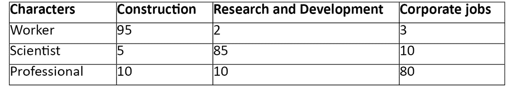

图 3.6 – 每个角色执行每个任务时的效率

让我们看看我们如何实现这个场景。假设玩家需要建造新的房屋以容纳增加的人口。房屋建造需要 1,000 个工作单位来完成。我们使用之前的价值作为特定任务中每个单位类型每秒可以完成的工作量。

因此，如果你只用一个工人来建造房屋，建造时间大约只需 10 秒（1000/95），而如果你试图用科学家建造，则需要超过 3 分钟（1000/5 = 200 秒）。其他任务也是如此，例如研发和公司工作。当然，随着游戏的进行，这些因素可以调整或增强，使得一些入门级任务变得简单，所需时间更少。

然后，我们引入特定单位类型可以发现的特殊物品。我们不想每次特定单位完成任务时都发放这些物品。相反，我们希望作为惊喜奖励玩家。因此，我们根据单位类型将找到此类物品的概率关联起来，如下表所述：

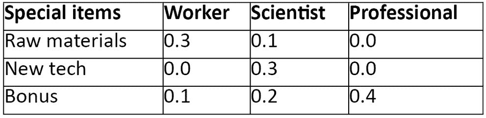

图 3.7 – 每个单位类型找到特定物体的概率

前面的表格显示，工人找到一些原材料的机会有 30%，而每当他们建造了一个工厂或一栋房子，就有 10%的机会获得奖金收入。这允许玩家在完成一些任务后预测可能即将到来的奖励，从而使游戏更加有趣，因为他们不知道事件的结果。

## 感知随机性

随机性的一个关键方面是，人类在理解真正的随机性方面非常糟糕。相反，当我们人类谈论*随机结果*时，我们想到的是*均匀分布的结果*。例如，想象一下像*英雄联盟*这样的**大型多人在线战斗竞技场**（**MOBA**）游戏。想象一下，我们有一个英雄拥有造成巨大伤害的能力，但只有 50%的时间能命中。玩家用一个这样的英雄开始游戏，但这个英雄由于运气不好连续五次没有使用那个能力。换位思考一下那个玩家的感受——你会认为电脑在作弊或者有什么问题，对吧？

然而，连续五次未命中的概率是 1/32。这大约是 3.1%，比在五张牌的扑克牌中抽到三张同花（大约是 2.1%）的可能性要大——不太可能但有可能。如果我们的游戏使用一个完美的随机数生成器，我们可能会相对频繁地遇到这种情况。

让我们换一种说法。给定一系列的未命中（`M`）和命中（`H`），你会在*HHHHHMMM*和*HMHMHHMH*之间找到哪个序列更*随机*？我打赌是第二个，其中我们交替使用未命中和命中。它感觉比第一个（命中和未命中被很好地分组在打击中）更随机，即使它们自然发生的概率完全相同。

重点是，有时，为了提高玩家的参与度，游戏需要调整它们的随机性，以获得比真正的随机性感觉更随机的东西。视频游戏以几种方式做到这一点。最常见的一种是跟踪一个应该被视为随机值的出现的次数。

因此，例如，我们可能会跟踪我们英雄能力命中和未命中的次数，当我们看到这两个比例与理论上的 50%相差太远时——例如，当我们有 75%的未命中（或命中）时——我们通过强制命中（或反之）来重新平衡比例。

## 带概率的有限状态机

在*第二章*，*有限状态机*中，我们看到了如何使用简单的开关语句或有限状态机框架来实现有限状态机。我们基于给定条件的真值或假值来选择执行哪个状态。让我们暂时回到我们的人工智能控制的坦克实体的有限状态机：

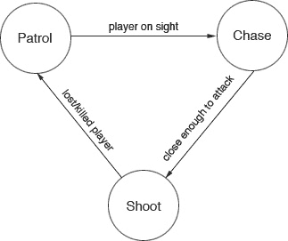

图 3.8 – 坦克 AI 有限状态机

为了举例说明，我们可以给我们的坦克实体一些选项来选择，而不是每次遇到特定条件时都做同样的事情。例如，在我们的早期有限状态机中，我们的 AI 坦克一旦发现玩家在其视线中，就会一直追逐玩家坦克。相反，我们可以将**玩家在视线中**的交易拆分，并将其连接到一个新的附加状态，**逃跑**。AI 如何决定移动到哪个状态呢？当然，随机选择：

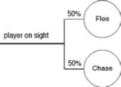


图 3.9 – 使用概率的有限状态机

如前图所示，现在，当 AI 坦克发现玩家时，有 50%的概率它会逃离现场（可能是向总部报告攻击或其他事情）。我们可以用与之前骰子示例相同的方式实现这个机制。首先，我们必须随机获取一个介于 1 到 100 之间的值，并查看这个值是否介于 1 到 50 之间，或者 51 到 100 之间。如果是前者，坦克将逃跑；否则，它将追逐玩家。

另一种实现随机选择的方法是使用**轮盘赌选择算法**。当我们在编译时没有确切的概率或不知道所有可能的选项时，这个算法是有优势的（例如，因为我们从文件中加载了有限状态机规则）。

如其名所示，这个想法是想象一个每个事件都有一个扇区的轮盘赌。然而，一个事件越可能发生，其扇区就越大。然后，我们数学上旋转这个轮盘，并选择我们最终到达的扇区对应的事件：

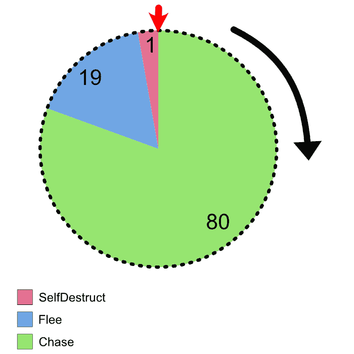


图 3.10 – 轮盘赌

在我们的例子中，我们有三个状态：**追逐**、**逃跑**和**自毁**。我们为每个状态分配一个权重，表示它们相对于彼此的概率。例如，在图中，你可以看到我将**追逐**的权重设置为**80**，**逃跑**的权重设置为**19**，**自毁**的权重设置为*`1`*。请注意，权重不需要像概率那样总和为 1，也不需要是 100，或其他特定的数值。

然而，在这种情况下，我将它们加到 100，因为这更容易将权重转换为概率：我们可以想象**追逐**发生 80%的时间，**逃跑**发生 19%的时间，而在 1%的情况下，坦克自毁。然而，通常情况下，你可以想象事件`X`的权重是写有`X`的球的数量，并将它们放入一个彩票箱中。

让我们在`FSM.cs`文件中看看结果：

```py
using UnityEngine;
using System.Collections;
using System;
using System.Linq;
public class FSM : MonoBehaviour {
    [Serializable]
    public enum FSMState {
        Chase,
        Flee,
        SelfDestruct,
    }
    [Serializable]
    public struct FSMProbability {
        public FSMState state;
        public int weight;
    }
    public FSMProbability[] states;
    FSMState selectState() {
        // Sum the weights of every state.
        var weightSum = states.Sum(state => state.weight);
        var randomNumber = UnityEngine.Random.Range(0,
          weightSum);
        var i = 0;
        while (randomNumber >= 0) {
            var state = states[i];
            randomNumber -= state.weight;
            if (randomNumber <= 0) {
                return state.state;
            }
            i++;
        }
        // It is not possible to reach this point!
        throw new Exception("Something is wrong in the
          selectState algorithm!");
    }

    // Update is called once per frame
    void Update () {
        if (Input.GetKeyDown(KeyCode.Space))
        {
            FSMState randomState = selectState();
            Debug.Log(randomState.ToString());
        }
    }
}
```

这个机制很简单。首先，我们将所有权重相加，以了解想象中的轮盘的大小。然后，我们在 0 和这个总和之间选择一个数字。最后，我们从这个数字中减去每个状态的权重（从第一个开始），直到数字变成负数。然后，正如你在`Update()`方法中看到的，每次我们按下空格键，算法就会从我们的`states`数组中随机选择一个项目。

## 动态调整 AI 技能

我们还可以使用概率来指定 AI 角色的智能水平或全局游戏设置，从而影响游戏的总体难度水平，使其对玩家保持挑战性和趣味性。正如 Jesse Schell 在其著作《游戏设计艺术》中所描述的，如果游戏能够使玩家保持在“心流”通道中（一个从 Mihály Csíkszentmihályi 关于心流状态的心理工作中借鉴的概念），玩家才会继续玩游戏：

![图 3.11 – 玩家的心流通道

![img/B17984_03_11.jpg]

图 3.11 – 玩家的心流通道

如果在玩家具备必要技能之前就向他们展示过于复杂的挑战，他们将会感到焦虑和失望。另一方面，一旦他们掌握了游戏，如果我们保持同样的节奏，他们将会感到无聊。玩家保持参与的时间区域位于这两个极端之间，即困难与简单之间，原始作者将其称为“心流通道”。为了使玩家保持在心流通道中，游戏设计师需要提供与玩家随时间获得的技能提升相匹配的挑战和任务。然而，由于学习速度和期望值可能因人而异，因此很难找到一个对所有玩家都适用的值。

解决这个问题的方法之一是在游戏过程中收集玩家的尝试和结果，并相应地调整对手 AI 的难度。那么，我们如何改变 AI 的难度——例如，通过使 AI 更具侵略性，增加完美射击的概率，或减少异常行为发生的概率？

# 创建老虎机

在这个演示中，我们将设计和实现一个带有 10 个符号和 3 个滚筒的老虎机游戏。为了简化，我们将使用从零到九的数字作为我们的符号。许多老虎机使用水果和其他简单的形状，例如铃铛、星星和字母。有些其他老虎机则使用基于流行电影或电视系列的特定主题。由于有 10 个符号和 3 个滚筒，因此总共有 1,000（10³）种可能的组合。

## 随机老虎机

这个随机老虎机演示与我们的先前的骰子示例类似。这次，我们将为三个滚筒生成三个随机数字。唯一的回报是在支付线上出现三个相同的符号时。为了简化，在这个演示中我们只有一条线路可以玩。如果玩家赢了，游戏将返还投注金额的 500 倍。

我们将设置场景中的所有 UI 元素：三个用于滚筒的文本，另一个用于`betResult`对象的文本元素，一个用于玩家信用额的文本元素（`Credits`），一个用于投注的输入字段（`InputField`），以及一个拉动摇杆的按钮（`Button`）：

![图 3.12 – 我们的 GUI 文本对象

![img/B17984_03_12.jpg]

图 3.12 – 我们的 GUI 文本对象

这就是我们的新脚本的样子，如下面的`SlotMachine.cs`文件所示：

```py
using UnityEngine;
using UnityEngine.UI;
public class SlotMachine : MonoBehaviour { 
    public float spinDuration = 2.0f;
    public int numberOfSym = 10;
    public Text firstReel;
    public Text secondReel;
    public Text thirdReel;
    public Text betResult;
    public Text totalCredits;
    public InputField inputBet;
    private bool startSpin = false;
    private bool firstReelSpinned = false;
    private bool secondReelSpinned = false;
    private bool thirdReelSpinned = false;
    private int betAmount;
    private int credits = 1000;
    private int firstReelResult = 0;
    private int secondReelResult = 0;
    private int thirdReelResult = 0;
    private float elapsedTime = 0.0f;
```

首先，我们列出所有需要的类属性。再次提醒，避免使用公共字段是一个好的编程实践，除非绝对必要。因此，你应该使用 `[SerializeField]` 属性。然而，在这里，我们将使用 `public` 属性以避免使代码列表过长。

现在，让我们继续添加三个新的函数：`Spin`，它用于启动老虎机的旋转；`OnGui`，我们将用它来更新用户界面；以及 `checkBet`，这是一个检查旋转结果并通知玩家他们是否赢或输的函数：

```py
public void Spin() {
    if (betAmount > 0) {
        startSpin = true;
    } else {
        betResult.text = "Insert a valid bet!";
    }
}
private void OnGUI() {
    try {
        betAmount = int.Parse(inputBet.text);
    } catch {
        betAmount = 0;
    }
    totalCredits.text = credits.ToString();
}
void checkBet() {
    if (firstReelResult == secondReelResult && 
        secondReelResult == thirdReelResult) {
        betResult.text = 
          "YOU WIN!"; credits += 500*betAmount;
    } else {
        betResult.text = "YOU LOSE!"; credits -= betAmount;
    }
}
```

接下来，我们实现脚本的主体循环。在 `FixedUpdate` 函数中，我们依次旋转每个滚筒来运行老虎机。一开始，`firstReelSpinned`、`secondReelSpinned` 和 `thirdReelSpinned` 都为假。因此，我们进入第一个 `if` 块。在这里，我们将滚筒设置为随机值，并结束函数。我们重复这个过程，直到经过一定的时间。

之后，我们将滚筒设置为最终值，并将 `firstReelSpinned` 设置为 `true`。然后，函数将移动到第二个滚筒，重复这些步骤。最后，当第三个滚筒最终被设置为最终值时，我们使用 `checkBet` 检查结果：

```py
void FixedUpdate () { 
    if (startSpin) {
        elapsedTime += Time.deltaTime;
        int randomSpinResult =
          Random.Range(0, numberOfSym);
        if (!firstReelSpinned) {
            firstReel.text = randomSpinResult.ToString();
            if (elapsedTime >= spinDuration) {
                firstReelResult = randomSpinResult;
                firstReelSpinned = true;
                elapsedTime = 0;
            }
        } else if (!secondReelSpinned) {
            secondReel.text = randomSpinResult.ToString();
            if (elapsedTime >= spinDuration) {
                secondReelResult = randomSpinResult;
                secondReelSpinned = true;
                elapsedTime = 0;
            }
        } else if (!thirdReelSpinned) {
            thirdReel.text = randomSpinResult.ToString();
            if (elapsedTime >= spinDuration) {
                thirdReelResult = randomSpinResult;
                startSpin = false; 
                elapsedTime = 0;
                firstReelSpinned = false;
                secondReelSpinned = false;
                checkBet();
            }
        }
    }
}
```

将脚本附加到一个空的 `GameController` 对象上，然后在检查器中填写引用的对象。然后，我们需要将 `Button` 连接到 `Spin()` 方法。为此，选择 `Button` 并在检查器中填写 **On Click ()** 事件处理器，如下面的截图所示：

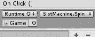

图 3.13 – On Click() 事件处理器

当我们点击按钮时，我们将 `startSpin` 标志设置为 `true`。一旦开始旋转，在 `FixedUpdate()` 方法中，我们为每个滚筒生成一个随机值。最后，当我们得到第三个滚筒的值后，我们将 `startSpin` 标志重置为 `false`。在我们获取每个滚筒的随机值的同时，我们还跟踪玩家拉杆以来经过的时间。

通常，每个滚筒在现实世界的老虎机中需要 3 到 5 秒才能落地显示结果。因此，我们在显示最终的随机值之前也花费了一些时间，这些时间由 `spinDuration` 指定。如果你播放场景并点击 **Pull Lever** 按钮，你应该看到最终的结果，如下面的截图所示：

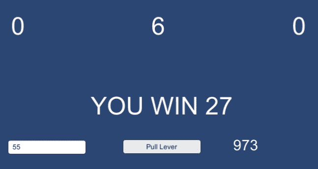

图 3.14 – 我们随机老虎机游戏的实际运行

由于你的获胜概率是 100 分之 1，连续输几次后很快就会变得乏味。然而，如果你曾经玩过老虎机，这并不是它的运作方式，或者至少不再是。通常，你可以在游戏中赢得几次。尽管这些小赢不能收回你的本金（而且从长远来看，大多数玩家都会破产），老虎机仍然偶尔会显示获胜图形和令人兴奋的声音，研究人员将这些称为伪装成赢的损失。

因此，我们不想只通过一种方式赢得大奖金，而是想稍微修改一下规则，使老虎机在游戏过程中支付较小的回报。

## 加权概率

真实老虎机的某个部分被称为**支付表和滚筒条**（**PARS**）表格，这是机器的完整设计文档。PARS 表格用于指定支付百分比、获胜模式、它们的支付金额等等。

支付奖项的数量和此类胜利的频率必须仔细选择，以确保赌场（老虎机）在长期内总是获胜，同时确保不时地向玩家返还一些东西，以使机器更具吸引力。这被称为支付百分比或**玩家回报率**（**RTP**）。例如，具有 90% RTP 的老虎机意味着，随着时间的推移，机器平均将 90%的所有赌注返还给玩家。

在这个演示中，我们不会关注选择赌场的最佳值以在一段时间内获得特定的胜利，也不会关注维持特定的支付百分比。相反，我们将演示如何为特定符号赋予更高的概率，使其出现次数多于平常。所以，假设我们想让 0 符号在第一和第三滚筒上比平常多出现 20%，并将一半的赌注作为支付。

换句话说，如果玩家在第一和第三滚筒上没有得到 0 符号，他们只会损失一半的赌注，这实际上是将损失伪装成小赢。目前，0 符号的概率是 1/10（0.1），或者说 10%的概率。我们现在将其改为在第一和第三滚筒上零出现的 30%的机会，如下面的`SlotMachineWeighted.cs`文件所示（记得在示例代码中切换到`SlotMachineWeighted`组件！）：

```py
using UnityEngine;
using System.Collections;
using UnityEngine.UI;
public class SlotMachineWeighted : MonoBehaviour { 
    public float spinDuration = 2.0f;
    // Number of symbols on the slot machine reels
    public int numberOfSym = 10;
    public Text firstReel;
    public Text secondReel;
    public Text thirdReel;
    public Text betResult;
    public Text totalCredits;
    public InputField inputBet;
    private bool startSpin = false;
    private bool firstReelSpinned = false;
    private bool secondReelSpinned = false;
    private bool thirdReelSpinned = false;
    private int betAmount = 100;
    private int credits = 1000;
    [Serializable]
    public struct WeightedProbability {
        public int number;
        public int weight;
    }
    private List<WeightedProbability> weightedReelPoll =
      new List<WeightedProbability>();
    private int zeroProbability = 30;
    private int firstReelResult = 0;
    private int secondReelResult = 0;
    private int thirdReelResult = 0;
    private float elapsedTime = 0.0f;
```

新增了变量声明，例如`zeroProbability`，以指定零符号落在第一和第三滚筒上的概率百分比。例如，如果`zeroProbability`是 30，第三滚筒将有 30%的时间显示 0。`weightedReelPoll`数组列表用于填充加权符号，就像我们在早期的 FSM 示例中所做的那样。

然后，我们在`Start()`方法中初始化这个列表，如下面的代码所示：

```py
void Start () {
    weightedReelPoll.Add(new WeightedProbability {
        number = 0,
        weight = zeroProbability
    });
    int remainingValuesProb = (100 - zeroProbability)/9;
    for (int i = 1; i < 10; i++) {
        weightedReelPoll.Add(new WeightedProbability {
        number = i,
        weight = remainingValuesProb
    });
}}
```

在实践中，我们将 0 的值设为 30，并将剩余的 70 个百分点分配给剩余的 9 个数字。

我们还在编写一个修订和改进的 `checkBet()` 方法。我们不再只考虑一个大奖赢取选项，现在我们正在考虑五种大奖条件：伪装成赢的损失、几乎错过、第一行和第三行上匹配的任何两个符号，当然，还有 `lose` 条件：

```py
void checkBet() {
    if (firstReelResult == secondReelResult && 
        secondReelResult == thirdReelResult) {
        betResult.text = "JACKPOT!";
        credits += betAmount * 50;
    } else if (firstReelResult == 0 && 
               thirdReelResult == 0) {
        betResult.text = 
          "YOU WIN " + (betAmount/2).ToString();
        credits -= (betAmount/2);
    } else if (firstReelResult == secondReelResult) {
        betResult.text = "AWW... ALMOST JACKPOT!";
    } else if (firstReelResult == thirdReelResult) {
        betResult.text = 
          "YOU WIN " + (betAmount*2).ToString();
        credits -= (betAmount*2);
    } else {
        betResult.text = "YOU LOSE!";
        credits -= betAmount;
    }
}
```

在 `checkBet()` 方法中，我们设计我们的老虎机在击中大奖时返还赌注的 50 倍，如果第一和第三滚筒是 0 则损失赌注的 50%，如果第一和第三滚筒与任何其他符号匹配则赢两倍。

然后，就像前面的例子一样，我们在 `FixedUpdate()` 方法中为三个滚筒生成值，如下面的代码所示：

```py
private int PickNumber() {
    // Sum the weights of every state.
    var weightSum = 
      weightedReelPoll.Sum(state => state.weight);
    var randomNumber = 
      UnityEngine.Random.Range(0, weightSum);
    var i = 0;
    while (randomNumber >= 0) {
        var candidate = weightedReelPoll[i];
        randomNumber -= candidate.weight;
        if (randomNumber <= 0) {
            return candidate.number;
        }
        i++;
    }
    // It should not be possible to reach this point!
    throw new Exception("Something is wrong in the 
                         selectState algorithm!");
}
void FixedUpdate () { 
    if (startSpin) {
        elapsedTime += Time.deltaTime;
        int randomSpinResult = 
          Random.Range(0, numberOfSym);
        if (!firstReelSpinned) {
            firstReel.text = randomSpinResult.ToString();
            if (elapsedTime >= spinDuration) {
                int weightedRandom = PickNumber();
                firstReel.text = weightedRandom.ToString();
                firstReelResult = weightedRandom;
                firstReelSpinned = true;
                elapsedTime = 0;
            }
        } else if (!secondReelSpinned) {
            secondReel.text = randomSpinResult.ToString();
            if (elapsedTime >= spinDuration) {
                secondReelResult = randomSpinResult;
                secondReelSpinned = true;
                elapsedTime = 0;
            }
        }
...
```

对于第一滚筒，我们展示在旋转期间实际发生的真实随机值。一旦时间结束，我们从已经根据概率分布填充了符号的投票中选择一个值。因此，我们的零符号将有 30% 的更高几率出现。

在现实中，如果玩家在第一和第三滚筒上得到两个零符号，他们就会在赌注上亏损；然而，我们让它看起来像是一场胜利。这里只是一个蹩脚的消息，但如果我们结合漂亮的图形，甚至烟花，以及好的胜利音效，这可以起作用。

## 几乎错过

如果第一和第二滚筒返回相同的符号，我们必须通过将第三滚筒的随机值返回到接近第二个的位置来向玩家提供几乎错过的效果。我们可以通过首先检查第三个随机旋转结果来实现这一点。如果随机值与第一和第二个结果相同，这是一个大奖，我们不应该改变结果。

但如果不是，那么我们应该修改结果，使其足够接近其他两个。请检查以下代码中的注释：

```py
        else if (!thirdReelSpinned) {
            thirdReel.text = randomSpinResult.ToString();
            if (elapsedTime >= spinDuration) {
                if ((firstReelResult == secondReelResult)
                  && randomSpinResult != firstReelResult) {
                    // the first two reels have resulted
                    // the same symbol
                    // but unfortunately the third reel
                    // missed
                    // so instead of giving a random number
                    // we'll return a symbol which is one 
                    // less than the other 2
                    randomSpinResult = firstReelResult - 1;
                    if (randomSpinResult < firstReelResult)
                      randomSpinResult =
                        firstReelResult - 1;
                    if (randomSpinResult > firstReelResult)
                     randomSpinResult = 
                       firstReelResult + 1;
                    if (randomSpinResult < 0) 
                      randomSpinResult = 0;
                    if (randomSpinResult > 9) 
                      randomSpinResult = 9;
                    thirdReel.text = 
                      randomSpinResult.ToString();
                    thirdReelResult = randomSpinResult;
                } else {
                    int weightedRandom = PickNumber();
                    thirdReel.text = 
                      weightedRandom.ToString();
                    thirdReelResult = weightedRandom;
                }
                startSpin = false;
                elapsedTime = 0;
                firstReelSpinned = false;
                secondReelSpinned = false;
                checkBet();
            }
        }
    }
}
```

如果发生几乎错过的情况，您应该能看到，如下面的截图所示：

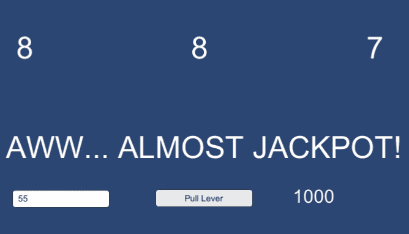

图 3.15 – 几乎错过

我们可以通过根据赌注金额实时调整概率来更进一步（但这会有些可疑）。最后，我们可以在玩家赌光所有钱时添加一个 **游戏结束** 消息。

这个演示向您展示了老虎机游戏的基本实现。您可以从这个骨架开始，并通过更漂亮的图形、动画和音效来改进它。然而，重要的是要理解您仅凭随机性和概率就可以创建一个游戏。

# 摘要

在本章中，我们学习了概率在人工智能游戏设计中的应用。我们通过在 Unity3D 中实现它们来实验了一些技术。作为额外收获，我们还学习了老虎机的工作原理，并使用 Unity3D 实现了一个简单的老虎机游戏。游戏中的概率是通过向角色的行为添加不确定性来使游戏和角色看起来更真实，这样玩家就无法预测结果。

在下一章中，我们将探讨如何实现传感器以及它们如何使我们的 AI 感知其周围环境。

# 进一步阅读

为了进一步研究游戏中概率的高级技术，例如使用贝叶斯技术进行不确定性决策，我推荐阅读 David M. Bourg 和 Glenn Seeman 合著的《AI for Game Developers》。Katie Salen 的《Rules of Play》也是关于游戏设计的一本推荐书籍。
