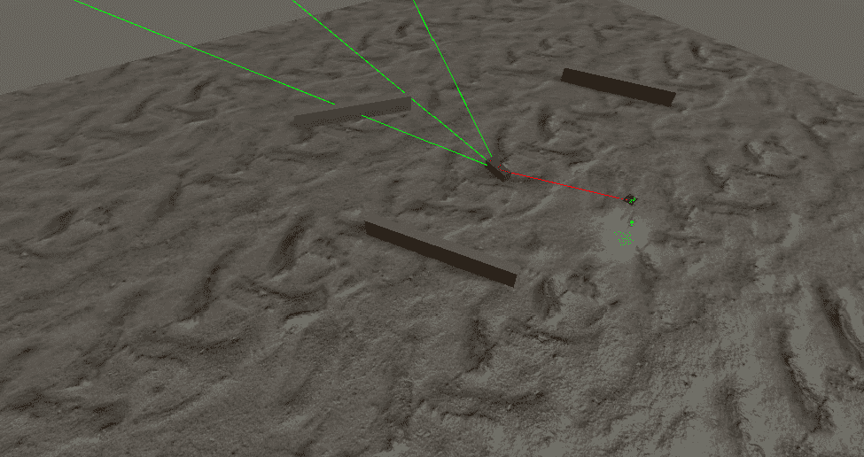

# 第四章：实现传感器

正如我们在上一章中讨论的，角色 AI 系统需要对其周围环境有所了解。例如，**非玩家角色**（**NPCs**）需要知道障碍物的位置，玩家的视线方向，他们是否在玩家的视线中，以及更多。我们 NPC 的 AI 质量在很大程度上取决于他们从环境中获取的信息。传感器错误对玩家来说是显而易见的：我们都有过在玩电子游戏时笑一个显然应该看到我们的 NPC，或者另一方面，因为 NPC 从墙后发现了我们而感到沮丧的经历。

电子游戏角色通常从其底层 AI 决策算法所需的感觉信息中获取输入信息。为了简单起见，在本章中，我们将考虑*感觉信息*为来自游戏世界的任何类型的数据。如果信息不足，角色可能会表现出异常行为，例如选择错误的地方躲避，无所事事，或者在不了解如何进行的情况下重复奇怪的动作。在 YouTube 上快速搜索 AI 故障，就会打开通往大量常见有趣的 AI 行为的宝库，即使在 AAA 游戏中也是如此。

在本章中，我们将探讨以下主题：

+   介绍感觉系统

+   发现什么是感觉系统以及如何在 Unity 中实现两种感觉——视觉和触觉

+   构建一个演示，我们可以看到我们的感觉系统在行动

# 技术要求

对于本章，您只需要 Unity3D 2022。您可以在本书仓库中的`第四章`文件夹中找到本章描述的示例项目：[`github.com/PacktPublishing/Unity-Artificial-Intelligence-Programming-Fifth-Edition/tree/main/Chapter04`](https://github.com/PacktPublishing/Unity-Artificial-Intelligence-Programming-Fifth-Edition/tree/main/Chapter04)。

# 基本感觉系统

一个 AI 感觉系统模拟视觉、听觉甚至嗅觉，从其他 GameObject 中获取信息。在这样的系统中，NPC 需要根据他们的特定兴趣定期检查环境和检查这些感觉。

在一个最小化的感觉系统中，我们有两个主要元素：**方面**（也称为**事件发射器**）和**感觉**（也称为**事件感觉**）。每个感觉只能感知特定的方面；例如，只有听觉感觉的 NPC 只能感知另一个 GameObject 发出的声音（其中一个方面），或者僵尸 NPC 可以使用其嗅觉捕食玩家的脑部。就像现实生活中一样，我们不需要每个 NPC 都有一个单一的感觉；他们可以同时拥有视觉、嗅觉和触觉。

在我们的演示中，我们将实现一个基础接口，称为`Sense`，我们将用它来实现自定义感官。在本章中，我们将实现视觉和触觉感官。视觉是我们用来观察周围世界的；如果我们的 AI 角色看到敌人，我们的代码中会收到一个事件，然后我们会相应地执行一些动作。同样，对于触觉，当敌人太靠近时，我们希望能够感知到。最后，我们将实现一个最小的`Aspect`类，我们的感官可以感知到。

# 设置我们的场景

让我们从设置我们的场景开始：

1.  首先，我们添加一个平面作为地板。

1.  让我们创建一些墙壁来阻挡 AI 角色到敌人的视线。我们用短而宽的立方体制作这些墙壁，并将它们组合在一个名为**障碍物**的空 GameObject 下。

1.  最后，我们添加一个方向性光源来查看场景中的情况。

我们用坦克来代表玩家，类似于我们之前使用的，用简单的立方体来代表 NPC。我们还有一个**目标**对象来显示坦克在我们的场景中的移动位置。我们的场景层次结构应该类似于以下截图：


图 4.1 – 示例的层次结构设置

现在，让我们在我们的场景中随机放置坦克、AI 角色和墙壁。首先，确保将平面的尺寸增加到看起来不错的大小。幸运的是，在这个演示中，所有物体都锁定在平面上，并且没有模拟重力，所以没有任何东西会从平面上掉落。此外，务必调整相机，以便我们可以清楚地看到以下场景：



图 4.2 – 我们坦克和玩家游荡的空间

现在我们已经设置了基本内容，让我们看看如何实现坦克、AI 角色和玩家角色的方面。

# 玩家的坦克和方面类

**目标**对象是一个简单的球体对象，网格渲染已禁用。我们还创建了一个点光源，并将其设置为我们的目标对象的子对象。确保灯光居中，否则它将不会很有帮助。

看看以下`Target.cs`文件中的代码：

```py
using UnityEngine;
public class Target : MonoBehaviour { 
    [SerializeField]
    private float hOffset = 0.2f;
    void Update () {
        int button = 0;
        //Get the point of the hit position when the mouse 
        //is being clicked 
        if(Input.GetMouseButtonDown(button)) {
            Ray ray = Camera.main.ScreenPointToRay(
              Input.mousePosition);
            RaycastHit hitInfo;
            if (Physics.Raycast(ray.origin, ray.direction,
                out hitInfo)) {
                Vector3 targetPosition = hitInfo.point;
                transform.position = targetPosition + 
                  new Vector3(0.0f, hOffset, 0.0f);
            }
        }
    }
}
```

将此脚本附加到目标对象上。该脚本检测鼠标点击事件，然后使用射线投射技术检测 3D 空间中平面上鼠标点击的位置，并更新场景中目标对象的位置。我们将在下一节中查看玩家的坦克。

## 玩家的坦克

玩家的坦克是我们用于*第二章*，“有限状态机”中使用的简单模型，具有非运动学`Rigidbody`组件。我们需要`Rigidbody`组件来生成与 AI 角色和环境对象进行碰撞检测时的触发事件。最后，我们需要将**玩家**标签分配给我们的坦克。

从其名称中我们可以轻易看出，`PlayerTank`脚本控制玩家的坦克。以下是`PlayerTank.cs`文件的代码：

```py
using UnityEngine;
public class PlayerTank : MonoBehaviour { 
    public Transform targetTransform;
    [SerializeField]
    private float movementSpeed = 10.0f;
    [SerializeField]
    private float rotSpeed = 2.0f;
    [SerializeField]
    private float targerReactionRadius = 5.0f;
    void Update () {
        //Stop once you reached near the target position
        if (Vector3.Distance(transform.position,
          targetTransform.position) < targetReactionRadius) 
          return;
        //Calculate direction vector from current position
        // to target position

        Vector3 tarPos = targetTransform.position;
        tarPos.y = transform.position.y;
        Vector3 dirRot = tarPos - transform.position;
        //Build a Quaternion for this new rotation vector
        //using LookRotation method
        Quaternion tarRot = 
          Quaternion.LookRotation(dirRot);
        //Move and rotate with interpolation
        transform.rotation= Quaternion.Slerp(
          transform.rotation, tarRot, 
          rotSpeed * Time.deltaTime);
        transform.Translate(new Vector3(0, 0, 
          movementSpeed * Time.deltaTime));
    }
}
```

此脚本检索地图上的目标位置，并相应地更新坦克的目的地点和方向。前面代码的结果如下所示：


图 4.3 – 我们坦克对象的属性

在将前面的脚本分配给坦克后，请务必将目标对象分配给`targetTransform`变量。

## Aspect

接下来，让我们看看`Aspect`类。`Aspect`是一个具有单个公共属性的基本类，称为`aspectName`。这就是我们在本章需要的所有变量。

每当我们的 AI 角色感知到某物时，我们将检查它是否是 AI 一直在寻找的属性：

```py
using UnityEngine;
public class Aspect : MonoBehaviour {
    public enum Affiliation {
        Player,
        Enemy
    }
    public Affiliation affiliation;
}
```

将此属性脚本附加到我们的玩家坦克上，并将`aspectName`属性设置为`Player`。

# AI 角色

在这个例子中，AI 角色以随机方向在场景中游荡。它们有两种感官：视觉和触觉。视觉感官检查敌人是否在设定的可见范围和距离内。触觉检测敌人是否与角色周围的`Box Collider`发生碰撞。正如我们之前所看到的，我们的玩家坦克具有`Player`属性。因此，当它们检测到玩家的坦克时，这些感官会被触发。

现在，让我们看看我们用来移动 NPC 的脚本：

```py
using UnityEngine;
using System.Collections;
public class Wander : MonoBehaviour { 
    private Vector3 tarPos;
    [SerializeField]
    private float movementSpeed = 5.0f;
    [SerializeField]
    private float rotSpeed = 2.0f;
    [SerializeField]
    private float minX = -45.0f;
    [SerializeField]
    private float maxX = 45.0f;
    [SerializeField]
    private float minZ = -45.0f;
    [SerializeField]
    private float maxZ = -45.0f;
    [SerializeField]
    private float targetReactionRadius = 5.0f;
    [SerializeField]
    private float targetVerticalOffset = 0.5f;
    void Start () {
        //Get Wander Position 
        GetNextPosition();
    }
    void Update () {
        // Check if we're near the destination position
        if (Vector3.Distance(tarPos, transform.position) <=
          targetReactionRadius) GetNextPosition(); 
        // generate new random position
        // Set up quaternion for rotation toward
        // destination
        Quaternion tarRot = Quaternion.LookRotation(
          tarPos - transform.position);
        // Update rotation and translation
        transform.rotation = Quaternion.Slerp(
          transform.rotation,
          tarRot, rotSpeed * Time.deltaTime);
        transform.Translate(new Vector3(0, 0, movementSpeed
                            * Time.deltaTime));
    }
    void GetNextPosition() {
        tarPos = new Vector3(Random.Range(minX, maxX),
          targetVerticalOffset, Random.Range(minZ, maxZ));
    }
}
```

当 AI 角色达到其当前目的地点时，`Wander`脚本会在指定范围内生成一个新的随机位置。然后，`Update`方法旋转 NPC 并将它们移动到新的目的地。将此脚本附加到我们的 AI 角色上，以便它在场景中移动。

## 感官

`Sense`类是我们感官系统的接口，其他自定义感官可以在此接口上实现。它定义了两个虚拟方法，`Initialize`和`UpdateSense`，分别从`Start`和`Update`方法中执行，并且我们可以在实现自定义感官时重写，如下面的代码块所示：

```py
using UnityEngine;
public class Sense : MonoBehaviour { 
    public bool bDebug = true;
    public Aspect.Affiliation targetAffiliation = 
      Aspect.Affiliation.Enemy;
    public float detectionRate = 1.0f;
    protected float elapsedTime = 0.0f;
    protected virtual void Initialize() { }
    protected virtual void UpdateSense() { }
    void Start () {
        Initialize();
    }
    void Update () {
        UpdateSense();
    }
}
```

此脚本的基本属性是两次连续感官操作之间的间隔以及它应该查找的属性名称。此脚本未附加到任何对象上；相反，我们将其用作特定感官（如`Sight`和`Touch`）的基础。

## 视觉

`Sight`感官检测特定属性是否在角色的感知范围内。如果它感知到任何东西，它将执行以下代码块中指定的操作：

```py
using UnityEngine;
public class Sight: Sense { 
    public int FieldOfView = 45; 
    public int ViewDistance = 100;
    private Transform playerTrans;
    private Vector3 rayDirection;
    protected override void Initialize() {
        //Find player position
        playerTrans = GameObject.FindGameObjectWithTag(
          "Player").transform;
    }
    protected override void UpdateSense() {
        elapsedTime += Time.deltaTime;
        // Detect perspective sense if within the detection 
        // rate
        if (elapsedTime >= detectionRate) {
            DetectAspect();
            elapsedTime = 0.0f;
        }
    }
    //Detect perspective field of view for the AI Character
    void DetectAspect() {
        //Direction from current position to player 
        //position
        rayDirection = (playerTrans.position – 
                        transform.position).normalized;
        //Check the angle between the AI character's 
        //forward vector and the direction vector between 
        //player and AI to detect if the Player is in the 
        //field of view.
        if ((Vector3.Angle(rayDirection,
             transform.forward)) < FieldOfView) {
            RaycastHit hit;
            if (Physics.Raycast(transform.position,
                rayDirection, out hit, ViewDistance)) {
                Aspect aspect =
                  hit.collider.GetComponent<Aspect>();
                if (aspect != null) {
                    //Check the aspect
                    if (aspect.affiliation == 
                        targetAffiliation) {
                        print("Enemy Detected");
                    }
                }
            }
        }
    }
```

我们需要实现父类 `Sense` 的 `Initialize` 和 `UpdateSense` 方法。然后，在 `DetectAspect` 方法中，我们首先检查玩家和 AI 当前方向之间的角度。然后，如果它在视野范围内，我们就向玩家坦克的方向发射一条射线。射线的长度是可见距离属性中的值。

`Raycast` 方法在第一次击中另一个对象时返回。然后，我们将其与事务组件和事务名称进行比较。这样，即使玩家在可见范围内，如果他们躲在墙壁后面，AI 角色也不会看到玩家。

`OnDrawGizmos` 方法根据视角场（由视角角度和观看距离确定）绘制线条，以便在游戏测试期间在编辑器窗口中看到 AI 角色的视线。将此脚本附加到 AI 角色上，并确保将事务名称设置为 `Enemy`。

这个方法可以表示如下：

```py
    void OnDrawGizmos() {
        if (!Application.isEditor|| playerTrans == null)
          return;
        Debug.DrawLine(transform.position,
                       playerTrans.position, Color.red);
        Vector3 frontRayPoint = transform.position + 
          (transform.forward * ViewDistance);
        //Approximate perspective visualization
        Vector3 leftRayPoint = Quaternion.Euler(
          0,FieldOfView * 0.5f ,0) * frontRayPoint;
        Vector3 rightRayPoint = Quaternion.Euler(0, 
          - FieldOfView*0.5f, 0) * frontRayPoint;
        Debug.DrawLine(transform.position, frontRayPoint,
                       Color.green);
        Debug.DrawLine(transform.position, leftRayPoint,
                       Color.green);
        Debug.DrawLine(transform.position, rightRayPoint, 
                       Color.green);
    }
}
```

`OnDrawGizmos` 是一个事件函数，当我们想在场景中绘制 gizmos 时可以使用。`DrawLine`、`DrawIcon` 和 `DrawSphere`。

它们是快速为我们算法提供一些视觉反馈的便捷方式。你可以通过以下链接了解更多关于 gizmo 函数的信息：[`docs.unity3d.com/ScriptReference/Gizmos.html`](https://docs.unity3d.com/ScriptReference/Gizmos.html)。

## 触摸

我们将要实现的另一个感官是 `Touch`，当玩家实体在 AI 实体特定范围内时触发，如下面的代码块所示。我们的 AI 角色有一个盒子碰撞体组件，并且它的 `Is Trigger` 标志是开启的：

```py
using UnityEngine;
public class Touch : Sense {
    void OnTriggerEnter(Collider other) {
        Aspect aspect = other.GetComponent<Aspect>();
        if (aspect != null) {
            //Check the aspect
            if (aspect.affiliation == targetAffiliation) {
                print("Enemy Touch Detected");
            }
        }
    }
}
```

我们需要实现每次碰撞组件与另一个碰撞组件发生碰撞时触发的 `OnTriggerEnter` 事件。由于我们的坦克实体也有碰撞体和 `Rigidbody` 组件，因此当 AI 角色和玩家坦克的碰撞体重合时，就会发生碰撞事件。

以下屏幕截图显示了我们的敌人 AI 的盒子碰撞体，我们正在使用它来实现 `Touch` 感官：


图 4.4 – 我们玩家周围的碰撞组件

在下面的屏幕截图中，我们可以看到我们的 AI 角色是如何设置的：


图 4.5 – 我们玩家的属性

在 `OnTriggerEnter` 方法中，我们访问另一个碰撞实体的事务组件，并检查事务的名称是否与我们这个 AI 角色正在寻找的事务名称相同。为了演示目的，我们在控制台中打印出角色通过 `Touch` 感官检测到敌人事务。在实际游戏中，我们不会打印事件，而是触发其他动作，例如转向面对敌人，然后追逐、攻击等等。让我们继续测试我们的游戏。

# 游戏测试

现在，在 Unity3D 中玩游戏，通过点击地面将玩家的坦克移动到游荡的 AI 角色附近。每当我们的 AI 角色接近玩家的坦克时，你应在控制台日志窗口中看到**敌人触摸检测**的消息。

![图 4.6 – 我们的角色和坦克在行动中

![img/B17984_04_6.jpg]

图 4.6 – 我们的角色和坦克在行动中

上一张截图显示了一个具有触摸和视角感官的 AI 代理正在寻找敌人特征。将玩家的坦克移到 AI 角色前方，你将收到**敌人检测**的消息。如果在运行游戏的同时进入编辑器视图，你应该会看到由于在`视觉感官`类中实现了`OnDrawGizmos`方法而渲染的调试图形。

# 摘要

本章介绍了在实现游戏 AI 中使用传感器的概念，并为我们的 AI 角色实现了两种感官，即`视觉`和`触摸`。感官系统是整个 AI 系统决策系统的第一个元素。例如，一旦我们在 AI 的视线范围内检测到敌人，我们可以使用感官系统来控制行为系统的执行或改变有限状态机的状态。

我们将在*第九章*“行为树”中介绍如何应用行为树系统。同时，在下一章中，我们将探讨如何在 Unity3D 中实现群聚行为，以及如何实现克雷格·雷诺的群聚算法。
