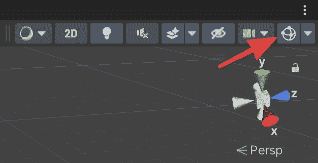
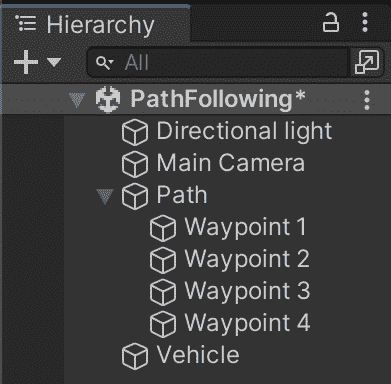
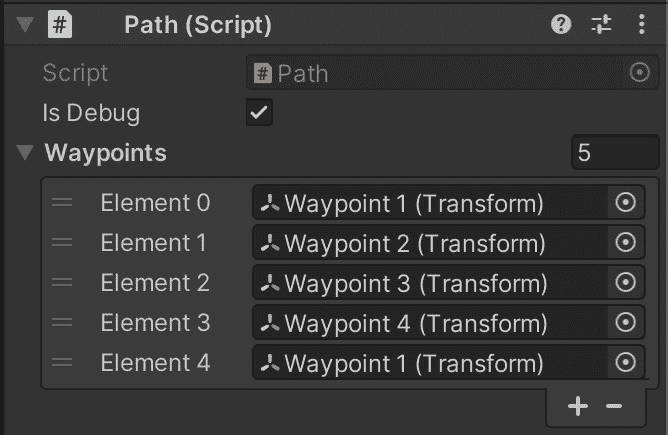
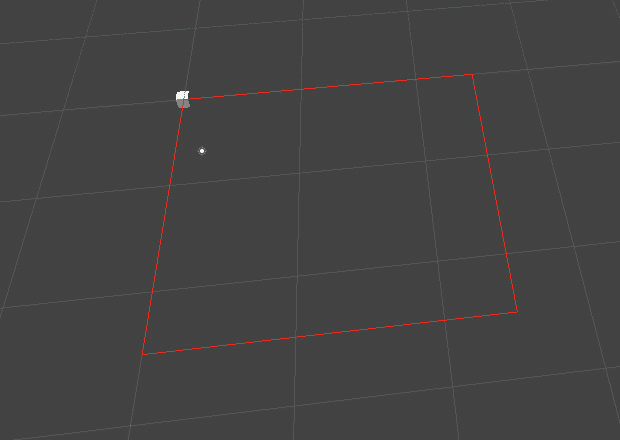
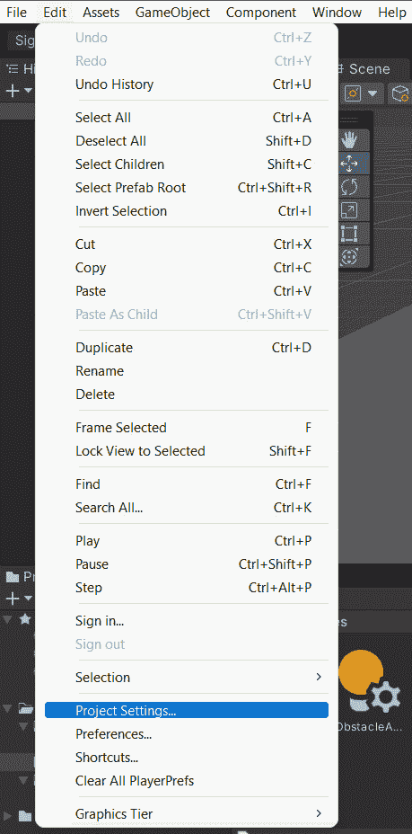
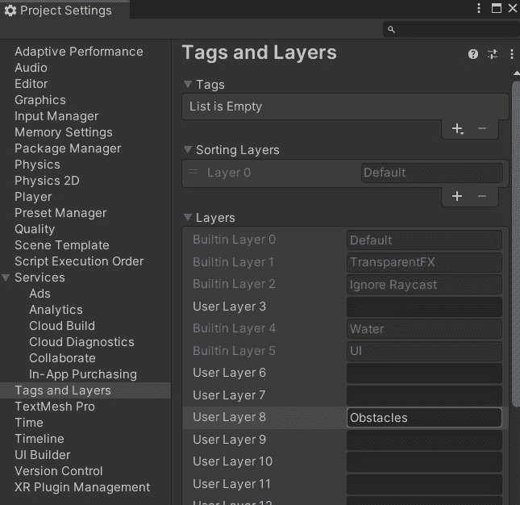
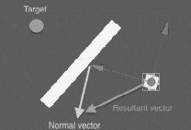

# 第六章：*第六章*：路径跟随和导航行为

在这个简短章节中，我们将实现两个 Unity3D 演示来探索导航行为。在第一个演示中，我们将实现一个脚本，使实体遵循简单的路径。在第二个演示中，我们将设置一个带有几个障碍的场景，并编程一个实体在避开障碍的同时到达目标。

避障是游戏角色在移动和与游戏世界交互时的基本行为。然而，避障通常与其他导航系统（如路径查找或人群模拟）一起使用。在本章中，我们将使用这些系统确保我们避开其他代理并到达目标。我们不会讨论角色到达目的地有多快，也不会计算到达目标的最短路径，因为我们将这些内容留到下一章讨论。

在本章中，我们将探讨以下两个基本方面的运动：

+   沿着路径

+   避免障碍

# 技术要求

对于本章，你只需要 Unity3D 2022。你可以在本书仓库中的`第六章`文件夹中找到本章描述的示例项目：[`github.com/PacktPublishing/Unity-Artificial-Intelligence-Programming-Fifth-Edition/tree/main/Chapter06`](https://github.com/PacktPublishing/Unity-Artificial-Intelligence-Programming-Fifth-Edition/tree/main/Chapter06)。

# 沿着路径

一个`Path.cs`脚本，它接受一个游戏对象列表作为航点，并从中创建路径。

## 路径脚本

让我们看看负责管理我们对象路径的路径脚本。考虑以下在`Path.cs`文件中的代码：

```py
using UnityEngine;
public class Path : MonoBehaviour {
    public bool isDebug = true;
    public Transform[] waypoints;
    public float Length {
        get {
            return waypoints.Length;
        }
    }
    public Vector3 GetPoint(int index) {
        return waypoints[index].position;
    }
    void OnDrawGizmos() {
        if (!isDebug)
            return;
        for (int i = 1; i < waypoints.Length; i++) {
            Debug.DrawLine(waypoints[i-1].position,
            waypoints[i].position, Color.red);
        }
    }
}
```

如您所见，这是一个简单的脚本。它有一个`Length`属性，返回航点的数量。`GetPoint`方法返回数组中指定索引的特定航点的位置。然后，我们有`OnDrawGizmos`方法，由 Unity3D 帧调用，在编辑器环境中绘制组件。除非在右上角的小工具标志打开，否则这里的绘制不会在游戏视图中渲染。



图 6.1 – 编辑器视图中的小工具可见性选项

现在，让我们创建场景。创建一个空的**路径**游戏对象，并将其**路径**脚本附加到它上。然后，让我们添加一些空的子游戏对象。它们将是航点标记。



图 6.2 – 这是如何组织层级

选择**路径**对象。现在我们需要在检查器中填充**航点**数组，使用实际的航点标记。像往常一样，我们可以通过将游戏对象从层级拖放到检查器中来实现这一点。



图 6.3 – 检查器中的路径脚本配置

上述列表显示了示例项目中的**航点**。然而，你可以在编辑器中移动航点，多次使用相同的航点，或者做任何你喜欢的事情。

另一个属性是一个复选框，用于启用**调试**模式和航点半径。如果我们启用**调试**模式属性，Unity 将在编辑器视图中以 gizmo 的形式绘制由航点连接而成的路径，如图*图 6.4*所示。



图 6.4 – 在编辑器视图中绘制路径的 gizmo

现在我们有了路径，我们需要设计一个可以跟随它的角色。我们将在下一节中这样做。

## 跟随路径的代理

对于这个演示，主要角色由一个勇敢而英勇的立方体表示。但当然，相同的脚本也适用于你想要的任何 3D 模型。

让我们先创建一个`VehicleFollowing`脚本。该脚本接受几个参数：第一个是需要跟随的路径对象的引用（**Path**变量）；然后，我们有**Speed**和**Mass**属性，我们需要计算角色的速度随时间的变化。最后，如果选中，**Is Looping**标志指示实体以闭合循环连续跟随路径。

让我们来看看`VehicleFollowing.cs`文件中的以下代码：

```py
using UnityEngine;
public class VehicleFollowing : MonoBehaviour {
    public Path path;
    public float speed = 10.0f;
    [Range(1.0f, 1000.0f)]
    public float steeringInertia = 100.0f;
    public bool isLooping = true;
    public float waypointRadius = 1.0f;
    //Actual speed of the vehicle 
    private float curSpeed;
    private int curPathIndex = 0;
    private float pathLength;
    private Vector3 targetPoint;
    Vector3 velocity;
```

首先，我们指定所有脚本属性。然后，我们初始化属性并使用实体的前向向量设置速度向量的起始方向。我们在`Start`方法中这样做，如下面的代码所示：

```py
void Start () {
    pathLength = path.Length;
    velocity = transform.forward;
}
```

在这个脚本中，只有两个方法真正重要：`Update`和`Steer`方法。让我们看看第一个：

```py
    void Update() {
        //Unify the speed
        curSpeed = speed * Time.deltaTime;
        targetPoint = path.GetPoint(curPathIndex);
        //If reach the radius of the waypoint then move to
        //next point in the path
        if (Vector3.Distance(transform.position,
            targetPoint) < waypointRadius) {
            //Don't move the vehicle if path is finished 
            if (curPathIndex < pathLength - 1)
                curPathIndex++;
            else if (isLooping)
                curPathIndex = 0;
            else
                return;
        }
        //Move the vehicle until the end point is reached 
        //in the path
        if (curPathIndex >= pathLength)
            return;
        //Calculate the next Velocity towards the path
        if (curPathIndex >= pathLength - 1 && !isLooping)
            velocity += Steer(targetPoint, true);
        else
            velocity += Steer(targetPoint);
        //Move the vehicle according to the velocity
        transform.position += velocity;
        //Rotate the vehicle towards the desired Velocity 
        transform.rotation =
          Quaternion.LookRotation(velocity); 
    }
```

在`Update`方法中，我们通过计算实体当前位置与目标航点之间的距离是否小于航点的半径来检查实体是否到达了特定的航点。如果是，我们增加索引，这样就将目标位置设置为航点数组中的下一个航点。如果它是最后一个航点，我们检查`isLooping`标志。

如果它是活动的，我们将目的地设置为起始航点；否则，我们停止。另一种解决方案是编程它，使我们的物体转身并返回它来的路。实现这种行为并不困难，所以我们将其留给读者作为有益的练习练习。

现在，我们使用`Steer`方法来计算实体的加速度和旋转。在这个方法中，我们根据速度向量的速度和方向旋转并更新实体的位置：

```py
    public Vector3 Steer(Vector3 target, bool bFinalPoint = 
      false) {
        //Calculate the directional vector from the current
        //position towards the target point
        Vector3 desiredVelocity = 
          (target - transform.position);
        float dist = desiredVelocity.magnitude;
        //Normalize the desired Velocity
        desiredVelocity.Normalize();
        // 
        if (bFinalPoint && dist < waypointRadius)
            desiredVelocity *= 
              curSpeed * (dist / waypointRadius);
        else
            desiredVelocity *= curSpeed;
        //Calculate the force Vector
        Vector3 steeringForce = desiredVelocity - velocity;
        return steeringForce / steeringInertia;
    }
}
```

`Steer`方法接受两个参数：目标位置和一个布尔值，它告诉我们这是路径中的最终航点。首先，我们计算从当前位置到目标位置剩余的距离。然后我们从目标位置向量中减去当前位置向量以得到指向目标位置的向量。我们对其大小不感兴趣，只关心其方向，因此我们对其进行归一化。

现在，假设我们正在移动到最终航点，并且它与我们之间的距离小于航点半径。在这种情况下，我们希望逐渐减速，直到速度在航点位置恰好变为零，以便角色能够正确地停在原地。否则，我们使用期望的最大速度值更新目标速度。然后，与之前相同，我们可以通过从目标速度向量中减去当前速度向量来计算新的转向向量。最后，通过将此向量除以我们的实体转向惯性值，我们得到一个平滑的转向（请注意，转向惯性的最小值为`1`，对应于瞬时转向）。

现在我们有了脚本，我们可以创建一个空的`Cube`对象并将其放置在路径的起点。然后，我们向其中添加`VehicleFollowing`脚本组件，如下面的截图所示：

![图 6.5 – VehicleFollowing 脚本的属性]

![图片 B17984_06_5.jpg]

图 6.5 – VehicleFollowing 脚本的属性

如果运行场景，你应该看到我们的立方体角色沿着路径移动。你还可以在编辑器视图中看到路径。尝试调整立方体的速度和转向惯性值以及路径的半径值，看看它们如何影响系统的整体行为。

# 避免障碍物

在本节中，我们探讨障碍物避让。首先，当然需要障碍物。因此，我们设置了一个类似于*图 6.6*所示的场景。然后，我们为主角编写了一个脚本，使其在尝试到达目标点的同时避开障碍物。这里提出的算法使用了射线投射法，这种方法非常直接。然而，这意味着它只能避开直接阻挡其路径前方的障碍物：

![图 6.6 – 一个示例场景设置]

![图片 B17984_06_6.jpg]

图 6.6 – 一个示例场景设置

我们创建了一些立方体实体，并将它们组合在一个名为`Obstacles`的空游戏对象下，以创建环境。我们还创建了一个名为`Vehicle`的另一个立方体对象，并给它添加了障碍物避让脚本。最后，我们创建了一个代表地面的平面对象。

![图 6.7 – 场景的层次结构结构]

![图片 B17984_06_7.jpg]

图 6.7 – 场景的层次结构结构

值得注意的是，**Vehicle**对象不执行路径查找，即不是在目的地进行路径的主动搜索。相反，它只是在跟随路径时局部避开障碍物。简而言之，这就像你从家计划去购物中心的路，以及避开你可能在路上遇到的可能的人和障碍物。因此，如果我们设置太多的墙壁，**Vehicle**可能很难找到目标：例如，如果 Agent 最终面对一个 U 形物体的死胡同，它可能无法出来。尝试几种不同的墙壁设置，看看你的代理表现如何。

## 添加自定义层

我们现在将自定义层添加到 Obstacles 对象中：

1.  要添加新层，请转到**编辑** | **项目设置**：



图 6.8 – 项目设置

1.  转到**标签和层**部分。

1.  将名称`Obstacles`分配给**用户层 8**。

1.  然后，我们回到我们的立方体实体，并设置其`Obstacles`：



图 6.9 – 创建新层

1.  当我们使用射线投射来检测障碍物时，我们检查这些实体，但仅在这个层上。这样，物理系统可以忽略被射线击中的不是障碍物的对象，例如灌木丛或植被：


图 6.10 – 分配我们的新层

1.  对于较大的项目，我们的游戏对象可能已经分配了层。因此，我们不会更改对象的层为**Obstacles**，而是为我们的立方体实体创建一个层列表，用于检测障碍物。我们将在下一节中详细介绍这一点。

    信息

    在游戏中，我们使用层让相机仅渲染场景的一部分，或者让灯光仅照亮对象的一个子集。然而，层也可以通过射线投射来选择性地忽略碰撞体或创建碰撞。您可以在[`docs.unity3d.com/Manual/Layers.html`](https://docs.unity3d.com/Manual/Layers.html)了解更多信息。

## 避障

现在，是时候编写使立方体实体避免墙壁的脚本了。像往常一样，我们首先使用默认属性初始化我们的实体脚本。在这里，我们还在`OnGUI`方法中绘制 GUI 文本。让我们看看`VehicleAvoidance.cs`文件中的以下代码：

```py
using UnityEngine;
public class VehicleAvoidance : MonoBehaviour {
    public float vehicleRadius = 1.2f;
    public float speed = 10.0f;
    public float force = 50.0f;
    public float minimumDistToAvoid = 10.0f;
    public float targetReachedRadius = 3.0f;
    //Actual speed of the vehicle 
    private float curSpeed;
    private Vector3 targetPoint;
    // Use this for initialization
    void Start() {
        targetPoint = Vector3.zero;
    }
    void OnGUI() {
        GUILayout.Label("Click anywhere to move the vehicle
                         to the clicked point");
    }
```

然后，在`Update`方法中，我们根据`AvoidObstacles`方法返回的方向向量更新 Agent 实体的位置和旋转：

```py
    void Update() {
        //Vehicle move by mouse click
        var ray = Camera.main.ScreenPointToRay(
          Input.mousePosition);
        if (Input.GetMouseButtonDown(0) &&
            Physics.Raycast(ray, out var hit, 100.0f)) {
            targetPoint = hit.point;
        }
        //Directional vector to the target position
        Vector3 dir = (targetPoint - transform.position);
        dir.Normalize();
        //Apply obstacle avoidance
        AvoidObstacles(ref dir);

       . . . .
}
```

在`Update`方法中，我们首先获取鼠标点击的位置。然后，我们使用这个位置来确定我们角色的期望目标位置。为了获取鼠标点击位置，我们从相机面向的方向发射一条射线。然后，我们将射线击中地面平面的点作为目标位置。

一旦我们得到目标位置，我们可以通过从目标位置向量减去当前位置向量来计算方向向量。然后，我们调用`AvoidObstacles`方法，并将这个方向传递给它：

```py
    public void AvoidObstacles(ref Vector3 dir) {
        //Only detect layer 8 (Obstacles)
        int layerMask = 1 << 8;
        //Check that the vehicle hit with the obstacles
        //within it's minimum distance to avoid
        if (Physics.SphereCast(transform.position,
            vehicleRadius, transform.forward, out var hit,
            minimumDistToAvoid, layerMask)) {
            //Get the normal of the hit point to calculate
            //the new direction
            Vector3 hitNormal = hit.normal;
            //Don't want to move in Y-Space
            hitNormal.y = 0.0f; 
            //Get the new directional vector by adding
           //force to vehicle's current forward vector
            dir = transform.forward + hitNormal * force;
        }
    }
```

`AvoidObstacles`方法也很简单。注意，我们使用了另一个非常实用的 Unity 物理工具：**SphereCast**。SphereCast 与 Raycast 类似，但它不是通过发射一个无尺寸的射线来检测碰撞器，而是发射一个粗壮的球体。在实践中，SphereCast 给 Raycast 射线增加了宽度。

这为什么重要？因为我们的角色不是无尺寸的。我们想确保角色的整个身体可以避免碰撞。

另一点需要注意的是，SphereCast 会选择性地与`SphereCast`方法交互，它接受一个图层遮罩参数以确定在射线投射期间忽略和考虑哪些图层。现在，如果你看看在**标签管理器**中可以指定多少层，你会发现总共有 32 层。

因此，Unity3D 使用 32 位整数来表示这个图层遮罩参数。例如，以下表示 32 位中的零：

```py
0000 0000 0000 0000 0000 0000 0000 0000
```

默认情况下，Unity3D 使用前八个图层作为内置图层。所以，当你使用 Raycast 或 SphereCast 而不使用图层遮罩参数时，它会检测那些八个图层中的每一个对象。我们可以用位掩码表示这种交互掩码，如下所示：

```py
0000 0000 0000 0000 0000 0000 1111 1111
```

在这个演示中，我们将**障碍物**图层设置为图层 8（第 9 个索引）。因为我们只想检测这个图层中的障碍物，所以我们需要按以下方式设置位掩码：

```py
0000 0000 0000 0000 0000 0001 0000 0000
```

设置这个位掩码的最简单方法是使用位移运算符。我们只需要将位，`1`，放置在第 9 个索引上，这意味着我们只需将这个位向左移动八位。所以，我们使用左移运算符将位向左移动八位，如下面的代码所示：

```py
int layerMask = 1<<8;
```

如果我们想使用多个图层遮罩，比如说图层 8 和图层 9，一个简单的方法是使用位或运算符，如下所示：

```py
int layerMask = (1<<8) | (1<<9);
```

Info

你也可以在 Unity3D 的在线资源中找到关于使用图层遮罩的良好讨论。问答网站可以在[`answers.unity3d.com/questions/8715/how-do-i-use-layermasks.html`](http://answers.unity3d.com/questions/8715/how-do-i-use-layermasks.html)找到。

一旦我们有了图层遮罩，我们就会从当前实体的位置和前方方向调用`Physics.SphereCast`方法。我们使用半径为`vehicleRadius`的球体（确保足够大，可以完全包含立方车辆）以及由`minimumDistToAvoid`变量定义的检测距离。实际上，我们只想检测足够接近以影响我们移动的对象。

然后，我们取被击中射线的法向量，将其与力向量相乘，并将其加到实体的当前方向上，以获得新的结果向量，然后我们从该方法返回这个向量：



图 6.11 – 我们的立方体实体如何避开墙壁

然后，在`Update`方法中，我们使用这个新的方向来旋转 AI 实体，并根据速度值更新位置：

```py
    void Update () {
        //...
        //Don't move the vehicle when the target point is
        //reached
        if (Vector3.Distance(targetPoint,
            transform.position) < targetReachedRadius)
            return;
        //Assign the speed with delta time
        curSpeed = speed * Time.deltaTime;
        //Rotate the vehicle to its target directional
        //vector
        var rot = Quaternion.LookRotation(dir);
        transform.rotation = 
          Quaternion.Slerp(transform.rotation, rot, 5.0f *
                           Time.deltaTime);
        //Move the vehicle towards
        transform.position += transform.forward * curSpeed;
        transform.position = new Vector3(
          transform.position.x, 0, transform.position.z);
    }
```

现在，我们只需要将这个新的脚本附加到车辆对象上（这可以是一个简单的立方体，就像上一个例子中那样）。记住，这个新的脚本需要替换我们在上一节中实现的`VehicleFollowing`脚本。


图 6.12 – 我们车辆避障脚本的属性

如果一切正确，你应该能够看到车辆在没有任何麻烦的情况下绕过障碍物在平面上导航。像往常一样，通过 Inspector 参数调整车辆行为。

# 摘要

在本章中，我们设置了两个场景，并研究了如何构建具有避障行为的路径跟随代理。我们了解了 Unity3D 层功能以及如何有选择性地使用 Raycasts 和 SphereCasts 对特定层进行操作。尽管这些例子很简单，但我们可以将这些简单技术应用于各种场景。例如，我们可以在道路上设置路径。我们可以轻松地使用一些车辆模型结合避障行为设置一个不错的交通模拟。或者，你也可以用两足人物来替换它们，构建一个人群模拟。你还可以将它们与一些有限状态机结合，以添加更多行为并使其更加智能。

本章中我们实现的简单避障行为没有考虑到达目标位置的最佳路径。相反，它只是直接前往那个目标，只有当在特定距离内看到障碍物时，它才会尝试避开它。因此，它应该在移动或动态对象和障碍物之间使用。

在下一章中，我们将研究如何实现一个名为**A**的路径查找算法，在移动之前确定最佳路径，同时避开静态障碍物。
