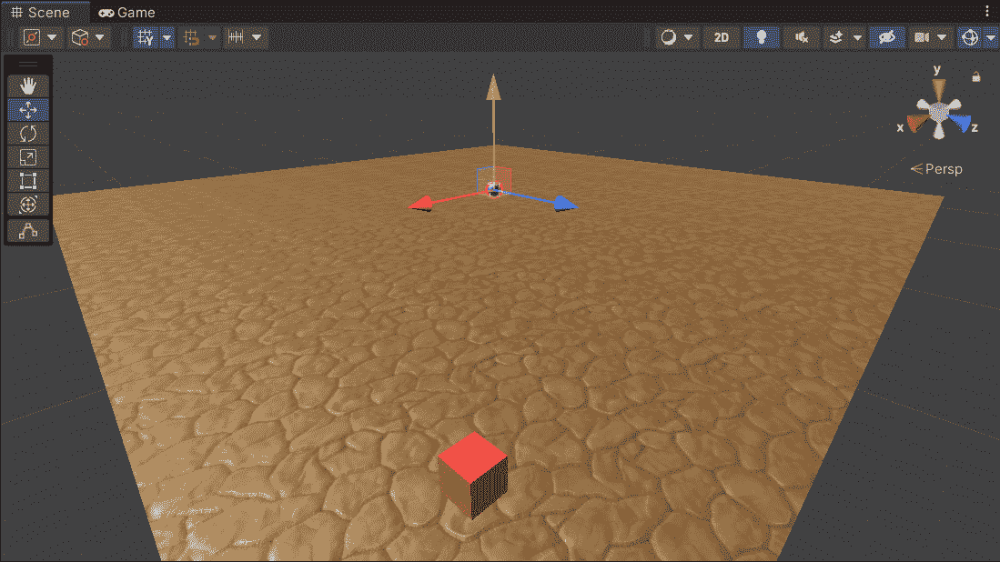
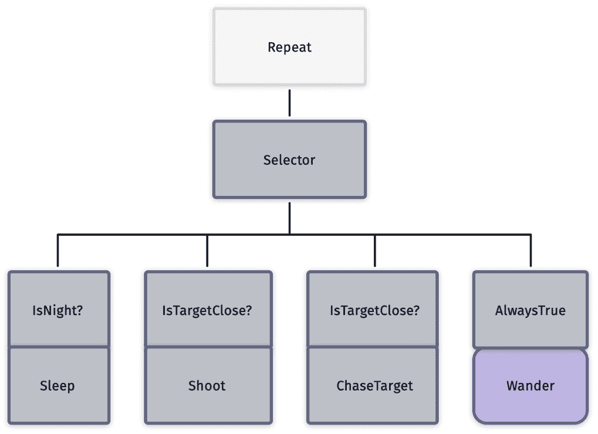
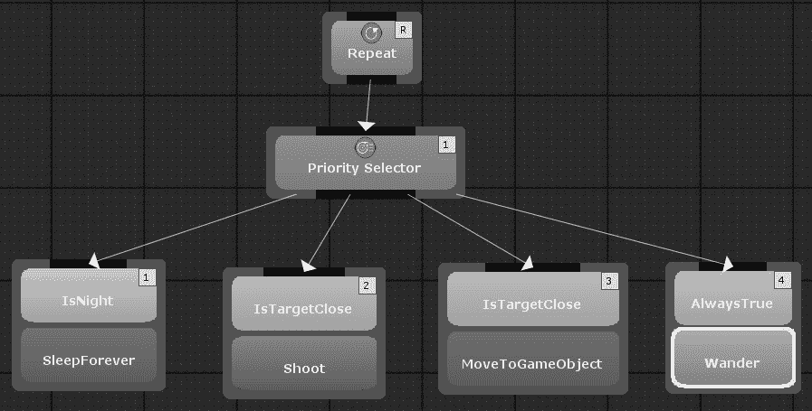
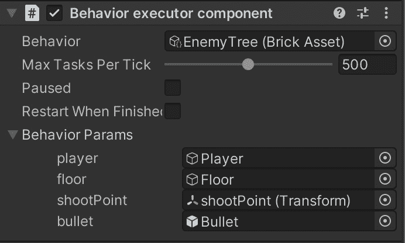

# 第九章：*第九章*：行为树

在前一章中，我们看到了实现和管理角色状态和行为的基本但有效的方法：**有限状态机**（**FSMs**）。FSMs 易于实现且直观，但它们有一个致命的缺陷：一旦有多个状态和转换，就很难进行扩展。例如，想象一个根据其健康和魔法值（高、中、低）表现不同的角色。我们有一个状态，其中健康和魔法值都高，一个状态是健康中等而魔法值高，一个状态是两者都中等，以此类推。仅这些状态就有九种。如果我们添加其他条件（如玩家接近度、一天中的时间、装备、玩家的得分或你可以想象的其他任何条件），状态的数量将以指数级增长。

幸运的是，我们有一个解决方案：**行为树**（**BTs**）。本质上，BTs 只是另一种可视化复杂 FSMs 的方法，但它们速度快，提供可重用性，且易于维护。自 2004 年随着*Halo 2*的引入，它们迅速成为游戏中的首选决策技术。

本章我们将做以下工作：

+   探索 BTs 的基本原理，这些知识你可以将其转移到任何适用于 Unity（或其他游戏引擎）的 BT 插件

+   基于流行的免费 Unity 插件 BTs（行为砖块）实现一个小型演示：**行为砖块**

# 技术要求

对于本章，你需要 Unity3D 2022 和免费的 Unity 插件，*行为砖块*。不用担心，我们将一起看看如何安装这个插件。你可以在本书仓库中的`第九章`文件夹中找到本章描述的示例项目：[`github.com/PacktPublishing/Unity-Artificial-Intelligence-Programming-Fifth-Edition/tree/main/Chapter09`](https://github.com/PacktPublishing/Unity-Artificial-Intelligence-Programming-Fifth-Edition/tree/main/Chapter09)。

# BTs 简介

BT（行为树）是一个控制 AI 角色行为流程的节点层次树。它也可以用来协调角色组（例如，模拟小部队的攻击模式），甚至无形的代理，如 AI 故事导演。

当我们执行 BT 的节点时，节点可以返回三种状态：**成功**、**失败**或**运行中**（如果节点的执行跨越多个帧，例如，如果它在播放动画）。当 BT 执行器运行树时，它从根节点开始，按照节点本身写入的规则顺序执行每个节点。

节点可以是三种类型之一：

+   **任务**（无子节点的节点），也称为**叶节点**。

+   **装饰器**（具有单个子节点的节点）

+   **组合**（具有多个子节点的节点）

通常，叶子代表角色可以执行或知道的操作（这就是为什么它们通常被称为**动作**或**任务**）；它们可能是**GoToTarget**、**OpenDoor**、**Jump**或**TakeCover**等动作，也可能是**IsObjectNear?**或**IsHealthLow?**等事物。这些操作取决于角色、游戏以及一般的游戏实现。

**装饰器**是一个修改（装饰）其下子树的节点（因此，它可以装饰复合节点和任务节点）。例如，一个标准的装饰器是**否定**节点。该节点反转子树的返回值；例如，如果子树返回**成功**，则装饰器返回**失败**，反之亦然（当然，如果子树返回**运行中**，则装饰器也返回**运行中**）。另一个常见的装饰器是**重复**，它重复其子树一定次数。

相反，一个**复合**节点代表一个具有多个子节点的节点，这是最有趣的情况。有两种常见的复合节点：**序列**，它按顺序运行其所有子节点，并且只有当所有子节点都返回**成功**时才返回**成功**，以及**选择器**，它尝试按顺序执行其所有子节点，但只要其子节点之一返回**成功**，就返回**成功**。然而，许多 BT 实现包含许多更多的复合节点（例如，并行运行其子节点或根据某些动态优先级值运行的节点；我们将在演示中看到一个这样的节点的例子）。

当然，这种树结构还不够。节点需要相互交换信息或与游戏世界交换信息。例如，**GoToTarget**节点需要知道目标及其位置；**IsObjectClose?**节点需要知道我们指的是哪个对象以及我们认为多近的距离是接近的。自然地，我们可以为游戏中的每个对象编写一个**GoToX**节点（例如**GoToTree01**和**GoToDoor23**），但你很容易想象这会很快变得混乱。

因此，所有 BT 实现都包含一个称为**黑板**的数据结构。就像现实生活中的物理黑板一样，每个节点都可以将其数据写入其中并从中读取；我们只需指定每个节点查找的位置。

## 一个简单的例子 - 巡逻机器人

让我们看看这个例子（我们将在 Unity 中稍后实现）。想象一个巡逻机器人，它会射击靠近它的任何东西，但只在白天工作。我们在以下图中展示了这种代理的可能 BT：

![图 9.1 - 简化日间巡逻机器人的示例 BT

![img/B17984_09_1.jpg]

图 9.1 - 简化日间巡逻机器人的示例 BT

让我们运行这个 BT，假设目标很近，而且不是夜晚：

1.  第一个节点是一个**重复**装饰器；它什么都不做，只是循环 BT，因此现在我们可以忽略它。

1.  **选择器**节点开始执行其第一个子节点；我们向左下移动。

1.  我们现在位于第一个**Sequence**节点；再次，我们执行第一个节点。**IsNight?**返回*失败*（因为现在不是夜晚！）。每当一个节点返回*失败*时，整个**Sequence**节点也会返回*失败*。

1.  我们回到树的**SELECTOR**节点；现在，我们进入第二个分支。

1.  再次，我们执行**Sequence**。

1.  然而，这次**IsTargetClose?**返回*成功*，因此我们可以继续到下一个节点，**Shoot**，它运行一个游戏函数生成游戏中的投射物。

**Sequence** | **Condition** | **Action**的模式等同于如果*Condition*是*成功*，则*Action*。这种模式非常常见，许多 BT 实现都允许你将*Condition*和*Action*一起堆叠。因此，我们可以将树重写如下：

![Figure 9.2 – 简化的 BT

![img/B17984_09_2.jpg]

Figure 9.2 – 简化的 BT

这个树与上一个相同，但有一个简化的 Sequence 模式。

# 使用 Behavior Bricks 在 Unity 中实现 BT

**Behavior Bricks**是西班牙马德里康普顿塞大学开发的一个强大但免费的 Unity BT 实现。使用 Behavior Bricks，你可以在项目中开始使用 BT，而无需从头开始实现 BT。它还包含一个可视化编辑器，你可以在这里拖放并连接节点，而无需任何额外的代码。

按照以下步骤安装 Behavior Bricks：

1.  我们需要通过访问网站 https://assetstore.unity.com/来进入*Unity 资产商店*。

1.  搜索`Behavior Bricks`。

1.  点击**添加到我的资产**。一旦完成，我们就可以将其导入到我们的项目中。

![Figure 9.3 – Behavior Bricks 资产商店主页

![img/B17984_09_3.jpg]

Figure 9.3 – Behavior Bricks 资产商店主页

1.  前往**包管理器**（**窗口** | **包管理器**）。

1.  前往**我的资产**。

![Figure 9.4 – 包管理器窗口

![img/B17984_09_4.jpg]

Figure 9.4 – 包管理器窗口

1.  通过点击**导入**按钮导入**Behavior Bricks**包。

![Figure 9.5 – Behavior Bricks 在包管理器中

![img/B17984_09_5.jpg]

Figure 9.5 – Behavior Bricks 在包管理器中

到目前为止，Behavior Bricks 已经准备就绪，我们可以继续我们的演示。以下步骤为您提供了遵循的步骤的简要概述：

1.  设置场景。

1.  实现日夜循环。

1.  设计敌人行为。

1.  实现节点。

1.  构建树。

1.  将 BT 附加到敌人上。

现在，让我们逐个查看这些步骤。

## 设置场景

让我们按照以下步骤一步步进行：

1.  我们首先将游戏对象添加到场景中。我们在场景中添加了一个大平面，添加了一个包围整个平面的`Box Collider`，并将其命名为`Floor`（如果你喜欢，也可以添加纹理；发挥创意，这有助于在简单的演示中享受乐趣）。

![Figure 9.6 – 地板盒碰撞体的示例

![img/B17984_09_6.jpg]

Figure 9.6 – 地板盒碰撞体的示例

1.  我们添加了一个球体和一个立方体；我们将球体称为 *Player*，将立方体称为 *Enemy*。在 *Enemy* 中，我们添加了另一个空对象并将其移动到立方体外部。我们称它为 `shootPoint`，它代表敌人射击的占位符。

1.  然后，将这些所有对象放置在地板上；你应该有类似以下的内容：




图 9.7 – 我们演示的场景

1.  现在，因为我们想让玩家和敌人四处移动，我们需要创建一个 NavMesh，如*第八章*，*导航网格*中所述。请记住将 **NavMesh Agent** 组件添加到 *Player* 和 *Enemy* 上！

1.  最后，如果它不存在，请将 **MainLight** 标签添加到 *Direct Light* 对象上。

## 实现昼夜循环

在这个演示中，我们想要实现一个基本的昼夜循环。为了做到这一点，我们将脚本 `DayNightCycle.cs`附加到 *Direct Light* 对象上。就像这个演示中的许多脚本一样，我们从 Behavior Bricks 提供的 *快速入门指南* 中改编了代码：

```py
using UnityEngine;
public class DayNightCycle : MonoBehaviour {
    public event System.EventHandler OnChanged;
    public float dayDuration = 10.0f;
    public bool IsNight { get; private set; }
    public Color nightColor = Color.white * 0.1f;
    private Color dayColor;
    private Light lightComponent;
    void Start() {
        lightComponent = GetComponent<Light>();
        dayColor = lightComponent.color;
    }
    void Update() {
        float lightIntensity = 0.5f + Mathf.Sin(Time.time *
          2.0f * Mathf.PI / dayDuration) / 2.0f;
        bool shouldBeNight = lightIntensity < 0.3f;
        if (IsNight != shouldBeNight) {
            IsNight = shouldBeNight;
            // Invoke event handler (if set).
            OnChanged?.Invoke(this,
              System.EventArgs.Empty); 
        }
        lightComponent.color = Color.Lerp(nightColor,
          dayColor, lightIntensity);    }
}
```

此脚本实现了一个典型的昼夜循环。它的工作方式相当直观。让我们看看：

+   在每个 `Update` 步骤中，我们根据正弦波更新 `lightIntensity` 变量。

+   变量从 `0` 到 `1` 循环，当值小于 `0.3` 时，我们决定它是夜晚。

+   最后，我们根据 `lightIntensity` 值更新灯光颜色，插值白天和夜晚的颜色。

+   注意 `onChanged` 事件。我们每次从白天切换到夜晚，以及从夜晚切换到白天时都会调用它。稍后，我们使用此事件在 BT 中创建一个 **IsNight** 节点。

## 设计敌人行为

现在，是时候设计敌人行为。在编写任何代码之前，我们需要这样做。对于这个演示，我们将改编 Behavior Bricks *快速入门指南* 中提供的示例项目中的代码和资源。有关更多信息，您可以参考此 URL：[`bb.padaonegames.com/doku.php?id=quick:program`](http://bb.padaonegames.com/doku.php?id=quick:program)。




图 9.8 – 我们要实现的 BT 目标

*图 9.8* 中的 BT 描述了以下行为：

+   如果是夜晚，敌人将被禁用。

+   如果目标非常近，敌人就会射击目标。

+   如果目标更远，敌人会追逐目标。

+   否则，敌人只是在四处游荡。

有两点需要注意：

+   首先，两个 **IsTargetClose?** 节点在我们认为接近的值上有所不同。特别是，我们只有在接近目标时才射击目标；否则，我们只是开始追逐它。

+   第二点，也是最重要的一点，节点的顺序很重要。因为 **Selector** 从左到右工作，并在第一个 *Success* 处停止，所以我们不能在 **Shoot** 之前放置 **ChaseTarget**。否则，敌人将永远不会射击！

作为一条经验法则，我们需要按从高到低的优先级顺序排列条件。实际上，在示例中，我们将执行当所有其他操作都失败时的动作（**AlwaysTrue**是一个总是成功的条件，它就像一个 if 条件中的 else 分支）放在最后。

注意，**Wander**以不同的颜色显示，因为它不是一个节点，而是一个 BT。BT 的可爱特性之一是你可以将常见的 BT 作为节点重用于更复杂的 BT 中。Wander BT 简单地让敌人随机在地图上移动；幸运的是，行为砖块已经包含了它，所以我们不需要实现它！

# 实现节点

在我们为我们的 BT（行为树）制定计划之后，下一步是检查我们选择的 BT 实现（在我们的案例中，是行为砖块）是否已经包含我们需要的节点。当然，我们希望尽可能多地重用预制的节点。阅读行为砖块的文档，我们可以看到它已经包含了诸如**IsTargetClose**、**MoveToGameObject**、**Wander**和**AlwaysTrue**等节点，当然，还有**Repeat**和**Selector**。

因此，我们需要编写所有其他任务。请注意，行为砖块的任务不是 MonoBehaviors；因此，我们不需要将它们附加到场景中的某个对象上。我们只需要将脚本放在我们项目资源中的任何文件夹中，就可以了。让我们一步一步地看看如何做：

1.  让我们从项目资源中的`ShootOnce.cs`文件开始。首先，我们创建一个简单的`Action`属性，命名为`ShootOnce`，正如其名，它发射一颗子弹：

    ```py
    using UnityEngine;
    using Pada1.BBCore;
    using Pada1.BBCore.Tasks;
    using BBUnity.Actions;
    [Action("Chapter09/ShootOnce")]
    [Help("Clone a 'bullet' and shoots it through the Forward axis with the specified velocity.")] 
    public class ShootOnce : GOAction {
        // ….
    }
    ```

在开始时，我们导入行为砖块模块。然后，我们通过扩展通用的`GOAction`类来创建`ShootOnce`类。

注意类属性；行为砖块使用它们来填充 BT 可视化编辑器。在`Action`属性中，我们指定`Action`是一个动作，并将其放入`Chapter09`集合中，命名为`ShootOnce`。`Help`属性只是一个描述动作目的的文档字符串。

1.  我们像往常一样描述类属性。唯一的区别是，我们用`InParam`属性装饰每个属性，该属性指定 BT 执行器需要从黑板中检索以下值：

    ```py
    [InParam("shootPoint")] 
    public Transform shootPoint;
    [InParam("bullet")] 
    public GameObject bullet;
    [InParam("velocity", DefaultValue = 30f)] 
    public float velocity;
    ```

对于这个动作，我们需要一个`Bullet`预制体，一个实例化子弹的位置（`shootPoint`）以及子弹的速度。稍后，我们将看到如何从可视化界面设置它们。

1.  现在，是时候编写真正的核心内容了：

    ```py
    public override void OnStart() {
        if (shootPoint == null) {
            shootPoint = 
              gameObject.transform.Find("shootPoint");
            if (shootPoint == null) {
                Debug.LogWarning("Shoot point not 
                  specified. ShootOnce will not work for "
                  + gameObject.name);
            }
        }
        base.OnStart();
    }
    public override TaskStatus OnUpdate() {
        if (shootPoint == null || bullet == null) {
            return TaskStatus.FAILED;
        }
        GameObject newBullet = Object.Instantiate(
            bullet, shootPoint.position, 
            shootPoint.rotation *
            bullet.transform.rotation );
        if (newBullet.GetComponent<Rigidbody>() == null) {
            newBullet.AddComponent<Rigidbody>();
        }
        newBullet.GetComponent<Rigidbody>().velocity = 
          velocity * shootPoint.forward;
        return TaskStatus.COMPLETED;
    }
    ```

每个行为砖块节点都包含一些在 BT 执行期间调用的默认方法。我们可以在自定义实现中覆盖它们。在这个例子中，我们看到两个：`OnStart`和`OnUpdate`。它们的使用方式与我们在`MonoBehavior`中使用`Start`和`Update`非常相似：

+   BT 执行器在游戏创建 BT 时调用`OnStart`。在其中，我们初始化所有需要的引用。在这种情况下，我们获取到`shootPoint`对象的引用。注意，我们还必须调用`base.Onstart()`来初始化基类。

+   在`OnUpdate`中，我们为节点编写预期的动作，即当 BT 执行器调用它时，我们希望这个节点做什么。在这种情况下，代码是自解释的：我们创建一颗子弹，并以设置中存储的速度射击它。

如果没有问题，我们将节点标记为完成（这样 BT 就知道它是一个*成功*），否则（例如，如果没有`shootPoint`值），我们将节点标记为*失败*。

1.  现在我们已经有一个射击一次的基类，我们可以创建一个新的用于连续射击的`Action`属性。让我们创建一个包含以下内容的`Shoot.cs`文件：

    ```py
    Using UnityEngine;
    using Pada1.BBCore
    using Pada1.BBCore.Tasks;
    [Action("Chapter09/Shoot")]
    [Help("Periodically clones a 'bullet' and shoots it through the Forward axis with the specified velocity. This action never ends.")]
    public class Shoot : ShootOnce {
        [InParam("delay", DefaultValue = 1.0f)]
        public float delay;
        // Time since the last shoot.
        private float elapsedTime = 0;
        public override TaskStatus OnUpdate() {
            if (delay > 0) {
                elapsedTime += Time.deltaTime;
                if (elapsedTime >= delay) {
                    elapsedTime = 0;
                    return TaskStatus.RUNNING;
                }
            }
            base.OnUpdate();
            return TaskStatus.RUNNING;    }
    }
    ```

这个类简单地扩展了`ShootOnce`类，添加了一个`delay`属性（连续射击之间的时间），然后连续重新运行其父类（`ShootOnce`）。注意，这个`Action`始终返回`RUNNING`，这意味着只要 BT 选择它，它就永远不会完成。

1.  同样地，我们可以创建剩余的`Action`属性。例如，`SleepForever`动作非常简单：它只是什么也不做，并暂停 BT 的执行。注意，该类扩展了`BasePrimitiveAction`，这是 Behavior Bricks 中`Action`的最基本形式：

    ```py
    using Pada1.BBCore;
    using Pada1.BBCore.Framework;
    using Pada1.BBCore.Tasks;
    [Action("Chapter09/SleepForever")]
    [Help("Low-cost infinite action that never ends. It does not consume CPU at all.")]
    public class SleepForever : BasePrimitiveAction {
        public override TaskStatus OnUpdate() {
            return TaskStatus.SUSPENDED;
        }
    }
    ```

1.  最后，我们需要实现`IsNightCondition`。我们在下面的列表中展示了`IsNightCondition`的代码：

    ```py
    using Pada1.BBCore;
    using Pada1.BBCore.Framework;
    using Pada1.BBCore.Tasks;
    using UnityEngine;
    [Condition("Chapter09/IsNight")]
    [Help("Checks whether it is night time.")] 
    public class IsNightCondition : ConditionBase {
        private DayNightCycle light;
        public override bool Check() {
            return SearchLight() && light.IsNight;
        }
        public override TaskStatus 
          MonitorCompleteWhenTrue() {
            if (Check()) {
                return TaskStatus.COMPLETED;
            }
            if (light != null) {
                light.OnChanged += OnSunset;
            }
            return TaskStatus.SUSPENDED;
        }
        public override TaskStatus MonitorFailWhenFalse()
        {
            if (!Check()) {
                return TaskStatus.FAILED;
            }
            light.OnChanged += OnSunrise;
            return TaskStatus.SUSPENDED;
        }
    /// ...
        private bool searchLight() {
            if (light != null) {
                return true;
            }
            GameObject lightGO = 
              GameObject.FindGameObjectWithTag(
              "MainLight");
            if (lightGO == null) {
                return false;
            }
            light = lightGO.GetComponent<DayNightCycle>();
             return light != null;
        }
    }
    ```

这个类比其他类更复杂，所以让我们慢慢来。首先，`IsNightCondition`扩展了`ConditionBase`，这是 Behavior Bricks 中的一个基本条件模板。这个类做一件简单的工作：在开始时，它搜索带有`MainLight`标签的光源。如果存在，它获取其`DayNightCycle`引用，将其存储在`light`变量中，并注册到`OnChanged`事件。然后，每次我们请求这个条件时，我们检查`light`中的`isNight`变量是`true`还是`false`（见`Check`方法）。

然而，每次都检查这会很低效，通常情况下。因此，`BaseCondition`类包含两个有用的函数：

+   `MonitorCompleteWhenTrue`是一个函数，当 BT 执行器返回最后一个值是`false`时被调用，实际上，它设置了一个系统，在变量再次变为`true`之前暂停 BT 执行。

+   `MonitorFailWhenFalse`是一个双重功能：当被监控的值为`true`时被调用，并暂停 BT 执行，直到变量切换到`false`。

例如，让我们看看 `MonitorCompleteWhenTrue`。如果 `Check` 是 `true`（因此是夜晚），我们只需简单地返回 `Complete`；否则，我们将 `OnSunset` 函数与 `OnChanged` 事件注册。当昼夜循环从白天切换到夜晚时，调用 `OnSunset`，然后调用 `EndMonitorWithSuccess`。`MonitorFailWhenFalse` 以相同的方式工作，但方向相反（监控我们从夜晚过渡到白天）：

```py
    public void OnSunset(object sender, 
                         System.EventArgs night) {
        light.OnChanged -= OnSunset;
        EndMonitorWithSuccess();
    }
    public void OnSunrise(object sender, 
                          System.EventArgs e) {
        light.OnChanged -= OnSunrise;
        EndMonitorWithFailure();
    }
```

在前面的代码块中，包含了类中包含的两个 `OnSunset` 和 `OnSunrise` 事件处理器。像往常一样，您可以在本书的仓库中找到完整的带注释的代码。

## 构建树

现在我们有了我们的节点，我们需要组装树。为此，请按照以下步骤操作：

1.  在 **检查器** 中右键单击，然后转到 **创建** 子菜单。

1.  然后，选择 **行为树**。

1.  选择一个位置并保存。

1.  应该在屏幕上显示一个空白的编辑器窗口；这是树编辑器。

1.  您可以在任何位置右键单击并开始添加和连接节点。

1.  要实现我们的树，您需要重新创建以下截图所示的树：



图 9.9 – 在行为砖块编辑器中的敌人 BT

1.  逐个选择所有节点，查找输入参数；这些是我们类中指定的参数。这些参数可能是 **CONSTANT**，意味着我们直接为它们写入一个值，或者是一个 **BLACKBOARD** 引用。

1.  我们需要设置以下值的参数：

    +   在第一个 `IsTargetClose` 中，我们将黑板玩家指定为 `target`，将常数 `7` 指定为 `closeDistance`（如果玩家未列出，请单击 `IsTargetClose`，我们将黑板玩家指定为 `target`，将常数 `20` 指定为 `closeDistance`）。

    +   在 `Shoot` 中，我们需要将延迟设置为 `30`，将黑板 `shootPoint` 设置为 `shootPoint`（您可能需要使用 `bullet` 预制件创建它，并将常数 `30` 设置为速度。

    +   在 `MoveToGameObject` 中，目标是黑板中的玩家值。

1.  在 `Wander` 中，我们将一个新的黑板参数（`floor`）设置为 `wanderArea`。

## 将 BT 附接到敌人上

现在，是时候将此 BT 附接到敌人的 BT 执行器上了。为此，请按照以下步骤操作：

1.  选择 **敌人** 游戏对象，并向其添加 **行为执行器** 组件。

1.  在 **行为** 字段中，拖放我们之前创建的 BT。

1.  在 `player`、`floor`、敌人的 `shootPoint` 射击位置和 `bullet`）应该出现。

1.  按照如图 *图 9.10* 所示填充适当的对象：



图 9.10 – 行为执行器组件

到目前为止，敌人应该已经准备好了。点击**播放**，你应该看到敌人四处游荡，当接近玩家时，开始追逐并射击。请注意，我们没有为玩家实现控制器，因此，要改变其位置，您需要编辑场景视图中的玩家（或附加我们在前几章中开发的控制脚本之一）。有关更多详细信息，请参阅本书中包含的代码。

现在我们已经完成了第一个行为树（BT），如果我们想使用有限状态机（FSM）来复制在*第二章*中开发的相同 AI，使用行为砖块（Behavior Bricks）应该怎么做？把这作为一个练习尝试一下。

# 摘要

在本章中，我们探讨了任何 BT 实现背后的通用背景。我们看到了 BT 是什么，它的基本组件是什么，以及我们如何使用 BT 来描述游戏角色的行为。然后，我们使用一个名为行为砖块（Behavior Bricks）的免费插件实现了演示。在演示中，我们为简单场景创建了行为：玩家和巡逻机器人。我们还实现了一个日夜循环来增加场景的趣味性。

BT 是现代游戏角色 AI 的基石。实现细节和更深入的例子需要一本书来完全解释。幸运的是，网络上有许多资源供好奇的读者参考。

现在，我们将从 AI 角色设计转向 AI 在游戏中的不同应用。在下一章中，我们将探讨程序内容生成的迷人领域。

# 进一步阅读

+   西班牙马德里康普鲁滕塞大学官方的行为砖块项目页面：[`gaia.fdi.ucm.es/research/bb/`](http://gaia.fdi.ucm.es/research/bb/)。

+   行为砖块官方文档：[`bb.padaonegames.com/doku.php`](http://bb.padaonegames.com/doku.php)。

+   Chris Simpson（*Project Zomboid*的开发者）在 Gamasutra 上对 BT 进行了很好的解释：[`www.gamasutra.com/blogs/ChrisSimpson/20140717/221339/Behavior_trees_for_AI_How_they_work.php`](https://www.gamasutra.com/blogs/ChrisSimpson/20140717/221339/Behavior_trees_for_AI_How_they_work.php)。

+   *GameAI Pro*的*第六章*，探讨了行为树（BT）的许多实现细节（在 C++中），免费并提供以下链接：[`www.gameaipro.com/GameAIPro/GameAIPro_Chapter06_The_Behavior_Tree_Starter_Kit.pdf`](https://www.gameaipro.com/GameAIPro/GameAIPro_Chapter06_The_Behavior_Tree_Starter_Kit.pdf)。
